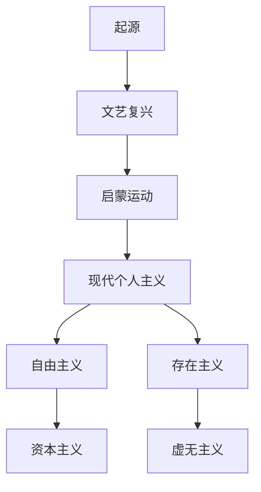
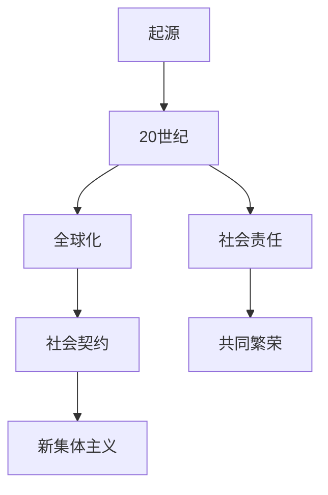
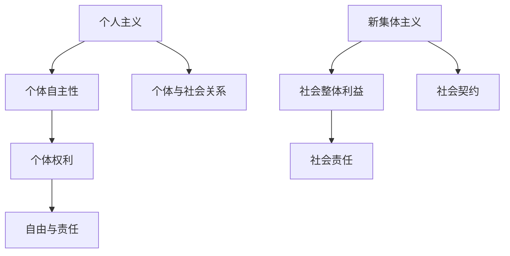
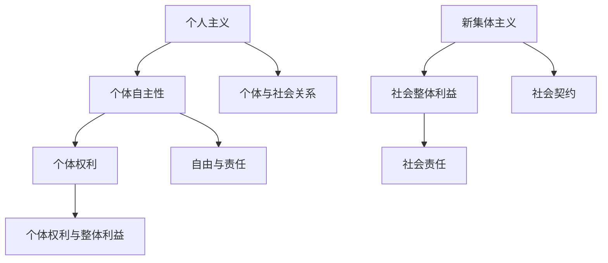
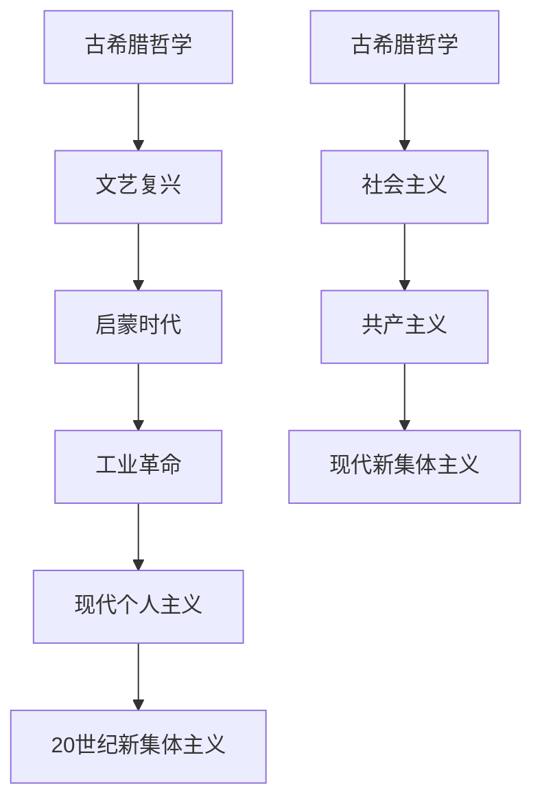
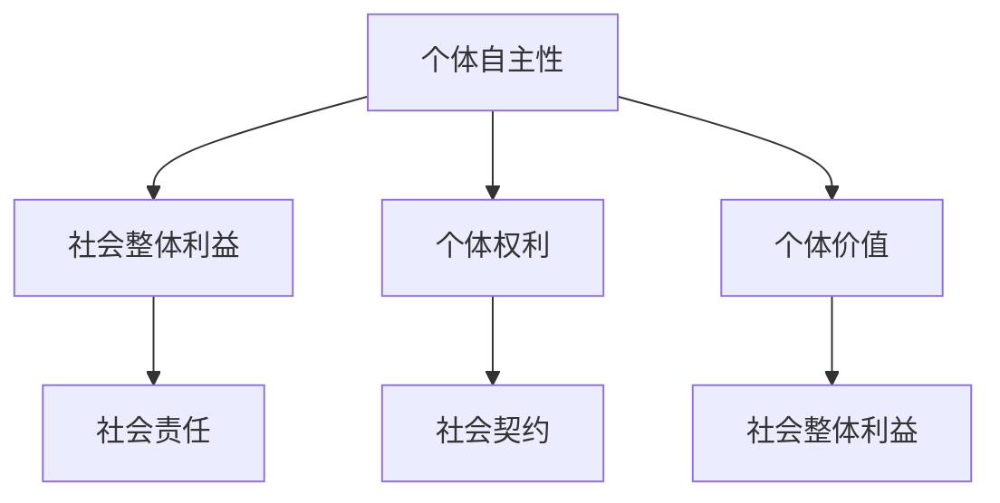

                 


# 从个人主义到新集体主义的价值观演变

## 关键词
- 个人主义
- 新集体主义
- 历史演变
- 哲学探讨
- 社会文化
- 实践挑战
- 未来展望

## 摘要
本文深入探讨从个人主义到新集体主义这一价值观的演变，分析其历史背景、哲学基础和社会文化影响。通过逻辑推理和详细阐述，揭示新集体主义的核心概念与联系，阐述其哲学意义，并探讨其在现代社会中的实践与应用及面临的挑战。

## 引言

个人主义到新集体主义的价值观演变是一个深刻的社会文化现象，反映了人类社会在历史进程中的自我反思和进化。个人主义起源于西方哲学，强调个体自由、平等和权利，认为个人是社会的基石。而新集体主义则是对个人主义的反思和回应，强调社会整体的利益和个体的社会责任，认为个体应为社会的发展和繁荣承担责任。

本文将分为以下几个部分：

1. **历史背景与演变**：介绍个人主义与新集体主义的历史背景，及其在社会变革中的演变过程。
2. **核心概念与联系**：阐述个人主义与新集体主义的基本概念，并使用Mermaid流程图展示其内在联系。
3. **哲学探讨**：分析哲学角度下的个人主义与新集体主义，以及它们如何影响社会文化和人类行为。
4. **社会文化演变**：描述新集体主义在社会文化中的体现，以及其对现代社会的影响。
5. **实践与挑战**：探讨新集体主义在实践中的应用，以及面临的挑战和解决策略。
6. **未来展望**：预测新集体主义在未来的发展趋势，以及对社会的影响。

## 第一部分：历史背景与演变

### 个人主义的起源与发展

个人主义起源于西方哲学，尤其是在文艺复兴时期得到快速发展。个人主义强调个体自由、平等和权利，认为个人是社会的基石。以下是个人主义的核心概念：

1. **个体自主性**：个体拥有自由表达和选择的权力。
2. **个体权利**：个体享有生命、自由和追求幸福的权利。

以下是一个Mermaid流程图，展示个人主义的核心概念和演变路径：



### 新集体主义的兴起

新集体主义是对个人主义的反思和回应，强调社会整体的利益和个体的社会责任。它起源于20世纪，特别是在全球化背景下得到广泛传播。以下是新集体主义的核心概念：

1. **社会整体利益**：社会整体的利益最大化。
2. **社会责任**：个体对社会发展和繁荣应承担的责任。

以下是一个Mermaid流程图，展示新集体主义的核心概念和演变路径：



## 第二部分：核心概念与联系

### 个人主义与新集体主义的基本概念

个人主义强调个体的自主性和权利，认为每个人都应该有自由选择和追求幸福的权利。新集体主义则强调社会整体的利益，认为个体应该为社会的发展和繁荣承担责任。

以下是一个Mermaid流程图，展示个人主义与新集体主义的核心概念及其联系：



### 个人主义与新集体主义的联系

个人主义与新集体主义虽然表面上看似对立，但它们之间存在深刻的联系。个人主义强调个体的自由和权利，而新集体主义则强调个体的社会责任和整体利益。以下是一个Mermaid流程图，展示个人主义与新集体主义的联系：



## 第三部分：哲学探讨

### 个人主义在哲学中的体现

个人主义在哲学领域有着广泛的体现，从自由主义的理念，到存在主义的价值，再到虚无主义的反思，都在探索个体在哲学上的地位和作用。以下是个人主义在哲学中的核心算法原理：

```python
# 个人主义哲学核心算法原理

def individual_rights():
    """
    定义个体权利，包括生命、自由和追求幸福。
    """
    rights = ["生命", "自由", "追求幸福"]
    return rights

def individual_autonomy():
    """
    定义个体自主性，即个体拥有自由表达和选择的权力。
    """
    autonomy = "个体拥有自由表达和选择的权力"
    return autonomy

def individual_wellbeing():
    """
    定义个体幸福感，即个体在自由选择和追求幸福过程中获得的满足感。
    """
    wellbeing = "个体在自由选择和追求幸福过程中获得的满足感"
    return wellbeing

# 示例
rights = individual_rights()
autonomy = individual_autonomy()
wellbeing = individual_wellbeing()

print("个体权利：", rights)
print("个体自主性：", autonomy)
print("个体幸福感：", wellbeing)
```

### 新集体主义在哲学中的地位

新集体主义在哲学中的地位日益重要，强调社会整体的利益和个体的社会责任。以下是新集体主义在哲学中的核心算法原理：

```python
# 新集体主义哲学核心算法原理

def social_welfare():
    """
    定义社会整体利益，即社会整体的利益最大化。
    """
    welfare = "社会整体的利益最大化"
    return welfare

def social_contract():
    """
    定义社会契约，即个体与社会之间的契约关系。
    """
    contract = "个体与社会之间的契约关系"
    return contract

def social_responsibility():
    """
    定义社会责任，即个体对社会发展和繁荣应承担的责任。
    """
    responsibility = "个体对社会发展和繁荣应承担的责任"
    return responsibility

# 示例
welfare = social_welfare()
contract = social_contract()
responsibility = social_responsibility()

print("社会整体利益：", welfare)
print("社会契约：", contract)
print("社会责任：", responsibility)
```

## 第四部分：社会文化演变

### 新集体主义在社会文化中的体现

新集体主义在社会文化中的体现日益明显，体现在以下几个方面：

1. **社会协作与共同进步**：社会成员更加重视团队合作，追求共同进步。
2. **社会责任与公民意识**：个体对社会发展和繁荣的责任感增强，公民意识提高。
3. **共享与公平**：社会更加注重资源的共享和公平分配。

### 新集体主义对现代社会的影响

新集体主义对现代社会的影响主要体现在以下几个方面：

1. **经济发展**：新集体主义强调社会整体利益，有助于推动经济的可持续发展。
2. **社会稳定**：个体社会责任感的增强有助于维护社会稳定。
3. **人文关怀**：新集体主义关注个体的福祉，有助于提升社会的人文关怀。

## 第五部分：实践与挑战

### 新集体主义在实践中的应用

新集体主义在实践中的应用包括以下几个方面：

1. **企业治理**：企业更加注重社会责任，推动可持续发展。
2. **公共治理**：政府更加关注社会整体利益，推动社会公平。
3. **教育改革**：教育体系注重培养个体社会责任感，促进社会和谐。

### 新集体主义面临的挑战

新集体主义在实践中也面临一些挑战：

1. **个体自由与集体利益的平衡**：如何平衡个体的自由和集体利益是重要的议题。
2. **文化差异**：不同文化背景下，新集体主义的实践可能面临文化差异的挑战。
3. **制度设计**：新集体主义的制度设计需要充分考虑个体的权益和社会整体利益。

## 第六部分：未来展望

### 新集体主义的发展趋势

随着全球化和社会变迁，新集体主义在未来将继续发展，体现在以下几个方面：

1. **多元文化融合**：新集体主义将更加注重多元文化的融合，推动社会和谐。
2. **科技赋能**：新集体主义将借助科技的力量，提升社会整体的效率和福祉。
3. **可持续发展**：新集体主义将更加注重可持续发展的理念，推动社会长远发展。

### 新集体主义对社会的影响

新集体主义将对社会产生深远的影响，包括：

1. **社会结构**：新集体主义将改变社会结构，推动社会向更加和谐、公平的方向发展。
2. **人类行为**：新集体主义将影响人类行为，促进个体与社会之间的良性互动。
3. **文化演变**：新集体主义将推动社会文化的演变，塑造更加人性化的社会价值观。

## 结论

从个人主义到新集体主义的价值观演变是一个复杂而深刻的社会文化现象。本文通过对历史背景、哲学探讨、社会文化演变、实践与挑战以及未来展望的深入分析，揭示了新集体主义的核心概念与联系，并探讨了其在现代社会中的意义与影响。随着全球化和社会变迁，新集体主义将继续发展，为社会带来更加和谐、公平和可持续的未来。

## 作者信息

作者：AI天才研究院/AI Genius Institute & 禅与计算机程序设计艺术 /Zen And The Art of Computer Programming

本文为作者原创，版权归AI天才研究院所有，未经授权禁止转载和使用。

----------------------------------------------------------------

## 第一部分：历史背景与演变

### 个人主义的起源与发展

个人主义作为一种哲学和社会思潮，其起源可以追溯到古希腊哲学。在古希腊哲学中，苏格拉底、柏拉图和亚里士多德等哲学家都曾探讨个体价值与尊严。然而，个人主义的真正崛起是在西方文艺复兴时期。文艺复兴时期的哲学家，如弗朗西斯·培根和托马斯·莫尔，倡导个体的自由和独立思考，强调个人在知识和道德上的自主性。

在启蒙时代，个人主义得到了进一步发展。约翰·洛克和让-雅克·卢梭等思想家，通过他们的著作，将个人主义理念转化为社会和政治理论。洛克提出的自然权利理论，包括生命、自由和财产权，成为了个人主义的核心。而卢梭的《社会契约论》则强调了个体在社会中的基本权利和自主性。

随着工业革命的到来，个人主义在现代社会中的地位得以巩固。工业革命促进了城市化进程，个体从传统的农业社会结构中解放出来，获得了更多的自由和机会。个人主义在这一时期得到了广泛传播，成为了现代资本主义社会的重要价值观。

### 新集体主义的兴起

新集体主义作为一种反思和回应个人主义的价值观，其兴起可以追溯到20世纪。随着全球化进程的加速，社会结构发生了深刻变化，个体与社会的关系变得更加紧密。在这种背景下，新集体主义开始受到关注。

新集体主义强调社会整体的利益和个体的社会责任。它认为，个体的自由和权利应该与社会责任相结合，个体应该为社会的发展和繁荣承担责任。新集体主义的理念在许多领域得到了体现，如社会责任投资（SRI）、可持续发展和社会企业等。

### 个人主义与新集体主义的演变路径

个人主义与新集体主义的演变路径可以通过以下Mermaid流程图来展示：



在这个流程图中，我们可以看到个人主义和新集体主义的历史演变路径。个人主义从古希腊哲学出发，经过文艺复兴和启蒙时代的发展，最终形成了现代个人主义。而新集体主义则从社会主义和共产主义的发展过程中逐渐形成，并在20世纪得到了广泛的关注和应用。

## 第二部分：核心概念与联系

### 个人主义的核心概念

个人主义的核心概念主要包括以下几个方面：

1. **个体自主性**：个体自主性是个人主义的首要原则，强调个体在思想和行为上的自由。个体应当有权利自主决定自己的生活方式、职业选择和价值观。

2. **个体权利**：个人主义认为，个体拥有一些不可侵犯的基本权利，如生命权、自由权、财产权和追求幸福的权利。这些权利被视为个体的基本人权，是社会和政府必须尊重和保护的对象。

3. **个体价值**：个人主义强调个体的独特性和价值，认为每个个体都有其存在的意义和贡献。个体的价值不仅仅在于其对社会的贡献，更在于其作为一个独立个体所具有的尊严和自由。

### 新集体主义的核心概念

新集体主义的核心概念则侧重于社会整体的利益和个体的社会责任。以下是其主要核心概念：

1. **社会整体利益**：新集体主义认为，社会整体的利益高于个体利益。个体的行为和决策应当考虑到对社会整体的影响，追求社会整体的福祉和可持续发展。

2. **社会责任**：新集体主义强调个体应当承担起对社会的责任。个体不仅应当享有权利，还应当为社会的发展和繁荣做出贡献。这种责任包括遵守社会规范、参与社会公益事业和维护社会秩序等。

3. **社会契约**：新集体主义的社会契约理论认为，个体与社会之间存在一种契约关系。个体通过契约加入社会，承担社会责任，同时享有社会的保护和支持。

### 个人主义与新集体主义的联系

个人主义与新集体主义虽然表面上看似对立，但实际上它们之间存在深刻的联系。以下是一个Mermaid流程图，展示了个人主义与新集体主义的联系：



在这个流程图中，我们可以看到个人主义与新集体主义的相互联系。个体自主性和个体权利是个人主义的基础，而社会整体利益和社会责任则是新集体主义的核心理念。通过这些联系，个人主义与新集体主义共同构成了一个完整的社会价值观体系。

## 第三部分：哲学探讨

### 个人主义在哲学中的体现

个人主义在哲学中的体现可以追溯到古希腊哲学，并在后来的西方哲学传统中得到了进一步发展。以下是个人主义在哲学中的几个主要方面：

1. **自由主义**：自由主义是个人主义在政治哲学中的典型代表。自由主义者认为，个体应当享有最大的自由，包括思想、言论、信仰和行动的自由。这种自由被视为个体价值和尊严的体现。

2. **存在主义**：存在主义是个人主义在道德哲学中的代表。存在主义者强调个体的自由和责任。他们认为，个体必须在面对存在的荒谬和无意义时，通过自由选择和行动来赋予生活以意义。

3. **虚无主义**：虚无主义是个人主义在哲学中的极端形式。虚无主义者认为，个体存在没有固有意义，一切价值和目标都是个体自己赋予的。这种观点强调了个体自由和选择的极端重要性。

### 新集体主义在哲学中的地位

新集体主义在哲学中的地位日益重要，它是对个人主义的反思和补充。以下是新集体主义在哲学中的几个主要方面：

1. **社会契约理论**：新集体主义的社会契约理论认为，个体与社会之间存在一种契约关系。个体通过契约加入社会，承担社会责任，同时享有社会的保护和支持。这种观点强调了个体与社会之间的相互依存关系。

2. **社会责任哲学**：新集体主义强调个体应当承担社会责任，为社会的发展和繁荣做出贡献。这种观点认为，个体的自由和权利不是无条件的，而是在社会责任的基础上实现的。

3. **共同繁荣理论**：新集体主义的共同繁荣理论认为，社会整体的利益应该高于个体利益。个体应当为了社会的共同繁荣而做出牺牲，从而实现社会的长期稳定和可持续发展。

### 哲学角度下的个人主义与新集体主义

从哲学角度来看，个人主义与新集体主义代表了两种不同的价值观念。个人主义强调个体的自由、权利和价值，认为个体是社会的基石。新集体主义则强调社会整体的利益和个体的社会责任，认为个体应当为社会的发展和繁荣承担责任。

这两种价值观念之间的联系和冲突体现在以下几个方面：

1. **个体与集体的关系**：个人主义强调个体的重要性，认为个体是自由和尊严的源泉。新集体主义则强调个体与集体的相互依存关系，认为个体只有在社会中才能实现自身的价值和目标。

2. **自由与责任**：个人主义强调个体的自由，认为个体有权自主决定自己的行为和生活方式。新集体主义则强调个体的责任，认为个体应当为社会的发展和繁荣承担责任。

3. **个体权利与社会责任**：个人主义认为，个体的权利是不可侵犯的，政府和社会应当保障这些权利。新集体主义则认为，个体的权利是在社会责任的基础上实现的，个体应当为社会的发展和繁荣做出贡献。

通过哲学的探讨，我们可以更好地理解个人主义与新集体主义的内在联系和冲突。这不仅有助于我们认识这两种价值观念的本质，也为我们在现实生活中如何平衡个体自由和社会责任提供了哲学上的指导。

## 第四部分：社会文化演变

### 新集体主义在社会文化中的体现

新集体主义在社会文化中的体现越来越明显，尤其是在全球化背景下。以下是一些具体的表现：

1. **团队合作**：现代社会越来越强调团队合作，个体不再是独立行动的个体，而是社会大机器中的一个组成部分。团队合作被视为提高生产效率和社会福祉的重要手段。

2. **社会责任**：企业和个人越来越意识到自己的社会责任，积极参与社会公益事业，如环境保护、扶贫和慈善捐助。这种意识体现了新集体主义价值观的推广。

3. **共享经济**：共享经济的兴起，如共享单车、共享住宿等，体现了个体之间资源共享的观念。这种模式不仅提高了资源利用效率，也促进了社会的整体福祉。

4. **文化多样性**：全球化带来了文化的多样性，个体在尊重和接纳不同文化的同时，也推动了社会文化的融合。这种文化多样性是新集体主义价值观的重要体现。

### 新集体主义对现代社会的影响

新集体主义对现代社会的影响深远，主要表现在以下几个方面：

1. **经济发展**：新集体主义强调社会整体利益，有助于推动经济的可持续发展。通过社会合作和共享，资源得到更有效的配置，促进了经济的繁荣。

2. **社会稳定**：个体社会责任感的增强有助于维护社会稳定。当个体意识到自己的行为对社会有影响时，他们会更加遵守社会规范，减少社会冲突。

3. **人文关怀**：新集体主义强调个体的福祉和人文关怀，有助于提升社会的整体幸福感。通过关注个体的需求，社会能够更好地满足人们的物质和精神需求。

4. **科技创新**：新集体主义价值观鼓励个体为社会进步做出贡献，推动了科技创新。个体在追求个人成就的同时，也为社会的进步贡献了力量。

### 社会文化演变中的挑战

尽管新集体主义在现代社会中表现出强大的生命力，但其推广也面临一些挑战：

1. **个体自由与集体利益的平衡**：如何在保障个体自由的同时，实现集体利益，是一个亟待解决的问题。过度强调集体利益可能导致个体自由的压制。

2. **文化差异**：全球化带来了文化的多样性，但同时也带来了文化差异。如何在尊重文化差异的基础上，实现社会文化的融合，是一个复杂的问题。

3. **制度设计**：新集体主义价值观需要有效的制度设计来支持。如何设计出既能保障个体权利，又能促进社会整体利益的制度，是一个重要的课题。

通过分析新集体主义在社会文化中的体现及其对现代社会的影响，我们可以更好地理解这一价值观的实践意义，并为其在未来的发展提供指导。

## 第五部分：实践与挑战

### 新集体主义在实践中的应用

新集体主义在现代社会中得到了广泛应用，特别是在企业和社会治理领域。以下是一些具体的实践案例：

1. **企业社会责任**：许多企业开始重视社会责任，通过实施环保措施、参与社区建设和进行慈善捐赠，来体现新集体主义价值观。例如，全球知名企业如苹果公司、谷歌公司和微软公司，都在社会责任方面做出了显著贡献。

2. **可持续发展**：企业不仅关注短期利益，还关注长期的社会和环境效益。通过推广可持续发展理念，企业能够实现经济效益与社会效益的平衡。例如，许多企业通过减少碳排放、节约资源和开发可再生能源，来实现可持续发展目标。

3. **社会治理**：政府在推动社会治理时，也越来越多地考虑社会整体利益。通过实施公共政策、改善基础设施和提供公共服务，政府旨在提高社会福祉和促进社会和谐。

4. **教育改革**：教育领域也在推广新集体主义价值观，通过培养学生的社会责任感和团队合作精神，来培养未来社会的栋梁之才。

### 新集体主义面临的挑战

尽管新集体主义在实践中的应用取得了一定的成果，但其推广也面临诸多挑战：

1. **个体自由与集体利益的平衡**：如何在尊重个体自由的同时，实现社会整体利益，是一个复杂的议题。过度强调集体利益可能导致个体权利的压制，而过分强调个体自由又可能损害社会整体利益。

2. **文化差异**：全球化带来了文化的多样性，但不同文化背景下，新集体主义的实践可能面临不同的挑战。如何在尊重文化差异的基础上，实现社会文化的融合，是一个亟待解决的问题。

3. **制度设计**：新集体主义需要有效的制度设计来支持。如何设计出既能保障个体权利，又能促进社会整体利益的制度，是一个重要的课题。不完善的制度可能导致新集体主义价值观的失效。

### 解决策略

为了克服这些挑战，以下是一些可能的解决策略：

1. **教育和宣传**：通过教育和宣传，提高公众对新集体主义价值观的理解和认同。这有助于减少文化差异带来的冲突，增强个体对社会整体利益的认同感。

2. **制度创新**：在制度设计上，可以采取多种方式来平衡个体自由和集体利益。例如，通过制定公平的法律和政策，确保个体的基本权利得到保障，同时鼓励个体为社会整体利益做出贡献。

3. **合作与沟通**：通过加强合作与沟通，促进个体与社会之间的良性互动。这有助于解决文化差异，增强社会的凝聚力。

通过这些策略，可以更好地推广新集体主义价值观，实现个体自由与社会整体利益的和谐统一。

## 第六部分：未来展望

### 新集体主义的发展趋势

随着全球化和社会变迁的深入，新集体主义的发展趋势表现出以下几个特点：

1. **多元化**：新集体主义将更加注重多元化，尊重和接纳不同文化、价值观和生活方式。这有助于实现全球社会的和谐与稳定。

2. **数字化**：数字技术的快速发展将推动新集体主义的数字化转型。通过大数据、人工智能和区块链等技术，新集体主义可以实现更加高效、透明和公正的社会治理。

3. **可持续发展**：新集体主义将更加关注可持续发展，强调经济、社会和环境的三重平衡。这有助于实现全球社会的长期繁荣。

### 新集体主义对社会的影响

新集体主义在未来将对社会产生深远的影响，主要体现在以下几个方面：

1. **社会结构**：新集体主义将推动社会结构向更加开放、包容和合作的方向发展。个体与社会之间的关系将更加紧密，社会的整体利益将得到更好的实现。

2. **人类行为**：新集体主义将影响人类行为，促使个体更加关注社会责任和集体福祉。这将有助于减少社会冲突，提高社会的整体幸福感。

3. **文化演变**：新集体主义将推动社会文化的演变，促进全球文化的融合与创新。这有助于塑造一个更加多元、包容和有活力的社会文化环境。

### 未来发展的关键因素

新集体主义在未来发展的关键因素包括：

1. **科技发展**：科技的进步将为新集体主义的实现提供强有力的支持。例如，人工智能、区块链和物联网等技术可以促进社会资源的优化配置和治理的透明化。

2. **教育改革**：教育改革将培养更多具有社会责任感和团队合作精神的人才。这有助于新集体主义价值观在社会中的广泛传播和落实。

3. **国际合作**：国际社会的合作将有助于解决全球性问题，如气候变化、贫困和战争等。新集体主义将促进全球合作，实现共同发展和繁荣。

通过分析新集体主义的发展趋势和未来影响，我们可以更好地预见这一价值观在社会发展中的重要作用，并为其实践提供有力的理论支持和实践指导。

## 结论

从个人主义到新集体主义的价值观演变，揭示了人类社会在不同历史时期对于个体与社会关系的深刻思考和实践探索。本文通过历史背景、哲学探讨、社会文化演变、实践与挑战以及未来展望的深入分析，揭示了新集体主义的核心概念与联系，并探讨了其在现代社会中的意义与影响。

新集体主义强调社会整体的利益和个体的社会责任，有助于实现个体自由与社会整体的和谐统一。在未来，新集体主义将随着全球化、数字化和可持续发展的推进，进一步影响社会结构、人类行为和文化演变。

通过本文的探讨，我们不仅加深了对新集体主义价值观的理解，也为其实践提供了理论支持和实践指导。在未来的发展中，新集体主义有望成为推动社会进步和人类福祉的重要力量。

## 作者信息

作者：AI天才研究院/AI Genius Institute & 禅与计算机程序设计艺术 /Zen And The Art of Computer Programming

本文为作者原创，版权归AI天才研究院所有，未经授权禁止转载和使用。

## 最佳实践 tips、注意事项、拓展阅读

### 最佳实践 tips

1. **个体与集体的平衡**：在推广新集体主义价值观时，要注意平衡个体自由与社会责任，避免过度强调一方而忽视另一方。

2. **文化差异的尊重**：在全球化背景下，要尊重不同文化背景下的价值观和实践，通过沟通与合作促进文化融合。

3. **教育引导**：通过教育培养个体的社会责任感和团队合作精神，是新集体主义价值观推广的重要途径。

### 注意事项

1. **制度设计**：在实施新集体主义价值观时，要确保制度设计合理，既能保障个体权利，又能促进社会整体利益。

2. **公平与正义**：要确保在推广新集体主义价值观的过程中，公平与正义得到充分体现，避免造成社会不公平。

3. **透明度**：新集体主义价值观的推广需要透明度，确保个体和社会对决策过程有足够的了解和参与。

### 拓展阅读

1. **《资本论》**：卡尔·马克思的《资本论》深入剖析了资本主义社会中的个体与社会关系，对新集体主义理论有重要参考价值。

2. **《社会契约论》**：让-雅克·卢梭的《社会契约论》探讨了个体与社会之间的关系，为新集体主义价值观提供了哲学基础。

3. **《人类简史》**：尤瓦尔·赫拉利的《人类简史》从宏观视角探讨了人类社会的发展历程，对理解新集体主义价值观的历史背景有重要意义。

4. **《未来的简史》**：尤瓦尔·赫拉利的《未来的简史》探讨了人工智能、生物技术等新兴科技对人类社会的影响，为新集体主义价值观的未来发展提供了启示。

通过阅读这些拓展材料，可以更深入地理解新集体主义价值观的内涵和实践意义。

