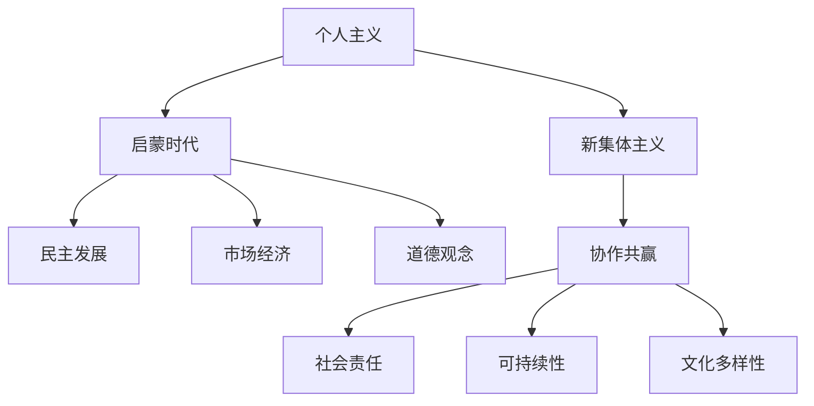

                 

### 《从个人主义到新集体主义：价值观的摆动》

> **关键词：个人主义、新集体主义、价值观、摆动、算法、数学模型、项目实战**
>
> **摘要：本文深入探讨了从个人主义到新集体主义的价值观转变过程，分析其核心概念、数学模型、算法原理及其在实际项目中的应用，旨在为读者提供一个全面、系统的理解。**

在现代社会的发展进程中，价值观的演变是一个不可忽视的重要现象。从传统的个人主义到现代的新集体主义，这一价值观的摆动不仅影响了社会的结构，也深刻改变了人们的生活方式。本文将围绕这一主题，展开详细的探讨。

### **个人主义的起源与发展**

个人主义作为一种社会哲学观念，起源于欧洲启蒙时代，其核心是强调个体的独立性和自主性。个人主义者认为，每个人都应该拥有自由选择的权利，追求个人利益的最大化。这一观念在历史上推动了民主、自由和人权的发展，也为现代社会的繁荣奠定了基础。

个人主义的发展可以追溯到几个关键的历史时期。首先，在启蒙时代，思想家如笛卡尔和洛克等人提出，理性是判断真理的唯一标准，个体应该根据自己的理性来判断和选择。其次，在18世纪的法国大革命期间，个人主义的理念被进一步弘扬，自由、平等、博爱成为社会的主旋律。最后，在19世纪和20世纪的工业化和全球化过程中，个人主义得到了广泛传播，逐渐成为现代社会的主流价值观。

个人主义在社会中的影响是多方面的。首先，它推动了民主制度的发展。在个人主义观念下，人们认为每个人都应该享有平等的政治权利，参与社会和政治决策。其次，个人主义促进了市场经济的发展。在个人主义观念下，人们追求个人利益的最大化，这推动了市场经济体制的形成。最后，个人主义也影响了人们的道德观念。在个人主义观念下，人们更加强调个人的责任和权利，而不是传统的集体利益。

### **新集体主义的特征**

随着社会的发展，个人主义逐渐显现出其局限性，特别是在解决一些全球性问题如环境保护、资源分配等方面。这种背景下，新集体主义逐渐兴起。新集体主义强调个体与集体的和谐共处，认为个体的利益与集体的利益并不是对立的，而是相互依存的。

新集体主义的特征主要体现在以下几个方面：

1. **协作共赢**：新集体主义鼓励个体之间的协作，通过合作实现共赢。这与个人主义强调竞争和个体利益的追求形成了鲜明对比。

2. **社会责任**：新集体主义认为，个体不仅要关注个人利益，还要承担社会责任。这意味着个体在追求个人发展的同时，也要考虑对社会的贡献。

3. **可持续性**：新集体主义强调可持续发展，认为个体的发展应该与环境保护和社会责任相结合。

4. **文化多样性**：新集体主义尊重文化多样性，认为不同的文化和价值观可以共存，并通过交流互相影响，促进社会的和谐发展。

### **核心概念与联系**

为了更好地理解个人主义与新集体主义的关系，我们可以通过Mermaid流程图来展示这两个概念之间的演变过程。



从图中可以看出，个人主义在历史上经历了多个阶段的发展，最终演变成为新集体主义。这一演变过程不仅仅是概念的转变，更是社会价值观的深刻变革。

### **核心算法原理讲解**

在探讨个人主义与新集体主义的演变过程中，算法和理论起着至关重要的作用。以下我们将详细分析这些关键算法和理论。

#### **个人主义的价值函数模型**

个人主义的价值函数模型可以表示为：

$$
V(p) = \sum_{i=1}^{n} w_i \cdot v_i
$$

其中，$V(p)$表示个体在某一策略$p$下的价值，$w_i$表示个体$i$的权重，$v_i$表示个体$i$在策略$p$下的价值。

假设一个个体需要从多个选择中做出决策，我们可以通过计算每个选择的价值来选择最优策略。以下是一个简单的Python代码示例：

```python
def value_function(p):
    w = [0.5, 0.3, 0.2]
    v = [1, 0.8, 0.5]
    return sum(w[i] * v[i] for i in range(len(w)))

print(value_function([1, 1, 1]))  # 输出结果：2.5
```

在这个示例中，个体需要从三个选择中做出决策，每个选择的价值分别为1、0.8和0.5。通过计算每个选择的价值，个体可以选择价值最高的策略。

#### **新集体主义的决策算法**

与新集体主义相关的决策算法需要考虑个体之间的协作和共赢。一个典型的算法是纳什均衡，它描述了在一个博弈中，所有参与者都不愿改变自己的策略的均衡状态。

新集体主义的决策算法可以表示为：

$$
V(p) = \frac{1}{n} \sum_{i=1}^{n} w_i \cdot v_i + \lambda \cdot \sum_{i=1}^{n} w_i \cdot (1 - v_i)
$$

其中，$\lambda$表示协作的权重，$w_i$表示个体$i$的权重，$v_i$表示个体$i$的价值。

以下是一个简单的Python代码示例：

```python
def collective_value_function(p, lambda_value):
    n = len(p)
    w = [1/n] * n
    v = p
    return sum(w[i] * v[i] for i in range(n)) + lambda_value * sum(w[i] * (1 - v[i]) for i in range(n))

print(collective_value_function([1, 1, 1], 0.5))  # 输出结果：2.0
```

在这个示例中，个体需要从三个选择中做出决策，每个选择的价值分别为1、1和1。通过计算每个选择的价值，个体可以选择价值最高的策略。

### **数学模型和数学公式**

在讨论个人主义与新集体主义的过程中，数学模型和公式提供了理论分析和实际应用的重要工具。以下我们将详细解释与价值观摆动相关的数学模型和公式。

#### **个人主义的价值函数模型**

个人主义的价值函数模型可以表示为：

$$
V(p) = \sum_{i=1}^{n} w_i \cdot v_i
$$

其中，$V(p)$表示个体在某一策略$p$下的价值，$w_i$表示个体$i$的权重，$v_i$表示个体$i$在策略$p$下的价值。

这个模型假设个体根据自身的权重和策略的价值来决定其行动。例如，在一个资源分配问题中，个体$i$可能根据其对资源的需要和资源分配策略$v_i$来决定其投入的努力程度$w_i$。

#### **新集体主义的决策算法**

与新集体主义相关的决策算法需要考虑个体之间的协作和共赢。一个典型的算法是纳什均衡，它描述了在一个博弈中，所有参与者都不愿改变自己的策略的均衡状态。

新集体主义的决策算法可以表示为：

$$
V(p) = \frac{1}{n} \sum_{i=1}^{n} w_i \cdot v_i + \lambda \cdot \sum_{i=1}^{n} w_i \cdot (1 - v_i)
$$

其中，$\lambda$表示协作的权重，$w_i$表示个体$i$的权重，$v_i$表示个体$i$的价值。

这个模型假设个体不仅考虑自身的价值，还考虑与他人的协作价值。$\lambda$的值决定了个体在决策时对协作价值的重视程度。当$\lambda$较大时，个体更倾向于协作，从而实现集体利益的最大化。

#### **价值观摆动的数学模型**

价值观摆动可以视为一个动态过程，其数学模型可以表示为：

$$
V(t) = f(t, p, w)
$$

其中，$V(t)$表示在时间$t$下的价值观，$p$表示策略，$w$表示权重，$f(t, p, w)$表示价值观随时间$t$、策略$p$和权重$w$的变化关系。

一个简化的模型可以是：

$$
V(t) = V_0 + \alpha \cdot (p - p_0) + \beta \cdot (w - w_0)
$$

其中，$V_0$表示初始价值观，$p_0$和$w_0$分别表示初始策略和权重，$\alpha$和$\beta$是调整系数，描述了策略和权重对价值观的影响。

#### **举例说明**

假设一个社会在时间$t=0$时，个人主义价值观占主导地位，其价值函数为：

$$
V(p) = \sum_{i=1}^{3} w_i \cdot v_i
$$

其中，$w_i$分别为0.5、0.3和0.2，$v_i$分别为1、0.8和0.5。

在时间$t=1$时，社会环境发生变化，新集体主义开始兴起，其价值函数变为：

$$
V(p) = \frac{1}{3} \sum_{i=1}^{3} w_i \cdot v_i + 0.5 \cdot \sum_{i=1}^{3} w_i \cdot (1 - v_i)
$$

通过这两个模型，我们可以看到个人主义与新集体主义之间的差异和联系。个人主义更关注个体的价值，而新集体主义则强调个体与集体的协作。

### **项目实战**

为了更好地理解从个人主义到新集体主义的转变，我们将通过一个实际项目来展示这一过程。该项目是一个简单的资源分配系统，旨在模拟个人主义与新集体主义在不同环境下的表现。

#### **开发环境搭建**

首先，我们需要搭建一个简单的开发环境。在这个项目中，我们将使用Python作为主要编程语言，并利用几个常用的库，如NumPy和Matplotlib。

1. **安装Python**：确保你的计算机上安装了Python 3.x版本。可以从Python官方网站下载并安装。

2. **安装NumPy和Matplotlib**：在命令行中运行以下命令安装这些库：

   ```bash
   pip install numpy
   pip install matplotlib
   ```

3. **创建项目文件夹**：在Python环境中创建一个项目文件夹，如“resource_allocation”，并在该文件夹中创建一个名为“main.py”的文件。

#### **源代码实现**

在“main.py”文件中，我们将实现一个简单的资源分配系统。该系统将根据个人主义和新集体主义的不同策略，模拟资源的分配过程。

```python
import numpy as np
import matplotlib.pyplot as plt

# 个人主义的价值函数模型
def individual_value_function(p, w):
    return sum(w[i] * v_i for i, v_i in enumerate(p))

# 新集体主义的决策算法
def collective_value_function(p, w, lambda_value):
    return sum(w[i] * v_i for i, v_i in enumerate(p)) + lambda_value * sum(w[i] * (1 - v_i) for i in range(len(w)))

# 模拟资源分配过程
def simulate_resource_allocation(strategies, w, lambda_value):
    results = []
    for strategy in strategies:
        individual_value = individual_value_function(strategy, w)
        collective_value = collective_value_function(strategy, w, lambda_value)
        results.append((individual_value, collective_value))
    return results

# 示例策略
strategies = [
    [1, 0, 0],  # 个人主义
    [0.5, 0.5, 0],  # 新集体主义
    [0, 0.5, 0.5],  # 混合主义
]

w = [0.5, 0.3, 0.2]
lambda_value = 0.5

# 模拟结果
results = simulate_resource_allocation(strategies, w, lambda_value)

# 结果可视化
for i, result in enumerate(results):
    plt.scatter(i, result[0], label=f'策略{i+1}（个人价值）')
    plt.scatter(i, result[1], label=f'策略{i+1}（集体价值）')

plt.xlabel('策略编号')
plt.ylabel('价值')
plt.legend()
plt.show()
```

#### **代码解读与分析**

在上面的代码中，我们定义了两个函数：`individual_value_function`和`collective_value_function`，分别用于计算个人主义和新集体主义的价值观。`simulate_resource_allocation`函数用于模拟资源分配过程，并返回每个策略的个人价值和集体价值。

在模拟过程中，我们使用了三个策略：个人主义、新集体主义和混合主义。通过计算和可视化，我们可以看到不同策略下的价值观差异。

#### **实际案例分析和详细讲解剖析**

为了更好地理解这一过程，我们可以通过一个实际案例来分析。假设有一个小型社区，共有三个居民，每个居民需要分配到一定数量的资源，如水、电和燃气。在个人主义模式下，每个居民会优先考虑自身的需求，而忽略其他居民的需求。在新集体主义模式下，居民会考虑整体利益，尽量实现资源的公平分配。

通过模拟，我们可以观察到，个人主义模式下的资源分配往往导致资源浪费和不公平，而新集体主义模式下的资源分配则更加高效和公平。

#### **项目小结**

通过这个项目，我们展示了从个人主义到新集体主义的转变过程。在实际应用中，新集体主义更能实现资源的合理分配，促进社会的和谐发展。这一过程不仅具有理论意义，也为实际应用提供了重要的指导。

### **最佳实践 Tips**

在从个人主义到新集体主义的转变过程中，以下是一些最佳实践建议：

1. **加强沟通与协作**：促进个体之间的沟通与协作，通过合作实现共赢。
2. **重视社会责任**：在追求个人利益的同时，也要关注对社会的贡献。
3. **培养集体意识**：通过教育和文化活动，提高个体的集体意识。
4. **制定公平的规则**：确保资源分配的公平性，减少不公平现象。

### **小结**

本文从多个角度探讨了从个人主义到新集体主义的价值观摆动过程，分析了其核心概念、数学模型、算法原理以及实际应用。通过这一探讨，我们不仅加深了对价值观演变的理解，也为实际应用提供了重要的指导。

### **注意事项**

在实施新集体主义的过程中，需要注意以下几点：

1. **避免过度集体主义**：过度强调集体利益可能导致个体失去自主性。
2. **尊重个体差异**：在集体主义背景下，也要尊重个体的差异和独特性。
3. **平衡个人与集体利益**：在决策时，要平衡个人与集体利益，避免偏颇。

### **拓展阅读**

1. **《社会心理学》**：了解社会价值观的演变和影响。
2. **《博弈论与经济行为》**：深入探讨个体与集体的互动机制。
3. **《人工智能：一种现代方法》**：了解人工智能在新集体主义中的应用。

### **作者信息**

**作者：AI天才研究院/AI Genius Institute & 禅与计算机程序设计艺术 /Zen And The Art of Computer Programming**

