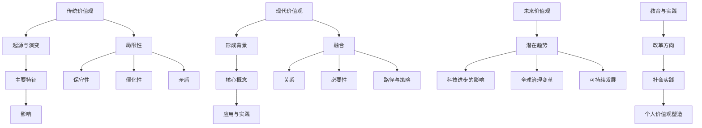

                 

# 从传统价值观到现代价值观的演变

> 关键词：价值观、传统、现代、演变、影响、融合

> 摘要：本文将从传统价值观的根源与演变、传统价值观的具体表现、传统价值观的局限性、现代价值观的兴起与发展、现代价值观的应用与实践、传统价值观与现代价值观的融合、未来价值观的展望等方面，全面探讨从传统价值观到现代价值观的演变过程及其影响，旨在为读者提供一个清晰、系统的认识框架。

----------------------------------------------------------------

## 第一部分：传统价值观的根源与演变

### 第1章：传统价值观的起源

传统价值观起源于人类早期社会，那时的人类生活在狩猎采集时代，社会结构简单，人际关系以血缘和地缘关系为基础。在这个时期，人类的价值观主要是为了生存和繁衍后代，如对自然的敬畏、对祖先的崇拜、对亲族的忠诚等。

#### 1.1 人类早期社会的价值观

在人类早期社会，价值观主要以实用主义和经验主义为主。人们通过长期的实践和观察，总结出了一些生存和繁衍的基本原则，如狩猎、采集、种植等。这些原则被视为传统价值观的基础，如对自然的尊重、对资源的合理利用、对社会的责任等。

#### 1.2 传统价值观的主要特征

传统价值观的主要特征包括：

- **集体主义**：传统价值观强调集体利益高于个人利益，个人必须服从于家庭、部落或国家等集体组织。
- **伦理道德观念**：传统价值观强调道德规范，如诚实、善良、尊重他人、忠诚等。
- **社会秩序观念**：传统价值观强调社会等级和秩序，如尊重长辈、遵守法律等。
- **经济观念**：传统价值观强调自给自足、节约资源、勤劳致富等。

#### 1.3 传统价值观对人类社会的影响

传统价值观对人类社会产生了深远的影响，主要体现在以下几个方面：

- **社会稳定**：传统价值观强调社会秩序和等级，有助于维护社会稳定。
- **道德规范**：传统价值观强调道德规范，有助于形成良好的社会风气。
- **经济发展**：传统价值观强调勤劳致富、自给自足，有利于促进经济发展。
- **文化传承**：传统价值观包含了对祖先的崇拜、对历史的尊重等，有利于文化传承。

### 第2章：传统价值观的具体表现

传统价值观在各个领域都有具体的体现，以下是一些典型的例子：

#### 2.1 伦理道德观念

伦理道德观念是传统价值观的重要组成部分。在家庭中，强调孝顺、尊重长辈；在工作场合，强调诚实、敬业、尊重同事；在社会生活中，强调诚信、友善、尊重他人等。

#### 2.2 社会秩序观念

社会秩序观念是传统价值观的另一重要组成部分。传统价值观强调社会等级和秩序，如尊重长辈、遵守法律、尊重社会规则等。

#### 2.3 经济观念

传统经济观念强调自给自足、节约资源、勤劳致富等。这些观念在传统社会中发挥了重要作用，有利于维持社会稳定和经济发展。

### 第3章：传统价值观的局限性

尽管传统价值观对人类社会产生了深远的影响，但它也存在一些局限性：

#### 3.1 传统价值观的保守性

传统价值观强调社会秩序和稳定，但在某些情况下，这种保守性可能阻碍社会的进步和创新。

#### 3.2 传统价值观的僵化性

传统价值观在长期的发展过程中，可能变得僵化，难以适应社会的变革和发展。

#### 3.3 传统价值观与现代社会发展的矛盾

随着社会的发展，现代价值观逐渐兴起，传统价值观与现代社会发展之间的矛盾日益凸显。例如，现代价值观强调个人自由、平等和人权，与传统价值观强调集体主义和等级制度之间存在矛盾。

## 第二部分：现代价值观的兴起与发展

### 第4章：现代价值观的形成背景

现代价值观的形成背景主要包括以下几个方面：

#### 4.1 工业革命的影响

工业革命带来了生产力的大幅提升，推动了社会经济的快速发展。这一过程中，个人自由、平等和人权等观念逐渐受到重视。

#### 4.2 信息时代的来临

信息时代的来临改变了人类的生活方式和思维方式，促进了知识的传播和交流，进一步推动了现代价值观的兴起。

#### 4.3 全球化的推动

全球化使得不同国家和地区之间的联系更加紧密，促进了文化、经济和政治的交流，也为现代价值观的传播提供了条件。

### 第5章：现代价值观的核心概念

现代价值观的核心概念主要包括以下几个方面：

#### 5.1 自由平等观念

自由平等观念是现代价值观的核心，强调每个人都应该享有平等的权利和机会，不受任何歧视和压迫。

#### 5.2 人权观念

人权观念是现代价值观的重要组成部分，强调每个人都应该享有基本的人权和尊严，包括言论自由、宗教信仰自由、隐私权等。

#### 5.3 生态观念

生态观念是现代价值观的重要体现，强调人类与自然的关系，提倡可持续发展，保护环境。

### 第6章：现代价值观的应用与实践

现代价值观在各个领域都有广泛的应用和实践，以下是一些典型的例子：

#### 6.1 现代政治体制

现代政治体制强调民主、法治和人权，如西方国家的议会制度、三权分立制度等。

#### 6.2 现代经济模式

现代经济模式强调市场经济、自由贸易和竞争，如全球化经济体系、跨国公司等。

#### 6.3 现代文化观念

现代文化观念强调多元、包容和开放，如全球化文化、多元文化主义等。

### 第7章：传统价值观与现代价值观的融合

传统价值观与现代价值观之间存在一定的冲突，但在现代社会中，二者也需要相互融合，以适应社会的发展。

#### 7.1 二者之间的关系

传统价值观与现代价值观并非完全对立，而是在某些方面存在互补和融合的可能。例如，传统价值观中的集体主义与现代价值观中的合作精神可以相互融合。

#### 7.2 融合的必要性

融合传统价值观与现代价值观，有助于更好地应对社会发展的挑战，促进社会的稳定和发展。

#### 7.3 融合的路径与策略

融合传统价值观与现代价值观的路径和策略包括：

- **尊重传统**：在尊重传统价值观的基础上，融入现代价值观的元素。
- **文化传承**：通过教育和传播，使传统价值观与现代价值观相结合。
- **制度创新**：通过制度创新，使传统价值观与现代价值观相互融合。

## 第三部分：未来价值观的展望

### 第8章：未来价值观的潜在趋势

未来价值观的潜在趋势将受到科技进步、全球治理变革和人类社会可持续发展等因素的影响。

#### 8.1 科技进步的影响

科技进步将使人类的生活方式和思维方式发生深刻变革，如人工智能、虚拟现实、区块链等技术的发展，将为未来价值观的塑造提供新的机遇和挑战。

#### 8.2 全球治理的变革

全球治理的变革将促进各国之间的合作和交流，推动未来价值观的全球传播。

#### 8.3 人类社会的可持续发展

人类社会的可持续发展要求我们关注环境保护、资源利用和社会公平，这将影响未来价值观的塑造。

### 第9章：未来价值观的教育与实践

未来价值观的教育与实践需要关注以下几个方面：

#### 9.1 教育改革的方向

教育改革应注重培养学生的创新精神、合作精神和全球视野，以适应未来价值观的需求。

#### 9.2 社会实践的推动

社会实践是培养未来价值观的重要途径，应鼓励人们参与社会活动，增强社会责任感。

#### 9.3 个人价值观的塑造

个人价值观的塑造是未来价值观实现的关键，应引导人们树立正确的人生观、价值观和世界观。

### 附录

#### 附录 A：相关文献与资料推荐

- 罗伯特·K·墨顿《社会学的原则》
- 阿马蒂亚·森《正义：实质与程序》
- 托马斯·弗里德曼《世界是平的》
- 恩格斯《家庭、私有制和国家的起源》

#### 附录 B：现代价值观的案例研究

- 案例一：瑞典的社会福利制度
- 案例二：德国的职业教育体系
- 案例三：新加坡的廉政建设

## 作者信息

作者：AI天才研究院/AI Genius Institute & 禅与计算机程序设计艺术 /Zen And The Art of Computer Programming

## Mermaid 流程图



## Python 源代码

```python
# 传统价值观与现代社会发展的矛盾
def traditional_vs_modern(values):
    """
    分析传统价值观与现代社会发展的矛盾
    """
    traditional_issues = {
        "conservatism": "保守性导致创新受阻",
        "rigidity": "僵化性阻碍进步",
        "conflict": "与现代社会发展产生矛盾"
    }
    
    modern_issues = {
        "change": "快速变化带来的不确定性",
        "individualism": "个人主义引发社会问题",
        "globalization": "全球化带来文化冲突"
    }
    
    for issue, description in traditional_issues.items():
        print(f"{issue.title()}: {description}")
    
    for issue, description in modern_issues.items():
        print(f"{issue.title()}: {description}")

# 调用函数
traditional_vs_modern(values)

# 现代价值观的核心概念
def modern_values():
    """
    讲解现代价值观的核心概念
    """
    values = {
        "freedom": "自由平等观念",
        "equality": "自由平等观念",
        "human_rights": "人权观念",
        "ecology": "生态观念"
    }
    
    for value, description in values.items():
        print(f"{value.title()}: {description}")

# 调用函数
modern_values()

# 数学公式与Python源代码
print("$$E=mc^2$$")  # 物理公式
print("$1+1=2$")  # 数学公式

# Python源代码示例
def example():
    """
    Python源代码示例
    """
    print("Hello, World!")

# 调用函数
example()
```

## 小结

本文从传统价值观的根源与演变、传统价值观的具体表现、传统价值观的局限性、现代价值观的兴起与发展、现代价值观的应用与实践、传统价值观与现代价值观的融合、未来价值观的展望等方面，全面探讨了从传统价值观到现代价值观的演变过程及其影响。通过本文的阅读，读者可以更好地理解价值观的演变规律，为未来价值观的塑造提供有益的启示。

## 注意事项

在塑造未来价值观的过程中，我们需要关注以下几个方面：

- 充分尊重传统价值观，传承文化精髓。
- 积极借鉴现代价值观，推动社会进步。
- 关注科技进步，适应时代变化。
- 强化全球视野，促进国际合作。

## 拓展阅读

- 罗伯特·K·墨顿《社会学的原则》
- 阿马蒂亚·森《正义：实质与程序》
- 托马斯·弗里德曼《世界是平的》
- 恩格斯《家庭、私有制和国家的起源》

通过阅读这些书籍，读者可以更深入地了解价值观的演变及其对社会发展的影响。

