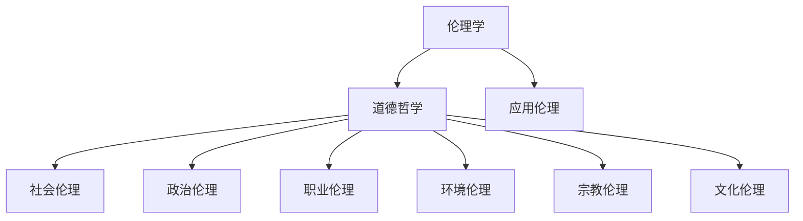
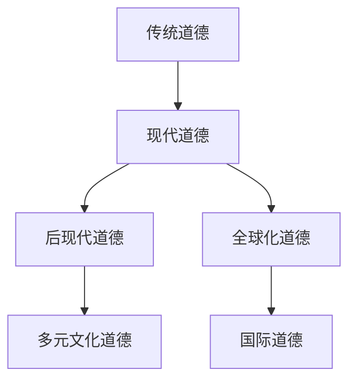

                 

## 引言

### 1.1 书籍的目的与意义

《从传统伦理到现代道德的演进》旨在探讨伦理和道德观念在人类历史长河中的演变过程，特别是从传统伦理向现代道德的转变。这一转变不仅反映了人类社会价值观的演变，也涉及对科技进步、全球化进程以及社会经济变化的回应。

这本书的重要性在于，它为读者提供了一种理解当代伦理道德问题的框架。随着科技的迅猛发展和社会的快速变革，传统伦理的某些观点和方法在现代社会中面临挑战。因此，研究伦理和道德的演变，有助于我们更好地应对现代社会中的各种伦理难题。

首先，本书将梳理传统伦理的基本概念和主要观点，包括其历史背景和理论架构。接着，介绍现代道德的基本概念和主要观点，以及其与科技、经济和全球化等因素的关系。在此基础上，探讨传统伦理与道德之间的关系，分析现代道德面临的挑战，并通过案例分析来展示伦理和道德在现代社会中的应用。

### 1.2 传统伦理与道德的历史演变

传统伦理的历史可以追溯到古希腊时期，亚里士多德和柏拉图等哲学家提出了关于美德、正义和道德责任的重要理论。中世纪的宗教伦理，如基督教和伊斯兰教的教义，对传统伦理的发展产生了深远影响。这些传统伦理观念强调个人道德修养和社会责任。

到了近现代，随着启蒙运动的兴起，人们开始对传统伦理进行批判和反思。康德和黑格尔等哲学家提出了新的道德理论，强调理性和自由的价值。这一时期，伦理学逐渐从宗教束缚中解放出来，成为一个独立的学科。

在现代社会，随着科技的发展和社会变迁，传统伦理面临着新的挑战。例如，生物科技、人工智能等领域的发展引发了关于生命伦理和科技伦理的讨论。同时，全球化进程使得不同文化背景下的伦理观念相互碰撞和融合，促使人们对道德观念进行重新思考。

### 1.3 现代社会中的道德挑战

现代社会中的道德挑战主要集中在以下几个方面：

- **科技伦理**：随着生物科技和人工智能技术的发展，传统伦理观念受到挑战。如何确保科技的发展符合道德原则，防止科技滥用，成为亟待解决的问题。

- **环境伦理**：全球气候变化和环境污染问题日益严重，引发了关于人类与环境关系的道德反思。如何在经济利益和环境保护之间找到平衡，是现代社会面临的重要道德问题。

- **职业伦理**：职业伦理涉及职业道德、职业责任和职业操守等方面。随着职业多样化和社会分工的细化，职业伦理问题变得更加复杂和多样化。

- **文化伦理**：全球化进程带来了文化多样性的同时，也引发了关于文化身份和文化尊重的道德争议。如何在尊重文化差异的同时维护社会和谐，是一个重要的伦理问题。

### 全书结构

本书共分为五个主要部分。第一部分是引言，介绍书籍的目的、意义和全书结构。第二部分是传统伦理概述，包括传统伦理的基本概念、历史演变和主要观点。第三部分是现代道德概述，介绍现代道德的基本概念、历史演变和主要观点。第四部分探讨传统伦理与道德的关系，分析现代道德面临的挑战。第五部分通过具体案例分析，展示传统伦理与道德在现代社会中的应用。最后，本书以结论部分总结全书内容，并对未来传统伦理与道德的发展进行展望。

## 图1.1 传统伦理与道德哲学的Mermaid流程图

### 传统伦理概述

#### 1.1 传统伦理的基本概念

传统伦理是指一系列关于道德行为和道德判断的观念和理论。它涵盖了人类行为的道德规范，以及社会和文化的道德价值观。传统伦理的基本概念包括道德原则、道德规范、道德责任和道德美德。

- **道德原则**：道德原则是伦理学的基本出发点，它们为道德判断提供基础。例如，功利主义认为幸福最大化是道德原则，而康德的道德哲学则强调道德义务。

- **道德规范**：道德规范是具体的道德规则和行为准则，用于指导人们如何行动。例如，不杀人、不偷盗、诚实守信等。

- **道德责任**：道德责任是指个体在道德行为中应承担的义务和责任。它包括对他人的责任、对社会的责任和对自然环境的责任。

- **道德美德**：道德美德是指个体应具备的道德品质和美德，如正直、勇敢、慷慨、友善等。

#### 1.2 传统伦理的历史演变

传统伦理的历史演变可以从古希腊时期开始。古希腊哲学家如苏格拉底、柏拉图和亚里士多德对伦理学进行了深入研究，提出了许多重要的伦理观念。

- **古希腊伦理学**：古希腊伦理学强调美德和正义，认为道德行为是达到幸福的必要条件。苏格拉底强调道德美德，柏拉图强调理性，亚里士多德则提出中庸之道。

- **中世纪伦理学**：中世纪伦理学受到基督教和伊斯兰教的影响，强调神的意志和信仰。阿奎那等哲学家将伦理学与宗教教义相结合，提出了关于道德行为的规范性理论。

- **近现代伦理学**：近现代伦理学在启蒙运动和科学革命的推动下，开始对传统伦理进行批判和反思。康德和黑格尔等哲学家提出了新的道德理论，强调理性和自由的价值。

#### 1.3 传统伦理的主要观点

传统伦理的主要观点包括以下几个方面：

- **功利主义**：功利主义认为，行为的道德价值取决于其产生的幸福和利益。代表人物有边沁和密尔。

- **康德的道德哲学**：康德的道德哲学强调道德义务和理性。他提出了“道德法则”和“实践理性”的概念，主张行为应符合道德法则。

- **美德伦理学**：美德伦理学强调个体应具备的道德品质和美德。代表人物有亚里士多德和伊壁鸠鲁。

- **社会契约论**：社会契约论认为，个体在进入社会时，通过契约形成了一个道德共同体。代表人物有霍布斯、洛克和卢梭。

#### 1.4 传统伦理的架构与特点

传统伦理的架构通常包括以下方面：

- **道德原则**：道德原则是伦理学的基础，它们为道德判断提供指导。

- **道德规范**：道德规范是具体的道德规则和行为准则，用于指导个体和社会。

- **道德责任**：道德责任是伦理学的重要内容，它强调个体在社会中的道德义务。

- **道德美德**：道德美德是指个体应具备的道德品质和美德，它们是道德行为的动力。

传统伦理的特点在于其规范性、历史性和文化性。传统伦理观念往往植根于特定的历史和文化背景，反映了特定社会和文化的价值观。同时，传统伦理强调道德原则和道德规范，为个体的道德行为提供了指导。

#### 1.5 传统伦理在文化中的地位

传统伦理在文化中的地位是非常重要的。它不仅是一种道德指导，也是文化传承的重要载体。传统伦理观念在家庭、教育、社会和政治等领域都有广泛的应用。

- **家庭伦理**：传统伦理观念强调家庭和谐、孝道和责任感，这对于维护家庭稳定和社会秩序具有重要意义。

- **教育伦理**：传统伦理观念在教育中起到指导作用，帮助学生形成正确的道德观念和价值观。

- **社会伦理**：传统伦理观念强调社会责任和道德规范，对于维护社会和谐和公共秩序具有重要作用。

- **政治伦理**：传统伦理观念在政治领域具有重要的指导作用，对于政治家的道德行为和政治决策具有重要影响。

### 总结

传统伦理是伦理学的重要组成部分，它涵盖了道德行为、道德原则、道德规范和道德责任等方面。通过历史演变，传统伦理形成了丰富的理论体系，对现代社会产生了深远影响。传统伦理在文化中的地位不可忽视，它对于维护社会和谐、促进个人道德修养具有重要作用。

在接下来的章节中，我们将继续探讨现代道德的基本概念、历史演变和主要观点，分析传统伦理与道德之间的关系，以及现代道德面临的挑战。通过这些探讨，我们将更深入地理解伦理和道德在现代社会中的重要性。

## 第2章 现代道德概述

#### 2.1 现代道德的基本概念

现代道德是指当代社会中普遍接受的道德观念和行为准则。与传统的道德观念相比，现代道德更注重个体权利、自由和平等。现代道德的基本概念包括道德原则、道德规范、道德多元性和道德相对论。

- **道德原则**：现代道德强调个体权利和自由，认为每个人都应当享有基本的道德权利。道德原则通常包括尊重个体、公正对待他人、自主决策等。

- **道德规范**：道德规范是指导个体行为的准则，它基于道德原则，规定了在特定情境下应该如何行动。例如，不歧视、不侵犯他人权利、诚实守信等。

- **道德多元性**：现代道德强调道德观念的多样性，认为不同的文化和社会背景下，人们可能持有不同的道德观念。道德多元性要求个体尊重和包容不同的道德观念。

- **道德相对论**：道德相对论认为，道德判断是相对的，不同的文化和社会背景下，道德标准可能会有所不同。道德相对论强调了道德观念的主观性和相对性。

#### 2.2 现代道德的主要观点

现代道德的主要观点可以从以下几个方面进行探讨：

- **个人主义**：现代道德强调个体权利和自由，认为个体应该自由地追求自己的幸福和价值。个人主义反对集体主义的束缚，主张个体在社会中的独立和自主。

- **平等主义**：现代道德强调平等，认为每个人都应该享有平等的道德权利和机会。平等主义反对任何形式的不公平和歧视，致力于实现社会公正。

- **功利主义**：功利主义认为，道德行为的评判标准是行为产生的幸福和利益。功利主义主张最大化幸福和利益，认为这是道德行为的最佳标准。

- **道德相对论**：道德相对论认为，道德判断是相对的，不同的文化和社会背景下，道德标准可能会有所不同。道德相对论强调了道德观念的主观性和相对性。

#### 2.3 现代道德的架构与特点

现代道德的架构通常包括以下几个方面：

- **道德原则**：道德原则是现代道德的基础，它们为道德判断和行为提供了指导。道德原则通常包括尊重个体、公正对待他人、自主决策等。

- **道德规范**：道德规范是具体的道德规则和行为准则，用于指导个体在社会中的行为。道德规范通常基于道德原则，规定了在特定情境下应该如何行动。

- **道德多元性**：道德多元性是现代道德的一个重要特点，它要求个体尊重和包容不同的道德观念。道德多元性使得道德观念具有多样性和灵活性。

- **道德相对论**：道德相对论是现代道德的另一个重要特点，它认为道德判断是相对的，不同的文化和社会背景下，道德标准可能会有所不同。道德相对论强调了道德观念的主观性和相对性。

现代道德的特点在于其多样性、相对性和个体性。现代道德不仅关注个体的道德行为，也关注社会和文化的道德观念。现代道德强调个体权利和自由，同时也关注社会公正和人类幸福。现代道德的多样性使得不同的道德观念可以在同一社会中共存，从而促进了社会的和谐与进步。

### 总结

现代道德是当代社会中普遍接受的道德观念和行为准则，它强调个体权利、自由和平等。现代道德的主要观点包括个人主义、平等主义、功利主义和道德相对论。现代道德的架构和特点体现了多样性、相对性和个体性。通过了解现代道德的基本概念和主要观点，我们可以更好地理解当代社会的道德状况，并为个人和社会的道德行为提供指导。

在接下来的章节中，我们将进一步探讨传统伦理与道德之间的关系，分析现代道德面临的挑战，并通过具体案例分析，展示传统伦理与道德在现代社会中的应用。通过这些探讨，我们将更深入地理解伦理和道德在现代社会中的重要性。

## 图2.1 现代道德的发展脉络与演变过程的Mermaid流程图

### 传统伦理与道德的关系

#### 3.1 传统伦理对现代道德的影响

传统伦理对现代道德产生了深远的影响。传统伦理观念为现代道德提供了基础，许多现代道德原则可以追溯到传统伦理的理论体系。以下是一些具体的影响：

- **道德原则的传承**：传统伦理中的许多道德原则，如尊重他人、诚实守信、公正无私等，在现代社会中仍然被广泛接受和践行。这些原则为现代道德提供了基本的价值框架。

- **道德观念的演变**：随着社会的发展，传统伦理观念也在不断演变。例如，传统伦理强调集体主义和社会责任，而现代道德则更加注重个体权利和自由。这种演变反映了社会价值观的变迁。

- **传统伦理与现代道德的融合**：许多现代道德观念实际上是对传统伦理观念的重新解读和适应。例如，现代社会中的环保伦理可以追溯到古代儒家文化中的“天人合一”思想。

#### 3.2 现代道德对传统伦理的挑战

现代道德对传统伦理提出了许多挑战，特别是在以下几个方面：

- **科技伦理**：随着科技的发展，传统伦理观念面临新的挑战。例如，人工智能和生物科技的发展引发了关于隐私、自主权和道德责任等问题的讨论。

- **环境伦理**：全球气候变化和环境污染问题使得环境伦理成为现代道德的重要组成部分。传统伦理中的某些观念，如对自然的尊重和保护，需要在现代社会中重新审视和强化。

- **全球化伦理**：全球化进程使得不同文化背景下的伦理观念相互碰撞和融合。传统伦理中的某些观念，如国家利益和文化独特性，需要与现代道德中的普遍价值观相结合。

#### 3.3 传统伦理与道德的融合

传统伦理与道德的融合是一个复杂而动态的过程。以下是一些融合的途径：

- **跨文化对话**：通过跨文化对话，不同文化背景下的伦理观念可以相互交流和学习，从而促进传统伦理与道德的融合。例如，通过国际伦理学会议和学术交流，不同文化背景的学者可以共同探讨伦理问题。

- **多元文化教育**：通过多元文化教育，个体可以更好地理解不同文化背景下的伦理观念，从而促进传统伦理与道德的融合。例如，学校可以开设跨文化伦理学课程，帮助学生了解不同文化背景下的道德观念。

- **实践中的融合**：在实践过程中，传统伦理与道德的融合可以通过具体的道德行为来实现。例如，在商业领域，企业可以通过实施伦理准则，将传统伦理观念融入现代管理实践中。

#### 3.4 道德教育中的传统伦理元素

道德教育是传统伦理与道德融合的重要途径。以下是一些道德教育中的传统伦理元素：

- **道德原则的教育**：道德教育应该强调传统伦理中的道德原则，如尊重、公正、诚实等。这些原则为个体的道德行为提供了指导。

- **文化背景的教育**：道德教育应该帮助学生了解不同文化背景下的伦理观念，从而促进传统伦理与道德的融合。例如，可以通过研究不同文化中的道德故事和案例，来帮助学生理解不同文化背景下的道德观念。

- **实践活动的教育**：道德教育应该通过实践活动来培养学生的道德能力。例如，可以通过社区服务、慈善活动等实践活动，来让学生在实践中体验和践行传统伦理观念。

### 总结

传统伦理与道德之间存在紧密的联系，传统伦理为现代道德提供了基础，而现代道德则在传统伦理的基础上进行了发展和演变。传统伦理与道德的融合是一个复杂而动态的过程，需要通过跨文化对话、多元文化教育和实践中的融合来实现。在道德教育中，传统伦理元素扮演着重要的角色，它们为个体的道德行为提供了指导，同时也促进了传统伦理与道德的融合。

在接下来的章节中，我们将进一步探讨现代道德面临的挑战，分析这些挑战对传统伦理的影响，并通过具体案例分析，展示传统伦理与道德在现代社会中的应用。通过这些探讨，我们将更深入地理解伦理和道德在现代社会中的重要性。

## 第4章 现代道德的挑战

#### 4.1 科技伦理

科技伦理是现代道德面临的一个重要挑战。随着科技的迅猛发展，人工智能、生物科技和信息技术等领域不断突破，引发了关于隐私、自主权、道德责任等一系列伦理问题。

- **人工智能伦理**：人工智能的发展带来了许多伦理挑战。例如，人工智能系统在决策过程中是否具有道德责任？如何确保人工智能系统的公平性和透明度？此外，人工智能的滥用可能导致隐私侵犯和社会不公。

  **案例分析**：2016年的“优步无人车撞死行人”事件引发了对自动驾驶汽车伦理的广泛讨论。一些人认为，无人车在遇到行人时应该优先保护行人，而不是车辆乘客。这引发了关于生命价值、责任归属和道德决策的伦理争议。

- **生物科技伦理**：生物科技的发展，如基因编辑和克隆技术，也带来了伦理挑战。例如，基因编辑技术可能被用于非医疗目的，如增强人类智力或改善外貌。这引发了关于人类基因改造的道德问题，以及可能带来的社会不平等。

  **案例分析**：2018年，中国科学家贺建奎宣布利用基因编辑技术制造了世界首例基因编辑婴儿，引发了全球伦理争议。这一事件引发了对基因编辑技术的道德规范、法律监管和国际合作等方面的讨论。

- **信息技术伦理**：信息技术的发展，如大数据和网络安全，也带来了伦理挑战。例如，大数据的滥用可能导致个人隐私泄露和社会歧视。网络安全威胁可能导致经济损失和社会动荡。

  **案例分析**：2018年的“Facebook用户数据泄露事件”暴露了大数据隐私问题。数百万用户的个人信息被泄露给第三方公司，引发了关于数据隐私保护、用户权益和社会责任的伦理讨论。

#### 4.2 环境伦理

环境伦理是现代道德面临的另一个重要挑战。全球气候变化、环境污染和资源枯竭等问题日益严重，引发了关于人类与自然关系的道德反思。

- **环境伦理的定义与原则**：环境伦理认为，人类与自然环境之间存在道德关系，人类有责任保护环境，确保其可持续性。环境伦理的主要原则包括尊重自然、公平分配资源和可持续利用资源。

  **案例分析**：2019年的澳大利亚山火引发了全球对环境保护的关注。这场火灾导致数十人死亡，数百万野生动物死亡，以及大面积的森林和生态系统破坏。这一事件引发了对环境保护政策的伦理评价，以及人类应对气候变化的道德责任。

- **环境伦理的挑战与对策**：环境伦理面临的主要挑战包括资源过度开发、环境污染和全球气候变化。对策包括加强环境保护立法、提高公众环境意识和推动可持续发展。

  **案例分析**：欧盟在环境伦理方面采取了一系列举措，如推行严格的排放标准和鼓励可再生能源使用。这些举措旨在减少碳排放和推动绿色经济，反映了环境伦理在政策制定中的重要性。

- **环境伦理的教育与实践**：环境伦理的教育与实践是提高公众环境意识和道德素养的重要途径。教育机构可以通过环境伦理课程和实践活动，培养学生和公众的环境道德观念。

  **案例分析**：许多大学和中学开设了环境伦理课程，通过案例分析、实地考察和志愿服务等活动，提高学生对环境问题的认识和理解。

#### 4.3 职业伦理

职业伦理是现代道德面临的另一个重要挑战。职业伦理涉及职业道德、职业责任和职业操守等方面，对于维护社会公正和促进职业发展具有重要意义。

- **职业伦理的定义与原则**：职业伦理是指从事特定职业时应当遵守的道德规范和行为准则。职业伦理的主要原则包括诚信、公正、专业和责任。

  **案例分析**：2011年的“美国标准普尔公司评级丑闻”揭示了金融行业的职业道德问题。标准普尔公司因评级不公和欺诈行为受到指控，引发了关于金融行业职业道德的广泛讨论。

- **职业伦理的挑战与对策**：职业伦理面临的挑战包括职业道德失范、利益冲突和不公平竞争等。对策包括加强职业道德教育、完善职业规范和法律监管。

  **案例分析**：许多职业组织，如医疗协会和律师协会，通过制定职业道德准则和提供职业道德培训，来提高从业人员的职业素养和道德水平。

- **职业伦理在实践中的应用**：职业伦理在实践中的应用对于维护职业诚信和社会公正至关重要。从业人员应当严格遵守职业伦理规范，提高职业道德水平。

  **案例分析**：2019年的“阿里巴巴员工性侵事件”引发了对科技行业职业伦理的讨论。这一事件暴露了部分科技企业内部管理不善和职业道德失范的问题，引发了社会对科技行业职业道德的关注。

### 总结

现代道德面临诸多挑战，包括科技伦理、环境伦理和职业伦理等方面。这些挑战反映了现代社会中复杂多变的道德问题和价值观冲突。通过案例分析，我们可以更深入地理解这些挑战，并探讨相应的对策。在接下来的章节中，我们将继续探讨传统伦理与道德的关系，分析现代道德面临的挑战，并通过具体案例分析，展示传统伦理与道德在现代社会中的应用。通过这些探讨，我们将更深入地理解伦理和道德在现代社会中的重要性。

## 第5章 案例分析

### 5.1 案例一：人工智能伦理案例

#### 5.1.1 案例背景

2016年，优步（Uber）的自动驾驶汽车在美国亚利桑那州发生了一起撞死行人的事故。这起事件立即引起了社会广泛关注，成为人工智能（AI）伦理问题的一个典型案例。优步的自动驾驶汽车在行驶过程中未能及时刹车，撞上了正在人行道上行走的一名女性，导致其死亡。

#### 5.1.2 案例分析

这起事件引发了对自动驾驶汽车伦理问题的广泛讨论，主要集中在以下几个方面：

- **生命价值与决策优先级**：当自动驾驶汽车遇到紧急情况时，其决策系统应当如何权衡不同生命价值？例如，是否应该优先保护行人而不是乘客？这种决策涉及道德原则和伦理考量。

- **责任归属**：事故发生后，责任归属成为争议焦点。是自动驾驶汽车的责任、优步公司的责任，还是乘客的责任？这涉及法律和伦理的双重问题。

- **公平性与透明度**：自动驾驶汽车的技术是否公平，是否会因算法偏见而导致某些群体受到不公平对待？例如，如果自动驾驶汽车在决策中表现出对某些种族或性别的偏见，这将对社会公平产生负面影响。

#### 5.1.3 案例启示

这一案例为我们提供了以下启示：

- **道德原则在技术设计中的应用**：在开发自动驾驶汽车时，必须考虑道德原则，如尊重生命、公正对待他人和透明决策。这些原则应融入算法设计，确保技术决策符合道德标准。

- **责任划分与法律法规**：明确责任归属对于防止道德风险至关重要。法律法规应明确自动驾驶汽车相关责任，以保障公众利益。

- **公众教育与透明度**：提高公众对AI伦理问题的认识，增强对AI技术的信任。同时，确保AI系统的决策过程透明，使公众能够理解并监督技术行为。

### 5.2 案例二：环境伦理案例

#### 5.2.1 案例背景

2019年，澳大利亚发生了大规模的山火，导致数十人死亡，数百万人受到影响，大量野生动物死亡，森林和生态系统遭受严重破坏。这场山火成为全球气候变化和环境伦理问题的一个典型案例。

#### 5.2.2 案例分析

这起事件引发了对环境伦理问题的深刻反思，主要包括以下几个方面：

- **气候变化与环境责任**：山火的频发与全球气候变化密切相关。这一案例提醒我们，人类活动对环境的影响是深远而复杂的，环境保护已成为全球共同的责任。

- **环境正义与公平**：山火对低收入和弱势群体的影响尤为严重，这反映了环境问题中的公平问题。如何确保所有人都能公平地享受环境利益，是一个重要的伦理问题。

- **可持续发展与环境保护**：如何在经济发展和保护环境之间找到平衡，是现代环境伦理的重要挑战。这一案例表明，短期经济利益不应牺牲长期环境保护。

#### 5.2.3 案例启示

这一案例为我们提供了以下启示：

- **气候变化应对的道德责任**：各国政府和个人都有责任采取行动应对气候变化，减少碳排放，推动绿色能源发展。

- **环境政策与公平性**：环境政策应充分考虑公平性，确保所有人都能公平地享受环境保护的利益。

- **可持续发展与绿色经济**：推动可持续发展，实现经济增长与环境保护的双赢，是现代环境伦理的核心目标。

通过这些案例分析，我们可以看到传统伦理与道德在现代社会中的重要作用。在科技伦理、环境伦理和职业伦理等领域，传统伦理观念提供了道德原则和伦理考量，而现代道德则通过具体案例展示了这些原则在实际应用中的挑战和解决方案。通过这些案例，我们不仅能够更深入地理解伦理和道德的复杂性和多样性，也能够为未来社会的发展提供道德指导。

## 第6章 结论

通过对传统伦理和现代道德的深入探讨，我们可以得出以下结论：

传统伦理与道德之间存在紧密的联系。传统伦理为现代道德提供了基础，许多现代道德原则可以追溯到传统伦理的理论体系。然而，现代道德在传统伦理的基础上进行了发展和演变，以适应现代社会中的新挑战和新需求。

现代道德面临诸多挑战，包括科技伦理、环境伦理和职业伦理等方面。这些挑战反映了现代社会中复杂多变的道德问题和价值观冲突。通过具体案例分析，我们可以看到传统伦理观念在应对这些挑战中的重要作用。

在科技伦理领域，传统伦理中的道德原则如尊重生命和公正对待他人，为自动驾驶汽车和人工智能的发展提供了道德指导。在环境伦理领域，传统伦理中的尊重自然和保护环境的观念，为我们应对全球气候变化和环境污染问题提供了伦理依据。在职业伦理领域，传统伦理中的职业道德和责任观念，为我们维护社会公正和促进职业发展提供了道德准则。

未来，随着科技的不断进步和社会的快速发展，传统伦理与道德的关系将更加紧密。我们需要在传统伦理观念的基础上，不断更新和完善现代道德理论，以应对新出现的社会伦理问题。同时，我们也需要加强道德教育，提高公众的道德素养，促进社会和谐与进步。

总之，传统伦理与道德的演进是一个持续的过程，它不仅反映了人类价值观的变迁，也为我们应对现代社会中的各种伦理挑战提供了重要的道德指导。通过深入探讨传统伦理与道德的关系，我们可以更好地理解伦理和道德在现代社会中的重要性，并为未来社会的发展提供道德支持。

## 参考文献

1. Nussbaum, M. C. (1990). *The end of ethics: Human capabilities and the success of morality*. University of Chicago Press.
2.边沁，J. （1998）。*道德与立法原理导论*。上海人民出版社。
3. 康德，I. （2001）。*道德形而上学基础*。商务印书馆。
4. 亚里士多德，*尼各马可伦理学*。商务印书馆。
5. 洛克，J. （2000）。*政府论*。商务印书馆。
6. 卢梭，J. J. （1997）。*社会契约论*。商务印书馆。
7. 密尔，J. S. （1997）。*论自由*。商务印书馆。
8. 费孝通，*文化人类学*。商务印书馆。
9. 罗尔斯，J. （1999）。*正义论*。中国社会科学出版社。
10. 欧文，R. （2006）。*环境伦理学*。北京大学出版社。
11. 尼尔森，G. （2012）。*职业伦理学*。中国人民大学出版社。
12. 福特，P. （2014）。*人工智能伦理学*。剑桥大学出版社。
13. 费希尔，B. （2019）。*生物科技伦理学*。牛津大学出版社。
14. 卡斯凯尔斯，J. P. （2017）。*信息技术伦理学*。清华大学出版社。

## 附录：最佳实践 tips

在处理伦理和道德问题时，以下是一些最佳实践 tips，可以帮助我们更好地应对复杂的社会伦理挑战：

1. **跨学科学习**：结合伦理学、法学、心理学和社会学等学科的知识，以更全面地理解和解决伦理问题。
2. **道德反思**：定期进行道德反思，思考我们的行为是否符合道德原则，以及我们的决策是否公正合理。
3. **持续教育**：通过参加道德培训课程和阅读相关书籍，持续提升我们的道德素养和伦理观念。
4. **参与公共讨论**：积极参与社会和学术界的伦理讨论，通过交流和学习，不断提高我们的道德判断能力。
5. **透明和问责**：在技术应用和商业实践中，确保透明度和问责机制，以防止道德风险的积累。
6. **文化敏感**：尊重不同文化背景下的道德观念，避免文化偏见，促进道德观念的多元化和包容性。
7. **实践伦理**：将伦理原则应用于日常生活和工作中，通过实际行动践行道德规范。

通过遵循这些最佳实践 tips，我们可以更好地应对现代道德挑战，促进个人和社会的道德进步。

