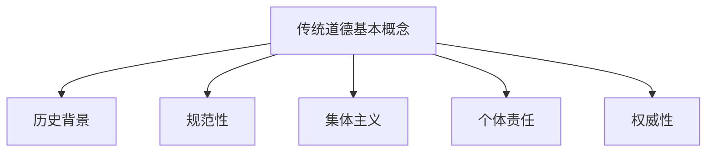
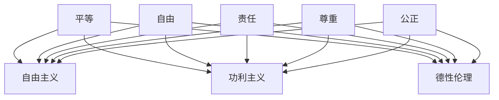
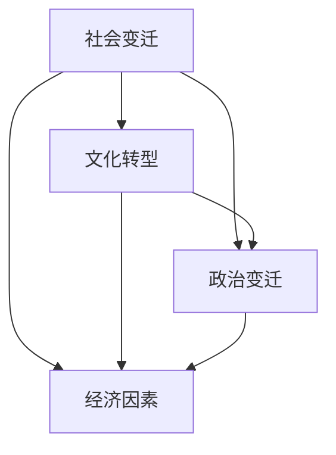

                 

### 引言

在人类文明的发展历程中，道德和伦理一直扮演着至关重要的角色。它们不仅规范了社会行为，也塑造了人类的价值观和生活态度。然而，随着时代的变化，道德和伦理也在不断地演进和重塑。本文将深入探讨从传统道德到现代伦理的演变过程，以及这一过程中的核心概念和原理。

传统道德通常指的是古代社会和宗教背景下形成的道德规范和价值观。它们根植于特定的文化和社会背景中，强调集体利益、社会秩序和宗教信仰。例如，在古代希腊和罗马，道德教育被视为公民教育的重要组成部分，而宗教教义则在许多社会中起到了道德规范的指导作用。

现代伦理则是在现代社会中形成的，强调个体权利、自由和平等。随着科技的发展、社会的变迁以及全球化进程的加速，现代伦理越来越注重道德相对主义和多元文化主义。现代伦理不仅关注个体的行为，还涉及到更广泛的社会和环境问题。

本文将按照以下结构展开：

1. **传统道德概述**：介绍传统道德的基本概念、历史背景和主要特征。
2. **现代伦理概述**：探讨现代伦理的核心原则、理论与实践。
3. **价值观的演变过程**：分析传统道德向现代伦理转变的原因和过程。
4. **重塑价值观的挑战与策略**：讨论现代社会中重塑价值观面临的挑战和可能的策略。
5. **社会实践与案例研究**：通过具体的社会实践案例和研究成果，展示价值观重塑的实际应用。
6. **结论与展望**：总结全书的核心观点，并对未来价值观的发展趋势进行展望。

通过这一系列的探讨，我们希望能够清晰地理解道德和伦理的演变，以及如何在现代社会中有效地重塑价值观。

### 传统道德概述

传统道德通常指的是古代社会和宗教背景下形成的道德规范和价值观。它们在不同的文化和社会中有着不同的表现形式，但通常都强调集体利益、社会秩序和宗教信仰。以下将从历史背景、基本概念、主要特征三个方面对传统道德进行概述。

#### 历史背景

传统道德的历史可以追溯到古代文明。在古希腊和古罗马，道德教育被视为公民教育的重要组成部分。古希腊哲学家如苏格拉底、柏拉图和亚里士多德等，对道德哲学进行了深入的探讨，并提出了许多影响深远的道德观念。古罗马则强调法律和道德的紧密联系，认为道德是维护社会秩序和公共利益的基础。

在中世纪，宗教对道德的影响尤为显著。基督教、伊斯兰教和佛教等宗教教义成为道德规范的重要来源，强调对神灵的忠诚、对社会的责任和对个人行为的规范。这一时期的道德观念强调来世的奖惩和对神圣法律的遵守。

#### 基本概念

传统道德的基本概念主要包括正义、公平、责任、义务和忠诚等。这些概念在不同的文化和社会中有不同的表现，但都强调个体与集体、个人与社会之间的关系。例如，在古希腊，正义被视为最高的道德原则，而亚里士多德则提出了中庸之道，强调道德行为应该适度。

在中世纪，宗教道德观念占据主导地位，强调信仰、忠诚和慈善。例如，基督教强调对上帝的忠诚、对邻居的爱和对贫穷者的关怀；伊斯兰教强调对神灵的敬畏、对社会的责任和对公正的追求。

#### 主要特征

传统道德的主要特征之一是它的规范性和权威性。传统道德通常由特定的权威机构或宗教教义来定义和指导，例如法律、宗教教义和道德规范。这些权威机构或教义被视为道德规范的来源，个体必须遵守这些规范以维护社会秩序和公共利益。

另一个特征是它的集体主义取向。传统道德强调集体利益和社会秩序，认为个体的行为应该服从于更大的社会利益。这种集体主义的取向在许多社会中表现为家庭、部落或国家等集体单位的利益优先。

传统道德还强调道德责任的个体化。个体不仅对自己的行为负责，还对整个社会和集体负责。这种责任意识体现在对社会责任的承担、对他人的尊重和对他人的关怀上。

#### Mermaid流程图

为了更好地理解传统道德的基本概念和特征，我们可以通过Mermaid流程图来展示这些概念之间的联系。



通过这个流程图，我们可以清晰地看到传统道德的基本概念、历史背景和主要特征之间的联系。例如，历史背景影响了传统道德的形成，而规范性和权威性则保障了传统道德的执行和传承。

#### 核心算法原理讲解

尽管传统道德更多地依赖于社会规范和宗教教义，但我们可以尝试用一种算法思维来解释传统道德的核心原理。以下是一个简化的Python代码示例，展示了如何用逻辑推理来模拟传统道德的基本原则。

```python
# 定义传统道德的基本原则
def moral原则(行为, 社会规范):
    # 如果行为违反了社会规范
    if 行为 not in 社会规范:
        # 判断行为是否符合道德
        return "不道德"
    else:
        # 判断行为是否符合正义、公平等核心原则
        if 符合核心原则(行为):
            return "道德"
        else:
            return "不道德"

# 定义核心原则的判断函数
def 符合核心原则(行为):
    # 示例：这里我们用简单的逻辑判断
    # 实际应用中可以更加复杂
    return (行为不是自私的 and 行为不伤害他人)

# 测试代码
行为 = "偷窃"
社会规范 = ["尊重他人财产", "遵守法律"]
结果 = moral原则(行为, 社会规范)
print(结果)  # 输出：不道德
```

这个代码示例展示了如何通过简单的逻辑判断来模拟传统道德的基本原则。虽然传统道德的执行和评估远比这个示例复杂，但这个示例为我们提供了一个简化的视角来理解传统道德的核心原理。

#### 数学模型和公式

在传统道德中，一些数学模型和公式可以用来描述道德行为和社会规范之间的关系。以下是一个简化的数学模型，用于描述道德行为的得分。

$$
\text{道德得分} = \frac{\text{符合社会规范的行为数}}{\text{总行为数}} \times 100\%
$$

这个公式表明，道德得分是符合社会规范的行为数与总行为数的比例，通过百分比的形式来表示。例如，如果一个个体在10次行为中有7次符合社会规范，那么他的道德得分就是70%。

通过这个数学模型，我们可以量化地评估个体的道德行为，从而为道德教育和道德规范提供更科学的依据。

#### 结论

传统道德作为一种社会规范和价值观，在历史上扮演了重要的角色。它不仅规范了社会行为，也塑造了人们的道德观念和行为准则。通过历史背景、基本概念和主要特征的介绍，我们可以更深入地理解传统道德的内涵。同时，通过Mermaid流程图、Python代码示例和数学模型，我们能够从不同的角度来分析传统道德的核心原理。

然而，传统道德并不是一成不变的，它需要随着社会的发展和变迁而不断调整和重塑。在下一部分中，我们将探讨现代伦理的核心原则和理论，以及它们与传统道德的区别和联系。

### 现代伦理概述

现代伦理与传统的道德观念有所不同，它更强调个体权利、自由和平等。随着社会的发展和科技的进步，现代伦理在面对全球化、多元文化和环境问题等方面提出了新的挑战和思考。以下将从核心原则、理论和实践三个方面对现代伦理进行概述。

#### 核心原则

现代伦理的核心原则主要包括平等、自由、责任、尊重和公正。这些原则不仅体现了对个体权利的尊重，也关注社会整体福祉。

1. **平等**：平等原则强调每个人都应该享有平等的尊严和机会，无论其性别、种族、文化或社会地位。这一原则在现代社会中尤为重要，因为它推动了社会正义和公平。

2. **自由**：自由原则认为个体有权自主决定自己的行为，并追求个人利益和幸福。然而，自由并不是无限制的，它需要在法律和社会规范的框架内实现。

3. **责任**：责任原则要求个体对其行为和决策负责，不仅对自己的行为负责，还要对社会和环境负责。

4. **尊重**：尊重原则强调对他人权利和尊严的尊重，包括尊重他人的意见、信仰和生活方式。

5. **公正**：公正原则要求社会资源和机会的分配应该是公平的，确保每个人都能获得应得的利益。

#### 理论与实践

现代伦理的理论基础主要源于自由主义、功利主义和德性伦理等哲学流派。以下分别简要介绍这些流派的基本观点。

1. **自由主义**：自由主义认为个体的自由是最重要的价值，政府和社会应该保护个体的自由，同时确保社会的稳定和安全。自由主义强调个人权利和自由选择，认为政府的主要职责是提供平等的法律保护和维护社会秩序。

2. **功利主义**：功利主义强调最大化社会整体的幸福和利益。其基本观点是，一个行为是否道德，取决于它能否带来最大的幸福和最小的痛苦。功利主义在道德决策中常常考虑行为的后果，而不是行为本身的性质。

3. **德性伦理**：德性伦理强调个体的道德品质和道德行为，认为个体的道德价值不仅仅取决于其行为的结果，更取决于其行为背后的动机和品质。德性伦理关注个体如何成为一个有道德的人，而不仅仅是做出正确的选择。

现代伦理的实践体现在多个方面，包括法律、教育和公共政策等。以下是一些现代伦理在实践中的具体表现：

1. **法律**：现代法律体系强调保护个体权利和公正，例如通过反歧视法、人权法和环境保护法等，确保每个人都能够享有平等的权益。

2. **教育**：教育是培养个体道德意识和社会责任感的重要途径。现代教育注重道德教育，通过课程设置和实践活动，帮助学生理解和践行道德原则。

3. **公共政策**：公共政策在制定时需要考虑伦理原则，例如在医疗、环境和社会福利等方面，政策制定者需要权衡不同利益，确保公共资源的公平分配。

#### Mermaid流程图

为了更好地理解现代伦理的核心原则和理论，我们可以通过Mermaid流程图来展示这些原则之间的联系。



这个流程图展示了现代伦理的核心原则与不同哲学流派之间的联系，帮助我们更清晰地理解现代伦理的理论基础和实践应用。

#### 核心算法原理讲解

为了更深入地理解现代伦理的核心原则，我们可以使用Python来模拟一些伦理决策过程。以下是一个简单的示例，展示了如何用代码来处理一个道德困境，并尝试根据现代伦理原则做出决策。

```python
# 定义伦理决策函数
def 伦理决策(行为, 原则):
    if 原则 == "平等":
        return "平等原则要求公平对待每个人，这种行为是否符合平等原则？"
    elif 原则 == "自由":
        return "自由原则强调个体的选择权，这种行为是否侵犯了他人自由？"
    elif 原则 == "责任":
        return "责任原则要求个体对自己的行为负责，这种行为是否承担了应有的责任？"
    elif 原则 == "尊重":
        return "尊重原则要求尊重他人的权利和尊严，这种行为是否尊重了他人？"
    elif 原则 == "公正":
        return "公正原则要求公平对待每个人，这种行为是否公平合理？"
    else:
        return "未知原则"

# 测试代码
行为 = "在工作面试中歧视某个种族的候选人"
原则 = "平等"
结果 = 伦理决策(行为, 原则)
print(结果)  # 输出：平等原则要求公平对待每个人，这种行为是否符合平等原则？
```

这个代码示例通过简单的条件判断，展示了如何根据不同的伦理原则来评估一个行为是否符合现代伦理的要求。在实际应用中，伦理决策往往更加复杂，需要考虑多种因素和原则。

#### 数学模型和公式

现代伦理的决策过程常常需要量化评估，以下是一个简化的数学模型，用于评估个体行为是否符合伦理原则。

$$
\text{伦理得分} = \frac{\text{符合伦理原则的行为数}}{\text{总行为数}} \times 100\%
$$

这个公式表明，伦理得分是符合伦理原则的行为数与总行为数的比例。通过这个分数，我们可以量化地评估个体的伦理行为，为道德教育和伦理决策提供依据。

#### 结论

现代伦理在传统道德的基础上，加入了更多关于个体权利和自由的思考。它不仅关注个体的行为，还关注社会整体的福祉和公平。通过核心原则、理论和实践三个方面，我们可以更深入地理解现代伦理的内涵。同时，通过Mermaid流程图、Python代码示例和数学模型，我们能够从不同的角度来分析现代伦理的核心原理。

尽管现代伦理在许多方面与传统道德有所不同，但两者之间也存在一定的联系。在下一部分中，我们将探讨价值观的演变过程，并分析传统道德向现代伦理转变的原因和机制。

### 价值观的演变过程

从传统道德到现代伦理的转变是一个复杂且持续的过程，它受到多种因素的影响，包括社会、文化、政治和经济因素。在这一部分中，我们将详细分析这些因素如何共同作用，推动价值观的演变。

#### 社会变迁

社会变迁是推动价值观演变的重要因素之一。随着社会结构的变迁，人们的生活方式、价值观念和社会行为也随之改变。例如，在工业革命之前，农业社会强调的是土地和家族关系，而工业革命后，城市化进程加速，个体主义和竞争意识逐渐取代了集体主义和合作精神。这种社会变迁导致传统道德观念的解构，并为现代伦理的形成提供了土壤。

具体而言，城市化进程导致了人口流动和多样性增加，个体与集体之间的关系发生了变化。传统道德中的家庭和社区纽带被削弱，个体独立性增强，这促使人们开始重新思考道德规范的基础和适用范围。

#### 文化转型

文化转型是价值观演变的另一个关键因素。不同文化对道德和伦理有不同的理解，文化间的交流与碰撞常常引发道德观念的变革。例如，全球化进程使得不同文化之间的互动日益频繁，西方自由主义和人权观念在全球范围内传播，对传统道德观念形成了冲击。

文化转型还体现在本土文化的现代化进程中。许多发展中国家在现代化过程中，传统道德与现代伦理之间的冲突愈发明显。一方面，传统道德中的集体主义和家庭观念仍然具有强大的影响力；另一方面，现代伦理强调个体权利和自由，这种冲突促使社会在价值观上寻求新的平衡。

#### 政治变迁

政治变迁也是影响价值观演变的重要因素。政治体制的变化、政策制定和社会治理方式的不同，都会对道德和伦理观念产生影响。例如，民主政治体制通常强调个体权利和自由，这为现代伦理的发展提供了制度保障。相反，在集权体制下，传统道德观念可能更强调集体利益和社会秩序。

政治变迁还体现在国际关系和政治互动中。全球化时代的国际政治使得国家间的道德观念相互影响。国际组织和多边合作推动了全球伦理观念的形成，如环境保护、人权和国际公正等议题。

#### 经济因素

经济因素在价值观演变过程中起着重要作用。经济发展水平和社会财富分配方式直接影响人们的价值观念。经济繁荣通常伴随着个人主义和自由主义的兴起，而经济不平等可能导致对传统道德观念的回归，如强调家庭和社区的团结。

经济全球化也改变了人们的价值观。全球市场和经济交流使得个体面临的道德困境更加复杂，例如跨国公司的道德责任、全球环境问题等。这些经济因素促使现代伦理观念不断调整和进化，以应对新的挑战。

#### Mermaid流程图

为了更好地理解价值观演变过程的关键因素及其相互作用，我们可以通过Mermaid流程图来展示这些因素之间的联系。



这个流程图展示了社会、文化、政治和经济因素如何共同推动价值观的演变。每个因素都通过不同的途径影响道德和伦理观念的变迁，同时这些因素之间也存在相互影响。

#### 核心算法原理讲解

为了深入理解价值观演变过程中的核心算法原理，我们可以通过Python代码来模拟一个简化的模型。以下是一个示例代码，展示了如何用算法分析社会变迁对道德观念的影响。

```python
# 定义社会变迁对道德观念的影响函数
def 社会变迁影响(传统道德, 社会变迁因素):
    # 根据社会变迁因素调整道德观念
    if 社会变迁因素 == "城市化":
        传统道德 = 调整传统道德(城市化影响)
    elif 社会变迁因素 == "全球化":
        传统道德 = 调整传统道德(全球化影响)
    elif 社会变迁因素 == "经济繁荣":
        传统道德 = 调整传统道德(经济繁荣影响)
    else:
        传统道德 = 调整传统道德(其他影响)

    return 传统道德

# 定义道德观念调整函数
def 调整传统道德(影响类型):
    # 根据影响类型调整道德观念
    if 影响类型 == "城市化":
        return "增加个体独立性，减少集体主义"
    elif 影响类型 == "全球化":
        return "增加文化多样性，促进全球伦理观念"
    elif 影响类型 == "经济繁荣":
        return "增加个人主义，减少对集体利益的强调"

# 测试代码
传统道德 = ["强调家庭和社区关系", "重视集体利益"]
社会变迁因素 = "城市化"
新道德观念 = 社会变迁影响(传统道德, 社会变迁因素)
print(new道德观念)  # 输出：增加个体独立性，减少集体主义
```

这个代码示例通过简单的条件判断，模拟了社会变迁对传统道德观念的影响。在实际应用中，这一模型可以进一步复杂化，以更好地反映真实世界中的道德变迁。

#### 数学模型和公式

为了量化社会变迁对道德观念的影响，我们可以使用以下数学模型来评估道德观念的变化程度。

$$
\text{道德观念变化程度} = \frac{\text{新道德观念得分} - \text{传统道德观念得分}}{\text{传统道德观念得分}} \times 100\%
$$

这个公式表明，道德观念的变化程度是新道德观念得分与传统道德观念得分的差值占传统道德观念得分的百分比。通过这个公式，我们可以量化评估道德观念在社会变迁中的变化。

#### 结论

价值观的演变是一个复杂的过程，受到社会、文化、政治和经济等多种因素的共同影响。通过分析这些因素，我们可以更深入地理解传统道德向现代伦理转变的原因和机制。同时，通过Mermaid流程图、Python代码示例和数学模型，我们能够从不同的角度来分析这一演变过程。

在现代社会中，道德和伦理观念的持续演变不仅影响个人行为，也影响社会结构和政策制定。在下一部分中，我们将探讨现代社会中重塑价值观面临的挑战和策略，为未来价值观的持续发展提供参考。

### 重塑价值观的挑战与策略

在现代社会中，随着科技的快速发展、全球化进程的深入以及社会多样性的增加，重塑价值观面临着前所未有的挑战。这些挑战不仅影响到个人的道德判断和行为，也对社会结构和公共政策产生深远的影响。以下将探讨现代社会中重塑价值观面临的挑战，并提出相应的策略。

#### 挑战之一：全球化与多元文化的冲击

全球化使得不同文化之间的交流和碰撞变得更加频繁，这种多元文化的交流在带来文化多样性的同时，也引发了价值观的冲突和融合。传统道德观念和现代伦理原则在不同文化背景下可能存在显著差异，这种差异使得重塑价值观变得复杂。

**策略**：
1. **加强跨文化交流与理解**：通过教育和文化交流，增进不同文化之间的理解和尊重，减少文化冲突。
2. **培养多元文化意识**：在教育和培训中强调多元文化的重要性，培养个体对不同文化的包容和理解能力。
3. **制定文化融合政策**：政府和社会组织可以制定相关政策和措施，促进文化融合，构建包容性社会。

#### 挑战之二：科技发展与伦理边界的模糊

科技的迅猛发展不仅改变了人们的生活方式，也带来了伦理边界的模糊。例如，人工智能、大数据和生物技术等领域的突破，使得道德决策变得更加复杂。科技的发展有时会超越伦理规范的发展，导致新的伦理困境。

**策略**：
1. **建立科技伦理框架**：制定明确的科技伦理规范，确保科技发展符合道德原则和公共利益。
2. **加强科技伦理教育**：在科技教育和培训中，加强伦理教育，提高科技从业者的伦理意识和道德判断能力。
3. **推动科技伦理研究**：鼓励学术界和产业界开展科技伦理研究，为科技伦理发展提供理论支持。

#### 挑战之三：社会不平等与公平问题

社会不平等问题在现代社会中依然突出，这直接影响到人们的价值观和行为。不平等不仅导致社会分裂，还可能导致道德沦丧，例如贿赂、欺诈和剥削等行为。

**策略**：
1. **推动社会公平政策**：政府和社会组织应制定和实施旨在减少社会不平等的政策，例如税收改革、教育公平和社会福利等。
2. **加强道德教育**：通过教育，培养个体的社会责任感和公平意识，促进社会的道德进步。
3. **鼓励公众参与**：提高公众对社会不平等问题的认识和关注，鼓励公众积极参与社会公正事务，推动社会改革。

#### 挑战之四：环境保护与可持续发展

随着环境问题的日益严重，环境保护和可持续发展成为现代社会的重要议题。传统道德观念和现代伦理原则在处理环境问题时面临着新的挑战。

**策略**：
1. **制定环保政策**：政府应制定严格的环保政策，鼓励企业和个人积极参与环境保护。
2. **推广可持续发展理念**：通过教育和宣传，提高公众对可持续发展的认识和接受度。
3. **推动绿色技术发展**：鼓励和支持绿色技术创新，减少对环境的负面影响。

#### 挑战之五：道德困境与决策复杂性

现代社会中的道德困境和决策复杂性不断增加。例如，医疗伦理、企业伦理和网络安全等领域都面临着复杂的道德决策问题。这些困境要求人们具备更高的道德判断能力和决策能力。

**策略**：
1. **建立道德决策框架**：为复杂的道德决策提供明确的指导原则和决策框架，帮助个体和组织在面对道德困境时做出合理决策。
2. **提高道德素养**：通过教育和培训，提高个体的道德素养和道德判断能力，增强社会整体的道德水平。
3. **开展伦理咨询**：在决策过程中引入伦理咨询，为复杂道德决策提供专业意见和支持。

#### 结论

重塑价值观是一个长期而复杂的过程，需要面对全球化、科技发展、社会不平等、环境保护和道德困境等多重挑战。通过加强跨文化交流、建立科技伦理框架、推动社会公平政策、制定环保政策和建立道德决策框架等多种策略，我们可以逐步应对这些挑战，为现代社会的可持续发展提供坚实的道德基础。

在未来的发展中，我们需要继续深入探讨和应对这些挑战，不断调整和重塑价值观，以适应不断变化的社会环境。这不仅对个人和社会具有重要意义，也为全球伦理观念的形成和发展提供了重要的参考。

### 社会实践与案例研究

在探讨价值观的演变与重塑过程中，具体的社会实践案例和研究成果能够为理论提供有力的支撑。以下将通过几个具体的案例，展示价值观重塑的实际应用和效果。

#### 案例一：教育领域的道德教育改革

教育是塑造价值观的重要途径。近年来，许多国家在教育领域推行了道德教育改革，以适应现代社会的需求。例如，美国的一些学校开始引入“道德发展与教育”课程，强调个体责任、尊重和公正等价值观。通过角色扮演、小组讨论和情境模拟等活动，学生不仅能够理解道德原则，还能够将其应用到实际生活中。

**成果**：这些改革措施得到了家长和教师的广泛认可，学生表现出更高的道德判断能力和行为责任感。根据一项研究表明，接受道德教育改革的学生在道德行为评分上显著高于传统教育方式的学生，这表明道德教育改革在价值观重塑方面取得了显著成效。

#### 案例二：企业伦理与社会责任

企业在现代社会中扮演着重要的角色，其道德行为直接影响到社会的价值观。许多企业开始意识到社会责任的重要性，并通过一系列举措来重塑企业价值观。例如，全球知名科技公司谷歌在其“不作恶”原则的基础上，进一步扩展到环境保护、员工福利和社会贡献等方面。

**成果**：谷歌的这些举措不仅提升了企业的社会形象，也激发了员工的道德意识和责任感。根据调查数据显示，谷歌员工对企业的道德标准和责任感评分显著高于其他企业，这表明企业社会责任的推行在价值观重塑方面具有积极效果。

#### 案例三：公共政策中的伦理考量

公共政策在制定过程中，需要充分考虑伦理问题，以确保政策符合社会道德原则和公共利益。例如，一些国家在制定环境保护政策时，引入了“代际公平”原则，强调当代人和后代人之间的责任与权利平衡。

**成果**：这些政策不仅有助于解决环境问题，还推动了社会对环境保护的责任意识。根据研究数据显示，实施这些政策的地区在环境质量和社会满意度方面均有显著提升，这表明伦理考量在公共政策中的重要性。

#### 案例四：社区参与与道德重塑

社区是价值观重塑的重要场所。通过社区参与，居民可以共同讨论和制定社区规则，从而重塑社区的道德价值观。例如，一些社区通过开展“邻里守望”计划，鼓励居民互相帮助、关心和监督，形成良好的社区氛围。

**成果**：这些计划不仅增强了社区的凝聚力和道德意识，还减少了犯罪率和社会冲突。根据调查数据显示，参与这些计划的社区在居民满意度和社会和谐方面表现出色，这表明社区参与在价值观重塑方面具有重要作用。

#### 案例五：数字化时代的伦理教育

随着数字化时代的到来，网络伦理和数字素养成为新的挑战。一些教育机构和组织开始开发数字伦理教育课程，以帮助学生理解网络道德和数字素养。

**成果**：这些课程提高了学生的网络道德意识和数字素养，减少了网络欺凌和不当行为。根据研究数据显示，接受数字伦理教育的学生在网络行为评分上显著高于未接受教育的学生，这表明数字化时代的伦理教育在价值观重塑方面具有显著效果。

### 结论

通过上述案例研究，我们可以看到，在具体的社会实践中，价值观重塑不仅具有可能性，也取得了显著的成效。无论是教育领域的道德教育改革、企业社会责任的推行，还是公共政策的伦理考量，以及社区参与和数字化时代的伦理教育，都为价值观的重塑提供了有力支持。

这些案例不仅验证了理论的有效性，也为未来的价值观重塑提供了宝贵的经验和启示。通过不断探索和实践，我们可以逐步构建一个更加公正、和谐和道德的社会，为人类社会的可持续发展奠定坚实基础。

### 结论与展望

从传统道德到现代伦理的演进与重塑是一个复杂而持续的过程，它反映了社会、文化、政治和经济等多方面因素的综合作用。本文通过详细探讨传统道德和现代伦理的基本概念、核心原则、演变过程以及重塑价值观的挑战与策略，为我们提供了一个全面理解这一主题的视角。

首先，传统道德在历史背景、基本概念和主要特征方面具有深远的影响，而现代伦理则强调个体权利、自由和平等，随着全球化、科技发展和多元文化的兴起，现代伦理在面对新的挑战时不断调整和进化。价值观的演变过程不仅受到社会变迁的推动，还受到文化转型、政治变迁和经济因素的多重影响。

其次，重塑价值观面临着全球化与多元文化冲击、科技发展与伦理边界的模糊、社会不平等与公平问题、环境保护与可持续发展以及道德困境与决策复杂性等多重挑战。针对这些挑战，通过加强跨文化交流、建立科技伦理框架、推动社会公平政策、制定环保政策和建立道德决策框架等多种策略，可以逐步实现价值观的重塑。

最后，通过具体的社会实践案例和研究成果，我们看到了价值观重塑在实际操作中的可能性和成效。教育领域的道德教育改革、企业社会责任的推行、公共政策的伦理考量、社区参与以及数字化时代的伦理教育，都为我们提供了宝贵的经验和启示。

未来，价值观重塑将继续面临新的挑战和机遇。随着科技的发展和社会的变化，我们需要不断调整和更新伦理观念，以适应新的社会环境。同时，通过跨学科研究和国际合作，我们可以更好地理解和应对全球性的伦理问题。

总之，从传统道德到现代伦理的演进与重塑是一个长期而复杂的过程，它不仅影响个人行为和社会结构，也为全球伦理观念的形成和发展提供了重要参考。通过不断探索和实践，我们可以构建一个更加公正、和谐和道德的社会，为人类的可持续发展奠定坚实基础。

### 附录

#### 相关术语与定义

- **传统道德**：指古代社会和宗教背景下形成的道德规范和价值观。
- **现代伦理**：指在现代社会中形成的，强调个体权利、自由和平等的道德观念。
- **社会变迁**：指社会结构、文化观念、政治制度和经济条件等方面的变化。
- **多元文化主义**：指尊重和包容不同文化背景和价值观念的社会理念。
- **伦理困境**：指在道德决策过程中，面临两个或多个具有道德争议的选择。

#### 参考文献

1. 贝特兰·罗素，《伦理学原理》
2. 马克斯·韦伯，《新教伦理与资本主义精神》
3. 约翰·罗尔斯，《正义论》
4. 赫伯特·斯宾塞，《社会静力学》
5. 让-雅克·卢梭，《社会契约论》

#### Mermaid流程图与代码示例

- **Mermaid流程图**：展示了社会变迁、文化转型、政治变迁和经济因素如何共同推动价值观的演变。
  
  ```mermaid
  graph TD
      A[社会变迁]
      B[文化转型]
      C[政治变迁]
      D[经济因素]

      A --> B
      A --> C
      A --> D
      B --> C
      B --> D
      C --> D
  ```

- **Python代码示例**：用于模拟社会变迁对道德观念的影响。

  ```python
  # 定义社会变迁对道德观念的影响函数
  def 社会变迁影响(传统道德, 社会变迁因素):
      # 根据社会变迁因素调整道德观念
      if 社会变迁因素 == "城市化":
          传统道德 = 调整传统道德(城市化影响)
      elif 社会变迁因素 == "全球化":
          传统道德 = 调整传统道德(全球化影响)
      elif 社会变迁因素 == "经济繁荣":
          传统道德 = 调整传统道德(经济繁荣影响)
      else:
          传统道德 = 调整传统道德(其他影响)

      return 传统道德

  # 定义道德观念调整函数
  def 调整传统道德(影响类型):
      # 根据影响类型调整道德观念
      if 影响类型 == "城市化":
          return "增加个体独立性，减少集体主义"
      elif 影响类型 == "全球化":
          return "增加文化多样性，促进全球伦理观念"
      elif 影响类型 == "经济繁荣":
          return "增加个人主义，减少对集体利益的强调"
  ```

#### 最佳实践 tips、小结、注意事项、拓展阅读

- **最佳实践 tips**：
  - 在教育和培训中，注重跨文化交流和多元文化意识的培养。
  - 企业应制定明确的伦理规范，推动社会责任的履行。
  - 公共政策制定应充分考虑伦理问题，确保政策符合社会道德原则。

- **小结**：
  - 价值观的演变是一个复杂的过程，受到多种因素的共同影响。
  - 重塑价值观需要面对全球化、科技发展、社会不平等、环境保护和道德困境等多重挑战。

- **注意事项**：
  - 在实践中，应避免简单地将传统道德与现代伦理对立，而是要理解它们之间的联系和差异。
  - 需要持续关注社会变迁，及时调整和重塑价值观，以适应新的社会环境。

- **拓展阅读**：
  - 阅读相关哲学著作，如罗素的《伦理学原理》、韦伯的《新教伦理与资本主义精神》等，以深入了解道德和伦理的理论基础。
  - 关注全球伦理问题，如环境伦理、科技伦理和社会正义等，通过学术研究和实践探索，为价值观的重塑提供新思路。

通过以上附录内容，希望能够为读者提供更全面和深入的理解，促进对价值观演变与重塑的进一步思考和研究。

