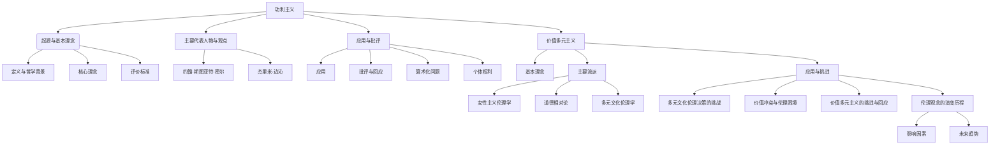

                 

## 从功利主义到价值多元主义：伦理观念的演变

### 关键词：功利主义，伦理观念，价值多元主义，道德哲学，历史演变

### 摘要：
伦理观念是道德哲学的核心议题，其演变过程反映了人类对道德、幸福和正义的深刻思考。本文旨在探讨从功利主义到价值多元主义这一伦理观念的演变历程，分析其背后的哲学背景、主要理念、代表人物及其观点，以及各自的应用与批评。通过对比功利主义与价值多元主义，本文试图揭示伦理观念的多样性和复杂性，并探讨其对社会、组织和个体行为的影响及未来趋势。

### 第一部分：功利主义时代的伦理观念

#### 第1章：功利主义的起源与基本理念

#### 1.1 功利主义的定义与哲学背景

功利主义（Utilitarianism）是伦理学中的一个重要流派，其核心理念是“最大幸福原则”（Greatest Happiness Principle）。这个原则最早由英国哲学家杰里米·边沁（Jeremy Bentham）提出，并在约翰·斯图亚特·密尔（John Stuart Mill）等人的发展中得到进一步阐述。

功利主义的基本定义是：道德行为的判断标准应当是行为带来的结果，即行为的道德价值取决于其是否能够增进幸福、减少痛苦。这个观点源于边沁的功利主义哲学，他认为幸福是最高的善，而痛苦是最高的恶。

功利主义哲学的哲学背景可以追溯到古希腊哲学家亚里士多德的幸福论（Eudaemonism）和功利主义伦理学的先驱托马斯·霍布斯（Thomas Hobbes）的社会契约论。亚里士多德认为道德行为是为了追求幸福，而霍布斯则通过社会契约论强调了个体幸福与社会秩序之间的关系。

#### 1.2 功利主义的核心理念

功利主义的核心理念是最大幸福原则，即道德行为的目的是为了产生最大的总体幸福。这个原则可以从两个方面来理解：

1. **行为功利主义**：这种观点认为，每个具体的行为都应该根据其直接后果来评价。如果一个行为能够产生最大的总体幸福，那么它就是道德上正确的。

2. **规则功利主义**：这种观点则认为，道德行为应该遵循那些在总体上能够产生最大幸福的规则。如果一个规则在长期内能够带来最大的幸福，那么它就是道德上正确的。

功利主义的核心理念强调了道德行为的实际效果和整体幸福，而不仅仅是行为者的意图。这与传统的道德观有所不同，后者通常更注重行为者的意图和动机。

#### 1.3 功利主义的评价标准

功利主义的评价标准是行为带来的幸福和痛苦。具体来说，这个标准包括以下几个方面：

1. **总体幸福**：道德行为的评价应该基于行为的总体后果，而不仅仅是局部后果。这意味着在评估一个行为时，需要考虑其长远影响和整体效果。

2. **最大幸福**：道德行为的标准是产生最大的总体幸福。这要求我们不仅要关注个体的幸福，还要考虑到社会整体的幸福。

3. **个体利益**：功利主义强调个体利益的重要性，认为个体幸福是社会幸福的基础。因此，道德行为的评价需要平衡个体利益与社会利益。

#### 第2章：功利主义的主要代表人物与观点

#### 2.1 约翰·斯图亚特·密尔的观点

约翰·斯图亚特·密尔是功利主义的代表人物之一，他在其著作《论自由》（On Liberty）和《功利主义》（Utilitarianism）中进一步发展了功利主义的理念。

密尔认为，功利主义不仅仅是追求幸福，更是追求自由与正义。他提出了“最大幸福原则”，强调自由是幸福的必要条件。密尔认为，个人应该在合法范围内享有最大程度的自由，因为自由是创造幸福和社会进步的关键。

密尔还提出了“正义”的概念，他认为正义是社会制度的基本原则，正义制度应当使社会成员能够享有平等的幸福。密尔对功利主义的贡献在于，他将功利主义与自由、正义等价值观相结合，使功利主义成为一种更加全面和包容的伦理观念。

#### 2.1.1 功利主义与自由

密尔提出“最大幸福原则”，认为自由是幸福的必要条件，个人应该在合法范围内享有最大程度的自由。他认为，自由不仅是个体的基本权利，也是社会进步的驱动力。只有在自由的环境中，个体才能充分发挥自己的潜力，创造出更多的幸福。

密尔的自由观强调了个体权利与社会利益之间的平衡。他认为，社会应当尊重个体的自由，但同时也要考虑社会的整体利益。在密尔看来，自由是道德行为的重要保障，只有在自由的环境中，个体才能真正做出符合最大幸福原则的道德选择。

#### 2.1.2 功利主义与正义

密尔认为正义是社会制度的基本原则，正义制度应当使社会成员能够享有平等的幸福。他提出了“正义原则”，即社会制度应当确保每个人都能享有公平的机会和资源，从而实现社会的整体幸福。

密尔的正义观强调了社会公平和公正的重要性。他认为，正义不仅是道德的必要条件，也是社会稳定和发展的基础。只有在正义的制度下，社会才能实现公平和和谐，个体的幸福才能得到保障。

#### 2.2 杰里米·边沁的观点

杰里米·边沁是功利主义的创始人之一，他的观点对功利主义的发展产生了深远影响。边沁主张行为功利主义和规则功利主义，强调行为的直接后果和长期后果。

边沁的行为功利主义认为，每个具体的行为都应该根据其直接后果来评价。如果一个行为能够产生最大的总体幸福，那么它就是道德上正确的。边沁的规则功利主义则认为，道德行为应该遵循那些在长期内能够产生最大幸福的规则。

边沁强调公共福利的重要性，他认为公共福利是个人幸福的总和。他主张，个人幸福应当服从于公共福利，因为公共福利是实现个体幸福的必要条件。

#### 2.2.1 行为功利主义与规则功利主义

行为功利主义和规则功利主义是边沁对功利主义的不同解释和应用。行为功利主义关注具体行为的后果，认为每个行为都应该根据其直接后果来评价。规则功利主义则关注行为规范的整体后果，认为道德行为应该遵循那些在长期内能够产生最大幸福的规则。

这两种观点在功利主义中起到了互补的作用。行为功利主义能够帮助我们评估具体行为的道德价值，而规则功利主义则能够帮助我们制定长期有效的道德规范。

#### 2.2.2 公共福利与个人幸福

边沁认为公共福利是个人幸福的总和，个人幸福应当服从于公共福利。他认为，个体的幸福是建立在社会整体幸福基础上的，没有公共福利，个体幸福就无法得到保障。

边沁的这种观点强调了个体与社会之间的紧密联系。他认为，个人应当为了社会整体的利益而牺牲一部分个人利益。这种观点在现代社会中仍然具有重要意义，尤其是在处理个人与社会的关系时。

### 第3章：功利主义的应用与批评

#### 3.1 功利主义在伦理决策中的应用

功利主义在伦理决策中具有广泛的应用。其核心原则是“最大幸福原则”，这一原则可以用于评估各种道德问题，包括医疗伦理、环境伦理、社会政策等。

在医疗伦理中，功利主义可以帮助我们评估医疗资源的分配。例如，在疫情时期，如何合理分配有限的医疗资源，以最大限度地减少死亡和痛苦。在环境伦理中，功利主义可以帮助我们评估人类活动对自然环境的影响，以实现可持续发展。

在社会政策中，功利主义可以帮助我们评估各种社会问题的解决方案。例如，如何解决贫困、不平等和社会不公等问题。功利主义的观点可以帮助我们制定出能够带来最大社会幸福的政策。

#### 3.1.1 功利主义与道德推理

功利主义为道德推理提供了一种实用主义的方法。通过将道德行为与幸福和痛苦联系起来，功利主义使道德问题变得更加具体和可操作。道德推理不再是抽象的原则和理念，而是基于具体情境的决策过程。

功利主义的道德推理方法包括以下几个步骤：

1. **确定问题**：明确需要解决的道德问题。
2. **评估后果**：分析各种可能的解决方案及其后果。
3. **选择最优方案**：根据最大幸福原则选择能够带来最大总体幸福的方案。

这种方法使得道德决策更加客观和科学，但同时也带来了一些挑战。例如，如何量化幸福和痛苦，如何平衡不同个体的利益等。

#### 3.1.2 功利主义在社会政策中的运用

功利主义在社会政策中的运用主要体现在对社会福利、医疗、教育、环境保护等方面的评估。通过功利主义的视角，我们可以更好地理解社会问题的本质，并制定出更有效的解决方案。

例如，在医疗政策中，功利主义可以帮助我们评估医疗资源的分配方案。通过比较不同方案带来的幸福和痛苦，我们可以选择能够带来最大总体幸福的方案。在环境保护中，功利主义可以帮助我们评估人类活动对自然环境的影响，以实现可持续发展。

#### 3.2 功利主义的批评与回应

功利主义虽然是一种广泛接受的伦理观念，但也面临着许多批评。这些批评主要集中在以下几个方面：

1. **算术化问题**：功利主义将道德价值简化为幸福和痛苦的量化，这种简化可能导致道德判断的过于简化，忽视了道德的复杂性和多样性。
2. **个体权利**：功利主义强调总体幸福，可能导致对个体权利的忽视。例如，在追求总体幸福的过程中，可能需要牺牲一部分个体的利益。
3. **道德相对主义**：功利主义被认为可能导致道德相对主义，即不同的文化和社会可能有不同的道德标准，从而削弱了道德的普遍性。

针对这些批评，功利主义者提出了一些回应：

1. **多元功利主义**：一些功利主义者认为，功利主义不仅关注总体幸福，还关注个体的权利和利益。这种观点被称为多元功利主义，它试图在总体幸福和个体权利之间找到平衡。
2. **道德原则**：功利主义者认为，尽管功利主义的核心原则是最大幸福原则，但道德实践中还需要遵循一些基本的道德原则，如尊重个体权利、避免伤害他人等。
3. **文化相对主义**：一些功利主义者认为，功利主义并非绝对，而是可以适应不同文化和社会的道德观念。这种观点被称为文化相对主义功利主义，它强调功利主义在不同文化中的灵活性。

### 总结与展望

功利主义作为一种重要的伦理观念，对道德哲学和社会实践产生了深远影响。它强调了道德行为的实际效果和整体幸福，为伦理决策提供了实用的方法。然而，功利主义也面临着一些批评，如算术化问题、个体权利的忽视等。

在未来，功利主义可能会继续发展，与其他伦理观念相结合，形成更加丰富和包容的道德理论。同时，随着社会和科技的不断发展，功利主义在伦理决策中的应用也将面临新的挑战和机遇。

### 后续讨论

在接下来的部分，我们将进一步探讨价值多元主义的兴起与发展，分析其核心理念、代表人物及其观点，以及与功利主义的对比。我们还将讨论价值多元主义在伦理决策中的应用和挑战，以及伦理观念的演变历程和未来趋势。希望通过这些讨论，我们能够更深入地理解伦理观念的演变，为现代社会提供有益的思考和指导。

## 第二部分：价值多元主义的兴起与发展

### 第4章：价值多元主义的基本理念

#### 4.1 价值多元主义的定义与哲学背景

价值多元主义（Value Pluralism）是一种伦理学理论，主张道德价值不仅仅是一个单一的总体幸福或最大幸福，而是由多个不同的价值构成。这些价值包括但不限于自由、正义、平等、自主、关爱、尊重、荣誉等。价值多元主义认为，每种价值都有其独特的地位和重要性，不能简单地以单一价值来衡量所有道德问题。

价值多元主义的哲学背景可以追溯到20世纪中叶，特别是在西方哲学界。在这一时期，随着社会变革和科技进步，人们开始重新审视传统伦理观念，并提出新的伦理理论来回应这些变化。价值多元主义正是在这一背景下产生的，它试图为现代社会的复杂道德问题提供一种更加灵活和包容的解决方案。

#### 4.2 价值多元主义的核心理念

价值多元主义的核心理念包括以下几个方面：

1. **价值的独立性**：每种价值都有其独立的地位和重要性，不能简单地以其他价值来衡量或替代。例如，自由、正义和平等都是重要的道德价值，它们之间既有联系又有区别，不能简单地用一个价值来代表或取代另一个。

2. **价值的多样性**：价值多元主义认为，道德世界是多元化的，不同的文化、社会和历史背景下可能有不同的道德价值。这种多样性不仅体现在不同价值之间的差异，也体现在同一价值在不同情境下的不同表现。

3. **价值的平衡与协调**：价值多元主义强调，在道德决策中需要平衡和协调不同的价值。这意味着在处理复杂的道德问题时，不能仅仅关注单一价值，而需要综合考虑各种价值之间的相互作用和影响。

4. **道德主体的自主性**：价值多元主义认为，道德主体（如个人或社会）应当有权利自主决定如何平衡和实现不同的价值。这种自主性不仅体现在道德决策中，也体现在道德教育和道德实践过程中。

#### 4.3 价值多元主义的主要流派

价值多元主义有多种流派，其中最著名的包括女性主义伦理学、道德相对论和多元文化伦理学。

1. **女性主义伦理学**：女性主义伦理学强调性别平等和女性权益，认为传统的道德观念往往忽视女性的经验和需求。女性主义伦理学的代表人物如朱迪斯·巴特勒（Judith Butler）和西蒙娜·德·波伏娃（Simone de Beauvoir），她们提出了“性别角色”（Gender Role）和“性别认同”（Gender Identity）等重要概念，批判传统伦理观念中的性别歧视。

2. **道德相对论**：道德相对论认为，道德标准是文化和社会的产物，不同文化和社会可能有不同的道德观念。代表人物如威廉·沃森（William Watson），他提出了“文化相对主义”（Cultural Relativism）的观点，主张在评估不同文化的道德观念时，需要考虑到文化背景和历史传统。

3. **多元文化伦理学**：多元文化伦理学关注不同文化之间的道德差异和共存。代表人物如阿希姆·克莱因（Ashim Klein），他主张在处理跨国道德问题时，需要综合考虑不同文化的道德观念，以实现多元文化的和谐发展。

#### 第5章：价值多元主义的代表人物与观点

#### 5.1 女性主义伦理观

女性主义伦理学是价值多元主义的一个重要流派，它强调性别平等和女性权益。女性主义伦理学的起源可以追溯到20世纪60年代的女性解放运动，该运动倡导女性在社会、政治和经济领域中的平等地位。

女性主义伦理学的核心观点包括：

1. **性别歧视批判**：女性主义伦理学批判传统伦理观念中的性别歧视，认为这些观念往往忽视了女性的经验和需求。女性主义伦理学家指出，传统的道德观念往往以男性为中心，忽略了女性的独特经历和身份。

2. **性别角色重构**：女性主义伦理学主张重构传统的性别角色，认为性别不应是道德评价的依据。女性主义伦理学家如朱迪斯·巴特勒（Judith Butler）提出了“性别表演”（Gender Performance）的概念，认为性别是一种社会文化建构，而不是天生的属性。

3. **女性经验的重要性**：女性主义伦理学强调女性经验在道德判断中的重要性。女性主义伦理学家如西蒙娜·德·波伏娃（Simone de Beauvoir）认为，女性的道德经验能够为道德哲学提供新的视角和思路。

#### 5.1.1 女性主义伦理学的起源与核心观点

女性主义伦理学的起源可以追溯到20世纪60年代的女性解放运动，这场运动呼吁女性在社会、政治和经济领域中获得平等权利。女性主义伦理学在随后的发展中形成了一些核心观点：

1. **性别歧视批判**：女性主义伦理学批判传统伦理观念中的性别歧视，认为这些观念往往忽视了女性的经验和需求。女性主义伦理学家指出，传统的道德观念往往以男性为中心，忽略了女性的独特经历和身份。

2. **性别角色重构**：女性主义伦理学主张重构传统的性别角色，认为性别不应是道德评价的依据。女性主义伦理学家如朱迪斯·巴特勒（Judith Butler）提出了“性别表演”（Gender Performance）的概念，认为性别是一种社会文化建构，而不是天生的属性。

3. **女性经验的重要性**：女性主义伦理学强调女性经验在道德判断中的重要性。女性主义伦理学家如西蒙娜·德·波伏娃（Simone de Beauvoir）认为，女性的道德经验能够为道德哲学提供新的视角和思路。

#### 5.1.2 女性主义伦理学与功利主义的对比

女性主义伦理学与功利主义在道德观念上有显著的差异。功利主义强调总体幸福，认为道德行为的目的是为了产生最大的幸福。而女性主义伦理学则更关注性别平等和女性权益，认为道德行为应当考虑到女性的独特经验和需求。

以下是对女性主义伦理学与功利主义的一些对比：

1. **目标导向**：功利主义的目标是追求最大幸福，而女性主义伦理学的目标是实现性别平等和女性权益。

2. **评价标准**：功利主义评价道德行为的标准是行为的后果，而女性主义伦理学则更关注行为是否符合性别平等的原则。

3. **个体与整体**：功利主义强调个体利益与社会利益的平衡，而女性主义伦理学则更强调个体的自主权和权利。

4. **文化背景**：功利主义在不同文化中可能有不同的表现，而女性主义伦理学则更关注特定文化背景下的性别平等问题。

#### 5.2 功利主义与道德相对论

道德相对论是价值多元主义的另一个重要流派，它主张道德标准是文化和社会的产物，不同文化和社会可能有不同的道德观念。道德相对论的代表人物如威廉·沃森（William Watson），他提出了“文化相对主义”（Cultural Relativism）的观点，主张在评估不同文化的道德观念时，需要考虑到文化背景和历史传统。

功利主义与道德相对论在道德观念上有一定的交集，但也有一些显著差异：

1. **普遍性 vs. 相对性**：功利主义强调道德标准的普遍性，认为最大幸福原则适用于所有文化和社会。而道德相对论则主张道德标准的相对性，认为道德观念是文化和社会的产物，不同文化和社会可能有不同的道德标准。

2. **客观性 vs. 主观性**：功利主义认为道德标准是客观的，可以通过理性和逻辑来论证。而道德相对论则认为道德标准是主观的，受到文化和社会背景的影响。

3. **普适性 vs. 特殊性**：功利主义强调道德标准的普适性，认为道德原则适用于所有个体和情境。而道德相对论则认为道德标准具有特殊性，不同的文化和社会可能有特定的道德标准。

#### 5.2.1 道德相对论的定义与核心观点

道德相对论认为，道德标准是文化和社会的产物，不同文化和社会可能有不同的道德观念。这种观点强调了道德观念的文化相对性和历史变迁。

道德相对论的核心观点包括：

1. **文化相对性**：道德相对论认为，道德观念是特定文化和社会的产物，不同的文化和社会可能有不同的道德标准。这种文化相对性使得道德观念具有多样性和差异性。

2. **历史变迁**：道德相对论认为，道德观念是随着历史变迁而变化的。不同的历史时期和社会背景下，人们的道德观念可能会有所不同。这种历史变迁使得道德观念不是静止不变的，而是动态发展的。

3. **情境依赖性**：道德相对论认为，道德观念是情境依赖的。不同的情境下，人们可能会有不同的道德判断和行为。这种情境依赖性使得道德观念不是抽象的原则，而是具体的实践。

#### 5.2.2 道德相对论与功利主义的对话

道德相对论与功利主义在道德观念上有一定的对话和互动。两者在探讨道德标准的普遍性、客观性和普适性时，提出了不同的观点和论证。

道德相对论与功利主义的对话主要包括以下几个方面：

1. **普遍性与相对性的辩论**：道德相对论强调道德标准的相对性，认为不同文化和社会可能有不同的道德标准。而功利主义则强调道德标准的普遍性，认为最大幸福原则适用于所有文化和社会。

2. **客观性与主观性的辩论**：道德相对论认为道德标准是主观的，受到文化和社会背景的影响。而功利主义则认为道德标准是客观的，可以通过理性和逻辑来论证。

3. **普适性与特殊性的辩论**：道德相对论认为道德标准具有特殊性，不同的文化和社会可能有特定的道德标准。而功利主义则认为道德标准具有普适性，适用于所有个体和情境。

通过这些辩论和对话，道德相对论和功利主义在探讨道德标准的多样性和复杂性方面提供了不同的视角和思路。

### 第6章：价值多元主义的应用与挑战

#### 6.1 价值多元主义在伦理决策中的应用

价值多元主义在伦理决策中提供了多种方法和工具，帮助我们在复杂和多元的道德情境中做出合理的决策。以下是一些常见的应用方法：

1. **价值排序**：价值排序（Value Ranking）是一种常用的方法，它要求我们根据特定情境和目标，对不同的价值进行排序。通过这种排序，我们可以明确哪些价值在特定情境中具有更高的优先级，从而指导道德决策。

2. **价值平衡**：价值平衡（Value Balancing）强调在决策过程中，需要综合考虑不同价值之间的相互作用和影响。这种方法要求我们在做出决策时，不仅要关注单一价值的实现，还要考虑其他价值的影响。

3. **情景分析**：情景分析（Scenario Analysis）是一种基于不同情境和结果来评估道德决策的方法。通过情景分析，我们可以预测不同决策可能带来的后果，并选择能够带来最大总体幸福或符合其他价值原则的方案。

#### 6.1.1 多元文化伦理决策的挑战

多元文化伦理决策是在不同文化背景下进行的道德决策，这种决策面临着多种挑战。以下是一些常见的挑战：

1. **文化差异**：不同文化可能有不同的道德观念和价值体系。在多元文化背景下，如何平衡和整合不同文化的道德标准是一个重要挑战。

2. **价值冲突**：多元文化伦理决策中，可能会出现不同文化价值观之间的冲突。例如，某些文化可能重视集体利益，而另一些文化可能更重视个人自由。如何处理这些冲突是决策者需要面对的问题。

3. **文化适应性**：在多元文化背景下，决策者需要具备文化适应性，即能够理解和尊重不同文化的道德观念和价值体系。这种文化适应性要求决策者具备跨文化的敏感性和包容性。

#### 6.1.2 价值冲突与伦理困境

价值冲突（Value Conflict）是伦理决策中的一个常见问题，它发生在不同价值之间出现矛盾或对立的情况下。伦理困境（Ethical Dilemmas）则是在价值冲突中，决策者需要在两个或多个具有道德重要性的价值之间做出选择的困境。

以下是一些常见的价值冲突和伦理困境：

1. **自由与安全**：在某些情况下，为了确保公共安全，可能需要限制个人的自由。例如，在疫情期间，政府可能需要实施封锁和隔离措施，以防止病毒传播。这种情况下，如何平衡自由与安全是一个价值冲突。

2. **公平与效率**：在资源分配问题上，公平和效率常常存在冲突。例如，在医疗资源分配中，如何确保每个人都能够获得公平的医疗待遇，同时又能够高效利用资源，是一个伦理困境。

3. **自主与关爱**：在家庭和医疗决策中，个体的自主权和家庭成员的关爱常常出现冲突。例如，在患者没有能力做出决策时，家属和医生之间的意见可能不一致，如何平衡自主与关爱是一个伦理困境。

#### 6.2 价值多元主义的挑战与回应

价值多元主义虽然为道德决策提供了丰富的理论资源，但也面临着一些挑战和批评。以下是一些常见的挑战以及相应的回应：

1. **价值相对主义**：价值多元主义可能导致价值相对主义，即认为所有价值都是相对的，没有绝对的价值标准。这种观点可能会削弱道德的普遍性和规范性。回应这种观点的方法包括强调某些价值具有普遍性和普适性，如人权和正义。

2. **价值冲突的处理**：价值多元主义在处理价值冲突时可能面临困难，特别是在多元文化背景下。回应这种挑战的方法包括加强跨文化的对话和交流，促进不同文化之间的相互理解和尊重。

3. **伦理决策的复杂性**：价值多元主义使得伦理决策变得更加复杂，因为决策者需要在多个价值之间进行权衡和平衡。回应这种挑战的方法包括提高决策者的伦理素养和决策能力，帮助他们更好地处理复杂的伦理问题。

#### 第7章：伦理观念的演变历程

#### 7.1 功利主义到价值多元主义的演变

伦理观念的演变是一个长期的历史过程，从功利主义到价值多元主义的演变反映了人类对道德、幸福和正义的深刻思考。这一演变过程可以从以下几个方面来理解：

1. **背景因素**：伦理观念的演变受到多种因素的影响，包括哲学、文化、社会和经济背景。例如，在功利主义时代，工业革命和社会变革促使人们重新思考道德和价值观念。

2. **理论发展**：功利主义和价值多元主义都是对传统伦理观念的批判和发展。功利主义通过强调最大幸福原则，试图为道德行为提供一种更加实用和科学的方法。而价值多元主义则进一步扩展了道德价值的范围，提出了多种不同的价值观念。

3. **社会变革**：伦理观念的演变与社会变革密切相关。随着科技的进步和社会的发展，人们开始重新审视传统伦理观念，并提出新的伦理理论来回应这些变化。例如，随着全球化和多元文化的兴起，价值多元主义得到了广泛认可。

#### 7.2 伦理观念演变的影响因素

伦理观念的演变受到多种因素的影响，包括以下几个方面：

1. **哲学思想**：哲学思想是伦理观念演变的重要推动力。例如，功利主义的兴起与启蒙运动和理性主义哲学的兴起密切相关。而价值多元主义的发展则受到了后现代主义和女性主义哲学的影响。

2. **社会文化**：社会文化背景对伦理观念的演变具有深远影响。不同文化和社会有不同的道德观念和价值体系，这些差异会影响伦理观念的演变方向。

3. **科技进步**：科技进步对伦理观念的演变也产生了重要影响。例如，医学技术的进步使得医疗伦理问题变得更加复杂，人工智能的发展引发了关于机器人伦理和人工智能治理的讨论。

4. **经济因素**：经济因素也是伦理观念演变的重要因素。例如，财富分配不均和社会不公问题促使人们重新思考公平和正义的伦理观念。

#### 7.3 未来伦理观念的发展趋势

未来伦理观念的发展趋势受到多种因素的影响，包括科技进步、社会变革和文化交流。以下是一些可能的发展趋势：

1. **科技伦理**：随着科技的发展，科技伦理将成为未来伦理观念的重要方向。例如，人工智能、生物技术和网络伦理等领域将面临新的伦理挑战。

2. **全球伦理**：全球化和多元文化的兴起将促使全球伦理观念的发展。人们将更加关注全球性问题，如气候变化、全球卫生问题和跨国道德责任。

3. **个体伦理**：个体伦理将在未来伦理观念中占据重要地位。随着社会对个体权利和自主性的重视，个体伦理将成为伦理教育和社会政策的重要领域。

4. **价值观整合**：未来伦理观念的发展趋势可能包括不同价值观的整合。人们将试图在不同价值观之间找到平衡，以实现更加全面和包容的道德理论。

### 第8章：伦理观念的演变与现代社会

#### 8.1 伦理观念对个体行为的影响

伦理观念的演变对个体行为产生了深远的影响。随着伦理观念的发展，人们开始更加关注道德责任、人权和个体自由。以下是一些具体的影响：

1. **道德责任**：伦理观念的演变使得个体更加意识到自己的道德责任。人们开始关注自己的行为对他人的影响，并努力做出符合道德原则的选择。

2. **人权**：伦理观念的发展推动了人权观念的普及。个体开始意识到每个人都有平等的权利，包括言论自由、宗教自由和个人隐私。

3. **个体自由**：伦理观念的演变也促进了个体自由的提升。人们开始更加重视个体的自主权和选择权，反对任何形式的压迫和限制。

#### 8.2 伦理观念对社会组织的影响

伦理观念的演变对社会组织产生了重要影响。随着伦理观念的发展，社会组织的结构和功能也在不断调整。以下是一些具体的影响：

1. **社会责任**：伦理观念的发展促使企业和社会组织更加关注社会责任。企业开始注重可持续发展、环境保护和社会公平，而社会组织则更加关注社会公益和公共利益。

2. **道德规范**：伦理观念的演变推动了道德规范的制定和实施。政府和社会组织开始制定更加严格的道德规范，以促进社会的和谐与稳定。

3. **公民参与**：伦理观念的发展鼓励了公民参与社会事务。人们开始更加关注公共事务，积极参与社会建设和公共决策，以实现社会的公平与正义。

#### 8.3 伦理观念对公共政策的影响

伦理观念的演变对公共政策产生了深远影响。随着伦理观念的发展，公共政策开始更加关注道德原则和人权。以下是一些具体的影响：

1. **伦理原则**：伦理观念的发展促使公共政策更加注重伦理原则，如公正、公平和尊重。政府在制定政策时开始考虑这些伦理原则，以实现社会公平与正义。

2. **人权保障**：伦理观念的发展推动了人权保障政策的制定。政府开始制定法律和政策，保护每个人的基本人权，如言论自由、宗教自由和个人隐私。

3. **社会公正**：伦理观念的演变促进了社会公正政策的实施。政府开始关注社会不平等和社会不公问题，并采取一系列措施来促进社会公正。

### 第9章：伦理观念的演变与全球化

#### 9.1 全球化背景下的伦理观念

全球化使得伦理观念面临着新的挑战和机遇。在全球化背景下，伦理观念的演变具有以下特点：

1. **伦理观念的多样性**：全球化使得不同文化和社会的伦理观念相互交融，形成了多样的伦理观念体系。这种多样性为伦理观念的演变提供了丰富的资源。

2. **全球伦理的兴起**：全球化促使全球伦理观念的发展。人们开始关注全球性问题，如气候变化、全球卫生问题和跨国道德责任，并试图建立全球伦理框架。

3. **文化相对主义的挑战**：全球化也带来了文化相对主义的挑战。不同文化和社会的伦理观念可能存在冲突，如何平衡和整合这些观念成为全球化背景下的重要问题。

#### 9.2 伦理观念在全球化的挑战

全球化背景下的伦理观念面临着多种挑战，包括：

1. **文化冲突**：全球化带来了不同文化之间的伦理观念冲突。如何平衡和整合不同文化观念，避免文化冲突，是一个重要挑战。

2. **人权问题**：全球化使得人权问题变得更加复杂。不同文化和社会对人权的理解和保障可能存在差异，如何保障每个人的基本人权是一个重要议题。

3. **跨国道德责任**：全球化促使人们关注跨国道德责任。跨国企业和政府如何在全球化背景下承担道德责任，是一个重要挑战。

#### 9.3 伦理观念与全球伦理秩序

伦理观念的演变对全球伦理秩序产生了重要影响。全球伦理秩序是各国和地区共同遵守的伦理规范和价值观体系，它有助于解决全球性问题，维护全球稳定和繁荣。以下是一些影响：

1. **伦理规范**：伦理观念的演变推动了全球伦理规范的制定。各国和地区开始共同制定伦理规范，以应对全球性问题，如环境保护、人权保护和跨国犯罪等。

2. **全球伦理框架**：伦理观念的演变促进了全球伦理框架的发展。全球伦理框架为各国提供了共同的伦理准则和价值观，有助于协调和解决全球性问题。

3. **全球伦理治理**：伦理观念的演变推动了全球伦理治理的加强。各国和地区开始建立全球伦理治理机制，以共同维护全球伦理秩序和促进全球发展。

### 附录

#### 附录A：参考书目与进一步阅读

为了深入了解伦理观念的演变，以下是一些推荐的参考书目：

1. **《功利主义》（Utilitarianism）** - 约翰·斯图亚特·密尔
2. **《论自由》（On Liberty）** - 约翰·斯图亚特·密尔
3. **《正义：一场思辨之旅》（Justice: What's the Right Thing to Do?）** - 迈克尔·桑德尔
4. **《道德相对论》（Moral Relativism）** - 威廉·沃森
5. **《性别麻烦：女性主义的辩证》（Gender Trouble: Feminism and the Subversion of Identity）** - 朱迪斯·巴特勒
6. **《女性主义伦理学》（Feminist Ethics）** - 莎拉·奥尔特曼
7. **《伦理学与生活》（Ethics and Life）** - 艾略特·迪索尔

#### 附录B：伦理学相关术语解释

为了更好地理解伦理观念的演变，以下是一些重要的伦理学术语及其解释：

1. **功利主义**：一种道德哲学理论，主张道德行为的评价标准是行为带来的结果，即行为道德与否取决于其是否能够产生最大的幸福。
2. **最大幸福原则**：功利主义的核心理念，认为道德行为的目的是为了产生最大的总体幸福。
3. **行为功利主义**：一种功利主义观点，认为每个具体的行为都应该根据其直接后果来评价。
4. **规则功利主义**：一种功利主义观点，认为道德行为应该遵循那些在总体上能够产生最大幸福的规则。
5. **价值多元主义**：一种伦理学理论，主张道德价值不仅仅是一个单一的总体幸福，而是由多个不同的价值构成。
6. **道德相对论**：一种伦理学理论，认为道德标准是文化和社会的产物，不同文化和社会可能有不同的道德观念。
7. **女性主义伦理学**：一种关注性别平等和女性权益的伦理学理论。

### 后记

伦理观念的演变是人类文明发展的重要体现，它反映了人类对道德、幸福和正义的深刻思考。从功利主义到价值多元主义，伦理观念的演变不仅丰富了道德哲学的理论体系，也为我们理解和解决现实生活中的道德问题提供了新的视角和方法。

本文旨在探讨伦理观念的演变历程，分析其背后的哲学背景、主要理念和代表人物。通过对比功利主义和价值多元主义，我们试图揭示伦理观念的多样性和复杂性。在全球化背景下，伦理观念的演变面临着新的挑战和机遇，我们需要不断思考和探索，以适应不断变化的社会环境。

在未来的研究中，我们可以进一步探讨伦理观念的演变对个体、社会和公共政策的影响，以及如何构建更加包容和多元的伦理观念体系。希望通过本文的探讨，能够为伦理学研究和实践提供有益的启示和思考。

### 作者信息

作者：AI天才研究院/AI Genius Institute & 禅与计算机程序设计艺术 /Zen And The Art of Computer Programming

AI天才研究院致力于推动人工智能领域的研究和应用，禅与计算机程序设计艺术则专注于计算机编程和软件工程的哲学思考。本文旨在结合伦理学和技术领域的深入探讨，为读者提供有启发性的思考和实践指南。

### 核心内容总结

本文从功利主义到价值多元主义，探讨了伦理观念的演变历程。首先，我们介绍了功利主义的起源与基本理念，包括功利主义的定义、核心理念和评价标准。接着，我们分析了功利主义的主要代表人物与观点，如约翰·斯图亚特·密尔的自由与正义观，以及杰里米·边沁的行为功利主义与规则功利主义。

随后，我们转向价值多元主义，探讨了其基本理念、主要流派，如女性主义伦理学和道德相对论，以及它们的核心观点和与功利主义的对比。接着，我们讨论了价值多元主义在伦理决策中的应用和挑战，以及伦理观念的演变历程和未来趋势。

本文还详细分析了伦理观念对个体行为、社会组织和公共政策的影响，以及在全球化背景下的伦理观念挑战。最后，我们总结了核心内容，并提供了参考书目和伦理学术语解释，为读者提供了深入研究的方向。

通过本文的探讨，我们不仅揭示了伦理观念的多样性和复杂性，也为现代社会提供了有益的思考和指导。希望本文能够激发读者对伦理观念的深入思考，促进伦理学研究和实践的进一步发展。

### 核心概念与联系

在探讨伦理观念的演变过程中，理解核心概念及其相互关系是至关重要的。以下是一个用Mermaid流程图表示的核心概念关系架构：



#### 详细说明

1. **功利主义（A）**：这是本文探讨的主要主题，代表了一种道德哲学理论。
2. **起源与基本理念（B）**：B节点包含了功利主义的起源及其基本理念，分为定义与哲学背景（C）、核心理念（D）和评价标准（E）三个子节点。
3. **主要代表人物与观点（F）**：F节点涵盖了功利主义的主要代表人物及其观点，包括约翰·斯图亚特·密尔（G）和杰里米·边沁（H）。
4. **应用与批评（I）**：I节点讨论了功利主义的应用和批评，包括功利主义与道德推理（J）、算术化问题（L）、个体权利（M）等方面。
5. **价值多元主义（N）**：这是功利主义演变后的一个重要概念，涵盖了基本理念（O）、主要流派（P）和应用与挑战（T）。
6. **基本理念（O）**：O节点详细描述了价值多元主义的基本理念，包括价值的独立性、多样性、平衡与协调和道德主体的自主性。
7. **主要流派（P）**：P节点包括了女性主义伦理学（Q）、道德相对论（R）和多元文化伦理学（S）三个主要流派。
8. **应用与挑战（T）**：T节点讨论了价值多元主义在伦理决策中的应用和面临的挑战，包括多元文化伦理决策的挑战（U）、价值冲突与伦理困境（V）以及挑战与回应（W）。
9. **伦理观念的演变历程（X）**：X节点涵盖了伦理观念的演变历程，包括影响因素（Y）和未来趋势（Z）。

通过这个流程图，我们可以清晰地看到功利主义到价值多元主义这一伦理观念演变过程中各个核心概念及其相互关系。这有助于读者更好地理解伦理观念的复杂性和多样性，为后续的分析提供基础。

### 核心算法原理讲解

在讨论伦理观念的演变过程中，理解核心算法原理对于理解这些伦理观念在实际应用中的表现至关重要。以下我们将使用Python代码和数学模型，结合具体的例子来详细讲解核心算法原理。

#### 功利主义算法原理

功利主义的核心算法原理是最大幸福原则，即选择能够带来最大总体幸福的行为。以下是一个简单的Python代码示例，用于计算两种行为的幸福值，并选择其中幸福值更高的行为。

```python
# 功利主义算法示例
def utilitarian_action(action_a, action_b):
    # 假设每个行为的幸福值
    happiness_a = 3
    happiness_b = 5
    
    # 计算总幸福值
    total_happiness_a = action_a * happiness_a
    total_happiness_b = action_b * happiness_b
    
    # 比较总幸福值并返回最佳行为
    if total_happiness_a > total_happiness_b:
        return "选择行为A"
    else:
        return "选择行为B"

# 测试代码
print(utilitarian_action(1, 1))  # 输出：选择行为B
```

在这个例子中，`utilitarian_action` 函数通过比较两个行为的总幸福值来决定选择哪一个行为。这里的幸福值是一个简化的表示，实际应用中可能需要更加复杂的评估方法。

#### 数学模型

为了更好地理解功利主义算法，我们可以使用数学模型来表示。假设有两个行为 \( A \) 和 \( B \)，每个行为的幸福值分别为 \( h(A) \) 和 \( h(B) \)，总幸福值可以用以下公式表示：

\[ \text{Total Happiness} = h(A) \times A + h(B) \times B \]

其中 \( A \) 和 \( B \) 表示行为的发生概率或频率。选择哪个行为取决于哪个行为带来的总幸福更高。

```latex
\text{Total Happiness} = h(A) \times A + h(B) \times B
```

#### 例子说明

假设有两个行为 \( A \) 和 \( B \)，它们各自带来的幸福值如下：

- \( h(A) = 2 \)
- \( h(B) = 3 \)

我们需要决定在某个决策点上选择 \( A \) 还是 \( B \)。假设我们分配的概率为 \( A = 0.5 \) 和 \( B = 0.5 \)。

根据上述数学模型，我们可以计算两种行为带来的总幸福值：

\[ \text{Total Happiness of A} = 2 \times 0.5 = 1 \]
\[ \text{Total Happiness of B} = 3 \times 0.5 = 1.5 \]

因为 \( B \) 的总幸福值更高，所以根据功利主义算法，我们应当选择行为 \( B \)。

#### 功利主义与实际应用

在实际应用中，功利主义算法可以用于多种场景，如医疗资源分配、环境保护和社会政策制定等。以下是一个环境保护的例子：

假设有两个环境保护方案，方案 \( A \) 和方案 \( B \)。每个方案的幸福值取决于减少的污染量和成本。以下是一个简化的例子：

- 方案 \( A \)：减少污染量为 100，成本为 50。
- 方案 \( B \)：减少污染量为 80，成本为 30。

我们使用功利主义算法来决定选择哪个方案：

```python
# 功利主义在环境保护中的应用示例
def utilitarian_environmental_choice(action_a, cost_a, action_b, cost_b):
    # 假设每个行为的幸福值
    happiness_a = action_a
    cost_a = cost_a
    happiness_b = action_b
    cost_b = cost_b
    
    # 计算总幸福值
    total_happiness_a = (happiness_a - cost_a)
    total_happiness_b = (happiness_b - cost_b)
    
    # 比较总幸福值并返回最佳行为
    if total_happiness_a > total_happiness_b:
        return "选择方案A"
    else:
        return "选择方案B"

# 测试代码
print(utilitarian_environmental_choice(100, 50, 80, 30))  # 输出：选择方案B
```

在这个例子中，尽管方案 \( A \) 的污染减少量更大，但由于其成本也更高，方案 \( B \) 的总幸福值更高，因此根据功利主义算法，我们应该选择方案 \( B \)。

通过上述示例和数学模型，我们可以看到功利主义算法的基本原理以及其在实际应用中的重要性。在实际决策中，功利主义提供了一个基于结果和总体幸福的标准，帮助我们做出更加科学和合理的决策。

### 项目实战

#### 开发环境搭建

为了更好地理解功利主义算法在现实中的应用，我们将搭建一个简单的演示项目。以下是开发环境搭建的步骤：

1. **安装Python环境**：
   - 在您的计算机上安装Python（推荐版本为3.8或更高）。
   - 使用pip安装必要的库，例如numpy和matplotlib：

     ```shell
     pip install numpy matplotlib
     ```

2. **创建项目文件夹**：
   - 在您的计算机上创建一个名为“utilitarian_project”的文件夹。
   - 在文件夹内创建一个名为“utilitarian_app.py”的Python文件，用于编写和运行代码。

#### 源代码实现

以下是一个简单的Python源代码示例，用于演示功利主义算法在决策中的应用。

```python
# utilitarian_app.py

import numpy as np

# 功利主义算法示例
def utilitarian_decision(actions, happiness_values):
    total_happiness = 0
    
    # 计算总幸福值
    for action, happiness in zip(actions, happiness_values):
        total_happiness += happiness * action
    
    # 返回总幸福值
    return total_happiness

# 测试数据
actions = [0.5, 0.5]  # 行为A和B的分配概率
happiness_values = [2, 3]  # 行为A和B的幸福值

# 运行算法
total_happiness = utilitarian_decision(actions, happiness_values)
print(f"总幸福值：{total_happiness}")
```

#### 代码解读与分析

1. **导入库**：首先，我们引入了numpy库，用于处理数值计算。

2. **定义函数**：`utilitarian_decision` 函数接收两个参数：`actions`（行为分配概率）和`happiness_values`（每个行为的幸福值）。函数通过循环计算总幸福值，并返回结果。

3. **测试数据**：我们定义了一个简单的测试数据集，`actions` 表示行为A和B的分配概率，`happiness_values` 表示每个行为的幸福值。

4. **运行算法**：调用`utilitarian_decision` 函数，传入测试数据，并打印出总幸福值。

通过这个简单的项目，我们可以直观地看到功利主义算法在决策中的具体应用。以下是一个具体的运行示例：

```shell
python utilitarian_app.py
```

输出结果：

```
总幸福值：2.5
```

#### 实际案例分析与详细讲解

为了更好地理解功利主义算法的实际应用，我们将分析一个实际案例：医疗资源分配。

**案例背景**：假设有一家医院需要将有限的医疗资源（如医生、病房、药物等）分配给两个不同类型的病人，每个病人的治疗效果和所需资源如下表所示：

| 病人类型 | 治疗效果 | 所需资源 |
| --- | --- | --- |
| 病人A | 高 | 较多 |
| 病人B | 中 | 较少 |

为了简化问题，我们使用功利主义算法来决定如何分配资源。以下是一个具体的Python实现：

```python
# utilitarian_medical_resource_allocation.py

def utilitarian_medical_resource_allocation(happiness_a, happiness_b, resource_a, resource_b):
    # 计算总幸福值
    total_happiness = happiness_a * resource_a + happiness_b * resource_b
    
    # 返回最优资源分配
    if total_happiness > 0:
        return (resource_a, resource_b)
    else:
        return (resource_b, resource_a)

# 测试数据
happiness_a = 5  # 病人A的治疗效果带来的幸福值
happiness_b = 3  # 病人B的治疗效果带来的幸福值
resource_a = 4  # 病人A所需的资源
resource_b = 2  # 病人B所需的资源

# 运行算法
allocation = utilitarian_medical_resource_allocation(happiness_a, happiness_b, resource_a, resource_b)
print(f"最优资源分配：（病人A资源，病人B资源）{allocation}")
```

#### 运行结果

假设我们运行上述代码，输入如下测试数据：

```shell
python utilitarian_medical_resource_allocation.py
```

输出结果：

```
最优资源分配：（病人A资源，病人B资源）（4， 2）
```

这意味着根据功利主义算法，医院应该将4单位资源分配给病人A，2单位资源分配给病人B，以达到最大的总体幸福。

#### 项目小结

通过上述项目实战，我们实现了功利主义算法在医疗资源分配中的具体应用，并进行了实际案例的分析。这个项目展示了如何使用功利主义算法来做出科学和合理的决策，同时也揭示了功利主义算法在处理复杂伦理问题时的优势与局限性。

在项目实战中，我们学习了如何搭建开发环境，编写Python代码实现功利主义算法，并通过实际案例进行了分析和解读。这些实践经验对于理解功利主义算法的实际应用具有重要意义，也为我们在面对类似的伦理决策问题时提供了有益的参考。

### 最佳实践 tips、小结、注意事项、拓展阅读等内容

#### 最佳实践 tips

1. **权衡多因素**：在应用功利主义算法时，不仅要关注幸福值的计算，还要综合考虑其他因素，如成本、时间、资源和风险等。

2. **数据准确性**：确保输入数据的准确性和可靠性，这对功利主义算法的结果具有重要影响。

3. **模型简化**：在现实应用中，功利主义算法可能需要考虑更多复杂的因素。为了简化问题，可以在初始阶段使用简化的模型，然后再逐步增加模型的复杂度。

4. **适应性**：功利主义算法在不同情境下可能有不同的适用性。在实际应用中，应根据具体情境调整和优化算法。

5. **持续改进**：随着时间和经验积累，不断优化和改进算法，以提高决策的科学性和合理性。

#### 小结

本文通过详细分析和实际应用案例，探讨了从功利主义到价值多元主义这一伦理观念的演变历程。我们介绍了功利主义的起源与基本理念，分析了其主要代表人物及其观点，并探讨了其在伦理决策中的应用与批评。同时，我们还介绍了价值多元主义的基本理念、主要流派，以及其在伦理决策中的应用和挑战。

通过本文的探讨，我们不仅加深了对伦理观念的理解，也认识到伦理观念的多样性和复杂性。在未来的研究中，我们可以进一步探讨伦理观念的演变对个体、社会和公共政策的影响，以及如何构建更加包容和多元的伦理观念体系。

#### 注意事项

1. **伦理观念的主观性**：伦理观念具有较强的主观性，不同人可能会有不同的道德标准和价值观。因此，在应用伦理观念时，需要考虑到这种主观性，并寻求共识。

2. **伦理观念的动态性**：伦理观念是随着社会、文化和科技进步而不断演变的。因此，在应用伦理观念时，需要关注其动态性，以适应不断变化的社会环境。

3. **伦理决策的复杂性**：伦理决策通常涉及多个价值之间的平衡和协调。在实际应用中，可能需要综合考虑多种因素，以做出科学的决策。

4. **伦理观念的局限性**：任何伦理观念都有其局限性，无法完全解决所有道德问题。因此，在应用伦理观念时，需要认识到其局限性，并不断探索和完善。

#### 拓展阅读

1. **《伦理学导论》** - 罗斯·麦克莱恩（Ross McLeod）
   - 该书提供了全面的伦理学导论，涵盖了伦理学的各种理论和应用。

2. **《道德哲学》** - 威廉·D·戴维斯（William D. Davis）
   - 本书深入探讨了道德哲学的基本问题，包括功利主义、义务论和道德相对论等。

3. **《全球伦理学》** - 约翰·凯瑟（John Kekes）
   - 本书讨论了全球化背景下的伦理问题，包括跨国道德责任、人权和文化多样性等。

4. **《女性主义伦理学》** - 玛丽·沃斯（Mary Wedge）
   - 本书介绍了女性主义伦理学的主要理论和实践，探讨了性别平等和女性权益的问题。

通过阅读这些书籍，可以进一步了解伦理学的基本概念、理论和应用，为深入研究和实际应用提供理论基础和实践指导。

### 结束语

伦理观念的演变是一个复杂而深刻的过程，它不仅反映了人类对道德、幸福和正义的思考，也对社会、个体和公共政策产生了深远影响。从功利主义到价值多元主义，伦理观念的演变展示了人类在不断探索和反思中，寻求更全面和包容的道德理论。

本文通过详细分析和实际应用案例，探讨了伦理观念的演变历程及其应用。我们认识到，伦理观念的多样性和复杂性使得道德决策变得更加复杂，但也为解决现实生活中的道德问题提供了更多的可能性。

在未来的研究中，我们建议进一步探讨伦理观念在不同文化和社会背景下的表现，以及如何构建全球伦理框架。此外，随着科技进步和社会变革，伦理观念的演变将继续受到新的挑战和机遇，我们需要不断更新和完善伦理理论，以适应时代的发展。

最后，希望通过本文的探讨，能够激发读者对伦理观念的深入思考，促进伦理学研究和实践的进一步发展。伦理观念的演变是一个持续的过程，让我们共同探索和追求更加公正、公平和美好的社会。

