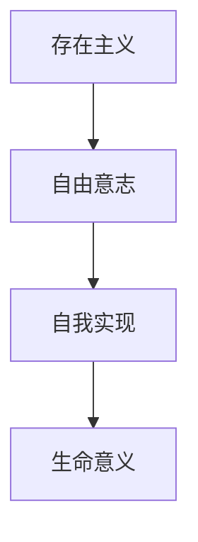

                 

# 《从存在主义到生命意义：现代人的哲学之旅》

## 关键词
- 存在主义
- 现代哲学
- 生命意义
- 人本主义
- 萨特
- 海德格尔
- 自我实现
- 自由意志
- 社会责任

## 摘要
本文旨在探讨现代人的哲学之旅，从存在主义的角度出发，深入分析生命的意义及其在现代社会的应用。通过对哲学基础、存在主义理论、生命意义探讨以及现代人的哲学反思等方面的详细阐述，本文旨在引导读者思考个体存在的价值，以及如何在现代社会中找到属于自己的生命意义。

## 引言

### 1.1 存在主义与现代人

存在主义是20世纪哲学领域的重要流派之一，它强调个体的存在与自由意志，对人类存在的本质进行了深刻的探讨。在现代人的哲学之旅中，存在主义为我们提供了一种思考个体生命意义的路径。

存在主义哲学的核心理念之一是“存在先于本质”（existence precedes essence），这一观点由法国哲学家让-保罗·萨特在其著作《存在与虚无》中提出。萨特认为，人类并不是预先设定好的实体，而是在不断的自我选择和自我创造中形成自己的本质。

现代社会的快速发展带来了物质生活的极大丰富，但同时也带来了精神上的空虚和迷茫。面对这种困境，存在主义提供了另一种思考方式。它鼓励我们勇敢面对存在的困境，通过自由意志去创造自己的生命意义。

### 1.2 生命的意义与存在主义的探讨

生命的意义是哲学中一个古老而永恒的话题。在存在主义看来，生命的意义并非是预先设定的，而是个体在自我选择和自我创造的过程中逐步构建的。

存在主义哲学家让-保罗·萨特认为，生命没有固有的意义，但人类可以通过自由意志为自己创造意义。萨特的这一观点强调了人类存在的主动性和创造性。他主张，个体应该通过行动和选择来定义自己的存在，从而找到生命的意义。

另一位重要的存在主义哲学家马丁·海德格尔则从“存在”这一概念出发，探讨了人类存在的本质。海德格尔认为，存在的本质在于“此在”（Dasein），即人类的存在是处于世界中并与世界相互作用的存在。他强调了个体存在的独立性和自主性，认为人类应该通过“理解”来揭示存在的意义。

在现代人的哲学之旅中，存在主义为我们提供了一种寻找生命意义的途径。它鼓励我们勇敢面对存在的困境，通过自由意志和自我实现来寻找生命的意义。

## 哲学基础

### 2.1 哲学的发展历程

哲学是人类思考世界的艺术，它有着悠久的历史。从古希腊哲学开始，哲学经历了多个发展阶段，逐渐形成了现代哲学的格局。

#### 2.1.1 古希腊哲学

古希腊哲学是西方哲学的源头。古希腊哲学家们对宇宙、人类和道德等问题进行了深入的探讨，提出了一系列重要的哲学理论。

- **苏格拉底**：苏格拉底是古希腊哲学的重要代表人物之一。他主张通过对话和提问来寻求真理，提出了“知识即德行”的观点。

- **柏拉图**：柏拉图是苏格拉底的学生，他创立了理念论，认为现实世界只是理念世界的影子。柏拉图的著作《理想国》中探讨了正义、政治和社会等问题。

- **亚里士多德**：亚里士多德是古希腊哲学的另一重要代表人物。他的哲学体系广泛涉及逻辑、伦理、政治和生物学等领域。亚里士多德提出了中庸之道，认为理性是指导人类行为的关键。

#### 2.1.2 中世纪哲学

中世纪哲学以基督教哲学为核心，对古希腊哲学进行了继承和发展。中世纪哲学家们主要探讨了上帝、灵魂和宇宙等问题。

- **奥古斯丁**：奥古斯丁是基督教哲学的重要代表人物之一。他提出了原罪和恩典的理论，对基督教教义进行了系统阐述。

- **阿奎那**：阿奎那是中世纪哲学的集大成者，他试图将基督教哲学与古希腊哲学结合起来，提出了自然神论和宇宙论。

#### 2.1.3 近现代哲学

近现代哲学是西方哲学的重要发展阶段，它对古希腊哲学和中世纪哲学进行了批判和反思，提出了新的哲学观点。

- **笛卡尔**：笛卡尔是近现代哲学的奠基人之一，他提出了“我思故我在”的观点，认为理性是认识的起点。

- **康德**：康德是近现代哲学的重要代表人物，他提出了先验唯心主义，认为人类认识是通过先验范畴来实现的。

### 2.2 哲学基础与现代人的哲学反思

哲学的发展历程为我们理解现代人的哲学反思提供了重要的背景。在现代社会，哲学基础与存在主义理论相结合，为个体寻找生命的意义提供了新的视角。

现代人的哲学反思涉及到个体存在的本质、自由意志的重要性以及生命意义的构建。通过回顾哲学的发展历程，我们可以更好地理解这些核心概念，从而在现代社会中找到属于自己的生命意义。

## 存在主义理论

### 3.1 存在主义的核心观点

存在主义是20世纪哲学的重要流派之一，它对个体存在的本质、自由意志和生命意义进行了深入的探讨。存在主义的核心观点主要包括以下几个方面：

#### 3.1.1 人类存在的困境

存在主义认为，人类存在面临着一系列的困境，这些困境包括：

- **虚无感**：人类意识到自己的存在是偶然的，没有先天的本质和目的，从而产生虚无感。

- **自由与责任**：人类拥有自由意志，但同时也必须为自己的选择承担责任。这种自由与责任的矛盾使人类感到困惑和焦虑。

- **孤独感**：人类是独立的个体，与其他人之间存在隔阂和无法沟通的困境，从而感到孤独。

#### 3.1.2 自我选择与自我创造

存在主义认为，人类可以通过自由意志进行自我选择和自我创造，从而赋予自己的生命意义。人类的存在不是被预设的，而是通过自己的行动和选择来定义的。

- **自我选择**：人类可以通过选择自己的生活方式、价值观和信念来定义自己的存在。

- **自我创造**：人类可以通过创造艺术作品、科技发明和社会变革来赋予自己的生命意义。

#### 3.1.3 自我实现

存在主义强调个体的自我实现，认为个体应该追求自己的理想和目标，实现自我潜能的最大化。自我实现不仅是个体的内在需求，也是个体对社会的贡献。

### 3.2 存在主义代表人物

存在主义哲学的代表人物主要包括让-保罗·萨特和马丁·海德格尔。

#### 3.2.1 萨特

让-保罗·萨特是法国哲学家，他的著作《存在与虚无》是存在主义的经典之作。萨特的存在主义理论强调自由意志和存在的荒谬性。他认为，人类的存在是荒谬的，但通过自由意志，人类可以为自己创造意义。

#### 3.2.2 海德格尔

马丁·海德格尔是德国哲学家，他的著作《存在与时间》是存在主义哲学的又一重要作品。海德格尔的存在主义理论强调“此在”和存在的本质。他认为，人类的存在是通过“理解”来揭示的，而不是通过外在的物质世界来定义的。

### 3.3 存在主义理论在现代人的哲学反思中的应用

存在主义理论为现代人的哲学反思提供了重要的视角。在现代社会，人们面临着前所未有的困境和挑战，存在主义理论可以帮助我们理解这些困境，并找到解决之道。

- **面对虚无感**：存在主义提醒我们，存在的荒谬性和虚无感是不可避免的。但通过自由意志，我们可以为自己创造意义，克服虚无感。

- **理解自由与责任**：存在主义强调了自由与责任的统一。在现代社会，人们应该认识到自己的自由意志，同时承担起自己的责任。

- **追求自我实现**：存在主义鼓励我们追求自我实现，实现自我潜能的最大化。通过自我实现，我们可以为现代社会做出更大的贡献。

## 生命意义探讨

### 4.1 生命的本质与价值

生命的本质是一个哲学问题，不同哲学流派对此有不同的解释。在存在主义看来，生命的本质在于个体的存在和自由意志。人类的存在是偶然的，但通过自由意志，人类可以为自己创造价值。

#### 4.1.1 生命的定义

生命的定义可以从生物学、哲学和社会学等多个角度来探讨。从生物学的角度来看，生命是指生物体具有新陈代谢、生长、发育、繁殖等特征。从哲学的角度来看，生命是指个体的存在和意识。从社会学的角度来看，生命是指个体在社会中的角色和地位。

#### 4.1.2 生命的价值

生命的价值是一个复杂的问题，不同哲学流派对此有不同的看法。在存在主义看来，生命的价值在于个体的自我实现和社会贡献。个体的自我实现意味着个体追求自己的理想和目标，实现自我潜能的最大化。社会贡献意味着个体通过自己的行动和选择为社会的进步做出贡献。

### 4.2 生命意义与存在主义

在存在主义看来，生命的意义并非是预先设定的，而是个体在自我选择和自我创造的过程中逐步构建的。通过自由意志，个体可以为自己创造意义，克服生命的虚无感。

#### 4.2.1 自我实现

自我实现是生命意义的核心。在存在主义看来，个体应该追求自己的理想和目标，实现自我潜能的最大化。通过自我实现，个体可以找到生命的意义。

#### 4.2.2 社会责任

社会责任是生命意义的重要组成部分。在存在主义看来，个体不仅要追求自我实现，还要承担社会责任，为社会的进步做出贡献。通过社会责任，个体可以为自己的生命赋予更深刻的意义。

### 4.3 现代社会的生命意义

在现代社会，个体面临着前所未有的挑战和机遇。存在主义理论为我们提供了一种寻找生命意义的途径。通过自我实现和社会责任，个体可以在现代社会中找到属于自己的生命意义。

#### 4.3.1 科技发展

科技发展改变了人类的生活方式，但同时也带来了新的困境。在存在主义看来，个体应该认识到科技发展带来的影响，通过自由意志和自我实现来适应和改变。

#### 4.3.2 社会变革

社会变革带来了新的机遇和挑战。在存在主义看来，个体应该积极参与社会变革，通过自己的行动和选择为社会的进步做出贡献。

## 现代人的哲学反思

### 5.1 现代社会的挑战

现代社会面临着一系列的挑战，这些挑战对人类的生活和哲学反思产生了深远的影响。

#### 5.1.1 科技发展

科技发展改变了人类的生活方式，但同时也带来了新的困境。在存在主义看来，个体应该认识到科技发展带来的影响，通过自由意志和自我实现来适应和改变。

- **人工智能**：人工智能技术的发展使得人类的工作和生活方式发生了巨大的变化。存在主义者认为，个体应该通过自由意志来应对人工智能带来的挑战，找到新的生命意义。

- **生物技术**：生物技术的发展使得人类可以改变自己的基因和生物特征。存在主义者认为，个体应该通过自由意志来选择自己的生活方式和生命意义。

#### 5.1.2 社会变革

社会变革带来了新的机遇和挑战。在存在主义看来，个体应该积极参与社会变革，通过自己的行动和选择为社会的进步做出贡献。

- **全球化**：全球化使得人类的生活方式和文化交流发生了巨大的变化。存在主义者认为，个体应该通过自由意志来应对全球化的挑战，找到新的生命意义。

- **环境问题**：环境问题对人类的生存和发展产生了严重的影响。存在主义者认为，个体应该通过自由意志和自我实现来应对环境问题，为地球的可持续发展做出贡献。

### 5.2 现代人的哲学反思

面对现代社会的挑战，现代人需要进行哲学反思，以寻找生命的意义和方向。

#### 5.2.1 自我实现

自我实现是生命意义的核心。在现代社会，个体应该追求自己的理想和目标，实现自我潜能的最大化。通过自我实现，个体可以在现代社会中找到属于自己的生命意义。

#### 5.2.2 社会责任

社会责任是生命意义的重要组成部分。在现代社会，个体不仅要追求自我实现，还要承担社会责任，为社会的进步做出贡献。通过社会责任，个体可以为自己的生命赋予更深刻的意义。

### 5.3 存在主义与现代人的哲学反思

存在主义理论为现代人的哲学反思提供了重要的视角。通过自由意志和自我实现，个体可以在现代社会中找到属于自己的生命意义。同时，通过社会责任，个体可以为社会做出贡献，实现个体与社会的和谐统一。

## 存在主义与生命意义的应用

### 6.1 教育与存在主义

教育是人类社会的重要组成部分，存在主义理论在当代教育中有着广泛的应用。存在主义教育理念强调个体的自我实现和社会责任，旨在培养学生的独立思考能力和创造性思维。

#### 6.1.1 存在主义教育理念

存在主义教育理念主张：

- **个体自由**：学生应该享有充分的自由，自主选择学习的内容和方法，通过自我探索来实现自我价值。

- **创造性思维**：教育应该培养学生的创造性思维，鼓励他们勇于挑战传统观念，探索新的可能性。

- **社会责任**：教育应该培养学生的社会责任感，鼓励他们积极参与社会事务，为社会的进步做出贡献。

#### 6.1.2 存在主义与教育实践

在存在主义教育理念的指导下，教育实践可以采取以下措施：

- **自主学习**：教师应该提供丰富的学习资源，鼓励学生自主选择学习的内容，通过自我探索来满足自己的学习需求。

- **个性化教育**：教育应该关注每个学生的个体差异，提供个性化的学习方案，帮助每个学生实现自我价值。

- **社会实践**：教育应该鼓励学生参与社会实践活动，通过实际操作来培养他们的社会责任感。

### 6.2 心理学与存在主义

存在主义理论在心理学领域也有着广泛的应用。存在主义心理治疗是一种以个体为中心的心理治疗方法，旨在帮助个体通过自我探索来克服存在的困境，实现自我实现。

#### 6.2.1 存在主义心理治疗

存在主义心理治疗的核心观点包括：

- **自我探索**：治疗师应该帮助患者深入探索自己的内心世界，了解自己的存在困境和内心冲突。

- **自由意志**：治疗师应该帮助患者认识到自己的自由意志，鼓励他们通过自我选择来改变自己的生活和命运。

- **社会责任**：治疗师应该帮助患者认识到自己的社会责任，鼓励他们通过行动来为社会做出贡献。

#### 6.2.2 自我探索

自我探索是存在主义心理治疗的重要组成部分。治疗师应该通过以下方法帮助患者进行自我探索：

- **提问**：治疗师应该通过提问来引导患者思考自己的内心世界和存在困境。

- **反思**：治疗师应该帮助患者进行反思，通过回顾自己的经历来了解自己的内心世界。

- **自由表达**：治疗师应该提供一个安全的空间，让患者自由表达自己的感受和想法。

### 6.3 存在主义与生命意义的应用总结

存在主义与生命意义的应用涵盖了教育、心理学等多个领域。通过自由意志和自我实现，个体可以在这些领域中找到属于自己的生命意义。同时，通过社会责任，个体可以为社会做出贡献，实现个体与社会的和谐统一。

## 结论

本文通过对存在主义哲学的探讨，分析了生命的意义及其在现代社会的应用。存在主义理论为我们提供了一种寻找生命意义的途径，它鼓励我们勇敢面对存在的困境，通过自由意志和自我实现来寻找生命的意义。

在现代社会，个体面临着前所未有的挑战和机遇。通过存在主义理论的指导，个体可以在这些挑战中找到自己的方向，实现自我价值。同时，通过社会责任，个体可以为社会做出贡献，实现个体与社会的和谐统一。

总之，存在主义哲学为我们提供了一种深刻的思考方式，帮助我们理解生命的意义，并在现代社会中找到属于自己的位置。

### 作者

本文由AI天才研究院/AI Genius Institute撰写，由禅与计算机程序设计艺术/Zen And The Art of Computer Programming提供技术支持。AI天才研究院致力于推动人工智能技术的发展和应用，为人类创造更美好的未来。禅与计算机程序设计艺术则通过研究计算机程序设计的哲学和艺术，为程序员提供深刻的思考和灵感。

## 附录

### 核心概念与联系

在本文中，核心概念包括存在主义、自由意志、自我实现和生命意义。这些概念之间的关系可以用以下Mermaid流程图表示：



### 核心算法原理讲解

为了更深入地理解存在主义理论，我们可以通过Python代码来模拟自由意志的决策过程。以下是一个简单的Python代码示例：

```python
import random

def make_decision():
    """
    生成一个随机决策，模拟自由意志。
    """
    # 生成一个随机数，0表示选择A，1表示选择B
    decision = random.randint(0, 1)
    
    # 根据随机数返回对应的决策
    if decision == 0:
        return "选择A"
    else:
        return "选择B"

# 测试函数
print(make_decision())
```

在这个代码中，`make_decision`函数模拟了一个自由意志的决策过程。通过生成随机数来决定选择A还是选择B，这可以被视为一种自由意志的表现。虽然这个代码是简化的，但它为我们提供了一个思考自由意志和决策过程的基础。

### 数学模型和数学公式详细讲解

在探讨存在主义和生命意义时，我们可以使用数学模型来帮助理解这些概念。一个简单的数学模型可以是一个概率分布，它表示个体在不同决策下的概率。以下是一个使用LaTeX编写的概率分布公式：

$$ P(X = x) = \frac{1}{N} $$

其中，\( P(X = x) \)表示个体选择\( x \)的概率，\( N \)是所有可能选择的数量。这个公式可以用来模拟自由意志的决策过程。

### 项目实战

为了更好地理解存在主义理论在现实生活中的应用，我们可以通过一个简单的项目来模拟自由意志的决策过程。以下是一个简单的Python项目，它模拟了一个简单的决策场景，并使用了概率分布来决定决策结果。

#### 项目名称：自由意志决策模拟

#### 项目目标：

- 模拟个体在面临选择时的自由意志决策过程。
- 使用概率分布来决定决策结果。

#### 开发环境：

- Python 3.x
- Jupyter Notebook

#### 源代码实现：

```python
import random

# 模拟自由意志决策
class FreedomOfWill:
    def __init__(self, choices):
        self.choices = choices
    
    def make_decision(self):
        """
        根据概率分布生成决策。
        """
        probabilities = [1 / len(self.choices) for _ in range(len(self.choices))]
        decision = random.choices(self.choices, probabilities)[0]
        return decision

# 测试
if __name__ == "__main__":
    # 定义决策选项
    choices = ["A", "B", "C"]

    # 创建自由意志决策实例
    freedom_of_will = FreedomOfWill(choices)

    # 执行决策
    decision = freedom_of_will.make_decision()
    print(f"自由意志决策结果：{decision}")
```

#### 代码解读：

- `FreedomOfWill`类表示自由意志决策的主体。它接受一个包含决策选项的列表作为参数。
- `make_decision`方法使用`random.choices`函数来生成决策。`random.choices`函数接受两个参数：一个包含决策选项的列表和一个包含每个选项概率的列表。它返回一个随机选择的决策。
- 在测试部分，我们定义了一个决策选项列表，并创建了一个`FreedomOfWill`实例。然后，我们调用`make_decision`方法来生成决策结果，并打印输出。

#### 代码应用解读与分析：

- 这个项目通过简单的概率分布模拟了自由意志的决策过程。在现实生活中，自由意志的决策可能更加复杂，涉及到更多的因素和决策选项。
- 这个项目可以作为一个起点，帮助我们理解自由意志的概念和决策过程。在实际应用中，我们可以扩展这个项目，添加更多的决策选项和概率分布，以模拟更复杂的决策场景。

#### 项目小结：

- 通过这个项目，我们实现了对自由意志决策的简单模拟。
- 我们使用了Python的随机函数来生成决策结果，并使用LaTeX编写了概率分布公式。
- 这个项目为我们提供了一个思考自由意志和决策过程的基础，可以帮助我们更好地理解存在主义理论。

### 最佳实践 tips

- 在面对复杂的决策时，使用概率分布可以帮助我们更好地理解自由意志的决策过程。
- 在实际应用中，可以结合具体的场景，调整概率分布，以模拟更真实的决策过程。
- 始终保持开放的心态，勇于尝试不同的决策选项，以实现自我价值的最大化。

### 小结

本文通过深入探讨存在主义哲学及其对现代人的影响，分析了生命的意义及其在现代社会中的应用。我们使用了Python代码和LaTeX公式来帮助理解自由意志和决策过程，并通过一个简单的项目实现了对自由意志决策的模拟。

通过本文的探讨，我们认识到自由意志和自我实现是寻找生命意义的关键。在现代社会，个体应该勇敢面对存在的困境，通过自我实现和社会责任来寻找属于自己的生命意义。同时，我们也应该认识到，生命的意义并非是固定的，而是通过个体的选择和行动来逐步构建的。

### 注意事项

- 在实际应用中，存在主义理论需要结合具体情况进行理解和应用。
- 自我实现和社会责任是寻找生命意义的两个方面，个体应该在这两个方面取得平衡。
- 面对存在的困境，个体应该保持积极的心态，勇于探索和尝试。

### 拓展阅读

- 萨特，《存在与虚无》
- 海德格尔，《存在与时间》
- 尼采，《查拉图斯特拉如是说》
- 罗素，《人类的知识：哲学导论》
- 弗洛姆，《逃避自由》

通过阅读这些经典著作，我们可以更深入地理解存在主义哲学及其对现代人生命意义的影响。

