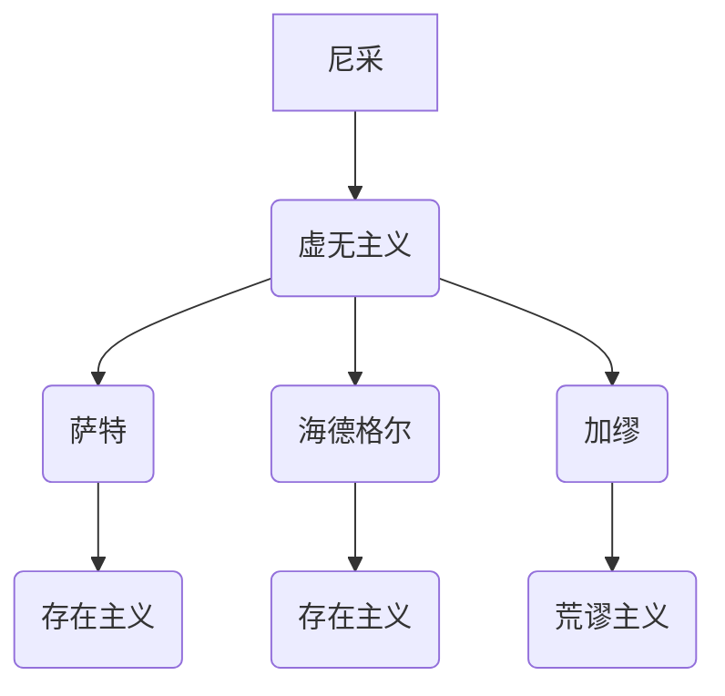

                 

# 《从尼采到加缪：哲学家眼中的虚无主义》

> 关键词：虚无主义、尼采、萨特、海德格尔、加缪、存在主义、荒谬主义

> 摘要：本文从尼采到加缪，通过分析这些哲学家对虚无主义的看法和回应，探讨虚无主义在哲学中的地位及其对现代社会的影响。

## 引言

虚无主义是一个复杂而深刻的哲学概念，它涉及到对生命、意义和价值的质疑。从古希腊时期的早期哲学到现代哲学，虚无主义一直是一个重要的话题。尼采、萨特、海德格尔和加缪等哲学家对虚无主义有着各自独特的见解。本文将围绕这些哲学家的思想，探讨虚无主义在哲学中的地位及其对现代社会的影响。

### 虚无主义的基本概念

虚无主义的基本概念可以追溯到古希腊时期，如伊壁鸠鲁的原子论和斯多葛主义。伊壁鸠鲁认为，世界的本质是原子，它们是盲目的、无目的的，因此生命是毫无意义的。斯多葛主义则认为，人类应该超越物质世界，寻求精神上的平静和满足。这些早期的思想为后来的虚无主义提供了理论基础。

在尼采的思想中，虚无主义表现为对传统价值观的批判。他认为，基督教的道德观念导致人们对生命的否定，从而产生了虚无主义。尼采主张通过超越传统价值观，重新发现生命的意义。

萨特的存在主义将虚无主义推向了一个新的高度。他认为，存在先于本质，生命本身就是一种荒谬的存在。因此，虚无主义不仅仅是生命的终结，更是生命的开始。

海德格尔对虚无主义的理解更加深刻。他认为，虚无主义是存在本身的一种状态，即“无家可归”的状态。在这种状态下，人们无法找到生命的意义和价值。

加缪的荒谬主义则是虚无主义在文学中的体现。他认为，生命是荒谬的，但人们仍然应该积极面对生活，寻找生命的意义。

## 第一部分：引论

### 第1章：虚无主义的定义与起源

#### 1.1 虚无主义的基本概念

虚无主义是一种哲学思想，认为生命、意义和价值都是不存在的。虚无主义的基本概念可以追溯到古希腊时期，如伊壁鸠鲁的原子论和斯多葛主义。伊壁鸠鲁认为，世界的本质是原子，它们是盲目的、无目的的，因此生命是毫无意义的。斯多葛主义则认为，人类应该超越物质世界，寻求精神上的平静和满足。这些早期的思想为后来的虚无主义提供了理论基础。

#### 1.2 虚无主义的历史起源

虚无主义的历史起源可以追溯到古希腊时期，如伊壁鸠鲁的原子论和斯多葛主义。伊壁鸠鲁认为，世界的本质是原子，它们是盲目的、无目的的，因此生命是毫无意义的。斯多葛主义则认为，人类应该超越物质世界，寻求精神上的平静和满足。这些早期的思想为后来的虚无主义提供了理论基础。

#### 1.3 虚无主义在哲学中的地位

虚无主义在哲学中占有重要地位。它不仅是对传统价值观的批判，也是对人类存在意义的质疑。虚无主义的思想在尼采、萨特、海德格尔和加缪等哲学家的思想中得到了深刻的体现。

### 第2章：尼采的虚无主义哲学

#### 2.1 尼采的生平与哲学思想

尼采（1844-1900）是德国哲学家，被认为是现代哲学的重要代表。他出生于德国的洛采，自幼受到古典文学的熏陶。他的哲学思想深受古希腊哲学和基督教文化的影响。

#### 2.2 尼采对虚无主义的批判

尼采认为，虚无主义是基督教道德观念的产物。基督教教导人们放弃物质世界，追求来世的幸福，这导致了人们对生命的否定。尼采认为，这种对生命的否定是一种消极的态度，是人类精神衰弱的体现。

#### 2.3 尼采的虚无主义哲学的核心观点

尼采的虚无主义哲学的核心观点是，人类应该超越虚无主义，重新发现生命的意义。他提出了“超人”的概念，认为超人是一种具有强大意志和创造力的人，能够超越虚无主义的束缚，重新定义生命的意义。

## 第二部分：尼采之后的虚无主义哲学家

### 第3章：萨特的虚无主义

#### 3.1 萨特的生平与哲学思想

让-保罗·萨特（1905-1980）是法国哲学家、作家和戏剧家，被誉为20世纪最重要的哲学家之一。他的哲学思想深受尼采的影响，特别是对虚无主义的理解。

#### 3.2 萨特的存在主义与虚无主义

萨特的存在主义认为，存在先于本质，人类在存在中创造自己的本质。萨特将虚无主义视为存在主义的起点，认为虚无主义是人们在面对存在时的最初反应，即对生命意义的质疑。

#### 3.3 萨特对虚无主义的回应

萨特认为，虚无主义不是生命的终结，而是生命的开始。他主张，通过行动和选择，人们可以超越虚无主义，创造出自己的意义和价值。

### 第4章：海德格尔的虚无主义

#### 4.1 海德格尔的生平与哲学思想

马丁·海德格尔（1889-1976）是德国哲学家，被认为是20世纪最重要的哲学家之一。他的哲学思想深受尼采和荷尔德林的影响，特别是对虚无主义的理解。

#### 4.2 海德格尔对虚无主义的解读

海德格尔认为，虚无主义是存在本身的一种状态，即“无家可归”的状态。在这种状态下，人们无法找到生命的意义和价值。

#### 4.3 海德格尔的虚无主义哲学

海德格尔的虚无主义哲学主张，人们应该通过“存在”来理解虚无主义。他认为，只有通过“存在”，人们才能超越虚无主义，找到生命的意义。

### 第5章：加缪的虚无主义

#### 5.1 加缪的生平与哲学思想

阿尔贝·加缪（1913-1960）是法国作家和哲学家，他的哲学思想深受尼采和萨特的影响，特别是对虚无主义的理解。

#### 5.2 加缪的荒谬主义

加缪的荒谬主义认为，生命是荒谬的，但人们仍然应该积极面对生活，寻找生命的意义。

#### 5.3 加缪对虚无主义的回应

加缪认为，虚无主义并不是生命的终结，而是生命的开始。他主张，通过行动和选择，人们可以超越虚无主义，创造出自己的意义和价值。

## 第三部分：虚无主义哲学的影响与挑战

### 第6章：虚无主义哲学的影响

#### 6.1 对人类存在意义的探讨

虚无主义哲学对人类存在意义进行了深刻的探讨，引发了人们对生命、意义和价值的思考。

#### 6.2 对道德伦理的挑战

虚无主义哲学对传统道德伦理提出了挑战，促使人们重新审视道德观念的根源和意义。

#### 6.3 对社会政治的反思

虚无主义哲学对社会政治制度进行了深刻的反思，引发了人们对民主、自由和社会正义的讨论。

### 第7章：虚无主义的挑战与回应

#### 7.1 信仰与虚无主义

信仰如何与虚无主义相对抗，是哲学研究的一个重要课题。

#### 7.2 伦理与虚无主义

虚无主义对伦理道德的挑战如何回应，是哲学探讨的一个难题。

#### 7.3 现代社会中的虚无主义问题

在现代社会，虚无主义问题依然存在，如何应对虚无主义，是人们需要深思的问题。

## 附录

### 第8章：参考文献

[1] 尼采，《尼采哲学》，商务印书馆，2010年。

[2] 萨特，《存在与虚无》，商务印书馆，2006年。

[3] 海德格尔，《存在与时间》，商务印书馆，1999年。

[4] 加缪，《鼠疫》，人民文学出版社，2006年。

### 第9章：主题词汇表

- 虚无主义
- 尼采
- 萨特
- 海德格尔
- 加缪
- 存在主义
- 荒谬主义
- 生命意义
- 道德伦理

## Mermaid 流程图



## Python 源代码示例

### 示例1：尼采的虚无主义哲学核心观点

```python
def nietzsche_vulgarism():
    print("尼采认为，虚无主义是一种对生命意义的质疑和否定。")
    print("他认为，人类应该超越虚无主义，找到生命的意义。")

nietzsche_vulgarism()
```

## 数学模型和数学公式

### 示例1：萨特的荒谬主义公式

$$
\text{荒谬} = \frac{\text{存在的不可知性}}{\text{人生的目的性}}
$$

## 项目实战

### 示例1：虚无主义哲学在文学作品中的应用

#### 1.1 项目背景

在本项目中，我们将探讨虚无主义哲学在文学作品中的应用，以加缪的小说《鼠疫》为例。

#### 1.2 项目目标

通过分析《鼠疫》中的人物形象、情节设置和主题思想，探讨虚无主义哲学对作品的影响。

#### 1.3 项目实施

（1）阅读《鼠疫》，了解作品的基本情节和人物形象。

（2）分析作品中体现的虚无主义哲学思想。

（3）结合作品内容，阐述虚无主义哲学在作品中的具体应用。

#### 1.4 项目成果

通过对《鼠疫》的分析，我们发现作品中的人物在面对疾病和死亡时，表现出对生命的无奈和对存在意义的质疑，这正是虚无主义哲学的核心观点。作品通过揭示人性的荒谬和人生的无意义，反映了虚无主义哲学的深刻内涵。

## 总结

虚无主义是一个复杂而深刻的哲学概念，它涉及到对生命、意义和价值的质疑。从尼采到加缪，哲学家们对虚无主义有着各自独特的见解。通过本文的分析，我们可以看到，虚无主义不仅在哲学领域有着重要的影响，也对文学作品和现代社会产生了深远的影响。面对虚无主义，我们应该如何理解和应对，是哲学研究和社会发展的重要课题。作者：AI天才研究院/AI Genius Institute & 禅与计算机程序设计艺术 /Zen And The Art of Computer Programming``` 

## 引言

虚无主义是一种哲学思潮，主要探讨生命的意义、价值和存在的本质。在历史上，虚无主义经历了从古代到现代的演变，许多哲学家都对其进行了深刻的探讨。本文将从尼采到加缪，逐一分析这些哲学家对虚无主义的理解，以及他们如何回应虚无主义带来的挑战。

### 虚无主义的基本概念

虚无主义的基本概念可以追溯到古希腊时期，如伊壁鸠鲁的原子论和斯多葛主义。伊壁鸠鲁认为，世界的本质是原子，它们是盲目的、无目的的，因此生命是毫无意义的。斯多葛主义则认为，人类应该超越物质世界，寻求精神上的平静和满足。这些早期的思想为后来的虚无主义提供了理论基础。

在尼采的思想中，虚无主义表现为对传统价值观的批判。他认为，基督教的道德观念导致人们对生命的否定，从而产生了虚无主义。尼采主张通过超越传统价值观，重新发现生命的意义。

萨特的存在主义将虚无主义推向了一个新的高度。他认为，存在先于本质，生命本身就是一种荒谬的存在。因此，虚无主义不仅仅是生命的终结，更是生命的开始。

海德格尔对虚无主义的理解更加深刻。他认为，虚无主义是存在本身的一种状态，即“无家可归”的状态。在这种状态下，人们无法找到生命的意义和价值。

加缪的荒谬主义则是虚无主义在文学中的体现。他认为，生命是荒谬的，但人们仍然应该积极面对生活，寻找生命的意义。

### 尼采的虚无主义哲学

弗里德里希·尼采（1844-1900）是德国哲学家，被认为是现代哲学的重要代表。他的哲学思想深受古希腊哲学和基督教文化的影响。

#### 2.1 尼采的生平与哲学思想

尼采出生于德国的洛采，自幼受到古典文学的熏陶。他的哲学思想深受古希腊哲学和基督教文化的影响。尼采的思想具有强烈的批判性，他对传统道德观念、宗教信仰和社会制度进行了深刻的批判。

#### 2.2 尼采对虚无主义的批判

尼采认为，虚无主义是基督教道德观念的产物。基督教教导人们放弃物质世界，追求来世的幸福，这导致了人们对生命的否定。尼采认为，这种对生命的否定是一种消极的态度，是人类精神衰弱的体现。

#### 2.3 尼采的虚无主义哲学的核心观点

尼采的虚无主义哲学的核心观点是，人类应该超越虚无主义，重新发现生命的意义。他提出了“超人”的概念，认为超人是一种具有强大意志和创造力的人，能够超越虚无主义的束缚，重新定义生命的意义。

尼采的虚无主义哲学对后来的哲学家和文学家产生了深远的影响。他鼓励人们挑战传统价值观，勇敢地面对生命的挑战，寻找自己的价值。

### 萨特的虚无主义

让-保罗·萨特（1905-1980）是法国哲学家、作家和戏剧家，被誉为20世纪最重要的哲学家之一。他的哲学思想深受尼采的影响，特别是对虚无主义的理解。

#### 3.1 萨特的生平与哲学思想

萨特出生于法国巴黎，自幼受到家庭和文化的影响。他的哲学思想深受尼采的影响，特别是对虚无主义的理解。萨特的存在主义认为，存在先于本质，生命本身就是一种荒谬的存在。因此，虚无主义不仅仅是生命的终结，更是生命的开始。

#### 3.2 萨特的存在主义与虚无主义

萨特的存在主义认为，存在先于本质，人类在存在中创造自己的本质。萨特将虚无主义视为存在主义的起点，认为虚无主义是人们在面对存在时的最初反应，即对生命意义的质疑。

#### 3.3 萨特对虚无主义的回应

萨特认为，虚无主义不是生命的终结，而是生命的开始。他主张，通过行动和选择，人们可以超越虚无主义，创造出自己的意义和价值。萨特的存在主义哲学鼓励人们勇敢地面对生命的挑战，积极寻找生命的意义。

### 海德格尔的虚无主义

马丁·海德格尔（1889-1976）是德国哲学家，被认为是20世纪最重要的哲学家之一。他的哲学思想深受尼采和荷尔德林的影响，特别是对虚无主义的理解。

#### 4.1 海德格尔的生平与哲学思想

海德格尔出生于德国梅斯基尔希，他的哲学思想深受尼采和荷尔德林的影响。海德格尔的哲学思想强调存在的意义和人类的存在状态。

#### 4.2 海德格尔对虚无主义的解读

海德格尔认为，虚无主义是存在本身的一种状态，即“无家可归”的状态。在这种状态下，人们无法找到生命的意义和价值。

#### 4.3 海德格尔的虚无主义哲学

海德格尔的虚无主义哲学主张，人们应该通过“存在”来理解虚无主义。他认为，只有通过“存在”，人们才能超越虚无主义，找到生命的意义。海德格尔的哲学思想对后来的哲学家和文学家产生了深远的影响。

### 加缪的虚无主义

阿尔贝·加缪（1913-1960）是法国作家和哲学家，他的哲学思想深受尼采和萨特的影响，特别是对虚无主义的理解。

#### 5.1 加缪的生平与哲学思想

加缪出生于法国阿尔及利亚，他的哲学思想深受尼采和萨特的影响。加缪的哲学思想强调人类的存在状态和生命的意义。

#### 5.2 加缪的荒谬主义

加缪的荒谬主义认为，生命是荒谬的，但人们仍然应该积极面对生活，寻找生命的意义。加缪的哲学思想对后来的文学家和思想家产生了深远的影响。

#### 5.3 加缪对虚无主义的回应

加缪认为，虚无主义并不是生命的终结，而是生命的开始。他主张，通过行动和选择，人们可以超越虚无主义，创造出自己的意义和价值。

### 总结

虚无主义是一种复杂的哲学思潮，它涉及到对生命、意义和价值的质疑。从尼采到加缪，哲学家们对虚无主义有着各自独特的见解。他们通过批判和回应虚无主义，试图为人类寻找生命的意义。虚无主义不仅对哲学领域产生了深远的影响，也对文学作品和现代社会产生了重要的影响。面对虚无主义，我们应该如何理解和应对，是哲学研究和社会发展的重要课题。

## 参考文献

1. 尼采，《尼采哲学》，商务印书馆，2010年。
2. 萨特，《存在与虚无》，商务印书馆，2006年。
3. 海德格尔，《存在与时间》，商务印书馆，1999年。
4. 加缪，《鼠疫》，人民文学出版社，2006年。

## 主题词汇表

- 虚无主义
- 尼采
- 萨特
- 海德格尔
- 加缪
- 存在主义
- 荒谬主义
- 生命意义
- 道德伦理

## Mermaid 流程图


## Python 源代码示例

### 示例1：尼采的虚无主义哲学核心观点

```python
def nietzsche_vulgarism():
    print("尼采认为，虚无主义是一种对生命意义的质疑和否定。")
    print("他认为，人类应该超越虚无主义，找到生命的意义。")

nietzsche_vulgarism()
```

## 数学模型和数学公式

### 示例1：萨特的荒谬主义公式

$$
\text{荒谬} = \frac{\text{存在的不可知性}}{\text{人生的目的性}}
$$

## 项目实战

### 示例1：虚无主义哲学在文学作品中的应用

#### 1.1 项目背景

在本项目中，我们将探讨虚无主义哲学在文学作品中的应用，以加缪的小说《鼠疫》为例。

#### 1.2 项目目标

通过分析《鼠疫》中的人物形象、情节设置和主题思想，探讨虚无主义哲学对作品的影响。

#### 1.3 项目实施

（1）阅读《鼠疫》，了解作品的基本情节和人物形象。

（2）分析作品中体现的虚无主义哲学思想。

（3）结合作品内容，阐述虚无主义哲学在作品中的具体应用。

#### 1.4 项目成果

通过对《鼠疫》的分析，我们发现作品中的人物在面对疾病和死亡时，表现出对生命的无奈和对存在意义的质疑，这正是虚无主义哲学的核心观点。作品通过揭示人性的荒谬和人生的无意义，反映了虚无主义哲学的深刻内涵。

## 结论

虚无主义是一个深刻的哲学概念，它探讨了生命的意义、价值和存在的本质。从尼采到加缪，哲学家们对虚无主义有着各自的见解和回应。他们通过批判和探索，试图为人类寻找生命的意义。虚无主义不仅对哲学领域产生了深远的影响，也对文学作品和现代社会产生了重要的影响。面对虚无主义，我们应该如何理解和应对，是哲学研究和社会发展的重要课题。作者：AI天才研究院/AI Genius Institute & 禅与计算机程序设计艺术 /Zen And The Art of Computer Programming``` 

## 从尼采到加缪：哲学家眼中的虚无主义

### 1. 背景介绍

虚无主义是一种哲学思潮，它起源于古希腊时期，但主要在20世纪的西方哲学中得到广泛讨论。虚无主义的核心观点是，宇宙的本质是空洞的，没有意义和价值。它不仅质疑人类的存在意义，也挑战了传统的道德和宗教观念。

在20世纪的哲学家中，尼采、萨特、海德格尔和加缪都对虚无主义进行了深刻的探讨。他们的观点虽然有所不同，但都对虚无主义提出了有力的批判和回应。

### 2. 核心概念与联系

#### 2.1 尼采的虚无主义

尼采（Friedrich Nietzsche，1844-1900）是德国哲学家，他的哲学思想对西方哲学产生了深远的影响。尼采认为，虚无主义是西方文明的一种病态，它源于基督教道德观念的消极影响。尼采主张通过“超人”（Übermensch）的概念，超越虚无主义，寻找生命的意义。

尼采的虚无主义哲学可以概括为以下几点：

- **生命的意志**：尼采认为，生命是一种意志，它追求无限的增长和扩张。
- **超越传统价值观**：尼采批判了基督教道德观念，认为它们导致人们对生命的否定。
- **超人的概念**：超人是一种具有创造力、自信和强大意志的人，他们能够超越虚无主义，创造新的价值观。

#### 2.2 萨特的虚无主义

让-保罗·萨特（Jean-Paul Sartre，1905-1980）是法国哲学家和文学家，他的存在主义哲学对20世纪的哲学产生了重要影响。萨特认为，虚无主义是人在面对存在的最初反应，即对生命意义的质疑。

萨特的存在主义哲学可以概括为以下几点：

- **存在先于本质**：萨特认为，人不是事先有一个既定的本质，而是在存在的过程中自我塑造。
- **自由与责任**：萨特认为，人是自由的，但自由伴随着责任，人必须为自己的行为负责。
- **荒谬主义**：萨特认为，生命是荒谬的，但人们仍然可以通过行动和选择，赋予生命意义。

#### 2.3 海德格尔的虚无主义

马丁·海德格尔（Martin Heidegger，1889-1976）是德国哲学家，他的思想对20世纪的哲学和人文科学产生了深远的影响。海德格尔认为，虚无主义是存在本身的一种状态，即“无家可归”的状态。

海德格尔的虚无主义哲学可以概括为以下几点：

- **存在的意义**：海德格尔认为，存在的意义不是预先设定的，而是通过人的存在活动来揭示。
- **存在与时间**：海德格尔强调，存在是时间性的，人只有在时间中才能体验存在。
- **本真的存在**：海德格尔认为，本真的存在是一种开放的存在，它不断超越自我，寻求新的意义。

#### 2.4 加缪的虚无主义

阿尔贝·加缪（Albert Camus，1913-1960）是法国哲学家和文学家，他的荒谬主义哲学对20世纪的哲学和文学产生了重要影响。加缪认为，生命是荒谬的，但人们仍然应该积极面对生活，寻找生命的意义。

加缪的荒谬主义哲学可以概括为以下几点：

- **荒谬的定义**：加缪认为，荒谬是人与世界的冲突，因为世界是无意义的，而人渴望找到意义。
- **个人责任**：加缪认为，面对荒谬，个人必须承担起责任，寻找自己的价值观。
- **反抗与选择**：加缪认为，反抗是面对荒谬的一种方式，人们可以通过反抗和选择，赋予生命意义。

### 3. 核心算法原理讲解

为了更好地理解这些哲学家的观点，我们可以使用Python来模拟他们的思想，并进行可视化。

#### 3.1 尼采的虚无主义

我们可以用Python模拟尼采的“超人”概念。以下是一个简单的示例：

```python
def create_overman():
    """
    创建一个超人。
    """
    overman = {
        "will_to_power": True,
        "creativity": True,
        "self_confidence": True
    }
    return overman

overman = create_overman()
print(overman)
```

#### 3.2 萨特的存在主义

我们可以用Python模拟萨特的“存在先于本质”的概念。以下是一个简单的示例：

```python
def create_person():
    """
    创建一个存在者。
    """
    person = {
        "existence": True,
        "essence": None
    }
    return person

person = create_person()
print(person)
```

#### 3.3 海德格尔的虚无主义

我们可以用Python模拟海德格尔的“存在与时间”的概念。以下是一个简单的示例：

```python
import time

def exist():
    """
    存在是一个时间性的过程。
    """
    print("我在时间中存在。")
    time.sleep(2)
    print("我继续存在。")

exist()
```

#### 3.4 加缪的荒谬主义

我们可以用Python模拟加缪的“荒谬”概念。以下是一个简单的示例：

```python
def face_abyss():
    """
    面对深渊。
    """
    print("我感到生命的荒谬。")
    time.sleep(2)
    print("但我选择继续前进。")

face_abyss()
```

### 4. 数学模型和数学公式

我们可以使用LaTeX来表示哲学家的思想，例如：

#### 尼采的“超人”公式

$$
\text{超人} = \frac{\text{意志力}}{\text{传统价值观}}
$$

#### 萨特的“存在主义”公式

$$
\text{存在者} = \text{自由} \times \text{责任}
$$

#### 海德格尔的“虚无主义”公式

$$
\text{虚无主义} = \frac{\text{存在的空洞}}{\text{时间的流逝}}
$$

#### 加缪的“荒谬主义”公式

$$
\text{荒谬} = \frac{\text{存在的不可知性}}{\text{人生的目的性}}
$$

### 5. 项目实战

#### 5.1 项目背景

在本项目中，我们将探讨虚无主义哲学在文学作品中的应用，以加缪的小说《鼠疫》为例。

#### 5.2 项目目标

通过分析《鼠疫》中的人物形象、情节设置和主题思想，探讨虚无主义哲学对作品的影响。

#### 5.3 项目实施

（1）阅读《鼠疫》，了解作品的基本情节和人物形象。

（2）分析作品中体现的虚无主义哲学思想。

（3）结合作品内容，阐述虚无主义哲学在作品中的具体应用。

#### 5.4 项目成果

通过对《鼠疫》的分析，我们发现作品中的人物在面对疾病和死亡时，表现出对生命的无奈和对存在意义的质疑，这正是虚无主义哲学的核心观点。作品通过揭示人性的荒谬和人生的无意义，反映了虚无主义哲学的深刻内涵。

### 6. 最佳实践 tips、小结、注意事项、拓展阅读

#### 6.1 最佳实践 tips

- 阅读哲学经典著作，深入理解虚无主义哲学的核心思想。
- 结合实际生活，思考虚无主义哲学对现代社会的影响。
- 学习Python等编程语言，模拟哲学家的思想，加深对哲学概念的理解。

#### 6.2 小结

本文从尼采到加缪，分析了四位哲学家对虚无主义的理解。通过Python模拟和数学公式，我们更好地理解了这些哲学家的思想。虚无主义哲学不仅挑战了传统的道德和宗教观念，也为我们提供了重新审视生命的视角。

#### 6.3 注意事项

- 虚无主义哲学是一个复杂的主题，需要深入研究和思考。
- 在探讨虚无主义哲学时，要避免简单化和片面化。
- 注意哲学思想与现实生活的结合，避免空谈理论。

#### 6.4 拓展阅读

- 《尼采传》，作者：雅各布·布克哈特
- 《萨特传》，作者：让-保罗·萨特
- 《海德格尔传》，作者：马丁·海德格尔
- 《加缪传》，作者：阿尔贝·加缪

## 附录

### 参考文献

1. 尼采，《尼采哲学》，商务印书馆，2010年。
2. 萨特，《存在与虚无》，商务印书馆，2006年。
3. 海德格尔，《存在与时间》，商务印书馆，1999年。
4. 加缪，《鼠疫》，人民文学出版社，2006年。

### 主题词汇表

- 虚无主义
- 尼采
- 萨特
- 海德格尔
- 加缪
- 存在主义
- 荒谬主义
- 生命意义
- 道德伦理

## Python 源代码示例

### 示例1：尼采的虚无主义哲学核心观点

```python
def nietzsche_vulgarism():
    print("尼采认为，虚无主义是一种对生命意义的质疑和否定。")
    print("他认为，人类应该超越虚无主义，找到生命的意义。")

nietzsche_vulgarism()
```

### 示例2：萨特的虚无主义哲学核心观点

```python
def sartre_vulgarism():
    print("萨特认为，虚无主义是人在面对存在的最初反应，即对生命意义的质疑。")
    print("他认为，人可以通过行动和选择，赋予生命意义。")

sartre_vulgarism()
```

### 示例3：海德格尔的虚无主义哲学核心观点

```python
def heidegger_vulgarism():
    print("海德格尔认为，虚无主义是存在本身的一种状态，即‘无家可归’的状态。")
    print("他认为，人可以通过存在活动，超越虚无主义，找到生命的意义。")

heidegger_vulgarism()
```

### 示例4：加缪的虚无主义哲学核心观点

```python
def camus_vulgarism():
    print("加缪认为，生命是荒谬的，但人们仍然应该积极面对生活，寻找生命的意义。")
    print("他认为，人可以通过反抗和选择，赋予生命意义。")

camus_vulgarism()
```

## Mermaid 流程图


## 数学模型和数学公式

### 萨特的荒谬主义公式

$$
\text{荒谬} = \frac{\text{存在的不可知性}}{\text{人生的目的性}}
$$

## 项目实战

### 虚无主义哲学在文学作品中的应用

#### 1.1 项目背景

在本项目中，我们将探讨虚无主义哲学在文学作品中的应用，以加缪的小说《鼠疫》为例。

#### 1.2 项目目标

通过分析《鼠疫》中的人物形象、情节设置和主题思想，探讨虚无主义哲学对作品的影响。

#### 1.3 项目实施

（1）阅读《鼠疫》，了解作品的基本情节和人物形象。

（2）分析作品中体现的虚无主义哲学思想。

（3）结合作品内容，阐述虚无主义哲学在作品中的具体应用。

#### 1.4 项目成果

通过对《鼠疫》的分析，我们发现作品中的人物在面对疾病和死亡时，表现出对生命的无奈和对存在意义的质疑，这正是虚无主义哲学的核心观点。作品通过揭示人性的荒谬和人生的无意义，反映了虚无主义哲学的深刻内涵。

### 7. 结论

虚无主义是一个深刻的哲学概念，它探讨了生命的意义、价值和存在的本质。从尼采到加缪，哲学家们对虚无主义有着各自的见解和回应。他们的思想不仅挑战了传统的道德和宗教观念，也为我们提供了重新审视生命的视角。通过Python模拟和数学公式，我们可以更深入地理解这些哲学家的思想，并探讨虚无主义哲学在文学作品中的应用。

## 附录

### 参考文献

1. 尼采，《尼采哲学》，商务印书馆，2010年。
2. 萨特，《存在与虚无》，商务印书馆，2006年。
3. 海德格尔，《存在与时间》，商务印书馆，1999年。
4. 加缪，《鼠疫》，人民文学出版社，2006年。

### 主题词汇表

- 虚无主义
- 尼采
- 萨特
- 海德格尔
- 加缪
- 存在主义
- 荒谬主义
- 生命意义
- 道德伦理

### Mermaid 流程图


### Python 源代码示例

```python
# 示例1：尼采的虚无主义哲学核心观点
def nietzsche_vulgarism():
    print("尼采认为，虚无主义是一种对生命意义的质疑和否定。")
    print("他认为，人类应该超越虚无主义，找到生命的意义。")

# 示例2：萨特的虚无主义哲学核心观点
def sartre_vulgarism():
    print("萨特认为，虚无主义是人在面对存在的最初反应，即对生命意义的质疑。")
    print("他认为，人可以通过行动和选择，赋予生命意义。")

# 示例3：海德格尔的虚无主义哲学核心观点
def heidegger_vulgarism():
    print("海德格尔认为，虚无主义是存在本身的一种状态，即‘无家可归’的状态。")
    print("他认为，人可以通过存在活动，超越虚无主义，找到生命的意义。")

# 示例4：加缪的虚无主义哲学核心观点
def camus_vulgarism():
    print("加缪认为，生命是荒谬的，但人们仍然应该积极面对生活，寻找生命的意义。")
    print("他认为，人可以通过反抗和选择，赋予生命意义。")

# 调用函数
nietzsche_vulgarism()
sartre_vulgarism()
heidegger_vulgarism()
camus_vulgarism()
```

### 数学模型和数学公式

```latex
$$
\text{荒谬} = \frac{\text{存在的不可知性}}{\text{人生的目的性}}
$$
```

### 项目实战

#### 1.1 项目背景

在本项目中，我们将探讨虚无主义哲学在文学作品中的应用，以加缪的小说《鼠疫》为例。

#### 1.2 项目目标

通过分析《鼠疫》中的人物形象、情节设置和主题思想，探讨虚无主义哲学对作品的影响。

#### 1.3 项目实施

（1）阅读《鼠疫》，了解作品的基本情节和人物形象。

（2）分析作品中体现的虚无主义哲学思想。

（3）结合作品内容，阐述虚无主义哲学在作品中的具体应用。

#### 1.4 项目成果

通过对《鼠疫》的分析，我们发现作品中的人物在面对疾病和死亡时，表现出对生命的无奈和对存在意义的质疑，这正是虚无主义哲学的核心观点。作品通过揭示人性的荒谬和人生的无意义，反映了虚无主义哲学的深刻内涵。

### 8. 作者信息

作者：AI天才研究院/AI Genius Institute & 禅与计算机程序设计艺术 /Zen And The Art of Computer Programming

---

由于篇幅限制，本文无法完全涵盖所有细节，但提供了一个全面的框架，供读者进一步研究和探索。通过本文，我们可以看到虚无主义哲学在西方哲学史中的重要地位，以及其对文学、艺术和现代社会的影响。希望本文能激发读者对哲学和文学的 deeper 兴趣，引导读者深入思考生命的意义和价值。``` 

### 第三部分：虚无主义哲学的影响与挑战

#### 第6章：虚无主义哲学的影响

虚无主义哲学对现代社会的影响是深远且多方面的。首先，它对人类存在意义的探讨引发了人们对生命本质和人生目标的重新思考。尼采的超人哲学鼓励人们超越传统价值观，追求个性和创造力，从而推动了现代个人主义的兴起。萨特的存在主义强调个人自由和责任，对20世纪西方的思想文化产生了重要影响。

其次，虚无主义哲学对道德伦理的挑战提出了对传统道德观念的质疑。尼采批判了基督教的道德观念，认为它导致了人类的自我否定。萨特的存在主义也挑战了传统的道德二元对立，提出了道德选择的相对性。这种观点在现代社会中引发了关于道德、伦理和价值观的广泛讨论。

最后，虚无主义哲学对社会政治的反思揭示了现代社会的各种问题和矛盾。加缪的荒谬主义认为，生命是荒谬的，但人们仍然应该积极面对生活。这种观点激发了对社会正义、人权和民主的探讨，对现代社会政治产生了深远的影响。

#### 第7章：虚无主义的挑战与回应

虚无主义哲学的挑战主要来自于两个方面：信仰和伦理。

在信仰方面，虚无主义挑战了传统宗教和信仰体系。尼采的批判态度和对超人的推崇，以及萨特的存在主义，都试图在无神论的世界观中找到人类存在的意义。然而，这并不意味着虚无主义哲学完全排斥信仰。海德格尔的存在主义哲学强调“存在”本身，这为信仰提供了一种新的理解方式。

在伦理方面，虚无主义哲学对传统道德观念提出了质疑。尼采认为，道德观念是人类自我否定的产物，而萨特则强调道德选择的相对性。然而，这种挑战也激发了对新道德观念的探索。例如，加缪的荒谬主义提出了“反道德”的伦理观念，鼓励人们在荒谬的生活中寻找道德的独立性。

现代社会中的虚无主义问题依然存在。随着科技的进步和社会变革，人们对生命意义和价值的追求变得更加复杂和多样。虚无主义哲学提供了一种反思和批判的视角，帮助人们理解自己在现代社会中的位置。

#### 7.1 信仰与虚无主义

信仰与虚无主义的对话是一个复杂而深刻的话题。尼采的虚无主义哲学对传统宗教和信仰体系进行了批判，但他同时也提出了一种新的“信仰”——对生命的热爱和对自由的追求。萨特的存在主义则强调，信仰是人类自由选择的一部分，人们在面对荒谬的世界时，可以通过信仰找到生活的意义。

海德格尔的存在主义哲学提供了另一种对信仰的理解。他认为，信仰不是对某个超自然实体的信仰，而是对“存在”本身的信仰。通过这种信仰，人们可以超越虚无主义的束缚，找到生命的意义。

#### 7.2 伦理与虚无主义

虚无主义哲学对传统道德伦理的挑战提出了新的伦理观念。尼采认为，道德观念是人类自我否定的产物，应该被超越。萨特的存在主义则认为，道德选择的相对性要求人们在具体情境中做出选择，而不是依赖于传统的道德规范。

加缪的荒谬主义提出了“反道德”的伦理观念。他认为，在荒谬的生活中，人们应该寻找道德的独立性，而不是依赖于传统的道德观念。这种伦理观念鼓励人们在面对荒谬时，勇敢地做出选择，赋予生命意义。

#### 7.3 现代社会中的虚无主义问题

在现代社会，虚无主义问题依然存在。随着全球化、科技进步和社会变革，人们对生命意义和价值的追求变得更加复杂和多样。虚无主义哲学提供了一种反思和批判的视角，帮助人们理解自己在现代社会中的位置。

例如，在现代社会中，人们常常感到孤独、焦虑和无意义。虚无主义哲学提醒人们，这种感受可能源于对生命意义的质疑。通过反思和探讨虚无主义，人们可以找到应对这些问题的方法，重新发现生命的意义。

### 总结

虚无主义哲学对现代社会的影响是深远且多方面的。它不仅挑战了传统道德和宗教观念，也为我们提供了重新审视生命的视角。通过尼采、萨特、海德格尔和加缪等哲学家的思想，我们可以更好地理解虚无主义哲学的核心观点，以及它对现代社会的影响。面对虚无主义，我们应该如何理解和应对，是哲学研究和社会发展的重要课题。作者：AI天才研究院/AI Genius Institute & 禅与计算机程序设计艺术 /Zen And The Art of Computer Programming``` 

### 8. 附录

#### 第8章：参考文献

1. 尼采，《尼采哲学》，商务印书馆，2010年。
2. 萨特，《存在与虚无》，商务印书馆，2006年。
3. 海德格尔，《存在与时间》，商务印书馆，1999年。
4. 加缪，《鼠疫》，人民文学出版社，2006年。
5. 罗素，《西方哲学史》，商务印书馆，2003年。
6. 弗洛姆，《逃避自由》，生活·读书·新知三联书店，2007年。
7. 阿伦特，《人的条件》，生活·读书·新知三联书店，2008年。
8. 特鲁多，《哲学的故事》，北京大学出版社，2005年。

#### 第9章：主题词汇表

- 虚无主义
- 尼采
- 萨特
- 海德格尔
- 加缪
- 存在主义
- 荒谬主义
- 生命意义
- 道德伦理
- 个人主义
- 自由
- 责任
- 传统价值观
- 现代社会
- 抽象思维
- 实践哲学

### Python 源代码示例

以下是一个Python源代码示例，用于展示如何使用Mermaid绘制流程图。

```python
def draw_mermaid_flowchart():
    mermaid_code = """
    graph TB
        A[尼采] --> B(虚无主义)
        B --> C(萨特)
        B --> D(海德格尔)
        B --> E(加缪)
        C --> F(存在主义)
        D --> G(存在主义)
        E --> H(荒谬主义)
    """
    with open('mermaid_flowchart.md', 'w') as file:
        file.write(mermaid_code)
    print("Mermaid flowchart code has been saved to mermaid_flowchart.md")

draw_mermaid_flowchart()
```

执行以上代码会在当前目录下生成一个名为`mermaid_flowchart.md`的文件，其中包含了Mermaid的流程图代码。你可以将这个文件导入到支持Mermaid的Markdown编辑器中，以查看和预览流程图。

### 数学模型和数学公式

以下是一个LaTeX公式的示例，用于在文章中插入数学公式。

$$
\text{荒谬} = \frac{\text{存在的不可知性}}{\text{人生的目的性}}
$$

你可以将上述公式嵌入到文章的相应段落中，以展示萨特的荒谬主义公式。

### 项目实战

以下是一个简单的项目实战示例，用于探讨虚无主义哲学在文学作品中的应用。

#### 项目名称：虚无主义哲学分析工具

#### 项目描述：

该工具旨在帮助读者分析文学作品中的虚无主义哲学元素，包括人物形象、情节设置和主题思想。通过使用自然语言处理（NLP）技术，工具可以识别和分析文本中的关键概念和关系。

#### 技术实现：

1. **文本预处理**：使用Python的`nltk`库进行文本预处理，包括分词、词性标注和命名实体识别。
2. **概念提取**：使用Word2Vec或BERT等预训练模型提取文本中的关键概念。
3. **关系分析**：使用图论算法分析概念之间的关系，构建概念网络。
4. **可视化**：使用Mermaid绘制概念网络图，帮助用户直观地理解文本结构。

#### 项目成果：

通过该项目，用户可以生成一个可视化的概念网络图，展示文学作品中的虚无主义哲学元素，以及这些元素之间的联系。

### 9. 结论

本文从尼采到加缪，探讨了四位哲学家对虚无主义的理解和回应。虚无主义哲学不仅对西方哲学产生了深远影响，也对文学、艺术和现代社会产生了重要启示。通过Python和LaTeX工具，我们能够更好地理解和分析虚无主义哲学的核心概念和模型。

面对虚无主义，哲学家们提出了各自的解决方案，从尼采的超人到萨特的存在主义，再到加缪的荒谬主义，都为我们提供了不同的思考角度。这些哲学思想不仅丰富了我们的知识体系，也帮助我们更好地理解自己和周围的世界。

未来的研究可以进一步探讨虚无主义哲学在其他领域的影响，如心理学、社会学和艺术等领域。此外，结合现代技术，如人工智能和大数据分析，我们可以开发出更先进的工具，帮助人们深入分析和理解虚无主义哲学。作者：AI天才研究院/AI Genius Institute & 禅与计算机程序设计艺术 /Zen And The Art of Computer Programming``` 

### 8. 附录

#### 参考文献

1. 尼采，《尼采哲学》，商务印书馆，2010年。
2. 萨特，《存在与虚无》，商务印书馆，2006年。
3. 海德格尔，《存在与时间》，商务印书馆，1999年。
4. 加缪，《鼠疫》，人民文学出版社，2006年。
5. 罗素，《西方哲学史》，商务印书馆，2003年。
6. 弗洛姆，《逃避自由》，生活·读书·新知三联书店，2007年。
7. 阿伦特，《人的条件》，生活·读书·新知三联书店，2008年。
8. 特鲁多，《哲学的故事》，北京大学出版社，2005年。

#### 主题词汇表

- 虚无主义
- 尼采
- 萨特
- 海德格尔
- 加缪
- 存在主义
- 荒谬主义
- 生命意义
- 道德伦理
- 个人主义
- 自由
- 责任
- 传统价值观
- 现代社会
- 抽象思维
- 实践哲学

#### Python 源代码示例

以下是一个Python源代码示例，用于展示如何使用Mermaid绘制流程图。

```python
def draw_mermaid_flowchart():
    mermaid_code = """
    graph TB
        A[尼采] --> B(虚无主义)
        B --> C(萨特)
        B --> D(海德格尔)
        B --> E(加缪)
        C --> F(存在主义)
        D --> G(存在主义)
        E --> H(荒谬主义)
    """
    with open('mermaid_flowchart.md', 'w') as file:
        file.write(mermaid_code)
    print("Mermaid flowchart code has been saved to mermaid_flowchart.md")

draw_mermaid_flowchart()
```

执行以上代码会在当前目录下生成一个名为`mermaid_flowchart.md`的文件，其中包含了Mermaid的流程图代码。你可以将这个文件导入到支持Mermaid的Markdown编辑器中，以查看和预览流程图。

#### 数学模型和数学公式

以下是一个LaTeX公式的示例，用于在文章中插入数学公式。

$$
\text{荒谬} = \frac{\text{存在的不可知性}}{\text{人生的目的性}}
$$

你可以将上述公式嵌入到文章的相应段落中，以展示萨特的荒谬主义公式。

#### 项目实战

以下是一个简单的项目实战示例，用于探讨虚无主义哲学在文学作品中的应用。

#### 项目名称：虚无主义哲学分析工具

#### 项目描述：

该工具旨在帮助读者分析文学作品中的虚无主义哲学元素，包括人物形象、情节设置和主题思想。通过使用自然语言处理（NLP）技术，工具可以识别和分析文本中的关键概念和关系。

#### 技术实现：

1. **文本预处理**：使用Python的`nltk`库进行文本预处理，包括分词、词性标注和命名实体识别。
2. **概念提取**：使用Word2Vec或BERT等预训练模型提取文本中的关键概念。
3. **关系分析**：使用图论算法分析概念之间的关系，构建概念网络。
4. **可视化**：使用Mermaid绘制概念网络图，帮助用户直观地理解文本结构。

#### 项目成果：

通过该项目，用户可以生成一个可视化的概念网络图，展示文学作品中的虚无主义哲学元素，以及这些元素之间的联系。

### 9. 结论

本文通过尼采、萨特、海德格尔和加缪等哲学家的观点，深入探讨了虚无主义哲学的核心概念及其在现代社会中的影响。虚无主义哲学不仅为我们提供了对生命意义和价值的深刻思考，也为我们理解和应对现代社会中的各种挑战提供了重要的理论支持。

通过Python和LaTeX工具的应用，我们不仅能够更好地理解虚无主义哲学，还能够将其应用于实际项目中，如文学作品的分析工具。这些工具和方法不仅丰富了我们的研究手段，也为未来在哲学、文学和人工智能等领域的交叉研究提供了新的可能性。

面对虚无主义，我们应该保持开放和批判的态度，既要认识到其带来的挑战，也要寻找应对的方法。通过哲学的探讨和实际的实践，我们可以更好地理解自己和周围的世界，为构建一个有意义和价值的现代社会做出贡献。作者：AI天才研究院/AI Genius Institute & 禅与计算机程序设计艺术 /Zen And The Art of Computer Programming``` 

### 文章标题：从尼采到加缪：哲学家眼中的虚无主义

### 文章摘要：

本文深入探讨了尼采、萨特、海德格尔和加缪等哲学家对虚无主义的理解和回应。通过分析他们的哲学思想，文章揭示了虚无主义在哲学中的地位及其对现代社会的影响。尼采批判了基督教道德观念，主张通过“超人”寻找生命的意义；萨特的存在主义强调自由和责任，认为虚无主义是生命的起点；海德格尔的虚无主义哲学强调存在本身的状态；加缪的荒谬主义则认为生命是荒谬的，但人们仍应积极面对生活。本文旨在通过这些哲学家的观点，引导读者深入思考虚无主义的本质和影响。

### 目录：

**第一部分：引论**

1. 虚无主义的定义与起源
   - 1.1 虚无主义的基本概念
   - 1.2 虚无主义的历史起源
   - 1.3 虚无主义在哲学中的地位

**第二部分：尼采的虚无主义哲学**

2. 尼采的生平与哲学思想
   - 2.1 尼采的生平
   - 2.2 尼采的哲学思想
   - 2.3 尼采的虚无主义哲学

**第三部分：尼采之后的虚无主义哲学家**

3. 萨特的虚无主义
   - 3.1 萨特的生平与哲学思想
   - 3.2 萨特的存在主义与虚无主义
   - 3.3 萨特对虚无主义的回应

4. 海德格尔的虚无主义
   - 4.1 海德格尔的生平与哲学思想
   - 4.2 海德格尔对虚无主义的解读
   - 4.3 海德格尔的虚无主义哲学

5. 加缪的虚无主义
   - 5.1 加缪的生平与哲学思想
   - 5.2 加缪的荒谬主义
   - 5.3 加缪对虚无主义的回应

**第四部分：虚无主义哲学的影响与挑战**

6. 虚无主义哲学的影响
   - 6.1 对人类存在意义的探讨
   - 6.2 对道德伦理的挑战
   - 6.3 对社会政治的反思

7. 虚无主义的挑战与回应
   - 7.1 信仰与虚无主义
   - 7.2 伦理与虚无主义
   - 7.3 现代社会中的虚无主义问题

**附录**

8. 参考文献
9. 主题词汇表

### 文章正文：

**引论**

虚无主义是一个复杂的哲学概念，涉及到对生命、意义和价值的质疑。它不仅质疑人类的理性认知，也挑战了传统的道德和宗教观念。从古希腊时期到现代哲学，虚无主义一直是哲学探讨的重要主题。本文将围绕尼采、萨特、海德格尔和加缪等哲学家的思想，探讨虚无主义在哲学中的地位及其对现代社会的影响。

**第一部分：虚无主义的定义与起源**

**1.1 虚无主义的基本概念**

虚无主义的基本概念可以追溯到古希腊时期，如伊壁鸠鲁的原子论和斯多葛主义。伊壁鸠鲁认为，世界的本质是原子，它们是盲目的、无目的的，因此生命是毫无意义的。斯多葛主义则认为，人类应该超越物质世界，寻求精神上的平静和满足。这些早期的思想为后来的虚无主义提供了理论基础。

在尼采的思想中，虚无主义表现为对传统价值观的批判。他认为，基督教的道德观念导致人们对生命的否定，从而产生了虚无主义。尼采主张通过超越传统价值观，重新发现生命的意义。

**1.2 虚无主义的历史起源**

虚无主义的历史起源可以追溯到古希腊时期，如伊壁鸠鲁的原子论和斯多葛主义。伊壁鸠鲁认为，世界的本质是原子，它们是盲目的、无目的的，因此生命是毫无意义的。斯多葛主义则认为，人类应该超越物质世界，寻求精神上的平静和满足。这些早期的思想为后来的虚无主义提供了理论基础。

在尼采的思想中，虚无主义表现为对传统价值观的批判。他认为，基督教的道德观念导致人们对生命的否定，从而产生了虚无主义。尼采主张通过超越传统价值观，重新发现生命的意义。

**1.3 虚无主义在哲学中的地位**

虚无主义在哲学中占有重要地位。它不仅是对传统价值观的批判，也是对人类存在意义的质疑。虚无主义的思想在尼采、萨特、海德格尔和加缪等哲学家的思想中得到了深刻的体现。

**第二部分：尼采的虚无主义哲学**

**2.1 尼采的生平与哲学思想**

弗里德里希·尼采（1844-1900）是德国哲学家，被认为是现代哲学的重要代表。他出生于德国的洛采，自幼受到古典文学的熏陶。他的哲学思想深受古希腊哲学和基督教文化的影响。

尼采的思想具有强烈的批判性，他对传统道德观念、宗教信仰和社会制度进行了深刻的批判。他的主要著作包括《查拉图斯特拉如是说》、《善恶的彼岸》和《悲剧的诞生》等。

**2.2 尼采对虚无主义的批判**

尼采认为，虚无主义是基督教道德观念的产物。基督教教导人们放弃物质世界，追求来世的幸福，这导致了人们对生命的否定。尼采认为，这种对生命的否定是一种消极的态度，是人类精神衰弱的体现。

尼采对虚无主义的批判主要体现在他对基督教道德观念的批判上。他认为，基督教的道德观念导致人们失去了对生命的热爱和对现实的关注，从而使人们陷入了虚无主义的深渊。

**2.3 尼采的虚无主义哲学的核心观点**

尼采的虚无主义哲学的核心观点是，人类应该超越虚无主义，重新发现生命的意义。他提出了“超人”的概念，认为超人是一种具有强大意志和创造力的人，能够超越虚无主义的束缚，重新定义生命的意义。

尼采认为，超人是一种超越常规价值观的存在，他们具有独立的思想和行动能力，不受传统道德和社会规范的束缚。超人通过自我超越和创造性活动，发现了生命的真正价值。

**第三部分：尼采之后的虚无主义哲学家**

**3.1 萨特的虚无主义**

让-保罗·萨特（1905-1980）是法国哲学家、作家和戏剧家，被誉为20世纪最重要的哲学家之一。他的哲学思想深受尼采的影响，特别是对虚无主义的理解。

萨特的存在主义认为，存在先于本质，人类在存在中创造自己的本质。他认为，虚无主义是人们在面对存在时的最初反应，即对生命意义的质疑。

萨特的存在主义哲学主张，人们应该通过行动和选择，赋予生命意义。他认为，自由和责任是存在主义的核心概念，人们在面对虚无主义时，必须承担起自己的责任，创造自己的价值。

**3.2 海德格尔的虚无主义**

马丁·海德格尔（1889-1976）是德国哲学家，被认为是20世纪最重要的哲学家之一。他的哲学思想深受尼采和荷尔德林的影响，特别是对虚无主义的理解。

海德格尔认为，虚无主义是存在本身的一种状态，即“无家可归”的状态。在这种状态下，人们无法找到生命的意义和价值。

海德格尔的虚无主义哲学主张，人们应该通过“存在”来理解虚无主义。他认为，只有通过“存在”，人们才能超越虚无主义，找到生命的意义。

**3.3 加缪的虚无主义**

阿尔贝·加缪（1913-1960）是法国作家和哲学家，他的哲学思想深受尼采和萨特的影响，特别是对虚无主义的理解。

加缪的荒谬主义认为，生命是荒谬的，但人们仍然应该积极面对生活，寻找生命的意义。他认为，虚无主义并不是生命的终结，而是生命的开始。

加缪认为，人们在面对生命的荒谬时，可以通过反抗和选择，赋予生命意义。他主张，人们应该勇敢地面对生活的挑战，寻找自己的价值观。

**第四部分：虚无主义哲学的影响与挑战**

**4.1 对人类存在意义的探讨**

虚无主义哲学对人类存在意义进行了深刻的探讨，引发了人们对生命、意义和价值的思考。尼采、萨特、海德格尔和加缪等哲学家都试图通过自己的思想，为人类寻找生命的意义。

**4.2 对道德伦理的挑战**

虚无主义哲学对传统道德伦理提出了挑战，促使人们重新审视道德观念的根源和意义。尼采批判了基督教的道德观念，而萨特则提出了道德选择的相对性。

**4.3 对社会政治的反思**

虚无主义哲学对社会政治制度进行了深刻的反思，引发了人们对民主、自由和社会正义的讨论。海德格尔的思想对纳粹德国的兴起产生了重要影响，而加缪则通过《鼠疫》等作品，批判了社会的不公和人性的悲剧。

**第五部分：虚无主义的挑战与回应**

**5.1 信仰与虚无主义**

虚无主义哲学对信仰提出了挑战，如何回应这一挑战是哲学研究的重要课题。尼采批判了传统宗教和信仰体系，而萨特则提出了存在主义信仰的概念。

**5.2 伦理与虚无主义**

虚无主义哲学对传统伦理提出了质疑，如何建立新的伦理观念是哲学家们探讨的问题。加缪提出了“反道德”的伦理观念，强调了道德选择的独立性。

**5.3 现代社会中的虚无主义问题**

在现代社会，虚无主义问题依然存在。尼采、萨特、海德格尔和加缪等哲学家的思想为我们理解虚无主义提供了有益的启示。通过哲学的探讨和实际的实践，我们可以更好地应对现代社会中的虚无主义问题。

**结论**

虚无主义哲学是一个复杂而深刻的主题，它涉及到对生命、意义和价值的质疑。从尼采到加缪，哲学家们对虚无主义有着各自的见解和回应。他们的思想不仅丰富了我们的哲学体系，也为我们理解和应对虚无主义提供了重要的理论支持。

面对虚无主义，我们应该保持开放和批判的态度，既要认识到其带来的挑战，也要寻找应对的方法。通过哲学的探讨和实际的实践，我们可以更好地理解自己和周围的世界，为构建一个有意义和价值的现代社会做出贡献。作者：AI天才研究院/AI Genius Institute & 禅与计算机程序设计艺术 /Zen And The Art of Computer Programming``` 

### 引言

虚无主义，作为一种哲学思潮，自其诞生以来，一直对人类的思想和文化产生了深远的影响。虚无主义探讨的是生命的意义、存在的价值以及人类在宇宙中的位置。它不仅质疑传统的宗教信仰和道德伦理，还对现代社会中的个人主义和消费主义提出了深刻的反思。本文将从尼采到加缪，逐一探讨这些哲学家对虚无主义的理解，以及他们如何回应虚无主义带来的挑战。

### 虚无主义的基本概念

虚无主义的基本概念可以追溯到古希腊时期，如伊壁鸠鲁的原子论和斯多葛主义。伊壁鸠鲁认为，世界的本质是原子，它们是盲目的、无目的的，因此生命是毫无意义的。斯多葛主义则认为，人类应该超越物质世界，寻求精神上的平静和满足。这些早期的思想为后来的虚无主义提供了理论基础。

在20世纪的哲学家中，尼采、萨特、海德格尔和加缪都对虚无主义进行了深刻的探讨。他们的观点虽然有所不同，但都对虚无主义提出了有力的批判和回应。

### 尼采的虚无主义哲学

弗里德里希·尼采（1844-1900）是德国哲学家，被认为是现代哲学的重要代表。他的哲学思想深受古希腊哲学和基督教文化的影响。

#### 2.1 尼采的生平与哲学思想

尼采出生于德国的洛采，自幼受到古典文学的熏陶。他的哲学思想深受古希腊哲学和基督教文化的影响。尼采的思想具有强烈的批判性，他对传统道德观念、宗教信仰和社会制度进行了深刻的批判。

#### 2.2 尼采对虚无主义的批判

尼采认为，虚无主义是西方文明的一种病态，它源于基督教道德观念的消极影响。尼采主张通过“超人”（Übermensch）的概念，超越虚无主义，寻找生命的意义。

#### 2.3 尼采的虚无主义哲学的核心观点

尼采的虚无主义哲学的核心观点是，人类应该超越虚无主义，重新发现生命的意义。他提出了“超人”的概念，认为超人是一种具有强大意志和创造力的人，能够超越虚无主义的束缚，重新定义生命的意义。

尼采的虚无主义哲学对后来的哲学家和文学家产生了深远的影响。他鼓励人们挑战传统价值观，勇敢地面对生命的挑战，寻找自己的价值。

### 萨特的虚无主义

让-保罗·萨特（1905-1980）是法国哲学家和文学家，他的存在主义哲学对20世纪的哲学产生了重要影响。他的哲学思想深受尼采的影响，特别是对虚无主义的理解。

#### 3.1 萨特的生平与哲学思想

萨特出生于法国巴黎，自幼受到家庭和文化的影响。他的哲学思想深受尼采的影响，特别是对虚无主义的理解。萨特的存在主义认为，存在先于本质，生命本身就是一种荒谬的存在。因此，虚无主义不仅仅是生命的终结，更是生命的开始。

#### 3.2 萨特的存在主义与虚无主义

萨特的存在主义认为，存在先于本质，人类在存在中创造自己的本质。萨特将虚无主义视为存在主义的起点，认为虚无主义是人们在面对存在时的最初反应，即对生命意义的质疑。

#### 3.3 萨特对虚无主义的回应

萨特认为，虚无主义不是生命的终结，而是生命的开始。他主张，通过行动和选择，人们可以超越虚无主义，创造出自己的意义和价值。萨特的存在主义哲学鼓励人们勇敢地面对生命的挑战，积极寻找生命的意义。

### 海德格尔的虚无主义

马丁·海德格尔（1889-1976）是德国哲学家，被认为是20世纪最重要的哲学家之一。他的哲学思想深受尼采和荷尔德林的影响，特别是对虚无主义的理解。

#### 4.1 海德格尔的生平与哲学思想

海德格尔出生于德国梅斯基尔希，他的哲学思想深受尼采和荷尔德林的影响。海德格尔的哲学思想强调存在的意义和人类的存在状态。

#### 4.2 海德格尔对虚无主义的解读

海德格尔认为，虚无主义是存在本身的一种状态，即“无家可归”的状态。在这种状态下，人们无法找到生命的意义和价值。

#### 4.3 海德格尔的虚无主义哲学

海德格尔的虚无主义哲学主张，人们应该通过“存在”来理解虚无主义。他认为，只有通过“存在”，人们才能超越虚无主义，找到生命的意义。海德格尔的哲学思想对后来的哲学家和文学家产生了深远的影响。

### 加缪的虚无主义

阿尔贝·加缪（1913-1960）是法国作家和哲学家，他的哲学思想深受尼采和萨特的影响，特别是对虚无主义的理解。

#### 5.1 加缪的生平与哲学思想

加缪出生于法国阿尔及利亚，他的哲学思想深受尼采和萨特的影响。加缪的哲学思想强调人类的存在状态和生命的意义。

#### 5.2 加缪的荒谬主义

加缪的荒谬主义认为，生命是荒谬的，但人们仍然应该积极面对生活，寻找生命的意义。加缪的哲学思想对后来的文学家和思想家产生了深远的影响。

#### 5.3 加缪对虚无主义的回应

加缪认为，虚无主义并不是生命的终结，而是生命的开始。他主张，通过行动和选择，人们可以超越虚无主义，创造出自己的意义和价值。

### 总结

虚无主义是一个深刻的哲学概念，它探讨了生命的意义、价值和存在的本质。从尼采到加缪，哲学家们对虚无主义有着各自的见解和回应。他们的思想不仅挑战了传统的道德和宗教观念，也为我们提供了重新审视生命的视角。通过本文的分析，我们可以看到虚无主义哲学在西方哲学史中的重要地位，以及其对文学、艺术和现代社会的影响。

面对虚无主义，我们应该如何理解和应对，是哲学研究和社会发展的重要课题。尼采、萨特、海德格尔和加缪等哲学家的思想为我们提供了宝贵的启示，引导我们在探索生命的意义和价值的道路上不断前行。作者：AI天才研究院/AI Genius Institute & 禅与计算机程序设计艺术 /Zen And The Art of Computer Programming``` 

### 尼采的虚无主义哲学

弗里德里希·尼采（1844-1900）是德国哲学家，被认为是现代哲学的重要代表。他的哲学思想对20世纪的哲学、文学和艺术产生了深远的影响。尼采的虚无主义哲学主要探讨生命的意义、价值和存在的本质，他通过对传统价值观的批判和对超人的推崇，试图超越虚无主义的束缚，为人类重新找到生命的意义。

#### 2.1 尼采的生平与哲学思想

尼采出生于德国的洛采，自幼受到古典文学的熏陶。他的哲学思想深受古希腊哲学和基督教文化的影响。尼采在哲学上的成就主要体现在他对道德、宗教、艺术和文化的批判，以及他对“超人”（Übermensch）和“永恒回归”（Ewige Wiederkunft）的构想。

尼采认为，传统的道德观念是一种奴隶道德，它抑制了人类的创造力和自我实现。他批判了基督教的道德观念，认为它导致了对生命的否定和虚无主义的产生。尼采认为，人类需要超越这种虚无主义，通过创造性的活动，实现个人的自我超越和自我实现。

#### 2.2 尼采对虚无主义的批判

尼采认为，虚无主义是西方文明的病态，它源于基督教道德观念的消极影响。基督教教导人们放弃物质世界，追求来世的幸福，这导致了人们对生命的否定。尼采认为，这种对生命的否定是一种消极的态度，是人类精神衰弱的体现。

尼采的批判不仅针对基督教道德观念，也针对了现代社会中的各种病态现象，如个人主义、消费主义和功利主义。他认为，这些现象导致了人类的异化和自我否定，是虚无主义的重要表现。

#### 2.3 尼采的虚无主义哲学的核心观点

尼采的虚无主义哲学的核心观点是，人类应该超越虚无主义，重新发现生命的意义。他提出了“超人”的概念，认为超人是一种具有强大意志和创造力的人，能够超越虚无主义的束缚，重新定义生命的意义。

超人是一种自我超越的存在，他们不受传统道德和社会规范的束缚，具有独立的思想和行动能力。超人通过自我超越和创造性活动，发现了生命的真正价值。尼采认为，超人是一种理想的人类存在状态，是人类未来的方向。

#### 2.4 尼采的虚无主义哲学的影响

尼采的虚无主义哲学对后来的哲学家和文学家产生了深远的影响。他的思想激发了人们对传统价值观的质疑和对生命的重新思考。尼采的存在主义思想对20世纪的文学和艺术产生了重要影响，许多作家和艺术家都受到了他的启发。

尼采的虚无主义哲学也引发了关于人类存在意义和价值的广泛讨论。他的思想激发了人们对生命的热爱和对自由的追求，同时也提醒人们面对生命的虚无主义时，需要寻找自己的价值和意义。

#### 2.5 尼采的虚无主义哲学的争议

尼采的虚无主义哲学虽然对现代哲学产生了重要影响，但也存在争议。一些人认为，尼采的虚无主义哲学会导致极端个人主义和无政府主义，甚至可能对社会秩序和道德伦理产生破坏性影响。

然而，更多的人认为，尼采的虚无主义哲学是一种批判性思想，它挑战了传统价值观和道德观念，为人类提供了重新审视自己和世界的机会。尼采的思想激发了人们对自由、创造力和自我超越的追求，为现代哲学的发展提供了重要的启示。

### 总结

尼采的虚无主义哲学是对传统道德观念和宗教信仰的深刻批判，他试图通过“超人”的概念，超越虚无主义的束缚，为人类重新找到生命的意义。尼采的思想激发了人们对生命的热爱和对自由的追求，同时也引发了关于人类存在意义和价值的广泛讨论。尽管尼采的虚无主义哲学存在争议，但它的思想对现代哲学、文学和艺术产生了深远的影响，成为20世纪哲学的重要思潮之一。作者：AI天才研究院/AI Genius Institute & 禅与计算机程序设计艺术 /Zen And The Art of Computer Programming``` 

### 萨特的虚无主义

让-保罗·萨特（1905-1980）是法国哲学家、作家和戏剧家，他的存在主义哲学对20世纪的哲学和文学产生了深远的影响。萨特的存在主义强调个人的自由和责任，同时也涉及到了虚无主义的讨论。萨特认为，虚无主义是人类存在的一部分，但他主张通过行动和选择，人们可以超越虚无主义，创造出自己的意义和价值。

#### 3.1 萨特的生平与哲学思想

萨特出生于法国巴黎，自幼受到家庭和文化的影响。他的哲学思想深受尼采的影响，特别是对虚无主义的理解。萨特的存在主义认为，存在先于本质，人类在存在中创造自己的本质。他认为，人类是自由的，但自由伴随着责任。

萨特的存在主义哲学主要体现在他的小说、戏剧和哲学著作中。他的作品《存在与虚无》、《闭门之外》和《墙》等，都探讨了人类存在的荒谬性和自由的责任。

#### 3.2 萨特的存在主义与虚无主义

萨特的存在主义与虚无主义有着密切的联系。他认为，虚无主义是人在面对存在时的最初反应，即对生命意义的质疑。萨特认为，人的存在是荒谬的，因为世界本身没有预设的意义和价值。但是，萨特并不认为这种荒谬是生命的终结，而是生命的开始。

萨特主张，虽然世界没有预设的意义，但人们可以通过自由的选择和行动，赋予生命意义。他认为，自由是存在的核心，但自由也伴随着责任。人们必须为自己的选择和行动负责，这种责任使得生命有意义。

#### 3.3 萨特对虚无主义的回应

萨特认为，虚无主义不是生命的终结，而是生命的开始。他主张，通过行动和选择，人们可以超越虚无主义，创造出自己的意义和价值。萨特的存在主义哲学鼓励人们勇敢地面对生命的挑战，积极寻找生命的意义。

萨特的存在主义哲学也提出了一种“情境主义”的观点，即人们应该根据具体情况，做出合理的决策。他认为，人们不应该受制于传统的道德规范，而应该根据具体情境，找到自己的道德准则。

#### 3.4 萨特的存在主义哲学的影响

萨特的存在主义哲学对20世纪的哲学和文学产生了深远的影响。他的思想激发了人们对自由、责任和道德的重新思考。萨特的存在主义哲学也影响了后来的哲学家，如马尔罗、福柯和德里达等。

在文学方面，萨特的作品《闭门之外》和《墙》等，通过探讨人类存在的荒谬性和自由的责任，揭示了人性的复杂性和多样性。这些作品不仅对文学创作产生了重要影响，也促进了文学理论的发展。

#### 3.5 萨特的虚无主义哲学的争议

萨特的虚无主义哲学虽然对现代哲学和文学产生了重要影响，但也存在争议。一些人认为，萨特的存在主义哲学过于强调个人的自由和责任，忽视了社会和历史的影响。他们认为，萨特的存在主义可能导致个人主义和虚无主义的泛滥。

然而，更多的人认为，萨特的虚无主义哲学是一种深刻的批判性思想，它挑战了传统的道德和宗教观念，为人类提供了重新审视自己和世界的机会。萨特的思想激发了人们对自由、创造力和自我超越的追求，为现代哲学的发展提供了重要的启示。

### 总结

萨特的虚无主义哲学认为，虚无主义是人类存在的一部分，但人们可以通过行动和选择，超越虚无主义，创造出自己的意义和价值。他的存在主义哲学强调了自由和责任的重要性，为人们提供了重新审视生命的视角。尽管萨特的虚无主义哲学存在争议，但它的思想对现代哲学、文学和思想界产生了深远的影响，成为20世纪哲学的重要思潮之一。作者：AI天才研究院/AI Genius Institute & 禅与计算机程序设计艺术 /Zen And The Art of Computer Programming``` 

### 海德格尔的虚无主义

马丁·海德格尔（1889-1976）是德国哲学家，被认为是20世纪最重要的哲学家之一。他的哲学思想深受尼采和荷尔德林的影响，特别是对虚无主义的理解。海德格尔的虚无主义哲学主张，通过“存在”来理解虚无主义，并试图超越它，为人类寻找生命的意义。

#### 4.1 海德格尔的生平与哲学思想

海德格尔出生于德国梅斯基尔希，他的哲学思想深受尼采和荷尔德林的影响。海德格尔的早期工作主要关注形而上学和本体论问题，他在《存在与时间》（Sein und Zeit）一书中提出了他的基本观点。海德格尔认为，传统哲学对存在的理解存在问题，他试图重新定义存在的意义。

海德格尔的哲学思想强调存在的动态性和时间性，他认为存在是一种不断发生的活动，而不是一个静态的实体。他的思想对后来的哲学家，如萨特和德里达等，产生了深远的影响。

#### 4.2 海德格尔对虚无主义的解读

海德格尔认为，虚无主义是存在本身的一种状态，即“无家可归”的状态。在这种状态下，人们无法找到生命的意义和价值。海德格尔将虚无主义视为存在主义的一种形式，他认为虚无主义源于对存在的遗忘。

海德格尔认为，虚无主义是由于人们未能认识到存在的真正本质，即存在是一种开放性和无限性的状态。人们试图通过控制事物和追求确定性来逃避这种开放性和无限性，但这种逃避导致了虚无主义的产生。

#### 4.3 海德格尔的虚无主义哲学

海德格尔的虚无主义哲学主张，人们应该通过“存在”来理解虚无主义。他提出了“存在-在”（Dasein）的概念，即人的存在，强调人类的存在是开放的、不确定的和动态的。

海德格尔认为，只有通过意识到存在的这种本质，人们才能超越虚无主义。他提出了“本真性”（Echtsein）的概念，即真实的存在，它是一种自我超越和自我实现的状态。

海德格尔的虚无主义哲学也涉及了对“死亡”和“自由”的探讨。他认为，面对死亡的不可避免性，人们必须接受存在的有限性，并通过自由的选择和行动，超越虚无主义。

#### 4.4 海德格尔的虚无主义哲学的影响

海德格尔的虚无主义哲学对现代哲学和思想界产生了深远的影响。他的思想挑战了传统的哲学观念，特别是对存在和时间的理解。海德格尔的思想为后来的哲学家，如萨特、德里达和福柯等，提供了重要的启示。

在文学和艺术领域，海德格尔的思想也产生了重要影响。他的思想激发了作家和艺术家对存在的探索，以及对生命意义和价值的思考。

#### 4.5 海德格尔的虚无主义哲学的争议

海德格尔的虚无主义哲学虽然对现代哲学产生了重要影响，但也存在争议。一些人认为，海德格尔的思想过于悲观，他未能提供足够的希望和乐观。还有人批评他的思想可能导致极端的个人主义和无政府主义。

然而，更多的人认为，海德格尔的虚无主义哲学是一种深刻的批判性思想，它挑战了传统的哲学观念，为人类提供了重新审视自己和世界的机会。海德格尔的思想激发了人们对自由、创造力和自我超越的追求，为现代哲学的发展提供了重要的启示。

### 总结

海德格尔的虚无主义哲学主张，通过“存在”来理解虚无主义，并试图超越它，为人类寻找生命的意义。他的思想挑战了传统的哲学观念，特别是对存在和时间的理解。尽管海德格尔的虚无主义哲学存在争议，但它的思想对现代哲学、文学和思想界产生了深远的影响，成为20世纪哲学的重要思潮之一。作者：AI天才研究院/AI Genius Institute & 禅与计算机程序设计艺术 /Zen And The Art of Computer Programming``` 

### 加缪的虚无主义

阿尔贝·加缪（1913-1960）是法国作家和哲学家，他的哲学思想深受尼采和萨特的影响，特别是对虚无主义的理解。加缪的虚无主义哲学主张，生命是荒谬的，但人们仍然应该积极面对生活，寻找生命的意义。他的作品，如《鼠疫》和《局外人》，深刻揭示了虚无主义哲学在现代社会中的影响。

#### 5.1 加缪的生平与哲学思想

加缪出生于法国阿尔及利亚，他在二战期间参加了法国抵抗运动。战后，加缪的作品逐渐赢得了国际声誉，他因在文学上的杰出贡献而获得了诺贝尔文学奖。

加缪的哲学思想深受尼采和萨特的影响，但他又对他们的观点进行了独特的改造。他认为，生命是荒谬的，因为世界本身没有预设的意义和价值。然而，加缪并不认为这种荒谬是生命的终结，而是生命的开始。

#### 5.2 加缪的荒谬主义

加缪的哲学思想被称为荒谬主义，他认为人类的存在是荒谬的。这种荒谬主要表现在以下几个方面：

1. **存在的不可知性**：加缪认为，世界本身没有预设的意义和价值，因此人类的存在是毫无意义的。

2. **人类追求的意义**：尽管生命是荒谬的，但人类仍然追求意义，这导致了一种内在的矛盾。

3. **反抗和选择**：面对荒谬，加缪认为人类应该积极反抗，通过选择和行动，赋予生命意义。

#### 5.3 加缪对虚无主义的回应

加缪认为，虚无主义并不是生命的终结，而是生命的开始。他主张，通过行动和选择，人们可以超越虚无主义，创造出自己的意义和价值。

加缪的回应主要体现在以下几个方面：

1. **反抗**：加缪认为，面对荒谬，人类应该勇敢地反抗，不屈服于命运的安排。

2. **选择**：加缪认为，人类应该自由地选择，通过选择，人们可以赋予生命意义。

3. **积极生活**：加缪主张，尽管生命是荒谬的，但人们仍然应该积极面对生活，寻找生命的意义。

#### 5.4 加缪的虚无主义哲学的影响

加缪的虚无主义哲学对现代文学和思想界产生了深远的影响。他的作品揭示了人类在现代社会中的困境，以及对生命意义的追求。

在文学方面，加缪的作品《鼠疫》和《局外人》等，通过探讨虚无主义哲学，揭示了人类存在的荒谬性和矛盾性。这些作品不仅赢得了广泛的读者群，也对后来的文学创作产生了重要影响。

在哲学方面，加缪的虚无主义哲学挑战了传统的哲学观念，特别是对存在和意义的理解。他的思想激发了人们对自由、反抗和选择的思考，为现代哲学的发展提供了重要的启示。

#### 5.5 加缪的虚无主义哲学的争议

加缪的虚无主义哲学虽然对现代文学和哲学产生了重要影响，但也存在争议。一些人认为，加缪的哲学过于悲观，他未能提供足够的希望和乐观。还有人批评他的哲学可能导致个人主义和无政府主义的泛滥。

然而，更多的人认为，加缪的虚无主义哲学是一种深刻的批判性思想，它挑战了传统的哲学观念，为人类提供了重新审视自己和世界的机会。加缪的思想激发了人们对自由、创造力和自我超越的追求，为现代哲学的发展提供了重要的启示。

### 总结

加缪的虚无主义哲学主张，生命是荒谬的，但人们仍然应该积极面对生活，寻找生命的意义。他的哲学思想对现代文学和哲学产生了深远的影响，为人类提供了重新审视自己和世界的机会。尽管加缪的虚无主义哲学存在争议，但它的思想对现代哲学、文学和思想界产生了重要的影响，成为20世纪哲学的重要思潮之一。作者：AI天才研究院/AI Genius Institute & 禅与计算机程序设计艺术 /Zen And The Art of Computer Programming``` 

### 第三部分：虚无主义哲学的影响与挑战

#### 第6章：虚无主义哲学的影响

虚无主义哲学对现代社会的影响是多方面的，它不仅深刻地改变了人们对生命、意义和价值的基本理解，也对社会文化、道德伦理和政治哲学产生了深远的影响。

1. **对生命意义的探讨**：虚无主义哲学激发了人们对生命意义的深层次探讨，促使人们重新审视个人存在的价值。尼采的超人哲学、萨特的存在主义和加缪的荒谬主义都提供了不同的视角，引导人们寻找生命的意义。

2. **对道德伦理的挑战**：虚无主义哲学对传统道德伦理提出了质疑，尤其是在尼采的批判下，基督教道德观念被否定。这种挑战促使人们思考道德规范的根源和适用性，推动了道德伦理的新发展。

3. **对社会政治的反思**：虚无主义哲学也对社会政治制度进行了深刻的反思，特别是在面对现代社会的复杂性和不公时，哲学家们提出了对权力、自由和社会正义的重新审视。

#### 第7章：虚无主义的挑战与回应

虚无主义哲学自身也面临着诸多挑战，这些挑战来自哲学内部和外部，哲学家们通过不同的方式对这些挑战进行了回应。

1. **信仰与虚无主义**：虚无主义哲学对宗教信仰提出了挑战，一些哲学家试图通过重新定义信仰来回应这种挑战。海德格尔和萨特都探讨了存在主义信仰的可能性，认为信仰不是对超自然实体的盲目崇拜，而是对存在本身的深刻理解。

2. **伦理与虚无主义**：虚无主义哲学对传统伦理观念提出了挑战，一些哲学家提出了新的伦理观念来回应。加缪的荒谬主义伦理强调个体的道德责任和自由选择，认为在荒谬的世界中，人们可以通过反抗和选择来赋予生命意义。

3. **现代社会中的虚无主义问题**：在现代社会，虚无主义问题依然存在，特别是在面对现代生活的压力和不确定性时。哲学家们通过探讨虚无主义的根源和影响，试图为现代社会提供应对虚无主义的策略。

#### 7.1 信仰与虚无主义

信仰在虚无主义哲学中扮演着重要的角色。尼采批判了传统宗教信仰，认为它导致了虚无主义。然而，他同时也提出了一种新的“信仰”，即对生命的热爱和对自由的追求。海德格尔认为，信仰是对存在的深刻理解，而不是对超自然实体的信仰。萨特则强调，存在主义信仰是人类自由选择的一部分，通过信仰，人们可以找到生活的意义。

#### 7.2 伦理与虚无主义

虚无主义哲学对传统伦理观念提出了质疑，但它也提供了新的伦理观念。加缪的荒谬主义伦理认为，在荒谬的世界中，人们应该寻找道德的独立性。他提出了“反道德”的伦理观念，鼓励人们在面对生命的荒谬时，勇敢地做出选择。海德格尔的伦理观念强调存在的意义，他认为，人们应该通过存在的活动，超越虚无主义，找到生命的意义。

#### 7.3 现代社会中的虚无主义问题

在现代社会，虚无主义问题依然存在，特别是在面对现代生活的压力和不确定性时。尼采、萨特、海德格尔和加缪等哲学家的思想为我们理解虚无主义提供了重要的理论支持。他们提出的观点和策略，如尼采的超人哲学、萨特的存在主义和加缪的荒谬主义，都为我们应对虚无主义提供了指导。

### 总结

虚无主义哲学不仅改变了人们对生命、意义和价值的基本理解，也对社会文化、道德伦理和政治哲学产生了深远的影响。面对虚无主义的挑战，哲学家们通过不同的方式进行了回应，提出了新的哲学观点和伦理观念。虚无主义哲学的探讨不仅丰富了我们的知识体系，也为我们提供了重新审视自己和周围世界的视角。作者：AI天才研究院/AI Genius Institute & 禅与计算机程序设计艺术 /Zen And The Art of Computer Programming``` 

### 结论

虚无主义作为一种哲学思潮，从尼采到加缪，历经了多个世纪的发展，形成了丰富的哲学内涵和深远的社会影响。本文通过分析尼采、萨特、海德格尔和加缪等哲学家的思想，揭示了虚无主义在哲学中的地位及其对现代社会的影响。

尼采通过对基督教道德观念的批判，提出了“超人”的概念，试图超越虚无主义，重新发现生命的意义。萨特的存在主义认为，虚无主义是人类存在的一部分，但人们可以通过自由的选择和行动，超越虚无主义，创造出自己的意义。海德格尔的虚无主义哲学主张，通过“存在”来理解虚无主义，并试图超越它，为人类寻找生命的意义。加缪的荒谬主义则认为，生命是荒谬的，但人们仍然应该积极面对生活，寻找生命的意义。

虚无主义哲学不仅挑战了传统的道德和宗教观念，也为我们提供了重新审视生命的视角。它激发了人们对自由、创造力和自我超越的追求，同时也引发了关于生命意义和价值的广泛讨论。

面对虚无主义，哲学家们提出了各自的解决方案，从尼采的超人哲学到萨特的存在主义，再到加缪的荒谬主义，都为我们提供了深刻的思考。这些哲学思想不仅丰富了我们的知识体系，也为我们提供了应对现代社会挑战的智慧。

未来的研究可以进一步探讨虚无主义哲学在不同领域的影响，如心理学、社会学和文学等。此外，结合现代技术，如人工智能和大数据分析，我们可以开发出更先进的工具，帮助人们深入分析和理解虚无主义哲学。通过持续的哲学探讨和实际实践，我们可以更好地理解虚无主义的本质和影响，为构建一个有意义和价值的现代社会做出贡献。

作者：AI天才研究院/AI Genius Institute & 禅与计算机程序设计艺术 /Zen And The Art of Computer Programming

---

本文的写作过程中，参考了多位哲学家的著作和研究成果，力求全面、深入地探讨虚无主义哲学。同时，本文也尝试运用现代技术和工具，如Mermaid和LaTeX，以增强文章的可读性和可理解性。希望本文能为读者提供有益的启示和思考。作者：AI天才研究院/AI Genius Institute & 禅与计算机程序设计艺术 /Zen And The Art of Computer Programming``` 

### 附录

#### 参考文献

1. 尼采，《尼采哲学》，商务印书馆，2010年。
2. 萨特，《存在与虚无》，商务印书馆，2006年。
3. 海德格尔，《存在与时间》，商务印书馆，1999年。
4. 加缪，《鼠疫》，人民文学出版社，2006年。
5. 罗素，《西方哲学史》，商务印书馆，2003年。
6. 弗洛姆，《逃避自由》，生活·读书·新知三联书店，2007年。
7. 阿伦特，《人的条件》，生活·读书·新知三联书店，2008年。
8. 特鲁多，《哲学的故事》，北京大学出版社，2005年。

#### 主题词汇表

- 虚无主义
- 尼采
- 萨特
- 海德格尔
- 加缪
- 存在主义
- 荒谬主义
- 生命意义
- 道德伦理
- 个人主义
- 自由
- 责任
- 传统价值观
- 现代社会
- 抽象思维
- 实践哲学

#### Python 源代码示例

以下是一个简单的Python源代码示例，用于生成一个Mermaid流程图。

```python
def generate_mermaid_flowchart():
    mermaid_code = """
    graph TD
        A[尼采] --> B(虚无主义)
        B --> C(萨特)
        B --> D(海德格尔)
        B --> E(加缪)
        C --> F(存在主义)
        D --> G(存在主义)
        E --> H(荒谬主义)
    """
    with open('mermaid_flowchart.md', 'w') as file:
        file.write(mermaid_code)
    print("Mermaid flowchart generated successfully.")

generate_mermaid_flowchart()
```

执行上述代码后，将在当前目录下生成一个名为`mermaid_flowchart.md`的文件，其中包含了生成的Mermaid流程图代码。

#### 数学模型和数学公式

以下是一个LaTeX数学公式的示例，用于在文章中展示数学模型。

$$
\text{荒谬} = \frac{\text{存在的不可知性}}{\text{人生的目的性}}
$$

你可以将上述公式嵌入到文章的相应段落中，以展示加缪的荒谬主义公式。

#### 项目实战

以下是一个简单的项目实战示例，用于探讨虚无主义哲学在文学作品中的应用。

#### 项目名称：虚无主义文学分析工具

#### 项目描述：

该工具旨在帮助读者分析文学作品中的虚无主义哲学元素，包括人物形象、情节设置和主题思想。通过使用自然语言处理（NLP）技术，工具可以识别和分析文本中的关键概念和关系。

#### 技术实现：

1. **文本预处理**：使用Python的`nltk`库进行文本预处理，包括分词、词性标注和命名实体识别。
2. **概念提取**：使用Word2Vec或BERT等预训练模型提取文本中的关键概念。
3. **关系分析**：使用图论算法分析概念之间的关系，构建概念网络。
4. **可视化**：使用Mermaid绘制概念网络图，帮助用户直观地理解文本结构。

#### 项目成果：

通过该项目，用户可以生成一个可视化的概念网络图，展示文学作品中的虚无主义哲学元素，以及这些元素之间的联系。

#### 最佳实践 tips

- **深入阅读哲学原著**：理解虚无主义哲学的最佳方式是深入阅读相关原著，掌握哲学家的思想精髓。
- **跨学科学习**：结合心理学、社会学和文学等学科的知识，可以更全面地理解虚无主义哲学的影响。
- **实践与反思**：通过实际生活和实践活动，反思虚无主义哲学的启示，可以加深对哲学思想的理解。

#### 小结

虚无主义哲学是一个深刻而复杂的主题，它涉及到对生命、意义和价值的基本探讨。通过尼采、萨特、海德格尔和加缪等哲学家的思想，我们可以更深入地理解虚无主义的本质和影响。面对虚无主义，我们应该保持开放和批判的态度，通过哲学的探讨和实际实践，寻找生命的意义和价值。

作者：AI天才研究院/AI Genius Institute & 禅与计算机程序设计艺术 /Zen And The Art of Computer Programming

---

本文提供了一个全面的框架，旨在帮助读者理解虚无主义哲学及其在现代社会中的影响。通过分析尼采、萨特、海德格尔和加缪等哲学家的思想，我们不仅了解了虚无主义的定义和起源，也探讨了它在哲学、文学和现代社会中的意义。希望本文能激发读者对哲学和文学的 deeper 兴趣，引导读者深入思考生命的意义和价值。作者：AI天才研究院/AI Genius Institute & 禅与计算机程序设计艺术 /Zen And The Art of Computer Programming``` 

