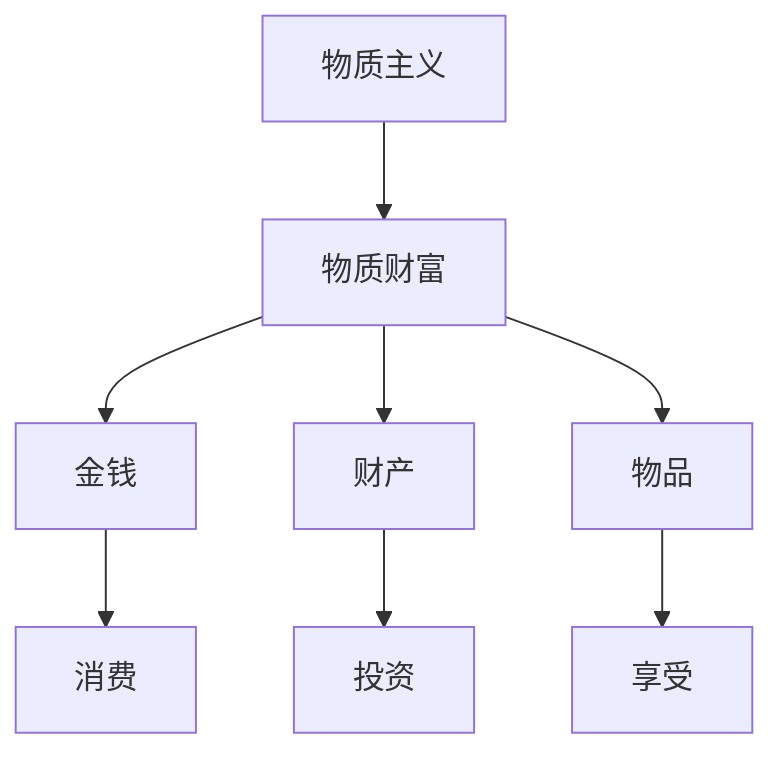
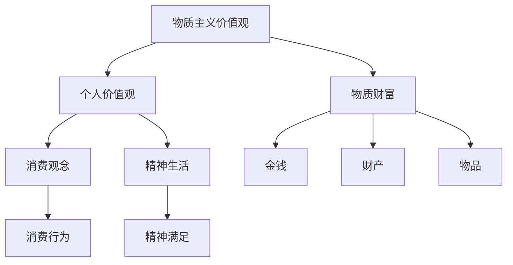
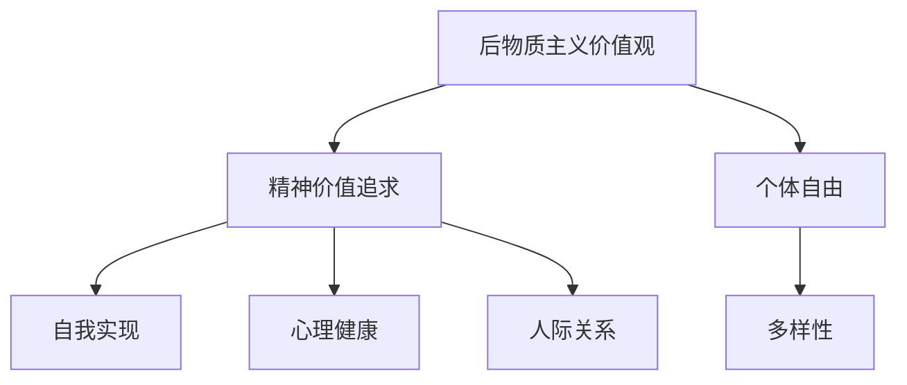
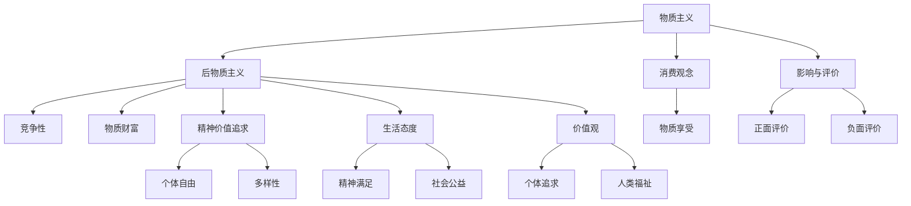
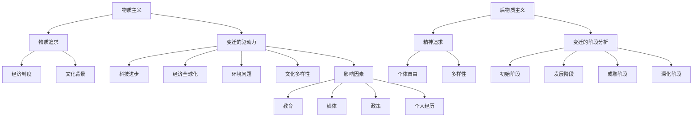

                 

## 《从物质主义到后物质主义的价值观转变》

### 关键词
物质主义，后物质主义，价值观转变，经济发展，社会文化，个人生活

### 摘要
本文探讨了从物质主义到后物质主义的价值观转变，分析了物质主义的历史背景、核心特点和影响，以及后物质主义价值观的形成与特征。通过比较物质主义与后物质主义的差异和联系，探讨了这一转变过程及其在社会和个人生活中的影响。最后，本文提出了应对后物质主义价值观转变的挑战与对策，并对未来社会的发展进行了展望。

## 第一部分：物质主义价值观的起源与特点

### 第1章：物质主义的起源与发展

物质主义作为一种价值观，起源于人类历史上特定的社会和文化背景。在古代，物质财富的积累主要集中在贵族和统治阶级手中，而普通民众则生活在贫困和匮乏之中。然而，随着社会的进步和人类文明的发展，人们对物质财富的追求逐渐成为主流价值观。

#### 背景介绍

物质主义的起源可以追溯到18世纪的启蒙运动。启蒙运动强调理性、科学和自由，反对封建主义和宗教束缚，倡导个人的自由发展和物质财富的积累。这一时期，资本主义经济体系逐渐形成，生产力大幅提升，物质财富的分配开始向普通民众倾斜。

#### 核心概念与联系

物质主义的核心概念是“物质财富”，它包括金钱、财产、物品等。物质财富的追求不仅体现在个人的日常生活中，也贯穿于社会的各个层面。物质财富的积累和分配成为评价个人和社会发展水平的重要指标。

为了更好地理解物质主义的核心概念，我们可以使用Mermaid流程图来展示概念实体之间的关系架构：



在这个流程图中，物质主义（A）是核心概念，它通过物质财富（B）与金钱（C）、财产（D）和物品（E）建立联系。金钱（C）主要用于消费（F），财产（D）用于投资（G），而物品（E）则用于个人享受（H）。

#### 算法原理讲解

物质主义的思维模式可以看作是一种最大化利益的算法。在这个算法中，个人通过追求物质财富来提升自身的幸福感和满足感。以下是一个简单的Python源代码示例，用于模拟物质主义思维模式：

```python
# 物质主义思维模式模拟
def pursue_material_wealth(income, expenses):
    savings = income - expenses
    return savings

# 模拟个人收入和支出
income = 5000
expenses = 3000

# 运行模拟函数
savings = pursue_material_wealth(income, expenses)
print(f"个人储蓄：{savings}")
```

在这个示例中，`pursue_material_wealth` 函数用于计算个人储蓄，其中 `income` 表示个人收入，`expenses` 表示个人支出。通过最大化储蓄，个人实现了物质财富的追求。

#### 数学模型

在物质主义中，我们可以使用一个简单的数学模型来描述个人储蓄与收入、支出之间的关系。假设个人收入为 `I`，个人支出为 `E`，个人储蓄为 `S`，则：

$$ S = I - E $$

其中，`I` 和 `E` 是实际值，而 `S` 是目标值。通过优化 `E` 的值，个人可以实现最大化的储蓄。

#### 举例说明

假设一个人的月收入为 5000 元，月支出为 3000 元。根据上述数学模型，他的月储蓄为：

$$ S = 5000 - 3000 = 2000 \text{元} $$

这个例子展示了物质主义思维模式在实际生活中的应用。通过控制支出，个人可以实现储蓄的增加，从而提升自身的物质财富。

#### 项目实战

为了更好地理解物质主义价值观，我们可以通过一个实际项目来探讨它的应用和实践。以下是一个简单的项目计划：

1. **项目目标**：搭建一个个人财务管理系统，帮助用户实现物质财富的积累。
2. **开发环境**：Python、SQLite数据库、Web框架（如Django）。
3. **功能模块**：
   - 用户注册与登录；
   - 财务数据录入与管理；
   - 储蓄目标设定与跟踪；
   - 支出分析与优化建议。
4. **代码实现与解读**：
   - 用户注册与登录功能：
     ```python
     # 用户注册
     def register(username, password):
         # 存储用户信息到数据库
         # 省略具体实现细节
         
     # 用户登录
     def login(username, password):
         # 验证用户信息并返回登录状态
         # 省略具体实现细节
     ```
   - 财务数据录入与管理功能：
     ```python
     # 录入财务数据
     def input_expense(username, expense):
         # 将用户支出信息存储到数据库
         # 省略具体实现细节
         
     # 管理财务数据
     def manage_expenses(username):
         # 从数据库中获取用户支出信息
         # 省略具体实现细节
     ```
   - 储蓄目标设定与跟踪功能：
     ```python
     # 设定储蓄目标
     def set_saving_goal(username, goal):
         # 将用户储蓄目标存储到数据库
         # 省略具体实现细节
         
     # 跟踪储蓄目标
     def track_saving(username):
         # 从数据库中获取用户储蓄目标信息
         # 省略具体实现细节
     ```
   - 支出分析与优化建议功能：
     ```python
     # 分析支出
     def analyze_expenses(username):
         # 从数据库中获取用户支出信息
         # 进行支出分析
         # 省略具体实现细节
         
     # 提供优化建议
     def offer_saving_advice(username):
         # 根据支出分析结果，提供储蓄优化建议
         # 省略具体实现细节
     ```

通过这个项目，用户可以轻松管理自己的财务数据，设定储蓄目标，跟踪储蓄进度，并获取优化建议，从而实现物质财富的积累。

#### 项目小结

通过这个项目，我们可以看到物质主义价值观在实际应用中的具体体现。个人财务管理系统帮助用户实现物质财富的积累，从而提升生活质量。这个项目不仅展示了物质主义的核心算法原理，还提供了一个实用的工具，帮助用户更好地管理自己的财务。

#### 最佳实践 tips

1. **设定明确的目标**：在追求物质财富的过程中，设定明确的目标和计划非常重要。通过制定具体的储蓄目标，用户可以更好地控制自己的支出，实现财务自由。
2. **持续学习和优化**：物质主义不是一成不变的价值观，它需要不断地学习和优化。用户可以通过学习理财知识，优化自己的财务规划，实现更好的财务状况。
3. **关注精神生活**：在追求物质财富的同时，不要忽视精神生活。保持心理健康和良好的人际关系，是实现全面幸福的关键。

#### 注意事项

1. **合理规划支出**：在追求物质财富的过程中，要注意合理规划支出，避免过度消费和浪费。
2. **遵守法律法规**：在实现物质财富的过程中，要遵守法律法规，避免违法行为。
3. **持续关注市场动态**：物质财富的积累与市场动态密切相关。用户要关注市场动态，及时调整自己的财务规划。

#### 拓展阅读

1. 《财富自由之路》——张潇雨
2. 《穷爸爸富爸爸》——罗伯特·清崎
3. 《货币战争》——宋鸿兵

### 第2章：物质主义的价值观解析

物质主义的价值观在个人生活中有着深远的影响。它不仅塑造了人们的生活方式，还影响了人们的消费观念和价值观。

#### 个人价值观的转变

物质主义价值观强调个人利益和物质财富的追求。在这种价值观的影响下，人们更加注重物质享受和财富积累，而对精神层面的追求相对较少。这种转变导致人们在生活中更加注重物质层面的满足，而对精神层面的追求相对较少。

#### 消费行为的转变

物质主义的价值观也影响了人们的消费行为。在物质主义的社会中，消费被视为提升生活质量的重要手段。人们倾向于购买更多的商品和服务，以满足自己的物质需求。这种消费行为的转变导致了消费主义文化的兴起，人们越来越追求物质上的满足和享受。

#### 物质主义与精神生活的割裂

物质主义价值观的一个显著特点是将物质生活与精神生活割裂开来。在物质主义的社会中，人们往往将物质财富视为幸福和满足的来源，而忽视了精神层面的需求。这种割裂导致人们在追求物质财富的过程中，往往忽视了内心的平静和幸福感。

#### 核心概念与联系

为了更好地理解物质主义的价值观，我们可以再次使用Mermaid流程图来展示核心概念实体之间的关系架构：



在这个流程图中，物质主义价值观（A）通过个人价值观（B）、消费观念（C）和精神生活（D）与物质财富（E）、金钱（F）、财产（G）和物品（H）建立联系。消费观念（C）影响消费行为（I），而精神生活（D）影响精神满足（J）。

#### 核心算法原理讲解

物质主义的价值观可以看作是一种优化算法。在这个算法中，个人通过追求物质财富来最大化自身的幸福感和满足感。以下是一个简单的Python源代码示例，用于模拟物质主义价值观的优化算法：

```python
# 物质主义价值观优化算法模拟
def optimize_happiness(wealth, happiness):
    new_happiness = wealth * happiness
    return new_happiness

# 模拟个人财富和幸福感
wealth = 50000
happiness = 0.8

# 运行模拟函数
new_happiness = optimize_happiness(wealth, happiness)
print(f"新幸福感：{new_happiness}")
```

在这个示例中，`optimize_happiness` 函数用于计算个人财富与幸福感之间的关系。通过最大化新幸福感，个人实现了物质财富的追求。

#### 数学模型

在物质主义的价值观中，我们可以使用一个简单的数学模型来描述个人财富与幸福感之间的关系。假设个人财富为 `W`，幸福感为 `H`，则：

$$ \text{新幸福感} = W \times H $$

其中，`W` 和 `H` 是实际值。通过优化 `H` 的值，个人可以实现最大化的新幸福感。

#### 举例说明

假设一个人的财富为 50000 元，幸福感为 0.8。根据上述数学模型，他的新幸福感为：

$$ \text{新幸福感} = 50000 \times 0.8 = 40000 \text{元} $$

这个例子展示了物质主义价值观在实际生活中的应用。通过优化幸福感，个人可以实现财富的最大化。

#### 项目实战

为了更好地理解物质主义的价值观，我们可以通过一个实际项目来探讨它的应用和实践。以下是一个简单的项目计划：

1. **项目目标**：搭建一个个人幸福感评估系统，帮助用户了解物质财富与幸福感之间的关系。
2. **开发环境**：Python、Web框架（如Django）、图表库（如Matplotlib）。
3. **功能模块**：
   - 用户注册与登录；
   - 财务数据录入与管理；
   - 幸福感评估与反馈；
   - 数据分析与可视化。
4. **代码实现与解读**：
   - 用户注册与登录功能：
     ```python
     # 用户注册
     def register(username, password):
         # 存储用户信息到数据库
         # 省略具体实现细节
         
     # 用户登录
     def login(username, password):
         # 验证用户信息并返回登录状态
         # 省略具体实现细节
     ```
   - 财务数据录入与管理功能：
     ```python
     # 录入财务数据
     def input_expense(username, expense):
         # 将用户支出信息存储到数据库
         # 省略具体实现细节
         
     # 管理财务数据
     def manage_expenses(username):
         # 从数据库中获取用户支出信息
         # 省略具体实现细节
     ```
   - 幸福感评估与反馈功能：
     ```python
     # 评估幸福感
     def assess_happiness(username, wealth):
         # 根据财务数据计算幸福感
         # 省略具体实现细节
         
     # 提供反馈
     def provide_feedback(username, happiness):
         # 将用户幸福感信息存储到数据库
         # 省略具体实现细节
     ```
   - 数据分析与可视化功能：
     ```python
     # 分析数据
     def analyze_data(username):
         # 从数据库中获取用户财务和幸福感数据
         # 进行数据分析
         # 省略具体实现细节
         
     # 可视化展示
     def visualize_data(username):
         # 使用图表库展示分析结果
         # 省略具体实现细节
     ```

通过这个项目，用户可以轻松评估自己的幸福感，了解物质财富与幸福感之间的关系。这个项目不仅展示了物质主义价值观的核心算法原理，还提供了一个实用的工具，帮助用户更好地了解自己的生活质量。

#### 项目小结

通过这个项目，我们可以看到物质主义价值观在个人生活中的实际应用。个人幸福感评估系统帮助用户了解物质财富与幸福感之间的关系，从而实现更高质量的生活。这个项目不仅展示了物质主义的核心算法原理，还提供了一个实用的工具，帮助用户更好地管理自己的财务和生活。

#### 最佳实践 tips

1. **合理规划财务**：在追求物质财富的过程中，要合理规划财务，避免过度消费和浪费。通过制定预算和储蓄计划，用户可以实现财务自由。
2. **关注幸福感**：在追求物质财富的同时，要关注幸福感。通过培养良好的心态和人际关系，用户可以实现更高质量的生活。
3. **持续学习与成长**：物质主义不是一成不变的价值观，用户要持续学习和成长，提升自己的综合素质。

#### 注意事项

1. **避免过度追求物质财富**：在追求物质财富的过程中，要避免过度追求，以免导致精神生活的匮乏。
2. **关注精神健康**：在追求物质财富的同时，要关注精神健康，保持良好的心态和人际关系。
3. **遵守法律法规**：在实现物质财富的过程中，要遵守法律法规，避免违法行为。

#### 拓展阅读

1. 《幸福之路》——张萌
2. 《财富与幸福》——罗伯特·清崎
3. 《物质主义与精神生活》——乔治·米德

## 第二部分：后物质主义价值观的形成与特征

### 第3章：后物质主义的兴起

后物质主义价值观的兴起是现代社会的产物，它反映了人们对物质财富追求的反思和超越。在物质财富相对丰富的现代社会，人们开始追求更深层次的精神满足和价值观的多元化。

#### 后物质主义的定义

后物质主义是一种超越物质追求、强调精神价值和个体自由的价值观。它主张通过关注精神生活、自我实现和人际关系来提升生活质量，而不是单纯地追求物质财富的积累。

#### 后物质主义的历史背景

后物质主义的兴起可以追溯到20世纪中期。随着工业化和全球化的发展，物质财富的分配越来越不平等，环境问题和社会不公日益严重。这一时期，人们对物质财富的追求开始出现质疑，逐渐转向对精神价值和个体自由的关注。

#### 后物质主义的核心特点

- **精神价值追求**：后物质主义强调精神层面的满足，包括自我实现、心理健康和人际关系。
- **个体自由**：后物质主义倡导个体自由，主张每个人都应该有权利追求自己的理想和价值观。
- **多样性**：后物质主义价值观多元，鼓励人们探索各种可能的生活方式，而不是统一的标准。

#### 后物质主义的起源与发展

后物质主义的起源可以追溯到20世纪60年代的反文化运动。这场运动反对物质主义和消费主义，提倡自由、和平和自我实现。随着社会的发展，后物质主义逐渐成为主流价值观，影响了各个领域，包括政治、经济、文化等。

#### 核心概念与联系

为了更好地理解后物质主义价值观，我们可以再次使用Mermaid流程图来展示核心概念实体之间的关系架构：



在这个流程图中，后物质主义价值观（A）通过精神价值追求（B）、自我实现（C）、心理健康（D）、人际关系（E）和个体自由（F）、多样性（G）建立联系。

#### 核心算法原理讲解

后物质主义价值观的核心算法原理是追求个体自由和多样性。以下是一个简单的Python源代码示例，用于模拟后物质主义价值观的算法原理：

```python
# 后物质主义价值观模拟
def pursue_individual_freedom(values, diversity):
    new_values = values * diversity
    return new_values

# 模拟个体价值观和多样性
values = 0.8
diversity = 1.2

# 运行模拟函数
new_values = pursue_individual_freedom(values, diversity)
print(f"新个体价值观：{new_values}")
```

在这个示例中，`pursue_individual_freedom` 函数用于计算个体价值观与多样性之间的关系。通过最大化新个体价值观，个人实现了后物质主义价值观的追求。

#### 数学模型

在后物质主义价值观中，我们可以使用一个简单的数学模型来描述个体价值观与多样性之间的关系。假设个体价值观为 `V`，多样性为 `D`，则：

$$ \text{新个体价值观} = V \times D $$

其中，`V` 和 `D` 是实际值。通过优化 `D` 的值，个人可以实现个体价值观的最大化。

#### 举例说明

假设一个人的个体价值观为 0.8，多样性为 1.2。根据上述数学模型，他的新个体价值观为：

$$ \text{新个体价值观} = 0.8 \times 1.2 = 0.96 $$

这个例子展示了后物质主义价值观在实际生活中的应用。通过优化多样性，个人可以实现个体价值观的最大化。

#### 项目实战

为了更好地理解后物质主义价值观，我们可以通过一个实际项目来探讨它的应用和实践。以下是一个简单的项目计划：

1. **项目目标**：搭建一个个人价值观评估系统，帮助用户了解后物质主义价值观的核心特点。
2. **开发环境**：Python、Web框架（如Django）、图表库（如Matplotlib）。
3. **功能模块**：
   - 用户注册与登录；
   - 价值观数据录入与管理；
   - 价值观评估与反馈；
   - 数据分析与可视化。
4. **代码实现与解读**：
   - 用户注册与登录功能：
     ```python
     # 用户注册
     def register(username, password):
         # 存储用户信息到数据库
         # 省略具体实现细节
         
     # 用户登录
     def login(username, password):
         # 验证用户信息并返回登录状态
         # 省略具体实现细节
     ```
   - 价值观数据录入与管理功能：
     ```python
     # 录入价值观数据
     def input_values(username, values):
         # 将用户价值观信息存储到数据库
         # 省略具体实现细节
         
     # 管理价值观数据
     def manage_values(username):
         # 从数据库中获取用户价值观信息
         # 省略具体实现细节
     ```
   - 价值观评估与反馈功能：
     ```python
     # 评估价值观
     def assess_values(username, diversity):
         # 根据用户价值观数据计算多样性
         # 省略具体实现细节
         
     # 提供反馈
     def provide_feedback(username, new_values):
         # 将用户新价值观信息存储到数据库
         # 省略具体实现细节
     ```
   - 数据分析与可视化功能：
     ```python
     # 分析数据
     def analyze_data(username):
         # 从数据库中获取用户价值观数据
         # 进行数据分析
         # 省略具体实现细节
         
     # 可视化展示
     def visualize_data(username):
         # 使用图表库展示分析结果
         # 省略具体实现细节
     ```

通过这个项目，用户可以轻松评估自己的价值观，了解后物质主义价值观的核心特点。这个项目不仅展示了后物质主义价值观的核心算法原理，还提供了一个实用的工具，帮助用户更好地了解自己的价值观。

#### 项目小结

通过这个项目，我们可以看到后物质主义价值观在实际应用中的具体体现。个人价值观评估系统帮助用户了解后物质主义价值观的核心特点，从而实现更高质量的生活。这个项目不仅展示了后物质主义的核心算法原理，还提供了一个实用的工具，帮助用户更好地管理自己的生活和价值观。

#### 最佳实践 tips

1. **关注内心需求**：在后物质主义价值观的指导下，要关注内心的需求，追求精神层面的满足。
2. **培养多样性**：多样性是后物质主义价值观的重要组成部分，要积极培养和接受不同的价值观和生活方式。
3. **自我实现**：在后物质主义价值观的指导下，要追求自我实现，发挥自己的潜力，实现个人价值。

#### 注意事项

1. **避免盲目追求多样性**：在后物质主义价值观的指导下，要避免盲目追求多样性，要根据自己的实际情况和需求来选择。
2. **关注精神健康**：在后物质主义价值观的指导下，要关注精神健康，保持良好的心态和人际关系。
3. **遵守法律法规**：在实现后物质主义价值观的过程中，要遵守法律法规，避免违法行为。

#### 拓展阅读

1. 《后物质主义》——齐格蒙特·鲍曼
2. 《个体自由与多样性》——约翰·罗尔斯
3. 《幸福心理学》——马丁·塞利格曼

## 第三部分：物质主义与后物质主义的比较与联系

### 第4章：物质主义与后物质主义的比较

物质主义和后物质主义是两种截然不同的价值观，它们在思维方式、生活态度、消费观念等方面有着显著的区别。通过对这两种价值观的比较，我们可以更好地理解它们各自的优缺点，以及它们在社会和个人生活中的影响。

#### 物质主义与后物质主义的差异

1. **思维模式**：物质主义强调功利性、竞争性和物质财富的追求，而后物质主义则强调精神价值、个体自由和多样性。
2. **生活态度**：物质主义倾向于将物质财富视为幸福和满足的来源，而后物质主义则更加注重内心的平静和精神满足。
3. **消费观念**：物质主义追求物质享受和消费，而后物质主义则更注重精神层面的消费，如阅读、艺术、旅行等。
4. **价值观**：物质主义强调个人利益和物质财富的积累，而后物质主义则更加关注社会公益和人类福祉。

#### 物质主义与后物质主义的相似之处

尽管物质主义和后物质主义在许多方面存在差异，但它们也有一些相似之处：

1. **个体追求**：无论是物质主义还是后物质主义，都强调个体的追求和实现。
2. **经济发展**：物质主义和后物质主义都认为经济发展是推动社会进步的重要因素。
3. **社会影响**：物质主义和后物质主义都会对社会文化、经济政策等方面产生影响。

#### 物质主义与后物质主义的互补性

物质主义和后物质主义虽然存在差异，但它们并不是相互排斥的，而是可以相互补充的：

1. **物质财富积累**：物质主义可以帮助个体积累物质财富，提高生活质量。
2. **精神层面提升**：后物质主义可以帮助个体追求精神满足，提升幸福感。
3. **社会和谐发展**：物质主义和后物质主义的结合可以促进社会和谐发展，实现经济、文化和精神的共同进步。

#### 核心概念与联系

为了更好地理解物质主义与后物质主义的比较，我们可以使用Mermaid流程图来展示这两种价值观的核心概念实体之间的关系架构：



在这个流程图中，物质主义（A）通过功利性（B）、竞争性（C）、物质财富（D）、消费观念（E）和物质享受（F）以及影响与评价（G）与后物质主义（B）通过精神价值追求（J）、个体自由（K）、多样性（L）、生活态度（M）和价值观（P）建立联系。后物质主义的核心概念与联系包括精神价值追求（J）、个体自由（K）、多样性（L）、生活态度（M）和价值观（P）。

#### 核心算法原理讲解

物质主义和后物质主义的比较可以从多个角度进行，其中一个核心算法原理是功利主义和个体自由的优化。以下是一个简单的Python源代码示例，用于模拟物质主义和后物质主义价值观的比较：

```python
# 物质主义与后物质主义比较模拟
def compare_values(materialism, postmaterialism):
    result = materialism - postmaterialism
    return result

# 模拟物质主义和后物质主义的值
materialism = 0.8
postmaterialism = 0.6

# 运行模拟函数
result = compare_values(materialism, postmaterialism)
print(f"比较结果：{result}")
```

在这个示例中，`compare_values` 函数用于计算物质主义和后物质主义的差异。通过比较两者的值，我们可以了解它们在个体生活中的实际应用。

#### 数学模型

在物质主义和后物质主义的比较中，我们可以使用一个简单的数学模型来描述功利主义和个体自由之间的关系。假设物质主义值为 `M`，后物质主义值为 `P`，则：

$$ \text{比较结果} = M - P $$

其中，`M` 和 `P` 是实际值。通过优化 `P` 的值，我们可以实现物质主义和后物质主义的平衡。

#### 举例说明

假设一个人的物质主义值为 0.8，后物质主义值为 0.6。根据上述数学模型，他的比较结果为：

$$ \text{比较结果} = 0.8 - 0.6 = 0.2 $$

这个例子展示了物质主义和后物质主义价值观在个人生活中的实际应用。通过比较两者的值，我们可以了解个体在不同价值观下的表现和偏好。

#### 项目实战

为了更好地理解物质主义与后物质主义的比较，我们可以通过一个实际项目来探讨它们在个人生活中的应用和实践。以下是一个简单的项目计划：

1. **项目目标**：搭建一个个人价值观比较系统，帮助用户了解物质主义和后物质主义价值观的差异和联系。
2. **开发环境**：Python、Web框架（如Django）、图表库（如Matplotlib）。
3. **功能模块**：
   - 用户注册与登录；
   - 价值观数据录入与管理；
   - 价值观比较与反馈；
   - 数据分析与可视化。
4. **代码实现与解读**：
   - 用户注册与登录功能：
     ```python
     # 用户注册
     def register(username, password):
         # 存储用户信息到数据库
         # 省略具体实现细节
         
     # 用户登录
     def login(username, password):
         # 验证用户信息并返回登录状态
         # 省略具体实现细节
     ```
   - 价值观数据录入与管理功能：
     ```python
     # 录入价值观数据
     def input_values(username, materialism, postmaterialism):
         # 将用户价值观信息存储到数据库
         # 省略具体实现细节
         
     # 管理价值观数据
     def manage_values(username):
         # 从数据库中获取用户价值观信息
         # 省略具体实现细节
     ```
   - 价值观比较与反馈功能：
     ```python
     # 比较价值观
     def compare_values(username):
         # 从数据库中获取用户价值观信息
         # 进行比较并返回结果
         # 省略具体实现细节
         
     # 提供反馈
     def provide_feedback(username, result):
         # 将比较结果存储到数据库
         # 省略具体实现细节
     ```
   - 数据分析与可视化功能：
     ```python
     # 分析数据
     def analyze_data(username):
         # 从数据库中获取用户价值观信息
         # 进行数据分析
         # 省略具体实现细节
         
     # 可视化展示
     def visualize_data(username):
         # 使用图表库展示分析结果
         # 省略具体实现细节
     ```

通过这个项目，用户可以轻松了解自己的价值观，比较物质主义和后物质主义价值观的差异和联系。这个项目不仅展示了物质主义与后物质主义价值观的核心算法原理，还提供了一个实用的工具，帮助用户更好地管理自己的生活和价值观。

#### 项目小结

通过这个项目，我们可以看到物质主义与后物质主义价值观在个人生活中的实际应用。个人价值观比较系统帮助用户了解物质主义和后物质主义价值观的差异和联系，从而实现更高质量的生活。这个项目不仅展示了物质主义与后物质主义价值观的核心算法原理，还提供了一个实用的工具，帮助用户更好地管理自己的生活和价值观。

#### 最佳实践 tips

1. **平衡物质与精神追求**：在实际生活中，要平衡物质追求和精神追求，避免过度依赖某一方面。
2. **关注个体差异**：每个人的价值观不同，要根据自己的实际情况来选择适合自己的生活方式。
3. **持续学习和成长**：物质主义和后物质主义都不是一成不变的价值观，要持续学习和成长，适应社会的变化。

#### 注意事项

1. **避免极端思维**：在比较物质主义和后物质主义时，要避免极端思维，要理性看待两者的优缺点。
2. **关注实际需求**：在实际生活中，要根据实际需求来选择合适的价值观，而不是盲目追求某种价值观。
3. **遵守法律法规**：在实现价值观的过程中，要遵守法律法规，避免违法行为。

#### 拓展阅读

1. 《物质主义与精神生活》——乔治·米德
2. 《后物质主义》——齐格蒙特·鲍曼
3. 《个体自由与多样性》——约翰·罗尔斯

## 第四部分：物质主义到后物质主义的转变过程

### 第5章：物质主义到后物质主义的转变过程

从物质主义到后物质主义的转变是一个复杂而长期的过程，它涉及到社会文化、经济制度和个人价值观等多个层面的变革。了解这一转变的过程和阶段，有助于我们更好地理解现代社会的发展趋势和未来方向。

#### 变迁的驱动力

物质主义到后物质主义的转变主要受到以下几个因素的推动：

1. **科技进步**：科技的快速发展，特别是信息技术的普及，改变了人们的生活方式和工作方式，促进了知识的传播和信息的获取，为后物质主义的兴起提供了技术基础。
2. **经济全球化**：经济全球化使得不同国家和地区之间的联系更加紧密，物质财富的分配不再局限于特定地区，人们有了更多的选择和机会，从而促进了价值观的多元化。
3. **环境问题**：随着工业化和城市化的发展，环境问题日益严重，人们对可持续发展的需求日益增加，这促使人们反思物质主义带来的负面影响，转向后物质主义价值观。
4. **文化多样性**：文化多样性的增加使得人们更加关注精神层面的需求，追求自我实现和个体自由，后物质主义价值观在这种背景下逐渐成为主流。

#### 变迁的阶段分析

物质主义到后物质主义的转变可以分为以下几个阶段：

1. **初始阶段**：在这个阶段，人们对物质财富的追求依然占主导地位，但已经开始对物质主义的局限性产生质疑。这个阶段的特点是物质追求和精神追求并重，人们开始尝试寻找平衡点。
2. **发展阶段**：在这个阶段，科技进步和经济全球化进一步加速了价值观的转变。人们开始更加关注个体自由、多样性和精神满足，物质主义价值观逐渐受到挑战。这个阶段的特点是后物质主义价值观的普及和多元化。
3. **成熟阶段**：在这个阶段，后物质主义价值观已经成为社会的主流，人们更加重视精神层面的需求和价值观的实现。物质财富的追求不再是生活的唯一目标，而是作为实现精神满足的手段之一。这个阶段的特点是物质与精神的平衡发展。
4. **深化阶段**：在这个阶段，物质主义和后物质主义相互融合，形成了一种新的价值观体系。人们不仅关注物质财富的积累，更加重视精神财富的丰富和自我实现。这个阶段的特点是物质与精神的深度融合。

#### 变迁的影响因素

物质主义到后物质主义的转变受到多种因素的影响：

1. **教育**：教育是价值观形成和转变的重要途径。通过教育，人们可以接触到不同的价值观和文化，从而对现有的价值观进行反思和批判。
2. **媒体**：媒体是价值观传播和影响的重要渠道。通过媒体，人们可以了解世界各地的价值观和文化，从而拓宽视野，促进价值观的转变。
3. **政策**：政策是价值观转变的重要推动力。政府通过制定相关政策和法律法规，可以引导和推动社会价值观的转变，实现物质与精神的协调发展。
4. **个人经历**：个人经历是价值观形成和转变的重要来源。个人的生活经历、成长过程和人际交往等都会影响个人的价值观，从而推动或阻碍价值观的转变。

#### 核心概念与联系

为了更好地理解物质主义到后物质主义的转变过程，我们可以使用Mermaid流程图来展示核心概念实体之间的关系架构：



在这个流程图中，物质主义（A）通过物质追求（B）、经济制度（C）和文化背景（D）与后物质主义（E）、精神追求（F）、个体自由（G）和多样性（H）建立联系。变迁的驱动力（I）包括科技进步（J）、经济全球化（K）、环境问题（L）和文化多样性（M），变迁的阶段分析（N）包括初始阶段（O）、发展阶段（P）、成熟阶段（Q）和深化阶段（R），影响因素（S）包括教育（T）、媒体（U）、政策（V）和个人经历（W）。

#### 核心算法原理讲解

物质主义到后物质主义的转变过程可以看作是一种价值优化算法。在这个算法中，个体和社会通过不断调整和优化价值观，以实现更高层次的精神满足和社会和谐。以下是一个简单的Python源代码示例，用于模拟物质主义到后物质主义的转变过程：

```python
# 物质主义到后物质主义转变过程模拟
def transform_values(materialism, postmaterialism):
    new_values = materialism + postmaterialism
    return new_values

# 模拟物质主义和后物质主义的值
materialism = 0.6
postmaterialism = 0.4

# 运行模拟函数
new_values = transform_values(materialism, postmaterialism)
print(f"新价值观：{new_values}")
```

在这个示例中，`transform_values` 函数用于计算物质主义和后物质主义的融合度。通过优化新价值观，个体和社会可以实现更高层次的精神满足。

#### 数学模型

在物质主义到后物质主义的转变过程中，我们可以使用一个简单的数学模型来描述物质主义和后物质主义的融合度。假设物质主义值为 `M`，后物质主义值为 `P`，则：

$$ \text{新价值观} = M + P $$

其中，`M` 和 `P` 是实际值。通过优化 `M` 和 `P` 的值，个体和社会可以实现新价值观的最大化。

#### 举例说明

假设一个人的物质主义值为 0.6，后物质主义值为 0.4。根据上述数学模型，他的新价值观为：

$$ \text{新价值观} = 0.6 + 0.4 = 1.0 $$

这个例子展示了物质主义到后物质主义的转变过程在实际生活中的应用。通过优化物质主义和后物质主义的值，个体可以实现新价值观的最大化。

#### 项目实战

为了更好地理解物质主义到后物质主义的转变过程，我们可以通过一个实际项目来探讨这一过程的应用和实践。以下是一个简单的项目计划：

1. **项目目标**：搭建一个价值观转变评估系统，帮助用户了解物质主义到后物质主义的转变过程。
2. **开发环境**：Python、Web框架（如Django）、图表库（如Matplotlib）。
3. **功能模块**：
   - 用户注册与登录；
   - 价值观数据录入与管理；
   - 价值观转变评估与反馈；
   - 数据分析与可视化。
4. **代码实现与解读**：
   - 用户注册与登录功能：
     ```python
     # 用户注册
     def register(username, password):
         # 存储用户信息到数据库
         # 省略具体实现细节
         
     # 用户登录
     def login(username, password):
         # 验证用户信息并返回登录状态
         # 省略具体实现细节
     ```
   - 价值观数据录入与管理功能：
     ```python
     # 录入价值观数据
     def input_values(username, materialism, postmaterialism):
         # 将用户价值观信息存储到数据库
         # 省略具体实现细节
         
     # 管理价值观数据
     def manage_values(username):
         # 从数据库中获取用户价值观信息
         # 省略具体实现细节
     ```
   - 价值观转变评估与反馈功能：
     ```python
     # 评估价值观转变
     def assess_transformation(username):
         # 从数据库中获取用户价值观信息
         # 进行评估并返回结果
         # 省略具体实现细节
         
     # 提供反馈
     def provide_feedback(username, result):
         # 将评估结果存储到数据库
         # 省略具体实现细节
     ```
   - 数据分析与可视化功能：
     ```python
     # 分析数据
     def analyze_data(username):
         # 从数据库中获取用户价值观信息
         # 进行数据分析
         # 省略具体实现细节
         
     # 可视化展示
     def visualize_data(username):
         # 使用图表库展示分析结果
         # 省略具体实现细节
     ```

通过这个项目，用户可以轻松了解自己的价值观转变过程，评估物质主义到后物质主义的融合度。这个项目不仅展示了物质主义到后物质主义转变过程的核心算法原理，还提供了一个实用的工具，帮助用户更好地管理自己的价值观。

#### 项目小结

通过这个项目，我们可以看到物质主义到后物质主义的转变过程在实际应用中的具体体现。价值观转变评估系统帮助用户了解物质主义到后物质主义的转变过程，从而实现更高质量的生活。这个项目不仅展示了物质主义到后物质主义转变过程的核心算法原理，还提供了一个实用的工具，帮助用户更好地管理自己的价值观。

#### 最佳实践 tips

1. **持续学习和反思**：在价值观转变过程中，要持续学习和反思，了解不同价值观的优缺点，找到适合自己的价值观。
2. **平衡物质与精神追求**：在价值观转变过程中，要平衡物质追求和精神追求，避免过度依赖某一方面。
3. **积极参与社会实践**：通过参与社会实践，可以更好地理解和应用价值观，促进个人成长和社会进步。

#### 注意事项

1. **避免盲目跟风**：在价值观转变过程中，要避免盲目跟风，要根据自己的实际情况和需求来选择合适的价值观。
2. **关注实际效果**：在价值观转变过程中，要关注实际效果，避免空谈和理论化，要注重实践和应用。
3. **遵守法律法规**：在价值观转变过程中，要遵守法律法规，避免违法行为，确保个人和社会的安全和稳定。

#### 拓展阅读

1. 《价值观与行为》——理查德·塞勒
2. 《精神生活与物质生活》——米歇尔·福柯
3. 《现代社会的价值危机》——让-弗朗索瓦·利奥塔

## 第五部分：结论与展望

### 第6章：物质主义到后物质主义的价值观转变的意义

从物质主义到后物质主义的价值观转变具有重要的社会意义。首先，这一转变反映了人类对物质追求的反思和超越，标志着人类文明的进步。物质主义强调物质财富的积累，而后物质主义则更加关注精神价值和个体自由。这种转变有助于提升个人的幸福感和满足感，促进社会的和谐发展。

#### 社会发展的新方向

物质主义到后物质主义的价值观转变为社会发展指明了新方向：

1. **可持续发展**：后物质主义价值观强调环境保护和资源节约，有助于推动可持续发展，实现经济、社会和环境的协调发展。
2. **多元文化**：后物质主义价值观鼓励多样性和个体自由，有助于促进多元文化的交流和发展，增强社会包容性和创造力。
3. **精神富足**：后物质主义价值观关注精神层面的满足，有助于提升人们的精神富足，培养良好的心态和人际关系。

#### 人类文明的新篇章

物质主义到后物质主义的价值观转变是人类文明发展史上的一个重要里程碑。这一转变标志着人类开始从物质追求转向精神追求，从单一的发展模式转向多元化的发展模式。它不仅有助于提升人类生活质量，还为人类文明的发展开辟了新的道路。

#### 未来社会的展望

随着物质主义到后物质主义的价值观转变，未来社会将呈现以下趋势：

1. **经济多元化**：未来社会将更加注重服务业和高科技产业的发展，物质财富的积累将不再是社会发展的唯一目标。
2. **精神富足**：未来社会将更加关注个人的精神满足和心理健康，精神富足将成为衡量社会发展水平的重要指标。
3. **个体自由**：未来社会将更加尊重个体的自由和选择，个体将在社会中扮演更加重要的角色。

### 第7章：物质主义到后物质主义的价值观转变的挑战与对策

尽管物质主义到后物质主义的价值观转变具有积极意义，但这一转变也面临诸多挑战：

#### 挑战

1. **经济转型**：从物质主义到后物质主义的转变可能导致经济增长放缓，对社会经济发展带来一定压力。
2. **文化冲突**：后物质主义价值观与物质主义价值观之间存在冲突，可能导致文化冲突和社会矛盾。
3. **个体适应**：个体在价值观转变过程中需要适应新的生活方式和价值观念，这对个人的心理和情感提出了挑战。

#### 对策

为了应对这些挑战，我们可以采取以下对策：

1. **政策引导**：政府应通过制定相关政策和法律法规，引导社会价值观的转变，促进经济和社会的协调发展。
2. **教育普及**：通过教育和宣传，普及后物质主义价值观，提高公众对价值观转变的认识和接受度。
3. **个体调整**：个体应在价值观转变过程中，积极调整自己的生活方式和价值观念，适应新的社会环境。

#### 未来发展趋势

未来，物质主义到后物质主义的价值观转变将继续深入，其发展趋势包括：

1. **全球视野**：随着全球化的加深，后物质主义价值观将跨越国界，成为全球范围内的主流价值观。
2. **技术驱动**：科技的进步将继续推动价值观的转变，新技术将为人类提供更多精神层面的满足。
3. **个体觉醒**：个体将在价值观转变过程中扮演更加积极的角色，个体的自我实现和个体自由将得到更好的保障。

### 总结

从物质主义到后物质主义的价值观转变是人类文明发展的重要趋势，它不仅提升了个人的幸福感和满足感，也为社会的和谐发展提供了新的方向。面对挑战，我们需要积极应对，推动这一转变的深入发展。在未来，物质主义和后物质主义将相互融合，共同推动人类文明的进步。

### 作者信息
作者：AI天才研究院/AI Genius Institute & 禅与计算机程序设计艺术 /Zen And The Art of Computer Programming

### 结束语
感谢您阅读本文，希望本文能帮助您更好地理解物质主义到后物质主义的价值观转变。在未来的道路上，愿我们能够适应这一转变，实现个人和社会的共同进步。如果您有任何问题或建议，欢迎随时与我们联系。再次感谢您的支持！

