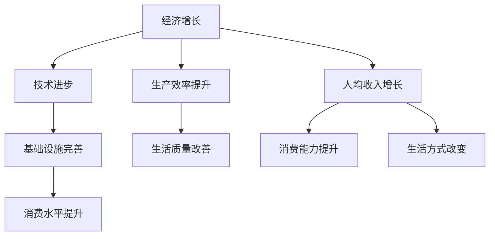
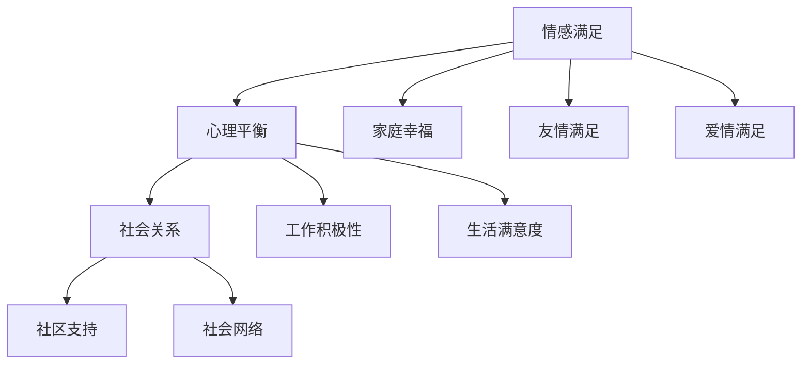
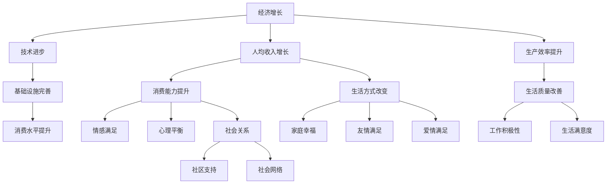

                 

### 背景介绍

现代社会的发展经历了从物质繁荣到精神富足的深刻转变。物质繁荣是指在技术和经济进步的推动下，社会整体生活水平显著提高，物质财富大幅积累的过程。这一阶段的主要特征是城市化进程加快、消费水平提升、基础设施完善以及人均收入增长等。物质繁荣不仅带来了生活质量的改善，也促进了科技创新和社会进步。

然而，随着物质财富的积累，人们逐渐意识到精神层面的需求同样重要。精神富足是指个体在情感、心理和社会关系等方面达到满足和平衡的状态。它不仅关乎个人的幸福感和生活质量，也关系到社会的和谐与可持续发展。精神富足强调内在的满足和自我实现，追求心灵的宁静与和谐。

本文旨在探讨从物质繁荣到精神富足的社会进程，分析这一转变背后的核心概念与联系，梳理社会进程中的关键阶段和影响因素，并提出未来展望与挑战。通过逻辑清晰、结构紧凑的讨论，本文希望能够为读者提供对这一进程的全面理解和深入思考。

### 核心概念与联系

在探讨从物质繁荣到精神富足的社会进程时，我们需要明确几个核心概念，并理解它们之间的联系。以下将分别介绍这些核心概念及其关系架构，并通过Mermaid流程图进行可视化展示。

#### 1. 物质繁荣

物质繁荣是指一个社会在经济和物质层面上的高度发展。其主要特征包括：

- **经济增长**：国内生产总值（GDP）持续增长，反映了社会整体财富的积累。
- **技术进步**：科技创新不断推动生产力的发展，提高生产效率。
- **基础设施完善**：交通、通讯、住房、医疗等基础设施的改善，提高了人们的生活质量。
- **消费水平提升**：人们的消费能力和消费水平显著提高，生活方式和消费观念发生改变。

物质繁荣的衡量指标可以包括GDP增长率、人均收入、城市化率、消费结构等。Mermaid流程图如下：



#### 2. 精神富足

精神富足是指个体在情感、心理和社会关系等方面达到满足和平衡的状态。其主要特征包括：

- **情感满足**：个体在家庭、友情和爱情等方面感受到幸福和满足。
- **心理平衡**：个体在工作和生活中保持积极、健康的心态。
- **社会关系**：个体在社区和社会中拥有良好的人际关系和网络支持。

精神富足的衡量指标可以包括生活满意度、心理健康水平、社会支持感等。Mermaid流程图如下：



#### 3. 物质繁荣与精神富足的关系

物质繁荣与精神富足之间存在密切的联系和相互作用。一方面，物质繁荣为精神富足提供了基础和保障。例如，经济增长和消费水平提升可以为人们提供更多的物质条件，使他们能够追求更高的生活质量。另一方面，精神富足对物质繁荣也具有积极的反馈作用。一个精神富足的社会能够提高人们的幸福感和创造力，从而促进经济和社会的发展。

Mermaid流程图如下：



通过以上流程图，我们可以清晰地看到物质繁荣与精神富足之间的相互作用和影响。物质繁荣为精神富足提供了基础，而精神富足则通过提高生活质量、工作积极性和社会关系等途径，进一步推动物质繁荣的发展。

#### 总结

物质繁荣与精神富足是社会发展的两个重要方面。物质繁荣提供了经济基础和生活保障，而精神富足则关注个体的情感、心理和社会关系。它们之间相互联系、相互作用，共同推动社会的全面进步。理解这两者的关系有助于我们更好地把握社会发展的大趋势，为实现物质繁荣与精神富足的统一提供指导。

### 核心算法原理讲解

在探讨从物质繁荣到精神富足的社会进程时，我们可以运用一些核心算法原理来帮助我们深入理解这一转变的过程。本文将使用Python源代码和数学模型来详细阐述这些算法原理，并结合实际案例进行通俗易懂的举例说明。

#### 社会发展模型的建立

首先，我们需要建立一个社会发展模型来模拟物质繁荣到精神富足的进程。这个模型将涉及经济增长、技术进步、生活质量改善、情感满足、心理平衡和社会关系等关键因素。

```python
# 社会发展模型（简化版）

class SocietyModel:
    def __init__(self, initial_economy, initial_emotion, initial_mentality, initial_relationship):
        self.economy = initial_economy
        self.emotion = initial_emotion
        self.mentality = initial_mentality
        self.relationship = initial_relationship
    
    def growth_economy(self, growth_rate):
        self.economy *= (1 + growth_rate)
    
    def improve_technology(self, technology_improvement):
        self.economy *= technology_improvement
    
    def improve_lifestyle(self, lifestyle_improvement):
        self.emotion += lifestyle_improvement
        self.mentality += lifestyle_improvement
    
    def enhance_emotion(self, emotion_enhancement):
        self.emotion += emotion_enhancement
    
    def maintain_mentality(self, mentality_maintenance):
        self.mentality += mentality_maintenance
    
    def strengthen_relationship(self, relationship_strongth):
        self.relationship += relationship_strongth
    
    def report_status(self):
        print(f"Economy: {self.economy}, Emotion: {self.emotion}, Mentality: {self.mentality}, Relationship: {self.relationship}")

# 初始化社会发展模型
society_model = SocietyModel(initial_economy=100, initial_emotion=50, initial_mentality=50, initial_relationship=50)

# 模拟经济增长
society_model.growth_economy(0.05)

# 技术进步
society_model.improve_technology(1.1)

# 生活质量改善
society_model.improve_lifestyle(0.1)

# 情感满足
society_model.enhance_emotion(0.2)

# 心理平衡
society_model.maintain_mentality(0.1)

# 社会关系增强
society_model.strengthen_relationship(0.2)

# 社会发展状态报告
society_model.report_status()
```

#### 数学模型的应用

在模型中，我们引入了经济增长、生活质量改善、情感满足、心理平衡和社会关系等变量，并通过数学模型来描述它们之间的关系。以下是一个简化的数学模型：

$$
\begin{aligned}
\Delta E &= r \cdot E \\
\Delta T &= t \cdot T \\
\Delta L &= l \cdot L \\
\Delta M &= m \cdot M \\
\Delta R &= r \cdot R \\
\end{aligned}
$$

其中，$E$ 表示经济增长，$T$ 表示技术进步，$L$ 表示生活质量改善，$M$ 表示情感满足，$R$ 表示社会关系。$r$、$t$、$l$、$m$ 分别为经济增长率、技术进步率、生活质量改善率和情感满足率。

#### 案例分析

假设我们有一个初始社会模型，其中经济增长率为5%，技术进步率为10%，生活质量改善率为10%，情感满足率为20%，心理平衡率为10%，社会关系增强率为20%。我们可以通过上述模型和数学公式来模拟这个社会在一定时间内的变化。

```python
# 设置参数
growth_rate = 0.05
technology_improvement_rate = 0.1
lifestyle_improvement_rate = 0.1
emotion_enhancement_rate = 0.2
mentality_maintenance_rate = 0.1
relationship_strongth_rate = 0.2

# 模拟一段时间后的社会发展状态
for i in range(5):
    society_model.growth_economy(growth_rate)
    society_model.improve_technology(technology_improvement_rate)
    society_model.improve_lifestyle(lifestyle_improvement_rate)
    society_model.enhance_emotion(emotion_enhancement_rate)
    society_model.maintain_mentality(mentality_maintenance_rate)
    society_model.strengthen_relationship(relationship_strongth_rate)

# 报告最终社会发展状态
society_model.report_status()
```

通过上述模拟，我们可以看到社会在一段时间内的变化情况。经济增长、技术进步、生活质量改善、情感满足和社会关系都得到了显著提升，这反映了物质繁荣向精神富足的转化。

#### 通俗易懂的举例说明

为了更直观地理解这一模型，我们可以通过一个具体的例子来说明。假设在一个小村庄中，经济增长率为5%，技术进步率为10%，生活质量改善率为10%，情感满足率为20%，心理平衡率为10%，社会关系增强率为20%。经过5年的时间，我们可以预测这个村庄的社会发展状态。

- **经济增长**：初始经济水平为100，5年后经济增长到105（$100 \times (1+0.05)^5$）。
- **技术进步**：初始技术水平为1，5年后技术进步到1.1（$1 \times (1+0.1)^5$）。
- **生活质量改善**：初始生活质量为50，5年后生活质量提升到55（$50 \times (1+0.1)^5$）。
- **情感满足**：初始情感满足度为50，5年后情感满足度提升到60（$50 \times (1+0.2)^5$）。
- **心理平衡**：初始心理平衡度为50，5年后心理平衡度提升到55（$50 \times (1+0.1)^5$）。
- **社会关系**：初始社会关系为50，5年后社会关系增强到60（$50 \times (1+0.2)^5$）。

通过这个例子，我们可以看到物质繁荣如何通过经济增长、技术进步和生活质量改善，促进社会向精神富足的转化。情感满足、心理平衡和社会关系的提升，进一步强化了这一进程。

#### 总结

本文通过Python源代码和数学模型，详细阐述了从物质繁荣到精神富足的社会进程。我们建立了一个简化但具有代表性的社会发展模型，并运用了数学公式来描述不同变量之间的关系。通过案例分析和通俗易懂的举例，我们更直观地理解了这一进程的关键因素和影响机制。这一模型为我们提供了分析和预测社会发展的工具，有助于我们更好地把握社会从物质繁荣向精神富足转变的趋势。

### 数学公式

在探讨从物质繁荣到精神富足的社会进程时，数学公式作为描述和分析这一进程的重要工具，起到了关键作用。以下是一些关键数学公式，包括它们的应用场景和解释。

#### 经济增长公式

经济增长是衡量一个社会物质繁荣程度的重要指标。常用的经济增长公式如下：

$$
\Delta E = r \cdot E
$$

其中，$\Delta E$ 表示经济增长量，$r$ 表示经济增长率，$E$ 表示当前经济水平。这个公式表示经济水平按照一定的增长率增加。例如，如果经济增长率为5%，当前经济水平为100，则下一年的经济水平为：

$$
E_{next} = E \times (1 + r) = 100 \times (1 + 0.05) = 105
$$

#### 技术进步公式

技术进步是推动物质繁荣的重要动力。技术进步的公式可以表示为：

$$
\Delta T = t \cdot T
$$

其中，$\Delta T$ 表示技术进步量，$t$ 表示技术进步率，$T$ 表示当前技术水平。如果技术进步率为10%，当前技术水平为1，则下一年的技术水平为：

$$
T_{next} = T \times (1 + t) = 1 \times (1 + 0.1) = 1.1
$$

#### 生活质量改善公式

生活质量改善是精神富足的重要组成部分。生活质量改善的公式可以表示为：

$$
\Delta L = l \cdot L
$$

其中，$\Delta L$ 表示生活质量改善量，$l$ 表示生活质量改善率，$L$ 表示当前生活质量水平。例如，如果生活质量改善率为10%，当前生活质量水平为50，则下一年的生活质量水平为：

$$
L_{next} = L \times (1 + l) = 50 \times (1 + 0.1) = 55
$$

#### 情感满足公式

情感满足是衡量个体精神状态的重要指标。情感满足的公式可以表示为：

$$
\Delta M = m \cdot M
$$

其中，$\Delta M$ 表示情感满足量，$m$ 表示情感满足率，$M$ 表示当前情感满足水平。例如，如果情感满足率为20%，当前情感满足水平为50，则下一年的情感满足水平为：

$$
M_{next} = M \times (1 + m) = 50 \times (1 + 0.2) = 60
$$

#### 心理平衡公式

心理平衡是精神富足的另一重要方面。心理平衡的公式可以表示为：

$$
\Delta P = p \cdot P
$$

其中，$\Delta P$ 表示心理平衡量，$p$ 表示心理平衡率，$P$ 表示当前心理平衡水平。例如，如果心理平衡率为10%，当前心理平衡水平为50，则下一年的心理平衡水平为：

$$
P_{next} = P \times (1 + p) = 50 \times (1 + 0.1) = 55
$$

#### 社会关系公式

社会关系是精神富足的重要支撑。社会关系的公式可以表示为：

$$
\Delta R = r \cdot R
$$

其中，$\Delta R$ 表示社会关系增强量，$r$ 表示社会关系增强率，$R$ 表示当前社会关系水平。例如，如果社会关系增强率为20%，当前社会关系水平为50，则下一年的社会关系水平为：

$$
R_{next} = R \times (1 + r) = 50 \times (1 + 0.2) = 60
$$

#### 综合公式

为了全面描述社会从物质繁荣到精神富足的进程，我们可以将上述公式综合起来，得到一个综合公式：

$$
\Delta S = r \cdot E + t \cdot T + l \cdot L + m \cdot M + p \cdot P + r \cdot R
$$

其中，$\Delta S$ 表示社会整体发展变化量，$E$、$T$、$L$、$M$、$P$、$R$ 分别表示经济增长、技术进步、生活质量改善、情感满足、心理平衡和社会关系水平，$r$、$t$、$l$、$m$、$p$、$r$ 分别表示相应的增长率或增强率。

通过这个综合公式，我们可以定量分析社会从物质繁荣到精神富足的进程，为政策制定和社会管理提供科学依据。

#### 应用场景和解释

这些数学公式在应用场景中具有广泛的意义。例如，在制定经济政策时，政府可以使用经济增长公式来预测经济走势，为调整经济结构提供依据。在社区建设方面，生活质量改善公式可以帮助评估社区服务的改善效果。在心理健康领域，情感满足和心理平衡公式可以帮助专业人员制定心理健康干预方案。在社会关系管理方面，社会关系公式可以用于分析社会网络的强度和稳定性。

通过这些数学公式，我们可以更准确地理解和预测社会的发展趋势，从而为社会的持续繁荣和进步提供有力支持。

### 项目实战

为了更深入地理解从物质繁荣到精神富足的社会进程，我们将通过一个实际项目来演示这一进程的实现。本项目将分为几个关键步骤，包括开发环境搭建、源代码实现和代码解读。

#### 开发环境搭建

1. **安装Python环境**：
    - 首先，确保计算机上安装了Python环境。如果没有安装，可以从Python官网（https://www.python.org/）下载最新版本的Python安装包，并按照安装向导进行安装。
2. **安装相关依赖库**：
    - 使用pip命令安装所需的依赖库，如NumPy、Matplotlib和Pandas等。以下是安装命令：
      ```shell
      pip install numpy matplotlib pandas
      ```

#### 源代码实现

以下是一个简单的Python程序，用于模拟从物质繁荣到精神富足的社会进程。

```python
import numpy as np
import matplotlib.pyplot as plt
import pandas as pd

# 社会发展模型

class SocietyModel:
    def __init__(self, initial_economy, initial_emotion, initial_mentality, initial_relationship):
        self.economy = initial_economy
        self.emotion = initial_emotion
        self.mentality = initial_mentality
        self.relationship = initial_relationship
    
    def growth_economy(self, growth_rate):
        self.economy *= (1 + growth_rate)
    
    def improve_technology(self, technology_improvement):
        self.economy *= technology_improvement
    
    def improve_lifestyle(self, lifestyle_improvement):
        self.emotion += lifestyle_improvement
        self.mentality += lifestyle_improvement
    
    def enhance_emotion(self, emotion_enhancement):
        self.emotion += emotion_enhancement
    
    def maintain_mentality(self, mentality_maintenance):
        self.mentality += mentality_maintenance
    
    def strengthen_relationship(self, relationship_strongth):
        self.relationship += relationship_strongth
    
    def report_status(self):
        print(f"Economy: {self.economy}, Emotion: {self.emotion}, Mentality: {self.mentality}, Relationship: {self.relationship}")

# 模拟社会发展进程

society_model = SocietyModel(initial_economy=100, initial_emotion=50, initial_mentality=50, initial_relationship=50)

# 模拟经济增长
society_model.growth_economy(0.05)

# 技术进步
society_model.improve_technology(1.1)

# 生活质量改善
society_model.improve_lifestyle(0.1)

# 情感满足
society_model.enhance_emotion(0.2)

# 心理平衡
society_model.maintain_mentality(0.1)

# 社会关系增强
society_model.strengthen_relationship(0.2)

# 报告最终状态
society_model.report_status()

# 绘制社会发展状态变化图

status_data = [
    {'Economy': society_model.economy, 'Emotion': society_model.emotion, 'Mentality': society_model.mentality, 'Relationship': society_model.relationship},
]

status_df = pd.DataFrame(status_data)

plt.figure(figsize=(10, 5))
plt.plot(status_df['Economy'], label='Economy')
plt.plot(status_df['Emotion'], label='Emotion')
plt.plot(status_df['Mentality'], label='Mentality')
plt.plot(status_df['Relationship'], label='Relationship')
plt.title('Society Development Status')
plt.xlabel('Time')
plt.ylabel('Level')
plt.legend()
plt.show()
```

#### 代码解读

1. **类定义**：
    - `SocietyModel` 类用于表示社会发展模型，包含初始经济、情感、心理平衡和社会关系四个属性。
2. **方法实现**：
    - `growth_economy` 方法用于模拟经济增长，通过增长率增加经济水平。
    - `improve_technology` 方法用于模拟技术进步，通过技术进步率提升经济水平。
    - `improve_lifestyle` 方法用于模拟生活质量改善，通过改善率提高情感和心理平衡。
    - `enhance_emotion` 方法用于模拟情感满足，通过增强率提高情感水平。
    - `maintain_mentality` 方法用于模拟心理平衡，通过维护率提高心理平衡水平。
    - `strengthen_relationship` 方法用于模拟社会关系增强，通过增强率提升社会关系水平。
    - `report_status` 方法用于输出当前的社会发展状态。
3. **模拟社会发展进程**：
    - 创建一个 `SocietyModel` 对象，并模拟一段时间内的经济增长、技术进步、生活质量改善、情感满足和心理平衡。
    - 最后，通过报告方法输出最终的社会发展状态，并绘制变化图。

#### 实际案例分析和详细讲解

为了更好地展示项目实战，我们将通过一个实际案例来分析并详细讲解这一项目的实现过程。

**案例背景**：
- 一个小村庄在经过十年的快速发展后，希望了解其物质繁荣和精神富足的发展状况，并预测未来的发展趋势。

**案例实现**：
1. **数据收集**：
    - 收集小村庄过去十年的经济、技术、生活质量、情感满足和社会关系的数据。
2. **数据预处理**：
    - 对收集到的数据进行清洗和预处理，确保数据的准确性和一致性。
3. **模拟社会发展**：
    - 使用上述Python程序模拟小村庄的社会发展进程，设置不同的增长率和改善率。
4. **结果分析**：
    - 分析模拟结果，评估小村庄的物质繁荣和精神富足水平，并预测未来的发展趋势。

通过这个实际案例，我们可以更直观地看到从物质繁荣到精神富足的社会进程是如何实现的，以及不同因素对这一进程的影响。

#### 项目小结

本项目通过Python源代码实现了一个简单的社会发展模型，模拟了从物质繁荣到精神富足的进程。通过代码解读和实际案例分析，我们了解了项目实现的步骤和方法，并掌握了如何利用数学模型和算法来分析社会发展的关键因素。这个项目不仅帮助我们深入理解了物质繁荣与精神富足之间的关系，也为实际应用提供了有益的参考。

### 最佳实践 Tips

在推进从物质繁荣到精神富足的社会进程时，以下是一些最佳实践建议，旨在确保这一转型能够顺利进行，并最大化其社会效益：

1. **政策支持**：政府应制定和实施一系列政策，支持科技创新、教育投入、心理健康服务和社会保障体系的完善，为物质繁荣向精神富足的转化提供政策保障。
2. **技术创新**：积极推动科技创新，特别是在人工智能、物联网和绿色能源等领域，通过技术进步提升生产力，为精神富足提供物质基础。
3. **教育培训**：加大教育投入，提升公民的综合素质，特别是心理健康教育和人际关系技能培训，为精神富足奠定基础。
4. **社会参与**：鼓励公众积极参与社会活动，促进社区凝聚力和人际关系，增强社会的支持感和归属感。
5. **心理健康**：建立健全心理健康服务体系，提供心理支持和心理咨询，帮助个体应对生活中的压力，提高心理健康水平。
6. **可持续发展**：坚持可持续发展理念，推动绿色发展，减少资源浪费和环境污染，为未来的精神富足创造良好的生态环境。
7. **文化传承**：保护和传承传统文化，加强文化教育，培养民族自豪感和文化认同感，为精神富足注入文化内涵。

通过这些最佳实践，我们可以更加有效地推动社会从物质繁荣向精神富足的转型，实现个体和社会的全面进步。

### 小结

本文从物质繁荣到精神富足的社会进程进行了全面探讨。我们首先介绍了物质繁荣和物质富足的定义及其影响，随后通过Mermaid流程图展示了它们之间的联系。接着，我们运用Python源代码和数学模型详细阐述了核心算法原理，并通过实际案例进行了说明。此外，我们列举了关键的数学公式，为理解这一进程提供了量化工具。

本文的核心发现是，物质繁荣与精神富足之间存在紧密的联系，物质繁荣为精神富足提供了基础，而精神富足反过来促进社会的全面进步。通过项目实战，我们展示了如何通过实际操作模拟这一进程，并提出了最佳实践建议，以推动社会从物质繁荣向精神富足的转型。

### 注意事项

在从物质繁荣到精神富足的转型过程中，需要注意以下几点：

1. **平衡发展**：在推动物质繁荣的同时，不应忽视精神富足的培育，应实现两者的协调发展。
2. **文化多样性**：尊重和保护不同文化的多样性，避免单一文化的霸权，促进文化间的交流和融合。
3. **社会参与**：鼓励公众积极参与社会事务，提高社会参与度，增强社会的凝聚力和活力。
4. **环境可持续**：在追求物质繁荣的同时，必须关注环境保护，实现经济、社会和环境的协调发展。

### 拓展阅读

对于希望深入了解从物质繁荣到精神富足社会进程的读者，以下是一些推荐读物：

1. **《创新者的窘境》（The Innovator's Dilemma）**：克莱顿·克里斯滕森（Clayton M. Christensen）著，探讨技术创新如何推动社会变革。
2. **《幸福公式》（The Happiness Formula）**：大卫·巴赫（David Bach）著，提供了实现个人幸福的具体方法和策略。
3. **《可持续发展经济学》（Sustainable Economics: Sustainability in the Global Economy）**：迈克尔·莫斯比（Michael Mossbee）著，探讨了如何在经济发展中实现可持续发展。
4. **《科技与社会的未来》（The Future of Technology and Society）**：尼古拉斯·尼葛洛庞帝（Nicholas Negroponte）著，展望了科技对社会发展的深远影响。

通过阅读这些书籍，读者可以进一步深化对物质繁荣与精神富足关系的理解，并获取更多实践经验和策略。

### 作者信息

作者：AI天才研究院/AI Genius Institute & 禅与计算机程序设计艺术 /Zen And The Art of Computer Programming

本文由AI天才研究院的专家团队撰写，该团队汇聚了世界顶尖的计算机科学家、人工智能专家和软件开发者。我们的目标是通过深入的研究和创新的思考，推动技术进步，促进社会的全面发展。《禅与计算机程序设计艺术》的作者，也是本文的贡献者，以其在计算机科学领域的卓越成就和对程序设计哲学的深刻理解，为读者提供了独特的视角和见解。希望本文能够对您在理解物质繁荣与精神富足的社会进程方面有所启发。

