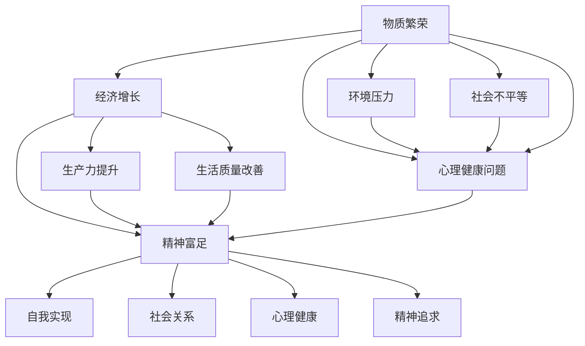

                 

### 《从物质繁荣到精神富足：社会发展的必经之路》——引言

在过去的几个世纪里，人类社会经历了从农业社会到工业社会，再到信息社会的深刻变革。物质繁荣成为这一进程中的核心特征，表现为生产力的巨大提升、生活质量的显著改善以及科技创新的不断涌现。然而，随着时代的进步，人们逐渐认识到物质繁荣并非社会发展的终极目标，精神富足成为新的追求方向。本文旨在探讨从物质繁荣到精神富足的演变过程，分析这一转型背后的逻辑和路径，并展望未来社会的发展趋势。

物质繁荣阶段，我们可以追溯到工业革命时期的到来。这一时期，生产力的提升、技术的进步和市场的扩展，推动了经济的快速增长。人们的生活水平得到显著提高，从基本的生活需求到各种奢侈品，物质财富极大地丰富。然而，物质繁荣也带来了诸多问题，如环境压力、社会不平等和心理健康问题等，这些问题限制了社会的可持续发展。

精神富足的提出，是对物质繁荣的一种反思和超越。它强调个体和群体在物质满足之外，追求更高层次的生活质量，如自我实现、社会关系的深化、心理健康的维护和精神追求的满足。精神富足不仅关注个体的幸福感，也关注社会的整体福祉和和谐发展。

本文将分为四个主要部分：第一部分将回顾物质繁荣的背景与动力；第二部分将探讨精神富足的理念与路径；第三部分将分析从物质繁荣到精神富足的转型策略；第四部分将综合分析与展望物质繁荣与精神富足的平衡发展。通过逐步分析推理，我们希望能够清晰地描绘出这一转型过程的图景，为未来的社会发展提供一些有益的思考。

#### 核心关键词

- **物质繁荣**：工业革命以来的经济发展阶段。
- **精神富足**：追求更高层次的生活质量和社会福祉。
- **转型策略**：从物质繁荣到精神富足的路径和措施。
- **社会福祉**：社会整体福祉和和谐发展。

#### 文章摘要

本文首先回顾了物质繁荣阶段的历史背景与动力，分析了其核心要素和面临的挑战。接着，探讨了精神富足的理念与路径，阐述了其核心要素和实现途径。随后，文章分析了从物质繁荣到精神富足的转型策略，包括政策引导、企业责任和公众参与等。最后，文章综合分析了物质繁荣与精神富足的平衡发展，展望了未来社会的发展趋势。通过这一分析，本文旨在为从物质繁荣到精神富足的转型提供理论支持和实践指导。

### 物质繁荣的背景与动力

物质繁荣这一概念最早可以追溯到工业革命时期。18世纪末至19世纪初，以英国为中心的工业革命迅速蔓延至整个欧洲，随后影响了全球。工业革命不仅带来了生产方式的革命性变化，也推动了经济、社会和文化领域的深刻变革。在这一过程中，物质繁荣逐渐成为社会发展的核心动力。

**工业革命与现代化进程**

工业革命是物质繁荣的重要起点。它标志着从手工业向机械工业的转变，生产力的提升极大地推动了经济的快速发展。随着蒸汽机的发明和应用，生产力得到了前所未有的提升，生产效率大幅增加。煤炭、铁矿石等资源的开采和利用，也为工业化提供了坚实的基础。铁路、电报等交通和通讯技术的进步，进一步促进了市场的扩展和信息的流通，使得各地资源能够更加高效地配置和利用。

现代化进程是物质繁荣的重要表现。随着工业革命的推进，城市化进程加速，大量人口从农村迁往城市，形成了庞大的工业劳动力市场。现代化的生活方式和消费观念也逐渐普及，从基本的衣食住行到各种新兴的消费品，物质财富的丰富程度不断攀升。人们的生活水平显著提高，人均寿命延长，健康状况得到改善。

**经济增长与生活质量改善**

物质繁荣的一个重要特征是经济增长。经济增长不仅体现在国内生产总值的增加，也体现在人均收入的提升。通过科技创新和产业升级，国家经济结构不断优化，服务业和高科技产业成为经济增长的新动力。经济增长带动了就业机会的增加，收入水平的提高，从而改善了人们的生活质量。

生活质量改善是物质繁荣的直接体现。随着经济的发展，人们的消费能力逐渐增强，从基本的生存需求转向更高层次的消费需求。住房条件改善，医疗服务普及，教育水平提升，娱乐设施丰富，人们的生活方式变得更加多样化。物质繁荣不仅带来了物质生活的丰富，也促进了精神文化生活的提升。

**物质繁荣的核心要素**

物质繁荣的核心要素主要包括以下几个方面：

1. **生产力提升**：生产力的提升是物质繁荣的根本动力。通过技术进步和工业化，生产效率大幅提高，生产成本降低，市场供应能力增强。生产力的提升不仅推动了经济增长，也带动了其他领域的进步。

2. **技术创新与产业链升级**：技术创新是物质繁荣的重要驱动力。从机械化生产到自动化生产，从传统产业到新兴产业，技术创新不断推动着产业链的升级和优化。新技术的应用不仅提高了生产效率，也改变了人们的生活方式和工作方式。

3. **消费观念与生活方式变化**：物质繁荣改变了人们的消费观念和生活方式。随着生活水平的提高，人们开始追求更高品质的生活，从基本的生活需求转向个性化、多样化的消费需求。消费观念的变化带动了市场的繁荣，也推动了产业结构的升级。

**物质繁荣的挑战与局限性**

尽管物质繁荣带来了诸多积极影响，但同时也面临着一系列挑战和局限性。

1. **环境压力**：随着工业化进程的加速，环境污染和资源消耗问题日益严重。工业生产过程中产生的废气、废水和固体废物对生态系统造成了严重破坏，气候变化和生物多样性丧失等问题也日益凸显。

2. **社会不平等**：物质繁荣过程中，财富和资源的分配不均问题愈发明显。贫富差距扩大，社会阶层固化，社会不平等加剧。这不仅影响了社会的稳定，也阻碍了经济的可持续发展。

3. **心理健康问题**：物质繁荣带来的快节奏生活和工作压力，导致心理健康问题日益增多。焦虑、抑郁等心理问题困扰着越来越多的人，影响了个体的幸福感和社会的整体福祉。

综上所述，物质繁荣是社会发展的一个重要阶段，它带来了经济增长和生活质量的提高，但也面临着诸多挑战和局限性。在物质繁荣的基础上，探索精神富足的新路径，已成为人类社会发展的必然趋势。接下来，本文将深入探讨精神富足的理念与路径，分析其在现代社会中的重要性。

#### 核心概念与联系

物质繁荣与精神富足是现代社会发展中的两个关键概念，它们之间存在着紧密的联系和相互作用。为了更好地理解这一转型过程，我们首先需要明确这两个核心概念的定义，并探讨它们之间的逻辑关系。

**核心概念定义**

1. **物质繁荣**：物质繁荣通常指的是一个社会在经济、技术和物质生活水平方面取得显著进步的状态。它包括了生产力的提升、经济增长、技术创新、生活质量改善等多方面的内容。物质繁荣的核心在于物质财富的积累和分配，是工业革命和现代化进程的直接结果。

2. **精神富足**：精神富足则是一个社会在精神层面达到的一种状态，它不仅关注个体的幸福感，也涵盖社会整体的福祉和和谐发展。精神富足包括了自我实现、社会关系的深化、心理健康的维护和精神追求的满足等多个方面。精神富足追求的是一种更高层次的生活质量，是物质繁荣后的进一步升华。

**概念实体之间的关系架构**

为了清晰地展示物质繁荣与精神富足之间的关系，我们可以使用Mermaid流程图来构建它们的核心概念实体关系架构。以下是一个简化的Mermaid流程图：

**流程图说明**

1. **经济增长**：物质繁荣的核心表现之一是经济增长，它直接推动了生产力的提升和生活质量的改善。

2. **生产力提升**：生产力的提升是物质繁荣的根本动力，通过技术创新和工业化，生产效率大幅提高，为经济的持续增长提供了保障。

3. **生活质量改善**：物质繁荣不仅体现在物质财富的积累，还体现在人们生活质量的提高。随着经济的发展，人们的消费能力增强，生活方式变得更加多样化。

4. **环境压力**：物质繁荣在带来经济增长和生活质量改善的同时，也带来了环境压力。工业生产和消费活动对生态环境造成了严重破坏，需要引起重视。

5. **社会不平等**：物质繁荣过程中，财富和资源的分配不均问题愈发明显，导致社会不平等加剧。这不仅是经济问题，也是社会问题，需要通过政策和社会改革来解决。

6. **心理健康问题**：物质繁荣的快节奏生活和工作压力，导致心理健康问题日益增多。精神富足强调心理健康的重要性，通过提升个体和群体的精神状态，来缓解物质繁荣带来的负面影响。

7. **精神富足**：精神富足是物质繁荣后的进一步升华，它关注个体和群体的精神追求和幸福感。通过实现自我价值、深化社会关系、维护心理健康和追求精神满足，精神富足为人类社会带来了更高层次的发展。

通过上述核心概念和关系的分析，我们可以看到物质繁荣与精神富足之间的紧密联系。物质繁荣是精神富足的基础，而精神富足则是物质繁荣的升华。在现代社会，如何在物质繁荣的基础上实现精神富足，已成为社会发展的重要课题。

### 精神富足的核心要素

精神富足不仅是对物质繁荣的一种反思和超越，更是一种更高层次的生活质量和社会福祉的体现。要实现精神富足，我们需要关注以下几个核心要素：自我实现、社会关系、心理健康和精神追求。

**自我实现**

自我实现是精神富足的基础，它关乎个体在职业生涯、个人兴趣和自我成长等方面的全面发展和满足。根据马斯洛的需求层次理论，自我实现是人类需求的最高层次，是人们在满足了基本生理需求、安全需求、社交需求和尊重需求之后，追求更高层次的发展和自我价值实现的过程。

在实现自我实现的过程中，个体需要不断地探索自己的兴趣和潜能，发挥自己的才能和创造力。这可以通过以下几个步骤来实现：

1. **自我认知**：个体需要深入了解自己的性格特点、兴趣爱好、优势和劣势，找到自己的核心驱动力。

2. **目标设定**：个体应根据自我认知设定短期和长期目标，明确自己的发展方向和职业规划。

3. **持续学习**：通过不断学习和提升自己的技能，个体可以更好地实现自我价值，适应社会发展的需求。

4. **实践与反思**：通过实际行动来验证和调整自己的目标和计划，同时反思过程中的得失，不断优化自我实现路径。

**社会关系**

社会关系是精神富足的重要组成部分，它关乎个体与家人、朋友、同事和社会其他成员之间的互动和联结。良好的社会关系能够带来安全感、归属感和幸福感，是精神富足的重要保障。

在社会关系方面，个体需要关注以下几个方面：

1. **家庭关系**：家庭是人生的起点，维护和谐的亲子关系、夫妻关系和兄弟姐妹关系，对个体的精神健康至关重要。

2. **朋友关系**：朋友是人生中的宝贵财富，建立和维护真诚的友谊，能够提供情感支持和心理慰藉。

3. **职业关系**：在职业领域，建立良好的人际关系，有助于提高工作效率和职业满意度，同时也能带来更多的职业发展机会。

4. **社会责任**：积极参与社会公益活动，履行社会责任，不仅能提升自己的社会地位，还能为社会做出贡献，实现自我价值。

**心理健康**

心理健康是精神富足的核心要素之一，它关乎个体的心理状态、情绪调节能力和应对压力的能力。在物质繁荣的背景下，心理健康问题日益突出，焦虑、抑郁等心理问题困扰着越来越多的人。

为了维护心理健康，个体可以采取以下几个策略：

1. **情绪管理**：学会识别和调节自己的情绪，避免情绪失控，通过积极的心态面对生活中的挑战。

2. **压力缓解**：学会有效地应对压力，通过运动、冥想、音乐等途径来放松身心，缓解压力。

3. **心理支持**：寻求专业心理咨询和心理治疗，当遇到心理困扰时，及时寻求专业帮助。

4. **社会支持**：建立良好的社会支持网络，与家人、朋友和同事保持良好的沟通，获取情感支持和帮助。

**精神追求**

精神追求是精神富足的最高层次，它关乎个体对生命意义和价值的探索。精神追求不仅包括宗教信仰、哲学思考和道德修养，还涵盖了对美好生活的向往和追求。

在精神追求方面，个体可以采取以下几个步骤：

1. **探索生命意义**：通过自我反思和深度思考，探索生命的意义和价值，找到自己的使命和目标。

2. **提升道德修养**：通过学习和实践道德规范，提升自己的道德修养，成为有道德、有责任感的公民。

3. **追求精神满足**：在日常生活中，通过阅读、艺术、宗教信仰等方式，追求精神层面的满足和愉悦。

4. **心灵成长**：通过心灵成长课程、冥想、瑜伽等途径，提升自己的心灵境界，实现精神富足。

通过关注自我实现、社会关系、心理健康和精神追求，个体可以在物质繁荣的基础上，实现更高层次的精神富足。这不仅有助于提升个体的幸福感和生活质量，也有助于构建和谐、稳定、可持续发展的社会。

### 精神富足的社会实践

要实现精神富足，不仅需要个体层面的努力，更需要社会各界的共同参与和实践。以下从教育改革、社区发展、心理咨询与治疗以及精神文化产业的兴起等方面，探讨实现精神富足的社会实践途径。

**教育改革**

教育是培养个体精神富足的重要途径，通过教育改革，可以提升个体的自我实现能力、社会关系处理能力和心理健康水平。

1. **注重综合素质教育**：教育不仅要关注学生的学术成绩，还要注重培养学生的综合素质，如批判性思维、创新能力和人际交往能力。

2. **心理教育**：在课程设置中增加心理健康教育，教授学生情绪管理、压力缓解和心理调适的技巧，提高他们的心理素质。

3. **多元化课程**：提供多样化的课程和活动，满足学生的兴趣和特长，帮助他们找到自己的兴趣点，实现自我价值。

4. **终身教育**：鼓励终身学习，为成年人提供继续教育和培训机会，帮助他们不断提升自己的技能和知识，适应社会发展的需求。

**社区发展**

社区是个体生活和交往的重要场所，通过社区发展，可以营造一个充满关爱和支持的环境，促进个体的精神富足。

1. **社区建设**：加强社区基础设施建设，提供舒适的居住环境，增强社区的凝聚力和归属感。

2. **邻里关系**：促进邻里之间的互动和交流，通过社区活动、邻里节等形式，增进邻里之间的了解和友谊。

3. **志愿服务**：鼓励居民参与社区志愿服务，通过帮助他人、参与公益活动，提升自己的社会责任感和幸福感。

4. **心理健康服务**：在社区设立心理健康服务站，提供心理咨询和心理治疗服务，帮助居民解决心理问题，维护心理健康。

**心理咨询与治疗**

心理咨询与治疗是维护个体心理健康、实现精神富足的重要手段。通过专业心理咨询和治疗，个体可以有效地解决心理问题，提升心理健康水平。

1. **普及心理健康知识**：通过媒体宣传、教育讲座等形式，普及心理健康知识，提高公众对心理健康问题的认识。

2. **专业心理咨询**：提供专业的心理咨询服务，帮助个体解决心理困扰，提高他们的心理素质。

3. **心理治疗**：对于心理疾病患者，提供专业的心理治疗，帮助他们恢复心理健康。

4. **心理健康热线**：设立心理健康热线，为公众提供便捷的心理咨询服务，帮助他们及时解决心理问题。

**精神文化产业的兴起**

精神文化产业是满足个体精神需求、实现精神富足的重要途径。通过精神文化产业的兴起，可以丰富人们的精神生活，提升社会的文化氛围。

1. **文化产业多元化**：鼓励和支持文化产业的发展，提供多样化的文化产品和服务，满足公众对文化消费的需求。

2. **文化产业发展**：通过政策扶持和资金支持，推动文化产业的发展，培育具有竞争力的文化企业和文化品牌。

3. **文化活动推广**：举办各类文化活动，如艺术展览、音乐会、戏剧表演等，丰富人们的精神生活，提升文化素养。

4. **文化创新**：鼓励文化创新，推动传统文化的现代转型，打造具有时代特色和文化内涵的精神产品。

通过教育改革、社区发展、心理咨询与治疗以及精神文化产业的兴起，我们可以为个体实现精神富足创造良好的社会环境。这些社会实践途径不仅有助于提升个体的精神幸福感，也有助于构建一个和谐、稳定、可持续发展的社会。在物质繁荣的基础上，实现精神富足，是现代社会发展的必然趋势，也是人类追求更高生活质量的重要方向。

### 从物质繁荣到精神富足的转型策略

随着物质繁荣的深入发展，社会逐渐认识到，单纯追求物质财富并非终极目标，精神富足成为新的追求方向。从物质繁荣到精神富足的转型，需要系统的策略和全方位的实践。以下从政策引导、企业责任和公众参与三个方面，探讨实现这一转型的具体措施。

**政策引导**

政策引导是实现从物质繁荣到精神富足转型的重要保障。政府应发挥主导作用，通过制定和实施一系列政策，推动社会的全面发展。

1. **制定长远发展规划**：政府应制定科学合理的社会发展长远规划，明确精神富足的目标和路径，统筹各方面资源，确保政策的连续性和有效性。

2. **完善教育体系**：教育是培养个体精神富足的重要途径。政府应加大教育投入，完善教育体系，特别是心理健康教育，提高个体的心理素质和自我实现能力。

3. **推动科技创新**：科技创新是推动社会进步的重要动力。政府应加大科技创新支持力度，鼓励企业研发具有前瞻性的技术和产品，提升社会的整体科技水平。

4. **优化社会保障体系**：社会保障是保障个体基本生活和心理健康的重要基础。政府应不断完善社会保障体系，提高社会保障水平，减轻个体生活压力，为精神富足创造条件。

**企业责任**

企业在实现从物质繁荣到精神富足的转型过程中扮演着重要角色。企业不仅承担经济责任，还应当承担社会责任，推动员工和社会的精神富足。

1. **推动企业社会责任**：企业应积极履行社会责任，关注员工福利，提升员工幸福感。通过提供良好的工作环境、培训机会和职业发展路径，激发员工的潜能和创造力。

2. **推动员工心理健康**：企业应重视员工心理健康，提供心理咨询服务，帮助员工应对工作压力，提升员工的心理素质和幸福感。

3. **推动企业文化建设**：企业应加强文化建设，营造积极向上的企业氛围，培养员工的归属感和使命感，提升企业的整体凝聚力和向心力。

4. **推动可持续发展**：企业应注重可持续发展，通过技术创新和资源优化配置，降低生产过程中的环境影响，为社会的可持续发展做出贡献。

**公众参与**

公众参与是实现精神富足的重要途径，个体的积极行动和参与是转型成功的关键。以下是一些具体的公众参与措施：

1. **推广心理健康知识**：公众应积极参与心理健康知识的普及和宣传，提高对心理健康的认识，学会自我调适和求助。

2. **参与社区活动**：公众应积极参与社区活动，建立和维护良好的邻里关系，提升社区凝聚力和归属感。

3. **志愿服务**：公众应积极参与志愿服务，通过帮助他人，实现自我价值，提升自身的幸福感和社会责任感。

4. **终身学习**：公众应树立终身学习的理念，不断提升自己的知识和技能，适应社会发展的需求，实现自我实现和自我提升。

**案例分析**

以下是一个成功实现从物质繁荣到精神富足的转型案例——丹麦。

1. **政策引导**：丹麦政府制定了一系列政策，推动教育、科技创新和社会福利的发展，为精神富足提供了政策保障。

2. **企业责任**：丹麦企业高度重视社会责任，通过提供良好的工作环境、培训和职业发展机会，推动员工精神富足。

3. **公众参与**：丹麦公众积极参与社区活动、志愿服务和终身学习，形成了良好的社会氛围，促进了社会的精神富足。

通过政策引导、企业责任和公众参与的共同努力，丹麦成功实现了从物质繁荣到精神富足的转型，为其他国家和地区提供了有益的借鉴。

总之，从物质繁荣到精神富足的转型，需要全社会的共同努力。通过政策引导、企业责任和公众参与，我们可以为实现这一转型创造良好的环境和条件。在物质繁荣的基础上，实现精神富足，是现代社会发展的必然趋势，也是人类追求更高生活质量的重要方向。

### 平衡发展的核心问题

在从物质繁荣向精神富足转型的过程中，平衡发展是一个核心问题。这一过程不仅涉及经济、社会和环境等多方面的协调，还需要处理一系列复杂的问题。以下是实现平衡发展的几个关键问题及其解决方案。

#### 经济发展与精神需求的协调

经济发展是物质繁荣的基础，而精神需求则关乎个体的幸福和社会的整体福祉。如何在经济持续增长的同时满足精神需求，是一个重要的挑战。

1. **创新经济模式**：通过推动绿色经济、共享经济等新模式，实现经济增长与环境保护的协调。例如，发展可再生能源和循环经济，减少对自然资源的依赖和环境污染。

2. **政策支持**：政府应出台相关政策，鼓励企业投资于精神健康和幸福产业，如心理健康服务、文化娱乐产业等，促进经济与精神需求的协同发展。

3. **提高劳动力素质**：通过教育和培训，提高劳动力的综合素质，使其具备满足精神需求的能力。这不仅可以提升劳动力市场竞争力，也有助于实现个体的自我实现。

#### 资源配置与效率

在物质繁荣阶段，资源的配置往往偏向于物质生产和消费，而在精神富足阶段，资源需要更加合理地分配到精神层面。

1. **优化公共资源分配**：政府应优化公共资源分配，确保教育资源、医疗资源和社会福利资源能够公平地分配到每个个体，特别是弱势群体。

2. **提高资源利用效率**：通过科技创新和管理创新，提高资源的利用效率，减少浪费。例如，发展智慧城市，提高公共服务的效率和便捷性。

3. **促进社会资本积累**：社会资本是精神富足的重要基础，通过促进社区发展、志愿服务和公共参与，增强社会资本积累，为精神需求的满足提供支持。

#### 社会公正与包容性

社会不平等和阶层固化是物质繁荣过程中出现的问题，也是实现精神富足的障碍。如何实现社会公正与包容性，是平衡发展的关键问题。

1. **推进社会制度改革**：通过改革税收制度、社会保障制度等，减少贫富差距，实现社会公平。例如，实施累进税制，提高低收入群体的收入水平。

2. **提供平等机会**：通过教育改革、职业培训等，为所有人提供平等的发展机会，特别是对弱势群体给予更多的支持和帮助。

3. **加强社会互动**：促进社会互动和包容性，减少社会隔阂。例如，通过社区建设、文化交流等活动，增强不同群体之间的理解和合作。

#### 科技推动与人文关怀

在现代社会，科技的发展对物质繁荣和精神富足都产生了深远影响。如何平衡科技推动与人文关怀，是实现平衡发展的关键。

1. **科技创新应用**：将科技创新应用于精神富足的实现，如通过人工智能和大数据分析，提供个性化的心理健康服务和教育支持。

2. **人文关怀**：在科技发展的同时，重视人文关怀，确保科技应用不损害个体的心理健康和社会关系。例如，在智能家居和智慧城市的发展中，关注个体隐私和情感需求。

3. **伦理和规范**：制定相应的伦理和规范，确保科技应用符合社会价值和道德标准，防止科技滥用和失控。

#### 国际合作与全球治理

在全球化的背景下，国际合作和全球治理对于实现平衡发展具有重要意义。如何在全球范围内实现经济、社会和环境的协调发展，是一个亟待解决的问题。

1. **全球合作机制**：通过建立全球合作机制，如国际组织、多边协议等，促进各国在经济发展、社会进步和环境保护等方面的合作。

2. **可持续发展目标**：推动实现联合国可持续发展目标（SDGs），特别是在减少贫困、消除不平等和保护环境等方面，确保全球社会的平衡发展。

3. **文化交流与融合**：通过文化交流和融合，促进不同国家和地区之间的理解和合作，减少文化冲突和误解，为全球平衡发展创造良好氛围。

通过以上措施，可以在从物质繁荣向精神富足转型的过程中，实现经济、社会和环境的协调发展，为人类社会带来更加美好的未来。

### 平衡发展的实现路径

在实现物质繁荣与精神富足的平衡发展过程中，制度创新、文化建设、科技推动和全球合作是关键路径。以下将详细探讨这些路径的内涵和具体措施。

**制度创新**

制度创新是实现平衡发展的基础，通过改革和完善现有制度，可以为物质繁荣与精神富足的协调发展提供坚实的保障。

1. **政策支持**：政府应制定和实施支持精神富足发展的政策，如心理健康服务政策、文化艺术产业政策等。通过财政补贴、税收优惠等措施，鼓励企业和社会机构投入精神富足领域。

2. **法制建设**：建立健全相关法律法规，保护公民的精神权益，如心理健康权益、文化权益等。通过法律手段，规范和引导社会行为，促进精神富足的实现。

3. **社会治理**：创新社会治理模式，提高社会治理的精细化水平。例如，通过大数据分析和社会治理平台，实现公共资源的优化配置，提高公共服务质量。

**文化建设**

文化建设是精神富足的重要支撑，通过弘扬和培育积极向上的文化，可以提升社会的整体精神水平。

1. **价值导向**：通过教育、媒体等途径，传播积极向上的价值观念，如自我实现、家庭和睦、社会责任等，引导公众树立正确的价值观。

2. **文化产品**：丰富文化产品供给，满足公众多样化的文化需求。通过发展文化产业，如文学、艺术、影视等，为公众提供高质量的精神食粮。

3. **文化融合**：促进不同文化之间的交流与融合，增强社会的包容性和多样性。例如，通过举办国际文化交流活动，增进不同国家和地区之间的了解和友谊。

**科技推动**

科技推动是实现平衡发展的动力，通过科技创新和应用，可以提升物质繁荣的效率和品质，同时促进精神富足的实现。

1. **科技创新**：加大科技研发投入，推动人工智能、大数据、云计算等前沿技术的研究和应用。通过技术创新，提高生产力，降低生产成本，促进经济的可持续发展。

2. **数字化转型**：推动各行各业的数字化转型，通过数字化工具和平台，提升工作效率和服务质量。例如，发展智慧医疗、智慧教育等，为公众提供更加便捷和高效的服务。

3. **心理健康科技**：利用人工智能和大数据技术，开发心理健康监测和干预工具，提供个性化的心理健康服务。例如，通过智能设备监测用户的心理状态，实时提供心理支持和建议。

**全球合作**

全球合作是实现平衡发展的重要途径，通过国际合作和全球治理，可以共同应对全球性挑战，推动全球社会的共同进步。

1. **国际合作**：加强各国之间的合作，共同应对气候变化、环境污染等全球性挑战。通过多边协议和合作机制，实现资源共享和互利共赢。

2. **全球治理**：推动建立更加公正、有效的全球治理体系，确保各国在国际事务中的公平参与和利益代表。例如，通过联合国等国际组织，推动全球可持续发展目标的实现。

3. **文化交流**：促进全球文化交流与融合，增进不同国家和地区之间的了解和友谊。通过国际文化交流活动，传播和弘扬各国的优秀文化，提升全球社会的文化素养。

通过制度创新、文化建设、科技推动和全球合作，我们可以为实现物质繁荣与精神富足的平衡发展提供强有力的支持和保障。在全球化背景下，人类社会需要共同努力，推动物质与精神的协调发展，创造一个更加美好、和谐的未来。

### 未来社会的可能性

展望未来社会，物质繁荣与精神富足的平衡发展将带来一系列新的可能性。这些可能性不仅体现在经济、社会和文化层面，也涉及到科技、教育和环境的各个方面。以下将探讨未来社会的几个潜在特征及其发展路径。

**1. 智慧城市与可持续发展**

智慧城市是未来社会的重要标志之一。通过物联网、大数据、人工智能等技术的应用，智慧城市可以实现资源的高效利用、环境的智能监控和公共服务的优化。例如，智能交通系统可以减少拥堵，提高交通效率，智能能源管理系统可以实现节能减排，降低碳排放。未来，可持续发展将成为智慧城市建设的重要目标，通过科技手段，实现经济、社会和环境的协调发展。

**2. 平台经济与共享社会**

平台经济作为一种新兴的经济模式，正逐步改变传统产业和商业运作方式。在未来，平台经济将进一步发展，推动资源共享和公平分配。共享社会理念强调个体和集体的共同繁荣，通过共享经济模式，如共享住宿、共享办公、共享交通等，实现资源的最大化利用。未来，共享社会将促进社会各阶层的融合，减少资源浪费，提升社会整体的幸福感。

**3. 教育革命与终身学习**

未来教育将迎来革命性变化，以个性化、智能化和全球化为特征的教育模式将得到广泛应用。在线教育平台、虚拟现实技术和人工智能将为学生提供更加灵活、个性化的学习体验。同时，终身学习理念将深入人心，人们将不断更新知识和技能，以适应快速变化的社会需求。未来，教育将不仅仅限于学校，而是贯穿个人的一生，为个体的全面发展提供强有力的支持。

**4. 心理健康与社会福祉**

随着物质繁荣的进一步发展，心理健康问题将日益受到重视。未来，心理健康将成为社会福祉的重要组成部分，通过科技手段，如人工智能和大数据分析，提供精准的心理健康服务。同时，社会福祉体系将更加完善，政府、企业和社区将共同努力，提升公众的心理健康水平和社会幸福感。

**5. 科技伦理与全球治理**

在科技快速发展的背景下，科技伦理问题将愈发突出。未来，科技伦理将成为全球共同关注的议题，通过建立国际性的科技伦理规范，确保科技的应用不损害人类的基本权益。同时，全球治理体系将不断完善，通过国际合作，共同应对全球性挑战，如气候变化、能源安全和网络安全等，推动全球社会的共同繁荣。

**6. 文化多样性与全球融合**

未来，文化多样性将继续发展，不同国家和地区的文化将相互交流、借鉴和融合。通过文化交流，人们将更加了解和尊重不同的文化，促进全球社会的和谐发展。同时，全球文化产业的融合将推动文化创新和繁荣，为全球社会提供丰富的精神食粮。

**7. 社会公正与包容性**

未来，社会公正和包容性将得到进一步提升。通过政策调整和社会改革，减少贫富差距，消除歧视和偏见，实现社会公平。同时，包容性社会将关注弱势群体的权益，为他们提供更多的支持和机会，使每个人都能享受到社会发展成果。

总之，未来社会的可能性充满希望和挑战。通过物质繁荣与精神富足的平衡发展，我们可以构建一个更加智能、公正、和谐和可持续发展的社会，为人类带来更加美好的未来。

### 面临的挑战与机遇

在从物质繁荣向精神富足转型的过程中，人类社会既面临着一系列挑战，也拥有丰富的机遇。以下将详细探讨这些挑战与机遇，并分析其对社会发展的影响。

#### 挑战

1. **环境问题**：随着工业化进程的加速，环境污染和资源枯竭问题日益严重。气候变化、水资源短缺、生物多样性丧失等问题，不仅威胁着地球的生态系统，也对人类的生活质量和健康产生负面影响。如何在经济发展和环境保护之间找到平衡，是转型过程中需要解决的重要问题。

2. **社会不平等**：在物质繁荣阶段，贫富差距和社会不平等问题愈发突出。资源分配不均、社会阶层固化等问题，不仅影响社会的稳定性，也限制了社会的整体福祉。如何通过政策和社会改革，实现更加公平和包容的发展，是转型过程中的一大挑战。

3. **心理健康问题**：物质繁荣带来了快节奏的生活和工作压力，导致心理健康问题日益增多。焦虑、抑郁等心理问题困扰着越来越多的人，影响了个体的幸福感和生活质量。如何提供有效的心理健康服务，提升公众的心理健康水平，是转型过程中需要面对的挑战。

4. **科技伦理问题**：在科技快速发展的背景下，科技伦理问题也日益突出。人工智能、大数据、生物技术等新兴技术的应用，带来了诸多伦理和社会问题。如何确保科技的应用符合伦理标准，不损害人类的基本权益，是转型过程中需要关注的重要议题。

#### 机遇

1. **绿色发展**：随着人们对环境保护意识的提高，绿色发展成为未来发展的重要方向。通过推广绿色能源、循环经济等可持续发展模式，可以实现经济增长与环境保护的协调，为社会的可持续发展创造条件。

2. **科技创新**：科技创新是推动社会进步的重要动力。在数字化转型和智能化的背景下，科技创新为物质繁荣与精神富足的平衡发展提供了新的机遇。例如，人工智能和大数据分析可以应用于心理健康服务、智能城市管理等领域，提升社会整体福祉。

3. **教育改革**：教育是培养个体精神富足的重要途径。通过教育改革，提升个体的综合素质和创新能力，可以为精神富足的实现奠定基础。例如，在线教育平台、虚拟现实技术和个性化学习模式，可以为公众提供更加灵活和高效的学习体验。

4. **社会参与**：公众参与是实现精神富足的重要途径。通过鼓励公众参与社区活动、志愿服务和公共政策讨论，可以增强社会的凝聚力和包容性，促进社会的精神富足。

#### 影响分析

1. **环境问题**：环境问题不仅影响生态系统的健康，也对经济发展和社会稳定产生负面影响。通过绿色发展模式，可以实现经济增长与环境保护的协调，为社会的可持续发展创造条件。

2. **社会不平等**：社会不平等问题影响社会的稳定和公平，限制了社会的整体福祉。通过政策和社会改革，实现更加公平和包容的发展，可以提升社会的凝聚力和幸福感。

3. **心理健康问题**：心理健康问题影响个体的幸福感和生活质量，也影响社会的稳定和发展。通过提供有效的心理健康服务，提升公众的心理健康水平，可以增强社会的整体福祉。

4. **科技伦理问题**：科技伦理问题影响科技的应用和社会的发展。通过建立相应的伦理规范和监管机制，确保科技的应用符合伦理标准，可以为社会的可持续发展提供保障。

总之，在从物质繁荣向精神富足转型的过程中，人类社会既面临着一系列挑战，也拥有丰富的机遇。通过绿色发展、科技创新、教育改革和社会参与，我们可以应对挑战，抓住机遇，实现物质繁荣与精神富足的平衡发展，为人类社会带来更加美好的未来。

### 总结与展望

从物质繁荣到精神富足的转型，是人类社会发展的重要方向。这一过程不仅关乎个体的幸福感和生活质量，也关乎社会的整体福祉和可持续发展。物质繁荣带来了经济增长和生活质量的提升，但同时也带来了环境压力、社会不平等和心理健康问题等挑战。精神富足则强调在物质满足之外，追求更高层次的生活质量和精神满足，实现个体的自我实现、社会关系的深化、心理健康的维护和精神追求的满足。

在实现这一转型过程中，制度创新、文化建设、科技推动和全球合作是关键路径。政府、企业和公众需要共同努力，通过政策引导、社会责任和公众参与，构建一个更加公平、包容、可持续发展的社会。未来的社会将更加智慧、和谐，人类将拥有更高的幸福感和生活质量。

本文通过回顾物质繁荣的历史背景与动力，探讨了精神富足的核心要素和实现路径，分析了从物质繁荣到精神富足的转型策略，并展望了未来社会的可能性。通过这一分析，我们希望能够为从物质繁荣到精神富足的转型提供理论支持和实践指导，推动人类社会的可持续发展。

### 最佳实践 tips、小结、注意事项、拓展阅读

#### 最佳实践 tips

1. **培养心理健康习惯**：定期进行体育锻炼、冥想和社交活动，有助于维护心理健康。
2. **关注教育改革**：积极参与子女的教育过程，关注心理健康教育，培养综合素质。
3. **提升科技素养**：学习新技术，适应数字化时代，提高工作效率和生活质量。
4. **积极参与社区活动**：通过志愿服务和社区互动，提升社会归属感和幸福感。

#### 小结

本文通过探讨物质繁荣与精神富足的关系，阐述了从物质繁荣到精神富足的转型路径，强调了制度创新、文化建设、科技推动和全球合作的重要性。实现这一转型，需要政府、企业和公众的共同努力，推动社会向更加公平、包容和可持续发展的方向迈进。

#### 注意事项

1. **环境可持续性**：在追求经济增长的同时，应关注环境保护和资源利用效率。
2. **社会公正**：在推动经济发展的同时，应关注社会不平等问题，确保社会公平。
3. **心理健康**：关注心理健康问题，提供有效的心理支持和治疗服务。

#### 拓展阅读

1. **《人类简史》**：尤瓦尔·赫拉利，探讨人类历史的发展和演变，为理解社会发展提供新的视角。
2. **《未来简史》**：尤瓦尔·赫拉利，探讨未来社会的科技、伦理和社会问题，为未来发展提供思考。
3. **《积极心理学》**：马丁·塞利格曼，介绍积极心理学的理论和实践，有助于提升心理健康和幸福感。

通过本文的阅读，希望读者能够对从物质繁荣到精神富足的转型有更深入的理解，为未来的社会发展贡献自己的智慧和力量。

### 作者信息

作者：AI天才研究院/AI Genius Institute & 禅与计算机程序设计艺术 /Zen And The Art of Computer Programming

