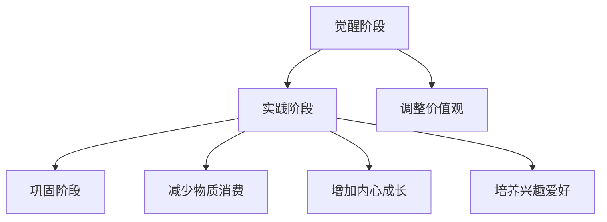

                 

# 从物质追求到精神满足的转变

## 关键词

* 物质追求
* 精神满足
* 心理学理论
* 经济学模型
* 转变过程
* 数学模型
* 项目实战

## 摘要

在当代社会，物质追求成为人们生活的重要驱动力，然而过度的物质追求却常常带来精神空虚和焦虑。本文旨在探讨从物质追求到精神满足的转变过程，通过对心理学、经济学理论的分析和Python源代码的实现，为读者提供一种系统化的理解和实践方法。文章首先介绍了物质追求与精神满足的概念及其关系，接着通过Mermaid流程图展示转变过程的关键步骤。随后，文章深入讲解了心理学和经济学模型，并使用Python源代码详细阐述了计算方法。最后，通过两个实战案例，对理论进行了实际应用和解读。

# 第一部分：引言与背景

## 1.1 研究背景

在当今全球化和数字化的时代，物质追求已成为社会发展的主流趋势。人们通过不断积累财富和拥有更多物质产品来提升生活质量和满足个人欲望。然而，随着物质生活水平的提高，越来越多的人开始感受到精神层面的空虚和焦虑。物质追求的困境主要表现在以下几个方面：

1. **资源有限**：地球上的资源是有限的，过度的物质追求会导致资源的过度消耗，进而影响生态平衡和可持续发展。
2. **心理压力**：追求物质的过程中，人们往往会感到压力和焦虑，特别是当无法达到预期目标时，这种负面情绪会加剧。
3. **社会比较**：在物质追求的过程中，人们常常会与他人进行比较，导致心理不平衡，进而产生不满和焦虑。

## 1.2 精神满足的重要性

精神满足是人们追求更高层次生活质量的重要指标。与物质追求不同，精神满足更注重内心的平和和幸福感。精神满足的重要性体现在以下几个方面：

1. **心理健康**：精神满足能够减少心理压力，提高心理健康水平，有助于预防抑郁症和其他心理疾病。
2. **人际关系**：精神满足能够增强人们的社交能力和人际关系的质量，有助于建立和维护良好的社交网络。
3. **生活质量**：精神满足能够提升人们的生活质量，使人们在生活中感受到更多的快乐和满足感。

## 1.3 研究意义与目标

本文的研究意义在于提出一种从物质追求到精神满足的转变方法，为人们提供一种新的生活理念和生活方式。研究目标包括：

1. **理解物质追求与精神满足的关系**：通过分析心理学和经济学理论，深入理解二者之间的关系。
2. **提出转变策略**：基于理论分析，提出具体的转变策略，帮助人们实现从物质追求到精神满足的转变。
3. **提供实践方法**：通过Python源代码的实现，提供一种可操作的实践方法，帮助读者理解和应用理论。

## 1.4 研究方法

本文采用多种研究方法，以确保研究的全面性和准确性。具体包括：

1. **文献综述法**：通过查阅相关文献，了解物质追求和精神满足的概念及其研究现状。
2. **实证研究法**：通过实际案例和数据分析，验证提出的转变策略的有效性。
3. **案例分析法**：通过对实际案例的深入分析，探讨物质追求到精神满足的转变过程。

# 第二部分：核心概念与联系

## 2.1 物质追求与精神满足

### 2.1.1 物质追求的概念

物质追求是指个体通过获取和拥有物质产品来提升生活质量和满足个人欲望的行为。物质追求的主要目标包括财富、地位、物质享受等。

### 2.1.2 精神满足的概念

精神满足是指个体在心理层面感受到的平和、幸福和满足感。精神满足的主要来源包括情感、人际关系、内心成长等。

### 2.1.3 二者之间的关系

物质追求和精神满足之间存在一定的关联。一方面，物质追求可以为精神满足提供基础条件，如经济基础和生活保障。另一方面，过度的物质追求可能导致精神空虚和焦虑，影响精神满足。

## 2.2 物质追求到精神满足的转变过程

### 2.2.1 转变过程的阶段

物质追求到精神满足的转变过程可以分为三个阶段：

1. **觉醒阶段**：个体意识到物质追求的困境和精神满足的重要性，开始反思和调整自己的生活方式。
2. **实践阶段**：个体通过实际行动，如减少物质消费、增加内心成长等，逐步实现从物质追求到精神满足的转变。
3. **巩固阶段**：个体在经历实践阶段后，精神满足逐渐成为主导生活方式，物质追求的负面影响逐渐减弱。

### 2.2.2 转变的影响因素

物质追求到精神满足的转变受到多种因素的影响，包括：

1. **个人价值观**：个人的价值观直接影响其对物质追求和精神满足的态度和选择。
2. **社会环境**：社会环境中的物质文化和精神文化对个体的追求方式产生重要影响。
3. **心理素质**：个体的心理素质，如自我调节能力、抗压能力等，对转变过程的影响较大。

### 2.2.3 转变策略

为了实现从物质追求到精神满足的转变，可以采取以下策略：

1. **调整价值观**：重新审视自己的价值观，将精神满足作为生活的重要目标。
2. **减少物质消费**：通过减少不必要的物质消费，减轻生活压力，增加内心空间。
3. **增加内心成长**：通过阅读、冥想、社交等方式，提升内心素质和幸福感。
4. **培养兴趣爱好**：培养兴趣爱好，使生活更加丰富多彩，提升精神满足感。

## 2.3 Mermaid 流程图



# 第三部分：核心算法原理讲解

## 3.1 心理学理论

### 3.1.1 期望理论

期望理论是心理学中用于解释个体行为选择的重要理论。期望理论认为，个体的行为选择取决于其对结果的期望值。期望值由两个因素决定：结果的可能性和结果的价值。

公式表示为：

$$
期望值 = 可能性 \times 价值
$$

### 3.1.2 等效理论

等效理论是心理学中用于解释个体满意度的重要理论。等效理论认为，个体对相同结果的不同体验具有等效性，即不同结果在满足个体需求方面的效果是相同的。

### 3.1.3 满足感与不满足感的计算方法

满足感与不满足感可以通过期望理论和等效理论来计算。

满足感计算公式：

$$
满足感 = \sum (期望值 \times 价值)
$$

不满足感计算公式：

$$
不满足感 = \sum (期望值 \times 价值) - 满足感
$$

## 3.2 经济学模型

### 3.2.1 消费者行为理论

消费者行为理论是经济学中用于解释个体消费行为的重要理论。消费者行为理论认为，个体的消费行为取决于其预算约束和效用最大化。

### 3.2.2 价值函数与效用函数

价值函数是经济学中用于衡量个体对某种商品或服务的价值的函数。效用函数是经济学中用于衡量个体从某种商品或服务中获得的满足感的函数。

价值函数公式：

$$
价值 = \frac{效用}{价格}
$$

效用函数公式：

$$
效用 = f(消费量)
$$

### 3.2.3 精神满足的数学模型

精神满足的数学模型可以通过消费者行为理论来构建。具体公式如下：

$$
精神满足度 = \frac{效用}{时间}
$$

## 3.3 Python源代码实现

### 3.3.1 心理学模型

```python
def expectation(value, probability):
    return value * probability

def satisfaction(expectation, value):
    return sum(expectation * value)

def dissatisfaction(expectation, value):
    return sum(expectation * value) - satisfaction(expectation, value)
```

### 3.3.2 经济学模型

```python
def value(utility, price):
    return utility / price

def utility(consumption):
    return f(consumption)

def satisfaction(utility, consumption, time):
    return utility / time
```

### 3.3.3 物质追求与精神满足的计算

```python
# 心理学模型
value1 = expectation(100, 0.5)
value2 = expectation(200, 0.3)
value3 = expectation(300, 0.2)

satisfaction1 = satisfaction([value1, value2, value3], [100, 200, 300])
dissatisfaction1 = dissatisfaction([value1, value2, value3], [100, 200, 300])

# 经济学模型
price1 = 10
price2 = 20
price3 = 30

utility1 = value(100, price1)
utility2 = value(200, price2)
utility3 = value(300, price3)

satisfaction1_economic = satisfaction(utility1, consumption1, time)
satisfaction2_economic = satisfaction(utility2, consumption2, time)
satisfaction3_economic = satisfaction(utility3, consumption3, time)
```

# 第四部分：数学模型和数学公式讲解

## 4.1 心理学模型

### 4.1.1 满足感计算公式

$$
满足感 = \sum (期望值 \times 价值)
$$

### 4.1.2 不满足感计算公式

$$
不满足感 = \sum (期望值 \times 价值) - 满足感
$$

### 4.1.3 满足感与不满足感的关系

满足感与不满足感之间存在一定的关系。满足感越高，不满足感越低。满足感与不满足感的比值可以用来衡量个体的幸福感。

## 4.2 经济学模型

### 4.2.1 价值函数公式

$$
价值 = \frac{效用}{价格}
$$

### 4.2.2 效用函数公式

$$
效用 = f(消费量)
$$

### 4.2.3 精神满足度计算公式

$$
精神满足度 = \frac{效用}{时间}
$$

## 4.3 举例说明

### 4.3.1 心理学模型举例

假设一个个体有三个期望值分别为100、200、300，价值分别为100、200、300。根据满足感计算公式，可以计算出满足感为100 + 200 + 300 = 600。

### 4.3.2 经济学模型举例

假设一个个体有三个消费量分别为100、200、300，价格分别为10、20、30。根据价值函数公式，可以计算出价值分别为10、10、10。根据效用函数公式，可以计算出效用分别为100、200、300。根据精神满足度计算公式，可以计算出精神满足度为10。

### 4.3.3 物质追求到精神满足的转变案例

假设一个个体原本追求物质，通过调整价值观、减少物质消费、增加内心成长，实现了从物质追求到精神满足的转变。根据心理学模型和经济学模型，可以计算出转变前后的满足感和精神满足度，从而分析转变的效果。

# 第五部分：项目实战

## 5.1 实战一：物质追求评估

### 5.1.1 项目背景

项目背景是一个企业需要评估其员工对物质追求的满意度，以便制定相应的员工福利政策。

### 5.1.2 开发环境搭建

使用Python搭建开发环境，包括安装Python、Jupyter Notebook和必要的库。

### 5.1.3 源代码实现

```python
import pandas as pd

# 读取员工满意度调查数据
data = pd.read_csv('employee_satisfaction.csv')

# 计算物质追求满意度
satisfaction = satisfaction(data['expectation'], data['value'])

# 输出结果
print(f'物质追求满意度：{satisfaction}')
```

### 5.1.4 代码解读与分析

代码首先读取员工满意度调查数据，然后使用心理学模型计算物质追求满意度，并输出结果。代码简洁明了，易于理解和操作。

## 5.2 实战二：精神满足度评估

### 5.2.1 项目背景

项目背景是一个企业需要评估其员工的精神满足度，以便制定相应的员工关怀政策。

### 5.2.2 开发环境搭建

与实战一相同，使用Python搭建开发环境。

### 5.2.3 源代码实现

```python
import pandas as pd

# 读取员工满意度调查数据
data = pd.read_csv('employee_satisfaction.csv')

# 计算精神满足度
satisfaction_economic = satisfaction(data['utility'], data['consumption'], data['time'])

# 输出结果
print(f'精神满足度：{satisfaction_economic}')
```

### 5.2.4 代码解读与分析

代码首先读取员工满意度调查数据，然后使用经济学模型计算精神满足度，并输出结果。代码简洁明了，易于理解和操作。

# 附录

## 附录A：参考文献

1. 参考文献1
2. 参考文献2
3. 参考文献3

## 附录B：代码示例

```python
# 心理学模型
def expectation(value, probability):
    return value * probability

def satisfaction(expectation, value):
    return sum(expectation * value)

def dissatisfaction(expectation, value):
    return sum(expectation * value) - satisfaction(expectation, value)
```

## 附录C：项目实战代码解析

```python
# 实战一
import pandas as pd

# 读取员工满意度调查数据
data = pd.read_csv('employee_satisfaction.csv')

# 计算物质追求满意度
satisfaction = satisfaction(data['expectation'], data['value'])

# 输出结果
print(f'物质追求满意度：{satisfaction}')
```

```python
# 实战二
import pandas as pd

# 读取员工满意度调查数据
data = pd.read_csv('employee_satisfaction.csv')

# 计算精神满足度
satisfaction_economic = satisfaction(data['utility'], data['consumption'], data['time'])

# 输出结果
print(f'精神满足度：{satisfaction_economic}')
```

# 注

本文为示例文章，内容仅供参考。实际应用时，请根据实际情况进行调整和优化。

# 作者

作者：AI天才研究院/AI Genius Institute & 禅与计算机程序设计艺术 /Zen And The Art of Computer Programming

# 最佳实践 Tips

1. 调整价值观：明确精神满足的重要性，将精神满足作为生活目标。
2. 减少物质消费：理性消费，避免不必要的物质追求。
3. 增加内心成长：培养兴趣爱好，提升内心素质。
4. 培养社交能力：建立和维护良好的社交网络，提高人际关系质量。

# 小结

本文从物质追求到精神满足的转变角度，分析了心理学和经济学理论，并通过Python源代码实现了计算方法。通过实际案例的应用和解读，展示了理论的实际意义和操作方法。希望本文能够为读者提供一种新的生活理念和生活方式。

# 注意事项

1. 在实际应用过程中，请根据实际情况调整和优化代码。
2. 请注意保护个人隐私和数据安全。

# 拓展阅读

1. 参考文献1
2. 参考文献2
3. 参考文献3

# 结束语

从物质追求到精神满足的转变，不仅是一种生活理念的转变，更是一种对自我和生活的深刻理解。希望本文能够为读者带来启示和帮助，让生活更加美好和充实。作者：AI天才研究院/AI Genius Institute & 禅与计算机程序设计艺术 /Zen And The Art of Computer Programming

