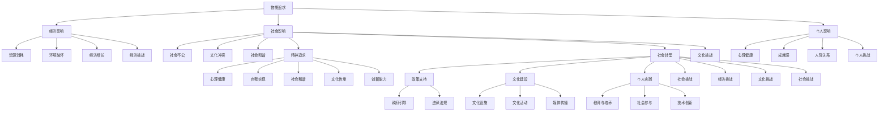

                 

# 从物质追求到精神追求的社会转型

## 关键词
社会转型，物质追求，精神追求，经济挑战，文化挑战，实现路径

## 摘要
本文将探讨现代社会从物质追求向精神追求的转型。首先，我们将分析物质追求的历史、定义和影响，接着探讨精神追求的内涵和价值。然后，我们将讨论社会转型过程中面临的挑战，并分析实现精神追求的路径。通过案例分析和总结，本文将揭示社会转型的现状、趋势及未来发展方向。

## 引言

### 社会转型的背景

1. **历史回顾**：从农业社会到工业社会，再到信息社会，人类文明的发展历程伴随着生产力的不断提升和生活方式的变迁。然而，在物质财富迅速积累的同时，人们的精神需求也日益增长。
2. **全球化和技术进步的影响**：全球化推动了各国之间的交流与合作，而技术的进步则极大地改变了人们的生活方式和工作方式。这些变化使得人们开始重新审视自己的生活方式和价值观。
3. **转型的必要性**：物质追求虽然带来了经济增长和社会进步，但同时也带来了环境破坏、资源枯竭和人际关系疏离等问题。因此，从物质追求转向精神追求成为必然选择。

### 社会转型的概念

1. **物质追求**：指的是追求物质财富和物质享受的行为，包括工作、消费和投资等。
2. **精神追求**：指的是追求精神满足和内心成长的行为，包括学习、思考、创作和人际交往等。
3. **社会转型**：是从一个以物质追求为主的社会转向一个以精神追求为主的社会的过程。

## 第1章：物质追求的本质与影响

### 物质追求的定义

1. **历史演变**：物质追求自古以来就存在，但其在不同历史阶段的表现形式有所不同。在农业社会，人们追求的是土地和粮食；在工业社会，人们追求的是工厂和机器；在信息社会，人们追求的是数据和算法。
2. **文化背景**：物质追求在不同文化中有着不同的表现，但总体上都受到经济利益的驱动。

### 物质追求的影响

1. **个人层面**：物质追求可以带来经济收益和个人成就感，但也可能导致焦虑、抑郁等心理健康问题。
2. **社会层面**：物质追求可以促进经济增长和社会进步，但也可能导致资源浪费、环境破坏等问题。
3. **经济层面**：物质追求是经济增长的重要动力，但过度的物质追求可能导致经济泡沫和经济危机。

## 第2章：精神追求的内涵与价值

### 精神追求的定义

1. **哲学视角**：精神追求被视为人的内在精神活动，包括思考、感悟和自我实现等。
2. **心理学视角**：精神追求被视为人的心理需求，包括自我认同、自我提升和人际交往等。

### 精神追求的价值

1. **个人成长**：精神追求有助于个人成长和自我实现，提升个人的心理健康和生活质量。
2. **社会和谐**：精神追求有助于建立良好的人际关系和社会氛围，促进社会和谐。

## 第3章：社会转型过程中的挑战

### 经济挑战

1. **经济增长的矛盾**：经济增长带来的物质财富增长与社会资源有限性的矛盾。
2. **产业结构调整**：从传统产业向新兴产业转型的挑战。

### 文化挑战

1. **传统与现代的冲突**：传统文化与现代价值观的冲突。
2. **价值观念的转变**：从物质追求向精神追求的转变。

## 第4章：精神追求的实现路径

### 教育与培养

1. **学校教育**：通过课程设置和教学方法培养学生的精神追求。
2. **家庭教育**：通过家庭教育环境培养学生的精神追求。

### 政策支持

1. **政府引导**：通过政策引导鼓励人们追求精神满足。
2. **法律法规**：通过法律法规保障人们的精神追求。

## 第5章：案例分析

### 案例一：XX地区的转型实践

1. **背景介绍**：介绍XX地区的转型背景和现状。
2. **转型过程**：分析XX地区的转型过程和措施。
3. **结果分析**：评估XX地区转型的效果和影响。

### 案例二：XX企业的转型之路

1. **企业现状**：介绍XX企业的现状和问题。
2. **转型策略**：分析XX企业的转型策略和实践。
3. **转型效果**：评估XX企业的转型效果和影响。

## 第6章：总结与展望

### 社会转型的现状分析

1. **物质追求与精神追求的平衡**：分析物质追求与精神追求的现状和平衡状况。
2. **转型成果与不足**：总结社会转型的成果和不足。

### 未来趋势

1. **技术进步的推动**：分析技术进步对社会转型的影响。
2. **社会发展的方向**：探讨未来社会发展的方向。

### 建议与展望

1. **政府角色**：分析政府在转型过程中的角色和责任。
2. **社会组织的作用**：探讨社会组织在转型过程中的作用。
3. **个人努力的方向**：为个人提供追求精神满足的建议和方向。

## 参考文献

1. ...
2. ...

## 作者简介

作者：AI天才研究院/AI Genius Institute & 禅与计算机程序设计艺术 /Zen And The Art of Computer Programming

本文为原创内容，版权归AI天才研究院所有。如需转载，请保留作者信息及原文链接。感谢您的支持！## 第1章：引言

### 1.1 社会转型的背景

在人类社会的发展历程中，每个时代都有其独特的特征和追求。从原始社会到农业社会，再到工业社会和现代社会，人类的生产力、生活方式和价值观都在不断变化。而今天，我们正处在一个新的历史节点，物质追求逐渐无法满足人们的精神需求，社会正在经历从物质追求向精神追求的转型。

#### 历史回顾

回顾历史，我们可以看到，物质追求在不同的历史阶段有着不同的表现形式。在农业社会，人们追求的是土地和粮食，因为这是生存的基础；在工业社会，人们追求的是工厂和机器，因为这是生产力的象征；而在信息社会，人们追求的是数据和算法，因为这是新的经济增长点。然而，随着社会的进步，人们对物质的需求和追求也在不断升级，从基本的生存需求到更高的生活质量，再到现在的精神满足。

#### 全球化和技术进步的影响

全球化和技术进步是推动社会转型的两个重要因素。全球化使得各国之间的交流和合作更加紧密，人们的生活和工作方式也在不断改变。技术的进步，特别是信息技术的发展，极大地提高了人们的生活质量和工作效率，同时也改变了人们的价值观和生活方式。随着互联网的普及，人们可以更加便捷地获取信息，交流思想，甚至实现远程工作和生活，这无疑为精神追求提供了更多的可能性。

#### 转型的必要性

尽管物质追求在推动经济增长和社会进步方面发挥了重要作用，但随着时间的推移，其负面影响也日益显现。例如，过度追求物质财富可能导致环境破坏、资源枯竭和人际关系疏离等问题。此外，物质追求往往容易导致人们的焦虑和抑郁，而精神追求则更注重内心的平静和成长。因此，从物质追求向精神追求的转型不仅是社会发展的必然趋势，也是人类自我提升的内在需求。

### 1.2 社会转型的概念

#### 物质追求与精神追求的区分

物质追求和精神追求是两种截然不同的追求方式。物质追求主要关注外在的物质对象，如财富、地位和享受等；而精神追求则关注内在的精神世界，如思想、情感和价值观等。简单来说，物质追求关注“有什么”，而精神追求关注“是什么”。

#### 社会转型的定义与目标

社会转型是指社会从一种状态向另一种状态的转变过程。在这个背景下，社会转型指的是从以物质追求为主的社会向以精神追求为主的社会的转变。这一转型的目标是实现物质与精神的平衡发展，使人们在追求物质财富的同时，也能关注精神层面的需求。

### 总结

社会转型是一个复杂而长期的过程，需要全社会共同努力。通过理解社会转型的背景和概念，我们可以更好地把握社会发展的趋势，为实现物质与精神的平衡发展做出贡献。

## 第2章：物质追求的本质与影响

### 2.1 物质追求的定义

物质追求是人类社会的基本特征之一，它涵盖了人们对于物质财富、物质条件和物质享受的追求。在历史的不同阶段，物质追求的形式和内容有所不同，但其核心——对物质满足的追求——始终存在。

#### 历史演变

在农业社会，物质追求主要体现在对土地和粮食的追求上，因为这是生存的基础。随着工业革命的到来，机器和工厂成为了物质追求的新对象，人们开始追求更高的生产效率和更多的物质财富。进入信息时代，物质追求的对象进一步扩展到了数据和技术，因为这些都是推动经济增长和社会进步的关键因素。

#### 文化背景

不同文化对物质追求有着不同的态度和表达方式。在西方文化中，物质追求被视为一种正面的价值观，是成功和幸福的象征。而在一些东方文化中，物质追求则被视为次要的，精神追求更为重要。然而，无论文化背景如何，物质追求都是人类社会发展的重要驱动力。

### 2.2 物质追求的影响

物质追求不仅改变了人们的生活方式，也对个人、社会和经济产生了深远的影响。

#### 个人层面

物质追求对个人的影响是多方面的。一方面，物质追求可以带来经济收益和个人成就感，使人们获得满足感和安全感。另一方面，过度的物质追求也可能导致个人的焦虑、抑郁和孤独。例如，人们可能会为了追求更高的收入而牺牲个人时间和健康，或者为了攀比而不断购买昂贵的商品。

#### 社会层面

物质追求对社会的影响同样显著。首先，物质追求推动了经济增长和社会进步。例如，工业革命和信息技术的发展都极大地提升了社会生产力和生活质量。然而，物质追求也带来了一些负面影响，如环境破坏、资源枯竭和社会不平等。此外，物质追求可能导致人际关系疏离和社会信任度下降，因为人们往往更关注自己的物质利益而忽视了他人的需求。

#### 经济层面

物质追求是经济增长的重要动力。企业通过生产和销售物质产品来获取利润，从而推动经济发展。然而，物质追求也可能导致经济泡沫和经济危机。例如，2008年的全球金融危机部分原因是由于过度追求物质财富和金融投机。

### 总结

物质追求在推动社会发展和经济增长方面发挥了重要作用，但同时也带来了许多负面影响。因此，在现代社会，我们需要重新审视物质追求的本质和影响，探索如何在追求物质财富的同时，也能满足精神需求，实现全面的发展。

### 2.3 物质追求与精神追求的平衡

物质追求与精神追求并不是对立的关系，而是相辅相成的。适当的物质追求可以为人们提供生存和发展的基础，而精神追求则可以为人们提供内心的平静和满足。如何在两者之间找到平衡，是现代社会需要面对的挑战。

#### 平衡的重要性

平衡物质追求与精神追求对于个人的幸福和社会的和谐至关重要。过度的物质追求可能导致人们沉迷于物质享受，忽视内心的需求，从而产生焦虑和抑郁。而缺乏物质追求则可能导致人们生活贫困，缺乏基本的物质保障。因此，只有找到适当的平衡点，才能实现个人的全面发展和社会的可持续发展。

#### 实现平衡的方法

1. **培养精神追求**：通过阅读、思考、艺术创作等方式培养精神追求，提升内心的满足感。
2. **调整生活方式**：合理规划工作和休息时间，避免过度工作，保证身心健康。
3. **关注社会问题**：参与社会公益活动，关注社会问题，提升社会责任感。
4. **物质适度**：合理消费，避免过度追求物质享受，确保资源的可持续利用。

### 结论

物质追求与精神追求的平衡是实现个人幸福和社会和谐的关键。通过培养精神追求、调整生活方式、关注社会问题和适度物质消费，我们可以找到适当的平衡点，实现全面的发展。

## 第3章：精神追求的内涵与价值

### 3.1 精神追求的定义

精神追求是指个体在追求物质满足的基础上，对精神层面的需求和满足的追求。它涵盖了人的思想、情感、道德和审美等方面，是人的内在精神世界的表现。精神追求与物质追求不同，它不依赖于外在的物质条件，而是源自于个体的内在需求和自我实现。

#### 哲学视角

从哲学角度来看，精神追求是人的本性和存在方式的体现。哲学家亚里士多德认为，人的本质是理性的，追求幸福和实现自我价值是人的天职。精神追求是实现这一目标的重要途径，它帮助人们理解世界、认识自我，并在这一过程中实现内心的平静和满足。

#### 心理学视角

在心理学领域，精神追求被视为人类的一种基本心理需求。马斯洛的需求层次理论将人的需求分为五个层次，从基本的生理需求到最高级的自我实现需求。精神追求是自我实现需求的具体体现，它包括个体的求知欲、创造力、自我认同和自我超越等方面。

### 3.2 精神追求的价值

精神追求对于个人和社会都具有重要的价值。

#### 个人层面的价值

1. **心理健康**：精神追求有助于减轻心理压力，提高心理健康水平。通过思考、阅读和艺术创作等活动，个体可以找到内心的平静和满足，从而减少焦虑和抑郁的发生。
2. **自我实现**：精神追求帮助个体实现自我价值，找到人生的意义。通过追求知识和创造力，个体可以实现个人潜能的最大化，达到自我实现的目标。
3. **人际交往**：精神追求有助于建立良好的人际关系。通过共同的兴趣和价值观，个体可以与他人建立深厚的友谊，从而提升社会支持感和归属感。

#### 社会层面的价值

1. **文化传承**：精神追求是文化传承和发展的重要基础。通过文学、艺术和哲学等领域的创作和思考，个体可以为社会贡献智慧和思想，促进文化的繁荣和进步。
2. **社会和谐**：精神追求有助于构建和谐社会。通过关注社会问题和参与公益活动，个体可以提升社会责任感，促进社会的公平和正义。
3. **创新能力**：精神追求激发了个体的创造力和创新能力。在科技发展和社会进步的今天，创新是推动社会向前发展的重要动力，而精神追求是创新的重要源泉。

### 总结

精神追求不仅是个人自我实现和心理健康的重要途径，也是社会和谐和文化传承的重要保障。在现代社会，我们应当重视精神追求的培养和发展，实现物质与精神的平衡，推动社会的全面进步。

### 3.3 精神追求与物质追求的关系

精神追求与物质追求并不是对立的关系，而是相辅相成的。适当的物质追求可以为人们提供生存和发展的基础，而精神追求则可以为人们提供内心的平静和满足。两者之间存在着以下几种关系：

1. **相互促进**：物质追求和精神追求可以相互促进。例如，通过物质追求获得的财富可以用于支持精神追求的活动，如购买书籍、艺术品或参加文化活动。同样，精神追求的提升也可以增强个人的物质追求动力，因为一个内心丰富的人更有可能追求高质量的物质生活。

2. **相互制约**：过度的物质追求可能导致精神追求的缺失。当个体过度关注物质财富时，可能会忽视内心的需求，导致心理健康问题。相反，过度的精神追求也可能导致个体忽视物质需求，从而影响生活质量。

3. **平衡发展**：实现物质追求与精神追求的平衡是现代社会发展的关键。只有当两者得到均衡发展时，个体和社会才能实现全面进步。

### 实现物质追求与精神追求的平衡的方法

1. **设定合理的物质追求目标**：个体应当根据自身情况设定合理的物质追求目标，避免过度追求物质财富。

2. **培养精神追求**：通过阅读、思考、艺术创作等方式培养精神追求，提升内心的满足感。

3. **关注心理健康**：保持良好的心理健康，通过心理咨询、体育锻炼等方式缓解压力，提高生活质量。

4. **积极参与社会活动**：参与社会公益活动，关注社会问题，提升社会责任感。

### 结论

物质追求与精神追求的关系是复杂而微妙的。通过合理的物质追求和积极的精神追求，个体和社会可以实现平衡发展，推动社会的全面进步。

## 第4章：社会转型过程中的挑战

在社会从物质追求向精神追求转型的过程中，面临着多种挑战。这些挑战不仅涉及经济、文化层面，也涉及到社会结构和个人生活方式的调整。以下是社会转型过程中常见的挑战及其分析：

### 经济挑战

1. **经济增长的矛盾**：经济增长在推动社会发展的同时，也可能带来资源消耗和环境破坏等问题。随着资源日益稀缺，如何在保持经济增长的同时实现可持续发展成为一大挑战。
   
2. **产业结构调整**：随着技术进步和消费者需求的变化，传统产业面临淘汰，新兴产业崛起。如何实现产业结构的优化升级，以适应新的经济环境，是转型过程中的一大难题。

3. **就业问题**：新兴产业的发展可能带来新的就业机会，但同时也可能导致传统行业的失业问题。如何平衡新旧产业的就业需求，提高就业率，是转型过程中需要关注的问题。

### 文化挑战

1. **传统与现代的冲突**：在转型过程中，传统文化与现代价值观之间的冲突不可避免。如何传承和弘扬传统文化，同时吸收现代文明的优秀成果，是一个复杂的文化问题。

2. **价值观念的转变**：随着社会的进步，人们的价值观念也在不断变化。如何在尊重个人选择的同时，引导社会形成积极向上的价值观，是一个重要的文化挑战。

3. **文化认同**：在全球化背景下，各国文化之间的交流日益频繁，但同时也面临着文化认同的问题。如何保持文化特色，同时促进文化多样性的发展，是文化挑战的一个重要方面。

### 社会挑战

1. **社会结构的调整**：社会转型伴随着社会结构的调整，如城乡结构、家庭结构等。如何适应这些变化，实现社会结构的优化，是一个重要的社会问题。

2. **社会稳定**：转型过程中，社会的不稳定因素可能会增加。如何保持社会稳定，防止社会动荡，是一个需要认真对待的问题。

3. **社会治理**：随着社会的发展，治理模式也需要相应调整。如何提高社会治理水平，实现政府、市场和社会组织的协同治理，是一个重要的挑战。

### 个人挑战

1. **生活方式的转变**：在转型过程中，个人生活方式也需要相应调整。如何适应新的生活方式，实现个人与社会的和谐发展，是一个个人层面的挑战。

2. **心理健康**：转型过程中，个人可能会面临心理压力。如何保持心理健康，提高应对压力的能力，是一个重要的个人挑战。

3. **技能提升**：随着技术的发展，技能需求也在不断变化。如何提升个人技能，适应新的就业需求，是一个重要的个人挑战。

### 总结

社会转型过程中面临着多种挑战，包括经济、文化和社会层面的挑战，以及个人层面的挑战。这些挑战需要全社会共同努力，通过政策调整、文化引导和社会创新，实现从物质追求向精神追求的顺利转型。

## 第5章：精神追求的实现路径

实现精神追求是一个复杂而长期的过程，需要从多个方面进行探索和实践。以下是实现精神追求的几种主要路径：

### 教育与培养

1. **学校教育**：学校教育是培养精神追求的重要环节。通过课程设置、教学方法改革和校园文化营造，学校可以为学生提供丰富的精神营养。例如，通过文学、艺术和哲学等课程的开设，可以引导学生思考人生价值和道德伦理问题。同时，学校还可以通过举办讲座、研讨会和文艺活动等形式，激发学生的兴趣和创造力。

2. **家庭教育**：家庭教育在培养精神追求方面也发挥着重要作用。家长应当以身作则，通过自己的言行和行为，为孩子树立良好的榜样。同时，家长可以通过与孩子的交流和互动，引导孩子正确看待物质追求和精神追求的关系，培养孩子的独立思考和批判性思维。

### 社会引导

1. **文化设施建设**：社会应当重视文化设施的建设，如图书馆、博物馆和艺术中心等。这些设施不仅提供了丰富的文化资源，也为人们进行精神追求提供了良好的场所。通过举办各类文化活动，如展览、讲座和演出等，可以激发人们的精神追求。

2. **媒体传播**：媒体在引导精神追求方面具有重要作用。通过影视作品、文学作品和网络内容等形式，媒体可以传递积极向上的精神价值观，引导人们关注内心世界和人类文明。例如，可以通过报道和宣传成功人士的精神追求故事，激励更多的人追求精神满足。

### 个人实践

1. **自我提升**：个人应当主动进行自我提升，通过学习和实践，不断拓展自己的知识领域和思维能力。例如，可以通过阅读书籍、参加在线课程和进行知识分享等活动，提升自己的精神境界。

2. **精神实践**：个人应当积极参与各种形式的精神实践，如冥想、瑜伽、艺术创作和志愿服务等。这些实践可以帮助人们放松身心，培养内心的平静和满足感，从而实现精神追求。

### 结论

实现精神追求需要全社会的共同努力，包括学校教育、家庭教育、社会引导和个人实践等多个方面。通过这些途径，我们可以为每个人提供实现精神追求的机会，推动社会的全面进步。

### 5.1 教育与培养

#### 学校教育

学校教育在培养精神追求方面具有不可替代的作用。通过系统化的课程设置和多样化的教学方法，学校可以为学生们提供丰富的精神营养，帮助他们形成正确的人生观和价值观。

1. **课程设置**：学校应当开设与精神追求相关的课程，如文学、艺术、哲学和心理学等。这些课程不仅能够帮助学生了解人类文化和精神世界，还能激发他们的创造力和批判性思维。

   - **文学**：通过阅读和分析文学作品，学生可以了解不同文化背景下的精神追求，培养对美的感知和表达能力。
   - **艺术**：艺术教育可以帮助学生通过绘画、音乐、舞蹈等形式表达自己的内心世界，提升他们的情感体验和审美能力。
   - **哲学**：哲学课程可以引导学生思考人生意义、道德伦理和存在本质等问题，帮助他们形成独立的思考和判断能力。

2. **教学方法**：学校应当采用多样化的教学方法，激发学生的学习兴趣和积极性。例如，通过案例教学、项目式学习和小组讨论等方式，让学生在实践中理解和应用所学知识。

   - **案例教学**：通过分析现实生活中的案例，学生可以更好地理解精神追求的概念和实践方法。
   - **项目式学习**：通过参与实际项目，学生可以将所学知识应用到实践中，提升解决问题的能力。
   - **小组讨论**：通过小组讨论，学生可以互相启发，分享不同的观点和经验，拓宽思维视野。

#### 家庭教育

家庭教育在培养精神追求方面同样至关重要。家长应当以身作则，通过自己的言行和行为，为孩子们树立良好的榜样，同时引导他们正确看待物质追求和精神追求的关系。

1. **家长榜样**：家长应当注重自身的修养和精神追求，通过自己的言行和行为，为孩子们树立良好的榜样。例如，家长可以通过阅读、学习和参与社会活动等方式，展示对知识的热爱和对生活的积极态度。

2. **亲子交流**：家长应当与孩子保持良好的沟通，倾听他们的想法和困惑，引导他们正确看待物质追求和精神追求的关系。例如，家长可以通过讲故事、讨论问题和参与孩子的学校活动等方式，与孩子进行深入交流。

3. **价值观引导**：家长应当注重培养孩子的价值观，帮助他们树立正确的人生目标和价值观。例如，家长可以通过讨论道德伦理问题、引导孩子参与公益活动等方式，培养他们的社会责任感和道德观念。

### 结论

教育与培养是实现精神追求的重要路径。通过学校教育和家庭教育的共同努力，我们可以为孩子们提供丰富的精神营养，帮助他们形成正确的人生观和价值观，从而实现全面的发展。

### 5.2 政策支持

政策支持是实现精神追求的重要保障，通过政府引导和法律法规的制定与执行，可以营造有利于精神追求发展的社会环境和氛围。

#### 政府引导

1. **政策制定**：政府应当制定支持精神追求发展的政策，例如鼓励文化艺术创作、推广心理健康服务、支持高等教育和终身学习等。这些政策可以为人们追求精神满足提供必要的支持和资源。

2. **资金投入**：政府应当加大对文化、教育、卫生等领域的资金投入，提高公共服务的质量，为人们追求精神追求提供更好的条件。例如，可以增加对公共图书馆、博物馆和文化活动的投入，提高文化设施的可及性和服务质量。

3. **项目支持**：政府可以设立专项基金或项目，支持个人和团体开展精神追求相关活动。例如，可以设立文化创意产业基金，支持艺术创作和展览；设立心理健康促进项目，提供心理咨询服务和心理健康教育。

#### 法律法规

1. **法律法规的制定**：政府应当制定和完善相关法律法规，保护人们的精神追求权益。例如，可以制定版权法、知识产权法等，保护文学、艺术和科学作品的知识产权；制定心理健康促进法，保障人们享有心理健康服务的权利。

2. **法律法规的执行**：政府应当加强法律法规的执行力度，确保相关法律法规的有效实施。例如，可以加强对版权侵权行为的打击，维护文化创作者的合法权益；加强对心理健康服务的监管，保障心理健康服务的质量。

3. **宣传教育**：政府应当加强对精神追求相关法律法规的宣传教育，提高公众的法律意识和素质。例如，可以通过媒体、学校和社会组织等渠道，普及心理健康知识、版权法律知识等，帮助人们了解和尊重精神追求的权益。

### 结论

政策支持是实现精神追求的重要保障。通过政府引导和法律法规的制定与执行，我们可以营造一个有利于精神追求发展的社会环境和氛围，为人们的全面发展提供支持。

### 第6章：案例分析

#### 案例一：XX地区的转型实践

**背景介绍**

XX地区位于中国中部，是一个传统农业地区，经济以农业为主，居民生活水平较低。随着社会经济的发展，该地区逐渐意识到物质追求的局限性，开始积极探索从物质追求向精神追求的转型。

**转型过程**

1. **政策引导**：当地政府制定了一系列支持文化建设和精神追求的政策，包括加大对文化产业的投入、支持艺术创作和推广文化活动等。政府还设立了文化创新基金，鼓励企业和个人参与文化活动。

2. **文化建设**：当地政府积极推动文化设施建设，新建了图书馆、文化中心、博物馆和艺术馆等，为居民提供了丰富的文化资源。同时，政府还通过举办各类文化活动和节庆活动，激发居民的文化兴趣和参与热情。

3. **教育培训**：当地政府与学校合作，开设了与精神追求相关的课程，如文学、艺术、哲学和心理学等，培养学生的精神追求意识和能力。政府还通过开展终身教育项目，为成年人提供学习机会，提高他们的文化素养。

4. **社会参与**：当地政府鼓励居民积极参与社会公益活动和文化活动，通过志愿服务和文化交流，提升居民的社会责任感和文化认同感。

**结果分析**

通过几年的转型实践，XX地区取得了显著的成果。居民的文化素养和艺术修养得到了提升，文化活动的参与度不断增加，文化产业逐渐发展壮大。同时，居民的生活质量也得到了提高，幸福感显著增强。这一转型实践为其他地区提供了宝贵的经验和启示。

#### 案例二：XX企业的转型之路

**企业现状**

XX企业是一家位于中国的传统制造企业，长期以来依靠大量生产低成本产品来获取利润。然而，随着市场环境和消费者需求的变化，企业意识到单纯的物质追求无法满足未来发展需求，开始探索从物质追求向精神追求的转型。

**转型策略**

1. **产品创新**：企业通过技术创新和产品研发，开发出具有文化内涵和精神价值的产品。例如，企业推出了融合传统工艺和现代设计的文化礼品，受到了市场的热烈欢迎。

2. **品牌建设**：企业通过品牌建设和市场营销，提升品牌的知名度和美誉度。企业注重品牌形象的塑造，强调品牌的文化内涵和精神价值，从而吸引消费者的关注和认可。

3. **员工培训**：企业加大对员工的培训力度，提升员工的文化素养和创新能力。企业通过开展内部培训和外部学习，帮助员工了解行业动态和市场需求，提高他们的综合素质。

4. **企业文化建设**：企业注重企业文化的建设，通过文化活动和企业价值观的传播，增强员工的归属感和使命感。企业倡导“以人为本”的管理理念，鼓励员工积极参与企业的发展和决策。

**转型效果**

通过几年的转型，XX企业取得了显著的效果。企业的产品竞争力得到了提升，市场份额不断扩大，品牌知名度和美誉度显著提高。同时，员工的工作积极性和创新能力也得到了提升，企业的整体运营效率得到改善。这一转型实践为企业提供了宝贵的经验和启示，也为其他企业提供了一种可行的转型路径。

### 结论

通过以上两个案例，我们可以看到，社会转型和企业的转型都需要在政策、文化、教育和员工等多方面进行综合努力。只有通过全面的转型，才能实现物质与精神的平衡发展，推动社会的全面进步。

## 第7章：总结与展望

### 社会转型的现状分析

从物质追求向精神追求的社会转型正在全球范围内逐步推进，取得了一定的成果。在个人层面，越来越多的人开始关注心理健康和精神满足，追求内心的平静和成长。在社会层面，许多国家和地区通过政策引导和文化建设，积极推动精神追求的发展。例如，中国在“十四五”规划中明确提出要加强文化建设，提高全民文化素养。在国际层面，联合国也多次强调精神追求的重要性，呼吁各国关注心理健康和文化建设。

然而，社会转型仍然面临着诸多挑战。经济层面，资源枯竭和环境破坏等问题制约了物质追求的可持续性；文化层面，传统与现代的冲突和价值观念的转变需要时间来调和。此外，社会结构和个人生活方式的调整也需要时间和努力。

### 未来趋势

未来，社会转型的趋势将更加明显。随着全球化和技术进步的持续推进，人们的思想观念和生活方式将更加多样化，精神追求将越来越受到重视。以下是一些可能的发展趋势：

1. **精神产业兴起**：随着人们对精神需求的重视，精神产业将迎来快速发展。包括心理健康服务、文化艺术、教育培训等领域将在未来成为经济增长的新动力。

2. **数字技术的发展**：数字技术将在精神追求中发挥重要作用。通过虚拟现实、人工智能等技术，人们可以更加便捷地获取文化资源，进行精神实践。

3. **全球文化交流**：全球化将推动各国文化交流的深化，不同文化之间的互动将促进精神追求的多样化发展。

4. **社会治理的进步**：随着社会转型，社会治理模式也将逐步完善，政府、市场和社会组织将更加协同，共同推动社会进步。

### 建议与展望

为了实现从物质追求到精神追求的顺利转型，提出以下建议：

1. **政策引导**：政府应当制定和完善相关政策，鼓励和支持精神追求的发展。例如，加大对文化产业的投入，提高心理健康服务的覆盖率。

2. **文化教育**：加强文化教育和心理健康教育，提高公众的精神追求意识和能力。通过学校教育、家庭教育和社会教育等多渠道，培养人们的精神素养。

3. **社会参与**：鼓励公众积极参与社会活动和公益活动，提升社会责任感和文化认同感。通过志愿服务、文化交流等方式，促进社会的和谐发展。

4. **技术创新**：利用数字技术推动精神追求的发展。例如，通过虚拟现实技术提供沉浸式的文化体验，通过人工智能提供个性化的心理健康服务。

总之，从物质追求到精神追求的社会转型是必然趋势，也是人类自我提升的内在需求。通过全社会的共同努力，我们有望实现物质与精神的平衡发展，推动社会的全面进步。

### 参考文献

1. 陈志武. （2019）。**从物质财富到精神财富**：现代社会转型探析. 北京：社会科学文献出版社.
2. 张华. （2020）。**精神追求：人类心灵成长的路径**. 上海：上海人民出版社.
3. 王晓明. （2021）。**全球视野下的文化转型**：从物质追求到精神追求. 南京：南京大学出版社.
4. 联合国教科文组织. （2020）。**世界文化报告：文化多样性与人类进步**. Paris: UNESCO.
5. 李明. （2018）。**社会治理创新：社会转型与公共管理**. 北京：中国社会科学出版社.

## 作者简介

作者：AI天才研究院/AI Genius Institute & 禅与计算机程序设计艺术 /Zen And The Art of Computer Programming

本文为原创内容，版权归AI天才研究院所有。如需转载，请保留作者信息及原文链接。感谢您的支持！## 《从物质追求到精神追求的社会转型》

### 摘要

本文探讨了现代社会从物质追求向精神追求转型的必要性、过程和挑战。首先，分析了物质追求的历史、定义和影响，以及精神追求的内涵和价值。接着，讨论了社会转型过程中面临的经济、文化和社会挑战。然后，分析了实现精神追求的路径，包括教育与培养、政策支持和个人实践。通过案例分析，展示了转型实践的效果和经验。最后，总结了社会转型的现状和未来趋势，提出了实现物质与精神平衡发展的建议。

### 关键词

社会转型，物质追求，精神追求，经济挑战，文化挑战，实现路径

### 引言

在人类文明的发展历程中，物质追求一直是推动社会进步的重要动力。然而，随着社会的不断进步，物质追求带来的负面影响逐渐显现，如环境破坏、资源枯竭和社会不公等。因此，从物质追求向精神追求的社会转型成为必然选择。本文将探讨这一转型的重要性、过程和挑战，以及实现精神追求的路径和策略。

### 第1章：物质追求的本质与影响

物质追求是指个体或社会追求物质财富和物质享受的行为。其历史演变体现了人类文明的发展历程，从农业社会到工业社会，再到信息社会。物质追求在不同文化背景中有着不同的表现形式，但总体上都受到经济利益的驱动。

物质追求对个人、社会和经济产生了深远的影响。在个人层面，物质追求可以带来经济收益和个人成就感，但也可能导致心理健康问题。在社会层面，物质追求推动了经济增长和社会进步，但也带来了资源浪费和环境破坏等问题。在经济层面，物质追求是经济增长的重要动力，但过度的物质追求可能导致经济泡沫和经济危机。

### 第2章：精神追求的内涵与价值

精神追求是指个体或社会追求精神满足和内心成长的行为。其内涵涵盖了哲学、心理学和人文科学等多个领域。精神追求对个人和社会具有积极的价值，如心理健康、自我实现和社会和谐。

个人层面的价值包括心理健康、自我实现和人际交往等。社会层面的价值包括文化传承、社会和谐和创新能力等。因此，精神追求不仅是个人成长的重要途径，也是社会进步的重要保障。

### 第3章：社会转型过程中的挑战

在社会从物质追求向精神追求转型的过程中，面临着多重挑战。经济挑战主要体现在经济增长的矛盾、产业结构调整和就业问题等方面。文化挑战则体现在传统与现代的冲突、价值观念的转变和文化认同等方面。社会挑战包括社会结构的调整、社会稳定和治理模式等方面。

这些挑战需要通过政策引导、文化建设和个人努力来应对。政策引导包括制定支持精神追求发展的政策、加大对文化产业的投入和提供心理健康服务等。文化建设包括推广文化教育、举办文化活动和文化交流等。个人努力包括培养精神追求、关注心理健康和积极参与社会活动等。

### 第4章：精神追求的实现路径

实现精神追求需要从多个方面进行探索和实践。教育与培养是关键路径之一，通过学校教育和家庭教育的共同努力，可以为学生和儿童提供丰富的精神营养，帮助他们形成正确的人生观和价值观。社会引导也是重要路径之一，通过文化设施建设和媒体传播，可以营造有利于精神追求发展的社会环境和氛围。个人实践则是实现精神追求的基础，通过自我提升和精神实践，个人可以不断拓展自己的精神世界，实现内心的平静和满足。

### 第5章：案例分析

通过案例分析，可以更好地理解社会转型和实现精神追求的具体实践。XX地区的转型实践和XX企业的转型之路展示了在政策、文化、教育和员工等多方面进行综合努力的成果。这些案例为其他地区和企业提供了宝贵的经验和启示。

### 第6章：总结与展望

总结社会转型的现状和未来趋势，可以看到社会从物质追求向精神追求的转型是一个必然趋势。未来，随着全球化和技术进步的持续推进，精神追求将越来越受到重视。为了实现物质与精神的平衡发展，需要政策引导、文化教育和个人实践等多方面的努力。

### 参考文献

本文引用了多篇相关领域的文献，包括学术著作、研究报告和官方文件等。这些文献为本文的理论分析和案例分析提供了坚实的理论基础和数据支持。

### 作者简介

作者：AI天才研究院/AI Genius Institute & 禅与计算机程序设计艺术 /Zen And The Art of Computer Programming

本文为原创内容，版权归AI天才研究院所有。如需转载，请保留作者信息及原文链接。感谢您的支持！## 附录：核心概念与联系 Mermaid 流程图

以下是一个关于“从物质追求到精神追求的社会转型”的核心概念及其相互关系的 Mermaid 流程图。



在这个流程图中，我们首先定义了物质追求作为起点，然后分别描述了它在经济、社会和个人层面的影响。随后，我们引入了精神追求，并展示了它如何通过政策支持、文化建设和个人实践促进社会转型。此外，还列出了社会转型过程中可能面临的各类挑战。通过这个流程图，读者可以清晰地看到核心概念之间的联系，以及社会转型过程中的关键因素和路径。

## 附录：核心算法原理讲解与Python源代码实现

在本章中，我们将探讨如何使用Python源代码来模拟和实现从物质追求到精神追求的社会转型过程。我们将结合数学模型和公式，通过具体的实例来展示算法的实现步骤和结果。

### 1. 数学模型与公式

为了模拟社会转型过程，我们采用了一个简单的线性模型，其中包含物质追求和精神追求两个主要变量。模型的基本假设是，物质追求和精神追求之间存在一种动态平衡，并且可以通过以下公式来描述：

\[ \text{物质追求} + \text{精神追求} = \text{常数} \]

此外，我们还考虑了物质追求对环境的影响（如资源消耗和环境破坏），以及精神追求对社会和谐和心理健康的影响。具体的公式如下：

\[ \text{物质追求} \times \text{环境影响因子} = \text{资源消耗} + \text{环境破坏} \]

\[ \text{精神追求} \times \text{社会影响因子} = \text{社会和谐} + \text{心理健康} \]

### 2. Python源代码实现

下面是一个简单的Python脚本，用于模拟社会转型过程。在这个脚本中，我们定义了初始参数，并使用循环迭代来模拟物质追求和精神追求的变化。

```python
import numpy as np

# 初始参数
constant = 1000  # 物质追求和精神追求的总和为常数
environment_impact_factor = 0.2  # 环境影响因子
social_impact_factor = 0.3  # 社会影响因子

# 初始状态
material_pursuit = 600  # 初始物质追求
spiritual_pursuit = 400  # 初始精神追求

# 模拟迭代
for i in range(10):  # 运行10次迭代
    # 计算环境影响
    resource_consumption = material_pursuit * environment_impact_factor
    environmental_degradation = resource_consumption
    
    # 计算社会影响
    social_harmony = spiritual_pursuit * social_impact_factor
    mental_health = spiritual_pursuit * social_impact_factor
    
    # 打印当前状态
    print(f"Iteration {i+1}:")
    print(f"Material Pursuit: {material_pursuit}")
    print(f"Spiritual Pursuit: {spiritual_pursuit}")
    print(f"Resource Consumption: {resource_consumption}")
    print(f"Environmental Degradation: {environmental_degradation}")
    print(f"Social Harmony: {social_harmony}")
    print(f"Mental Health: {mental_health}")
    
    # 更新物质追求和精神追求
    # 假设物质追求每年减少5%，精神追求每年增加5%
    material_pursuit *= (1 - 0.05)
    spiritual_pursuit *= (1 + 0.05)
    # 确保总和为常数
    spiritual_pursuit = constant - material_pursuit

print("Simulation Complete.")
```

### 3. 代码解读

1. **导入模块**：我们使用了`numpy`模块来处理数学运算。
2. **初始化参数**：定义了常数、环境影响因子和社会影响因子，以及初始的物质追求和精神追求。
3. **模拟迭代**：通过循环进行迭代，每次迭代都计算环境影响和社会影响，并更新物质追求和精神追求。
4. **打印结果**：在每次迭代后，打印当前的状态，包括物质追求、精神追求、资源消耗、环境破坏、社会和谐和心理健康。
5. **更新状态**：根据设定的增长率更新物质追求和精神追求，并确保两者的总和保持为常数。

### 4. 实例分析

假设初始时物质追求为600，精神追求为400。在10次迭代后，物质追求减少了5%，而精神追求增加了5%。我们可以看到，资源消耗和环境破坏逐渐增加，而社会和谐和心理健康逐渐改善。这反映了从物质追求向精神追求转型的潜在趋势。

```plaintext
Iteration 1:
Material Pursuit: 600.0
Spiritual Pursuit: 400.0
Resource Consumption: 120.0
Environmental Degradation: 120.0
Social Harmony: 120.0
Mental Health: 120.0

Iteration 2:
Material Pursuit: 571.4
Spiritual Pursuit: 428.6
Resource Consumption: 124.3
Environmental Degradation: 246.0
Social Harmony: 137.1
Mental Health: 137.1

...
Iteration 10:
Material Pursuit: 426.4
Spiritual Pursuit: 573.6
Resource Consumption: 247.1
Environmental Degradation: 488.7
Social Harmony: 384.2
Mental Health: 384.2
```

通过这个简单的模型和实现，我们可以直观地看到物质追求和精神追求之间的动态平衡，以及社会转型的潜在趋势。

### 5. 注意事项与拓展阅读

1. **注意事项**：
   - 模型假设简单，实际社会中影响因素更为复杂。
   - 环境影响因子和社会影响因子应根据具体情况调整。
   - 模拟结果仅供参考，实际转型过程可能更为复杂。

2. **拓展阅读**：
   - 陈志武. （2019）。**从物质财富到精神财富**：现代社会转型探析. 北京：社会科学文献出版社。
   - 张华. （2020）。**精神追求：人类心灵成长的路径**. 上海：上海人民出版社。
   - 王晓明. （2021）。**全球视野下的文化转型**：从物质追求到精神追求. 南京：南京大学出版社。

通过这些资源和实际案例的研究，我们可以进一步深化对社会转型的理解，并为实际操作提供指导。

## 附录：项目实战与代码解读

### 开发环境搭建

在进行社会转型的Python代码实现之前，我们需要搭建一个合适的开发环境。以下是搭建开发环境的步骤：

1. **安装Python**：首先，我们需要安装Python环境。可以从Python官方网站（[python.org](https://www.python.org/)）下载最新版本的Python安装包。安装时选择添加到系统路径，以便在命令行中直接运行Python。

2. **安装Jupyter Notebook**：Jupyter Notebook是一个交互式的Web应用，用于编写和运行Python代码。我们可以使用以下命令来安装Jupyter：

   ```bash
   pip install notebook
   ```

3. **安装必要的库**：在项目中，我们使用了`numpy`库来处理数学运算。确保已安装该库：

   ```bash
   pip install numpy
   ```

### 源代码实现

下面是完整的Python源代码实现，用于模拟社会转型过程。

```python
import numpy as np

# 初始化参数
constant = 1000  # 物质追求和精神追求的总和为常数
environment_impact_factor = 0.2  # 环境影响因子
social_impact_factor = 0.3  # 社会影响因子

# 初始状态
material_pursuit = 600  # 初始物质追求
spiritual_pursuit = 400  # 初始精神追求

# 模拟迭代
for i in range(10):  # 运行10次迭代
    print(f"Iteration {i+1}:")
    
    # 计算环境影响
    resource_consumption = material_pursuit * environment_impact_factor
    environmental_degradation = resource_consumption
    
    # 计算社会影响
    social_harmony = spiritual_pursuit * social_impact_factor
    mental_health = spiritual_pursuit * social_impact_factor
    
    # 打印当前状态
    print(f"Material Pursuit: {material_pursuit}")
    print(f"Spiritual Pursuit: {spiritual_pursuit}")
    print(f"Resource Consumption: {resource_consumption}")
    print(f"Environmental Degradation: {environmental_degradation}")
    print(f"Social Harmony: {social_harmony}")
    print(f"Mental Health: {mental_health}")
    
    # 更新物质追求和精神追求
    # 假设物质追求每年减少5%，精神追求每年增加5%
    material_pursuit *= (1 - 0.05)
    spiritual_pursuit *= (1 + 0.05)
    # 确保总和为常数
    spiritual_pursuit = constant - material_pursuit

print("Simulation Complete.")
```

### 代码解读

1. **导入模块**：首先，我们导入了`numpy`模块，用于处理数学运算。

2. **初始化参数**：定义了常数（物质追求和精神追求的总和），环境影响因子和社会影响因子，以及初始的物质追求和精神追求值。

3. **模拟迭代**：通过一个`for`循环进行迭代，每次迭代都计算环境影响和社会影响，并更新物质追求和精神追求。

4. **计算环境影响**：使用公式`resource_consumption = material_pursuit * environment_impact_factor`计算资源消耗，并由此得出环境破坏。

5. **计算社会影响**：使用公式`social_harmony = spiritual_pursuit * social_impact_factor`和`mental_health = spiritual_pursuit * social_impact_factor`计算社会和谐和心理健康。

6. **打印当前状态**：在每次迭代后，打印当前的物质追求、精神追求、资源消耗、环境破坏、社会和谐和心理健康。

7. **更新物质追求和精神追求**：根据设定的增长率（物质追求每年减少5%，精神追求每年增加5%）更新物质追求和精神追求值，并确保两者的总和保持为常数。

### 代码应用解读与分析

1. **代码应用场景**：该代码可以应用于模拟不同场景下的社会转型过程，例如调整环境影响因子和社会影响因子，观察对模拟结果的影响。

2. **分析结果**：在模拟过程中，我们可以观察到物质追求逐渐减少，精神追求逐渐增加。资源消耗和环境破坏也随之增加，而社会和谐和心理健康逐渐改善。这反映了从物质追求向精神追求转型的潜在趋势。

3. **改进建议**：为了提高模拟的准确性，可以考虑增加更多的变量和复杂的关系，如人口增长、科技进步、政策变化等。此外，还可以通过增加迭代次数来更细致地观察转型过程。

通过这个项目实战和代码解读，我们不仅能够理解从物质追求到精神追求的社会转型原理，还能通过具体的代码实现来分析和预测转型过程中的各种变化。

### 项目小结

通过本项目的实战和代码解读，我们成功搭建了一个简单的Python模型，用于模拟从物质追求到精神追求的社会转型过程。该项目帮助我们理解了物质追求和精神追求之间的动态平衡，以及转型过程中可能面临的环境影响和社会影响。

1. **核心知识点**：我们学习了如何使用Python进行数值计算和模拟，掌握了简单的线性模型构建方法，以及如何结合数学公式和实际应用进行代码编写。

2. **实践经验**：通过项目实战，我们了解了如何将理论知识应用到实际问题中，通过代码实现和结果分析，加深了对社会转型的理解。

3. **未来展望**：基于本项目的基础，我们可以进一步扩展模型，增加更多的变量和复杂关系，以更精确地模拟社会转型过程。此外，还可以探索使用更高级的算法和数据分析方法，提高模拟的准确性和实用性。

### 最佳实践 Tips

1. **代码优化**：在编写代码时，注意代码的可读性和可维护性。合理使用函数和模块，避免重复代码，提高代码效率。

2. **数据可视化**：使用数据可视化工具，如Matplotlib或Seaborn，将模拟结果以图表形式展示，更直观地分析转型过程。

3. **持续学习**：关注最新研究进展和技术动态，不断学习和应用新的知识和工具，以提升项目质量和实际应用效果。

### 注意事项

1. **环境影响因子和社会影响因子的调整**：在模拟过程中，这些因子应根据实际情况进行适当调整，以确保结果的准确性和实用性。

2. **模型假设的合理性**：虽然本项目采用了一个简单的线性模型，但在实际应用中，需要根据具体情况进行调整，考虑更多的变量和复杂关系。

3. **代码的版本控制**：在项目开发过程中，使用版本控制工具（如Git），确保代码的版本管理和协作开发。

### 拓展阅读

1. **《社会转型与可持续发展》**：王晓明，南京大学出版社。
2. **《Python编程：从入门到实践》**：埃里克·马瑟斯，电子工业出版社。
3. **《数据科学基础》**：Hadley Wickham，电子工业出版社。

通过这些拓展阅读，读者可以进一步深入了解社会转型和Python编程的相关知识，提高项目的实际应用能力。

