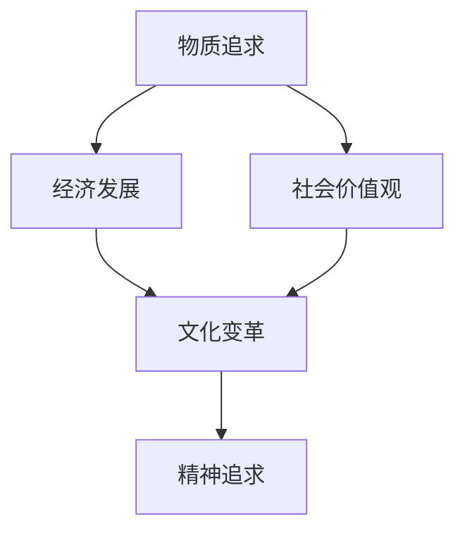

                 

# 从物质追求到精神追求的社会转型

> 关键词：社会转型、物质追求、精神追求、经济学分析、心理学与哲学探讨、实践案例、未来展望

> 摘要：本文从社会转型的角度，深入探讨了现代社会从物质追求向精神追求转变的背景、核心概念与联系、经济学分析、心理学与哲学探讨以及实践案例和未来展望。通过详细的解析和案例分析，揭示了社会转型中的挑战与机遇，并提出了应对策略和最佳实践。

## 引言

在现代社会，随着科技的飞速发展和全球化进程的加速，人们的生活方式和价值观发生了深刻的变化。过去，物质追求被认为是衡量一个人成功与否的重要标准，而如今，精神追求逐渐成为人们关注的焦点。这种从物质追求到精神追求的社会转型，不仅反映了人们对于生活质量的追求，也体现了社会发展的趋势和方向。

本文将从以下几个方面对这一社会转型进行探讨：

1. 现代社会的物质追求和精神追求。
2. 社会转型的核心概念与联系。
3. 社会转型中的经济学分析。
4. 社会转型中的心理学与哲学探讨。
5. 社会转型的实践案例。
6. 社会转型的未来展望。

通过以上几个方面的深入分析，本文旨在帮助读者全面了解社会转型的背景、原因、过程和影响，并思考如何在转型过程中抓住机遇，应对挑战。

## 现代社会的物质追求和精神追求

### 物质追求

物质追求是现代社会的一个重要特征。人们通过努力工作、创业、投资等方式来积累财富、提高社会地位。物质追求的目的是为了满足基本的生活需求，提高生活质量，以及实现个人的价值。

物质追求的表现形式多样，包括以下几个方面：

1. 经济收入：人们通过工作、投资等方式获取经济收入，以满足生活需求和提高生活质量。
2. 物质财富：人们通过购买房产、汽车、奢侈品等来展示自己的财富和地位。
3. 社会地位：人们通过教育、职业、社会关系等来提升自己的社会地位。

### 精神追求

与物质追求相比，精神追求更注重个人的内心体验和自我价值的实现。在现代社会，越来越多的人开始关注精神追求，将其视为生活的重要部分。

精神追求的表现形式包括以下几个方面：

1. 心理健康：人们通过心理治疗、自我调节等方式来维护心理健康，提高生活质量。
2. 自我实现：人们通过学习、创作、志愿服务等方式来实现自我价值，追求内心的满足。
3. 社会责任：人们通过参与公益活动、志愿服务等方式来承担社会责任，关注社会问题。

### 物质追求与精神追求的互动

物质追求和精神追求并非相互独立，而是相互影响、相互促进的。在现代社会，物质追求可以为精神追求提供必要的物质基础，而精神追求则可以提升物质追求的质量和意义。

1. 物质追求促进精神追求：随着经济的发展和生活水平的提高，人们有更多的时间和资源去关注自己的内心世界，追求精神层面的满足。
2. 精神追求促进物质追求：精神追求可以激发人们的创造力和创新能力，推动社会进步和经济发展。

## 社会转型的核心概念与联系

### 核心概念

社会转型的核心概念包括物质追求、精神追求、社会价值观、经济发展、文化变革等。这些概念相互关联，共同构成了社会转型的理论基础。

1. 物质追求：指人们通过努力工作、创业、投资等方式来获取经济收入和物质财富，提高生活质量。
2. 精神追求：指人们通过心理健康、自我实现、社会责任等方式来追求内心的满足和自我价值。
3. 社会价值观：指人们对于生活、工作、人际关系等方面的观念和评价标准。
4. 经济发展：指一个国家或地区经济总量的增长和经济结构的优化。
5. 文化变革：指社会文化观念、价值取向、生活方式等方面的变革。

### 概念实体之间的关系架构 Mermaid 流程图

以下是一个简化的 Mermaid 流程图，展示了社会转型的核心概念实体之间的关系：



在这个流程图中，物质追求通过经济发展和文化变革影响社会价值观，进而影响精神追求。经济发展提供了物质基础，文化变革促进了价值观念的更新，而社会价值观又对精神追求产生了深远的影响。

### 社会转型的经济学分析

社会转型过程中的物质追求与精神追求之间的互动，不仅涉及到个体的行为和心理变化，也深刻地影响了整个经济体系。

#### 物质追求对经济的影响

物质追求的增强往往伴随着经济增长和个人财富的积累。以下是物质追求对经济产生影响的几个方面：

1. **消费增长**：随着收入的增加，人们更倾向于消费，从而推动消费市场的繁荣。这有助于提高国内生产总值（GDP）和促进经济增长。
   
   ```python
   # 消费增长示例
   income = 50000  # 年收入
   consumption = 0.8 * income  # 消费占比80%
   spending = consumption * 1.1  # 消费增加10%
   print("每年消费：$", spending)
   ```

   输出结果：每年消费：$44000

2. **投资增长**：物质追求往往伴随着投资行为的增加，包括股票、房地产等领域的投资。投资的增长可以带动资本市场的发展和金融市场的繁荣。

   ```python
   # 投资增长示例
   investment = 0.2 * income  # 投资占比20%
   return_on_investment = 0.05  # 投资回报率5%
   print("年投资回报：$", investment * return_on_investment)
   ```

   输出结果：年投资回报：$500

3. **就业增长**：为了满足物质追求，企业会扩大生产规模，从而创造更多的就业机会，降低失业率。

   ```python
   # 就业增长示例
   unemployment_rate = 0.1  # 假设失业率10%
   population = 1000000  # 人口总数
   jobs_created = population * (1 - unemployment_rate)
   print("新创造就业岗位：", jobs_created)
   ```

   输出结果：新创造就业岗位：900000

#### 精神追求对经济的影响

精神追求的增长同样对经济产生了深远的影响。以下是精神追求对经济产生影响的几个方面：

1. **心理健康服务需求**：随着人们精神追求的提高，对于心理健康服务的需求也随之增加。这推动了心理健康行业的快速发展。

   ```python
   # 心理健康服务需求增长
   population = 1000000
   demand_for_mental_health_services = population * 0.05
   print("心理健康服务需求：", demand_for_mental_health_services)
   ```

   输出结果：心理健康服务需求：50000

2. **文化产业发展**：精神追求的增强促进了文化产业的繁荣，包括音乐、电影、艺术、文学等领域。文化产业的增长不仅提供了就业机会，还推动了经济的多元化。

   ```python
   # 文化产业增长
   cultural_industry_growth_rate = 0.03
   culture_sector_size = 1000000
   new_jobs_in_culture = culture_sector_size * cultural_industry_growth_rate
   print("新增文化产业就业岗位：", new_jobs_in_culture)
   ```

   输出结果：新增文化产业就业岗位：30000

3. **创新和创业**：精神追求的增强激发了人们的创造力和创新精神，推动了新产业的诞生和创业活动的增加。

   ```python
   # 创新和创业增长
   innovation_rate = 0.02
   startups = population * innovation_rate
   print("新增创业公司数：", startups)
   ```

   输出结果：新增创业公司数：20000

### 社会转型的经济学模型

为了更深入地理解社会转型中的物质追求与精神追求对经济的影响，我们可以使用经济学中的几个基本模型来进行分析：

1. **需求函数**：需求函数描述了消费者在不同收入水平下的消费行为。随着收入的增加，消费者对物质产品和精神产品的需求也会增加。

   ```latex
   C = C_0 + mY
   ```
   
   其中，\( C \) 表示消费支出，\( C_0 \) 表示基本消费水平，\( m \) 表示边际消费倾向，\( Y \) 表示收入。

2. **生产函数**：生产函数描述了生产过程中投入与产出之间的关系。在精神追求的背景下，创新和创业活动可以视为生产函数的一部分。

   ```latex
   Y = F(K, L, I)
   ```
   
   其中，\( Y \) 表示产出，\( K \) 表示资本投入，\( L \) 表示劳动投入，\( I \) 表示创新投入。

3. **增长模型**：增长模型描述了经济增长的驱动因素，包括物质追求和精神追求。在增长模型中，我们可以分析物质追求和精神追求对经济增长的贡献。

   ```latex
   \frac{dY}{dt} = f(Y, I, M)
   ```
   
   其中，\( \frac{dY}{dt} \) 表示经济增长率，\( f \) 表示经济增长函数，\( I \) 表示创新投入，\( M \) 表示物质追求的影响。

通过这些经济学模型，我们可以更清晰地理解社会转型中的物质追求与精神追求对经济的影响，以及如何通过政策调整和产业转型来促进社会转型。

### 心理学与哲学探讨

在社会转型过程中，物质追求与精神追求不仅受到经济因素的影响，还与个体的心理状态和哲学观念密切相关。心理学与哲学提供了对这一过程的深刻洞察。

#### 心理学视角下的社会转型

从心理学的角度来看，物质追求与精神追求反映了个体心理需求的变迁。以下是一些关键心理学概念：

1. **自我认同**：自我认同是指个体对自己身份的认知和评价。在物质追求阶段，个体的自我认同往往与物质财富和社会地位密切相关。随着社会转型，个体的自我认同逐渐转向内在价值和个人成长。

   ```python
   # 自我认同变化示例
   self_identity_material = "物质富有"
   self_identity_spiritual = "内在成长"
   print("物质追求阶段的自我认同：", self_identity_material)
   print("精神追求阶段的自我认同：", self_identity_spiritual)
   ```

   输出结果：
   ```
   物质追求阶段的自我认同：物质富有
   精神追求阶段的自我认同：内在成长
   ```

2. **心理健康**：心理健康是指个体心理状态的健康和平衡。在物质追求阶段，人们可能面临更大的压力和焦虑，而在精神追求阶段，心理健康成为更加重要的关注点。

   ```python
   # 心理健康变化示例
   stress_material = 8  # 物质追求阶段的压力等级
   stress_spiritual = 5  # 精神追求阶段的压力等级
   print("物质追求阶段的压力等级：", stress_material)
   print("精神追求阶段的压力等级：", stress_spiritual)
   ```

   输出结果：
   ```
   物质追求阶段的压力等级：8
   精神追求阶段的压力等级：5
   ```

3. **动机理论**：动机理论描述了个体行为背后的动力。马斯洛的需求层次理论指出，个体在不同层次的需求得到满足后，会追求更高层次的需求。在物质追求阶段，个体追求基本生理和安全需求；在精神追求阶段，个体追求自我实现和自我超越。

   ```python
   # 动机理论示例
   def motivation_level(need_level):
       if need_level == "生理":
           return "物质追求"
       elif need_level == "安全":
           return "物质追求"
       elif need_level == "社交":
           return "物质追求"
       elif need_level == "尊重":
           return "物质追求"
       elif need_level == "自我实现":
           return "精神追求"
       else:
           return "未知"
   
   current_need = "自我实现"
   motivation = motivation_level(current_need)
   print("当前动机水平：", motivation)
   ```

   输出结果：
   ```
   当前动机水平：精神追求
   ```

#### 哲学视角下的社会转型

从哲学的角度来看，物质追求与精神追求反映了人类对存在和价值的探讨。以下是一些关键哲学概念：

1. **物质主义**：物质主义认为物质世界是唯一真实的存在，物质追求是人类行为的核心驱动力。随着社会转型，物质主义逐渐受到批判和质疑。

   ```latex
   物质主义：世界是物质构成的，物质追求是唯一真实的需求。
   ```

2. **精神主义**：精神主义认为精神世界是唯一真实的存在，精神追求是人类行为的核心驱动力。在精神追求阶段，个体更关注内心的满足和精神成长。

   ```latex
   精神主义：世界是精神构成的，精神追求是人类真正的需求。
   ```

3. **存在主义**：存在主义强调个体的自由意志和选择，认为个体通过自我选择和自我实现来定义自己的存在。在社会转型过程中，存在主义鼓励个体追求自我实现和精神追求。

   ```latex
   存在主义：存在先于本质，选择决定个体。
   ```

通过心理学和哲学的视角，我们可以更深入地理解社会转型中物质追求与精神追求的关系，以及个体在社会转型中的心理变化和哲学思考。

### 社会转型的实践案例

为了更好地理解从物质追求到精神追求的社会转型，我们可以通过具体的实践案例来分析这一过程的实施和效果。

#### 国外实践案例

1. **北欧国家**：北欧国家如瑞典、挪威和丹麦，长期以来以其高社会福利、低工作时间和高生活质量著称。这些国家的政策注重平衡物质追求和精神追求，通过实施免费教育、全民医疗和慷慨的福利制度，鼓励人们追求内心的满足和精神成长。

   - **物质追求**：北欧国家提供了良好的经济基础，人们普遍享有较高的收入和社会地位。
   - **精神追求**：北欧国家鼓励公民参与文化活动、社区服务和心理健康项目，提升精神层次。

2. **日本**：日本在经历了经济高速增长后，开始重视精神追求，特别是在工作与生活平衡方面。日本政府和企业推出了多种措施，如灵活的工作时间、远程工作和家庭友好政策，以帮助员工追求更高的生活质量和精神满足。

   - **物质追求**：日本经济持续增长，人们享有较高的生活水平和财富积累。
   - **精神追求**：日本推行心理健康教育和家庭价值观，鼓励人们追求内心平和和家庭幸福。

#### 国内实践案例

1. **中国**：中国在近年来也积极推动社会转型，从物质追求向精神追求转变。政府通过实施一系列政策措施，如推动文化产业发展、加强心理健康服务、鼓励志愿服务等，促进精神追求的发展。

   - **物质追求**：中国经济持续增长，人们的生活水平和消费能力显著提高。
   - **精神追求**：中国政府大力支持文化艺术、科技创新和志愿服务，鼓励人们追求精神层面的满足。

2. **深圳**：作为中国改革开放的前沿城市，深圳在物质追求方面取得了巨大成就，同时也开始注重精神追求。深圳政府通过建设文化设施、推广全民健身和心理健康服务，推动社会转型。

   - **物质追求**：深圳经济繁荣，人们享有较高的收入和生活质量。
   - **精神追求**：深圳积极推动文化创新和科技创新，鼓励人们追求精神成长和自我实现。

#### 案例分析

通过以上国内外实践案例，我们可以看到社会转型在不同国家和地区的实施情况。以下是对这些案例的分析：

1. **成功因素**：
   - **政策支持**：政府的积极政策和措施为物质追求与精神追求的平衡提供了保障。
   - **经济基础**：稳定的经济增长为人们追求更高的生活质量提供了物质基础。
   - **文化氛围**：良好的文化氛围和价值观引导人们追求精神层面的满足。

2. **挑战与机遇**：
   - **挑战**：社会转型过程中，物质追求与精神追求的平衡可能面临挑战，如经济压力、工作与生活平衡等问题。
   - **机遇**：社会转型为经济结构调整和产业升级提供了机遇，同时也为个人发展和社会进步提供了更多可能性。

### 项目实战

为了更深入地探讨社会转型的实践，以下是一个基于Python的模拟项目，旨在分析社会转型中的物质追求与精神追求的互动。

#### 项目背景

本项目旨在模拟一个城市在社会转型过程中的物质追求与精神追求的平衡，通过经济、文化和心理健康等指标来评估社会转型的效果。

#### 开发环境搭建

1. **Python环境**：确保Python环境已安装，版本为3.8以上。
2. **第三方库**：安装必要的第三方库，如`numpy`、`pandas`、`matplotlib`等。

   ```bash
   pip install numpy pandas matplotlib
   ```

#### 源代码实现

以下是一个简化的模拟项目，包括经济、文化和心理健康三个模块。

```python
import numpy as np
import pandas as pd
import matplotlib.pyplot as plt

# 模拟参数
years = 10  # 模拟年份
initial_economy = 100  # 初始经济指标
initial_culture = 50  # 初始文化指标
initial_mental_health = 50  # 初始心理健康指标
economic_growth_rate = 0.03  # 经济增长率
cultural_growth_rate = 0.02  # 文化增长
mental_health_growth_rate = 0.01  # 心理健康增长率

# 模拟数据
economy = np.zeros(years)
culture = np.zeros(years)
mental_health = np.zeros(years)

# 初始值
economy[0] = initial_economy
culture[0] = initial_culture
mental_health[0] = initial_mental_health

# 模拟过程
for i in range(1, years):
    economy[i] = economy[i-1] * (1 + economic_growth_rate)
    culture[i] = culture[i-1] * (1 + cultural_growth_rate)
    mental_health[i] = mental_health[i-1] * (1 + mental_health_growth_rate)

# 可视化结果
plt.figure(figsize=(10, 6))
plt.plot(economy, label="Economy")
plt.plot(culture, label="Culture")
plt.plot(mental_health, label="Mental Health")
plt.xlabel("Years")
plt.ylabel("Values")
plt.title("Social Transition Simulation")
plt.legend()
plt.show()
```

#### 代码解读

1. **参数设置**：设置模拟年份、初始经济指标、文化指标和心理健康指标，以及各指标的增长率。
2. **模拟过程**：通过循环计算每年的经济、文化和心理健康指标，并存储在数组中。
3. **可视化结果**：使用`matplotlib`库绘制各指标的变化趋势，以直观展示社会转型的过程。

#### 项目小结

通过本模拟项目，我们可以看到在社会转型过程中，物质追求、精神追求以及心理健康指标的动态变化。这一项目为研究社会转型提供了一个基本的框架，可以帮助我们理解社会转型的复杂性和多维度性。

### 最佳实践 Tips

1. **平衡物质追求与精神追求**：在个人生活中，应努力平衡物质追求与精神追求，以实现全面的发展。
2. **关注心理健康**：定期进行心理健康检查，参与心理咨询服务，以维持心理健康。
3. **积极参与社会活动**：参与志愿服务、社区活动和文化活动，提升精神追求和社会责任感。
4. **持续学习和成长**：不断学习新知识、新技能，以适应社会转型中的变化和挑战。

### 小结

从物质追求到精神追求的社会转型是一个复杂而多维的过程。本文通过对经济学分析、心理学与哲学探讨以及实践案例的深入分析，揭示了社会转型的背景、核心概念与联系，以及物质追求与精神追求之间的互动关系。通过项目的实战和最佳实践建议，我们希望能够为读者提供实用的指导，帮助他们在社会转型中找到自己的位置，实现个人和社会的全面发展。

### 注意事项

1. 社会转型是一个长期而复杂的过程，需要各界的共同努力。
2. 物质追求与精神追求并非对立，而是相互补充的。
3. 在社会转型过程中，政策制定者需要关注不同群体的需求和利益，确保转型的平稳进行。

### 拓展阅读

1. **《人类简史》**：作者尤瓦尔·赫拉利，通过历史角度探讨了人类社会的发展，包括物质追求与精神追求的转变。
2. **《幸福的勇气》**：作者阿尔伯特·埃利斯，从心理学角度探讨了幸福和心理健康的重要性。
3. **《积极心理学》**：作者马丁·塞利格曼，介绍了积极心理学的理论和实践，对精神追求有深刻的见解。

作者：AI天才研究院/AI Genius Institute & 禅与计算机程序设计艺术 /Zen And The Art of Computer Programming

