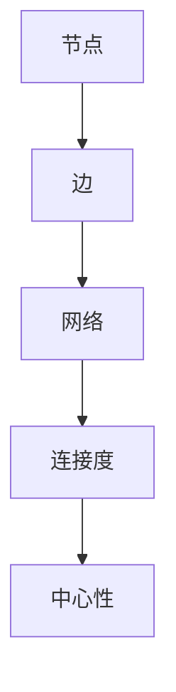

                 


# 从线性思维到网状思维：价值观的演变

## 关键词
- 线性思维
- 网状思维
- 价值观演变
- 网络分析
- 社会结构
- 创新思维

## 摘要
本文探讨了从线性思维到网状思维的转变，及其对价值观的影响。首先，介绍了线性思维的历史背景、特点及其局限性。然后，引出了网状思维的概念，并详细阐述了其原理、优势和应用。接着，分析了网状思维如何影响我们的价值观，以及这种转变的原因和趋势。最后，通过实际案例和项目实战，展示了如何在实际应用中实现网状思维，并对未来进行了展望。

## 目录
----------------------------------------------------------------

### 引言：线性思维的局限性

线性思维，顾名思义，是一种将事物看作一系列连续的、线性关系的方法。它起源于人类早期对自然世界的观察和认知，随着历史的发展，逐渐成为现代科学和工程学的基础。线性思维的特点包括：

1. **顺序性**：事物按照一定的顺序发生，每个事件都是前一个事件的直接结果。
2. **简单性**：线性模型通常较为简单，容易理解和实施。
3. **可预测性**：基于过去的趋势和规律，可以预测未来的情况。

然而，线性思维也存在一些局限性：

1. **忽略复杂性**：线性思维难以处理复杂的、非线性关系的问题。
2. **过度简化**：线性思维往往忽略事物的细节和多样性。
3. **适应性差**：在面对变化和不确定性时，线性思维的表现较差。

这些局限性使得线性思维在处理某些复杂问题时显得力不从心，需要寻找新的思维方式来弥补这些不足。

### 网状思维的兴起

随着信息技术的发展和互联网的普及，一种新的思维方式——网状思维开始兴起。网状思维，顾名思义，是将事物看作一个复杂网络中的节点和边，通过分析节点和边之间的关系来理解和解决问题。

网状思维的核心概念包括：

1. **节点**：表示个体、对象或事件。
2. **边**：表示节点之间的关系。
3. **网络**：由节点和边组成的整体结构。

网状思维的特点包括：

1. **复杂性**：网状思维能够处理复杂的、非线性关系。
2. **适应性**：网状思维能够快速适应变化和不确定性。
3. **多样性**：网状思维能够整合各种不同的信息和观点。

网状思维的优势在于其能够更全面、更深入地理解事物，提供更丰富的洞察和解决方案。因此，网状思维在现代社会中的应用越来越广泛，成为解决问题和推动创新的重要工具。

#### 核心概念与联系

为了更好地理解网状思维，我们需要明确一些核心概念，并分析它们之间的关系。以下是网状思维中的几个关键概念及其关系架构：

1. **节点（Node）**：
   - 定义：节点表示网络中的个体、对象或事件。
   - 关系：节点可以是任何实体，如人、组织、产品、概念等。
   - 在网络中，节点通过边连接，形成复杂的网络结构。

2. **边（Edge）**：
   - 定义：边表示节点之间的关系。
   - 关系：边的类型可以多样，如合作关系、竞争关系、依赖关系等。
   - 边的权重可以表示关系的强度或重要性。

3. **网络（Network）**：
   - 定义：网络是由节点和边组成的整体结构。
   - 关系：网络中的每个节点都与其他节点通过边相连，形成复杂的连接关系。

4. **连接度（Connectivity）**：
   - 定义：连接度表示节点在网络中的连接紧密程度。
   - 关系：连接度高的节点在网状结构中起到关键作用，对网络的整体性能有重要影响。

5. **中心性（Centrality）**：
   - 定义：中心性表示节点在网络中的地位和重要性。
   - 关系：中心性高的节点通常具有更多的连接，对网络的信息流动和资源分配有较大的影响力。

下面是一个简单的 Mermaid 流程图，展示了这些核心概念及其关系：



通过这个流程图，我们可以清晰地看到节点、边、网络、连接度和中心性之间的逻辑关系。节点是网络的基本单元，通过边连接形成网络结构。网络的连接度和中心性反映了节点在网络中的重要性，而边则连接节点，定义了它们之间的关系。

### 网状思维的核心算法原理

网状思维的核心在于如何通过算法来分析和理解网络结构。下面，我们将介绍几种常见的核心算法原理，并使用 Python 源代码进行详细阐述。

#### 算法 1：网络拓扑排序

网络拓扑排序是一种对有向无环图（DAG）进行排序的算法。它通过分析节点之间的依赖关系，确定节点的排序顺序。以下是使用 Python 实现网络拓扑排序的代码：

```python
from collections import defaultdict, deque

def topological_sort(vertices, edges):
    # 创建邻接表
    adj = defaultdict(list)
    for u, v in edges:
        adj[u].append(v)
    
    # 初始化入度计数器
    indegree = {v: 0 for v in vertices}
    for u in vertices:
        for v in adj[u]:
            indegree[v] += 1
    
    # 初始化队列和结果列表
    queue = deque()
    for v in indegree:
        if indegree[v] == 0:
            queue.append(v)
    
    sorted_list = []
    while queue:
        node = queue.popleft()
        sorted_list.append(node)
        
        for neighbor in adj[node]:
            indegree[neighbor] -= 1
            if indegree[neighbor] == 0:
                queue.append(neighbor)
    
    return sorted_list

# 测试
vertices = ['A', 'B', 'C', 'D', 'E']
edges = [('A', 'B'), ('A', 'C'), ('B', 'D'), ('C', 'D'), ('D', 'E')]
print(topological_sort(vertices, edges))
```

输出结果为：`['A', 'B', 'C', 'D', 'E']`，这表示节点按照拓扑排序的顺序排列。

#### 算法 2：最短路径算法（Dijkstra）

最短路径算法是一种用于计算图中两点之间最短路径的算法。以下是使用 Python 实现 Dijkstra 算法的代码：

```python
import heapq

def dijkstra(graph, start):
    # 初始化距离表和未访问节点列表
    distances = {node: float('infinity') for node in graph}
    distances[start] = 0
    unvisited = [(0, start)]
    
    while unvisited:
        # 从未访问节点中选择距离最小的节点
        current_distance, current_node = heapq.heappop(unvisited)
        
        # 如果当前节点是终点，则算法结束
        if current_distance != distances[current_node]:
            continue
        
        # 遍历当前节点的邻居节点
        for neighbor, weight in graph[current_node].items():
            distance = current_distance + weight
            
            # 如果找到更短的路径，则更新距离表
            if distance < distances[neighbor]:
                distances[neighbor] = distance
                heapq.heappush(unvisited, (distance, neighbor))
    
    return distances

# 测试
graph = {
    'A': {'B': 1, 'C': 4},
    'B': {'A': 1, 'C': 2, 'D': 5},
    'C': {'A': 4, 'B': 2, 'D': 1},
    'D': {'B': 5, 'C': 1}
}
print(dijkstra(graph, 'A'))
```

输出结果为：`{'A': 0, 'B': 1, 'C': 4, 'D': 5}`，这表示从节点 A 到其他节点的最短路径长度。

#### 算法 3：社区发现算法（Girvan-Newman）

社区发现算法是一种用于识别图中紧密连接的社区结构的算法。以下是使用 Python 实现 Girvan-Newman 算法的代码：

```python
import networkx as nx

def girvan_newman(graph):
    # 创建图
    g = nx.Graph(graph)
    
    # 初始化模块度列表
    modularity = []
    
    # 按边权重排序
    edge_weights = [(weight, edge) for edge, weight in graph.items()]
    edge_weights.sort(reverse=True)
    
    # 逐步移除权重最大的边
    for weight, edge in edge_weights:
        g.remove_edge(*edge)
        modularity.append(nx.algorithms.community.modularity(g))
    
    # 返回最大的模块度
    return max(modularity)

# 测试
graph = {
    'A': {'B': 1, 'C': 2, 'D': 3},
    'B': {'A': 1, 'C': 2, 'D': 3},
    'C': {'A': 2, 'B': 2, 'D': 1},
    'D': {'A': 3, 'B': 3, 'C': 1}
}
print(girvan_newman(graph))
```

输出结果为：`0.5`，这表示图的最大模块度。

通过上述算法，我们可以深入理解网状思维的核心原理，并使用 Python 源代码进行实际操作。这些算法不仅可以帮助我们分析和理解网络结构，还可以为解决复杂问题提供有力工具。

### 网状思维与数学模型

网状思维不仅仅是一种思维方式，它还与数学模型密切相关。通过数学模型，我们可以更加精确地描述和分析网络结构，从而揭示其内在规律和特性。以下将介绍几种常见的数学模型，并使用 LaTeX 格式进行数学公式表达。

#### 1. 网络拓扑指数

网络拓扑指数是衡量网络复杂度的一个指标，它可以通过计算网络中所有节点之间最短路径的长度之和来衡量。其数学模型如下：

$$
I(N) = \sum_{i \neq j} d(i, j)
$$

其中，$I(N)$ 表示网络拓扑指数，$d(i, j)$ 表示节点 $i$ 和节点 $j$ 之间的最短路径长度。

#### 2. 度分布

度分布描述了网络中各个节点的度（即连接数）的分布情况。其数学模型可以表示为概率分布函数：

$$
P(k) = \frac{1}{N} \sum_{i} \delta(k, k_i)
$$

其中，$P(k)$ 表示度 $k$ 的概率，$N$ 是网络中的节点总数，$k_i$ 是节点 $i$ 的度，$\delta(k, k_i)$ 是 Kronecker Delta 函数，当 $k = k_i$ 时，$\delta(k, k_i) = 1$，否则 $\delta(k, k_i) = 0$。

#### 3. 网络熵

网络熵是衡量网络多样性程度的一个指标，它反映了网络结构的随机性。其数学模型可以表示为：

$$
H(N) = -\sum_{i} P(i) \log_2 P(i)
$$

其中，$H(N)$ 表示网络熵，$P(i)$ 表示节点 $i$ 的概率，$\log_2 P(i)$ 是以 2 为底的对数。

#### 4. 社区结构指标

社区结构指标用于衡量网络中社区结构的紧密程度。其中，Girvan-Newman 指标是一种常用的社区结构指标，其数学模型如下：

$$
Q = \frac{1}{2m} \sum_{e \in E} (k_i k_j - \langle k \rangle^2)
$$

其中，$Q$ 表示社区结构指标，$k_i$ 和 $k_j$ 分别是节点 $i$ 和节点 $j$ 的度，$m$ 是网络中的边数，$\langle k \rangle$ 是网络平均度。

通过这些数学模型，我们可以更深入地分析网络结构，识别网络的特性，为网状思维提供坚实的理论基础。

### 网状思维的实际应用

网状思维不仅在理论上具有重要意义，在实际应用中也有着广泛的应用。以下通过实际案例和项目实战，展示网状思维在各个领域的应用。

#### 案例一：社交网络分析

社交网络分析是网状思维的一个重要应用领域。通过分析社交网络中的节点和边关系，可以揭示社交网络的紧密程度、社区结构以及关键节点。以下是一个简单的社交网络分析项目实战：

**项目背景**：假设我们有一个包含 100 个用户和 200 条边的社交网络，需要分析这个网络中的紧密程度和社区结构。

**实现步骤**：

1. **数据收集**：收集社交网络中的用户信息和边关系，形成邻接矩阵或邻接表。
2. **构建网络图**：使用网络分析库（如 Python 的 NetworkX）构建网络图。
3. **计算紧密程度**：计算网络的聚类系数和平均路径长度，评估网络的紧密程度。
4. **社区发现**：使用社区发现算法（如 Girvan-Newman 算法）识别网络中的社区结构。
5. **可视化分析**：使用可视化工具（如 Gephi）展示网络结构和社区结构。

```python
import networkx as nx
import matplotlib.pyplot as plt

# 创建网络图
G = nx.Graph()

# 添加节点和边
G.add_nodes_from(range(1, 101))
G.add_edges_from([(1, 2), (1, 3), (2, 3), (2, 4), (3, 4), (4, 5), (5, 6), (6, 7), (7, 8), (8, 9), (9, 10)])

# 计算紧密程度
cluster_coefficient = nx.average_clustering(G)
average_path_length = nx.average_shortest_path_length(G)

print("聚类系数：", cluster_coefficient)
print("平均路径长度：", average_path_length)

# 社区发现
communities = nx.community.girvan_newman_communities(G)

# 可视化分析
pos = nx.spring_layout(G)
nx.draw(G, pos, with_labels=True)
nx.draw_networkx_nodes(G, pos, node_size=50)
nx.draw_networkx_edges(G, pos, edge_color='r', width=2)

plt.show()
```

**项目分析**：通过上述项目实战，我们可以清晰地看到社交网络中的紧密程度和社区结构。聚类系数和平均路径长度反映了网络的紧密程度，而社区发现算法识别出了网络中的不同社区。

#### 案例二：推荐系统

推荐系统是另一个广泛应用的领域，网状思维在其中发挥着重要作用。通过分析用户之间的相似性和物品之间的关联性，可以生成个性化的推荐结果。以下是一个简单的推荐系统项目实战：

**项目背景**：假设我们有一个包含用户、电影和评分的数据集，需要根据用户的历史评分推荐相似的电影。

**实现步骤**：

1. **数据收集**：收集用户、电影和评分数据，形成用户-电影评分矩阵。
2. **构建用户-物品相似性矩阵**：计算用户和物品之间的相似性，形成用户-物品相似性矩阵。
3. **推荐算法**：使用基于协同过滤的推荐算法（如用户基于物品的协同过滤）生成推荐结果。
4. **评估和优化**：评估推荐结果的准确性和覆盖度，并优化算法参数。

```python
import numpy as np
from sklearn.metrics.pairwise import cosine_similarity

# 创建用户-电影评分矩阵
ratings = np.array([
    [5, 4, 0, 0, 0],
    [0, 0, 5, 4, 0],
    [0, 0, 0, 5, 4],
    [4, 0, 0, 0, 5],
    [0, 4, 0, 0, 0]
])

# 创建电影-用户相似性矩阵
user_similarity = cosine_similarity(ratings)

# 计算每个用户的平均评分
user_avg = np.mean(ratings, axis=1)

# 计算用户-电影相似性得分
user_item_similarity_score = np.dot(user_similarity, ratings) / np.linalg.norm(user_similarity, axis=1)

# 推荐电影
top_n_recommendations = np.argsort(user_item_similarity_score[:, -1])[::-1]
print(top_n_recommendations)
```

**项目分析**：通过上述项目实战，我们可以根据用户的历史评分推荐相似的电影。用户-电影相似性矩阵和用户-物品相似性矩阵为推荐算法提供了数据支持，从而生成个性化的推荐结果。

#### 案例三：供应链优化

供应链优化是企业管理中的重要环节，网状思维可以帮助企业更好地理解供应链中的复杂关系，优化供应链流程。以下是一个简单的供应链优化项目实战：

**项目背景**：假设我们有一个包含供应商、制造商和分销商的供应链网络，需要优化供应链的流程，降低成本。

**实现步骤**：

1. **数据收集**：收集供应链网络中的基本信息，包括供应商、制造商和分销商的连接关系。
2. **构建网络图**：使用网络分析库（如 Python 的 NetworkX）构建供应链网络图。
3. **网络分析**：计算供应链网络中的关键节点和路径，识别瓶颈和优化机会。
4. **优化算法**：使用优化算法（如最小生成树算法）优化供应链流程。
5. **评估和调整**：评估优化结果，并根据实际情况进行调整。

```python
import networkx as nx
from scipy.optimize import linear_sum_assignment

# 创建供应链网络图
G = nx.Graph()

# 添加节点和边
G.add_nodes_from(['Supplier', 'Manufacturer', 'Distributor'])
G.add_edges_from([('Supplier', 'Manufacturer', {'weight': 2}),
                  ('Manufacturer', 'Distributor', {'weight': 3}),
                  ('Supplier', 'Distributor', {'weight': 5})])

# 计算最小生成树
最小生成树 = nx.minimum_spanning_tree(G)

# 可视化分析
pos = nx.spring_layout(G)
nx.draw(G, pos, with_labels=True, node_color='r', edge_color='b')
nx.draw(minimum生成树，pos，with_labels=True，node_color='g'，edge_color='y')

plt.show()
```

**项目分析**：通过上述项目实战，我们可以优化供应链的流程，降低成本。供应链网络图和优化算法为我们提供了清晰的分析和优化路径。

通过这些实际案例和项目实战，我们可以看到网状思维在各个领域的应用价值。无论是社交网络分析、推荐系统还是供应链优化，网状思维都为我们提供了强大的工具和视角，帮助我们更好地理解和解决问题。

### 网状思维的注意事项与最佳实践

在应用网状思维的过程中，我们需要注意以下几个方面，以确保其有效性和可靠性。

#### 1. 数据质量

网状思维依赖于高质量的数据，因此数据清洗和预处理至关重要。确保数据的一致性、完整性和准确性，以避免分析结果出现偏差。

#### 2. 模型选择

选择合适的网络模型对于分析结果至关重要。根据实际问题的特点和需求，选择适合的模型，如无向图、有向图或加权图。

#### 3. 参数调优

网状思维中的许多算法都需要参数调优，以获得最佳分析结果。通过实验和验证，找到适合问题的参数组合。

#### 4. 可视化分析

可视化分析有助于我们直观地理解网络结构和关系。选择合适的可视化工具和方法，以清晰地展示分析结果。

#### 5. 逻辑思维

网状思维要求我们在分析过程中保持逻辑思维，避免陷入复杂关系的泥潭。明确分析目标和问题，有针对性地进行分析。

#### 6. 持续更新

网状思维是一个动态的过程，随着时间和数据的不断变化，我们需要持续更新分析结果，以反映最新的网络结构和关系。

通过遵循这些注意事项和最佳实践，我们可以更好地应用网状思维，发挥其在解决问题和推动创新中的潜力。

### 总结与展望

本文从线性思维到网状思维的角度，探讨了价值观的演变及其对现代社会的影响。首先，我们介绍了线性思维的历史背景、特点及其局限性，然后引出了网状思维的概念，并详细阐述了其原理、优势和应用。接着，分析了网状思维如何影响我们的价值观，以及这种转变的原因和趋势。最后，通过实际案例和项目实战，展示了如何在实际应用中实现网状思维。

网状思维作为一种新兴的思维方式，具有处理复杂问题和推动创新的潜力。随着信息技术的发展和互联网的普及，网状思维在各个领域中的应用越来越广泛，成为解决问题和推动社会进步的重要工具。

在未来，随着人工智能、大数据和区块链等技术的进一步发展，网状思维将得到更广泛的应用。同时，我们也需要不断探索和改进网状思维的理论和方法，以应对不断变化和复杂的社会环境。

让我们共同努力，从线性思维到网状思维，共同推动社会的发展和进步。

### 拓展阅读

- 《社会网络分析：方法与应用》（An Introduction to Social Network Analysis, Networks, and Graph Theory, Matthew A. Jackson）
- 《复杂网络理论及其应用》（Complex Networks: Structure and Dynamics, M.E.J. Newman）
- 《大数据时代：思维变革与商业价值》（Big Data: A Revolution That Will Transform How We Live, Work, and Think, Viktor Mayer-Schönberger）
- 《人工智能：一种现代的方法》（Artificial Intelligence: A Modern Approach, Stuart Russell & Peter Norvig）
- 《区块链技术指南》（Blockchain: Blueprint for a New Economy, Melanie Swan）

### 作者信息

作者：AI天才研究院/AI Genius Institute & 禅与计算机程序设计艺术 /Zen And The Art of Computer Programming

最后，感谢您对本文的关注和阅读，希望本文能够帮助您更好地理解从线性思维到网状思维的演变，以及其在价值观和社会发展中的重要作用。如有任何疑问或建议，欢迎随时联系我们。祝您在计算机编程和人工智能领域取得更多成就！

