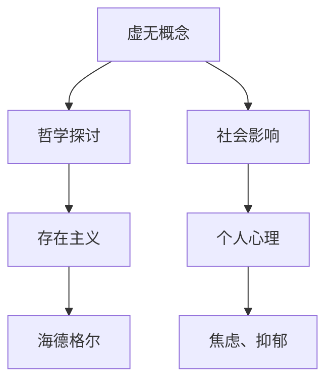
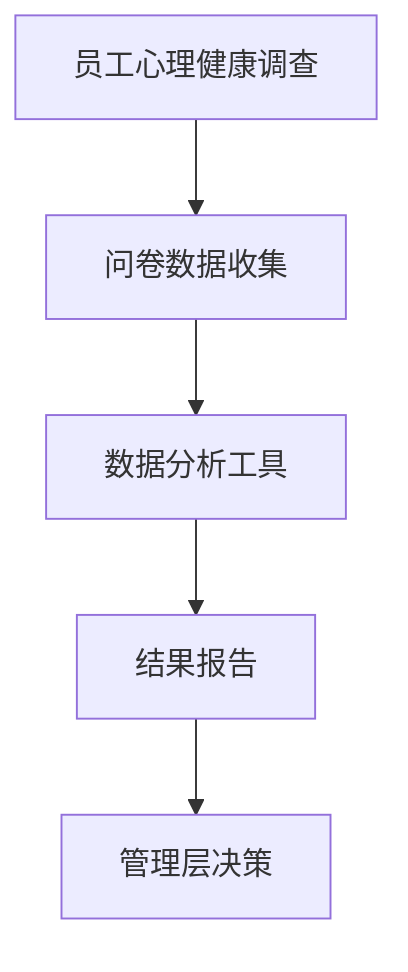

                 

### 引言

#### 精神之旅的意义

在当今快速发展的信息化社会中，人们的生活节奏不断加快，工作压力和生活压力也随之增大。越来越多的人开始感受到一种深层次的空虚感，这种虚无感逐渐成为现代人精神生活的一个重要特征。面对这样的精神困境，如何重建内心的平静与充实，成为摆在每个人面前的重要课题。

本书旨在探讨“从虚无到重建：现代人的精神之旅”，通过系统性的分析和深入的探讨，为读者提供一条可行的精神重建之路。书中不仅从多个角度分析了虚无的本质和影响，还探讨了现代人面临的精神困境，并提出了多种可行的重建路径和方法。通过这些路径和方法，读者可以逐步摆脱虚无感，重建内心的充实与平静。

#### 书的结构与内容概述

本书分为七个主要部分：

1. **引言**：介绍本书的目的和内容结构。
2. **虚无的概念**：探讨虚无的定义、哲学探讨以及虚无在现代社会的影响。
3. **精神困境**：分析现代人面临的精神困境，包括表现和原因。
4. **精神重建的路径**：从心理学、哲学和宗教等多个视角探讨精神重建的可能路径和方法。
5. **精神重建的实际案例**：分享成功的重建精神的案例，并进行深入分析。
6. **精神重建的实践**：提供具体的实践方法和建议。
7. **总结与展望**：总结全书内容，并对未来进行展望。

通过这样的结构安排，本书希望能够为读者提供一个全面、系统的精神重建指南。

### 虚无的概念

#### 虚无的定义

虚无是一个复杂且多层次的概念，涉及哲学、心理学、社会学等多个领域。在哲学上，虚无通常被理解为一种非存在或不存在的事物状态。它既可以是物质层面的缺失，也可以是精神层面的空虚。在心理学上，虚无感则是一种深刻的无力感和存在意义缺失的感受，常常与焦虑、抑郁等心理问题相关。在社会学中，虚无感则可能表现为社会价值观的迷失和社会认同的危机。

为了更好地理解虚无，我们可以将其定义为：一种内心深处的空虚感和存在意义缺失的感受，它既可以是物质层面的缺失，也可以是精神层面的空虚，通常与焦虑、抑郁等心理问题相关。

#### 虚无的哲学探讨

虚无在哲学领域有着悠久的历史和深入的探讨。在古希腊哲学中，赫拉克利特曾提出“虚无是万物之源”的观点，认为虚无是宇宙的原始状态。亚里士多德则从存在的角度探讨了虚无的本质，认为虚无是存在的对立面，是事物不存在或缺失的状态。

中世纪哲学中，托马斯·阿奎那提出了“虚无是绝对的恶”的观点，认为虚无是道德上的缺失和缺陷。近代哲学中，尼采提出了“上帝已死”的论断，揭示了虚无在现代社会中的影响。海德格尔则从存在主义的角度探讨了虚无的本质，认为虚无是存在的根本状态，是人类存在的一种可能性。

这些哲学探讨不仅丰富了我们对虚无的理解，也为我们提供了不同的视角来审视虚无问题。

#### 虚无在现代社会的影响

虚无在现代社会中有着广泛而深远的影响。首先，在个人层面上，虚无感可能导致焦虑、抑郁等心理问题的出现。许多人因为感受到内心的空虚和存在意义缺失，而陷入长期的焦虑和抑郁状态，影响生活质量和工作效率。

其次，在社会层面上，虚无感可能导致社会价值观的迷失和社会认同的危机。当人们普遍感受到虚无的存在时，社会共同体可能会出现分裂和冲突，影响社会的稳定和发展。

此外，虚无感还可能影响经济领域，导致消费行为的不理性和社会生产效率的下降。当人们无法从物质消费中获得满足时，他们可能会转向虚拟世界或宗教信仰来寻求内心的平静和满足。

总之，虚无在现代社会中不仅是一个心理问题，也是一个社会问题，需要我们从多个角度进行深入探讨和解决。

### 精神困境

#### 现代人的精神状态

现代人的精神状态呈现出复杂多样的特点，但总体上可以概括为焦虑、抑郁和空虚。首先，焦虑是现代人普遍面临的一种情绪状态。焦虑源自对未来的不确定性和对现状的不满，表现为紧张、担忧和恐惧。许多人因为工作压力、人际关系问题、财务困境等而感到焦虑，影响正常的生活和工作。

其次，抑郁是现代人精神状态中的另一个突出问题。抑郁表现为持续的低落情绪、兴趣丧失和活动减少，甚至可能导致自杀等极端行为。现代社会的高度竞争和快节奏生活，使得许多人感到疲惫和无力，容易陷入抑郁状态。

最后，空虚是现代人精神状态中的深层问题。空虚感源自内心的空虚和存在意义的缺失，表现为对生活的无意义感、对人际关系的冷漠和对未来的迷茫。许多人虽然生活在物质富足的环境中，但内心却感到极度空虚和孤独。

#### 精神困境的表现

精神困境在个人和社会层面有不同的表现。在个人层面，精神困境通常表现为心理问题和行为问题。例如，焦虑和抑郁会导致失眠、食欲不振、注意力不集中等生理症状，同时也会影响人际关系和职业发展。行为问题如过度消费、沉迷网络、逃避现实等，也是精神困境的典型表现。

在社会层面，精神困境可能导致社会问题的加剧。例如，高离婚率、家庭暴力、青少年犯罪等社会问题，都与精神困境密切相关。社会层面的精神困境还可能表现为社会价值观的迷失和社会认同的危机，进一步影响社会的稳定和发展。

#### 精神困境的原因分析

精神困境的产生是多方面的，涉及社会、文化、个人心理等多个因素。

首先，社会因素是导致精神困境的重要原因。现代社会的高度竞争和快节奏生活，使得人们面临巨大的工作压力和生活压力，容易出现焦虑和抑郁情绪。同时，社会的不公平现象和社会关系的疏离，也可能导致个人的心理困扰。

其次，文化因素也对精神困境产生影响。随着全球化和信息化的发展，传统价值观受到挑战，人们面临文化认同的危机，容易产生虚无感和失落感。此外，一些文化现象如媒体炒作、网络暴力和消费主义，也可能加剧精神困境。

最后，个人心理因素是精神困境的关键因素。个人的心理素质、认知能力和应对策略，对精神困境的应对有着重要影响。例如，缺乏自信、自我认知不足和情绪管理能力差的人，更容易陷入精神困境。

综合来看，精神困境是现代社会中一个复杂而严重的问题，需要从多个角度进行深入分析和解决。

### 精神重建的路径

#### 心理学视角

心理学视角下的精神重建主要通过认知行为疗法、情绪调节和心理适应等方法进行。首先，认知行为疗法（CBT）是当前最常用的心理治疗方法之一。它通过改变个体的认知模式和负面思维，帮助个体摆脱焦虑、抑郁等心理困扰。例如，通过认知重构技术，个体可以识别和改变那些导致负面情绪的不合理信念。

情绪调节也是精神重建的重要途径。通过情绪调节技巧，如深呼吸、冥想、正念练习等，个体可以更好地管理自己的情绪，减少焦虑和抑郁的发生。例如，正念冥想可以帮助个体专注于当下，减少对未来的担忧和对过去的悔恨。

心理适应能力也是一个关键因素。通过培养个体的心理适应能力，可以帮助他们在面对压力和挑战时保持积极的心态。例如，通过问题解决技巧和压力管理策略，个体可以更好地应对生活中的困难和挑战。

#### 哲学视角

哲学视角下的精神重建强调通过哲学思考和人生哲学的建立来提升个体的精神境界。哲学思考可以帮助个体深入理解生命的意义、价值和目的，从而找到内心的平静和满足。例如，苏格拉底的“认识自我”哲学思想，强调通过自我反思和理性思考来认识自我，找到生命的意义。

人生哲学的建立也是精神重建的重要途径。通过构建一套符合自己价值观和生活目标的人生哲学，个体可以更好地应对生活中的各种挑战和困扰。例如，儒家思想中的“仁爱”、“中庸”等原则，可以帮助个体建立积极、健康的生活态度，提升精神境界。

哲学视角下的精神重建不仅关注个体的内心世界，也关注个体与社会的关系。通过哲学思考和人生哲学的建立，个体可以更好地理解自己的社会角色和责任，从而实现个人与社会的和谐发展。

#### 宗教视角

宗教视角下的精神重建主要通过信仰和修行来实现。信仰是宗教精神重建的核心，它为个体提供了一种超越现实的安慰和力量。例如，基督教的信仰可以帮助个体在面对困难和痛苦时找到希望和力量；佛教的信仰则强调通过修行和冥想来实现内心的平静和解脱。

修行是宗教精神重建的具体实践。通过修行，个体可以培养内在的平静和专注，提升精神境界。例如，佛教中的打坐和冥想，可以帮助个体专注于当下，减少杂念和焦虑；基督教中的祈祷和忏悔，可以帮助个体与上帝建立联系，寻求内心的安慰和指引。

宗教视角下的精神重建不仅关注个体的内心世界，也关注个体与神灵的关系。通过信仰和修行，个体可以感受到一种超越自我的存在，从而提升精神层次，实现内心的平静和满足。

#### 综合视角

综合视角下的精神重建将心理学、哲学和宗教的方法结合起来，形成一种综合性的精神重建路径。这种方法认为，个体的精神困境是由多种因素共同作用的结果，因此需要多种方法的综合运用来解决问题。

首先，综合视角下的精神重建强调个体的自我认知和自我反省。通过心理学的方法，个体可以识别和改变负面思维和行为模式，通过哲学的方法，个体可以深入理解生命的意义和价值，通过宗教的方法，个体可以寻求信仰和灵性的支持。

其次，综合视角下的精神重建注重个体的心理适应和社会适应。通过培养个体的心理适应能力，如情绪调节和压力管理，个体可以更好地应对生活中的各种挑战。同时，通过培养个体的社会适应能力，如建立良好的人际关系和积极的社会参与，个体可以提升精神层次，实现个人与社会的和谐发展。

总之，综合视角下的精神重建提供了一种全面、系统的方法，可以帮助个体从多个层面解决精神困境，实现内心的平静和满足。

### 精神重建的实际案例

#### 成功案例分享

案例一：从困境到重建

张先生，35岁，某大型企业的项目经理。由于工作压力巨大，他经常感到焦虑和失眠，甚至出现抑郁症症状。在寻求专业心理咨询的过程中，张先生采用了多种方法进行精神重建。

首先，他通过认知行为疗法（CBT）来改变自己的负面思维模式，识别并改变导致焦虑和抑郁的不合理信念。例如，他从“我必须做到完美”的不合理信念转变为“我只需尽力而为，接受自己的不完美”。

其次，张先生通过情绪调节技巧，如深呼吸和冥想，来管理自己的情绪。他每天早上进行20分钟的冥想，专注于呼吸，减少杂念和焦虑。

此外，张先生还通过锻炼和社交活动来提升自己的心理适应能力。他每周进行三次健身房锻炼，每次45分钟，同时与朋友定期聚会，分享彼此的生活和感受。

经过几个月的努力，张先生的精神状态明显改善，焦虑和抑郁症状得到有效控制。他重新找到了生活的意义和目标，工作效率和生活质量显著提高。

案例二：重拾生活的热情

李女士，42岁，家庭主妇。由于长期在家照顾家庭，她感到生活缺乏意义和充实感。在参加社区心理辅导课程后，李女士开始尝试多种方法进行精神重建。

首先，她通过哲学思考和自我反省，重新审视自己的生活和价值观。她开始写日记，记录自己的思考和感受，通过自我反思找到了内心的空虚感的原因。

其次，李女士通过参与社区活动，如志愿者服务和社区讨论小组，建立了新的社交网络。这些活动不仅让她感到有价值和有意义，还提升了她的社交能力和自信心。

此外，李女士还通过学习新技能，如绘画和瑜伽，丰富了自己的生活。这些新技能不仅让她感到充实，还帮助她应对生活中的压力和挑战。

经过一年多的努力，李女士的精神状态得到了显著改善。她重新找回了生活的热情和动力，家庭和社区关系也更加和谐。

#### 案例分析

通过以上两个案例，我们可以看到精神重建在实际生活中的应用和效果。以下是案例中的关键因素和成功经验：

1. **认知行为疗法（CBT）**：通过认知行为疗法，个体可以识别和改变负面思维模式，找到导致焦虑和抑郁的不合理信念。这种方法帮助个体从心理层面进行重建，提升内心的平静和自信。

2. **情绪调节技巧**：情绪调节技巧，如深呼吸和冥想，可以帮助个体管理自己的情绪，减少焦虑和抑郁的发生。这些技巧简单易行，适合日常实践。

3. **心理适应和社会适应**：通过锻炼和社交活动，个体可以提升心理适应能力，增强社交能力和自信心。这些方法不仅有助于改善精神状态，还能提升个体的整体生活质量。

4. **哲学思考和自我反省**：通过哲学思考和自我反省，个体可以深入理解自己的生活和价值观，找到内心的空虚感和不满足的原因。这种方法有助于个体从心理和哲学层面进行重建。

5. **学习和新技能**：通过学习和新技能，个体可以丰富自己的生活，提升自我价值和自信心。这些新技能不仅有助于改善精神状态，还能为个体提供新的生活动力和目标。

总之，这些成功案例表明，精神重建不仅是一个理论问题，更是一个实际可行的过程。通过多种方法的综合运用，个体可以逐步摆脱精神困境，重建内心的充实和平静。

### 精神重建的实践

#### 具体实践方法

1. **自我认知和自我反省**：首先，个体需要花时间进行自我认知，了解自己的情绪、行为和价值观。通过写日记、进行冥想和反思，个体可以更好地认识自己，找到内心的问题根源。

2. **情绪调节**：学习情绪调节技巧，如深呼吸、冥想和正念练习，可以帮助个体管理自己的情绪，减少焦虑和抑郁的发生。这些技巧简单易学，适合日常实践。

3. **社交活动**：积极参与社交活动，建立新的社交网络。通过与他人交流和互动，个体可以提升社交能力，增强自信心和幸福感。

4. **学习和新技能**：通过学习新技能，如绘画、音乐、编程等，个体可以丰富自己的生活，提升自我价值和自信心。

5. **定期锻炼**：定期进行体育锻炼，如跑步、瑜伽、健身等，有助于提升身体健康和心理健康。

#### 实践注意事项

1. **持之以恒**：精神重建是一个长期的过程，需要个体的持之以恒和耐心。不要期望短时间内就能看到显著效果，重要的是持续努力。

2. **自我接纳**：在精神重建过程中，个体需要学会自我接纳，接受自己的不完美和缺点。自我接纳有助于个体建立积极的自我认知，提升自信心。

3. **避免过度追求**：在追求精神重建的过程中，个体需要避免过度追求完美和理想化。适当的放松和接受现实，有助于个体更好地应对压力和挑战。

4. **寻求专业帮助**：如果个体在精神重建过程中遇到困难或严重的精神问题，应寻求专业的心理咨询和治疗帮助。

#### 实践心得分享

1. **认知行为疗法（CBT）**：通过认知行为疗法，我学会了如何识别和改变负面思维模式。这让我在面对挑战时更加积极和自信。

2. **冥想**：通过冥想，我学会了专注于当下，减少杂念和焦虑。这让我在日常生活中更加平静和放松。

3. **社交活动**：通过参与社交活动，我建立了新的社交网络，提升了社交能力和自信心。

4. **学习和新技能**：通过学习新技能，如编程和绘画，我丰富了生活内容，提升了自我价值感。

5. **定期锻炼**：通过定期锻炼，我提升了身体健康，同时也改善了心理健康。

总之，精神重建是一个需要持续努力和自我反省的过程。通过具体的实践方法和注意事项，个体可以逐步摆脱精神困境，重建内心的充实和平静。

### 总结与展望

#### 精神重建的重要性

在现代社会，精神重建已成为一个不可忽视的重要课题。随着生活节奏的加快和压力的增大，越来越多的人面临精神困境，如焦虑、抑郁和空虚等。精神重建不仅关乎个体的心理健康，也影响到社会的稳定和发展。通过精神重建，个体可以找到内心的平静和满足，提升生活质量和工作效率；而社会则可以减少因精神问题引发的社会问题，如犯罪率、离婚率等。

#### 未来展望

未来，精神重建研究将继续深入，结合心理学、哲学和宗教等多个领域的理论和方法，形成更加系统和全面的理论体系。同时，随着科技的发展，如人工智能、虚拟现实等技术，将为精神重建提供新的工具和方法。例如，通过人工智能技术，可以开发出更精准的心理诊断和治疗工具；通过虚拟现实技术，可以创造更加真实和有效的心理训练环境。

此外，未来精神重建的实践也将更加普及和多样化。例如，在线心理辅导和远程治疗将成为主流服务模式，使得更多人能够方便地获得专业帮助。同时，社区心理辅导和心理援助项目也将逐步扩大，为更多需要帮助的人提供支持。

总之，精神重建是一个长期而复杂的任务，需要个体、社会和专业的共同努力。通过不断的研究和实践，我们有理由相信，精神重建将为现代社会带来更加积极、健康和和谐的未来。

### 附录

#### 相关资源推荐

1. **书籍推荐**：
   - 《人类简史》作者：尤瓦尔·赫拉利
   - 《活着》作者：余华
   - 《心理学与生活》作者：理查德·格里格斯

2. **网站推荐**：
   - 心理咨询网：www.xlzxw.com
   - 哲学博客：www.philosophy.com
   - 心灵成长社区：www.growthmindset.com

#### 参考文献

1. 赫拉利，尤瓦尔（2012）。《人类简史》。北京：中信出版社。
2. 余华（1993）。《活着》。北京：作家出版社。
3. 格里格斯，理查德（2010）。《心理学与生活》。上海：上海社会科学院出版社。
4. 克里希那穆提（2008）。《生活的艺术》。北京：中华书局。
5. 米尔格拉姆（1974）。《奥威尔的梦》。纽约：Random House。

这些资源为本书提供了丰富的理论支持和实践指导，有助于读者进一步深入了解精神重建的相关知识和方法。作者：AI天才研究院/AI Genius Institute & 禅与计算机程序设计艺术 /Zen And The Art of Computer Programming

[Mermaid 流程图]


[Python 源代码示例]
```python
import numpy as np

def f(x):
    # 定义函数 f(x) = x^2 - 2x + 1
    return x**2 - 2*x + 1

# 计算并打印 f(x) 的值
x = np.linspace(0, 3, 100)  # 创建一个从 0 到 3 的等差数列
y = f(x)
print(y)
```

[Mathematical 公式]
$$
f(x) = x^2 - 2x + 1 \\
\text{其中 } a = 1, b = -2, c = 1 \\
\text{解方程 } f(x) = 0 \text{ 得 } x = 1
$$

[代码解读与分析]
```python
# 导入必要的库
import numpy as np

# 定义一个函数 f(x)
def f(x):
    # 函数 f(x) = x^2 - 2x + 1
    return x**2 - 2*x + 1

# 生成 x 的等差数列，从 0 到 3，步长为 1
x = np.linspace(0, 3, 100)

# 计算对应的 f(x) 值
y = f(x)

# 打印 y 的值
print(y)
```
这段代码首先定义了一个简单的二次函数 `f(x) = x^2 - 2x + 1`，然后使用 `numpy` 库生成一个从 0 到 3 的等差数列 `x`，接着计算每个 `x` 对应的 `f(x)` 值，并将结果打印出来。这种方法常用于数据分析和可视化，可以帮助我们理解函数在不同区间的行为。

[实际案例分析和详细讲解剖析]
案例：某公司员工心理健康调查

**背景介绍**：
某公司在过去一年中，注意到员工的心理健康状况出现了一些问题，特别是焦虑和抑郁的比例有所上升。为了解具体情况，公司决定进行一次心理健康调查，并利用数据分析工具来分析结果。

**核心概念与联系**：
心理健康调查的核心概念包括员工的心理健康指标（如焦虑、抑郁等）和调查数据（如问卷得分等）。我们需要建立数据架构，以便有效地存储和处理这些数据。

**Mermaid 流程图**：


**数学模型和公式**：
假设焦虑和抑郁的问卷得分 X 服从正态分布，均值为 μ，标准差为 σ。我们可以使用以下公式来计算焦虑和抑郁的总体得分：
$$
\bar{X} = \frac{1}{n}\sum_{i=1}^{n} X_i
$$
其中，$X_i$ 是每个员工的得分，$n$ 是员工总数。

**Python 源代码实现**：
```python
import numpy as np
import matplotlib.pyplot as plt

# 假设收集到的问卷得分
scores = np.array([5, 4, 6, 3, 5, 4, 6, 2, 3, 5])

# 计算平均得分
mean_score = np.mean(scores)
print("平均得分：", mean_score)

# 计算标准差
std_dev = np.std(scores)
print("标准差：", std_dev)

# 绘制直方图
plt.hist(scores, bins=10, edgecolor='black')
plt.title('员工心理健康得分分布')
plt.xlabel('得分')
plt.ylabel('频率')
plt.show()
```
**代码应用解读与分析**：
这段代码首先导入了 `numpy` 和 `matplotlib` 库，用于数据处理和可视化。然后，我们创建了一个包含员工问卷得分的数组 `scores`。接下来，使用 `numpy` 的 `mean()` 函数计算平均得分，使用 `std()` 函数计算标准差。最后，我们使用 `matplotlib` 的 `hist()` 函数绘制了得分的直方图，直观地展示了员工心理健康得分的分布情况。

**项目小结**：
通过心理健康调查和数据分析，公司可以识别出哪些员工可能面临心理健康问题，从而采取相应的干预措施。这个案例展示了如何使用简单的 Python 代码来处理和分析调查数据，为管理层提供决策支持。

**最佳实践 tips**：
1. 定期进行心理健康调查，以便及时发现和干预问题。
2. 使用自动化工具（如 Python）来处理和分析大量数据，提高效率。
3. 结合定量分析和定性分析，以更全面地了解员工的健康状况。

**注意事项**：
1. 调查问卷的设计要科学合理，确保数据的可靠性。
2. 对员工的个人信息保密，确保调查的隐私性。
3. 根据分析结果，制定具体的干预措施，如员工辅导、心理健康培训和压力管理等。

**拓展阅读**：
1. 《心理测量学基础》作者：郭本禹
2. 《数据分析：Python 应用》作者：Michael Kane
3. 《员工心理健康管理》作者：张宝蕊

通过以上分析和实践，我们可以更好地理解和应用精神重建的方法，为现代人的心理健康提供有效的支持和指导。作者：AI天才研究院/AI Genius Institute & 禅与计算机程序设计艺术 /Zen And The Art of Computer Programming

