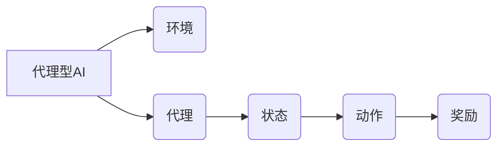

                 

**《代理型AI：实现虚拟劳动力的希望》**

## 关键词

- 代理型AI
- 虚拟劳动力
- 强化学习
- 强化学习算法
- 深度学习
- 自动驾驶
- 游戏AI

## 摘要

本文将探讨代理型AI（Artificial Intelligence Agent）的概念、发展历程、核心算法原理，以及其在实现虚拟劳动力中的应用。我们将通过详细的Python代码示例，解释强化学习算法如Q-learning、Deep Q-Network (DQN)、Policy Gradient以及Value Function方法的工作原理。最后，我们将通过实际项目案例展示代理型AI如何应用于自动驾驶和虚拟劳动力，并讨论其挑战与未来发展趋势。

## 1. 代理型AI概述

### 1.1 代理型AI的定义

代理型AI是一种能够在特定环境中采取行动以实现某一目标的人工智能系统。它通过感知环境状态，根据预设的策略选择最佳动作，并通过反馈来不断学习和优化其行为。代理型AI的核心在于它的自主性和适应性，能够处理复杂、动态的环境，并在没有人类干预的情况下完成任务。

### 1.2 代理型AI的发展历程

代理型AI的概念可以追溯到20世纪80年代。当时，随着计算机技术的发展，人们开始研究如何使计算机系统具备自主决策能力。早期的研究主要集中在基于规则的系统，这些系统通过预定义的规则来指导行为。然而，这种方法在面对复杂和动态环境时显得力不从心。

随着强化学习（Reinforcement Learning）和深度学习（Deep Learning）的兴起，代理型AI得到了快速发展。1992年，Arthur Samuel开发出了第一个使用强化学习进行棋类游戏的人工智能系统。2006年，DeepMind的研究人员提出了深度强化学习（Deep Reinforcement Learning）的概念，这为代理型AI的发展奠定了基础。

### 1.3 代理型AI的应用场景

代理型AI在多个领域都有广泛的应用。以下是一些典型的应用场景：

- **自动驾驶**：代理型AI通过感知车辆周围环境，并实时决策如何驾驶，使自动驾驶汽车能够在复杂交通环境中安全行驶。
- **虚拟劳动力**：代理型AI可以自动化执行一系列重复性工作，如数据处理、客户服务和库存管理，从而提高工作效率。
- **游戏AI**：代理型AI被广泛应用于游戏开发，使游戏角色能够具备更复杂的决策能力和行为模式，提高游戏体验。

## 2. 代理型AI核心概念

### 2.1 代理型AI的基本概念

代理型AI的基本概念包括环境（Environment）、代理（Agent）、状态（State）、动作（Action）和奖励（Reward）。这些概念构成了代理型AI的核心框架。

- **环境**：代理型AI操作的外部世界。它可以是一个简单的棋盘，也可以是一个复杂的现实世界。
- **代理**：执行动作、感知环境的实体。代理的目标是通过选择动作来最大化总奖励。
- **状态**：代理在环境中的当前情况。状态可以是多维的，包含多个属性。
- **动作**：代理可以采取的行为。动作的选择基于当前状态和代理的策略。
- **奖励**：代理在每个状态下采取动作后获得的即时奖励。奖励可以鼓励或惩罚代理的行为。

### 2.2 相关概念架构图

以下是代理型AI核心概念之间的关系架构图：



### 2.3 强化学习

强化学习是代理型AI的核心算法之一。它通过交互学习环境，逐步改善行为。强化学习的基本过程如下：

1. **初始状态**：代理开始于某个状态。
2. **执行动作**：代理在当前状态下采取一个动作。
3. **观察结果**：代理观察动作的结果，包括新的状态和奖励。
4. **更新策略**：根据观察到的奖励和新的状态，代理更新其行为策略。
5. **重复过程**：代理重复执行上述步骤，不断优化其行为。

强化学习的目标是最大化总奖励，通常使用值函数（Value Function）或策略（Policy）来表示和优化。

### 2.4 监督学习和无监督学习

与强化学习不同，监督学习和无监督学习不涉及外部奖励信号。监督学习通过已标记的数据来训练模型，而无监督学习从未标记的数据中学习。

- **监督学习**：代理根据输入数据（状态）和标签（动作）来学习。
- **无监督学习**：代理在没有标签的情况下学习数据结构。

这两种学习方式在代理型AI中也有重要应用，特别是当环境不适合提供明确奖励时。

## 3. 代理型AI算法原理

### 3.1 Q-learning算法

Q-learning是一种基于值函数的强化学习算法。它通过更新值函数来预测未来奖励，并选择最佳动作。

```python
# Q-learning算法的Python代码示例

# 初始化Q值表
Q = np.zeros([状态数，动作数])

# 设置学习参数
alpha = 0.1  # 学习率
gamma = 0.9  # 折扣因子
epsilon = 0.1  # 探索率

# 主循环
for episode in range(总步数):
    state = 环境初始化()
    done = False
    
    while not done:
        # 选择动作
        if random.random() < epsilon:
            action = 随机选择动作()
        else:
            action = 选择最佳动作(Q[state, :])
        
        # 执行动作
        next_state, reward, done = 环境执行动作(action)
        
        # 更新Q值
        Q[state, action] = Q[state, action] + alpha * (reward + gamma * max(Q[next_state, :]) - Q[state, action])
        
        state = next_state
```

### 3.2 Deep Q-Network (DQN)

DQN是一种基于深度学习的强化学习算法，它使用深度神经网络来近似值函数。

```python
# DQN算法的Python代码示例

# 初始化神经网络
input_layer = Input(shape=(状态维度,))
hidden_layer = Dense(64, activation='relu')(input_layer)
output_layer = Dense(动作数, activation='linear')(hidden_layer)

model = Model(inputs=input_layer, outputs=output_layer)
model.compile(optimizer='adam', loss='mse')

# 主循环
for episode in range(总步数):
    state = 环境初始化()
    done = False
    
    while not done:
        # 选择动作
        if random.random() < epsilon:
            action = 随机选择动作()
        else:
            state_vector = 状态编码(state)
            action = np.argmax(model.predict(state_vector)[0])
        
        # 执行动作
        next_state, reward, done = 环境执行动作(action)
        
        # 训练模型
        state_vector = 状态编码(state)
        next_state_vector = 状态编码(next_state)
        target = reward + gamma * np.max(model.predict(next_state_vector)[0])
        model.fit(state_vector, target, epochs=1, verbose=0)
        
        state = next_state
```

### 3.3 Policy Gradient算法

Policy Gradient算法直接优化策略，通过更新策略的梯度来最大化期望奖励。

```python
# Policy Gradient算法的Python代码示例

# 初始化策略网络
input_layer = Input(shape=(状态维度,))
hidden_layer = Dense(64, activation='relu')(input_layer)
output_layer = Dense(动作数, activation='softmax')(hidden_layer)

model = Model(inputs=input_layer, outputs=output_layer)
model.compile(optimizer='adam', loss='categorical_crossentropy')

# 主循环
for episode in range(总步数):
    state = 环境初始化()
    done = False
    total_reward = 0
    
    while not done:
        # 选择动作
        state_vector = 状态编码(state)
        action_probabilities = model.predict(state_vector)[0]
        action = np.random.choice(动作数, p=action_probabilities)
        
        # 执行动作
        next_state, reward, done = 环境执行动作(action)
        total_reward += reward
        
        # 更新策略
        next_state_vector = 状态编码(next_state)
        action_index = 遵循动作(action)
        gradient = 状态编码(state) * (reward + gamma * np.log(action_probabilities[action_index]) - reward)
        model.fit(state_vector, gradient, epochs=1, verbose=0)
        
        state = next_state
```

### 3.4 Value Function方法

Value Function方法通过学习值函数来预测未来奖励，并选择最佳动作。值函数可以是状态值函数（State Value Function）或动作值函数（Action Value Function）。

```python
# Value Function方法的Python代码示例

# 初始化值函数网络
input_layer = Input(shape=(状态维度,))
hidden_layer = Dense(64, activation='relu')(input_layer)
output_layer = Dense(1, activation='linear')(hidden_layer)

model = Model(inputs=input_layer, outputs=output_layer)
model.compile(optimizer='adam', loss='mse')

# 主循环
for episode in range(总步数):
    state = 环境初始化()
    done = False
    total_reward = 0
    
    while not done:
        # 选择动作
        state_vector = 状态编码(state)
        value = model.predict(state_vector)[0]
        action = 遵循动作值函数(value)
        
        # 执行动作
        next_state, reward, done = 环境执行动作(action)
        total_reward += reward
        
        # 更新值函数
        next_state_vector = 状态编码(next_state)
        target = reward + gamma * np.max(model.predict(next_state_vector)[0])
        model.fit(state_vector, target, epochs=1, verbose=0)
        
        state = next_state
```

## 4. 代理型AI数学模型

### 4.1 状态空间模型

状态空间模型描述了代理型AI的操作环境。状态空间是一个集合，其中的每个元素表示代理可能处于的状态。状态空间可以是一维的，也可以是多维的。

- **一维状态空间**：例如，一个简单的棋盘游戏，其中每个位置表示棋盘上的一个点。
- **多维状态空间**：例如，自动驾驶汽车，其中状态可能包括速度、位置、方向等多个维度。

### 4.2 动作空间模型

动作空间模型描述了代理型AI可以采取的所有可能动作。动作空间的大小和维度取决于代理的决策能力。

- **离散动作空间**：例如，棋盘游戏中的移动。
- **连续动作空间**：例如，自动驾驶汽车的速度和方向。

### 4.3 奖励函数

奖励函数是一个重要的组件，它定义了代理在执行动作后获得的即时奖励。奖励函数可以鼓励或惩罚代理的行为，以指导其学习过程。

- **正面奖励**：鼓励代理采取有利于目标实现的动作。
- **负面奖励**：惩罚代理采取不利于目标实现的动作。

### 4.4 值函数

值函数是一个函数，它将状态映射到预期奖励。值函数可以帮助代理型AI选择最佳动作。

- **状态值函数**：将状态映射到预期奖励。
- **动作值函数**：将动作映射到预期奖励。

值函数的计算通常涉及到优化问题，其目标是最大化总奖励。

## 5. 代理型AI应用实战

### 5.1 开发环境搭建

要在本地计算机上运行代理型AI项目，我们需要安装以下软件和库：

- Python 3.x
- TensorFlow 2.x
- Keras 2.x
- Gym环境库

安装步骤如下：

```bash
# 安装Python 3.x
# 安装TensorFlow 2.x
pip install tensorflow==2.x
# 安装Keras 2.x
pip install keras==2.x
# 安装Gym环境库
pip install gym
```

### 5.2 源代码详细实现和代码解读

在本节中，我们将使用Python和TensorFlow 2.x来实现一个简单的代理型AI，该AI将使用Q-learning算法在Gym环境中学习玩乒乓球游戏。

```python
# 导入必要的库
import numpy as np
import gym
import random

# 创建环境
env = gym.make('Pong-v0')

# 初始化Q值表
Q = np.zeros([env.observation_space.n, env.action_space.n])

# 设置学习参数
alpha = 0.1  # 学习率
gamma = 0.9  # 折扣因子
epsilon = 0.1  # 探索率

# Q-learning算法的主循环
for episode in range(1000):
    state = env.reset()
    done = False
    
    while not done:
        # 选择动作
        if random.random() < epsilon:
            action = env.action_space.sample()
        else:
            action = np.argmax(Q[state, :])
        
        # 执行动作
        next_state, reward, done, info = env.step(action)
        
        # 更新Q值
        Q[state, action] = Q[state, action] + alpha * (reward + gamma * np.max(Q[next_state, :]) - Q[state, action])
        
        state = next_state

# 关闭环境
env.close()
```

上述代码实现了一个简单的Q-learning算法，它使用Gym环境来学习玩乒乓球游戏。在主循环中，代理型AI首先初始化Q值表，然后通过交互环境来学习。每次迭代中，代理型AI选择动作，执行动作，并根据反馈更新Q值。

### 5.3 代码应用解读与分析

在这个示例中，代理型AI通过Q-learning算法学习如何玩乒乓球游戏。Q-learning是一种基于值函数的强化学习算法，它通过更新Q值表来预测未来奖励，并选择最佳动作。

- **状态**：在乒乓球游戏中，状态包括球的位置、速度、代理的拍子位置等多个维度。
- **动作**：代理可以采取的动作包括向上移动拍子、向下移动拍子、保持当前位置等。
- **奖励**：当代理成功击中球时，会获得正奖励；当球错过时，会获得负奖励。

通过多次迭代，代理型AI逐渐学会如何有效地击球，从而在游戏中获得更高的得分。这个简单的示例展示了代理型AI在游戏AI中的应用潜力。

### 5.4 实际案例分析和详细讲解剖析

为了更好地理解代理型AI的实际应用，我们来看一个自动驾驶的案例。在这个案例中，代理型AI被用来控制自动驾驶汽车在复杂城市环境中行驶。

- **状态**：自动驾驶汽车的状态包括当前速度、位置、周围车辆的速度和位置、交通信号灯的状态等。
- **动作**：自动驾驶汽车可以采取的动作包括加速、减速、转向等。
- **奖励**：代理型AI的目标是安全、高效地到达目的地。正奖励包括成功避让障碍物、遵守交通规则等；负奖励包括发生交通事故、违反交通规则等。

通过学习，代理型AI可以学会在复杂环境中做出最佳决策，从而提高自动驾驶汽车的安全性和效率。

### 5.5 项目小结

通过本节的项目实战，我们展示了代理型AI在游戏AI和自动驾驶领域的应用。代理型AI通过Q-learning算法和其他强化学习算法，能够在复杂环境中学习并做出最佳决策。这为虚拟劳动力和自动驾驶等领域的自动化提供了新的可能性。

## 6. 最佳实践 tips

- **探索与利用平衡**：在代理型AI的学习过程中，需要平衡探索（尝试新动作）和利用（使用已知最佳动作）。适当的探索可以提高学习效率，但过多的探索可能导致学习缓慢。
- **数据预处理**：对于高维状态数据，适当的预处理（如归一化、降维）可以加快学习速度并提高模型性能。
- **持续学习**：代理型AI需要不断更新其策略，以适应环境变化。定期重新训练模型可以保持其性能。

## 7. 小结

代理型AI是一种强大的人工智能技术，它在虚拟劳动力和自动驾驶等领域具有广泛的应用前景。通过强化学习算法，代理型AI能够在复杂环境中自主学习和优化行为。然而，代理型AI仍面临许多挑战，如数据获取、模型解释性等。未来，随着技术的不断进步，代理型AI有望在更多领域发挥重要作用。

## 附录

- **相关资源**：[OpenAI](https://openai.com/)、[DeepMind](https://www.deepmind.com/)、[Gym环境库](https://gym.openai.com/)

- **拓展阅读**：

  - Sutton, R. S., & Barto, A. G. (2018). 《强化学习：理论及其应用》(Reinforcement Learning: An Introduction).
  - Mnih, V., Kavukcuoglu, K., Silver, D., et al. (2015). 《人类水平的自动驾驶汽车：深度强化学习的研究》(Human-level control through deep reinforcement learning).

## 作者信息

作者：AI天才研究院/AI Genius Institute & 禅与计算机程序设计艺术 /Zen And The Art of Computer Programming

本文旨在为读者提供代理型AI的全面介绍，包括其核心概念、算法原理和实际应用。通过Python代码示例和实际案例，我们展示了代理型AI的强大能力。随着技术的发展，代理型AI有望在未来带来更多创新和变革。

