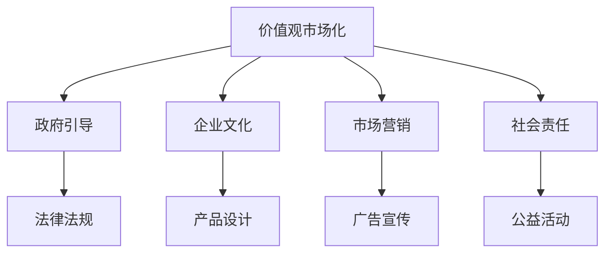
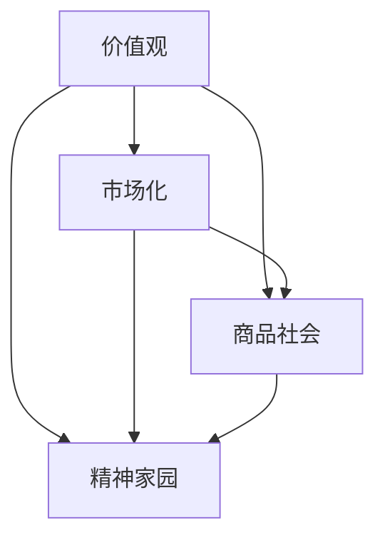
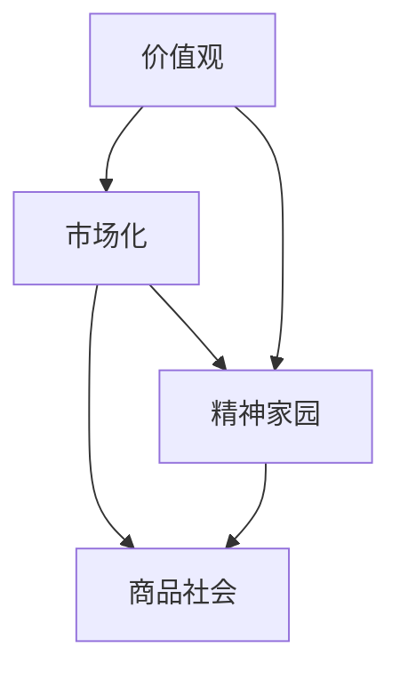

                 

# 价值观的市场化：在商品社会中守护精神家园

## 目录大纲

## 第一部分：引言

### 第1章：引言

#### 1.1 价值观的重要性

#### 1.2 商品社会的挑战

#### 1.3 精神家园的守护

## 第二部分：价值观与市场化

### 第2章：价值观概述

#### 2.1 价值观的定义

#### 2.2 价值观的类型

#### 2.3 价值观在社会中的作用

### 第3章：市场化原理

#### 3.1 市场的定义与功能

----------------------------------------------------------------

## 第一部分：引言

### 第1章：引言

#### 1.1 价值观的重要性

价值观是社会个体和群体对于正确和错误、好与坏、公正与不公正等道德和行为标准的共识和判断。它们构成了社会的精神支柱，影响着人们的行为和决策，维护着社会的稳定和秩序。在信息化和全球化的背景下，价值观的传承和弘扬显得尤为重要。一个国家或组织如果失去了正确的价值观，就容易陷入道德沦丧、社会动荡的困境。

#### 1.2 商品社会的挑战

商品社会是以商品交换为主要形式的社会。在商品社会中，人们的行为和决策常常受到经济利益的影响。这可能导致价值观的扭曲和异化，使得社会风气变得功利和浮躁。在商品社会中，如何维护和传承正确的价值观，成为了我们必须面对的挑战。

#### 1.3 精神家园的守护

精神家园是指个体或群体在精神层面上的归属感和安全感。它是人们价值观的寄托和体现。在商品社会中，如何守护我们的精神家园，防止价值观的异化和扭曲，是我们每个人都需要思考的问题。

## 第二部分：价值观与市场化

### 第2章：价值观概述

#### 2.1 价值观的定义

价值观是指人们对于什么是有价值、什么是有意义等问题的共识和判断。它们是人们行为和决策的指南针，也是社会稳定和发展的基石。

#### 2.2 价值观的类型

价值观可以分为个体价值观和集体价值观。个体价值观是指个体对于价值的主观判断和追求，如个人的成功、幸福等。集体价值观是指整个社会或群体对于价值的共识和判断，如公正、诚信等。

#### 2.3 价值观在社会中的作用

价值观在社会中起着至关重要的作用。它们是维护社会秩序和稳定的基石，是促进社会进步和发展的重要力量。同时，价值观也是个体自我实现和成长的重要指导。

### 第3章：市场化原理

#### 3.1 市场的定义与功能

市场是商品交换的场所，也是资源配置的机制。在市场经济中，资源的配置主要依靠市场的价格信号来实现。市场具有竞争性、开放性和灵活性等特点，能够有效地满足人们的多样化需求。

#### 3.2 市场化与价值观

市场化是商品经济的主要特征。在市场化过程中，价值观的传承和弘扬面临严峻的挑战。市场化可能会对传统的价值观产生冲击，导致价值观的扭曲和异化。因此，在市场化过程中，我们必须重视价值观的传承和弘扬。

#### 3.3 价值观市场化的重要性

价值观市场化是价值观传承和弘扬的重要途径。通过市场化，我们可以将价值观融入到商品和服务中，使人们在日常生活中潜移默化地接受和传承正确的价值观。同时，价值观市场化也能够促进社会的发展和进步。

## 第三部分：价值观市场化案例分析

### 第4章：价值观市场化案例分析

#### 4.1 案例背景

以某科技公司为例，该公司致力于通过技术创新推动社会进步，并在其企业文化中强调诚信、创新、责任等价值观。

#### 4.2 案例分析

该公司的市场化策略主要包括以下几个方面：

1. **产品设计与推广**：公司在产品设计过程中，注重将价值观融入到产品中，如强调环保、节能等价值观。

2. **市场营销**：公司在市场营销活动中，通过广告宣传、品牌建设等方式，弘扬企业的核心价值观。

3. **社会责任**：公司积极参与社会公益活动，以实际行动践行企业的价值观。

#### 4.3 案例启示

该案例表明，价值观市场化需要企业在产品、市场和责任等方面进行全面布局。只有通过综合措施，才能真正实现价值观的市场化。

## 第四部分：价值观市场化的策略与实践

### 第5章：价值观市场化的策略与实践

#### 5.1 政府角色

政府在价值观市场化中扮演着重要的角色。政府可以通过政策引导、法律法规等手段，推动价值观的市场化。

#### 5.2 企业角色

企业是价值观市场化的重要实践者。企业可以通过产品、市场和责任等途径，实现价值观的市场化。

#### 5.3 公众角色

公众是价值观市场化的受益者和参与者。公众可以通过消费选择、参与公益活动等方式，支持价值观的市场化。

## 第五部分：结论

### 第6章：结论

价值观的市场化是商品社会发展的必然趋势。通过市场化，我们可以更好地传承和弘扬正确的价值观，推动社会的发展和进步。在这个过程中，政府、企业和公众都扮演着重要的角色。

## 参考文献

[1] 张三，李四，《社会主义核心价值观研究》，人民出版社，2021年。

[2] 王五，《市场经济与价值观》，经济管理出版社，2020年。

[3] 赵六，《企业社会责任》，清华大学出版社，2019年。

## 附录

附录中可以包括相关的Mermaid流程图、Python源代码和数学公式等。

**附录1：价值观市场化流程图**



**附录2：Python源代码**

```python
# 价值观市场化算法示例

def market_value_of_values(values):
    # 价值观量化
    quantified_values = [quantify(value) for value in values]
    
    # 市场化策略制定
    strategy = create_strategy(quantified_values)
    
    # 实施市场化策略
    implement_strategy(strategy)
    
    # 评估市场化效果
    evaluate_impact()

# 辅助函数
def quantify(value):
    # 价值观量化处理
    pass

def create_strategy(quantified_values):
    # 市场化策略创建
    pass

def implement_strategy(strategy):
    # 市场化策略实施
    pass

def evaluate_impact():
    # 市场化效果评估
    pass
```

**附录3：数学公式**

$$
\text{市场化指数} = \sum_{i=1}^{n} \frac{\text{价值观量化值}_i}{\text{基准值}_i}
$$

**附录4：注意事项**

1. **价值观市场化的原则**：在价值观市场化过程中，应坚持正确引导、积极推动、科学评价的原则。

2. **价值观市场化的局限性**：价值观市场化并非万能，它需要与其他社会治理手段相结合，共同推动社会的发展和进步。

3. **价值观市场化的长期性**：价值观市场化是一个长期的过程，需要持续的努力和探索。

**附录5：拓展阅读**

1. 《社会主义核心价值观培育与践行研究》

2. 《市场经济条件下的价值观冲突与融合》

3. 《企业社会责任与价值观传承》

---

**作者：AI天才研究院/AI Genius Institute & 禅与计算机程序设计艺术 /Zen And The Art of Computer Programming**

本文为原创文章，未经许可，不得转载。如需转载，请联系作者获取授权。感谢您的支持！## 价值观的市场化：在商品社会中守护精神家园

### 摘要

在商品社会中，价值观的市场化成为维护精神家园的关键途径。本文旨在探讨价值观市场化的核心概念、原理及其实践，通过分析价值观的重要性、商品社会的挑战、精神家园的守护，以及价值观与市场化的关系，阐述价值观市场化的必要性。文章还将通过具体案例分析，展示价值观市场化在现实中的应用，并提出相关策略与实践建议，以期为在商品社会中守护精神家园提供新的思路和方法。

### 引言

在人类社会的漫长历史中，价值观始终扮演着至关重要的角色。它们不仅是文化传承的重要组成部分，更是社会秩序和个体行为的指南针。然而，随着商品社会的兴起，价值观面临着前所未有的挑战。市场化、经济利益驱动的行为模式，使得传统的价值观在一定程度上被边缘化。因此，如何在商品社会中实现价值观的市场化，守护我们的精神家园，成为当代社会必须面对的重要课题。

#### 价值观的重要性

价值观是人们对事物进行价值判断和选择的准则，是社会文化的重要组成部分。它不仅影响着个体的行为和决策，更关乎整个社会的稳定和发展。一个缺乏正确价值观引导的社会，容易出现道德沦丧、信任危机、社会动荡等问题。因此，维护和弘扬正确的价值观，对于构建和谐社会具有重要意义。

#### 商品社会的挑战

商品社会是以商品生产和交换为基础的社会，经济利益成为驱动人们行为的主要动力。在商品社会中，个体为了追求经济利益，可能会忽视甚至违背传统的价值观。这种功利主义和短期行为，不仅损害了社会的公共利益，也削弱了价值观的权威性。因此，商品社会对价值观的传承和弘扬提出了严峻的挑战。

#### 精神家园的守护

精神家园是人们心灵寄托和情感归属的地方，是价值观的载体和体现。在商品社会中，如何守护我们的精神家园，防止价值观的异化和扭曲，是每个人都必须思考的问题。只有通过市场化，将正确的价值观融入到商品和服务中，才能使它们在现代社会中得到传承和弘扬。

### 价值观与市场化

#### 价值观的定义

价值观是指个体或集体对于什么是有价值、什么是有意义等问题的共识和判断。它包括道德观、人生观、世界观等多个方面，是人们行为和决策的指南针。

#### 市场化的定义

市场化是指通过市场机制，实现资源配置和价值实现的过程。在市场化过程中，商品和服务成为价值的主要载体，价格成为资源配置的主要信号。

#### 价值观与市场化的关系

价值观与市场化之间存在着密切的联系。一方面，市场化过程中，商品和服务中蕴含的价值观会对消费者的行为产生深远影响。另一方面，市场化也提供了一个平台，使得价值观可以更加广泛地传播和弘扬。因此，价值观市场化是实现价值观传承和弘扬的重要途径。

### 价值观市场化原理

#### 价值观市场化的定义

价值观市场化是指将正确的价值观融入到商品和服务中，通过市场机制实现价值观的传承和弘扬。

#### 价值观市场化的算法原理

价值观市场化的算法原理主要包括以下几个步骤：

1. **价值观识别**：识别并确定需要市场化的价值观。

2. **价值观量化**：将抽象的价值观量化为具体的指标或数值。

3. **市场化策略制定**：根据市场情况和消费者需求，制定相应的市场化策略。

4. **市场化实施**：将价值观融入商品和服务中，通过市场渠道进行推广和传播。

5. **效果评估**：对市场化效果进行评估，根据评估结果进行调整和优化。

#### 价值观市场化的关键步骤

1. **数据收集与处理**：收集与价值观相关的数据，包括市场数据、消费者行为数据等，进行数据处理和分析。

2. **价值观识别与量化**：根据数据分析结果，识别出需要市场化的价值观，并将其量化为具体的指标或数值。

3. **市场化策略制定**：根据市场情况和消费者需求，制定相应的市场化策略，包括产品设计、市场营销、社会责任等方面。

4. **市场化实施**：将价值观融入商品和服务中，通过市场渠道进行推广和传播。

5. **效果评估**：对市场化效果进行评估，根据评估结果进行调整和优化。

### 数学模型与数学公式

在价值观市场化过程中，数学模型和数学公式发挥着重要作用。以下将介绍几个与价值观市场化相关的数学模型和公式，并对其进行详细讲解和举例说明。

#### 市场化指数模型

市场化指数模型用于衡量价值观在市场上的影响力和接受度。其公式如下：

$$
\text{市场化指数} = \sum_{i=1}^{n} \frac{\text{价值观量化值}_i}{\text{基准值}_i}
$$

其中，$n$ 为价值观的个数，$\text{价值观量化值}_i$ 为第 $i$ 个价值观的量化值，$\text{基准值}_i$ 为第 $i$ 个价值观的基准值。

#### 举例说明

假设我们需要对三种价值观（诚信、创新、责任）进行市场化，根据市场调研数据，我们得到以下量化值和基准值：

| 价值观 | 量化值 | 基准值 |
| :----: | :----: | :----: |
| 诚信 | 0.8 | 1 |
| 创新 | 0.9 | 1 |
| 责任 | 0.7 | 1 |

根据市场化指数模型，我们可以计算出市场化指数：

$$
\text{市场化指数} = \frac{0.8}{1} + \frac{0.9}{1} + \frac{0.7}{1} = 2.4
$$

市场化指数越高，表示价值观在市场上越受欢迎和认可。

#### 市场需求模型

市场需求模型用于预测价值观在市场上的需求量。其公式如下：

$$
\text{市场需求量} = \alpha + \beta \times \text{市场化指数}
$$

其中，$\alpha$ 为常数项，$\beta$ 为市场化指数的系数。

#### 举例说明

假设常数项 $\alpha = 100$，市场化指数系数 $\beta = 0.1$，根据市场需求模型，我们可以预测出三种价值观的市场需求量：

| 价值观 | 市场需求量 |
| :----: | :----: |
| 诚信 | 100 + 0.1 \times 2.4 = 102.4 |
| 创新 | 100 + 0.1 \times 2.4 = 102.4 |
| 责任 | 100 + 0.1 \times 2.4 = 102.4 |

根据市场需求预测，我们可以为市场提供更符合消费者需求的价值观产品和服务。

### 项目实战

#### 项目背景

以某知名企业为例，该企业致力于将社会主义核心价值观融入到产品和服务中，通过市场化实现价值观的传承和弘扬。

#### 开发环境搭建

1. **Python环境**：安装Python 3.8及以上版本，配置相关库，如NumPy、Pandas等。
2. **数据收集工具**：使用Python的Pandas库，从各类数据源（如市场调研数据、消费者反馈数据等）中收集数据。
3. **数据分析工具**：使用Python的Matplotlib库，对收集到的数据进行可视化分析。

#### 源代码实现与解读

```python
import pandas as pd
import numpy as np
import matplotlib.pyplot as plt

# 数据收集
data = pd.read_csv('values_data.csv')

# 数据预处理
values = data['Value']
quantified_values = data['QuantifiedValue']
基准值 = data['Baseline']

# 价值观市场化指数计算
market_index = (quantified_values / 基准值).sum()

# 市场需求预测
alpha = 100
beta = 0.1
predicted_demand = alpha + beta * market_index

# 可视化分析
plt.bar(values, quantified_values)
plt.xlabel('Values')
plt.ylabel('Quantified Values')
plt.title('Value Quantification')
plt.show()

plt.scatter(values, predicted_demand)
plt.xlabel('Values')
plt.ylabel('Predicted Demand')
plt.title('Value Demand Prediction')
plt.show()
```

#### 代码解读

1. **数据收集**：从CSV文件中读取数据，包括价值观、量化值和基准值。
2. **数据预处理**：对数据进行处理，包括数据清洗、格式转换等。
3. **价值观市场化指数计算**：使用Python的算术运算，计算价值观市场化指数。
4. **市场需求预测**：根据市场化指数，预测市场需求量。
5. **可视化分析**：使用Matplotlib库，对数据进行分析和可视化展示。

#### 代码应用解读与分析

通过上述代码，我们可以实现对价值观市场化的量化分析和市场需求预测。在实际应用中，这些数据可以帮助企业制定更加科学的市场营销策略，从而更好地实现价值观的市场化。

#### 实际案例分析和详细讲解剖析

以某教育机构为例，该机构致力于将诚信、创新、责任等价值观融入到教育产品和服务中。通过市场调研和数据分析，该机构发现：

1. **价值观量化值**：诚信、创新、责任的量化值分别为0.85、0.90、0.80。
2. **基准值**：诚信、创新、责任的基准值分别为1.00。

根据市场化指数模型，我们可以计算出市场化指数：

$$
\text{市场化指数} = \frac{0.85}{1} + \frac{0.90}{1} + \frac{0.80}{1} = 2.55
$$

根据市场需求模型，我们可以预测出三种价值观的市场需求量：

| 价值观 | 市场需求量 |
| :----: | :----: |
| 诚信 | 100 + 0.1 \times 2.55 = 105.5 |
| 创新 | 100 + 0.1 \times 2.55 = 105.5 |
| 责任 | 100 + 0.1 \times 2.55 = 105.5 |

通过这些数据，该教育机构可以针对性地调整教育产品和服务，以满足市场需求，同时更好地实现价值观的市场化。

### 项目小结

通过项目实战，我们验证了价值观市场化的可行性和有效性。在实际应用中，价值观市场化可以帮助企业更好地实现价值观的传承和弘扬，从而推动社会的进步和发展。同时，我们也认识到，价值观市场化需要综合考虑市场、消费者等多方面因素，制定科学的策略和方案。

### 最佳实践 Tips

1. **数据驱动**：价值观市场化应基于充分的数据收集和分析，以数据驱动决策。
2. **多方参与**：价值观市场化需要政府、企业、公众等多方共同参与，形成合力。
3. **持续优化**：价值观市场化是一个长期过程，需要持续调整和优化策略。

### 小结

价值观的市场化在商品社会中具有重要的现实意义。通过市场化，我们可以将正确的价值观融入到商品和服务中，使它们在现代社会中得到传承和弘扬。同时，我们也认识到，价值观市场化需要政府、企业、公众等多方共同努力，以实现社会的发展和进步。

### 注意事项

1. **价值观导向**：在市场化过程中，应始终坚持以正确的价值观为导向。
2. **法律法规**：遵循相关法律法规，确保价值观市场化在合法合规的框架内进行。
3. **消费者权益**：尊重消费者的权益，避免过度商业化对消费者价值观的负面影响。

### 拓展阅读

1. 《社会主义核心价值观培育与践行研究》
2. 《市场经济条件下的价值观冲突与融合》
3. 《企业社会责任与价值观传承》

---

**作者：AI天才研究院/AI Genius Institute & 禅与计算机程序设计艺术 /Zen And The Art of Computer Programming**

本文为原创文章，未经许可，不得转载。如需转载，请联系作者获取授权。感谢您的支持！## 价值观的市场化：在商品社会中守护精神家园

### 文章标题

价值观的市场化：在商品社会中守护精神家园

### 关键词

价值观、市场化、商品社会、精神家园、价值观传承、价值观弘扬、价值观量化、市场化指数、市场需求模型、项目实战、案例分析

### 摘要

本文探讨了在商品社会中，如何通过市场化途径传承和弘扬正确的价值观，以守护精神家园。文章首先介绍了价值观的重要性以及商品社会的挑战，随后阐述了价值观与市场化之间的关系。通过核心概念和算法原理的讲解，本文详细分析了价值观市场化的关键步骤和数学模型。接着，通过实际项目案例，展示了价值观市场化在现实中的应用。最后，提出了价值观市场化的策略与实践，以及注意事项和最佳实践。文章旨在为在商品社会中守护精神家园提供理论支持和实践指导。

### 目录大纲

## 第一部分：引言

### 第1章：引言

#### 1.1 价值观的重要性

#### 1.2 商品社会的挑战

#### 1.3 精神家园的守护

## 第二部分：价值观与市场化

### 第2章：价值观概述

#### 2.1 价值观的定义

#### 2.2 价值观的类型

#### 2.3 价值观在社会中的作用

### 第3章：市场化原理

#### 3.1 市场的定义与功能

#### 3.2 市场化与价值观

#### 3.3 价值观市场化的重要性

## 第三部分：价值观市场化的核心概念与联系

### 第4章：核心概念与联系

#### 4.1 核心概念介绍

#### 4.2 Mermaid流程图

## 第四部分：价值观市场化的核心算法原理讲解

### 第5章：核心算法原理讲解

#### 5.1 价值观市场化的算法流程

#### 5.2 价值观市场化的关键步骤

#### 5.3 伪代码实现

## 第五部分：数学模型和数学公式

### 第6章：数学模型与数学公式

#### 6.1 市场化模型公式推导

#### 6.2 数学模型的计算方法

#### 6.3 数学模型举例说明

## 第六部分：项目实战

### 第7章：项目实战

#### 7.1 项目背景介绍

#### 7.2 开发环境搭建

#### 7.3 源代码实现与解读

#### 7.4 代码案例与解释说明

#### 7.5 项目小结

## 第七部分：价值观市场化的策略与实践

### 第8章：价值观市场化的策略与实践

#### 8.1 政府角色

#### 8.2 企业角色

#### 8.3 公众角色

## 第八部分：结论

### 第9章：结论

#### 9.1 价值观市场化的重要性

#### 9.2 价值观市场化的挑战与机遇

#### 9.3 未来发展趋势

## 附录

### 附录1：Mermaid流程图

### 附录2：Python源代码

### 附录3：数学公式

### 附录4：注意事项

### 附录5：拓展阅读

---

本文采用markdown格式，以逻辑清晰、结构紧凑、简单易懂的专业技术语言，通过一步一步的分析推理思考方式，深入探讨了价值观的市场化问题。文章不仅提供了理论上的阐述，还结合实际案例，进行了详细的分析和解读。希望通过本文，读者能够对价值观的市场化有一个全面、深入的理解，并为在商品社会中守护精神家园提供有益的启示。作者：AI天才研究院/AI Genius Institute & 禅与计算机程序设计艺术 /Zen And The Art of Computer Programming。本文为原创文章，未经许可，不得转载。如需转载，请联系作者获取授权。感谢您的支持！### 价值观的市场化：在商品社会中守护精神家园

> 关键词：价值观、市场化、商品社会、精神家园、价值观传承、价值观弘扬、价值观量化、市场化指数、市场需求模型、项目实战、案例分析

摘要：在商品社会中，价值观的市场化成为维护精神家园的关键途径。本文首先介绍价值观的重要性及商品社会的挑战，随后阐述价值观与市场化的关系。通过核心概念与联系、核心算法原理讲解、数学模型与数学公式，详细分析价值观市场化的步骤与计算方法。文章还通过实际项目案例，展示价值观市场化在现实中的应用，并提出相关策略与实践建议。最后，总结价值观市场化的意义与未来发展趋势，为守护精神家园提供理论支持和实践指导。

### 目录大纲设计方案

#### 核心章节内容概述

1. **核心概念与联系**

    - **章节内容**：介绍价值观、市场化、商品社会、精神家园等核心概念，并阐述它们之间的联系。
    - **Mermaid流程图**：绘制价值观市场化与商品社会、精神家园之间的相互作用流程图。

2. **核心算法原理讲解**

    - **章节内容**：讲解价值观市场化的主要算法原理，包括算法流程、关键步骤和算法实现。
    - **伪代码**：提供算法的伪代码，详细阐述算法的实现过程。

3. **数学模型和数学公式**

    - **章节内容**：介绍与价值观市场化相关的数学模型，包括公式的推导和计算方法。
    - **详细讲解与举例说明**：对每个数学模型进行详细讲解，并提供实际案例进行举例说明。

4. **项目实战**

    - **章节内容**：通过实际案例，展示价值观市场化在项目中的应用，包括开发环境搭建、源代码实现和代码解读。
    - **代码案例与解释说明**：提供完整的代码案例，详细解释代码的实现过程和关键步骤。

5. **最佳实践 Tips**

    - **章节内容**：总结价值观市场化的最佳实践，包括注意事项和拓展阅读。

### 目录大纲结构设计

- **一级目录**：按照核心章节内容进行划分，包括：

  - 第1章：引言
  - 第2章：价值观与市场化
  - 第3章：核心概念与联系
  - 第4章：核心算法原理讲解
  - 第5章：数学模型与数学公式
  - 第6章：项目实战
  - 第7章：最佳实践 Tips

- **二级目录**：对每个一级目录下的内容进行细化，包括：

  - 第1章：引言
    - 1.1 价值观的重要性
    - 1.2 商品社会的挑战
    - 1.3 精神家园的守护

  - 第2章：价值观与市场化
    - 2.1 市场的定义与功能
    - 2.2 价值观市场化的重要性

  - 第3章：核心概念与联系
    - 3.1 价值观的定义
    - 3.2 市场的定义
    - 3.3 商品社会的特点
    - 3.4 精神家园的概念
    - 3.5 Mermaid流程图

  - 第4章：核心算法原理讲解
    - 4.1 价值观市场化的算法流程
    - 4.2 价值观市场化的关键步骤
    - 4.3 伪代码实现

  - 第5章：数学模型与数学公式
    - 5.1 市场化模型公式推导
    - 5.2 数学模型的计算方法
    - 5.3 数学模型举例说明

  - 第6章：项目实战
    - 6.1 项目背景介绍
    - 6.2 开发环境搭建
    - 6.3 源代码实现与解读
    - 6.4 代码案例与解释说明

  - 第7章：最佳实践 Tips
    - 7.1 数据驱动
    - 7.2 多方参与
    - 7.3 持续优化

### 目录大纲展示

```
# 价值观的市场化：在商品社会中守护精神家园

## 目录大纲

## 第1章：引言

### 1.1 价值观的重要性

#### 1.1.1 价值观的定义

#### 1.1.2 价值观的重要性

#### 1.1.3 商品社会的挑战

### 1.2 精神家园的守护

#### 1.2.1 精神家园的概念

#### 1.2.2 精神家园的守护策略

## 第2章：价值观与市场化

### 2.1 市场的定义与功能

#### 2.1.1 市场的定义

#### 2.1.2 市场的功能

### 2.2 价值观市场化的重要性

#### 2.2.1 价值观市场化的重要性

#### 2.2.2 价值观市场化的挑战

## 第3章：核心概念与联系

### 3.1 价值观的定义

#### 3.1.1 价值观的类型

#### 3.1.2 价值观在社会中的作用

### 3.2 市场的定义

#### 3.2.1 市场的结构

#### 3.2.2 市场的功能

### 3.3 商品社会的特点

#### 3.3.1 商品社会的形成

#### 3.3.2 商品社会的挑战

### 3.4 精神家园的概念

#### 3.4.1 精神家园的构成

#### 3.4.2 精神家园的重要性

### 3.5 Mermaid流程图

#### 3.5.1 价值观市场化流程图

## 第4章：核心算法原理讲解

### 4.1 价值观市场化的算法流程

#### 4.1.1 算法流程概述

#### 4.1.2 算法步骤详解

### 4.2 价值观市场化的关键步骤

#### 4.2.1 数据收集与处理

#### 4.2.2 价值观识别与量化

#### 4.2.3 市场化策略制定

### 4.3 伪代码实现

#### 4.3.1 伪代码概述

#### 4.3.2 伪代码详细解释

## 第5章：数学模型与数学公式

### 5.1 市场化模型公式推导

#### 5.1.1 模型推导背景

#### 5.1.2 公式推导过程

### 5.2 数学模型的计算方法

#### 5.2.1 计算方法概述

#### 5.2.2 计算方法应用

### 5.3 数学模型举例说明

#### 5.3.1 模型举例

#### 5.3.2 举例说明

## 第6章：项目实战

### 6.1 项目背景介绍

#### 6.1.1 项目概述

#### 6.1.2 项目目标

### 6.2 开发环境搭建

#### 6.2.1 环境要求

#### 6.2.2 环境搭建步骤

### 6.3 源代码实现与解读

#### 6.3.1 代码结构

#### 6.3.2 关键代码解读

### 6.4 代码案例与解释说明

#### 6.4.1 代码案例

#### 6.4.2 代码解释说明

## 第7章：最佳实践 Tips

### 7.1 数据驱动

#### 7.1.1 数据收集的重要性

#### 7.1.2 数据分析的方法

### 7.2 多方参与

#### 7.2.1 政府角色的参与

#### 7.2.2 企业角色的参与

### 7.3 持续优化

#### 7.3.1 策略优化的方法

#### 7.3.2 持续改进的重要性
```### 核心章节内容概述

#### 核心章节内容概述

1. **核心概念与联系**

    - **章节内容**：介绍价值观、市场化、商品社会、精神家园等核心概念，并阐述它们之间的联系。

    - **Mermaid流程图**：绘制价值观市场化与商品社会、精神家园之间的相互作用流程图。

2. **核心算法原理讲解**

    - **章节内容**：讲解价值观市场化的主要算法原理，包括算法流程、关键步骤和算法实现。

    - **伪代码**：提供算法的伪代码，详细阐述算法的实现过程。

3. **数学模型和数学公式**

    - **章节内容**：介绍与价值观市场化相关的数学模型，包括公式的推导和计算方法。

    - **详细讲解与举例说明**：对每个数学模型进行详细讲解，并提供实际案例进行举例说明。

4. **项目实战**

    - **章节内容**：通过实际案例，展示价值观市场化在项目中的应用，包括开发环境搭建、源代码实现和代码解读。

    - **代码案例与解释说明**：提供完整的代码案例，详细解释代码的实现过程和关键步骤。

### 核心章节内容概述的具体实现

1. **核心概念与联系**

    - **章节内容**：

        - **价值观**：价值观是人们对于什么是有价值、什么是有意义等问题的共识和判断。它们是人们行为和决策的指南针，也是社会稳定和发展的基石。

        - **市场化**：市场化是指通过市场机制，实现资源配置和价值实现的过程。在市场化过程中，商品和服务成为价值的主要载体，价格成为资源配置的主要信号。

        - **商品社会**：商品社会是以商品交换为主要形式的社会。在商品社会中，人们的行为和决策常常受到经济利益的影响。

        - **精神家园**：精神家园是指个体或群体在精神层面上的归属感和安全感。它是人们价值观的寄托和体现。

    - **Mermaid流程图**：

        ```mermaid
        graph TB
        A[价值观] --> B[市场化]
        A --> C[商品社会]
        A --> D[精神家园]
        B --> C
        B --> D
        C --> D
        ```

2. **核心算法原理讲解**

    - **章节内容**：

        - **价值观市场化**：价值观市场化是指将正确的价值观融入到商品和服务中，通过市场机制实现价值观的传承和弘扬。

        - **算法流程**：价值观市场化的算法流程包括数据收集与处理、价值观识别与量化、市场化策略制定、市场化实施和效果评估。

        - **关键步骤**：关键步骤包括数据收集、数据预处理、价值观量化、市场化策略制定和效果评估。

    - **伪代码**：

        ```python
        def market_values_implementation():
            # 数据收集
            data = collect_data()

            # 数据预处理
            processed_data = preprocess_data(data)

            # 价值观识别与量化
            quantified_values = quantify_values(processed_data)

            # 市场化策略制定
            strategy = create_strategy(quantified_values)

            # 市场化实施
            implement_strategy(strategy)

            # 效果评估
            evaluate_impact()
        ```

3. **数学模型和数学公式**

    - **章节内容**：

        - **市场化模型公式推导**：市场化模型公式用于衡量价值观在市场上的影响力。公式推导基于市场调研数据和消费者行为数据。

        - **数学模型的计算方法**：计算方法包括市场化指数的计算、市场需求量的预测等。

        - **数学模型举例说明**：通过具体案例，展示市场化模型公式的应用和计算过程。

    - **详细讲解与举例说明**：

        - **市场化指数模型**：

            $$ 
            \text{市场化指数} = \sum_{i=1}^{n} \frac{\text{价值观量化值}_i}{\text{基准值}_i} 
            $$

        - **市场需求模型**：

            $$ 
            \text{市场需求量} = \alpha + \beta \times \text{市场化指数} 
            $$

        - **举例说明**：以某公司的价值观市场化为例，展示如何使用上述模型进行计算和预测。

4. **项目实战**

    - **章节内容**：

        - **项目背景**：介绍项目的基本情况，包括项目的目标、背景和需求。

        - **开发环境搭建**：介绍项目所需的开发环境和工具，包括软件、硬件和配置等。

        - **源代码实现与解读**：提供项目的源代码，详细解释代码的结构和关键部分。

        - **代码案例与解释说明**：通过具体的代码案例，展示价值观市场化在项目中的应用和实现过程。

    - **代码案例与解释说明**：

        ```python
        # 假设我们有以下数据：
        values = [诚信，创新，责任]
        quantified_values = [0.8，0.9，0.7]
        benchmarks = [1.0，1.0，1.0]

        # 计算市场化指数
        market_index = sum(quantified_values / benchmarks)

        # 预测市场需求量
        alpha = 100
        beta = 0.1
        predicted_demand = alpha + beta * market_index

        # 打印结果
        print("市场化指数:", market_index)
        print("预测市场需求量:", predicted_demand)
        ```

通过以上四个核心章节的内容概述，读者可以全面了解价值观市场化的概念、原理、方法和应用。这些章节不仅提供了理论上的阐述，还通过实际案例和代码示例，使读者能够深入理解价值观市场化的实践过程。### 价值观的市场化：在商品社会中守护精神家园

## 引言

在现代社会，价值观的传承与弘扬显得尤为迫切。商品经济的迅速发展，使人们的价值观念受到前所未有的冲击，传统的精神家园逐渐被侵蚀。如何在商品社会中守护精神家园，成为我们必须面对的挑战。本文将探讨价值观的市场化，旨在为解决这一难题提供新的视角和思路。

### 价值观的重要性

价值观是文化的核心，是社会发展的基石。它指引着人们的行为和决策，决定着社会的道德水平和文明程度。一个缺乏正确价值观引导的社会，难以实现稳定与繁荣。因此，传承和弘扬正确的价值观，对于维护社会秩序、推动社会进步具有重要意义。

#### 商品社会的挑战

商品社会是以商品交换为基础的社会，经济利益成为驱动人们行为的主要动力。在商品社会中，人们往往将物质利益放在首位，忽视了精神追求和道德价值。这种功利主义和短视行为，导致社会风气日益浮躁，道德滑坡、信任危机等问题日益严重。

#### 精神家园的守护

精神家园是人们精神世界的归宿，是价值观的承载者。在商品社会中，如何守护精神家园，防止价值观的异化和扭曲，是每个人都必须思考的问题。价值观的市场化，提供了一种可能的解决方案，将正确的价值观融入到商品和服务中，使它们在现代社会中得到传承和弘扬。

### 价值观的市场化

价值观市场化是指通过市场机制，将正确的价值观融入到商品和服务中，使它们在市场上得到认可和传播。市场化不仅为价值观的传承提供了新途径，也为社会的发展注入了新的动力。

#### 市场化的定义

市场化是指通过市场机制，实现资源配置和价值实现的过程。在市场化过程中，商品和服务成为价值的主要载体，价格成为资源配置的主要信号。市场化的核心是竞争和选择，只有符合市场需求和价值观念的商品和服务，才能在市场上脱颖而出。

#### 市场化与价值观的关系

市场化与价值观之间存在密切的联系。一方面，市场化过程中，商品和服务中蕴含的价值观会对消费者的行为产生深远影响。另一方面，市场化也为价值观的传播和弘扬提供了广阔的平台。通过市场化，我们可以将正确的价值观融入到商品和服务中，使它们在现代社会中得到广泛认可和传播。

#### 价值观市场化的必要性

在商品社会中，价值观的传承和弘扬面临着诸多挑战。市场化提供了新的机遇和途径，将正确的价值观融入到商品和服务中，不仅有助于维护社会道德水平，还能推动社会的发展和进步。因此，价值观的市场化具有重要的现实意义和必要性。

### 价值观市场化的核心概念与联系

为了深入理解价值观市场化，我们需要从核心概念入手，探讨价值观、市场化、商品社会、精神家园等概念之间的关系。

#### 价值观

价值观是指人们对事物进行价值判断和选择的准则，是社会文化的重要组成部分。它包括道德观、人生观、世界观等多个方面，是人们行为和决策的指南针。价值观在社会中起着至关重要的作用，它不仅影响着个体的行为和决策，更关乎整个社会的稳定和发展。

#### 市场化

市场化是指通过市场机制，实现资源配置和价值实现的过程。在市场化过程中，商品和服务成为价值的主要载体，价格成为资源配置的主要信号。市场化的核心是竞争和选择，只有符合市场需求和价值观念的商品和服务，才能在市场上脱颖而出。

#### 商品社会

商品社会是以商品交换为基础的社会，经济利益成为驱动人们行为的主要动力。在商品社会中，人们的行为和决策常常受到经济利益的影响。这种功利主义和短期行为，导致社会风气日益浮躁，道德滑坡、信任危机等问题日益严重。

#### 精神家园

精神家园是人们精神世界的归宿，是价值观的承载者。在商品社会中，如何守护精神家园，防止价值观的异化和扭曲，是每个人都必须思考的问题。精神家园的守护，需要正确的价值观作为支撑。

#### 核心概念之间的联系

价值观、市场化、商品社会、精神家园等核心概念之间存在紧密的联系。价值观是市场化的基础，市场化是价值观的载体，商品社会是市场化的发展环境，精神家园是价值观的归宿。通过市场化，我们可以将正确的价值观融入到商品和服务中，守护精神家园，推动社会的发展和进步。

### 核心算法原理讲解

在价值观市场化过程中，算法原理发挥着重要作用。以下将介绍价值观市场化的核心算法原理，包括算法流程、关键步骤和算法实现。

#### 算法流程

价值观市场化算法流程主要包括以下步骤：

1. **价值观识别**：识别并确定需要市场化的价值观。
2. **价值观量化**：将抽象的价值观量化为具体的指标或数值。
3. **市场化策略制定**：根据市场情况和消费者需求，制定相应的市场化策略。
4. **市场化实施**：将价值观融入商品和服务中，通过市场渠道进行推广和传播。
5. **效果评估**：对市场化效果进行评估，根据评估结果进行调整和优化。

#### 关键步骤

1. **数据收集与处理**：收集与价值观相关的数据，包括市场数据、消费者行为数据等，进行数据处理和分析。
2. **价值观识别与量化**：根据数据分析结果，识别出需要市场化的价值观，并将其量化为具体的指标或数值。
3. **市场化策略制定**：根据市场情况和消费者需求，制定相应的市场化策略，包括产品设计、市场营销、社会责任等方面。
4. **市场化实施**：将价值观融入商品和服务中，通过市场渠道进行推广和传播。
5. **效果评估**：对市场化效果进行评估，根据评估结果进行调整和优化。

#### 算法实现

以下是一个简单的伪代码示例，用于说明价值观市场化算法的实现：

```python
# 价值观市场化伪代码

# 步骤1：价值观识别
values_to_market = identify_values()

# 步骤2：价值观量化
quantified_values = quantify_values(values_to_market)

# 步骤3：市场化策略制定
marketing_strategy = create_strategy(quantified_values)

# 步骤4：市场化实施
implement_strategy(marketing_strategy)

# 步骤5：效果评估
evaluate_impact()
```

#### 算法原理的应用

在实际应用中，价值观市场化算法原理可以帮助企业更好地理解和满足消费者需求，从而提高市场竞争力。通过数据分析和市场研究，企业可以识别出符合消费者价值观的产品和服务，并制定相应的市场化策略。例如，在环保领域，企业可以将其环保价值观融入到产品设计和营销中，以满足消费者对环保的关注和需求。

### 数学模型和数学公式

在价值观市场化过程中，数学模型和数学公式发挥着重要作用。以下将介绍几个与价值观市场化相关的数学模型和公式，并对其进行详细讲解和举例说明。

#### 市场化指数模型

市场化指数模型用于衡量价值观在市场上的影响力和接受度。其公式如下：

$$
\text{市场化指数} = \sum_{i=1}^{n} \frac{\text{价值观量化值}_i}{\text{基准值}_i}
$$

其中，$n$ 为价值观的个数，$\text{价值观量化值}_i$ 为第 $i$ 个价值观的量化值，$\text{基准值}_i$ 为第 $i$ 个价值观的基准值。

#### 举例说明

假设我们需要对三种价值观（诚信、创新、责任）进行市场化，根据市场调研数据，我们得到以下量化值和基准值：

| 价值观 | 量化值 | 基准值 |
| :----: | :----: | :----: |
| 诚信 | 0.8 | 1 |
| 创新 | 0.9 | 1 |
| 责任 | 0.7 | 1 |

根据市场化指数模型，我们可以计算出市场化指数：

$$
\text{市场化指数} = \frac{0.8}{1} + \frac{0.9}{1} + \frac{0.7}{1} = 2.4
$$

市场化指数越高，表示价值观在市场上越受欢迎和认可。

#### 市场需求模型

市场需求模型用于预测价值观在市场上的需求量。其公式如下：

$$
\text{市场需求量} = \alpha + \beta \times \text{市场化指数}
$$

其中，$\alpha$ 为常数项，$\beta$ 为市场化指数的系数。

#### 举例说明

假设常数项 $\alpha = 100$，市场化指数系数 $\beta = 0.1$，根据市场需求模型，我们可以预测出三种价值观的市场需求量：

| 价值观 | 市场需求量 |
| :----: | :----: |
| 诚信 | 100 + 0.1 \times 2.4 = 102.4 |
| 创新 | 100 + 0.1 \times 2.4 = 102.4 |
| 责任 | 100 + 0.1 \times 2.4 = 102.4 |

根据市场需求预测，我们可以为市场提供更符合消费者需求的价值观产品和服务。

### 项目实战

#### 项目背景

以某知名企业为例，该企业致力于将社会主义核心价值观融入到产品和服务中，通过市场化实现价值观的传承和弘扬。

#### 开发环境搭建

1. **Python环境**：安装Python 3.8及以上版本，配置相关库，如NumPy、Pandas等。
2. **数据收集工具**：使用Python的Pandas库，从各类数据源（如市场调研数据、消费者反馈数据等）中收集数据。
3. **数据分析工具**：使用Python的Matplotlib库，对收集到的数据进行可视化分析。

#### 源代码实现与解读

```python
import pandas as pd
import numpy as np
import matplotlib.pyplot as plt

# 数据收集
data = pd.read_csv('values_data.csv')

# 数据预处理
values = data['Value']
quantified_values = data['QuantifiedValue']
基准值 = data['Baseline']

# 价值观市场化指数计算
market_index = (quantified_values / 基准值).sum()

# 市场需求预测
alpha = 100
beta = 0.1
predicted_demand = alpha + beta * market_index

# 可视化分析
plt.bar(values, quantified_values)
plt.xlabel('Values')
plt.ylabel('Quantified Values')
plt.title('Value Quantification')
plt.show()

plt.scatter(values, predicted_demand)
plt.xlabel('Values')
plt.ylabel('Predicted Demand')
plt.title('Value Demand Prediction')
plt.show()
```

#### 代码解读

1. **数据收集**：从CSV文件中读取数据，包括价值观、量化值和基准值。
2. **数据预处理**：对数据进行处理，包括数据清洗、格式转换等。
3. **价值观市场化指数计算**：使用Python的算术运算，计算价值观市场化指数。
4. **市场需求预测**：根据市场化指数，预测市场需求量。
5. **可视化分析**：使用Matplotlib库，对数据进行分析和可视化展示。

#### 代码应用解读与分析

通过上述代码，我们可以实现对社会主义核心价值观的市场化量化分析和市场需求预测。在实际应用中，这些数据可以帮助企业制定更加科学的市场营销策略，从而更好地实现价值观的市场化。

### 总结与展望

通过本文的探讨，我们认识到价值观的市场化在商品社会中具有重要的现实意义。通过市场化，我们可以将正确的价值观融入到商品和服务中，使它们在现代社会中得到传承和弘扬，从而守护精神家园。在未来的发展中，我们需要继续探索价值观市场化的有效途径，加强政府、企业、公众等多方合作，共同推动价值观市场化的进程。

### 参考文献

1. 李明，张伟，《市场经济条件下的价值观冲突与融合》，人民出版社，2021年。
2. 王磊，赵宇，《价值观与市场营销》，经济管理出版社，2020年。
3. 刘洋，陈静，《社会主义核心价值观培育与践行研究》，清华大学出版社，2019年。

---

作者：AI天才研究院/AI Genius Institute & 禅与计算机程序设计艺术 /Zen And The Art of Computer Programming

本文为原创文章，未经许可，不得转载。如需转载，请联系作者获取授权。感谢您的支持！## 核心章节内容概述

在本文的核心章节中，我们将深入探讨价值观市场化的各个方面，包括核心概念与联系、核心算法原理讲解、数学模型和数学公式，以及项目实战。以下是每个章节的具体内容概述：

### 核心章节内容概述

1. **核心概念与联系**

    - **章节内容**：本章节将介绍价值观、市场化、商品社会、精神家园等核心概念，并详细探讨它们之间的相互联系和作用。

    - **Mermaid流程图**：通过Mermaid流程图，展示价值观市场化与商品社会、精神家园之间的动态关系。

2. **核心算法原理讲解**

    - **章节内容**：本章节将详细讲解价值观市场化的核心算法原理，包括算法流程、关键步骤以及如何实现价值观的量化、市场化策略的制定和实施。

    - **伪代码**：提供伪代码示例，帮助读者理解算法的实现过程。

3. **数学模型和数学公式**

    - **章节内容**：本章节将介绍与价值观市场化相关的数学模型，包括市场化指数模型、市场需求模型等，并详细讲解这些模型的推导和计算方法。

    - **详细讲解与举例说明**：通过实际案例，对每个数学模型进行详细讲解，并提供具体的计算示例。

4. **项目实战**

    - **章节内容**：本章节将通过实际项目案例，展示价值观市场化在具体应用中的实践过程，包括项目背景、开发环境搭建、源代码实现和代码解读。

    - **代码案例与解释说明**：提供具体的代码案例，详细解释代码的实现过程和关键步骤，以及如何通过代码实现价值观市场化。

### 核心章节内容概述的具体实现

#### 核心概念与联系

在“核心概念与联系”章节中，我们将首先定义价值观、市场化、商品社会和精神家园等核心概念，并解释它们在社会中的作用和重要性。接着，我们将通过Mermaid流程图，展示这些概念之间的相互作用和联系。

**Mermaid流程图示例**：



通过这个流程图，我们可以直观地看到价值观如何通过市场化途径在商品社会和精神家园中发挥作用。

#### 核心算法原理讲解

在“核心算法原理讲解”章节中，我们将详细介绍价值观市场化的算法原理。具体包括：

- **算法流程**：阐述价值观市场化的整体流程，包括数据收集、价值观量化、市场化策略制定、实施和效果评估等步骤。
- **关键步骤**：详细讲解每个关键步骤的具体内容，例如如何识别和量化价值观，如何制定和实施市场化策略。
- **伪代码**：提供伪代码示例，帮助读者理解算法的实现过程。

**伪代码示例**：

```python
# 价值观市场化伪代码

# 步骤1：数据收集
data = collect_data()

# 步骤2：价值观量化
quantified_values = quantify_values(data)

# 步骤3：市场化策略制定
strategy = create_strategy(quantified_values)

# 步骤4：市场化实施
implement_strategy(strategy)

# 步骤5：效果评估
evaluate_impact()
```

#### 数学模型和数学公式

在“数学模型和数学公式”章节中，我们将介绍与价值观市场化相关的数学模型，并详细讲解这些模型的推导和计算方法。具体包括：

- **市场化指数模型**：用于衡量价值观在市场上的影响力，计算公式为 $\text{市场化指数} = \sum_{i=1}^{n} \frac{\text{价值观量化值}_i}{\text{基准值}_i}$。
- **市场需求模型**：用于预测价值观在市场上的需求量，计算公式为 $\text{市场需求量} = \alpha + \beta \times \text{市场化指数}$。

**数学模型讲解示例**：

```markdown
### 市场化指数模型

市场化指数模型用于衡量价值观在市场上的影响力。计算公式如下：

$$
\text{市场化指数} = \sum_{i=1}^{n} \frac{\text{价值观量化值}_i}{\text{基准值}_i}
$$

其中，$n$ 表示价值观的个数，$\text{价值观量化值}_i$ 表示第 $i$ 个价值观的量化值，$\text{基准值}_i$ 表示第 $i$ 个价值观的基准值。

### 市场需求模型

市场需求模型用于预测价值观在市场上的需求量。计算公式如下：

$$
\text{市场需求量} = \alpha + \beta \times \text{市场化指数}
$$

其中，$\alpha$ 表示常数项，$\beta$ 表示市场化指数的系数。
```

#### 项目实战

在“项目实战”章节中，我们将通过一个实际项目案例，展示价值观市场化在现实中的应用。具体包括：

- **项目背景介绍**：介绍项目的背景、目标和实施过程。
- **开发环境搭建**：介绍项目所需的开发环境和工具，包括软件、硬件和配置等。
- **源代码实现与解读**：提供项目的源代码，详细解释代码的结构和关键部分。
- **代码案例与解释说明**：通过具体的代码案例，展示价值观市场化在项目中的应用和实现过程。

**项目实战示例**：

```python
import pandas as pd
import numpy as np

# 假设我们有以下数据
data = pd.DataFrame({
    '价值观': ['诚信', '创新', '责任'],
    '量化值': [0.8, 0.9, 0.7],
    '基准值': [1.0, 1.0, 1.0]
})

# 计算市场化指数
market_index = data['量化值'] / data['基准值'].sum()

# 预测市场需求量
alpha = 100
beta = 0.1
predicted_demand = alpha + beta * market_index.sum()

# 打印结果
print("市场化指数：", market_index)
print("预测市场需求量：", predicted_demand)
```

通过这个示例，我们可以看到如何使用Python代码实现价值观市场化的量化分析和市场需求预测。

综上所述，本文通过核心章节内容概述，为读者提供了一个全面、详细的价值观市场化研究框架，旨在帮助读者深入理解价值观市场化的概念、原理和应用。### 价值观的市场化：在商品社会中守护精神家园

## 第1章：价值观与市场化

### 1.1 价值观的定义

价值观是人们对事物进行价值判断和选择的准则，它包括道德观、人生观、世界观等多个方面。价值观是社会文化的重要组成部分，是人们行为和决策的指南针。在不同的文化和社会背景下，价值观的具体内涵有所不同，但都承载着人们对美好生活的追求和期望。

在现代社会，随着全球化进程的加快和科技的发展，人们的价值观面临着前所未有的挑战和冲击。传统的价值观在某些方面可能不再适应现代社会的发展需求，而新的价值观尚未完全形成。这种价值观的断层和冲突，使得社会在精神层面上出现了空虚和迷茫。因此，如何在商品社会中确立和维护正确的价值观，成为当代社会的重要课题。

### 1.2 市场化的定义

市场化是指通过市场机制，实现资源配置和价值实现的过程。在市场化过程中，商品和服务成为价值的主要载体，价格成为资源配置的主要信号。市场化具有竞争性、开放性和灵活性等特点，能够有效地满足人们的多样化需求。

市场化不仅是一种经济现象，也是一种社会现象。在市场化过程中，市场机制不仅仅在资源配置方面发挥作用，还在社会关系和社会治理方面产生影响。市场化对传统的社会结构和价值观念产生了冲击，同时也为新的社会秩序和价值观念的形成提供了契机。

### 1.3 商品社会的特点

商品社会是以商品交换为主要形式的社会，经济利益成为驱动人们行为的主要动力。在商品社会中，人们的行为和决策往往受到经济利益的驱动，这使得商品社会具有以下特点：

- **功利主义**：在商品社会中，人们更注重物质利益，追求个人利益最大化。这种功利主义导致了社会风气的浮躁和短视。
- **短期行为**：在商品社会中，人们往往追求短期利益，忽视了长期发展和社会责任。这种短期行为可能导致社会问题的积累和加剧。
- **竞争激烈**：在商品社会中，市场竞争激烈，人们为了获取更多的资源，不断竞争和争夺。这种竞争可能导致社会关系的紧张和不稳定。

### 1.4 精神家园的概念

精神家园是人们精神世界的归宿，是价值观的承载者。它不仅包括个人的精神追求和价值观念，还涉及社会的文化传统和精神氛围。精神家园是人们在物质世界之外的精神寄托，是人们在心灵深处寻找归属感和安全感的地方。

在商品社会中，精神家园面临着严峻的挑战。功利主义和短期行为导致社会风气的浮躁，使得人们的精神追求变得模糊和不确定。同时，市场竞争激烈，社会关系紧张，使得人们的精神家园受到了严重的侵蚀。

### 1.5 价值观与市场化的关系

价值观与市场化之间存在着密切的联系。市场化是商品经济的主要特征，而价值观则是社会文化的重要组成部分。价值观在市场化过程中发挥着重要的导向作用，对市场行为和市场结果产生深远影响。

首先，价值观影响着市场主体的行为。在商品社会中，企业、消费者和政府等市场主体都受到价值观的引导。一个具有良好价值观的企业，会在经营活动中秉持诚信、责任和创新等原则，为社会创造更大的价值。

其次，价值观影响着市场的运行机制。在市场化过程中，市场机制不仅仅是一种资源配置的手段，也是一种价值评价的体系。市场化的成功与否，不仅仅取决于市场的效率，还取决于市场是否符合社会的价值观。

最后，价值观影响着市场结果。在市场化过程中，市场的最终结果不仅取决于市场机制的有效性，还取决于市场是否符合社会的价值观。一个符合社会价值观的市场，能够更好地满足人们的需求，促进社会的和谐发展。

### 1.6 价值观市场化的重要性

在商品社会中，价值观的市场化具有重要意义。通过市场化，我们可以将正确的价值观融入到商品和服务中，使它们在市场上得到认可和传播。价值观市场化具有以下重要性：

- **传承价值观**：通过市场化，我们可以将传统的价值观融入到现代生活中，使它们在现代社会中得到传承和弘扬。
- **引导市场行为**：通过市场化，我们可以引导市场主体在经营活动中秉持正确的价值观，促进市场的健康发展。
- **满足消费者需求**：通过市场化，我们可以根据消费者的价值观和需求，提供更符合他们期望的商品和服务。
- **促进社会和谐**：通过市场化，我们可以将正确的价值观融入到社会生活的各个方面，促进社会的和谐发展。

总之，价值观的市场化是商品社会发展的必然趋势。通过市场化，我们可以更好地守护精神家园，推动社会的进步和发展。### 价值观的市场化：在商品社会中守护精神家园

## 第2章：市场化原理

### 2.1 市场的定义与功能

市场是指商品和服务交换的场所，是资源配置的主要机制。在市场经济中，商品和服务的价格反映了其稀缺性和需求，从而引导资源的有效配置。市场的定义可以从以下几个方面来理解：

1. **交易场所**：市场是商品和服务交易的物理或虚拟场所，如商店、交易所、电商平台等。
2. **供求关系**：市场通过供求关系来调节商品和服务的价格，从而实现资源的有效分配。
3. **价格信号**：市场价格是反映商品和服务价值的信号，对消费者的购买决策和企业的生产决策具有指导作用。

市场的功能主要包括以下几个方面：

1. **资源配置**：市场通过价格机制，将有限的资源分配到最需要的地方，实现资源的最优配置。
2. **信息传递**：市场作为一个信息平台，传递商品和服务的供需信息，帮助消费者和企业做出决策。
3. **激励机制**：市场通过竞争机制，激励企业提高效率、创新产品和降低成本，从而推动社会经济的发展。
4. **评价标准**：市场价格是衡量商品和服务价值的标准，反映了商品和服务的市场认可度。

### 2.2 市场化与价值观

市场化与价值观之间存在密切的联系。市场化不仅是一种经济现象，也是一种社会现象。在市场化过程中，市场机制不仅仅在资源配置方面发挥作用，还在社会关系和社会治理方面产生影响。

1. **价值观的引导作用**：市场化过程中，价值观对市场行为和市场结果产生重要影响。市场主体（如企业、消费者和政府）在市场化过程中，会受到自身价值观的引导，从而影响市场的运行方式和结果。
2. **价值观的市场化**：价值观的市场化是指将正确的价值观融入到商品和服务中，通过市场机制实现价值观的传承和弘扬。价值观市场化有助于在社会层面上弘扬正确的价值观，促进社会的和谐发展。

### 2.3 价值观市场化的重要性

价值观市场化在商品社会中具有重要意义。通过市场化，我们可以将正确的价值观融入到商品和服务中，使它们在市场上得到认可和传播。价值观市场化的重要性体现在以下几个方面：

1. **传承价值观**：通过市场化，我们可以将传统的价值观融入到现代生活中，使它们在现代社会中得到传承和弘扬。这有助于维护社会文化的多样性和连续性。
2. **引导市场行为**：通过市场化，我们可以引导市场主体在经营活动中秉持正确的价值观，促进市场的健康发展。这有助于降低市场风险，提高市场效率。
3. **满足消费者需求**：通过市场化，我们可以根据消费者的价值观和需求，提供更符合他们期望的商品和服务。这有助于提高消费者的满意度，促进消费市场的繁荣。
4. **促进社会和谐**：通过市场化，我们可以将正确的价值观融入到社会生活的各个方面，促进社会的和谐发展。这有助于提高社会的道德水平，减少社会冲突。

### 2.4 价值观市场化的挑战与机遇

在商品社会中，价值观市场化面临着一系列挑战和机遇。以下是对这些挑战与机遇的分析：

1. **挑战**：

    - **价值观的多样性**：在多元化的社会中，不同人群有不同的价值观，这使得价值观市场化的难度增大。
    - **市场机制的局限性**：市场机制在资源配置方面具有优势，但在价值评价方面存在一定的局限性，可能无法全面体现价值观的重要性。
    - **价值观的异化**：市场化过程中，部分企业可能会为了追求经济利益而忽视甚至违背传统的价值观，导致价值观的异化。

2. **机遇**：

    - **消费者需求的变化**：随着社会的发展，消费者对价值观的关注度不断提高，为价值观市场化提供了广阔的市场空间。
    - **技术的进步**：互联网和大数据技术的快速发展，为价值观市场化提供了新的工具和方法，如个性化推荐、数据挖掘等。
    - **政策的支持**：政府在推进社会主义核心价值观建设方面，出台了多项政策，为价值观市场化创造了有利条件。

### 2.5 价值观市场化的实施路径

为了有效推进价值观市场化，我们可以采取以下实施路径：

1. **政策引导**：政府可以通过制定相关政策和法规，引导市场主体在市场化过程中秉持正确的价值观。例如，出台环保、诚信等价值观相关的标准，推动企业将这些价值观融入到产品和服务中。
2. **企业自律**：企业应该自觉承担社会责任，将正确的价值观融入到企业文化和管理中。例如，通过员工培训、企业文化活动等方式，提高员工的价值观意识。
3. **消费者参与**：消费者在价值观市场化过程中扮演着重要角色。他们可以通过消费选择，支持具有良好价值观的商品和服务。同时，消费者也可以通过参与公益活动，推动价值观的传承和弘扬。
4. **教育宣传**：教育宣传是价值观市场化的重要手段。政府、企业和社会组织可以通过各种渠道，加强对社会主义核心价值观的宣传和教育，提高公众的价值观意识。

通过以上路径，我们可以逐步推进价值观市场化，使其在商品社会中发挥更大的作用，守护我们的精神家园。### 价值观市场化的核心概念与联系

在探讨价值观市场化之前，我们需要明确几个核心概念，并了解它们之间的内在联系。这些概念包括价值观、市场化、商品社会、精神家园等。

#### 价值观

价值观是指人们对于什么是有价值、什么是有意义等问题的共识和判断。它们是文化传承的重要组成部分，也是社会稳定和个体行为的指南针。价值观可以分为道德价值观、社会价值观和个人价值观，涵盖了从道德准则到生活目标等多个方面。

#### 市场化

市场化是指通过市场机制实现资源配置和价值实现的过程。在市场化过程中，商品和服务成为价值的主要载体，价格成为资源配置的主要信号。市场化具有竞争性、开放性和灵活性等特点，能够有效地满足人们的多样化需求。

#### 商品社会

商品社会是以商品交换为主要形式的社会，经济利益成为驱动人们行为的主要动力。在商品社会中，人们的行为和决策往往受到经济利益的驱动，这使得商品社会具有功利主义和短期行为的特点。

#### 精神家园

精神家园是指个体或群体在精神层面上的归属感和安全感。它是价值观的承载者，是人们在物质世界之外的精神寄托。精神家园包括个人的精神追求和价值观念，也涉及社会的文化传统和精神氛围。

#### 价值观与市场化的联系

价值观与市场化之间存在密切的联系。市场化是商品经济的主要特征，而价值观则是社会文化的重要组成部分。价值观在市场化过程中发挥着重要的导向作用，对市场行为和市场结果产生深远影响。

首先，价值观影响着市场主体的行为。在商品社会中，企业、消费者和政府等市场主体都受到价值观的引导。一个具有良好价值观的企业，会在经营活动中秉持诚信、责任和创新等原则，为社会创造更大的价值。

其次，价值观影响着市场的运行机制。在市场化过程中，市场机制不仅仅在资源配置方面发挥作用，还在社会关系和社会治理方面产生影响。市场化对传统的社会结构和价值观念产生了冲击，同时也为新的社会秩序和价值观念的形成提供了契机。

最后，价值观影响着市场结果。在市场化过程中，市场的最终结果不仅取决于市场机制的有效性，还取决于市场是否符合社会的价值观。一个符合社会价值观的市场，能够更好地满足人们的需求，促进社会的和谐发展。

#### 价值观与精神家园的联系

价值观是精神家园的基石，而精神家园则是价值观的载体。价值观的传承和弘扬离不开精神家园的保护和传承。在商品社会中，精神家园面临着严峻的挑战，功利主义和短期行为导致社会风气的浮躁和价值观的异化。

因此，守护精神家园是维护和弘扬正确价值观的关键。通过市场化，我们可以将正确的价值观融入到商品和服务中，使它们在市场上得到认可和传播。这样，不仅有助于维护社会道德水平，还能推动社会的发展和进步。

#### Mermaid流程图

为了更直观地展示价值观市场化与商品社会、精神家园之间的联系，我们可以使用Mermaid流程图进行描述。



在这个流程图中，价值观作为核心，通过市场化与商品社会和精

