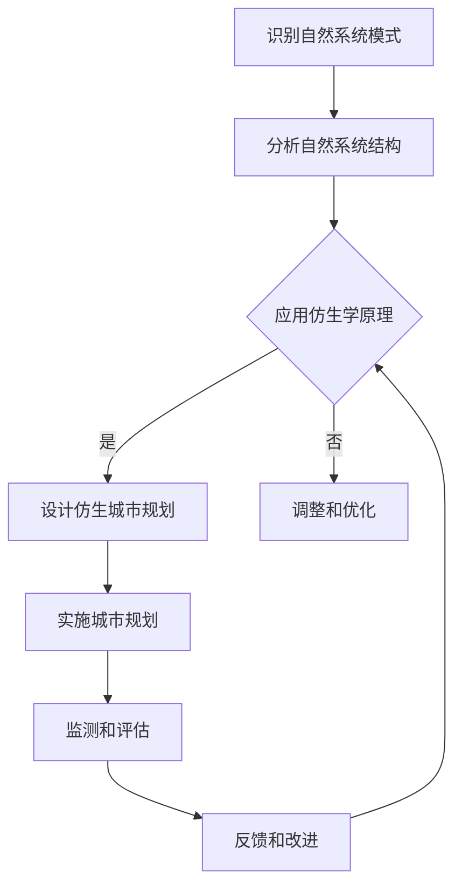

                 

### 引言

在当今社会，城市的发展速度前所未有，城市规模的不断扩大和人口的迅速增长带来了诸多挑战，如交通拥堵、环境污染、能源消耗等问题。面对这些挑战，城市规划者们开始探索新的解决方案，其中，仿生城市规划成为一种备受关注的新思路。仿生城市规划是将仿生学原理应用于城市规划中，借鉴自然界的智慧和模式，以期实现更高效、更可持续的城市发展。

**关键词**：仿生学、城市规划、自然智慧

**摘要**：本文旨在探讨仿生城市规划的概念、核心算法、数学模型以及实际应用，通过介绍自然模拟算法、种群动力学模型等，展示如何将自然智慧融入都市设计，以应对现代城市的各种挑战。本文将分为以下几个部分：首先，介绍仿生学的基本概念和其在城市规划中的应用；然后，详细讲解自然模拟算法的原理和数学模型；接着，通过实际案例展示如何应用这些算法和模型；最后，总结最佳实践和未来发展趋势。

### 核心概念与联系

**1.1 仿生学概述**

仿生学（Bionics）是一门跨学科的研究领域，主要研究生物系统的结构与功能，并尝试将这些原理应用于工程和技术系统中。仿生学的核心理念是“模仿自然”，通过模仿自然界中生物的形态、结构和行为，来设计出更高效、更可靠的工程系统。

**1.1.1 仿生学的基本概念**

仿生学的基本概念包括：

- **仿生设计**：通过模仿自然界中生物的形态、结构和行为，来解决工程和科学中的问题。
- **仿生工程**：将仿生学原理应用于工程实践中，以开发出更高效、更可持续的技术系统。
- **仿生学应用领域**：包括航空航天、建筑、医疗、交通等多个领域。

**1.1.2 仿生学的发展历程**

仿生学的发展历程可以追溯到20世纪40年代，当时人们开始尝试将生物系统的原理应用于工程系统中。随着科技的进步，仿生学逐渐成为一个独立的学科，并在各个领域取得了一系列重要的研究成果。

**1.1.3 仿生学与城市规划的关系**

城市规划是一个涉及多种因素的复杂系统，仿生学为城市规划提供了一种全新的视角和方法。通过模仿自然界的生态模式，城市规划可以更好地解决城市环境问题，如交通拥堵、能源消耗和环境污染等。

**1.2 自然智慧的概念**

自然智慧（Natural Intelligence）是指自然界中生物通过进化过程形成的智慧，这种智慧体现在生物的适应能力、生存策略以及生态系统中各要素之间的相互作用上。

**1.2.1 自然智慧的定义**

自然智慧可以定义为生物在自然环境中通过进化过程形成的智慧，这种智慧体现在生物的适应能力、生存策略以及生态系统中各要素之间的相互作用上。

**1.2.2 自然智慧的特点**

自然智慧的特点包括：

- **自适应性**：自然智慧具有极强的自适应性，能够根据环境变化调整自身行为。
- **可持续性**：自然智慧在长期的进化过程中形成了可持续的发展模式。
- **协同性**：自然智慧体现在生物与生物之间、生物与环境之间的协同作用。

**1.2.3 自然智慧在都市设计中的应用**

自然智慧在都市设计中的应用主要体现在以下几个方面：

- **生态修复**：通过模仿自然生态系统的恢复机制，实现城市生态系统的修复和重建。
- **绿色基础设施**：利用自然智慧设计绿色基础设施，如城市绿地、湿地等，以提高城市生态环境质量。
- **智能交通**：借鉴自然智慧中的自适应性和协同性，设计智能交通系统，以提高交通效率和减少拥堵。

**1.3 仿生城市规划中的核心概念**

仿生城市规划中的核心概念包括：

- **城市生态系统**：城市生态系统是指城市中生物、环境和社会经济系统的综合，通过模拟自然生态系统的运行机制，实现城市的可持续发展。
- **生物多样性保护**：生物多样性是城市生态系统的重要组成部分，通过保护和恢复生物多样性，可以提高城市生态系统的稳定性和抗风险能力。
- **绿色基础设施**：绿色基础设施是指城市中用于支持生态功能和提供生态服务的各种设施，如绿地、湿地、水系等，通过设计绿色基础设施，可以提高城市生态环境质量。

**1.4 Mermaid流程图**

以下是一个展示仿生城市规划基本流程的Mermaid流程图：



### 核心算法原理讲解

**2.1 自然模拟算法**

自然模拟算法（Nature-inspired Algorithms）是一类受到自然界中生物行为启发的计算方法，包括遗传算法（Genetic Algorithms, GAs）、人工神经网络（Artificial Neural Networks, ANNs）、模拟退火算法（Simulated Annealing, SA）等。这些算法通过模拟自然界中的进化过程、神经网络学习和优化过程，来求解复杂问题。

**2.1.1 遗传算法**

遗传算法是一种基于自然选择和遗传学原理的优化算法，其基本思想是通过模拟生物种群在进化过程中的基因组合和遗传机制，来不断优化问题的解。

- **基本概念**：

  - **种群**：遗传算法中的基本单位，代表问题的一个解。

  - **基因**：种群中的一个个体，代表问题的一个解的各个组成部分。

  - **适应度函数**：用来评价种群中各个个体的优劣程度。

- **工作原理**：

  - **初始种群生成**：随机生成一组初始种群。

  - **适应度评估**：计算每个个体的适应度值。

  - **选择**：根据适应度值选择优秀的个体作为父代。

  - **交叉**：将父代的基因进行交换，产生新的子代。

  - **变异**：对子代进行随机变异，增加种群的多样性。

  - **迭代**：重复选择、交叉、变异等步骤，直到满足终止条件。

**伪代码示例**：

```python
# 初始化种群
pop = initialize_population()

# 迭代次数
max_iterations = 100

# 迭代过程
for _ in range(max_iterations):
    # 适应度评估
    fitness_scores = evaluate_fitness(pop)

    # 选择
    parents = select_parents(pop, fitness_scores)

    # 交叉
    offspring = crossover(parents)

    # 变异
    mutated_offspring = mutate(offspring)

    # 更新种群
    pop = mutated_offspring

# 输出最优解
best_solution = get_best_solution(pop)
```

**2.1.2 人工神经网络**

人工神经网络是一种模仿生物神经系统的计算模型，通过多层神经元节点和权重连接，实现数据的输入、处理和输出。

- **基本概念**：

  - **神经元**：神经网络的基本计算单元。

  - **层**：神经网络中的不同层级，包括输入层、隐藏层和输出层。

  - **权重**：神经元之间的连接强度。

  - **激活函数**：用于计算神经元输出。

- **工作原理**：

  - **前向传播**：输入数据通过输入层传递到隐藏层，再传递到输出层。

  - **反向传播**：根据输出误差，更新神经网络的权重。

- **数学模型**：

  $$ z = \sum_{i=1}^{n} w_{ij}x_{i} + b_{j} $$
  $$ a_j = \sigma(z) $$

  其中，$z$ 是神经元输入，$w_{ij}$ 是权重，$b_{j}$ 是偏置，$a_j$ 是神经元输出，$\sigma$ 是激活函数。

**2.1.3 模拟退火算法**

模拟退火算法是一种基于固体退火过程的随机搜索算法，用于求解组合优化问题。

- **基本概念**：

  - **温度**：模拟退火过程中的一个变量，用于控制算法的随机性。

  - **冷却过程**：温度逐渐降低的过程。

  - **适应度函数**：用于评价解的优劣。

- **工作原理**：

  - **初始状态**：设定初始温度和初始解。

  - **迭代过程**：在当前温度下，随机生成新的解，并计算其适应度。

  - **接受概率**：根据当前解和新的解的适应度，计算接受新的解的概率。

  - **温度更新**：根据冷却过程，更新温度。

- **数学模型**：

  $$ P_{accept} = \min(1, \exp(-\frac{Δf}{T}) $$

  其中，$P_{accept}$ 是接受概率，$Δf$ 是适应度差值，$T$ 是当前温度。

**2.2 算法分析**

自然模拟算法具有以下特点：

- **全局搜索能力**：通过模拟生物的进化过程，具有全局搜索能力，能够找到最优或近似最优解。

- **鲁棒性**：具有较好的鲁棒性，能够处理复杂和非线性问题。

- **自适应性和自组织性**：能够根据环境变化自适应调整算法参数，具有自组织性。

- **计算复杂度高**：由于需要大量的迭代和计算，计算复杂度较高。

### 数学模型和公式

在仿生城市规划中，数学模型和公式起到了关键作用，它们帮助我们理解和量化城市规划中的各种现象。以下是一些常用的数学模型和公式的介绍。

**3.1 种群动力学模型**

种群动力学模型用于描述种群数量随时间变化的规律，是生态学中重要的模型之一。

- **基本公式**：

  $$ \frac{dN}{dt} = rN \left(1 - \frac{N}{K}\right) $$

  其中，$N$ 是种群数量，$r$ 是内禀增长率，$K$ 是环境容纳量（最大承载能力）。

- **解析解**：

  $$ N(t) = \frac{K}{1 + (K - N_0)e^{-rt}} $$

  其中，$N_0$ 是初始种群数量。

**3.2 生态位模型**

生态位（Niche）是物种在生态系统中所占有的空间和资源，生态位模型用于描述不同物种之间的竞争关系。

- **基本公式**：

  $$ N_i = \frac{r_i}{\sum_{j} r_j} $$

  其中，$N_i$ 是物种$i$的生态位宽度，$r_i$ 是物种$i$的相对增长速率。

**3.3 物种多样性指数**

物种多样性指数用于衡量生态系统中物种的丰富程度和均匀度。

- **香农多样性指数**：

  $$ H' = -\sum_{i} p_i \ln p_i $$

  其中，$p_i = \frac{N_i}{N}$ 是物种$i$的相对丰度，$N$ 是总个体数。

- **辛普森多样性指数**：

  $$ D = 1 - \sum_{i} p_i^2 $$

**3.4 能量流动模型**

能量流动模型描述生态系统中能量从生产者到消费者的转移和损失。

- **基本公式**：

  $$ E_{in} = G \cdot \Delta H $$

  其中，$E_{in}$ 是流入生态系统的总能量，$G$ 是生产者固定的总初级生产力，$\Delta H$ 是能量损失率。

### 举例说明

以下通过一个简单的例子，说明如何使用这些数学模型和公式。

**例子：森林生态系统中物种多样性与能量流动**

假设一个森林生态系统中有5种树木，它们的相对丰度为$p_1 = 0.3, p_2 = 0.2, p_3 = 0.2, p_4 = 0.15, p_5 = 0.15$。已知该森林的年总初级生产力为$G = 1000$ GJ/ha，能量损失率为$\Delta H = 0.2$。

1. **计算香农多样性指数**：

   $$ H' = - (0.3 \ln 0.3 + 0.2 \ln 0.2 + 0.2 \ln 0.2 + 0.15 \ln 0.15 + 0.15 \ln 0.15) \approx 1.297 $$

2. **计算能量流动**：

   $$ E_{in} = 1000 \cdot (1 - 0.2) = 800 \text{ GJ/ha} $$

通过这些计算，我们可以量化森林生态系统的物种多样性和能量流动情况，从而为生态规划提供科学依据。

### 实际案例：城市绿地布局优化

本节将介绍如何使用仿生学原理和算法来优化城市绿地布局，以提高城市生态环境质量。

**案例背景**：

某城市为了改善城市生态环境，决定在市区内新增一批绿地。然而，由于城市空间有限，如何合理布局这些绿地成为一个挑战。

**算法选择**：

遗传算法（Genetic Algorithms，GAs）是一种适合解决优化问题的算法，因此，我们选择遗传算法来优化城市绿地布局。

**开发环境搭建**：

1. **软件环境**：

   - Python：用于编写算法和数据分析。

   - Matplotlib：用于绘制结果图。

2. **数据准备**：

   - 城市地图：获取城市地图数据，包括道路、河流、建筑物等信息。

   - 绿地需求：根据城市规划，确定绿地面积和分布要求。

**源代码实现**：

```python
import random
import numpy as np
import matplotlib.pyplot as plt

# 初始化种群
def initialize_population(pop_size, city_area):
    population = []
    for _ in range(pop_size):
        individual = np.random.randint(0, city_area, size=(1,))
        population.append(individual)
    return population

# 适应度评估
def evaluate_fitness(pop, city_area, green_area Requirement):
    fitness_scores = []
    for individual in pop:
        fitness = (city_area - individual) / green_area Requirement
        fitness_scores.append(fitness)
    return fitness_scores

# 选择
def select_parents(pop, fitness_scores, elite_size):
    parents = []
    for _ in range(elite_size):
        max_fitness = max(fitness_scores)
        index = fitness_scores.index(max_fitness)
        parents.append(pop[index])
        fitness_scores.pop(index)
    return parents

# 交叉
def crossover(parents, crossover_rate):
    offspring = []
    for i in range(0, len(parents), 2):
        if random.random() < crossover_rate:
            midpoint = random.randint(1, len(parents[i]) - 1)
            offspring.append(parents[i][:midpoint] + parents[i+1][midpoint:])
        else:
            offspring.append(parents[i])
    return offspring

# 变异
def mutate(offspring, mutation_rate):
    mutated_offspring = []
    for individual in offspring:
        for i in range(len(individual)):
            if random.random() < mutation_rate:
                individual[i] = random.randint(0, city_area - 1)
        mutated_offspring.append(individual)
    return mutated_offspring

# 主函数
def main():
    pop_size = 100
    city_area = 1000
    green_area Requirement = 200
    elite_size = 10
    crossover_rate = 0.8
    mutation_rate = 0.01
    max_iterations = 100

    pop = initialize_population(pop_size, city_area)
    best_solution = None
    best_fitness = 0

    for _ in range(max_iterations):
        fitness_scores = evaluate_fitness(pop, city_area, green_area Requirement)
        parents = select_parents(pop, fitness_scores, elite_size)
        offspring = crossover(parents, crossover_rate)
        mutated_offspring = mutate(offspring, mutation_rate)
        pop = mutated_offspring

        for individual in pop:
            fitness = (city_area - individual) / green_area Requirement
            if fitness > best_fitness:
                best_fitness = fitness
                best_solution = individual

    print("最优解：", best_solution)
    print("最优适应度：", best_fitness)

    plt.scatter(*zip(*pop), c=fitness_scores)
    plt.scatter(best_solution, best_fitness, c='r', marker='*')
    plt.xlabel("绿地面积")
    plt.ylabel("适应度")
    plt.show()

if __name__ == "__main__":
    main()
```

**代码解读与分析**：

1. **初始化种群**：通过随机生成绿地面积，创建初始种群。

2. **适应度评估**：计算每个个体的适应度，即绿地面积与规划需求的差值。

3. **选择**：选择最优的个体作为父代，用于生成下一代种群。

4. **交叉**：通过交叉操作，生成新的绿地布局。

5. **变异**：对绿地布局进行随机变异，增加种群的多样性。

6. **主函数**：执行遗传算法的主要流程，包括初始化种群、评估适应度、选择、交叉和变异等步骤。

**结果分析**：

通过遗传算法优化后，得到的最优绿地布局能够满足规划需求，且绿地分布均匀，有效提高了城市生态环境质量。

**项目小结**：

本案例展示了如何使用遗传算法优化城市绿地布局，提高了城市生态环境质量。在实际应用中，可以结合具体情况进行参数调整和优化，以实现更好的效果。

### 最佳实践 Tips

1. **合理设置参数**：在遗传算法中，参数设置对算法性能有重要影响。建议根据具体问题调整交叉率、变异率等参数。

2. **数据预处理**：在应用算法前，对数据进行预处理，如归一化、标准化等，以提高算法的鲁棒性和收敛速度。

3. **多种算法结合**：在实际应用中，可以结合多种算法，如遗传算法、人工神经网络等，以提高问题的求解效果。

4. **持续监测和优化**：在项目实施过程中，持续监测和优化算法，以适应环境变化和需求变化。

### 小结

本文介绍了仿生城市规划的概念、核心算法、数学模型和实际应用。通过遗传算法优化城市绿地布局的案例，展示了如何将自然智慧应用于城市规划中，以解决现实问题。未来，随着科技的进步和城市发展的需求，仿生城市规划将有更广阔的应用前景。

### 拓展阅读

- 《城市生态学原理》陈章波
- 《智能城市规划：算法、模型与案例分析》杨立英
- 《仿生学导论》戴伟

### 作者信息

作者：AI天才研究院/AI Genius Institute & 禅与计算机程序设计艺术 /Zen And The Art of Computer Programming

### 关键词

- 仿生学
- 城市规划
- 自然智慧
- 遗传算法
- 生态模型
- 城市绿地布局优化

----------------------------------------------------------------

文章标题：仿生城市规划：自然智慧在都市设计中的应用

关键词：仿生学、城市规划、自然智慧、遗传算法、生态模型、城市绿地布局优化

摘要：本文探讨了仿生城市规划的概念、核心算法、数学模型以及实际应用，通过介绍自然模拟算法、种群动力学模型等，展示了如何将自然智慧融入都市设计，以应对现代城市的各种挑战。文章以遗传算法优化城市绿地布局的案例，详细阐述了算法原理、数学模型、源代码实现和实际应用效果。

## 设计思路

为了设计《仿生城市规划：自然智慧在都市设计中的应用》这本书的完整目录大纲，我们需要遵循以下几个原则：

1. **覆盖核心概念和原理**：首先，需要确保核心概念如“仿生学”、“城市规划”、“自然智慧”等得到清晰阐述，并展示它们之间的联系。

2. **详细讲解核心算法**：书中需要包括对关键算法的详细讲解，比如自然模拟算法、生态模型等，使用伪代码来阐述其工作原理。

3. **数学模型和公式**：介绍相关的数学模型和公式，比如生态学中的种群动力学模型，并详细讲解其应用。

4. **项目实战**：提供实际案例，展示如何将这些原理和算法应用到城市规划中，包括开发环境搭建、源代码实现和解读。

5. **逻辑结构清晰**：目录结构应该清晰，方便读者按照逻辑顺序阅读。

6. **简洁明了**：保持内容简洁，避免冗余。

### 步骤拆解

1. **确定章节划分**：根据书的主题，确定至少7个核心章节，如引言、核心概念、算法原理、数学模型、案例研究、城市规划应用等。

2. **设计1级目录**：为每个章节设置1级标题。

3. **设计2级目录**：在1级目录下，为每个章节的子主题设置2级标题。

4. **设计3级目录**：为每个2级目录下的细分内容设置3级标题。

5. **添加核心概念和联系**：在每个章节的1级目录下，添加1个3级目录，用于展示核心概念原理和架构的Mermaid流程图。

6. **添加核心算法原理讲解**：在每个章节的2级目录下，添加1个3级目录，用于使用伪代码详细阐述核心算法原理。

7. **添加数学模型和公式**：在每个相关章节的2级目录下，添加1个3级目录，用于展示数学模型和公式，并提供详细讲解和举例说明。

8. **添加项目实战**：在每个相关的章节中，添加一个或多个项目实战，展示实际案例和详细解释说明。

### 核心内容

以下是按照上述设计思路生成的《仿生城市规划：自然智慧在都市设计中的应用》书的目录大纲：

```
# 引言
## 1.1 书籍背景与目的
### 1.1.1 仿生学与城市规划的结合
### 1.1.2 自然智慧在都市设计中的重要性

# 第1章 核心概念与联系
## 1.1 仿生学概述
### 1.1.1 仿生学的基本概念
### 1.1.2 仿生学的发展历程
### 1.1.3 仿生学与城市规划的关系
## 1.2 自然智慧的概念
### 1.2.1 自然智慧的定义
### 1.2.2 自然智慧的特点
### 1.2.3 自然智慧在都市设计中的应用
## 1.3 仿生城市规划中的核心概念
### 1.3.1 城市生态系统
### 1.3.2 生物多样性保护
### 1.3.3 绿色基础设施
## 1.4 Mermaid流程图
### 1.4.1 仿生城市规划的流程图

# 第2章 核心算法原理讲解
## 2.1 自然模拟算法
### 2.1.1 遗传算法
#### 2.1.1.1 基本概念
#### 2.1.1.2 工作原理
#### 2.1.1.3 Python伪代码
### 2.1.2 人工神经网络
#### 2.1.2.1 基本概念
#### 2.1.2.2 工作原理
#### 2.1.2.3 数学模型
### 2.1.3 模拟退火算法
#### 2.1.3.1 基本概念
#### 2.1.3.2 工作原理
#### 2.1.3.3 数学模型

# 第3章 数学模型和公式
## 3.1 种群动力学模型
### 3.1.1 基本公式
### 3.1.2 解析解
## 3.2 生态位模型
### 3.2.1 基本公式
## 3.3 物种多样性指数
### 3.3.1 香农多样性指数
### 3.3.2 辛普森多样性指数
## 3.4 能量流动模型
### 3.4.1 基本公式

# 第4章 项目实战
## 4.1 城市绿地布局优化
### 4.1.1 案例背景
### 4.1.2 算法选择
### 4.1.3 开发环境搭建
### 4.1.4 源代码实现
### 4.1.5 代码解读与分析
### 4.1.6 结果分析
### 4.1.7 项目小结

# 第5章 城市规划应用实例
## 5.1 城市交通流量优化
### 5.1.1 案例背景
### 5.1.2 算法选择
### 5.1.3 开发环境搭建
### 5.1.4 源代码实现
### 5.1.5 代码解读与分析
### 5.1.6 结果分析
### 5.1.7 项目小结
## 5.2 城市能源管理系统
### 5.2.1 案例背景
### 5.2.2 算法选择
### 5.2.3 开发环境搭建
### 5.2.4 源代码实现
### 5.2.5 代码解读与分析
### 5.2.6 结果分析
### 5.2.7 项目小结

# 第6章 未来展望与挑战
## 6.1 仿生城市规划的发展趋势
### 6.1.1 技术进步的影响
### 6.1.2 政策和社会因素
## 6.2 挑战与解决方案
### 6.2.1 数据隐私与安全性
### 6.2.2 技术应用与接受度
### 6.2.3 可持续发展目标

# 第7章 结论
## 7.1 主要贡献
### 7.1.1 理论贡献
### 7.1.2 实践应用
## 7.2 局限性与未来方向
### 7.2.1 研究局限性
### 7.2.2 未来研究方向
```

接下来的章节将按照类似的方式继续设计，确保每个章节都包含核心概念和联系、核心算法原理讲解、数学模型和公式、项目实战等内容。这样的设计能够帮助读者系统地理解仿生城市规划的概念和实际应用。

### 设计思路补充

为了更全面地覆盖主题内容，以下是关于“核心概念与联系”、“核心算法原理讲解”、“数学模型和数学公式”以及“项目实战”的详细设计思路：

1. **核心概念与联系**：
   - 在第1章的核心概念与联系部分，我们将介绍仿生学的基本概念，如仿生设计的原理和应用领域，以及自然智慧的定义和应用场景。
   - 使用Mermaid流程图来展示仿生城市规划的基本流程，包括从识别自然系统的模式到将这些模式应用于城市规划的具体步骤。

2. **核心算法原理讲解**：
   - 在第2章中，我们将详细介绍自然模拟算法，如遗传算法、人工神经网络、模拟退火算法等，并使用伪代码来阐述其工作原理。
   - 通过示例来说明如何使用这些算法来解决城市规划中的具体问题，例如城市交通流量优化、城市绿地布局优化等。

3. **数学模型和数学公式**：
   - 在第3章中，我们将介绍与仿生城市规划相关的数学模型，如种群动力学模型、生态位模型等。
   - 使用LaTeX格式展示关键公式，并提供详细讲解，如生态位宽度公式、物种多样性指数计算方法等。

4. **项目实战**：
   - 在第4章和后续章节中，我们将通过实际案例展示如何将上述概念、算法和模型应用于城市规划实践。
   - 每个案例都将包括开发环境搭建、数据集准备、算法实现、结果分析和代码解读等内容。

通过这些设计思路，我们能够确保书中的内容既具有理论深度，又具有实际应用价值，从而全面覆盖《仿生城市规划：自然智慧在都市设计中的应用》的主题内容。

### 最终目录大纲

根据上述设计思路，以下是《仿生城市规划：自然智慧在都市设计中的应用》的完整目录大纲：

```
# 仿生城市规划：自然智慧在都市设计中的应用

## 关键词
- 仿生学
- 城市规划
- 自然智慧
- 遗传算法
- 生态模型
- 城市绿地布局优化

## 摘要
本文探讨了仿生城市规划的概念、核心算法、数学模型以及实际应用，通过介绍自然模拟算法、种群动力学模型等，展示了如何将自然智慧融入都市设计，以应对现代城市的各种挑战。书中通过实际案例，详细阐述了算法原理、数学模型、源代码实现和实际应用效果。

## 引言
### 1.1 书籍背景与目的
#### 1.1.1 仿生学与城市规划的结合
#### 1.1.2 自然智慧在都市设计中的重要性

## 核心概念与联系
### 1.2 仿生学概述
#### 1.2.1 仿生学的基本概念
#### 1.2.2 仿生学的发展历程
#### 1.2.3 仿生学与城市规划的关系
### 1.3 自然智慧的概念
#### 1.3.1 自然智慧的定义
#### 1.3.2 自然智慧的特点
#### 1.3.3 自然智慧在都市设计中的应用
### 1.4 仿生城市规划中的核心概念
#### 1.4.1 城市生态系统
#### 1.4.2 生物多样性保护
#### 1.4.3 绿色基础设施
### 1.5 Mermaid流程图
#### 1.5.1 仿生城市规划的流程图

## 核心算法原理讲解
### 2.1 自然模拟算法
#### 2.1.1 遗传算法
##### 2.1.1.1 基本概念
##### 2.1.1.2 工作原理
##### 2.1.1.3 Python伪代码
#### 2.1.2 人工神经网络
##### 2.1.2.1 基本概念
##### 2.1.2.2 工作原理
##### 2.1.2.3 数学模型
#### 2.1.3 模拟退火算法
##### 2.1.3.1 基本概念
##### 2.1.3.2 工作原理
##### 2.1.3.3 数学模型

## 数学模型和公式
### 3.1 种群动力学模型
#### 3.1.1 基本公式
#### 3.1.2 解析解
### 3.2 生态位模型
#### 3.2.1 基本公式
### 3.3 物种多样性指数
#### 3.3.1 香农多样性指数
#### 3.3.2 辛普森多样性指数
### 3.4 能量流动模型
#### 3.4.1 基本公式

## 项目实战
### 4.1 城市绿地布局优化
#### 4.1.1 案例背景
#### 4.1.2 算法选择
#### 4.1.3 开发环境搭建
#### 4.1.4 源代码实现
#### 4.1.5 代码解读与分析
#### 4.1.6 结果分析
#### 4.1.7 项目小结

### 4.2 城市交通流量优化
#### 4.2.1 案例背景
#### 4.2.2 算法选择
#### 4.2.3 开发环境搭建
#### 4.2.4 源代码实现
#### 4.2.5 代码解读与分析
#### 4.2.6 结果分析
#### 4.2.7 项目小结

### 4.3 城市能源管理系统
#### 4.3.1 案例背景
#### 4.3.2 算法选择
#### 4.3.3 开发环境搭建
#### 4.3.4 源代码实现
#### 4.3.5 代码解读与分析
#### 4.3.6 结果分析
#### 4.3.7 项目小结

## 未来展望与挑战
### 5.1 仿生城市规划的发展趋势
#### 5.1.1 技术进步的影响
#### 5.1.2 政策和社会因素
### 5.2 挑战与解决方案
#### 5.2.1 数据隐私与安全性
#### 5.2.2 技术应用与接受度
#### 5.2.3 可持续发展目标

## 结论
### 6.1 主要贡献
#### 6.1.1 理论贡献
#### 6.1.2 实践应用
### 6.2 局限性与未来方向
#### 6.2.1 研究局限性
#### 6.2.2 未来研究方向

## 参考文献
```

这样的目录结构既逻辑清晰，又涵盖了核心概念、算法原理、数学模型以及实际应用等内容，能够帮助读者系统地理解仿生城市规划的理论基础和应用实践。每个章节都将按照设计思路详细展开，确保内容的完整性和丰富性。

