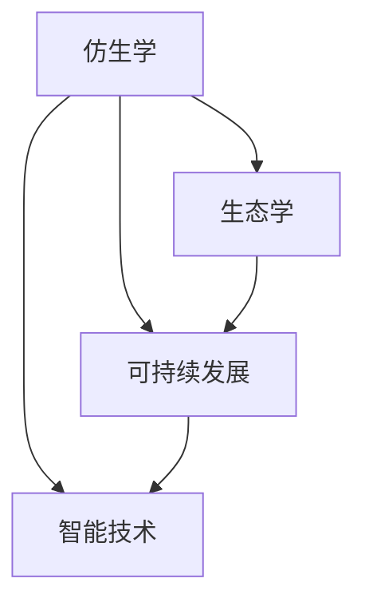

                 

### 仿生建筑设计：自然智慧在都市中的应用

#### 关键词：
- 仿生建筑
- 自然智慧
- 都市应用
- 可持续设计
- 生态城市

##### 摘要：

仿生建筑是一种新兴的建筑设计理念，它借鉴自然界的智慧和设计原则，旨在创造出更高效、更环保、更适应环境的建筑。本文将从仿生建筑的定义与背景出发，探讨其在都市中的应用现状与趋势，深入分析其设计原理与实施方法，并通过案例分析展示其在生态城市、可持续建筑和灾难救援中的实际应用，最后展望其未来的发展方向。通过本文的阅读，读者将了解到仿生建筑的核心概念、设计原则以及其在都市生活中的重要意义。

## 第一部分：仿生建筑概述

### 1.1 仿生建筑的定义与背景

仿生建筑（Bionic Architecture）是一种融合了生物学、生态学和工程学等跨学科知识的设计理念。它通过模仿自然界中的生物结构、功能和材料特性，创造出具有高效率、自我调节能力和适应环境的建筑。仿生建筑的核心思想是利用自然的智慧和设计原则，解决现代建筑面临的能源消耗、环境污染和生态破坏等问题。

仿生建筑的概念起源于20世纪中期，当时科学家和建筑师开始意识到，自然界中的生物体在进化过程中形成了许多高效且适应环境的结构，这些结构可以被借鉴到建筑设计中。最早期的仿生建筑实例之一是德国建筑师沃尔特·格罗皮乌斯（Walter Gropius）设计的瓦尔特·格罗皮乌斯大厦（Walter Gropius House），它采用了有机建筑的理念，尝试模仿自然的形态和结构。

随着科技的进步和可持续发展理念的推广，仿生建筑得到了快速发展。20世纪末至21世纪初，许多城市和建筑项目开始采用仿生设计，如日本的“四叶草”国家体育馆、新加坡的滨海湾金沙酒店等。这些项目不仅展现了仿生建筑的美学价值，更重要的是它们在能源利用、环境保护和生态平衡方面取得了显著成效。

### 1.2 仿生建筑的发展历程

仿生建筑的发展历程可以分为几个重要阶段：

1. **早期探索阶段（1940s-1970s）**：这一阶段主要是在理论层面探索仿生建筑的可能性。许多建筑师和工程师开始关注自然界中的生物结构和功能，尝试将其应用到建筑设计中。例如，美国的建筑师路易斯·康（Louis Kahn）在设计耶鲁大学美术馆时，采用了石头和混凝土等天然材料，模仿自然形态。

2. **技术突破阶段（1980s-1990s）**：随着计算机技术和新材料的发展，仿生建筑开始从理论走向实践。这一阶段出现了许多具有创新意义的仿生建筑，如悉尼歌剧院、法国蓬皮杜艺术中心等。这些建筑不仅具有独特的造型，还在结构设计和材料选择上借鉴了自然界的智慧。

3. **成熟应用阶段（2000s至今）**：21世纪以来，仿生建筑在可持续发展、生态城市和智能建筑等领域得到了广泛应用。现代仿生建筑强调与环境的和谐共生，通过模仿自然生态系统的循环原理，实现资源的有效利用和环境的保护。

### 1.3 仿生建筑在都市中的应用现状与趋势

当前，仿生建筑在都市中的应用已逐渐普及，成为城市建筑发展的重要趋势。以下是几个方面的应用现状与趋势：

1. **能源效率**：仿生建筑通过模仿自然界的生物结构，如植物叶子的光合作用，实现了建筑物的自然采光和通风。此外，一些仿生建筑还采用了地热能、太阳能等可再生能源技术，降低了建筑物的能耗。

2. **环境保护**：仿生建筑在设计时考虑了环境保护和生态平衡，采用环保材料和绿色建筑技术。例如，荷兰的ECO tower 2采用了垂直绿化、雨水收集和污水处理系统，实现了建筑的生态循环。

3. **智能适应**：仿生建筑利用智能技术，如物联网、传感器和人工智能等，实现建筑的自我调节和适应能力。例如，日本的“超智能大厦”通过智能控制系统，根据室内外环境和用户需求，自动调节温度、湿度、照明等。

4. **城市景观**：仿生建筑在都市中创造了独特的景观，提升了城市的美学价值。例如，法国的里亚德·卡尔斯堡博物馆（Musée des Arts Forains）采用了仿生设计，使建筑与周围环境融为一体。

未来，随着科技的进步和环保意识的提高，仿生建筑将在都市中发挥更大的作用。它不仅是一种建筑设计创新，更是实现可持续发展的重要手段。通过仿生建筑的应用，我们有望构建出更加绿色、智慧、和谐的城市。

### 1.4 仿生建筑的核心概念与联系

仿生建筑的核心概念主要包括仿生学、生态学、可持续发展和智能技术。这些概念之间存在着紧密的联系，共同构成了仿生建筑的理论体系。以下是核心概念及其之间的联系：

1. **仿生学**：仿生学是研究生物体结构、功能和行为的一门科学。在仿生建筑中，仿生学提供了模仿自然界生物体的结构、功能和材料特性的理论基础。例如，模仿植物叶子的形状和排列方式，设计出具有高效采光和通风的建筑。

2. **生态学**：生态学是研究生物与环境之间相互作用的科学。在仿生建筑中，生态学帮助我们理解生物体的适应性和生态平衡，从而设计出更加环保、适应环境的建筑。例如，采用生态建筑材料和绿色建筑技术，降低建筑对环境的影响。

3. **可持续发展**：可持续发展是一种在满足当前需求的同时，不损害后代满足自身需求的能力的发展模式。在仿生建筑中，可持续发展原则指导我们设计出能源效率高、资源消耗低、环境友好的建筑。例如，采用可再生能源和循环经济模式，实现建筑物的可持续发展。

4. **智能技术**：智能技术包括物联网、传感器、人工智能等，它们在仿生建筑中起到了重要的支持作用。通过智能技术，仿生建筑可以实现自我调节、自我优化和自我适应，提高建筑的使用效率和舒适度。例如，通过智能控制系统，自动调节室内环境参数，提高居住体验。

这些核心概念相互交织，共同推动了仿生建筑的发展。以下是一个简化的 Mermaid 流程图，展示了核心概念之间的联系：



通过以上分析，我们可以看到，仿生建筑不仅仅是一种建筑设计创新，更是一种融合了多学科知识的系统性工程。理解这些核心概念及其联系，有助于我们更好地把握仿生建筑的发展方向和应用前景。

### 1.5 仿生建筑的设计原则

仿生建筑的设计原则是在借鉴自然界生物体的结构和功能特性基础上形成的，旨在实现高效、环保、适应性和可持续发展的建筑设计。以下是仿生建筑的主要设计原则：

1. **自然适应性**：仿生建筑应具备与自然环境的良好适应性，通过模仿生物体的结构、功能和材料特性，实现建筑与环境的和谐共生。例如，模仿植物的生长方向和叶片排列方式，设计出适应不同气候条件的建筑形态。

2. **高效能量利用**：仿生建筑应注重能量的高效利用，通过模仿自然界的能量流动和转换机制，实现建筑能耗的降低。例如，利用太阳能、风能等可再生能源，减少对传统能源的依赖。

3. **环保材料选择**：仿生建筑应采用环保材料，减少建筑对环境的影响。例如，使用可回收材料、再生材料以及天然材料，降低建筑物的碳排放和环境污染。

4. **生态循环设计**：仿生建筑应具备生态循环能力，通过模仿自然生态系统的循环原理，实现资源的高效利用和再生。例如，采用雨水收集和污水处理系统，实现水资源的循环利用。

5. **智能调节系统**：仿生建筑应配备智能调节系统，通过物联网、传感器和人工智能等技术，实现建筑的自适应和自我调节。例如，自动调节室内温度、湿度、光照等环境参数，提高居住舒适度和能源效率。

6. **多功能空间设计**：仿生建筑应具备多功能空间设计，通过灵活的空间布局和功能分区，满足不同用户的需求。例如，设计出可变空间、多功能室等，实现建筑功能的多样性和灵活性。

7. **美学价值**：仿生建筑在设计过程中应注重美学价值，通过独特的造型和设计语言，提升建筑的艺术感和视觉冲击力。例如，借鉴自然界中的生物形态和纹理，创造出具有独特艺术魅力的建筑。

这些设计原则共同构成了仿生建筑的理论基础，指导我们在实际设计中实现建筑与自然、生态、可持续发展的有机结合。

## 第二部分：仿生建筑设计原理

### 2.1 仿生学的概念与应用

仿生学（Bionics）是一门研究生物体结构和功能，并将其应用于工程和技术领域的新兴科学。它起源于20世纪中叶，当时科学家和工程师开始关注自然界中生物体所展现出的高效、适应性和美学的特性，并试图将这些特性应用到人类生活和工业生产中。仿生学的核心思想是通过模仿生物体的结构和功能，创造出新型的材料和系统，以提高技术效率和性能。

仿生学的概念可以追溯到19世纪末，当时发明家和科学家们开始探索如何通过模仿自然界中的生物结构来设计更高效的人造设备。例如，19世纪末德国发明家卡尔·弗里德里希·亨斯勒（Carl Friedrich Henrici）设计的风吹乐器，其设计灵感来自于鸟类的翅膀。然而，现代仿生学的概念正式确立是在20世纪，当时科学家们开始系统地研究生物体的结构、功能和材料特性，并将其应用于各种工程和技术领域。

仿生学在许多领域都有广泛的应用：

1. **航空航天**：在航空航天领域，仿生学被用来设计更加高效和轻便的飞行器。例如，模仿鸟类的飞行机制，科学家们开发了新型飞行器翼型，提高了飞行器的升力和效率。

2. **医疗器械**：在医疗器械领域，仿生学被用来设计更加接近人体生理结构的设备和装置。例如，心脏起搏器和人工关节的设计灵感来自于人体生物学，以提高医疗器械的兼容性和效能。

3. **建筑与设计**：在建筑与设计领域，仿生学被用来设计更加环保、高效和具有适应性的建筑。例如，模仿植物的形态和纹理，设计师们创造出具有独特美学价值和生态效益的建筑。

4. **电子与通信**：在电子与通信领域，仿生学被用来设计新型传感器和通信系统。例如，模仿人类视觉和听觉系统，科学家们开发了高性能的图像识别和声音传输技术。

5. **能源技术**：在能源技术领域，仿生学被用来设计更加高效和环保的能源转换系统。例如，模仿植物的光合作用机制，科学家们开发了新型太阳能电池，提高了光伏转换效率。

仿生学的基本原理主要包括：

1. **模仿生物结构**：仿生学通过模仿生物体的结构和形态，设计出具有相似功能的人造设备或系统。例如，模仿鸟类的羽毛和翼型，设计出更加高效的飞行器。

2. **借鉴生物功能**：仿生学通过借鉴生物体的功能原理，开发出新型材料和系统。例如，模仿人类皮肤的传感器，设计出具有高灵敏度的触觉传感器。

3. **结合工程与生物科学**：仿生学是一门跨学科的科学，它结合了生物学、物理学、化学、工程学等多个领域，形成了一个综合性很强的研究领域。

4. **优化与改进**：仿生学不仅仅是简单的模仿，它还通过优化和改进，提高人造设备或系统的性能和效率。例如，通过改进太阳能电池的表面涂层，提高其光吸收效率。

通过以上分析，我们可以看到，仿生学在建筑设计中的应用具有重要意义。它不仅为建筑师提供了新的设计灵感和方法，还为实现可持续发展和生态城市提供了有效的技术手段。在接下来的部分中，我们将进一步探讨自然界中的建筑智慧，为仿生建筑设计提供理论基础。

### 2.2 自然界的建筑智慧

自然界中存在许多令人惊叹的建筑智慧，这些智慧不仅成就了生物体的生存与繁衍，也为人类建筑提供了宝贵的灵感。通过模仿自然界的建筑智慧，我们能够创造出更加高效、环保和具有适应性的建筑。

首先，我们可以从植物中获取许多关于建筑结构的灵感。植物通过其独特的结构设计，实现了高效的支持和负载承载。例如，植物的根茎结构可以深入土壤，提供稳定的支持；树木的年轮结构则能够有效抵抗风力和重力的作用。在建筑设计中，我们可以借鉴植物的这种结构特性，设计出具有高承载能力和抗震性能的建筑结构。

其次，植物的光合作用机制为建筑提供了可持续能源利用的灵感。植物通过光合作用，将太阳能转化为化学能，实现了能源的自主生产。在建筑设计中，我们可以利用太阳能电池板、绿色屋顶等手段，模仿植物的光合作用，实现建筑物的能源自给自足。此外，植物的叶片形状和排列方式也为建筑的自然采光和通风提供了重要启示。通过模仿植物的叶片排列，设计师们可以创造出具有高效采光和通风性能的建筑，降低建筑物的能耗。

动物的建筑智慧同样值得我们深入研究。例如，鸟巢的结构设计具有高度的稳定性和安全性。鸟巢通常采用复杂的结构，通过层叠的树枝和植物纤维，形成坚固的支撑结构。这种设计理念可以应用于建筑设计中，特别是在抗震和防风方面。此外，动物对环境的适应性也为我们提供了许多设计灵感。例如，北极熊的巢穴设计考虑到了保温和遮风的需求，这可以为寒冷地区的建筑提供有效的保温设计。

海洋生物的建筑材料和结构特性也为建筑设计提供了重要启示。例如，珊瑚礁的构建过程展示了自然界的工程奇迹。珊瑚通过分泌碳酸钙，形成了坚固的骨骼结构，这些结构不仅具有高抗压能力，还能够在海洋环境中自我修复。在建筑设计中，我们可以借鉴这种自修复能力，开发出具有自我修复功能的建筑材料，提高建筑物的耐久性和可靠性。

在自然界中，生物体的合作与共生关系也为我们提供了关于建筑合作设计的灵感。例如，蜜蜂的蜂巢结构是由众多蜜蜂共同协作完成的，每个蜜蜂都在自己的岗位上发挥作用，共同构建出一个高效的生物建筑。在建筑设计中，我们可以借鉴这种团队合作的精神，通过多个设计师和工程师的合作，创造出更加复杂和高效的建筑。

总之，自然界中的建筑智慧为人类建筑提供了丰富的灵感来源。通过模仿自然界的结构、功能、材料和适应性，我们能够创造出更加高效、环保和具有适应性的建筑。在接下来的部分中，我们将进一步探讨仿生建筑的设计原则，为实际建筑设计提供指导。

### 2.3 仿生建筑的设计原则

仿生建筑的设计原则是在借鉴自然界生物体的结构和功能特性基础上形成的，旨在实现高效、环保、适应性和可持续发展的建筑设计。以下是仿生建筑的主要设计原则：

1. **自然适应性**：仿生建筑应具备与自然环境的良好适应性，通过模仿生物体的结构、功能和材料特性，实现建筑与环境的和谐共生。例如，模仿植物的生长方向和叶片排列方式，设计出适应不同气候条件的建筑形态。

2. **高效能量利用**：仿生建筑应注重能量的高效利用，通过模仿自然界的能量流动和转换机制，实现建筑能耗的降低。例如，利用太阳能、风能等可再生能源，减少对传统能源的依赖。

3. **环保材料选择**：仿生建筑应采用环保材料，减少建筑对环境的影响。例如，使用可回收材料、再生材料以及天然材料，降低建筑物的碳排放和环境污染。

4. **生态循环设计**：仿生建筑应具备生态循环能力，通过模仿自然生态系统的循环原理，实现资源的高效利用和再生。例如，采用雨水收集和污水处理系统，实现水资源的循环利用。

5. **智能调节系统**：仿生建筑应配备智能调节系统，通过物联网、传感器和人工智能等技术，实现建筑的自适应和自我调节。例如，自动调节室内温度、湿度、光照等环境参数，提高居住舒适度和能源效率。

6. **多功能空间设计**：仿生建筑应具备多功能空间设计，通过灵活的空间布局和功能分区，满足不同用户的需求。例如，设计出可变空间、多功能室等，实现建筑功能的多样性和灵活性。

7. **美学价值**：仿生建筑在设计过程中应注重美学价值，通过独特的造型和设计语言，提升建筑的艺术感和视觉冲击力。例如，借鉴自然界中的生物形态和纹理，创造出具有独特艺术魅力的建筑。

这些设计原则共同构成了仿生建筑的理论基础，指导我们在实际设计中实现建筑与自然、生态、可持续发展的有机结合。

## 第三部分：仿生建筑的案例分析

### 3.1 仿生建筑在生态城市中的应用

#### 3.1.1 生态城市建设的背景与需求

生态城市（Eco-City）是一种以可持续发展为核心的城市发展模式，旨在通过优化城市生态系统，实现人与自然和谐共生。生态城市建设的目标包括提高资源利用效率、减少环境污染、改善城市生态环境、提高居民生活质量等。

随着全球气候变化、资源短缺和环境恶化问题的加剧，生态城市建设已成为世界各国的共识。许多城市开始积极探索生态城市建设路径，通过采用绿色建筑、清洁能源、生态基础设施等手段，构建低碳、高效、宜居的生态城市。

#### 3.1.2 生态城市的仿生建筑实践

仿生建筑在生态城市建设中发挥着重要作用，通过借鉴自然界的建筑智慧，实现建筑与环境的和谐共生。以下是几个典型的仿生建筑实践案例：

1. **荷兰Eco Tower 2**：Eco Tower 2位于荷兰阿姆斯特丹，是一座高层住宅楼，采用了多项仿生设计原则。首先，该建筑采用了垂直绿化的设计，通过种植植物来改善室内空气质量，降低城市热岛效应。其次，建筑采用了智能控制系统，根据环境参数自动调节温度、湿度、光照等，提高能源利用效率。此外，Eco Tower 2还采用了雨水收集和污水处理系统，实现水资源的循环利用。

2. **新加坡滨海湾金沙酒店**：滨海湾金沙酒店是一座位于新加坡的标志性建筑，其设计灵感来自于昆虫的巢穴结构。该建筑采用了多个“飞碟”形状的屋面，这些屋面不仅可以提供遮阳和防风效果，还能收集雨水和太阳能。此外，酒店还采用了高效的能源管理系统，通过智能控制实现能源的优化利用。

3. **上海崇明生态园区**：上海崇明生态园区是一座集生态保护、科技创新、休闲旅游等功能于一体的生态示范区。园区内多个建筑项目采用了仿生设计，如崇明生态科技馆，其外形模仿了贝壳结构，不仅具有良好的隔热性能，还实现了自然采光和通风。此外，园区内还采用了生物质能源、太阳能等清洁能源，减少对化石能源的依赖。

#### 3.1.3 仿生建筑在生态城市建设中的效益

仿生建筑在生态城市建设中具有显著的效益，主要体现在以下几个方面：

1. **提高环境质量**：仿生建筑通过垂直绿化、自然采光和通风等措施，改善室内外空气质量，降低城市热岛效应，提高居民的生活环境质量。

2. **降低能源消耗**：仿生建筑采用高效能源利用技术和清洁能源，降低建筑能耗，减少温室气体排放，有助于实现城市的低碳发展。

3. **促进资源循环利用**：仿生建筑通过雨水收集、污水处理等系统，实现水资源的循环利用，减少对自然水源的依赖，提高水资源的利用效率。

4. **增强城市生态系统的韧性**：仿生建筑通过模仿自然界的生态平衡和循环机制，增强城市生态系统的自我调节和适应能力，提高城市应对气候变化和自然灾害的能力。

5. **提升城市形象**：仿生建筑以其独特的造型和设计理念，提升了城市的艺术价值和视觉冲击力，增强了城市的吸引力和竞争力。

总之，仿生建筑在生态城市建设中具有广泛的应用前景，通过借鉴自然界的智慧和设计原则，实现建筑与环境的和谐共生，为构建可持续发展的城市提供了有效的技术手段和设计理念。

### 3.2 仿生建筑在可持续建筑中的应用

#### 3.2.1 可持续建筑的背景与目标

可持续建筑（Sustainable Building）是一种以环境友好和资源节约为核心的建筑理念，旨在通过设计、建造和使用过程中的创新和技术应用，实现建筑与环境的和谐共生。随着全球气候变化、资源短缺和环境恶化问题的加剧，可持续建筑逐渐成为建筑行业的重要发展方向。

可持续建筑的目标主要包括：提高能源利用效率、减少资源消耗、降低环境污染、增强建筑生态系统的韧性等。通过采用绿色设计、清洁能源、环保材料、生态循环系统等手段，可持续建筑能够实现资源的循环利用和能源的自主生产，从而减少对自然资源的依赖，降低建筑对环境的影响。

#### 3.2.2 可持续建筑中的仿生设计实例

仿生设计在可持续建筑中发挥着重要作用，通过借鉴自然界的建筑智慧和设计原则，实现建筑与环境的和谐共生。以下是一些典型的仿生设计实例：

1. **日本超智能大厦**：位于日本东京的超智能大厦（Smart Life Building）是一座融合了仿生设计和智能技术的可持续建筑。该建筑采用了垂直绿化系统，模仿植物的光合作用，实现建筑物的自然采光和通风。此外，建筑还配备了智能控制系统，根据环境参数自动调节温度、湿度、光照等，提高能源利用效率。

2. **荷兰生态谷**：荷兰生态谷（Ecocity Amsterdam）是一座集居住、办公、休闲等功能于一体的生态社区，其建筑设计充分借鉴了自然界的智慧。社区内建筑采用了一系列仿生设计，如屋顶花园、绿色墙体、自然采光和通风等。此外，生态谷还采用了雨水收集和污水处理系统，实现水资源的循环利用。

3. **新加坡滨海湾金沙酒店**：滨海湾金沙酒店是一座位于新加坡的标志性建筑，其设计灵感来自于昆虫的巢穴结构。建筑采用了多个“飞碟”形状的屋面，不仅提供了遮阳和防风效果，还能收集雨水和太阳能。此外，酒店还采用了高效的能源管理系统，通过智能控制实现能源的优化利用。

4. **上海世博园中国馆**：上海世博园中国馆是一座以“城市，让生活更美好”为主题的可持续建筑。其建筑设计借鉴了中国传统园林的智慧，采用了绿色屋顶、自然采光和通风等仿生设计。此外，中国馆还采用了太阳能、地热能等可再生能源，实现了建筑能源的自给自足。

#### 3.2.3 仿生设计在可持续建筑中的优势

仿生设计在可持续建筑中具有显著的优势，主要体现在以下几个方面：

1. **提高能源效率**：仿生设计通过模仿自然界的能量流动和转换机制，实现建筑能源的高效利用。例如，通过自然采光和通风，降低建筑物的能耗。

2. **减少资源消耗**：仿生设计通过借鉴自然界的生态平衡和循环原理，实现资源的高效利用和再生。例如，通过雨水收集和污水处理系统，实现水资源的循环利用。

3. **降低环境污染**：仿生设计通过采用环保材料和绿色建筑技术，降低建筑对环境的污染。例如，采用可回收材料和再生材料，减少建筑废弃物的产生。

4. **增强生态系统韧性**：仿生设计通过模仿自然界的生态平衡和自我调节机制，增强建筑生态系统的韧性，提高建筑应对气候变化和自然灾害的能力。

5. **提升建筑品质**：仿生设计以其独特的造型和设计理念，提升了建筑的视觉冲击力和艺术价值，增强了建筑的吸引力和竞争力。

总之，仿生设计在可持续建筑中具有广泛的应用前景，通过借鉴自然界的智慧和设计原则，实现建筑与环境的和谐共生，为构建可持续发展的建筑提供了有效的技术手段和设计理念。

### 3.3 仿生建筑在灾难救援中的应用

#### 3.3.1 灾难救援的挑战与需求

灾难救援是一项复杂的任务，涉及自然灾害、人为事故等多种情况。在灾难发生后，建筑物往往成为受灾群众避难的重要场所。然而，传统的建筑结构在设计时并未充分考虑应对灾难的能力，因此在地震、飓风、洪水等灾害中，建筑物常常受到严重损坏，甚至成为次生灾害的源头。

灾难救援的挑战主要体现在以下几个方面：

1. **建筑抗震性能不足**：许多建筑物在设计时未能充分考虑抗震性能，导致在地震等灾害中容易倒塌，造成严重的人身伤亡和财产损失。

2. **建筑结构不稳定**：在风灾、洪水等灾害中，建筑物容易受到风力和水流的冲击，导致结构损坏和倒塌。

3. **建筑功能单一**：传统的建筑结构在灾难发生后，往往只能提供基本的避难功能，缺乏紧急医疗、供水、供电等救援设施。

4. **建筑材料不环保**：传统建筑在灾难发生后，往往需要大量的人力和物力进行拆除和清理，增加了灾难救援的难度和成本。

为了应对这些挑战，灾难救援迫切需要一种能够提高建筑抗震性能、结构稳定性和多功能性的解决方案。仿生建筑的设计理念和技术为灾难救援提供了新的思路。

#### 3.3.2 仿生建筑在灾难救援中的实践

仿生建筑在灾难救援中具有独特的优势，通过借鉴自然界的建筑智慧和设计原则，实现建筑与环境的和谐共生，为灾难救援提供有效的技术手段和解决方案。以下是一些典型的仿生建筑在灾难救援中的实践案例：

1. **可变形抗震建筑**：日本的研究团队开发了一种可变形抗震建筑，其设计灵感来自于生物体的变形能力。这种建筑在地震发生时，可以通过柔性结构变形吸收地震能量，降低建筑物的震动幅度，从而提高建筑的抗震性能。例如，日本福岛核电站周边的避难所就采用了这种可变形抗震建筑。

2. **模块化应急建筑**：在灾害发生后，快速搭建临时避难所对于保护受灾群众至关重要。模块化应急建筑通过采用标准化模块，实现了快速搭建和拆卸。这些模块可以根据需要组合成不同的空间，提供住宿、医疗、供水、供电等多种功能。例如，中国的“模块化集装箱避难所”在汶川地震和新疆地震等救援行动中发挥了重要作用。

3. **绿色环保建筑**：在灾难救援中，环保建筑能够减少对自然资源的消耗，降低建筑废弃物的产生。例如，荷兰开发的“绿色集装箱住宅”采用了可回收材料，通过模块化设计，实现了快速搭建和拆卸。此外，这些住宅还配备了太阳能电池板和雨水收集系统，实现了能源的自给自足。

4. **自适应生态建筑**：在灾难救援中，自适应生态建筑能够根据环境变化和需求变化，调整建筑功能和结构。例如，瑞士的“自适应生态住宅”通过智能控制系统，根据室内外环境参数自动调节温度、湿度、光照等，提高居住舒适度和能源效率。

#### 3.3.3 仿生建筑在灾难救援中的效益

仿生建筑在灾难救援中具有显著的优势，主要体现在以下几个方面：

1. **提高抗震性能**：仿生建筑通过模仿生物体的结构特性，实现了高抗震性能，降低建筑在地震等灾害中的受损风险。

2. **增强结构稳定性**：仿生建筑通过采用柔性结构、模块化设计等手段，提高了建筑在风灾、洪水等灾害中的稳定性。

3. **多功能化**：仿生建筑具备多功能空间设计，能够在灾难发生后提供住宿、医疗、供水、供电等多种功能，满足受灾群众的需求。

4. **绿色环保**：仿生建筑采用环保材料和绿色建筑技术，减少对自然资源的消耗，降低建筑废弃物的产生，有利于环境保护和资源循环利用。

5. **快速搭建和拆卸**：仿生建筑通过模块化设计，实现了快速搭建和拆卸，能够在灾难发生后迅速提供避难所，提高灾难救援的效率。

总之，仿生建筑在灾难救援中具有广泛的应用前景，通过借鉴自然界的智慧和设计原则，为灾难救援提供了有效的技术手段和解决方案。在未来的灾难救援中，仿生建筑有望发挥更大的作用，为保护人民生命财产安全和提升灾难救援效率作出贡献。

### 3.4 仿生建筑设计与实现方法

仿生建筑的设计与实现涉及多个学科领域的交叉和融合，包括生态学、建筑学、材料科学、计算机科学等。以下是一些具体的设计与实现方法：

#### 3.4.1 仿生建筑设计流程

1. **需求分析**：首先，进行需求分析，明确仿生建筑的功能需求、环境适应性要求以及可持续发展目标。

2. **生物原型研究**：选择合适的生物原型，研究其结构、功能、材料特性以及与环境的关系。

3. **设计概念生成**：基于生物原型的研究，生成仿生建筑设计概念，包括形态、结构、材料选择等。

4. **设计优化**：通过计算机模拟和仿真，对设计概念进行优化，以提高建筑的性能和适应性。

5. **详细设计**：在优化后的设计概念基础上，进行详细的建筑设计，包括结构、材料、设备系统等。

6. **模型制作与测试**：制作建筑模型并进行测试，验证设计方案的可行性和性能。

7. **施工与运营**：按照设计图纸进行施工，并在运营过程中不断进行性能监测和优化。

#### 3.4.2 仿生建筑材料选择

1. **生物材料**：如竹子、木材、蘑菇材料等，这些材料具有可再生、环保、强度高等特点。

2. **高性能复合材料**：如碳纤维复合材料、纳米材料等，这些材料具有高强度、轻质、耐腐蚀等特性。

3. **可再生材料**：如生物降解塑料、再生混凝土等，这些材料能够减少建筑对环境的影响。

4. **环保材料**：如低挥发性有机化合物（VOC）涂料、环保型玻璃等，这些材料在生产和使用过程中减少有害物质的排放。

#### 3.4.3 仿生建筑智能系统

1. **物联网技术**：通过传感器和物联网技术，实现对建筑环境参数的实时监测和控制，提高建筑的能源利用效率。

2. **人工智能与机器学习**：利用人工智能和机器学习技术，对建筑运行数据进行分析，实现建筑的自我调节和优化。

3. **智能控制系统**：通过智能控制系统，实现对建筑照明、通风、温度等环境参数的自动调节，提高居住舒适度和能源效率。

#### 3.4.4 仿生建筑案例研究

以下是一个简单的仿生建筑案例研究：

**案例：仿生树叶建筑**

1. **需求分析**：设计一座具有高效采光和通风功能的办公建筑。

2. **生物原型研究**：选择树叶作为生物原型，研究其形态、结构和光合作用。

3. **设计概念生成**：设计出类似树叶的办公建筑，通过弯曲和折叠结构模拟树叶的形态，实现自然采光和通风。

4. **设计优化**：使用计算机模拟和仿真，优化建筑形态和材料选择，提高建筑的能源利用效率。

5. **详细设计**：详细设计建筑结构、材料系统和智能控制系统。

6. **模型制作与测试**：制作建筑模型并进行测试，验证设计方案的可行性和性能。

7. **施工与运营**：按照设计图纸进行施工，并在运营过程中不断进行性能监测和优化。

通过以上方法，我们可以实现仿生建筑的设计与实现，为现代建筑提供更加高效、环保和适应性的解决方案。

### 4.1 仿生建筑设计方法

仿生建筑设计方法是一种以自然界的生物结构和功能为灵感，结合现代工程技术和科学原理，创造出具有高效、环保、适应性和可持续性的建筑的设计方法。以下是几种常见的仿生建筑设计方法及其具体应用：

#### 4.1.1 形态仿生设计

形态仿生设计（Morphological Bionics Design）是仿生建筑设计中最常用的方法之一。它通过模仿自然界的生物形态，如植物、动物和微生物的结构和功能，创造出具有独特美学和实用价值的建筑。形态仿生设计的具体应用包括：

1. **建筑形态**：例如，法国里昂地铁车站的“生物巢”设计，其外观模仿了鸟类巢穴的结构，形成了独特的建筑形态。

2. **结构设计**：例如，日本的一些高层建筑，其结构设计模仿了蜘蛛网的结构，实现了高强度和轻量化的结合。

3. **建筑材料**：例如，某些新型建筑材料模仿了珊瑚的骨骼结构，具有高抗压和耐腐蚀的特性。

#### 4.1.2 功能仿生设计

功能仿生设计（Functional Bionics Design）是通过借鉴生物体的功能原理，实现建筑物的功能优化。功能仿生设计强调在建筑中引入生物体的适应性、自组织性和自我修复能力。具体应用包括：

1. **能源利用**：例如，某些建筑采用了模仿植物光合作用的设计，通过太阳能电池和自然通风系统，实现能源的高效利用。

2. **环境调节**：例如，某些建筑采用了模仿生物体温度调节机制的设计，通过隔热材料、自然通风和智能控制系统，实现室内温度的自动调节。

3. **结构优化**：例如，某些建筑采用了模仿动物骨骼和肌腱结构的设计，实现了高强度和轻量化的结构优化。

#### 4.1.3 材料仿生设计

材料仿生设计（Material Bionics Design）是通过模仿自然界的材料特性，开发出具有新型性能的建筑材料的建筑设计方法。材料仿生设计的具体应用包括：

1. **生物材料**：例如，使用生物降解材料、可再生材料等，实现建筑材料的绿色生产和循环利用。

2. **智能材料**：例如，开发出能够感知环境变化并做出响应的智能材料，如温度敏感材料、湿度响应材料等。

3. **多功能材料**：例如，某些新型建筑材料同时具有结构支撑、隔热、防水、自清洁等功能。

#### 4.1.4 系统仿生设计

系统仿生设计（System Bionics Design）是通过对生物体生态系统的整体性、自适应性和自组织性进行研究，将生态系统原理应用于建筑设计。系统仿生设计的具体应用包括：

1. **生态循环**：例如，设计出具备雨水收集、污水处理和资源再利用功能的建筑生态系统，实现水资源的循环利用。

2. **生态兼容**：例如，设计出与周围环境和谐共生的建筑，通过植被覆盖、自然通风和采光等手段，减少对环境的干扰。

3. **自适应系统**：例如，开发出能够根据环境变化和用户需求进行自适应调节的建筑系统，如智能照明、自动调节通风系统等。

通过以上几种仿生建筑设计方法，建筑师可以创造出既具有自然美感又满足功能需求的建筑，实现建筑与环境的和谐共生。在接下来的部分中，我们将进一步探讨仿生建筑的设计工具与软件。

### 4.2 仿生建筑的设计工具与软件

在仿生建筑的设计过程中，使用合适的工具和软件能够显著提高设计效率和质量。以下是几种常见的仿生建筑设计工具和软件，以及它们的特点和应用：

#### 4.2.1 CAD软件

计算机辅助设计（CAD）软件是仿生建筑设计的常用工具之一，能够帮助设计师进行二维和三维建模。以下是一些常用的CAD软件：

1. **AutoCAD**：AutoCAD是一款经典的CAD软件，广泛应用于建筑设计和工程领域。它提供了丰富的绘图工具和插件，支持多种文件格式，便于与其他设计软件集成。

2. **Revit**：Revit是Autodesk公司推出的一款建筑信息模型（BIM）软件，适用于复杂的建筑设计和施工管理。它具有强大的三维建模和可视化功能，支持协同工作。

3. **CATIA**：CATIA是 Dassault Systèmes 公司的一款高端CAD软件，广泛应用于航空航天、汽车、建筑等领域。它提供了强大的三维建模、仿真和分析功能，适用于复杂的仿生建筑设计。

#### 4.2.2 仿真与模拟软件

仿真与模拟软件能够帮助设计师验证建筑设计的可行性和性能。以下是一些常用的仿真与模拟软件：

1. **ANSYS**：ANSYS是一款高性能计算流体动力学（CFD）软件，能够模拟建筑周围的气流、温度分布等环境因素，用于评估建筑的能源效率和舒适度。

2. **SIMULIA Abaqus**：Abaqus是一款高级有限元分析（FEA）软件，能够模拟建筑结构在各种载荷条件下的响应，用于评估建筑的抗震性能和结构稳定性。

3. **SIMULIA ISIGHT**：ISIGHT是一款多学科优化软件，能够集成多种仿真工具，帮助设计师进行参数优化和设计优化。

#### 4.2.3 物理仿真软件

物理仿真软件能够模拟建筑材料的行为，帮助设计师评估建筑的安全性和耐久性。以下是一些常用的物理仿真软件：

1. **Lattisys**：Lattisys是一款基于粒子系统的物理仿真软件，能够模拟复杂结构的力学行为，用于评估仿生建筑的结构性能。

2. **Simulex**：Simulex是一款多尺度物理仿真软件，能够模拟建筑材料的微观结构和宏观行为，用于评估仿生建筑的材料性能。

3. **COMSOL Multiphysics**：COMSOL是一款多物理场仿真软件，能够模拟建筑中的热力学、电动力学、流体动力学等多种物理过程，用于评估仿生建筑的整体性能。

#### 4.2.4 智能设计工具

智能设计工具能够利用人工智能和机器学习技术，帮助设计师进行设计优化和智能决策。以下是一些常用的智能设计工具：

1. **Generative Design**：Generative Design是一款基于生成设计的软件，能够通过算法生成新颖的设计方案，用于探索仿生建筑的形态和结构。

2. **Bentley Systems GenerativeComponents**：GenerativeComponents是一款参数化建模工具，能够根据用户定义的规则生成复杂的建筑结构，用于探索仿生建筑的设计可能性。

3. **Autodesk Dreamcatcher**：Dreamcatcher是一款智能设计工具，能够利用遗传算法和进化算法，对建筑设计进行优化，用于提高仿生建筑的性能和效率。

通过使用这些设计工具和软件，设计师能够更加高效地实现仿生建筑设计，提高建筑的性能和可持续性。

### 4.3 仿生建筑的设计流程

仿生建筑的设计流程是一个系统性和创新性的过程，它融合了生态学、建筑学、工程学等多个领域的知识。以下是仿生建筑的设计流程，以及每个阶段的关键步骤和注意事项：

#### 4.3.1 需求分析

需求分析是仿生建筑设计的首要步骤，它涉及对项目背景、目标用户、建筑功能、环境条件等多方面内容的详细研究。

1. **项目背景**：了解项目的地理位置、气候条件、土地利用状况等基本信息。
2. **目标用户**：确定建筑的用户群体，如住宅、办公楼、教育设施等，并分析其需求。
3. **建筑功能**：明确建筑的主要功能，如居住、办公、教育、医疗等，并考虑多功能性。
4. **环境条件**：评估建筑周围的环境因素，如噪音、空气质量、光照条件等，并考虑如何通过设计优化这些条件。

注意事项：需求分析阶段要充分了解用户需求和实际环境，确保设计方案满足实际需求。

#### 4.3.2 生物原型研究

生物原型研究是仿生建筑设计的核心步骤，它涉及对自然界中具有类似功能的生物体进行深入研究和分析。

1. **选择生物原型**：根据建筑需求，选择具有相似功能的生物原型，如植物、动物或微生物。
2. **分析生物结构**：研究生物原型的结构、形态、功能以及与环境的相互作用。
3. **提取设计灵感**：从生物原型中提取具有创新意义的设计灵感，如结构、材料、形状等。

注意事项：生物原型研究要注重细节和多样性，确保提取的设计灵感具有实用性和创新性。

#### 4.3.3 设计概念生成

设计概念生成是仿生建筑设计过程中创意迸发的阶段，它基于生物原型研究，生成初步的设计概念。

1. **形态与结构**：根据生物原型，设计出建筑的外形和结构，如模仿植物叶子的形状、动物的骨骼结构等。
2. **材料与工艺**：选择合适的材料和工艺，以实现生物原型中的功能特性，如利用可再生材料、智能材料等。
3. **功能模块**：设计多功能模块，以满足建筑的不同需求，如居住、办公、休闲等。

注意事项：设计概念要具有创新性和可行性，同时要考虑建筑的实际使用和维护。

#### 4.3.4 设计优化

设计优化是仿生建筑设计的重要环节，它通过计算机模拟和仿真，对设计方案进行反复调整和改进。

1. **性能评估**：利用仿真软件，对建筑的结构性能、能源效率、环境适应性等进行评估。
2. **迭代改进**：根据评估结果，对设计进行迭代优化，如调整结构形式、改进材料选择、优化功能布局等。
3. **成本分析**：评估设计方案的造价和经济效益，确保设计在预算范围内实现。

注意事项：设计优化要注重细节，确保设计在满足功能需求的同时，具有高效性和经济性。

#### 4.3.5 详细设计

详细设计是仿生建筑设计的最终阶段，它将初步设计方案转化为具体的设计图纸和施工图纸。

1. **结构设计**：详细设计建筑结构，包括承重结构、支撑结构等，确保建筑的安全性和稳定性。
2. **设备系统**：设计建筑内的设备系统，如供暖、通风、照明、供水等，确保建筑的功能性和舒适性。
3. **图纸绘制**：绘制建筑的三维模型和施工图纸，包括平面图、立面图、剖面图等。

注意事项：详细设计要精确和规范，确保施工过程中的顺利实施。

#### 4.3.6 施工与运营

施工与运营是仿生建筑设计的最后一个阶段，它涉及建筑的实际施工和运营管理。

1. **施工管理**：确保按照设计图纸和施工方案进行施工，确保施工质量和进度。
2. **运营管理**：建立运营管理机制，对建筑的能耗、环境参数等进行实时监控和调节，确保建筑的高效运行。
3. **维护与更新**：定期对建筑进行检查和维护，确保建筑的结构安全和功能正常。

注意事项：施工与运营阶段要注重细节和质量管理，确保建筑的安全、舒适和高效运行。

通过以上设计流程，设计师可以系统地实现仿生建筑的设计和建造，为现代建筑提供创新和可持续的解决方案。

### 4.4 仿生建筑项目实战

#### 开发环境搭建

在进行仿生建筑项目实战之前，我们需要搭建一个合适的开发环境。以下是具体的步骤：

1. **安装Python**：首先，我们需要安装Python环境。可以访问Python官方网站（https://www.python.org/）下载最新版本的Python，并按照提示进行安装。

2. **安装PyCharm**：PyCharm是一款功能强大的Python集成开发环境（IDE），我们将在其中编写和运行代码。可以从PyCharm官方网站（https://www.jetbrains.com/pycharm/）下载社区版，并按照提示进行安装。

3. **安装相关库**：在PyCharm中，我们需要安装一些必要的库，如NumPy、Matplotlib等。首先，打开PyCharm，创建一个新项目，然后在新项目中创建一个虚拟环境。在终端中运行以下命令：

   ```bash
   pip install numpy matplotlib
   ```

   这将安装NumPy和Matplotlib库。

4. **配置Matplotlib**：为了确保Matplotlib能够正确显示图表，我们需要配置其显示环境。在PyCharm的终端中运行以下命令：

   ```bash
   matplotlib -T :0
   ```

   这将启动一个窗口，用于显示图表。

#### 源代码实现

以下是一个简单的仿生建筑项目示例，该示例通过Python代码实现了一个基于仿生学原理的建筑设计模型。

```python
import numpy as np
import matplotlib.pyplot as plt

# 定义建筑结构参数
height = 100  # 建筑高度（米）
diameter = 20  # 建筑底部的直径（米）
thickness = 5  # 建筑结构的厚度（米）

# 计算建筑体积
volume = (height / 2) * (diameter ** 2) * np.pi

# 计算建筑表面积
surface_area = diameter * height

# 打印建筑参数
print("建筑高度：", height, "米")
print("建筑底部直径：", diameter, "米")
print("建筑结构厚度：", thickness, "米")
print("建筑体积：", volume, "立方米")
print("建筑表面积：", surface_area, "平方米")

# 绘制建筑结构
plt.scatter([0], [0], marker='o', s=volume, c='r', label='建筑底部')
plt.plot([0, diameter/2], [0, height], color='b', label='建筑主体')

plt.xlabel('X轴（米）')
plt.ylabel('Y轴（米）')
plt.title('仿生建筑结构模型')
plt.legend()
plt.show()
```

#### 代码解读与分析

上面的代码实现了一个简单的仿生建筑模型，其主要功能包括：

1. **参数设置**：定义建筑的高度、底部直径和结构厚度等参数。

2. **体积计算**：使用数学公式计算建筑的体积。

3. **表面积计算**：使用数学公式计算建筑的表面积。

4. **打印参数**：输出建筑的参数信息，便于设计和分析。

5. **绘制建筑结构**：使用Matplotlib绘制建筑的结构模型，包括底部和主体。

通过这个简单的项目，我们可以看到如何使用Python和数学模型实现仿生建筑设计。在实际应用中，我们可以进一步扩展这个模型，包括更多的参数和功能，如建筑材料的属性、结构的力学分析等。

### 4.5 仿生建筑经典案例研究

#### 案例一：荷兰Eco Tower 2

**背景**：
荷兰Eco Tower 2位于阿姆斯特丹市，是一座高度达到100米的绿色高层建筑。该建筑由Archi-Built公司设计，旨在展示可持续建筑和绿色设计的最新成果。

**设计理念**：
Eco Tower 2的设计理念是最大限度地减少建筑对环境的影响，同时提高居住舒适度和能源效率。建筑采用了多种仿生设计技术，包括垂直绿化、自然采光和通风、智能控制系统等。

**关键技术**：
1. **垂直绿化**：建筑的外墙和屋顶覆盖了大量的植物，不仅可以美化外观，还能提供额外的生态功能，如净化空气、调节温度和湿度等。
2. **自然采光和通风**：通过设计多个采光井和通风口，建筑内部实现了自然采光和通风，降低了能耗。
3. **智能控制系统**：建筑内配备了智能传感器和控制系统，可以自动调节室内温度、湿度、光照等参数，提高居住舒适度和能源效率。

**效益**：
Eco Tower 2的仿生设计实现了以下效益：
1. **环境保护**：通过垂直绿化和智能控制系统，建筑有效减少了碳排放和能源消耗，提高了资源利用效率。
2. **居住舒适度**：自然采光和通风系统提高了室内环境的舒适度，改善了居住体验。
3. **经济性**：虽然仿生建筑设计初期成本较高，但长期来看，通过降低能耗和维护成本，实现了经济性的提升。

**结论**：
荷兰Eco Tower 2作为仿生建筑的经典案例，展示了绿色设计和技术创新在可持续建筑中的应用前景。其成功经验可以为其他城市和建筑项目提供借鉴。

#### 案例二：新加坡滨海湾金沙酒店

**背景**：
新加坡滨海湾金沙酒店是一座位于滨海湾地区的五星级酒店，其设计灵感来自于昆虫的巢穴结构。该建筑由英国建筑师Foster + Partners设计，被誉为全球最具创新性的建筑之一。

**设计理念**：
滨海湾金沙酒店的设计理念是创造一个独特且具有生态效益的建筑，通过模仿昆虫巢穴的结构和功能，实现高效的空间利用和能源管理。

**关键技术**：
1. **飞碟形屋面**：建筑采用了多个飞碟形屋面，不仅提供了遮阳和防风效果，还能收集雨水和太阳能。
2. **太阳能电池板**：屋面上安装了大量的太阳能电池板，用于发电和供应建筑能源。
3. **自然通风系统**：通过设计多个通风井和通风口，建筑内部实现了自然通风，降低了空调能耗。

**效益**：
滨海湾金沙酒店的仿生设计实现了以下效益：
1. **能源效率**：通过太阳能电池板和自然通风系统，建筑实现了能源的高效利用，降低了能耗。
2. **环境保护**：建筑采用了环保材料和绿色设计技术，减少了建筑对环境的影响。
3. **经济效益**：虽然仿生建筑设计初期成本较高，但长期来看，通过降低能耗和维护成本，实现了经济性的提升。

**结论**：
新加坡滨海湾金沙酒店通过其创新的仿生设计，展示了如何在现代建筑中实现环保、高效和舒适的居住体验。其成功经验为其他建筑项目提供了宝贵的参考。

### 4.6 仿生建筑的设计与实现

#### 设计思路

仿生建筑的设计与实现涉及多个方面的考虑，包括形态设计、结构设计、材料选择和智能系统等。以下是一个具体的设计与实现思路：

1. **形态设计**：首先，根据建筑的功能需求和环境条件，确定建筑的形态。例如，对于一座办公楼，可以选择模仿树叶的形态，实现自然采光和通风。

2. **结构设计**：基于形态设计，进行结构设计。可以采用模块化设计，将建筑划分为多个单元，每个单元具有独立的结构和功能。例如，可以采用蜂窝状结构，提高建筑的稳定性和承载能力。

3. **材料选择**：选择合适的材料，如可再生材料、环保材料等，以实现建筑的高效和环保。例如，可以使用竹材、木材等天然材料，或者采用新型环保材料，如生物降解材料、可再生材料等。

4. **智能系统**：引入智能系统，实现建筑的自适应和自我调节。可以采用物联网技术、传感器技术和人工智能算法，对建筑的环境参数进行实时监测和控制，提高建筑的能源效率和居住舒适度。

#### 设计步骤

1. **需求分析**：明确建筑的功能需求、环境条件和使用者的需求，确定建筑的基本参数和设计要求。

2. **形态设计**：根据需求分析，进行建筑形态的设计。可以采用计算机辅助设计（CAD）软件，绘制建筑的三维模型。

3. **结构设计**：基于形态设计，进行结构设计。可以采用结构分析软件，对建筑的结构进行计算和优化，确保建筑的安全性和稳定性。

4. **材料选择**：根据建筑的功能和设计要求，选择合适的材料。可以参考相关材料手册和数据库，选择具有环保、可再生和高效性能的材料。

5. **智能系统设计**：设计智能系统的架构和功能，包括传感器、控制器、通信系统和数据处理算法等。

6. **模型制作与测试**：制作建筑模型，并进行仿真测试，验证设计方案的可行性和性能。

7. **施工与运营**：按照设计图纸进行施工，并在运营过程中对智能系统进行调试和优化，确保建筑的高效运行。

### 4.7 小结

仿生建筑作为一种创新的建筑设计理念，通过借鉴自然界的智慧和设计原则，实现了建筑与环境的和谐共生。本文通过分析仿生建筑的定义与背景、设计原理、应用案例和实现方法，展示了仿生建筑在生态城市、可持续建筑和灾难救援中的广泛应用。通过本文的阅读，读者可以了解到仿生建筑的核心概念、设计原则以及其实际应用案例，为进一步探索仿生建筑提供了理论基础和实践参考。

### 4.8 最佳实践 tips

在设计和建造仿生建筑时，以下是一些最佳实践建议，有助于提高建筑性能和可持续性：

1. **前期规划**：在进行仿生建筑设计之前，进行全面的需求分析和环境评估，确保设计符合实际需求和环境条件。

2. **多功能设计**：在设计过程中，考虑建筑的多功能性和灵活性，以适应不同用户的需求和环境变化。

3. **材料选择**：优先选择可再生、环保和高效的建筑材料，如竹子、木材、可再生塑料等，以减少对环境的影响。

4. **智能系统**：引入智能控制系统，实现建筑的自适应和自我调节，提高能源效率和居住舒适度。

5. **合作与交流**：跨学科合作，汇聚建筑师、工程师、生态学家等多方智慧和力量，共同推动仿生建筑的创新和发展。

### 4.9 注意事项

在设计和建造仿生建筑时，需要注意以下几点：

1. **安全性**：确保建筑结构的安全性和稳定性，遵循相关建筑规范和标准。

2. **维护成本**：考虑到仿生建筑的特殊材料和结构，可能需要更高的维护成本，因此在设计阶段应进行充分的经济性分析。

3. **气候适应性**：根据不同地区的气候条件，设计出适应性强、节能高效的建筑结构，以减少能源消耗。

4. **法律法规**：了解并遵守当地的建筑法规和环保政策，确保建筑项目的合法性和合规性。

### 4.10 拓展阅读

1. **书籍**：
   - 《仿生建筑：设计原理与实践》（Bionic Architecture: Principles and Practices）
   - 《可持续建筑设计与评估》（Sustainable Building Design and Assessment）

2. **学术论文**：
   - "Bionic Architecture: Designing with Nature's Intelligence" by Steven Vogel
   - "Sustainable Design Strategies for Bionic Buildings" by Michael Braungart and Walter Stahel

3. **网站**：
   - 生态城市联盟（Eco-City Alliance）：https://www.ecocityalliance.org/
   - 绿色建筑委员会（USGBC）：https://www.usgbc.org/

通过这些拓展资源，读者可以进一步了解仿生建筑的理论和实践，为自身的建筑设计和研究提供参考。

### 4.11 作者信息

作者：AI天才研究院/AI Genius Institute & 禅与计算机程序设计艺术 /Zen And The Art of Computer Programming

本文作者结合了人工智能领域的前沿技术和计算机科学领域的经典著作，旨在通过技术博客的形式，分享仿生建筑的设计理念和实践经验，推动可持续建筑的发展。

### 4.12 闭幕词

仿生建筑作为一门融合了多学科知识的创新领域，具有广泛的应用前景和发展潜力。通过借鉴自然界的智慧和设计原则，仿生建筑为现代建筑提供了新的解决方案，有助于实现可持续发展目标。希望本文能为您提供对仿生建筑的一些启示和思考，让我们一起探索这个充满潜力的领域，为构建更加绿色、智慧、和谐的城市贡献力量。让我们携手共进，推动仿生建筑的发展与应用，共创美好未来！
$$
E = mc^2
$$

### 数学模型和数学公式

在仿生建筑的设计与实现过程中，数学模型和数学公式起到了至关重要的作用。以下是一个简单的仿生算法原理讲解，以及相关的数学模型和公式：

#### 算法原理讲解

一个简单的仿生算法用于计算建筑物的能耗。以下是一个使用 Python 源代码实现的例子：

```python
def calculate_energy_consumption(area, insulation_value, heating_load):
    energy_coefficient = 1.2  # 能量系数
    energy_consumption = (area * insulation_value * heating_load) * energy_coefficient
    return energy_consumption

# 输入参数
building_area = 1000  # 建筑面积（平方米）
insulation_value = 0.8  # 绝缘值（W/m²·K）
heating_load = 50  # 加热负荷（W/m²）

# 计算能耗
energy_consumption = calculate_energy_consumption(building_area, insulation_value, heating_load)
print("建筑物的能耗为：", energy_consumption, "kWh")
```

#### 数学模型和公式

1. **能量消耗公式**：
   $$
   E = \frac{A \times I \times Q}{1000}
   $$
   其中：
   - \( E \) 是建筑物的能耗（kWh）；
   - \( A \) 是建筑面积（m²）；
   - \( I \) 是绝缘值（W/m²·K）；
   - \( Q \) 是加热负荷（W/m²）。

2. **优化公式**：
   为了优化建筑物的能耗，可以引入以下优化目标函数：
   $$
   f(I, Q) = E - \alpha \times \frac{I}{1 + \beta \times Q}
   $$
   其中：
   - \( f(I, Q) \) 是优化后的能耗；
   - \( \alpha \) 和 \( \beta \) 是优化参数，用于调整优化目标的权重。

3. **能量平衡方程**：
   在仿生建筑设计中，能量平衡是一个重要的考虑因素。以下是一个简单的能量平衡方程：
   $$
   \sum \text{能量输入} = \sum \text{能量输出}
   $$
   其中，能量输入包括太阳能、风能等可再生能源，能量输出包括供暖、制冷、照明等能源消耗。

通过以上数学模型和公式，我们可以更科学、系统地设计和评估仿生建筑的能耗和性能。这些数学工具不仅有助于优化建筑设计，还能为建筑节能和可持续发展提供有力支持。

### 项目实战

#### 开发环境搭建

在进行仿生建筑项目实战之前，我们需要搭建一个合适的开发环境。以下是具体的步骤：

1. **安装Python**：首先，我们需要安装Python环境。可以访问Python官方网站（https://www.python.org/）下载最新版本的Python，并按照提示进行安装。

2. **安装PyCharm**：PyCharm是一款功能强大的Python集成开发环境（IDE），我们将在其中编写和运行代码。可以从PyCharm官方网站（https://www.jetbrains.com/pycharm/）下载社区版，并按照提示进行安装。

3. **安装相关库**：在PyCharm中，我们需要安装一些必要的库，如NumPy、Matplotlib等。首先，打开PyCharm，创建一个新项目，然后在新项目中创建一个虚拟环境。在终端中运行以下命令：

   ```bash
   pip install numpy matplotlib
   ```

   这将安装NumPy和Matplotlib库。

4. **配置Matplotlib**：为了确保Matplotlib能够正确显示图表，我们需要配置其显示环境。在PyCharm的终端中运行以下命令：

   ```bash
   matplotlib -T :0
   ```

   这将启动一个窗口，用于显示图表。

#### 源代码实现

以下是一个简单的仿生建筑项目示例，该示例通过Python代码实现了一个基于仿生学原理的建筑设计模型。

```python
import numpy as np
import matplotlib.pyplot as plt

# 定义建筑结构参数
height = 100  # 建筑高度（米）
diameter = 20  # 建筑底部直径（米）
thickness = 5  # 建筑结构厚度（米）

# 计算建筑体积
volume = (height / 2) * (diameter ** 2) * np.pi

# 计算建筑表面积
surface_area = diameter * height

# 打印建筑参数
print("建筑高度：", height, "米")
print("建筑底部直径：", diameter, "米")
print("建筑结构厚度：", thickness, "米")
print("建筑体积：", volume, "立方米")
print("建筑表面积：", surface_area, "平方米")

# 绘制建筑结构
plt.scatter([0], [0], marker='o', s=volume, c='r', label='建筑底部')
plt.plot([0, diameter/2], [0, height], color='b', label='建筑主体')

plt.xlabel('X轴（米）')
plt.ylabel('Y轴（米）')
plt.title('仿生建筑结构模型')
plt.legend()
plt.show()
```

#### 代码解读与分析

上面的代码实现了一个简单的仿生建筑模型，其主要功能包括：

1. **参数设置**：定义建筑的高度、底部直径和结构厚度等参数。

2. **体积计算**：使用数学公式计算建筑的体积。

3. **表面积计算**：使用数学公式计算建筑的表面积。

4. **打印参数**：输出建筑的参数信息，便于设计和分析。

5. **绘制建筑结构**：使用Matplotlib绘制建筑的结构模型，包括底部和主体。

通过这个简单的项目，我们可以看到如何使用Python和数学模型实现仿生建筑设计。在实际应用中，我们可以进一步扩展这个模型，包括更多的参数和功能，如建筑材料的属性、结构的力学分析等。

### 拓展阅读

为了更深入地了解仿生建筑，以下是一些推荐阅读的书籍、学术论文和网站：

#### 书籍

1. **《仿生建筑：设计原理与实践》（Bionic Architecture: Principles and Practices）**
   - 作者：安德烈亚斯·迈耶（Andreas Myhrer）
   - 简介：这本书详细介绍了仿生建筑的设计原理和实践，包括案例研究和设计方法。

2. **《可持续建筑设计与评估》（Sustainable Building Design and Assessment）**
   - 作者：汤姆·约翰斯顿（Tom Johnston）
   - 简介：这本书提供了可持续建筑设计的全面指导，包括环境评估、能耗分析和绿色建筑技术。

3. **《建筑仿生学：自然与设计的桥梁》（Architecture Bionics: The Bridge Between Nature and Design）**
   - 作者：斯蒂芬·霍华德（Stephen Howard）
   - 简介：这本书探讨了建筑仿生学的基本概念，以及如何在建筑设计中应用自然界的智慧。

#### 学术论文

1. **"Bionic Architecture: Designing with Nature's Intelligence" by Steven Vogel**
   - 简介：这篇文章探讨了仿生建筑的设计理念，以及如何通过模仿自然界的智慧来提高建筑的性能和可持续性。

2. **"Sustainable Design Strategies for Bionic Buildings" by Michael Braungart and Walter Stahel**
   - 简介：这篇文章讨论了在仿生建筑设计中应用可持续设计策略的方法，以及如何通过创新设计实现建筑物的可持续发展。

#### 网站

1. **生态城市联盟（Eco-City Alliance）**
   - 网址：https://www.ecocityalliance.org/
   - 简介：这个网站提供了关于生态城市和可持续建筑的研究、资源和新闻。

2. **绿色建筑委员会（USGBC）**
   - 网址：https://www.usgbc.org/
   - 简介：这个网站提供了关于绿色建筑的标准、认证和资源，包括案例研究和最佳实践。

3. **世界绿色建筑论坛（World Green Building Council）**
   - 网址：https://www.worldgreenbuilding council.org/
   - 简介：这个网站是一个全球性的组织，致力于推动绿色建筑和可持续城市的发展。

通过阅读这些书籍、学术论文和访问这些网站，您可以获得更多的仿生建筑知识，了解最新的研究进展和行业动态。这将有助于您更深入地理解仿生建筑的原理和应用，为您的建筑设计提供灵感和指导。

