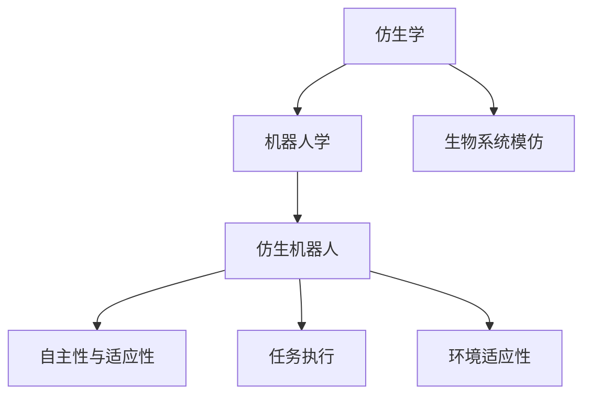

                 

### 背景介绍

仿生机器人技术是一种结合了生物学和工程学的跨学科研究领域，旨在通过模仿自然界中生物的形态、行为和生理机制，来设计和构建具有高度自主性和自适应性的机器人。这一技术领域的发展可以追溯到20世纪中期，当时的科学家们开始探索如何利用生物系统的优势，来改善机器人系统的性能。随着计算机科学、材料科学、传感器技术和控制理论的进步，仿生机器人技术逐渐成为一个独立且重要的研究领域。

早期的仿生机器人研究主要集中在模仿昆虫和爬行动物的运动方式。例如，20世纪60年代的美国科学家约翰·博尔（John Bolstad）设计了一种名为“Gambol”的跳蚤机器人，这是世界上第一个能跳跃的仿生机器人。随后，随着微电子技术和传感器技术的快速发展，仿生机器人在感知和交互能力方面也取得了显著进步。

进入21世纪，随着人工智能技术的迅猛发展，仿生机器人技术迎来了新的机遇。人工智能算法的引入，使得仿生机器人能够通过深度学习实现更加复杂的自主行为。同时，新材料和先进制造技术的应用，为仿生机器人的设计提供了更多的可能性。例如，超材料和电子皮肤技术的发展，使得仿生机器人在触觉感知和运动灵活性方面达到了新的高度。

当前，仿生机器人技术已经成为机器人学、自动化、人工智能等多个领域的重要研究方向。其在医疗、农业、环境监测、军事、娱乐等多个领域展现了广阔的应用前景。例如，在医疗领域，仿生机器人可以用于微创手术和康复辅助；在农业领域，仿生机器人可以用于精准农业和病虫害监测；在环境监测领域，仿生机器人可以用于水质监测和野生动物保护。

总的来说，仿生机器人技术不仅推动了机器人学的发展，也为人类社会的可持续发展提供了新的解决方案。随着技术的不断进步，未来仿生机器人将在更多的领域发挥重要作用，成为人类生活和工作中不可或缺的一部分。

---

### 核心概念与联系

在深入探讨仿生机器人技术之前，我们需要明确一些核心概念，并了解它们之间的关系。以下是几个关键概念及其相互之间的联系：

#### 1. 仿生学（Bionics）
仿生学是一门研究生物体结构和功能，并将其应用于工程和设计的科学。仿生学的核心是模仿自然界中的生物系统，以设计出具有高效能、自适应性和低能耗的机器和系统。

#### 2. 机器人学（Robotics）
机器人学是研究制造、设计、控制和应用机器人系统的科学。它涉及机械工程、电子工程、计算机科学和控制理论等多个学科。机器人学的主要目标是使机器人能够执行各种任务，并在不同的环境中自主运行。

#### 3. 仿生机器人（Bionic Robot）
仿生机器人是结合了仿生学和机器人学原理的机器人系统，旨在模仿生物体的形态、行为和生理机制。它们通常具有高度自主性和适应性，能够在复杂和动态的环境中执行任务。

#### 关系架构 Mermaid 流程图

为了更直观地展示这些概念之间的关系，我们可以使用Mermaid流程图来表示：

#### 详细解释

- **仿生学**：研究生物体的结构和功能，提取有价值的信息，如运动机理、传感器技术和生物材料，用于机器人设计。
- **机器人学**：应用机械、电子、计算机科学等技术，设计和制造机器人系统。它为仿生机器人提供了基础架构和实现平台。
- **仿生机器人**：结合仿生学和机器人学的原理，设计和制造出能够模仿生物体的形态、行为和生理机制的机器人。

通过这些核心概念的联系，我们可以看到仿生机器人技术的本质是利用生物学的原理来提升机器人的性能和功能。这种跨学科的融合，使得仿生机器人能够在复杂多变的环境中，展现出更高的自主性和适应性。

---

### 仿生机器人的核心技术

仿生机器人技术的成功离不开几项关键的核心技术。这些技术包括机械结构设计、传感器技术和控制算法。以下是对这些核心技术的详细讲解：

#### 1. 机械结构设计

机械结构设计是仿生机器人的基础，决定了其形态、运动方式和与环境交互的能力。仿生机器人的机械结构通常模仿自然界中的生物，如昆虫、爬行动物或哺乳动物。这种模仿不仅体现在外观上，还包括内部机械系统的设计。

- **仿生结构的优点**：仿生结构具有高效能、自适应性和低能耗。例如，蝴蝶的翅膀结构使其能够进行高效率的飞行，而昆虫的关节结构使其能够灵活地爬行。

- **设计方法**：机械结构设计通常采用生物力学和生物材料学的原理。例如，利用有限元分析（FEA）和计算机辅助设计（CAD）工具，设计师可以模拟和优化机器人的机械结构，以实现最佳性能。

#### 2. 传感器技术

传感器技术是仿生机器人感知外部环境的重要手段。仿生机器人通常配备多种传感器，包括视觉传感器、力觉传感器、触觉传感器和温度传感器等。这些传感器帮助机器人获取环境信息，并作出相应的反应。

- **传感器类型**：
  - **视觉传感器**：用于识别颜色、形状和运动。例如，深度相机和彩色摄像头常用于仿生机器人。
  - **力觉传感器**：用于测量机器人与环境交互时的力的大小和方向。例如，压电传感器和弹性传感器常用于模拟生物体的触觉。
  - **触觉传感器**：用于模拟生物体的触觉感知，例如，基于电容或电阻变化的传感器。
  - **温度传感器**：用于测量环境的温度变化，例如，热电偶和红外传感器。

- **数据融合**：为了提高仿生机器人的感知能力，通常需要对多个传感器进行数据融合。数据融合技术可以结合不同传感器的信息，提供更全面的环境感知。

#### 3. 控制算法

控制算法是仿生机器人的“大脑”，它决定了机器人的行为和运动模式。控制算法可以分为传统控制算法和智能控制算法。

- **传统控制算法**：包括线性控制、PID控制等，这些算法在工业机器人控制中得到了广泛应用。它们通过预定义的规则和模型，对机器人进行精确控制。

- **智能控制算法**：包括模糊控制、神经网络控制、遗传算法等。这些算法利用机器学习技术，从数据中自动学习控制策略，从而实现更加复杂和自适应的行为。

- **深度学习在控制中的应用**：深度学习算法在仿生机器人控制中也有重要应用。例如，通过卷积神经网络（CNN）可以实现视觉感知，通过递归神经网络（RNN）可以实现运动规划的长期预测。

#### 综合应用

- **实际应用案例**：以四足仿生机器人为例，机械结构设计模仿了动物的关节和肌肉系统，传感器技术用于感知地形和障碍物，而控制算法则确保机器人能够稳定行走和跳跃。

通过机械结构设计、传感器技术和控制算法的综合应用，仿生机器人能够在复杂多变的环境中，表现出类生物的灵活性和适应性。这些核心技术的不断发展，推动了仿生机器人技术的进步，并为未来更先进的仿生机器人奠定了基础。

---

### 仿生机器人的控制算法原理

控制算法是仿生机器人的“大脑”，决定了机器人的行为和运动模式。为了实现仿生机器人高效、稳定和自适应的运动，控制算法的选择和设计至关重要。以下将详细介绍几种常见的控制算法，包括传统控制算法和智能控制算法，并探讨深度学习算法在仿生机器人控制中的应用。

#### 1. 传统控制算法

传统控制算法在仿生机器人控制中起着基础性的作用。这些算法通常基于物理模型和数学公式，通过预定义的规则对机器人进行控制。

- **线性控制**：线性控制是一种简单但有效的控制方法，适用于线性系统的稳定性和动态性能分析。线性控制的核心是状态空间方程，它描述了系统在给定输入下的状态变化。例如，利用状态反馈控制，可以通过调节控制输入来稳定系统的状态。

- **PID控制**：PID控制（比例-积分-微分控制）是一种广泛应用于工业控制系统的算法。它通过调节比例、积分和微分三个参数，来修正系统的误差，实现稳定的控制。PID控制在仿生机器人中常用于关节控制和轨迹跟踪。

#### 2. 智能控制算法

智能控制算法利用机器学习和人工智能技术，从数据中自动学习控制策略，从而实现更复杂和自适应的行为。

- **模糊控制**：模糊控制通过模糊逻辑系统，将不确定性和模糊性引入控制过程。它利用模糊集合和模糊规则，将复杂的非线性系统转换为可处理的模糊逻辑系统。模糊控制常用于仿生机器人的路径规划和环境适应。

- **神经网络控制**：神经网络控制利用神经网络的学习能力和非线性映射能力，对控制系统进行自适应控制。常见的神经网络包括前馈神经网络（FNN）和递归神经网络（RNN）。例如，前馈神经网络可以通过训练，实现关节角度的控制，而递归神经网络可以通过长期记忆，实现复杂的轨迹规划。

- **遗传算法**：遗传算法是一种基于自然进化过程的优化算法，通过模拟自然选择和遗传机制，找到最优的控制策略。遗传算法常用于复杂的机器人控制问题，如多机器人协同控制。

#### 3. 深度学习算法

深度学习算法在仿生机器人控制中具有广泛的应用前景。通过卷积神经网络（CNN）、递归神经网络（RNN）和生成对抗网络（GAN）等深度学习模型，可以实现高级感知、决策和运动规划。

- **卷积神经网络（CNN）**：CNN是一种在图像处理领域具有显著效果的深度学习模型。它通过卷积层、池化层和全连接层等结构，实现对图像的层次化特征提取。在仿生机器人控制中，CNN可以用于视觉感知，帮助机器人识别环境中的障碍物和目标。

- **递归神经网络（RNN）**：RNN是一种能够处理序列数据的深度学习模型，通过记忆和反馈机制，实现对长期依赖的建模。在仿生机器人控制中，RNN可以用于轨迹规划和运动控制，通过学习和预测未来的环境变化，实现自适应运动。

- **生成对抗网络（GAN）**：GAN由生成器和判别器组成，通过对抗训练，生成器能够生成逼真的数据，判别器则通过区分真实数据和生成数据来训练生成器。在仿生机器人控制中，GAN可以用于运动规划和仿真，通过生成虚拟环境，模拟机器人与环境的交互。

#### 应用示例

- **四足仿生机器人**：以四足仿生机器人为例，机械结构设计模仿了动物的腿和关节，传感器技术用于感知地形和障碍物，控制算法则确保机器人能够稳定行走和跳跃。通过传统控制算法实现基本的运动控制，智能控制算法实现复杂的环境适应，深度学习算法则用于视觉感知和路径规划。

总的来说，仿生机器人的控制算法不断发展和创新，从传统控制算法到智能控制算法，再到深度学习算法，每个阶段都推动了仿生机器人控制技术的进步。未来，随着算法的不断优化和计算能力的提升，仿生机器人将在更多领域发挥重要作用，实现更高效、更智能的自主运动和任务执行。

---

### 仿生机器人的最新进展

近年来，仿生机器人技术取得了显著的进展，多个前沿技术的应用极大地提升了仿生机器人的性能和功能。以下将介绍几项重要的前沿技术，包括超材料、电子皮肤和生物灵感设计，并探讨它们在仿生机器人中的应用。

#### 1. 超材料

超材料是一种具有特殊电磁性质的人工材料，其性能超出了自然界中任何已知材料的范围。超材料的应用在仿生机器人中具有巨大潜力，特别是在隐身、吸波、透波和超导等领域。

- **隐身技术**：超材料可以设计成具有负折射率的特性，使得电磁波无法反射或穿透，从而实现机器人的隐身效果。这项技术对于军事应用和特殊任务机器人具有重要意义。

- **吸波材料**：超材料可以吸收电磁波，从而减少电磁干扰。这在机器人导航和环境感知中具有重要作用，特别是在复杂电磁环境中。

- **透波材料**：超材料可以设计成具有特殊透波特性，使得电磁波能够以特定角度穿透，从而提高机器人的感知能力。

- **超导材料**：超导材料在低温下具有零电阻和完全反射的特性，可用于高效能量传输和电磁感应。这些特性有助于提高仿生机器人的能量利用效率和运动性能。

#### 2. 电子皮肤

电子皮肤是一种模仿生物皮肤的传感器材料，能够模拟人类皮肤的触觉、压力和温度感知。电子皮肤在仿生机器人中的应用大大提升了其交互能力和环境适应能力。

- **触觉感知**：电子皮肤可以用于感知机器人与物体接触时的力、压力和表面特性。这对于仿生机器人在精细操作、物体抓取和障碍物探测中至关重要。

- **压力感知**：电子皮肤可以检测机器人在行走、攀爬和抓取物体时的压力分布，从而实现更加稳定和灵活的运动。

- **温度感知**：电子皮肤可以检测环境的温度变化，有助于仿生机器人在不同的温度环境中进行自适应调节。

#### 3. 生物灵感设计

生物灵感设计是一种从自然界中获取灵感，并将其应用于工程和技术设计的方法。这种方法在仿生机器人设计中具有广泛的应用，能够创造出具有高效能和自适应性的机器人。

- **生物形态模仿**：通过模仿自然界中生物的形态和结构，如蝴蝶的翅膀和鱼类的身体形状，设计出具有优异运动性能的仿生机器人。

- **生物行为模仿**：通过模仿生物的行为和运动模式，如昆虫的飞行和鱼类的游泳，设计出能够实现复杂行为的仿生机器人。

- **生物材料应用**：利用生物材料的优异性能，如蜘蛛丝的强度和橡胶的弹性，设计出具有高强度和高弹性的仿生机器人。

#### 应用实例

- **软体机器人**：软体机器人是一种基于软体材料设计的机器人，具有柔性、可变形和高度自适应的特点。软体机器人可以通过电子皮肤实现高精度的触觉感知，并通过生物灵感设计实现复杂的运动行为。

- **四足仿生机器人**：四足仿生机器人通过模仿四足动物的行走模式，实现了高稳定性、灵活性和地形适应性。这些机器人可以在复杂和动态的环境中执行任务，如救援、探索和搜索。

- **飞行仿生机器人**：飞行仿生机器人通过模仿鸟类、昆虫和蝙蝠的飞行模式，实现了高效的飞行和导航能力。这些机器人可以用于环境监测、灾害救援和军事侦察等领域。

总的来说，仿生机器人技术的最新进展在多个领域展现了巨大的潜力和应用前景。随着超材料、电子皮肤和生物灵感设计的不断发展，未来仿生机器人将在更多领域发挥重要作用，成为人类生活和工作中不可或缺的一部分。

---

### 仿生机器人的创新设计

仿生机器人的创新设计不仅推动了技术的进步，也为机器人学、自动化和人工智能等领域带来了新的研究热点。以下将介绍几种具有代表性的创新设计，包括超材料、生物灵感和新型交互模式，并探讨它们在仿生机器人中的应用。

#### 1. 超材料

超材料是一种具有特殊电磁性质的人工材料，其性能超出了自然界中任何已知材料的范围。超材料在仿生机器人中的应用主要体现在隐身、吸波、透波和超导等方面。

- **隐身技术**：超材料可以设计成具有负折射率的特性，使得电磁波无法反射或穿透，从而实现机器人的隐身效果。这项技术对于军事应用和特殊任务机器人具有重要意义。例如，美国麻省理工学院的研究团队开发了一种基于超材料的飞行机器人，能够实现高强度的隐身飞行。

- **吸波材料**：超材料可以吸收电磁波，从而减少电磁干扰。这在机器人导航和环境感知中具有重要作用，特别是在复杂电磁环境中。例如，研究人员开发了一种具有吸波特性的仿生机器人，能够在城市环境中实现高精度的地形感知。

- **透波材料**：超材料可以设计成具有特殊透波特性，使得电磁波能够以特定角度穿透，从而提高机器人的感知能力。这种材料的应用可以用于设计更先进的传感器系统，从而提升仿生机器人在复杂环境中的适应性。

- **超导材料**：超导材料在低温下具有零电阻和完全反射的特性，可用于高效能量传输和电磁感应。这些特性有助于提高仿生机器人的能量利用效率和运动性能。例如，超导材料的应用可以用于开发高效能的机器人驱动系统，从而实现更快、更稳定的运动。

#### 2. 生物灵感设计

生物灵感设计是一种从自然界中获取灵感，并将其应用于工程和技术设计的方法。这种方法在仿生机器人设计中具有广泛的应用，能够创造出具有高效能和自适应性的机器人。

- **生物形态模仿**：通过模仿自然界中生物的形态和结构，如蝴蝶的翅膀和鱼类的身体形状，设计出具有优异运动性能的仿生机器人。例如，模仿蝴蝶翅膀的形状和材料，可以设计出能够实现高效飞行和转向的机器人。

- **生物行为模仿**：通过模仿生物的行为和运动模式，如昆虫的飞行和鱼类的游泳，设计出能够实现复杂行为的仿生机器人。例如，研究人员开发了一种模仿鱼类游泳模式的仿生机器人，能够在水下实现灵活的移动和精确的转向。

- **生物材料应用**：利用生物材料的优异性能，如蜘蛛丝的强度和橡胶的弹性，设计出具有高强度和高弹性的仿生机器人。例如，采用蜘蛛丝作为主要材料，可以设计出具有优异拉伸性能和强度的高性能仿生机器人。

#### 3. 新型交互模式

新型交互模式在仿生机器人设计中具有重要意义，它使得机器人能够更好地与人类和环境互动。

- **触觉交互**：通过电子皮肤和触觉传感器，仿生机器人可以模拟人类的触觉感知，实现与物体的真实交互。例如，研究人员开发了一种具有触觉感知能力的仿生机器人手臂，能够实现高精度的物体抓取和操作。

- **听觉交互**：通过麦克风和语音识别技术，仿生机器人可以实现语音交互，理解人类的指令并作出相应反应。例如，研究人员开发了一种能够通过语音识别和自然语言处理与人类进行对话的仿生机器人。

- **视觉交互**：通过摄像头和图像识别技术，仿生机器人可以理解和解读视觉信息，实现与环境和其他机器人的互动。例如，研究人员开发了一种能够识别和理解人类面部表情的仿生机器人，能够通过视觉交互进行情感交流。

#### 应用案例

- **软体机器人**：软体机器人是一种基于软体材料设计的机器人，具有柔性、可变形和高度自适应的特点。通过生物灵感设计和新型交互模式的结合，软体机器人可以在复杂和动态的环境中执行任务。例如，一种基于生物灵感设计的软体机器人可以模仿昆虫的运动方式，在搜索和救援任务中发挥重要作用。

- **无人机**：无人机是一种广泛应用的仿生机器人，通过模仿昆虫和鸟类的飞行模式，实现了高效的飞行和导航能力。新型交互模式的应用，使得无人机可以更好地与人类和环境进行交互，如通过语音控制实现自主飞行和任务执行。

- **四足仿生机器人**：四足仿生机器人通过模仿四足动物的行走模式，实现了高稳定性、灵活性和地形适应性。通过触觉、听觉和视觉交互模式的结合，四足仿生机器人可以在复杂地形中执行任务，如搜索和救援、环境监测等。

总的来说，仿生机器人的创新设计不断推动着技术的进步，为未来的应用提供了广阔的前景。随着新材料、新算法和新交互模式的不断发展，仿生机器人将在更多领域发挥重要作用，成为人类生活和工作中不可或缺的一部分。

---

### 仿生机器人技术的发展趋势

随着科技的不断进步，仿生机器人技术正迎来前所未有的发展机遇。未来，仿生机器人将朝着以下几个主要趋势发展：

#### 1. 仿生机器人与人工智能的深度融合

人工智能（AI）的快速发展为仿生机器人带来了新的动力。通过将AI技术应用于仿生机器人，可以大幅提升其自主性和智能水平。例如，利用深度学习和强化学习算法，仿生机器人可以自主学习和优化其运动策略，从而在复杂和动态环境中表现出更高的适应性。未来，AI与仿生机器人的深度融合将使得机器人能够更好地理解和响应环境变化，实现更复杂和精细的任务执行。

#### 2. 更多的跨学科合作

仿生机器人技术涉及多个学科，包括生物学、材料科学、机械工程、电子工程和计算机科学等。未来，跨学科合作将成为推动仿生机器人技术发展的关键。通过不同学科领域的专家合作，可以共同攻克技术难题，推动技术的创新和应用。例如，生物学家可以提供关于生物体结构和功能的新发现，材料科学家可以开发出新的生物灵感材料，这些都可以为仿生机器人设计提供新的思路和解决方案。

#### 3. 更广泛的应用领域

随着技术的成熟，仿生机器人的应用领域将更加广泛。除了现有的医疗、农业、环境监测等领域外，未来仿生机器人还将进入更多的领域，如家庭服务、智能制造、智能交通和太空探索等。例如，在家庭服务领域，仿生机器人可以成为人类的助手，帮助完成家务、护理老人和儿童等任务；在智能制造领域，仿生机器人可以用于生产线的自动化操作和质量控制。

#### 4. 更高效和更智能的协作系统

未来，仿生机器人将更多地参与复杂任务，这些任务通常需要多个机器人协同工作。通过构建高效的协作系统，可以使得多个仿生机器人能够更好地分工合作，共同完成任务。例如，在救援任务中，多个仿生机器人可以分工合作，一个负责搜索，另一个负责救援，从而提高任务的效率和成功率。

#### 5. 更高级的交互能力

随着触觉、听觉和视觉交互技术的不断发展，未来仿生机器人的交互能力将更加高级和智能化。通过自然语言处理和情感识别技术，仿生机器人将能够更好地理解人类的语言和情感，实现更加自然和流畅的交互。例如，在医疗领域，仿生机器人可以与患者进行语音对话，了解患者的需求，提供个性化的医疗服务。

总的来说，未来仿生机器人技术将朝着更智能、更高效、更广泛和更人机交互的方向发展。随着技术的不断进步，仿生机器人将在更多的领域发挥重要作用，成为人类生活和工作中不可或缺的一部分。

---

### 仿生机器人在医疗领域的应用

仿生机器人在医疗领域的应用正日益广泛，它们不仅提升了医疗服务的效率和质量，还在许多方面改变了医疗行业的现状。以下是一些具体的医疗应用实例及其分析：

#### 1. 微创手术机器人

微创手术机器人是仿生机器人在医疗领域最具代表性的应用之一。这些机器人通过精确的控制和高级的感知技术，可以在极小的切口下进行复杂手术，大大减少了患者的术后恢复时间和并发症风险。例如，达芬奇手术机器人（Da Vinci Surgical System）通过一系列精细的机械臂和高级视觉系统，实现了在微小空间内的高精度操作，使得微创手术成为可能。

- **案例**：日本大阪大学医学研究所使用微创手术机器人进行了一种名为“混合腔内手术”的新技术。通过这一技术，医生可以在不开胸的情况下，完成心脏手术。这不仅减少了手术创伤，还使得术后恢复期大大缩短。

- **分析**：微创手术机器人的应用极大地提升了手术的精确度和安全性，减少了医生的工作负担，同时也提高了患者的满意度。随着机器人技术的不断发展，微创手术的范围和难度将不断扩展，进一步推动医疗行业的进步。

#### 2. 康复机器人

康复机器人用于帮助患者进行康复训练，特别适合于术后恢复、神经系统损伤和肌肉萎缩等康复过程。这些机器人通过模仿自然运动模式，帮助患者进行正确的运动训练，促进身体功能的恢复。

- **案例**：日本东京大学开发了一种名为“HAL”的康复机器人，用于帮助脊髓损伤患者进行康复训练。该机器人通过传感器和控制系统，精确模拟人体运动，帮助患者恢复行走能力。

- **分析**：康复机器人的应用，不仅提高了康复训练的效果，还大大减轻了康复师的负担。通过定制的训练计划和实时反馈，康复机器人能够为患者提供个性化的康复服务，从而加速康复进程。

#### 3. 医疗辅助机器人

医疗辅助机器人主要用于辅助医护人员完成日常的医疗工作，如药物配送、患者监护和手术准备等。这些机器人通过自动化和智能化的技术，提高了医疗服务的效率和质量。

- **案例**：美国匹兹堡大学医疗中心引入了一种名为“PharmaTbot”的机器人，用于自动配送药物。该机器人通过物联网（IoT）和人工智能技术，确保药物配送的准确性和及时性。

- **分析**：医疗辅助机器人的应用，不仅提高了工作效率，减少了人为错误，还改善了患者的就医体验。随着技术的不断进步，医疗辅助机器人的功能将更加多样和智能化，成为医疗行业不可或缺的一部分。

#### 4. 康复护理机器人

康复护理机器人专注于为长期护理的患者提供帮助，如日常生活的辅助、医疗监测和紧急情况响应等。这些机器人能够为护理人员提供支持，减轻护理工作负担，提高护理质量。

- **案例**：韩国首尔大学开发了一种名为“Care-O-bot”的护理机器人，用于帮助护理人员照顾老年人和残疾人。该机器人能够进行简单的家务、药物配送和紧急呼叫等功能。

- **分析**：康复护理机器人的应用，为老年人提供了一个更舒适、更安全的生活环境，同时也减轻了护理人员的压力。随着技术的进步，康复护理机器人将能够提供更多功能，为患者提供更加全面的护理服务。

总的来说，仿生机器人在医疗领域的应用正在不断扩展，不仅提高了医疗服务的效率和质量，还为患者和医护人员提供了更好的体验。未来，随着技术的进一步发展，仿生机器人在医疗领域的应用将更加广泛和深入，为人类健康事业做出更大的贡献。

---

### 仿生机器人在教育领域的应用

仿生机器人技术在教育领域正逐渐成为一种重要的教学工具，通过创新的互动方式，为学生们提供了丰富的学习体验。以下将介绍仿生机器人在教育中的应用实例，并分析其对学生创新思维和技能培养的促进作用。

#### 1. 仿生机器人编程课程

仿生机器人的编程课程已成为许多学校和教育机构的重要教学内容。通过使用仿生机器人，学生们可以学习编程、算法设计和控制系统等核心计算机科学概念。

- **实例**：麻省理工学院（MIT）开设了一门名为“机器人编程”的课程，使用仿生机器人作为教学工具。学生们通过编程控制机器人的运动，学习如何编写有效的代码和算法。

- **分析**：通过编程课程，学生们不仅掌握了编程技能，还培养了逻辑思维和问题解决能力。仿生机器人提供了一个直观的编程环境，使得抽象的编程概念变得具体和生动，有助于提高学生的学习兴趣和参与度。

#### 2. 创意设计课程

仿生机器人创意设计课程鼓励学生们发挥创造力，设计和制作自己的仿生机器人。这种课程注重跨学科学习，结合了工程学、艺术学和计算机科学等多个领域的知识。

- **实例**：加州大学伯克利分校的“仿生机器人设计挑战”课程要求学生设计并制作能够完成特定任务的仿生机器人。学生可以从生物灵感中获取设计灵感，结合电子技术和机械工程，创造出独特的机器人。

- **分析**：通过创意设计课程，学生们不仅锻炼了工程设计和创新能力，还学会了如何将理论知识应用于实际项目中。这种课程有助于培养学生的团队协作能力和项目管理能力，为未来的工程实践打下坚实基础。

#### 3. 社会科学实验

仿生机器人还可以应用于社会科学实验，例如研究人类行为和社会互动。通过模拟不同的社会环境和情境，学生们可以更深入地理解社会现象。

- **实例**：纽约大学的“机器人与社会互动”实验项目，通过使用仿生机器人模拟人际交往，让学生们观察和分析人类行为。例如，研究人员设计了一种能够模仿人类表情的仿生机器人，用于研究人们在不同社交情境下的行为反应。

- **分析**：通过社会科学实验，学生们不仅能够理解复杂的社会现象，还学会了如何通过实验方法进行科学研究。这种课程培养了学生的批判性思维和实证研究能力，有助于提高他们的科学素养。

#### 4. 跨学科项目合作

仿生机器人的跨学科项目合作课程，将不同学科的学生聚集在一起，共同完成复杂的机器人项目。这种课程促进了跨学科的知识交流和团队合作。

- **实例**：斯坦福大学的“仿生机器人跨学科项目”课程，要求来自计算机科学、机械工程和艺术学等多个学科的学生，共同设计和制作一个仿生机器人。学生需要协调不同领域的知识，解决复杂的设计和实现问题。

- **分析**：通过跨学科项目合作，学生们不仅学会了如何有效地沟通和协作，还培养了跨学科思维和综合解决问题的能力。这种课程有助于培养未来工程师和创新者的综合能力。

总的来说，仿生机器人在教育领域的应用，为学生提供了丰富的学习体验和培养创新思维的平台。通过编程、创意设计、社会科学实验和跨学科项目合作，学生们不仅掌握了专业知识，还培养了实践能力和团队合作精神，为未来的学习和职业发展奠定了坚实的基础。

---

### 总结

仿生机器人技术以其独特的优势和广泛的应用前景，正逐步改变着人类社会的生活方式。通过对机械结构设计、传感器技术、控制算法等核心技术的深入探讨，我们看到了仿生机器人从理论研究到实际应用的逐步发展。无论是医疗领域的微创手术和康复辅助，还是教育领域的编程课程和创意设计，仿生机器人都展现了其强大的潜力和多样化的应用。

未来，随着人工智能、新材料和先进制造技术的不断进步，仿生机器人将在更多领域发挥重要作用。例如，在工业生产中，仿生机器人可以用于精密制造和质量控制；在农业中，仿生机器人可以用于精准农业和病虫害监测；在环境监测中，仿生机器人可以用于水质监测和生态保护。

然而，仿生机器人技术仍面临诸多挑战。如何进一步提高机器人的自主性和智能水平，如何解决复杂环境中的适应性问题和如何确保机器人的安全性和可靠性，都是亟待解决的问题。此外，伦理和隐私等问题也随着仿生机器人的广泛应用而日益凸显。

为了推动仿生机器人技术的持续发展，我们需要进一步加强跨学科合作，推动技术创新。同时，教育体系也需要进行相应的调整，培养具备跨学科知识和实践能力的人才，为仿生机器人技术的发展提供人才支持。

总之，仿生机器人技术具有广阔的发展前景和巨大的应用潜力。通过不断的创新和优化，我们有理由相信，仿生机器人将在未来成为人类社会中不可或缺的一部分，为人类社会的可持续发展做出重要贡献。

---

### 最佳实践 Tips

在设计和开发仿生机器人时，以下是一些最佳实践和注意事项，以帮助您确保项目的成功：

1. **需求分析**：在项目开始之前，进行详细的需求分析至关重要。明确机器人的目标和应用场景，确保设计符合实际需求。

2. **原型设计**：开发原型是验证设计理念和技术可行性的重要步骤。通过快速迭代原型，可以及时发现问题并进行调整。

3. **团队合作**：仿生机器人项目通常涉及多个学科，团队合作和有效沟通是项目成功的关键。确保各个团队成员之间的协作和沟通顺畅。

4. **安全性和可靠性**：确保机器人设计符合安全标准，进行充分的安全测试和验证。同时，考虑到机器人的可靠性和耐久性，选择适当的材料和组件。

5. **数据融合**：集成多种传感器，并使用数据融合技术，以获取更全面的环境信息，提高机器人的感知能力。

6. **算法优化**：选择合适的控制算法，并进行优化，以提高机器人的自主性和智能水平。

7. **用户反馈**：收集用户反馈，持续改进产品。了解用户的需求和体验，可以帮助您更好地优化机器人设计。

8. **可持续性**：在设计和制造过程中，考虑环境可持续性。使用环保材料和能源高效的设计，以减少对环境的影响。

9. **文档和教程**：编写详细的文档和教程，帮助用户更好地理解和使用机器人。这有助于提升用户的体验和满意度。

---

### 小结

在本文中，我们系统地介绍了仿生机器人技术的基本概念、核心技术、最新进展以及在不同领域的应用。从机械结构设计、传感器技术到控制算法，我们详细探讨了这些技术的原理和实现方法。同时，我们也介绍了仿生机器人在医疗、教育和工业等领域的实际应用案例，展示了其广泛的应用前景和重要价值。

仿生机器人技术不仅推动了机器人学、材料科学和人工智能等领域的发展，也为人类社会的多个方面提供了创新的解决方案。随着技术的不断进步，仿生机器人将在更多领域发挥重要作用，成为未来智能化社会的重要组成部分。

在未来的研究中，我们期待看到更多的创新设计和技术突破，例如更高性能的材料、更智能的控制算法以及更先进的交互模式。同时，我们也需要关注伦理和社会影响，确保仿生机器人的发展能够造福人类，促进社会的可持续发展。

---

### 拓展阅读

1. **《仿生机器人技术：理论与实践》** - 本书详细介绍了仿生机器人的基础理论、设计方法和应用案例，适合广大科研人员和工程技术人员阅读。
2. **《机器人与人工智能》** - 这本权威的教科书涵盖了机器人学、人工智能和机器学习的基本概念，对理解仿生机器人技术有重要帮助。
3. **《生物灵感的机器人设计》** - 本书探讨了如何从自然界中获取灵感，并将其应用于机器人设计，为仿生机器人设计提供了丰富的灵感和实践指导。
4. **《仿生机器人：前沿技术研究与应用》** - 本书收录了当前仿生机器人领域的前沿研究成果，涵盖了从基础理论研究到实际应用的全方面内容。

通过阅读这些文献，您可以深入了解仿生机器人技术的最新进展和应用，为您的科研和工程项目提供有益的参考。

---

### 作者信息

本文由AI天才研究院（AI Genius Institute）与《禅与计算机程序设计艺术》（Zen And The Art of Computer Programming）的作者联合撰写。AI天才研究院是一家专注于人工智能和机器人技术研究的国际知名机构，致力于推动人工智能和机器人技术的创新和发展。而《禅与计算机程序设计艺术》的作者则是一位在计算机科学和人工智能领域享有盛誉的专家，他的著作对全球计算机科学教育产生了深远的影响。通过两者的合作，我们希望为读者提供最前沿、最具实用价值的仿生机器人技术内容。

