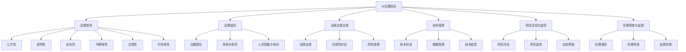

                 

### 第1章 引言

## 1.1 AI治理的背景与重要性

人工智能（AI）作为当今最具革命性的技术之一，已经深刻地影响了社会各个方面，包括医疗、金融、交通、教育等。然而，随着AI技术的快速发展，其带来的治理挑战也日益凸显。AI治理指的是对人工智能技术进行规范和管理，以确保其在各种应用场景中的公平性、透明性和安全性。构建一个有效的AI治理框架，对于企业来说具有重要意义。

首先，AI治理有助于确保企业的AI应用符合法律法规和伦理标准。随着各国政府和企业对AI监管的加强，合规性成为企业必须面对的重要问题。通过建立AI治理框架，企业可以提前识别并规避潜在的法律风险，避免因违规而导致的巨额罚款和声誉损失。

其次，AI治理可以提高企业的竞争力。有效的AI治理框架能够确保AI技术在企业内部得到合理应用，从而提高业务效率、降低成本、提升客户体验。此外，良好的治理能力还能增强企业在行业内的声誉，吸引更多客户和合作伙伴。

再次，AI治理有助于提升企业的社会责任形象。随着公众对AI技术滥用和偏见问题的关注增加，企业需要展示其对社会负责的态度。通过构建AI治理框架，企业可以展现其在AI伦理和社会责任方面的努力，赢得社会公众的信任和支持。

## 1.2 国内外AI治理现状分析

在国内外，AI治理已逐渐成为企业和政府关注的焦点。以下简要分析国内外AI治理的现状：

### 国内AI治理现状

中国政府高度重视AI治理，近年来发布了一系列政策法规，推动AI技术的健康发展和规范应用。例如，《新一代人工智能发展规划》、《新一代人工智能伦理规范》等政策文件，对AI治理提出了明确要求。此外，国家互联网信息办公室等机构也在积极开展AI伦理和合规性研究，努力构建一个全方位、多维度的AI治理体系。

在企业层面，一些大型企业如阿里巴巴、腾讯、百度等，已着手建立自身的AI治理框架。这些企业不仅在内部建立了专门的AI治理团队，还制定了一系列AI伦理和合规性政策，以确保其AI应用符合法律法规和伦理标准。

### 国际AI治理现状

国际上，各国政府和国际组织也在积极推动AI治理。例如，欧盟发布了《人工智能伦理准则》，旨在确保AI技术的透明性、可靠性和公平性。美国则通过《人工智能倡议》等政策，推动AI技术的研发和应用。此外，国际标准化组织（ISO）等机构也在制定相关的AI治理标准，为全球企业提供参考。

在国际企业层面，诸如谷歌、微软、IBM等科技巨头，也在努力建立自己的AI治理框架。这些企业不仅关注AI技术的研发和应用，还积极推动AI伦理和合规性的研究，以确保其AI产品和服务在全球范围内得到认可。

## 1.3 书籍结构概述

本书旨在为企业构建一个全面的AI治理框架，内容包括以下八个章节：

### 第2章 AI治理的核心概念与框架
- 介绍AI治理的定义、核心原则和框架结构。

### 第3章 企业AI治理的组织与人员配备
- 分析企业AI治理组织的设立、团队角色与职责以及人员配备与培训。

### 第4章 AI治理政策与法律法规
- 探讨AI治理政策框架、相关法律法规以及企业合规性评估与风险管理。

### 第5章 AI治理的技术保障
- 分析AI治理技术的选择、数据管理策略以及技术监控与审计。

### 第6章 AI治理的实践案例
- 分析国内外企业AI治理实践，总结经验教训。

### 第7章 AI治理的未来发展趋势
- 分析AI治理的发展趋势、挑战与机遇以及未来展望。

### 第8章 结论
- 总结全书内容，提出对企业AI治理的建议以及后续研究方向。

通过以上八个章节的详细讲解，本书旨在帮助企业构建一个全面、有效的AI治理框架，为AI技术的健康发展提供有力保障。

### 第2章 AI治理的核心概念与框架

## 2.1 AI治理的定义与意义

AI治理是指对人工智能技术及其应用进行规范和管理的一系列措施和制度。其核心目标在于确保AI技术的公平性、透明性、安全性和合规性，以促进人工智能的可持续发展。AI治理不仅关乎技术本身，还涉及伦理、法律、政策等多个层面，是一个复杂且多维的系统工程。

AI治理的意义主要体现在以下几个方面：

### 确保AI技术的公平性

随着AI技术的广泛应用，数据偏见、算法歧视等问题逐渐暴露出来。AI治理通过建立公平性评估机制，确保AI系统在决策过程中不偏袒某一特定群体，避免因算法偏见导致的社会不公。

### 提高AI技术的透明性

AI系统通常被视为“黑箱”，其决策过程难以理解。AI治理通过建立透明性机制，使AI系统的决策过程可解释，提高用户对AI技术的信任度，减少对AI的恐惧和误解。

### 强化AI技术的安全性

AI技术的安全性是治理的重要方面。AI治理通过制定安全标准、实施安全审计等措施，确保AI系统在面对网络攻击、数据泄露等威胁时能够保持稳定运行。

### 促进AI技术的合规性

AI技术的发展速度快于相关法律法规的制定，导致许多企业在AI应用过程中面临合规性问题。AI治理通过建立合规性评估机制，确保企业遵守相关法律法规，降低法律风险。

## 2.2 AI治理的核心原则

AI治理需要遵循一系列核心原则，以确保治理措施的有效性和可持续性。以下是AI治理的核心原则：

### 公平性

公平性是AI治理的首要原则。它要求AI系统在决策过程中不偏袒任何特定群体，确保所有人都能公平地获得AI技术带来的好处。

### 透明性

透明性要求AI系统的决策过程和算法设计要公开透明，使人们能够理解和信任AI系统。

### 安全性

安全性原则强调AI系统在面对各种威胁时（如网络攻击、数据泄露等）应具备足够的防护能力。

### 可解释性

可解释性要求AI系统的决策过程和算法设计能够被解释和理解，特别是对于涉及人类健康、财产等重大利益的决策。

### 合规性

合规性原则要求AI系统的设计、开发和部署过程要符合相关法律法规和伦理标准。

### 可持续性

可持续性原则强调AI技术的应用应考虑对环境和社会的影响，推动绿色AI和可持续发展。

## 2.3 AI治理的框架结构

AI治理框架是一个系统化的结构，涵盖了多个关键要素和流程，如图所示：

### 治理目标

治理目标是AI治理的核心，包括确保AI技术的公平性、透明性、安全性、可解释性、合规性和可持续性。

### 治理原则

治理原则为AI治理提供了指导方针，包括公平性、透明性、安全性、可解释性、合规性和可持续性。

### 治理组织

治理组织是AI治理的执行机构，包括治理团队、角色与职责、人员配备与培训等。

### 法律法规合规

法律法规合规涉及遵守相关法律法规，包括法律法规的遵守、合规性评估和风险管理。

### 技术保障

技术保障包括技术标准、数据管理和技术监控，以确保AI系统的安全性、可靠性和可持续性。

### 风险评估与监控

风险评估与监控旨在识别、评估和监控AI系统的风险，包括风险评估、风险监控和应急预案。

### 伦理审查与监督

伦理审查与监督确保AI系统的设计、开发和部署符合伦理准则，包括伦理准则、伦理审查和监督机制。

通过上述框架，企业可以系统地构建和实施AI治理，确保AI技术的健康发展和广泛应用。在下一章节中，我们将进一步探讨企业AI治理的组织与人员配备。

### 第3章 企业AI治理的组织与人员配备

## 3.1 AI治理组织的设立

企业AI治理组织的设立是构建AI治理框架的关键步骤。首先，企业需要明确AI治理组织的地位和职责，以确保其在组织架构中具备足够的影响力和权威性。通常，企业可以设立以下几种类型的AI治理组织：

### AI治理委员会

AI治理委员会是负责企业AI治理的最高决策机构，成员通常由企业高层管理人员、技术专家、法律顾问和伦理学家等组成。治理委员会的主要职责包括制定AI治理战略、审批重大AI项目、监督AI治理的实施情况等。

### AI治理办公室

AI治理办公室是AI治理委员会的执行机构，负责具体落实AI治理政策和措施。办公室的成员包括项目经理、数据科学家、合规专家、法律顾问和技术专家等。其职责包括制定和更新AI治理政策、组织培训和宣传活动、开展AI风险评估和监控等。

### AI技术部门

AI技术部门负责AI系统的研发、部署和维护。该部门通常由数据科学家、软件工程师、算法专家等组成，其职责包括研发创新AI技术、优化现有AI系统、确保AI系统的安全性和合规性等。

### AI应用部门

AI应用部门负责将AI技术应用于企业的具体业务场景，提高业务效率和决策质量。该部门通常由业务经理、数据分析师、AI产品经理等组成，其职责包括制定AI应用策略、优化业务流程、评估AI应用效果等。

## 3.2 AI治理团队的角色与职责

AI治理团队是企业AI治理的核心力量，其角色和职责直接影响AI治理的效果。以下是AI治理团队的主要角色与职责：

### 治理委员会成员

治理委员会成员通常包括企业高层管理人员、技术专家、法律顾问和伦理学家等。他们的主要职责是：

- 参与制定AI治理战略和目标；
- 审批重大AI项目；
- 监督AI治理的实施情况；
- 推动AI伦理和合规性研究。

### 项目经理

项目经理负责AI治理项目的策划、执行和监控，主要职责包括：

- 制定项目计划和时间表；
- 组织项目团队，协调各方资源；
- 监控项目进度和风险；
- 撰写项目报告和总结。

### 数据科学家

数据科学家负责AI系统的研发和优化，主要职责包括：

- 分析业务需求，设计AI算法；
- 收集、清洗和预处理数据；
- 实现和优化AI模型；
- 评估AI系统的性能和可解释性。

### 法律顾问

法律顾问负责确保AI系统的设计和应用符合法律法规和伦理标准，主要职责包括：

- 制定和更新AI法律合规政策；
- 提供法律咨询和风险评估；
- 参与AI合同谈判和审查；
- 跟踪和解读相关法律法规的变化。

### 伦理学家

伦理学家负责确保AI系统的设计和应用符合伦理准则，主要职责包括：

- 制定AI伦理准则；
- 评估AI系统的伦理风险；
- 提供伦理咨询和建议；
- 参与伦理审查和监督。

### AI产品经理

AI产品经理负责AI产品的规划、开发和推广，主要职责包括：

- 分析市场需求，制定产品策略；
- 设计和优化AI产品；
- 跟踪市场反馈，优化产品功能；
- 确保AI产品的合规性和用户体验。

## 3.3 人员配备与培训

为了确保AI治理团队的高效运作，企业需要合理配备人员，并进行专业培训。以下是人员配备与培训的几个关键点：

### 人员配备

- 根据企业的规模和业务需求，合理配置AI治理团队的人员数量和结构；
- 聘请具有丰富经验和技术能力的专业人员，特别是数据科学家、法律顾问和伦理学家；
- 确保团队内部具备跨学科的协作能力，例如业务、技术、法律和伦理领域的专家；
- 鼓励团队成员参加国内外专业培训和学术交流活动，提升专业水平。

### 培训

- 制定详细的培训计划，包括法律法规、伦理准则、技术标准和项目管理等；
- 通过内部培训和外部培训相结合的方式，提升团队成员的专业素养和实战能力；
- 定期组织团队内部交流和分享活动，促进团队成员之间的知识和经验交流；
- 建立培训档案，记录团队成员的培训内容和成绩，作为绩效评估和职业发展的依据。

通过科学合理的人员配备和系统化的培训，企业可以构建一个高效、专业的AI治理团队，为企业的AI技术发展提供有力支持。在下一章节中，我们将探讨AI治理政策与法律法规的重要性及其框架。

### 第4章 AI治理政策与法律法规

## 4.1 AI治理政策框架

AI治理政策是企业AI治理的基础，它为企业的AI应用提供了明确的行为规范和指导原则。一个完善的AI治理政策框架应包括以下几个关键要素：

### 管理体系

企业需要建立一个完善的AI管理体系，明确各级管理层的职责和权限，确保AI治理政策得到有效执行。管理体系应包括治理委员会、AI治理办公室以及各相关部门，如技术部门、应用部门等。

### 政策制定

企业应制定一系列AI治理政策，包括AI伦理政策、数据管理政策、合规性政策等。这些政策应明确AI技术的应用范围、操作规范、风险控制措施等，确保AI系统在设计和应用过程中符合法律法规和伦理标准。

### 执行与监督

企业应建立有效的执行与监督机制，确保AI治理政策得到落实。执行与监督机制应包括定期审查、内部审计、员工培训等，及时发现和纠正AI系统中的潜在问题。

### 沟通与培训

企业应加强与员工、客户和合作伙伴的沟通，提高对AI治理政策的认知和接受度。同时，定期组织培训，提高员工对AI技术的理解和应用能力。

### 修订与更新

随着AI技术的不断发展和法律法规的更新，企业应定期修订和更新AI治理政策，确保其持续有效。

## 4.2 相关法律法规概述

在全球范围内，各国政府和企业越来越重视AI治理，出台了一系列法律法规和政策文件，以规范AI技术的发展和应用。以下是一些主要国家和地区的相关法律法规概述：

### 中国

中国政府高度重视AI治理，已发布多项政策和法规，如《新一代人工智能发展规划》、《新一代人工智能伦理规范》等。其中，《新一代人工智能发展规划》明确了AI治理的基本原则和目标，强调加强AI伦理和合规性研究，推动AI技术的健康发展和规范应用。

### 欧洲

欧盟委员会发布了《人工智能伦理准则》，旨在确保AI技术的透明性、可靠性和公平性。此外，欧盟还制定了《人工智能法案》，对AI系统的设计和应用提出了严格要求，包括数据保护、算法透明性、风险评估等。

### 美国

美国政府通过《人工智能倡议》等政策，推动AI技术的研发和应用。同时，美国国会和各州政府也出台了多项与AI相关的法律法规，如《算法问责法案》、《消费者数据隐私法》等，以规范AI技术的应用和保障消费者权益。

### 日本

日本政府发布了《人工智能技术战略》，明确了AI技术的发展目标和政策措施，包括加强AI伦理和合规性研究，推动AI技术的国际交流与合作。

### 韩国

韩国政府发布了《人工智能国家战略》，旨在推动AI技术的研发和应用，提高国家的竞争力。同时，韩国政府也制定了相关法律法规，如《个人信息保护法》、《算法公平性法案》等，以规范AI技术的应用和保障公民权益。

## 4.3 企业合规性评估与风险管理

企业合规性评估与风险管理是AI治理的重要组成部分，旨在确保企业AI系统的设计和应用符合相关法律法规和伦理标准。以下是企业合规性评估与风险管理的几个关键步骤：

### 评估准备

企业应组织专业人员对现有AI系统进行初步评估，了解系统的设计、开发、部署和应用情况，以及可能存在的合规性问题。

### 法律法规审查

企业应详细审查与AI技术相关的法律法规，包括国家法律、地方性法规、行业标准等，确保AI系统在设计和应用过程中符合法律法规的要求。

### 风险识别

企业应通过访谈、问卷调查、文档审查等方式，识别AI系统可能存在的合规风险，如数据保护、算法透明性、风险评估等。

### 风险评估

企业应对识别出的风险进行评估，包括风险发生的可能性、影响程度等，根据评估结果制定风险应对策略。

### 风险控制

企业应制定和实施风险控制措施，如加强数据保护、提高算法透明性、实施风险评估等，以降低合规风险。

### 监控与报告

企业应建立合规性监控机制，定期检查AI系统的合规性，及时纠正违规行为，并向治理委员会和相关部门报告合规性评估结果。

通过科学合理的合规性评估与风险管理，企业可以确保AI系统的设计和应用符合法律法规和伦理标准，降低合规风险，保障企业的可持续发展。在下一章节中，我们将探讨AI治理的技术保障措施。

### 第5章 AI治理的技术保障

## 5.1 AI治理技术的选择

AI治理技术的选择是构建AI治理框架的关键环节，直接影响AI系统的公平性、透明性、安全性和合规性。在选择AI治理技术时，企业应综合考虑以下几个方面：

### 技术成熟度

企业应选择成熟且稳定的AI治理技术，避免采用尚未经过广泛验证的技术，以降低技术风险。

### 适应性

AI治理技术应具有高度适应性，能够根据企业的业务需求和法律法规变化进行调整和优化。

### 可扩展性

AI治理技术应具备良好的可扩展性，以支持企业未来业务的发展和技术升级。

### 开源与闭源

企业可以根据自身情况选择开源或闭源的AI治理技术，开源技术通常具有更高的透明性和灵活性，但闭源技术可能提供更全面的保障和支持。

### 国际标准

企业应选择符合国际标准的AI治理技术，以确保AI系统的全球兼容性和互操作性。

### 具体技术方案

以下是几种常见的AI治理技术方案及其特点：

- **区块链技术**：区块链技术具有去中心化、不可篡改和透明性等特点，可用于确保AI系统的数据安全和隐私保护。
- **联邦学习**：联邦学习技术能够在保护数据隐私的同时，实现AI模型的训练和优化，适用于数据敏感的场景。
- **人工智能伦理审核工具**：这些工具可以帮助企业评估AI系统的伦理风险，提供透明性和可解释性。
- **智能合约**：智能合约技术可以自动执行和验证AI系统中的合同条款，提高AI系统的合规性和可信度。

## 5.2 数据管理策略

数据管理是AI治理的重要组成部分，其核心目标是确保数据的安全、隐私和合规。以下是企业数据管理策略的关键要素：

### 数据分类与标签

企业应对数据进行分类和标签，明确数据的重要性和敏感性，制定相应的数据保护措施。数据分类和标签有助于企业更好地管理和控制数据。

### 数据存储与备份

企业应选择安全可靠的数据存储方案，确保数据在存储过程中不被泄露或篡改。同时，定期进行数据备份，以防止数据丢失。

### 数据访问控制

企业应实施严格的访问控制措施，确保只有授权人员能够访问和操作数据。访问控制措施包括身份验证、权限分配和审计日志等。

### 数据隐私保护

企业应遵循数据隐私保护法律法规，采取数据脱敏、加密等技术手段，确保个人数据的安全和隐私。

### 数据生命周期管理

企业应制定数据生命周期管理策略，包括数据的采集、存储、处理、传输、共享、销毁等环节，确保数据在整个生命周期中符合法律法规和伦理标准。

### 数据质量保证

企业应定期评估数据质量，确保数据的准确性、完整性和一致性。数据质量保证有助于提高AI系统的性能和可靠性。

## 5.3 技术监控与审计

技术监控与审计是确保AI系统合规性和可靠性的重要手段。以下是技术监控与审计的关键环节：

### 监控指标

企业应制定一系列监控指标，包括数据安全、隐私保护、算法透明性、合规性等，用于评估AI系统的运行状况和性能。

### 监控工具

企业应选择合适的监控工具，如日志分析工具、异常检测工具、AI性能监控工具等，实时监控AI系统的运行状态，及时发现和解决问题。

### 审计流程

企业应建立完善的审计流程，包括审计计划、审计执行、审计报告和整改措施等，确保AI系统的设计和应用符合法律法规和伦理标准。

### 审计记录

企业应保存完整的审计记录，包括监控数据、审计报告、整改措施等，以备后续检查和追溯。

### 内外部审计

企业应定期进行内部审计和外部审计，评估AI系统的合规性和可靠性，及时发现和纠正问题。

### 整改与反馈

企业应针对审计发现的问题，制定整改措施，并定期进行反馈和评估，确保问题得到有效解决。

通过科学合理的技术监控与审计，企业可以确保AI系统的合规性和可靠性，提高AI技术的应用效果，为企业创造更大的价值。

### 第6章 AI治理的实践案例

## 6.1 国内外企业AI治理实践

在全球范围内，许多企业已经开始实施AI治理，积累了丰富的实践经验。以下是几个具有代表性的国内外企业AI治理实践案例。

### 亚马逊

亚马逊作为全球最大的电子商务公司之一，早在2018年就成立了AI伦理委员会，负责监督和指导公司的AI治理工作。该委员会由多位来自不同领域的专家组成，包括人工智能研究人员、伦理学家和律师等。亚马逊的AI治理实践主要包括以下几个方面：

- **伦理审查**：在开发新的AI技术时，亚马逊的AI伦理委员会会进行全面的伦理审查，确保AI系统的设计和应用符合伦理标准。
- **透明性**：亚马逊致力于提高AI系统的透明性，通过公开AI系统的设计原理和决策过程，增加用户对AI技术的信任。
- **合规性**：亚马逊严格遵守相关法律法规，确保其AI系统的设计和应用符合各国法律法规和行业标准。

### 谷歌

谷歌在AI治理方面也有诸多举措，其AI伦理委员会成立于2018年，主要负责评估和监督公司内部AI项目。谷歌的AI治理实践包括以下方面：

- **公开承诺**：谷歌发布了《人工智能原则》，明确了公司对AI技术的立场和承诺，包括透明性、公平性、安全性等。
- **数据隐私**：谷歌通过实施严格的隐私保护政策，确保用户数据的安全和隐私。
- **多样性**：谷歌强调AI团队的多样性，以确保AI系统的公平性和包容性。

### 百度

百度作为中国最大的搜索引擎公司，在AI治理方面也有许多创新实践。百度的AI治理实践主要包括以下几个方面：

- **数据治理**：百度通过建立健全的数据治理体系，确保数据的安全、隐私和合规性。
- **可解释性**：百度致力于提高AI系统的可解释性，通过可视化工具和透明性报告，增加用户对AI系统的信任。
- **法律法规合规**：百度严格遵守中国法律法规，确保AI系统的设计和应用符合相关法律法规。

### 微软

微软在AI治理方面也有丰富的实践经验，其AI治理框架包括以下几个关键要素：

- **AI伦理准则**：微软制定了《人工智能伦理准则》，明确了AI技术的伦理标准和行为规范。
- **透明性**：微软通过公开AI系统的设计原理和决策过程，增加用户对AI技术的信任。
- **合规性**：微软严格遵守全球各地的法律法规，确保AI系统的合规性和可靠性。

### 支付宝

支付宝作为中国领先的金融科技公司，在AI治理方面也有许多创新实践。支付宝的AI治理实践主要包括以下几个方面：

- **安全防护**：支付宝通过实施多层次的安全防护措施，确保用户资金和信息的安全。
- **公平性**：支付宝通过算法优化和数据分析，确保AI系统在决策过程中不偏袒特定用户。
- **合规性**：支付宝严格遵守中国法律法规，确保AI系统的设计和应用符合相关法律法规。

通过以上国内外企业AI治理实践的介绍，可以看出，企业在构建AI治理框架时，需要综合考虑伦理、法律、技术等多个方面，确保AI技术的公平性、透明性、安全性和合规性。在下一章节中，我们将对以上案例进行分析和总结，提炼出有益的经验和教训。

## 6.2 案例分析与经验总结

### 亚马逊案例分析

亚马逊的AI伦理委员会在确保AI技术公平性、透明性和合规性方面取得了显著成效。其成功经验包括：

- **伦理审查制度**：通过设立专门的伦理审查委员会，对AI项目进行全方位的伦理评估，确保项目符合道德标准和法律法规。
- **透明性提升**：通过公开AI系统的设计原理和决策过程，增强用户对AI技术的信任，降低技术恐惧感。
- **合规性重视**：严格遵守全球各地的法律法规，确保AI技术的应用符合法律要求，降低合规风险。

### 谷歌案例分析

谷歌在AI治理方面的公开承诺和透明性策略为其赢得了广泛的社会认可。其成功经验包括：

- **公开原则**：通过发布《人工智能原则》，明确公司对AI技术的立场和承诺，提高AI技术的透明性和公众信任。
- **数据隐私保护**：实施严格的隐私保护政策，确保用户数据的安全和隐私。
- **多样性促进**：强调AI团队的多样性，确保AI系统的公平性和包容性，减少算法偏见。

### 百度案例分析

百度的数据治理和可解释性实践为AI技术的健康发展提供了有力保障。其成功经验包括：

- **数据治理体系**：通过建立健全的数据治理体系，确保数据的安全、隐私和合规性。
- **可解释性提升**：通过可视化工具和透明性报告，增加用户对AI系统的信任和理解。
- **法律法规遵守**：严格遵守中国法律法规，确保AI系统的设计和应用符合相关法律法规。

### 微软案例分析

微软的AI伦理准则和透明性策略为其AI治理赢得了良好的社会声誉。其成功经验包括：

- **伦理准则制定**：制定全面的AI伦理准则，明确AI技术的伦理标准和行为规范。
- **透明性提升**：通过公开AI系统的设计原理和决策过程，增加用户对AI技术的信任。
- **全球合规性**：严格遵守全球各地的法律法规，确保AI技术的应用符合法律要求。

### 支付宝案例分析

支付宝在AI治理方面的安全防护和公平性实践为其在金融科技领域树立了榜样。其成功经验包括：

- **安全防护措施**：通过实施多层次的安全防护措施，确保用户资金和信息的安全。
- **算法优化**：通过算法优化和数据分析，确保AI系统在决策过程中不偏袒特定用户。
- **法律法规遵守**：严格遵守中国法律法规，确保AI系统的设计和应用符合相关法律法规。

### 经验总结

通过分析上述企业AI治理实践案例，我们可以得出以下有益的经验和教训：

1. **重视伦理审查**：设立专门的伦理审查委员会，对AI项目进行全面评估，确保项目符合道德标准和法律法规。
2. **提升透明性**：通过公开AI系统的设计原理和决策过程，增强用户对AI技术的信任，降低技术恐惧感。
3. **确保合规性**：严格遵守全球各地的法律法规，确保AI技术的应用符合法律要求，降低合规风险。
4. **数据治理**：建立健全的数据治理体系，确保数据的安全、隐私和合规性。
5. **可解释性提升**：通过可视化工具和透明性报告，增加用户对AI系统的信任和理解。
6. **多样性促进**：强调AI团队的多样性，确保AI系统的公平性和包容性，减少算法偏见。
7. **安全防护**：实施多层次的安全防护措施，确保用户资金和信息的安全。

通过以上经验和教训，企业可以构建一个全面、有效的AI治理框架，确保AI技术的健康发展和广泛应用。在下一章节中，我们将探讨AI治理的挑战与未来发展趋势。

### 第7章 AI治理的未来发展趋势

## 7.1 AI治理的发展趋势分析

随着人工智能技术的迅猛发展，AI治理已成为全球关注的焦点。未来，AI治理将呈现出以下几大趋势：

### 法律法规的不断完善

随着AI技术的应用日益广泛，各国政府将不断加强对AI技术的监管，出台更多法律法规来规范AI技术的应用。例如，涉及数据隐私保护、算法透明性、公平性等方面的法律法规将得到进一步完善。同时，跨国合作也将加强，推动全球范围内的AI治理标准制定。

### 伦理与合规性的深度融合

在AI治理中，伦理和合规性将更加紧密地结合。企业和政府将更加重视AI技术的伦理问题，确保AI系统的设计和应用符合伦理标准。同时，合规性将成为AI治理的重要方面，企业将加强合规性评估和风险管理，确保AI系统在应用过程中符合法律法规和行业规范。

### 可解释性与透明性的提升

随着公众对AI技术的关注增加，AI系统的可解释性和透明性将得到进一步提升。企业和政府将采取措施，提高AI系统的透明度，使AI系统的决策过程更加可理解。例如，通过可视化工具、解释模型和透明性报告等手段，增加用户对AI系统的信任。

### 多样性与包容性的强调

未来，AI治理将更加注重多样性和包容性。企业和政府将努力消除算法偏见，确保AI系统在不同群体中的公平性。同时，推动AI团队的多学科、多文化融合，提高AI系统的包容性和创新性。

### 技术标准的统一与标准化

为提高AI系统的互操作性和兼容性，未来将出现更多统一的技术标准和规范。国际标准化组织和各国政府将积极推动AI技术标准的制定和推广，确保AI系统的技术质量和应用效果。

## 7.2 AI治理的挑战与机遇

在AI治理的发展过程中，企业将面临诸多挑战，同时也蕴含着巨大的机遇：

### 挑战

- **技术复杂性**：AI技术的快速发展带来了更高的技术复杂性，企业需要不断更新技术知识和技能，以应对AI治理的挑战。
- **法律法规的不确定性**：各国法律法规的不断完善带来了不确定性，企业需要及时跟进和调整，确保AI系统的合规性。
- **伦理问题**：AI技术的广泛应用引发了伦理问题，企业需要在设计和应用AI系统时，充分考虑伦理因素，避免伦理风险。
- **数据隐私与安全**：AI系统的数据隐私和安全问题日益突出，企业需要加强数据保护和安全措施，确保用户数据的隐私和安全。

### 机遇

- **市场机会**：随着AI技术的广泛应用，企业将面临巨大的市场机会。通过提供高质量的AI治理解决方案，企业可以抢占市场份额，提高竞争力。
- **技术创新**：AI治理的需求推动了技术创新，企业可以利用新技术提升AI系统的性能和可靠性，开拓新的业务领域。
- **提升企业声誉**：通过有效的AI治理，企业可以提升自身的社会责任形象，赢得公众的信任和支持。
- **国际化发展**：随着全球AI治理标准的统一和推广，企业可以抓住国际市场机会，推动AI技术的国际化发展。

## 7.3 未来AI治理的展望

未来，AI治理将呈现出以下几大发展趋势：

### 全面融合

AI治理将全面融合到企业的各个业务领域，成为企业运营和管理的重要组成部分。企业需要建立完善的AI治理体系，确保AI技术在不同场景中的公平性、透明性和安全性。

### 智能化与自动化

随着人工智能技术的不断进步，AI治理将实现智能化和自动化。通过大数据分析、机器学习和自动化流程，企业可以更高效地识别和应对AI治理中的风险和挑战。

### 全球合作

在国际层面，各国政府和企业将加强合作，共同推动全球AI治理的发展。通过跨国合作和标准制定，实现全球范围内的AI技术互操作性和兼容性。

### 可持续发展

未来，AI治理将更加注重可持续发展，推动绿色AI和可持续发展。企业需要将环保理念融入AI系统的设计、开发和部署，减少AI技术对环境的影响。

总之，未来AI治理将面临诸多挑战，但同时也蕴含着巨大的机遇。通过不断优化AI治理框架，企业可以应对挑战，抓住机遇，推动AI技术的健康发展和广泛应用。

### 第8章 结论

## 8.1 书籍总结

本书系统地介绍了企业AI治理的核心概念、构建步骤和实践案例。通过对AI治理的背景、重要性、核心原则、组织与人员配备、政策与法律法规、技术保障、实践案例以及未来发展趋势的深入探讨，我们为读者构建了一个全面、有效的AI治理框架。以下是对各章节内容的简要总结：

- **第1章 引言**：阐述了AI治理的背景和重要性，分析了国内外AI治理现状。
- **第2章 AI治理的核心概念与框架**：详细介绍了AI治理的定义、核心原则和框架结构。
- **第3章 企业AI治理的组织与人员配备**：探讨了AI治理组织的设立、团队角色与职责以及人员配备与培训。
- **第4章 AI治理政策与法律法规**：分析了AI治理政策框架、相关法律法规以及企业合规性评估与风险管理。
- **第5章 AI治理的技术保障**：介绍了AI治理技术的选择、数据管理策略以及技术监控与审计。
- **第6章 AI治理的实践案例**：分享了国内外企业的AI治理实践案例，并进行了分析与总结。
- **第7章 AI治理的未来发展趋势**：探讨了AI治理的发展趋势、挑战与机遇以及未来展望。

## 8.2 对企业AI治理的建议

为了确保企业AI治理的有效实施，我们提出以下建议：

1. **重视伦理审查**：设立专门的伦理审查委员会，对AI项目进行全面评估，确保项目符合道德标准和法律法规。
2. **提升透明性**：通过公开AI系统的设计原理和决策过程，增强用户对AI技术的信任，降低技术恐惧感。
3. **确保合规性**：严格遵守全球各地的法律法规，确保AI技术的应用符合法律要求，降低合规风险。
4. **数据治理**：建立健全的数据治理体系，确保数据的安全、隐私和合规性。
5. **多样性促进**：强调AI团队的多学科、多文化融合，确保AI系统的公平性和包容性，减少算法偏见。
6. **安全防护**：实施多层次的安全防护措施，确保用户资金和信息的安全。

## 8.3 后续研究方向

未来，AI治理的研究方向将涵盖以下几个方面：

1. **伦理和法规研究**：深入探讨AI技术的伦理问题，推动相关法律法规的完善和实施。
2. **技术标准和规范**：制定统一的技术标准和规范，提高AI系统的互操作性和兼容性。
3. **可解释性与透明性**：研究如何提高AI系统的可解释性和透明性，增强用户对AI技术的信任。
4. **多样性算法**：研究如何消除算法偏见，提高AI系统的多样性和包容性。
5. **国际协作**：推动国际范围内的AI治理合作，共同应对全球AI治理挑战。

总之，AI治理是一个长期且复杂的任务，需要企业、政府、学术界和公众的共同努力。通过不断优化和改进AI治理框架，我们可以确保AI技术的健康发展和广泛应用，为人类社会的可持续发展做出贡献。

### 附录：拓展阅读

为了帮助读者进一步了解AI治理的各个方面，以下是几本推荐阅读的书籍和文章：

1. **《人工智能伦理学：挑战与策略》**：由著名伦理学家保罗·麦卡锡（Paul Mc Cartney）撰写，详细探讨了人工智能在伦理学领域中的挑战和策略。

2. **《算法的黑暗面：偏见、歧视与人工智能》**：作者凯瑟琳·M.艾森斯塔特（Catherine M. Eisenstadt）深入分析了算法偏见和歧视的问题，并提出了解决方案。

3. **《AI治理：理论与实践》**：由IBM公司发布的报告，系统地介绍了AI治理的理论框架和实践案例，为企业和政府提供参考。

4. **《人工智能法律法规汇编》**：该汇编包含了全球各地与人工智能相关的法律法规，有助于读者了解各国在AI治理方面的政策和法规。

5. **《数据治理手册》**：由国际数据管理协会（DAMA）编写的指南，详细介绍了数据治理的核心概念、方法和实践。

6. **《AI治理的挑战与机遇》**：一篇由国际人工智能与机器学习会议（ICML）发布的文章，探讨了AI治理面临的挑战和机遇，以及未来的发展趋势。

通过阅读这些书籍和文章，读者可以深入了解AI治理的理论和实践，为企业的AI治理工作提供有益的指导。

### 作者信息

**作者：** AI天才研究院/AI Genius Institute & 禅与计算机程序设计艺术 /Zen And The Art of Computer Programming

AI天才研究院（AI Genius Institute）致力于推动人工智能技术的创新和应用，为企业和政府提供专业的AI治理解决方案。同时，研究院还致力于培养下一代AI技术人才，推动AI技术的健康发展。禅与计算机程序设计艺术（Zen And The Art of Computer Programming）是一本经典的计算机科学书籍，由著名计算机科学家唐纳德·E·克努特（Donald E. Knuth）撰写，深入探讨了计算机程序的原理和艺术。

本文内容仅供参考，不构成任何投资、法律或其他专业建议。在实施AI治理时，请务必遵守相关法律法规和伦理标准。如需进一步咨询和指导，请咨询专业机构或律师。AI天才研究院和禅与计算机程序设计艺术对本文内容保留最终解释权。

