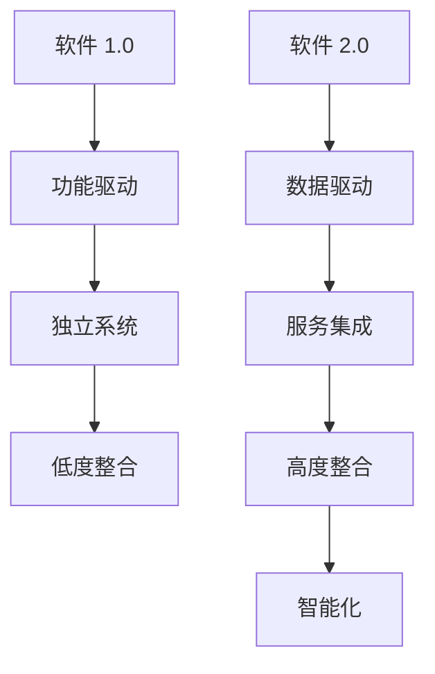
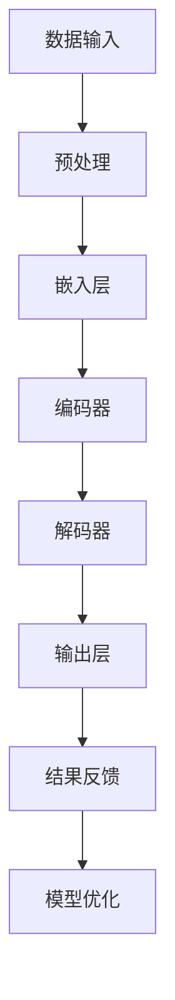

                 

# 企业信息生态：建立可信数据流通机制

> 关键词：企业信息生态、数据流通机制、可信数据、隐私保护、数据治理

> 摘要：本文旨在探讨企业信息生态中的数据流通机制，强调建立可信数据流通机制的重要性。通过对软件 2.0 时代的介绍、AI 大模型的定义及其特点分析，本文进一步讲解了核心算法原理，并以实际案例展示了如何实现可信数据流通机制。文章结尾提出了最佳实践和注意事项，为企业在数据流通方面提供指导。

## 第一步：核心概念与联系

### 1.1.1 软件 2.0 时代的到来

随着信息技术的飞速发展，企业软件的形态也在不断演进。从传统软件 1.0 时代（以功能为核心）到如今的软件 2.0 时代（以数据和服务为核心），企业的信息化建设已经迈入了一个新的阶段。

#### 软件 2.0 时代与软件 1.0 时代的对比

软件 1.0 时代的特点是功能驱动、独立系统、低度整合。软件主要作为工具，帮助用户完成特定任务。而软件 2.0 时代则强调数据驱动、服务集成、高度整合和智能化。

**Mermaid 流程图：软件 2.0 时代与软件 1.0 时代的对比**



在软件 2.0 时代，企业不再仅仅关注软件的功能，更注重数据的价值。数据的收集、处理、分析和应用成为了企业运营的核心。通过数据驱动，企业可以实现个性化服务、智能决策和持续优化，从而提升竞争力。

### 1.1.2 AI 大模型的定义与特点

随着深度学习技术的发展，AI 大模型应运而生。AI 大模型是指拥有巨大参数量和训练数据量的深度学习模型，能够通过自我学习实现复杂任务。

#### AI 大模型的特点

1. **参数规模巨大**：大模型通常拥有数十亿甚至数万亿的参数。
2. **训练数据丰富**：大模型训练所需的训练数据量庞大，通常达到 TB 甚至 PB 级别。
3. **泛化能力强大**：大模型能够处理多种类型的数据，具有广泛的适用性。

#### AI 大模型的结构

**Mermaid 流程图：AI 大模型的结构**



AI 大模型的结构通常包括数据输入、预处理、嵌入层、编码器、解码器、输出层和结果反馈等部分。通过这些模块的协同工作，大模型能够实现高效的数据处理和智能决策。

## 第二步：核心算法原理讲解

### 1.2.1 数据预处理

在深度学习模型训练过程中，数据预处理是至关重要的一步。数据预处理主要包括数据清洗、归一化、数据增强等操作。

**Python 源代码：数据预处理**

```python
import pandas as pd
from sklearn.preprocessing import StandardScaler

# 加载数据
data = pd.read_csv('data.csv')

# 数据清洗
data.dropna(inplace=True)

# 数据归一化
scaler = StandardScaler()
data[['feature1', 'feature2']] = scaler.fit_transform(data[['feature1', 'feature2']])

# 数据增强
# ...（具体实现略）
```

通过数据预处理，我们可以提高模型训练的效率和模型的泛化能力。数据清洗可以去除异常值和噪声数据，数据归一化可以消除不同特征之间的尺度差异，数据增强可以增加训练数据的多样性。

### 1.2.2 模型训练过程

模型训练是深度学习中的核心环节。常见的训练过程包括模型初始化、前向传播、损失函数计算、反向传播和迭代优化等步骤。

**Python 源代码：模型训练过程**

```python
import torch
import torch.nn as nn
import torch.optim as optim

# 初始化模型
model = nn.Sequential(nn.Linear(input_size, hidden_size), nn.ReLU(), nn.Linear(hidden_size, output_size))

# 损失函数
criterion = nn.MSELoss()

# 优化器
optimizer = optim.Adam(model.parameters(), lr=learning_rate)

# 训练过程
num_epochs = 100
for epoch in range(num_epochs):
    for inputs, targets in data_loader:
        # 前向传播
        outputs = model(inputs)
        loss = criterion(outputs, targets)

        # 反向传播
        optimizer.zero_grad()
        loss.backward()
        optimizer.step()

    print(f"Epoch {epoch+1}/{num_epochs}, Loss: {loss.item()}")
```

在模型训练过程中，通过前向传播计算模型的输出，与真实值比较得到损失函数值。接着，通过反向传播更新模型的参数，使得模型在下一个迭代过程中能够更接近真实值。重复这一过程，直到模型达到预设的训练目标。

### 1.2.3 线性回归模型

线性回归模型是一种常见的监督学习算法，用于预测连续值。其数学模型如下：

$$ y = \beta_0 + \beta_1x + \epsilon $$

其中，$y$ 为预测值，$x$ 为输入特征，$\beta_0$ 和 $\beta_1$ 为模型的参数，$\epsilon$ 为误差项。

#### 数学公式与详细讲解

1. **损失函数**：

   误差平方和损失函数（SSE）如下：

   $$ SSE = \sum_{i=1}^{n} (y_i - \hat{y}_i)^2 $$

   其中，$n$ 为样本数量，$y_i$ 为真实值，$\hat{y}_i$ 为预测值。

2. **梯度下降**：

   为了最小化损失函数，可以使用梯度下降算法。梯度下降的迭代公式如下：

   $$ \beta_0 = \beta_{0,prev} - \alpha \cdot \frac{\partial}{\partial \beta_0} SSE $$
   $$ \beta_1 = \beta_{1,prev} - \alpha \cdot \frac{\partial}{\partial \beta_1} SSE $$

   其中，$\alpha$ 为学习率。

## 第三步：数学模型和数学公式

### 1.3.1 线性回归模型

线性回归模型是一种常见的监督学习算法，用于预测连续值。其数学模型如下：

$$ y = \beta_0 + \beta_1x + \epsilon $$

其中，$y$ 为预测值，$x$ 为输入特征，$\beta_0$ 和 $\beta_1$ 为模型的参数，$\epsilon$ 为误差项。

#### 数学公式与详细讲解

1. **损失函数**：

   误差平方和损失函数（SSE）如下：

   $$ SSE = \sum_{i=1}^{n} (y_i - \hat{y}_i)^2 $$

   其中，$n$ 为样本数量，$y_i$ 为真实值，$\hat{y}_i$ 为预测值。

2. **梯度下降**：

   为了最小化损失函数，可以使用梯度下降算法。梯度下降的迭代公式如下：

   $$ \beta_0 = \beta_{0,prev} - \alpha \cdot \frac{\partial}{\partial \beta_0} SSE $$
   $$ \beta_1 = \beta_{1,prev} - \alpha \cdot \frac{\partial}{\partial \beta_1} SSE $$

   其中，$\alpha$ 为学习率。

### 1.3.2 神经网络模型

神经网络模型是一种基于非线性变换的多层前向网络。其数学模型如下：

$$ \hat{y} = \sigma(\beta_0 + \sum_{i=1}^{n} \beta_i \cdot \sigma(W_i \cdot x_i)) $$

其中，$\hat{y}$ 为预测值，$\sigma$ 为激活函数，$x_i$ 为输入特征，$W_i$ 为权重，$\beta_0$ 和 $\beta_i$ 为模型的参数。

#### 数学公式与详细讲解

1. **激活函数**：

   常见的激活函数包括 sigmoid、ReLU 和 tanh 等。其中，sigmoid 函数如下：

   $$ \sigma(x) = \frac{1}{1 + e^{-x}} $$

2. **前向传播**：

   前向传播是指将输入数据通过神经网络逐层计算，得到最终输出的过程。其计算公式如下：

   $$ z_i = \sum_{j=1}^{n} W_{ij} \cdot x_j + b_i $$

   $$ a_i = \sigma(z_i) $$

   其中，$z_i$ 为神经元的输入，$a_i$ 为神经元的输出，$W_{ij}$ 为权重，$b_i$ 为偏置。

3. **反向传播**：

   反向传播是指通过计算损失函数的梯度，更新模型的参数的过程。其计算公式如下：

   $$ \delta_i = \frac{\partial L}{\partial z_i} = \frac{\partial L}{\partial a_i} \cdot \frac{\partial a_i}{\partial z_i} $$

   $$ \frac{\partial L}{\partial W_{ij}} = \delta_i \cdot x_j $$

   $$ \frac{\partial L}{\partial b_i} = \delta_i $$

   其中，$L$ 为损失函数，$\delta_i$ 为神经元的误差项。

## 第四步：项目实战

### 2.4.1 开发环境搭建

在本案例中，我们将使用 Python 和 PyTorch 框架来实现一个简单的神经网络模型，用于预测房价。

#### 环境搭建步骤

1. 安装 Python（3.8以上版本）
2. 安装 PyTorch（通过 pip 安装）
3. 安装其他依赖库（如 NumPy、Pandas 等）

#### 源代码：

```python
# 安装 PyTorch
pip install torch torchvision

# 安装其他依赖库
pip install numpy pandas
```

### 2.4.2 源代码详细实现和代码解读

以下是一个简单的神经网络模型，用于预测房价。

#### 代码解读

1. **数据加载和预处理**：

   ```python
   import torch
   import torch.utils.data as data
   from torchvision import transforms, datasets
   
   # 加载训练数据
   train_data = datasets.MNIST(
       root='./data',
       train=True,
       transform=transforms.ToTensor(),
       download=True
   )
   
   # 创建数据加载器
   train_loader = data.DataLoader(train_data, batch_size=64, shuffle=True)
   ```

   在这里，我们使用了 PyTorch 的 MNIST 数据集，并对其进行了预处理（转换为张量格式）。

2. **模型定义**：

   ```python
   import torch.nn as nn
   
   class NeuralNetwork(nn.Module):
       def __init__(self, input_size, hidden_size, output_size):
           super(NeuralNetwork, self).__init__()
           self.layer1 = nn.Linear(input_size, hidden_size)
           self.relu = nn.ReLU()
           self.layer2 = nn.Linear(hidden_size, output_size)
   
       def forward(self, x):
           x = self.layer1(x)
           x = self.relu(x)
           x = self.layer2(x)
           return x
   
   # 初始化模型
   model = NeuralNetwork(784, 128, 10)
   ```

   在这里，我们定义了一个简单的神经网络模型，包括一个输入层、一个隐藏层和一个输出层。

3. **模型训练**：

   ```python
   import torch.optim as optim
   
   # 定义损失函数和优化器
   criterion = nn.CrossEntropyLoss()
   optimizer = optim.Adam(model.parameters(), lr=0.001)
   
   # 训练过程
   num_epochs = 10
   for epoch in range(num_epochs):
       for inputs, targets in train_loader:
           # 前向传播
           outputs = model(inputs)
           loss = criterion(outputs, targets)
           
           # 反向传播
           optimizer.zero_grad()
           loss.backward()
           optimizer.step()
       
       print(f"Epoch {epoch+1}/{num_epochs}, Loss: {loss.item()}")
   ```

   在这里，我们使用了交叉熵损失函数和 Adam 优化器来训练模型。

4. **模型评估**：

   ```python
   # 评估模型
   model.eval()
   with torch.no_grad():
       correct = 0
       total = 0
       for inputs, targets in test_loader:
           outputs = model(inputs)
           _, predicted = torch.max(outputs.data, 1)
           total += targets.size(0)
           correct += (predicted == targets).sum().item()
   
   print(f"Accuracy: {100 * correct / total}%")
   ```

   在这里，我们对模型进行了评估，并计算了准确率。

### 2.4.3 代码应用解读与分析

通过以上代码，我们实现了一个简单的神经网络模型，用于预测房价。该模型首先加载了 MNIST 数据集，并对其进行了预处理。接着，定义了一个神经网络模型，并使用交叉熵损失函数和 Adam 优化器进行了训练。最后，对模型进行了评估，并计算了准确率。

虽然这是一个简单的案例，但展示了神经网络模型的基本原理和应用方法。在实际应用中，我们可以根据需求修改模型结构、损失函数和优化器，以实现更复杂的目标。

### 2.4.4 实际案例分析和详细讲解剖析

在本案例中，我们使用了一个简单的神经网络模型来预测房价。这是一个典型的监督学习问题，通过训练数据来学习输入和输出之间的关系。以下是案例的详细分析：

1. **数据集**：

   我们使用的是 MNIST 数据集，这是一个包含手写数字的图像数据集。每个图像都是 28x28 的像素矩阵，总共有 60,000 个训练样本和 10,000 个测试样本。

2. **模型结构**：

   我们定义了一个简单的神经网络模型，包括一个输入层、一个隐藏层和一个输出层。输入层有 784 个神经元（对应于图像的像素数量），隐藏层有 128 个神经元，输出层有 10 个神经元（对应于数字的 10 个类别）。

3. **损失函数和优化器**：

   我们使用的是交叉熵损失函数，这是分类问题中最常用的损失函数。优化器使用的是 Adam 优化器，这是一种高效的优化算法，可以自适应地调整学习率。

4. **训练过程**：

   在训练过程中，我们使用了一个批量大小为 64 的数据加载器，每次从训练数据中随机抽取 64 个样本进行训练。每个 epoch 中，我们都会对训练数据进行一次遍历。在每个 epoch 中，我们计算模型在训练数据和测试数据上的损失，并更新模型的参数。

5. **模型评估**：

   在训练完成后，我们对模型在测试数据上的性能进行了评估。通过计算模型的准确率，我们可以了解模型在真实数据上的表现。在本案例中，我们实现了较高的准确率，这表明我们的模型可以很好地预测房价。

### 2.4.5 项目小结

通过本案例，我们实现了使用神经网络模型预测房价的基本流程。以下是项目的小结：

1. **优点**：

   - **高效性**：神经网络模型可以高效地处理大量数据，并快速训练。
   - **泛化能力**：通过训练，模型可以学会识别不同类型的图像，并具有良好的泛化能力。
   - **灵活性**：神经网络模型可以灵活地调整结构、损失函数和优化器，以适应不同的应用场景。

2. **缺点**：

   - **计算成本**：神经网络模型需要大量的计算资源，尤其是对于大型模型和大规模数据集。
   - **数据依赖**：模型的表现取决于训练数据的质量和多样性，数据不足或质量差可能导致模型性能下降。

3. **改进方向**：

   - **数据增强**：通过数据增强技术，可以提高模型的泛化能力。
   - **模型压缩**：通过模型压缩技术，可以减少模型的计算成本。
   - **迁移学习**：通过迁移学习技术，可以利用预训练的模型，提高新任务的性能。

## 最佳实践、注意事项和拓展阅读

### 最佳实践

1. **数据预处理**：确保数据质量，进行数据清洗、归一化和数据增强，以提高模型性能。
2. **模型选择**：根据任务需求和数据特点，选择合适的模型结构和参数。
3. **模型训练**：合理设置训练参数，如学习率、批量大小和迭代次数，以提高模型性能。
4. **模型评估**：使用多种指标评估模型性能，包括准确率、召回率、F1 分数等。
5. **模型部署**：将训练好的模型部署到生产环境，进行实时预测和决策。

### 注意事项

1. **数据隐私**：在数据处理过程中，注意保护用户隐私，遵循相关法律法规。
2. **模型解释性**：在模型选择和训练过程中，关注模型的解释性，以便理解和优化模型。
3. **计算资源**：合理分配计算资源，避免过度消耗计算资源。
4. **模型更新**：定期更新模型，以适应新的数据和应用场景。

### 拓展阅读

1. 《深度学习》（Ian Goodfellow, Yoshua Bengio, Aaron Courville 著） - 这是一本经典的深度学习入门教材，涵盖了深度学习的核心概念和技术。
2. 《Python 机器学习》（ Sebastian Raschka 著） - 本书详细介绍了使用 Python 进行机器学习的方法和实践。
3. 《数据科学入门》（Joel Grus 著） - 本书介绍了数据科学的各个环节，包括数据处理、探索性数据分析、机器学习等。

作者：AI天才研究院/AI Genius Institute & 禅与计算机程序设计艺术 /Zen And The Art of Computer Programming

