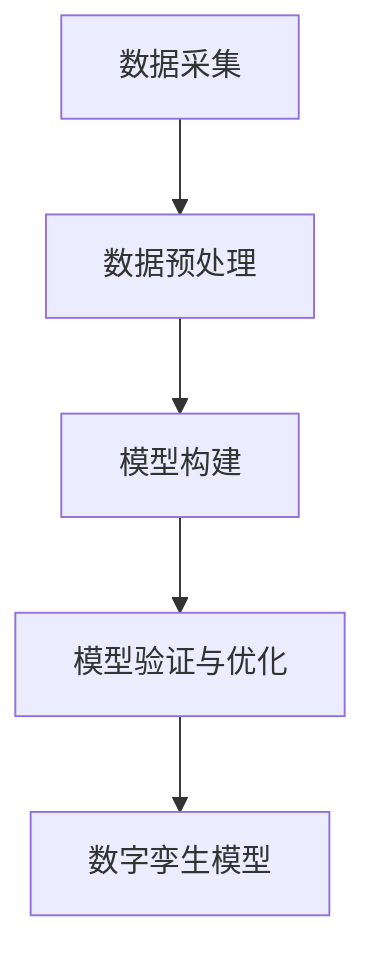
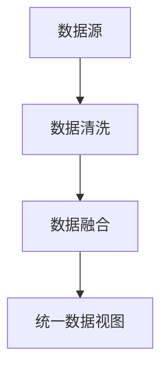
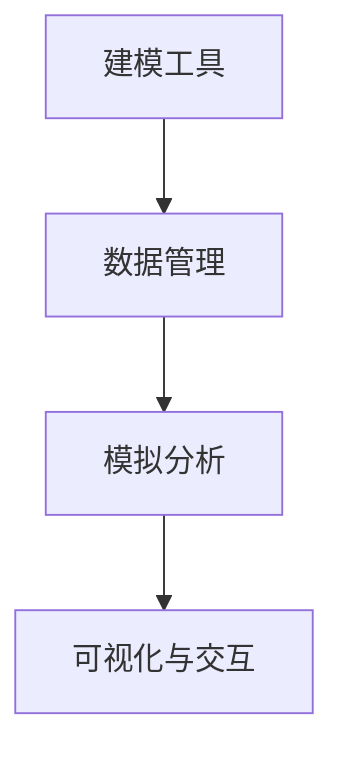
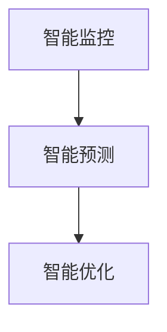

                 

## 引言与概述

### 什么是企业数字孪生生态系统

#### 1.1.1 数字孪生生态系统的定义

数字孪生（Digital Twin）是一种基于物理实体在虚拟空间中创建的数字镜像，它能够实时反映物理实体的状态、行为和性能。企业数字孪生生态系统则是指在企业运营中，将多个数字孪生模型集成起来，形成一个协同工作的整体，实现对业务运营的全面模拟和优化。

#### 1.1.2 数字孪生生态系统的作用和意义

数字孪生生态系统的作用主要体现在以下几个方面：

1. **提高业务透明度**：通过数字孪生，企业可以实时监控业务运行状态，及时发现潜在问题，从而提高业务透明度和运营效率。
2. **优化决策支持**：数字孪生提供了丰富的数据支持和模拟分析工具，有助于企业做出更加准确和高效的决策。
3. **提升产品质量**：数字孪生技术可以模拟和分析产品在生产过程中的各种情况，有助于发现并解决潜在的质量问题。
4. **降低运营成本**：通过模拟和预测，企业可以优化资源配置，降低生产成本和运营费用。

#### 1.1.3 数字孪生生态系统的发展历程

数字孪生技术最早可以追溯到20世纪80年代，当时主要用于航天工程中的飞行器设计和制造。随着计算机技术和物联网技术的发展，数字孪生技术逐渐应用于工业、建筑、医疗、零售等多个领域。近年来，随着人工智能和大数据技术的崛起，数字孪生生态系统在企业中的应用越来越广泛，成为企业数字化转型的重要工具。

### 企业数字孪生生态系统的核心组成部分

#### 1.2.1 数字孪生模型

数字孪生模型是数字孪生生态系统的核心，它通过模拟物理实体的各种行为和状态，实现对物理世界的实时映射。一个典型的数字孪生模型通常包括以下组成部分：

1. **物理实体模型**：描述物理实体的几何形状、物理特性等。
2. **行为模型**：描述物理实体在各种环境下的行为和响应。
3. **状态模型**：描述物理实体的实时状态，如温度、湿度、位置等。

#### 1.2.2 数据集成与融合

数据集成与融合是数字孪生生态系统的基础，它负责将来自不同来源的数据进行整合和清洗，形成一个统一的数据视图。数据集成与融合的主要内容包括：

1. **数据采集**：通过各种传感器和物联网设备收集物理实体的数据。
2. **数据清洗**：去除数据中的噪音和错误，保证数据质量。
3. **数据融合**：将来自不同来源的数据进行整合，形成一个统一的数据集。

#### 1.2.3 数字孪生平台

数字孪生平台是数字孪生生态系统的核心组件，它负责提供数字孪生模型的创建、管理和运行环境。一个典型的数字孪生平台通常包括以下功能模块：

1. **建模工具**：用于创建和编辑数字孪生模型。
2. **数据管理**：用于管理和存储数字孪生所需的数据。
3. **模拟分析**：用于对数字孪生模型进行模拟和分析。
4. **可视化与交互**：用于展示数字孪生的状态和结果。

#### 1.2.4 应用场景与价值

数字孪生生态系统在企业中的应用场景非常广泛，以下是几个典型的应用场景：

1. **制造业**：通过数字孪生技术，企业可以实时监控生产线，优化生产流程，提高生产效率。
2. **零售业**：通过数字孪生技术，企业可以实时了解商品的库存情况，优化供应链管理，提高客户满意度。
3. **物流业**：通过数字孪生技术，企业可以实时监控物流运输过程，优化运输路线，降低物流成本。
4. **医疗行业**：通过数字孪生技术，医生可以实时了解病人的病情，制定更加精准的治疗方案。

总之，企业数字孪生生态系统是一种强大而灵活的工具，它可以帮助企业实现全面模拟业务运营，提高运营效率，降低运营成本，提升产品质量，具有极高的应用价值。接下来，我们将深入探讨企业数字孪生生态系统的关键技术，帮助读者更好地理解这一技术背后的原理和实践方法。

---

作者：AI天才研究院/AI Genius Institute & 禅与计算机程序设计艺术 /Zen And The Art of Computer Programming

关键词：企业数字孪生生态系统，数字孪生模型，数据集成，数字孪生平台，业务运营模拟

摘要：本文深入探讨了企业数字孪生生态系统的定义、作用、组成部分以及应用场景。通过详细分析数字孪生模型、数据集成与融合技术、数字孪生平台的关键技术，本文旨在帮助读者全面了解企业数字孪生生态系统的工作原理和实践方法。此外，本文还通过实际案例，展示了数字孪生生态系统在制造业、零售业和物流业中的应用价值。

---

### 第一部分：设计企业数字孪生生态系统

在设计企业数字孪生生态系统时，我们需要明确几个核心概念，并理解这些概念之间的关系。接下来，我们将逐一介绍这些核心概念，并通过Mermaid流程图展示它们之间的关联。

#### 2.1 数字孪生建模技术

数字孪生建模是数字孪生生态系统的核心组成部分，它涉及对物理实体进行数字化建模，以创建其虚拟镜像。数字孪生建模的基本原则包括：

1. **一致性**：数字孪生模型应与物理实体保持一致，确保虚拟和物理世界之间的映射准确。
2. **实时性**：数字孪生模型应能够实时反映物理实体的状态变化。
3. **可扩展性**：数字孪生模型应具有可扩展性，以适应不同规模和复杂度的应用场景。

数字孪生建模方法通常包括以下步骤：

1. **数据采集**：通过传感器和物联网设备收集物理实体的数据。
2. **数据预处理**：对采集到的数据进行处理和清洗，去除噪声和错误。
3. **模型构建**：使用机器学习和人工智能技术构建数字孪生模型。
4. **模型验证与优化**：通过对比虚拟模型和物理实体的实际表现，验证和优化模型。

Mermaid流程图：



#### 2.2 数据集成与融合技术

数据集成与融合是数字孪生生态系统的基础，它涉及将来自不同来源的数据进行整合和清洗，形成一个统一的数据视图。数据集成与融合的基本概念包括：

1. **数据源**：数据的来源，可以是传感器、数据库、文件等。
2. **数据清洗**：去除数据中的噪声和错误，保证数据质量。
3. **数据融合**：将来自不同来源的数据进行整合，形成一个统一的数据集。

数据融合方法主要包括：

1. **规则融合**：根据预定义的规则对数据进行融合。
2. **聚类融合**：通过聚类算法将相似的数据进行融合。
3. **机器学习融合**：使用机器学习算法自动进行数据融合。

Mermaid流程图：



#### 2.3 数字孪生平台技术

数字孪生平台是数字孪生生态系统的核心组件，它负责提供数字孪生模型的创建、管理和运行环境。数字孪生平台的功能模块通常包括：

1. **建模工具**：用于创建和编辑数字孪生模型。
2. **数据管理**：用于管理和存储数字孪生所需的数据。
3. **模拟分析**：用于对数字孪生模型进行模拟和分析。
4. **可视化与交互**：用于展示数字孪生的状态和结果。

数字孪生平台的技术选型需要考虑以下几个方面：

1. **计算能力**：平台应具备足够的计算能力以处理大规模数据。
2. **兼容性**：平台应支持多种数据格式和接口，方便与现有系统的集成。
3. **可扩展性**：平台应具有可扩展性，以适应不断增长的数据和应用需求。

Mermaid流程图：



#### 2.4 AI与数字孪生生态系统

人工智能（AI）在数字孪生生态系统中的应用非常广泛，它可以通过智能分析、预测和优化，提升数字孪生生态系统的效率和准确性。AI在数字孪生生态系统中的应用主要包括：

1. **智能监控**：使用AI技术实时监控物理实体的状态，及时发现异常情况。
2. **智能预测**：基于历史数据和实时数据，使用机器学习算法预测物理实体的未来状态。
3. **智能优化**：通过模拟和优化算法，优化物理实体的运行状态和资源配置。

AI算法与模型在数字孪生生态系统中的应用主要涉及：

1. **监督学习**：用于对已知数据进行分类和预测。
2. **无监督学习**：用于对未知数据进行聚类和模式识别。
3. **强化学习**：用于优化决策过程，提升系统的自适应能力。

Mermaid流程图：



通过上述介绍，我们可以看到数字孪生生态系统中的各个关键组件是如何相互关联、协同工作的。在接下来的章节中，我们将深入探讨这些技术的具体实现和应用，帮助读者更好地理解和实践企业数字孪生生态系统。

### 第二部分：企业数字孪生生态系统关键技术

#### 2.1 数字孪生建模技术

数字孪生建模是数字孪生生态系统的核心，它通过对物理实体的数字化建模，创建一个虚拟镜像，以实现对物理实体的全面模拟和监控。以下是数字孪生建模技术的详细讲解：

##### 2.1.1 数字孪生建模的基本原则

1. **一致性**：数字孪生模型应与物理实体保持一致，确保虚拟和物理世界之间的映射准确。
2. **实时性**：数字孪生模型应能够实时反映物理实体的状态变化。
3. **可扩展性**：数字孪生模型应具有可扩展性，以适应不同规模和复杂度的应用场景。
4. **可操作性**：数字孪生模型应提供丰富的操作接口，方便用户进行交互和操作。

##### 2.1.2 数字孪生建模方法

数字孪生建模通常包括以下几个步骤：

1. **需求分析**：明确数字孪生模型的应用场景和需求，确定模型的规模和复杂度。
2. **物理实体建模**：使用三维建模工具，创建物理实体的几何模型，包括形状、尺寸、材质等。
3. **行为建模**：根据物理实体的特性，定义其在各种环境下的行为和响应，如运动、变形、温度变化等。
4. **状态建模**：定义物理实体的实时状态，如位置、速度、温度、压力等。
5. **数据集成**：将物理实体建模过程中产生的数据与实时传感器数据集成，形成完整的数据视图。

##### 2.1.3 数字孪生模型的可视化与交互

数字孪生模型的可视化与交互是用户体验的重要部分，它使得用户可以直观地了解物理实体的状态和行为。以下是几种常见的方法：

1. **三维可视化**：使用三维建模工具，将数字孪生模型以三维形式展示，用户可以通过旋转、缩放、飞行等操作进行交互。
2. **实时数据监控**：在三维模型中嵌入实时数据监控界面，用户可以实时查看物理实体的状态参数。
3. **交互式分析**：提供交互式分析工具，用户可以自定义分析条件，对数字孪生模型进行深入分析。

##### 2.1.4 数字孪生模型实例

以下是一个简单的数字孪生模型实例，我们使用Python代码来创建一个数字孪生模型，并使用matplotlib进行可视化：

```python
import numpy as np
import matplotlib.pyplot as plt

# 定义物理实体的参数
radius = 1.0
velocity = 0.1

# 定义时间序列
t = np.linspace(0, 10, 1000)

# 定义物理实体的位置
x = radius * np.sin(velocity * t)

# 可视化物理实体的位置
plt.plot(t, x)
plt.xlabel('Time (s)')
plt.ylabel('Position (m)')
plt.title('Digital Twin Model')
plt.show()
```

该实例创建了一个简单的物理实体，其位置随时间按照正弦函数变化。通过matplotlib，我们可以直观地看到物理实体的位置变化，从而实现对物理实体的实时模拟。

#### 2.2 数据集成与融合技术

数据集成与融合是数字孪生生态系统的关键环节，它涉及将来自不同来源的数据进行整合和清洗，形成一个统一的数据视图。以下是数据集成与融合技术的详细讲解：

##### 2.2.1 数据集成的基本概念

1. **数据源**：数据源是数据的来源，可以是传感器、数据库、文件等。
2. **数据采集**：通过传感器和物联网设备收集数据。
3. **数据清洗**：去除数据中的噪声和错误，保证数据质量。
4. **数据融合**：将来自不同来源的数据进行整合，形成一个统一的数据集。

##### 2.2.2 数据融合方法

数据融合方法可以分为以下几种：

1. **规则融合**：根据预定义的规则对数据进行融合，适用于规则明确的数据源。
2. **聚类融合**：通过聚类算法将相似的数据进行融合，适用于复杂和不规则的数据源。
3. **机器学习融合**：使用机器学习算法自动进行数据融合，适用于大规模和复杂的数据源。

##### 2.2.3 数据质量管理

数据质量管理是数据集成与融合的重要环节，它包括以下内容：

1. **数据完整性**：确保数据完整，无缺失和重复。
2. **数据准确性**：确保数据准确，无错误和异常。
3. **数据一致性**：确保数据在不同系统间的一致性。
4. **数据安全性**：保护数据的安全性，防止数据泄露和损坏。

##### 2.2.4 数据集成与融合实例

以下是一个简单的数据集成与融合实例，我们使用Python代码来集成和融合两个数据源：

```python
import pandas as pd

# 创建数据源
data_source_1 = pd.DataFrame({'time': [1, 2, 3, 4], 'value': [1, 3, 5, 7]})
data_source_2 = pd.DataFrame({'time': [2, 3, 5, 6], 'value': [2, 4, 6, 8]})

# 数据清洗
cleaned_data_1 = data_source_1[~data_source_1.duplicated('time')]
cleaned_data_2 = data_source_2[~data_source_2.duplicated('time')]

# 数据融合
merged_data = pd.merge(cleaned_data_1, cleaned_data_2, on='time', how='outer')

# 数据质量检查
merged_data.dropna().groupby('time').mean()

# 可视化数据融合结果
merged_data.plot(x='time', y='value')
plt.xlabel('Time')
plt.ylabel('Value')
plt.title('Data Integration and Fusion')
plt.show()
```

该实例创建了两个数据源，分别表示不同时间点的数据值。通过数据清洗和融合，我们得到一个统一的数据集，并使用matplotlib进行可视化，展示数据融合的结果。

#### 2.3 数字孪生平台技术

数字孪生平台是数字孪生生态系统的核心组件，它提供数字孪生模型的创建、管理和运行环境。以下是数字孪生平台技术的详细讲解：

##### 2.3.1 数字孪生平台的功能模块

1. **建模工具**：用于创建和编辑数字孪生模型，支持多种建模方法和工具。
2. **数据管理**：用于管理和存储数字孪生所需的数据，支持数据采集、清洗、融合和存储。
3. **模拟分析**：用于对数字孪生模型进行模拟和分析，支持多维度分析和可视化。
4. **可视化与交互**：用于展示数字孪生的状态和结果，支持交互式操作和实时监控。
5. **平台管理**：用于管理和配置数字孪生平台，支持用户权限管理、日志记录和系统监控。

##### 2.3.2 数字孪生平台的技术选型

数字孪生平台的技术选型需要考虑以下几个方面：

1. **计算能力**：平台应具备足够的计算能力以处理大规模数据。
2. **兼容性**：平台应支持多种数据格式和接口，方便与现有系统的集成。
3. **可扩展性**：平台应具有可扩展性，以适应不断增长的数据和应用需求。
4. **安全性**：平台应具备高安全性能，保护数据的安全性和隐私。

##### 2.3.3 数字孪生平台的实施与运维

数字孪生平台的实施与运维包括以下步骤：

1. **需求分析**：明确数字孪生平台的应用场景和需求，确定平台的功能和性能要求。
2. **系统设计**：设计数字孪生平台的架构和组件，确定技术选型和开发计划。
3. **开发实施**：按照设计文档进行开发和测试，确保平台的功能和性能符合要求。
4. **部署上线**：将数字孪生平台部署到生产环境，进行上线运营。
5. **运维管理**：对数字孪生平台进行日常维护和监控，确保平台的稳定运行。

##### 2.3.4 数字孪生平台实例

以下是一个简单的数字孪生平台实例，我们使用Python和Django框架来搭建一个数字孪生平台：

```python
# 引入所需模块
from django.shortcuts import render
from django.http import JsonResponse

# 定义数字孪生模型API
def digital_twin_model_api(request):
    # 获取请求参数
    time = request.GET.get('time', None)
    value = request.GET.get('value', None)

    # 数据清洗和融合
    if time and value:
        # 模拟数据存储
        data = {'time': time, 'value': value}
        # 返回结果
        return JsonResponse(data)
    else:
        return JsonResponse({'error': 'Invalid parameters'}, status=400)

# 定义主页视图
def home(request):
    return render(request, 'home.html')

# 搭建数字孪生平台
if __name__ == '__main__':
    # 运行Django服务器
    runserver()
```

该实例使用Django框架搭建了一个简单的数字孪生平台，包括数字孪生模型API和主页视图。用户可以通过发送HTTP请求，获取数字孪生模型的数据，并使用HTML页面进行交互。

通过以上对数字孪生建模技术、数据集成与融合技术以及数字孪生平台技术的详细讲解，我们可以看到这些技术是如何协同工作，共同构建一个完整的数字孪生生态系统的。在接下来的章节中，我们将进一步探讨AI与数字孪生生态系统的融合，以及实际应用案例，帮助读者更好地理解和应用这些技术。

### 2.4 AI与数字孪生生态系统

人工智能（AI）与数字孪生生态系统的融合，极大地提升了数字孪生生态系统的智能化水平，使得企业能够更加精准地模拟、预测和优化业务运营。以下是AI在数字孪生生态系统中的应用、AI算法与模型在数字孪生生态系统中的应用，以及AI与数字孪生生态系统的融合趋势。

##### 2.4.1 AI在数字孪生生态系统中的应用

AI在数字孪生生态系统中的应用主要体现在以下几个方面：

1. **智能监控**：通过AI技术，数字孪生平台可以实时监控物理实体的状态，并自动识别和报警异常情况。例如，通过图像识别技术，平台可以检测生产线上出现的缺陷产品，并自动通知相关人员。
2. **智能预测**：AI技术可以帮助数字孪生平台预测物理实体的未来状态和行为。例如，通过时间序列分析，平台可以预测机器的维护时间，从而提前进行维护，避免设备故障。
3. **智能优化**：AI技术可以帮助数字孪生平台优化业务流程和资源配置。例如，通过机器学习算法，平台可以优化生产线的布局和调度，提高生产效率。

##### 2.4.2 AI算法与模型在数字孪生生态系统中的应用

AI算法与模型在数字孪生生态系统中的应用主要包括以下几个方面：

1. **监督学习**：监督学习算法可以用于预测物理实体的未来状态。例如，使用回归算法预测机器的剩余使用寿命，使用分类算法预测产品的质量等级。
2. **无监督学习**：无监督学习算法可以用于分析物理实体的数据，发现数据中的模式。例如，使用聚类算法分析传感器数据，发现设备运行中的异常模式。
3. **强化学习**：强化学习算法可以用于优化物理实体的行为。例如，使用强化学习算法优化机器人的运动轨迹，使其在执行任务时更加高效。

以下是几个AI算法在数字孪生生态系统中的应用实例：

1. **图像识别**：通过卷积神经网络（CNN）进行图像识别，用于检测生产线上出现的缺陷产品。
2. **时间序列分析**：通过长短期记忆网络（LSTM）进行时间序列分析，用于预测机器的维护时间。
3. **聚类分析**：通过K-means算法进行聚类分析，用于发现传感器数据中的异常模式。

##### 2.4.3 AI与数字孪生生态系统的融合趋势

随着AI技术的不断发展，AI与数字孪生生态系统的融合趋势也越来越明显。以下是几个融合趋势：

1. **多模态数据融合**：未来的数字孪生生态系统将能够融合多种数据类型，如传感器数据、图像数据、文本数据等，通过多模态数据融合技术，提供更加全面和准确的数字孪生模型。
2. **实时决策支持**：未来的数字孪生生态系统将能够实时分析数据，并基于AI算法提供决策支持，帮助企业快速响应市场变化，优化业务运营。
3. **智能化运维管理**：未来的数字孪生生态系统将实现智能化运维管理，通过AI技术自动检测和解决系统故障，提高系统的稳定性和可靠性。

通过上述分析，我们可以看到AI技术为数字孪生生态系统带来了巨大的价值，使得企业能够更加精准地模拟、预测和优化业务运营。在未来的发展中，AI与数字孪生生态系统的融合将越来越紧密，为企业的数字化转型提供更加强大的支持。

### 3.1 制造业数字孪生应用案例

制造业是数字孪生技术的典型应用领域之一，通过数字孪生技术，企业可以实现生产过程的实时模拟和优化，从而提高生产效率，降低生产成本。以下是一个制造业数字孪生应用案例的详细解析。

#### 3.1.1 制造业数字孪生应用场景

在某大型制造企业，数字孪生技术被广泛应用于生产线的优化和设备维护。该企业的生产线包括多个工位，每个工位都有不同的设备和工序。通过数字孪生技术，企业希望实现以下目标：

1. **实时监控生产过程**：实时获取每个工位的设备状态、生产进度和产品质量数据。
2. **优化生产流程**：通过模拟和优化，找到最优的生产流程和资源配置方案。
3. **预防性维护**：通过预测设备故障，提前进行维护，避免生产中断。

#### 3.1.2 数字孪生生态系统建设

为了实现上述目标，企业首先进行数字孪生生态系统建设。以下是数字孪生生态系统的主要组成部分：

1. **物理实体建模**：使用三维建模工具，对生产线的每个设备和工位进行建模，包括设备的几何形状、工作状态和性能参数。
2. **数据集成与融合**：通过传感器和物联网设备，实时采集生产过程中的各种数据，如温度、压力、设备运行状态、产品质量等。然后，使用数据融合技术，将不同来源的数据进行整合，形成一个统一的数据视图。
3. **数字孪生平台**：构建一个数字孪生平台，用于管理数字孪生模型和数据，提供模拟、分析和可视化功能。平台包括建模工具、数据管理模块、模拟分析模块和可视化模块。

#### 3.1.3 数字孪生模型应用

在数字孪生平台中，企业通过以下步骤应用数字孪生模型：

1. **实时监控**：使用可视化模块，实时监控生产线的设备状态、生产进度和产品质量数据。当出现异常情况时，系统会自动报警，通知相关人员处理。
2. **模拟优化**：使用模拟分析模块，模拟不同的生产流程和资源配置方案，找到最优的方案。例如，通过调整设备的顺序和工作时间，提高生产效率。
3. **预测性维护**：使用机器学习算法，分析设备的历史数据，预测设备可能出现的故障。根据预测结果，企业可以提前进行维护，避免生产中断。

#### 3.1.4 案例解析

以下是对该制造业数字孪生应用案例的详细解析：

1. **数据采集与融合**：
   - 传感器部署：在生产线的关键位置部署传感器，如温度传感器、压力传感器等，实时采集设备状态和生产数据。
   - 数据传输：传感器采集到的数据通过物联网设备传输到数字孪生平台。
   - 数据清洗与融合：平台对传输的数据进行清洗和融合，形成一个统一的数据视图。

2. **实时监控**：
   - 可视化界面：平台提供实时监控界面，显示生产线的设备状态、生产进度和产品质量数据。
   - 异常报警：当出现异常情况时，如设备故障或产品质量问题，系统会自动报警，通知相关人员处理。

3. **模拟优化**：
   - 模拟分析：使用模拟分析模块，模拟不同的生产流程和资源配置方案，找到最优的方案。
   - 优化建议：根据模拟结果，平台给出优化建议，如调整设备的顺序、工作时间等，以提高生产效率。

4. **预测性维护**：
   - 故障预测：使用机器学习算法，分析设备的历史数据，预测设备可能出现的故障。
   - 维护计划：根据预测结果，企业可以提前制定维护计划，避免生产中断。

通过数字孪生技术的应用，该制造业企业实现了生产过程的实时监控、优化和预测性维护，大大提高了生产效率和设备利用率，降低了生产成本。该案例展示了数字孪生技术在制造业中的强大应用潜力。

### 3.2 零售业数字孪生应用案例

在零售业，数字孪生技术同样发挥着重要作用，它能够帮助企业实现供应链的实时监控和优化，提升客户体验，降低库存成本。以下是一个零售业数字孪生应用案例的详细解析。

#### 3.2.1 零售业数字孪生应用场景

在某大型零售企业，数字孪生技术被应用于其供应链管理和库存优化。该企业的供应链包括供应商、仓库、配送中心和门店，企业希望实现以下目标：

1. **实时库存监控**：实时了解各仓库和门店的库存情况，确保库存充足，满足客户需求。
2. **供应链优化**：通过模拟和优化，找到最优的物流路线和库存配置方案。
3. **客户体验提升**：通过精准的库存预测和快速配送，提升客户购物体验。

#### 3.2.2 数字孪生生态系统建设

为了实现上述目标，零售企业进行了数字孪生生态系统建设。以下是数字孪生生态系统的主要组成部分：

1. **物理实体建模**：使用三维建模工具，对供应链中的各个环节进行建模，包括供应商、仓库、配送中心和门店的地理布局、设备状态和物流路径。
2. **数据集成与融合**：通过传感器和物联网设备，实时采集供应链各环节的数据，如库存水平、物流状态、客户购买行为等。然后，使用数据融合技术，将不同来源的数据进行整合，形成一个统一的数据视图。
3. **数字孪生平台**：构建一个数字孪生平台，用于管理数字孪生模型和数据，提供模拟、分析和可视化功能。平台包括建模工具、数据管理模块、模拟分析模块和可视化模块。

#### 3.2.3 数字孪生模型应用

在数字孪生平台中，企业通过以下步骤应用数字孪生模型：

1. **实时库存监控**：使用可视化模块，实时监控各仓库和门店的库存情况，确保库存充足，满足客户需求。
2. **供应链模拟与优化**：使用模拟分析模块，模拟不同的供应链配置和物流路线，找到最优的方案。例如，通过调整配送中心的布局和配送路线，提高物流效率。
3. **客户体验优化**：通过分析客户购买行为和库存预测，提前备货，确保热门商品库存充足，提升客户购物体验。

#### 3.2.4 案例解析

以下是对该零售业数字孪生应用案例的详细解析：

1. **数据采集与融合**：
   - 传感器部署：在供应链各环节部署传感器，如库存传感器、物流传感器等，实时采集供应链数据。
   - 数据传输：传感器采集到的数据通过物联网设备传输到数字孪生平台。
   - 数据清洗与融合：平台对传输的数据进行清洗和融合，形成一个统一的数据视图。

2. **实时库存监控**：
   - 可视化界面：平台提供实时监控界面，显示各仓库和门店的库存情况。
   - 库存预警：当库存低于警戒线时，系统会自动发送预警通知，提醒相关负责人补充库存。

3. **供应链模拟与优化**：
   - 模拟分析：使用模拟分析模块，模拟不同的供应链配置和物流路线，找到最优的方案。
   - 优化建议：根据模拟结果，平台会给出优化建议，如调整配送中心的布局、优化配送路线等，以提高物流效率。

4. **客户体验优化**：
   - 库存预测：通过分析客户购买行为和库存数据，预测热门商品的销售趋势，提前备货。
   - 快速配送：通过优化物流路线，确保热门商品库存充足，提升客户购物体验。

通过数字孪生技术的应用，该零售企业实现了供应链的实时监控、优化和客户体验的提升，大大提高了运营效率和客户满意度。该案例展示了数字孪生技术在零售业中的广泛应用潜力。

### 3.3 物流业数字孪生应用案例

在物流业，数字孪生技术可以帮助企业实现物流过程的实时监控和优化，提高运输效率，降低运营成本。以下是一个物流业数字孪生应用案例的详细解析。

#### 3.3.1 物流业数字孪生应用场景

在某大型物流企业，数字孪生技术被广泛应用于物流运输、仓储管理和配送优化。该企业的物流网络包括多个仓库、运输车队和配送站点，企业希望实现以下目标：

1. **实时运输监控**：实时监控货物的运输状态和位置，确保货物安全到达。
2. **仓储管理优化**：通过模拟和优化，找到最优的仓库布局和库存配置方案。
3. **配送优化**：通过预测和优化，找到最优的配送路线和配送时间。

#### 3.3.2 数字孪生生态系统建设

为了实现上述目标，物流企业进行了数字孪生生态系统建设。以下是数字孪生生态系统的主要组成部分：

1. **物理实体建模**：使用三维建模工具，对物流网络中的各个环节进行建模，包括仓库、运输车队和配送站点的地理布局、设备状态和物流路径。
2. **数据集成与融合**：通过传感器和物联网设备，实时采集物流过程中的各种数据，如货物位置、运输状态、仓库库存等。然后，使用数据融合技术，将不同来源的数据进行整合，形成一个统一的数据视图。
3. **数字孪生平台**：构建一个数字孪生平台，用于管理数字孪生模型和数据，提供模拟、分析和可视化功能。平台包括建模工具、数据管理模块、模拟分析模块和可视化模块。

#### 3.3.3 数字孪生模型应用

在数字孪生平台中，企业通过以下步骤应用数字孪生模型：

1. **实时运输监控**：使用可视化模块，实时监控货物的运输状态和位置，确保货物安全到达。
2. **仓储管理优化**：使用模拟分析模块，模拟不同的仓储布局和库存配置方案，找到最优的方案。例如，通过调整仓库货架的布局，提高仓储效率。
3. **配送优化**：通过分析客户订单和配送数据，预测配送高峰期，提前调整配送路线和配送时间，提高配送效率。

#### 3.3.4 案例解析

以下是对该物流业数字孪生应用案例的详细解析：

1. **数据采集与融合**：
   - 传感器部署：在物流运输过程中部署传感器，如GPS传感器、运输状态传感器等，实时采集货物和运输车队的状态数据。
   - 数据传输：传感器采集到的数据通过物联网设备传输到数字孪生平台。
   - 数据清洗与融合：平台对传输的数据进行清洗和融合，形成一个统一的数据视图。

2. **实时运输监控**：
   - 可视化界面：平台提供实时监控界面，显示货物的运输状态和位置。
   - 运输预警：当出现运输延误或货物丢失时，系统会自动发送预警通知，提醒相关人员处理。

3. **仓储管理优化**：
   - 模拟分析：使用模拟分析模块，模拟不同的仓储布局和库存配置方案，找到最优的方案。
   - 优化建议：根据模拟结果，平台会给出优化建议，如调整仓库货架的布局、优化库存配置等，以提高仓储效率。

4. **配送优化**：
   - 数据分析：通过分析客户订单和配送数据，预测配送高峰期。
   - 路线优化：根据预测结果，平台会优化配送路线和配送时间，提高配送效率。

通过数字孪生技术的应用，该物流企业实现了物流运输的实时监控、仓储管理的优化和配送的优化，大大提高了运输效率，降低了运营成本。该案例展示了数字孪生技术在物流业中的广泛应用潜力。

### 4.1 企业数字孪生生态系统实施策略

企业数字孪生生态系统的实施是一项复杂且系统性的工程，涉及多个阶段和环节。为了确保项目的成功，企业需要制定详细的实施策略，包括规划、构建、运营和维护。以下是企业数字孪生生态系统实施策略的详细解析。

#### 4.1.1 数字孪生生态系统规划

规划是实施数字孪生生态系统的第一步，它包括以下关键任务：

1. **需求分析**：明确企业数字孪生生态系统建设的目标和需求，如业务优化、成本降低、质量提升等。
2. **业务流程梳理**：对企业现有的业务流程进行详细梳理，识别关键业务环节和瓶颈，为数字孪生建模提供依据。
3. **技术评估**：评估现有技术和基础设施是否能够满足数字孪生生态系统的需求，如计算能力、存储能力、网络传输等。
4. **资源分配**：根据项目需求和预算，合理分配人力、物力和财力资源，确保项目能够按时按质完成。

#### 4.1.2 数字孪生生态系统构建

构建阶段是数字孪生生态系统实施的核心，它包括以下关键任务：

1. **物理实体建模**：使用三维建模工具，对企业的关键设备和业务流程进行建模，确保模型能够准确反映物理实体的状态和行为。
2. **数据集成与融合**：通过传感器和物联网设备，实时采集业务运行数据，使用数据融合技术，将来自不同来源的数据进行整合，形成一个统一的数据视图。
3. **数字孪生平台搭建**：构建数字孪生平台，包括建模工具、数据管理模块、模拟分析模块和可视化模块，确保平台能够满足企业需求。
4. **系统集成**：将数字孪生平台与企业现有的信息系统进行集成，如ERP系统、MES系统等，实现数据的无缝对接和共享。

#### 4.1.3 数字孪生生态系统运营与维护

运营与维护是确保数字孪生生态系统长期稳定运行的关键，它包括以下关键任务：

1. **数据维护**：定期对采集到的数据进行清洗、更新和优化，确保数据质量，为数字孪生模型提供可靠的数据支持。
2. **模型更新**：根据业务需求和实际运行情况，定期更新数字孪生模型，确保模型能够准确反映物理实体的状态和行为。
3. **系统监控**：建立系统监控机制，实时监控数字孪生平台的运行状态，确保平台的稳定性和安全性。
4. **用户培训**：对使用数字孪生平台的相关人员进行培训，提高他们的技能和操作水平，确保平台能够得到有效利用。

#### 4.1.4 实施策略总结

企业数字孪生生态系统的实施策略需要充分考虑企业的实际情况和需求，确保项目能够顺利实施和运行。以下是实施策略的总结：

1. **需求明确**：明确数字孪生生态系统建设的目标和需求，确保项目能够满足企业实际需求。
2. **技术评估**：评估现有技术和基础设施是否能够满足数字孪生生态系统的需求，确保项目的技术可行性。
3. **资源保障**：合理分配资源，确保项目有足够的资金、人力和技术支持。
4. **持续优化**：根据业务需求和实际运行情况，定期更新数字孪生模型和数据，确保系统的稳定性和有效性。
5. **用户培训**：提高相关人员的技能和操作水平，确保数字孪生平台能够得到有效利用。

通过制定详细的实施策略，企业可以确保数字孪生生态系统的顺利实施和长期稳定运行，从而实现业务运营的全面模拟和优化。

### 4.2 数字孪生生态系统建设中的挑战与应对

在企业数字孪生生态系统建设过程中，企业面临着诸多挑战，如技术挑战、数据安全与隐私保护、人才培养与知识转移等。以下是对这些挑战的详细分析以及应对策略。

#### 4.2.1 技术挑战与解决方案

1. **数据采集与处理**：
   - 挑战：企业往往面临海量数据的采集、传输和处理挑战，数据源多样且格式复杂。
   - 解决方案：采用物联网（IoT）技术和边缘计算，在数据源头进行预处理，减少传输数据量。同时，采用大数据处理框架，如Hadoop和Spark，进行高效数据分析和处理。

2. **数字孪生建模**：
   - 挑战：构建准确、实时、可扩展的数字孪生模型是技术难点。
   - 解决方案：采用先进的建模工具和方法，如CAD软件、物理仿真软件等，结合机器学习和人工智能算法，提高数字孪生模型的精度和实时性。

3. **系统集成与兼容性**：
   - 挑战：将数字孪生生态系统与企业现有系统进行集成，确保数据互通和系统兼容。
   - 解决方案：采用微服务架构和API网关，实现模块化设计和松耦合集成。同时，遵循行业标准和技术规范，确保系统的兼容性和可扩展性。

#### 4.2.2 数据安全与隐私保护

1. **数据安全**：
   - 挑战：数字孪生生态系统涉及大量敏感数据，如生产数据、库存数据、客户信息等，数据安全风险高。
   - 解决方案：采用数据加密、访问控制、身份认证等技术手段，确保数据在传输和存储过程中的安全性。同时，定期进行安全审计和漏洞扫描，及时发现和修复安全隐患。

2. **隐私保护**：
   - 挑战：数字孪生生态系统中的数据可能包含个人隐私信息，隐私保护法规要求高。
   - 解决方案：遵循相关隐私保护法规，如GDPR和CCPA，对个人数据进行去识别化处理。同时，建立数据隐私保护机制，确保个人隐私不被泄露和滥用。

#### 4.2.3 人才培养与知识转移

1. **人才培养**：
   - 挑战：数字孪生技术涉及多个领域，包括计算机科学、机械工程、数据分析等，人才短缺。
   - 解决方案：建立内部培训计划，提高现有员工的技能水平。同时，与高校和培训机构合作，培养和引进专业人才。

2. **知识转移**：
   - 挑战：企业内部不同部门之间存在知识壁垒，知识共享和转移困难。
   - 解决方案：建立知识管理平台，促进内部知识共享。同时，制定明确的文档标准和流程，确保知识的有效记录和传递。

通过以上分析和应对策略，企业可以克服数字孪生生态系统建设中的挑战，确保项目的顺利实施和长期稳定运行。

### 4.3 数字孪生生态系统发展展望

随着技术的不断进步和应用的深入，数字孪生生态系统的发展前景广阔。以下是对数字孪生生态系统发展趋势、未来应用前景以及与新兴技术融合的展望。

#### 4.3.1 数字孪生生态系统发展趋势

1. **多领域应用**：数字孪生技术将不断拓展其应用领域，从制造业、零售业、物流业等传统行业，逐步向医疗、金融、能源、农业等新兴领域延伸。

2. **智能化提升**：随着人工智能、大数据和物联网技术的不断发展，数字孪生生态系统的智能化水平将不断提高。例如，通过引入机器学习算法，实现更精准的预测和优化。

3. **实时性与高效性**：未来数字孪生生态系统将实现更高的实时性和高效性，通过5G、边缘计算等新技术，实现数据的实时采集、处理和分析。

4. **生态协同**：数字孪生生态系统将与其他企业、行业和生态系统进行协同，形成跨行业、跨领域的综合解决方案。

5. **标准化与规范化**：随着数字孪生技术的普及，相关标准将不断完善，推动技术的规范化和标准化发展。

#### 4.3.2 数字孪生生态系统未来应用前景

1. **智能制造**：在制造业中，数字孪生技术将进一步提升生产线的自动化和智能化水平，实现预测性维护、个性化定制和高效生产。

2. **智慧供应链**：在物流和零售业中，数字孪生技术将优化供应链管理，提高物流效率、降低库存成本，提升客户体验。

3. **智慧医疗**：在医疗领域，数字孪生技术可以实现对患者的全面监控和个性化治疗，提高医疗服务的质量和效率。

4. **智慧城市**：在城市建设中，数字孪生技术可以用于城市规划和运营管理，提高城市资源利用率和居民生活质量。

5. **智慧农业**：在农业领域，数字孪生技术可以实现对农田、作物和畜禽的实时监控和管理，提高农业生产效率和产品质量。

#### 4.3.3 数字孪生生态系统与新兴技术的融合

1. **区块链**：区块链技术可以与数字孪生生态系统结合，实现数据的可信存储和传输，提高数据的安全性和透明度。

2. **5G与边缘计算**：5G和边缘计算技术可以提升数字孪生生态系统的实时性和高效性，实现更快速的数据传输和更灵活的计算资源分配。

3. **人工智能**：人工智能技术可以与数字孪生生态系统深度融合，实现智能预测、优化和决策支持，提升系统的智能化水平。

4. **物联网**：物联网技术可以与数字孪生生态系统结合，实现物理世界与虚拟世界的无缝连接，提高系统的全面性和精准度。

通过以上分析，我们可以看到数字孪生生态系统在未来将发挥越来越重要的作用，为各行业和领域带来巨大的变革和机遇。企业应积极布局和探索数字孪生技术，以实现业务创新和可持续发展。

### 附录A：数字孪生生态系统相关资源

#### A.1 标准规范

1. **ISO/IEC 23247**：国际标准化组织发布的数字孪生标准，定义了数字孪生系统的框架、术语和参考模型。
2. **IEEE Std 2277**：电气和电子工程师协会发布的关于数字孪生系统和数据安全的规范。
3. **NIST Digital Twin Design Guideline**：美国国家标准与技术研究院发布的数字孪生设计指南，提供了详细的实施步骤和技术建议。

#### A.2 行业报告

1. **Gartner Market Guide for Digital Twin Technologies**：Gartner发布的关于数字孪生技术的市场指南，分析了当前市场趋势和关键技术。
2. **IDC FutureScape: Worldwide Digital Transformation 2021 Predictions**：国际数据公司（IDC）发布的关于数字孪生和数字化转型预测的报告。
3. **Mckinsey & Company：Digital Twins：Transforming Manufacturing and Supply Chains**：麦肯锡公司发布的关于数字孪生在制造业和供应链中的应用报告。

#### A.3 开源工具与框架

1. **Docker**：容器化技术，用于构建和管理数字孪生环境。
2. **ONNX**：开放神经网络交换格式，支持不同深度学习框架之间的模型转换和共享。
3. **TOSCA**：用于定义和管理云服务和应用程序的开放服务编排标准。
4. **OCP Digital Twin Framework**：开放计算项目（OCP）提供的数字孪生框架，用于构建和管理数字孪生系统。

#### A.4 研究机构与学会

1. **IEEE Standards Association**：电气和电子工程师协会标准协会，负责数字孪生标准的制定和推广。
2. **ASME Digital Twin Coalition**：美国机械工程学会数字孪生联盟，专注于数字孪生技术在工程和制造业的应用研究。
3. **MIT Digital Manufacturing Review**：麻省理工学院数字制造评论，关注数字孪生技术在制造业的创新和应用。
4. **Auto-ID Labs**：麻省理工学院自动识别实验室，专注于物联网和数字孪生技术的研究。

通过上述资源和信息，企业和研究人员可以深入了解数字孪生生态系统的标准、报告、开源工具和研究机构，为数字孪生技术的应用和发展提供有力支持。

### 附录B：数字孪生模型与算法参考

#### B.1 经典数字孪生模型

1. **物理-数字映射模型**：该模型将物理实体的属性和行为映射到虚拟空间中，形成一个数字副本。它通常包括物理实体模型、行为模型和状态模型。
2. **仿真-测试模型**：用于模拟和分析物理实体在不同环境下的行为和性能。它通常基于物理定律和仿真算法，可以用于预测和优化。
3. **数据驱动模型**：基于历史数据和实时数据，通过机器学习和数据挖掘技术构建的数字孪生模型。它可以用于实时监控和预测。

#### B.2 数字孪生算法原理与实现

1. **机器学习算法**：
   - **监督学习算法**：如线性回归、支持向量机（SVM）、决策树等，用于预测物理实体的状态和行为。
   - **无监督学习算法**：如K-means聚类、主成分分析（PCA）等，用于发现物理实体数据中的模式和异常。
   - **强化学习算法**：如Q-learning、深度强化学习（DRL）等，用于优化物理实体的决策过程和策略。

2. **物理仿真算法**：
   - **有限元分析（FEA）**：用于模拟物理实体的应力、变形和振动等行为。
   - **多体动力学（MBD）**：用于模拟多个物理实体之间的相互作用和运动。
   - **流体动力学（CFD）**：用于模拟流体流动、压力和温度分布等。

3. **实现示例**：

```python
# 线性回归算法实现
from sklearn.linear_model import LinearRegression

# 准备数据
X = [[1], [2], [3], [4]]
y = [1, 3, 5, 7]

# 构建线性回归模型
model = LinearRegression()
model.fit(X, y)

# 预测
print(model.predict([[5]]))

# K-means聚类算法实现
from sklearn.cluster import KMeans

# 准备数据
X = [[1, 2], [1, 4], [1, 0], [4, 2], [4, 4], [3, 3]]

# 构建K-means模型
model = KMeans(n_clusters=2)
model.fit(X)

# 输出聚类结果
print(model.labels_)

# 深度强化学习实现
import numpy as np
import tensorflow as tf

# 定义环境
class Environment:
    def __init__(self):
        self.state = [0, 0]

    def step(self, action):
        reward = 0
        if action == 0:
            self.state[0] += 1
            reward = 1
        elif action == 1:
            self.state[1] += 1
            reward = 1
        return self.state, reward

# 定义深度强化学习模型
class DRLModel(tf.keras.Model):
    def __init__(self, state_size, action_size):
        super(DRLModel, self).__init__()
        self.fc1 = tf.keras.layers.Dense(64, activation='relu')
        self.fc2 = tf.keras.layers.Dense(64, activation='relu')
        self.fc3 = tf.keras.layers.Dense(action_size, activation='softmax')

    def call(self, inputs):
        x = self.fc1(inputs)
        x = self.fc2(x)
        actions_prob = self.fc3(x)
        return actions_prob

# 实例化环境、模型和优化器
env = Environment()
model = DRLModel(state_size=2, action_size=2)
optimizer = tf.keras.optimizers.Adam()

# 训练模型
for episode in range(1000):
    state = env.state
    done = False
    total_reward = 0

    while not done:
        actions_prob = model(state)
        action = np.random.choice([0, 1], p=actions_prob.numpy())
        next_state, reward = env.step(action)
        total_reward += reward
        with tf.GradientTape() as tape:
            loss = -tf.reduce_sum(reward * tf.math.log(actions_prob[0, action]))

        gradients = tape.gradient(loss, model.trainable_variables)
        optimizer.apply_gradients(zip(gradients, model.trainable_variables))
        state = next_state

    print(f"Episode {episode}: Total Reward = {total_reward}")
```

通过上述经典数字孪生模型和算法的介绍，我们可以看到数字孪生技术在理论和实践中的应用价值。企业在应用数字孪生技术时，可以参考这些模型和算法，结合实际需求进行选择和调整。

### 附录C：数字孪生生态系统项目实施流程

#### C.1 项目启动

项目启动是数字孪生生态系统建设的第一步，它包括以下关键任务：

1. **项目立项**：明确项目目标和范围，制定项目计划和预算。
2. **组建团队**：根据项目需求，组建包括项目经理、技术专家、业务分析师等在内的项目团队。
3. **需求分析**：与利益相关者进行沟通，明确数字孪生生态系统所需的功能和性能要求。
4. **风险评估**：评估项目风险，制定相应的风险管理计划。

#### C.2 需求分析与规划

需求分析与规划是数字孪生生态系统建设的关键环节，它包括以下任务：

1. **业务流程梳理**：详细梳理企业的业务流程，识别关键环节和痛点，为数字孪生建模提供依据。
2. **技术评估**：评估现有技术和基础设施是否满足数字孪生生态系统建设的需求，如计算能力、存储能力、网络传输等。
3. **架构设计**：设计数字孪生生态系统的整体架构，包括数据集成、模型构建、平台搭建等。
4. **资源规划**：根据项目需求和预算，合理分配人力、物力和财力资源。

#### C.3 架构设计与开发

架构设计与开发是数字孪生生态系统建设的核心阶段，它包括以下任务：

1. **物理实体建模**：使用三维建模工具，对企业的关键设备和业务流程进行建模，确保模型能够准确反映物理实体的状态和行为。
2. **数据集成与融合**：通过传感器和物联网设备，实时采集业务运行数据，使用数据融合技术，将不同来源的数据进行整合，形成一个统一的数据视图。
3. **数字孪生平台开发**：开发数字孪生平台，包括建模工具、数据管理模块、模拟分析模块和可视化模块。
4. **系统集成**：将数字孪生平台与企业现有的信息系统进行集成，如ERP系统、MES系统等，实现数据的无缝对接和共享。

#### C.4 部署与实施

部署与实施是数字孪生生态系统建设的关键环节，它包括以下任务：

1. **环境搭建**：搭建数字孪生生态系统所需的环境，包括服务器、网络、存储等基础设施。
2. **数据导入**：将现有的业务数据导入数字孪生平台，确保数据的完整性和一致性。
3. **系统测试**：进行系统功能测试和性能测试，确保系统的稳定性和可靠性。
4. **用户培训**：对使用数字孪生平台的相关人员进行培训，提高他们的技能和操作水平。
5. **上线运行**：将数字孪生平台部署到生产环境，进行上线运行。

#### C.5 运营与维护

运营与维护是确保数字孪生生态系统长期稳定运行的关键，它包括以下任务：

1. **数据维护**：定期对采集到的数据进行清洗、更新和优化，确保数据质量，为数字孪生模型提供可靠的数据支持。
2. **模型更新**：根据业务需求和实际运行情况，定期更新数字孪生模型，确保模型能够准确反映物理实体的状态和行为。
3. **系统监控**：建立系统监控机制，实时监控数字孪生平台的运行状态，确保平台的稳定性和安全性。
4. **用户支持**：为使用数字孪生平台的相关人员提供技术支持和咨询服务，确保平台能够得到有效利用。
5. **持续改进**：根据用户反馈和业务需求，不断优化和改进数字孪生生态系统，提升系统的性能和用户体验。

通过以上详细的数字孪生生态系统项目实施流程，企业可以确保项目的顺利实施和长期稳定运行，从而实现业务运营的全面模拟和优化。

