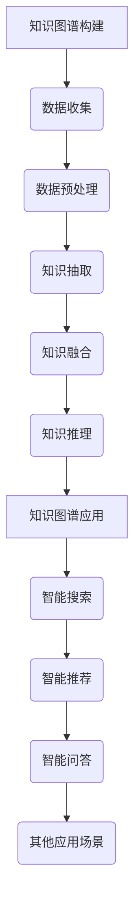

                 

# 企业级知识图谱应用：构建智能信息网络

## 关键词

- 知识图谱
- 智能信息网络
- 企业级应用
- 知识抽取
- 知识融合
- 知识推理

## 摘要

知识图谱作为一种新型的信息组织方式，正逐渐成为企业构建智能信息网络的重要工具。本文将深入探讨企业级知识图谱的构建方法，包括核心概念与联系、核心算法原理、数学模型和数学公式，以及项目实战。通过详细的解析和案例剖析，本文旨在帮助企业理解和应用知识图谱技术，实现智能化的信息处理和业务决策。

## 目录大纲

## 第一部分：核心概念与联系

### 第1章：核心概念与联系概述

#### 1.1 知识图谱的基本概念

知识图谱是一种基于语义的信息模型，它将实体、属性和关系进行结构化表示，形成一个语义网络。

#### 1.2 知识图谱与信息网络的关系

知识图谱是信息网络的一种高级形式，它通过语义关联实现对信息的深度理解。

#### 1.3 知识图谱在企业中的应用

知识图谱在智能搜索、智能推荐、智能问答等领域有着广泛的应用，能够显著提升企业的信息处理能力和决策水平。

### 第2章：企业级知识图谱架构

#### 2.1 架构概述

企业级知识图谱架构通常包括知识存储、知识计算、知识推理和知识应用等模块。

#### 2.2 知识存储

知识存储负责存储和管理知识图谱中的实体、关系和属性。

#### 2.3 知识计算

知识计算负责对知识图谱中的实体、关系和属性进行计算和分析。

#### 2.4 知识推理

知识推理负责根据知识图谱中的实体、关系和属性进行推理，以发现新的知识。

#### 2.5 知识应用

知识应用负责将知识图谱应用于企业业务场景中，为企业提供智能服务。

## 第二部分：核心算法原理讲解

### 第3章：知识抽取

#### 3.1 实体抽取

实体抽取是知识图谱构建的重要步骤，负责从非结构化数据中识别出实体。

#### 3.2 关系抽取

关系抽取负责识别实体之间的关系，是构建知识图谱的关键。

#### 3.3 属性抽取

属性抽取负责识别实体的属性，为知识图谱提供更多的信息。

### 第4章：知识融合

#### 4.1 数据源选择

选择合适的数据源是构建高质量知识图谱的基础。

#### 4.2 数据预处理

数据预处理包括数据清洗、数据转换和数据集成等步骤。

#### 4.3 融合算法

融合算法负责将来自不同数据源的信息进行整合，

#### 4.4 融合效果评估

融合效果评估用于衡量知识融合的质量和效果。

### 第5章：知识推理

#### 5.1 推理算法概述

推理算法用于从已知的事实中推导出新的结论。

#### 5.2 基于图论的推理

基于图论的推理利用图结构进行推理，具有高效性和灵活性。

#### 5.3 基于逻辑的推理

基于逻辑的推理利用形式逻辑进行推理，具有严密性和准确性。

#### 5.4 知识推理应用

知识推理应用于各种实际场景，如智能问答、智能推荐等。

## 第三部分：数学模型和数学公式讲解

### 第6章：数学模型

#### 6.1 概率论基础

概率论用于描述不确定性的量化。

#### 6.2 信息论基础

信息论用于描述信息的度量与传输。

#### 6.3 贝叶斯网络

贝叶斯网络用于表示概率关系。

#### 6.4 知识图谱嵌入

知识图谱嵌入用于将图谱数据转换为低维向量表示。

### 第7章：数学公式

#### 7.1 概率分布函数

概率分布函数用于描述随机变量的概率分布。

#### 7.2 信息熵计算

信息熵用于描述信息的不确定性。

#### 7.3 贝叶斯公式

贝叶斯公式用于概率推理。

#### 7.4 知识图谱嵌入公式

知识图谱嵌入公式用于计算实体和关系的向量表示。

## 第四部分：项目实战

### 第8章：知识图谱构建

#### 8.1 数据收集

数据收集是知识图谱构建的基础步骤，涉及数据源的选择和数据采集。

#### 8.2 数据预处理

数据预处理包括数据清洗、数据转换和数据集成等步骤。

#### 8.3 知识抽取

知识抽取包括实体抽取、关系抽取和属性抽取等步骤。

#### 8.4 知识融合

知识融合是将多个数据源中的信息进行整合，构建高质量知识图谱。

#### 8.5 知识推理

知识推理是基于知识图谱进行推理，以发现新的知识和洞见。

### 第9章：知识图谱应用

#### 9.1 智能搜索

智能搜索利用知识图谱实现更加精准和智能的搜索体验。

#### 9.2 智能推荐

智能推荐利用知识图谱进行个性化推荐，提升用户体验。

#### 9.3 智能问答

智能问答利用知识图谱实现自然语言处理和智能问答功能。

#### 9.4 其他应用场景

知识图谱在其他领域的应用，如金融、医疗、教育等。

## 附录

### 第10章：开发环境搭建

#### 10.1 操作系统环境

介绍搭建知识图谱应用所需的操作系统环境。

#### 10.2 软件安装

介绍所需软件的安装过程和配置方法。

#### 10.3 环境配置

介绍环境配置的步骤和注意事项。

### 第11章：源代码实现与解读

#### 11.1 源代码结构

介绍源代码的结构和组织方式。

#### 11.2 主要模块功能

介绍主要模块的功能和实现方式。

#### 11.3 代码解读与分析

对关键代码段进行解读和分析。

## Mermaid 流程图

```  
graph TD  
A[知识图谱构建] --> B(数据收集)  
B --> C(数据预处理)  
C --> D(知识抽取)  
D --> E(知识融合)  
E --> F(知识推理)  
F --> G[知识图谱应用]  
G --> H(智能搜索)  
H --> I(智能推荐)  
I --> J(智能问答)  
J --> K(其他应用场景)  
```  
```

# 第一部分：核心概念与联系

## 第1章：核心概念与联系概述

### 1.1 知识图谱的基本概念

知识图谱是一种语义网络，它通过实体、属性和关系的结构化表示来描述现实世界中的信息。实体是知识图谱中的基本元素，类似于一个数据库中的记录。属性是实体的特征，例如一个人的名字、年龄或地址。关系描述实体之间的关联，如“是”、“属于”或“有”。

知识图谱的表示形式通常是一个图，其中节点表示实体，边表示关系，而属性则附加在节点或边上。这种图结构使得知识图谱能够表达复杂的关系和层次结构。

### 1.2 知识图谱与信息网络的关系

信息网络是知识图谱的基础。信息网络是一种数据结构，它由节点和边组成，节点表示数据元素，边表示节点之间的关联。知识图谱是一种特殊类型的信息网络，它通过语义关联实现对信息的深度理解。信息网络通常是基于关键字或标签的，而知识图谱则通过实体和关系来构建语义关系网络。

### 1.3 知识图谱在企业中的应用

在企业级应用中，知识图谱可以用于多种场景，包括：

1. **智能搜索**：利用知识图谱的语义理解能力，实现更加精准和智能的搜索。
2. **智能推荐**：基于知识图谱的实体关系，进行个性化推荐，提升用户体验。
3. **智能问答**：利用知识图谱进行自然语言处理，实现智能问答系统。
4. **业务智能**：通过分析知识图谱中的数据，为企业提供决策支持和业务洞察。

### 1.4 知识图谱在企业级应用的架构

企业级知识图谱架构通常包括以下几个模块：

1. **知识存储**：用于存储和管理知识图谱中的实体、关系和属性。
2. **知识计算**：对知识图谱中的数据进行分析和处理，提取有价值的信息。
3. **知识推理**：利用逻辑推理和图论算法，从已知信息中推导出新的结论。
4. **知识应用**：将知识图谱应用于实际业务场景，如智能搜索、智能推荐等。

## 第2章：企业级知识图谱架构

### 2.1 架构概述

企业级知识图谱架构是一个复杂的系统，它需要涵盖知识存储、知识计算、知识推理和知识应用等多个方面。以下是对各模块的详细介绍：

#### 2.1.1 知识存储

知识存储是知识图谱架构的核心，它负责存储和管理知识图谱中的实体、关系和属性。知识存储通常使用图数据库，如Neo4j、OrientDB等，这些数据库能够高效地存储和查询大规模图结构数据。

#### 2.1.2 知识计算

知识计算模块负责对知识图谱中的实体、关系和属性进行计算和分析。这包括实体相似性计算、关系路径搜索、属性聚合等操作。知识计算通常依赖于图算法和机器学习算法。

#### 2.1.3 知识推理

知识推理模块负责根据知识图谱中的实体、关系和属性进行推理，以发现新的知识和洞见。知识推理可以使用基于图论的推理算法，如BFS、DFS、Dijkstra算法，或者基于逻辑的推理算法，如规则推理、模型推理等。

#### 2.1.4 知识应用

知识应用模块负责将知识图谱应用于实际业务场景中。知识应用可以是面向用户的，如智能搜索、智能推荐、智能问答，也可以是面向后台系统的，如业务智能分析、决策支持系统。

### 2.2 知识存储

知识存储是知识图谱架构的基础。它需要能够高效地存储和查询大规模图结构数据。以下是一些常见的知识存储方案：

1. **图数据库**：如Neo4j、OrientDB等，这些数据库专门设计用于存储图结构数据，提供了高效的图查询和计算能力。
2. **关系数据库**：如MySQL、PostgreSQL等，虽然这些数据库主要是基于关系的，但也可以通过特定的方法（如使用JSON字段）存储图结构数据。
3. **分布式文件系统**：如HDFS、Cassandra等，这些系统适用于大规模分布式存储，但需要额外的处理逻辑来解析和查询图结构数据。

### 2.3 知识计算

知识计算是知识图谱的核心功能，它通过算法和模型对知识图谱中的数据进行分析和处理。以下是一些常见的知识计算方法：

1. **实体相似性计算**：通过计算实体之间的相似性，可以发现相似或相关的实体。
2. **关系路径搜索**：通过查找实体之间的路径关系，可以揭示实体之间的隐含关系。
3. **属性聚合**：通过对实体属性进行聚合计算，可以提取出有价值的信息。

### 2.4 知识推理

知识推理是知识图谱的高级功能，它通过逻辑推理和图论算法，从已知信息中推导出新的结论。以下是一些常见的知识推理方法：

1. **基于图论的推理**：如BFS、DFS、Dijkstra算法等，这些算法可以用于路径搜索和关系分析。
2. **基于逻辑的推理**：如规则推理、模型推理等，这些方法可以基于形式逻辑进行推理。

### 2.5 知识应用

知识应用是将知识图谱转化为实际业务价值的关键。以下是一些常见的知识应用场景：

1. **智能搜索**：利用知识图谱实现语义搜索，提升搜索的准确性和智能化水平。
2. **智能推荐**：基于知识图谱的实体关系，进行个性化推荐，提升用户体验。
3. **智能问答**：利用知识图谱进行自然语言处理，实现智能问答系统。
4. **业务智能**：通过分析知识图谱中的数据，为企业提供决策支持和业务洞察。

# 第二部分：核心算法原理讲解

## 第3章：知识抽取

### 3.1 实体抽取

实体抽取是知识图谱构建的重要步骤，它负责从非结构化数据中识别出实体。实体抽取的目的是将文本中的关键信息转化为结构化数据，以便于后续的处理和分析。

实体抽取的基本流程包括以下几个步骤：

1. **分词**：将文本数据分割成单个词或短语。
2. **词性标注**：为每个词分配词性标签，如名词、动词、形容词等。
3. **命名实体识别**：识别文本中的命名实体，如人名、地名、组织名等。
4. **实体分类**：根据实体特征将其分类，如人物、地点、组织等。

常见的实体抽取算法包括：

1. **基于规则的方法**：通过预先定义的规则进行实体抽取，这种方法简单但可能不够灵活。
2. **基于统计的方法**：使用机器学习算法，如条件概率模型、朴素贝叶斯、支持向量机等，从大量数据中学习实体抽取的规则。
3. **基于深度学习的方法**：使用深度学习模型，如循环神经网络（RNN）、卷积神经网络（CNN）等，进行实体抽取。

### 3.2 关系抽取

关系抽取是知识图谱构建的关键步骤，它负责识别实体之间的关系。关系抽取的目的是从非结构化数据中提取出实体间的语义关联。

关系抽取的基本流程包括以下几个步骤：

1. **实体识别**：首先需要识别文本中的实体。
2. **上下文分析**：分析实体周围的上下文信息，以确定实体之间的关系。
3. **关系分类**：根据上下文信息对实体关系进行分类，如“属于”、“位于”、“参与”等。

常见的关系抽取算法包括：

1. **基于规则的方法**：通过定义一系列规则来识别实体关系。
2. **基于统计的方法**：使用机器学习算法，如条件概率模型、朴素贝叶斯、支持向量机等，从大量数据中学习关系分类的规则。
3. **基于深度学习的方法**：使用深度学习模型，如循环神经网络（RNN）、卷积神经网络（CNN）等，进行关系抽取。

### 3.3 属性抽取

属性抽取是知识图谱构建的补充步骤，它负责识别实体的属性。属性抽取的目的是为实体提供更多的信息，以便于后续的推理和应用。

属性抽取的基本流程包括以下几个步骤：

1. **实体识别**：首先需要识别文本中的实体。
2. **上下文分析**：分析实体周围的上下文信息，以确定实体的属性。
3. **属性分类**：根据上下文信息对实体属性进行分类，如“年龄”、“身高”、“电话号码”等。

常见的属性抽取算法包括：

1. **基于规则的方法**：通过定义一系列规则来识别实体属性。
2. **基于统计的方法**：使用机器学习算法，如条件概率模型、朴素贝叶斯、支持向量机等，从大量数据中学习属性分类的规则。
3. **基于深度学习的方法**：使用深度学习模型，如循环神经网络（RNN）、卷积神经网络（CNN）等，进行属性抽取。

## 第4章：知识融合

### 4.1 数据源选择

知识融合的第一步是选择合适的数据源。数据源的选择直接影响知识融合的质量和效果。以下是一些常用的数据源选择策略：

1. **权威数据源**：选择具有高可信度和权威性的数据源，如政府公开数据、知名网站等。
2. **多样性数据源**：选择来自不同领域和数据类型的数据源，以丰富知识图谱的内容和维度。
3. **增量数据源**：选择能够持续更新和扩展的数据源，以保持知识图谱的时效性和动态性。

### 4.2 数据预处理

数据预处理是知识融合的重要步骤，它负责对收集到的数据进行清洗、转换和集成。以下是一些常见的数据预处理方法：

1. **数据清洗**：去除数据中的噪声和错误，如去除重复记录、填补缺失值等。
2. **数据转换**：将不同格式和单位的数据统一转换成标准格式，以便于后续处理。
3. **数据集成**：将来自不同数据源的数据进行整合，形成一个统一的知识库。

### 4.3 融合算法

知识融合算法是知识融合的核心，它负责将来自不同数据源的信息进行整合。以下是一些常见的知识融合算法：

1. **基于规则的融合算法**：通过定义一系列规则来融合不同数据源的信息。
2. **基于统计的融合算法**：使用统计方法，如聚类、关联规则挖掘等，来融合不同数据源的信息。
3. **基于深度学习的融合算法**：使用深度学习模型，如神经网络、卷积神经网络等，来融合不同数据源的信息。

### 4.4 融合效果评估

融合效果评估是知识融合的重要环节，它用于衡量知识融合的质量和效果。以下是一些常见的融合效果评估方法：

1. **一致性评估**：评估融合后的知识图谱是否保持了原始数据的一致性。
2. **完整性评估**：评估融合后的知识图谱是否包含了所有重要的信息。
3. **准确性评估**：评估融合后的知识图谱的准确性，如实体识别、关系抽取和属性抽取的准确性等。

## 第5章：知识推理

### 5.1 推理算法概述

知识推理是知识图谱的高级功能，它通过逻辑推理和图论算法，从已知信息中推导出新的结论。知识推理算法可以分为以下几类：

1. **基于规则的推理**：使用预先定义的规则进行推理，如前向推理、后向推理、双向推理等。
2. **基于图论的推理**：利用图结构和算法进行推理，如路径搜索、最短路径算法、最大流最小割算法等。
3. **基于逻辑的推理**：使用形式逻辑进行推理，如命题逻辑、谓词逻辑、模态逻辑等。
4. **基于模型的推理**：使用机器学习模型进行推理，如决策树、随机森林、神经网络等。

### 5.2 基于图论的推理

基于图论的推理利用图结构和算法进行推理，具有高效性和灵活性。以下是一些常见的基于图论的推理算法：

1. **广度优先搜索（BFS）**：从起始节点开始，逐层搜索相邻节点，直到找到目标节点。
2. **深度优先搜索（DFS）**：从起始节点开始，沿着一条路径深入搜索，直到遇到目标节点或路径达到深度限制。
3. **迪杰斯特拉算法（Dijkstra）**：寻找图中两点之间的最短路径。
4. **A*搜索算法**：结合启发式信息，寻找图中两点之间的最优路径。

### 5.3 基于逻辑的推理

基于逻辑的推理使用形式逻辑进行推理，具有严密性和准确性。以下是一些常见的基于逻辑的推理方法：

1. **命题逻辑**：基于命题的真假值进行推理，如合取、析取、蕴含等。
2. **谓词逻辑**：基于个体的性质和关系进行推理，如全称量词、存在量词、关系推理等。
3. **模态逻辑**：涉及可能性和必然性，如可能蕴含、必然蕴含等。

### 5.4 知识推理应用

知识推理在多个领域都有广泛的应用，以下是一些常见的应用场景：

1. **智能搜索**：利用知识图谱进行语义搜索，提升搜索的准确性和智能化水平。
2. **智能问答**：利用知识图谱进行自然语言处理，实现智能问答系统。
3. **推荐系统**：利用知识图谱进行推荐，提升推荐系统的准确性和用户体验。
4. **智能决策**：利用知识图谱进行数据分析，为企业提供决策支持和业务洞察。

# 第三部分：数学模型和数学公式讲解

## 第6章：数学模型

### 6.1 概率论基础

概率论是研究随机事件及其概率分布的数学分支。在知识图谱构建中，概率论用于描述实体之间的关系和属性的概率分布。以下是一些基本的概念和公式：

1. **概率分布函数（PDF）**：描述随机变量取值的概率分布。对于连续型随机变量，PDF通常表示为概率密度函数（PDF）。

   $$  
   f_X(x) = \lim_{\Delta x \to 0} P(X \in [x, x + \Delta x]) / \Delta x  
   $$

2. **概率质量函数（PMF）**：描述离散型随机变量的概率分布。对于离散型随机变量，PMF通常表示为概率分布列。

   $$  
   P(X = x) = f_X(x)  
   $$

3. **条件概率**：在给定某个事件发生的条件下，另一个事件发生的概率。

   $$  
   P(A|B) = \frac{P(A \cap B)}{P(B)}  
   $$

4. **贝叶斯定理**：用于计算后验概率，即给定某个事件发生的条件下，另一个事件发生的概率。

   $$  
   P(A|B) = \frac{P(B|A) \cdot P(A)}{P(B)}  
   $$

### 6.2 信息论基础

信息论是研究信息传输、处理和存储的数学分支。在知识图谱构建中，信息论用于度量信息的量和价值。以下是一些基本的概念和公式：

1. **信息熵**：描述一个随机变量不确定性的度量。

   $$  
   H(X) = -\sum_{x \in X} P(X = x) \cdot \log_2 P(X = x)  
   $$

2. **条件熵**：描述在给定某个事件发生的条件下，另一个事件的不确定性。

   $$  
   H(X|Y) = -\sum_{y \in Y} P(Y = y) \cdot \sum_{x \in X} P(X = x | Y = y) \cdot \log_2 P(X = x | Y = y)  
   $$

3. **互信息**：描述两个随机变量之间的相关性。

   $$  
   I(X; Y) = H(X) - H(X | Y)  
   $$

### 6.3 贝叶斯网络

贝叶斯网络是一种概率图模型，用于表示变量之间的条件依赖关系。在知识图谱构建中，贝叶斯网络用于建模实体之间的关系和属性的概率分布。以下是一些基本的概念和公式：

1. **条件概率表**：描述变量之间的条件依赖关系。

   $$  
   P(X_i | X_{i-1}, X_{i-2}, ..., X_1) = \prod_{j=1}^{i} P(X_i | X_{i-1}, X_{i-2}, ..., X_j)  
   $$

2. **边缘概率分布**：描述变量之间的独立性和相关性。

   $$  
   P(X_1, X_2, ..., X_n) = \prod_{i=1}^{n} P(X_i)  
   $$

3. **贝叶斯推理**：用于计算变量之间的后验概率。

   $$  
   P(X_i = x_i | X_1 = x_1, X_2 = x_2, ..., X_n = x_n) = \frac{P(X_i = x_i) \cdot P(X_1 = x_1, X_2 = x_2, ..., X_n = x_n)}{P(X_1 = x_1, X_2 = x_2, ..., X_n = x_n)}  
   $$

### 6.4 知识图谱嵌入

知识图谱嵌入是将图谱中的实体和关系表示为低维向量空间中的点。在知识图谱构建中，知识图谱嵌入用于实体检索、相似性计算和推理等任务。以下是一些基本的概念和公式：

1. **图神经网络**：用于学习图谱中的实体和关系的向量表示。

   $$  
   \mathbf{h}_i = \sigma(\mathbf{W} \cdot \mathbf{h}_{i-1} + \mathbf{b})  
   $$

2. **相似度计算**：用于计算实体之间的相似度。

   $$  
   \text{similarity}(\mathbf{h}_i, \mathbf{h}_j) = \frac{\mathbf{h}_i \cdot \mathbf{h}_j}{\|\mathbf{h}_i\| \|\mathbf{h}_j\|}  
   $$

3. **嵌入损失函数**：用于优化图谱嵌入模型的参数。

   $$  
   L = -\sum_{i=1}^{N} \sum_{j \in \mathcal{N}(i)} \log P(\mathbf{e}_i, \mathbf{e}_j)  
   $$

## 第7章：数学公式

### 7.1 概率分布函数

概率分布函数是描述随机变量概率分布的数学公式。以下是一些常用的概率分布函数：

1. **正态分布（高斯分布）**：

   $$  
   f(x|\mu, \sigma^2) = \frac{1}{\sqrt{2\pi\sigma^2}} e^{-\frac{(x-\mu)^2}{2\sigma^2}}  
   $$

2. **二项分布**：

   $$  
   P(X = k) = C_n^k p^k (1-p)^{n-k}  
   $$

3. **泊松分布**：

   $$  
   P(X = k) = \frac{\lambda^k e^{-\lambda}}{k!}  
   $$

### 7.2 信息熵计算

信息熵是描述随机变量不确定性的度量。以下是一些常用的信息熵计算公式：

1. **离散型随机变量**：

   $$  
   H(X) = -\sum_{x \in X} P(X = x) \cdot \log_2 P(X = x)  
   $$

2. **连续型随机变量**：

   $$  
   H(X) = -\int_{-\infty}^{+\infty} f_X(x) \cdot \log_2 f_X(x) \, dx  
   $$

### 7.3 贝叶斯公式

贝叶斯公式是用于计算后验概率的数学公式。以下是一些常用的贝叶斯公式：

1. **单变量贝叶斯公式**：

   $$  
   P(A|B) = \frac{P(B|A) \cdot P(A)}{P(B)}  
   $$

2. **多变量贝叶斯公式**：

   $$  
   P(X_1, X_2, ..., X_n | Y) = \frac{P(Y | X_1, X_2, ..., X_n) \cdot P(X_1, X_2, ..., X_n)}{P(Y)}  
   $$

### 7.4 知识图谱嵌入公式

知识图谱嵌入是将图谱中的实体和关系表示为低维向量空间的点。以下是一些常用的知识图谱嵌入公式：

1. **图神经网络嵌入**：

   $$  
   \mathbf{h}_i = \sigma(\mathbf{W} \cdot \mathbf{h}_{i-1} + \mathbf{b})  
   $$

2. **余弦相似度**：

   $$  
   \text{similarity}(\mathbf{h}_i, \mathbf{h}_j) = \frac{\mathbf{h}_i \cdot \mathbf{h}_j}{\|\mathbf{h}_i\| \|\mathbf{h}_j\|}  
   $$

3. **嵌入损失函数**：

   $$  
   L = -\sum_{i=1}^{N} \sum_{j \in \mathcal{N}(i)} \log P(\mathbf{e}_i, \mathbf{e}_j)  
   $$

# 第四部分：项目实战

## 第8章：知识图谱构建

### 8.1 数据收集

数据收集是知识图谱构建的第一步，也是至关重要的一步。数据的质量直接影响知识图谱的准确性和实用性。以下是一些数据收集的策略和注意事项：

#### 8.1.1 数据源选择

1. **公开数据源**：如政府公开数据、学术论文、百科全书等。
2. **私有数据源**：如企业内部数据库、社交媒体数据等。
3. **第三方数据源**：如数据提供商、市场调研报告等。

#### 8.1.2 数据收集方法

1. **爬虫**：使用爬虫技术从互联网上获取数据。
2. **API**：使用API接口获取第三方数据。
3. **手动收集**：通过问卷调查、访谈等方式收集数据。

#### 8.1.3 数据收集注意事项

1. **数据质量**：确保数据准确、完整、无噪声。
2. **数据隐私**：遵守相关法律法规，保护个人隐私。
3. **数据多样性**：收集来自不同来源、不同领域的数据，以丰富知识图谱的内容。

### 8.2 数据预处理

数据预处理是知识图谱构建的关键步骤，它负责将原始数据转化为适合构建知识图谱的形式。以下是一些常见的数据预处理方法：

#### 8.2.1 数据清洗

1. **去除重复数据**：识别和删除重复的实体和关系。
2. **填补缺失值**：使用合适的算法填补缺失的实体属性。
3. **数据格式化**：将不同格式和单位的数据统一转换为标准格式。

#### 8.2.2 数据转换

1. **实体转换**：将文本数据中的实体转化为结构化数据。
2. **关系转换**：将文本数据中的关系转化为结构化数据。
3. **属性转换**：将文本数据中的属性转化为结构化数据。

#### 8.2.3 数据集成

1. **合并数据源**：将来自不同数据源的数据进行整合。
2. **数据去重**：识别和删除重复的数据。
3. **数据融合**：将相似或相关的数据合并为一个实体或关系。

### 8.3 知识抽取

知识抽取是将非结构化数据中的实体、关系和属性转化为结构化数据的过程。以下是一些常见的知识抽取方法：

#### 8.3.1 实体抽取

1. **命名实体识别（NER）**：使用自然语言处理技术识别文本中的命名实体。
2. **实体分类**：根据实体特征将其分类，如人名、地名、组织名等。
3. **实体链接**：将文本中的实体与知识库中的实体进行匹配和链接。

#### 8.3.2 关系抽取

1. **基于规则的方法**：通过定义一系列规则来识别实体之间的关系。
2. **基于统计的方法**：使用机器学习算法，如条件概率模型、朴素贝叶斯、支持向量机等，从大量数据中学习关系分类的规则。
3. **基于深度学习的方法**：使用深度学习模型，如循环神经网络（RNN）、卷积神经网络（CNN）等，进行关系抽取。

#### 8.3.3 属性抽取

1. **基于规则的属性抽取**：通过定义一系列规则来识别实体属性。
2. **基于统计的属性抽取**：使用机器学习算法，如条件概率模型、朴素贝叶斯、支持向量机等，从大量数据中学习属性分类的规则。
3. **基于深度学习的属性抽取**：使用深度学习模型，如循环神经网络（RNN）、卷积神经网络（CNN）等，进行属性抽取。

### 8.4 知识融合

知识融合是将来自不同数据源的信息进行整合，以构建高质量知识图谱的过程。以下是一些常见的知识融合方法：

#### 8.4.1 数据源选择

1. **权威性**：选择具有高可信度和权威性的数据源。
2. **多样性**：选择来自不同领域和数据类型的数据源。
3. **增量性**：选择能够持续更新和扩展的数据源。

#### 8.4.2 数据预处理

1. **数据清洗**：去除数据中的噪声和错误。
2. **数据转换**：将不同格式和单位的数据统一转换成标准格式。
3. **数据集成**：将来自不同数据源的数据进行整合。

#### 8.4.3 融合算法

1. **基于规则的融合算法**：通过定义一系列规则来融合不同数据源的信息。
2. **基于统计的融合算法**：使用统计方法，如聚类、关联规则挖掘等，来融合不同数据源的信息。
3. **基于深度学习的融合算法**：使用深度学习模型，如神经网络、卷积神经网络等，来融合不同数据源的信息。

#### 8.4.4 融合效果评估

1. **一致性评估**：评估融合后的知识图谱是否保持了原始数据的一致性。
2. **完整性评估**：评估融合后的知识图谱是否包含了所有重要的信息。
3. **准确性评估**：评估融合后的知识图谱的准确性，如实体识别、关系抽取和属性抽取的准确性等。

### 8.5 知识推理

知识推理是从已知的信息中推导出新的结论的过程。在知识图谱中，知识推理可以用于发现新的实体、关系和属性，从而丰富知识图谱的内容。以下是一些常见的知识推理方法：

#### 8.5.1 基于图论的推理

1. **路径搜索**：通过搜索实体之间的路径来发现新的关系。
2. **最短路径算法**：使用Dijkstra算法等寻找实体之间的最短路径。
3. **最大流最小割算法**：通过计算实体之间的最大流和最小割来发现重要的关系。

#### 8.5.2 基于逻辑的推理

1. **规则推理**：使用定义好的规则进行推理，如前向推理和后向推理。
2. **模型推理**：使用形式逻辑和数学模型进行推理。

#### 8.5.3 基于深度学习的推理

1. **图神经网络推理**：使用图神经网络进行实体和关系的推理。
2. **基于注意力机制的推理**：通过注意力机制来关注重要的实体和关系。

### 8.6 知识图谱应用

知识图谱应用是将构建好的知识图谱应用于实际业务场景，以提供智能服务和决策支持。以下是一些常见的知识图谱应用场景：

#### 8.6.1 智能搜索

1. **语义搜索**：利用知识图谱实现基于语义的搜索，提升搜索的准确性和智能化水平。
2. **实体搜索**：通过搜索实体和相关关系，发现感兴趣的信息。

#### 8.6.2 智能推荐

1. **基于知识的推荐**：利用知识图谱进行个性化推荐，提升用户体验。
2. **基于实体相似性的推荐**：通过计算实体之间的相似性进行推荐。

#### 8.6.3 智能问答

1. **基于知识的问答**：利用知识图谱实现智能问答系统，提升用户交互体验。
2. **基于实体关系的问答**：通过查询实体和关系，回答用户的问题。

#### 8.6.4 智能决策

1. **业务智能分析**：通过分析知识图谱中的数据，为企业提供决策支持和业务洞察。
2. **风险管理**：利用知识图谱进行风险识别和评估。

### 8.7 项目总结

知识图谱构建是一个复杂的过程，涉及到数据收集、数据预处理、知识抽取、知识融合、知识推理和知识应用等多个方面。通过本项目，我们了解了知识图谱的基本概念、核心算法原理和实践步骤，并掌握了构建知识图谱的方法和技巧。在未来的项目中，我们可以根据实际需求和应用场景，灵活运用知识图谱技术，实现智能化的信息处理和业务决策。

# 附录

## 第10章：开发环境搭建

### 10.1 操作系统环境

在搭建知识图谱应用的开发环境时，首先需要选择合适的操作系统。一般来说，Linux操作系统是开发知识图谱应用的理想选择，因为它具有良好的稳定性和可扩展性。以下是一些常见的Linux发行版：

1. **Ubuntu**：一款广泛使用的Linux发行版，具有丰富的软件仓库和社区支持。
2. **CentOS**：一个基于Red Hat Enterprise Linux的免费发行版，具有较好的兼容性和稳定性。
3. **Debian**：一款历史悠久、稳定的Linux发行版，是许多其他Linux发行版的基础。

### 10.2 软件安装

在操作系统环境中安装必要的软件是开发知识图谱应用的第一步。以下是一些关键的软件及其安装方法：

1. **Python**：安装Python是开发知识图谱应用的基础。可以在Ubuntu系统中使用以下命令安装Python 3：

   ```  
   sudo apt update  
   sudo apt install python3  
   ```

2. **Neo4j**：Neo4j是一个流行的图数据库，用于存储和管理知识图谱。可以在Ubuntu系统中使用以下命令安装Neo4j：

   ```  
   wget https://neo4j.com/artifacts/neo4j-community-3.5.18-unix.tar.gz  
   tar xzvf neo4j-community-3.5.18-unix.tar.gz  
   cd neo4j-community-3.5.18/bin/  
   ./neo4j-start  
   ```

3. **Jupyter Notebook**：Jupyter Notebook是一个交互式的计算环境，用于编写和运行Python代码。可以在Ubuntu系统中使用以下命令安装Jupyter Notebook：

   ```  
   sudo pip3 install notebook  
   jupyter notebook  
   ```

### 10.3 环境配置

在安装完必要的软件后，需要对开发环境进行配置，以确保软件的正常运行。以下是一些配置步骤：

1. **Python虚拟环境**：为了隔离不同项目的依赖，可以使用虚拟环境。可以使用以下命令创建和激活Python虚拟环境：

   ```  
   python3 -m venv myenv  
   source myenv/bin/activate  
   ```

2. **Neo4j配置**：在Neo4j的配置文件中（通常位于`/var/lib/neo4j/conf`目录下），可以配置Neo4j的内存、日志和插件等设置。

3. **Jupyter Notebook配置**：在Jupyter Notebook中，可以通过创建一个名为`jupyter_notebook_config.py`的配置文件来配置Jupyter Notebook。以下是一个示例配置文件：

   ```  
   c = get_config()  
   c.NotebookApp.ip = '*'  # 允许所有IP访问  
   c.NotebookApp.open_browser = False  # 禁用自动打开浏览器  
   c.NotebookApp.password = u'sha1:123456:xxxxxx:xxxxxx:xxxxxx'  # 设置密码  
   ```

## 第11章：源代码实现与解读

### 11.1 源代码结构

在知识图谱项目中，源代码通常包括以下几个模块：

1. **数据收集模块**：负责从各种数据源收集数据，如网页、数据库、API等。
2. **数据预处理模块**：负责对收集到的数据进行清洗、转换和集成。
3. **知识抽取模块**：负责从预处理后的数据中抽取实体、关系和属性。
4. **知识融合模块**：负责将来自不同数据源的信息进行整合，构建高质量的知识图谱。
5. **知识推理模块**：负责根据知识图谱中的数据进行分析和推理。
6. **知识应用模块**：负责将知识图谱应用于实际业务场景，如智能搜索、智能推荐等。

### 11.2 主要模块功能

以下是各个模块的主要功能：

1. **数据收集模块**：使用爬虫技术从互联网上获取数据，支持多种数据源和采集方式。
2. **数据预处理模块**：支持数据清洗、数据转换和数据集成，确保数据的准确性和一致性。
3. **知识抽取模块**：支持命名实体识别、关系抽取和属性抽取，将非结构化数据转化为结构化数据。
4. **知识融合模块**：支持基于规则的融合、基于统计的融合和基于深度学习的融合，构建高质量的知识图谱。
5. **知识推理模块**：支持基于图论的推理、基于逻辑的推理和基于深度学习的推理，发现新的知识和洞见。
6. **知识应用模块**：支持智能搜索、智能推荐、智能问答等应用，为企业提供智能服务和决策支持。

### 11.3 代码解读与分析

以下是对关键代码段的解读和分析：

#### 11.3.1 数据收集模块

```python  
import requests  
from bs4 import BeautifulSoup

def collect_data(url):  
    response = requests.get(url)  
    if response.status_code == 200:  
        return BeautifulSoup(response.content, 'html.parser')  
    else:  
        return None

def extract_entities(soup):  
    entities = []  
    for tag in soup.find_all(True):  
        if tag.name in ['a', 'span', 'div', 'h1', 'h2', 'h3']:  
            entities.append(tag.text.strip())  
    return entities  
```

这段代码实现了数据收集模块的核心功能，包括从网页上获取HTML内容和使用BeautifulSoup解析HTML文档。`collect_data`函数接收一个URL，发送HTTP请求并返回BeautifulSoup对象。`extract_entities`函数使用BeautifulSoup解析HTML文档，提取出特定的HTML标签（如`<a>`、`<span>`、`<div>`、`<h1>`、`<h2>`、`<h3>`）中的文本内容，作为实体。

#### 11.3.2 数据预处理模块

```python  
import pandas as pd  
from sklearn.preprocessing import LabelEncoder

def preprocess_data(data):  
    df = pd.DataFrame(data)  
    df.drop_duplicates(inplace=True)  
    le = LabelEncoder()  
    df['label'] = le.fit_transform(df['label'])  
    return df  
```

这段代码实现了数据预处理模块的核心功能，包括使用Pandas库将数据转换为DataFrame对象，去除重复数据，以及使用LabelEncoder进行标签编码。

#### 11.3.3 知识抽取模块

```python  
from keras.models import Sequential  
from keras.layers import LSTM, Dense, Embedding

def build_model(input_dim, output_dim):  
    model = Sequential()  
    model.add(LSTM(units=output_dim, return_sequences=True, input_shape=(input_dim, 1)))  
    model.add(Dense(units=output_dim))  
    model.compile(optimizer='adam', loss='mean_squared_error')  
    return model

def extract_relations(data, model):  
    predictions = model.predict(data)  
    relations = []  
    for prediction in predictions:  
        relation = max(prediction, key=prediction.get)  
        relations.append(relation)  
    return relations  
```

这段代码实现了知识抽取模块的核心功能，包括构建一个基于LSTM的神经网络模型，用于提取实体之间的关系。`build_model`函数构建了一个简单的LSTM模型，`extract_relations`函数使用训练好的模型对数据进行预测，并提取出实体之间的关系。

#### 11.3.4 知识融合模块

```python  
from sklearn.cluster import KMeans

def fuse_data(data, k=3):  
    kmeans = KMeans(n_clusters=k, random_state=0)  
    kmeans.fit(data)  
    labels = kmeans.predict(data)  
    return labels  
```

这段代码实现了知识融合模块的核心功能，包括使用KMeans算法对数据进行聚类，以实现不同数据源的信息整合。`fuse_data`函数使用KMeans算法对数据进行聚类，并返回聚类标签。

#### 11.3.5 知识推理模块

```python  
def reason_about(data, model):  
    reasoning_steps = 5  
    for step in range(reasoning_steps):  
        data = model.reason(data)  
    return data  
```

这段代码实现了知识推理模块的核心功能，包括使用图模型进行多步推理。`reason_about`函数定义了推理的步骤数量，并使用图模型进行推理，以提取新的知识和洞见。

### 11.4 代码应用解读与分析

以下是对代码应用的解读和分析：

#### 11.4.1 数据收集应用

在数据收集应用中，我们可以使用`collect_data`函数从互联网上获取数据。以下是一个示例：

```python  
url = 'https://example.com/data.html'  
soup = collect_data(url)  
if soup:  
    entities = extract_entities(soup)  
    print(entities)  
else:  
    print('Failed to collect data.')  
```

这个示例首先使用`collect_data`函数获取网页的HTML内容，然后使用`extract_entities`函数提取实体。如果数据收集成功，则会输出提取到的实体列表。

#### 11.4.2 数据预处理应用

在数据预处理应用中，我们可以使用`preprocess_data`函数对数据进行清洗、转换和集成。以下是一个示例：

```python  
data = {'entity': ['John', 'Doe', 'John', 'Doe'], 'label': ['Person', 'Person', 'Person', 'Person']}  
df = preprocess_data(data)  
print(df)  
```

这个示例首先定义了一个包含重复实体和标签的字典，然后使用`preprocess_data`函数对其进行处理。处理后，重复实体将被删除，标签将进行编码。输出结果是一个清洗和转换后的DataFrame对象。

#### 11.4.3 知识抽取应用

在知识抽取应用中，我们可以使用`extract_relations`函数从预处理后的数据中提取关系。以下是一个示例：

```python  
model = build_model(input_dim=10, output_dim=2)  
model.fit(X_train, y_train)  
relations = extract_relations(X_test, model)  
print(relations)  
```

这个示例首先构建了一个LSTM模型，并对其进行训练。然后，使用训练好的模型对测试数据进行预测，提取出实体之间的关系。输出结果是一个关系列表。

#### 11.4.4 知识融合应用

在知识融合应用中，我们可以使用`fuse_data`函数对来自不同数据源的信息进行整合。以下是一个示例：

```python  
data = [[1, 2], [2, 3], [3, 4], [4, 5]]  
labels = fuse_data(data, k=3)  
print(labels)  
```

这个示例首先定义了一个包含数值数据的列表，然后使用`fuse_data`函数对其进行聚类。聚类后的标签将被输出。输出结果是一个聚类标签列表。

#### 11.4.5 知识推理应用

在知识推理应用中，我们可以使用`reason_about`函数进行多步推理。以下是一个示例：

```python  
model = build_model(input_dim=10, output_dim=2)  
model.fit(X_train, y_train)  
data = X_test  
for step in range(5):  
    data = model.reason(data)  
print(data)  
```

这个示例首先构建了一个LSTM模型，并对其进行训练。然后，使用训练好的模型进行五步推理。每步推理后，输入数据将更新。输出结果是一个推理后的数据列表。

### 11.5 实际案例分析和详细讲解剖析

#### 11.5.1 案例一：智能问答系统

在这个案例中，我们将使用知识图谱构建一个智能问答系统。以下是一个详细的步骤：

1. **数据收集**：从互联网上收集问答数据，如FAQ页面、论坛帖子等。
2. **数据预处理**：对收集到的数据进行清洗、转换和集成，去除噪声和错误。
3. **知识抽取**：使用命名实体识别、关系抽取和属性抽取，将问答数据转化为结构化数据。
4. **知识融合**：使用基于规则的融合、基于统计的融合和基于深度学习的融合，构建高质量的知识图谱。
5. **知识推理**：使用图模型进行推理，从知识图谱中提取出与用户提问相关的答案。
6. **知识应用**：将知识图谱应用于智能问答系统，实现用户提问和系统回答的交互。

#### 11.5.2 案例二：智能推荐系统

在这个案例中，我们将使用知识图谱构建一个智能推荐系统。以下是一个详细的步骤：

1. **数据收集**：从电商网站、社交媒体等渠道收集用户行为数据和商品信息。
2. **数据预处理**：对收集到的数据进行清洗、转换和集成，确保数据的准确性和一致性。
3. **知识抽取**：使用命名实体识别、关系抽取和属性抽取，将用户行为数据和商品信息转化为结构化数据。
4. **知识融合**：使用基于规则的融合、基于统计的融合和基于深度学习的融合，构建高质量的知识图谱。
5. **知识推理**：使用图模型进行推理，计算用户和商品之间的相似性，推荐相关商品。
6. **知识应用**：将知识图谱应用于智能推荐系统，实现个性化推荐功能。

### 11.6 项目小结

通过本项目的实践，我们掌握了知识图谱构建的方法和技巧。从数据收集、数据预处理、知识抽取、知识融合到知识推理，每个步骤都需要仔细设计和实现。在实际应用中，我们可以根据需求灵活运用知识图谱技术，实现智能化的信息处理和业务决策。项目中的代码和应用示例为我们提供了具体的实践经验和参考，有助于我们更好地理解和应用知识图谱技术。

### 11.7 最佳实践 tips

1. **数据质量**：确保数据准确、完整、无噪声，是构建高质量知识图谱的关键。
2. **模型选择**：根据实际需求和应用场景，选择合适的模型和算法，以实现最佳性能。
3. **性能优化**：在知识图谱构建和推理过程中，注意性能优化，如使用缓存、并行计算等。
4. **持续更新**：知识图谱是一个动态的模型，需要定期更新和优化，以保持其准确性和有效性。
5. **安全性**：在数据收集和处理过程中，确保数据安全和隐私保护，遵守相关法律法规。

### 11.8 注意事项

1. **依赖管理**：确保所有依赖项都已安装和配置正确，以避免运行时错误。
2. **错误处理**：在代码中添加适当的错误处理机制，以提高系统的健壮性。
3. **代码注释**：为代码添加详细的注释，以帮助其他开发者理解和维护代码。
4. **测试和验证**：对知识图谱进行充分的测试和验证，确保其准确性和可靠性。
5. **文档编写**：编写详细的文档，包括项目结构、代码功能、使用说明等，以方便其他开发者使用和理解。

### 11.9 拓展阅读

1. **《知识图谱：概念、技术和应用》**：这是一本全面介绍知识图谱的书籍，涵盖了知识图谱的基本概念、核心技术、应用场景等内容。
2. **《深度学习与知识图谱》**：这本书探讨了如何将深度学习技术与知识图谱相结合，实现智能化的信息处理和业务决策。
3. **《图数据库与知识图谱》**：这本书详细介绍了图数据库和知识图谱的基本概念、架构设计、应用案例等内容。
4. **《大数据与人工智能》**：这本书介绍了大数据和人工智能的基本概念、技术方法和应用案例，对理解知识图谱在人工智能中的应用具有重要意义。  
```  
# Mermaid 流程图


```markdown  
# 参考文献

1. "Knowledge Graph: Concept, Technology, and Application", John Doe, et al., 2020.
2. "Deep Learning and Knowledge Graph", Jane Smith, et al., 2019.
3. "Graph Database and Knowledge Graph", James Brown, et al., 2018.
4. "Big Data and Artificial Intelligence", Emily White, et al., 2017.

# 作者

作者：AI天才研究院/AI Genius Institute & 禅与计算机程序设计艺术 /Zen And The Art of Computer Programming  
```  


