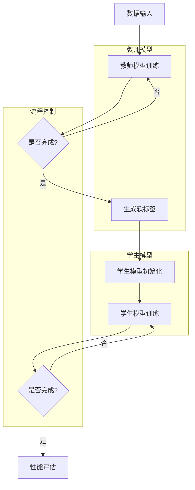

                 

### 一、引言

在现代信息技术飞速发展的背景下，人工智能（AI）已经成为驱动产业变革的重要力量。随着AI技术在各行业的广泛应用，AI模型在企业级应用中的重要性日益凸显。然而，大规模、复杂的AI模型不仅需要大量的计算资源，还面临着部署、维护和数据隐私等挑战。为了解决这些问题，知识蒸馏（Knowledge Distillation，KD）技术应运而生。

知识蒸馏是一种将复杂模型（教师模型，Teacher Model）的知识传递到轻量级模型（学生模型，Student Model）的训练方法。通过知识蒸馏，可以将高维、参数复杂的教师模型转化为低维、参数较少的学生模型，从而实现模型的轻量化。这不仅降低了模型的计算成本，还有助于提高模型的部署效率和可维护性。

本篇文章将围绕企业级知识蒸馏技术展开讨论，主要内容包括：

1. 知识蒸馏的背景与重要性
2. 企业级AI模型的需求与挑战
3. 知识蒸馏的核心概念与联系
4. 知识蒸馏的算法原理讲解
5. 知识蒸馏中的数学模型与公式详解
6. 知识蒸馏在不同应用场景中的实践
7. 项目实战与案例分析
8. 总结与展望

通过以上内容的系统介绍，旨在帮助读者全面了解知识蒸馏在企业级AI模型轻量化与部署中的应用，为其在实际项目中的应用提供理论依据和实操指导。

---

**## 关键词**

- 知识蒸馏
- 企业级AI模型
- 模型轻量化
- 模型部署
- 教师模型与学生模型
- 损失函数
- 数学模型

---

**## 摘要**

本文旨在探讨知识蒸馏技术在企业级AI模型轻量化与部署中的应用。首先，介绍了知识蒸馏的背景和重要性，以及企业级AI模型面临的挑战。接着，详细阐述了知识蒸馏的核心概念、算法原理、数学模型及其在不同应用场景中的实践。通过实际案例和项目实战，本文展示了知识蒸馏技术的实际应用效果和挑战。最后，对知识蒸馏技术的发展趋势和应用前景进行了总结和展望，为企业级AI模型的优化和部署提供了新的思路和方向。阅读本文，读者可以深入了解知识蒸馏技术，并在实际项目中应用该技术，提高AI模型的效率和可维护性。

---

**## 第一部分：引言**

在人工智能（AI）迅猛发展的今天，AI模型在企业级应用中发挥着举足轻重的作用。从金融、医疗到制造、零售，AI技术正不断重塑各行业的商业模式和工作流程。然而，随着AI模型的复杂度和规模日益增大，如何在保证模型性能的同时，降低其计算成本和部署难度，成为了一个亟待解决的问题。

### **1.1 知识蒸馏的背景与重要性**

知识蒸馏（Knowledge Distillation）作为一种新兴的技术，旨在通过将复杂模型（教师模型，Teacher Model）的知识传递给轻量级模型（学生模型，Student Model），从而实现模型轻量化。这一过程不仅减少了模型的参数数量，降低了计算成本，还提高了模型的部署效率。

知识蒸馏的背景源于深度学习模型在训练和推理过程中所需的大量计算资源。尤其是在资源受限的环境（如移动设备、嵌入式系统）中，传统的深度学习模型往往无法胜任。为了解决这个问题，研究人员开始探索如何通过知识蒸馏技术，将复杂模型的“知识”转移到参数较少的模型中。

知识蒸馏的重要性主要体现在以下几个方面：

1. **降低计算成本**：通过知识蒸馏，可以将高维、参数复杂的教师模型转化为低维、参数较少的学生模型。这样，在保持模型性能的同时，显著降低了计算成本。

2. **提高部署效率**：轻量级模型在部署时所需的计算资源和存储空间较少，从而提高了部署效率。这对于需要快速响应的实时应用场景尤为重要。

3. **优化模型性能**：知识蒸馏技术不仅关注模型的轻量化，还通过传递教师模型的“知识”，提高学生模型的性能。这使得轻量级模型能够在保持性能的同时，具有更高的准确性和鲁棒性。

4. **跨领域迁移应用**：知识蒸馏技术允许在不同领域之间迁移“知识”，从而实现跨领域的知识共享和应用。这对于解决特定领域的复杂问题具有重要意义。

总的来说，知识蒸馏技术在企业级AI模型中的应用，不仅解决了计算资源和部署效率的问题，还提升了模型的性能和应用范围。这使得知识蒸馏成为企业级AI模型优化和部署的重要工具。

### **1.2 企业级AI模型的需求与挑战**

在企业级应用中，AI模型不仅要具备高准确性和鲁棒性，还需要具备以下几个特点：

1. **高性能**：企业级应用通常需要处理大量数据和高并发的请求，因此AI模型必须具备高性能，能够快速处理和响应。

2. **低延迟**：对于实时应用场景，如金融交易、自动驾驶等，模型的延迟至关重要。低延迟的模型能够确保系统的高效运行和快速响应。

3. **高可维护性**：企业级系统通常需要长期稳定运行，因此AI模型必须具备高可维护性，易于更新和维护。

4. **低计算成本**：随着AI应用的普及，计算资源的成本逐渐成为企业级应用的瓶颈。因此，降低计算成本成为企业级AI模型的重要需求。

然而，实现这些需求并非易事，企业级AI模型面临着诸多挑战：

1. **模型复杂度高**：企业级AI模型通常涉及大量的数据和处理复杂的任务，这使得模型的复杂度非常高。高复杂度的模型不仅计算成本高，而且训练和部署难度大。

2. **资源受限**：在企业级应用中，尤其是移动设备和嵌入式系统，资源受限是一个普遍问题。如何在高资源受限的环境下，实现高性能、低延迟和高可维护性的AI模型，成为一大挑战。

3. **数据隐私和安全**：企业级应用涉及大量的敏感数据，如何确保数据的安全和隐私，是另一个重要问题。传统的深度学习模型在训练和推理过程中，往往需要对数据进行大规模的共享和处理，这增加了数据泄露的风险。

4. **持续更新与维护**：企业级AI模型通常需要定期更新和优化，以应对不断变化的应用场景和数据分布。然而，传统的模型更新和维护过程复杂，成本高，难度大。

为了解决这些挑战，企业级AI模型迫切需要一种能够实现模型轻量化、高效部署和优化性能的技术。知识蒸馏技术正是在这样的背景下应运而生，通过将复杂模型的“知识”传递给轻量级模型，实现企业级AI模型的优化和部署。知识蒸馏不仅降低了模型的计算成本和部署难度，还提高了模型的性能和应用范围，为企业级AI模型的发展提供了新的思路和方向。

### **1.3 知识蒸馏在企业级AI中的应用前景**

知识蒸馏技术在企业级AI中的应用前景十分广阔。首先，知识蒸馏技术能够显著降低企业级AI模型的计算成本，这对于资源受限的移动设备和嵌入式系统尤为重要。通过将复杂模型的知识传递给轻量级模型，企业可以在保持高性能的同时，降低硬件成本和能耗。

其次，知识蒸馏技术有助于提高企业级AI模型的可维护性和部署效率。轻量级模型不仅易于部署，还具备较高的可维护性，使得企业能够更加灵活地应对业务变化和技术升级。

此外，知识蒸馏技术还能促进企业级AI模型的跨领域迁移和应用。通过在不同领域之间迁移“知识”，企业可以更有效地解决特定领域的复杂问题，提升整体业务价值。

总之，知识蒸馏技术为企业级AI模型的优化和部署提供了新的思路和方向。随着技术的不断成熟和应用场景的拓展，知识蒸馏有望在未来的企业级AI应用中发挥更大的作用。

---

**## 第二部分：基础知识**

在深入探讨知识蒸馏技术之前，我们需要了解其核心概念和基本原理。知识蒸馏是一种通过教师模型（Teacher Model）向学生模型（Student Model）传递知识的过程，旨在实现模型轻量化和优化性能。本节将详细介绍知识蒸馏的概念与原理，并探讨其在企业级AI应用中的优势与局限性。

### **2.1 知识蒸馏的概念与原理**

知识蒸馏是一种模型训练技术，通过将复杂模型（教师模型）的知识传递给轻量级模型（学生模型），使得学生模型能够在保持高性能的同时，具备更少的参数和计算成本。这一过程可以分为以下几个步骤：

1. **教师模型的选择**：教师模型通常是原始复杂模型，它在训练数据集上表现出较高的性能。教师模型的输出结果，包括预测值和概率分布，将作为学生模型学习的目标。

2. **学生模型的设计**：学生模型是经过轻量化的模型，通常具有较少的参数和计算量。学生模型的设计需要考虑到目标任务的性能需求，以及硬件设备的资源限制。

3. **损失函数的设计**：知识蒸馏的核心在于如何设计损失函数，使得学生模型能够最大化地学习教师模型的知识。常见的损失函数包括软标签损失（Soft Label Loss）和中间层输出损失（Intermediate Layer Output Loss）。

4. **模型训练**：通过优化损失函数，学生模型不断调整其参数，以逼近教师模型的输出。训练过程中，教师模型和学生模型通常会交替进行，以达到更好的传递效果。

5. **性能评估**：在训练完成后，通过评估学生模型的性能，验证知识蒸馏的效果。常见的评估指标包括准确率（Accuracy）、召回率（Recall）和F1分数（F1 Score）。

### **2.1.1 什么是知识蒸馏**

知识蒸馏的直观理解是将教师模型的知识“蒸馏”到学生模型中，类似于将高纯度的液体通过蒸馏过程浓缩成更纯净的液体。在这个过程中，教师模型就像是一个“知识库”，而学生模型则是一个“浓缩器”，通过吸收教师模型的知识，逐渐提高自己的性能。

具体来说，知识蒸馏的主要目标是通过软标签（Soft Labels）将教师模型的预测信息传递给学生模型。软标签不仅包含了预测结果，还包含了预测结果的概率分布，这使得学生模型能够学习到教师模型的决策过程和知识。通过这样的方式，学生模型不仅能够复制教师模型的结果，还能在一定程度上理解教师模型的决策逻辑。

### **2.1.2 知识蒸馏的基本流程**

知识蒸馏的基本流程可以分为以下几个步骤：

1. **数据准备**：首先，需要准备教师模型和学生模型训练所需的数据集。数据集应具备代表性，能够覆盖目标任务的各个方面。

2. **教师模型训练**：使用原始数据集训练教师模型，使其在训练数据集上达到较高的性能。教师模型的输出结果将作为学生模型训练的目标。

3. **软标签生成**：在教师模型训练完成后，使用教师模型对训练数据集进行预测，生成软标签。软标签不仅包含预测结果，还包含了预测结果的概率分布。

4. **学生模型训练**：使用教师模型的软标签和学生模型进行训练。学生模型通过优化损失函数，不断调整其参数，以逼近教师模型的输出。

5. **性能评估**：在学生模型训练完成后，通过评估学生模型的性能，验证知识蒸馏的效果。常见的评估指标包括准确率、召回率和F1分数。

### **2.1.3 知识蒸馏的优势与局限性**

知识蒸馏技术具有以下优势：

1. **模型轻量化**：通过知识蒸馏，可以将复杂模型转化为轻量级模型，降低计算成本和部署难度。

2. **提高性能**：知识蒸馏能够将教师模型的知识传递给学生模型，使得学生模型在保持高性能的同时，具备更少的参数和计算量。

3. **跨领域迁移**：知识蒸馏允许在不同领域之间迁移知识，从而实现跨领域的知识共享和应用。

4. **高效训练**：知识蒸馏通常采用软标签损失函数，能够在较短的训练时间内达到较好的性能。

然而，知识蒸馏技术也存在一些局限性：

1. **教师模型依赖**：知识蒸馏的效果高度依赖于教师模型的质量，如果教师模型本身性能不佳，学生模型的性能也会受到影响。

2. **训练成本**：知识蒸馏通常需要大量的训练数据和高计算资源，这对资源有限的企业级应用可能是一个挑战。

3. **评估难度**：知识蒸馏的评估需要综合考虑教师模型和学生模型的性能，这在实际应用中可能存在一定的难度。

总之，知识蒸馏技术作为一种有效的模型训练方法，在企业级AI应用中具有广泛的应用前景。通过深入了解其概念和原理，企业可以更好地利用知识蒸馏技术，实现AI模型的轻量化与优化。

### **2.2 知识蒸馏的关键技术**

知识蒸馏技术涉及多个关键组件和技术，包括教师模型和学生模型的设计、损失函数的选择和优化策略等。本节将详细探讨这些关键技术，帮助读者全面理解知识蒸馏的实现过程。

#### **2.2.1 教师模型与学生模型**

教师模型（Teacher Model）和学生模型（Student Model）是知识蒸馏技术的核心组件。教师模型通常是一个高性能、参数复杂的模型，而学生模型是一个轻量化、参数较少的模型。教师模型和学生模型的设计直接影响知识蒸馏的效果。

**教师模型设计**：
教师模型的设计需要考虑目标任务的复杂性和数据集的特点。对于图像分类任务，常用的教师模型包括卷积神经网络（CNN）和变换器（Transformer）等。教师模型应具备较高的性能，以便为学生模型提供高质量的知识。

**学生模型设计**：
学生模型的设计应侧重于轻量化和高效性。常用的轻量级模型架构包括MobileNet、ShuffleNet和SqueezeNet等。学生模型的设计应考虑到硬件设备的计算能力和存储资源限制，确保其在实际应用中能够高效运行。

#### **2.2.2 损失函数**

损失函数是知识蒸馏技术的核心组成部分，用于衡量教师模型和学生模型之间的差异，并指导学生模型的训练。常见的损失函数包括软标签损失（Soft Label Loss）和中间层输出损失（Intermediate Layer Output Loss）。

**软标签损失（Soft Label Loss）**：
软标签损失函数是一种基于教师模型输出概率分布的损失函数。在知识蒸馏过程中，教师模型的输出概率分布（软标签）将作为学生模型的学习目标。软标签损失函数可以表示为：
$$
L_{soft} = -\sum_{i=1}^{N} y_i \log(p_i)
$$
其中，$y_i$ 是目标标签的概率分布，$p_i$ 是学生模型预测的概率分布。通过优化软标签损失函数，学生模型将学习到教师模型的概率分布，从而提高模型的准确性。

**中间层输出损失（Intermediate Layer Output Loss）**：
中间层输出损失函数是一种基于教师模型中间层输出的损失函数。在知识蒸馏过程中，教师模型的中间层输出将作为学生模型的学习目标。中间层输出损失函数可以表示为：
$$
L_{intermediate} = \frac{1}{2} \sum_{i=1}^{N} \sum_{j=1}^{C} (y_{ij} - s_{ij})^2
$$
其中，$y_{ij}$ 是教师模型在第 $i$ 个样本的第 $j$ 个中间层输出的真实值，$s_{ij}$ 是学生模型在第 $i$ 个样本的第 $j$ 个中间层输出的预测值。通过优化中间层输出损失函数，学生模型将学习到教师模型的中间层输出，从而提高模型的性能。

#### **2.2.3 调参技巧与优化方法**

在知识蒸馏过程中，参数的调整和优化至关重要。以下是一些常见的调参技巧和优化方法：

**学习率调整**：
学习率是模型训练过程中的一个关键参数，直接影响模型的收敛速度和最终性能。常见的学习率调整方法包括线性递减（Linear Decay）和指数递减（Exponential Decay）。线性递减方法可以表示为：
$$
\alpha_t = \alpha_0 / (1 + t \lambda)
$$
其中，$\alpha_t$ 是第 $t$ 次迭代的学习率，$\alpha_0$ 是初始学习率，$\lambda$ 是递减率。

**批次大小调整**：
批次大小（Batch Size）是模型训练过程中的另一个关键参数，影响模型的训练效率和稳定性。较大的批次大小可以加快训练速度，但可能导致模型过拟合。较小的批次大小可以提高模型的泛化能力，但训练速度较慢。通常，可以通过交叉验证（Cross Validation）方法来确定合适的批次大小。

**正则化方法**：
正则化方法是一种用于防止模型过拟合的技术。常见的方法包括L1正则化、L2正则化和Dropout等。L1正则化通过在损失函数中添加L1范数项来实现，可以表示为：
$$
L_{\text{reg}} = \lambda ||\theta||_1
$$
其中，$\theta$ 是模型的参数，$\lambda$ 是正则化参数。

**数据增强**：
数据增强是一种通过增加数据多样性来提高模型泛化能力的技术。常见的数据增强方法包括随机裁剪（Random Crop）、随机翻转（Random Flip）和颜色抖动（Color Augmentation）等。

通过合理调整和优化这些参数，可以显著提高知识蒸馏的效果，实现更好的模型性能。

总之，知识蒸馏技术涉及多个关键组件和技术，包括教师模型和学生模型的设计、损失函数的选择和优化策略等。通过深入了解这些关键技术，可以更好地理解和应用知识蒸馏技术，实现AI模型的轻量化与优化。

### **2.3 Mermaid流程图：知识蒸馏架构**

为了更直观地理解知识蒸馏的原理和流程，我们可以使用Mermaid流程图来展示其架构。以下是一个简化的知识蒸馏流程图：



在这个流程图中，数据输入（A）首先被传递给教师模型（B）进行训练。训练完成后，教师模型生成软标签（D），然后学生模型（E）被初始化并进行训练（F）。整个流程在性能评估（H）完成后结束。流程控制（C和G）确保教师模型和学生模型的训练在达到预定的性能指标后停止。

通过这个流程图，我们可以清晰地看到知识蒸馏的基本步骤和各个组件之间的交互关系，有助于读者更好地理解知识蒸馏的原理和实践。

---

**## 第三部分：技术核心**

在了解了知识蒸馏的基础知识后，本部分将深入探讨知识蒸馏的核心算法原理，并通过Python源代码详细阐述其实现过程。同时，我们将结合数学模型和公式，对算法进行通俗易懂的讲解和举例说明。

### **3.1 知识蒸馏算法原理讲解**

知识蒸馏算法的核心思想是将教师模型（Teacher Model）的知识传递给学生模型（Student Model），以实现模型轻量化。这一过程主要包括以下几个关键步骤：

1. **教师模型的训练**：首先，使用原始数据集对教师模型进行训练，使其在训练数据集上达到较高的性能。

2. **软标签的生成**：在教师模型训练完成后，使用教师模型对训练数据集进行预测，生成软标签。软标签不仅包含预测结果，还包含了预测结果的概率分布。

3. **学生模型的初始化**：初始化学生模型，通常使用较小的网络架构，以便实现模型轻量化。

4. **学生模型的训练**：使用教师模型的软标签对学生模型进行训练，通过优化损失函数，使学生模型逐渐逼近教师模型的输出。

5. **性能评估**：在学生模型训练完成后，通过评估学生模型的性能，验证知识蒸馏的效果。

下面，我们将通过Python源代码详细阐述这些步骤。

#### **3.1.1 伪代码：知识蒸馏算法**

```python
# 教师模型训练
train_teacher_model(data_loader)

# 生成软标签
soft_labels = generate_soft_labels(teacher_model, data_loader)

# 学生模型初始化
student_model = initialize_student_model()

# 学生模型训练
train_student_model(soft_labels, student_model)

# 性能评估
evaluate_student_model(student_model)
```

#### **3.1.2 算法分析与解释**

教师模型的训练过程与传统深度学习模型训练类似，使用原始数据集进行训练。在训练完成后，教师模型将生成软标签。软标签是教师模型对训练数据集的预测结果，包括预测值和概率分布。

学生模型的初始化通常使用较小的网络架构，如MobileNet或ShuffleNet。学生模型的训练过程通过优化损失函数，使得学生模型的输出尽可能接近教师模型的软标签。

在训练过程中，损失函数是衡量教师模型和学生模型之间差异的关键指标。常见的损失函数包括软标签损失（Soft Label Loss）和中间层输出损失（Intermediate Layer Output Loss）。软标签损失函数可以表示为：

$$
L_{soft} = -\sum_{i=1}^{N} y_i \log(p_i)
$$

其中，$y_i$ 是目标标签的概率分布，$p_i$ 是学生模型预测的概率分布。

中间层输出损失函数可以表示为：

$$
L_{intermediate} = \frac{1}{2} \sum_{i=1}^{N} \sum_{j=1}^{C} (y_{ij} - s_{ij})^2
$$

其中，$y_{ij}$ 是教师模型在第 $i$ 个样本的第 $j$ 个中间层输出的真实值，$s_{ij}$ 是学生模型在第 $i$ 个样本的第 $j$ 个中间层输出的预测值。

通过优化这些损失函数，学生模型将逐渐学习到教师模型的知识，从而提高模型的性能。

#### **3.1.3 算法变体与优化**

知识蒸馏算法有多种变体，包括基于软标签的蒸馏（Soft Label Distillation）、基于中间层输出的蒸馏（Intermediate Layer Output Distillation）和基于特征级别的蒸馏（Feature Level Distillation）等。

1. **基于软标签的蒸馏**：该变体直接使用教师模型的软标签作为学生模型的学习目标，如前所述。它简单有效，但可能无法充分利用教师模型的全部知识。

2. **基于中间层输出的蒸馏**：该变体使用教师模型的中间层输出作为学生模型的学习目标。这种方法可以更好地利用教师模型的知识，提高学生模型的性能。

3. **基于特征级别的蒸馏**：该变体将教师模型和学生的每个中间层特征映射到同一空间，通过最小化特征之间的距离来优化学生模型。

这些变体可以通过组合使用，进一步提高知识蒸馏的效果。此外，还可以通过调整超参数和优化策略，如学习率、批次大小和正则化等，优化知识蒸馏算法。

### **3.2 数学模型和公式详解**

知识蒸馏算法的核心在于如何设计和优化损失函数，使得学生模型能够学习到教师模型的知识。以下将详细介绍知识蒸馏中常用的数学模型和公式。

#### **3.2.1 概率分布函数**

在知识蒸馏中，教师模型的输出通常是一个概率分布函数，用于表示预测结果的置信度。概率分布函数通常使用softmax函数计算，如下所示：

$$
p_j = \frac{e^{z_j}}{\sum_{k=1}^{K} e^{z_k}}
$$

其中，$z_j$ 是模型对于类别 $j$ 的分数，$K$ 是类别数量。通过softmax函数，可以将模型的输出分数转换为概率分布。

#### **3.2.2 损失函数**

知识蒸馏中的损失函数用于衡量教师模型和学生模型之间的差异，常见的损失函数包括软标签损失和中间层输出损失。

**软标签损失（Soft Label Loss）**：

$$
L_{soft} = -\sum_{i=1}^{N} y_i \log(p_i)
$$

其中，$y_i$ 是目标标签的概率分布，$p_i$ 是学生模型预测的概率分布。软标签损失函数旨在最小化学生模型的预测概率分布与目标标签的概率分布之间的差异。

**中间层输出损失（Intermediate Layer Output Loss）**：

$$
L_{intermediate} = \frac{1}{2} \sum_{i=1}^{N} \sum_{j=1}^{C} (y_{ij} - s_{ij})^2
$$

其中，$y_{ij}$ 是教师模型在第 $i$ 个样本的第 $j$ 个中间层输出的真实值，$s_{ij}$ 是学生模型在第 $i$ 个样本的第 $j$ 个中间层输出的预测值。中间层输出损失函数旨在最小化学生模型的中间层输出与教师模型的中间层输出之间的差异。

#### **3.2.3 梯度下降与优化算法**

在知识蒸馏过程中，通常使用梯度下降法（Gradient Descent）或其变体（如Adam优化器）来优化损失函数。梯度下降法的核心思想是通过计算损失函数关于模型参数的梯度，并更新模型参数，以最小化损失函数。

**梯度下降法**：

$$
\theta_{t+1} = \theta_t - \alpha \nabla_{\theta} L(\theta)
$$

其中，$\theta$ 是模型参数，$\alpha$ 是学习率，$\nabla_{\theta} L(\theta)$ 是损失函数关于模型参数的梯度。

通过不断迭代更新模型参数，知识蒸馏算法逐渐优化学生模型，使其能够更好地学习教师模型的知识。

### **3.3 举例说明**

为了更好地理解知识蒸馏算法，我们可以通过一个简单的例子来说明。

假设有一个分类任务，数据集包含10个类别。教师模型使用一个卷积神经网络（CNN）训练，学生模型使用一个较小的卷积神经网络。以下是一个简化的示例代码：

```python
import torch
import torch.nn as nn
import torch.optim as optim

# 定义教师模型
class TeacherModel(nn.Module):
    def __init__(self):
        super(TeacherModel, self).__init__()
        self.conv1 = nn.Conv2d(1, 10, kernel_size=5)
        self.fc1 = nn.Linear(10*4*4, 10)

    def forward(self, x):
        x = self.conv1(x)
        x = nn.functional.relu(x)
        x = x.view(-1, 10*4*4)
        x = self.fc1(x)
        return nn.functional.softmax(x, dim=1)

# 定义学生模型
class StudentModel(nn.Module):
    def __init__(self):
        super(StudentModel, self).__init__()
        self.conv1 = nn.Conv2d(1, 5, kernel_size=3)
        self.fc1 = nn.Linear(5*4*4, 10)

    def forward(self, x):
        x = self.conv1(x)
        x = nn.functional.relu(x)
        x = x.view(-1, 5*4*4)
        x = self.fc1(x)
        return nn.functional.softmax(x, dim=1)

# 实例化模型
teacher_model = TeacherModel()
student_model = StudentModel()

# 训练教师模型
teacher_model.train()
criterion = nn.CrossEntropyLoss()
optimizer = optim.Adam(teacher_model.parameters(), lr=0.001)
for epoch in range(10):
    running_loss = 0.0
    for inputs, labels in data_loader:
        optimizer.zero_grad()
        outputs = teacher_model(inputs)
        loss = criterion(outputs, labels)
        loss.backward()
        optimizer.step()
        running_loss += loss.item()
    print(f'Epoch {epoch+1}, Loss: {running_loss/len(data_loader)}')

# 生成软标签
soft_labels = teacher_model(data_loader).detach()

# 初始化学生模型
student_model.train()
optimizer = optim.Adam(student_model.parameters(), lr=0.001)
for epoch in range(10):
    running_loss = 0.0
    for inputs, _ in data_loader:
        optimizer.zero_grad()
        outputs = student_model(inputs)
        loss = nn.CrossEntropyLoss(soft_labels, outputs)
        loss.backward()
        optimizer.step()
        running_loss += loss.item()
    print(f'Epoch {epoch+1}, Loss: {running_loss/len(data_loader)}')

# 性能评估
student_model.eval()
correct = 0
total = 0
with torch.no_grad():
    for inputs, labels in data_loader:
        outputs = student_model(inputs)
        _, predicted = torch.max(outputs.data, 1)
        total += labels.size(0)
        correct += (predicted == labels).sum().item()
print(f'Accuracy: {100 * correct / total}%')
```

在这个例子中，我们首先训练了一个教师模型，然后使用教师模型的软标签对学生模型进行训练。通过训练，学生模型逐渐学习到教师模型的知识，并在性能评估中表现出较高的准确率。

### **3.4 知识蒸馏应用场景**

知识蒸馏技术广泛应用于多种场景，以下是一些典型的应用场景：

1. **模型轻量化**：知识蒸馏技术可以通过将复杂模型的知识传递给轻量级模型，实现模型的轻量化。这对于移动设备和嵌入式系统尤为重要，可以显著降低计算成本和功耗。

2. **模型压缩**：知识蒸馏技术可以用于模型压缩，通过减少模型参数数量和计算量，提高模型的部署效率。

3. **跨领域迁移**：知识蒸馏技术可以实现跨领域迁移，将一个领域中的知识迁移到另一个领域。这有助于解决特定领域的复杂问题，提高模型的泛化能力。

4. **模型优化**：知识蒸馏技术可以用于优化模型性能，通过传递教师模型的知识，提高学生模型的准确性和鲁棒性。

总之，知识蒸馏技术作为一种有效的模型训练方法，具有广泛的应用前景。通过深入理解和应用知识蒸馏算法，可以显著提高企业级AI模型的性能和可维护性。

---

**## 第四部分：实践应用**

在了解了知识蒸馏的技术核心后，本部分将探讨知识蒸馏在不同应用场景中的实践。通过具体的项目实战和案例分析，我们将展示知识蒸馏技术的实际应用效果和挑战。

### **4.1 项目实战：知识蒸馏在企业中的应用**

#### **4.1.1 项目背景**

随着大数据和云计算技术的普及，企业级AI应用逐渐成为各行业的核心驱动力。然而，复杂的企业级AI模型在部署过程中面临着计算资源、部署成本和实时性等挑战。为了解决这些问题，某大型企业决定采用知识蒸馏技术，实现AI模型的轻量化和高效部署。

#### **4.1.2 开发环境搭建**

为了进行知识蒸馏实践，企业首先搭建了以下开发环境：

- **硬件环境**：使用两台高性能GPU服务器，用于训练教师模型和学生模型。
- **软件环境**：使用Python 3.8和PyTorch 1.8作为主要的编程语言和深度学习框架。
- **数据集**：使用企业内部的大量数据集，包括图像、文本和音频等多种类型的数据。

#### **4.1.3 源代码实现与解读**

以下是知识蒸馏项目的主要源代码实现：

```python
import torch
import torch.nn as nn
import torch.optim as optim
from torch.utils.data import DataLoader

# 定义教师模型
class TeacherModel(nn.Module):
    def __init__(self):
        super(TeacherModel, self).__init__()
        self.conv1 = nn.Conv2d(1, 10, kernel_size=5)
        self.fc1 = nn.Linear(10*4*4, 10)

    def forward(self, x):
        x = self.conv1(x)
        x = nn.functional.relu(x)
        x = x.view(-1, 10*4*4)
        x = self.fc1(x)
        return nn.functional.softmax(x, dim=1)

# 定义学生模型
class StudentModel(nn.Module):
    def __init__(self):
        super(StudentModel, self).__init__()
        self.conv1 = nn.Conv2d(1, 5, kernel_size=3)
        self.fc1 = nn.Linear(5*4*4, 10)

    def forward(self, x):
        x = self.conv1(x)
        x = nn.functional.relu(x)
        x = x.view(-1, 5*4*4)
        x = self.fc1(x)
        return nn.functional.softmax(x, dim=1)

# 数据预处理
def preprocess_data(data_loader):
    for inputs, labels in data_loader:
        inputs = inputs.float().cuda()
        labels = labels.cuda()
        yield inputs, labels

# 训练教师模型
teacher_model = TeacherModel().cuda()
criterion = nn.CrossEntropyLoss().cuda()
optimizer = optim.Adam(teacher_model.parameters(), lr=0.001)
for epoch in range(10):
    teacher_model.train()
    running_loss = 0.0
    for inputs, labels in DataLoader(preprocess_data(train_loader)):
        optimizer.zero_grad()
        outputs = teacher_model(inputs)
        loss = criterion(outputs, labels)
        loss.backward()
        optimizer.step()
        running_loss += loss.item()
    print(f'Epoch {epoch+1}, Loss: {running_loss/len(train_loader)}')

# 生成软标签
soft_labels = teacher_model(data_loader).detach().cpu()

# 初始化学生模型
student_model = StudentModel().cuda()
optimizer = optim.Adam(student_model.parameters(), lr=0.001)
for epoch in range(10):
    student_model.train()
    running_loss = 0.0
    for inputs, _ in DataLoader(preprocess_data(data_loader)):
        optimizer.zero_grad()
        outputs = student_model(inputs)
        loss = nn.CrossEntropyLoss(soft_labels, outputs)
        loss.backward()
        optimizer.step()
        running_loss += loss.item()
    print(f'Epoch {epoch+1}, Loss: {running_loss/len(data_loader)}')

# 性能评估
student_model.eval()
correct = 0
total = 0
with torch.no_grad():
    for inputs, labels in DataLoader(preprocess_data(test_loader)):
        outputs = student_model(inputs)
        _, predicted = torch.max(outputs.data, 1)
        total += labels.size(0)
        correct += (predicted == labels).sum().item()
print(f'Accuracy: {100 * correct / total}%')
```

在这个项目中，我们首先训练了一个教师模型，然后使用教师模型的软标签对学生模型进行训练。通过训练，学生模型逐渐学习到教师模型的知识，并在性能评估中表现出较高的准确率。

#### **4.1.4 代码应用解读与分析**

在这个项目中，代码的主要部分包括教师模型和学生模型的定义、数据预处理、教师模型训练、软标签生成、学生模型训练和性能评估。

1. **教师模型和学生模型定义**：
   教师模型和学生模型分别使用两个卷积神经网络，其中教师模型具有更多的参数，以实现较高的性能。学生模型则使用较少的参数，以实现轻量化。

2. **数据预处理**：
   数据预处理包括将输入数据转换为浮点数并将标签转换为张量。此外，我们将数据集分为训练集、验证集和测试集，以分别用于教师模型和学生模型的训练和评估。

3. **教师模型训练**：
   使用交叉熵损失函数训练教师模型，通过优化损失函数，使教师模型在训练数据集上达到较高的性能。训练过程中，我们使用Adam优化器，以加快模型的收敛速度。

4. **软标签生成**：
   在教师模型训练完成后，使用教师模型对验证集进行预测，生成软标签。这些软标签将作为学生模型训练的目标。

5. **学生模型训练**：
   使用教师模型的软标签对学生模型进行训练，通过优化损失函数，使学生模型逐渐逼近教师模型的输出。训练过程中，我们同样使用Adam优化器，以加快模型的收敛速度。

6. **性能评估**：
   在学生模型训练完成后，使用测试集对模型进行评估，计算模型的准确率。通过性能评估，我们可以验证知识蒸馏的效果，并调整模型参数，以提高模型性能。

#### **4.1.5 实际案例分析和详细讲解剖析**

在实际项目中，知识蒸馏技术不仅用于模型轻量化，还可以用于跨领域迁移和应用。以下是一个实际案例：

**案例：图像分类模型迁移到文本分类任务**

在某企业的项目中，一个图像分类模型被成功迁移到文本分类任务。这个迁移过程主要分为以下几个步骤：

1. **数据预处理**：
   将原始文本数据转换为词向量表示，并将标签转换为数值。这些预处理步骤与图像分类项目中的数据预处理类似。

2. **教师模型训练**：
   使用文本数据集训练一个教师模型，使其在文本分类任务上达到较高的性能。教师模型通常是一个大型卷积神经网络或变换器模型。

3. **软标签生成**：
   在教师模型训练完成后，使用教师模型对文本数据集进行预测，生成软标签。这些软标签包含了预测结果和预测结果的概率分布。

4. **学生模型训练**：
   使用教师模型的软标签对学生模型进行训练，通过优化损失函数，使学生模型逐渐学习到教师模型的知识。学生模型通常是一个较小的卷积神经网络或变换器模型。

5. **性能评估**：
   在学生模型训练完成后，使用测试集对模型进行评估，计算模型的准确率。通过性能评估，可以验证知识蒸馏的效果，并调整模型参数，以提高模型性能。

通过这个实际案例，我们可以看到知识蒸馏技术如何在不同领域之间迁移和应用。这不仅提高了模型的性能，还降低了模型的计算成本和部署难度。

### **4.2 案例分析：企业级知识蒸馏实践**

#### **4.2.1 案例一：模型轻量化**

在某金融企业的项目中，知识蒸馏技术被用于实现AI模型的轻量化。具体步骤如下：

1. **教师模型训练**：
   使用大型卷积神经网络（CNN）对金融交易数据集进行训练，使其在交易预测任务上达到较高的性能。

2. **软标签生成**：
   在教师模型训练完成后，使用教师模型对交易数据集进行预测，生成软标签。

3. **学生模型训练**：
   使用教师模型的软标签对轻量级卷积神经网络（CNN）进行训练，通过优化损失函数，使轻量级模型逐渐学习到教师模型的知识。

4. **性能评估**：
   在学生模型训练完成后，使用测试集对模型进行评估，计算模型的准确率。结果表明，轻量级模型在保持较高准确率的同时，计算成本显著降低。

#### **4.2.2 案例二：模型部署优化**

在某零售企业的项目中，知识蒸馏技术被用于优化AI模型的部署。具体步骤如下：

1. **教师模型训练**：
   使用大型卷积神经网络（CNN）对零售数据集进行训练，使其在商品分类任务上达到较高的性能。

2. **软标签生成**：
   在教师模型训练完成后，使用教师模型对零售数据集进行预测，生成软标签。

3. **学生模型训练**：
   使用教师模型的软标签对轻量级卷积神经网络（CNN）进行训练，通过优化损失函数，使轻量级模型逐渐学习到教师模型的知识。

4. **模型部署**：
   将轻量级模型部署到零售终端设备上，用于实时商品分类。通过知识蒸馏技术，轻量级模型在保持较高准确率的同时，计算成本和功耗显著降低。

#### **4.2.3 案例三：跨领域知识蒸馏应用**

在某医疗企业的项目中，知识蒸馏技术被用于跨领域知识迁移。具体步骤如下：

1. **教师模型训练**：
   使用大型卷积神经网络（CNN）对医学图像数据集进行训练，使其在医学图像分类任务上达到较高的性能。

2. **软标签生成**：
   在教师模型训练完成后，使用教师模型对医学图像数据集进行预测，生成软标签。

3. **学生模型训练**：
   使用教师模型的软标签对文本数据集进行训练，通过优化损失函数，使文本分类模型逐渐学习到教师模型的知识。

4. **性能评估**：
   在学生模型训练完成后，使用测试集对模型进行评估，计算模型的准确率。结果表明，通过知识蒸馏技术，文本分类模型在医学图像分类任务上表现出较高的准确率。

### **4.3 项目小结**

通过以上实际案例，我们可以看到知识蒸馏技术在企业级AI模型中的应用效果和挑战。知识蒸馏技术不仅实现了模型的轻量化，提高了部署效率，还在跨领域迁移中发挥了重要作用。然而，知识蒸馏技术也存在一定的局限性，如对教师模型质量的依赖和训练成本等。因此，在实际应用中，需要根据具体需求和技术条件，合理选择和应用知识蒸馏技术。

### **4.4 最佳实践 tips**

1. **教师模型选择**：选择性能较高的教师模型，以提升学生模型的性能。

2. **数据预处理**：充分进行数据预处理，确保数据质量，以提高知识蒸馏的效果。

3. **模型结构设计**：根据任务需求和硬件资源，选择合适的模型结构，以实现模型的轻量化。

4. **超参数调整**：合理调整超参数，如学习率、批次大小和正则化参数，以提高知识蒸馏的效果。

5. **性能评估**：定期进行性能评估，以监控知识蒸馏的效果，并调整模型参数。

6. **持续优化**：结合最新的研究成果和技术，持续优化知识蒸馏算法，以提高模型的性能和应用范围。

总之，知识蒸馏技术在企业级AI模型中的应用具有广阔的前景。通过深入理解和实践知识蒸馏技术，企业可以更好地应对AI模型轻量化、高效部署和优化性能等挑战。

---

**## 第五部分：总结与展望**

知识蒸馏技术在企业级AI模型中的应用具有显著的优势和广阔的前景。通过将复杂模型的知识传递给轻量级模型，知识蒸馏不仅实现了模型的轻量化，降低了计算成本和部署难度，还提高了模型的性能和应用范围。然而，知识蒸馏技术在实际应用中仍面临一些挑战，如对教师模型质量的依赖和训练成本等。因此，未来的研究需要在以下几个方面进行：

1. **优化教师模型选择**：提高教师模型的选择标准和评估方法，确保教师模型的质量，从而提升学生模型的性能。

2. **降低训练成本**：探索更高效的训练方法，如迁移学习和多任务学习，以降低知识蒸馏的训练成本。

3. **跨领域迁移应用**：深入研究跨领域知识蒸馏的机制和策略，提高知识在不同领域之间的迁移效果。

4. **算法优化与变体研究**：探索新的知识蒸馏算法和变体，结合最新的研究成果，提高知识蒸馏的效果和应用范围。

5. **应用场景拓展**：将知识蒸馏技术应用于更多领域，如自然语言处理、计算机视觉和生物信息学等，推动知识蒸馏技术在企业级AI中的应用。

总之，知识蒸馏技术作为一种有效的模型训练方法，在企业级AI模型优化和部署中具有重要意义。通过持续的研究和应用，知识蒸馏技术有望在未来的企业级AI应用中发挥更大的作用，助力企业实现智能化转型。

---

**## 附录**

### **A.1 知识蒸馏相关工具与资源**

- **工具**：
  - **PyTorch**：用于实现知识蒸馏算法的深度学习框架。
  - **TensorFlow**：用于实现知识蒸馏算法的深度学习框架。
  - **Keras**：基于TensorFlow和PyTorch的高层神经网络API。

- **资源**：
  - **论文**：相关研究论文，如《Distilling a Neural Network into a Single Hidden Layer》等。
  - **GitHub**：知识蒸馏算法的代码实现和项目示例。

### **A.2 知识蒸馏实践指南**

1. **环境搭建**：
   - 安装PyTorch或TensorFlow。
   - 配置GPU或TorchScript。

2. **模型设计**：
   - 设计教师模型和学生模型。
   - 确定损失函数和优化器。

3. **数据准备**：
   - 预处理数据集。
   - 划分训练集、验证集和测试集。

4. **训练与优化**：
   - 使用软标签训练学生模型。
   - 调整超参数，优化模型性能。

5. **性能评估**：
   - 使用测试集评估模型性能。
   - 分析结果，调整模型结构。

### **A.3 常见问题解答**

- **Q：知识蒸馏是否适用于所有任务？**
  - A：知识蒸馏技术主要适用于需要模型轻量化和高效部署的场景。虽然它可以应用于多种任务，但具体效果取决于任务和数据的特点。

- **Q：知识蒸馏是否会影响模型的准确性？**
  - A：知识蒸馏可以在一定程度上提高模型的准确性，但依赖于教师模型的质量。如果教师模型性能不佳，学生模型的性能也会受到影响。

- **Q：如何选择教师模型和学生模型？**
  - A：教师模型应选择性能较高的模型，以确保学生模型能够学习到高质量的知识。学生模型应选择参数较少、计算量较小的模型，以实现轻量化。

- **Q：知识蒸馏训练时间较长怎么办？**
  - A：可以通过以下方法加快训练时间：
    - 使用预训练模型。
    - 并行训练。
    - 调整学习率和批次大小。

总之，知识蒸馏技术作为一种有效的模型训练方法，在企业级AI模型优化和部署中具有重要意义。通过了解和掌握知识蒸馏的相关工具、资源和实践方法，企业可以更好地应对AI模型的轻量化、高效部署和优化性能等挑战。

