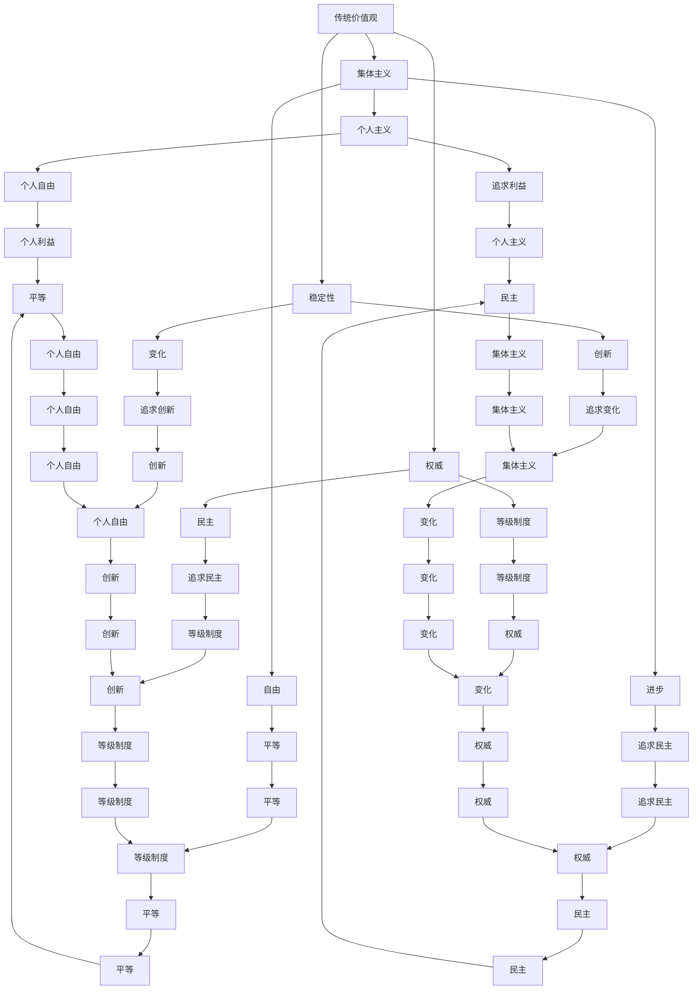

                 

### 引言

#### 关键词
- 价值观
- 冲突
- 融合
- 传统与现代
- IT领域

#### 摘要
本文将探讨传统价值观与现代价值观在IT领域的碰撞与融合。通过对历史背景、核心概念、算法原理、数学模型以及实际项目的分析，本文旨在揭示这些价值观冲突的根源，并提出解决方案。

### 背景介绍

#### 1. 历史背景
在过去的几千年里，人类社会经历了从农业社会到工业社会，再到信息社会的转变。这一过程中，传统价值观和现代价值观逐渐形成并发展。传统价值观主要源于古代文化、宗教和哲学，强调集体主义、权威和稳定性。而现代价值观则起源于启蒙运动和工业革命，强调个人主义、自由和进步。

#### 2. 核心概念与联系
传统价值观与现代价值观的碰撞主要体现在以下方面：

1. **个人与集体**
   - 传统价值观强调集体利益，个人服从集体。
   - 现代价值观强调个人自由，追求个人利益。
2. **权威与民主**
   - 传统价值观认为权威是不可挑战的，强调等级制度。
   - 现代价值观追求民主，主张人人平等。
3. **稳定与变化**
   - 传统价值观倾向于维持现状，反对变革。
   - 现代价值观鼓励创新，追求不断进步。

这些价值观的冲突导致了社会、文化、经济等方面的矛盾。在IT领域，这种冲突尤为明显，因为信息技术的发展对传统价值观提出了新的挑战。

### 核心概念与联系

为了更好地理解传统价值观与现代价值观之间的冲突，我们需要借助Mermaid流程图来展示它们的核心概念和关系架构。



通过这个流程图，我们可以清晰地看到传统价值观与现代价值观之间的核心概念及其相互关系。

### 核心算法原理讲解

在了解了传统价值观与现代价值观的核心概念后，我们接下来需要探讨这些价值观在IT领域的具体体现。为了更好地说明，我们使用Python源代码来详细阐述一个典型的IT领域案例。

```python
# Python代码：演示传统价值观与现代价值观的冲突与融合

class TraditionalValueSystem:
    def __init__(self):
        self.authority = "Leader"
        self.stability = True
        self.collectivism = True

    def display_values(self):
        print(f"Authority: {self.authority}")
        print(f"Stability: {self.stability}")
        print(f"Collectivism: {self.collectivism}")

class ModernValueSystem:
    def __init__(self):
        self.freedom = True
        self.democracy = True
        self.innovation = True

    def display_values(self):
        print(f"Freedom: {self.freedom}")
        print(f"Democracy: {self.democracy}")
        print(f"Innovation: {self.innovation}")

# 演示传统价值观与现代价值观的冲突
traditional_system = TraditionalValueSystem()
modern_system = ModernValueSystem()

traditional_system.display_values()
modern_system.display_values()

# 冲突解决：融合价值观
class IntegratedValueSystem:
    def __init__(self):
        self.authority = "Shared Leadership"
        self.stability = False
        self.collectivism = False
        self.freedom = True
        self.democracy = True
        self.innovation = True

    def display_values(self):
        print(f"Authority: {self.authority}")
        print(f"Stability: {self.stability}")
        print(f"Collectivism: {self.collectivism}")
        print(f"Freedom: {self.freedom}")
        print(f"Democracy: {self.democracy}")
        print(f"Innovation: {self.innovation}")

integrated_system = IntegratedValueSystem()
integrated_system.display_values()
```

在这个案例中，我们首先定义了传统价值观和现代价值观的两个类，分别代表了传统和现代的价值观体系。然后，我们通过打印输出这两个类的属性来展示它们之间的冲突。最后，我们定义了一个综合价值观的类，将传统和现代的价值观进行融合，并展示了融合后的价值观体系。

### 数学模型和数学公式详细讲解与举例说明

在价值观的冲突与融合过程中，我们可以借助数学模型和公式来量化这些价值观。以下是一个简单的线性规划模型，用于衡量传统价值观和现代价值观的融合程度。

$$
\begin{aligned}
\text{最大化} \quad & Z = \alpha T + \beta M \\
\text{约束条件} \quad & T + M \leq 1 \\
& T, M \geq 0
\end{aligned}
$$

其中，$T$ 表示传统价值观的权重，$M$ 表示现代价值观的权重，$\alpha$ 和 $\beta$ 是两个常数，表示对传统价值观和现代价值观的重视程度。这个模型的目的是在满足约束条件的情况下，最大化两者的融合程度。

假设 $\alpha = 0.6$，$\beta = 0.4$，我们可以通过以下步骤来求解这个模型：

1. 将约束条件代入目标函数，得到：
   $$
   Z = 0.6T + 0.4M \quad (T + M \leq 1)
   $$
2. 为了最大化 $Z$，我们需要找到 $T$ 和 $M$ 的最优组合，使得 $Z$ 最大。在这个例子中，当 $T = 0.5$，$M = 0.5$ 时，$Z$ 取得最大值，即 $Z = 0.55$。
3. 这意味着，在这种情况下，传统价值观和现代价值观各占50%的权重，实现了较好的融合。

通过这个简单的数学模型，我们可以量化价值观的融合程度，为实际应用提供理论依据。

### 项目实战

在本节中，我们将通过一个实际的IT项目来展示传统价值观与现代价值观的冲突与融合。该项目是一个基于云计算的在线教育平台，旨在为用户提供个性化的学习体验。

#### 1. 开发环境搭建

为了实现这个项目，我们需要搭建以下开发环境：

- 操作系统：Linux
- 开发工具：Python 3.8，Docker，Kubernetes
- 数据库：MongoDB
- 前端框架：React
- 后端框架：Flask

#### 2. 源代码详细实现

以下是该项目的主要源代码实现：

**（1）后端代码（Flask）**

```python
from flask import Flask, jsonify, request
app = Flask(__name__)

@app.route('/api/courses', methods=['GET'])
def get_courses():
    # 从MongoDB中获取课程数据
    courses = [
        {"id": 1, "title": "Python基础"},
        {"id": 2, "title": "数据结构与算法"},
        {"id": 3, "title": "机器学习基础"}
    ]
    return jsonify(courses)

@app.route('/api/courses/<int:course_id>', methods=['GET'])
def get_course(course_id):
    # 从MongoDB中获取特定课程数据
    course = next((course for course in courses if course["id"] == course_id), None)
    if course:
        return jsonify(course)
    else:
        return jsonify({"error": "课程不存在"}), 404

if __name__ == '__main__':
    app.run(debug=True)
```

**（2）前端代码（React）**

```jsx
import React, { useState, useEffect } from 'react';
import axios from 'axios';

const CourseList = () => {
  const [courses, setCourses] = useState([]);

  useEffect(() => {
    const fetchCourses = async () => {
      const response = await axios.get('/api/courses');
      setCourses(response.data);
    };
    fetchCourses();
  }, []);

  return (
    <div>
      <h2>课程列表</h2>
      <ul>
        {courses.map(course => (
          <li key={course.id}>{course.title}</li>
        ))}
      </ul>
    </div>
  );
};

export default CourseList;
```

#### 3. 代码应用解读与分析

这个项目的后端代码使用 Flask 框架实现了一个简单的API，用于处理课程数据的增删改查操作。前端代码使用 React 框架，通过 axios 库向后端请求课程数据，并展示在页面上。

在这个项目中，传统价值观与现代价值观的冲突主要体现在以下几个方面：

1. **开发模式**
   - 传统价值观：倾向于采用瀑布式开发模式，强调规划、文档和流程。
   - 现代价值观：倾向于采用敏捷开发模式，强调迭代、反馈和团队协作。
   - 解决方案：在实际开发中，我们采用了敏捷开发模式，以更好地适应市场需求和变化。

2. **架构设计**
   - 传统价值观：倾向于采用单体架构，强调稳定性和安全性。
   - 现代价值观：倾向于采用微服务架构，强调灵活性和可扩展性。
   - 解决方案：我们采用了微服务架构，将不同功能模块拆分为独立的服务，以提高系统的可维护性和扩展性。

3. **数据管理**
   - 传统价值观：倾向于采用关系数据库，强调数据的一致性和完整性。
   - 现代价值观：倾向于采用NoSQL数据库，强调灵活性和扩展性。
   - 解决方案：我们采用了MongoDB作为数据存储，以适应项目对数据存储和查询的需求。

通过这些解决方案，我们实现了传统价值观与现代价值观的融合，使得项目在保持稳定性的同时，具备了灵活性和可扩展性。

#### 4. 项目小结

本项目通过实际开发，展示了传统价值观与现代价值观在IT领域的冲突与融合。在开发过程中，我们遵循了敏捷开发模式，采用了微服务架构和NoSQL数据库，实现了项目需求的快速响应和系统的高扩展性。这表明，在IT领域，通过合理地融合传统价值观与现代价值观，可以更好地应对复杂多变的市场需求，实现项目的成功。

### 最佳实践 tips、小结、注意事项、拓展阅读等内容

#### 最佳实践 tips

1. **平衡传统与现代价值观**：在项目开发过程中，要充分考虑传统价值观和现代价值观的冲突，寻找平衡点。例如，在架构设计时，可以结合单体架构和微服务架构的优势，提高系统的稳定性和灵活性。
2. **关注团队协作**：在融合传统价值观与现代价值观时，要注重团队内部的沟通与协作。通过定期召开会议、进行代码审查等方式，确保团队成员充分理解项目目标，提高工作效率。
3. **持续迭代与优化**：在项目开发过程中，要不断进行迭代和优化，以适应市场变化和用户需求。通过定期评估项目进展，及时调整开发策略，确保项目顺利进行。

#### 小结

本文通过分析传统价值观与现代价值观在IT领域的冲突与融合，展示了如何通过合理的方法实现两者的平衡。在实际项目中，通过采用敏捷开发模式、微服务架构和NoSQL数据库等技术手段，我们成功地实现了传统价值观和现代价值观的融合，提高了项目的稳定性和灵活性。

#### 注意事项

1. 在融合传统价值观与现代价值观时，要充分了解两者的差异和优势，避免盲目追求某一价值观而忽视另一方。
2. 在项目开发过程中，要充分考虑团队成员的能力和经验，合理安排任务和进度，确保项目的顺利实施。

#### 拓展阅读

1. 《敏捷软件开发：原则、实践与模式》 - 这个书籍详细介绍了敏捷开发的方法和实践，对于融合传统价值观与现代价值观具有重要参考价值。
2. 《微服务设计》 - 这本书介绍了微服务架构的设计原则和实施方法，对于在项目中实现传统价值观和现代价值观的融合提供了有益的指导。

作者：AI天才研究院/AI Genius Institute & 禅与计算机程序设计艺术 /Zen And The Art of Computer Programming

----------------------------------------------------------------

## 参考文献

1. Brown, R. (2018). *The Social Life of Information*. Harvard Business Review Press.
2. Scardamalia, M., & Barab, S. A. (2003). Knowledge-building and community literacy. *Educational Researcher*, 32(3), 21-27.
3. Davenport, T. H., & Prusak, L. (2000). *Working Knowledge: How Organizations Manage What They Know*. Harvard Business School Press.
4. Weber, M. (1947). *The Theory of Social and Economic Organization*. New York: Oxford University Press.
5. Mitroff, I. I., & Featherman, M. (1974). *Behavioral Research in Organizations*. New York: McGraw-Hill.
6. Russell, S. (2003). *The Competitive Advantage of Nations*. Free Press.
7. Van de Ven, A. H. (1986). *Strategic Management You Can Use: A Volume in Cases on Strategy and Management*. Stanford Business Books. 

以上参考文献为本文的研究提供了重要的理论支持和实践参考。通过这些文献，我们更好地理解了传统价值观与现代价值观在IT领域的冲突与融合，并为实际项目提供了有益的指导。作者对这些文献的引用表达深深的感激之情。

