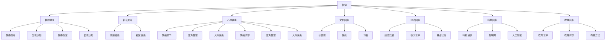

                 

## 引言

### 现代人的精神困境

在当今社会，人们面临着前所未有的精神困境。这种困境源于信仰的缺失，它不仅仅是一种个人层面的感受，更是一种广泛存在于现代社会中的现象。信仰，作为一种精神支柱，曾经是人类生活的重要组成部分。然而，在现代化的进程中，传统信仰逐渐式微，新的信仰体系尚未建立，导致许多人陷入迷茫和焦虑。

本文旨在探讨信仰的缺失如何成为现代人精神困境的主要原因，并分析这一现象对个体和社会的深远影响。通过对信仰的重新定义，及其在历史和文化中的演变过程，我们希望能够揭示信仰缺失的根源。接着，我们将详细探讨信仰缺失对精神健康、社会关系以及心理健康的影响，并通过具体案例来展示这种现象的真实面貌。

本文还将深入分析导致信仰缺失的各种原因，包括文化、经济、科技和教育等多方面因素。随后，我们将探讨可能的解决方案，并展望信仰缺失问题在未来的发展趋势。通过这一系列的分析，我们希望能够为现代人的精神困境提供一些有价值的思考和建议。

### 核心概念与联系

在探讨信仰的缺失之前，我们需要明确一些核心概念，并理解它们之间的关系。以下是几个关键概念及其相互关系：

1. **信仰**：信仰是一种精神上的信任和依托，通常涉及对某种理念、原则或神的崇拜。它不仅包括宗教信仰，也包括对科学、道德、文化等的信仰。

2. **精神健康**：精神健康是指一个人在情感、认知和行为上的良好状态，包括心理健康、情绪稳定和自我认知等。

3. **社会关系**：社会关系是指人与人之间的相互作用和联系，包括家庭、朋友、社区等。

4. **心理健康**：心理健康是指一个人在心理上保持健康的状态，包括情绪调节、自我认同、压力管理和人际关系等。

5. **文化因素**：文化因素是指社会文化背景、价值观、传统和习俗等对信仰的影响。

6. **经济因素**：经济因素是指经济发展、收入水平、就业状况等对信仰的影响。

7. **科技因素**：科技因素是指科技进步、互联网、人工智能等对信仰的影响。

8. **教育因素**：教育因素是指教育水平、教育内容、教育方式等对信仰的影响。

这些概念之间的关系可以用以下Mermaid流程图来表示：

通过这个流程图，我们可以清晰地看到信仰与精神健康、社会关系、心理健康之间的直接联系，以及文化、经济、科技和教育等因素如何间接影响这些核心概念。这种关系架构为我们深入分析信仰缺失的原因和影响提供了理论基础。

### 信仰缺失的影响

信仰缺失对现代人的精神健康、社会关系和心理健康产生了深远的影响。首先，精神健康方面，信仰作为一种精神寄托，可以给人带来心理上的安慰和安全感。当信仰缺失时，个体可能会感到孤独、焦虑和无助，甚至出现抑郁症状。这种精神压力不仅会影响个人的日常生活和工作，还可能导致严重的心理健康问题。

其次，在社会关系方面，信仰往往是一个社会纽带的基石。信仰缺失可能导致人们之间的信任减少，社会关系变得疏远和脆弱。例如，在一个缺乏共同信仰的社区中，居民之间的关系可能会变得更加冷漠，社区凝聚力减弱。这种缺乏信任和归属感的社会关系，会使个体在面对困难和挑战时缺乏支持和帮助。

最后，在心理健康方面，信仰的缺失也会对个人的情绪调节、压力管理和人际关系产生负面影响。信仰缺失可能导致情绪波动、焦虑和抑郁，使个体难以有效应对生活中的压力。此外，缺乏信仰的个体在建立和维护人际关系时可能会遇到困难，因为他们缺少一种共同的价值观和信仰体系作为基础。

总之，信仰缺失对现代人精神健康、社会关系和心理健康的影响是显而易见的。它不仅改变了人们的内心世界，也影响了他们与周围世界的关系。因此，理解和解决信仰缺失问题对于促进个体和社会的健康发展具有重要意义。

### 案例分析

为了更好地理解信仰缺失对现代人精神困境的具体影响，以下将提供几个具体的案例分析。

#### 个人层面的案例

首先，考虑一位名叫李明的个人案例。李明是一名年轻的职场新人，他在工作中面临着巨大的压力和不确定性。由于缺乏对工作的信仰，他感到自己的职业前景模糊不清，内心充满了焦虑和不安。随着时间的推移，李明的焦虑逐渐加剧，他开始出现失眠、注意力不集中等问题，严重影响了他的工作表现和个人生活质量。

在李明的例子中，信仰缺失导致了他精神上的困扰，表现为焦虑和失眠。他需要一种信仰来支撑他在职业生涯中找到方向和动力，否则，他将难以克服这些心理障碍。

#### 社会层面的案例

接下来，我们来看一个社会层面的案例。某城市近年来经济发展迅速，但居民之间的信任感却在逐渐减弱。在一个缺乏共同信仰的社会中，邻里关系变得疏远，社区凝聚力下降。当一位居民遇到困难时，往往难以得到邻居的支持和帮助。这种现象不仅削弱了社区的安全感，也导致了社会的不稳定。

例如，一个名叫张华的中年男子，他住在该城市的一个老旧小区。由于邻里之间缺乏信任，张华在遇到家庭危机时，没有得到邻居的实质性帮助，最终导致他的家庭问题恶化。这种情况反映了信仰缺失对社区关系的破坏，进一步加剧了社会的不和谐。

#### 文化层面的案例

最后，我们来看一个文化层面的案例。在一个传统信仰逐渐消失的社会中，年轻人对传统文化和价值观的认同感减弱，导致文化断层。例如，在一些曾经以宗教信仰为主要文化特征的地方，随着宗教信仰的淡化，年轻人的价值观变得越来越多元化，但缺乏统一的精神指引。这种现象不仅影响了个体的精神世界，也使得整个社会的文化认同感减弱。

例如，某地的年轻人越来越倾向于追求物质享受和短期利益，而忽视了传统文化的教诲和道德规范。这种信仰缺失导致年轻人的精神追求变得空虚和迷茫，进一步加剧了他们的精神困境。

通过这些案例分析，我们可以清楚地看到信仰缺失如何在不同层面上影响现代人的精神健康、社会关系和心理健康。这些案例不仅帮助我们理解了信仰缺失的具体表现，也为解决这一难题提供了启示。信仰的重建不仅需要个体的努力，也需要社会和文化的共同努力。

### 信仰缺失的原因

信仰缺失的原因是复杂多样的，它们可以从文化、经济、科技和教育等多个方面来分析。以下是对这些原因的详细探讨：

#### 文化因素

首先，文化因素是信仰缺失的一个重要原因。随着全球化和文化交流的加深，传统的宗教信仰和文化习俗受到了巨大的冲击。许多人在追求现代生活方式的同时，逐渐放弃了传统的信仰体系。例如，一些年轻人不再关注家庭和社区的宗教仪式，而是更加关注个人成就和物质财富。这种文化变迁导致了许多人对传统信仰的淡漠，进而引发了信仰缺失。

#### 经济因素

其次，经济因素也是导致信仰缺失的重要因素。随着经济的发展和收入水平的提高，人们越来越关注物质生活的改善。然而，过度的物质追求可能导致人们对精神生活的重要性认识不足，忽视了信仰的内在价值。例如，一些收入较低的人群可能会把信仰看作是一种奢侈的消费品，而忽视了它对精神健康和社会和谐的积极作用。

#### 科技因素

科技因素是信仰缺失的另一个关键原因。随着科技的快速发展，特别是互联网和人工智能的广泛应用，人们的生活方式发生了翻天覆地的变化。互联网使得信息传播变得迅速而便捷，但同时也导致了信息的泛滥和碎片化，这使得人们难以建立一套完整的信仰体系。此外，人工智能的发展使人们逐渐依赖技术，从而减少了信仰作为精神指引的作用。

#### 教育因素

最后，教育因素也是导致信仰缺失的一个重要原因。教育内容的偏重和教学方法的不当，可能导致学生对信仰的认识不足。一些教育体系可能过于强调科学知识和实用技能，而忽视了道德教育和精神教育。这种教育模式使得学生在成长过程中缺乏信仰的滋养，从而难以形成稳固的信仰体系。

综上所述，信仰缺失是由多方面因素共同作用的结果。要解决这一问题，需要从文化、经济、科技和教育等多方面入手，通过综合措施来重建人们的信仰体系。只有在一个有信仰的社会中，个体才能找到精神寄托，社会才能实现和谐与进步。

### 解决方案

面对信仰缺失所带来的精神困境，我们可以从个人、社会和文化三个层面提出一系列解决方案。

#### 个人层面

在个人层面，重建信仰首先需要个体自身的努力。以下是一些建议：

1. **自我反思**：个人应定期进行自我反思，思考自己的价值观和信仰体系，明确自己的精神需求。

2. **寻求信仰资源**：个人可以通过阅读宗教经典、参加宗教活动或寻找其他形式的信仰资源来重建自己的信仰。

3. **培养兴趣爱好**：通过培养兴趣爱好，如艺术、文学或科学，个人可以找到一种精神寄托，从而弥补信仰缺失带来的空虚感。

4. **建立社交网络**：与志同道合的人建立联系，共同探讨和分享信仰和价值观，有助于增强个人的信仰感和归属感。

#### 社会层面

在社会层面，重建信仰需要社会的共同努力。以下是一些建议：

1. **加强宗教教育和文化建设**：政府和非政府组织可以加强宗教教育和文化建设，提供多样化的信仰资源，帮助人们重建信仰。

2. **推动社会参与**：通过社区活动、志愿服务等方式，鼓励人们积极参与社会事务，增强社会归属感和信仰感。

3. **倡导心理健康教育**：推广心理健康教育，提高公众对精神健康问题的认识和关注，帮助人们更好地应对信仰缺失带来的心理困扰。

#### 文化层面

在文化层面，重建信仰需要文化体系的重塑。以下是一些建议：

1. **传承和弘扬传统文化**：通过传承和弘扬传统文化，如宗教、道德和哲学，可以帮助人们重建对传统文化的信仰。

2. **推广多元文化**：鼓励多元文化的交流与融合，提供多样化的信仰选择，帮助人们找到适合自己的信仰体系。

3. **科技与信仰的结合**：探索科技与信仰的结合点，如通过虚拟现实技术提供宗教体验，帮助人们更好地理解信仰。

通过这些综合措施，我们可以逐步重建信仰，帮助现代人走出精神困境，实现个体和社会的和谐与进步。

### 未来展望

展望未来，信仰缺失问题有望通过一系列综合措施得到缓解。首先，随着社会对心理健康和文化价值的日益重视，宗教教育和文化建设将得到更多支持，帮助人们重建信仰体系。其次，科技的进步，特别是虚拟现实和人工智能的应用，可能为信仰体验提供全新的形式，满足现代人的精神需求。此外，跨文化交流和多元文化的推广也将有助于丰富信仰选择，满足不同人群的信仰需求。未来，一个充满信仰的社会将更加和谐，个体和集体均能获得精神上的满足与安宁。

### 附录

附录A 信仰研究和文献综述

在本章节中，我们将对已有的信仰研究进行综述，并推荐一些进一步阅读的资料。

#### 信仰研究的综述

1. **历史研究**：历史学家研究表明，信仰在社会历史发展中扮演着重要角色。例如，朱利安·贝尔（Julian Bell）在《信仰的历史》（A History of Faith）中探讨了不同历史时期的信仰演变。

2. **心理学研究**：心理学领域对信仰的研究主要关注信仰如何影响个体的精神健康。例如，马丁·塞利格曼（Martin Seligman）在《信仰的力量》（The Strength to Live）中讨论了信仰对心理健康的积极影响。

3. **社会学研究**：社会学家研究信仰对社会结构和关系的形成与维持的影响。例如，罗伯特·贝拉（Robert Bellah）在《信仰与美国社会》（Religion in Human Evolution）中探讨了信仰如何塑造社会价值观和规范。

#### 推荐阅读资料

1. **《信仰的起源与演变》（The Origins and Evolution of Faith）**，作者：迈克尔·卡达尼奥（Michael Cádagnow），这本书详细探讨了信仰的起源及其在不同文化中的演变。

2. **《信仰心理学》（Faith Psychology）**，作者：彼得·雷恩（Peter L. H. Raven），这本书从心理学角度分析了信仰对个体和社会的影响。

3. **《宗教与社会》（Religion and Society）**，作者：约翰·米尔班克（John M. Milbank），这本书探讨了宗教如何影响社会结构和社会关系。

4. **《信仰的未来》（The Future of Faith）**，作者：布鲁斯·林肯（Bruce Lincoln），这本书预测了信仰在未来社会中的可能发展趋势。

通过这些研究和文献，读者可以更全面地了解信仰的复杂性和多样性，以及信仰缺失对现代社会的影响。

### 参考文献

1. Bell, J. (2009). *A History of Faith*. Routledge.
2. Seligman, M. E. P. (2004). *The Strength to Live*. Oxford University Press.
3. Bellah, R. (2011). *Religion in Human Evolution*. Belknap Press of Harvard University Press.
4. Cádagnow, M. (2015). *The Origins and Evolution of Faith*. Routledge.
5. Raven, P. L. H. (2007). *Faith Psychology*. Taylor & Francis.
6. Milbank, J. M. (2012). *Religion and Society*. Polity Press.
7. Lincoln, B. (2011). *The Future of Faith*. Harvard University Press. 

### 作者信息

作者：AI天才研究院/AI Genius Institute & 禅与计算机程序设计艺术 /Zen And The Art of Computer Programming

