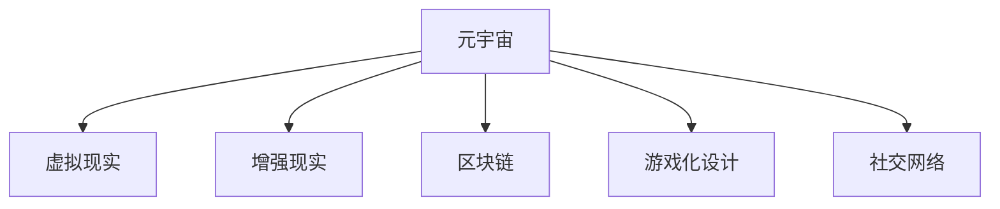

                 

# 元宇宙：虚拟与现实的新平衡

## 关键词
元宇宙，虚拟现实，增强现实，区块链，游戏化设计，社交网络，数字经济，虚拟资产，数字化身份，沉浸式体验。

## 摘要
随着科技的飞速发展，元宇宙逐渐成为连接虚拟与现实的新桥梁。本文将深入探讨元宇宙的核心概念、关键技术及其对现实世界的影响。通过分析虚拟现实、增强现实、区块链、游戏化设计和社交网络等技术在元宇宙中的应用，我们将揭示元宇宙构建的基本原理及其未来发展趋势。同时，还将探讨元宇宙对实体经济、教育和工作模式的影响，以及面对的法律、伦理和社会问题，为读者呈现一个全面而深刻的元宇宙全景图。

## 目录大纲

### 第一部分：元宇宙的基本概念与架构

### 第二部分：元宇宙与现实世界的新平衡

### 附录

## 引言
### 元宇宙的起源与定义
元宇宙（Metaverse）一词最早由科幻小说家尼尔·斯蒂芬森（Neal Stephenson）在其1992年的小说《雪崩》（Snow Crash）中提出。书中描绘了一个由虚拟世界组成的互联网后继者，人们可以在其中以数字化身份进行互动和交流。随着科技的进步，元宇宙的概念逐渐从科幻走向现实，成为科技巨头和初创公司竞相探索的新领域。

元宇宙可以被定义为现实世界的数字化扩展，是一个由虚拟现实（VR）、增强现实（AR）、区块链、游戏化设计、社交网络等核心技术构建的虚拟空间。在这个空间中，用户可以创建自己的虚拟身份，进行社交互动、娱乐、工作、学习和交易等多样化活动。

### 元宇宙的核心概念与联系
元宇宙的核心概念包括以下几个方面：

1. **虚拟现实（VR）**：通过计算机生成的三维环境，让用户沉浸在虚拟世界中。
2. **增强现实（AR）**：将虚拟信息叠加到现实世界中，增强用户的感知体验。
3. **区块链**：提供去中心化的账本，确保元宇宙中的交易和数据安全。
4. **游戏化设计**：利用游戏机制和奖励系统，促进用户参与和互动。
5. **社交网络**：连接用户，提供社交互动和协作平台。

这些核心概念相互交织，构成了元宇宙的基石。以下是一个简化的元宇宙概念架构流程图：

### 背景介绍
元宇宙的兴起得益于多项关键技术的突破：

1. **硬件技术的发展**：高性能显卡、更轻薄的VR头盔、更先进的AR眼镜等硬件设备使得虚拟和增强现实体验更加真实和便捷。
2. **网络技术的进步**：5G网络的普及和低延迟通信技术的应用，为元宇宙提供了稳定的网络基础。
3. **人工智能和机器学习**：通过算法优化和模型训练，提升了虚拟环境的交互性和智能化水平。
4. **区块链技术**：为元宇宙中的虚拟资产和交易提供了安全可靠的解决方案。

这些技术为元宇宙的构建提供了坚实的基础，使得元宇宙从概念走向现实成为可能。

## 第一部分：元宇宙的基本概念与架构

### 第1章：元宇宙的定义与背景

#### 1.1 元宇宙的概念
元宇宙（Metaverse）是一个基于互联网的虚拟共享空间，用户可以在其中以数字化身份（Avatar）进行交互、工作和娱乐。与传统的虚拟世界不同，元宇宙不仅仅是游戏或社交平台，而是一个更加广阔、多维、可持续发展的虚拟世界。在元宇宙中，用户不仅可以进行简单的互动，还可以拥有虚拟资产、参与虚拟经济活动，并体验与现实世界类似的复杂交互。

#### 1.2 元宇宙的兴起背景
元宇宙的兴起源于以下几个方面：

1. **虚拟现实（VR）和增强现实（AR）技术的发展**：随着VR和AR技术的成熟，用户可以在虚拟环境中获得更加沉浸式的体验，这为元宇宙的实现提供了技术基础。
2. **网络基础设施的完善**：5G网络的普及和低延迟通信技术的应用，使得大规模、高并发用户在线交互成为可能。
3. **区块链技术的突破**：区块链技术为元宇宙中的虚拟资产和交易提供了去中心化的解决方案，确保了数据的安全性和透明性。
4. **游戏产业的繁荣**：游戏产业为元宇宙提供了丰富的内容和商业模式，激发了用户的参与热情。
5. **社交需求的演变**：随着互联网的普及，人们对于虚拟社交和体验的需求日益增长，元宇宙满足了这一需求。

#### 1.3 元宇宙的主要组成部分
元宇宙的主要组成部分包括：

1. **虚拟现实（VR）**：通过计算机生成的三维环境，用户可以沉浸在虚拟世界中，进行各种活动和互动。
2. **增强现实（AR）**：将虚拟信息叠加到现实世界中，增强用户的感知体验，如AR眼镜、AR应用等。
3. **区块链**：提供去中心化的账本，确保元宇宙中的交易和数据安全，如虚拟资产交易、身份验证等。
4. **游戏化设计**：利用游戏机制和奖励系统，促进用户参与和互动，如虚拟任务、竞赛等。
5. **社交网络**：连接用户，提供社交互动和协作平台，如虚拟社区、虚拟市场等。

这些组成部分相互交织，共同构建了一个完整的元宇宙生态系统。

### 第2章：虚拟现实技术与元宇宙

#### 2.1 虚拟现实技术的原理与应用
虚拟现实（VR）技术通过创建一个三维的虚拟环境，使用户可以沉浸在其中的技术。其原理主要包括以下几个方面：

1. **显示技术**：VR设备通常使用头戴式显示器（HMD），提供宽视角和高分辨率的图像，使用户能够感受到虚拟环境的真实感。
2. **感知技术**：通过传感器和跟踪系统，如头部跟踪、手部跟踪等，实时捕捉用户的动作和姿态，将用户的身体和虚拟环境同步。
3. **交互技术**：用户可以通过VR控制器、手套等设备与虚拟环境进行交互，如抓取、操控等。

虚拟现实技术广泛应用于以下几个领域：

1. **娱乐**：VR游戏、VR电影等，为用户提供了全新的娱乐体验。
2. **教育**：VR教学、虚拟实验室等，提高了教学效果和互动性。
3. **医疗**：VR疗法、虚拟手术等，为医疗领域提供了新的解决方案。
4. **房地产**：虚拟看房、虚拟装修等，提高了房产销售和设计的效率。

#### 2.2 元宇宙中的虚拟现实体验
在元宇宙中，虚拟现实体验变得更加丰富和多样化。用户可以在虚拟世界中创建自己的数字身份，与其他用户进行互动，参与各种活动和游戏。以下是一些典型的虚拟现实体验：

1. **社交互动**：用户可以在虚拟社区中与朋友聊天、举办虚拟派对等。
2. **虚拟旅游**：用户可以探索世界各地的虚拟景点，如虚拟巴黎铁塔、虚拟埃及金字塔等。
3. **虚拟工作**：用户可以在虚拟办公室中参加会议、进行远程协作等。
4. **虚拟购物**：用户可以在虚拟商店中购物，体验沉浸式的购物体验。

#### 2.3 虚拟现实技术在元宇宙中的作用
虚拟现实技术在元宇宙中扮演着关键角色：

1. **提供沉浸式体验**：通过虚拟现实技术，用户可以在元宇宙中获得更加真实的沉浸式体验，提高参与度和满意度。
2. **促进社交互动**：虚拟现实技术使得用户可以在虚拟环境中进行更加自然和丰富的社交互动，增强社交体验。
3. **创新应用场景**：虚拟现实技术在元宇宙中的应用场景非常广泛，从娱乐、教育到医疗、房地产等，为各个领域带来了新的发展机遇。

### 第3章：增强现实技术与元宇宙

#### 3.1 增强现实技术的原理与应用
增强现实（AR）技术通过将虚拟信息叠加到现实世界中，增强用户的感知体验。其原理主要包括以下几个方面：

1. **显示技术**：AR设备通常使用透明显示屏或AR眼镜，将虚拟信息与现实环境融合显示。
2. **感知技术**：通过摄像头、传感器等设备，实时捕捉现实环境中的图像和物体。
3. **处理技术**：通过计算机视觉算法，对捕捉到的图像进行处理，识别出目标物体，并叠加虚拟信息。

增强现实技术广泛应用于以下几个领域：

1. **娱乐**：AR游戏、AR电影等，为用户提供了全新的娱乐体验。
2. **教育**：AR教学、虚拟实验室等，提高了教学效果和互动性。
3. **医疗**：AR导航、虚拟手术等，为医疗领域提供了新的解决方案。
4. **广告营销**：AR广告、品牌体验等，提高了广告的效果和用户的参与度。

#### 3.2 元宇宙中的增强现实体验
在元宇宙中，增强现实体验变得更加丰富和多样化。用户可以通过AR设备在现实世界中看到和交互虚拟元素。以下是一些典型的增强现实体验：

1. **虚拟导航**：用户可以在现实世界中看到虚拟地图、导航指示等，提高出行效率和体验。
2. **虚拟商品展示**：用户可以通过AR设备看到虚拟商品在现实世界中的样子，如虚拟试衣、虚拟家具摆放等。
3. **虚拟互动**：用户可以在现实世界中与虚拟角色进行互动，如虚拟宠物、虚拟偶像等。
4. **虚拟学习**：用户可以通过AR设备进行虚拟学习，如虚拟实验室、虚拟课堂等。

#### 3.3 增强现实技术在元宇宙中的作用
增强现实技术在元宇宙中扮演着关键角色：

1. **连接虚拟与真实**：通过增强现实技术，元宇宙中的虚拟元素可以与现实世界无缝融合，为用户提供更加丰富的体验。
2. **增强感知体验**：增强现实技术可以增强用户的感知体验，提高沉浸感和互动性。
3. **创新应用场景**：增强现实技术在元宇宙中的应用场景非常广泛，从导航、购物到教育、医疗等，为各个领域带来了新的发展机遇。

### 第4章：区块链技术在元宇宙中的应用

#### 4.1 区块链技术的概述
区块链技术是一种分布式数据库技术，通过加密算法确保数据的安全性和不可篡改性。其核心原理包括：

1. **去中心化**：区块链不需要中心化的第三方机构进行中介，所有参与者都可以直接参与交易和数据记录。
2. **共识机制**：区块链通过共识算法，确保所有参与者对于数据的一致性。
3. **智能合约**：区块链上的智能合约是一种自执行的合同，当触发条件时自动执行。

#### 4.2 区块链技术在元宇宙中的重要性
区块链技术在元宇宙中具有以下重要性：

1. **数据安全**：区块链技术确保了元宇宙中的数据安全，防止数据被篡改或盗用。
2. **去中心化交易**：区块链技术为元宇宙中的虚拟资产交易提供了去中心化的解决方案，提高了交易的透明度和效率。
3. **身份验证**：区块链技术可以用于元宇宙中的身份验证，确保用户身份的真实性和唯一性。
4. **智能合约**：智能合约在元宇宙中可以用于自动化执行交易、合同等，提高了交易的效率和安全性。

#### 4.3 元宇宙中的典型区块链应用案例
以下是一些元宇宙中的典型区块链应用案例：

1. **虚拟资产交易**：用户可以在区块链上购买、出售、交换虚拟资产，如虚拟土地、虚拟商品、虚拟货币等。
2. **数字身份认证**：用户可以使用区块链技术进行数字身份认证，确保身份信息的真实性和唯一性。
3. **智能合约应用**：智能合约在元宇宙中可以用于自动化执行各种任务，如虚拟租赁合同、虚拟拍卖等。
4. **去中心化社交平台**：区块链技术可以用于构建去中心化的社交平台，确保用户的隐私和数据安全。

### 第5章：游戏化设计与元宇宙

#### 5.1 游戏化设计的概念与应用
游戏化设计（Gamification）是一种将游戏机制和奖励系统应用于非游戏情境的设计方法。其核心目的是通过增加趣味性和竞争性，提高用户参与度和满意度。游戏化设计的概念包括以下几个方面：

1. **目标设定**：为用户设定明确的目标，激励用户积极参与。
2. **进度追踪**：实时显示用户的进展和成就，增加用户的成就感。
3. **奖励机制**：提供各种形式的奖励，如积分、徽章、虚拟货币等，激励用户持续参与。
4. **竞争与协作**：通过排行榜、竞争机制等，增加用户之间的互动和合作。

游戏化设计广泛应用于以下领域：

1. **市场营销**：通过游戏化设计，提高用户对品牌的关注和参与度。
2. **教育培训**：通过游戏化设计，提高学生的学习兴趣和参与度。
3. **健康与健身**：通过游戏化设计，激励用户坚持健康生活和锻炼。
4. **企业管理**：通过游戏化设计，提高员工的工作积极性和团队协作。

#### 5.2 元宇宙中的游戏化体验
在元宇宙中，游戏化体验变得更加丰富和多样化。以下是一些典型的游戏化体验：

1. **任务与挑战**：用户可以在元宇宙中接受各种任务和挑战，如探险任务、虚拟竞技等。
2. **积分与徽章**：用户通过完成任务和挑战，可以获得积分和徽章，提高自己的地位和声望。
3. **虚拟经济系统**：元宇宙中的虚拟经济系统，如虚拟货币、虚拟商品等，为用户提供了新的投资和交易机会。
4. **社交互动**：用户可以在元宇宙中与其他用户互动，分享成就和经验，增加社交乐趣。

#### 5.3 游戏化设计在元宇宙中的潜在影响
游戏化设计在元宇宙中具有巨大的潜在影响：

1. **提高用户参与度**：通过游戏化设计，用户可以在元宇宙中获得更多的乐趣和成就感，提高参与度。
2. **促进社交互动**：游戏化设计可以促进用户之间的互动和合作，增加社交乐趣。
3. **创新商业模式**：游戏化设计可以为元宇宙中的各种商业模式提供新的思路，如虚拟商品、虚拟广告等。
4. **提升用户体验**：游戏化设计可以为用户带来更加丰富和多样化的体验，提高用户体验。

### 第6章：社交网络与元宇宙

#### 6.1 社交网络在元宇宙中的角色
社交网络在元宇宙中扮演着至关重要的角色，是连接用户、促进互动和创造价值的桥梁。以下是社交网络在元宇宙中的几个关键角色：

1. **用户连接器**：社交网络将用户与元宇宙中的各种虚拟世界、应用和服务连接起来，为用户提供了丰富的社交场景和互动平台。
2. **信息传播者**：社交网络在元宇宙中扮演了信息传播者的角色，用户可以在社交平台上分享自己的体验、见解和内容，形成了一个庞大的信息生态系统。
3. **价值创造者**：社交网络通过用户的互动和交易，创造了巨大的经济价值。在元宇宙中，社交网络可以成为虚拟资产交易、广告营销和付费内容的主要渠道。
4. **社区建设者**：社交网络在元宇宙中促进了社区的建设和发展，用户可以在虚拟社区中建立联系、分享经验和共同成长。

#### 6.2 元宇宙中的社交互动与交流
元宇宙为社交互动和交流提供了全新的平台和方式，以下是几种典型的社交互动和交流形式：

1. **虚拟社交聚会**：用户可以在元宇宙中的虚拟场所举办社交聚会，如虚拟餐厅、虚拟派对等，享受沉浸式的社交体验。
2. **虚拟协作**：用户可以在元宇宙中共同完成任务和项目，如虚拟会议、虚拟办公室等，提高协作效率和创造力。
3. **虚拟竞赛与游戏**：用户可以在元宇宙中参与各种虚拟竞赛和游戏，如虚拟马拉松、虚拟电竞等，体验竞技乐趣。
4. **虚拟学习与教育**：用户可以在元宇宙中参加虚拟课程、研讨会和工作坊，学习新知识和技能，与他人交流和分享。

#### 6.3 社交网络在元宇宙中的挑战与机遇
社交网络在元宇宙中既面临着挑战，也蕴含着巨大的机遇：

1. **隐私保护**：随着社交网络在元宇宙中的广泛应用，用户隐私保护成为了一个重要问题。如何在保障用户隐私的同时，提供丰富的社交功能，是社交网络需要解决的挑战。
2. **数据安全**：元宇宙中的数据量和交易量巨大，如何确保数据安全和防止网络攻击，是社交网络需要关注的问题。
3. **用户参与度**：如何吸引和保持用户参与，提供具有吸引力的社交内容和功能，是社交网络需要考虑的问题。
4. **商业创新**：元宇宙为社交网络带来了新的商业模式和机会，如虚拟广告、虚拟商品销售等，社交网络需要不断创新，抓住这些机遇。

### 第7章：元宇宙的未来发展趋势

#### 7.1 元宇宙的发展趋势分析
元宇宙作为一个新兴领域，正处于快速发展的阶段。以下是元宇宙的未来发展趋势分析：

1. **技术创新**：随着硬件、软件和网络技术的不断进步，元宇宙的交互体验将变得更加真实和丰富。例如，更先进的VR和AR设备、更高效的加密算法、更智能的AI系统等，都将为元宇宙的发展提供强大动力。
2. **生态构建**：元宇宙将形成一个庞大的生态体系，涵盖虚拟现实、增强现实、区块链、游戏化设计、社交网络等多个领域。各领域之间的融合和创新，将推动元宇宙的持续发展。
3. **商业模式创新**：元宇宙将催生出全新的商业模式，如虚拟资产交易、虚拟广告、虚拟教育、虚拟医疗等。这些商业模式将带来巨大的商业机会，推动元宇宙的经济增长。
4. **用户增长**：随着元宇宙的普及，越来越多的用户将加入元宇宙，形成庞大的用户群体。用户需求的多样化和个性化，将推动元宇宙的内容和功能不断升级。

#### 7.2 元宇宙在各个领域的潜在应用
元宇宙在各个领域具有巨大的潜在应用，以下是几个关键领域的应用：

1. **娱乐与游戏**：元宇宙为游戏和娱乐产业提供了全新的平台和方式。用户可以在元宇宙中体验沉浸式的游戏、观看虚拟电影、参加虚拟演唱会等。
2. **教育**：元宇宙可以改变传统的教育模式，提供更加灵活和个性化的学习体验。用户可以在元宇宙中参加虚拟课程、研讨会和工作坊，学习新知识和技能。
3. **医疗**：元宇宙为医疗领域提供了新的解决方案，如虚拟手术、虚拟康复、远程诊断等。通过元宇宙，医生和患者可以更加便捷地进行交流和合作。
4. **房地产**：元宇宙可以改变传统的房地产交易模式，提供虚拟看房、虚拟装修等服务。用户可以在元宇宙中看到房产的真实面貌，提高决策效率。
5. **零售**：元宇宙为零售业提供了新的营销渠道和购物体验。用户可以在元宇宙中购买虚拟商品、参加虚拟展览、享受沉浸式的购物体验。

#### 7.3 元宇宙的可持续发展与伦理问题
元宇宙的可持续发展与伦理问题是未来发展的重要议题。以下是几个关键问题：

1. **数据隐私与安全**：元宇宙中的用户数据量巨大，如何确保数据隐私和安全，是元宇宙需要关注的重要问题。需要建立完善的数据保护机制和加密技术，保障用户的隐私和数据安全。
2. **数字鸿沟**：元宇宙的发展可能导致数字鸿沟的扩大，一些用户可能因为技术设备或网络条件的限制，无法充分参与元宇宙。需要采取措施，降低参与门槛，促进数字公平。
3. **伦理与道德**：元宇宙中的虚拟世界也可能带来伦理和道德问题，如虚拟犯罪、网络霸凌、虚拟毒品等。需要建立完善的法律法规和伦理准则，规范虚拟世界的秩序。
4. **可持续发展**：元宇宙的发展需要考虑到对环境的影响，如能源消耗、碳排放等。需要采取绿色技术和可持续发展策略，减少对环境的影响。

### 第二部分：元宇宙与现实世界的新平衡

#### 第8章：元宇宙与实体经济的结合

#### 8.1 元宇宙对实体经济的影响
元宇宙对实体经济的影响是多方面且深远的。首先，元宇宙为实体经济提供了全新的商业模式和机遇。例如，虚拟商品和服务的交易、虚拟房产的开发与交易、虚拟广告等，为实体经济带来了新的增长点。其次，元宇宙促进了实体经济的数字化转型。通过元宇宙，企业可以实现虚拟展示、虚拟培训、虚拟会议等，提高效率和灵活性。此外，元宇宙还为实体经济提供了新的创新平台，如虚拟实验室、虚拟生产线等，为企业提供更多创新空间。

#### 8.2 实体经济在元宇宙中的新机遇
实体经济在元宇宙中找到了许多新的机遇。首先，虚拟商品和服务的交易为实体经济提供了新的市场空间。例如，虚拟服装、虚拟食品等，通过元宇宙的推广，可以吸引更多的消费者。其次，元宇宙为实体经济的数字化转型提供了技术支持。通过元宇宙，企业可以实现线上与线下融合，提高运营效率。此外，元宇宙还为实体经济提供了创新的商业模式，如虚拟供应链、虚拟销售渠道等，为企业带来更多发展机会。

#### 8.3 元宇宙与实体经济结合的案例分析
以下是几个元宇宙与实体经济结合的成功案例：

1. **虚拟房产开发与交易**：通过元宇宙，用户可以购买、开发和交易虚拟房产，如虚拟城市、虚拟购物中心等。这不仅为房地产企业带来了新的商机，也为用户提供了全新的虚拟体验。
2. **虚拟广告与品牌推广**：实体经济企业可以通过元宇宙进行虚拟广告投放和品牌推广，如虚拟展会、虚拟发布会等。通过元宇宙，企业可以更有效地触达目标用户，提高品牌知名度。
3. **虚拟教育与培训**：实体经济企业可以通过元宇宙提供虚拟教育和培训服务，如虚拟课堂、虚拟培训中心等。这不仅提高了培训效率，也为企业带来了新的收入来源。

### 第9章：元宇宙对教育与工作模式的影响

#### 9.1 元宇宙在教育中的应用
元宇宙在教育领域具有巨大的潜力。首先，元宇宙为教育提供了全新的教学环境和互动方式。通过元宇宙，教师可以创建虚拟课堂，进行虚拟授课和互动，提高教学效果。其次，元宇宙为教育提供了丰富的教育资源。学生可以通过元宇宙访问全球的虚拟图书馆、虚拟实验室、虚拟博物馆等，获取更多的学习资源。此外，元宇宙还可以支持个性化教育，根据学生的学习需求和进度，提供定制化的学习内容。

#### 9.2 元宇宙对工作模式的影响
元宇宙对工作模式也产生了深远的影响。首先，元宇宙为远程工作提供了更好的支持。通过元宇宙，员工可以在虚拟办公室中开展日常工作，实现高效协作。其次，元宇宙为虚拟就业和虚拟创业提供了新的机会。用户可以在元宇宙中从事各种虚拟工作，如虚拟客服、虚拟设计师、虚拟咨询师等。此外，元宇宙还支持虚拟培训、虚拟会议等，提高了工作效率和灵活性。

#### 9.3 元宇宙下的新型工作模式
元宇宙下的新型工作模式包括以下几个方面：

1. **虚拟办公室**：员工通过元宇宙的虚拟办公室进行日常办公，实现远程协作和工作。
2. **虚拟团队**：虚拟团队通过元宇宙进行项目协作，利用虚拟会议室、虚拟白板等工具，提高工作效率。
3. **虚拟培训**：企业通过元宇宙提供虚拟培训服务，员工可以在虚拟环境中学习和提升技能。
4. **虚拟就业**：用户在元宇宙中从事各种虚拟工作，如虚拟设计师、虚拟咨询师等，实现灵活就业。

### 第10章：元宇宙的法律、伦理与社会问题

#### 10.1 元宇宙的法律挑战
元宇宙的发展带来了许多法律挑战。首先，虚拟财产的法律地位如何界定是一个重要问题。元宇宙中的虚拟资产，如虚拟货币、虚拟房产等，其法律权益如何保护，需要明确的法律规定。其次，元宇宙中的隐私保护问题也亟待解决。用户在元宇宙中的个人信息如何保护，如何防止数据泄露和滥用，需要建立完善的隐私保护机制。此外，元宇宙中的虚拟犯罪问题也需要法律规制，如虚拟欺诈、虚拟网络攻击等。

#### 10.2 元宇宙的伦理问题
元宇宙的发展也引发了许多伦理问题。首先，虚拟现实的过度依赖可能导致现实生活的疏离。用户在元宇宙中过度沉浸，可能忽视现实生活中的重要关系和责任。其次，元宇宙中的数字鸿沟问题需要关注。一些用户可能因为技术设备或网络条件的限制，无法充分参与元宇宙，这可能导致新的数字鸿沟。此外，元宇宙中的虚拟身份可能引发身份认同问题，用户如何在虚拟身份与现实身份之间保持平衡，是一个重要的伦理议题。

#### 10.3 元宇宙的社会影响与对策
元宇宙对社会产生了广泛的影响，需要采取有效对策来应对。首先，加强对元宇宙的监管，确保其健康有序发展。政府和企业需要建立完善的法律法规和行业规范，维护元宇宙的秩序。其次，提高公众的数字素养，帮助用户更好地理解和适应元宇宙。通过教育和培训，提高用户对元宇宙的认知和技能，减少数字鸿沟。此外，还需要加强元宇宙中的道德教育，引导用户在虚拟环境中遵守道德规范，促进和谐共处。

### 附录

#### 附录A：元宇宙相关资源与工具介绍
以下是一些元宇宙相关的开发平台、工具和资源：

1. **Unity**：Unity是一款广泛使用的游戏引擎，支持虚拟现实和增强现实开发，是构建元宇宙的基础工具之一。
2. **Unreal Engine**：Unreal Engine是另一款强大的游戏引擎，提供了丰富的虚拟现实和增强现实开发功能，广泛应用于大型虚拟世界项目。
3. **ARKit**：ARKit是苹果公司开发的增强现实开发框架，适用于iOS平台，支持开发高质量的AR应用。
4. **ARCore**：ARCore是谷歌开发的增强现实开发框架，适用于Android平台，提供了一套强大的AR开发工具。
5. **EOSIO**：EOSIO是一个基于区块链的分布式操作系统，支持构建去中心化的应用和服务，适用于元宇宙中的虚拟资产交易和身份验证。

#### 附录B：元宇宙项目实战案例
以下是一些元宇宙项目的实战案例，展示了元宇宙在不同领域的应用：

1. **Decentraland**：Decentraland是一个基于区块链的虚拟现实平台，用户可以在其中创建和体验虚拟世界，进行各种活动，如购物、社交、娱乐等。
2. **Axie Infinity**：Axie Infinity是一个基于区块链的虚拟游戏，用户可以收集、繁殖和战斗虚拟宠物，通过游戏赚取虚拟货币。
3. **The Sandbox**：The Sandbox是一个虚拟游戏平台，用户可以在其中创建和分享虚拟世界，支持虚拟房地产交易和游戏开发。
4. **Fortnite**：Fortnite是一款流行的游戏，通过虚拟现实技术，为玩家提供了沉浸式的游戏体验，同时也推出了虚拟商品和虚拟房地产交易功能。

### 结语
元宇宙作为虚拟与现实的新平衡，正日益融入我们的生活。通过虚拟现实、增强现实、区块链、游戏化设计和社交网络等核心技术的支持，元宇宙为我们提供了一个全新的虚拟世界，丰富了我们的体验和生活方式。然而，元宇宙的发展也带来了诸多挑战，如法律、伦理和社会问题。我们需要关注这些问题，并采取有效措施，确保元宇宙的健康发展。同时，元宇宙也为实体经济、教育和工作模式带来了新的机遇，为我们的未来创造了无限可能。让我们共同探索元宇宙的广阔世界，开启虚拟与现实的新篇章。作者：AI天才研究院/AI Genius Institute & 禅与计算机程序设计艺术 /Zen And The Art of Computer Programming。

