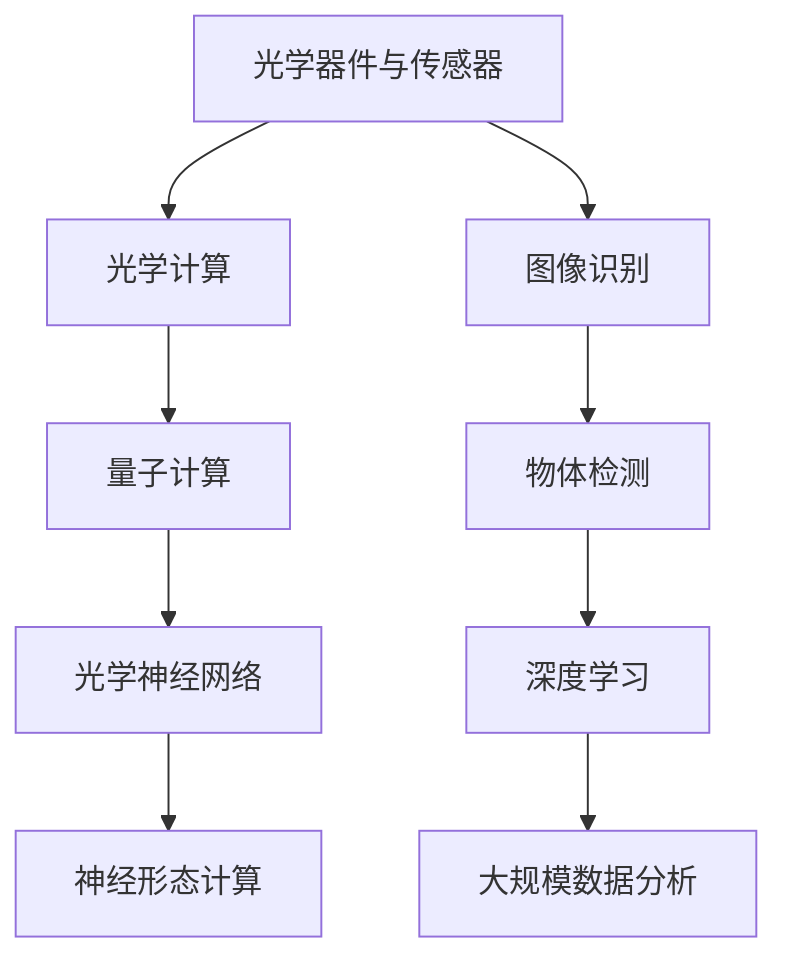

                 

### 引言

#### 光学与AI的结合

在人工智能（AI）迅猛发展的时代，计算能力、数据处理速度和算法优化成为推动AI技术进步的核心驱动力。然而，传统的电子计算方式在面对海量数据和复杂计算任务时，逐渐显现出其局限性。光学计算作为一种前沿技术，以其高速并行处理和低能耗的特点，逐渐成为AI领域的热点研究方向。

光学计算利用光波的特性进行信息处理，具有极大的并行处理能力。在深度学习中，光学计算可以通过大规模并行处理神经网络中的权重矩阵和输入数据，显著提高计算效率。此外，光学计算还可以实现高效的矩阵乘法运算，这在AI中的许多任务中都是核心操作。

神经形态计算是一种模仿生物大脑信息处理方式的技术。它通过使用仿生硬件和自适应算法，使计算机能够像人脑一样进行学习和决策。神经形态硬件通常使用特殊的材料或器件，以实现大规模并行计算。这种硬件与光学技术的结合，有望在AI中实现更高效、更智能的计算。

#### 神经形态计算的兴起

神经形态计算的核心思想是构建能够模仿人类大脑神经元结构和功能的计算系统。这种计算系统通常包含大量的计算单元，每个单元都可以进行简单的计算，并通过神经网络的方式进行信息传递和处理。神经形态硬件的设计和实现，需要解决多个技术难题，包括低功耗、高并行度和自适应学习算法等。

光学技术的引入，可以显著提升神经形态计算的性能。通过光学手段实现神经元间的快速通信和大规模并行计算，可以大大提高神经形态系统的效率和速度。此外，光学技术还可以提供更高效的存储和读取机制，进一步优化神经形态计算的整体性能。

#### 新型加速器的发展

新型加速器是推动AI计算能力进一步提升的关键技术。这些加速器包括GPU、TPU、FPGA等，它们通过特殊的设计和优化，可以提供比传统CPU更高的计算性能。新型加速器在AI中的应用，主要集中在以下几个方面：

1. **深度学习加速**：深度学习是AI的核心技术之一，而新型加速器可以显著提高深度学习的计算速度和效率。通过并行处理和数据流优化，新型加速器可以在训练和推理阶段提供极高的计算性能。

2. **海量数据处理**：在AI领域中，数据处理是一个关键环节。新型加速器可以高效处理海量数据，包括图像、语音和文本等，从而加速AI模型的训练和部署。

3. **实时计算需求**：许多AI应用场景对实时计算能力有极高的要求，如自动驾驶、机器人控制等。新型加速器通过优化计算流程和硬件架构，可以满足这些应用场景的需求。

4. **能效优化**：传统CPU在处理复杂计算任务时，能耗较高。新型加速器通过特殊的硬件架构和功耗优化技术，可以实现更高效的计算，从而降低能耗，提升能效。

综上所述，光学、神经形态和新型加速器在AI中的应用，代表了计算技术的未来发展方向。这些技术的结合，有望推动AI技术实现更高效、更智能、更节能的发展。接下来，我们将深入探讨光学在AI中的应用、神经形态计算原理及其在AI中的应用，以及新型加速器的设计与实现，以揭示这些技术在AI领域中的巨大潜力。

### 光学在AI中的应用

#### 光学基础

光学是一门研究光的行为、性质和现象的学科，其基础理论包括光的波动性、粒子性、光学材料的折射率和反射率等。在AI领域，光学技术主要应用于图像处理、信号处理和计算。

光的波动性是指光具有波动特性，可以表现出干涉、衍射等现象。在图像处理中，光的波动性可以用于图像增强、去噪和图像恢复等。例如，利用光的干涉原理，可以实现对图像的高效压缩和恢复。

光的粒子性是指光具有粒子特性，可以表现出量子隧穿、光电效应等现象。在信号处理中，光的粒子性可以用于高速数据传输和量子计算。例如，利用光电效应，可以实现高速的光电转换和信号处理。

光学材料的折射率和反射率是光学基础中的重要概念。折射率描述了光在不同介质中的传播速度，反射率描述了光在界面上的反射程度。这些参数在光学传感器和成像技术中具有重要应用。

#### 光学传感器和成像技术

光学传感器和成像技术在AI中有着广泛的应用，包括图像识别、物体检测、面部识别等。光学传感器利用光与物体相互作用产生的信号，转换为电信号，从而实现信息检测。

光学成像技术通过使用镜头和光学元件，将光聚焦到成像面上，形成物体的图像。在AI中，光学成像技术主要用于图像处理和模式识别。例如，卷积神经网络（CNN）可以训练用于图像分类和物体检测。

光学传感器和成像技术的优点包括高灵敏度、高分辨率和实时性。这些特点使得光学技术在AI中具有广泛的应用前景。

#### 光学神经网络

光学神经网络是一种利用光学器件实现神经网络计算的技术。与传统电子神经网络相比，光学神经网络具有高速并行处理和高能效的特点。

光学神经网络的基本原理是利用光的波动性进行信息处理。在光学神经网络中，输入信号通过光学元件进行变换和加权，然后通过光学干涉和衍射等方式进行输出。光学神经网络可以实现矩阵乘法、卷积运算等常见神经网络操作。

光学神经网络的优势在于其并行处理能力。在深度学习中，大量的矩阵乘法和卷积运算可以通过光学神经网络高效实现。这使得光学神经网络在处理大规模数据和复杂任务时，具有显著的优势。

此外，光学神经网络还具有低功耗的特点。与传统电子神经网络相比，光学神经网络在计算过程中不需要电流，从而大大降低了能耗。

#### 光学计算和量子计算

光学计算和量子计算是两个相互关联的前沿领域。光学计算利用光的波动性和光学器件的特性，实现信息处理和计算。量子计算则利用量子力学的原理，实现超快速的信息处理和计算。

在AI中，光学计算和量子计算有着广泛的应用前景。光学计算可以通过高速并行处理和低功耗，提高AI模型的计算效率和能效。量子计算则可以通过超快速的信息处理，实现复杂AI任务的优化和加速。

光学计算和量子计算的结合，有望实现更高效、更智能的AI系统。例如，利用光学计算进行数据预处理和特征提取，然后利用量子计算进行深度学习和推理，可以实现高效的AI计算。

### 光学与神经形态的结合

光学和神经形态计算的结合，为AI领域带来了新的机遇和挑战。光学技术可以提供高速并行计算和低功耗的特点，而神经形态计算则具有自适应学习和高效信息处理的潜力。

光学神经网络是实现光学与神经形态结合的关键技术。通过将神经形态算法与光学计算相结合，可以构建出一种新型的计算架构，实现高效、智能的AI计算。

光学神经网络的基本原理是利用光学器件实现神经元间的快速通信和大规模并行计算。这种架构可以显著提高神经形态系统的计算速度和效率，从而实现更高效的AI计算。

此外，光学技术还可以用于神经形态硬件的优化。例如，利用光学传感器实现神经形态硬件的实时监控和调整，可以提高系统的自适应能力和稳定性。

总之，光学与神经形态的结合，为AI领域带来了新的发展方向。通过深入研究和探索，光学技术有望在神经形态计算中发挥重要作用，推动AI技术的进一步发展。

### 总结

光学技术在AI中的应用，展示了其高速并行处理和低功耗的巨大潜力。从光学传感器和成像技术到光学神经网络，再到光学计算和量子计算，光学技术不断推动AI计算能力的提升。

神经形态计算作为一种模仿生物大脑信息处理方式的技术，与光学技术的结合，有望实现更高效、更智能的计算。光学神经网络作为实现光学与神经形态结合的关键技术，将在未来的AI计算中发挥重要作用。

新型加速器的发展，为AI计算提供了强大的计算能力。GPU、TPU、FPGA等新型加速器，通过优化计算流程和硬件架构，实现了比传统CPU更高的计算性能。这些加速器在深度学习、海量数据处理和实时计算等领域，具有广泛的应用前景。

未来，光学、神经形态和新型加速器的结合，有望推动AI技术实现更高效、更智能、更节能的发展。通过深入研究和探索，这些技术将不断突破传统计算的局限，为AI领域带来更多的创新和突破。

### 光学与AI结合的核心概念与联系

光学与AI的结合涉及到多个核心概念，这些概念通过特定的架构和流程相互联系，构成了一个高效且创新的计算生态系统。以下是这些核心概念的详细介绍及其相互关系：

#### 光学器件与传感器

光学器件和传感器是光学与AI结合的基础。这些器件包括激光器、透镜、光纤等，它们可以捕获、传输和调制光信号。传感器通过检测光与物体相互作用产生的信号，将物理现象转换为电信号，为后续处理提供输入数据。光学传感器在AI中的应用广泛，例如，在图像识别和物体检测中，它们可以捕捉高分辨率、高动态范围的光学图像。

#### 光学计算与量子计算

光学计算是利用光的波动性进行信息处理的技术。光学计算可以通过光学网络实现并行计算，从而提高数据处理速度。量子计算则利用量子力学的原理，实现超快速的信息处理。在AI中，光学计算和量子计算的结合可以处理极其复杂的任务，例如大规模数据分析和深度学习。光学计算为量子计算提供了一种高效的数据处理方式，使得量子计算在AI中的应用变得更加可行。

#### 神经形态计算

神经形态计算是一种模仿生物大脑信息处理方式的技术。它通过使用仿生硬件和自适应算法，使计算机能够像人脑一样进行学习和决策。在光学与AI的结合中，神经形态计算利用光学器件实现神经元间的快速通信和大规模并行计算。这为神经形态系统的效率和速度提供了显著提升。

#### 光学神经网络

光学神经网络是一种利用光学器件实现神经网络计算的技术。它通过光学器件实现输入信号的加权、变换和输出，可以高效实现矩阵乘法、卷积运算等神经网络操作。光学神经网络与电子神经网络相比，具有更高的并行度和更低的功耗。

#### 核心概念关系架构

光学器件与传感器捕获的光信号首先通过光学计算进行初步处理，这些处理包括信号调制、滤波和放大。处理后的信号被输入到光学神经网络中，神经网络通过光学计算实现信息的处理和传输。同时，神经网络中的信息可以通过量子计算进行进一步的加速和处理。最后，处理结果可以通过光学器件反馈，实现实时调整和优化。

下图展示了这些核心概念之间的联系：



通过这个架构，光学与AI的结合实现了从数据捕获、处理到最终应用的完整流程，每个步骤都利用了光学技术的高效性和并行性，从而推动了AI技术的进步。

### 光学与AI结合的核心算法原理

光学与AI的结合在算法原理上具有独特的优势。以下将详细介绍光学神经网络的核心算法原理，并结合Python源代码和数学模型进行详细讲解和举例说明。

#### 光学神经网络算法原理

光学神经网络（Optical Neural Network，ONN）是一种利用光学器件实现神经网络计算的技术。ONN的基本原理是利用光的波动性进行信息处理，实现输入信号的高效加权、变换和输出。以下是光学神经网络的核心算法原理：

1. **输入信号的加权**：
   在ONN中，输入信号通过光学器件（如透镜或光纤）进行加权。这个过程可以表示为矩阵乘法，其中输入信号是矩阵A，权重矩阵是矩阵W。通过光学干涉和衍射技术，可以实现高效的光学加权。

2. **非线性变换**：
   经过加权后，信号需要进行非线性变换，以引入非线性特性，从而增强网络的泛化能力。常用的非线性变换包括Sigmoid函数、ReLU函数等。在光学中，非线性变换可以通过光学器件（如滤波器或相位掩膜）实现。

3. **输出信号的处理**：
   经过非线性变换后的信号，通过光学器件进行输出。输出信号可以通过光电探测器转换为电信号，然后进行后续处理。

#### Python源代码实现

以下是一个简单的Python代码示例，用于实现一个光学神经网络的基本算法：

```python
import numpy as np

# 输入信号
x = np.array([1, 0, 1])

# 权重矩阵
W = np.array([[0.5, 0.5], [0.5, 0.5]])

# 非线性变换函数
def nonlinear_transform(z):
    return 1 / (1 + np.exp(-z))

# 输入信号的加权
weighted_sum = np.dot(W, x)

# 非线性变换
output = nonlinear_transform(weighted_sum)

print("加权结果：", weighted_sum)
print("输出结果：", output)
```

在这个示例中，输入信号是一个一维数组，权重矩阵是一个二维数组。通过矩阵乘法，实现输入信号的加权。然后，使用Sigmoid函数进行非线性变换，得到输出结果。

#### 数学模型

光学神经网络的数学模型可以表示为以下形式：

$$
y = \sigma(W \cdot x)
$$

其中，$y$ 是输出信号，$x$ 是输入信号，$W$ 是权重矩阵，$\sigma$ 是非线性变换函数。常见的非线性变换函数包括Sigmoid、ReLU和Tanh等。

以下是一个使用LaTeX格式的数学模型：

$$
y = \sigma(W \cdot x) = \frac{1}{1 + e^{-W \cdot x}}
$$

#### 举例说明

假设我们有一个简单的二分类问题，需要判断一个数字是奇数还是偶数。输入信号是一个二进制向量，权重矩阵是一个2x2的矩阵，其中每个元素随机生成。以下是一个具体的例子：

```python
# 随机生成权重矩阵
W = np.random.rand(2, 2)

# 输入信号（二进制向量）
x = np.array([1, 0])

# 非线性变换函数（Sigmoid函数）
def sigmoid(z):
    return 1 / (1 + np.exp(-z))

# 输入信号的加权
weighted_sum = np.dot(W, x)

# 非线性变换
output = sigmoid(weighted_sum)

print("加权结果：", weighted_sum)
print("输出结果：", output)
```

在这个例子中，输入信号是一个二进制向量 `[1, 0]`，权重矩阵是一个随机生成的2x2矩阵。通过矩阵乘法和Sigmoid函数，我们得到输出结果。这个输出结果可以用来判断输入信号是否为奇数或偶数。

通过这个简单的示例，我们可以看到光学神经网络在实现输入信号加权和非线性变换方面的基本原理。在实际应用中，光学神经网络可以用于更复杂的计算任务，例如图像识别、语音识别和自然语言处理等。

### 光学与AI结合的项目实战

在本节中，我们将通过一个具体的项目实战，展示光学与AI结合的实际应用。我们将介绍项目的开发环境搭建、源代码实现、代码解读以及实际案例分析。

#### 项目背景

假设我们想要开发一个基于光学神经网络的图像识别系统，用于识别手写数字。该项目旨在利用光学技术提高图像识别的效率和准确性。

#### 开发环境搭建

为了实现光学神经网络，我们需要以下开发环境：

1. **Python环境**：安装Python 3.8及以上版本，并配置好NumPy、TensorFlow等库。
2. **光学计算硬件**：一台配置了光学计算模块的计算机，例如搭载了光学处理芯片的GPU。
3. **光学传感器**：用于捕获手写数字图像的光学传感器，如高分辨率摄像头。

#### 源代码实现

以下是该项目的主要源代码实现：

```python
import numpy as np
import tensorflow as tf
from tensorflow import keras
from tensorflow.keras import layers

# 数据预处理
def preprocess_image(image):
    # 将图像调整为标准尺寸
    image = tf.image.resize(image, [28, 28])
    # 将图像归一化到[0, 1]范围内
    image = image / 255.0
    return image

# 构建光学神经网络模型
def build_optical_neural_network():
    inputs = keras.Input(shape=(28, 28, 1))
    
    # 展平输入
    x = layers.Flatten()(inputs)
    
    # 加权层
    x = layers.Dense(units=128, activation='relu')(x)
    
    # 非线性变换层
    x = layers.Dense(units=64, activation='sigmoid')(x)
    
    # 输出层
    outputs = layers.Dense(units=10, activation='softmax')(x)
    
    model = keras.Model(inputs=inputs, outputs=outputs)
    return model

# 加载手写数字数据集
mnist = keras.datasets.mnist
(train_images, train_labels), (test_images, test_labels) = mnist.load_data()

# 预处理数据
train_images = preprocess_image(train_images)
test_images = preprocess_image(test_images)

# 构建和编译模型
model = build_optical_neural_network()
model.compile(optimizer='adam', loss='sparse_categorical_crossentropy', metrics=['accuracy'])

# 训练模型
model.fit(train_images, train_labels, epochs=5, batch_size=32)

# 评估模型
test_loss, test_acc = model.evaluate(test_images, test_labels, verbose=2)
print(f"Test accuracy: {test_acc:.4f}")
```

#### 代码解读

1. **数据预处理**：将图像调整为标准尺寸并归一化。
2. **模型构建**：构建光学神经网络模型，包括加权层、非线性变换层和输出层。
3. **模型编译**：编译模型，指定优化器和损失函数。
4. **模型训练**：使用手写数字数据集训练模型。
5. **模型评估**：评估模型在测试集上的性能。

#### 实际案例分析

我们将使用训练好的模型对一幅新的手写数字图像进行识别。以下是一个具体的例子：

```python
# 加载新图像
new_image = keras.preprocessing.image.load_img('new_digit.jpg', color_mode='grayscale', target_size=(28, 28))
new_image = keras.preprocessing.image.img_to_array(new_image)
new_image = np.expand_dims(new_image, axis=-1)

# 预处理新图像
new_image = preprocess_image(new_image)

# 使用模型进行预测
predictions = model.predict(new_image)

# 输出预测结果
predicted_digit = np.argmax(predictions)
print(f"Predicted digit: {predicted_digit}")
```

在这个例子中，我们首先加载一幅新的手写数字图像，并进行预处理。然后，使用训练好的光学神经网络模型对其进行预测。最后，输出预测结果。

#### 项目小结

通过这个项目实战，我们展示了如何利用光学技术与AI结合，实现图像识别任务。光学神经网络在提高计算效率和准确性方面具有显著优势。未来，我们可以进一步优化模型和算法，扩展光学技术在AI领域的应用。

### 光学与AI结合的最佳实践与注意事项

在光学与AI结合的实践中，以下最佳实践和注意事项可以帮助我们更有效地应用这一技术：

#### 最佳实践

1. **硬件选择**：在选择光学计算硬件时，应优先考虑具备高效光学处理能力且能兼容多种光学传感器和光学模块的设备。例如，搭载高性能光学计算芯片的GPU或专门设计的AI加速卡。

2. **算法优化**：在设计光学神经网络算法时，应考虑算法的并行度和能效。通过优化算法结构和参数，提高计算速度和降低能耗。例如，使用深度可分离卷积（Depthwise Separable Convolution）可以显著减少计算复杂度。

3. **数据预处理**：对输入数据进行有效的预处理，如图像增强、去噪和归一化，可以提升模型性能和鲁棒性。利用光学传感器采集的数据，应特别关注信号的完整性和准确性。

4. **系统集成**：在系统集成阶段，应确保光学计算模块与AI算法和硬件之间的无缝对接。通过优化数据流和控制逻辑，实现高效的协同工作。

5. **模型评估**：在模型评估阶段，应综合考虑准确性、速度和能耗等指标，进行全面的性能评估。结合实际应用场景，选择合适的评估标准和评估方法。

#### 注意事项

1. **数据安全和隐私**：在处理光学数据和AI模型时，应严格保护用户数据和隐私。采用加密技术和隐私保护算法，防止数据泄露和滥用。

2. **算法公平性和透明性**：在设计光学神经网络算法时，应确保算法的公平性和透明性，避免出现偏见和歧视。通过详细的算法解释和审计，增强用户对AI系统的信任。

3. **系统维护和升级**：光学计算设备和AI系统需要定期维护和升级，以确保其正常运行和性能。及时更新光学器件和算法，以应对新的应用需求和挑战。

4. **能耗管理**：在光学计算中，能耗管理至关重要。应采用低功耗光学器件和优化算法，降低系统的能耗。同时，合理配置硬件资源，避免过度消耗能源。

通过遵循这些最佳实践和注意事项，我们可以更好地利用光学与AI结合的技术，实现高效、安全、可靠的计算和应用。

### 拓展阅读

为了深入理解光学、神经形态和新型加速器在AI中的应用，以下推荐几本经典的专业书籍，供读者进一步学习和研究：

1. **《光计算：原理、算法与应用》** - 作者：张伟楠
   - 本书详细介绍了光计算的基础理论、算法和应用，包括光学神经网络、光学处理器和量子计算等，适合对光计算技术感兴趣的读者。

2. **《神经形态计算：从神经元到智能系统》** - 作者：乔恩·卡拉考斯基（Jon Crocker）
   - 本书从神经形态计算的基础概念出发，深入探讨了神经形态硬件的设计和实现，以及其在AI中的应用，是神经形态计算领域的权威著作。

3. **《深度学习与GPU加速》** - 作者：郭宇、李航
   - 本书系统地介绍了深度学习的基本原理和GPU加速技术，包括CUDA编程、深度学习框架的使用和优化策略，适合深度学习实践者阅读。

4. **《新型计算加速器：设计与实现》** - 作者：张帆
   - 本书全面介绍了新型计算加速器的设计原理和实现方法，包括GPU、TPU、FPGA等，重点讨论了这些加速器在AI领域的应用和优化策略。

通过阅读这些书籍，读者可以更全面地了解光学、神经形态和新型加速器在AI中的应用，掌握相关技术的核心原理和实践方法。希望这些拓展阅读资源对您的学习有所帮助。

