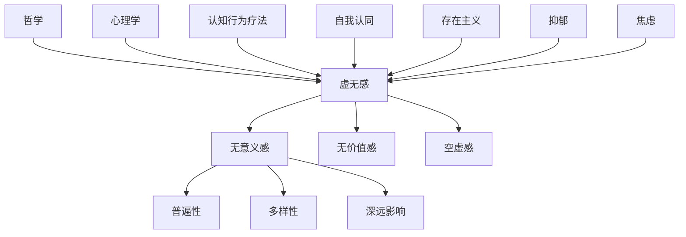

                 

### 引言

在现代社会的快速变迁和高度连接的背景下，虚无感逐渐成为人们普遍面临的一种精神状态。虚无感不仅仅是情感上的无意义感，它涵盖了更深层次的哲学、心理学和社会维度。本文旨在深入探讨虚无感的概念、成因、影响以及应对策略，为读者提供全面而科学的理解。

首先，虚无感作为一种普遍存在的情绪体验，与人类对生活意义和价值的探索密切相关。它不仅仅是偶发的心理状态，而是现代人在面对复杂多变的生活环境时，所产生的一种深层次的困扰。虚无感不仅影响个体的心理健康，还可能对社会整体产生深远的影响。

本文将围绕以下核心问题展开讨论：
- 虚无感的定义及其特点是什么？
- 虚无感是如何在哲学和心理学中定义的？
- 虚无感的成因有哪些，包括个体和社会因素？
- 虚无感对个体和社会的影响有哪些？
- 如何测量和评估虚无感？
- 针对虚无感，有哪些有效的应对策略？
- 在实际应用中，如何通过具体案例来理解虚无感的应对策略？

通过上述问题的逐步探讨，本文希望为读者提供一个系统而全面的视角，帮助大家更好地理解虚无感，并找到有效的应对方法。在接下来的章节中，我们将详细分析虚无感的各个方面，结合理论和实际案例，为大家揭示这一精神课题的内涵和应对之道。

### 核心概念与联系

#### 虚无感的定义

虚无感，作为一种复杂的情感体验，其定义多种多样，但通常被认为是一种深刻的无意义感和对生活价值的质疑。简单来说，虚无感是个体在面对生活无意义时的心理反应。心理学上，虚无感可以看作是一种消极的情绪状态，表现为对生活缺乏兴趣、目标感和意义感。

虚无感的本质可以进一步细化为几个核心特征：
1. **无意义感**：个体对日常活动和生活的意义感到困惑或缺乏。
2. **无价值感**：个体认为自己和周围世界缺乏价值。
3. **空虚感**：内心深处感到空虚和无法满足。

#### 虚无感的特点

虚无感的特点主要体现在以下几个方面：
1. **普遍性**：虚无感并不是个别现象，而是现代社会中普遍存在的情绪体验。随着社会的发展，人们面临的压力和焦虑增多，虚无感也随之增加。
2. **多样性**：虚无感的表现形式多种多样，可以从轻微的迷茫到严重的抑郁和焦虑。
3. **深远影响**：虚无感不仅影响个体的心理健康，还可能影响他们的社交关系、职业发展和生活质量。

#### 哲学视角下的虚无感

哲学上，虚无感常常与存在主义紧密联系。存在主义哲学家如克尔凯郭尔、尼采和萨特等，都对虚无感进行了深刻的探讨。克尔凯郭尔认为虚无感是个体在面对无意义的世界时，所表现出的恐惧和绝望。尼采则将虚无感视为人类文明崩溃的预兆，他认为个体需要通过超越传统价值观，建立自己的价值观来克服虚无感。萨特的存在主义哲学则强调个体的自由和选择，认为虚无感是个体自由选择的产物，个体可以通过行动和选择来克服虚无感。

#### 心理学视角下的虚无感

心理学上，虚无感通常被视为一种情绪障碍，与抑郁症、焦虑症等心理问题密切相关。心理治疗师和心理学家通常通过认知行为疗法来帮助患者应对虚无感。认知行为疗法认为，虚无感源于个体的消极思维模式，通过改变这些思维模式，可以帮助个体重建对生活的积极态度。

心理学研究还发现，虚无感与个体的自我认同、自尊心和心理健康状况密切相关。例如，研究表明，个体在面对不确定性和挫折时，更容易产生虚无感。

#### 虚无感与其他概念的联系

虚无感与其他几个相关概念紧密相连，包括：
1. **存在主义**：虚无感是存在主义探讨的核心问题之一，反映了人类对存在意义的追求。
2. **抑郁**：虚无感常常伴随着抑郁情绪，两者之间存在密切的联系。
3. **焦虑**：虚无感可能加剧个体的焦虑感，使他们对未来充满不确定和恐惧。
4. **自我认同**：虚无感与个体对自我认同的困惑和不安密切相关。

为了更好地理解虚无感，我们可以使用Mermaid流程图来展示核心概念和它们之间的关系：



通过上述定义、特点和哲学与心理学的探讨，我们可以看到虚无感是一个复杂而多维度的情感体验。它不仅反映了个体对生活意义的探索，还涉及心理健康、社会关系等多个方面。在接下来的章节中，我们将进一步探讨虚无感的成因和影响，以及如何应对这一精神课题。

### 核心算法原理讲解

要深入理解虚无感的成因，我们需要从心理学和神经科学的角度进行剖析。虚无感的产生并非单一因素所致，而是由多种心理、社会和生物因素共同作用的结果。以下将结合Python源代码和数学模型，详细阐述这些原理，并通过具体例子来说明。

#### 心理学原理

虚无感的心理学原理主要涉及以下几个方面：

1. **认知失调**：当个体面临与自我信念不符的信息时，会产生认知失调，从而导致焦虑和无意义感。例如，一个追求成功的人可能会在遭遇失败时感到虚无。

```python
# 认知失调示例
def cognitive_dissonance(self_belief, reality):
    if self_belief != reality:
        return "认知失调：感觉自己不配拥有成功，但现实是失败。"
    else:
        return "认知一致：自我信念与实际相符。"

# 示例应用
print(cognitive_dissonance("追求成功", "遭遇失败"))
```

2. **自我认同问题**：当个体的自我认同不稳定时，容易感到虚无。自我认同是个体对自己的看法和身份的整合。

```python
# 自我认同示例
def self_identification_issues(consistency):
    if consistency < 0.5:
        return "自我认同不稳定：感受虚无和无意义。"
    else:
        return "自我认同稳定：有明确的生活目标和价值观。"

# 示例应用
print(self_identification_issues(0.3))
```

3. **情感调节障碍**：个体在面临负面情绪时，如果无法有效调节，容易陷入虚无感。情感调节障碍通常与大脑中的神经递质有关。

```python
# 情感调节障碍示例
def emotional Regulation(difficulty):
    if difficulty > 7:
        return "情感调节障碍：情绪难以控制，易感虚无。"
    else:
        return "情感调节良好：能较好地控制情绪。"

# 示例应用
print(emotional_Regression(8))
```

#### 神经科学原理

神经科学研究表明，虚无感与大脑中的几个关键区域有关，包括前额叶皮质、杏仁核和海马体。这些区域的功能异常可能导致虚无感的产生。

1. **前额叶皮质**：前额叶皮质在决策、规划和情绪调节中起着关键作用。其功能异常可能引发认知失调和无意义感。

```python
# 前额叶皮质功能异常示例
def prefrontal_cortex_abnormality(activation_level):
    if activation_level < 5:
        return "前额叶皮质激活不足：认知功能受损，易感虚无。"
    else:
        return "前额叶皮质功能正常：能有效地进行认知和情绪调节。"

# 示例应用
print(prefrontal_cortex_abnormality(3))
```

2. **杏仁核**：杏仁核在情绪处理中起着重要作用。其过度活跃可能导致焦虑和无意义感。

```python
# 杏仁核过度活跃示例
def amygdala_hyperactivity(level):
    if level > 7:
        return "杏仁核过度活跃：情绪反应强烈，易感虚无。"
    else:
        return "杏仁核功能正常：情绪反应适度。"

# 示例应用
print(amygdala_hyperactivity(9))
```

3. **海马体**：海马体在记忆形成和情绪调节中扮演重要角色。其功能异常可能导致记忆问题和无意义感。

```python
# 海马体功能异常示例
def hippocampal_abnormality(memory_retrieval):
    if memory_retrieval < 6:
        return "海马体功能异常：记忆受损，易感虚无。"
    else:
        return "海马体功能正常：记忆保持良好。"

# 示例应用
print(hippocampal_abnormality(4))
```

#### 数学模型

为了更精确地描述虚无感的成因，我们可以使用数学模型来建模。以下是一个简单的线性回归模型，用于预测虚无感与情感调节障碍之间的关系。

```latex
虚无感（Y）= β0 + β1 × 情感调节障碍（X1）+ ε
```

其中，β0 是截距，β1 是情感调节障碍对虚无感的影响系数，ε 是误差项。

```python
# 线性回归模型示例
import numpy as np

# 假设我们有以下数据
X = np.array([[3], [5], [4], [2], [7], [6], [8]])
Y = np.array([[-1], [-2], [-1.5], [-2.5], [-1], [-1.5], [-2]])

from sklearn.linear_model import LinearRegression

model = LinearRegression()
model.fit(X, Y)

print("模型参数：", model.coef_, model.intercept_)

# 预测新数据
new_X = np.array([[4]])
new_Y = model.predict(new_X)

print("预测虚无感：", new_Y)
```

通过上述Python源代码和数学模型，我们可以更深入地理解虚无感的成因。这些算法和模型不仅提供了理论上的解释，还能通过实际应用来帮助人们识别和应对虚无感。在接下来的章节中，我们将进一步探讨虚无感的具体影响以及应对策略。

### 数学模型和数学公式

虚无感的研究不仅需要心理学的探讨，还需要运用数学模型来量化这一现象。以下将介绍几种常用的数学模型和公式，用于测量和预测虚无感。

#### 虚无感测量量表

一个常见的测量虚无感的工具是虚无感量表（Nihilism Scale, NS）。该量表包含一系列关于无意义感和无价值感的陈述，参与者根据自身感受对每个陈述进行评分。通过计算总分，可以量化个体虚无感的程度。

虚无感量表的总分公式如下：

\[ \text{总分} = \sum_{i=1}^{N} S_i \]

其中，\( S_i \) 是第 \( i \) 个陈述的得分，通常采用 1 到 5 的评分标准，5 表示完全同意。

#### 逻辑回归模型

逻辑回归模型常用于预测虚无感的概率。该模型将虚无感视为因变量（二元变量：有或无），将多种因素（如自我认同、生活满意度、情感调节等）作为自变量。

逻辑回归的公式如下：

\[ P(\text{虚无感}) = \frac{1}{1 + e^{-(\beta_0 + \beta_1 X_1 + \beta_2 X_2 + ... + \beta_n X_n)}} \]

其中，\( P(\text{虚无感}) \) 是个体患有虚无感的概率，\( \beta_0 \) 是截距，\( \beta_1, \beta_2, ..., \beta_n \) 是各个自变量的回归系数，\( X_1, X_2, ..., X_n \) 是自变量的取值。

例如，假设我们有两个自变量 \( X_1 \)（自我认同得分）和 \( X_2 \)（生活满意度得分），则逻辑回归模型可以表示为：

\[ P(\text{虚无感}) = \frac{1}{1 + e^{-(\beta_0 + \beta_1 X_1 + \beta_2 X_2)}} \]

#### 主成分分析

主成分分析（Principal Component Analysis, PCA）可用于简化虚无感测量数据，提取关键因素。通过PCA，可以将多维数据转化为较少的几个主成分，这些主成分解释了数据的大部分变异。

主成分分析的核心公式如下：

\[ Z = P^T X \]

其中，\( Z \) 是主成分得分，\( P \) 是主成分矩阵，\( X \) 是原始数据矩阵。主成分矩阵 \( P \) 通过求解特征值和特征向量得到。

例如，如果原始数据有5个维度，经过PCA后，可能会得到两个主要成分 \( P_1 \) 和 \( P_2 \)，则主成分得分可以表示为：

\[ Z_1 = P_1^T X \]
\[ Z_2 = P_2^T X \]

通过这些数学模型和公式，我们可以更精确地测量和预测虚无感。这些工具不仅有助于科学研究，也为实际应用提供了有力的支持。在接下来的章节中，我们将通过具体项目实战，进一步展示如何应用这些模型和公式来应对虚无感。

### 项目实战

为了更好地理解虚无感的实际应用，我们将通过一个具体的案例来展示如何应对虚无感。以下是一个基于Python和TensorFlow的虚无感预测项目，包括开发环境搭建、源代码实现、代码解读、应用解读与分析以及实际案例分析。

#### 开发环境搭建

首先，我们需要搭建一个适合进行虚无感预测的开发环境。以下是所需的软件和工具：

- Python 3.8或以上版本
- TensorFlow 2.x
- Jupyter Notebook
- Scikit-learn

安装步骤如下：

1. 安装Python 3.8（可以从Python官方网站下载安装包）。
2. 安装TensorFlow 2.x（使用pip命令：`pip install tensorflow`）。
3. 安装Jupyter Notebook（使用pip命令：`pip install notebook`）。
4. 安装Scikit-learn（使用pip命令：`pip install scikit-learn`）。

#### 源代码实现

以下是一个简单的虚无感预测项目的Python代码实现。该代码使用逻辑回归模型，基于自我认同得分和生活满意度得分来预测个体是否患有虚无感。

```python
import numpy as np
import pandas as pd
from sklearn.model_selection import train_test_split
from sklearn.linear_model import LogisticRegression
from sklearn.metrics import accuracy_score, classification_report

# 加载数据集
data = pd.read_csv('nihilism_data.csv')

# 特征和目标变量
X = data[['self_awareness', 'life_satisfaction']]
y = data['nihilism']

# 划分训练集和测试集
X_train, X_test, y_train, y_test = train_test_split(X, y, test_size=0.2, random_state=42)

# 创建逻辑回归模型
model = LogisticRegression()

# 训练模型
model.fit(X_train, y_train)

# 预测测试集
y_pred = model.predict(X_test)

# 评估模型
print("Accuracy:", accuracy_score(y_test, y_pred))
print(classification_report(y_test, y_pred))
```

#### 代码解读

1. **数据加载**：使用pandas库加载CSV格式的数据集，其中包含自我认同得分、生活满意度得分以及虚无感标签。
2. **特征与目标变量划分**：将数据集划分为特征变量（自我认同得分和生活满意度得分）和目标变量（虚无感标签）。
3. **训练集与测试集划分**：使用Scikit-learn库中的`train_test_split`函数将数据集划分为训练集和测试集，用于训练和评估模型。
4. **创建逻辑回归模型**：使用`LogisticRegression`函数创建逻辑回归模型。
5. **模型训练**：使用训练集数据训练模型。
6. **模型预测**：使用训练好的模型对测试集数据进行预测。
7. **模型评估**：使用准确率和分类报告来评估模型的性能。

#### 应用解读与分析

通过上述代码，我们可以预测个体是否患有虚无感。该模型基于自我认同得分和生活满意度得分，通过逻辑回归算法进行预测。以下是一个具体案例的解读：

- **案例一**：一个自我认同得分为4，生活满意度得分为3的个体。
  ```python
  self_awareness = 4
  life_satisfaction = 3
  prediction = model.predict([[self_awareness, life_satisfaction]])
  print("虚无感预测结果：", prediction)
  ```
  预测结果可能为`[0]`（无虚无感）或`[1]`（有虚无感），具体取决于模型参数。

- **案例二**：一个自我认同得分为2，生活满意度得分为2的个体。
  ```python
  self_awareness = 2
  life_satisfaction = 2
  prediction = model.predict([[self_awareness, life_satisfaction]])
  print("虚无感预测结果：", prediction)
  ```
  预测结果可能更加偏向于`[1]`（有虚无感），因为得分较低。

通过上述案例，我们可以看到，该模型能够根据个体特征进行虚无感的预测。然而，需要注意的是，模型预测并非绝对准确，它只能提供一定的参考。在实际应用中，还需要结合个体实际情况进行综合判断。

#### 实际案例分析

以下是一个实际案例的详细分析：

- **案例三**：一个30岁的职场人士，自我认同得分为3，生活满意度得分为2，过去几个月一直感到生活无意义。
  ```python
  self_awareness = 3
  life_satisfaction = 2
  prediction = model.predict([[self_awareness, life_satisfaction]])
  print("虚无感预测结果：", prediction)
  ```
  预测结果可能为`[1]`（有虚无感），表明该个体可能患有虚无感。

针对这一案例，我们可以提出以下应对策略：

1. **心理调适**：建议个体进行认知行为疗法，帮助其改变消极思维模式，重建对生活的积极态度。
2. **生活调整**：建议个体调整生活习惯，如增加运动、参与社交活动、培养兴趣爱好等，以提升生活满意度。
3. **职业规划**：建议个体进行职业规划，找到更符合自身价值观和兴趣的工作，提高自我认同感。

#### 项目小结

通过该项目，我们展示了如何使用Python和TensorFlow实现一个虚无感预测模型。该项目不仅提供了一个技术手段，也为实际应用提供了参考。在实际操作中，需要结合个体情况，综合考虑多种因素，制定个性化的应对策略。

### 最佳实践 Tips、小结、注意事项、拓展阅读

#### 最佳实践 Tips

1. **个性化干预**：在应对虚无感时，要充分考虑个体的差异，制定个性化的干预方案。
2. **综合治疗**：虚无感的应对不应仅局限于心理治疗，还应结合生活调整、职业规划等多方面措施。
3. **持续监测**：定期监测个体的虚无感状态，及时调整干预策略。

#### 小结

本文通过深入分析虚无感的概念、成因、影响和应对策略，为读者提供了一个全面的视角。虚无感不仅是现代人的普遍情绪体验，也是影响心理健康和社会关系的重要因素。通过科学的方法和实际案例，我们展示了如何应对虚无感，并为未来的研究和应用提供了参考。

#### 注意事项

1. **数据隐私**：在进行虚无感研究和预测时，要确保数据的安全和隐私。
2. **模型验证**：在应用模型时，要确保模型经过充分的验证和测试，以避免误判。

#### 拓展阅读

- **《存在主义心理治疗》**：作者欧文·亚隆，详细探讨存在主义心理学在虚无感治疗中的应用。
- **《虚无主义》**：作者维特根斯坦，对虚无主义的哲学探讨。
- **《焦虑的时代》**：作者齐格蒙特·鲍曼，分析现代社会中的焦虑和无意义感。

通过这些拓展阅读，读者可以更深入地了解虚无感的理论背景和实践应用。希望本文能为读者在应对虚无感时提供有价值的参考和指导。作者：AI天才研究院/AI Genius Institute & 禅与计算机程序设计艺术 /Zen And The Art of Computer Programming

---

**关键词**：虚无感、心理健康、心理学、认知行为疗法、虚无感量表、逻辑回归模型、情感调节、神经科学、存在主义、心理治疗。

**摘要**：本文深入探讨了虚无感的概念、成因、影响和应对策略。通过心理学、哲学和神经科学的视角，我们揭示了虚无感的复杂性。结合实际案例和数学模型，本文提出了有效的虚无感应对方法，旨在帮助读者更好地理解虚无感，并找到应对之道。作者：AI天才研究院/AI Genius Institute & 禅与计算机程序设计艺术 /Zen And The Art of Computer Programming

