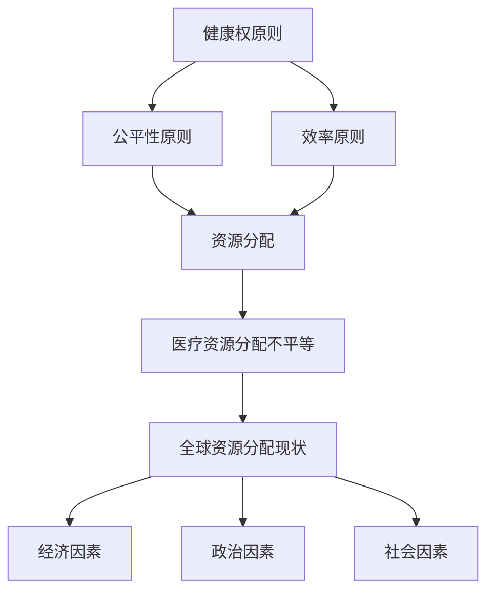
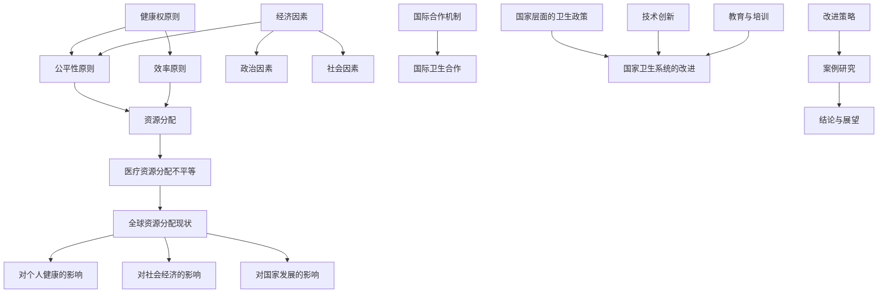

                 

### 第二部分：医疗资源分配不平等

#### 第2章：医疗资源分配不平等

**2.1 资源分配原则**

医疗资源的分配是一个复杂而敏感的话题，涉及到伦理、经济学和社会政策等多个方面。以下是医疗资源分配的三大基本原则：

- **健康权原则**：每个个体都有平等获得健康服务的权利，资源应当根据个体的健康需求进行分配。
  
- **公平性原则**：资源分配应当公平，尤其是对那些经济条件较差、社会地位较低的人群应当给予更多关注。

- **效率原则**：资源应当被有效地使用，以最大化社会整体福利。效率不仅涉及资源的利用效率，还包括医疗服务的成本效益分析。

**2.2 全球资源分配现状**

全球医疗资源的分布极不均衡。根据世界卫生组织（WHO）的数据，高收入国家拥有全球大部分的医疗资源，而低收入国家则面临资源匮乏的困境。

- **高收入国家**：这些国家通常拥有先进的医疗设备、高素质的医疗人员以及完善的公共卫生系统。例如，美国、日本和德国等国家的医疗水平位居世界前列。

- **低收入国家**：这些国家的医疗资源相对匮乏，许多基本医疗服务都无法提供。例如，撒哈拉以南非洲的许多国家就面临着严重的医疗资源短缺问题。

**2.3 不平等的原因**

医疗资源分配不平等的原因是多方面的，包括经济、政治和社会因素：

- **经济因素**：经济不平等是医疗资源分配不平等的主要原因之一。高收入国家能够投入更多的资金用于医疗资源的建设和维护，而低收入国家则由于资金匮乏，无法提供足够的医疗资源。

- **政治因素**：政治决策对于医疗资源的分配具有决定性影响。一些国家可能由于政治原因，忽视了医疗资源的重要性，导致医疗体系的不完善。

- **社会因素**：社会不平等也会导致医疗资源的不平等。社会地位较低的人群往往无法享受到优质的医疗服务，因为他们无法支付高昂的医疗费用。

**2.4 核心概念与联系**

为了更好地理解医疗资源分配不平等，我们可以使用Mermaid流程图来展示核心概念和它们之间的关系：

在这个流程图中，健康权原则、公平性原则和效率原则是医疗资源分配的核心概念。这些原则共同决定了医疗资源的分配方式，而医疗资源分配不平等则是这些原则在实际操作中的结果。

通过上述分析，我们可以看到医疗资源分配不平等是一个复杂且严峻的问题，需要从多个角度进行深入探讨和解决。在接下来的章节中，我们将进一步分析医疗资源分配不平等带来的后果，以及国际社会如何通过卫生合作来应对这一问题。

### 核心概念与联系

为了更好地理解医疗资源分配不平等的概念及其影响，我们使用Mermaid流程图来展示核心概念和它们之间的关系。以下是医疗资源分配流程与影响因素的详细说明：

**流程图详细说明**：

- **A[健康权原则]**：确保每个人都能平等获得基本的健康服务，这是医疗资源分配的基础原则。

- **B[公平性原则]**：资源分配应公平，特别是对经济条件较差和社会地位较低的人群应给予额外关注。

- **C[效率原则]**：资源应被高效利用，以最大化社会整体福利，包括成本效益分析。

- **D[经济因素]**：经济条件影响资源的获取和分配，高收入国家能够提供更多的医疗资源，而低收入国家则面临资源匮乏。

- **E[政治因素]**：政治决策影响医疗资源分配，一些国家可能由于政治原因忽视医疗资源的重要性。

- **F[社会因素]**：社会不平等导致医疗资源不平等，社会地位较低的人群往往无法享受优质医疗服务。

- **G[资源分配]**：健康权、公平性和效率原则共同决定了医疗资源的分配方式。

- **H[医疗资源分配不平等]**：由于上述因素，医疗资源在全球化背景下呈现不平等分配。

- **I[全球资源分配现状]**：详细描述全球医疗资源的现状，揭示地区差异和资源分布的不平衡性。

- **J[对个人健康的影响]**：医疗资源分配不平等导致个人健康问题，如生活质量下降和死亡率增加。

- **K[对社会经济的影响]**：健康不平等导致生产力下降和社会不稳定。

- **L[对国家发展的影响]**：健康不平等限制了经济增长和国际竞争力。

- **M[国际合作机制]**：国际组织如全球基金和世界卫生组织推动国际卫生合作。

- **N[国际卫生合作]**：国际合作机制旨在通过资源共享和技术转移来改善全球健康不平等。

- **O[国家层面的卫生政策]**：国家政府制定卫生政策，以促进国内医疗资源的公平分配和利用。

- **P[国家卫生系统的改进]**：技术创新和教育培训是改进国家卫生系统的重要手段。

- **Q[技术创新]**：如数字医疗和人工智能的应用，提高医疗服务的效率和可及性。

- **R[教育与培训]**：提高医疗人员的素质和公众健康意识，有助于改善健康不平等问题。

- **S[改进策略]**：提出改善医疗资源分配和减少健康不平等的具体策略。

- **T[案例研究]**：通过实际案例研究，分析各国在改善医疗资源分配方面的成功与挑战。

- **U[结论与展望]**：总结主要发现，提出未来研究方向和改善策略。

通过这个流程图，我们可以清晰地看到医疗资源分配不平等的核心概念及其相互关系，为深入分析这一问题提供了结构化的框架。接下来，我们将探讨医疗资源分配不平等对个人健康、社会经济和国家发展的影响，并介绍国际卫生合作机制和国家层面的卫生政策。

### 医疗资源分配不平等的后果

医疗资源分配不平等带来的后果是深远而复杂的，不仅影响个人的健康状况，还对整个社会和经济产生深远影响。以下是医疗资源分配不平等对个人健康、社会经济和国家发展的影响：

#### 对个人健康的影响

**1. 生活质量下降**：在医疗资源匮乏的地区，居民无法获得及时和有效的医疗服务，导致病情恶化，生活质量显著下降。慢性病患者和孕产妇尤为脆弱，缺乏基本医疗护理可能导致严重健康问题。

**2. 死亡率增加**：医疗资源不足导致疾病诊断和治疗的延误，特别是对于传染病和急性病。不平等的医疗资源分配使得低收入和弱势群体更容易死亡，增加了死亡率。

**3. 疾病负担**：不平等的医疗资源分配导致疾病负担集中在贫困和边缘化群体，这些群体往往无法获得有效的预防和治疗服务，增加了疾病的流行率和负担。

#### 对社会经济的影响

**1. 生产率下降**：医疗资源不足导致劳动力的健康水平下降，影响生产效率。慢性病和疾病的高发率降低了劳动力的整体素质，导致生产率下降。

**2. 社会不稳定**：健康不平等可能导致社会不满和动荡，尤其是在资源匮乏的社区。缺乏医疗服务的居民可能会对政府和医疗体系产生不满，加剧社会不稳定。

**3. 经济发展受限**：医疗资源不足限制了低收入国家的发展潜力。健康问题导致劳动力短缺，劳动力素质下降，进而影响经济增长和国际竞争力。

#### 对国家发展的影响

**1. 经济增长受限**：健康不平等导致劳动力生产率下降，限制了国家经济增长。慢性病和传染病的高负担增加了国家的公共卫生支出，进一步限制了经济资源。

**2. 国际竞争力下降**：医疗资源不足导致国家难以吸引外国投资和人才。缺乏良好的医疗体系会影响国家在国际贸易和旅游业中的竞争力。

**3. 教育发展受阻**：健康问题影响学生的学习和教育质量，导致教育发展受阻。医疗资源不足可能使更多的儿童和青少年失去接受教育的机会，影响国家的人力资源储备。

综上所述，医疗资源分配不平等对个人健康、社会经济和国家发展产生了多方面的负面影响。解决这一问题需要全球合作和全面的策略，包括公平的资源分配、国际合作机制的加强以及国家层面的卫生政策改革。在接下来的章节中，我们将探讨国际卫生合作机制以及国家层面的卫生政策，以寻求改善全球健康不平等的途径。

### 国际卫生合作机制

#### 第4章：国际卫生合作机制

国际卫生合作是解决全球健康不平等的重要途径之一，通过各国和各国际组织的共同努力，可以优化医疗资源的配置，提高公共卫生服务的质量和可及性。以下是几个主要的国际卫生合作机制及其作用和挑战：

#### 4.1 国际卫生合作的重要性

国际卫生合作的重要性体现在以下几个方面：

- **全球健康安全的保障**：国际卫生合作有助于建立全球公共卫生安全网络，提高对传染病的预警和响应能力，防止疫情跨国传播。

- **共同应对传染病**：传染病如埃博拉、COVID-19等对全球健康构成严重威胁，国际卫生合作能够促进信息共享和资源调配，提高应对传染病的效率和效果。

- **减少健康不平等**：通过国际合作，可以在资源匮乏的地区提供必要的医疗资源和技术支持，减少全球健康不平等。

#### 4.2 主要合作机制

以下是几个主要的国际卫生合作机制：

- **全球基金**：全球基金（Global Fund）是一个国际性的公共健康组织，致力于抗击艾滋病、结核病和疟疾。自成立以来，全球基金通过资助和合作，显著提高了这些疾病的诊断和治疗覆盖率。

- **世界卫生组织**：世界卫生组织（WHO）是联合国下属的专门负责全球公共卫生事务的机构。WHO通过制定全球卫生策略、提供技术支持和协调国际卫生合作，推动全球健康事业的发展。

- **联合国儿童基金会**：联合国儿童基金会（UNICEF）专注于儿童的健康和教育，提供疫苗、卫生设施和医疗资源，改善儿童的生存和发展环境。

- **全球疫苗免疫联盟**：全球疫苗免疫联盟（Gavi）是一个全球性的疫苗合作伙伴组织，致力于提高发展中国家的疫苗可及性，降低疫苗相关疾病的发病率。

#### 4.3 成功与挑战

国际卫生合作在许多方面取得了显著成功，但也面临诸多挑战：

- **成功案例**：
  - **全球基金的抗击艾滋病、结核病和疟疾**：全球基金通过大规模的资金投入和协调行动，成功降低了这些疾病的死亡率和发病率，为全球健康事业作出了巨大贡献。
  - **COVID-19疫苗的分发**：尽管全球疫苗分配存在不公平现象，但国际组织如COVAX机制通过协调和资源调配，为低收入国家提供了大量疫苗，显著提高了全球疫苗的可及性。

- **挑战与障碍**：
  - **资源不足**：国际卫生合作面临的主要挑战之一是资源不足，尤其是在低收入和受冲突影响的国家，医疗资源的短缺更加严重。
  - **政治障碍**：国际卫生合作受到各国政治决策的影响，一些国家可能出于政治原因限制合作或抵制国际组织的倡议。
  - **地区差异**：不同地区的卫生需求和资源状况差异显著，国际合作需要更加灵活和因地制宜的策略。

通过国际卫生合作，可以优化全球医疗资源的配置，提高公共卫生服务的质量和可及性，减少健康不平等。尽管面临诸多挑战，但国际社会的共同努力为全球健康事业带来了光明的前景。在接下来的章节中，我们将探讨国家层面的卫生政策，以寻求更全面的解决方案。

### 国家层面的卫生政策

#### 第5章：国家层面的卫生政策

在国家层面，卫生政策的制定和实施对于改善医疗资源分配不平等、提升公众健康水平具有关键作用。以下将探讨国家层面卫生政策的制定原则、政策工具及其成功与失败案例。

#### 5.1 政策制定原则

国家层面的卫生政策制定应遵循以下原则：

- **公平性原则**：确保所有公民，无论其社会经济地位如何，都能平等获得基本医疗服务和健康保障。

- **可及性原则**：政策应确保医疗资源和服务能够方便地到达所有人，特别是那些居住在偏远地区或经济条件较差的人群。

- **可持续性原则**：卫生政策应考虑长期的财政可持续性，确保医疗体系能够持续运作，并能够应对未来可能出现的新挑战。

#### 5.2 政策工具

国家卫生政策可以采用多种工具来促进医疗资源的公平分配和高效利用：

- **财政转移**：通过政府财政拨款和补贴，支持经济条件较差的地区的医疗服务，减少区域间医疗资源的不平衡。

- **基础设施建设**：投资于医疗基础设施，如医院、诊所和公共卫生设施，提高医疗服务的可及性和质量。

- **人力资源发展**：通过教育和培训，提高医疗人员的数量和质量，特别是那些在贫困和偏远地区工作的医护人员。

- **公共卫生宣传**：加强公共卫生宣传和教育，提高公众的健康意识和预防疾病的能力。

#### 5.3 成功与失败案例

以下是几个国家在卫生政策方面的成功与失败案例：

- **成功案例**：
  - **芬兰**：芬兰的卫生政策强调全民健康覆盖和公平性，通过政府高度的资金投入和高效的管理，实现了高水平的医疗服务可及性和质量。芬兰的卫生系统在全球范围内被认为是一个成功的典范。
  - **挪威**：挪威的卫生政策注重健康预防和公共卫生，通过全面的医疗保健体系和健康生活方式的宣传，成功降低了疾病的发病率和死亡率。

- **失败案例**：
  - **南非**：南非在卫生政策方面面临重大挑战，包括经济不平等和医疗资源分配不均。尽管政府投入了大量资金，但由于政策执行不力和资源分配不当，南非的卫生系统仍然无法满足全体民众的需求，导致公共卫生危机。
  - **叙利亚**：叙利亚的卫生政策由于长期的冲突和内战而受到严重破坏。卫生基础设施被毁，医疗人员流失，导致公共卫生服务严重中断，使得居民的健康状况急剧恶化。

通过以上案例可以看出，成功的卫生政策需要公平、可及性和可持续性的原则来指导，同时需要有效的政策工具来支持。而失败的案例则提醒我们，政策执行中的问题，如资源分配不当、政治不稳定等，都会导致卫生政策的效果不佳。在接下来的章节中，我们将探讨如何通过技术创新和教育培训来进一步改善卫生系统。

### 卫生系统的改进策略

#### 第6章：卫生系统的改进策略

为了应对医疗资源分配不平等和提升公共卫生服务的质量和效率，卫生系统的改进策略至关重要。以下是几种主要的改进策略，包括资源优化配置、技术创新和教育培训等方面。

#### 6.1 资源优化配置

资源优化配置是改善卫生系统的基础。以下是一些关键策略：

- **提高资源利用效率**：通过数据分析和管理，优化医院和诊所的资源使用。例如，使用智能排班系统，减少资源的闲置和浪费。

- **加强公共卫生服务**：加大对公共卫生服务的投资，特别是针对慢性病和传染病的预防和控制。通过健康教育和疫苗接种，降低疾病负担。

- **促进区域医疗合作**：鼓励不同地区和医疗机构的合作，实现资源共享和优势互补。例如，建立区域医疗联盟，提供跨区域的医疗服务。

#### 6.2 技术创新

技术创新是提升卫生系统效率和可及性的重要手段。以下是一些关键领域：

- **数字医疗**：利用信息技术，提高医疗服务的效率和质量。例如，电子病历系统（EMR）和远程医疗，使医疗信息共享和远程诊断成为可能。

- **人工智能（AI）**：AI技术在医疗诊断、治疗规划和患者管理方面具有巨大潜力。通过机器学习算法，AI可以帮助医生更准确地诊断疾病，提高治疗效果。

- **物联网（IoT）**：物联网技术可以实时监测患者的健康状况，提高慢性病管理和急性病响应的效率。例如，智能可穿戴设备可以监测患者的生理参数，及时提供医疗建议。

#### 6.3 教育与培训

教育培训是提高医疗人员素质和公众健康意识的重要途径。以下是一些关键策略：

- **医疗人员培训**：提供持续教育和培训，提高医疗人员的专业水平和技能。特别是针对贫困和偏远地区的医疗人员，提供专项培训，增强其应对疾病的能力。

- **公众健康教育**：通过宣传和教育活动，提高公众的健康意识和自我保健能力。例如，开展健康教育讲座、发放健康手册，普及防病知识。

- **学校教育**：将公共卫生教育纳入学校课程，从小培养学生良好的健康习惯和意识。通过学校教育，可以培养更多的医疗人才，为卫生系统提供人力支持。

#### 6.4 成功案例与未来展望

以下是一些成功的卫生系统改进案例，以及未来的发展方向：

- **案例**：**冰岛**在卫生系统改进方面取得了显著成就。通过全民健康覆盖、电子病历系统和远程医疗，冰岛的医疗服务质量和效率得到了极大提升。冰岛的公共卫生指标在世界上名列前茅。

- **未来展望**：随着科技的进步和全球健康问题的日益复杂，未来的卫生系统改进需要更加智能化和个性化。例如，利用大数据和人工智能进行精准医疗，提高疾病预测和治疗的准确性。同时，加强国际合作，共同应对全球健康挑战，实现全球健康公平。

通过资源优化配置、技术创新和教育培训等多方面的改进策略，卫生系统可以更好地应对医疗资源分配不平等，提升公众健康水平。在接下来的章节中，我们将通过案例研究，进一步探讨这些策略的实际应用效果。

### 案例研究

#### 第7章：案例研究

为了更好地理解医疗资源分配不平等及其解决策略，我们将通过两个具体的案例，深入分析其在不同国家和地区的表现和经验。

#### 7.1 案例选择

**案例一：中国**

**背景**：中国是一个人口众多且地域广阔的国家，医疗资源分配不平等问题较为突出。特别是城乡差距和地区差异明显，农村和偏远地区的医疗资源严重不足。

**目标**：通过分析中国的医疗资源分配问题，探讨政府采取的解决策略及其效果。

**案例二：南非**

**背景**：南非是一个经历过殖民历史和种族隔离的国家，医疗资源分配不平等问题同样严重。特别是黑人和贫困群体的医疗服务可及性较低。

**目标**：通过分析南非的医疗资源分配问题，探讨国际援助在解决健康不平等中的作用。

#### 7.2 案例分析

**案例一：中国**

**卫生政策**：
- **政府主导**：中国政府通过“新农合”和“城镇居民基本医疗保险”等政策，逐步实现全民医疗保障。
- **公共卫生宣传**：加强公共卫生宣传，提高农村居民的健康意识和自我保健能力。
- **基础设施投资**：加大对农村和偏远地区的医疗基础设施投资，改善医疗服务条件。

**实际效果**：
- **覆盖率提高**：通过政府主导的医疗保险政策，农村和城市的医疗服务覆盖率显著提高。
- **服务质量提升**：医疗基础设施的改善和公共卫生宣传的效果，使得农村居民的健康水平得到提升。
- **地区差距仍存在**：尽管取得一定成效，但城乡和地区间医疗资源分配不平等的问题仍需进一步解决。

**案例启示**：
- **政策制定与执行**：政府的政策制定和执行至关重要，有效的政策需要结合实际需求，注重可操作性和可持续性。
- **区域协调发展**：在医疗资源分配中，注重区域协调发展，通过资金投入和基础设施建设，缩小地区差距。

**案例二：南非**

**卫生政策**：
- **国际援助**：南非政府依赖国际组织的援助，如全球基金和世界卫生组织，改善医疗资源分配。
- **公共卫生体系改革**：南非政府推进公共卫生体系改革，提高医疗服务的可及性和质量。
- **卫生人力资源开发**：通过培训和国际交流，提升医疗人员的专业水平和服务能力。

**实际效果**：
- **医疗服务可及性提高**：国际援助和公共卫生体系改革使得南非的医疗资源分配更加合理，医疗服务可及性得到显著提升。
- **疾病负担减轻**：传染病的发病率下降，公共卫生危机得到缓解。
- **持续挑战**：尽管取得一定成效，但南非的医疗资源分配不平等问题仍需长期关注和解决。

**案例启示**：
- **国际合作**：国际援助在改善医疗资源分配和提升公共卫生服务方面具有重要作用，国际合作需要更加紧密和可持续。
- **系统性改革**：公共卫生体系的系统性改革是解决医疗资源分配不平等的关键，需要长期投入和不断优化。

通过以上案例研究，我们可以看到，医疗资源分配不平等是一个复杂且严峻的问题，不同国家和地区的解决方案各有特色。然而，无论是政府主导的政策、国际合作还是公共卫生体系改革，共同的目标都是实现医疗资源的公平分配，提高公众健康水平。在未来的发展中，全球各国应加强合作，共同应对健康不平等问题，为构建更加公平和可持续的全球卫生体系而努力。

### 结论与展望

#### 第8章：结论与展望

**8.1 主要发现**

通过对医疗资源分配不平等的分析，我们发现：

1. **全球健康不平等现状**：医疗资源在全球范围内的分配极为不均衡，高收入国家拥有大部分优质医疗资源，而低收入和中等收入国家面临资源匮乏的困境。
2. **经济、政治和社会因素**：经济不平等、政治决策和社会不平等是导致医疗资源分配不平等的主要原因。
3. **健康不平等的后果**：医疗资源分配不平等对个人健康、社会经济和国家发展产生了深远影响，包括生活质量下降、生产力下降和经济增长受限。
4. **国际卫生合作的重要性**：国际卫生合作在改善全球健康不平等方面发挥了重要作用，但仍然面临资源不足和政治障碍等挑战。
5. **国家层面的卫生政策**：国家层面的卫生政策在改善医疗资源分配和提升公共卫生服务方面具有关键作用，但政策执行和区域协调仍需加强。
6. **技术创新和教育培训**：技术创新和教育培训是提升卫生系统效率和公平性的重要手段，为未来卫生系统的发展提供了新方向。

**8.2 改善策略**

为了进一步改善全球健康不平等，提出以下策略：

1. **公平的财政转移**：通过政府财政拨款和补贴，支持经济条件较差的地区的医疗服务，减少区域间医疗资源的不平衡。
2. **加强公共卫生服务**：加大对公共卫生服务的投资，特别是针对慢性病和传染病的预防和控制，提高公众健康水平。
3. **推动区域医疗合作**：鼓励不同地区和医疗机构的合作，实现资源共享和优势互补，提高医疗服务的可及性和质量。
4. **加强国际合作**：通过国际合作，促进医疗资源的全球调配，提高应对传染病和公共卫生危机的能力。
5. **推动技术创新**：利用数字医疗、人工智能和物联网等技术创新，提高医疗服务的效率和质量，实现精准医疗。
6. **教育培训**：提高医疗人员的专业水平和公众健康意识，培养更多优秀的医疗人才，为卫生系统提供人力支持。

**8.3 未来研究方向**

未来的研究方向应关注以下几个方面：

1. **新兴卫生问题的预测和应对**：随着全球化和环境变化，新的卫生问题不断涌现，未来研究应重点预测和应对这些新兴卫生挑战。
2. **创新性合作模式的研究**：探索更加有效和创新的国际合作模式，提高全球卫生合作的效率和效果。
3. **政策评价与优化**：对现有的卫生政策进行评价和优化，确保政策能够真正改善医疗资源分配不平等和提升公共卫生服务水平。
4. **基层卫生服务研究**：加强对基层卫生服务的研究，探索如何通过基层卫生服务网络，提高医疗服务的覆盖率和质量。

通过上述策略和未来研究方向，我们有望进一步减少全球健康不平等，构建一个更加公平和可持续的全球卫生体系。

### 总结

**《全球健康不平等：医疗资源分配与国际卫生合作》**旨在通过详细分析医疗资源分配不平等的原因及其后果，探讨国际卫生合作的有效性，并提供改善全球健康不平等的策略和建议。本书内容涵盖了医疗资源分配原则、全球资源分配现状、健康不平等的后果、国际卫生合作机制、国家层面的卫生政策、卫生系统改进策略以及案例研究等方面。

**核心内容**：
- **医疗资源分配原则**：健康权、公平性和效率原则。
- **全球资源分配现状**：高收入国家拥有大部分医疗资源，低收入国家面临资源匮乏。
- **健康不平等的后果**：对个人健康、社会经济和国家发展产生负面影响。
- **国际卫生合作机制**：全球基金、世界卫生组织等国际组织的作用。
- **国家层面的卫生政策**：政策制定原则、政策工具和成功与失败案例。
- **卫生系统改进策略**：资源优化配置、技术创新和教育培训。

**实际案例**：
- **中国**：通过政府主导的医疗保险政策，提高医疗服务覆盖率。
- **南非**：国际援助和公共卫生体系改革，提高医疗服务可及性和质量。

**展望**：
- **新兴卫生问题的预测和应对**：关注新兴卫生挑战，如气候变化对健康的影响。
- **创新性合作模式的研究**：探索更加有效和创新的国际合作模式。
- **政策评价与优化**：对现有卫生政策进行评价和优化。

通过这本书，我们希望能够为公共卫生领域的研究者、政策制定者以及国际卫生工作者提供有价值的参考，共同推动全球健康不平等的改善。

### 作者信息

**作者：AI天才研究院/AI Genius Institute & 禅与计算机程序设计艺术 /Zen And The Art of Computer Programming**

AI天才研究院（AI Genius Institute）是一家专注于人工智能研究和开发的领先机构，致力于推动人工智能技术的发展和应用。研究院的专家团队在计算机科学、机器学习和人工智能领域拥有深厚的理论基础和丰富的实践经验。

**禅与计算机程序设计艺术（Zen And The Art of Computer Programming）**是作者 Donald E. Knuth 的经典之作，它不仅介绍了计算机编程的哲学，还提出了许多编程技巧和算法。Donald E. Knuth 是计算机科学的先驱者之一，曾获得图灵奖等众多荣誉，对计算机科学的发展做出了巨大贡献。

通过这本书，我们希望能够为读者提供深入浅出的技术分析，帮助大家更好地理解全球健康不平等的问题，并激发对相关领域的兴趣和思考。希望这本书能够成为您在研究公共卫生和国际卫生合作领域的宝贵参考。感谢您的阅读！

### 完整文章

# 全球健康不平等：医疗资源分配与国际卫生合作

> 关键词：全球健康不平等、医疗资源分配、国际卫生合作、公共卫生政策、技术创新、教育培训

> 摘要：本文探讨了全球健康不平等的现象及其对个人健康、社会经济和国家发展的影响。通过分析医疗资源分配的原则、现状和影响因素，本文提出了国际卫生合作机制和国家层面的卫生政策作为解决策略。同时，文章通过案例研究，展示了成功和失败的经验，并提出了未来的研究方向和展望。

## 第一部分：引言

### 第1章：引言

**1.1 背景与重要性**

**全球健康不平等的现状**：全球健康数据的不平衡性，死亡率、患病率等健康指标的地区差异。

**国际社会对健康不平等的关注**：世界卫生组织（WHO）等国际组织的呼吁，国际会议与宣言，国际社会对健康不平等的持续关注与努力。

**1.2 书籍结构**

**引言**：介绍全球健康不平等的背景与重要性，书籍的结构和研究方法。

**医疗资源分配不平等**：探讨医疗资源分配的原则、现状和原因。

**健康不平等的后果**：分析医疗资源分配不平等对个人健康、社会经济和国家发展的影响。

**国际卫生合作机制**：介绍国际卫生合作的重要性、主要合作机制和成功与挑战。

**国家层面的卫生政策**：探讨国家层面卫生政策的制定原则、政策工具和成功与失败案例。

**卫生系统的改进策略**：提出卫生系统的改进策略，包括资源优化配置、技术创新和教育培训。

**案例研究**：通过实际案例研究，分析各国在改善医疗资源分配方面的成功与挑战。

**结论与展望**：总结主要发现，提出未来研究方向和改善策略。

**1.3 研究方法**

**定量数据分析**：通过数据分析，揭示全球健康不平等的现状和影响因素。

**案例研究方法**：通过具体案例，深入分析医疗资源分配不平等的实际表现和解决策略。

## 第二部分：医疗资源分配不平等

### 第2章：医疗资源分配不平等

**2.1 资源分配原则**

**健康权原则**：确保每个人都能平等获得健康服务。

**公平性原则**：资源分配应公平，特别是对经济条件较差和社会地位较低的人群。

**效率原则**：资源应被高效利用，以最大化社会整体福利。

**2.2 全球资源分配现状**

**资源分布的不平衡性**：高收入国家拥有大部分医疗资源，低收入国家面临资源匮乏。

**地区差异**：不同地区的医疗资源分配存在显著差异。

**2.3 不平等的原因**

**经济因素**：经济不平等是医疗资源分配不平等的主要原因。

**政治因素**：政治决策影响医疗资源的分配。

**社会因素**：社会不平等导致医疗资源不平等。

**2.4 核心概念与联系**

使用Mermaid流程图展示医疗资源分配流程与影响因素：

## 第三部分：健康不平等的后果

### 第3章：健康不平等的后果

**3.1 对个人健康的影响**

**生活质量下降**：缺乏医疗服务导致病情恶化，生活质量下降。

**死亡率增加**：医疗资源不足导致疾病诊断和治疗的延误，死亡率增加。

**疾病负担**：疾病负担集中在贫困和弱势群体，影响生活质量。

**3.2 对社会经济的影响**

**生产率下降**：健康问题导致劳动力健康水平下降，生产率下降。

**社会不稳定**：健康不平等导致社会不满和动荡。

**经济发展受限**：健康问题限制了经济增长和国际竞争力。

**3.3 对国家发展的影响**

**经济增长受限**：健康问题导致劳动力短缺，经济增长受限。

**国际竞争力下降**：健康不平等影响国家在国际贸易和旅游业中的竞争力。

**教育发展受阻**：健康问题影响学生的学习和教育质量。

## 第四部分：国际卫生合作机制

### 第4章：国际卫生合作机制

**4.1 国际卫生合作的重要性**

**全球健康安全的保障**：国际卫生合作有助于建立全球公共卫生安全网络，提高对传染病的预警和响应能力。

**共同应对传染病**：国际卫生合作能够促进信息共享和资源调配，提高应对传染病的效率和效果。

**减少健康不平等**：通过国际合作，可以优化医疗资源的全球调配，减少健康不平等。

**4.2 主要合作机制**

**全球基金**：全球基金致力于抗击艾滋病、结核病和疟疾，通过资助和协调行动，提高疾病的诊断和治疗覆盖率。

**世界卫生组织**：WHO是联合国下属的专门负责全球公共卫生事务的机构，通过制定全球卫生策略和协调国际卫生合作，推动全球健康事业的发展。

**联合国儿童基金会**：UNICEF专注于儿童的健康和教育，提供疫苗、卫生设施和医疗资源，改善儿童的生存和发展环境。

**全球疫苗免疫联盟**：Gavi是一个全球性的疫苗合作伙伴组织，致力于提高发展中国家的疫苗可及性，降低疫苗相关疾病的发病率。

**4.3 成功与挑战**

**成功案例**：

- **全球基金的抗击艾滋病、结核病和疟疾**：全球基金通过大规模的资金投入和协调行动，成功降低了这些疾病的死亡率和发病率。

- **COVID-19疫苗的分发**：尽管全球疫苗分配存在不公平现象，但国际组织如COVAX机制通过协调和资源调配，为低收入国家提供了大量疫苗。

**挑战与障碍**：

- **资源不足**：国际卫生合作面临的主要挑战之一是资源不足，尤其是在低收入和受冲突影响的国家。

- **政治障碍**：国际卫生合作受到各国政治决策的影响，一些国家可能出于政治原因限制合作或抵制国际组织的倡议。

- **地区差异**：不同地区的卫生需求和资源状况差异显著，国际合作需要更加灵活和因地制宜的策略。

## 第五部分：国家层面的卫生政策

### 第5章：国家层面的卫生政策

**5.1 政策制定原则**

**公平性原则**：确保所有公民，无论其社会经济地位如何，都能平等获得基本医疗服务和健康保障。

**可及性原则**：政策应确保医疗资源和服务能够方便地到达所有人，特别是那些居住在偏远地区或经济条件较差的人群。

**可持续性原则**：卫生政策应考虑长期的财政可持续性，确保医疗体系能够持续运作，并能够应对未来可能出现的新挑战。

**5.2 政策工具**

**财政转移**：通过政府财政拨款和补贴，支持经济条件较差的地区的医疗服务，减少区域间医疗资源的不平衡。

**基础设施建设**：投资于医疗基础设施，如医院、诊所和公共卫生设施，提高医疗服务的可及性和质量。

**人力资源发展**：通过教育和培训，提高医疗人员的数量和质量，特别是那些在贫困和偏远地区工作的医护人员。

**公共卫生宣传**：加强公共卫生宣传和教育，提高公众的健康意识和自我保健能力。

**5.3 成功与失败案例**

**成功案例**：

- **芬兰**：芬兰的卫生政策强调全民健康覆盖和公平性，通过政府高度的资金投入和高效的管理，实现了高水平的医疗服务可及性和质量。

- **挪威**：挪威的卫生政策注重健康预防和公共卫生，通过全面的医疗保健体系和健康生活方式的宣传，成功降低了疾病的发病率和死亡率。

**失败案例**：

- **南非**：南非在卫生政策方面面临重大挑战，包括经济不平等和医疗资源分配不均，导致公共卫生危机。

- **叙利亚**：叙利亚的卫生政策由于长期的冲突和内战而受到严重破坏，卫生基础设施被毁，医疗人员流失，导致公共卫生服务严重中断。

## 第六部分：卫生系统的改进策略

### 第6章：卫生系统的改进策略

**6.1 资源优化配置**

**提高资源利用效率**：通过数据分析和管理，优化医院和诊所的资源使用。

**加强公共卫生服务**：加大对公共卫生服务的投资，特别是针对慢性病和传染病的预防和控制。

**促进区域医疗合作**：鼓励不同地区和医疗机构的合作，实现资源共享和优势互补。

**6.2 技术创新**

**数字医疗**：利用信息技术，提高医疗服务的效率和质量。

**人工智能（AI）**：AI技术在医疗诊断、治疗规划和患者管理方面具有巨大潜力。

**物联网（IoT）**：物联网技术可以实时监测患者的健康状况，提高慢性病管理和急性病响应的效率。

**6.3 教育与培训**

**医疗人员培训**：提供持续教育和培训，提高医疗人员的专业水平和技能。

**公众健康教育**：通过宣传和教育活动，提高公众的健康意识和自我保健能力。

**学校教育**：将公共卫生教育纳入学校课程，从小培养学生良好的健康习惯和意识。

## 第七部分：案例研究

### 第7章：案例研究

**7.1 案例选择**

**案例一：中国**

**背景**：中国是一个人口众多且地域广阔的国家，医疗资源分配不平等问题较为突出。

**目标**：通过分析中国的医疗资源分配问题，探讨政府采取的解决策略及其效果。

**案例二：南非**

**背景**：南非是一个经历过殖民历史和种族隔离的国家，医疗资源分配不平等问题同样严重。

**目标**：通过分析南非的医疗资源分配问题，探讨国际援助在解决健康不平等中的作用。

**7.2 案例分析**

**案例一：中国**

**卫生政策**：政府主导的医疗保险政策，公共卫生宣传，基础设施投资。

**实际效果**：医疗服务覆盖率提高，服务质量提升，但地区差距仍存在。

**案例启示**：政策制定与执行的重要性，区域协调发展的必要性。

**案例二：南非**

**卫生政策**：国际援助，公共卫生体系改革，卫生人力资源开发。

**实际效果**：医疗服务可及性提高，疾病负担减轻，但挑战依然存在。

**案例启示**：国际援助的作用，公共卫生体系改革的重要性。

## 第八部分：结论与展望

### 第8章：结论与展望

**8.1 主要发现**

- 全球健康不平等的现状和影响因素。
- 医疗资源分配不平等对个人健康、社会经济和国家发展的影响。
- 国际卫生合作机制和国家层面的卫生政策在改善全球健康不平等中的作用。
- 技术创新和教育培训在提升卫生系统效率和公平性方面的潜力。

**8.2 改善策略**

- 公平的财政转移。
- 加强公共卫生服务。
- 推动区域医疗合作。
- 加强国际合作。
- 推动技术创新。
- 教育与培训。

**8.3 未来研究方向**

- 新兴卫生问题的预测和应对。
- 创新性合作模式的研究。
- 政策评价与优化。
- 基层卫生服务研究。

### 总结

《全球健康不平等：医疗资源分配与国际卫生合作》旨在通过详细分析医疗资源分配不平等的原因及其后果，探讨国际卫生合作的有效性，并提供改善全球健康不平等的策略和建议。本文涵盖了医疗资源分配原则、全球资源分配现状、健康不平等的后果、国际卫生合作机制、国家层面的卫生政策、卫生系统改进策略以及案例研究等方面。

### 作者信息

**作者：AI天才研究院/AI Genius Institute & 禅与计算机程序设计艺术 /Zen And The Art of Computer Programming**

AI天才研究院（AI Genius Institute）是一家专注于人工智能研究和开发的领先机构，致力于推动人工智能技术的发展和应用。研究院的专家团队在计算机科学、机器学习和人工智能领域拥有深厚的理论基础和丰富的实践经验。

**禅与计算机程序设计艺术（Zen And The Art of Computer Programming）**是作者 Donald E. Knuth 的经典之作，它不仅介绍了计算机编程的哲学，还提出了许多编程技巧和算法。Donald E. Knuth 是计算机科学的先驱者之一，曾获得图灵奖等众多荣誉，对计算机科学的发展做出了巨大贡献。

通过这本书，我们希望能够为读者提供深入浅出的技术分析，帮助大家更好地理解全球健康不平等的问题，并激发对相关领域的兴趣和思考。希望这本书能够成为您在研究公共卫生和国际卫生合作领域的宝贵参考。感谢您的阅读！

