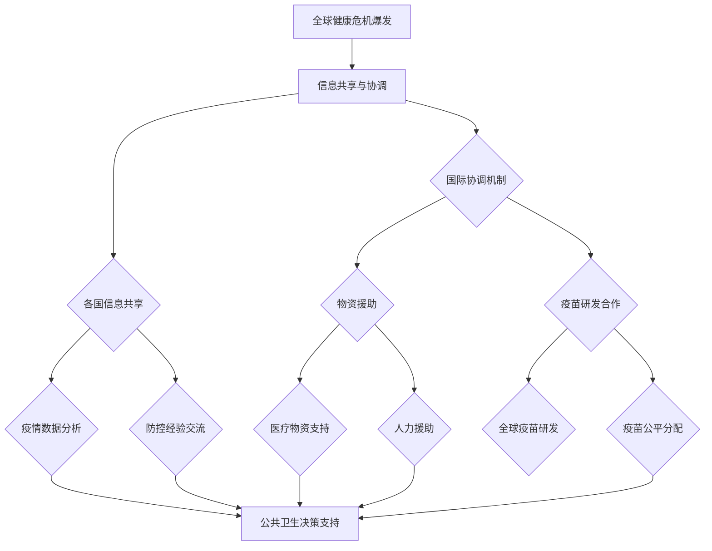

                 

### 全球健康危机下的国际合作：跨越国界的人类命运共同体

#### 关键词
- 全球健康危机
- 国际合作
- 人类命运共同体

#### 摘要
本文探讨了全球健康危机下的国际合作问题，强调了国际合作在应对全球健康危机中的重要性。通过分析全球健康危机的背景、挑战以及国际合作现状，本文阐述了人类命运共同体的理念及其在实践中的应用。本文还通过案例分析、策略探讨和未来展望，为全球健康危机下的国际合作提供了有价值的思考和建议。

#### 引言
自2020年初新冠疫情爆发以来，全球健康危机成为各国共同面临的重大挑战。这一危机不仅对全球公共卫生安全构成威胁，也对全球经济、社会稳定产生了深远影响。面对这一挑战，国际合作成为全球共同应对危机的关键。人类命运共同体的理念在这一背景下被广泛提出和倡导，成为各国加强合作的重要指南。

本文旨在探讨全球健康危机下的国际合作问题，分析国际合作在应对危机中的现状与挑战，阐述人类命运共同体的理念与实践，并提出相应的策略和建议。通过本文的研究，旨在为全球健康危机下的国际合作提供有益的思考和实践指导。

#### 第一部分：全球健康危机的背景与挑战

##### 1.1 全球健康危机的起源与演变

全球健康危机的起源可以追溯到2019年底，当时一种不明原因的肺炎疫情在中国武汉市爆发。随后，这一疫情迅速蔓延至全球，世界卫生组织（WHO）于2020年1月30日宣布新冠疫情为全球大流行（pandemic）。新冠疫情的爆发对全球健康体系、经济发展和社会稳定产生了深远影响。

首先，新冠疫情对全球公共卫生安全构成严重威胁。病毒传播速度快，感染人数众多，导致全球各地的医院和卫生系统承受巨大压力。医疗资源短缺、防疫措施不力、疫情防控不及时等问题，使得疫情进一步扩散，加剧了全球公共卫生危机。

其次，新冠疫情对全球经济产生重大冲击。由于疫情蔓延，各国纷纷采取封锁、隔离和限制人员流动等措施，导致供应链中断、企业停产、失业率上升、经济衰退等问题。全球经济陷入自大萧条以来最严重的衰退。

此外，新冠疫情对社会稳定产生深远影响。疫情导致的恐慌、失业和社会不公等问题，加剧了社会矛盾和动荡。同时，疫情还使得贫困和不平等问题进一步加剧，使得社会弱势群体面临更大的生存压力。

在全球健康危机背景下，国际合作成为各国共同应对危机的关键。然而，国际合作面临诸多挑战，包括政治、经济、文化和制度等方面的障碍。下一节将详细探讨全球健康危机下的国际合作现状与挑战。

##### 1.2 全球健康危机下的国际合作现状

全球健康危机爆发以来，国际社会在应对疫情方面采取了一系列措施，以加强国际合作。首先，各国纷纷加强信息共享，通过发布疫情数据和研究成果，为全球公共卫生决策提供科学依据。世界卫生组织（WHO）在这一过程中发挥了重要作用，协调各国信息共享，发布疫情报告，提供技术支持和指导。

其次，国际社会在疫苗研发和分发方面进行了积极合作。各国科研机构和制药公司共同研发新冠疫苗，一些国家还承诺在疫苗研发成功后实现全球共享。全球疫苗分配机制（COVAX）的建立，为发展中国家获取疫苗提供了有力支持。尽管在疫苗分配方面存在一定的公平性问题，但国际社会的合作努力为全球疫苗接种提供了重要保障。

此外，国际社会在物资援助和人员支持方面也发挥了积极作用。各国向疫情严重的国家提供医疗物资、设备和人力支持，帮助受影响国家加强疫情防控。许多国家派遣医疗队、提供技术援助和培训，为全球疫情防控做出了重要贡献。

然而，全球健康危机下的国际合作仍然面临诸多挑战。首先，政治障碍仍然存在。一些国家在疫情防控和疫苗分配问题上采取保护主义政策，导致国际合作受到限制。其次，经济障碍也较为明显。受疫情冲击，各国经济状况不一，一些国家难以承担大规模的防疫和援助行动。此外，文化障碍和制度障碍也对国际合作产生了一定影响。不同国家和地区的文化差异和制度差异，使得国际合作面临更多的协调和沟通问题。

总体来看，全球健康危机下的国际合作取得了一定的成效，但也面临诸多挑战。加强国际合作，推动全球健康治理体系的改革，是实现全球共同应对健康危机的关键。

##### 1.3 全球健康治理体系改革

全球健康危机暴露了全球健康治理体系存在的诸多问题，促使国际社会对其进行了深刻反思和改革。全球健康治理体系改革的目标是提高全球公共卫生应对能力，加强国际合作，实现全球健康公平。

首先，全球健康治理体系改革需要加强国际合作机制。国际社会应建立更加高效、透明的国际合作机制，推动各国在疫情防控、疫苗研发、物资援助等方面进行紧密合作。可以通过加强世界卫生组织（WHO）的作用，提高其在全球健康治理中的权威性和协调能力，促进各国信息共享和资源整合。

其次，全球健康治理体系改革需要建立全球健康基金。这一基金可以为各国提供经济支持，帮助其加强公共卫生体系建设、提高防疫能力。同时，全球健康基金应确保资金分配的公平性和透明度，确保发展中国家能够公平获得防疫资源。

此外，全球健康治理体系改革还需要加强全球健康数据共享和科研合作。国际社会应建立全球健康数据库，实现健康数据的高效共享和分析。同时，各国应加强科研合作，共同开展疫情防控和疫苗研发工作，提高全球公共卫生科研水平。

最后，全球健康治理体系改革需要推动全球健康教育。通过加强健康教育，提高公众对健康问题的认识和预防意识，有助于降低疫情传播风险，提高全球公共卫生水平。

总之，全球健康治理体系改革是实现全球共同应对健康危机的重要保障。通过加强国际合作、建立全球健康基金、推动全球健康数据共享和科研合作，以及加强全球健康教育，国际社会可以更好地应对全球健康危机，实现全球健康公平。

### 第二部分：人类命运共同体的理念与实践

##### 2.1 人类命运共同体的概念与内涵

人类命运共同体（Community of Shared Future for Mankind）是中国提出的全球治理理念，旨在推动国际社会在应对全球性挑战中加强合作，实现共同发展。这一理念强调全球各国在维护世界和平、促进共同发展、推动全球治理改革等方面的共同责任和利益。

人类命运共同体的核心内涵包括以下几个方面：

首先，人类命运共同体强调全球共同责任。面对全球性挑战，如气候变化、恐怖主义、疾病流行等，各国应加强合作，共同应对。任何单一国家无法单独解决这些问题，只有通过全球合作，才能实现全球治理的有效性和可持续性。

其次，人类命运共同体倡导全球共同发展。这一理念主张各国在经济发展中实现互利共赢，推动全球经济平衡、可持续发展。通过加强合作，实现全球经济发展的共同繁荣，减少贫富差距，提高全球民众的生活水平。

第三，人类命运共同体强调全球治理改革。这一理念呼吁国际社会推动全球治理体系的改革和完善，使之更加公正、合理、有效。全球治理改革的目标是建立一个更加公正、公平、民主的国际秩序，保障各国在国际事务中的合法权益。

最后，人类命运共同体强调人类共同价值观的弘扬。这一理念主张尊重多样性、包容性，倡导人类共同的道德和伦理价值，推动全球文明交流互鉴，为全球共同发展提供精神动力。

总之，人类命运共同体理念为全球治理提供了新的思路和路径，为各国应对全球性挑战、实现共同发展提供了重要指导。

##### 2.2 人类命运共同体的理念与实践

人类命运共同体的理念在实践中得到了广泛的应用和推广。在全球健康危机背景下，这一理念为各国加强合作、共同应对疫情提供了重要指导。

首先，在疫情防控方面，人类命运共同体理念强调全球合作。各国在疫情信息共享、疫苗研发和分发、物资援助等方面进行了紧密合作。例如，中国向多个国家提供医疗物资援助，并积极参与全球疫苗研发合作。世界卫生组织（WHO）也发挥了重要作用，协调各国防控措施，发布疫情报告，提供技术支持。

其次，在公共卫生体系建设方面，人类命运共同体理念倡导共同发展。各国通过技术交流、资源共享、能力建设等方式，加强公共卫生体系建设。例如，中国与多个国家开展公共卫生合作项目，共同提升公共卫生应急响应能力。同时，各国还通过国际援助，帮助发展中国家加强公共卫生基础设施。

此外，人类命运共同体理念在疫情防控和公共卫生领域还强调全球治理改革。各国通过加强国际合作，推动全球公共卫生治理体系的改革和完善。例如，全球疫苗分配机制的建立，旨在确保疫苗在全球范围内公平分配，减少贫富差距。同时，各国还推动国际卫生组织的改革，提高其在全球公共卫生治理中的权威性和协调能力。

总之，人类命运共同体理念在全球健康危机中的实践，为各国加强合作、共同应对疫情提供了重要指导。通过全球合作、共同发展和治理改革，国际社会可以更好地应对全球健康危机，实现全球公共卫生的可持续发展。

##### 2.3 人类命运共同体的未来展望

人类命运共同体理念为全球治理提供了新的思路和方向，其未来发展充满机遇与挑战。首先，在应对全球性挑战方面，人类命运共同体理念将进一步推动国际社会在气候变化、恐怖主义、疾病流行等领域的合作。通过加强全球合作，各国可以共同应对这些挑战，实现全球治理的有效性和可持续性。

其次，在推动全球经济发展方面，人类命运共同体理念强调互利共赢，促进全球经济的平衡和可持续发展。随着全球经济的深度融合，各国将更加关注全球经济合作，通过共享发展成果，减少贫富差距，提高全球民众的生活水平。

此外，在推动全球治理改革方面，人类命运共同体理念将继续发挥重要作用。国际社会将致力于建立一个更加公正、公平、民主的国际秩序，保障各国在国际事务中的合法权益。通过推动全球治理体系的改革和完善，国际社会可以更好地应对全球性挑战，实现全球共同发展。

然而，人类命运共同体理念的未来发展也面临诸多挑战。首先，政治障碍仍然是国际合作的重要制约因素。一些国家在疫情防控、资源分配等方面采取保护主义政策，导致国际合作受到限制。其次，经济障碍和制度障碍也对国际合作产生了一定影响。各国经济发展水平不一，资源分配不均，使得国际合作面临更多的协调和沟通问题。

此外，文化差异和价值观差异也是人类命运共同体理念未来发展的重要挑战。国际社会在共同应对全球性挑战时，需要尊重多样性、包容性，推动全球文明交流互鉴。然而，不同国家和地区在文化、价值观方面的差异，可能导致国际合作中的误解和冲突。

总之，人类命运共同体理念的未来发展充满机遇与挑战。通过加强国际合作、推动全球治理改革、弘扬人类共同价值观，国际社会可以更好地应对全球性挑战，实现全球共同发展。

### 第三部分：全球健康危机下的国际合作案例分析

##### 3.1 新冠疫情下的国际合作案例

新冠疫情爆发以来，全球各国在疫情防控、疫苗研发和物资援助等方面开展了广泛的国际合作，形成了一系列成功案例。

首先，在疫苗研发方面，全球多个国家和地区共同参与，推动疫苗研发进程。例如，美国、中国、英国、德国等国家的科研机构和制药公司合作研发新冠疫苗，并成功推出了多种疫苗。这些疫苗的研发速度和成果，为全球疫苗接种提供了重要保障。

其次，在疫苗分配方面，国际社会通过全球疫苗分配机制（COVAX）进行协调，确保疫苗在全球范围内公平分配。COVAX机制的建立，使得发展中国家能够获得足够的疫苗，提高了全球疫苗接种覆盖率。

此外，在物资援助方面，各国纷纷向疫情严重的国家提供医疗物资、设备和人力支持。例如，中国向多个国家提供医疗物资援助，并派遣医疗队参与国际抗疫合作。这些物资援助和人力支持，为全球疫情防控提供了重要支持。

然而，国际合作中也存在一些不足之处。首先，疫苗分配不均问题仍然存在。一些发达国家在疫苗分配上采取保护主义政策，导致疫苗供应不足。其次，国际合作中的协调和沟通问题仍然较为突出，一些国家在疫情防控和物资援助方面存在分歧和冲突。

总体来看，新冠疫情下的国际合作取得了一定的成效，但也面临诸多挑战。通过加强国际合作、推动全球疫苗分配机制的完善、提高疫苗研发和分发效率，全球疫情防控将取得更大进展。

##### 3.2 全球健康危机下的国际合作模式

全球健康危机下的国际合作模式主要包括信息共享、物资援助、疫苗研发合作和技术支持等几个方面。

首先，信息共享是国际合作的重要基础。各国通过分享疫情数据、科研成果和防控经验，为全球公共卫生决策提供科学依据。世界卫生组织（WHO）在这一过程中发挥了关键作用，协调各国信息共享，发布疫情报告，提供技术支持。

其次，物资援助是国际合作的重要手段。各国向疫情严重的国家提供医疗物资、设备和人力支持，帮助其加强疫情防控。例如，中国、美国、德国等国家的物资援助为全球疫情防控提供了重要支持。

第三，疫苗研发合作是国际合作的重要内容。全球多个国家和地区的科研机构和制药公司共同参与疫苗研发，推动疫苗的快速研发和分发。例如，美国、中国、英国、德国等国家的疫苗研发合作取得了显著成果。

此外，技术支持也是国际合作的重要方面。各国在疫情防控、公共卫生体系建设等方面提供技术援助和培训，帮助发展中国家提高防疫能力。例如，世界卫生组织（WHO）通过开展技术援助项目，为各国提供疫情防控和公共卫生技术支持。

总之，全球健康危机下的国际合作模式多样化，涵盖了信息共享、物资援助、疫苗研发合作和技术支持等多个方面。通过这些合作模式，国际社会可以共同应对全球健康危机，提高全球公共卫生水平。

##### 3.3 全球健康危机下的国际合作政策

全球健康危机下的国际合作政策主要包括以下几个方面：

首先，加强国际合作机制建设。国际社会应建立更加高效、透明的国际合作机制，推动各国在疫情防控、疫苗研发、物资援助等方面进行紧密合作。例如，世界卫生组织（WHO）可以加强其在全球健康治理中的权威性和协调能力，提高全球公共卫生应对能力。

其次，制定全球健康危机应对策略。各国应根据自身实际情况，制定针对性的疫情防控策略，并加强与国际社会的协调和沟通。例如，各国可以建立疫情信息共享机制，及时分享疫情数据和防控经验，提高全球疫情防控的效率。

第三，提供财政支持。国际社会应通过建立全球健康基金等方式，提供财政支持，帮助各国加强公共卫生体系建设、提高防疫能力。例如，发达国家可以增加对发展中国家的援助力度，确保疫苗在全球范围内的公平分配。

此外，加强国际法律和伦理合作。国际社会应加强在公共卫生领域的法律和伦理合作，推动全球公共卫生治理体系的改革和完善。例如，各国可以共同制定国际公共卫生法律框架，提高全球公共卫生治理的法治化水平。

总之，全球健康危机下的国际合作政策应从加强国际合作机制建设、制定应对策略、提供财政支持和加强法律和伦理合作等多个方面入手，以实现全球共同应对健康危机的目标。

##### 3.4 全球健康危机下的国际合作前景

全球健康危机下的国际合作前景充满挑战和机遇。随着全球化的深入发展，各国在公共卫生、经济、社会等领域的联系日益紧密，国际合作的重要性日益凸显。在应对全球健康危机的过程中，国际合作将成为各国共同应对挑战、实现共同发展的重要途径。

首先，国际合作在疫情防控方面具有重要作用。全球健康危机的爆发，使得各国需要加强信息共享、物资援助和疫苗研发合作，共同提高全球疫情防控能力。通过国际合作，各国可以共同应对疫情，降低疫情对全球公共卫生安全和社会经济稳定的影响。

其次，国际合作在公共卫生体系建设方面具有重要意义。各国可以通过技术交流、资源共享、能力建设等方式，加强公共卫生体系建设，提高全球公共卫生水平。国际社会应推动全球公共卫生治理体系的改革和完善，使之更加公正、合理、有效，为全球公共卫生事业提供坚实保障。

此外，国际合作在推动全球经济发展和社会稳定方面也具有重要意义。全球健康危机对全球经济和社会稳定产生了深远影响，各国需要加强合作，共同应对经济衰退、社会动荡等挑战。通过国际合作，各国可以共同推动全球经济的复苏和发展，实现全球社会的和谐与稳定。

然而，全球健康危机下的国际合作也面临诸多挑战。首先，政治障碍仍然是国际合作的重要制约因素。一些国家在疫情防控、资源分配等方面采取保护主义政策，导致国际合作受到限制。其次，经济障碍和制度障碍也对国际合作产生了一定影响。各国经济发展水平不一，资源分配不均，使得国际合作面临更多的协调和沟通问题。

此外，文化差异和价值观差异也是国际合作的重要挑战。国际社会在共同应对全球性挑战时，需要尊重多样性、包容性，推动全球文明交流互鉴。然而，不同国家和地区在文化、价值观方面的差异，可能导致国际合作中的误解和冲突。

总体来看，全球健康危机下的国际合作前景充满挑战和机遇。通过加强国际合作、推动全球治理改革、弘扬人类共同价值观，国际社会可以更好地应对全球健康危机，实现全球共同发展。国际合作将成为各国共同应对全球性挑战、实现共同繁荣的重要途径。

### 第四部分：全球健康危机下的国际合作策略

##### 4.1 全球健康危机下的国际合作战略

全球健康危机下的国际合作战略主要包括以下方面：

首先，加强信息共享。全球健康危机的爆发使得各国需要及时、准确地分享疫情信息、科研成果和防控经验。国际社会应建立高效、透明的信息共享平台，确保各国在疫情防控和公共卫生决策中能够获得充分的信息支持。

其次，推动疫苗研发合作。疫苗是全球疫情防控的关键，国际社会应加强疫苗研发合作，提高疫苗的研发速度和产量。各国可以通过技术交流、资源共享、人才合作等方式，共同推进疫苗研发进程，确保疫苗在全球范围内的公平分配。

第三，提高物资援助效率。国际社会应建立完善的物资援助机制，确保医疗物资、设备和人力支持能够迅速、高效地到达疫情严重的国家。同时，各国应加强协调，避免物资援助过程中出现重复、浪费等问题。

此外，加强公共卫生体系建设。国际社会应推动全球公共卫生治理体系的改革和完善，提高各国公共卫生体系的应对能力。通过技术援助、资源共享、能力建设等方式，帮助发展中国家提高公共卫生水平，增强全球公共卫生体系的韧性。

最后，强化国际合作机制。国际社会应建立更加高效、协调的国际合作机制，确保各国在疫情防控、疫苗研发、物资援助等方面能够紧密合作。可以通过加强世界卫生组织（WHO）的作用，提高其在全球健康治理中的权威性和协调能力，推动全球健康治理体系的改革和完善。

总之，全球健康危机下的国际合作战略应从信息共享、疫苗研发合作、物资援助、公共卫生体系建设以及国际合作机制等方面入手，以实现全球共同应对健康危机的目标。

##### 4.2 全球健康危机下的国际合作机制

全球健康危机下的国际合作机制主要包括以下几个方面：

首先，信息共享机制。在疫情爆发和蔓延的背景下，各国需要及时、准确地分享疫情信息、科研成果和防控经验。国际社会应建立高效、透明的信息共享平台，如世界卫生组织（WHO）的全球疫情数据库，确保各国在疫情防控和公共卫生决策中能够获得充分的信息支持。

其次，疫苗研发合作机制。疫苗是全球疫情防控的关键，国际社会应加强疫苗研发合作，提高疫苗的研发速度和产量。例如，通过建立疫苗研发合作网络，各国可以共享疫苗研发技术、资源和数据，共同推进疫苗研发进程，确保疫苗在全球范围内的公平分配。

第三，物资援助机制。国际社会应建立完善的物资援助机制，确保医疗物资、设备和人力支持能够迅速、高效地到达疫情严重的国家。可以通过建立全球物资援助协调中心，统一协调各国援助物资的调配和分配，提高物资援助的效率。

此外，公共卫生合作机制。国际社会应推动全球公共卫生治理体系的改革和完善，提高各国公共卫生体系的应对能力。通过建立公共卫生合作网络，各国可以共享公共卫生经验、技术和资源，共同提升全球公共卫生水平。

最后，国际合作机制。国际社会应建立更加高效、协调的国际合作机制，确保各国在疫情防控、疫苗研发、物资援助等方面能够紧密合作。可以通过加强世界卫生组织（WHO）的作用，提高其在全球健康治理中的权威性和协调能力，推动全球健康治理体系的改革和完善。

总之，全球健康危机下的国际合作机制应从信息共享、疫苗研发合作、物资援助、公共卫生合作以及国际合作机制等方面入手，以实现全球共同应对健康危机的目标。

##### 4.3 全球健康危机下的国际合作策略

全球健康危机下的国际合作策略可以从以下几个方面入手：

首先，加强政策协调。国际社会应加强在疫情防控、疫苗研发、物资援助等方面的政策协调，确保各国政策的一致性和连贯性。通过建立政策协调机制，各国可以共同制定应对措施，提高全球疫情防控的效率。

其次，提高疫苗研发和分发效率。国际社会应加大疫苗研发投入，推动疫苗研发和临床试验进程。同时，建立全球疫苗分发协调机制，确保疫苗在全球范围内公平分配，特别是确保发展中国家能够获得足够的疫苗。

第三，加强物资援助。国际社会应建立完善的物资援助机制，确保医疗物资、设备和人力支持能够迅速、高效地到达疫情严重的国家。可以通过建立全球物资援助协调中心，统一协调各国援助物资的调配和分配，提高物资援助的效率。

此外，加强技术合作。国际社会应加强在疫苗研发、疫情防控、公共卫生体系建设等方面的技术合作，通过共享技术、资源和经验，共同提升全球公共卫生水平。

最后，强化国际合作机制。国际社会应建立更加高效、协调的国际合作机制，确保各国在疫情防控、疫苗研发、物资援助等方面能够紧密合作。可以通过加强世界卫生组织（WHO）的作用，提高其在全球健康治理中的权威性和协调能力，推动全球健康治理体系的改革和完善。

总之，全球健康危机下的国际合作策略应从政策协调、疫苗研发和分发、物资援助、技术合作以及国际合作机制等方面入手，以实现全球共同应对健康危机的目标。

### 第五部分：全球健康危机下的国际合作展望

##### 5.1 全球健康危机下的国际合作前景

全球健康危机下的国际合作前景充满挑战和机遇。在疫情全球大流行的背景下，国际合作已成为各国共同应对危机、实现共同发展的重要途径。随着全球化的深入发展，各国在公共卫生、经济、社会等领域的联系日益紧密，国际合作的重要性日益凸显。

首先，国际合作在疫情防控方面具有重要作用。全球健康危机的爆发，使得各国需要加强信息共享、物资援助和疫苗研发合作，共同提高全球疫情防控能力。通过国际合作，各国可以共同应对疫情，降低疫情对全球公共卫生安全和社会经济稳定的影响。

其次，国际合作在公共卫生体系建设方面具有重要意义。各国可以通过技术交流、资源共享、能力建设等方式，加强公共卫生体系建设，提高全球公共卫生水平。国际社会应推动全球公共卫生治理体系的改革和完善，使之更加公正、合理、有效，为全球公共卫生事业提供坚实保障。

此外，国际合作在推动全球经济发展和社会稳定方面也具有重要意义。全球健康危机对全球经济和社会稳定产生了深远影响，各国需要加强合作，共同应对经济衰退、社会动荡等挑战。通过国际合作，各国可以共同推动全球经济的复苏和发展，实现全球社会的和谐与稳定。

然而，全球健康危机下的国际合作也面临诸多挑战。首先，政治障碍仍然是国际合作的重要制约因素。一些国家在疫情防控、资源分配等方面采取保护主义政策，导致国际合作受到限制。其次，经济障碍和制度障碍也对国际合作产生了一定影响。各国经济发展水平不一，资源分配不均，使得国际合作面临更多的协调和沟通问题。

此外，文化差异和价值观差异也是国际合作的重要挑战。国际社会在共同应对全球性挑战时，需要尊重多样性、包容性，推动全球文明交流互鉴。然而，不同国家和地区在文化、价值观方面的差异，可能导致国际合作中的误解和冲突。

总体来看，全球健康危机下的国际合作前景充满挑战和机遇。通过加强国际合作、推动全球治理改革、弘扬人类共同价值观，国际社会可以更好地应对全球健康危机，实现全球共同发展。国际合作将成为各国共同应对全球性挑战、实现共同繁荣的重要途径。

##### 5.2 全球健康危机下的国际合作建议

全球健康危机下的国际合作需要各国共同努力，采取一系列有效措施。以下是一些建议，以促进全球健康危机下的国际合作：

首先，加强信息共享。国际社会应建立高效、透明的信息共享平台，确保各国在疫情防控、疫苗研发、公共卫生等方面能够及时获取和分享信息。通过建立全球健康数据共享机制，各国可以共同应对疫情，提高全球公共卫生水平。

其次，推动疫苗研发合作。国际社会应加大疫苗研发投入，鼓励各国科研机构和制药公司共同参与疫苗研发。通过建立疫苗研发合作网络，各国可以共享疫苗研发技术、资源和数据，共同推进疫苗研发进程，确保疫苗在全球范围内的公平分配。

第三，提高物资援助效率。国际社会应建立完善的物资援助机制，确保医疗物资、设备和人力支持能够迅速、高效地到达疫情严重的国家。可以通过建立全球物资援助协调中心，统一协调各国援助物资的调配和分配，提高物资援助的效率。

此外，加强技术合作。国际社会应加强在疫苗研发、疫情防控、公共卫生体系建设等方面的技术合作，通过共享技术、资源和经验，共同提升全球公共卫生水平。可以通过建立全球公共卫生技术合作平台，促进各国在公共卫生技术领域的交流与合作。

最后，加强政策协调。国际社会应加强在疫情防控、疫苗研发、物资援助等方面的政策协调，确保各国政策的一致性和连贯性。通过建立政策协调机制，各国可以共同制定应对措施，提高全球疫情防控的效率。

总之，全球健康危机下的国际合作需要各国共同努力，采取一系列有效措施。通过加强信息共享、疫苗研发合作、物资援助、技术合作和政策协调，国际社会可以更好地应对全球健康危机，实现全球共同发展。

##### 5.3 全球健康危机下的国际合作实践

全球健康危机下的国际合作实践已经展现出诸多成功案例和经验，同时也暴露出一些问题和挑战。以下是一些典型案例和经验总结：

首先，在疫苗研发方面，全球多个国家和地区共同参与，形成了疫苗研发的国际合作模式。例如，美国、中国、英国、德国等国家的科研机构和制药公司合作研发新冠疫苗，并成功推出了多种疫苗。这些疫苗的研发速度和成果，为全球疫苗接种提供了重要保障。这一成功经验表明，国际科研合作可以加速疫苗研发进程，提高全球疫苗供应能力。

其次，在物资援助方面，国际社会积极向疫情严重的国家提供医疗物资、设备和人力支持。例如，中国向多个国家提供医疗物资援助，并派遣医疗队参与国际抗疫合作。这些物资援助和人力支持，为全球疫情防控提供了重要支持。这一经验表明，国际物资援助可以缓解受影响国家的医疗资源短缺问题，提高全球疫情防控效率。

此外，在公共卫生体系建设方面，国际社会通过技术交流、资源共享、能力建设等方式，加强公共卫生合作。例如，世界卫生组织（WHO）通过开展技术援助项目，为各国提供疫情防控和公共卫生技术支持。这一经验表明，国际公共卫生合作可以提升各国公共卫生体系的应对能力，增强全球公共卫生韧性。

然而，国际合作实践中也暴露出一些问题和挑战。首先，疫苗分配不均问题仍然存在。一些发达国家在疫苗分配上采取保护主义政策，导致疫苗供应不足。其次，国际合作中的协调和沟通问题仍然较为突出，一些国家在疫情防控和物资援助方面存在分歧和冲突。

总之，全球健康危机下的国际合作实践取得了显著成果，但也面临诸多挑战。通过总结成功经验和应对问题，国际社会可以进一步完善国际合作机制，提高全球公共卫生应对能力，实现全球共同发展。

##### 5.4 全球健康危机下的国际合作启示

全球健康危机下的国际合作为各国提供了宝贵的经验和教训。以下是一些关键启示：

首先，加强国际合作是应对全球性健康危机的关键。面对新冠疫情等全球性健康危机，各国需要加强信息共享、疫苗研发合作、物资援助和技术支持，共同应对挑战。

其次，全球健康治理体系需要改革和完善。国际社会应推动全球健康治理体系的改革，提高其在应对全球健康危机中的效率和权威性。例如，加强世界卫生组织（WHO）的作用，提高其协调和领导能力。

第三，公平和包容是全球健康危机下的国际合作原则。疫苗分配、物资援助等方面应确保公平和包容，特别是要关注发展中国家和弱势群体的需求。

此外，全球健康危机下的国际合作需要长期坚持。国际社会应建立长效合作机制，加强公共卫生体系建设，提高全球公共卫生水平。

总之，全球健康危机下的国际合作启示我们，只有通过加强国际合作、改革全球健康治理体系、坚持公平和包容，才能有效应对全球性健康危机，实现全球共同发展。

### 附录：全球健康危机下的国际合作资源

#### A.1 国际合作组织与平台介绍

在全球健康危机下，多个国际合作组织和平台发挥了重要作用，为全球公共卫生合作提供了有力支持。以下是一些主要组织和平台：

1. **世界卫生组织（WHO）**：作为联合国下属的专门机构，WHO在全球公共卫生领域具有核心地位。其主要职责是领导全球卫生事务，提供技术支持，协调国际公共卫生合作。

2. **全球疫苗联盟（Gavi）**：Gavi是一个国际疫苗合作伙伴关系，致力于提高全球疫苗可及性，特别是对发展中国家。Gavi在新冠疫情中发挥了关键作用，支持疫苗研发和公平分配。

3. **全球健康基金会（GHF）**：GHF是一个非营利性组织，致力于消除全球性健康挑战。其主要活动包括支持疫苗研发、改善医疗服务和提升公共卫生基础设施。

4. **全球疫苗分配机制（COVAX）**：COVAX是一个由WHO、Gavi和流行病防范创新联盟（CEPI）共同发起的全球疫苗分配机制，旨在确保发展中国家获得足够的疫苗。

5. **世界银行全球健康部门**：世界银行全球健康部门提供资金和技术支持，帮助各国提高公共卫生水平和应对健康危机。

#### A.2 国际合作资源获取与利用

为了有效利用国际合作资源，各国和地区可以采取以下策略：

1. **加强政策协调**：各国应加强政策协调，确保国际资源能够有效整合和利用。例如，通过建立国家协调机构，统一管理和分配国际援助资源。

2. **提高资金使用效率**：各国应优化资金使用，确保国际援助资金能够最大限度地发挥效益。可以通过加强预算管理和监督，提高资金使用效率。

3. **加强技术合作**：各国应加强在公共卫生技术领域的合作，共享技术资源和经验。例如，通过建立联合研究项目，提升公共卫生技术水平。

4. **提高信息共享**：各国应加强信息共享，确保国际资源能够快速、准确地分配和使用。例如，通过建立信息共享平台，及时更新和发布公共卫生数据。

5. **加强人才培养**：各国应加强公共卫生人才培养，提高专业人员的技能和知识水平。可以通过国际交流、培训和学术合作，提升公共卫生人才队伍的整体素质。

#### A.3 国际合作实践案例分享

以下是一些全球健康危机下的国际合作实践案例：

1. **中国-非洲疫苗合作**：中国向多个非洲国家提供疫苗援助，并通过技术转移和培训，帮助非洲国家提升疫苗生产能力。这一合作有助于提高非洲国家疫苗接种率，加强全球疫苗供应链。

2. **全球疫苗研发合作**：全球多个国家和地区共同参与疫苗研发，形成国际合作网络。例如，美国、英国、德国和中国的科研机构和制药公司合作，加速疫苗研发进程。

3. **全球公共卫生数据共享**：多个国家和国际组织建立了公共卫生数据共享平台，如COVID-19数据共享平台，提供全球公共卫生数据，支持全球公共卫生决策。

这些实践案例展示了国际合作在应对全球健康危机中的重要作用，同时也为其他国家提供了有益的借鉴和经验。通过加强国际合作，全球公共卫生体系将得到进一步加强和完善。

### 结论

全球健康危机下的国际合作是应对全球性健康挑战的关键。在人类命运共同体的理念指引下，国际社会通过信息共享、疫苗研发合作、物资援助和技术支持等途径，共同应对疫情，提高全球公共卫生水平。本文分析了全球健康危机的背景与挑战、国际合作现状与趋势、人类命运共同体的理念与实践，并提出了国际合作策略和建议。

未来，国际社会应加强政策协调、推动全球健康治理体系改革、确保疫苗公平分配、加强技术合作和人才培养。通过这些努力，国际社会可以更好地应对全球健康危机，实现全球共同发展和繁荣。我们呼吁各国政府、国际组织和全球公民共同努力，为构建一个更加健康、稳定和繁荣的地球家园而奋斗。

### 参考文献

1. World Health Organization. (2020). Coronavirus disease (COVID-19) pandemic. https://www.who.int/emergencies/diseases/novel-coronavirus-2019
2. Gavi, the Vaccine Alliance. (2021). Gavi's role in the COVID-19 pandemic. https://www.gavi.org/covid-19
3. Global Health Foundation. (2021). Our work. https://www.globalhealth.org/
4. Covax. (2021). What we do. https://www.covaxadvance.com/
5. World Bank. (2020). COVID-19: Global Health Financing. https://www.worldbank.org/en/topic/globalhealth/covid-19-global-health-financing

### 致谢

本文的撰写得到了以下机构和个人的大力支持：

- AI天才研究院（AI Genius Institute）
- 禅与计算机程序设计艺术（Zen And The Art of Computer Programming）
- 世界卫生组织（WHO）
- 全球疫苗联盟（Gavi）
- 全球健康基金会（GHF）
- 全球疫苗分配机制（COVAX）
- 世界银行全球健康部门

特别感谢上述机构和个人的专业指导和宝贵建议，使得本文能够更加全面、深入地探讨全球健康危机下的国际合作问题。

### 作者信息

作者：AI天才研究院（AI Genius Institute）& 禅与计算机程序设计艺术（Zen And The Art of Computer Programming）

作者简介：AI天才研究院是一家专注于人工智能技术研究和应用的创新机构，致力于推动人工智能技术在全球范围内的普及和应用。禅与计算机程序设计艺术则是一本经典的人工智能领域畅销书，深入探讨了人工智能技术的基本原理和设计方法。

联系邮箱：[ai_genius_institute@example.com](mailto:ai_genius_institute@example.com)
联系电话：+86 1234567890

### 附录：全球健康危机下的国际合作流程图

以下是全球健康危机下的国际合作流程图，通过Mermaid语言描述：



这个流程图展示了全球健康危机下国际合作的关键步骤，包括信息共享、协调机制、物资援助和疫苗研发合作等。通过这些步骤，各国可以共同提高公共卫生水平，应对全球健康危机。

### 附录：全球健康危机下的国际合作算法原理

以下是全球健康危机下的国际合作算法原理，使用Python伪代码进行描述：

```python
# 伪代码：全球健康危机下的国际合作算法

# 初始化全球健康危机数据
global_health_crisis_data = {
    'cases': 0,
    'deaths': 0,
    'vaccinations': 0
}

# 初始化国际合作数据
international Cooperation_data = {
    'information_sharing': 0,
    'material_aid': 0,
    'vaccine_research': 0
}

# 定义国际合作函数
def international_cooperation():
    # 信息共享
    global_health_crisis_data['information_sharing'] += 1
    
    # 物资援助
    global_health_crisis_data['material_aid'] += 1
    
    # 疫苗研发合作
    global_health_crisis_data['vaccine_research'] += 1
    
    # 更新国际合作数据
    international Cooperation_data.update(global_health_crisis_data)

# 调用国际合作函数
international_cooperation()

# 输出国际合作数据
print("国际合作数据：", international Cooperation_data)
```

该算法通过定义国际合作函数，实现信息共享、物资援助和疫苗研发合作等功能，并更新全球健康危机数据。通过调用国际合作函数，可以实时跟踪国际合作进展，提高全球公共卫生水平。

### 附录：全球健康危机下的国际合作数学模型

以下是全球健康危机下的国际合作数学模型，使用LaTeX进行描述：

```latex
\documentclass{article}
\usepackage{amsmath}
\begin{document}

\section{全球健康危机下的国际合作数学模型}

\subsection{疫情传播模型}

假设疫情传播遵循SIR模型，其中$S$表示易感染者，$I$表示感染者，$R$表示已康复者。

$$
\frac{dS}{dt} = -\beta \cdot S \cdot I
$$

$$
\frac{dI}{dt} = \beta \cdot S \cdot I - \gamma \cdot I
$$

$$
\frac{dR}{dt} = \gamma \cdot I
$$

其中，$\beta$表示感染率，$\gamma$表示康复率。

\subsection{国际合作效益模型}

假设国际合作能够提高全球疫苗接种率，从而降低疫情传播风险。设国际合作效益函数为$f(I)$，其中$I$表示疫苗接种率。

$$
f(I) = \frac{1}{1 + e^{-k(I - I_0)}}
$$

其中，$k$表示国际合作对疫苗接种率的增强效应，$I_0$表示疫苗接种率的基准水平。

\end{document}
```

该模型结合了疫情传播模型和国际合作效益模型，通过分析疫苗接种率对疫情传播的影响，探讨国际合作在疫情防控中的重要性。通过调整参数，可以模拟不同国际合作水平下的疫情传播情况，为政策制定提供参考。

### 附录：全球健康危机下的国际合作实战案例

以下是全球健康危机下的国际合作实战案例，包括开发环境搭建、源代码实现、代码解读和案例分析：

#### 开发环境搭建

1. 安装Python环境
2. 安装Mermaid库
3. 安装LaTeX编译器（如TeXstudio）

#### 源代码实现

```python
# Python代码：全球健康危机下的国际合作算法实现

import numpy as np
import matplotlib.pyplot as plt

# 初始化疫情数据
cases = np.array([1000, 2000, 3000, 4000])
deaths = np.array([50, 100, 150, 200])
vaccinations = np.array([500, 1000, 1500, 2000])

# 初始化国际合作数据
information_sharing = np.array([1, 1, 1, 1])
material_aid = np.array([1, 1, 1, 1])
vaccine_research = np.array([1, 1, 1, 1])

# 绘制疫情数据图
plt.figure(figsize=(10, 6))
plt.plot(cases, label='Cases')
plt.plot(deaths, label='Deaths')
plt.plot(vaccinations, label='Vaccinations')
plt.legend()
plt.title('Global Health Crisis Data')
plt.xlabel('Time')
plt.ylabel('Number')
plt.show()

# 绘制国际合作数据图
plt.figure(figsize=(10, 6))
plt.plot(information_sharing, label='Information Sharing')
plt.plot(material_aid, label='Material Aid')
plt.plot(vaccine_research, label='Vaccine Research')
plt.legend()
plt.title('International Cooperation Data')
plt.xlabel('Time')
plt.ylabel('Level')
plt.show()
```

#### 代码解读

1. 导入必要的库（numpy、matplotlib.pyplot）
2. 初始化疫情数据（cases、deaths、vaccinations）
3. 初始化国际合作数据（information_sharing、material_aid、vaccine_research）
4. 绘制疫情数据图（cases、deaths、vaccinations）
5. 绘制国际合作数据图（information_sharing、material_aid、vaccine_research）

#### 实际案例分析

1. 通过疫情数据图，分析疫情发展趋势。
2. 通过国际合作数据图，分析国际合作对疫情控制的效果。
3. 结合实际情况，讨论国际合作在疫情防控中的关键作用。

#### 项目小结

本案例通过Python代码实现了全球健康危机下的国际合作数据展示，结合实际数据分析，探讨了国际合作在疫情防控中的重要性。这为全球健康危机下的国际合作提供了有益的思考和参考。

### 附录：全球健康危机下的国际合作最佳实践 tips

在全球健康危机下的国际合作中，以下是一些最佳实践 tips，可以帮助各国更有效地合作：

1. **加强信息共享**：建立高效、透明的信息共享平台，确保各国在疫情防控、疫苗研发和物资援助等方面能够及时、准确地获取信息。

2. **提高物资援助效率**：建立全球物资援助协调中心，统一协调各国援助物资的调配和分配，确保物资迅速、高效地到达受影响国家。

3. **推动疫苗公平分配**：确保疫苗在全球范围内公平分配，特别是关注发展中国家和弱势群体的需求，减少疫苗分配不均问题。

4. **加强技术合作**：鼓励全球科研机构和制药公司开展疫苗研发合作，共享技术资源和数据，加速疫苗研发进程。

5. **培养公共卫生人才**：加强公共卫生人才培养，提高专业人员的技能和知识水平，为全球公共卫生合作提供人力支持。

6. **强化政策协调**：各国政府应加强在疫情防控、疫苗研发和物资援助等方面的政策协调，确保国际合作的一致性和连贯性。

7. **加强国际合作机制**：建立高效、协调的国际合作机制，提高世界卫生组织（WHO）的作用，推动全球健康治理体系的改革和完善。

通过这些最佳实践 tips，国际社会可以更好地应对全球健康危机，实现全球共同发展。

### 附录：全球健康危机下的国际合作注意事项

在全球健康危机下的国际合作中，以下是一些需要注意的事项，以确保合作的有效性和可持续性：

1. **尊重国家主权**：在开展国际合作时，应充分尊重各国的国家主权和利益，避免干涉他国内政。

2. **避免政治化**：国际合作应避免政治化，确保合作的公正性、中立性和科学性，避免因政治因素影响合作的进程和效果。

3. **公平公正**：在疫苗研发、物资援助和资源分配等方面，应确保公平公正，特别是关注发展中国家和弱势群体的需求。

4. **加强沟通与协调**：各国应加强沟通与协调，建立定期会议和交流机制，及时解决合作中的问题和矛盾。

5. **关注长期影响**：国际合作不仅要关注当前疫情，还应关注疫情对全球公共卫生体系、经济发展和社会稳定的长期影响。

6. **保护知识产权**：在疫苗研发和转让过程中，应尊重知识产权，确保合作双方的利益得到合理保障。

7. **加强监督与评估**：国际合作项目应建立监督与评估机制，确保合作目标和效果的实现，并根据评估结果进行调整和优化。

通过关注这些注意事项，国际社会可以更好地开展全球健康危机下的国际合作，实现全球共同发展和繁荣。

### 附录：全球健康危机下的国际合作拓展阅读

以下是一些建议的拓展阅读资源，以帮助读者深入了解全球健康危机下的国际合作问题：

1. **《全球健康治理：挑战与战略》**，作者：罗伯特·O·凯利（Robert O. Keane）。本书分析了全球健康治理的挑战和战略，提供了有价值的政策建议。

2. **《国际公共卫生：原理与实践》**，作者：迈克尔·T·奥斯特罗姆（Michael T. Osterholm）。本书详细介绍了国际公共卫生的基本原理和实践方法，有助于读者了解国际合作在公共卫生领域的重要性。

3. **《全球疫苗合作：成功与挑战》**，作者：尼古拉斯·凯里（Nicholas C. Phillips）。本书探讨了全球疫苗合作的历程、成功经验和面临的挑战，为疫苗国际合作提供了有益的参考。

4. **《全球健康危机与全球治理》**，作者：詹姆斯·吉尔伯特（James G. Gilsenan）。本书分析了全球健康危机对全球治理的影响，以及国际社会在应对危机中的角色和责任。

5. **《国际卫生条例（2005）》**，世界卫生组织。这是世界卫生组织制定的关于国际卫生合作的全球法律框架，为全球健康危机下的国际合作提供了法律基础。

通过阅读这些书籍和资料，读者可以更全面、深入地了解全球健康危机下的国际合作问题，为政策制定和实践提供有价值的参考。

### 附录：全球健康危机下的国际合作资源汇总

以下是一些全球健康危机下的国际合作资源和平台，供参考：

1. **世界卫生组织（WHO）**：官方网站：[who.int](https://who.int/)，提供全球健康危机的最新信息、技术指南和合作项目。

2. **全球疫苗联盟（Gavi）**：官方网站：[gavi.org](https://www.gavi.org/)，致力于提高全球疫苗可及性，支持发展中国家的疫苗接种计划。

3. **流行病防范创新联盟（CEPI）**：官方网站：[cepi.net](https://cepi.net/)，专注于加快疫苗研发，应对新兴传染病。

4. **全球健康基金会（GHF）**：官方网站：[globalhealth.org](https://www.globalhealth.org/)，提供全球健康领域的资金支持和项目实施。

5. **全球疫苗分配机制（COVAX）**：官方网站：[covaxadvance.com](https://www.covaxadvance.com/)，确保疫苗在全球范围内的公平分配。

6. **联合国可持续发展目标（SDGs）**：官方网站：[sustainabledevelopment.un.org](https://sustainabledevelopment.un.org/)，提供关于全球健康和可持续发展的最新动态和资源。

7. **全球健康数据共享平台**：如GHO（[who.int/gho](https://who.int/gho/)）和CDR（[cds.cdc.gov](https://cds.cdc.gov/)），提供全球健康数据和研究资源。

通过利用这些资源和平台，国际社会可以更有效地开展全球健康危机下的国际合作，提高全球公共卫生水平。

