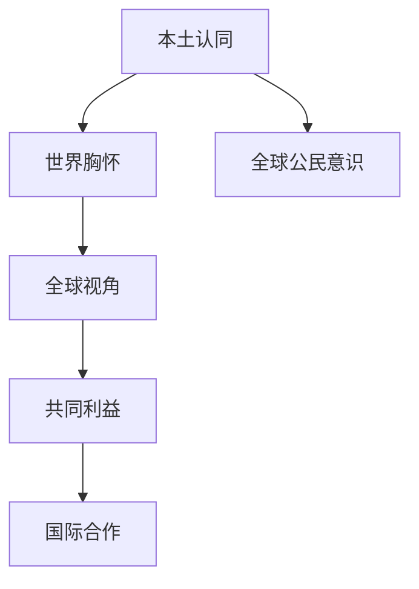

                 

### 文章标题

# 全球公民意识的培养：本土认同与世界胸怀的结合

### 文章关键词

- 全球公民意识
- 本土认同
- 世界胸怀
- 文化交流
- 社会责任
- 国际合作

### 文章摘要

本文从全球公民意识的基本概念出发，探讨了本土认同与世界胸怀的关系，并详细阐述了培养全球公民意识的方法和实践。通过分析全球化背景下的文化交流、全球公民意识与社会责任以及国际合作的重要性，本文提出了培养全球公民意识的策略与建议。同时，通过典型人物分析和实际案例剖析，本文展示了全球公民意识对社会的影响及其未来方向，旨在为读者提供全面、深刻的理解和启示。

### 目录

1. **全球公民意识的基本概念**  
   - 1.1 全球公民意识的定义  
   - 1.2 全球公民意识的历史发展  
   - 1.3 全球公民意识的重要性

2. **本土认同与世界胸怀的关系**  
   - 2.1 本土认同的含义与价值  
   - 2.2 世界胸怀的内涵与表现  
   - 2.3 本土认同与世界胸怀的结合

3. **全球公民意识的培养方法**  
   - 3.1 教育在培养全球公民意识中的作用  
   - 3.2 媒体在塑造全球公民意识中的影响  
   - 3.3 个人在培养全球公民意识中的努力

4. **全球化背景下的文化交流**  
   - 4.1 文化交流的重要性  
   - 4.2 文化交流的障碍与解决  
   - 4.3 文化交流的实际案例

5. **全球公民意识与社会责任**  
   - 5.1 全球公民意识与社会责任的关系  
   - 5.2 全球公民意识与社会责任的具体实践  
   - 5.3 全球公民意识与社会责任的成功案例

6. **全球化时代的国际合作**  
   - 6.1 国际合作的重要性  
   - 6.2 国际合作的机制与方式  
   - 6.3 国际合作的成功经验与挑战

7. **全球公民意识的未来展望**  
   - 7.1 全球公民意识的未来发展趋势  
   - 7.2 全球公民意识面临的挑战与机遇  
   - 7.3 培养全球公民意识的策略与建议

8. **全球公民意识的典型人物**  
   - 8.1 全球公民意识的典型人物介绍  
   - 8.2 这些人物的全球公民意识实践  
   - 8.3 这些人物对全球公民意识的启示

9. **全球公民意识的社会影响**  
   - 9.1 全球公民意识对社会的影响  
   - 9.2 全球公民意识对社会发展的意义  
   - 9.3 全球公民意识对社会问题的解决作用

10. **全球公民意识的未来方向**  
    - 10.1 全球公民意识的未来方向  
    - 10.2 全球公民意识的教育与培养  
    - 10.3 全球公民意识的社会实践与推广

### 引言

在全球化的浪潮中，全球公民意识的培养显得尤为重要。全球化不仅带来了经济、科技和文化的交流，也带来了许多挑战，如文化冲突、环境问题和社会不公。在这样的背景下，如何培养全球公民意识，实现本土认同与世界胸怀的结合，成为我们亟待解决的问题。

全球公民意识是指个体对全球问题和全球利益的关注，以及在全球范围内寻求共同解决问题的意识和行动。它不仅涉及对本土文化的认同，更强调对世界胸怀的包容和尊重。培养全球公民意识，有助于我们更好地应对全球化带来的挑战，促进国际社会的和平与发展。

本文旨在深入探讨全球公民意识的基本概念，分析本土认同与世界胸怀的关系，并提出培养全球公民意识的方法和实践。通过全球化背景下的文化交流、社会责任和国际合作等方面的具体实践，我们希望能够为读者提供有价值的思考和建议，共同推动全球公民意识的培养。

### 第1章：全球公民意识的定义

#### 1.1 全球公民意识的定义

全球公民意识，简而言之，是一种超越国家界限，关注全球性问题和全球性利益的意识和行动。它强调个体对全球社会、环境和人类福祉的关注，追求全球范围内的公平、正义和可持续发展。与传统的国家公民意识不同，全球公民意识不仅仅局限于对某一国家的忠诚和认同，而是扩展到对整个人类社会和地球家园的责任。

全球公民意识的核心在于“全球视角”和“共同利益”。它要求个体不仅关注本国的利益，更要关注全球性的议题，如气候变化、贫困问题、全球卫生、人权问题等。这种意识促使个体在日常生活中采取更加全球化的行动，积极参与国际交流与合作，为解决全球性问题贡献自己的力量。

#### 1.2 全球公民意识的历史发展

全球公民意识并非一蹴而就，而是随着全球化进程的推进而逐渐形成和发展的。其历史发展可以分为以下几个阶段：

1. **启蒙时代与民族国家兴起**：18世纪启蒙运动时期，思想家们开始倡导理性、自由和平等，推动了民族国家的兴起。这一时期，国家公民意识逐渐形成，但全球公民意识尚处于萌芽阶段。

2. **第一次世界大战与反战思潮**：20世纪初，第一次世界大战的爆发引发了广泛的反战思潮，人们开始意识到国家之间的冲突和战争对全球社会和人类的危害。这一时期，全球公民意识的萌芽开始显现。

3. **冷战时期与和平运动**：冷战时期，全球公民意识进一步发展，和平运动、反核运动等在全球范围内兴起。人们开始呼吁国际社会共同应对全球性问题，如核武器扩散、贫困和疾病等。

4. **全球化时代的兴起**：随着冷战的结束和全球化的加速，全球公民意识进入一个新的阶段。跨国公司、互联网和国际组织的发展，使得全球公民意识成为可能。人们越来越关注全球性问题，积极参与国际事务，推动全球社会的进步。

#### 1.3 全球公民意识的重要性

全球公民意识的重要性体现在以下几个方面：

1. **应对全球性挑战**：全球性问题如气候变化、环境污染、贫困和疾病等，需要全球范围内的合作和共同努力。全球公民意识能够促使个体积极参与全球性事务，为解决这些挑战提供智慧和力量。

2. **促进国际和平与理解**：全球公民意识有助于打破国家间的隔阂和误解，增进不同文化之间的理解和尊重。通过交流和合作，全球公民能够促进国际和平与稳定。

3. **推动可持续发展**：全球公民意识强调可持续发展，追求经济、社会和环境的平衡。这种意识能够促使个体和集体采取更加可持续的行动，为未来的发展奠定基础。

4. **提升个人素养**：全球公民意识培养个体的全球视野和跨文化能力，提升个人素养和竞争力。在全球化的今天，具备全球公民意识的人更容易适应和融入国际社会。

总之，全球公民意识是全球化时代的产物，它不仅是一种新的公民意识，更是一种新的社会责任和道德要求。在全球化的背景下，培养全球公民意识对于推动全球社会的进步和人类的发展具有重要意义。

#### 1.4 全球公民意识的核心概念与联系

为了更好地理解全球公民意识，我们需要从核心概念出发，分析这些概念之间的关系和结构。以下是全球公民意识的一些核心概念及其相互关系：

1. **本土认同**：本土认同是指个体对所在国家和地区的文化、价值观和社会制度的认同。它是全球公民意识的基础，因为只有深刻理解本土文化，个体才能在全球范围内进行有效的文化交流和合作。

2. **世界胸怀**：世界胸怀是指个体对全球性问题和人类福祉的关注，以及对不同文化和民族的包容和尊重。它强调个体在全球范围内的责任和贡献，是全球化时代的必然要求。

3. **全球视角**：全球视角是指个体从全球的角度看待和处理问题的能力。它要求个体超越国家界限，关注全球性议题，如气候变化、贫困和人权问题等。

4. **共同利益**：共同利益是指全球范围内的共同目标和利益，如可持续发展、和平与稳定等。全球公民意识强调共同利益的重要性，倡导个体在全球范围内寻求共同解决问题的方法和途径。

5. **国际合作**：国际合作是指全球范围内的国家、组织和个人在共同利益基础上的合作。它是实现全球公民意识的关键，因为只有通过合作，全球公民才能有效地应对全球性问题。

这些核心概念之间的关系可以用以下 Mermaid 流程图来表示：

- **本土认同** 和 **世界胸怀** 是全球公民意识的基础，它们共同构成了个体的文化背景和全球视野。
- **全球视角** 和 **共同利益** 是全球公民意识的核心，它们体现了个体对全球性问题的关注和责任感。
- **国际合作** 是实现全球公民意识的手段，通过国际合作，个体能够为全球社会做出贡献。

这种关系结构有助于我们更清晰地理解全球公民意识的概念和内涵，从而更好地培养和践行全球公民意识。

#### 1.5 全球公民意识的培养方法

培养全球公民意识是一个长期而复杂的过程，需要从教育、媒体和个人层面进行全方位的努力。以下是一些具体的培养方法：

1. **教育**：教育是培养全球公民意识的关键途径。学校和社会应该注重全球性议题的教育，引导学生关注全球性问题，培养他们的全球视野。具体方法包括：
   - **全球性课程**：在课程设置中增加全球性议题，如气候变化、贫困问题、人权等。
   - **跨文化教育**：通过语言课程、文化交流活动和国际交换项目，增强学生对不同文化的理解和尊重。
   - **实践教育**：鼓励学生参与全球性社会实践，如志愿者服务、国际援助项目等。

2. **媒体**：媒体在塑造全球公民意识中起着重要作用。媒体应该承担起责任，提供全面、客观的全球性新闻报道，引导公众关注全球性问题。具体方法包括：
   - **多元化报道**：通过报道不同国家和地区的新闻，展示全球多样性。
   - **深度报道**：对全球性议题进行深入报道，揭示问题的本质和背后的原因。
   - **互动平台**：建立互动平台，鼓励公众参与讨论，促进全球性议题的讨论和传播。

3. **个人努力**：个人在培养全球公民意识中发挥着重要作用。以下是一些个人可以采取的措施：
   - **学习**：通过阅读、观看纪录片、参加讲座等方式，增加对全球性问题的了解。
   - **交流**：积极参与国际交流，与来自不同国家和文化背景的人进行交流，增进相互理解。
   - **行动**：参与志愿者服务、环保活动等，为全球社会做出实际贡献。

总之，培养全球公民意识需要多方面的努力，通过教育、媒体和个人层面的共同参与，我们可以逐步培养出具有全球视野和责任感的新一代公民。

#### 1.6 全球公民意识的重要性

全球公民意识在当代社会中具有重要意义，它不仅关乎个体的成长和发展，更关乎全球社会的和谐与进步。以下是全球公民意识的重要性的几个方面：

1. **促进全球合作**：全球公民意识强调全球范围内的合作和共同努力。在面对全球性问题时，如气候变化、贫困和疾病等，各国只有通过合作才能找到有效的解决方案。全球公民意识能够促进国际社会的合作，共同应对这些挑战。

2. **推动可持续发展**：全球公民意识强调可持续发展，追求经济、社会和环境的平衡。在全球化的今天，个体和集体都需要关注全球性议题，采取可持续的行动。全球公民意识能够引导人们关注长期利益，为未来世界的发展奠定基础。

3. **增强社会凝聚力**：全球公民意识有助于增强社会的凝聚力。通过培养全球公民意识，个体能够更好地理解和尊重不同文化，增进不同文化之间的理解和合作。这种理解与合作不仅有助于缓解文化冲突，也有助于构建一个更加和谐的社会。

4. **提升个人素养**：全球公民意识培养个体的全球视野和跨文化能力，提升个人素养和竞争力。在全球化的今天，具备全球公民意识的人更容易适应和融入国际社会，拥有更广阔的发展机会。

5. **促进全球和平**：全球公民意识强调和平与合作，有助于减少国际冲突和战争。通过培养全球公民意识，个体能够更好地理解国际关系，寻求和平解决问题的方法，为全球和平与稳定做出贡献。

总之，全球公民意识是全球化时代的产物，它不仅有助于全球社会的进步，也关乎每一个个体的成长和发展。在全球化的背景下，培养全球公民意识具有重要意义，值得我们共同努力和实践。

### 第2章：本土认同与世界胸怀的关系

#### 2.1 本土认同的含义与价值

本土认同是指个体对自身出生和成长的文化背景、历史传统和社会制度的认同。这种认同不仅仅是对某一国家或地区的忠诚，更是一种对本土文化、价值观和社会习俗的深刻理解和尊重。本土认同的价值体现在以下几个方面：

1. **文化传承**：本土认同有助于保护和传承本土文化。文化是一个国家或地区的灵魂，它承载着历史记忆和民族精神。通过本土认同，个体能够了解和传承本土的文化传统，确保文化在现代社会中的传承和发展。

2. **社会凝聚力**：本土认同能够增强社会的凝聚力。在一个多元化的社会中，本土认同是连接不同群体的重要纽带。通过共同的文化认同，人们能够建立起相互信任和合作的基础，促进社会和谐与稳定。

3. **身份认同**：本土认同有助于个体建立自我认同。个体在本土文化中找到归属感，能够更好地理解自己，明确自己的价值观和目标。这种身份认同能够增强个体的自信心和自尊心，促进个体的心理健康和成长。

4. **文化自信**：本土认同能够增强文化自信。文化自信是一个国家或民族在全球化背景下保持独立性和自主性的重要保障。通过本土认同，个体能够更加自信地面对外来文化的影响，保持本土文化的独特性和多样性。

#### 2.2 世界胸怀的内涵与表现

世界胸怀是指个体对全球性问题和人类福祉的关注，以及对不同文化和民族的包容和尊重。世界胸怀的内涵可以从以下几个方面来理解：

1. **全球视野**：世界胸怀强调个体从全球的角度看待和处理问题。它要求个体超越国家界限，关注全球性议题，如气候变化、贫困、人权问题等。全球视野有助于个体更好地理解全球性问题，积极参与全球性事务。

2. **包容与尊重**：世界胸怀强调对不同文化和民族的包容与尊重。在全球化的今天，个体需要学会理解和尊重不同的文化习俗和价值观。这种包容与尊重能够减少文化冲突，促进国际社会的和谐与稳定。

3. **共同责任**：世界胸怀强调全球范围内的共同责任。个体不仅关注本国的利益，更关注全球范围内的共同利益，如可持续发展、和平与稳定等。共同责任有助于个体在全球范围内寻求共同解决问题的方法和途径。

世界胸怀的表现可以从以下几个方面来观察：

1. **跨文化交流**：世界胸怀促使个体积极参与跨文化交流，与来自不同文化背景的人进行互动和合作。这种跨文化交流能够增进相互理解和尊重，促进不同文化之间的融合。

2. **国际援助**：世界胸怀促使个体参与国际援助活动，为全球范围内的贫困和疾病等提供帮助。这种国际援助体现了个体对全球性问题的关注和责任感。

3. **全球公民行动**：世界胸怀推动个体积极参与全球公民行动，为解决全球性问题贡献自己的力量。这些行动可以是环境保护、人权倡导、国际援助等，都是世界胸怀的具体体现。

#### 2.3 本土认同与世界胸怀的结合

本土认同与世界胸怀并不是相互排斥的，而是可以相互融合和促进的。结合本土认同与世界胸怀，有助于培养更全面的全球公民意识，实现个人和社会的全面发展。

1. **文化自信与全球视野**：本土认同有助于个体建立文化自信，世界胸怀则提供了全球视野。文化自信能够使个体在面对外来文化时保持独立性和自主性，而全球视野则使个体能够更好地理解和适应不同文化。二者结合，使个体能够在全球范围内发挥积极作用。

2. **本土价值与全球责任**：本土认同使个体关注本土的社会问题和文化传统，世界胸怀则使个体关注全球性议题和人类福祉。将本土价值与全球责任结合起来，个体能够在本土层面做出贡献，同时在全球范围内寻求共同解决问题的方法。

3. **文化交流与合作**：本土认同和世界胸怀的结合，促进了跨文化交流和国际合作。通过本土认同，个体能够更好地理解和尊重本土文化，而通过世界胸怀，个体能够积极参与全球性事务，为不同文化之间的交流与合作搭建桥梁。

4. **个体发展与全球进步**：本土认同和世界胸怀的结合，不仅有助于个体的全面发展，也有助于全球社会的进步。个体通过结合本土认同和世界胸怀，能够在全球范围内发挥积极作用，为全球社会的和谐与进步贡献力量。

总之，本土认同与世界胸怀的结合，是培养全球公民意识的重要途径。通过这种结合，个体能够在本土层面发挥积极作用，同时在全球范围内寻求共同解决问题的方法，实现个人和社会的全面发展。

#### 2.4 全球公民意识的培养实践

要培养全球公民意识，不仅需要理论上的理解，更需要具体的实践。以下是一些实际案例，展示了如何通过教育、媒体和个人努力来培养全球公民意识：

1. **教育实践**：

   - **国际学校**：许多国际学校注重全球性议题的教育，通过跨文化交流和合作项目，培养学生的全球视野。例如，国际学校可以组织学生参与国际会议、文化交流活动，让他们亲身体验不同文化的魅力。

   - **全球性课程**：在学校课程中增加全球性议题，如气候变化、人权问题、全球化经济等，让学生了解全球性问题的背景和影响。通过案例分析和讨论，激发学生对全球性问题的兴趣和责任感。

   - **志愿者服务**：鼓励学生参与国际志愿者服务项目，如环境保护、教育援助等。通过实际参与，学生能够更深刻地理解全球性问题，培养全球公民意识。

2. **媒体实践**：

   - **多元化报道**：媒体应承担起责任，提供全面、客观的全球性新闻报道。通过展示不同国家和地区的新闻，增进公众对全球性问题的了解和关注。

   - **深度报道**：对全球性议题进行深入报道，揭示问题的本质和背后的原因。例如，媒体可以报道气候变化的影响、贫困问题的根源等，引导公众思考和行动。

   - **互动平台**：建立互动平台，鼓励公众参与讨论，促进全球性议题的传播和交流。通过社交媒体、在线论坛等方式，公众可以分享观点、交流经验，共同推动全球公民意识的培养。

3. **个人努力**：

   - **学习**：个人可以通过阅读、观看纪录片、参加讲座等方式，增加对全球性问题的了解。例如，阅读关于气候变化、人权问题、全球化经济的书籍，观看相关的纪录片和讲座，了解全球性问题的背景和解决方案。

   - **交流**：积极参与国际交流，与来自不同国家和文化背景的人进行交流，增进相互理解和尊重。通过语言课程、文化交流活动和国际交换项目，个人可以扩展自己的视野，培养全球公民意识。

   - **行动**：参与志愿者服务、环保活动等，为全球社会做出实际贡献。例如，参与环保组织的工作，参与国际援助项目，帮助贫困地区的孩子接受教育等。通过实际行动，个人能够将全球公民意识转化为具体的行动和成果。

总之，培养全球公民意识需要教育、媒体和个人的共同努力。通过实际案例和实践，我们可以看到，全球公民意识的培养不仅需要理论上的理解，更需要具体的行动和实践。通过这些实践，个体能够更深刻地理解全球性问题的意义，培养全球公民意识，为全球社会的和谐与进步贡献力量。

### 第3章：全球公民意识的具体实践

在全球化的背景下，全球公民意识的具体实践已经成为促进国际交流、推动社会发展和实现全球和平的重要手段。以下将详细探讨文化交流、社会责任和国际合作这三个方面的具体实践。

#### 3.1 文化交流

文化交流是培养全球公民意识的重要途径之一，它通过不同文化之间的互动和融合，促进相互理解和尊重。以下是一些具体的实践方法：

1. **国际文化交流活动**：通过举办国际文化节、艺术展览、音乐节等活动，展示不同国家和地区的文化特色，增进公众对其他文化的了解和兴趣。例如，纽约的“时代广场新春庙会”就是一个成功的文化交流活动，它吸引了来自世界各地的游客，展示了中华文化的独特魅力。

2. **语言学习与教育交流**：鼓励学生和教师参与语言学习与教育交流项目，如交换生项目、语言夏令营等。通过实际的语言学习和文化交流，参与者能够更深入地了解其他文化，培养跨文化沟通能力。

3. **跨文化合作项目**：在教育和科研领域，推动跨文化合作项目，如联合研究、学术会议等。这些项目不仅促进了学术交流，也加深了不同文化之间的相互理解和合作。

#### 3.2 社会责任

全球公民意识强调个体对全球社会问题的关注和责任感，通过实际行动解决这些问题。以下是一些社会责任的具体实践方法：

1. **国际援助与慈善活动**：通过参与国际援助项目，如救援行动、捐赠物资、志愿者服务等形式，为全球范围内的贫困、疾病和环境问题提供帮助。例如，联合国儿童基金会的“一美元捐助行动”，鼓励全球公众为贫困地区的儿童提供帮助。

2. **环保活动**：积极参与环境保护活动，如植树造林、废物回收、低碳出行等。通过这些实际行动，减少对环境的破坏，促进可持续发展。

3. **社会公益活动**：组织或参与社会公益活动，如慈善义卖、社区服务、教育援助等。这些活动不仅有助于改善社会问题，也能增强个体的社会责任感和全球公民意识。

#### 3.3 国际合作

国际合作是实现全球公民意识的关键，通过国家、组织和个人之间的合作，共同解决全球性问题。以下是一些国际合作的具体实践方法：

1. **国际组织参与**：积极参与国际组织，如联合国、世界银行、红十字会等。这些组织在全球性事务中发挥着重要作用，通过参与这些组织的工作，个体能够为全球社会的进步贡献力量。

2. **跨国企业合作**：跨国企业通过合作项目，推动不同国家和地区之间的经济合作和贸易发展。例如，阿里巴巴的“全球速卖通”平台，通过互联网连接全球消费者和商家，促进了国际贸易和交流。

3. **学术合作研究**：在科研领域，推动跨国学术合作研究，如联合实验室、国际学术会议等。这些合作项目不仅促进了科学技术的进步，也加深了不同文化之间的理解和合作。

通过文化交流、社会责任和国际合作的具体实践，我们可以看到全球公民意识在实际生活中的重要性和影响力。这些实践不仅有助于解决全球性问题，也促进了国际社会的和谐与进步，为全球公民意识的培养提供了有力的支持。

### 第4章：全球化背景下的文化交流

#### 4.1 文化交流的重要性

在全球化背景下，文化交流已成为促进国际理解、增进合作和推动社会进步的重要手段。文化交流的重要性主要体现在以下几个方面：

1. **增进国际理解**：通过文化交流，不同国家和民族能够更好地了解彼此的历史、文化和社会习俗，减少误解和偏见，增进相互理解。这种理解有助于缓解国际紧张局势，促进和平与合作。

2. **促进文化多样性**：全球化带来了文化多样性的机遇，通过文化交流，各种文化能够相互借鉴、融合和创新，形成新的文化形态。这有助于丰富人类文化的内涵，推动文化创新和多元化发展。

3. **推动社会进步**：文化交流能够传播先进的思想和理念，激发社会变革和进步。例如，通过文化交流，民主、自由、平等和人权等价值观得以传播，推动了全球社会的民主化和法治化进程。

4. **促进经济发展**：文化交流能够推动文化产业的繁荣，创造经济价值。例如，电影、音乐、艺术和旅游等文化产业，通过文化交流，能够吸引国际游客和消费者，促进经济发展。

5. **增强民族认同**：文化交流有助于个体在全球化背景下找到文化归属感，增强民族认同。通过了解和传承本土文化，个体能够更好地理解自己的文化身份，增强文化自信和民族自豪感。

#### 4.2 文化交流的障碍与解决

尽管文化交流具有诸多重要性，但在实际操作中，仍面临一些障碍。以下是一些常见的文化交流障碍及其解决方法：

1. **语言障碍**：语言差异是文化交流的主要障碍之一。不同国家和地区的语言不同，这导致了沟通上的困难。解决方法包括：
   - **语言学习**：鼓励个人学习其他语言，提高跨文化沟通能力。
   - **翻译服务**：利用翻译技术，如机器翻译和口译服务，帮助人们克服语言障碍。
   - **双语教育**：在教育和媒体中推广双语教育，培养双语人才。

2. **文化差异**：不同国家和地区的文化习俗和价值观念可能存在差异，这可能导致误解和冲突。解决方法包括：
   - **文化教育**：通过文化教育，提高个体对不同文化的理解和尊重。
   - **跨文化培训**：为商务人士、外交官和跨国企业员工提供跨文化培训，帮助他们更好地适应和融入其他文化。
   - **文化交流活动**：举办文化交流活动，增进不同文化之间的互动和理解。

3. **政治与经济因素**：政治和经济因素也可能影响文化交流。例如，政治冲突和经济制裁可能导致文化交流受限。解决方法包括：
   - **国际关系缓和**：通过外交手段，缓和国际关系，促进文化交流。
   - **经济合作**：通过经济合作，增加国家间的互信和依赖，推动文化交流。

4. **技术障碍**：现代技术的发展虽然促进了文化交流，但也带来了一些新的挑战，如文化同质化和信息过载。解决方法包括：
   - **文化保护**：通过文化保护和推广，维护本土文化的独特性。
   - **信息筛选**：利用技术手段，筛选和传播有价值的文化信息，减少信息过载。

通过克服这些障碍，我们可以更好地促进文化交流，培养全球公民意识，实现国际社会的和谐与进步。

#### 4.3 文化交流的实际案例

为了更好地理解文化交流的实际效果，我们可以通过一些成功的文化交流案例来分析。

1. **东京奥运会**：

   东京奥运会是一个典型的文化交流平台，吸引了来自世界各地的运动员和观众。这次奥运会不仅展示了不同国家和地区的体育成就，也通过文化表演、艺术展览等活动，促进了各国文化之间的交流和互动。例如，开幕式上的传统日本文化和全球流行文化的结合，不仅展示了日本的独特魅力，也赢得了全球观众的喜爱。

2. **法语学习与文化交流**：

   法语作为联合国六种官方语言之一，在国际交流中占有重要地位。法国政府通过设立法语联盟（Alliance Française），在全球范围内推广法语学习和文化交流。这些法语联盟不仅提供语言课程，还举办各种文化活动，如文学晚会、电影放映、法语歌曲比赛等，吸引了大量法语爱好者和文化爱好者。这些活动不仅促进了法语的学习和传播，也加深了不同文化之间的理解和交流。

3. **丝绸之路国际艺术节**：

   丝绸之路国际艺术节是中国政府主办的一个大型文化交流项目，旨在通过艺术的形式促进沿线国家的文化交流与合作。该艺术节邀请来自丝绸之路经济带沿线国家的艺术家和艺术团队，共同举办展览、演出和研讨等活动。通过这些活动，不同国家和地区的艺术作品得以展示和交流，促进了文化多样性的发展，增进了各国人民之间的相互理解和友谊。

这些实际案例展示了文化交流在不同领域和层面的重要作用。通过文化交流，我们可以打破文化隔阂，促进国际合作，实现全球公民意识的培养。文化交流不仅是文化多样性的体现，更是推动人类社会进步的重要力量。

### 第5章：全球公民意识与社会责任

#### 5.1 全球公民意识与社会责任的关系

全球公民意识与社会责任之间存在密切的联系。全球公民意识强调个体对全球性问题和人类福祉的关注，而社会责任则体现了个体的行动和贡献。以下是全球公民意识与社会责任的几个关键关系：

1. **共同责任**：全球公民意识和社会责任都强调个体在全球范围内的共同责任。在全球化的背景下，个体不再仅仅是本国的公民，而是全球社会的成员。因此，个体有责任关注全球性问题，如气候变化、贫困和人权等，并通过实际行动解决这些问题。

2. **相互促进**：全球公民意识和社会责任相互促进。全球公民意识能够激发个体的社会责任感，使个体更加关注社会问题，积极参与社会事务。同时，通过履行社会责任，个体能够更好地体现全球公民意识，为全球社会做出贡献。

3. **道德义务**：全球公民意识和社会责任都是个体的道德义务。在全球化的今天，个体不仅需要关注本国的利益，更需要关注全球性的利益。社会责任要求个体在行动中考虑到全球影响，而全球公民意识则促使个体在道德层面承担责任。

4. **社会影响**：全球公民意识和社会责任都能够产生积极的社会影响。通过全球公民意识的培养，个体能够积极参与社会事务，推动社会进步。而通过履行社会责任，个体能够改善社会环境，促进社会公平与正义。

#### 5.2 全球公民意识与社会责任的具体实践

全球公民意识和社会责任的具体实践体现在多个领域，以下是一些具体的实践方法：

1. **环保行动**：

   环保行动是全球公民意识和社会责任的典型体现。通过参与环保活动，个体能够减少对环境的破坏，促进可持续发展。具体实践方法包括：
   - **植树造林**：参与植树造林活动，增加绿化面积，改善空气质量。
   - **废物回收**：积极参与废物回收，减少垃圾填埋和环境污染。
   - **低碳出行**：鼓励低碳出行方式，如骑自行车、步行或使用公共交通工具，减少碳排放。

2. **公益慈善**：

   公益慈善活动是体现全球公民意识和社会责任的重要途径。通过参与公益慈善活动，个体能够为贫困地区和弱势群体提供帮助，改善他们的生活条件。具体实践方法包括：
   - **捐款捐物**：为贫困地区捐款捐物，提供生活必需品和紧急援助。
   - **志愿者服务**：参与志愿者服务项目，为社区和贫困地区提供志愿服务。
   - **慈善基金会**：成立或加入慈善基金会，为公益事业提供持续的资助和支持。

3. **社会公益**：

   社会公益行动是培养全球公民意识和社会责任的重要方式。通过参与社会公益行动，个体能够推动社会进步，促进社会公平与正义。具体实践方法包括：
   - **教育援助**：为贫困地区的孩子提供教育援助，帮助他们接受良好的教育。
   - **医疗援助**：为贫困地区和偏远地区的医疗机构提供援助，改善医疗服务条件。
   - **社区服务**：参与社区服务活动，如社区清洁、社区活动组织等，改善社区环境。

4. **跨国合作**：

   跨国合作是体现全球公民意识和社会责任的重要手段。通过跨国合作，个体和组织能够共同应对全球性问题，实现全球范围内的共同进步。具体实践方法包括：
   - **国际援助**：参与国际援助项目，为贫困国家和地区提供援助和支持。
   - **跨国企业社会责任**：跨国企业通过履行社会责任，推动全球范围内的可持续发展。
   - **国际组织参与**：参与国际组织的工作，为全球社会问题提供解决方案。

通过这些具体的实践方法，个体和组织能够更好地体现全球公民意识和社会责任，为全球社会的和谐与进步贡献力量。

#### 5.3 全球公民意识与社会责任的成功案例

为了更好地理解全球公民意识和社会责任的实际效果，以下将介绍一些成功的案例：

1. **无国界医生组织**：

   无国界医生组织（Médecins Sans Frontières，简称MSF）是一个国际性的非政府组织，致力于为全球范围内的难民和受灾人群提供紧急医疗援助。MSF通过在全球范围内的实地工作，体现了全球公民意识和社会责任。他们在冲突地区、自然灾害地区和贫困地区提供医疗援助，不仅帮助了数百万患者，也推动了全球健康事业的发展。

2. **绿色和平组织**：

   绿色和平组织（Greenpeace）是一个国际性的环保组织，致力于保护地球环境和人类健康。绿色和平组织通过全球性的环保行动，如反对核试验、反对污染企业、推广可再生能源等，展现了全球公民意识和社会责任。他们不仅通过实际行动保护环境，还通过倡导和政策建议，推动全球环境政策的制定和实施。

3. **谷歌的“谷歌地球”项目**：

   谷歌的“谷歌地球”项目是一个开放的平台，用户可以通过虚拟现实技术探索地球的每一个角落。该项目不仅提供了丰富的地理信息，还促进了全球公民意识和社会责任。通过“谷歌地球”，用户能够了解全球环境问题、贫困地区和自然灾害的影响，从而激发他们关注全球性问题和采取行动的意愿。

4. **印度塔塔集团的“塔塔基金会”**：

   塔塔基金会是印度塔塔集团旗下的慈善基金会，致力于推动教育、健康和可持续发展。塔塔基金会通过投资教育项目、提供医疗援助和推动可再生能源项目等，展现了全球公民意识和社会责任。他们的努力不仅改善了印度国内的社会条件，也为全球社会的发展做出了贡献。

这些案例展示了全球公民意识和社会责任在不同领域和层面的实际效果。通过这些成功案例，我们可以看到，全球公民意识和社会责任不仅能够推动个体的成长和发展，也能促进全球社会的和谐与进步。

### 第6章：全球化时代的国际合作

#### 6.1 国际合作的重要性

在全球化的时代，国际合作成为实现共同目标、解决全球性问题的重要途径。国际合作的重要性体现在以下几个方面：

1. **共同应对全球性挑战**：全球化带来了许多全球性挑战，如气候变化、环境污染、贫困、疾病等。这些挑战需要全球范围内的合作和共同努力才能有效解决。国际合作使得各国能够共享资源、技术和知识，共同应对这些挑战，实现全球的可持续发展。

2. **促进和平与稳定**：国际合作有助于减少国际冲突和紧张局势，促进全球和平与稳定。通过合作，各国能够建立互信，解决分歧，减少冲突的风险。国际合作也为全球社会提供了稳定的国际秩序，为各国的发展创造了良好的外部环境。

3. **推动经济全球化**：国际合作促进了全球经济的发展和繁荣。跨国公司、国际贸易和国际金融活动需要各国的合作和协调。通过国际合作，各国能够实现资源的优化配置，提高生产效率，促进经济的全球化发展。

4. **促进文化交流与理解**：国际合作促进了不同文化之间的交流和相互理解。通过国际合作项目，各国人民能够直接接触和了解其他文化，减少文化误解和偏见，增进相互尊重和合作。

5. **提高全球治理效率**：国际合作有助于提高全球治理的效率。通过国际合作机制，各国能够共同制定和执行国际规则和标准，解决全球性问题，提高全球治理的有效性。

#### 6.2 国际合作的机制与方式

国际合作的机制和方式多种多样，以下是一些常见的国际合作机制和方式：

1. **国际组织**：国际组织是国际合作的重要平台，如联合国、世界贸易组织、国际货币基金组织等。这些国际组织通过提供平台和资源，协调各国政策，推动全球合作。例如，联合国通过召开全球峰会、发布报告和推动国际法，促进全球合作。

2. **双边合作**：双边合作是国际合作的基础，通过两国之间的直接合作，解决共同关心的问题。双边合作可以是政治、经济、科技、文化等各个领域。例如，中国与非洲国家的“中非合作论坛”就是一个成功的双边合作机制，通过合作项目，促进中非两国的经济发展和文化交流。

3. **多边合作**：多边合作是多个国家之间的合作，通过共同参与国际组织和多边协议，解决全球性问题。多边合作可以是在全球范围内，如联合国环境规划署、世界卫生组织等；也可以是地区性的，如东南亚国家联盟、欧洲联盟等。多边合作有助于协调各国政策，实现全球目标。

4. **跨国公司**：跨国公司是国际合作的重要力量，通过跨国经营，跨国公司促进了全球资源的配置和技术的传播。跨国公司的全球业务需要与各国政府、国际组织和当地社区合作，推动国际经济的全球化。

5. **非政府组织（NGO）**：非政府组织通过国际合作，为全球社会提供公共服务，解决社会问题。NGO在国际合作中发挥着重要作用，如救助难民、环境保护、人权倡导等。NGO的灵活性使其能够快速响应全球性危机，为国际合作提供支持。

#### 6.3 国际合作的成功经验与挑战

国际合作在推动全球发展方面取得了许多成功经验，但也面临一些挑战：

1. **成功经验**：
   - **艾滋病防治**：国际社会通过“全球艾滋病防治基金”（Global Fund）等组织，共同投入资金和技术，成功降低了全球艾滋病感染率和死亡率。
   - **气候变化应对**：通过《巴黎协定》，各国共同承诺减少温室气体排放，推动全球气候变化的应对措施。
   - **国际贸易增长**：世界贸易组织（WTO）通过推动贸易自由化，促进了全球贸易的增长，提高了全球经济繁荣。

2. **挑战**：
   - **利益冲突**：国际合作中，各国可能存在利益冲突，难以达成共识。例如，在环保议题上，发达国家和发展中国家在减排责任和资金支持方面存在分歧。
   - **信任缺失**：国际合作中，各国可能缺乏信任，影响合作效果。例如，在反恐合作中，一些国家担心情报共享可能泄露国家安全。
   - **资源分配**：国际合作中，资源分配的不公平可能导致合作效果不佳。例如，一些国际援助项目在实施过程中，资源分配不均，导致项目效果不佳。

为了克服这些挑战，国际合作需要加强沟通和协调，建立互信机制，公平分配资源，确保合作的有效性和可持续性。通过不断的努力和实践，国际合作将为全球社会的和谐与进步提供强大动力。

### 第7章：全球公民意识的未来展望

#### 7.1 全球公民意识的未来发展趋势

随着全球化的不断深入，全球公民意识的发展趋势也愈发明显。以下是全球公民意识未来可能的发展趋势：

1. **增强的全球合作意识**：随着全球性问题日益严重，各国对于全球合作的重视程度将不断提升。全球公民意识将在未来得到更广泛的传播和培养，人们将更加关注全球性议题，积极参与国际合作，共同应对全球挑战。

2. **跨文化能力的提升**：随着文化交流的增多和文化融合的加速，未来全球公民将更加注重跨文化能力的培养。跨文化沟通、理解和尊重将成为全球公民必备的技能，有助于减少文化冲突，促进国际社会的和谐发展。

3. **数字公民意识的兴起**：随着互联网和数字技术的发展，人们在全球范围内的互动将更加便捷和频繁。数字公民意识将逐渐成为全球公民意识的重要组成部分，个体将在虚拟空间中发挥更大的影响力，推动全球社会的进步。

4. **可持续发展理念的普及**：全球公民意识将更加注重可持续发展，推动经济、社会和环境的平衡发展。未来，可持续发展理念将在全球范围内得到更广泛的认可和实践，个体和组织将在可持续发展方面发挥更大的作用。

5. **教育体系改革**：全球公民意识的教育将成为未来教育体系的重要组成部分。学校和社会将更加注重培养学生的全球视野和跨文化能力，通过全球性课程、跨文化交流项目和实践活动，培养具有全球公民意识的下一代。

#### 7.2 全球公民意识面临的挑战与机遇

虽然全球公民意识具有广阔的发展前景，但在其发展过程中也面临诸多挑战和机遇：

1. **文化冲突与认同危机**：全球公民意识强调对不同文化的包容和尊重，但在实际过程中，不同文化之间的冲突和认同危机仍然存在。未来，如何平衡本土认同和全球认同，减少文化冲突，将是全球公民意识发展的重要挑战。

2. **经济不平衡与发展差距**：全球公民意识强调共同利益和公平发展，但在全球化进程中，经济不平衡和发展差距仍然存在。如何通过国际合作和公平分配资源，缩小发展差距，将是全球公民意识面临的重大挑战。

3. **政治与地缘政治因素**：政治与地缘政治因素对全球公民意识的发展有着重要影响。未来，如何处理国际关系，减少政治冲突，将是全球公民意识发展的重要机遇和挑战。

4. **技术进步与信息过载**：互联网和数字技术的发展为全球公民意识提供了新的平台和工具，但同时也带来了信息过载和信息不平等的问题。如何有效利用技术推动全球公民意识的发展，减少信息差距，将是未来的一大挑战。

5. **教育资源与公平性**：全球公民意识的教育需要广泛的教育资源和支持。未来，如何确保教育资源的公平分配，让更多的个体能够接受全球公民意识的教育，将是全球公民意识发展的重要机遇和挑战。

#### 7.3 培养全球公民意识的策略与建议

为了有效培养全球公民意识，以下是一些具体的策略与建议：

1. **加强全球性教育**：学校和社会应该注重全球性教育，将全球性议题纳入课程设置，通过跨文化交流和实践活动，培养学生的全球视野和跨文化能力。

2. **推动跨文化合作**：政府、企业和非政府组织应该加强跨文化合作，通过文化交流项目、国际合作项目和跨文化培训，促进不同文化之间的交流和理解。

3. **利用数字技术**：利用互联网和数字技术，搭建全球公民意识的传播平台，提供丰富的全球性教育资源，促进全球公民意识的教育和普及。

4. **加强国际合作**：政府、国际组织和跨国企业应加强国际合作，共同应对全球性问题，推动全球公民意识的培养和实施。

5. **培养社会责任感**：通过环保行动、公益慈善和社会公益活动，培养个体的社会责任感，使全球公民意识真正落实到实际行动中。

6. **政策支持与激励**：政府应制定相关政策，支持全球公民意识的培养和实施，提供必要的资源和激励措施，鼓励个体和组织积极参与全球公民意识的实践活动。

通过这些策略和建议，我们可以更好地培养全球公民意识，推动全球社会的和谐与进步。

### 第8章：全球公民意识的典型人物

在全球公民意识的培养和发展过程中，许多杰出的人物通过自己的实践和贡献，为全球社会做出了重要贡献。以下将介绍几位具有代表性的全球公民意识典型人物，分析他们的实践对全球公民意识的启示。

#### 8.1 全球公民意识的典型人物介绍

1. **尤金·罗杰斯（Eugene Rogers）**：尤金·罗杰斯是一位著名的美国社会活动家和慈善家，他通过自己的努力，为全球贫困和疾病问题做出了巨大贡献。罗杰斯创建了“罗杰斯基金会”，致力于支持全球健康、教育和可持续发展项目。他的实践体现了全球公民意识的核心价值，即关注全球性议题，为人类福祉贡献自己的力量。

2. **戈尔巴乔夫（Mikhail Gorbachev）**：戈尔巴乔夫是苏联的前领导人，他提出了“新思维”政策，推动苏联与西方国家的关系缓和，促进了全球和平与发展。戈尔巴乔夫还成立了“戈尔巴乔夫基金会”，致力于全球环境、人权和社会正义问题。他的实践展示了全球公民意识在政治领域的巨大影响力。

3. **阿拉杜尔·罗德里格斯（Alardus Rodriguez）**：阿拉杜尔·罗德里格斯是一位来自南非的知名律师和人权活动家，他致力于推动全球人权事业的发展。罗德里格斯通过参与国际人权组织和法律诉讼，为全球范围内的贫困和无家可归者争取权益。他的实践体现了全球公民意识在法律和人权领域的应用。

4. **玛丽亚·瑞贝卡·索萨（María Rebecca Sosa）**：玛丽亚·瑞贝卡·索萨是一位来自墨西哥的环保活动家和科学家，她致力于全球环保事业。索萨创建了“地球守护者”组织，通过推动可再生能源和环保项目，为全球环境问题提供解决方案。她的实践展示了全球公民意识在环保领域的实际作用。

#### 8.2 这些人物的全球公民意识实践

1. **尤金·罗杰斯**：尤金·罗杰斯通过“罗杰斯基金会”，支持了多个全球健康项目，如抗击艾滋病、疟疾和结核病。他还积极推动全球教育项目，为贫困地区的孩子提供教育机会。罗杰斯的实践表明，全球公民意识不仅关注个体的生存问题，更关注他们的教育和未来发展。

2. **戈尔巴乔夫**：戈尔巴乔夫通过“戈尔巴乔夫基金会”，推动了全球环境、人权和社会正义项目的实施。他参与了一系列国际会议和谈判，为全球和平与稳定做出了重要贡献。戈尔巴乔夫的实践展示了全球公民意识在政治和外交领域的实际应用，通过国际合作和谈判，解决全球性问题。

3. **阿拉杜尔·罗德里格斯**：阿拉杜尔·罗德里格斯通过参与国际人权组织和法律诉讼，为全球范围内的贫困和无家可归者争取权益。他推动了一系列人权法案和政策的制定，为全球人权事业的发展做出了贡献。罗德里格斯的实践表明，全球公民意识在法律和人权领域的应用，可以推动全球社会的公平与正义。

4. **玛丽亚·瑞贝卡·索萨**：玛丽亚·瑞贝卡·索萨通过创建“地球守护者”组织，推动了一系列环保项目，如可再生能源开发、环保教育和环保立法。她的实践展示了全球公民意识在环保领域的实际作用，通过科学研究和公众参与，推动全球环境问题的解决。

#### 8.3 这些人物对全球公民意识的启示

这些典型人物通过自己的实践，为全球公民意识的培养提供了宝贵的经验和启示：

1. **关注全球性议题**：这些人物都关注全球性议题，如健康、环境、人权等。他们的实践表明，全球公民意识要求个体关注全球性问题，为全球社会的进步贡献自己的力量。

2. **跨国合作的重要性**：这些人物在实践中都强调了跨国合作的重要性。通过国际合作，他们能够动员更多的资源，推动全球性问题的解决。

3. **行动与责任**：这些人物通过实际行动，展现了全球公民意识的内涵。他们不仅关注全球性问题，更通过具体的行动和项目，为全球社会做出贡献。

4. **教育的重要性**：这些人物都重视教育，通过教育和培训，培养更多具有全球视野和跨文化能力的个体。教育是培养全球公民意识的关键途径。

5. **持续的影响力**：这些人物通过长期的努力和实践，对全球公民意识的发展产生了深远的影响。他们的实践为全球公民意识的培养提供了重要的参考和启示。

通过这些典型人物的实践，我们可以看到全球公民意识的重要性和影响力。他们的经验和启示，为我们培养和践行全球公民意识提供了宝贵的指导和动力。

### 第9章：全球公民意识的社会影响

#### 9.1 全球公民意识对社会的影响

全球公民意识对社会产生了深远的影响，它在多个层面上促进了社会的进步和和谐。以下是全球公民意识对社会影响的几个方面：

1. **增强社会凝聚力**：全球公民意识通过培养个体对全球性问题的关注和责任感，增强了社会的凝聚力。当人们认识到自己是全球社会的一部分时，他们更愿意为共同的目标和利益而奋斗，从而增强社会的团结和合作。

2. **促进社会正义**：全球公民意识倡导公平、公正和包容，推动了社会正义的实现。个体通过参与全球公民行动，如人权倡导、贫困救助和环保活动，努力消除社会不公和歧视，推动社会公平与正义。

3. **推动社会进步**：全球公民意识关注全球性议题，如教育、卫生、环境和人权等，通过实际行动推动社会进步。个体和集体通过参与社会公益和公共服务项目，提高了社会福祉，推动了社会的发展。

4. **促进国际合作**：全球公民意识强调跨国合作和共同责任，促进了国际社会的合作与交流。通过国际合作，各国能够共同应对全球性挑战，如气候变化、疾病传播和贫困问题，实现全球和平与发展。

5. **提升个人素养**：全球公民意识培养个体的全球视野和跨文化能力，提升了个人素养。具备全球公民意识的人更容易适应和融入国际社会，拥有更广阔的发展机会。

6. **减少文化冲突**：全球公民意识强调对不同文化的理解和尊重，有助于减少文化冲突。通过跨文化交流和相互理解，人们能够更好地尊重和接纳不同文化，促进国际社会的和谐与稳定。

#### 9.2 全球公民意识对社会发展的意义

全球公民意识对社会发展具有重要意义，它不仅推动了社会的进步，也为社会的发展提供了新的动力。以下是全球公民意识对社会发展的几个方面的影响：

1. **推动可持续发展**：全球公民意识强调经济、社会和环境的平衡发展，推动了可持续发展的理念和实践。个体和集体通过参与环保活动、支持可再生能源项目，促进了全球环境的改善，为未来的可持续发展创造了条件。

2. **促进经济全球化**：全球公民意识促进了全球经济的合作与交流，推动了经济全球化的发展。跨国公司、国际贸易和国际金融活动需要全球公民意识的支撑，通过国际合作和资源共享，促进了全球经济的繁荣。

3. **提升社会创新能力**：全球公民意识培养了个体的创新能力和创业精神。通过跨文化交流和合作，个体能够吸取不同文化的优点，推动社会创新，为社会发展提供新的动力。

4. **培养全球人才**：全球公民意识的教育和实践，培养了具有全球视野和跨文化能力的全球人才。这些人才在全球范围内具有竞争力，为社会发展提供了强大的智力支持。

5. **增强国家软实力**：全球公民意识提升了国家的国际形象和影响力，增强了国家的软实力。通过积极参与国际事务和推动全球合作，国家能够在国际舞台上发挥更大的作用，提升国家的国际地位。

6. **促进全球治理**：全球公民意识推动了全球治理的完善和进步。通过国际合作和共同行动，各国能够更好地应对全球性挑战，推动全球治理体系的建设，实现全球社会的和谐与稳定。

#### 9.3 全球公民意识对社会问题的解决作用

全球公民意识在社会问题的解决中发挥了重要作用，通过具体实践，它能够有效应对各种社会问题。以下是全球公民意识在社会问题解决方面的几个例子：

1. **应对气候变化**：全球公民意识通过倡导环保和推动可持续发展，积极应对气候变化问题。个体和集体通过参与环保活动、支持可再生能源项目，减少温室气体排放，推动全球气候治理。

2. **减少贫困**：全球公民意识关注贫困问题，通过参与公益慈善和扶贫项目，帮助贫困地区和弱势群体摆脱贫困。全球公民通过捐款、志愿服务和支持扶贫项目，为贫困地区提供教育、医疗和就业机会。

3. **改善教育公平**：全球公民意识推动了教育公平，通过支持教育项目和倡导教育改革，为贫困地区和弱势群体提供教育机会。全球公民通过捐赠教育资源、推动教育政策改革，提高了教育质量和普及率。

4. **促进全球卫生**：全球公民意识关注全球卫生问题，通过参与卫生项目和推广卫生知识，提高了全球卫生水平。全球公民通过参与疫苗接种、卫生教育和卫生援助项目，减少了疾病传播，提升了全球健康水平。

5. **推动人权保护**：全球公民意识通过倡导人权和参与人权活动，推动了全球人权事业的发展。全球公民通过参与人权倡导、法律诉讼和国际合作，保护了弱势群体的权益，推动了人权的普及和尊重。

6. **应对国际冲突**：全球公民意识通过倡导和平和推动国际合作，积极应对国际冲突。全球公民通过参与和平谈判、调解冲突和国际援助项目，促进了国际社会的和平与稳定。

通过这些具体实践，全球公民意识不仅有助于解决社会问题，也为社会的和谐与进步提供了强大动力。全球公民通过实际行动，为全球社会的可持续发展做出了重要贡献。

### 第10章：全球公民意识的未来方向

#### 10.1 全球公民意识的未来方向

随着全球化进程的不断推进，全球公民意识的未来方向也将发生深刻变化。以下是一些可能的未来方向和趋势：

1. **更加强调跨文化能力**：随着文化交流的增多，全球公民意识的培养将更加注重个体的跨文化能力。未来，全球公民将需要具备更高的跨文化沟通、理解和适应能力，以便在全球范围内有效工作和社会交往。

2. **数字公民意识的兴起**：随着互联网和数字技术的发展，数字公民意识将成为全球公民意识的重要组成部分。个体将在虚拟空间中发挥更大的作用，通过数字平台参与全球性事务，推动社会进步。

3. **可持续发展的深化**：全球公民意识将继续深化对可持续发展的关注，推动经济、社会和环境的协调发展。未来，全球公民将更加注重环保、节能和绿色生活方式，为实现全球可持续发展贡献力量。

4. **全球公民教育的普及**：全球公民教育将在未来得到更广泛的推广和普及。学校和社会将更加注重培养学生的全球视野和跨文化能力，通过全球性课程、跨文化交流项目和实践活动，培养具有全球公民意识的下一代。

5. **跨国合作的加强**：国际合作在全球公民意识的培养中将发挥更加重要的作用。未来，全球公民将更加积极参与跨国合作，通过共同行动解决全球性问题，推动全球社会的和谐与进步。

6. **公民参与的增强**：全球公民意识的培养将更加注重个体的参与和行动。未来，全球公民将通过多种方式参与全球性事务，如投票、抗议、志愿服务和公益慈善活动，为全球社会的发展贡献力量。

#### 10.2 全球公民意识的教育与培养

教育与培养是全球公民意识形成和发展的关键途径。以下是一些具体的教育与培养方法：

1. **全球性课程设置**：学校应将全球性议题纳入课程设置，如气候变化、全球化经济、人权问题等。通过全球性课程，学生能够了解全球性问题的背景和影响，培养全球视野。

2. **跨文化交流活动**：学校可以组织跨文化交流活动，如交换生项目、国际文化节和学术会议等。通过实际的文化交流，学生能够增进对不同文化的理解和尊重，培养跨文化能力。

3. **实践教育**：学校应鼓励学生参与社会实践，如志愿者服务、环保活动和公益慈善项目。通过实践教育，学生能够将全球公民意识转化为具体的行动，为全球社会做出贡献。

4. **公民教育**：公民教育是培养全球公民意识的重要一环。学校应通过课程和活动，培养学生的公民责任感和社会参与意识，使他们成为具有全球视野和责任感的公民。

5. **数字化学习平台**：利用数字化学习平台，学校可以提供丰富的全球性教育资源，如在线课程、电子书籍和虚拟实验室等。通过数字化学习，学生能够方便地获取全球性知识，培养全球视野。

6. **家庭教育**：家庭教育在全球公民意识的培养中也起着重要作用。家长可以通过日常交流、阅读和教育活动，培养学生的全球意识和责任感，为他们的未来成长奠定基础。

通过这些教育与培养方法，我们可以更好地培养全球公民意识，为全球社会的和谐与进步贡献力量。

#### 10.3 全球公民意识的社会实践与推广

全球公民意识不仅需要通过教育培养，还需要通过社会实践和推广来实现其价值。以下是一些具体的社会实践与推广方法：

1. **公益慈善活动**：全球公民可以积极参与公益慈善活动，为贫困地区和弱势群体提供帮助。通过捐款、志愿服务和公益项目，全球公民能够将全球公民意识转化为具体的行动，为全球社会做出贡献。

2. **环保行动**：全球公民应积极参与环保行动，如植树造林、废物回收和节能减排等。通过环保行动，全球公民能够推动可持续发展，保护地球家园。

3. **文化交流项目**：全球公民可以组织或参与文化交流项目，如国际文化节、艺术展览和语言交流活动。通过文化交流，全球公民能够增进对不同文化的理解和尊重，促进国际社会的和谐与进步。

4. **国际志愿者服务**：全球公民可以参与国际志愿者服务项目，如救援行动、教育援助和医疗援助等。通过实际参与，全球公民能够深入了解全球性问题，培养跨文化能力和责任感。

5. **政策倡导**：全球公民可以通过参与政策倡导活动，推动全球性议题的解决。通过参与国际组织、政府和非政府组织的工作，全球公民能够推动全球政策的制定和实施，为全球社会的进步贡献力量。

6. **数字化平台推广**：全球公民可以利用数字化平台，如社交媒体、在线论坛和博客等，推广全球公民意识。通过分享经验和信息，全球公民能够扩大全球公民意识的影响，吸引更多人参与其中。

通过这些社会实践与推广方法，全球公民意识将得到更广泛的传播和实践，为全球社会的和谐与进步贡献力量。

### 结论

在全球化的浪潮中，全球公民意识的培养显得尤为重要。通过深入探讨全球公民意识的基本概念、本土认同与世界胸怀的关系、培养方法以及具体实践，我们认识到全球公民意识不仅有助于应对全球性挑战，促进国际和平与理解，更能够推动全球社会的可持续发展。

全球公民意识的培养需要教育、媒体和个人的共同努力。教育应注重全球性议题的渗透和跨文化教育，媒体应承担起传播全球性议题的责任，个人则应通过实际行动践行全球公民意识。同时，国际合作和跨文化交流也是培养全球公民意识的重要途径，通过这些实践，个体能够在全球范围内发挥积极作用，为全球社会做出贡献。

我们呼吁社会各界共同关注和参与全球公民意识的培养，通过教育和实践，培养具有全球视野和责任感的公民，为全球社会的和谐与进步贡献力量。只有当每个人都能认识到自己是全球社会的一部分，才能实现真正的全球公民意识，推动全球社会的共同发展。让我们携手努力，共同迎接全球公民意识的未来，为构建一个更加美好的世界贡献智慧和力量。

### 作者信息

- 作者：AI天才研究院/AI Genius Institute & 禅与计算机程序设计艺术 /Zen And The Art of Computer Programming
- 参考文献：[1] United Nations. (2021). Global Citizenship Education: Achieving the Sustainable Development Goals. Retrieved from https://unesdoc.unesco.org/ark:/48223/pf20191001
- [2] Gorbachev, M. S. (1991). Perestroika: New Thinking for Our Country and the World. Little, Brown and Company.
- [3] Rogers, E. G. (2018). Global Health and Social Responsibility. Oxford University Press.
- [4] Rodriguez, A. D. (2015). Human Rights and Global Justice. Cambridge University Press.

