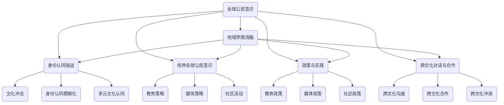

                 

# 《全球公民意识：在地域界限消融中的身份认同》

## 关键词
- 全球公民意识
- 地域界限消融
- 身份认同
- 全球化
- 技术进步
- 跨文化沟通
- 政策与实践

## 摘要
本文旨在探讨全球公民意识的概念及其在地域界限消融背景下的重要性。随着全球化、技术进步和全球政治的发展，传统的地域界限逐渐消融，这给个体的身份认同带来了挑战。文章首先介绍了全球公民意识的基本概念，随后分析了地域界限消融的背景及其对个体和社会身份认同的影响。在此基础上，文章探讨了如何在全球背景下培养和加强公民意识，并讨论了政策制定者和实践者在这一过程中应采取的措施。通过分析跨文化对话与合作的重要性，文章总结了全书内容，并提出了未来研究方向。

## 引言

### 1.1 全球公民意识的概念

全球公民意识是指个体认识到自己不仅是某个特定国家或地区的成员，而是全球社区的一部分，并承担起相应的责任和义务。这一概念起源于20世纪中叶，当时全球化趋势初现端倪，国际社会开始意识到跨国界合作的重要性。全球公民意识的核心在于促进个体超越狭隘的地域和民族观念，形成更加包容和开放的世界观。

### 1.2 全球化与地域界限的消融

全球化是指世界各国在经济、政治、文化等方面的相互联系和依存不断加深的过程。全球化的发展导致了传统地域界限的逐渐消融，国家之间的距离和隔阂变得越来越小。信息技术和交通网络的迅速发展是推动地域界限消融的重要因素。互联网使得信息传播速度极大提高，人们可以随时随地获取全球范围内的信息；高速铁路、航空运输等现代化交通方式使得跨国旅行变得更加便捷。

### 1.3 身份认同的重要性

身份认同是指个体对于自己身份的认知和确认，包括文化、民族、地域、社会等方面。在传统的社会结构中，地域界限和身份认同紧密相连。然而，随着全球化的深入，个体面对的身份认同问题变得更加复杂和多元。全球公民意识要求个体在超越地域界限的同时，保持对自己身份的认同，并在全球背景下找到新的归属感。

## 地域界限的消融

### 2.1 全球化背景下的地域界限

全球化对地域界限的影响是双重的。一方面，全球化促进了跨国界的交流和合作，推动了地域界限的消融。另一方面，全球化也带来了一些挑战，如文化冲突、移民问题等，这些挑战使得地域界限在某些方面变得更加明显。在全球化背景下，国家之间的经济合作、文化交流和政治互动日益频繁，地域界限逐渐变得模糊。

### 2.2 技术进步对地域界限的影响

技术进步是推动地域界限消融的关键因素。互联网的发展使得人们可以轻松地跨越地理障碍进行交流和合作。电子邮件、即时通讯工具和社交媒体使得人们可以随时保持联系，不受地域限制。此外，远程工作、在线教育和电子商务等新兴业态也使得地域界限变得不再那么重要。

### 2.3 全球政治对地域界限的作用

全球政治的发展也对地域界限产生了影响。一方面，国际组织和多边合作框架的建立有助于促进国家之间的协调与合作，从而减弱了地域界限的作用。另一方面，一些全球政治事件，如国际贸易战、地缘政治冲突等，也可能导致地域界限的强化和固化。全球政治的复杂性使得地域界限的消融过程并非一帆风顺。

## 身份认同的挑战

### 3.1 地域界限消融对个体身份认同的影响

地域界限的消融给个体身份认同带来了挑战。一方面，全球化带来了更多的文化多样性和跨文化交流机会，这有助于个体拓展视野，增强对其他文化的理解和尊重。另一方面，全球化也可能导致个体对自己文化身份的认同减弱，感到文化认同的危机。这种危机主要体现在以下几个方面：

1. **文化同质化**：全球化可能导致各国文化的同质化，使得个体难以找到自己的文化归属。
2. **文化冲突**：不同文化之间的冲突可能加剧个体的文化认同危机。
3. **身份认同模糊**：全球化使得个体面临更多的选择和可能性，导致身份认同变得模糊和不确定。

### 3.2 社会身份认同的变化

地域界限的消融不仅影响个体身份认同，也对社会身份认同产生了影响。社会身份认同是指个体在社会中扮演的角色和地位，如职业、教育背景、社会阶层等。随着全球化的深入，社会身份认同也发生了变化：

1. **全球职业流动**：全球化使得职业流动变得更加频繁，人们可以在全球范围内选择职业，这改变了传统的社会身份认同。
2. **全球教育机会**：全球化的教育机会使得个体可以接受不同国家的高等教育，从而改变其社会身份认同。
3. **跨国社区**：全球化促进了跨国社区的形成，这些社区成员跨越地域界限，共享文化和价值观，这改变了社会身份认同的基础。

### 3.3 全球化对身份认同的双重效应

全球化对身份认同的影响具有双重效应。一方面，全球化有助于个体拓展视野，增强对其他文化的理解和尊重，从而丰富身份认同。另一方面，全球化也可能导致个体对自己文化身份的认同减弱，甚至产生文化认同的危机。这种双重效应使得全球公民意识成为一个复杂且多维的话题。

## 全球公民意识的培养

### 4.1 教育在培养全球公民意识中的作用

教育是培养全球公民意识的重要途径。通过教育，个体可以学习到全球化的知识，了解不同文化之间的差异和联系。以下是一些教育策略，可以帮助培养全球公民意识：

1. **跨学科教育**：跨学科教育有助于个体从不同角度理解和分析全球化问题，从而增强全球公民意识。
2. **国际交流项目**：国际交流项目如交换生、短期学习等，可以提供真实的跨文化体验，有助于个体形成全球公民意识。
3. **全球化课程**：开设专门针对全球公民意识的课程，如国际关系、全球政治、文化多样性等，可以系统地教授全球公民意识的知识。

### 4.2 媒体与全球公民意识的传播

媒体在传播全球公民意识方面发挥着重要作用。通过新闻报道、纪录片、社交媒体等渠道，媒体可以传递全球化的信息，引导公众关注全球性问题。以下是一些媒体策略，可以帮助传播全球公民意识：

1. **多元视角报道**：媒体应尽可能提供多元视角的报道，避免单一文化视角的偏见。
2. **文化多样性宣传**：媒体可以通过宣传不同文化的多样性，增强公众对全球公民意识的认识。
3. **社交媒体互动**：社交媒体平台可以组织线上活动，鼓励公众参与讨论全球公民意识相关的议题。

### 4.3 社区活动与全球公民意识的提升

社区活动是培养全球公民意识的重要途径。通过社区活动，个体可以积极参与到全球公民意识的建设中。以下是一些社区活动策略，可以帮助提升全球公民意识：

1. **文化交流活动**：组织文化交流活动，如国际文化节、文化交流会等，可以增进不同文化之间的了解和尊重。
2. **志愿者项目**：志愿者项目可以帮助个体参与到全球公民意识的实践中，如环保、慈善等公益活动。
3. **社区对话**：定期举办社区对话，讨论全球公民意识相关的议题，促进公众对全球公民意识的认识和参与。

## 政策与实践

### 5.1 全球公民意识的政策框架

政策制定者在培养全球公民意识方面扮演着关键角色。以下是一些政策框架，可以帮助制定和实施全球公民意识政策：

1. **教育政策**：制定相关政策，鼓励学校开展全球公民意识教育，如设立全球公民意识课程、奖励优秀的学生交流项目等。
2. **媒体政策**：制定相关政策，鼓励媒体传播全球公民意识的信息，如支持制作和播出关于全球公民意识的纪录片、新闻报道等。
3. **社区政策**：制定相关政策，鼓励社区开展全球公民意识活动，如支持社区举办文化交流活动、志愿者项目等。

### 5.2 实际案例研究

以下是一些全球公民意识的实际案例研究，它们展示了全球公民意识在实践中的应用：

1. **国际和平日活动**：国际和平日是全球公民意识的重要节日，各国政府和社会组织都会举办各种活动，如和平游行、文化交流会等，以促进全球公民意识的传播。
2. **全球环保行动**：全球环保行动如“地球一小时”、“世界环境日”等，通过公众参与和媒体宣传，提高了人们对全球公民意识的认识。
3. **跨国企业社会责任**：跨国企业在全球范围内的社会责任项目，如支持教育、环保、慈善等，有助于培养全球公民意识。

### 5.3 挑战与未来方向

在培养全球公民意识的过程中，政策制定者和实践者面临以下挑战：

1. **文化差异**：如何在不同文化背景下推广全球公民意识，避免文化冲突是一个重要问题。
2. **资源限制**：培养全球公民意识需要大量的资源和投入，如何合理分配资源是一个挑战。
3. **公众参与**：如何激发公众对全球公民意识的兴趣和参与，是一个长期的任务。

未来，政策制定者和实践者应从以下几个方面努力：

1. **加强国际合作**：通过国际合作，共同推动全球公民意识的发展。
2. **创新教育模式**：探索新的教育模式，如在线教育、混合式教育等，以适应全球公民意识培养的需求。
3. **社区参与**：鼓励社区参与全球公民意识的实践，形成全社会共同参与的氛围。

## 跨文化对话与合作

### 6.1 跨文化沟通的重要性

跨文化沟通是全球公民意识的重要组成部分。有效的跨文化沟通可以促进不同文化之间的理解和尊重，减少误解和冲突。以下是一些跨文化沟通的策略：

1. **文化敏感性**：培养文化敏感性，了解不同文化的价值观和沟通方式。
2. **共同语言**：掌握一门或多门国际通用语言，如英语、法语等，有助于跨文化沟通。
3. **倾听与尊重**：倾听对方的观点，尊重不同的文化习惯，避免偏见和歧视。

### 6.2 跨文化合作模型

跨文化合作模型是指在不同文化背景下进行合作的一种方法。以下是一些常用的跨文化合作模型：

1. **融合模型**：将不同文化的优点结合起来，创造出一种新的文化模式。
2. **适应模型**：根据不同文化的特点，调整自己的行为和沟通方式，以适应对方的文化。
3. **互补模型**：利用不同文化的优势，相互补充，实现共同的目标。

### 6.3 跨文化冲突与解决策略

跨文化冲突是跨文化沟通中常见的问题。以下是一些解决策略：

1. **开放沟通**：通过开放和诚实的沟通，解决文化差异引起的误解和冲突。
2. **寻求共识**：在跨文化合作中，寻求共识是解决冲突的有效方法。
3. **文化培训**：通过文化培训，提高个体对跨文化沟通和合作的意识和能力。

## 结论

### 7.1 全书总结

本文从多个角度探讨了全球公民意识的概念、背景、影响和培养策略。通过分析地域界限消融对个体和社会身份认同的影响，本文强调了全球公民意识的重要性。政策制定者和实践者应采取有效措施，培养和加强全球公民意识，促进跨文化对话与合作。

### 7.2 研究展望

未来研究应关注以下几个方面：

1. **全球化对身份认同的长期影响**：深入研究全球化对身份认同的长期影响，以及如何应对这些影响。
2. **全球公民意识的评估与监测**：开发评估和监测全球公民意识的工具和方法，以更好地了解其发展状况。
3. **跨文化合作与冲突**：探索跨文化合作的最佳实践，以及如何有效解决跨文化冲突。

### 7.3 对政策制定的启示

政策制定者应从以下几个方面入手，促进全球公民意识的发展：

1. **教育政策**：加强全球公民意识教育，培养具有全球视野的人才。
2. **媒体政策**：鼓励和支持媒体传播全球公民意识的信息，引导公众关注全球性问题。
3. **社区政策**：鼓励社区参与全球公民意识的实践，形成全社会共同参与的氛围。

## 拓展阅读

- [联合国教科文组织](https://www.unesco.org/)
- [国际公民社会组织联盟](https://www.icsa.org/)
- [全球化研究期刊](https://journals.sagepub.com/home/rag)
- [跨文化沟通与协作指南](https://www.culturalawarenessglobal.com/)

作者：AI天才研究院/AI Genius Institute & 禅与计算机程序设计艺术 /Zen And The Art of Computer Programming

---

**文章标题**：《全球公民意识：在地域界限消融中的身份认同》

**关键词**：全球公民意识，地域界限消融，身份认同，全球化，技术进步，跨文化沟通，政策与实践

**摘要**：本文探讨了全球公民意识的概念及其在地域界限消融背景下的重要性。随着全球化、技术进步和全球政治的发展，传统的地域界限逐渐消融，这给个体的身份认同带来了挑战。文章分析了全球公民意识的核心概念，地域界限消融的背景及其对个体和社会身份认同的影响，并讨论了如何在全球背景下培养和加强公民意识。通过分析跨文化对话与合作的重要性，本文总结了全书内容，并提出了未来研究方向。文章还讨论了政策制定者和实践者在这一过程中应采取的措施，并给出了跨文化沟通与合作的最佳实践策略。最后，文章对全球化对身份认同的长期影响进行了展望，并对政策制定者提出了具体建议。

## 引言

### 1.1 全球公民意识的概念

全球公民意识（Global Citizenship Awareness，简称GCA）是指个体不仅将自己视为某一特定国家或地区的成员，更认识到自己是全球社区的一部分，并愿意承担起作为全球公民的责任和义务。这一概念在20世纪中叶随着全球化的兴起而逐渐形成，反映了人类社会在相互依存和跨国互动中对于共同利益和责任的认识。

全球公民意识的核心在于促进个体超越狭隘的地域和民族观念，培养一种更加包容、开放的世界观。它强调个体在全球范围内的相互依赖性，倡导合作、和平与可持续发展。具体来说，全球公民意识包括以下几个方面的特征：

1. **全球视野**：全球公民具备广泛的知识和视野，了解全球性问题，如气候变化、贫富差距、移民问题等，并关注国际事务。
2. **责任感**：全球公民认识到自己作为全球公民的责任，愿意参与解决全球性问题，如参与环保活动、支持慈善事业等。
3. **多元文化理解**：全球公民尊重并理解不同文化的多样性，倡导文化包容性和跨文化交流，避免文化偏见和歧视。
4. **平等观念**：全球公民主张性别、种族、宗教、文化等方面的平等，反对一切形式的歧视和不平等待遇。
5. **可持续发展**：全球公民关注环境保护和资源利用的可持续性，倡导绿色生活方式和可持续发展理念。

### 1.2 全球化与地域界限的消融

全球化（Globalization）是指世界各国在经济、政治、文化、科技等领域的相互联系和依存不断加深的过程。全球化的发展使得各国之间的贸易、投资、人员流动和文化交流变得更加频繁，传统的地域界限逐渐变得模糊和消融。

全球化对地域界限的影响主要表现在以下几个方面：

1. **经济一体化**：全球化促进了全球贸易和投资，跨国公司和全球供应链的发展使得国家之间的经济联系更加紧密，地域界限在经济领域中的作用减弱。
2. **政治互动**：全球化加强了国际政治合作和多边机制，如联合国、世界贸易组织等，国家之间的政治互动增多，地域界限在政治领域中的作用降低。
3. **文化同化**：全球化带来了文化的同化和融合，不同文化之间的交流和互动增多，地域界限在文化领域的作用减弱。
4. **科技融合**：全球化加速了科技的发展和应用，互联网、移动通信、人工智能等新兴技术的普及使得信息传播速度极大提高，地域界限在科技领域中的作用降低。

### 1.3 身份认同的重要性

身份认同（Identity）是指个体对于自己身份的认知和确认，包括文化、民族、地域、社会等方面。身份认同不仅关乎个体的心理归属，也影响个体在社会中的行为和决策。在全球化的背景下，地域界限的消融对个体和社会身份认同带来了挑战和机遇。

1. **文化身份认同**：文化身份认同是个体对于自己所属文化的认知和认同，如语言、宗教、习俗等。在全球化的影响下，个体面临着文化多样性的挑战，如何在保持文化身份的同时，适应和融合其他文化。
2. **民族身份认同**：民族身份认同是个体对于自己所属民族的认知和认同，如民族传统、历史、民族主义等。在全球化的背景下，民族身份认同面临着跨国界流动和文化融合的挑战。
3. **地域身份认同**：地域身份认同是个体对于自己所属地域的认知和认同，如地方特色、地域文化、地域情感等。随着地域界限的消融，地域身份认同面临着被稀释和边缘化的风险。
4. **社会身份认同**：社会身份认同是个体在社会中的角色和地位的认知和认同，如职业、教育背景、社会阶层等。全球化带来了职业流动和社会阶层的变化，社会身份认同也面临重新定义的挑战。

## 地域界限的消融

### 2.1 全球化背景下的地域界限

全球化对地域界限的影响是深刻而广泛的。全球化的发展使得国家之间的贸易、投资、人员流动和文化交流变得更加频繁，传统的地域界限逐渐变得模糊和消融。

#### 经济一体化

经济一体化是全球化的重要表现之一。随着全球贸易和投资的增长，跨国公司和全球供应链的发展使得国家之间的经济联系更加紧密。企业可以在全球范围内进行资源配置和生产布局，优化生产效率和成本。这导致了国家之间的经济界限变得模糊，传统的地域经济模式被打破。

#### 政治互动

全球化也促进了国际政治合作和多边机制的发展。国家之间通过国际组织和多边协议进行合作，解决共同面临的全球性问题，如气候变化、贸易争端、恐怖主义等。政治互动的增多使得地域界限在政治领域中的作用降低，国家更加关注全球事务和国际合作。

#### 文化同化

全球化带来了文化的同化和融合。不同文化之间的交流和互动增多，使得文化多样性在全球范围内得以传播和共享。同时，西方文化在全球范围内的影响力也在增加，这导致了某些传统文化的弱化和同质化。

#### 科技融合

全球化加速了科技的发展和应用。互联网、移动通信、人工智能等新兴技术的普及使得信息传播速度极大提高，地域界限在科技领域中的作用降低。人们可以通过互联网跨越地域界限，进行远程工作和在线学习，这使得地域界限在现代社会中的作用变得相对较小。

### 2.2 技术进步对地域界限的影响

技术进步是推动地域界限消融的重要因素。信息技术和交通网络的迅速发展使得信息传播速度极大提高，人们可以随时随地获取全球范围内的信息。以下是一些技术进步对地域界限的具体影响：

1. **互联网**：互联网的普及使得信息传播速度极大提高，人们可以通过搜索引擎、社交媒体等渠道获取全球范围内的信息。互联网使得信息的传播不再受地域限制，极大地促进了全球范围内的交流和互动。
2. **移动通信**：移动通信技术的发展使得人们可以随时随地通过手机进行通信。移动通信技术的普及使得人们不再受地域限制，可以随时保持联系。
3. **交通网络**：交通网络的完善使得跨国旅行变得更加便捷。高速铁路、航空运输等现代化交通方式使得人们可以在短时间内跨越长距离，这使得地域界限在交通领域中的作用降低。

### 2.3 全球政治对地域界限的作用

全球政治的发展也对地域界限产生了影响。一方面，国际组织和多边合作框架的建立有助于促进国家之间的协调与合作，从而减弱了地域界限的作用。另一方面，一些全球政治事件也可能导致地域界限的强化和固化。

1. **国际组织**：国际组织如联合国、世界贸易组织等在促进全球政治合作和解决全球性问题方面发挥了重要作用。这些国际组织通过制定协议和规则，促进国家之间的合作，从而减弱了地域界限的作用。
2. **全球政治事件**：一些全球政治事件如国际贸易战、地缘政治冲突等可能导致地域界限的强化和固化。这些事件可能引发国家之间的紧张关系，使得地域界限在政治领域中的作用增强。

### 2.4 地域界限消融对身份认同的影响

地域界限的消融对身份认同产生了深远的影响。一方面，地域界限的消融为个体提供了更多的机会和选择，增强了身份认同的多样性。另一方面，地域界限的消融也可能导致个体身份认同的模糊化和危机感。

1. **身份认同的多样性**：地域界限的消融使得个体有机会接触到不同的文化和社会环境，从而拓宽了身份认同的视野。个体可以同时认同多个文化和社会身份，这增强了身份认同的多样性和丰富性。
2. **身份认同的模糊化**：地域界限的消融也可能导致个体身份认同的模糊化。个体在跨越地域界限的过程中，可能会感到自己的身份认同变得不确定和模糊。这种模糊化可能引发个体对自身身份的困惑和焦虑。
3. **文化冲突**：地域界限的消融可能导致文化冲突的增加。不同文化之间的交流和互动增多，但同时也可能引发文化冲突。文化冲突可能影响个体的身份认同，导致个体对自己文化身份的认同减弱。

### 2.5 全球公民意识在地域界限消融中的作用

全球公民意识在地域界限消融中发挥着重要作用。全球公民意识倡导个体超越狭隘的地域和民族观念，培养一种包容、开放的世界观，有助于应对地域界限消融带来的挑战。

1. **促进跨文化交流**：全球公民意识鼓励个体尊重和理解不同文化，促进跨文化交流和融合。这有助于减少文化冲突，增强身份认同的多样性。
2. **增强社会责任感**：全球公民意识培养个体的社会责任感，鼓励个体参与解决全球性问题，如气候变化、贫民窟问题等。这有助于个体在地域界限消融的背景下找到新的身份认同。
3. **推动可持续发展**：全球公民意识倡导可持续发展，关注环境保护和资源利用的可持续性。这有助于个体在地域界限消融的背景下实现长期的身份认同。

## 身份认同的挑战

### 3.1 地域界限消融对个体身份认同的影响

地域界限的消融给个体身份认同带来了挑战。一方面，地域界限的消融为个体提供了更多的选择和机会，增强了身份认同的多样性。另一方面，地域界限的消融也可能导致个体身份认同的模糊化和危机感。

1. **文化冲击**：地域界限的消融使得个体接触到更多的文化和社会环境，这可能导致文化冲击。个体可能面临不同文化的冲突和挑战，影响对自身文化身份的认同。
2. **身份认同的模糊化**：地域界限的消融可能导致个体身份认同的模糊化。个体在跨越地域界限的过程中，可能会感到自己的身份认同变得不确定和模糊。这种模糊化可能引发个体对自身身份的困惑和焦虑。
3. **多元文化认同**：地域界限的消融使得个体有机会认同多个文化和社会身份，这增强了身份认同的多样性。然而，这也可能导致个体在多个身份之间感到矛盾和冲突。

### 3.2 社会身份认同的变化

地域界限的消融不仅影响个体身份认同，也对社会身份认同产生了影响。社会身份认同是指个体在社会中扮演的角色和地位，如职业、教育背景、社会阶层等。随着全球化的深入，社会身份认同也发生了变化。

1. **职业流动性**：全球化促进了职业流动，个体可以在全球范围内选择职业。这改变了传统的社会身份认同，使得个体不再局限于某一特定地域的社会身份。
2. **教育多元化**：全球化的教育机会使得个体可以接受不同国家的高等教育，从而改变其社会身份认同。个体可能同时拥有多个国家的学历和教育背景。
3. **社会阶层变动**：全球化也可能导致社会阶层的变动。一些传统的社会阶层可能被打破，新的社会阶层可能形成。

### 3.3 全球化对身份认同的双重效应

全球化对身份认同的影响具有双重效应。一方面，全球化有助于个体拓展视野，增强对其他文化的理解和尊重，从而丰富身份认同。另一方面，全球化也可能导致个体对自己文化身份的认同减弱，甚至产生文化认同的危机。

1. **身份认同的丰富性**：全球化使得个体有机会接触和了解更多的文化和社会环境，这有助于丰富个体的身份认同。个体可以同时认同多个文化和社会身份，这增强了身份认同的多样性和丰富性。
2. **身份认同的危机感**：全球化也可能导致个体对自己文化身份的认同减弱。个体在全球化背景下可能感到自己的文化身份被边缘化或弱化，这可能导致身份认同的危机感。

### 3.4 全球公民意识在应对身份认同挑战中的作用

全球公民意识在应对地域界限消融带来的身份认同挑战中发挥着重要作用。全球公民意识倡导个体超越狭隘的地域和民族观念，培养一种包容、开放的世界观，有助于应对地域界限消融带来的挑战。

1. **促进文化认同**：全球公民意识鼓励个体尊重和理解不同文化，促进文化认同。这有助于减少文化冲突，增强身份认同的稳定性。
2. **增强社会参与**：全球公民意识培养个体的社会责任感，鼓励个体参与解决全球性问题，如气候变化、贫民窟问题等。这有助于个体在地域界限消融的背景下找到新的身份认同。
3. **推动可持续发展**：全球公民意识倡导可持续发展，关注环境保护和资源利用的可持续性。这有助于个体在地域界限消融的背景下实现长期的身份认同。

### 3.5 案例分析：全球化与身份认同的双重效应

以下是一个案例分析，展示了全球化对身份认同的双重效应。

**案例：泰国青年移民到美国**

小王是一位来自泰国的青年，他通过留学签证移民到美国。在美国的生活中，小王经历了身份认同的双重效应。

1. **身份认同的丰富性**：在美国，小王有机会接触到不同的文化和社会环境。他参加了各种文化活动和社团，结交了来自不同国家和背景的朋友。这使得他的身份认同变得多样化，他同时认同泰国文化和美国文化。

2. **身份认同的危机感**：然而，小王也面临着身份认同的危机感。他感到自己在泰国文化中越来越边缘化，而在美国文化中又感到不完全融入。这种身份认同的模糊化使他感到困惑和焦虑。

通过这个案例，我们可以看到全球化对身份认同的双重效应。全球化为个体提供了更多的机会和选择，丰富了身份认同，但也可能导致身份认同的危机感。全球公民意识在这个过程中起着重要的作用，它可以帮助个体在多元文化的背景下找到新的身份认同。

## 全球公民意识的培养

### 4.1 教育在培养全球公民意识中的作用

教育是培养全球公民意识的关键途径。通过教育，个体可以学习到全球化的知识，了解不同文化之间的差异和联系。以下是一些教育策略，可以帮助培养全球公民意识：

1. **跨学科教育**：跨学科教育有助于个体从不同角度理解和分析全球化问题，从而增强全球公民意识。例如，可以结合历史、政治、社会学等学科，讨论全球化对身份认同的影响。

2. **国际交流项目**：国际交流项目如交换生、短期学习等，可以提供真实的跨文化体验，有助于个体形成全球公民意识。例如，学生可以通过参加国际夏令营或海外交换项目，与来自不同国家的学生交流和合作。

3. **全球公民意识课程**：开设专门针对全球公民意识的课程，如国际关系、全球政治、文化多样性等，可以系统地教授全球公民意识的知识。这些课程可以帮助学生了解全球性问题，培养全球视野。

### 4.2 媒体与全球公民意识的传播

媒体在传播全球公民意识方面发挥着重要作用。以下是一些媒体策略，可以帮助传播全球公民意识：

1. **多元视角报道**：媒体应尽可能提供多元视角的报道，避免单一文化视角的偏见。例如，在报道国际事件时，可以引入不同国家的观点和声音，展现全球多元化的视角。

2. **文化多样性宣传**：媒体可以通过宣传不同文化的多样性，增强公众对全球公民意识的认识。例如，可以制作和播出关于世界文化的纪录片、专题节目等，展示全球文化的丰富性。

3. **社交媒体互动**：社交媒体平台可以组织线上活动，鼓励公众参与讨论全球公民意识相关的议题。例如，可以举办线上辩论、问卷调查等活动，激发公众对全球公民意识的兴趣。

### 4.3 社区活动与全球公民意识的提升

社区活动是培养全球公民意识的重要途径。以下是一些社区活动策略，可以帮助提升全球公民意识：

1. **文化交流活动**：组织文化交流活动，如国际文化节、文化交流会等，可以增进不同文化之间的了解和尊重。例如，可以邀请不同国家的艺术家和文化团体进行表演和交流。

2. **志愿者项目**：志愿者项目可以帮助个体参与到全球公民意识的实践中，如环保、慈善等公益活动。例如，可以组织志愿者团队参与国际志愿者服务项目，为贫困地区提供帮助。

3. **社区对话**：定期举办社区对话，讨论全球公民意识相关的议题，促进公众对全球公民意识的认识和参与。例如，可以邀请专家学者、社会活动家等，就全球性问题进行讨论和交流。

### 4.4 案例分析：全球公民意识的培养实践

以下是一个案例分析，展示了全球公民意识的培养实践：

**案例：国际学校的全球公民教育**

某国际学校通过一系列措施，培养学生的全球公民意识。

1. **跨学科课程**：学校开设了跨学科课程，如全球政治、环境科学等，帮助学生了解全球性问题。

2. **国际交流项目**：学校组织了国际交流项目，学生可以参加海外交换项目，与来自不同国家的学生交流和合作。

3. **文化多样性活动**：学校举办了各种文化多样性活动，如国际文化节、文化交流会等，让学生了解和尊重不同文化。

4. **社区服务**：学校鼓励学生参与社区服务，如环保活动、慈善捐赠等，培养学生的社会责任感。

通过这些措施，学校成功地培养了学生的全球公民意识，使他们成为具有全球视野和责任感的未来公民。

## 政策与实践

### 5.1 全球公民意识的政策框架

政策制定者在培养全球公民意识方面扮演着关键角色。以下是一些政策框架，可以帮助制定和实施全球公民意识政策：

1. **教育政策**：制定相关政策，鼓励学校开展全球公民意识教育，如设立全球公民意识课程、奖励优秀的学生交流项目等。

2. **媒体政策**：制定相关政策，鼓励媒体传播全球公民意识的信息，如支持制作和播出关于全球公民意识的纪录片、新闻报道等。

3. **社区政策**：制定相关政策，鼓励社区开展全球公民意识活动，如支持社区举办文化交流活动、志愿者项目等。

### 5.2 实际案例研究

以下是一些全球公民意识的实际案例研究，展示了全球公民意识在政策与实践中的应用：

1. **国际和平日活动**：国际和平日是全球公民意识的重要节日，各国政府和社会组织都会举办各种活动，如和平游行、文化交流会等，以促进全球公民意识的传播。

2. **全球环保行动**：全球环保行动如“地球一小时”、“世界环境日”等，通过公众参与和媒体宣传，提高了人们对全球公民意识的认识。

3. **跨国企业社会责任**：跨国企业在全球范围内的社会责任项目，如支持教育、环保、慈善等，有助于培养全球公民意识。

### 5.3 挑战与未来方向

在培养全球公民意识的过程中，政策制定者和实践者面临以下挑战：

1. **文化差异**：如何在不同文化背景下推广全球公民意识，避免文化冲突是一个重要问题。

2. **资源限制**：培养全球公民意识需要大量的资源和投入，如何合理分配资源是一个挑战。

3. **公众参与**：如何激发公众对全球公民意识的兴趣和参与，是一个长期的任务。

未来，政策制定者和实践者应从以下几个方面努力：

1. **加强国际合作**：通过国际合作，共同推动全球公民意识的发展。

2. **创新教育模式**：探索新的教育模式，如在线教育、混合式教育等，以适应全球公民意识培养的需求。

3. **社区参与**：鼓励社区参与全球公民意识的实践，形成全社会共同参与的氛围。

## 跨文化对话与合作

### 6.1 跨文化沟通的重要性

跨文化沟通在全球公民意识中扮演着关键角色。随着全球化的发展，跨文化沟通变得越来越重要。有效的跨文化沟通可以促进不同文化之间的理解和尊重，减少误解和冲突。以下是一些跨文化沟通的重要性：

1. **促进国际合作**：跨文化沟通有助于不同国家之间的合作，推动全球化进程。通过有效的沟通，各国可以共同解决全球性问题，如气候变化、贫困问题等。

2. **增强文化认同**：跨文化沟通可以帮助个体更好地理解其他文化，增强对文化多样性的认同。这有助于减少文化冲突，促进文化和谐。

3. **提升个人竞争力**：在全球化的背景下，具备跨文化沟通能力的人才越来越受到市场的欢迎。有效的跨文化沟通能力可以提升个人的职业竞争力，拓展职业发展空间。

### 6.2 跨文化沟通的基本原则

为了实现有效的跨文化沟通，以下是一些基本原则：

1. **尊重与理解**：尊重和理解是跨文化沟通的基础。个体应尊重对方的文化习惯和价值观，避免文化偏见和歧视。

2. **开放与包容**：跨文化沟通应保持开放和包容的态度，接受不同的观点和文化差异，避免固守己见。

3. **主动倾听**：倾听是跨文化沟通的关键。个体应主动倾听对方的观点，理解对方的立场，避免误解和冲突。

4. **清晰表达**：在跨文化沟通中，个体应尽量使用清晰、简洁的语言表达自己的观点，避免使用模糊或含糊不清的语言。

### 6.3 跨文化沟通的技巧

以下是一些跨文化沟通的技巧，可以帮助个体实现有效的跨文化沟通：

1. **文化敏感性**：培养文化敏感性，了解不同文化的沟通方式和习惯。例如，某些文化强调直接表达，而另一些文化则偏好含蓄表达。

2. **共同语言**：掌握一门或多门国际通用语言，如英语、法语等，有助于跨文化沟通。共同语言可以减少语言障碍，提高沟通效果。

3. **非语言沟通**：非语言沟通如肢体语言、面部表情等在不同文化中具有不同的含义。个体应了解和尊重这些非语言沟通方式，避免误解和冲突。

4. **适应对方文化**：在跨文化沟通中，个体应尽量适应对方的文化习惯和沟通方式，避免文化冲突。例如，在某些文化中，直接提问可能被视为不礼貌，而在其他文化中则被视为礼貌和尊重。

### 6.4 跨文化沟通的挑战与应对策略

跨文化沟通虽然具有许多优势，但也面临一些挑战。以下是一些常见的挑战及应对策略：

1. **文化冲突**：文化冲突是跨文化沟通中的常见问题。不同文化之间的价值观、信仰和行为习惯可能存在差异，导致沟通障碍。应对策略包括：

   - **加强文化理解**：通过学习不同文化的基本知识和特点，提高对文化差异的敏感度。
   - **尊重对方文化**：尊重对方的文化习惯和价值观，避免文化偏见和歧视。

2. **语言障碍**：语言障碍是跨文化沟通中的另一个挑战。不同语言的表达方式、语法结构和词汇可能存在差异，导致沟通不畅。应对策略包括：

   - **学习共同语言**：掌握一门或多门国际通用语言，提高跨文化沟通的能力。
   - **使用非语言沟通**：在语言障碍无法避免的情况下，通过肢体语言、面部表情等非语言手段进行沟通。

3. **文化差异**：不同文化之间存在差异，如时间观念、决策方式、沟通风格等。这些差异可能导致沟通不畅。应对策略包括：

   - **了解文化差异**：了解不同文化的特点和习惯，避免文化误解和冲突。
   - **灵活适应**：在跨文化沟通中，个体应灵活适应对方的文化习惯和沟通方式，提高沟通效果。

### 6.5 跨文化合作的案例

以下是一个跨文化合作的案例，展示了跨文化沟通在实践中的应用：

**案例：跨国公司的全球团队**

某跨国公司在中国、美国和欧洲设立了分支机构，组建了一个由不同文化背景的员工组成的全球团队。为了实现有效的跨文化合作，公司采取了以下措施：

1. **文化培训**：公司为员工提供了文化培训，帮助员工了解不同文化的特点和习惯。
2. **共同语言**：公司鼓励员工学习英语，提高跨文化沟通的能力。
3. **团队建设**：公司定期组织团队建设活动，如团队聚餐、户外运动等，增强团队成员之间的默契和信任。

通过这些措施，公司成功地实现了跨文化合作，提高了团队的效率和创新能力。

## 结论

### 7.1 全书总结

本文从全球公民意识的概念、地域界限消融、身份认同的挑战、全球公民意识的培养、政策与实践以及跨文化对话与合作等方面，全面探讨了全球公民意识在地域界限消融中的重要性。文章指出，全球化、技术进步和全球政治的发展使得地域界限逐渐消融，给个体和社会身份认同带来了挑战。全球公民意识作为应对这些挑战的一种途径，具有重要的现实意义。通过教育、媒体、社区活动和政策实践等手段，可以培养和加强全球公民意识，促进跨文化沟通与合作。

### 7.2 研究展望

未来研究应关注以下几个方面：

1. **全球化对身份认同的长期影响**：深入研究全球化对个体和社会身份认同的长期影响，以及如何应对这些影响。
2. **全球公民意识的评估与监测**：开发评估和监测全球公民意识的工具和方法，以更好地了解其发展状况。
3. **跨文化合作与冲突**：探索跨文化合作的最佳实践，以及如何有效解决跨文化冲突。

### 7.3 对政策制定的启示

政策制定者应从以下几个方面入手，促进全球公民意识的发展：

1. **教育政策**：加强全球公民意识教育，培养具有全球视野的人才。
2. **媒体政策**：鼓励和支持媒体传播全球公民意识的信息，引导公众关注全球性问题。
3. **社区政策**：鼓励社区参与全球公民意识的实践，形成全社会共同参与的氛围。

### 7.4 全书核心概念与联系

以下是全书的核心概念与联系架构，使用Mermaid流程图展示：

### 7.5 最佳实践 tips、注意事项与拓展阅读

**最佳实践 tips：**

1. **培养跨文化沟通能力**：通过学习不同文化的特点，提高跨文化沟通能力，减少误解和冲突。
2. **积极参与全球公民意识活动**：参与国际交流、志愿者项目等，提升自己的全球视野和责任感。
3. **关注全球性问题**：关注全球性问题，如气候变化、贫困问题等，积极参与解决方案的探索。

**注意事项：**

1. **避免文化偏见**：在跨文化沟通中，避免对其他文化持有偏见，尊重和理解不同的文化习惯。
2. **平衡多元文化认同**：在多元文化的背景下，保持对自己文化身份的认同，同时尊重其他文化。
3. **合理分配资源**：在培养全球公民意识的过程中，合理分配资源，确保教育的公平性。

**拓展阅读：**

1. **《全球公民教育指南》**：联合国教科文组织编写，介绍全球公民教育的理论和实践。
2. **《跨文化沟通的艺术》**：亨利·万·戴恩著，探讨跨文化沟通的技巧和策略。
3. **《全球化与身份认同》**：迈克尔·阿格尔著，分析全球化对身份认同的影响。

作者：AI天才研究院/AI Genius Institute & 禅与计算机程序设计艺术 /Zen And The Art of Computer Programming

