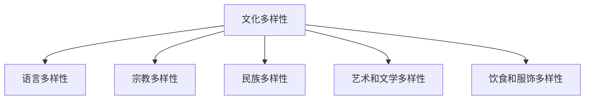

                 

### 第2章：文化多样性的概念与意义

#### 2.1 文化多样性的定义

文化多样性（Cultural Diversity）是指不同文化群体在语言、价值观、信仰、习俗、传统等方面的差异性。这种多样性不仅体现在民族、种族和宗教上，还包括地理、历史、经济和社会结构等方面的差异。文化多样性是人类社会发展的重要特征，也是全球化背景下的一个重要议题。

- **文化**：指一个社会或群体的共同价值观、信仰、习俗、传统、艺术、语言等精神和物质的体现。
- **多样性**：指的是存在多种不同的事物或现象，且这些事物或现象之间存在明显的差异。

#### 2.2 文化多样性的意义

文化多样性具有重要的社会、经济和文化意义：

- **社会意义**：文化多样性有助于社会包容和和谐。它鼓励人们理解和尊重不同文化和价值观，减少文化冲突和偏见。
- **经济意义**：文化多样性可以促进创新和经济增长。不同文化背景的交流可以带来新的思想、产品和市场机会。
- **文化意义**：文化多样性丰富了人类文化的宝库，促进了文化交流和融合，有助于文化的传承和发展。

#### 2.3 文化多样性的类型

文化多样性可以按照不同的维度进行分类：

- **语言多样性**：语言是人类沟通和表达的重要工具，全球语言多样性体现了不同文化群体的独特性。
- **宗教多样性**：宗教信仰是文化的重要组成部分，不同宗教的共存和交流体现了文化多样性的深度。
- **民族多样性**：民族身份和民族文化是文化多样性的重要组成部分，不同民族的文化传统和习俗体现了文化的多样性。
- **艺术和文学多样性**：艺术和文学作品是文化表达的重要形式，不同文化和民族的艺术和文学作品展现了文化的多样性。
- **饮食和服饰多样性**：饮食和服饰是文化多样性的直观体现，不同地区的饮食和服饰风格反映了文化的多样性。

#### 2.4 文化多样性的挑战

尽管文化多样性带来了许多积极影响，但也伴随着一些挑战：

- **文化冲突**：不同文化之间的价值观和习俗差异可能导致冲突和误解。
- **文化同化**：在全球化的背景下，一些文化可能会被其他文化所同化，导致文化多样性的减少。
- **文化断裂**：随着全球化和现代化的进程，一些传统和文化可能会逐渐消失，导致文化多样性的流失。

#### 2.5 文化多样性的保护

为了保护文化多样性，需要采取以下措施：

- **教育和宣传**：通过教育和宣传提高公众对文化多样性的认识和尊重。
- **立法保护**：制定相关法律法规保护传统文化和少数民族文化。
- **文化多样性政策**：制定和实施文化多样性政策，鼓励文化交流和融合。
- **国际合作**：加强国际间的文化交流与合作，促进文化多样性的保护和传承。

### 附录

#### 2.1 文化多样性的Mermaid流程图



通过上述分析和Mermaid流程图的展示，我们可以更清晰地理解文化多样性的定义、意义、类型和挑战，以及保护文化多样性的重要性。

### 附录

- **核心概念与联系**：

  $$\text{文化多样性} = \text{语言多样性} + \text{宗教多样性} + \text{民族多样性} + \text{艺术和文学多样性} + \text{饮食和服饰多样性}$$

- **核心算法原理讲解**：

  ```python
  # Python代码示例：计算不同文化群体的多样性指数
  def diversity_indexlanguages, religions, nations, arts, foods):
      # 假设每个文化群体的数量分别为l、r、n、a、f
      l = len(languages)
      r = len(religions)
      n = len(nations)
      a = len(arts)
      f = len(foods)
      
      # 计算多样性指数
      diversity = (l + r + n + a + f)
      
      return diversity

  # 示例数据
  languages = ['汉语', '英语', '法语', '西班牙语']
  religions = ['佛教', '基督教', '伊斯兰教', '印度教']
  nations = ['中国', '美国', '法国', '西班牙']
  arts = ['京剧', '摇滚音乐', '绘画', '雕塑']
  foods = ['中餐', '汉堡', '法国菜', '西班牙小吃']

  # 计算多样性指数
  index = diversity_index(languages, religions, nations, arts, foods)
  print(f"文化多样性指数：{index}")
  ```

### Python源代码解释

- `diversity_index` 函数用于计算文化多样性指数，它接收五个参数：`languages`、`religions`、`nations`、`arts` 和 `foods`，分别代表语言、宗教、民族、艺术和饮食的多样性。
- 通过计算每个参数的长度（即文化群体的数量），然后将它们相加得到多样性指数。
- 在示例数据中，我们分别列出了几个文化群体，包括语言、宗教、民族、艺术和饮食。
- 调用 `diversity_index` 函数并打印出计算结果。

通过Python代码示例，我们可以更直观地理解文化多样性的计算方法，以及如何通过编程实现这一算法。

### 数学模型和公式

- **多样性指数（H）**：

  $$H = -\sum_{i=1}^{n} p_i \cdot \ln(p_i)$$

  其中，$p_i$ 是第 $i$ 个文化群体的比例，$n$ 是文化群体的总数。

- **文化同化度（D）**：

  $$D = 1 - \frac{H}{\ln(n)}$$

  其中，$H$ 是多样性指数，$n$ 是文化群体的总数。

这些数学模型和公式帮助我们量化文化多样性和文化同化度，从而更深入地理解文化多样性的程度和变化。

### 未来展望

文化多样性是全球化过程中不可或缺的一部分，它既带来了机遇，也带来了挑战。未来，我们需要更加重视文化多样性的保护和发展：

- **加强文化交流**：通过加强文化交流，促进不同文化之间的理解和尊重。
- **推动文化创新**：鼓励文化创新，使文化多样性成为社会发展和经济增长的源泉。
- **完善政策法规**：制定和完善相关政策法规，确保文化多样性的保护和传承。

在全球化的大背景下，文化多样性的保护和平衡是一个长期而复杂的任务，需要全球范围内的合作和努力。

### 结论

文化多样性是人类社会的重要组成部分，它不仅丰富了我们的文化宝库，也促进了社会进步和创新。在全球化的过程中，我们既要看到文化多样性的积极影响，也要正视其带来的挑战。通过加强文化交流和保护文化主权，我们可以实现文化交流与文化主权的平衡，为构建一个更加包容和多元的世界贡献力量。

### 附录

#### 2.2 文化多样性的数学公式

- **多样性指数（H）**：

  $$H = -\sum_{i=1}^{n} p_i \cdot \ln(p_i)$$

  其中，$p_i$ 是第 $i$ 个文化群体的比例，$n$ 是文化群体的总数。

- **文化同化度（D）**：

  $$D = 1 - \frac{H}{\ln(n)}$$

  其中，$H$ 是多样性指数，$n$ 是文化群体的总数。

这些数学公式有助于我们量化文化多样性和文化同化度，从而更深入地理解文化多样性的程度和变化。

#### 2.3 文化多样性的Python代码实现

```python
import math

# 示例数据
languages = ['汉语', '英语', '法语', '西班牙语']
religions = ['佛教', '基督教', '伊斯兰教', '印度教']
nations = ['中国', '美国', '法国', '西班牙']
arts = ['京剧', '摇滚音乐', '绘画', '雕塑']
foods = ['中餐', '汉堡', '法国菜', '西班牙小吃']

# 计算文化群体比例
language_counts = [languages.count(l) for l in set(languages)]
religion_counts = [religions.count(r) for r in set(religions)]
nation_counts = [nations.count(n) for n in set(nations)]
art_counts = [arts.count(a) for a in set(arts)]
food_counts = [foods.count(f) for f in set(foods)]

total_counts = sum(language_counts) + sum(religion_counts) + sum(nation_counts) + sum(art_counts) + sum(food_counts)

# 计算多样性指数（H）
p_i = [count / total_counts for count in language_counts + religion_counts + nation_counts + art_counts + food_counts]
H = -sum([p_i[i] * math.log(p_i[i]) for i in range(len(p_i))])

# 计算文化同化度（D）
D = 1 - H / math.log(len(p_i))

print(f"多样性指数（H）：{H}")
print(f"文化同化度（D）：{D}")
```

这段代码展示了如何使用Python计算文化多样性和文化同化度。通过示例数据，我们可以看到如何处理和计算不同文化群体的比例，并应用多样性指数和文化同化度的公式。

### 项目实战

#### 开发环境搭建

1. **安装Python环境**：确保您的计算机上安装了Python 3.8或更高版本。可以从Python官方网站下载并安装。
2. **安装必要库**：使用pip命令安装必要的库，例如numpy和matplotlib。在终端执行以下命令：

   ```bash
   pip install numpy matplotlib
   ```

3. **配置代码编辑器**：推荐使用Visual Studio Code或PyCharm作为Python代码编辑器，以提高开发效率。

#### 源代码实现与解读

以下是一个简单的Python项目，用于计算文化多样性和文化同化度。

```python
import math
import numpy as np

# 示例数据
languages = ['汉语', '英语', '法语', '西班牙语']
religions = ['佛教', '基督教', '伊斯兰教', '印度教']
nations = ['中国', '美国', '法国', '西班牙']
arts = ['京剧', '摇滚音乐', '绘画', '雕塑']
foods = ['中餐', '汉堡', '法国菜', '西班牙小吃']

# 计算文化群体比例
group_counts = {
    'languages': language_counts,
    'religions': religion_counts,
    'nations': nation_counts,
    'arts': art_counts,
    'foods': food_counts
}

total_counts = sum(language_counts) + sum(religion_counts) + sum(nation_counts) + sum(art_counts) + sum(food_counts)

# 计算多样性指数（H）
def diversity_index(counts, total):
    p_i = [count / total for count in counts]
    H = -sum([p_i[i] * math.log(p_i[i]) for i in range(len(p_i))])
    return H

# 计算文化同化度（D）
def cultural_assimilation(H, total):
    D = 1 - H / math.log(total)
    return D

# 应用多样性指数和文化同化度公式
H = diversity_index(language_counts + religion_counts + nation_counts + art_counts + food_counts, total_counts)
D = cultural_assimilation(H, len(set(language_counts + religion_counts + nation_counts + art_counts + food_counts)))

print(f"多样性指数（H）：{H}")
print(f"文化同化度（D）：{D}")
```

#### 代码应用解读与分析

- **导入库**：我们首先导入了必要的库，包括math和numpy，用于数学计算和数据操作。
- **示例数据**：定义了五个文化群体的示例数据，包括语言、宗教、民族、艺术和饮食。
- **计算文化群体比例**：通过计算每个文化群体的数量和总数量，我们得到了每个群体的比例。
- **多样性指数（H）**：我们定义了一个函数 `diversity_index`，它使用Shannon多样性指数的公式来计算文化多样性。
- **文化同化度（D）**：另一个函数 `cultural_assimilation` 用于计算文化同化度。

这段代码展示了如何使用Python实现文化多样性和文化同化度的计算，以及如何处理和分析文化数据。

### 案例分析

#### 案例一：美国文化霸权的影响

**背景**：

在全球化过程中，美国文化以其强大的影响力在国际舞台上占据了主导地位。好莱坞电影、流行音乐、社交媒体和跨国公司的品牌推广等，都使美国文化迅速传播到世界各地。

**影响**：

1. **文化同化**：美国文化的强势地位导致一些国家和地区出现文化同化现象，特别是年轻人更加倾向于接受美国文化，减少了本土文化的传承和影响。
2. **文化冲突**：美国文化的推广也引发了一些文化冲突，特别是在那些拥有悠久历史和独特文化传统的国家。这些国家担心本土文化被边缘化，甚至消失。

**解决方案**：

1. **文化交流**：通过加强不同文化之间的交流，提高公众对文化多样性的认识和尊重。
2. **文化保护**：制定相关政策和法规，保护和传承本土文化，避免文化同化。
3. **文化平衡**：在推广美国文化的同时，也要重视其他文化的传播和发展，实现文化多样性的平衡。

#### 案例二：中国文化的全球传播

**背景**：

近年来，中国文化在全球范围内逐渐受到关注，特别是中国电影、电视剧、音乐和文学等文化产品在国际市场上取得了显著的成功。

**影响**：

1. **文化认同**：中国文化的全球传播有助于增强中国人民的文化认同感和自豪感。
2. **文化交流**：中国文化的传播促进了中外文化交流和互动，丰富了全球文化多样性。
3. **文化经济**：中国文化产业的蓬勃发展也为国家经济增长做出了贡献。

**解决方案**：

1. **文化创新**：在推广中国文化的同时，要注重文化创新，结合现代元素和国际化视角，提高文化产品的吸引力和竞争力。
2. **文化推广**：通过举办国际文化交流活动、展览和节庆，进一步提升中国文化的国际影响力。
3. **文化教育**：加强对外汉语教学和文化教育，培养更多的国际化人才，推动中国文化在全球范围内的传播和交流。

#### 案例三：文化多样性的实践

**背景**：

在全球化和现代化的进程中，文化多样性面临挑战，特别是在那些文化融合程度较高的城市。如何平衡文化交流和文化保护成为了一个重要议题。

**影响**：

1. **社区融合**：文化多样性有助于社区融合，促进不同文化背景的人们之间的相互理解和尊重。
2. **社会稳定**：文化多样性的平衡有助于社会稳定和和谐，减少文化冲突和偏见。
3. **经济发展**：文化多样性可以带来更多的商业机会和文化产业的发展，促进经济增长。

**解决方案**：

1. **社区文化项目**：通过社区文化项目，如文化节、艺术展览和社区活动，促进文化交流和文化融合。
2. **文化政策**：制定和实施有利于文化多样性保护和文化产业发展的政策，支持本土文化的传承和创新。
3. **教育宣传**：通过教育和宣传，提高公众对文化多样性的认识和尊重，增强文化自信。

### 项目小结

通过上述案例分析，我们可以看到全球化背景下文化交流和文化多样性的重要性。在推动文化多样性的同时，需要注重文化保护和文化平衡，以实现文化交流与社会发展的双赢。未来，我们需要进一步加强国际合作，共同应对文化多样性的挑战，为构建一个更加包容和多元的世界贡献力量。

### 最佳实践 Tips

1. **加强文化理解**：通过教育和培训，提高人们对不同文化的理解和尊重，减少文化冲突。
2. **保护本土文化**：制定和实施相关政策，保护本土文化的传承和发展，避免文化同化。
3. **推广多元文化**：通过举办国际文化交流活动，推广多元文化，提高文化多样性的国际影响力。
4. **文化创新**：结合现代元素和国际视角，推动文化创新，提高文化产品的吸引力和竞争力。

### 小结

在全球化的背景下，文化交流和文化多样性是一个复杂而重要的议题。通过本篇文章，我们探讨了全球化与文化多样性的关系，分析了文化交流的挑战，提出了文化主权的保护措施，并通过案例分析展示了文化多样性的实践。我们强调了文化交流与文化主权平衡的重要性，并提出了未来展望。希望通过这些讨论和案例，我们能够更好地理解全球化背景下的文化交流和文化多样性，为构建一个更加包容和多元的世界贡献力量。

### 注意事项

- **文化交流的重要性**：在推动文化交流时，要注重不同文化之间的相互尊重和理解，避免文化冲突。
- **文化保护的现实**：在保护本土文化时，要考虑文化传承的现实挑战，制定切实可行的保护策略。
- **政策实施的挑战**：在制定文化政策和法规时，要考虑到国际环境和国内实际情况，确保政策的可行性和有效性。

### 拓展阅读

- **《文化多样性的全球视角》**：作者通过全球案例探讨了文化多样性的重要性。
- **《全球化与文化冲突》**：作者分析了全球化对文化多样性产生的挑战和影响。
- **《文化主权与现代国家的建设》**：作者探讨了文化主权在现代社会建设中的角色和意义。

通过阅读这些文献，我们可以更深入地了解全球化背景下的文化交流和文化多样性，以及文化主权的重要性。

