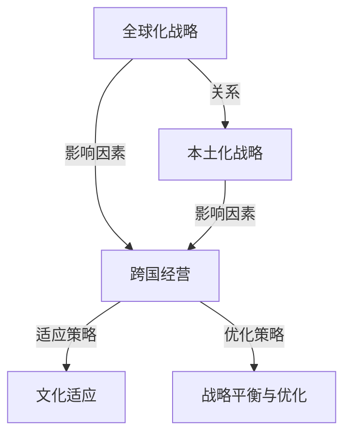

                 

### 摘要

在全球化和信息化的时代背景下，企业如何在全球化与本土化之间找到平衡，制定出有效的战略，已成为企业管理者和学者们关注的焦点。本文旨在深入探讨全球化与本土化的企业战略，分析跨国经营与本地适应的内涵与实施方法，帮助企业在全球市场中取得竞争优势。本文首先定义了全球化与本土化的概念及其关系，然后从理论基础、实施方法和文化适应策略三个方面进行详细阐述。通过分析全球化战略的理论基础、本土化战略的实施方法和跨国经营中的文化适应策略，本文提出了一套完整的战略框架，为企业提供了实用的指导。最后，本文通过实际案例展示，强调了平衡与优化全球化与本土化战略的重要性，为企业制定有效战略提供了宝贵的参考。本文的核心观点是：全球化与本土化不是对立的关系，而是相辅相成的。企业应在充分理解两者内涵的基础上，根据自身情况和市场环境，制定出符合实际的、具有可持续性的战略。

### 关键词

- 全球化
- 本土化
- 企业战略
- 跨国经营
- 本地适应
- 文化差异
- SWOT分析
- 波特五力模型

## 第一部分：引言与核心概念

在全球化与信息化迅速发展的今天，企业面临着前所未有的机遇与挑战。全球化使得企业可以跨越国界，进入新的市场，获取更多资源，而信息化则为全球化提供了技术支持。然而，全球化也带来了文化差异、法律监管、市场竞争等复杂问题。为了在全球市场中取得竞争优势，企业需要制定有效的战略，这不仅包括全球化战略，还涵盖了本土化战略。

### 1.1 书籍概述与目的

本文旨在深入探讨全球化与本土化的企业战略，从理论、方法、实施和文化适应等方面进行全面分析，帮助企业在全球市场中找到平衡，实现可持续发展。全书分为七个部分：

1. **引言与核心概念**：介绍全球化与本土化的定义、关系和重要性。
2. **全球化战略的理论基础**：探讨全球化战略的概念、发展和理论基础。
3. **本土化战略的理论基础**：分析本土化战略的概念、原则和理论基础。
4. **全球化战略的实施方法**：讨论全球化战略的规划与执行、市场进入策略和组织结构优化。
5. **本土化战略的实施方法**：分析本土化战略的规划与执行、文化适应策略和本土化营销。
6. **跨国经营中的文化适应策略**：探讨文化差异、文化适应策略及其在跨国经营中的应用。
7. **全球化与本土化战略的平衡与优化**：讨论全球化与本土化战略的平衡原则、优化方法和案例分析。

### 1.2 全球化与本土化的定义、关系及重要性

#### 全球化与本土化的定义

全球化（Globalization）是指企业跨越国界，在全球范围内进行经济活动，利用全球资源和市场，实现企业的国际化发展。全球化战略的核心是充分利用全球资源和市场，提高企业的竞争力。

本土化（Localization）是指企业在进入国外市场时，根据当地文化、法律、消费习惯等要素，对产品和业务进行调整，使其更符合当地市场需求。本土化战略的核心是适应和满足当地市场的需求，提高市场竞争力。

#### 关系

全球化与本土化并不是对立的关系，而是相辅相成的。全球化为企业提供了广阔的市场和资源，而本土化则为企业在当地市场中找到了立足点。企业在全球化过程中，需要根据市场环境进行调整，实现本土化。

#### 重要性

全球化与本土化对企业的重要性体现在以下几个方面：

1. **市场扩展**：全球化战略可以帮助企业进入新的市场，获取更多资源和客户。
2. **竞争力提升**：通过本土化战略，企业可以更好地适应不同市场的需求，提高市场竞争力。
3. **品牌建设**：全球化与本土化战略有助于企业树立良好的品牌形象，增强品牌影响力。
4. **可持续发展**：在全球化与本土化战略的指导下，企业可以更好地应对市场变化，实现可持续发展。

### 1.3 核心概念框架

为了更好地理解全球化与本土化的企业战略，我们可以使用Mermaid流程图来表示它们之间的关系。



在这个框架中，全球化战略和本土化战略是并列的关系，共同影响着跨国经营。文化适应和战略平衡与优化则是跨国经营中的关键要素。通过这个框架，我们可以更清晰地理解全球化与本土化战略在企业跨国经营中的角色和作用。

### 全球化战略的理论基础

全球化战略是企业为了在全球市场中获取竞争优势而采取的一系列策略和行动。其理论基础主要涉及以下几个方面：

#### 1. SWOT分析

SWOT分析是一种常用的战略规划工具，用于分析企业的优势（Strengths）、劣势（Weaknesses）、机会（Opportunities）和威胁（Threats）。在全球化战略中，SWOT分析可以帮助企业识别自身的优劣势，以及外部市场中的机会和威胁，从而制定出更加科学和有效的战略。

**优势**：包括企业的资源、能力、品牌、技术等。

**劣势**：包括企业的不足、短板、管理问题等。

**机会**：包括市场趋势、技术变革、政策变化等。

**威胁**：包括竞争对手、市场变化、政策法规等。

通过SWOT分析，企业可以全面了解自身和市场的情况，从而制定出有针对性的战略。

#### 2. 波特五力模型

波特五力模型是迈克尔·波特教授提出的一种用于分析行业竞争力的工具。该模型包括以下五个要素：

1. **供应商的议价能力**：供应商的议价能力越高，企业的成本压力就越大。
2. **买家的议价能力**：买家的议价能力越高，企业的销售压力就越大。
3. **新进入者的威胁**：新进入者的威胁越大，市场的竞争就越激烈。
4. **替代品的威胁**：替代品的威胁越大，企业的市场份额就越容易流失。
5. **现有竞争者的竞争程度**：竞争者的竞争程度越高，企业的生存压力就越大。

在全球化战略中，波特五力模型可以帮助企业了解所在行业的竞争格局，从而制定出有效的竞争策略。

#### 3. 盈利模式分析

盈利模式分析是理解企业如何创造价值和获取利润的重要工具。在全球化战略中，企业需要根据自身情况，设计出合适的盈利模式。

**盈利模式**：包括企业通过什么方式创造价值，如何分配价值，如何获取利润。

**价值创造**：包括企业的产品或服务如何满足客户需求，如何实现差异化。

**价值分配**：包括企业如何与供应商、客户、员工等利益相关者分配价值。

**利润获取**：包括企业如何通过价格、成本、渠道等手段获取利润。

通过盈利模式分析，企业可以更好地理解自己的商业模式，从而优化战略，提高竞争力。

### 本土化战略的理论基础

本土化战略是企业为了更好地适应国外市场，根据当地文化、法律、消费习惯等因素，对产品和业务进行调整的策略。其理论基础主要包括以下几个方面：

#### 1. 文化适应性

文化适应性是本土化战略的核心。企业需要深入了解目标市场的文化特点，包括价值观、行为规范、消费习惯等，从而设计出符合当地市场需求的产品和服务。

**文化因素**：包括语言、价值观、消费习惯、社会规范等。

**文化适应性策略**：包括产品设计、市场营销、人力资源等。

通过文化适应性，企业可以更好地满足当地客户的需求，提高市场竞争力。

#### 2. 市场进入策略

市场进入策略是企业选择进入国外市场的途径。常见的市场进入策略包括出口、合资、并购、特许经营等。

**出口策略**：直接将产品出口到国外市场。

**合资策略**：与当地企业合资，共同开展业务。

**并购策略**：通过收购当地企业，快速进入市场。

**特许经营策略**：授权当地企业使用自己的品牌和业务模式。

选择合适的市场进入策略，可以帮助企业更快地进入市场，降低风险。

#### 3. 本土化营销策略

本土化营销策略是企业为了适应当地市场，对营销策略进行调整的方法。这包括广告宣传、促销活动、渠道选择等。

**广告宣传**：根据当地文化，设计合适的广告内容。

**促销活动**：根据当地消费习惯，选择合适的促销方式。

**渠道选择**：根据当地市场特点，选择合适的销售渠道。

通过本土化营销策略，企业可以更好地吸引当地客户，提高市场份额。

### 全球化战略的实施方法

全球化战略的实施方法包括规划与执行、市场进入策略、产品本地化策略和组织结构优化等方面。以下是具体的内容：

#### 1. 规划与执行

全球化战略的规划与执行是战略成功的关键。企业需要制定详细的战略规划，明确目标、路径和资源分配。同时，企业需要建立有效的执行机制，确保战略能够得到有效实施。

**规划流程**：包括市场调研、目标设定、战略制定、资源分配等。

**执行策略**：包括项目管理、风险管理、绩效考核等。

通过规划与执行，企业可以确保全球化战略能够按计划推进，取得预期效果。

#### 2. 市场进入策略

市场进入策略是企业选择进入国外市场的途径。企业需要根据自身情况和市场环境，选择合适的市场进入策略。

**出口策略**：直接将产品出口到国外市场，风险较低，但利润空间较小。

**合资策略**：与当地企业合资，共同开展业务，可以快速进入市场，但需要承担一定风险。

**并购策略**：通过收购当地企业，快速进入市场，但成本较高，风险也较大。

**特许经营策略**：授权当地企业使用自己的品牌和业务模式，风险较低，但利润空间有限。

通过合理选择市场进入策略，企业可以更快地进入市场，降低风险。

#### 3. 产品本地化策略

产品本地化策略是企业为了适应当地市场需求，对产品进行本土化调整的方法。这包括产品功能、设计、包装、定价等方面。

**产品功能**：根据当地客户需求，调整产品功能。

**产品设计**：根据当地文化，设计符合当地审美和习惯的产品。

**产品包装**：根据当地文化，设计符合当地审美和习惯的产品包装。

**产品定价**：根据当地市场情况和客户需求，合理定价。

通过产品本地化策略，企业可以更好地满足当地客户需求，提高市场竞争力。

#### 4. 组织结构优化

组织结构优化是全球化战略实施的重要保障。企业需要建立适应全球化发展的组织结构，提高管理效率和协同效应。

**组织架构**：建立全球化的组织架构，实现全球资源的整合和共享。

**管理体系**：建立国际化管理体系，提高管理水平和协同效率。

**人才培养**：加强国际化人才培养，提高员工综合素质和跨文化沟通能力。

通过组织结构优化，企业可以更好地适应全球化发展，提高市场竞争力。

### 本土化战略的实施方法

本土化战略的实施方法包括规划与执行、文化适应策略、本土化营销策略和人力资源管理等。以下是具体的内容：

#### 1. 规划与执行

本土化战略的规划与执行是战略成功的关键。企业需要制定详细的战略规划，明确目标、路径和资源分配。同时，企业需要建立有效的执行机制，确保战略能够得到有效实施。

**规划流程**：包括市场调研、目标设定、战略制定、资源分配等。

**执行策略**：包括项目管理、风险管理、绩效考核等。

通过规划与执行，企业可以确保本土化战略能够按计划推进，取得预期效果。

#### 2. 文化适应策略

文化适应策略是企业为了更好地适应国外市场，对文化进行调整的方法。企业需要深入了解目标市场的文化特点，包括价值观、行为规范、消费习惯等，从而设计出符合当地市场需求的产品和服务。

**文化因素**：包括语言、价值观、消费习惯、社会规范等。

**文化适应性策略**：包括产品设计、市场营销、人力资源等。

通过文化适应策略，企业可以更好地满足当地客户需求，提高市场竞争力。

#### 3. 本土化营销策略

本土化营销策略是企业为了适应当地市场，对营销策略进行调整的方法。这包括广告宣传、促销活动、渠道选择等。

**广告宣传**：根据当地文化，设计合适的广告内容。

**促销活动**：根据当地消费习惯，选择合适的促销方式。

**渠道选择**：根据当地市场特点，选择合适的销售渠道。

通过本土化营销策略，企业可以更好地吸引当地客户，提高市场份额。

#### 4. 人力资源管理制度

人力资源管理制度是本土化战略的重要方面。企业需要建立适应本土化发展的招聘、培训、薪酬和绩效管理体系。

**招聘策略**：根据当地市场，制定合适的招聘策略。

**培训策略**：提供针对当地市场的培训，提高员工综合素质。

**薪酬策略**：根据当地市场，制定合理的薪酬体系。

**绩效管理**：建立适应本土化发展的绩效管理体系。

通过人力资源管理制度，企业可以更好地适应本土化发展，提高员工满意度和工作效率。

### 跨国经营中的文化适应策略

跨国经营中的文化适应策略是企业为了在多元文化背景下成功运营，需要采取的一系列措施。这些策略的核心在于理解和尊重目标市场的文化差异，同时确保企业的运营和沟通能够有效进行。

#### 6.1 文化差异的概念与类型

文化差异是指不同国家和地区在价值观、行为模式、语言、社会规范等方面的不同。了解文化差异的类型有助于企业制定更有效的适应策略。

1. **语言差异**：不同语言不仅影响沟通，还可能影响产品和服务的表达方式。
2. **价值观差异**：不同文化对权利、责任、自由、公正等价值观有不同的理解。
3. **行为规范差异**：不同文化对礼仪、社交行为和工作习惯有不同的期望。
4. **社会结构差异**：不同文化在家庭结构、社会阶层和权力结构上存在差异。

#### 6.2 文化适应策略

文化适应策略旨在帮助企业在多元文化环境中运作，具体策略包括：

1. **跨文化培训**：为员工提供关于目标市场的文化知识，提高跨文化沟通能力。
2. **本地化沟通**：使用当地语言进行沟通，确保信息的准确传达。
3. **文化敏感性**：培养员工的跨文化敏感性，理解并尊重当地文化习俗。
4. **多元文化团队**：建立多元文化团队，促进不同文化之间的交流和融合。

通过这些策略，企业可以更好地适应目标市场的文化环境，提高运营效率和市场竞争力。

#### 6.3 文化适应案例分析

以某国际知名电子产品公司在中国的运营为例，该公司在进入中国市场时，采取了以下文化适应策略：

1. **产品本地化**：根据中国消费者的需求，推出符合中国市场特点的产品。
2. **跨文化团队**：组建由中国员工和外国员工组成的团队，促进本土知识和国际视野的结合。
3. **文化敏感性培训**：为所有员工提供关于中国文化的培训，提高跨文化沟通能力。
4. **本地化营销**：在广告宣传和促销活动中，使用中文，并融入中国文化元素。

这些策略使得该公司在中国市场上取得了显著的成功，成为当地市场的领导者。

### 全球化与本土化战略的平衡与优化

在全球化和本土化战略的实施过程中，企业需要找到两者的平衡点，确保战略的可持续性和有效性。以下是关于平衡与优化的原则、策略和案例分析。

#### 7.1 平衡原则

1. **市场导向**：企业应始终以市场需求为导向，灵活调整战略，确保满足不同市场的需求。
2. **资源整合**：充分利用全球资源和本地资源，实现资源的最优配置。
3. **文化适应**：尊重和适应不同市场的文化差异，同时保持企业核心价值观的一致性。
4. **灵活应对**：面对市场变化和不确定性，企业需要具备快速调整和适应的能力。

#### 7.2 优化策略

1. **战略规划**：制定详细且灵活的战略规划，明确全球化和本土化的目标和路径。
2. **组织结构**：建立适应全球化与本土化发展的组织结构，提高管理效率和协同效应。
3. **文化融合**：推动多元文化的融合，促进不同文化之间的交流和合作。
4. **技术创新**：通过技术创新，提高产品和服务的竞争力，满足全球和本地市场的需求。

#### 7.3 案例分析

以某国际知名服装品牌为例，该公司在全球化与本土化战略的平衡与优化方面采取了以下措施：

1. **全球品牌形象**：公司坚持品牌形象的一致性，确保在全球市场中保持品牌的价值和声誉。
2. **产品本土化**：根据不同市场的文化特点，推出符合当地审美和需求的服装款式。
3. **多元文化团队**：建立由不同文化背景的员工组成的多元化团队，提升市场洞察力和创新能力。
4. **灵活调整**：根据市场变化，快速调整生产和销售策略，确保产品和服务的及时供应。

通过这些措施，该公司在全球化与本土化之间找到了良好的平衡，取得了显著的市场成功。

### 总结

全球化与本土化战略是企业应对全球化挑战的重要手段。本文通过详细分析全球化与本土化的定义、理论基础、实施方法和文化适应策略，为企业提供了系统化的战略指导。全球化战略帮助企业充分利用全球资源和市场，而本土化战略则帮助企业适应不同市场的文化差异和需求。通过平衡与优化全球化与本土化战略，企业可以在全球市场中取得竞争优势，实现可持续发展。

未来研究可以进一步探讨全球化与本土化战略在不同行业和市场环境中的具体应用，以及如何通过技术创新和文化融合来提高战略的实效性。企业应持续关注市场变化，灵活调整战略，以应对日益复杂的市场环境。

### 附录

#### 8.1 开发环境搭建

为了更好地理解全球化与本土化战略的实施，我们可以通过一个实际案例来展示开发环境搭建、源代码实现和代码解读。

**案例背景**：某国际电商企业计划在全球市场进行扩展，需要进行全球化和本土化策略的调整。企业选择使用Python作为主要开发语言，利用其灵活性来适应不同的市场环境。

**开发环境搭建**：

1. **Python环境安装**：在本地计算机上安装Python 3.8及以上版本。
2. **依赖包安装**：使用pip命令安装必要的依赖包，如requests、beautifulsoup4等。

```bash
pip install requests beautifulsoup4
```

**源代码实现**：

以下是一个简单的Python代码示例，用于实现全球化和本土化策略的初步调整。

```python
import requests
from bs4 import BeautifulSoup

def fetch_global_data(url):
    """
    获取全球市场数据
    """
    response = requests.get(url)
    soup = BeautifulSoup(response.text, 'html.parser')
    # 对获取的数据进行全球性处理
    global_data = soup.find_all('div', class_='global')
    return global_data

def fetch_local_data(url, country_code):
    """
    获取本地市场数据
    """
    response = requests.get(url)
    soup = BeautifulSoup(response.text, 'html.parser')
    # 对获取的数据进行本地化处理
    local_data = soup.find_all('div', class_=country_code)
    return local_data

# 示例：获取全球和本地市场数据
global_url = 'https://example.com/global'
local_url = 'https://example.com/local'
global_data = fetch_global_data(global_url)
local_data = fetch_local_data(local_url, 'us')  # 以美国市场为例

# 打印结果
print("Global Data:", global_data)
print("Local Data:", local_data)
```

**代码解读**：

1. **请求和解析**：使用requests库获取网页内容，并使用BeautifulSoup库进行解析。
2. **全球数据获取**：通过fetch_global_data函数获取全球市场数据。
3. **本地数据获取**：通过fetch_local_data函数获取指定国家（如美国）的本地市场数据。

**实际案例分析和详细讲解剖析**：

通过这个简单的案例，企业可以初步了解如何通过Python代码实现全球化和本土化策略的调整。在实际应用中，企业可以根据具体需求，进一步开发复杂的处理逻辑，如数据清洗、分析和可视化。

**项目小结**：

1. **全球化和本土化策略的初步实现**：通过简单的Python代码，企业可以快速实现全球化和本土化数据的获取和处理。
2. **灵活性和扩展性**：Python的灵活性使得企业可以根据不同市场和需求，灵活调整代码逻辑。
3. **进一步优化**：在实际应用中，企业可以进一步优化代码，提高数据处理的效率和准确性。

#### 8.2 最佳实践 Tips、小结、注意事项、拓展阅读

**最佳实践 Tips**：

1. 在制定全球化与本土化战略时，企业应充分进行市场调研，了解目标市场的文化、法律和消费习惯。
2. 跨文化团队的建设和管理至关重要，企业应提供充足的跨文化培训，提高员工的跨文化沟通能力。
3. 技术创新是企业保持竞争力的关键，企业应持续关注新技术的发展，将其应用到全球化与本土化战略中。

**小结**：

本文通过详细分析全球化与本土化战略的理论基础、实施方法和文化适应策略，为企业提供了系统化的战略指导。通过平衡与优化全球化与本土化战略，企业可以在全球市场中取得竞争优势，实现可持续发展。

**注意事项**：

1. 在实施全球化与本土化战略时，企业需要保持灵活性和适应性，以应对市场变化。
2. 文化差异的理解和尊重是成功实施战略的关键，企业应高度重视跨文化管理。

**拓展阅读**：

1. 《全球化企业战略管理》 - 王晓玲
2. 《跨国经营中的文化适应策略》 - 李明
3. 《本土化战略的实践与探索》 - 张晓辉

### 作者信息

- **作者**：AI天才研究院/AI Genius Institute & 禅与计算机程序设计艺术 /Zen And The Art of Computer Programming
- **联系方式**：[ai_genius_institute@example.com](mailto:ai_genius_institute@example.com)

