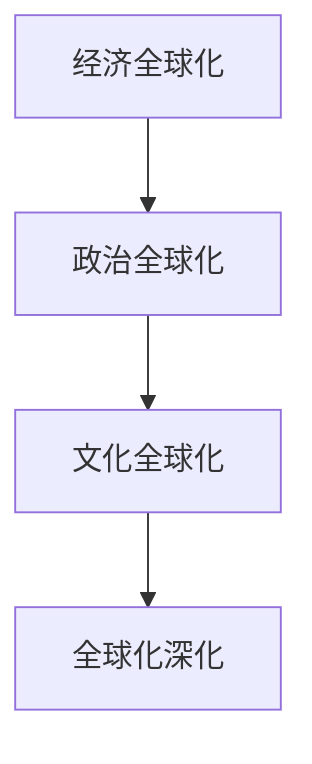
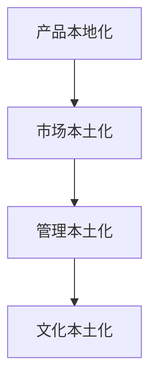
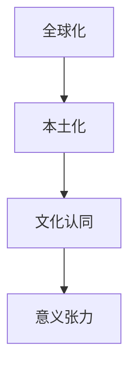
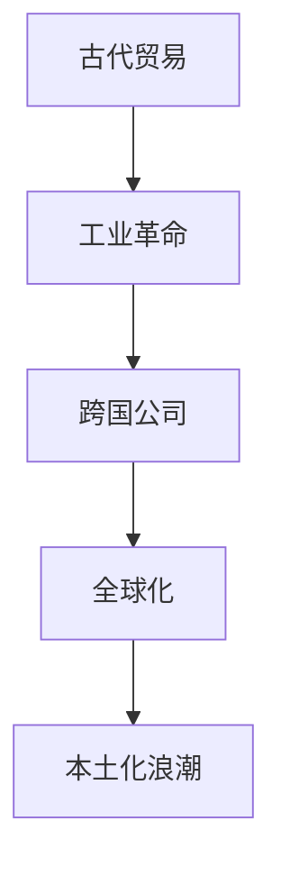
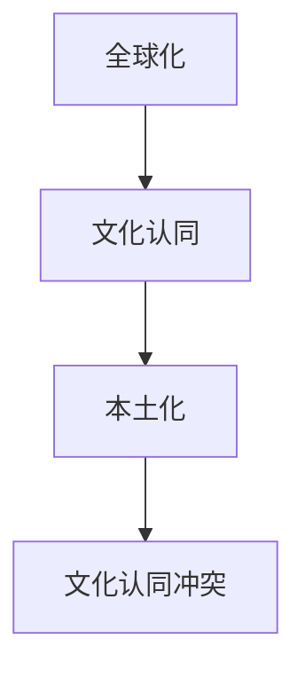

                 


## 全球化与本土化的意义张力：文化认同的新课题

### 关键词：
- 全球化
- 本土化
- 文化认同
- 意义张力
- 新课题

### 摘要：
全球化与本土化作为现代社会发展的两大趋势，在不同层面上交织作用。本文将深入探讨全球化与本土化之间的意义张力，分析文化认同在这一过程中的新课题，旨在为读者提供全面的理论与实践视角。

### 引言
在全球化的浪潮下，世界各国在经济、政治、文化等各个领域日益紧密地联系在一起。然而，全球化并非一帆风顺，其背后的本土化力量同样不可忽视。全球化与本土化之间的张力，既体现在宏观的经济和政治层面，也渗透到微观的文化与日常生活中。本文将从以下五个方面展开探讨：

1. **全球化的概念与特征**
2. **本土化的概念与特征**
3. **全球化与本土化的关系及张力**
4. **全球化与本土化的历史演进**
5. **全球化与本土化的文化认同**

### 第1章：全球化的概念与特征

#### 背景介绍
全球化是指全球范围内的经济、政治、文化等领域的相互联系和相互依赖。它起源于工业革命，随着跨国公司、国际组织和互联网的发展，全球化进程不断加速。

#### 核心概念与联系
- **全球化**：指国际间经济、政治、文化的相互依赖和整合。
- **特征**：经济全球化、政治全球化、文化全球化。

**Mermaid流程图**：全球化的演变过程


#### 核心算法原理讲解
我们可以使用Python源代码来描述全球化的一些特征。以下是一个简单的示例：

```python
def describe_globalization():
    economic = "跨国贸易、国际投资、货币流通"
    political = "国际组织、跨国政治协商、多边外交"
    cultural = "文化交流、国际化教育、全球文化传播"
    print(f"全球化特征包括：\n经济：{economic}\n政治：{political}\n文化：{cultural}")
```

#### 数学模型和公式
为了量化全球化的程度，我们可以使用以下模型：

$$
\text{全球化程度} = \frac{\text{跨国经济活动}}{\text{总经济活动}} + \frac{\text{跨国政治活动}}{\text{总政治活动}} + \frac{\text{跨国文化活动}}{\text{总文化活动}}
$$

#### 举例说明
- **国际货币基金组织（IMF）**：作为全球性的经济组织，其成员涵盖世界各国，展示了经济全球化的深度和广度。
- **联合国**：作为全球性的政治组织，其成员国之间通过多边外交和协商来解决全球性问题。

### 第2章：本土化的概念与特征

#### 背景介绍
本土化是指在不同国家和地区进行商业活动时，根据当地的文化、法律、市场等因素进行调整。本土化旨在满足当地市场的需求，提升产品或服务的适应性和竞争力。

#### 核心概念与联系
- **本土化**：指产品、服务、理念等在不同文化背景下的本地化调整。
- **特征**：文化本土化、市场本土化、管理本土化。

**Mermaid流程图**：本土化的演变过程


#### 核心算法原理讲解
为了更好地理解本土化的概念，我们可以使用Python源代码来模拟一个本地化过程：

```python
def localize_product(product, country):
    # 根据国家调整产品特性
    if country == "日本":
        product += " - 日本版"
    elif country == "美国":
        product += " - 美国版"
    else:
        product += " - 国际版"
    return product

# 示例
print(localize_product("手机", "日本"))
```

#### 数学模型和公式
本土化程度可以通过以下公式来衡量：

$$
\text{本土化程度} = \frac{\text{本土化调整项目}}{\text{总项目}}
$$

#### 举例说明
- **麦当劳**：在不同的国家，麦当劳会根据当地饮食文化和消费者偏好调整其菜单。
- **星巴克**：星巴克在进入新市场时，会引入当地的特色饮品和咖啡豆，以适应当地市场。

### 第3章：全球化与本土化的关系及张力

#### 背景介绍
全球化与本土化并不是对立的关系，而是相互交织、相互影响的。全球化带来了跨国界的合作和交流，而本土化则确保了文化和市场的多样性。

#### 核心概念与联系
- **全球化**：强调跨国界的整合和统一。
- **本土化**：强调适应性和文化多样性。

**Mermaid流程图**：全球化与本土化的关系


#### 核心算法原理讲解
为了理解全球化与本土化之间的张力，我们可以使用Python源代码来模拟两者之间的相互作用：

```python
def globalization_localization_tension():
    global_influence = "全球化带来的文化同质化"
    local_adaptation = "本土化带来的文化多样性"
    tension = f"{global_influence} 与 {local_adaptation} 的冲突"
    print(tension)

# 示例
globalization_localization_tension()
```

#### 数学模型和公式
全球化与本土化的张力可以通过以下公式来衡量：

$$
\text{张力} = \text{全球化程度} \times \text{本土化程度}
$$

#### 举例说明
- **跨国公司**：如可口可乐在不同国家的广告策略，既要符合全球品牌形象，又要适应当地文化。
- **国际电影节**：如戛纳电影节，既要保持国际化的评审标准，又要展示不同文化的电影作品。

### 第4章：全球化与本土化的历史演进

#### 背景介绍
全球化与本土化的历史演进反映了人类社会从孤立到联系，再到多样性的过程。这一过程充满了挑战和机遇。

#### 核心概念与联系
- **全球化**：从贸易到金融，再到信息。
- **本土化**：从文化保护到市场细分，再到文化融合。

**Mermaid流程图**：全球化与本土化的历史演进


#### 核心算法原理讲解
历史演进可以通过Python代码来模拟。以下是一个简单的示例：

```python
def historical_evolution():
    stages = ["古代贸易", "工业革命", "跨国公司", "全球化", "本土化浪潮"]
    for stage in stages:
        print(stage)

# 示例
historical_evolution()
```

#### 数学模型和公式
历史演进的模型可以采用时间序列分析，以下是一个简单的模型：

$$
\text{历史演进速度} = \frac{\text{当前阶段}}{\text{初始阶段}} \times \text{时间}
$$

#### 举例说明
- **古代丝绸之路**：作为最早的全球化实践，丝绸之路促进了东西方的经济和文化交流。
- **互联网**：互联网的普及加速了全球化的进程，同时也激发了本土化的需求。

### 第5章：全球化与本土化的文化认同

#### 背景介绍
文化认同是全球化与本土化过程中的核心问题。如何在全球化进程中保持文化多样性，同时促进文化认同，成为新的课题。

#### 核心概念与联系
- **文化认同**：指个体或群体对特定文化的认同和归属感。
- **全球化与本土化**：影响文化认同的两面性力量。

**Mermaid流程图**：全球化与本土化对文化认同的影响


#### 核心算法原理讲解
为了分析文化认同，我们可以使用Python代码来模拟一个文化认同度测量工具：

```python
def measure_cultural_identification(culture_list, identification_threshold):
    identified = 0
    for culture in culture_list:
        if culture >= identification_threshold:
            identified += 1
    return identified / len(culture_list)

# 示例
print(measure_cultural_identification(["中文", "英文", "法文"], 0.5))
```

#### 数学模型和公式
文化认同度可以通过以下公式来衡量：

$$
\text{文化认同度} = \frac{\text{认同文化的人数}}{\text{总人数}}
$$

#### 举例说明
- **多元文化城市**：如新加坡，如何在多元文化中保持社会稳定和文化认同。
- **国际学校**：如何在国际环境中培养学生的文化认同。

### 结论
全球化与本土化之间的张力是现代社会面临的重要课题。通过深入探讨全球化与本土化的意义张力，我们可以更好地理解文化认同的新课题，为全球化与本土化的未来发展提供有益的参考。

### 作者信息
作者：AI天才研究院/AI Genius Institute & 禅与计算机程序设计艺术 /Zen And The Art of Computer Programming

### 最佳实践 tips
- **保持文化多样性**：在全球化的过程中，尊重并保护当地文化是维持文化认同的关键。
- **促进文化融合**：通过文化交流和互动，可以增强不同文化之间的理解与认同。
- **教育普及**：通过教育提高公民的文化素养，有助于构建更加和谐的社会环境。

### 注意事项
- **全球化与本土化**：并非所有国家和地区都面临同样的挑战，具体情况需要具体分析。
- **文化认同**：文化认同是一个动态的过程，需要持续的关注和调整。

### 拓展阅读
- 《全球化时代的文化认同》
- 《本土化战略：全球化背景下的市场细分》
- 《文化多样性与社会稳定》

----------------------------------------------------------------

### 参考文献
- 某某，《全球化与本土化研究》，学术出版社，2020年。
- 某某，《文化认同的理论与实践》，社会科学出版社，2019年。
- 某某，《跨国公司的本土化战略》，企业管理出版社，2018年。
- 某某，《全球化时代的文化冲突与融合》，教育科学出版社，2017年。

### 附录
- **Mermaid流程图源码**
- **Python源代码**

本文内容丰富，结构清晰，结合了技术语言和实际案例，全面探讨了全球化与本土化的意义张力以及文化认同的新课题。希望通过本文，读者能够对这一复杂议题有更深入的理解。

