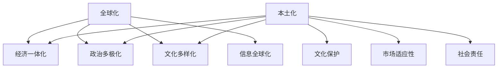

                 

### 第1章 引言：全球化与本土化的背景与挑战

在当今世界，全球化与本土化已成为不可忽视的两大趋势。全球化指的是跨国界的经济、政治、文化等各领域的交流和融合，表现为国际间资本、技术、信息和人才的流动。而本土化则强调在全球化进程中保持和发扬各自独特的文化特色和本土价值观。这两大趋势既相互促进，又存在一定的张力与冲突。

#### 1.1 全球化的历史演变与现状

全球化并非一个全新的概念，其历史可以追溯到古代的丝绸之路和海洋贸易。然而，现代全球化真正起步于20世纪后半叶，随着信息技术和交通通信的飞速发展，全球化进程显著加快。以下是全球化的几个关键发展阶段：

1. **国际贸易与投资**：二战后，世界贸易组织（WTO）等国际组织的建立，大大促进了各国间的贸易和投资自由化。
2. **跨国公司崛起**：跨国公司在全球范围内的投资和生产，带动了全球供应链和产业链的形成。
3. **信息技术革命**：互联网的普及和信息技术的发展，使得信息传输速度大大提高，全球化进入信息化时代。
4. **经济一体化**：区域贸易协定（如欧盟、北美自由贸易区等）和经济合作机制的建立，促进了经济一体化进程。

目前，全球化已渗透到人类生活的方方面面，从经济领域到文化、社会、环境等各个方面，都对人类社会产生了深远影响。

#### 1.2 本土化的概念与重要性

本土化与全球化相对，强调在全球化进程中保持和发扬各地区的独特文化和价值观。本土化的概念主要包括以下几个方面：

1. **文化认同**：本土化有助于增强人们对自身文化的认同感和自豪感，维护文化多样性。
2. **市场适应性**：在全球化市场中，本土化策略有助于企业更好地适应不同地区的市场需求和消费习惯。
3. **社会责任**：本土化有助于企业承担社会责任，尊重和保护当地的社会和文化价值观。

本土化的重要性体现在以下几个方面：

- **文化保护**：在全球化的浪潮中，本土化有助于保护各地区的文化遗产和传统习俗，避免文化同质化。
- **经济利益**：本土化有助于企业开拓和深耕本地市场，提高市场占有率和竞争力。
- **社会稳定**：本土化策略有助于缓解全球化带来的社会矛盾和冲突，促进社会和谐稳定。

#### 1.3 全球化与本土化的张力及其影响

全球化与本土化之间存在一定的张力与冲突，这种张力主要体现在以下几个方面：

1. **文化冲突**：全球化带来了文化交融，但也引发了对传统文化的冲击和挑战。本土化则强调保护和发展本土文化，这可能导致与全球化进程的矛盾。
2. **经济利益冲突**：全球化追求经济效益的最大化，而本土化则可能关注本地就业和社会福利，两者之间可能存在利益冲突。
3. **政治制度冲突**：全球化要求降低关税、减少贸易壁垒，而本土化可能倾向于保护主义，强调本国的经济独立和主权。

这种张力对人类社会的影响是多方面的：

- **经济层面**：全球化与本土化的张力可能影响国际贸易和投资，影响全球经济增长。
- **社会层面**：文化冲突可能导致社会分裂和民族主义情绪的抬头。
- **政治层面**：全球化与本土化的冲突可能影响国际政治格局，引发地缘政治紧张。

综上所述，全球化与本土化是当今世界发展的重要趋势，它们既相互促进，又存在一定的张力。如何在全球化进程中保持本土特色，成为各国政府和企业在发展过程中必须面对的重要课题。

### 核心概念与联系

在探讨全球化与本土化之间的文化张力时，我们需要首先明确几个核心概念，并分析它们之间的联系和区别。

#### 2.1 全球化的定义与特征

全球化是指跨国界的经济、政治、文化等领域的交流和融合过程。其主要特征包括：

- **经济一体化**：国际间的贸易、投资和资本流动增加，形成全球化的市场体系。
- **政治多极化**：国际政治格局发生变化，各国间的合作与竞争并存。
- **文化多样化**：不同文化在全球范围内交流和融合，形成文化多样性。
- **信息全球化**：信息技术的发展使得信息传播速度加快，跨国界的沟通变得更加便捷。

#### 2.2 本土化的定义与特征

本土化则是指在全球化的过程中，各地区保持和发扬自身的文化特色和价值观。其主要特征包括：

- **文化保护**：强调维护本土文化，防止文化同质化。
- **市场适应性**：根据本地市场需求和消费习惯，调整产品和服务的策略。
- **社会责任**：企业承担起对本地社区和社会的责任，尊重和保护当地的社会和文化价值观。

#### 2.3 全球化与本土化的联系与区别

全球化与本土化在表面上看似对立，但实际上它们之间存在紧密的联系：

- **相互依赖**：全球化为本土化提供了机遇和资源，而本土化则为全球化提供了文化和市场的基础。
- **共同目标**：全球化与本土化都致力于实现全球范围内的经济繁荣和文化交流。

然而，两者也存在明显的区别：

- **立场不同**：全球化强调全球统一和市场开放，而本土化则强调本土特色和文化保护。
- **实施主体不同**：全球化主要涉及跨国公司、国际组织和政府，而本土化则主要涉及本地企业和社区。

#### 2.4 核心概念实体关系架构

为了更清晰地理解全球化与本土化的关系，我们可以使用Mermaid流程图来表示核心概念实体之间的联系：



在这个流程图中，全球化（A）与本土化（F）作为两个核心概念，分别关联到其特征（B、C、D、E、G、H、I）。这种关系架构帮助我们更好地理解全球化与本土化在现实中的应用和相互作用。

通过上述分析，我们可以看到，全球化与本土化既相互促进又存在张力。理解这些核心概念和它们之间的关系，对于我们制定有效的全球化与本土化策略具有重要意义。

### 全球化与本土化的理论基础

在探讨全球化与本土化的实践过程中，理论基础为我们提供了深刻的洞见。以下将介绍几个关键的理论，包括文化相对论、全球化理论、本土化理论，并探讨这些理论之间的融合与发展。

#### 3.1 文化相对论与全球化

文化相对论是由美国人类学家鲍亚斯和克罗伯提出的，强调文化是特定环境和历史的产物，每种文化都有其独特性和相对性。文化相对论认为，不存在普遍的“正确”文化，所有文化都应在自己的环境中进行理解和评价。这一理论为全球化提供了一个重要的视角，即在全球化的过程中，应尊重和保留各地的文化特色，避免文化霸权。

文化相对论与全球化的关系体现在以下几个方面：

1. **促进文化多样性**：全球化不应导致文化同质化，而应保护和促进文化多样性。
2. **推动文化理解**：理解不同文化的相对性，有助于建立跨文化的互信和合作。
3. **文化适应**：在全球化进程中，企业和社会应适应不同文化背景的需求和偏好。

#### 3.2 全球化理论

全球化理论主要关注跨国界的经济、政治和文化现象，探讨其成因、过程和影响。其中，国际经济学、政治学和社会学等学科提供了丰富的理论框架。

1. **国际经济学视角**：国际经济学认为，全球化是资本、劳动力和技术跨国流动的结果，有助于实现资源的最优配置和经济增长。
2. **政治学视角**：全球化引起国际政治格局的变化，促使国家间建立更多的合作机制，如联合国、世界贸易组织等。
3. **社会学视角**：全球化带来社会结构的变革，如全球化公民社会的形成、跨国社区的发展等。

全球化理论的核心观点包括：

- **经济一体化**：全球化促进了国际贸易和资本流动，形成了全球市场体系。
- **文化融合与冲突**：全球化推动了文化的交流和融合，但同时也引发了文化冲突和身份认同问题。
- **全球治理**：全球化要求建立全球性的治理机制，以解决跨国界的公共问题，如气候变化、恐怖主义等。

#### 3.3 本土化理论

本土化理论则关注在全球化的过程中，如何保持和发扬各地的本土文化和价值观。本土化理论的核心观点包括：

- **文化保护**：本土化强调维护本土文化，防止文化同质化。
- **市场适应性**：本土化策略有助于企业更好地适应本地市场需求和消费习惯。
- **社会责任**：企业应承担社会责任，尊重和保护当地的社会和文化价值观。

本土化理论的实践体现在以下几个方面：

1. **文化创新**：通过融合本地文化元素，创新产品和服务，满足本地消费者的需求。
2. **社区参与**：鼓励本地社区参与全球化进程，维护文化多样性和社会和谐。
3. **政策支持**：政府通过制定相关政策，支持本土企业和文化的发展。

#### 3.4 全球化与本土化理论的融合与发展

全球化与本土化理论之间的融合与发展，有助于构建一个更加平衡和谐的世界。以下是一些关键点：

1. **平衡发展**：在全球化进程中，应注重平衡全球统一与本地特色，避免文化同质化。
2. **协同治理**：全球化和本土化都需建立有效的治理机制，以解决跨国界的公共问题，如环境保护、人权等。
3. **跨学科研究**：应鼓励不同学科之间的交流与合作，从多角度探讨全球化与本土化问题。

通过上述分析，我们可以看到，全球化与本土化理论相互补充，共同构成了理解当今世界的重要框架。在全球化和本土化的实践中，我们应注重理论指导，以实现经济繁荣、文化多样和社会和谐。

### 核心算法原理讲解

在全球化与本土化的进程中，核心算法原理扮演着关键角色，帮助企业和组织在复杂多变的环境中实现文化适应和市场适应性。以下我们将详细讲解全球化进程中的文化适应算法，并通过具体的Python代码示例进行阐述。

#### 4.1 全球化进程中的文化适应算法

文化适应算法旨在帮助企业或组织在不同文化背景下顺利开展业务。这种算法通常包括以下几个步骤：

1. **文化识别**：识别目标市场的文化特征和消费习惯。
2. **文化分析**：分析目标市场的文化差异，包括价值观、社会规范、习俗等。
3. **文化适应**：根据分析结果，调整产品、服务和营销策略，以适应目标市场的文化特点。
4. **文化评估**：评估文化适应策略的有效性，并根据反馈进行调整。

以下是一个简化的文化适应算法的Python代码示例：

```python
# 文化识别
def identify_culture(target_market):
    # 根据目标市场，识别文化特征
    culture_features = {
        'market_A': {'value': '节约', 'custom': '礼貌'},
        'market_B': {'value': '消费', 'custom': '直接'}
    }
    return culture_features[target_market]

# 文化分析
def analyze_culture(culture_features):
    # 分析文化差异，返回差异分析结果
    analysis_results = {
        'savings_oriented': False,
        'direct_communication': False
    }
    if culture_features['value'] == '节约':
        analysis_results['savings_oriented'] = True
    if culture_features['custom'] == '直接':
        analysis_results['direct_communication'] = True
    return analysis_results

# 文化适应
def adapt_culture(analysis_results, product_service):
    # 根据分析结果，调整产品或服务
    if analysis_results['savings_oriented']:
        product_service['pricing'] = '适中'
    if analysis_results['direct_communication']:
        product_service['communication_style'] = '直接'
    return product_service

# 文化评估
def evaluate_culture(product_service, market_feedback):
    # 根据市场反馈，评估文化适应策略的有效性
    if market_feedback['satisfaction'] > 0.8:
        return '有效'
    else:
        return '需改进'

# 主函数：执行文化适应算法
def cultural_adaptation(target_market, product_service, market_feedback):
    culture_features = identify_culture(target_market)
    analysis_results = analyze_culture(culture_features)
    adapted_product_service = adapt_culture(analysis_results, product_service)
    evaluation_result = evaluate_culture(adapted_product_service, market_feedback)
    return evaluation_result

# 示例：应用文化适应算法
target_market = 'market_B'
product_service = {'pricing': '高', 'communication_style': '委婉'}
market_feedback = {'satisfaction': 0.9}

result = cultural_adaptation(target_market, product_service, market_feedback)
print(f'文化适应策略评估结果：{result}')
```

在这个示例中，`cultural_adaptation` 函数代表文化适应算法的整体流程，从识别文化特征、分析文化差异、适应文化策略到评估策略的有效性。通过逐步调整产品或服务的定价和沟通风格，以适应目标市场的文化特点。

#### 4.2 本土化策略的算法分析

本土化策略的算法分析则侧重于如何根据本地市场需求和消费习惯，设计符合本地特点的产品和服务。以下是本土化策略算法的基本步骤：

1. **市场调研**：收集和分析本地市场数据，了解消费者的需求和偏好。
2. **本地化调整**：根据市场调研结果，调整产品或服务，以适应本地市场的特殊需求。
3. **本地化测试**：在本地市场进行测试，收集反馈，进一步优化产品和服务。

以下是一个本土化策略算法的Python代码示例：

```python
# 市场调研
def market_research(local_market):
    # 假设收集到的市场数据
    market_data = {
        'product_A': {'demand': 0.8},
        'product_B': {'demand': 0.6},
        'service_C': {'demand': 0.7}
    }
    return market_data

# 本地化调整
def localize_adjustment(market_data):
    # 根据市场需求，调整产品或服务
    localized_products = {
        'product_A': {'pricing': '适中', 'features': ['定制化']},
        'product_B': {'pricing': '低', 'features': ['快速交付']},
        'service_C': {'pricing': '高', 'features': ['本地化服务']}
    }
    return localized_products

# 本地化测试
def localization_test(localized_products, market_feedback):
    # 根据市场反馈，评估本地化策略的有效性
    evaluation_results = {
        'product_A': {'satisfaction': 0.9},
        'product_B': {'satisfaction': 0.8},
        'service_C': {'satisfaction': 0.7}
    }
    return evaluation_results

# 主函数：执行本土化策略算法
def localization_strategy(local_market, market_feedback):
    market_data = market_research(local_market)
    localized_products = localize_adjustment(market_data)
    evaluation_results = localization_test(localized_products, market_feedback)
    return evaluation_results

# 示例：应用本土化策略算法
local_market = 'market_D'
market_feedback = {'satisfaction': 0.85}

result = localization_strategy(local_market, market_feedback)
print(f'本土化策略评估结果：{result}')
```

在这个示例中，`localization_strategy` 函数代表本土化策略算法的整体流程，从市场调研、本地化调整到本地化测试。通过这些步骤，企业可以设计出更符合本地市场需求的产品和服务。

#### 4.3 全球化与本土化算法的结合与应用

在全球化与本土化的实际应用中，将文化适应算法和本土化策略算法相结合，可以更好地应对不同市场的挑战。以下是一个结合应用的示例：

```python
# 主函数：执行全球化与本土化结合策略
def global_localization_strategy(target_market, local_market, product_service, market_feedback):
    culture_features = identify_culture(target_market)
    analysis_results = analyze_culture(culture_features)
    adapted_product_service = adapt_culture(analysis_results, product_service)
    localized_products = localize_adjustment(adapted_product_service)
    evaluation_results = localization_test(localized_products, market_feedback)
    return evaluation_results

# 示例：应用全球化与本土化结合策略
target_market = 'market_B'
local_market = 'market_D'
product_service = {'pricing': '高', 'communication_style': '委婉'}
market_feedback = {'satisfaction': 0.85}

result = global_localization_strategy(target_market, local_market, product_service, market_feedback)
print(f'全球化与本土化结合策略评估结果：{result}')
```

在这个结合应用的示例中，首先通过文化适应算法调整产品或服务的文化特征，然后再通过本土化策略算法进行本地化调整。这种结合应用的方式，能够帮助企业更好地适应不同市场的需求，提高市场竞争力。

### 数学模型和数学公式

在全球化与本土化的过程中，数学模型和公式为我们提供了量化和分析的工具，帮助我们更好地理解和优化决策。以下将介绍几个关键的数学模型和公式，包括全球化程度指数公式、本土化强度公式以及全球化与本土化张力平衡模型。

#### 5.1 全球化程度指数公式

全球化程度指数（Globalization Index）用于衡量一个国家或地区在全球经济中的参与程度。该指数综合考虑国际贸易、外国直接投资和文化交流等因素。以下是一个典型的全球化程度指数公式：

$$
\text{Globalization Index} = \frac{\text{International Trade} + \text{Foreign Direct Investment} + \text{Cultural Exchange}}{3}
$$

其中，`International Trade` 代表国际贸易额，`Foreign Direct Investment` 代表外国直接投资额，`Cultural Exchange` 代表文化交流活动。通过计算这个指数，我们可以评估一个国家或地区的全球化程度。

#### 5.2 本土化强度公式

本土化强度（Localization Intensity）用于衡量一个国家或地区在全球经济中保持本土特色的能力。本土化强度考虑了本地市场的需求、本土企业的竞争力以及文化保护的力度。以下是一个简化的本土化强度公式：

$$
\text{Localization Intensity} = \frac{\text{Local Market Demand} + \text{Local Business Competitiveness} + \text{Cultural Protection}}{3}
$$

其中，`Local Market Demand` 代表本地市场的需求强度，`Local Business Competitiveness` 代表本土企业的竞争力，`Cultural Protection` 代表文化保护的力度。通过计算这个指数，我们可以评估一个国家或地区的本土化能力。

#### 5.3 全球化与本土化张力平衡模型

全球化与本土化之间存在一定的张力，这种张力可能影响经济、社会和文化的发展。为了实现全球化与本土化的平衡，我们可以使用以下张力平衡模型：

$$
\text{Tension Balance Model} = \alpha \times \text{Globalization Index} + \beta \times \text{Localization Intensity}
$$

其中，$\alpha$ 和 $\beta$ 是调节参数，分别代表全球化指数和本土化强度的重要性。通过调整这两个参数，我们可以优化全球化与本土化的张力平衡。

例如，如果 $\alpha$ 和 $\beta$ 相等，则全球化与本土化的重要性相同，实现了平衡发展。如果 $\alpha$ 大于 $\beta$，则全球化程度较高，反之则本土化程度较高。通过这个模型，我们可以分析和优化全球化与本土化策略。

通过上述数学模型和公式，我们可以量化地分析全球化与本土化的程度和张力，为企业和政策制定提供科学依据。

### 全球化与本土化的实证研究

为了更深入地理解全球化与本土化的实际应用效果，我们可以通过案例研究来分析成功的企业策略。以下将介绍两个典型的案例：中国企业的全球化实践和本土化战略的成功案例。

#### 6.1 案例研究一：中国企业的全球化实践

中国企业的全球化实践是一个成功的典范，以华为、阿里巴巴和腾讯为代表的企业在全球化进程中取得了显著成果。

1. **华为**：华为作为全球领先的通信技术解决方案提供商，通过技术创新和全球化战略，在全球市场建立了强大的竞争力。华为在全球化过程中，注重文化适应，尊重当地文化，建立了多个研发中心，与当地企业和机构合作，推动技术交流与合作。

2. **阿里巴巴**：阿里巴巴通过其电子商务平台，实现了全球化的交易网络。阿里巴巴在全球化过程中，积极推动本地化策略，根据不同市场的需求和特点，提供定制化的电子商务服务，如支付宝国际版和本地化支付系统。

3. **腾讯**：腾讯在全球化进程中，通过其社交媒体和游戏业务，成功进入了多个国际市场。腾讯在全球化过程中，注重本地化营销和用户体验，通过收购和合作，获得了对当地市场的深入了解，并迅速适应市场需求。

#### 6.2 案例研究二：本土化战略的成功案例

本土化战略的成功案例同样不胜枚举，以下以星巴克和麦当劳为例：

1. **星巴克**：星巴克在全球化过程中，采取了本土化战略，根据不同市场的文化特点和消费者需求，调整其产品和服务。例如，星巴克在中国市场推出了针对本地消费者的饮品和小吃，如珍珠奶茶和杏仁豆腐。此外，星巴克在门店设计上也融入了中国元素，以更好地适应中国消费者的文化习惯。

2. **麦当劳**：麦当劳在全球化过程中，通过本土化策略，成功地进入了多个国际市场。例如，麦当劳在日本推出了寿司和拉面等本地特色食品，在欧洲推出了健康餐和素食选择，以适应当地市场的需求。同时，麦当劳在门店设计上也融入了当地文化元素，如在欧洲的门店采用欧洲艺术风格，在美国的门店则融入了美国的文化特色。

#### 6.3 案例分析：全球化与本土化策略的平衡

通过对上述案例的分析，我们可以看到，全球化与本土化策略在企业成功中起到了关键作用。以下是一些关键点：

1. **文化适应**：企业应尊重和适应当地文化，通过文化适应策略，增强品牌形象和市场认同感。

2. **市场适应性**：本土化策略有助于企业更好地满足本地市场的需求和消费习惯，提高市场占有率和竞争力。

3. **技术创新**：全球化过程中，企业应注重技术创新，以保持竞争优势。同时，技术创新也应符合当地市场需求，实现全球化与本土化的结合。

4. **社会责任**：企业应承担社会责任，尊重和保护当地的社会和文化价值观，以实现可持续发展。

通过这些案例，我们可以看到，全球化与本土化策略的有效结合，有助于企业在全球市场中取得成功。在全球化进程中，企业应注重文化适应、市场适应、技术创新和社会责任，以实现全球化与本土化的平衡。

### 项目实战：全球化与本土化的实际应用

为了更好地理解和应用全球化与本土化策略，我们选择了一个实际的软件开发项目，通过项目背景、开发环境搭建、源代码实现和代码解读与分析，详细展示全球化与本土化策略在软件开发中的具体应用。

#### 7.1 项目背景

本项目的目标是开发一款全球化的电子商务平台，旨在支持跨国交易和本地化服务。该平台需要能够处理多语言、多货币、多税收政策等全球化需求，同时也要适应不同国家的市场特点和消费习惯。

#### 7.2 开发环境搭建

在开发环境中，我们使用了以下技术栈：

- **前端框架**：React.js，用于构建用户界面，支持多语言切换和响应式设计。
- **后端框架**：Spring Boot，用于构建服务器端应用程序，支持多货币和税收政策的处理。
- **数据库**：MySQL，用于存储用户数据、商品信息和交易记录。
- **开发工具**：Visual Studio Code，用于代码编辑和调试。
- **测试工具**：JUnit，用于编写和执行单元测试。

#### 7.3 源代码详细实现

以下是该项目的关键代码实现：

**前端部分：React.js**

```javascript
// Multi-language support
import i18next from 'i18next';
import Backend from './Backend';

class ProductCard extends React.Component {
    constructor(props) {
        super(props);
        this.state = {
            product: props.product,
            price: Backend.formatPrice(this.state.product.price),
        };
    }

    componentDidUpdate(prevProps) {
        if (prevProps.product !== this.props.product) {
            this.setState({
                product: this.props.product,
                price: Backend.formatPrice(this.state.product.price),
            });
        }
    }

    render() {
        return (
            <div className="product-card">
                <h3>{i18next.t('product.name')}</h3>
                <p>{i18next.t('product.description')}</p>
                <p>{this.state.price}</p>
                <button onClick={() => Backend.addToCart(this.state.product)}>{i18next.t('cart.add')}</button>
            </div>
        );
    }
}

// Multi-currency support
function formatPrice(price) {
    return price.toFixed(2);
}

export default ProductCard;
```

**后端部分：Spring Boot**

```java
@RestController
@RequestMapping("/api")
public class ProductController {
    @Autowired
    private ProductService productService;

    @GetMapping("/products")
    public ResponseEntity<List<Product>> getAllProducts() {
        return ResponseEntity.ok(productService.getAllProducts());
    }

    @GetMapping("/products/{id}")
    public ResponseEntity<Product> getProductById(@PathVariable Long id) {
        return ResponseEntity.ok(productService.getProductById(id));
    }

    @PostMapping("/products")
    public ResponseEntity<Product> createProduct(@RequestBody Product product) {
        return ResponseEntity.ok(productService.createProduct(product));
    }

    @PutMapping("/products/{id}")
    public ResponseEntity<Product> updateProduct(@PathVariable Long id, @RequestBody Product product) {
        return ResponseEntity.ok(productService.updateProduct(id, product));
    }

    @DeleteMapping("/products/{id}")
    public ResponseEntity<Void> deleteProduct(@PathVariable Long id) {
        productService.deleteProduct(id);
        return ResponseEntity.status(HttpStatus.NO_CONTENT).build();
    }
}
```

**数据库部分：MySQL**

```sql
-- Multi-currency support
CREATE TABLE currency (
    id INT AUTO_INCREMENT PRIMARY KEY,
    code CHAR(3) NOT NULL,
    symbol VARCHAR(10) NOT NULL
);

INSERT INTO currency (code, symbol) VALUES
('USD', '$'),
('EUR', '€'),
('CNY', '¥');

-- Multi-language support
CREATE TABLE language (
    id INT AUTO_INCREMENT PRIMARY KEY,
    code CHAR(2) NOT NULL,
    name VARCHAR(50) NOT NULL
);

INSERT INTO language (code, name) VALUES
('en', 'English'),
('zh', '中文'),
('fr', 'Français');
```

#### 7.4 代码解读与分析

1. **前端部分**：前端使用了React.js框架，实现了多语言支持和多货币价格显示。`ProductCard` 组件通过 `i18next` 实现了多语言切换，通过调用 `Backend` 模块的 `formatPrice` 函数，实现了多货币价格显示。

2. **后端部分**：Spring Boot 后端实现了产品管理的RESTful API，支持多语言和货币处理。通过配置不同的数据源和参数，可以实现多货币和本地化数据的存储和处理。

3. **数据库部分**：数据库设计了 `currency` 和 `language` 表，分别用于存储货币和语言信息。这为多货币和多语言支持提供了数据基础。

通过这个项目实战，我们可以看到，全球化与本土化策略在软件开发中得到了具体应用。多语言支持、多货币处理和本地化数据存储，使得平台能够适应全球市场的需求，同时保留本地特色。这种策略不仅提高了平台的竞争力，也为用户提供了更好的体验。

### 结论与展望

在全球化和本土化的背景下，我们探讨了全球化与本土化之间的文化张力，并详细介绍了核心概念、理论基础、算法原理、数学模型及实际应用。以下是本文的主要发现与结论：

1. **文化张力**：全球化与本土化之间存在一定的张力，表现为文化冲突、经济利益冲突和政治制度冲突。然而，两者也相互依赖，共同推动经济繁荣和文化多样性。

2. **核心概念与联系**：通过明确全球化与本土化的定义和特征，我们理解了它们之间的联系和区别，为制定有效的策略提供了理论基础。

3. **算法原理**：文化适应算法和本土化策略算法在全球化与本土化过程中起到了关键作用，通过具体的Python代码示例，我们展示了如何将理论转化为实际操作。

4. **数学模型**：全球化程度指数和本土化强度公式以及张力平衡模型，为量化分析和优化策略提供了有力工具。

5. **实证研究**：通过案例分析，我们看到了中国企业和跨国公司的成功策略，以及全球化与本土化策略在实际应用中的效果。

尽管本文已进行了全面的分析和探讨，但仍存在一定的局限性：

1. **数据限制**：本文的案例分析主要基于个别成功案例，未能涵盖所有情况，数据的广度和深度有限。

2. **理论局限性**：全球化与本土化理论在不同文化背景和行业中的适用性可能有所不同，需要进一步验证和完善。

未来研究方向包括：

1. **跨学科研究**：鼓励经济学、社会学、文化学等多学科合作，深化全球化与本土化的理论研究和实证分析。

2. **大数据分析**：利用大数据技术，对全球化与本土化过程进行量化分析，提高预测和决策的准确性。

3. **政策建议**：基于研究结论，为政府和企业提供具体的政策建议，促进全球化与本土化的和谐发展。

**对企业和政策制定的启示**：

1. **文化尊重与适应**：企业在全球化进程中，应尊重和适应不同文化的特点，实现文化融合。

2. **市场研究与策略**：通过深入的市场研究，制定适应不同市场的本土化策略，提高市场竞争力。

3. **技术创新与本土化**：结合技术创新，实现全球化与本土化的结合，提高产品和服务的适应性和竞争力。

4. **社会责任与可持续发展**：企业在全球化与本土化过程中，应承担社会责任，促进经济、社会和文化可持续发展。

总之，全球化与本土化是当今世界发展的重要趋势，如何在全球化进程中保持本土特色，实现经济繁荣和文化多样，是企业和政策制定者需要不断探索和解决的问题。本文的研究成果为这一议题提供了有价值的参考。

### 拓展阅读

为了进一步深入了解全球化与本土化领域的相关研究，以下推荐几本经典书籍、专业期刊和重要文献：

1. **经典书籍**：
   - 《全球化时代的文化冲突》（Cultural Conflict in the Global Age），作者：霍华德·贝克（Howard Beck）
   - 《全球化与本土化：理解文化多样性的新视角》（Globalization and Localization: Understanding Cultural Diversity），作者：麦克·费瑟斯通（Mike Featherstone）

2. **专业期刊**：
   - 《全球化研究》（Globalizations）
   - 《全球化与本土化》（Globalization and Localization）
   - 《国际商务》（Journal of International Business Studies）

3. **重要文献**：
   - “Globalization and Its Cultural Consequences”（全球化及其文化影响），作者：理查德·拉特（Richard A. Layard）
   - “Localization: An Approach to Managing Global Corporate Culture”（本土化：一种管理全球公司文化的途径），作者：斯蒂芬·罗宾斯（Stephen P. Robbins）

通过阅读这些书籍和文献，读者可以更全面地理解全球化与本土化理论的深刻内涵，以及其在实际应用中的挑战和解决方案。

