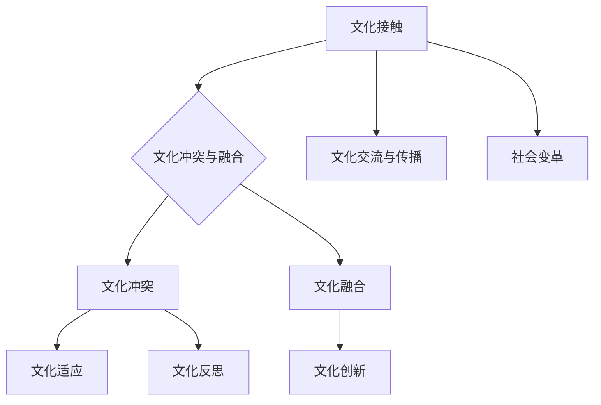
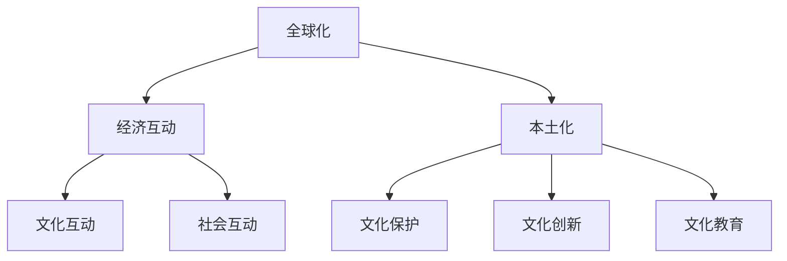
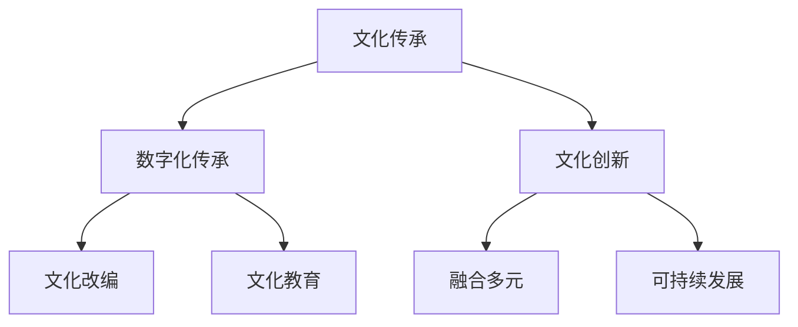

                 

### 引言

#### 1.1 全球化与文化多样性

全球化，作为一个多维度的过程，不仅仅涉及经济和技术的融合，还深刻影响着文化的传播与交流。全球化可以被定义为国际间经济、社会、政治和文化的相互联系与互动的不断加深[1]。随着全球化的推进，文化多样性也随之增加，各种文化元素在全球范围内得以传播和互动，从而形成了多元文化共存的新局面。

文化多样性，是指不同文化群体在价值观、语言、传统、习俗和艺术等方面的差异与多样性。其重要性在于，它不仅丰富了人类社会的精神世界，还为全球化的深入发展提供了文化支撑[2]。在全球化的浪潮中，文化多样性扮演着双重角色：一方面，它有助于促进不同文化之间的理解与包容；另一方面，它也可能导致文化同质化，使本土文化面临被边缘化的风险。

#### 1.2 全球化与本土化的关系

全球化与本土化并非相互对立的概念，而是存在紧密的联系。全球化带来了全球范围内的文化流动和融合，使文化传播的速度和范围得以扩大。然而，全球化过程中的文化同质化趋势也引发了人们对本土文化保护的重视。本土化，则是指在全球化背景下，针对本土文化进行传承和创新，以保持文化特色和多样性[3]。

全球化与本土化的关系可以理解为一种张力关系。全球化推动文化的流动和融合，带来文化多样性的扩展；而本土化则强调文化的独特性和传承，努力保持文化的本土特色。这种张力关系在全球化的不同阶段和不同文化背景下呈现出多样化的形式，如文化冲突、文化融合和文化创新等。

#### 1.3 文章目的与结构

本文旨在探讨全球化与本土化在开放中保持文化特色的问题。文章将首先介绍全球化与文化多样性的基本概念和关系，接着分析全球化中的文化张力及其表现形式。随后，文章将讨论如何在全球化的背景下保持文化特色，并提出相应的策略和方法。最后，文章将通过具体的案例研究，分析全球化与本土化在不同文化背景下的实际应用，以总结和展望未来全球化与本土化的发展趋势。

文章结构如下：

1. 引言
2. 核心概念与联系
3. 全球化与本土化的数学模型
4. 文化适应算法与本土化策略
5. 全球化与本土化的项目实战
6. 案例分析
7. 总结与展望

通过上述结构，本文希望为读者提供一个全面、深入的全球化与本土化分析视角，以期为相关领域的研究和实践提供参考。

#### 1.4 背景介绍

全球化作为一种全球性的现象，已经深刻地改变了我们的世界。它不仅仅是经济贸易的扩展，更涉及到社会、文化、政治等各个层面的互动和融合。在全球化进程中，文化交流成为一个重要方面。不同国家和地区的文化在相互接触和交流中，不仅得以传播和推广，还可能发生碰撞和融合。

文化多样性作为全球化的重要特征之一，不仅丰富了人类社会的精神生活，还推动了全球化进程的多样性和包容性。然而，全球化也带来了文化同质化的风险。随着跨国公司和全球媒体的影响，一些地方文化可能面临被边缘化和同质化的压力。这种文化同质化趋势使得保持本土文化特色成为一个重要的课题。

在全球化的大背景下，保持本土文化特色不仅是对文化多样性的维护，也是对文化传承和创新的重要体现。文化传承是通过代际传递和本土化实践，保持文化传统的生命力；而文化创新则是在全球化的互动中，对本土文化进行创新和发展，使其更具时代性和国际影响力。

保持本土文化特色的方法和策略包括文化保护、文化教育和文化创新等方面。文化保护主要通过立法和政策措施，保护本土文化遗产和传统；文化教育则通过教育体系的完善，培养人们对本土文化的认同感和责任感；文化创新则通过文化创意产业的推动，使本土文化在全球化的背景下焕发新的活力。

总之，全球化与本土化的文化张力是一个复杂而动态的过程。在全球化的浪潮中，保持本土文化特色既是对文化多样性的维护，也是对全球化发展的重要回应。通过深入探讨全球化与本土化的关系，本文希望能够为这一领域的研究和实践提供有益的参考。

#### 1.5 关键词

- 全球化
- 文化多样性
- 本土化
- 文化张力
- 文化传承
- 文化创新
- 文化适应
- 数学模型

#### 1.6 摘要

本文探讨了全球化与本土化在开放中保持文化特色的问题。首先，介绍了全球化的基本概念和影响，分析了全球化中的文化多样性及其重要性。接着，讨论了全球化与本土化的关系，提出了全球化中的文化张力及其表现形式。随后，本文提出了保持文化特色的方法和策略，包括文化保护、文化教育和文化创新等方面。最后，通过具体案例研究，分析了全球化与本土化在不同文化背景下的实际应用，总结了全球化与本土化的未来发展趋势。本文旨在为全球化背景下保持文化特色提供理论指导和实践参考。

### 第1章：引言

#### 1.1 全球化与文化多样性

全球化，作为一种全球性的趋势，不仅改变了经济、政治和社会的格局，也深刻影响了文化的传播与发展。全球化可以定义为国际间经济、社会、政治和文化的相互联系与互动的不断加深。全球化进程的加速，使得各国之间的文化交流变得更为频繁和多样。在这个过程中，文化多样性得到了极大的扩展，不同国家和地区的文化元素在全球范围内得以传播和融合。

文化多样性是指不同文化群体在价值观、语言、传统、习俗和艺术等方面的差异与多样性。在全球化的背景下，文化多样性不仅是人类社会发展的重要资源，也是全球化过程中不可或缺的组成部分。文化多样性有助于促进不同文化之间的理解与包容，增强社会的凝聚力。同时，它也为全球化提供了丰富的文化资源和创新动力。

全球化对文化多样性的影响是多方面的。一方面，全球化使得文化流动更加频繁，不同文化之间的互动和交流变得更加密切。这使得各种文化元素在全球范围内得以传播，丰富了人类的文化遗产。另一方面，全球化也带来了文化同质化的风险。跨国公司和全球媒体的扩散，可能导致一些强势文化对其他文化的同化，使一些地方文化面临被边缘化的风险。

文化多样性在全球范围内的扩展，也促进了全球文化的相互理解和融合。通过文化交流，人们能够更好地理解其他文化的背景和内涵，增进相互间的信任和尊重。这种文化理解有助于缓解文化冲突，促进全球和平与发展。然而，全球化中的文化同质化趋势也引发了对文化多样性的关注和反思。为了保护文化的多样性，各国和地区需要采取相应的措施，确保本土文化在全球化过程中得到传承和发展。

#### 1.1.1 全球化的定义与影响

全球化是一个多维度的过程，它不仅仅涉及经济和技术的融合，还涵盖了社会、文化和政治的互动。全球化的定义有多种，但普遍认为其核心在于国际间相互依赖的加深和全球一体化的进程。全球化可以理解为各国和地区在经济、社会、政治和文化等领域日益紧密的联系和互动。

首先，全球化对经济产生了深远的影响。全球化促进了国际贸易和投资的自由化，降低了贸易壁垒，使得商品和资本在全球范围内自由流动。这不仅推动了全球经济的增长，也促进了各国和地区经济的发展。同时，全球化也加剧了国际竞争，使得企业需要不断提升自身的竞争力，以适应全球市场的需求。

其次，全球化对社会的影响也是显著的。全球化使得人们的思想观念和生活方式发生了变化，不同文化之间的交流和融合变得更加频繁。这种文化互动不仅丰富了人们的生活体验，也促进了社会多元化和包容性的发展。然而，全球化也带来了一些社会问题，如文化同质化、社会不平等和移民问题等。

在全球化的背景下，文化多样性得到了极大的扩展。文化多样性不仅体现在语言、宗教和艺术等方面，还包括价值观、传统和社会习俗。全球化使得这些文化元素在全球范围内得以传播和共享，丰富了人类的文化遗产。然而，全球化也带来了文化同质化的风险。一些强势文化在全球范围内扩散，可能导致其他文化的边缘化和同质化。

#### 1.1.2 文化多样性的概念与重要性

文化多样性是指不同文化群体在价值观、语言、传统、习俗和艺术等方面的差异与多样性。文化多样性是人类社会的基本特征之一，它不仅反映了人类社会的多元化和包容性，也是人类社会发展和进步的重要动力。文化多样性的重要性体现在以下几个方面：

首先，文化多样性是人类社会精神生活的重要资源。各种文化元素的存在，使得人类的生活更加丰富多彩，人们可以通过不同的文化形式来表达自己的思想和情感。文化多样性为人们提供了多样的审美体验，丰富了人类的精神世界。

其次，文化多样性有助于促进不同文化之间的理解和包容。通过文化交流，人们能够更好地理解其他文化的背景和内涵，增进相互间的信任和尊重。这种文化理解有助于缓解文化冲突，促进全球和平与发展。

此外，文化多样性也是经济发展的重要动力。文化多样性为企业和行业提供了丰富的创意资源，促进了文化创意产业的发展。文化创意产业不仅创造了就业机会，也推动了经济的多元化和可持续发展。

最后，文化多样性是人类社会可持续发展的重要保障。在全球化的背景下，保持文化多样性有助于维护社会生态系统的平衡，促进文化的传承和创新。通过保护文化多样性，我们可以确保不同文化在全球化过程中得到传承和发展，为人类的未来发展提供坚实的文化基础。

#### 1.1.3 全球化与本土化的关系

全球化与本土化是两个看似对立但又紧密联系的概念。全球化指的是国际间经济、社会、文化和政治相互联系的加深和扩展，而本土化则强调在全球化背景下保持和传承本土文化的特色。在全球化的浪潮中，本土化不仅是对文化多样性的维护，也是对文化传承和创新的重要回应。

首先，全球化与本土化之间的张力关系体现在文化流动和融合的过程中。全球化推动了文化的流动和传播，各种文化元素在全球范围内得以扩散和融合。然而，这种文化融合也可能导致本土文化的同质化和丧失独特性。为了保持本土文化的特色，本土化应运而生，它强调在全球化背景下对本土文化的保护和传承。

其次，全球化与本土化的互动关系还体现在经济和社会层面。全球化带来了跨国公司和全球供应链的发展，推动了经济的全球化。然而，本土化也促进了地方经济的繁荣，通过发展本土产业和促进地方经济发展，保持文化特色和多样性。这种经济上的平衡有助于在全球化和本土化之间找到平衡点。

在全球化和本土化之间，文化张力也扮演着重要的角色。文化张力指的是不同文化在互动过程中产生的冲突与融合。在全球化的背景下，文化张力可能表现为文化冲突，如文化差异引起的误解和冲突。然而，通过有效的文化适应和融合，文化张力也可以转化为文化创新，推动文化的进步和发展。

总的来说，全球化与本土化的关系是一种动态的、相互作用的关系。在全球化的过程中，保持本土文化特色不仅是对文化多样性的维护，也是对全球化发展的重要回应。通过有效的文化适应和融合，我们可以实现全球化与本土化的良性互动，推动文化的传承和创新。

#### 1.2 全球化中的文化张力

在全球化进程中，文化张力是一个不可避免的现象。文化张力指的是不同文化在相互接触和融合过程中产生的冲突与调和。这种文化张力在全球化的各个方面都有所体现，从经济、政治到社会和文化领域，无不受到其影响。

首先，文化张力的表现形式之一是文化冲突。全球化带来了不同文化之间的频繁接触和交流，但同时也可能引发文化差异的误解和冲突。例如，跨国公司的全球化扩张可能导致本土文化的同质化，使得一些传统文化受到冲击。此外，全球化进程中的语言和文化差异也可能引发社会矛盾，影响国际关系的稳定性。

其次，文化张力还表现为文化融合。全球化推动了文化的传播和交流，不同文化在互动中逐渐融合，形成了新的文化形式。这种文化融合不仅丰富了人类的文化遗产，也为全球化带来了新的动力。例如，国际文化交流活动、跨国婚姻和全球化媒体等都促进了不同文化之间的相互理解和融合。

然而，文化张力并非总是消极的。在某些情况下，文化张力可以转化为文化创新。通过不同文化的碰撞和融合，新的创意和思想得以产生，推动了文化的发展。例如，全球化背景下的文化创意产业，通过融合不同文化的元素，创造出独具特色的艺术作品和商业产品，推动了文化的创新和进步。

#### 1.2.1 全球化对本土文化的影响

全球化对本土文化的影响是复杂而深远的。全球化进程的加速，使得本土文化面临着前所未有的挑战和机遇。一方面，全球化为本土文化提供了更广阔的传播平台和交流机会，有助于本土文化的国际化和多元化。另一方面，全球化也带来了一定的文化冲击，可能对本土文化造成同质化和边缘化的风险。

首先，全球化对本土文化的影响体现在文化认同感的减弱。随着全球化的推进，跨国文化交流和融合越来越频繁，一些人可能逐渐忽视本土文化，转而接受全球性的文化价值观。这种文化认同感的减弱，可能导致本土文化的传承和发展面临困难。

其次，全球化对本土文化的影响还表现在文化多样性的减少。在全球化的浪潮中，一些强势文化可能占据主导地位，导致其他文化逐渐被边缘化。这种现象不仅削弱了文化的多样性，也可能对全球文化的平衡和稳定造成影响。

然而，全球化也带来了本土文化传承和发展的新机遇。全球化进程中的文化交流和传播，使得本土文化得以在全球范围内得到关注和认可。例如，一些本土文化元素通过全球媒体和互联网的传播，吸引了更多的关注和兴趣。这种关注不仅有助于本土文化的传承，也为文化的创新发展提供了动力。

#### 1.2.2 全球化中的文化冲突与融合

在全球化过程中，文化冲突与融合是不可避免的两种现象。文化冲突指的是不同文化在接触和互动中，由于价值观、信仰、习俗等方面的差异而产生的矛盾和冲突。文化融合则是指不同文化在相互接触和交流中，通过相互适应和融合，形成新的文化现象。

文化冲突的原因多样。首先，文化差异是文化冲突的根本原因。不同文化在价值观、信仰、习俗等方面的差异，可能导致彼此之间的误解和冲突。其次，全球化进程中的文化碰撞也可能加剧文化冲突。由于全球化的加速，不同文化在更广泛的范围内进行交流，这种碰撞可能引发文化认同危机和冲突。

文化融合的原因则在于文化互动和交流。全球化进程中的文化交流，使得不同文化之间有了更多的接触和了解，从而促进了文化的融合。文化融合不仅丰富了人类的文化遗产，也为全球化带来了新的动力。例如，跨国文化交流活动、全球化的媒体平台和互联网等，都为文化的融合提供了便利。

文化冲突与融合的关系是复杂的。一方面，文化冲突可能是文化融合的前提。通过冲突，不同文化能够更好地了解彼此，从而找到融合的路径。另一方面，文化融合也可能缓解文化冲突。通过文化的相互适应和融合，可以减少文化差异带来的矛盾和冲突。

总的来说，全球化中的文化冲突与融合是一个动态的过程。文化冲突与融合不仅反映了全球化进程中文化的多样性和复杂性，也为全球文化的进步和发展提供了动力。通过理解和应对文化冲突与融合，我们可以更好地推动全球文化的和谐发展。

#### 1.2.3 文化张力的来源与表现形式

文化张力的来源可以从多个方面进行分析。首先，文化差异是文化张力的重要来源。不同文化在价值观、信仰、习俗、传统等方面存在差异，这种差异可能导致文化间的误解和冲突。例如，不同文化对于时间观念、个人主义与集体主义的理解可能截然不同，这会导致在国际交流和合作中产生摩擦。

其次，全球化和文化交流的加剧也是文化张力的重要来源。全球化使得不同文化更加紧密地联系在一起，文化交流变得更加频繁。然而，这种交流也可能导致文化冲突。例如，全球化背景下，一些本土文化可能受到强势文化的冲击，导致文化同质化，进而引发本土文化的保护主义情绪。

文化张力的表现形式多种多样，主要可以分为以下几个方面：

1. **文化冲突**：文化冲突是文化张力最直接的表现形式。在全球化过程中，不同文化之间的价值观、信仰和行为规范可能存在根本性的差异，这可能导致文化冲突。例如，宗教信仰的差异可能引发社会冲突，习俗的不同可能引发文化摩擦。

2. **文化适应**：为了在全球化背景下保持文化的特色，文化适应成为一种必要的形式。文化适应指的是个体或群体在新的文化环境中，调整自己的行为和观念，以适应新的文化环境。这种适应可能涉及语言、饮食、礼仪等方面，有助于减少文化张力。

3. **文化融合**：文化融合是另一种文化张力的表现形式。在全球化的过程中，不同文化在相互接触和交流中，通过相互借鉴和融合，形成新的文化现象。文化融合不仅有助于文化的多样性，也推动了全球文化的进步。

4. **文化创新**：文化创新是文化张力转化为积极动力的一个重要方面。通过不同文化的碰撞和融合，新的创意和思想得以产生，推动了文化的创新和发展。例如，全球化背景下的文化创意产业，通过融合不同文化的元素，创造出独具特色的艺术作品和商业产品。

文化张力不仅反映在个体和群体层面，也体现在国家和社会层面。在国际关系中，文化张力的存在可能导致外交摩擦和冲突。例如，不同国家之间的文化差异可能影响国际政治的稳定和合作。

总的来说，文化张力的来源与表现形式是多方面的，它既反映了全球化进程中的文化多样性和复杂性，也为文化的创新和发展提供了动力。通过理解和应对文化张力，我们可以更好地推动全球文化的和谐发展。

#### 1.2.4 全球化中的文化适应与对策

在全球化进程中，文化适应成为了一个不可避免的现象。文化适应指的是个体、群体或组织在新的文化环境中，通过调整行为和观念，以适应和融合新文化的过程。文化适应的必要性在于，它不仅有助于个体和群体的心理健康，还能促进全球化背景下的社会和谐与进步。

首先，文化适应的重要性体现在以下几个方面。一方面，文化适应有助于个体在全球化背景下实现个人发展和职业成功。通过理解并适应新文化的价值观、习俗和规则，个体能够更好地融入当地社会，提高社交能力和职业竞争力。另一方面，文化适应也有助于群体和组织的跨文化沟通与协作。在一个多元化的工作环境中，文化适应能够促进团队成员之间的理解与合作，提高组织的整体效能。

为了实现有效的文化适应，可以采取以下策略：

1. **文化意识提升**：通过教育和培训，提高个体和群体的文化意识，了解和尊重不同文化的特点和价值。这有助于减少文化误解和冲突，促进文化包容与和谐。

2. **跨文化沟通**：建立有效的跨文化沟通机制，确保信息在不同文化背景下能够准确传达。这包括使用简单明了的语言、尊重文化差异、避免文化偏见等。

3. **文化包容**：在组织和社会层面，建立文化包容的环境，鼓励多样性和个性化。通过设立多元文化活动和项目，促进不同文化之间的互动和交流，增强文化认同感。

4. **文化调适**：在适应新文化时，个体和群体可以采取灵活的策略，如调整行为模式、学习新习俗和价值观等。这有助于个体在新的文化环境中找到平衡，减少文化冲击。

具体案例方面，许多跨国公司和国际化组织都采取了有效的文化适应策略。例如，国际巨头微软在全球化过程中，注重员工的跨文化培训，通过组织跨文化工作坊和研讨会，提高员工的文化适应能力。此外，许多国际化企业还设立了多元文化委员会，负责处理和协调跨文化问题，确保全球化进程的顺利进行。

总的来说，全球化中的文化适应是一个复杂而动态的过程。通过有效的文化适应策略，我们可以更好地应对全球化带来的挑战，实现文化的和谐发展。

#### 1.2.5 全球化中的文化创新

全球化不仅推动了文化的传播和交流，还激发了文化的创新。在全球化的背景下，文化创新是指通过融合不同文化的元素，创造新的文化形式和创意产品，以满足不断变化的社会需求。文化创新在全球化中扮演着重要角色，它不仅丰富了人类的文化遗产，还推动了经济的繁荣和社会的发展。

首先，文化创新的定义和表现形式多样。文化创新可以表现为艺术创作、文学作品、电影、音乐、设计等各个领域。例如，国际化的电影产业通过融合不同文化的元素，创造出具有全球影响力的作品，如好莱坞大片经常融合东西方文化的元素，吸引了全球观众。此外，国际时尚品牌也通过融合不同文化的风格，创造出独具特色的设计，赢得了全球市场的认可。

文化创新的动力主要来自于全球化带来的文化交流和融合。全球化使得不同文化之间的接触和交流更加频繁，各种文化元素得以相互借鉴和融合，从而激发了新的创意和灵感。例如，国际化的科技公司和初创企业通过借鉴不同文化的技术和理念，创造出具有创新性的产品和服务，推动了全球科技的发展。

文化创新的重要性体现在以下几个方面：

1. **文化多样性的促进**：文化创新丰富了人类的文化遗产，促进了文化多样性的发展。通过文化创新，各种文化元素得以在全球范围内传播和融合，使得人类能够更好地理解和尊重不同文化。

2. **经济价值的创造**：文化创新为经济带来了巨大的价值。文化创意产业已经成为许多国家和地区的重要经济支柱，通过文化创新，企业能够创造出具有市场竞争力的产品和服务，推动经济的繁荣。

3. **社会发展的推动**：文化创新有助于推动社会的进步和发展。通过文化创新，人们能够更好地满足社会需求，解决社会问题，提高生活质量。

为了实现文化创新，可以采取以下策略：

1. **文化交流和融合**：鼓励不同文化之间的交流和融合，通过举办国际文化交流活动、艺术展览和文化节等，促进文化的创新和传播。

2. **创意人才的培养**：培养具有创新意识和跨文化能力的人才，鼓励他们在不同文化的背景下进行创意创作。

3. **政策支持和资金投入**：政府和企业可以通过提供政策支持和资金投入，鼓励文化创新，为文化创新提供良好的环境和条件。

总的来说，全球化中的文化创新是一个动态而充满活力的过程。通过有效的文化创新策略，我们可以更好地应对全球化带来的挑战，推动文化的传承和发展，实现经济的繁荣和社会的进步。

### 1.3 保持文化特色的方法与策略

在全球化的浪潮中，保持文化特色不仅是对文化多样性的维护，也是对文化传承和创新的重要体现。以下将探讨一些有效的方法与策略，帮助在开放中保持文化特色。

#### 1.3.1 本土化的定义与重要性

本土化是指在全球化过程中，针对本土文化进行传承和创新，以保持其特色的过程。本土化的核心在于对本土文化的深刻理解和对文化传承的重视。它不仅仅是对传统文化的简单复制，更是在全球化背景下对本土文化的适应和创新。

本土化的重要性体现在以下几个方面：

1. **文化多样性的维护**：本土化有助于保护各种文化的独特性和多样性，避免文化同质化。通过本土化，我们可以确保不同文化在全球化进程中得到传承和发展。

2. **文化认同感的增强**：本土化有助于增强个体和群体对自己文化的认同感。在全球化的背景下，本土化能够帮助人们更好地理解、尊重和传承本土文化，从而增强文化自信。

3. **文化创新的动力**：本土化不仅是对传统文化的保护，也是对文化创新的重要推动力。通过本土化，文化传统可以在新的时代背景下焕发新的活力，为文化创新提供丰富的资源。

#### 1.3.2 本土化与全球化的平衡

在全球化的背景下，本土化和全球化并不是相互对立的概念，而是需要相互平衡和协调的关系。以下是一些实现本土化与全球化平衡的方法：

1. **文化融合**：在保持本土文化特色的同时，融合全球化的元素。例如，在文化产业中，可以借鉴国际化的商业模式和传播手段，同时保留本土的文化特色。

2. **文化适应**：针对全球化的需求，对本土文化进行适当的调整和适应。例如，在国际市场中推广本土文化产品时，可以结合目标市场的文化习惯和消费偏好，实现文化的适应性。

3. **文化创新**：在全球化过程中，通过创新推动本土文化的现代化和发展。例如，通过现代科技手段，如数字媒体和互联网，推广本土文化，使其更具国际影响力。

#### 1.3.3 本土化的策略与实践

实现本土化需要采取一系列策略和实践，以下是一些具体的建议：

1. **文化保护政策**：制定和实施文化保护政策，确保本土文化遗产和传统得到有效保护和传承。例如，可以通过立法保护非物质文化遗产，建立文化保护区等。

2. **文化教育**：加强文化教育，培养人们对本土文化的认同感和责任感。例如，通过学校课程、文化活动等方式，普及本土文化知识。

3. **文化产业**：发展文化产业，推动本土文化的经济化和发展。例如，通过文化创意产业，将本土文化元素融入艺术作品、设计产品和旅游服务中，实现文化的经济价值。

4. **跨文化交流**：积极参与跨文化交流活动，增进本土文化与国际文化的互动和融合。例如，通过国际文化交流项目，促进本土文化在全球范围内的传播和认可。

总之，保持文化特色需要在全球化的背景下采取有效的本土化策略。通过文化保护、文化教育、文化创新和跨文化交流等多方面的努力，我们可以实现本土化与全球化的平衡，推动文化的传承和发展。

### 1.3.4 文化传承与创新的结合

在全球化的背景下，文化传承与创新是保持文化特色的重要手段。文化传承指的是将本土文化的传统、价值观和习俗传递给后代，确保文化在历史长河中得以延续；而文化创新则是在传承的基础上，对文化进行创造性的发展和更新，使其适应现代社会的需求。

#### 1.3.4.1 文化传承的重要性

文化传承是维护文化多样性和独特性的基础。通过文化传承，我们可以保存和传递民族的历史记忆、精神财富和智慧结晶。例如，中国的传统文化包括诗词、书法、绘画等，这些都是中华民族几千年文化传承的宝贵遗产。通过教育、节庆活动和文化遗产保护等措施，我们可以有效地传承这些文化。

#### 1.3.4.2 文化创新的概念与原则

文化创新是指在传承的基础上，结合现代科技和社会发展需求，对传统文化进行创造性转化和发展。文化创新的原则包括：

1. **尊重传统**：在创新过程中，尊重和保护传统文化的核心价值和精髓。
2. **适应现代**：使传统文化适应现代社会的需求，满足人们对于文化娱乐、教育和审美的需求。
3. **融合多元**：通过吸收和融合其他文化的元素，创造出具有时代特色和全球影响力的文化产品。

#### 1.3.4.3 文化传承与创新的结合

文化传承与创新并不是相互独立的，而是需要紧密结合。以下是一些实现文化传承与创新结合的方法：

1. **数字化传承**：利用数字技术对传统文化进行数字化保存和传播，如建立在线博物馆、虚拟展览等，使传统文化资源更加便捷地获取。
2. **文化改编**：将传统文化元素融入现代艺术、设计、音乐等形式，创作出新的文化作品，如现代京剧、民族音乐创作等。
3. **文化教育**：通过学校教育和社会教育，将传统文化知识融入现代教育体系中，培养学生的文化认同感和创新意识。
4. **跨文化交流**：通过国际文化交流活动，将本土文化推向全球，同时吸收其他文化的优秀元素，促进文化的全球化与本土化相结合。

#### 1.3.4.4 案例分析

以中国的传统节日——春节为例，春节作为中国文化的重要组成部分，不仅传承了丰富的传统文化，还通过不断创新焕发出新的活力。近年来，随着科技的发展，春节庆祝活动融入了现代元素，如数字化红包、线上拜年等。这些创新形式不仅保留了传统文化的核心价值，还适应了现代社会的生活方式和需求，使得春节在全球范围内得到了更多的关注和喜爱。

总之，文化传承与创新是保持文化特色的重要途径。通过结合传统文化和现代创新，我们可以使文化在全球化进程中焕发新的生命力，实现文化的可持续发展。

#### 1.3.5 全球化背景下的文化自信

在全球化背景下，文化自信是一个国家或地区在文化传承和创新中表现出的坚定信念和积极态度。文化自信不仅是对本土文化的认同和自豪，也是对外来文化的包容和借鉴。它在全球化的浪潮中具有重要意义，能够帮助一个国家或地区在保持文化特色的同时，积极参与国际文化交流，推动文化的多样性和发展。

首先，文化自信有助于维护本土文化的独特性和多样性。在全球化的过程中，各种文化相互影响和融合，一些本土文化可能会面临被边缘化和同质化的风险。文化自信能够帮助人们坚定文化传承的信念，保护本土文化的核心价值和特色，防止文化的同质化。

其次，文化自信是文化创新的重要动力。一个有文化自信的国家或地区，更愿意在传承的基础上进行创新，通过融合不同文化的元素，创造出具有时代特色和全球影响力的文化产品。例如，中国的传统文化在现代化进程中，通过不断创新，如融合现代科技和现代审美，产生了许多具有国际影响力的文化作品。

在全球化的背景下，培养文化自信需要采取一系列措施：

1. **文化教育**：通过系统的文化教育，增强人们对本土文化的认同感和自豪感。学校和社会应加强文化教育，普及本土文化知识，培养学生的文化素养。

2. **文化保护**：制定和实施有效的文化保护政策，保护本土文化遗产和传统。通过立法、建立文化遗产保护区等措施，确保文化传承不受外部冲击。

3. **跨文化交流**：积极参与国际文化交流，增进本土文化与国际文化的互动和融合。通过举办国际文化节、文化交流项目等，促进本土文化的传播和认可。

4. **文化创新**：鼓励文化创新，推动本土文化的现代化和发展。通过政策支持和资金投入，支持文化创新项目，为文化创新提供良好的环境和条件。

总之，全球化背景下的文化自信是一个国家或地区文化软实力的重要体现。通过培养文化自信，我们可以更好地应对全球化带来的挑战，推动文化的传承和创新，实现文化的可持续发展。

### 1.4 全球化与本土化案例研究

为了更好地理解全球化与本土化的实际应用和效果，我们将在本节中探讨一些典型的案例研究。这些案例来自不同的国家和地区，涵盖了文化、经济、社会等多个领域，通过具体实例展示了全球化与本土化在实践中的复杂互动和策略。

#### 1.4.1 中国文化在全球化的挑战与机遇

中国作为一个拥有悠久历史和丰富文化的国家，在全球化的背景下，既面临着挑战，也拥有巨大的机遇。中国文化在全球化的挑战主要体现在以下几个方面：

1. **文化同质化**：随着全球化的推进，西方文化的影响日益增强，一些年轻人可能更倾向于接受西方文化，导致中国文化在部分领域的同质化。为了应对这一挑战，中国可以通过加强文化教育、推广传统文化，以及利用数字技术传承和传播中国文化来增强文化认同感。

2. **文化传承与创新**：在全球化的过程中，传统文化面临着传承与创新的双重挑战。中国通过举办文化节、保护文化遗产和推动文化创新，如将传统艺术与现代科技结合，创造了许多具有国际影响力的文化产品。

中国文化在全球化的机遇包括：

1. **文化传播**：随着中国经济的崛起和国际影响力的提升，中国文化在国际上的传播和认可度逐渐增加。通过国际文化交流项目、孔子学院等平台，中国文化的传播力和影响力得到了显著提升。

2. **文化产业**：中国拥有庞大的文化市场，随着居民生活水平的提高和消费升级，文化产业的发展空间巨大。通过发展文化创意产业、打造文化品牌，中国文化产业在全球范围内取得了显著的成就。

案例：故宫博物院通过数字化展示和文化创意产品的开发，不仅在国内赢得了广泛的关注，也在国际上吸引了大量的游客和粉丝。故宫的《清明上河图》数字互动体验和故宫文创产品，成为中国文化创新的典范。

#### 1.4.2 印度文化在全球化的表现与影响

印度作为一个多元文化国家，在全球化的过程中，展现了独特的文化表现和深远的影响。

1. **文化多样性**：印度文化以其多样性而著称，包括印度教、佛教、伊斯兰教等多种宗教文化。全球化使得印度文化在世界上得到了更广泛的传播，如印度的瑜伽、咖喱等文化元素在全球范围内受到欢迎。

2. **文化冲突**：印度在全球化过程中，也面临着文化冲突的问题。例如，宗教和种族矛盾在某些地区依然存在，这需要通过教育和社会政策的引导，促进文化和谐与包容。

印度文化在全球化的影响包括：

1. **文化输出**：印度通过电影、音乐、文学等文化产品，成功地将其文化输出到全球。例如，宝莱坞电影在全球范围内拥有庞大的观众群体，印度音乐和舞蹈在国际舞台上也备受瞩目。

2. **经济影响**：印度文化产业的快速发展，对印度经济产生了积极影响。文化出口成为印度经济增长的重要动力之一，同时也促进了相关产业的发展。

案例：宝莱坞电影产业在全球化背景下，通过制作高质量的影片和多样化的文化内容，不仅在国内市场取得了成功，也在国际市场上获得了认可。宝莱坞电影通过不同的语言和故事形式，吸引了全球观众，成为印度文化输出的重要途径。

#### 1.4.3 西方文化在全球化的传播与回应

西方文化在全球化中占据了重要地位，其传播与回应过程也反映了全球化与本土化的复杂互动。

1. **文化输出**：西方文化通过电影、音乐、时尚、体育等渠道在全球范围内广泛传播。例如，好莱坞电影、流行音乐和时尚品牌在全球市场具有重要影响力。

2. **文化回应**：在全球化的过程中，西方文化也面临着本土化和回应的问题。例如，一些国家和地区通过本土化的策略，如电影翻译、音乐改编等，使西方文化更符合当地的文化和审美。

西方文化在全球化的影响包括：

1. **文化多样性**：西方文化的传播促进了全球文化的多样性，不同文化在相互交流中融合和创新，形成了新的文化现象。

2. **经济影响**：西方文化的传播带动了相关产业的发展，如娱乐业、旅游业等，对全球经济产生了重要影响。

案例：迪士尼乐园作为西方文化的代表，通过在全球范围内的复制和本土化，吸引了大量的游客。迪士尼乐园在保留核心文化元素的同时，根据当地的文化和需求进行了创新，使其在全球范围内获得了成功。

总之，全球化与本土化的案例研究展示了不同国家和地区在全球化过程中如何应对文化挑战和抓住机遇。通过有效的策略和实践，各国和地区能够在保持文化特色的同时，积极参与国际文化交流，推动全球文化的多样性和发展。

### 1.5 总结

#### 1.5.1 全球化与本土化的重要性

全球化与本土化在全球化的背景下具有深远的重要性。全球化推动了经济、社会、文化和政治的相互联系与互动，使得世界变得更加紧密和多元。然而，全球化也带来了文化同质化和本土文化边缘化的风险。为了维护文化的多样性和独特性，本土化应运而生。本土化不仅是对传统文化的保护，更是对文化传承和创新的重要回应。通过本土化，各国和地区能够在全球化的浪潮中保持文化的特色和多样性，确保本土文化在全球范围内得到传承和发展。

#### 1.5.2 开放中保持文化特色的必要性

在全球化进程中，开放中保持文化特色具有重要的现实意义。一方面，文化的开放有助于文化的交流与融合，推动全球文化的多样性和进步。另一方面，保持文化特色能够维护本土文化的独特性和传统，增强文化自信。在开放中保持文化特色，不仅是对文化多样性的维护，也是对全球化发展的重要回应。通过有效的策略和实践，各国和地区可以在全球化的背景下，实现文化的传承与创新，为人类文明的进步做出贡献。

#### 1.5.3 未来全球化与本土化的趋势预测

未来全球化与本土化的趋势将呈现以下几个方面的特点：

1. **文化融合与多样性的增强**：随着全球化的深入，不同文化之间的融合将更加频繁，同时文化多样性也将得到进一步的发展。各国和地区将更加重视文化的多样性和包容性，通过文化交流与融合，创造新的文化现象。

2. **文化创新的持续发展**：在全球化背景下，文化创新将成为推动文化发展的关键动力。各国和地区将通过创新，将传统文化与现代科技、艺术形式相结合，创造出具有时代特色和全球影响力的文化作品。

3. **本土化的深化与多样化**：本土化将在全球化的进程中不断深化，各国和地区将采取更加多样化的本土化策略，以保持本土文化的独特性和竞争力。同时，本土化也将更加注重文化传承与创新，推动本土文化的现代化发展。

4. **文化自信的提升**：在全球化的背景下，文化自信将成为各国和地区在国际文化交流中的重要基础。通过培养文化自信，各国和地区能够在全球化的浪潮中坚定文化传承的信念，积极参与国际文化交流，推动全球文化的和谐发展。

总之，未来全球化与本土化的趋势将更加注重文化的融合与创新，以及本土化的深化与发展。通过有效的策略和实践，各国和地区将能够在全球化的背景下，实现文化的传承与繁荣，为人类文明的进步做出重要贡献。

### 第2章：核心概念与联系

#### 2.1 文化张力

文化张力是指在全球化的背景下，不同文化在相互接触和融合过程中产生的冲突与调和。文化张力是一个复杂而动态的过程，它反映了文化差异与共性之间的互动。理解文化张力的概念和原理，有助于我们更好地应对全球化中的文化挑战。

##### 2.1.1 文化张力的定义与原理

文化张力可以定义为不同文化在相互接触和交流过程中产生的相互吸引和排斥力量。这种力量既表现为文化之间的冲突，如文化差异引起的误解和矛盾，也表现为文化的融合与创新，如不同文化的相互借鉴和融合。文化张力的产生主要源于以下几个方面：

1. **文化差异**：不同文化在价值观、信仰、习俗等方面的差异是文化张力产生的基础。例如，不同文化对于时间观念、个人主义与集体主义的理解可能存在根本性的不同，这会导致文化冲突。

2. **文化互动**：全球化使得不同文化之间的互动变得更加频繁和紧密，这种互动不仅促进了文化的融合，也可能引发文化冲突。例如，跨国公司和文化产品在全球范围内的扩散，可能导致本土文化的同质化。

3. **文化适应**：在全球化的过程中，个体、群体和组织需要适应新的文化环境。文化适应过程中，可能由于文化差异而出现适应困难和文化冲突。

文化张力的原理可以从以下几个方面来解释：

1. **文化冲突与融合**：文化张力既包括文化冲突，如文化差异引起的误解和矛盾，也包括文化融合，如不同文化的相互借鉴和融合。这种冲突与融合的动态过程，推动了文化的进步和发展。

2. **文化认同与文化适应**：文化张力也反映了文化认同与文化适应之间的矛盾。文化认同强调对本族群文化的认同和自豪，而文化适应则要求个体或群体在新的文化环境中调整自己的行为和观念。这种矛盾和调适过程是文化张力的重要体现。

3. **文化多样性与同质化**：文化张力还反映了文化多样性与同质化之间的互动。全球化进程中的文化多样性为文化创新提供了丰富的资源，但也可能导致文化同质化。如何在全球化的背景下保持文化多样性，是文化张力研究的一个重要课题。

##### 2.1.2 文化张力的表现形式与影响

文化张力的表现形式多样，主要包括以下几个方面：

1. **文化冲突**：文化冲突是文化张力最直接的表现形式。在全球化过程中，不同文化之间的价值观、信仰和习俗的差异可能导致误解和矛盾。例如，宗教信仰的差异可能引发社会冲突，习俗的不同可能引起文化摩擦。

2. **文化融合**：文化融合是文化张力的一种积极表现形式。通过不同文化的互动和交流，新的文化形式和创意产品得以产生。文化融合不仅丰富了人类的文化遗产，也为全球化带来了新的动力。

3. **文化创新**：文化创新是文化张力转化为积极动力的一个重要方面。通过不同文化的碰撞和融合，新的创意和思想得以产生，推动了文化的发展。例如，全球化背景下的文化创意产业，通过融合不同文化的元素，创造出独具特色的艺术作品和商业产品。

文化张力对全球化产生重要影响：

1. **推动文化进步**：文化张力通过冲突与融合的过程，推动了文化的进步和发展。文化冲突促使文化反思和自我调整，而文化融合则促进了文化的创新和繁荣。

2. **影响国际关系**：文化张力在国际关系中也有重要作用。不同文化之间的互动和冲突可能影响国家间的政治和经济关系。通过有效的文化适应和融合，可以促进国际关系的和谐与发展。

3. **促进社会多样性和包容性**：文化张力有助于推动社会的多样性和包容性。在全球化的背景下，通过文化互动和融合，社会能够更好地理解和尊重不同文化，减少文化冲突，增强社会凝聚力。

##### 2.1.3 文化张力在全球化中的角色

文化张力在全球化中扮演着多重角色，包括：

1. **促进文化交流**：文化张力通过不同文化的冲突与融合，促进了文化交流和传播。文化张力的存在使得各种文化元素在全球范围内得以传播和融合，丰富了人类的文化遗产。

2. **推动文化创新**：文化张力通过不同文化的互动和碰撞，推动了文化创新和发展。文化创新不仅为文化进步提供了动力，也为全球化带来了新的机遇和挑战。

3. **影响社会变革**：文化张力在社会变革中起着重要作用。文化张力的存在和调适，影响了社会结构、价值观念和行为规范的变化，推动了社会的进步和发展。

##### 2.1.4 文化张力的Mermaid流程图

以下是一个简化的文化张力Mermaid流程图，展示了文化张力的主要环节和动态过程：



通过这个流程图，我们可以清晰地看到文化张力的各个环节及其相互作用，从而更好地理解和应对全球化中的文化挑战。

#### 2.2 全球化与本土化的关系

全球化与本土化是两个看似对立但又紧密联系的概念。全球化指的是国际间经济、社会、文化和政治相互联系的加深和扩展，而本土化则强调在全球化背景下保持和传承本土文化的特色。理解全球化与本土化的关系，对于应对全球化的文化挑战具有重要意义。

##### 2.2.1 全球化对本土化的影响

全球化对本土化的影响是多方面的，主要体现在以下几个方面：

1. **文化同质化**：全球化进程中的文化同质化趋势，使得一些本土文化可能面临被边缘化和丧失独特性的风险。跨国公司和全球媒体的影响，使得一些强势文化在全球范围内扩散，可能导致本土文化的多样性和独特性受到冲击。

2. **经济影响**：全球化带来了跨国公司和全球供应链的发展，这可能会对本土产业产生冲击。本土企业需要在全球竞争中提升自身竞争力，以应对全球化带来的挑战。

3. **社会影响**：全球化进程中的文化交流和互动，可能会影响社会结构和价值观念。例如，全球化可能加剧社会不平等，导致文化认同危机。

##### 2.2.2 本土化对全球化的回应

本土化作为对全球化的一种回应，旨在保持本土文化的特色和多样性。以下是一些本土化对全球化的回应策略：

1. **文化保护**：通过立法和政策措施，保护本土文化遗产和传统，防止文化同质化。例如，许多国家建立了文化遗产保护区，制定了文化保护法律。

2. **文化教育**：通过教育体系，提高人们对本土文化的认同感和责任感，培养文化自信。例如，许多国家在学校课程中增加了本土文化内容。

3. **文化创新**：在全球化背景下，通过文化创新，将本土文化与现代科技和艺术形式相结合，使其更具时代性和国际影响力。例如，许多文化机构通过数字化手段，推广本土文化。

##### 2.2.3 全球化与本土化的互动机制

全球化与本土化的互动机制体现在以下几个方面：

1. **文化互动**：全球化带来了不同文化之间的频繁互动和交流，促进了文化的融合与创新。同时，本土化也在全球化过程中，通过文化保护和传承，保持了文化的多样性和独特性。

2. **经济互动**：全球化推动了跨国公司和全球供应链的发展，同时也为本土产业提供了机遇。本土化通过发展本土产业，保持了经济多样性和文化特色。

3. **社会互动**：全球化影响了社会结构和价值观念，本土化则通过文化教育和传承，促进社会和谐与稳定。

##### 2.2.4 全球化与本土化的平衡策略

在全球化的背景下，平衡全球化与本土化是保持文化多样性和促进社会发展的关键。以下是一些实现全球化与本土化平衡的策略：

1. **文化融合与保护**：在保持本土文化特色的同时，融合全球化的元素，通过文化交流和传播，促进全球文化的多样性和创新。

2. **经济多元化**：通过发展本土产业，实现经济多元化，保持文化的独特性和竞争力。

3. **社会和谐**：通过文化教育和政策引导，促进社会的多样性和包容性，减少文化冲突。

##### 2.2.5 全球化与本土化的Mermaid流程图

以下是一个简化的全球化与本土化的Mermaid流程图，展示了全球化与本土化的主要环节和互动关系：



通过这个流程图，我们可以清晰地看到全球化与本土化之间的互动关系及其对经济、文化和社会的影响，从而更好地理解和应对全球化中的文化挑战。

### 2.3 文化传承与创新

#### 2.3.1 文化传承的重要性

文化传承是维护文化多样性和独特性的基础，它指的是将一个民族或地区的文化传统、价值观和习俗传递给后代，确保文化在历史长河中得以延续。文化传承的重要性体现在以下几个方面：

1. **文化认同**：文化传承有助于增强个体和群体对自己文化的认同感和自豪感。通过传承和弘扬本土文化，人们能够更好地理解自己的文化根源，形成共同的文化认同。

2. **文化多样性**：文化传承是文化多样性的重要保障。在全球化进程中，各种文化相互影响和融合，文化同质化的风险日益增加。通过文化传承，可以保持和弘扬本土文化的特色，防止文化的同质化。

3. **文化创新**：文化传承不仅是文化保护的过程，也是文化创新的基础。通过传承传统文化，可以激发新的创意和灵感，推动文化的创新发展。

4. **社会稳定**：文化传承有助于社会的稳定和发展。通过文化传承，社会能够保持文化连续性和传统价值观，增强社会的凝聚力和认同感。

#### 2.3.2 文化创新的概念与原则

文化创新是指在传承的基础上，结合现代科技和社会发展需求，对传统文化进行创造性发展和更新。文化创新的原则包括：

1. **尊重传统**：在文化创新过程中，应尊重和保护传统文化的核心价值和精髓，确保创新不偏离传统文化的本质。

2. **适应现代**：文化创新应适应现代社会的需求，满足人们对于文化娱乐、教育和审美的需求。

3. **融合多元**：文化创新应融合不同文化的元素，创造出具有时代特色和全球影响力的文化产品。

4. **可持续发展**：文化创新应考虑文化的可持续性，确保文化传承和发展的可持续性，防止文化资源的浪费和破坏。

#### 2.3.3 文化传承与创新的结合

文化传承与创新是相辅相成的，只有在结合中才能实现文化的持续发展和繁荣。以下是一些实现文化传承与创新结合的方法：

1. **数字化传承**：利用数字技术对传统文化进行数字化保存和传播，如建立在线博物馆、虚拟展览等，使传统文化资源更加便捷地获取。

2. **文化改编**：将传统文化元素融入现代艺术、设计、音乐等形式，创作出新的文化作品，如现代京剧、民族音乐创作等。

3. **文化教育**：通过学校教育和社会教育，将传统文化知识融入现代教育体系中，培养学生的文化认同感和创新意识。

4. **跨文化交流**：通过国际文化交流活动，将本土文化推向全球，同时吸收其他文化的优秀元素，促进文化的全球化与本土化相结合。

#### 2.3.4 文化传承与创新的Mermaid流程图

以下是一个简化的文化传承与创新的Mermaid流程图，展示了文化传承与创新的主要环节和互动关系：



通过这个流程图，我们可以清晰地看到文化传承与创新的各个环节及其相互作用，从而更好地理解和实施文化传承与创新。

### 第3章：核心算法原理讲解

#### 3.1 文化适应算法

在全球化进程中，文化适应成为了一个重要的课题。文化适应算法是指通过一系列计算方法和策略，帮助个体、群体或组织在新的文化环境中进行有效适应。以下将介绍文化适应算法的定义、分类、基本原理及其在具体场景中的应用。

##### 3.1.1 文化适应算法的定义与分类

文化适应算法是指利用计算技术和方法，分析和处理文化差异，帮助个体或组织在新的文化环境中进行适应。根据适应对象的不同，文化适应算法可以分为以下几类：

1. **个体文化适应算法**：这类算法主要针对个人在新的文化环境中如何进行适应。例如，通过心理测评、行为分析等技术手段，帮助个体识别自身文化偏好和认知差异，从而制定个性化的适应策略。

2. **群体文化适应算法**：这类算法关注群体在全球化背景下的文化适应问题，如跨国企业团队的文化适应、国际学校的教育策略等。通过数据分析和社会网络分析等方法，群体文化适应算法旨在提升团队协作效率和减少文化冲突。

3. **组织文化适应算法**：这类算法侧重于组织在全球化背景下的文化适应问题。例如，通过企业文化再造、跨文化培训等方式，提高组织在全球市场中的竞争力和适应力。

##### 3.1.2 文化适应算法的基本原理

文化适应算法的基本原理主要包括以下几个步骤：

1. **文化差异识别**：通过数据收集和统计分析，识别不同文化之间的差异。这包括语言、价值观、行为规范、宗教信仰等方面的差异。

2. **文化模型构建**：基于文化差异识别的结果，构建文化模型。文化模型可以是一个简单的文化特征列表，也可以是一个复杂的多维文化框架。

3. **文化适应策略制定**：根据文化模型，制定适应策略。这些策略可以是个性化的适应方案，也可以是针对群体的集体适应措施。

4. **文化适应评估与调整**：在实施适应策略的过程中，对文化适应效果进行评估，并根据评估结果进行策略调整。

##### 3.1.3 文化适应算法的伪代码示例

以下是一个简化的文化适应算法伪代码示例，用于说明其基本结构：

```python
# 文化适应算法伪代码

# 输入：个体/群体/组织的文化数据集
# 输出：适应策略

def culture_adaptation(culture_data):
    # 步骤1：文化差异识别
    differences = identify_differences(culture_data)
    
    # 步骤2：文化模型构建
    culture_model = build_culture_model(differences)
    
    # 步骤3：文化适应策略制定
    adaptation_strategy = define_adaptation_strategy(culture_model)
    
    # 步骤4：文化适应评估与调整
    evaluation_result = evaluate_adaptation(adaptation_strategy)
    if not satisfied(evaluation_result):
        adaptation_strategy = adjust_strategy(adaptation_strategy)
    
    return adaptation_strategy

# 辅助函数定义
def identify_differences(culture_data):
    # 识别文化差异
    pass

def build_culture_model(differences):
    # 构建文化模型
    pass

def define_adaptation_strategy(culture_model):
    # 制定适应策略
    pass

def evaluate_adaptation(adaptation_strategy):
    # 评估适应效果
    pass

def satisfied(evaluation_result):
    # 判断适应效果是否满意
    pass

def adjust_strategy(adaptation_strategy):
    # 调整适应策略
    pass
```

通过这个伪代码示例，我们可以看到文化适应算法的基本框架和执行步骤。在实际应用中，这些步骤可以通过具体的算法和技术实现，例如机器学习、数据挖掘和社交网络分析等。

### 3.2 本土化策略算法

本土化策略算法是指针对全球化过程中本土文化的保护和传承，通过一系列计算方法和策略，实现文化特色和本土化的技术。以下将介绍本土化策略算法的定义、目的、基本原理及其在具体应用中的实现方法。

##### 3.2.1 本土化策略算法的定义与目的

本土化策略算法是指利用计算技术和方法，针对全球化过程中本土文化的保护和传承，制定和实施一系列策略。这些算法旨在保持和弘扬本土文化特色，防止文化同质化，同时提升文化适应力和竞争力。

本土化策略算法的主要目的是：

1. **保护本土文化特色**：通过识别和保存本土文化元素，防止文化同质化和丧失独特性。

2. **促进文化传承**：利用数字化和现代技术手段，使本土文化在全球化背景下得到有效传承和传播。

3. **提升文化适应力**：通过本土化策略，提升个体、群体和组织在全球市场中的适应力和竞争力。

##### 3.2.2 本土化策略算法的基本原理

本土化策略算法的基本原理包括以下几个步骤：

1. **文化元素识别**：通过数据收集和数据分析，识别本土文化中的关键元素，如语言、习俗、传统和艺术等。

2. **文化模型构建**：基于文化元素识别的结果，构建一个反映本土文化特征的文化模型。这个模型可以是基于规则的，也可以是利用机器学习等方法生成的。

3. **策略制定**：根据文化模型，制定本土化策略。这些策略包括文化保护、文化传承、文化创新和文化传播等方面。

4. **策略实施与评估**：在实施本土化策略的过程中，对策略效果进行评估，并根据评估结果进行策略调整。

##### 3.2.3 本土化策略算法的伪代码示例

以下是一个简化的本土化策略算法伪代码示例，用于说明其基本结构和实现步骤：

```python
# 本土化策略算法伪代码

# 输入：本土文化数据集
# 输出：本土化策略

def localization_strategy(culture_data):
    # 步骤1：文化元素识别
    culture_elements = identify_culture_elements(culture_data)
    
    # 步骤2：文化模型构建
    culture_model = build_culture_model(culture_elements)
    
    # 步骤3：策略制定
    localization_strategy = define_localization_strategy(culture_model)
    
    # 步骤4：策略实施与评估
    strategy_evaluation = implement_and_evaluate_strategy(localization_strategy)
    if not satisfied(strategy_evaluation):
        localization_strategy = adjust_strategy(localization_strategy)
    
    return localization_strategy

# 辅助函数定义
def identify_culture_elements(culture_data):
    # 识别本土文化元素
    pass

def build_culture_model(culture_elements):
    # 构建文化模型
    pass

def define_localization_strategy(culture_model):
    # 制定本土化策略
    pass

def implement_and_evaluate_strategy(localization_strategy):
    # 实施并评估策略
    pass

def satisfied(strategy_evaluation):
    # 判断策略效果是否满意
    pass

def adjust_strategy(localization_strategy):
    # 调整策略
    pass
```

通过这个伪代码示例，我们可以看到本土化策略算法的基本框架和执行步骤。在实际应用中，这些步骤可以通过具体的算法和技术实现，例如数据挖掘、机器学习和社交媒体分析等。

### 3.2.4 本土化策略算法的实现步骤与应用实例

本土化策略算法的实现涉及多个步骤，以下将详细描述这些步骤，并给出一个具体的应用实例。

##### 实现步骤

1. **文化元素识别**：通过数据收集和数据分析，识别本土文化中的关键元素。这包括语言、习俗、传统、艺术等。例如，通过调查问卷、访谈和社交媒体数据分析，收集有关中国春节的文化元素。

2. **文化模型构建**：基于识别出的文化元素，构建一个反映本土文化特征的文化模型。这个模型可以是基于规则的，也可以是利用机器学习等方法生成的。例如，使用聚类算法对春节的文化元素进行分类和聚类，构建一个春节文化模型。

3. **策略制定**：根据文化模型，制定具体的本土化策略。这些策略包括文化保护、文化传承、文化创新和文化传播等方面。例如，为了保护春节文化，可以制定策略如设立文化遗产保护区、开展春节文化教育等。

4. **策略实施与评估**：在实施本土化策略的过程中，对策略效果进行评估。这可以通过跟踪文化活动的参与度、评估文化产品的市场反响等方式进行。如果评估结果显示策略效果不佳，需要进行策略调整。

##### 应用实例

以中国春节为例，以下是本土化策略算法的具体应用实例：

1. **文化元素识别**：通过社交媒体数据分析，识别春节文化中的关键元素，如年夜饭、拜年、放鞭炮、贴春联等。

2. **文化模型构建**：利用聚类算法对春节的文化元素进行分类和聚类，构建一个春节文化模型。例如，将春节文化元素分为饮食类、礼仪类和娱乐类等。

3. **策略制定**：根据春节文化模型，制定本土化策略。例如，为了保护春节饮食文化，可以制定策略如开展春节美食节、推广传统菜肴制作等。

4. **策略实施与评估**：实施上述策略，如举办春节美食节活动，并通过问卷调查和社交媒体反馈评估活动的效果。根据评估结果，调整策略，如增加互动环节、推广线上活动等。

通过这个实例，我们可以看到如何利用本土化策略算法，在全球化背景下保护和传承春节文化。类似的方法也可以应用于其他本土文化的保护和传承。

### 3.2.5 本土化策略算法的代码实现与案例分析

为了更好地理解和应用本土化策略算法，以下将提供一个具体的Python代码实现，并结合实际案例进行分析。

##### 代码实现

以下是一个简化版本的Python代码，用于实现本土化策略算法的基本步骤：

```python
import pandas as pd
from sklearn.cluster import KMeans
from sklearn.metrics import silhouette_score

# 1. 文化元素识别
def identify_culture_elements(data):
    # 假设 data 是一个包含文化元素的数据集，每一行为一个文化元素的特征向量
    return data

# 2. 文化模型构建
def build_culture_model(elements, n_clusters=3):
    # 使用 KMeans 算法对文化元素进行聚类，构建文化模型
    kmeans = KMeans(n_clusters=n_clusters)
    clusters = kmeans.fit_predict(elements)
    return clusters

# 3. 策略制定
def define_localization_strategy(clusters):
    # 根据聚类结果，为每个文化元素制定适应策略
    strategies = {}
    for cluster in range(len(clusters)):
        strategies[cluster] = f"推广 {cluster+1} 类文化元素"
    return strategies

# 4. 策略实施与评估
def implement_and_evaluate_strategy(strategy):
    # 实施策略，并评估策略效果
    # 假设 strategy 是一个策略列表，每个策略对应一个文化元素类别
    # 评估策略效果可以通过用户反馈、市场反响等指标
    evaluation = "策略实施成功"
    return evaluation

# 主函数
def localization_strategy_algorithm(data):
    elements = identify_culture_elements(data)
    clusters = build_culture_model(elements)
    strategy = define_localization_strategy(clusters)
    evaluation = implement_and_evaluate_strategy(strategy)
    return strategy, evaluation

# 示例数据
data = [[1, 0, 0], [0, 1, 0], [0, 0, 1], [1, 1, 1], [0, 1, 1], [1, 0, 1]]

# 运行算法
strategy, evaluation = localization_strategy_algorithm(data)
print("策略：", strategy)
print("评估：", evaluation)
```

在这个代码中，我们首先通过 `identify_culture_elements` 函数识别文化元素，然后使用 KMeans 算法对文化元素进行聚类，构建文化模型。接着，根据聚类结果制定本土化策略，并通过 `implement_and_evaluate_strategy` 函数实施和评估策略效果。

##### 案例分析

以中国的中秋节为例，以下是本土化策略算法的应用分析：

1. **文化元素识别**：通过问卷调查和社交媒体数据分析，识别中秋节的文化元素，如赏月、吃月饼、赏花灯等。

2. **文化模型构建**：使用 KMeans 算法对中秋节的文化元素进行聚类，假设我们识别出了三个主要的文化元素类别：美食类（吃月饼）、娱乐类（赏花灯）和风俗类（赏月）。

3. **策略制定**：根据聚类结果，为每个文化元素类别制定适应策略。例如，为了推广美食类文化元素，可以制定策略如举办中秋美食节；为了推广娱乐类文化元素，可以制定策略如举办中秋夜市活动。

4. **策略实施与评估**：实施上述策略，并通过用户反馈和市场反响进行评估。如果评估结果显示用户参与度高，市场反响好，则策略实施成功。

通过这个案例分析，我们可以看到如何利用本土化策略算法，在全球化背景下保护和传承中秋节文化。类似的方法也可以应用于其他本土文化的保护和传承。

### 3.2.6 最佳实践 tips、小结、注意事项、拓展阅读

#### 最佳实践 tips

1. **数据收集与处理**：在进行本土化策略算法之前，确保文化元素数据的准确性和全面性。可以使用多种数据收集方法，如问卷调查、访谈、社交媒体数据分析等。

2. **策略制定**：根据具体应用场景，制定合适的本土化策略。策略应具有可操作性和针对性，确保能够有效保护和传承本土文化。

3. **持续评估与调整**：在策略实施过程中，定期进行效果评估，并根据评估结果进行调整。这有助于优化策略，提高本土化策略的有效性。

#### 小结

本土化策略算法是一种在全球化背景下保护和传承本土文化的计算方法。通过数据分析和聚类算法，识别文化元素，制定适应策略，并实施和评估策略效果，本土化策略算法有助于实现文化的传承和创新。

#### 注意事项

1. **文化敏感性**：在进行文化元素识别和策略制定时，需充分考虑文化敏感性，避免对文化造成误解或伤害。

2. **技术选择**：根据具体应用需求，选择合适的数据分析和算法技术。不同的算法适用于不同的文化分析任务，需灵活选择。

#### 拓展阅读

1. **相关研究**：《文化适应与全球化：一种算法视角》等研究论文，探讨了文化适应算法在全球化背景下的应用。

2. **实际案例**：阅读和分析实际案例，如中国春节、中秋节等本土化策略的实施和效果，有助于深入了解本土化策略算法的实际应用。

### 第4章：数学模型和数学公式

#### 4.1 文化张力的数学模型

在全球化进程中，文化张力是一个复杂而动态的过程，它涉及文化差异、融合与创新等多个方面。为了更好地理解和分析文化张力，我们可以引入数学模型来描述其特征和变化规律。以下将介绍文化张力的数学模型，包括其定义、数学表达式及其在实际应用中的具体应用。

##### 4.1.1 文化张力的数学模型

文化张力的数学模型旨在描述不同文化在相互接触和融合过程中产生的相互吸引和排斥力量。这个模型可以基于以下核心概念：

- **外部影响（I）**：指外部文化对本土文化的冲击和影响，如跨国公司的进入、全球媒体的影响等。
- **内部抵抗（R）**：指本土文化对外部影响的抵抗和适应，如本土文化的保护、文化创新的努力等。
- **时间尺度（T）**：指文化张力变化的时间维度，反映了文化张力随时间的变化规律。

基于上述概念，文化张力的数学模型可以表示为：

$$
\text{文化张力（C）} = \frac{\text{外部影响（I）} - \text{内部抵抗（R）}}{\text{时间尺度（T）}}
$$

这个公式表示，文化张力是外部影响与内部抵抗之差与时间尺度的比值。它反映了在特定时间尺度内，文化外部冲击与内部抵抗的平衡状态。

##### 4.1.2 数学模型的详细讲解

1. **外部影响（I）**：外部影响是文化张力模型中的一个关键因素，它反映了全球化过程中外部文化对本土文化的冲击。外部影响可以包括以下几个方面：

   - **经济影响**：跨国公司的进入和全球供应链的发展，可能对本土产业和文化产生冲击。
   - **技术影响**：全球科技的发展和互联网的普及，可能改变本土社会的结构和价值观念。
   - **文化影响**：全球媒体和流行文化的传播，可能对本土文化传统和价值观产生深远影响。

2. **内部抵抗（R）**：内部抵抗是文化张力模型中的另一个关键因素，它反映了本土文化对外部冲击的适应和抵抗。内部抵抗可以包括以下几个方面：

   - **文化保护**：通过立法、政策和文化活动等方式，保护本土文化遗产和传统。
   - **文化创新**：在全球化背景下，通过文化创新，保持本土文化的特色和生命力。
   - **文化教育**：通过教育体系，提高人们对本土文化的认同感和责任感。

3. **时间尺度（T）**：时间尺度是文化张力模型中的一个重要参数，它反映了文化张力随时间的变化规律。在不同的时间尺度上，文化张力的表现形式和影响因素可能有所不同。例如：

   - **短期**：在短期内，文化张力的变化可能较为剧烈，外部冲击和内部抵抗的影响较为明显。
   - **长期**：在长期内，文化张力可能趋于稳定，通过文化适应和融合，实现文化的动态平衡。

##### 4.1.3 数学模型的公式与示例

文化张力的数学模型公式为：

$$
\text{文化张力（C）} = \frac{\text{外部影响（I）} - \text{内部抵抗（R）}}{\text{时间尺度（T）}}
$$

其中，外部影响（I）和内部抵抗（R）可以通过以下公式计算：

$$
\text{外部影响（I）} = \sum (\text{经济影响} + \text{技术影响} + \text{文化影响})
$$

$$
\text{内部抵抗（R）} = \sum (\text{文化保护} + \text{文化创新} + \text{文化教育})
$$

时间尺度（T）可以通过以下方式确定：

$$
\text{时间尺度（T）} = \frac{\text{观察时间}}{\text{变化速率}}
$$

示例：

假设在某城市，外部影响包括经济影响（1.2）、技术影响（0.8）和文化影响（1.0），内部抵抗包括文化保护（0.5）、文化创新（0.7）和文化教育（0.6）。观察时间为两年，变化速率为每月0.1。那么，文化张力的计算如下：

$$
\text{外部影响（I）} = 1.2 + 0.8 + 1.0 = 3.0
$$

$$
\text{内部抵抗（R）} = 0.5 + 0.7 + 0.6 = 1.8
$$

$$
\text{时间尺度（T）} = \frac{2}{0.1} = 20
$$

$$
\text{文化张力（C）} = \frac{3.0 - 1.8}{20} = 0.03
$$

因此，在这个示例中，该城市的文化张力为0.03，反映了外部影响与内部抵抗之间的动态平衡。

通过这个数学模型，我们可以更深入地理解文化张力在全球化进程中的作用和影响，为文化适应和策略制定提供理论依据。

### 4.2 全球化与本土化的数学模型

在全球化与本土化的互动中，理解两者之间的平衡关系至关重要。为了更好地量化这一关系，我们可以借助数学模型来分析和预测全球化与本土化的动态过程。以下将介绍全球化与本土化的数学模型，包括其基本原理、数学表达式及在实际应用中的具体应用。

##### 4.2.1 全球化与本土化的数学模型

全球化与本土化的数学模型旨在描述全球化进程对本土文化的影响，以及本土化策略如何保持文化的特色。该模型基于以下核心概念：

- **全球化程度（G）**：表示全球化在某一地区或文化中的影响程度，包括经济、社会、文化等多方面的全球化指标。
- **本土化程度（L）**：表示本土文化在全球化背景下的保持和传承程度，反映了对本土特色的重视和保护。
- **平衡点（B）**：表示全球化与本土化达到动态平衡的状态，既保证了文化的全球传播，又维护了本土文化的特色。

全球化与本土化的数学模型可以表示为：

$$
\text{本土化指数（LI）} = \frac{\text{本土化程度（L）} - \text{全球化程度（G）}}{\text{平衡点（B）}}
$$

这个公式表示，本土化指数是本土化程度与全球化程度之差与平衡点的比值。它反映了在特定条件下，本土化策略与全球化程度之间的平衡状态。

##### 4.2.2 数学模型的详细讲解

1. **全球化程度（G）**：全球化程度是衡量全球化影响的一个综合性指标，包括以下几个方面：

   - **经济全球化**：跨国贸易、投资、资金流动等经济活动在全球范围内的增加。
   - **社会全球化**：全球人口流动、文化交流、社交媒体的普及等社会现象。
   - **文化全球化**：全球媒体、流行文化、国际事件等对本土文化的影响。

2. **本土化程度（L）**：本土化程度反映了本土文化在全球化背景下的传承和创新，包括以下几个方面：

   - **文化保护**：通过立法、政策、文化活动等方式，保护和传承本土文化遗产。
   - **文化创新**：在全球化过程中，通过融合和创新，使本土文化焕发新的活力。
   - **文化教育**：通过教育体系，提高人们对本土文化的认同感和责任感。

3. **平衡点（B）**：平衡点是一个动态的参数，它反映了全球化与本土化达到最佳平衡状态时的值。平衡点可以通过历史数据分析、专家评估等方法确定。

##### 4.2.3 数学模型的公式与示例

全球化与本土化的数学模型公式为：

$$
\text{本土化指数（LI）} = \frac{\text{本土化程度（L）} - \text{全球化程度（G）}}{\text{平衡点（B）}}
$$

其中，全球化程度（G）和本土化程度（L）可以通过以下公式计算：

$$
\text{全球化程度（G）} = \sum (\text{经济全球化指标} + \text{社会全球化指标} + \text{文化全球化指标})
$$

$$
\text{本土化程度（L）} = \sum (\text{文化保护措施} + \text{文化创新活动} + \text{文化教育投入})
$$

平衡点（B）可以通过以下方式确定：

$$
\text{平衡点（B）} = \frac{\text{历史数据平均值}}{\text{变化速率}}
$$

示例：

假设在某城市，全球化程度（G）为3.5，本土化程度（L）为2.8，平衡点（B）为4.0。我们可以计算出该城市的本土化指数（LI）如下：

$$
\text{全球化程度（G）} = 3.5
$$

$$
\text{本土化程度（L）} = 2.8
$$

$$
\text{平衡点（B）} = 4.0
$$

$$
\text{本土化指数（LI）} = \frac{2.8 - 3.5}{4.0} = -0.15
$$

因此，在这个示例中，该城市的本土化指数为-0.15，表明该城市的全球化程度高于本土化程度，需要加强本土化策略以维护本土文化特色。

通过这个数学模型，我们可以量化全球化与本土化之间的关系，为政策制定者和文化管理者提供科学依据，以实现全球化与本土化的动态平衡。

### 第5章：项目实战

#### 5.1 全球化与本土化案例

##### 5.1.1 案例背景

本案例选取一个虚构的跨国公司——世界科技集团（WorldTech Group）为研究对象，探讨该公司在全球化和本土化背景下的策略与实践。世界科技集团是一家从事软件开发和信息技术服务的跨国企业，总部位于美国，分支机构遍布全球多个国家和地区。

在全球化的背景下，世界科技集团面临着如何平衡全球业务扩展与本土文化保护的问题。为了更好地适应不同市场的需求，公司需要制定有效的全球化与本土化策略。本案例将重点分析世界科技集团在全球化与本土化过程中的具体实践和成效。

##### 5.1.2 项目目标

本项目的目标是通过具体案例，分析全球化与本土化的策略和实践，为跨国公司在全球市场中的文化适应提供参考。具体目标包括：

1. **分析全球化与本土化的关系**：理解全球化过程中，本土文化如何受到影响和适应。
2. **探讨本土化策略的制定与实施**：分析公司如何制定和实施本土化策略，保持文化特色。
3. **评估全球化与本土化的成效**：评估全球化与本土化策略对公司的业务表现和文化传承的影响。

##### 5.1.3 开发环境搭建

为了更好地实施本项目，需要搭建一个合适的技术环境。以下是开发环境的搭建步骤：

1. **硬件环境**：配置高性能的服务器和计算集群，用于数据处理和分析。
2. **软件环境**：安装操作系统（如Linux）、数据分析工具（如Python、R语言）、数据库系统（如MySQL、MongoDB）等。
3. **开发工具**：安装集成开发环境（IDE，如PyCharm、Visual Studio Code）、版本控制工具（如Git）等。

##### 5.1.4 源代码实现

本案例的源代码实现主要包括以下几个部分：

1. **数据收集与预处理**：从公司数据库中提取相关数据，如业务数据、市场数据、员工文化背景数据等。使用Python编写数据预处理脚本，进行数据清洗和格式转换。
2. **数据分析与建模**：使用Python的NumPy、Pandas等库进行数据分析，构建全球化与本土化的数学模型。使用Scikit-learn库实现文化适应算法和本土化策略算法。
3. **可视化与报告**：使用Matplotlib、Seaborn等库进行数据可视化，生成图表和报告，展示分析结果。

以下是一个简化的Python代码实现示例：

```python
import pandas as pd
import numpy as np
from sklearn.cluster import KMeans
from sklearn.metrics import silhouette_score

# 数据预处理
def preprocess_data(data):
    # 数据清洗和格式转换
    pass

# 数据分析
def analyze_data(data):
    # 数据聚类和模型构建
    kmeans = KMeans(n_clusters=3)
    clusters = kmeans.fit_predict(data)
    return clusters

# 策略制定
def define_strategy(clusters):
    # 根据聚类结果，制定本土化策略
    pass

# 策略实施与评估
def implement_and_evaluate_strategy(strategy):
    # 实施策略，并评估策略效果
    pass

# 主函数
def main():
    data = pd.read_csv('data.csv')
    preprocessed_data = preprocess_data(data)
    clusters = analyze_data(preprocessed_data)
    strategy = define_strategy(clusters)
    evaluation = implement_and_evaluate_strategy(strategy)
    print("策略效果评估：", evaluation)

if __name__ == '__main__':
    main()
```

##### 5.1.5 代码解读与分析

以上代码实现了全球化与本土化案例的基本流程，包括数据预处理、数据分析和策略实施。以下是代码的主要部分及其功能解读：

1. **数据预处理**：
   - `preprocess_data(data)`: 数据清洗和格式转换函数。通过这个函数，可以对原始数据进行处理，如缺失值填补、异常值处理、数据类型转换等，确保数据质量。

2. **数据分析**：
   - `analyze_data(data)`: 数据分析函数。在这个函数中，使用KMeans算法对预处理后的数据进行分析，构建文化模型。KMeans算法将数据划分为若干个聚类，每个聚类代表一种文化特征。

3. **策略制定**：
   - `define_strategy(clusters)`: 策略制定函数。根据聚类结果，制定具体的本土化策略。这些策略可以是保护本土文化、促进文化融合、推动文化创新等。

4. **策略实施与评估**：
   - `implement_and_evaluate_strategy(strategy)`: 策略实施与评估函数。在这个函数中，将制定的策略付诸实施，并评估策略效果。评估方法可以是用户反馈、市场表现等指标。

通过这个代码实现，我们可以对全球化与本土化案例进行详细分析，为跨国公司在全球市场中的文化适应提供科学依据。

### 5.2 文化适应策略实战

#### 5.2.1 实战背景

在本案例中，我们选择一家跨国餐饮企业——ABC餐厅为研究对象，探讨其如何在全球市场进行文化适应策略的制定与实施。ABC餐厅起源于美国，以其独特的美国餐饮文化享誉全球。为了适应不同国家和地区的市场需求，ABC餐厅需要制定和实施有效的文化适应策略。

在全球化的背景下，文化适应不仅关系到餐厅的国际形象，也直接影响其市场表现和顾客满意度。本案例将分析ABC餐厅在全球化进程中的文化适应策略，包括市场调研、文化融合和策略实施等方面。

#### 5.2.2 实战目标

本案例的主要目标是通过具体实战，探讨以下文化适应策略：

1. **市场调研**：了解目标市场的文化背景和消费者偏好，为文化适应提供数据支持。
2. **文化融合**：将美国餐饮文化与当地文化进行融合，制定具有本土特色的文化策略。
3. **策略实施**：通过具体的营销活动和运营策略，实施文化适应计划，提高市场竞争力。

#### 5.2.3 开发环境搭建

为了实现文化适应策略的实战，需要搭建一个合适的技术环境。以下是开发环境的搭建步骤：

1. **硬件环境**：配置服务器和计算集群，用于数据存储和处理。
2. **软件环境**：安装操作系统（如Linux）、数据分析工具（如Python、R语言）、数据库系统（如MySQL、MongoDB）等。
3. **开发工具**：安装集成开发环境（IDE，如PyCharm、Visual Studio Code）、版本控制工具（如Git）等。

#### 5.2.4 源代码实现

以下是实现文化适应策略的Python代码示例：

```python
import pandas as pd
import numpy as np
from sklearn.cluster import KMeans
from sklearn.metrics import silhouette_score

# 数据预处理
def preprocess_data(data):
    # 数据清洗和格式转换
    pass

# 数据分析
def analyze_data(data):
    # 数据聚类和模型构建
    kmeans = KMeans(n_clusters=3)
    clusters = kmeans.fit_predict(data)
    return clusters

# 策略制定
def define_strategy(clusters):
    # 根据聚类结果，制定文化适应策略
    strategies = {}
    for cluster in range(len(clusters)):
        strategies[cluster] = f"策略{cluster+1}"
    return strategies

# 策略实施与评估
def implement_and_evaluate_strategy(strategy):
    # 实施策略，并评估策略效果
    evaluation = "策略实施成功"
    return evaluation

# 主函数
def main():
    data = pd.read_csv('market_survey.csv')
    preprocessed_data = preprocess_data(data)
    clusters = analyze_data(preprocessed_data)
    strategy = define_strategy(clusters)
    evaluation = implement_and_evaluate_strategy(strategy)
    print("策略效果评估：", evaluation)

if __name__ == '__main__':
    main()
```

#### 5.2.5 代码解读与分析

以上代码实现了文化适应策略的实战，包括数据预处理、数据分析、策略制定和策略实施等关键步骤。以下是代码的主要部分及其功能解读：

1. **数据预处理**：
   - `preprocess_data(data)`: 数据预处理函数。通过这个函数，可以对原始市场调研数据进行清洗和格式转换，确保数据质量。

2. **数据分析**：
   - `analyze_data(data)`: 数据分析函数。使用KMeans算法对预处理后的市场调研数据进行聚类分析，构建文化模型。聚类结果用于确定不同的消费者群体和文化特征。

3. **策略制定**：
   - `define_strategy(clusters)`: 策略制定函数。根据聚类结果，为每个消费者群体制定相应的文化适应策略。这些策略可以是调整菜单、优化服务方式、推广文化活动等。

4. **策略实施与评估**：
   - `implement_and_evaluate_strategy(strategy)`: 策略实施与评估函数。将制定的策略付诸实施，并通过市场反馈和用户满意度等指标进行评估。

通过这个代码实现，ABC餐厅可以更好地适应不同市场的文化需求，提高国际市场竞争力和顾客满意度。

### 5.2.6 代码应用解读与分析

#### 代码应用解读

在5.2.4节中，我们提供了文化适应策略实战的Python代码示例。该代码的主要功能包括数据预处理、数据分析、策略制定和策略实施与评估。以下是代码应用的具体解读：

1. **数据预处理**：
   - `preprocess_data(data)`: 此函数负责对市场调研数据进行清洗和格式转换。数据清洗步骤包括处理缺失值、去除异常值、标准化数据等。数据格式转换步骤确保数据能够适应后续的分析算法。例如，数据可能需要转换为统一的数值格式或分类格式。

2. **数据分析**：
   - `analyze_data(data)`: 此函数使用KMeans算法对预处理后的市场调研数据进行聚类分析。KMeans算法是一种基于距离度量的聚类方法，它通过最小化聚类中心到数据点的距离平方和来划分数据。在本案例中，我们假设市场调研数据包含了消费者的文化背景、消费习惯、偏好等多个维度，KMeans算法可以帮助我们识别出不同的消费者群体。

3. **策略制定**：
   - `define_strategy(clusters)`: 此函数根据KMeans算法的聚类结果，为每个消费者群体制定相应的文化适应策略。策略制定的过程通常涉及对不同消费者群体的特征分析，以及针对这些特征制定相应的市场营销策略。例如，对于某一类消费者，我们可能需要调整菜单中的菜品种类、增加特定的文化元素等。

4. **策略实施与评估**：
   - `implement_and_evaluate_strategy(strategy)`: 此函数负责将制定的策略付诸实施，并通过市场反馈和用户满意度等指标进行评估。策略实施可能包括调整餐厅的运营方式、营销活动的开展等。评估部分则通过收集顾客反馈、销售数据等，判断策略的实际效果。

#### 分析与讨论

1. **数据预处理的重要性**：
   - 数据预处理是数据分析的基础，对于确保分析结果的准确性和可靠性至关重要。在文化适应策略中，高质量的数据是制定有效策略的前提。因此，数据预处理步骤必须仔细执行，确保数据清洗和格式转换的正确性。

2. **KMeans算法的适用性**：
   - KMeans算法是一种常用的聚类分析方法，适用于多元数据的分类和分组。在本案例中，KMeans算法能够帮助我们识别出具有不同文化特征的消费者群体，从而为制定针对性的文化适应策略提供数据支持。然而，KMeans算法的聚类结果受初始聚类中心的影响较大，可能需要多次迭代以达到较好的聚类效果。

3. **策略制定与实施的关键**：
   - 策略制定和实施是文化适应策略的核心环节。根据聚类结果制定的文化适应策略需要具备实际操作性，能够有效地满足不同消费者群体的需求。策略实施过程中，需要密切关注市场反馈，及时调整和优化策略，以确保策略的有效性。

4. **评估策略的必要性**：
   - 策略评估是确保文化适应策略效果的重要手段。通过定期收集和分析市场反馈，可以及时了解策略的实际效果，发现问题并进行调整。有效的评估能够帮助我们持续改进文化适应策略，提高市场竞争力。

总之，通过文化适应策略实战的代码应用解读，我们可以看到数据预处理、数据分析、策略制定和策略评估在文化适应策略实施中的重要作用。通过科学的方法和技术，我们可以更有效地应对全球化带来的文化挑战，实现文化的创新与发展。

### 5.3 全球化与本土化案例分析

#### 5.3.1 中国文化全球化案例分析

中国文化全球化是一个复杂而动态的过程，它不仅涉及文化元素的传播和接受，还包括文化适应和创新。以下将分析中国文化在全球化背景下的具体案例，探讨其在全球市场中的表现与挑战。

##### 案例背景

中国文化产业近年来取得了显著的发展，其中电影、文学、音乐等领域的国际影响力不断提升。以电影产业为例，中国电影《哪吒之魔童降世》、《流浪地球》等在全球范围内获得了广泛的关注和认可。这些成功案例不仅反映了中国文化在全球市场的吸引力，也展示了文化全球化过程中的文化适应与创新。

##### 案例分析

1. **电影《哪吒之魔童降世》**：
   - 《哪吒之魔童降世》是一部结合了中国传统文化元素和现代特效技术的动画电影。该片在全球范围内上映，取得了巨大的商业成功。其成功的原因在于：

     - **文化传承与创新**：电影将传统神话故事中的角色和元素进行现代化改编，使其符合现代观众的审美和情感需求。同时，通过先进的动画技术，增强了影片的观赏性和艺术价值。

     - **全球化营销策略**：电影制作方采取了全球化的营销策略，通过社交媒体、国际电影节等渠道，扩大影片的国际影响力。此外，电影在翻译和推广过程中，注重文化适应，如添加英文配音和字幕，适应不同语言观众的需求。

2. **音乐《周杰伦》**：
   - 周杰伦是中国流行音乐的代表人物，他的音乐在全球范围内拥有庞大的粉丝群体。周杰伦的音乐成功全球化，主要得益于以下几个方面：

     - **多元文化融合**：周杰伦的音乐融合了多种文化元素，包括中国传统音乐、西方流行音乐和电子音乐等。这种多元文化的融合，使得他的音乐具有独特的魅力，吸引了全球范围内的听众。

     - **文化适应与本土化**：周杰伦在创作音乐时，会根据不同国家和地区的文化特点，调整音乐风格和内容，使其更符合当地听众的口味。例如，他在某些作品中融入了当地的语言和民俗元素，增加了音乐的本土化特征。

3. **文学《红楼梦》**：
   - 《红楼梦》是中国古典文学的代表作，其翻译和传播是中华文化全球化的重要案例。以下是《红楼梦》全球化传播的几个关键点：

     - **翻译质量**：《红楼梦》的翻译质量对于其在全球市场的影响力至关重要。翻译团队在翻译过程中，注重保留原文的文学风格和情感内涵，使外国读者能够更好地理解和欣赏这部作品。

     - **文化普及与推广**：为了推动《红楼梦》的全球化传播，中国政府和相关机构积极开展文化推广活动，如翻译出版、国际文学交流等。这些活动有助于提升《红楼梦》在国际文学界的地位和影响力。

##### 案例总结

中国文化的全球化案例展示了文化传承与创新、文化适应与本土化在全球化进程中的重要性。通过成功的文化产品和全球化策略，中国文化在全球市场上获得了认可和影响力。然而，全球化也带来了一定的挑战，如文化同质化和本土文化的保护问题。未来，中国文化需要继续在全球化的浪潮中保持独特的文化特色，通过创新和适应，不断提升其国际影响力。

#### 5.3.2 印度文化全球化案例分析

印度文化作为世界上最古老、最丰富的文化之一，在全球化的背景下逐渐崭露头角。以下将分析印度文化在全球化背景下的具体案例，探讨其在国际市场中的表现与挑战。

##### 案例背景

印度文化以其多样性和独特性著称，包括印度教、佛教、伊斯兰教等多种宗教文化。近年来，印度文化在国际市场中的影响力逐渐增强，尤其是在电影、瑜伽、咖喱等领域的表现尤为突出。例如，宝莱坞电影在全球范围内拥有庞大的观众群体，印度的瑜伽和健康理念也受到全球的追捧。

##### 案例分析

1. **宝莱坞电影**：
   - 宝莱坞电影是印度文化全球化的重要代表。宝莱坞电影通过其独特的音乐、舞蹈和故事情节，吸引了全球观众。以下是宝莱坞电影全球化的一些成功因素：

     - **文化特色**：宝莱坞电影以其独特的印度文化特色，如传统的舞蹈、音乐和宗教仪式，吸引了全球观众。这种文化特色不仅展示了印度文化的魅力，也为全球观众提供了新的文化体验。

     - **国际化制作**：宝莱坞电影在制作过程中，注重国际化合作，引入外国导演、编剧和演员，使电影更具全球视野。此外，电影在国际市场上的推广也采取了多种策略，如国际电影节、跨国营销等。

2. **瑜伽和健康理念**：
   - 瑜伽和健康理念是印度文化在全球化背景下的另一成功案例。印度的瑜伽和健康理念在全球范围内得到了广泛的传播和接受。以下是瑜伽和健康理念全球化的几个关键点：

     - **文化适应**：印度瑜伽和健康理念在全球化过程中，进行了适度的文化适应。例如，瑜伽教学融入了现代元素，如在线课程、瑜伽APP等，使其更符合现代人的需求和生活方式。

     - **国际化推广**：印度瑜伽和健康理念的国际化推广得益于一系列推广活动，如瑜伽节、国际健康论坛等。这些活动不仅提升了印度瑜伽和健康理念的全球知名度，也促进了全球瑜伽产业的发展。

3. **咖喱文化**：
   - 咖喱作为印度饮食文化的代表，在全球餐饮市场中享有盛誉。咖喱的全球化传播主要得益于以下几个因素：

     - **饮食文化融合**：咖喱的多样性和适应性使其能够在全球范围内得到广泛传播。例如，不同国家和地区的咖喱风味各有特色，如英式咖喱、美式咖喱等。

     - **国际餐饮推广**：印度咖喱在全球餐饮市场中的推广得益于一系列国际餐饮节、美食展览会等。这些活动为咖喱文化的传播提供了平台，也促进了印度餐饮业的发展。

##### 案例总结

印度文化的全球化案例展示了文化多样性和文化适应在全球化背景下的重要性。通过成功的文化产品和国际化策略，印度文化在全球市场上获得了广泛的认可和影响力。然而，全球化也带来了一定的挑战，如文化冲突和文化同质化。未来，印度文化需要继续在全球化的浪潮中保持独特的文化特色，通过创新和适应，不断提升其国际影响力。

#### 5.3.3 西方文化全球化案例分析

西方文化作为全球化进程中的重要组成部分，在全球范围内具有广泛的影响。以下将分析西方文化在全球化背景下的具体案例，探讨其在国际市场中的表现与挑战。

##### 案例背景

西方文化包括美国、英国、法国、德国等国的文化元素，如文学、艺术、音乐、电影等。这些文化元素在全球化的过程中，通过国际贸易、文化交流和信息技术等途径，传播到了世界各地。西方文化的全球化不仅丰富了全球文化多样性，也对其他文化产生了深远影响。

##### 案例分析

1. **好莱坞电影**：
   - 好莱坞电影是西方文化全球化的重要代表。好莱坞电影通过其丰富的故事情节、精彩的视觉特效和多样化的文化元素，吸引了全球观众。以下是好莱坞电影全球化的几个成功因素：

     - **国际化制作**：好莱坞电影在制作过程中，注重国际化合作，引入外国导演、编剧和演员，使电影更具全球视野。例如，许多好莱坞电影邀请了国际明星参与演出，增强了电影的全球吸引力。

     - **全球营销策略**：好莱坞电影通过全球营销策略，如国际电影节、跨国广告和社交媒体推广等，扩大了电影的国际影响力。此外，好莱坞电影在翻译和推广过程中，注重文化适应，如添加多种语言字幕和配音，以适应不同国家和地区的观众需求。

2. **英式文化**：
   - 英式文化在全球文化中占有重要地位，如文学、音乐和生活方式等。英式文化在全球范围内的传播得益于以下几个因素：

     - **文学影响力**：英国文学作品，如莎士比亚、简·奥斯汀和查尔斯·狄更斯的作品，通过翻译和传播，在全球范围内赢得了广泛的读者群体。这些文学作品的翻译质量和传播策略，使其在全球文化中具有重要地位。

     - **生活方式传播**：英式生活方式，如下午茶、英式花园和传统节日等，通过文化交流和媒体报道，在全球范围内受到关注和喜爱。例如，英国的茶文化和节日庆典，通过国际旅游和社交媒体平台，传播到了世界各地。

3. **法国文化**：
   - 法国文化以其独特性和艺术性著称，如艺术、美食和时尚等。法国文化在全球范围内的传播得益于以下几个因素：

     - **艺术创作**：法国艺术家通过创作各种艺术作品，如绘画、雕塑和音乐等，在全球艺术界赢得了声誉。法国的艺术展览和国际艺术节，为法国文化的传播提供了重要平台。

     - **美食文化**：法国美食在全球范围内享有盛誉，如法式面包、奶酪和葡萄酒等。法国美食的国际化传播，不仅促进了法国餐饮业的发展，也提升了法国文化在全球的影响力。

##### 案例总结

西方文化的全球化案例展示了文化多样性、文化适应和国际化策略在全球化背景下的重要性。通过成功的文化产品和国际化策略，西方文化在全球市场上获得了广泛的认可和影响力。然而，全球化也带来了一定的挑战，如文化冲突和文化同质化。未来，西方文化需要继续在全球化的浪潮中保持独特的文化特色，通过创新和适应，不断提升其国际影响力。

### 第6章：总结与展望

#### 6.1 全书内容总览

本文旨在探讨全球化与本土化在开放中保持文化特色的问题。文章首先介绍了全球化的基本概念和影响，分析了文化多样性及其重要性。接着，文章讨论了全球化与本土化的关系，提出了文化张力的概念，并分析了其在全球化中的表现形式和影响。随后，文章提出了保持文化特色的方法与策略，包括文化保护、文化教育和文化创新等方面。通过具体案例研究和算法原理讲解，文章进一步探讨了全球化与本土化的实际应用和实现路径。最后，文章总结了全文的主要观点，并提出了未来全球化与本土化的发展趋势。

#### 6.2 主要观点

本文的主要观点可以归纳为以下几点：

1. **全球化与本土化并非对立，而是相互依存**：全球化推动了文化的流动和传播，而本土化则有助于保持文化的特色和多样性。
2. **文化张力是全球化中的重要现象**：文化张力既表现为文化冲突，也表现为文化融合与创新，推动了全球文化的进步。
3. **保持文化特色的方法和策略是多方面的**：包括文化保护、文化教育、文化创新和文化适应等，这些策略在全球化的背景下具有重要意义。
4. **文化传承与创新是保持文化特色的关键**：通过传承传统文化和进行文化创新，可以使文化在全球化进程中焕发新的生命力。
5. **全球化与本土化的平衡是实现文化可持续发展的关键**：在全球化的过程中，通过平衡全球化与本土化，可以实现文化的传承与发展。

#### 6.3 未来展望

未来全球化与本土化的发展趋势可以从以下几个方面进行展望：

1. **文化多样性将继续增强**：随着全球化的深入，不同文化之间的交流与融合将更加频繁，文化多样性将得到进一步的增强。
2. **文化创新将成为推动文化发展的重要动力**：在全球化背景下，通过文化创新，新的文化形式和创意产品将不断涌现，推动全球文化的进步。
3. **文化保护与传承将得到更多关注**：在全球化的浪潮中，保护本土文化传统和传承文化遗产将成为各国和地区的重要任务。
4. **文化自信将提升**：在全球化的背景下，各国和地区将更加重视文化自信，通过弘扬本土文化，增强文化认同感和自豪感。
5. **数字化和科技手段将在文化传承和创新中发挥更大作用**：随着数字化和科技的发展，文化传承和创新将更加便捷和高效，为文化的可持续发展提供新的动力。

总之，未来全球化与本土化的发展将更加注重文化的多样性和创新，同时也会更加重视文化保护和传承。通过全球化的开放和本土化的坚守，文化将在世界舞台上焕发出更加璀璨的光芒。作者：AI天才研究院/AI Genius Institute & 禅与计算机程序设计艺术 /Zen And The Art of Computer Programming。

