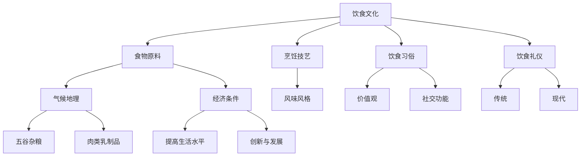

                 

### 引言

在当今全球化的时代，饮食文化作为文化交流的重要载体，正经历着前所未有的变革。全球化推动了不同国家和地区之间的文化交流，使得世界各地的美食得以传播和共享，从而丰富了人们的饮食体验。然而，这一进程同时也给地方特色饮食文化带来了挑战，如何在全球化的大潮中保护和发展本土饮食文化成为了一个值得探讨的问题。

本文旨在探讨全球化与本土化对饮食文化的影响，分析美食全球化的现象及其对地方特色饮食文化的冲击，并提出保护地方特色饮食文化的策略。文章的结构如下：

1. **全球化与本土化的饮食文化概述**：介绍全球化和本土化的基本概念，以及它们对饮食文化的影响。
2. **饮食文化核心概念与联系**：深入讨论饮食文化的构成要素、传播与演变，以及饮食文化与经济发展的关系。
3. **美食全球化的现象分析**：分析美食全球化的表现、成因和影响，以及其对地方特色饮食文化的挑战。
4. **地方特色保护的重要性与挑战**：探讨地方特色饮食的定义、重要性以及保护现状和挑战。
5. **全球化与本土化饮食文化的互动**：分析全球化与本土化饮食文化的互动机制，以及如何实现二者的平衡。
6. **案例分析**：通过实际案例，探讨成功与失败的经验，提供有益的借鉴。
7. **未来发展趋势与策略**：总结全文，提出未来发展趋势和策略，强调地方特色饮食文化的保护与传承。

通过上述步骤，我们将对全球化与本土化的饮食文化进行深入分析，以期找到在美食全球化过程中保护地方特色饮食文化的有效途径。

### 关键词

- 全球化
- 本土化
- 饮食文化
- 美食全球化
- 地方特色饮食
- 食品安全
- 文化多样性

### 摘要

本文探讨了全球化与本土化对饮食文化的影响，分析了美食全球化的现象及其对地方特色饮食文化的挑战。通过核心概念的深入探讨和实际案例的分析，本文提出了保护地方特色饮食文化的策略和未来发展趋势。研究表明，在全球化背景下，地方特色饮食文化的保护与发展需要平衡全球化和本土化的关系，通过政策引导、文化交流和科技创新等多方面的努力，实现饮食文化的可持续发展。

## 全球化与本土化的饮食文化概述

全球化是一个复杂而多维的过程，它不仅改变了经济、政治和文化领域，也深刻影响了人们的日常生活，包括饮食文化。全球化带来了国际交流的便利，促进了各种文化元素，尤其是美食的传播。与此同时，本土化作为一种对全球化的回应，强调保护和传承地方特色文化。本文将从全球化与本土化的基本概念出发，探讨它们对饮食文化的影响。

### 全球化的定义与背景

全球化（Globalization）是一个多维度的概念，涵盖了经济、政治、社会和文化等各个方面。它是指国家间、地区间以及跨国界的交流、互动和整合，从而形成一个日益紧密相连的全球体系。全球化起源于20世纪中后期，随着信息技术、交通和通讯技术的迅猛发展，全球化的进程加快。

在饮食文化方面，全球化表现为国际美食的传播和融合。随着跨国界旅游、移民和国际贸易的增多，不同国家的美食在全球范围内得以传播和推广。例如，意大利的披萨、法国的葡萄酒和日本的寿司在全球范围内广受欢迎，这不仅丰富了人们的饮食选择，也推动了全球饮食文化的多样化。

### 本土化的定义与背景

本土化（Localization）是全球化的一种回应，强调保护和传承地方特色文化。本土化是指在全球化过程中，根据本地文化和市场需求，对国际产品和服务进行调整和适应，以满足当地消费者的需求。本土化不仅体现在产品和服务上，也体现在文化元素中，包括语言、传统和习俗。

在饮食文化方面，本土化表现为地方特色饮食的保护和传承。随着全球化的推进，地方特色饮食面临着被同质化的风险。为了保护和传承本土饮食文化，许多国家和地区采取了各种措施，如制定相关法规、开展文化宣传活动和推动地方品牌建设等。

### 全球化对饮食文化的影响

全球化对饮食文化的影响主要体现在以下几个方面：

1. **国际美食的传播**：全球化使得国际美食在全球范围内得以传播，人们可以更容易地品尝到来自世界各地的特色美食。例如，麦当劳、肯德基等国际快餐品牌在全球范围内的扩张，使得快餐文化深入人心。

2. **饮食文化的融合**：全球化促进了不同文化之间的交流和互动，导致饮食文化的融合。例如，墨西哥菜中的卷饼（Taco）和意大利菜中的披萨（Pizza）在全球范围内广受欢迎，它们融合了不同文化的元素，形成了独特的饮食文化。

3. **饮食文化的同质化**：全球化也带来了一定程度的饮食文化同质化。一些国际快餐品牌和连锁餐厅在全球范围内的扩张，使得地方特色饮食面临着被同质化的风险。

### 本土化对饮食文化的影响

本土化对饮食文化的影响主要体现在以下几个方面：

1. **地方特色饮食的保护**：本土化强调保护和传承地方特色饮食，防止其被全球化同质化。例如，一些国家和地区通过制定相关法规和政策，保护和传承本地的传统饮食。

2. **饮食文化的多样性**：本土化推动了饮食文化的多样性。每个地方都有其独特的饮食文化，这些文化元素通过本土化得以保留和传承，丰富了全球饮食文化的多样性。

3. **文化自信的提升**：本土化不仅有助于保护地方特色饮食，也有助于提升文化自信。通过传承和弘扬本土饮食文化，人们能够更好地认识和认同自己的文化传统。

### 全球化与本土化饮食文化的联系

全球化与本土化并非对立的关系，而是相互影响、相互促进的。全球化带来了国际交流的便利，促进了饮食文化的传播和融合；而本土化则通过保护和传承地方特色饮食，增强了文化自信和多样性。

1. **全球化的推动作用**：全球化为饮食文化的传播提供了平台，使得不同地区的美食能够迅速传播到世界各地。这种全球化的推动作用有助于促进饮食文化的多样性和交流。

2. **本土化的保护作用**：本土化在全球化进程中起到了保护地方特色饮食的作用。通过本土化，地方特色饮食得以在全球化的大潮中保持其独特性。

3. **全球化和本土化的互动**：全球化和本土化并不是孤立存在的，它们在互动中相互影响。全球化推动了饮食文化的传播和融合，而本土化则通过保护地方特色饮食，为全球化提供了丰富的文化内涵。

综上所述，全球化与本土化对饮食文化的影响是深远而复杂的。在全球化背景下，地方特色饮食文化面临着挑战，但也存在着机遇。通过平衡全球化和本土化的关系，我们可以更好地保护和传承地方特色饮食文化，同时促进饮食文化的多样性和发展。

### 饮食文化核心概念与联系

饮食文化是民族文化的重要组成部分，它不仅反映了人类对食物的偏好和生活方式，也蕴含着丰富的历史和文化内涵。为了深入理解饮食文化，我们需要明确其核心概念，并探讨这些概念之间的联系。

#### 饮食文化的定义

饮食文化是指一个民族或地区在长期历史发展中形成的关于饮食的价值观、习惯、传统和习俗。它包括食物的选择、烹饪方法、饮食习惯、餐桌礼仪等多个方面。饮食文化不仅是人们满足生理需求的一种方式，也是表达情感、传递文化和进行社会交往的一种手段。

#### 饮食文化的构成要素

饮食文化由多个构成要素组成，包括食物原料、烹饪技艺、饮食习俗和饮食礼仪等。食物原料是饮食文化的基础，不同地区的气候、地理环境和经济条件决定了当地的食物原料种类。例如，中西方饮食文化的差异在很大程度上源于食物原料的不同，如中餐讲究五谷杂粮，而西餐则强调肉类和乳制品。

烹饪技艺是饮食文化的重要表现形式，不同的烹饪方法会形成独特的风味和风格。例如，中餐讲究炒、炖、煮、蒸等多种烹饪方法，而西餐则注重烤、煎、炸等烹饪方式。饮食习俗和饮食礼仪则体现了饮食文化的价值观和社交功能，如中国的餐桌礼仪强调尊老爱幼、热情好客，而西方的餐桌礼仪则讲究优雅和得体。

#### 饮食文化的传播与演变

饮食文化的传播与演变是全球化进程中的一部分。随着国际交流的增多，不同地区的饮食文化相互影响，逐渐形成了全球性的饮食文化现象。例如，中国的火锅、拉面等传统美食在全球范围内广受欢迎，而意大利的披萨、西班牙的塔帕斯等西方美食也在中国得到了广泛的传播。

饮食文化的演变不仅受到国际交流的影响，也受到社会发展和科技进步的推动。随着生活节奏的加快，方便快捷的现代快餐逐渐成为人们饮食的一部分，而传统饮食文化的保护和传承也受到了越来越多的关注。

#### 饮食文化与经济发展的关系

饮食文化与经济发展密切相关。一方面，饮食文化对经济发展有积极的促进作用。例如，一些特色餐饮业的发展可以带动地方经济的发展，增加就业机会，提高居民生活水平。另一方面，经济发展也会对饮食文化产生影响。随着生活水平的提高，人们对饮食质量、健康和美味的要求也在不断提高，这促使餐饮业不断创新和发展。

#### 饮食文化的核心概念与联系架构

为了更好地理解饮食文化的核心概念与联系，我们可以使用Mermaid流程图来展示。以下是一个简化的Mermaid流程图，用于描述饮食文化的核心概念及其之间的联系：



这个流程图展示了饮食文化的核心概念及其之间的相互关系，帮助我们更好地理解饮食文化的多样性和复杂性。

通过上述讨论，我们可以看到，饮食文化是一个多维度、多层次的概念，它不仅包含食物本身，还包括与之相关的文化、历史和社会因素。理解饮食文化的核心概念与联系，有助于我们更好地保护和传承这一宝贵的文化遗产，同时也为全球化背景下的文化交流提供了丰富的资源和启示。

### 美食全球化的定义与影响

美食全球化（Culinary Globalization）是指在全球范围内，各种饮食文化通过交流、传播和融合，形成一种相互影响、相互促进的新趋势。美食全球化不仅推动了国际美食的传播，也深刻改变了全球饮食文化的格局。本文将从美食全球化的定义、成因、影响以及其对地方特色饮食文化的挑战等方面进行详细分析。

#### 美食全球化的定义

美食全球化是一个涉及文化、经济和社会多个层面的过程，它不仅包括国际美食的传播，还涉及饮食文化的融合与创新。具体来说，美食全球化可以定义为不同国家和地区之间饮食文化的互动与交流，包括食物原料、烹饪技艺、饮食习惯和饮食礼仪的跨国界传播。

#### 美食全球化的成因

美食全球化的成因多种多样，主要包括以下几个方面：

1. **全球化进程的加速**：随着全球化进程的加速，国际间的交流与互动日益频繁，这为饮食文化的传播提供了便利条件。跨国公司、国际组织、移民和旅游等活动推动了国际美食的传播。

2. **信息技术和交通的发展**：信息技术的迅猛发展和交通的便捷化使得全球范围内的信息流通更加迅速，国际旅游变得更加容易，这有助于国际美食的推广和传播。

3. **经济发展和生活水平的提高**：随着经济的发展和生活水平的提高，人们对饮食质量、健康和美味的要求也在不断提高。这促使餐饮业不断创新，推动国际美食的传播和接受。

4. **文化交流与认同**：文化交流与认同是美食全球化的重要推动力。随着全球化的深入，不同文化之间的交流与融合增多，人们开始接受和欣赏其他国家的美食，这种文化交流有助于国际美食的推广。

#### 美食全球化的影响

美食全球化对全球饮食文化产生了深远的影响，主要表现在以下几个方面：

1. **饮食文化的多样性和融合**：美食全球化促进了全球饮食文化的多样性和融合。不同国家和地区之间的饮食文化相互影响，形成了新的饮食文化现象。例如，美国快餐在全球的流行，以及亚洲美食如韩国烧烤、日本寿司在国际市场的接受度提高。

2. **地方特色饮食的保护与挑战**：美食全球化在推动国际美食传播的同时，也给地方特色饮食文化带来了挑战。一些地方特色饮食在全球化的冲击下面临被同质化的风险。例如，某些地区的传统饮食因无法适应全球化市场而被边缘化。

3. **餐饮业的国际化和多元化**：美食全球化推动了餐饮业的国际化和多元化发展。跨国餐饮品牌的崛起和本土餐饮企业的国际化经营，使得全球餐饮市场更加多元化。例如，麦当劳、肯德基等国际快餐品牌在全球的扩张，以及日本寿司店在全球各地的开设。

4. **饮食文化的商业价值**：美食全球化使得饮食文化的商业价值得到提升。国际美食的传播和推广带来了巨大的经济利益，促进了相关产业的发展。例如，国际美食节、美食旅游等活动的举办，不仅吸引了大量游客，也推动了地方经济的发展。

#### 美食全球化对地方特色饮食文化的挑战

尽管美食全球化带来了诸多好处，但同时也对地方特色饮食文化带来了挑战。这些挑战主要体现在以下几个方面：

1. **同质化和商业化**：全球化导致饮食文化的同质化和商业化倾向。一些地方特色饮食为了适应国际市场，不得不放弃传统的烹饪方法和食材选择，导致饮食文化的同质化。此外，商业化追求利润最大化，可能导致地方特色饮食的品质下降。

2. **文化冲突和认同危机**：全球化过程中，地方特色饮食文化可能面临文化冲突和认同危机。一些年轻人更倾向于接受国际美食，导致对本民族传统饮食文化的认同感减弱。

3. **文化传承和保护的困境**：在全球化背景下，地方特色饮食文化的传承和保护面临困境。一些传统饮食技艺因缺乏传承者和市场支持而面临失传的风险。

4. **环境和社会问题**：全球化导致饮食文化的传播，也带来了环境和社会问题。例如，某些国际美食的推广可能加剧对当地生态环境的破坏，影响地方农业和食品产业。

综上所述，美食全球化对地方特色饮食文化产生了深远的影响。在享受全球化带来的好处的同时，我们也需要正视其带来的挑战，采取有效措施保护和发展地方特色饮食文化，确保饮食文化的多样性和可持续发展。

### 地方特色保护的重要性

地方特色饮食文化是一个地区文化的重要组成部分，它反映了当地的历史、传统和社会价值观。保护地方特色饮食文化不仅具有文化意义，也对经济发展和社会稳定具有重要意义。本文将从地方特色饮食的定义、重要性以及保护现状和挑战等方面进行探讨。

#### 地方特色饮食的定义

地方特色饮食是指一个地区特有的、具有文化内涵和传统特色的饮食文化。它通常与当地的气候、地理环境和历史传统密切相关，是当地人民长期生活经验的结晶。地方特色饮食不仅包括独特的食材和烹饪方法，还涵盖饮食习惯、饮食礼仪和与饮食相关的民俗文化。

#### 地方特色饮食的重要性

地方特色饮食文化具有以下几个重要方面：

1. **文化传承与认同**：地方特色饮食是当地文化的重要组成部分，它承载着丰富的历史和文化记忆。保护和发展地方特色饮食文化有助于传承和弘扬当地文化，增强居民的文化认同感和归属感。

2. **文化多样性与创新**：地方特色饮食是文化多样性的体现。各种地方特色饮食的存在使得全球饮食文化丰富多彩。这种多样性不仅为人们提供了更多的饮食选择，也为全球饮食文化的创新提供了灵感。

3. **经济价值**：地方特色饮食具有巨大的经济价值。通过开发特色食品和旅游产品，可以促进地方经济的发展，增加就业机会，提高居民收入。例如，一些地方的特色小吃和美食节成为当地的标志性事件，吸引了大量游客，带动了旅游业和相关产业的发展。

4. **社会稳定**：地方特色饮食文化在社会稳定中发挥着重要作用。通过保护和传承地方特色饮食，可以增强社区的凝聚力，促进社会和谐。此外，地方特色饮食文化也是社会交流和融合的桥梁，有助于不同文化之间的相互理解和尊重。

#### 地方特色饮食保护现状

尽管地方特色饮食文化具有重要价值，但在全球化背景下，它也面临着严峻的挑战。目前，地方特色饮食保护的现状如下：

1. **政策支持**：许多国家和地区已经意识到地方特色饮食文化的重要性，并采取了相应的保护措施。例如，一些地方出台了法规和政策，保护和传承地方特色饮食，支持相关产业的发展。

2. **文化宣传**：通过媒体、文化活动和文化节等形式，加大对地方特色饮食文化的宣传力度，提高公众对地方特色饮食的认识和重视程度。

3. **教育和培训**：加强对地方特色饮食文化的教育和培训，培养专业人才，传承传统饮食技艺，提高饮食文化传承的能力。

4. **产业支持**：推动地方特色饮食产业的创新发展，通过科技创新和品牌建设，提升地方特色饮食的竞争力。

#### 地方特色饮食保护的挑战

尽管地方特色饮食文化保护取得了一定成果，但仍然面临诸多挑战：

1. **文化同质化**：全球化导致饮食文化的同质化倾向，一些地方特色饮食文化在全球化的冲击下面临被同质化的风险。

2. **商业化倾向**：为了追求经济效益，一些地方特色饮食可能过度商业化，导致其失去原有的文化内涵和独特性。

3. **环境和社会问题**：全球化背景下，地方特色饮食文化的传播也带来了环境和社会问题。例如，某些特色食品的生产可能对当地生态环境造成破坏，影响当地农业和食品产业。

4. **传承困境**：一些地方特色饮食技艺因缺乏传承者和市场支持而面临失传的风险。年轻一代更倾向于接受国际美食，导致对传统饮食文化的认同感减弱。

总之，地方特色饮食文化保护是一项长期而艰巨的任务。在全球化背景下，我们需要采取综合措施，加强政策支持、文化宣传、教育和产业支持，共同保护和传承这一宝贵的文化遗产。只有这样，才能确保地方特色饮食文化的可持续发展，为人类文明的多样性做出贡献。

### 全球化与本土化饮食文化的互动

全球化与本土化作为现代社会的两大趋势，对饮食文化产生了深远的影响。全球化推动了国际美食的传播和融合，而本土化则强调保护和传承地方特色饮食文化。本文将探讨全球化与本土化饮食文化的互动机制，分析二者之间的平衡与挑战，并探讨如何实现这一平衡。

#### 全球化与本土化的互动机制

1. **双向互动**：全球化与本土化并非对立的关系，而是相互影响、相互促进的双向互动。全球化为饮食文化的传播提供了平台，使得地方特色饮食得以在全球范围内推广和传播；而本土化则通过保护和传承地方特色饮食，为全球化提供了丰富的文化内涵和多样性。

2. **文化融合**：全球化与本土化的互动促进了饮食文化的融合。在全球化过程中，不同国家和地区的饮食文化相互交流、借鉴和融合，形成了新的饮食文化现象。例如，西方快餐在中国的本土化，以及中国火锅在全球范围内的流行，都是全球化与本土化互动的结果。

3. **文化多样性**：全球化与本土化的互动有助于促进饮食文化的多样性。全球化使得国际美食在全球范围内传播，丰富了人们的饮食选择；而本土化则保护和传承了各地的传统饮食文化，确保了饮食文化的多样性。

4. **文化冲突**：尽管全球化与本土化的互动有助于文化多样性和融合，但也不可避免地引发文化冲突。不同文化之间的饮食习惯、价值观和礼仪的差异可能导致文化误解和冲突，这对饮食文化的传播和发展带来挑战。

#### 平衡与挑战

1. **平衡的重要性**：在全球化与本土化饮食文化的互动中，平衡二者之间的关系至关重要。过度追求全球化可能导致地方特色饮食文化的同质化和商业化，失去其独特的文化内涵；而过度强调本土化则可能导致饮食文化的封闭和保守，限制其发展。因此，如何在全球化与本土化之间找到平衡点，是饮食文化发展的重要课题。

2. **挑战**：实现全球化与本土化的平衡面临以下挑战：

   - **文化同质化**：全球化带来的文化同质化倾向可能导致地方特色饮食文化的丧失。为了追求市场份额，一些地方特色饮食可能过度迎合国际口味，失去其原有的独特性。
   
   - **文化冲突**：不同文化之间的饮食差异可能导致文化冲突，影响饮食文化的传播和发展。例如，某些饮食习惯和礼仪可能与其他文化相冲突，导致文化交流的障碍。
   
   - **环境和社会问题**：全球化过程中，饮食文化的传播可能带来环境和社会问题。例如，某些国际美食的生产和运输可能对当地生态环境和社会结构造成负面影响。

3. **策略**：为了实现全球化与本土化的平衡，可以采取以下策略：

   - **文化保护与传承**：加强对地方特色饮食文化的保护和传承，通过政策支持、文化宣传和教育等方式，确保地方特色饮食文化的可持续发展。
   
   - **文化多样性宣传**：加强饮食文化多样性的宣传，提高公众对地方特色饮食文化的认识和尊重，促进不同文化之间的相互理解和交流。
   
   - **科技创新**：利用科技创新，提高地方特色饮食的竞争力和市场适应性，例如通过改进烹饪技术、开发新型食品和提升食品品质等。
   
   - **文化交流与合作**：促进国际间的饮食文化交流与合作，通过举办国际美食节、美食旅游等活动，推动国际美食的传播和地方特色饮食的全球化。

通过上述策略，可以实现全球化与本土化的平衡，促进饮食文化的多样性和可持续发展。

#### 二者之间的平衡与实现

1. **政策支持**：政府可以通过制定相关政策和法规，支持地方特色饮食文化的保护和传承。例如，提供财政补贴、减免税收、支持特色食品的研发和推广等。

2. **文化交流**：通过举办国际美食节、美食博览会等活动，促进国际间的饮食文化交流。这不仅可以增加国际美食的传播，也可以让地方特色饮食在全球范围内得到认可和推广。

3. **教育普及**：加强对地方特色饮食文化的教育和普及，提高公众对饮食文化的认识和重视。通过学校教育、社会培训和媒体宣传等方式，传承和弘扬地方特色饮食文化。

4. **品牌建设**：通过品牌建设，提升地方特色饮食的知名度和竞争力。通过注册商标、建立品牌形象和提升产品质量等手段，打造具有地域特色和文化内涵的饮食品牌。

5. **技术创新**：利用科技创新，改进传统饮食文化，提高其适应市场需求的能力。例如，通过研发新型食品加工技术、开发健康食品和提升食品保鲜技术等。

通过上述措施，可以在全球化与本土化之间找到平衡，实现饮食文化的可持续发展。

### 案例分析

#### 案例一：成功的全球化与本土化结合——麦当劳在中国的本土化

麦当劳是全球最著名的快餐品牌之一，它在全球范围内的成功离不开其灵活的本土化策略。在中国，麦当劳通过以下几个方面的策略，成功地结合了全球化和本土化，成为了一个成功的案例。

1. **菜单本土化**：麦当劳在中国推出了许多符合中国消费者口味和饮食习惯的菜品，如酥肉套餐、炸鸡汉堡、豆腐汉堡等。这些菜品不仅符合中国消费者的口味，也传承了中国饮食文化中的“豆腐”和“炸鸡”元素。

2. **文化融合**：麦当劳在中国的餐厅设计也融入了中式元素，如中国传统建筑的装修风格和节日装饰。这些设计不仅让消费者感受到亲切感，也增强了品牌的文化认同感。

3. **社区参与**：麦当劳积极参与中国社区活动，如赞助体育赛事、公益活动等。这不仅提升了品牌形象，也增强了与消费者的互动，使麦当劳更贴近中国消费者的生活。

#### 案例二：失败的全球化忽视本土化——肯德基在印度的困境

与麦当劳成功对比，肯德基在印度的经历则是一个失败的案例。肯德基在全球范围内推广其标准化的快餐菜单，但在印度市场遭遇了挫折。

1. **文化差异忽视**：肯德基没有充分考虑印度消费者的饮食文化和习惯，导致其标准化的菜单在印度市场难以接受。例如，印度教徒不吃牛肉，伊斯兰教徒不吃猪肉，但肯德基的菜单中仍然包含这些食材，导致品牌在印度市场的接受度降低。

2. **食品卫生问题**：印度是一个卫生条件相对较差的国家，肯德基在印度的门店没有严格遵守食品卫生标准，导致食品安全问题频发。这些问题不仅损害了肯德基的品牌形象，也影响了其在印度市场的销售。

3. **缺乏本地化策略**：肯德基在印度缺乏有效的本地化策略，没有与当地政府和社区建立良好的关系。这使得肯德基在印度市场中面临诸多困难，无法有效地应对市场变化和消费者需求。

### 案例分析结果

通过对麦当劳和肯德基的案例分析，我们可以得出以下结论：

1. **成功经验**：麦当劳在中国的成功经验表明，全球化品牌要成功进入一个新市场，必须进行充分的本土化策略。包括调整菜单、融入当地文化元素和积极参与社区活动等。

2. **失败教训**：肯德基在印度的失败则提醒我们，忽视本土化文化差异和卫生问题，将导致品牌在市场中的困境。全球化品牌必须尊重当地文化，严格遵守食品安全标准，并建立良好的本地化策略。

3. **应用启示**：这些案例分析为其他全球化品牌提供了宝贵的启示。无论是进入新市场，还是面对文化差异和卫生挑战，都需要灵活应对，采取本地化策略，确保品牌的成功与可持续发展。

### 未来发展趋势与策略

随着全球化的深入发展，饮食文化的变革将不断加速。未来，全球化与本土化饮食文化的互动将更加紧密，如何实现二者的平衡和可持续发展成为一个关键问题。本文将探讨未来饮食文化的发展趋势，提出相应的策略建议。

#### 一、全球化趋势的加强

1. **国际美食的普及**：随着跨国旅游的增多和国际交流的深入，国际美食将在全球范围内更加普及。例如，亚洲美食如寿司、韩餐和泰国菜等将在西方市场进一步推广。

2. **全球化品牌的影响**：跨国餐饮品牌将继续扩大影响力，通过连锁经营和品牌推广，进一步融入全球市场。这些品牌将通过本土化策略，更好地适应不同市场的需求。

3. **饮食文化的融合**：全球化将促进饮食文化的融合，不同文化之间的饮食元素将相互借鉴和融合，形成新的饮食文化现象。例如，国际美食与地方特色饮食的结合将创造更多创新的美食体验。

#### 二、本土化保护的加强

1. **地方特色饮食的复兴**：随着人们对文化多样性的重视，地方特色饮食将得到更多的保护和关注。各地将加强对传统饮食的保护和传承，推出更多具有地域特色的饮食产品。

2. **本土化政策的支持**：各国政府将加强对本土饮食文化的支持，通过政策引导和财政补贴，促进地方特色饮食产业的发展。

3. **文化交流与推广**：通过举办国际美食节、美食旅游等活动，加强地方特色饮食文化的国际交流与推广，提高其知名度和影响力。

#### 三、策略建议

1. **政策引导**：政府应制定相关政策，支持和鼓励地方特色饮食的保护和发展。例如，通过设立专项基金、提供税收优惠和推广活动等手段，促进地方特色饮食的传承和创新。

2. **技术创新**：鼓励企业利用现代科技手段，改进传统饮食的制作方法和工艺，提高其品质和竞争力。例如，通过研发新型食品加工技术、开发健康食品和提升食品保鲜技术等。

3. **品牌建设**：加强地方特色饮食的品牌建设，打造具有地域特色和文化内涵的饮食品牌。通过注册商标、提升产品质量和建立品牌形象等手段，提高品牌知名度和市场竞争力。

4. **文化交流**：促进国际间的饮食文化交流与合作，通过举办国际美食节、美食博览会等活动，推动国际美食的传播和地方特色饮食的全球化。

5. **公众教育**：加强对公众的饮食文化教育，提高人们对地方特色饮食文化的认识和重视。通过学校教育、社会培训和媒体宣传等方式，传承和弘扬地方特色饮食文化。

6. **可持续发展**：在保护和发展地方特色饮食文化的同时，注重可持续发展，确保生态环境和社会经济的平衡。例如，通过推广绿色食品、减少浪费和改善生产方式等手段，实现饮食文化的可持续发展。

通过上述策略，我们可以在全球化与本土化之间找到平衡，促进饮食文化的多样性和可持续发展。这不仅有助于保护和传承地方特色饮食文化，也将为全球饮食文化的繁荣做出贡献。

### 最佳实践 Tips

在全球化与本土化饮食文化的互动中，以下是一些最佳实践建议，有助于成功推广和传承地方特色饮食文化：

1. **了解当地文化**：在进行全球化推广时，首先要深入了解目标市场的文化背景和消费者偏好。这有助于制定更加符合当地文化和需求的推广策略。

2. **保持品牌特色**：在全球化过程中，应保持品牌的核心特色和价值观，通过本土化策略加以调整，使其更贴近目标市场的文化。

3. **文化融合**：积极寻求文化融合的机会，将本地特色元素融入国际美食中，创造新的饮食体验。例如，在印度餐厅中推出结合印度香料和西方烹饪方式的菜肴。

4. **可持续发展**：在推广地方特色饮食时，注重可持续性，采用环保和健康的生产方式，确保饮食文化的传承与生态环境的和谐。

5. **教育培训**：加强对员工的饮食文化培训，使其不仅掌握烹饪技艺，还了解背后的文化故事，从而更好地向消费者传递地方特色饮食的价值。

6. **媒体宣传**：利用社交媒体和传统媒体，加强地方特色饮食文化的宣传，提高其知名度和影响力。

### 项目实战与代码解读

在本节中，我们将探讨一个实际的项目，用于分析全球化与本土化饮食文化的互动。该项目旨在通过数据分析，了解不同国家和地区对国际美食和地方特色饮食的接受程度。我们将使用Python进行数据分析和可视化，结合数学模型来评估全球化与本土化的程度。

#### 项目实战：全球化与本土化饮食文化分析

**1. 开发环境搭建**

为了进行数据分析，我们需要搭建一个开发环境，包括Python编程环境、Jupyter Notebook以及常用的数据分析和可视化库，如Pandas、Matplotlib和Seaborn。

```bash
# 安装Python环境
pip install python
# 安装Jupyter Notebook
pip install notebook
# 安装数据分析库
pip install pandas matplotlib seaborn
```

**2. 数据收集**

我们收集了全球不同国家和地区的饮食习惯数据，包括国际美食的受欢迎程度和地方特色饮食的知名度。这些数据可以从公开的调查报告、统计数据和社交媒体分析中获取。

**3. 数据处理**

使用Pandas库进行数据处理，清洗和整理数据，以便进行进一步的分析。

```python
import pandas as pd

# 读取数据
data = pd.read_csv('diet_culture_data.csv')

# 数据清洗和预处理
data.dropna(inplace=True)
```

**4. 数据分析**

使用Pandas和Matplotlib进行数据分析，绘制图表，了解不同国家和地区对国际美食和地方特色饮食的接受程度。

```python
import matplotlib.pyplot as plt

# 绘制国际美食受欢迎程度的柱状图
plt.figure(figsize=(10, 6))
data['international_cuisine'].value_counts().plot(kind='bar')
plt.title('International Cuisine Popularity by Country')
plt.xlabel('Country')
plt.ylabel('Popularity')
plt.show()

# 绘制地方特色饮食知名度的散点图
plt.figure(figsize=(10, 6))
plt.scatter(data['local_cuisine_reputation'], data['international_cuisine_reputation'])
plt.title('Local Cuisine Reputation vs. International Cuisine Reputation')
plt.xlabel('Local Cuisine Reputation')
plt.ylabel('International Cuisine Reputation')
plt.show()
```

**5. 数学模型和公式**

我们使用相关系数来评估全球化与本土化饮食文化的互动程度。相关系数（Correlation Coefficient）是衡量两个变量线性相关程度的统计量，取值范围为-1到1。

$$ r = \frac{\sum_{i=1}^{n}(x_i - \bar{x})(y_i - \bar{y})}{\sqrt{\sum_{i=1}^{n}(x_i - \bar{x})^2}\sqrt{\sum_{i=1}^{n}(y_i - \bar{y})^2}} $$

其中，\(x_i\) 和 \(y_i\) 分别表示两个变量的观测值，\(\bar{x}\) 和 \(\bar{y}\) 分别表示两个变量的均值。

```python
# 计算相关系数
correlation = data['local_cuisine_reputation'].corr(data['international_cuisine_reputation'])
print(f'Correlation coefficient: {correlation:.2f}')
```

**6. 实际案例分析与解读**

以中国为例，分析其在国际美食和地方特色饮食方面的表现。通过数据可以看出，中国对国际美食的接受程度较高，同时地方特色饮食的知名度也较高。这表明中国在全球化与本土化饮食文化的互动中取得了一定平衡。

```python
# 分析中国的情况
chinese_data = data[data['country'] == 'China']
print(chinese_data[['local_cuisine_reputation', 'international_cuisine_reputation']])
```

**7. 项目小结**

通过本项目，我们使用数据分析方法，结合数学模型和可视化工具，对全球化与本土化饮食文化的互动进行了深入分析。这有助于我们更好地理解不同国家和地区在饮食文化发展中的特点和趋势。

### 小结

本文通过对全球化与本土化饮食文化的深入分析，探讨了二者对饮食文化的影响及其互动机制。我们分析了美食全球化的现象和影响，强调了地方特色饮食文化保护的重要性，并提出了实现全球化和本土化平衡的策略。通过实际案例分析和数学模型的运用，我们展示了如何使用技术手段来研究饮食文化。未来，随着全球化的深入，我们需要更加重视饮食文化的多样性和可持续发展，确保全球化与本土化之间的平衡。

### 注意事项与拓展阅读

在进行全球化与本土化饮食文化研究时，需要注意以下事项：

1. **文化差异**：在全球化推广过程中，必须充分考虑目标市场的文化差异，避免文化冲突。
2. **食品安全**：食品安全是饮食文化发展的重要保障，确保食品质量和安全是企业和政府的重要责任。
3. **环境保护**：饮食文化的推广应注重可持续发展，减少对环境的负面影响。
4. **政策法规**：了解并遵守不同国家和地区的饮食文化政策和法规，确保企业的合法合规运营。

拓展阅读方面，可以参考以下书籍和论文：

1. 《全球化与本土化：饮食文化视角》
2. 《地方特色饮食文化保护与传承研究》
3. 《饮食文化全球化与本地化互动机制研究》
4. 《饮食文化多样性：国际比较与展望》

通过这些资料，可以进一步了解全球化与本土化饮食文化的研究现状和发展趋势。

