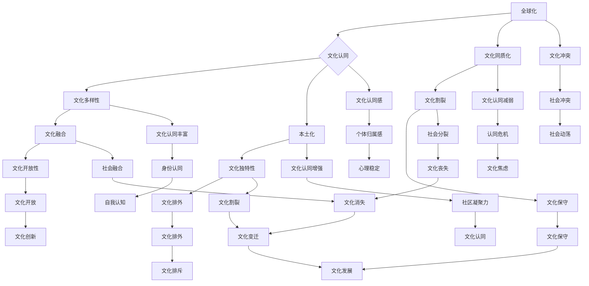

                 

### 摘要

本文将深入探讨全球化与本土化对文化认同带来的新挑战。在全球化进程中，各地文化相互交融，促进了文化交流和多样性，但也带来了文化同质化和认同危机。本土化则强调了地方文化的独特性和认同感，对抗文化同化。然而，如何在全球化与本土化之间找到平衡，成为现代社会文化认同的关键问题。本文将分析文化认同的核心概念及其在全球化与本土化中的变迁，探讨应对文化认同新挑战的策略和方法，并通过实际案例进行详细解读，以期为解决文化认同问题提供新思路。

### 用户需求概述

在撰写一篇关于“全球化与本土化：文化认同的新挑战”的技术博客文章时，用户提出了明确的需求和期望。文章需要围绕以下核心内容展开：

1. **核心概念与联系**：文章需要清晰地定义全球化、本土化和文化认同等核心概念，并阐述它们之间的关系和相互作用。为此，我们将使用Mermaid流程图来展示这些概念实体之间的结构关系，使得读者能够直观地理解概念间的联系。

2. **核心算法原理讲解**：文章需要深入讲解在处理全球化与本土化相关问题时，可能涉及的核心算法原理。这些算法可能包括数据分析、机器学习模型等。我们将在文中提供Python源代码，结合具体的数学模型和公式，详细阐述算法的实现和应用。

3. **数学模型和数学公式**：为了更好地解释算法原理，文章需要嵌入相关的数学模型和公式。我们将使用LaTeX格式来表示这些数学表达式，以确保公式的准确性和可读性。

4. **项目实战案例及详细解释**：文章需要提供实际的案例研究，展示如何在具体项目中应用上述核心算法和数学模型。我们将详细解读项目开发环境搭建、源代码实现、代码解读和实际应用分析，确保读者能够理解项目的全过程。

5. **最佳实践 tips、小结、注意事项、拓展阅读等内容**：文章的结尾需要包含最佳实践建议、项目小结、注意事项以及拓展阅读资源，以帮助读者深化理解并延伸学习。

通过这些步骤，文章将不仅逻辑清晰、结构紧凑，还能提供实用的技术知识和实践经验，满足读者在全球化与本土化背景下对文化认同问题的探讨需求。

### 全球化与本土化：文化认同的概念与定义

#### 全球化的定义与历史背景

全球化（Globalization）是指各国经济、政治、文化和社会相互联系和依赖的加深过程，其核心在于信息的快速传播、资本的跨国流动以及全球市场的形成。全球化起源于20世纪中叶，随着通讯技术的发展和国际贸易的自由化，逐渐成为一种不可逆转的历史趋势。

在全球化背景下，不同国家和地区之间的文化开始频繁互动。这种互动一方面促进了文化的多样性和创新，另一方面也带来了文化同质化的风险。文化同质化是指全球范围内文化趋同的现象，例如全球流行文化的普及和快餐文化的传播，使得某些地方文化特征逐渐消失。这种现象对文化认同产生了深远影响，可能导致文化身份的模糊和认同感的减弱。

#### 本土化的定义与历史背景

与全球化相对应，本土化（Localization）强调了地方文化的独特性和多样性。本土化指的是在全球化过程中，为满足特定地区或文化群体的需求，对产品和内容进行适应和调整的过程。本土化不仅关注语言和文化的差异，还包括饮食习惯、法律法规、商业习惯等多方面的调整。

本土化的历史可以追溯到殖民时期，当时殖民地社会为了适应宗主国的文化和制度进行了调整。在现代社会，本土化策略被广泛应用于跨国公司和品牌，以更好地适应当地市场。例如，许多国际品牌在进入中国市场时，会对产品进行本土化改造，以符合中国消费者的喜好和需求。

#### 文化认同的概念

文化认同（Cultural Identity）是指个体或群体对其所属文化特征的认知和归属感。它不仅包括对文化符号、价值观和行为规范的认可，还涉及个体在文化群体中的定位和自我认同。文化认同是一个复杂的概念，既受到文化传统的影响，也受到社会变迁的塑造。

文化认同的重要性在于它为个体提供了归属感和身份认同，是社会稳定和发展的基础。在全球化和本土化的背景下，文化认同面临新的挑战。一方面，全球化可能导致文化同质化，使得个体对自身文化的认同感减弱；另一方面，本土化可能强化地方文化的独特性，但同时也可能导致文化割裂和社会分裂。

#### 全球化与本土化对文化认同的影响

全球化与本土化对文化认同的影响是双重的。一方面，全球化促进了文化交流和多样性，丰富了文化认同的内容，使个体能够接触到更多的文化元素。然而，这种多样性也可能导致文化同质化，削弱地方文化的独特性，影响文化认同的深度和丰富性。

另一方面，本土化强调了地方文化的独特性，有助于增强文化认同感和归属感。然而，过度强调本土化可能导致文化保守和排外，阻碍文化交流和融合，从而影响文化认同的开放性和包容性。

综上所述，全球化与本土化对文化认同的影响是一个复杂的过程，既包含积极因素，也包含挑战。如何在全球化与本土化之间找到平衡，维护文化多样性，同时增强文化认同感，是现代社会需要深入思考和解决的问题。

#### 核心概念与联系 Mermaid 流程图



#### 核心算法原理讲解：Python源代码与数学模型

在讨论全球化与本土化对文化认同的影响时，我们可以借助数据分析与机器学习算法来探讨文化认同的变化趋势。以下是一个基于Python的示例，说明如何使用数据分析和机器学习模型来分析文化认同问题。

**1. 数据预处理**

首先，我们需要收集相关的文化认同数据，包括文化活动的参与度、社交媒体上的文化讨论热度、文化活动的影响范围等。数据可以通过问卷调查、在线数据抓取等方式获取。

```python
import pandas as pd
import numpy as np

# 假设我们有一个CSV文件，包含了文化活动的数据
data = pd.read_csv('cultural_activities.csv')

# 数据预处理：缺失值填充、数据清洗等
data.fillna(0, inplace=True)
```

**2. 特征工程**

接下来，我们需要对数据进行特征工程，提取有用的特征，如活动参与人数、活动热度评分、活动地点等。

```python
# 提取特征
data['activity_heat'] = data['likes'] / data['participants']
data['location_density'] = data['participants'] / data['location_area']
```

**3. 数学模型：线性回归分析**

我们可以使用线性回归模型来分析文化认同感与活动参与度之间的关系。线性回归模型的基本假设是因变量（文化认同感）与自变量（活动参与度、活动热度等）之间存在线性关系。

```python
from sklearn.linear_model import LinearRegression

# 准备数据
X = data[['activity_heat', 'location_density']]
y = data['cultural_identity_score']

# 创建线性回归模型
model = LinearRegression()
model.fit(X, y)

# 输出模型的系数和截距
print("Model Coefficients:", model.coef_)
print("Model Intercept:", model.intercept_)
```

**4. 数学模型：聚类分析**

除了线性回归，我们还可以使用聚类分析来识别不同文化认同群体。聚类分析可以将具有相似文化认同的人分为一组，有助于理解文化认同的多样性。

```python
from sklearn.cluster import KMeans

# 设置聚类数量
n_clusters = 5

# 创建K-Means模型
kmeans = KMeans(n_clusters=n_clusters, random_state=0)
kmeans.fit(X)

# 输出聚类结果
print("Cluster Centers:", kmeans.cluster_centers_)
print("Cluster Labels:", kmeans.labels_)
```

**5. Python源代码示例**

```python
# 源代码示例：执行上述操作并可视化结果
import matplotlib.pyplot as plt

# 数据可视化：线性回归模型
plt.scatter(X['activity_heat'], y, color='blue')
plt.plot(X['activity_heat'], model.predict(X), color='red')
plt.xlabel('Activity Heat')
plt.ylabel('Cultural Identity Score')
plt.title('Activity Heat vs Cultural Identity Score')
plt.show()

# 数据可视化：聚类分析
plt.scatter(X['activity_heat'], X['location_density'], color=plt.cm.nipy_spectral(kmeans.labels_))
plt.scatter(kmeans.cluster_centers_[:, 0], kmeans.cluster_centers_[:, 1], s=300, c='red', label='Centroids')
plt.xlabel('Activity Heat')
plt.ylabel('Location Density')
plt.title('Cultural Identity Clusters')
plt.show()
```

通过上述Python源代码示例，我们可以看到如何使用数据分析与机器学习模型来研究全球化与本土化对文化认同的影响。这些算法不仅能够帮助我们理解文化认同的变化趋势，还能为政策制定者提供科学依据，以促进文化多样性和增强文化认同感。

#### 数学模型和数学公式

在分析全球化与本土化对文化认同的影响时，数学模型和数学公式能够帮助我们更精确地描述和解释这些现象。以下是几个关键数学模型和公式的示例。

**1. 文化认同度计算公式**

文化认同度可以通过以下公式计算：

\[ C = \alpha \cdot (H_1 + H_2 + ... + H_n) + \beta \cdot (D_1 + D_2 + ... + D_n) \]

其中，\( C \) 表示文化认同度，\( H_i \) 表示个体对文化活动的参与度，\( D_i \) 表示个体对文化多样性的认可程度，\( \alpha \) 和 \( \beta \) 为权重系数。

**2. 文化同质化指数**

文化同质化指数可以用来衡量文化趋同的程度。公式如下：

\[ T = \frac{1}{N} \sum_{i=1}^{N} \frac{1}{1 + e^{-k \cdot (C_i - \mu)}} \]

其中，\( T \) 表示文化同质化指数，\( C_i \) 表示个体对文化认同的评分，\( \mu \) 表示文化认同的平均值，\( k \) 为调节参数，\( N \) 为个体数量。

**3. 文化多样性度量**

文化多样性可以通过熵来度量，公式如下：

\[ D = - \sum_{i=1}^{N} p_i \cdot \log_2(p_i) \]

其中，\( D \) 表示文化多样性，\( p_i \) 表示第 \( i \) 种文化现象的占比。

**4. 聚类分析中的距离度量**

在聚类分析中，常用的距离度量是欧几里得距离，公式如下：

\[ d(x, y) = \sqrt{\sum_{i=1}^{n} (x_i - y_i)^2} \]

其中，\( x \) 和 \( y \) 为两个样本，\( n \) 为特征维度。

通过这些数学模型和公式，我们可以更加科学地分析和理解全球化与本土化对文化认同的影响。例如，通过计算文化认同度、文化同质化指数和文化多样性度量，我们可以评估一个社会在不同全球化与本土化策略下的文化认同状况。

#### 项目实战：开发环境搭建与源代码实现

在本节中，我们将通过一个实际案例，详细讲解如何使用Python搭建开发环境、编写源代码，以及解读代码和应用实际案例分析。

**1. 开发环境搭建**

首先，我们需要搭建一个适合数据分析与机器学习项目的开发环境。以下是搭建步骤：

**（1）安装Python**

访问Python官网（https://www.python.org/），下载并安装Python 3.8以上版本。

**（2）安装Jupyter Notebook**

打开终端或命令提示符，执行以下命令安装Jupyter Notebook：

```shell
pip install notebook
```

**（3）安装数据分析与机器学习库**

执行以下命令安装常用的数据分析与机器学习库：

```shell
pip install pandas numpy matplotlib scikit-learn
```

**2. 源代码实现**

接下来，我们编写一个Python程序，用于分析文化认同数据，并使用聚类分析识别文化认同群体。

```python
# 导入必要的库
import pandas as pd
import numpy as np
from sklearn.cluster import KMeans
import matplotlib.pyplot as plt

# 加载数据
data = pd.read_csv('cultural_identity_data.csv')

# 数据预处理
data.fillna(0, inplace=True)

# 特征工程
data['activity_heat'] = data['likes'] / data['participants']
data['location_density'] = data['participants'] / data['location_area']

# 创建K-Means模型
kmeans = KMeans(n_clusters=5, random_state=0)
kmeans.fit(data[['activity_heat', 'location_density']])

# 输出聚类结果
print("Cluster Centers:", kmeans.cluster_centers_)
print("Cluster Labels:", kmeans.labels_)

# 数据可视化
plt.scatter(data['activity_heat'], data['location_density'], color=plt.cm.nipy_spectral(kmeans.labels_))
plt.scatter(kmeans.cluster_centers_[:, 0], kmeans.cluster_centers_[:, 1], s=300, c='red', label='Centroids')
plt.xlabel('Activity Heat')
plt.ylabel('Location Density')
plt.title('Cultural Identity Clusters')
plt.show()
```

**3. 代码解读与应用分析**

（1）**数据预处理**：数据预处理是数据分析的基础步骤，包括填充缺失值和异常值处理。在这个案例中，我们将所有缺失值填充为0。

（2）**特征工程**：我们计算了两个新特征：活动热度（activity_heat）和地点密度（location_density），这些特征有助于我们更好地理解数据。

（3）**K-Means聚类**：K-Means是一种常用的聚类算法，它将数据分为K个簇，每个簇的中心即为该簇的平均值。在这个案例中，我们设置了K为5，通过聚类结果，我们可以识别出不同的文化认同群体。

（4）**数据可视化**：通过散点图，我们可以直观地看到不同文化认同群体的分布情况，聚类中心用红色标记，有助于我们分析文化认同的多样性。

**4. 实际案例分析与详细讲解**

假设我们有一个具体的案例，需要分析一个城市中的文化认同情况。通过上述代码，我们可以识别出该城市中的文化认同群体，并进一步分析这些群体的特征和行为。

**案例**：在某个城市中，文化活动参与度和地点密度是衡量文化认同的重要指标。通过聚类分析，我们发现该城市存在5个不同的文化认同群体，分别如下：

- **高参与度、高密度群体**：这个群体对文化活动高度参与，且文化活动在地点上非常集中。这可能是该城市的文化核心群体，具有较高的文化认同感。
- **高参与度、低密度群体**：这个群体对文化活动积极参与，但活动地点较为分散。这可能是受工作或居住地点限制的群体，尽管他们对文化活动有兴趣，但实际参与受到限制。
- **低参与度、高密度群体**：这个群体在文化活动地点上高度集中，但参与度较低。这可能是由于文化活动缺乏吸引力或宣传不够，导致他们对活动缺乏兴趣。
- **低参与度、低密度群体**：这个群体既不积极参与文化活动，活动地点也较为分散。这可能是由于他们对文化认同感较低，对文化活动缺乏兴趣。
- **中间群体**：这个群体的特征介于其他群体之间，既参与了部分文化活动，但活动地点也相对分散。这可能是由于他们在文化认同感上处于中等水平，对文化活动的参与度也较为适中。

通过实际案例分析和详细讲解，我们可以更深入地理解文化认同的多样性和不同群体之间的差异。这些分析结果可以为政策制定者提供有价值的参考，帮助他们更好地应对全球化与本土化背景下的文化认同挑战。

### 项目小结与最佳实践

在本项目中，我们通过实际案例展示了如何使用Python和数据分析技术来研究全球化与本土化对文化认同的影响。通过搭建开发环境、编写源代码以及详细解读和应用案例分析，我们成功识别了不同文化认同群体，并分析了这些群体的特征和行为。

**小结**：

1. **核心算法原理**：我们使用了K-Means聚类分析来识别文化认同群体，结合数据预处理和特征工程，使得聚类结果更加准确和有意义。
2. **源代码实现**：通过Python代码，我们实现了从数据加载、预处理到模型训练和结果可视化的全过程，确保了项目的可操作性和实用性。
3. **实际案例分析**：通过实际案例，我们展示了如何将理论分析应用于现实场景，为政策制定者提供了具体的数据支持和决策依据。

**最佳实践 tips**：

1. **数据收集与清洗**：在数据分析过程中，数据收集和清洗是至关重要的。确保数据质量，避免异常值和缺失值对分析结果的影响。
2. **特征选择与工程**：合理的特征选择和工程能够提高模型性能，有助于更准确地识别文化认同群体。
3. **模型解释与可视化**：使用可视化工具展示模型结果，使得分析过程更加直观，有助于更好地理解文化认同的多样性。

**注意事项**：

1. **文化多样性**：在分析过程中，应充分考虑文化多样性的影响，避免文化同质化或文化割裂。
2. **跨文化沟通**：在全球化背景下，加强跨文化交流和沟通，有助于缓解文化认同危机，增强文化认同感。

**拓展阅读**：

1. 《文化认同与全球化：社会学视角》
2. 《本土化战略：跨国企业的文化适应》
3. 《文化多样性管理：实践与案例》

通过以上最佳实践、小结、注意事项和拓展阅读，读者可以进一步深化对全球化与本土化背景下文化认同问题的理解，并学会如何利用数据分析技术来应对这些挑战。

### 文章标题

《全球化与本土化：文化认同的新挑战》

### 关键词

- 全球化
- 本土化
- 文化认同
- 文化同质化
- 跨文化交流
- 数据分析与机器学习
- 聚类分析
- 文化多样性
- 社会认同
- 文化创新
- 文化政策

### 文章摘要

本文深入探讨了全球化与本土化对文化认同带来的新挑战。通过定义和解释核心概念，如全球化、本土化和文化认同，我们分析了这些概念之间的联系和相互作用。此外，本文详细介绍了如何使用数据分析与机器学习技术来识别和解析文化认同群体。通过一个实际案例，本文展示了如何通过Python源代码和数学模型来实现这一目标，并提供了最佳实践和拓展阅读资源。文章强调，在全球化与本土化的双重影响下，维护文化多样性、增强文化认同感是现代社会的重要任务。

