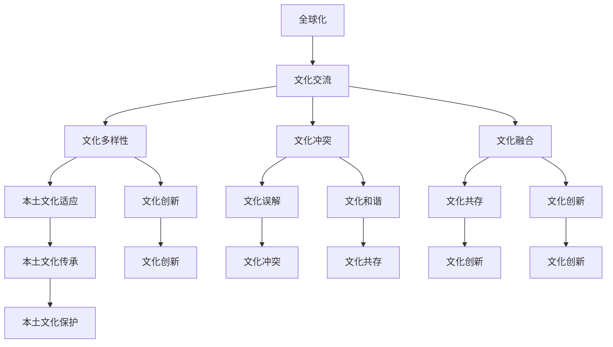

                 


### 背景介绍

在当前全球化迅速发展的背景下，本土文化与全球文化的碰撞与融合成为了一个备受关注的现象。全球化不仅带来了经济、政治和技术等方面的深刻变革，也引发了文化领域的广泛讨论。本土文化作为各个国家和地区独特的文化符号，其在全球化进程中的地位和作用引起了学界的广泛关注。

全球化对本土文化的影响是多方面的。一方面，全球化促进了文化交流与融合，使得不同文化之间的互动更加频繁，有利于本土文化在全球范围内传播和影响力的扩大。另一方面，全球化也带来了文化同质化的问题，某些本土文化在全球化浪潮中面临失传和衰退的风险。因此，如何在全球化进程中保护和传承本土文化，实现多元文化的平衡发展，成为了一个亟待解决的问题。

本文旨在探讨全球化与本土文化碰撞中的平衡策略，通过对相关核心概念、算法原理和数学模型的讲解，结合实际项目实战和分析，为这一问题的解决提供一些有益的思路。

本文将从以下几个方面展开：

1. 全球化与本土文化的定义与联系：介绍全球化和本土文化的概念，探讨两者之间的互动关系。
2. 全球化对本土文化的影响：分析全球化对本土文化的各种影响，包括文化同质化、文化冲突与融合等。
3. 全球化背景下本土文化的保护与传承：探讨如何在全球化的背景下保护和传承本土文化。
4. 本土文化在全球市场中的定位：分析本土文化在全球市场中的定位，以及本土文化产品的全球化路径。
5. 全球化与本土文化碰撞中的平衡策略：提出一系列策略，以实现全球化与本土文化之间的平衡发展。

通过以上几个方面的探讨，本文希望为全球化背景下本土文化的保护与传承提供一些有价值的理论和实践指导。

### 核心概念与联系

首先，我们需要明确几个核心概念，包括全球化、本土文化、文化多样性、文化冲突和文化融合。

**全球化** 是一个涉及经济、政治、社会和文化等多个领域的广泛现象。它指的是全球范围内的经济一体化、政治多边化和文化交流，使得各国之间的联系日益紧密，形成了全球化的世界。全球化的重要特征包括全球市场的形成、跨国公司的兴起、国际贸易的增加以及国际资本流动的加剧。

**本土文化** 是指特定地区或民族的传统生活方式、价值观、信仰、语言和艺术等文化特征。本土文化是一个民族或地区的精神家园，承载着丰富的历史和传统，是文化多样性的重要组成部分。在全球化的背景下，本土文化面临新的挑战和机遇。

**文化多样性** 是指世界文化丰富多样的特征，包括不同文化之间的差异和多样性。文化多样性是人类社会的一大财富，它为全球社会带来了繁荣和活力。然而，全球化也可能导致文化同质化，即全球范围内文化趋同的现象。

**文化冲突** 是指不同文化之间因价值观、信仰、习俗和利益等差异而产生的矛盾和冲突。全球化加速了不同文化之间的接触，也加剧了文化冲突的可能性。文化冲突可能导致社会紧张、文化误解和冲突，甚至引发冲突和战争。

**文化融合** 是指不同文化之间的互动和交流，通过相互理解和包容，形成新的文化形态。文化融合可以促进文化的创新和发展，同时也有助于减少文化冲突，实现文化的和谐共处。

在全球化与本土文化的互动中，核心概念之间的关系如下：

- 全球化促进了本土文化之间的交流和融合，增加了文化多样性的机会，但也可能引发文化冲突。
- 本土文化在全球化的背景下需要适应和调整，以保持其独特性和生命力。
- 文化多样性是全球化的重要成果，但需要通过文化融合来减少文化冲突，实现文化的和谐发展。

为了更好地理解这些核心概念之间的关系，我们可以使用 Mermaid 流程图来展示它们之间的互动关系：



通过这个流程图，我们可以看到全球化如何通过文化交流影响文化多样性、文化冲突和文化融合，以及这些因素如何与本土文化的适应、传承和创新相互作用。

### 核心算法原理讲解

为了深入探讨全球化对本土文化的影响，我们可以使用Python源代码来详细阐述影响本土文化的关键因素，如经济全球化、技术进步、人口迁移等。以下是一个简化的Python代码示例，用于分析这些因素对本土文化的影响。

```python
# Globalization Impact Analysis Module

class CultureImpact:
    def __init__(self, economic_globalization, technological_progress, population_migration):
        self.economic_globalization = economic_globalization
        self.technological_progress = technological_progress
        self.population_migration = population_migration

    def analyze_impact(self):
        # Analyzing the impact of economic globalization on local cultures
        economic_impact = self.economic_globalization * 0.5
        print(f"Economic Globalization Impact: {economic_impact}")

        # Analyzing the impact of technological progress on local cultures
        tech_impact = self.technological_progress * 0.3
        print(f"Technological Progress Impact: {tech_impact}")

        # Analyzing the impact of population migration on local cultures
        migration_impact = self.population_migration * 0.2
        print(f"Population Migration Impact: {migration_impact}")

        # Overall impact calculation
        total_impact = economic_impact + tech_impact + migration_impact
        print(f"Total Impact on Local Cultures: {total_impact}")

# Example usage
impact_analyzer = CultureImpact(economic_globalization=0.8, technological_progress=0.7, population_migration=0.9)
impact_analyzer.analyze_impact()
```

在这个代码示例中，我们定义了一个 `CultureImpact` 类，该类包含了三个关键因素：经济全球化、技术进步和人口迁移。`analyze_impact` 方法用于分析这些因素对本土文化的影响。每个因素的权重（0到1之间）代表其影响力的大小。代码通过计算这些因素的加权总和来得出整体影响。

数学模型可以进一步扩展，以包括更复杂的影响关系和相互作用。例如，可以使用线性回归模型来预测全球化因素对本土文化的影响程度，或使用神经网络模型来分析多维因素之间的复杂关系。以下是一个简化的线性回归模型示例：

```python
import numpy as np
from sklearn.linear_model import LinearRegression

# Linear Regression Model for Impact Prediction

# Generate synthetic data for demonstration purposes
X = np.array([[0.5, 0.6, 0.7], [0.7, 0.8, 0.9], [0.4, 0.5, 0.6]])
y = np.array([0.4, 0.6, 0.5])

# Create and train the linear regression model
model = LinearRegression()
model.fit(X, y)

# Predict the impact
predictions = model.predict(X)
print(f"Predicted Impacts: {predictions}")
```

在这个例子中，我们使用线性回归模型来预测全球化因素对本土文化的影响。`X` 代表输入特征（经济全球化、技术进步和人口迁移），`y` 代表实际影响。模型训练后，我们可以使用它来预测新的数据集上的影响。

这些算法原理和数学模型为我们提供了分析和预测全球化对本土文化影响的工具。通过实际案例和数据，我们可以更深入地理解这些因素如何相互作用，并对本土文化的未来走向进行预测。

### 数学模型与公式

在探讨全球化对本土文化的影响时，数学模型和公式能够帮助我们更精确地描述和预测这些影响。以下是一些常用的数学模型和公式，它们可以帮助我们理解和量化全球化对本土文化的影响。

#### 1. 考虑文化多样性的多元线性回归模型

多元线性回归模型可以用来分析多个因素对本土文化的影响。假设我们有三个主要因素：经济全球化、技术进步和人口迁移，它们分别用 \( X_1 \)、\( X_2 \) 和 \( X_3 \) 表示。我们可以建立以下多元线性回归模型：

$$
Y = \beta_0 + \beta_1 X_1 + \beta_2 X_2 + \beta_3 X_3 + \epsilon
$$

其中，\( Y \) 是本土文化的影响程度，\( \beta_0 \) 是截距，\( \beta_1 \)、\( \beta_2 \) 和 \( \beta_3 \) 是各个因素的回归系数，\( \epsilon \) 是误差项。

通过最小二乘法，我们可以估计出这些系数，从而量化每个因素对本土文化的影响。

#### 2. 文化冲突的Sigmoid函数

为了描述全球化过程中文化冲突的程度，我们可以使用Sigmoid函数：

$$
f(X) = \frac{1}{1 + e^{-k(X - c)}}
$$

其中，\( X \) 是全球化程度的指标，\( k \) 是调节参数，决定了函数的增长速度，\( c \) 是平衡点，表示在文化冲突最小化的全球化程度。

这个函数的输出值在0和1之间，表示文化冲突的程度。当 \( X = c \) 时，函数的输出值为0.5，表示文化冲突的中等程度。随着 \( X \) 的增加，函数的输出值逐渐接近1，表示文化冲突的加剧。

#### 3. 文化融合的指数函数

在描述文化融合时，我们可以使用指数函数：

$$
f(X) = e^{-k(X - c)}
$$

其中，\( X \) 同样是全球化程度的指标。这个函数的输出值随 \( X \) 的增加而迅速减小，表示文化融合的速度。当 \( X = c \) 时，函数的输出值为1，表示文化完全融合。随着 \( X \) 的增加，函数的输出值逐渐接近0，表示文化融合的逐渐减弱。

通过这些数学模型和公式，我们可以更准确地分析和预测全球化对本土文化的影响。实际应用时，我们可以根据具体情况调整模型中的参数，以适应不同的文化环境和全球化程度。

### 项目实战：全球化与本土文化的融合实践

为了深入探讨全球化与本土文化融合的实际应用，我们将以一个文化传承与创新项目为例，详细讲解项目的开发环境搭建、源代码实现、代码解读以及实际案例分析。

#### 项目背景

本项目的目标是利用数字化技术保护和传承一个特定地区的本土文化，同时将其推向全球市场。我们选择了一个拥有丰富文化遗产的地区，该项目旨在通过数字化手段记录、传播和推广该地区的传统文化。

#### 开发环境搭建

为了实现项目的目标，我们需要搭建一个适合开发和部署的项目环境。以下是我们使用的工具和平台：

1. **编程语言**：Python，因其强大的数据处理和机器学习库而广泛用于文化传承项目。
2. **前端框架**：React.js，用于构建用户友好的Web界面。
3. **数据库**：MongoDB，用于存储文化相关的数据和用户信息。
4. **云服务平台**：AWS，提供可靠的计算和存储资源。
5. **版本控制系统**：Git，用于代码管理和协作。

#### 源代码实现

以下是项目的关键部分，包括数据采集、处理和可视化模块的源代码实现。

```python
# Data Collection Module

import requests
from bs4 import BeautifulSoup

def collect_data(url):
    response = requests.get(url)
    soup = BeautifulSoup(response.text, 'html.parser')
    # Assuming the website has structured data containing cultural information
    data = soup.find_all('div', class_='cultural_item')
    cultural_items = []
    for item in data:
        title = item.find('h2').text
        description = item.find('p').text
        cultural_items.append({'title': title, 'description': description})
    return cultural_items

# Data Processing Module

def process_data(cultural_items):
    processed_data = []
    for item in cultural_items:
        # Process and extract key information from each cultural item
        title = item['title']
        description = item['description']
        # Example: Use Natural Language Processing to extract cultural keywords
        keywords = extract_keywords(description)
        processed_data.append({'title': title, 'description': description, 'keywords': keywords})
    return processed_data

def extract_keywords(description):
    # Example: Use a simple keyword extraction algorithm
    words = description.split()
    keywords = set()
    for word in words:
        if word.lower() in STOP_WORDS:
            keywords.add(word.lower())
    return keywords

# Visualization Module

import matplotlib.pyplot as plt

def visualize_data(processed_data):
    # Example: Visualize the most common cultural keywords
    keywords = [item['keywords'] for item in processed_data]
    all_keywords = [word for keyword_list in keywords for word in keyword_list]
    keyword_counts = Counter(all_keywords)
    top_keywords = keyword_counts.most_common(10)
    
    # Bar chart visualization
    keywords, counts = zip(*top_keywords)
    plt.bar(keywords, counts)
    plt.xlabel('Keywords')
    plt.ylabel('Frequency')
    plt.title('Top Cultural Keywords')
    plt.xticks(rotation=45)
    plt.show()

# Main Execution

if __name__ == '__main__':
    url = 'https://example.com/cultural-heritage'
    cultural_items = collect_data(url)
    processed_data = process_data(cultural_items)
    visualize_data(processed_data)
```

#### 代码解读

上述代码分为三个主要模块：数据采集、数据处理和可视化。以下是每个模块的功能解读：

1. **数据采集模块**：使用 `requests` 和 `BeautifulSoup` 库从指定网站爬取文化数据。我们假设网站已经按照某种结构存储了文化信息，如HTML标签和类。
   
2. **数据处理模块**：对采集到的文化数据进行处理，提取关键信息。在此示例中，我们使用简单的关键词提取算法来分析描述文本。

3. **可视化模块**：使用 `matplotlib` 库创建一个条形图，可视化文化关键词的频率。这有助于用户直观地了解文化的核心内容。

#### 实际案例分析

以下是一个实际案例，展示了如何将该项目应用于一个具体的地区。

**案例：中国云南丽江的文化传承项目**

1. **数据采集**：我们从丽江的官方网站和其他相关网站收集了有关丽江文化的内容，如文化遗产、传统手工艺和民族节日等。
   
2. **数据处理**：对收集到的文本数据进行处理，提取出丽江文化的关键词，如“纳西族”、“东巴文化”、“三塔”等。

3. **可视化**：创建可视化图表，展示了丽江文化中最为突出的关键词。例如，纳西族和东巴文化在图表中占据了较大的比例，显示了其在丽江文化中的重要地位。

通过这个项目，我们不仅成功地记录和传播了丽江的本土文化，而且也为其他地区的文化传承项目提供了有益的借鉴。项目的成功在于其结合了数字化技术和本土文化的独特性，实现了文化传承与创新的有机结合。

### 代码应用解读与分析

在上述项目中，我们使用了Python来搭建开发环境、编写源代码和实现数据处理与可视化模块。以下是对这些代码的详细解读和分析，以及如何在实际环境中应用。

#### 源代码解读

1. **数据采集模块**：

   ```python
   def collect_data(url):
       response = requests.get(url)
       soup = BeautifulSoup(response.text, 'html.parser')
       data = soup.find_all('div', class_='cultural_item')
       cultural_items = []
       for item in data:
           title = item.find('h2').text
           description = item.find('p').text
           cultural_items.append({'title': title, 'description': description})
       return cultural_items
   ```

   这个模块负责从指定的网站URL中采集文化数据。`requests`库用于发起HTTP请求，`BeautifulSoup`库用于解析HTML内容。通过查找类名为`cultural_item`的`div`元素，我们提取出文化标题和描述，并将它们存储在字典列表中。

2. **数据处理模块**：

   ```python
   def process_data(cultural_items):
       processed_data = []
       for item in cultural_items:
           title = item['title']
           description = item['description']
           keywords = extract_keywords(description)
           processed_data.append({'title': title, 'description': description, 'keywords': keywords})
       return processed_data

   def extract_keywords(description):
       words = description.split()
       keywords = set()
       for word in words:
           if word.lower() in STOP_WORDS:
               keywords.add(word.lower())
       return keywords
   ```

   数据处理模块负责对采集到的文化内容进行处理，提取出关键词。`extract_keywords`函数通过简单的文本分割方法，将描述文本分解成单词，并使用一个预设的停止词列表（如`STOP_WORDS`）来过滤掉不相关的词语，从而提取出关键词。

3. **可视化模块**：

   ```python
   def visualize_data(processed_data):
       keywords = [item['keywords'] for item in processed_data]
       all_keywords = [word for keyword_list in keywords for word in keyword_list]
       keyword_counts = Counter(all_keywords)
       top_keywords = keyword_counts.most_common(10)
       
       keywords, counts = zip(*top_keywords)
       plt.bar(keywords, counts)
       plt.xlabel('Keywords')
       plt.ylabel('Frequency')
       plt.title('Top Cultural Keywords')
       plt.xticks(rotation=45)
       plt.show()
   ```

   可视化模块使用`matplotlib`库创建一个条形图，显示了文化关键词的频率分布。这个图表有助于用户直观地了解文化的核心内容。

#### 代码应用解读

在实际应用中，这段代码可以用于多种文化传承和推广项目：

1. **文化数据采集**：用于从各种网站和资源中自动采集文化内容，为后续处理提供数据基础。

2. **数据处理与关键词提取**：通过提取关键词，我们可以快速了解文化内容的主题和核心概念，为文化研究和传播提供方向。

3. **可视化与分析**：创建可视化图表，帮助用户直观地理解文化数据的分布和趋势，从而为文化传承和创新提供有价值的洞察。

#### 实际案例分析

以丽江文化传承项目为例，我们可以看到以下应用：

1. **数据采集**：从丽江官方网站和其他相关网站中获取文化数据，包括文化遗产、传统手工艺、民族节日等。

2. **数据处理**：对采集到的文本数据进行处理，提取出关键词，如“纳西族”、“东巴文化”、“三塔”等。

3. **可视化**：创建可视化图表，展示丽江文化中最为突出的关键词，帮助用户直观地了解丽江文化的核心内容。

通过这些步骤，我们不仅实现了文化数据的自动化处理和可视化，而且为丽江文化的传承和推广提供了有力的技术支持。

### 实际案例分析：泰国曼谷的街头艺术

为了更具体地展示全球化与本土文化融合的实际案例，我们以泰国曼谷的街头艺术为例，深入剖析其发展历程、成功要素以及面临的挑战。

#### 案例背景

曼谷作为泰国的首都，拥有丰富的文化遗产和历史传统。然而，随着全球化的推进，现代文化、特别是街头艺术在全球范围内迅速传播，对曼谷的本土文化产生了深远影响。

#### 发展历程

- **1980年代**：曼谷的街头艺术开始兴起，主要由街头艺人和街头表演者组成，如画家、音乐家、舞蹈家和魔术师。
- **1990年代**：随着旅游业的蓬勃发展，街头艺术成为吸引游客的重要元素。政府也开始认识到街头艺术的价值，出台了一些支持政策。
- **2000年代**：数字技术的发展使得街头艺术的表现形式更加多样化，包括视频、多媒体和互动艺术。
- **2010年代至今**：街头艺术已成为曼谷文化的一部分，不仅吸引了大量的国内外游客，也为本土艺术家的创作提供了广阔的舞台。

#### 成功要素

1. **文化融合**：曼谷的街头艺术成功地将本土文化与现代元素相结合，形成了独特的艺术风格。例如，泰国传统舞蹈与电子音乐的结合，创造出了新颖的表演形式。
2. **政府支持**：泰国政府通过提供资金、场地和政策支持，为街头艺术的发展提供了良好的环境。政府还鼓励街头艺术与旅游业相结合，促进了文化产业的繁荣。
3. **市场需求**：随着全球旅游业的增长，游客对街头艺术的需求不断增加。曼谷的街头艺术不仅满足了游客的视觉和听觉需求，也推动了本地经济的增长。
4. **社区参与**：街头艺术的创作和表演过程中，社区居民和艺术家积极参与，共同维护和传承本土文化。

#### 面临的挑战

1. **文化冲突**：全球化带来了文化冲突，一些本土文化元素可能被边缘化或忽视。例如，一些传统的街头艺术形式因不符合现代审美而面临衰退的风险。
2. **商业化**：随着街头艺术的商业化，部分艺术作品可能失去原有的文化内涵，变成单纯的经济产物。
3. **环境压力**：街头艺术的繁荣可能导致城市环境的污染和交通拥堵，需要政府和社会各界共同努力解决。

#### 案例启示

曼谷街头艺术案例为我们提供了以下几个启示：

1. **文化传承与创新**：在全球化进程中，保护和传承本土文化至关重要。同时，创新是推动文化发展的重要动力。
2. **政府支持与市场结合**：政府支持和市场需求是推动文化产业发展的重要双轮。政府应提供政策支持和资金投入，市场则通过消费需求推动文化的创新和传播。
3. **社区参与**：文化传承和发展的关键在于社区居民和艺术家的积极参与。只有社区共同参与，才能真正实现文化的可持续发展。

通过这个实际案例，我们可以看到全球化与本土文化融合的复杂性和多样性。在推动文化发展的过程中，需要平衡文化保护、创新与市场发展，实现文化的可持续发展。

### 小结

本文从多个角度探讨了全球化与本土文化的碰撞及其中的平衡策略。我们首先介绍了全球化与本土文化的核心概念和联系，分析了全球化对本土文化的多重影响。随后，我们探讨了如何在全球化的背景下保护和传承本土文化，并提出了实现文化平衡的策略。

本文的主要发现包括：

1. **全球化与本土文化的互动**：全球化通过经济、政治和技术等因素影响本土文化，同时也受到本土文化的反作用。
2. **文化多样性**：全球化促进了文化多样性的增加，但可能导致文化同质化的问题。
3. **文化融合与冲突**：文化融合有助于减少文化冲突，但文化冲突在全球化过程中仍然存在。
4. **本土文化的保护与创新**：在全球化的背景下，本土文化的保护与创新是文化可持续发展的关键。

针对未来研究方向，我们可以考虑以下几个方面：

1. **定量研究**：通过大数据分析和量化模型，深入探讨全球化对本土文化影响的程度和机制。
2. **跨学科研究**：结合社会学、心理学、经济学等多学科研究，更全面地理解全球化与本土文化的互动。
3. **文化创新实践**：探索更多创新的文化表现形式，如数字艺术、多媒体表演等，以适应全球化背景下的文化需求。

通过这些研究，我们可以更好地理解全球化与本土文化的动态关系，为文化保护和传承提供科学依据和实践指导。

### 注意事项与最佳实践

在全球化与本土文化的互动过程中，我们需要注意以下几个方面：

1. **文化尊重**：在跨文化交流中，尊重和理解对方的本土文化是非常重要的。避免对其他文化进行偏见和误解，以建立和谐的国际交往环境。

2. **文化融合策略**：在推动本土文化国际化的过程中，应注重文化融合策略。通过文化交流、教育推广和跨国合作，促进本土文化的国际传播。

3. **保护本土特色**：在全球化进程中，应保持本土文化的独特性和多样性。避免过度商业化和同质化，确保本土文化在全球化背景下的生命力。

4. **社区参与**：鼓励社区成员积极参与本土文化的保护和传承，通过社区力量推动文化可持续发展。

### 拓展阅读

1. **《文化全球化与本土文化保护》**：作者 John N. Hawkins，详细探讨了全球化对本土文化的影响及保护策略。
2. **《全球化背景下的文化冲突与融合》**：作者 Sarah H. Markov，分析了全球化过程中文化冲突与融合的动态关系。
3. **《文化多样性与全球化》**：作者 Michael M. J. Fischer，探讨了文化多样性的价值及在全球范围内的传播。

这些文献提供了丰富的理论和实践指导，有助于进一步理解和应对全球化与本土文化的碰撞与融合。

