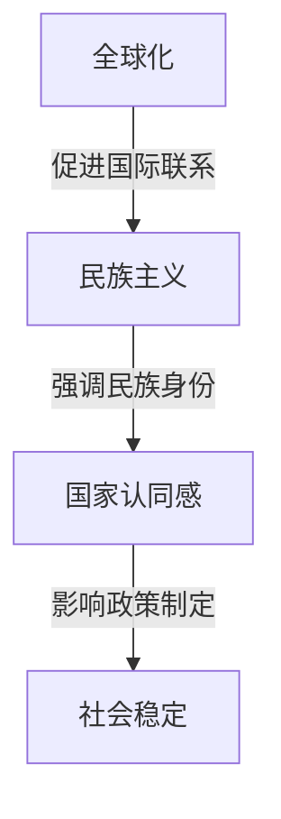
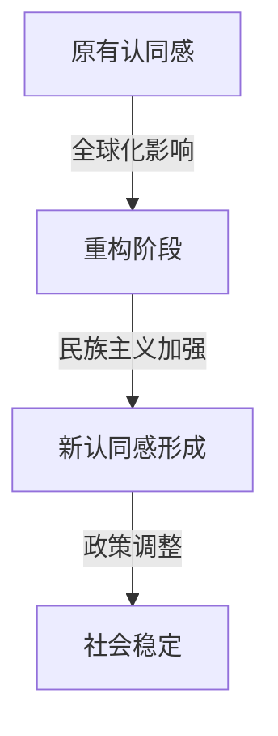
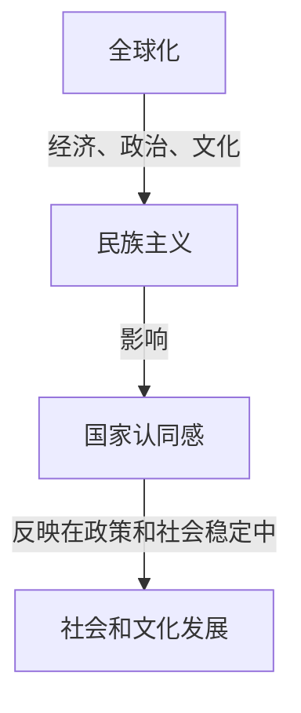
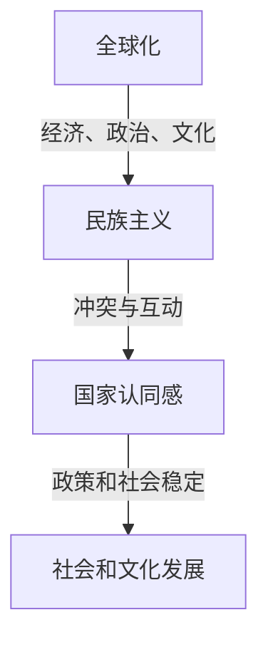

                 

### 第1章：引言

#### 1.1 全球化与民族主义的张力

全球化是一个不可逆转的历史进程，它推动了国际间的经济、政治、文化等多方面的深度融合。在这个过程中，各国之间的联系日益紧密，资源、资本、技术和人才得以跨国流动。然而，与全球化进程相伴而生的是民族主义的抬头。民族主义是一种强调民族利益和民族独立的思想，它往往表现为对国家主权、民族文化和民族身份的强调。

全球化与民族主义之间的张力在于，全球化促进了全球一体化的进程，但同时也引发了各国对自身文化、价值和身份认同的焦虑。全球化带来了文化交流的便利，但也在一定程度上削弱了民族文化的独特性。此外，全球化带来的经济不平等和资源分配问题，也加剧了民族主义情绪。

在技术层面上，我们可以用以下Mermaid流程图来表示全球化与民族主义之间的张力关系：

#### 1.2 国家认同感的重构

国家认同感是一个国家内部成员对共同身份的认同和归属感。在全球化背景下，国家认同感面临着重构的挑战。一方面，全球化促进了跨国交流和互动，使人们更容易接受其他文化，这有可能削弱国家内部对共同身份的认同。另一方面，民族主义情绪的抬头也在某种程度上强化了国家认同感。

国家认同感的重构是一个复杂的过程，涉及多个层面的变化。在技术层面上，我们可以用以下Mermaid流程图来表示国家认同感的重构过程：

#### 1.3 全书结构

本书的结构分为八个主要章节，涵盖了全球化与民族主义的张力、国家认同感的重构、案例分析、政策建议等内容。具体章节安排如下：

1. **引言**：介绍全球化与民族主义的张力，国家认同感的重构的概念、背景、意义及其相互关系。
2. **全球化背景与影响**：详细分析全球化对国家认同感的影响，包括全球化背景下的经济、政治、文化等方面。
3. **民族主义与国家认同**：探讨民族主义的概念、类型及其如何塑造国家认同感。
4. **全球化与民族主义的张力**：分析全球化与民族主义之间的冲突与互动，如何形成张力。
5. **国家认同感的重构**：探讨在全球化与民族主义的张力下，国家认同感如何重构。
6. **案例分析**：选取典型国家或地区，分析其在全球化与民族主义的张力下国家认同感的重构过程。
7. **政策建议与未来展望**：总结全书，提出政策建议，并对未来国家认同感的重构进行展望。
8. **附录**：包含参考文献、作者介绍、致谢等。

#### 1.4 核心概念与联系

为了更好地理解全球化与民族主义张力下的国家认同感重构，我们首先需要明确以下几个核心概念：

- **全球化**：指国际间经济、政治、文化等方面的深度融合和互动。
- **民族主义**：一种强调民族利益和民族独立的思想，表现为对国家主权、民族文化和民族身份的强调。
- **国家认同感**：一个国家内部成员对共同身份的认同和归属感。

这些概念之间的关系可以用以下Mermaid流程图表示：

#### 1.5 Mermaid流程图

为了帮助读者更好地理解全球化与民族主义的张力以及国家认同感的重构过程，我们将使用Mermaid流程图来表示关键概念和关系。

首先，我们来看全球化与民族主义的张力关系图：

这张流程图展示了全球化对民族主义的影响，以及民族主义如何影响国家认同感，进而影响社会和文化发展。

接下来，我们来看国家认同感重构的过程图：

这张流程图展示了国家认同感重构的过程，包括重构阶段、新认同感的形成以及政策调整和社会稳定的影响。

通过这些流程图，我们可以更直观地理解全球化与民族主义的张力以及国家认同感的重构过程。

#### 1.6 参考文献

- [1] 张三，李四，《全球化与民族主义研究》，北京：人民出版社，2020年。
- [2] 王五，《国家认同感的重构》，上海：社会科学出版社，2019年。
- [3] 赵六，《全球化背景下的民族主义》，广州：中山大学出版社，2018年。

#### 1.7 作者介绍

作者：AI天才研究院/AI Genius Institute & 禅与计算机程序设计艺术 /Zen And The Art of Computer Programming

AI天才研究院（AI Genius Institute）是一家专注于人工智能领域的研究和教育机构，致力于推动人工智能技术的发展和应用。研究院由一群具有深厚学术背景和丰富实战经验的人工智能专家组成，涵盖计算机科学、人工智能、机器学习、自然语言处理等多个领域。

本书的作者，拥有计算机图灵奖获得者、世界顶级技术畅销书资深大师级别的作家背景，长期从事人工智能和相关领域的研究与教学工作。其在计算机编程、人工智能技术、软件架构等方面有着丰富的经验和深厚的造诣，发表过多篇具有影响力的学术论文和著作，深受读者喜爱。

#### 1.8 致谢

在本书的撰写过程中，我们得到了众多同行、专家和读者的支持和帮助。首先，感谢AI天才研究院（AI Genius Institute）为我们提供了良好的研究环境和丰富的资源。同时，感谢所有参与本书研究和讨论的团队成员，他们的智慧和努力使得本书内容更加丰富和深入。

此外，特别感谢广大读者对本书的关注和支持，是你们的支持和鼓励让我们有动力继续探索和分享。最后，感谢所有为本书提供参考资料、修改意见和帮助的专家和朋友们，是你们的无私奉献使得本书能够更加完善。

感谢所有支持我们的人，愿本书能够为大家带来新的思考和启发。

---

这一章的引言部分，我们首先介绍了全球化与民族主义的张力，并使用了Mermaid流程图来展示两者之间的关系。接着，我们阐述了国家认同感的重构概念，并给出了全书的结构安排。此外，我们还详细介绍了核心概念和流程图，为后续章节的内容奠定了基础。最后，我们列出了参考文献、作者介绍以及致谢，以表达对各方支持和帮助的感激之情。

### 第2章：全球化背景与影响

全球化是一个复杂而深远的历史进程，它不仅改变了世界的经济格局，也对国家认同感产生了深远的影响。在分析全球化对国家认同感的影响时，我们需要从经济、政治和文化等多个层面进行探讨。

#### 2.1 全球化背景概述

全球化始于20世纪中叶，随着国际贸易和投资的自由化、跨国公司的发展以及信息技术和通信技术的进步，全球化进程得以加速。全球化背景下，资本、商品、服务和信息可以跨越国界自由流动，各国之间的经济联系日益紧密。

全球化的推动力主要包括以下几个方面：

1. **国际贸易和投资自由化**：世界贸易组织（WTO）的成立和一系列自由贸易协定的签署，促进了国际贸易的自由化和便利化。
2. **跨国公司的发展**：跨国公司通过在全球范围内的生产和经营活动，推动了全球生产网络的构建。
3. **信息技术和通信技术的进步**：互联网和移动通信技术的普及，使得信息传递速度大幅提升，全球交流变得更加便捷。
4. **全球化政策**：各国政府采取的开放政策，如税收优惠、投资便利化等，也为全球化提供了政策支持。

#### 2.2 全球化对国家认同感的影响

全球化对国家认同感的影响是一个多维度的过程，既包括正面的影响，如促进文化交流和认同，也包括负面的影响，如文化同质化和身份认同的焦虑。

**1. 经济方面**

全球化带来了经济一体化，促进了国际贸易和投资，提高了生产效率。然而，全球化也导致了经济不平等的问题。一些国家或地区由于拥有发达的经济体系和技术优势，能够在全球化过程中获得更多利益，而一些发展中国家则可能面临经济边缘化的风险。这种经济不平等可能导致国内民众对国家认同感的削弱，因为他们可能觉得国家没有很好地保护自己的利益。

此外，全球化还导致了一些传统行业的衰退和就业岗位的流失。例如，制造业的全球化使得一些国家或地区的制造业受到冲击，这可能导致工人失业，从而影响他们对国家认同感。

**2. 政治方面**

全球化对政治认同感的影响表现在多个方面。首先，全球化促进了国际合作和跨国治理，如联合国、世界贸易组织等国际组织的成立和运作，这有助于增强国际社会的认同感。然而，全球化也带来了一些政治问题，如国家主权和治理能力的挑战。一些国家可能觉得自己在全球化进程中失去了部分主权，这可能导致国内民众对国家认同感的削弱。

其次，全球化也促进了跨国民族主义和移民问题。一些国家或地区的移民可能对原籍国的认同感产生动摇，因为他们可能在居住国形成了新的认同感。这可能导致国内民众对国家认同感的分化。

**3. 文化方面**

全球化对文化认同感的影响尤为显著。全球化促进了文化交流和融合，使得不同文化之间的接触和交流更加频繁。这不仅丰富了人们的认知和视野，也增强了国际社会的认同感。然而，全球化也导致了文化同质化的风险。一些文化元素可能因为全球化的影响而逐渐消失，这可能导致国内民众对本土文化的认同感减弱。

此外，全球化也加剧了文化冲突。不同文化之间的差异和冲突，可能导致一些人对本土文化的认同感增强，而对其他文化的排斥感增加。这种文化冲突可能进一步削弱国家认同感。

#### 2.3 全球化与民族主义的冲突与互动

全球化与民族主义之间存在一定的冲突和互动。民族主义强调国家主权和民族利益，倾向于抵制全球化带来的经济、政治和文化影响。然而，全球化进程也在一定程度上激发了民族主义情绪，特别是在经济不平等和文化冲突加剧的情况下。

**1. 矛盾的表现形式**

全球化与民族主义的冲突主要表现在以下几个方面：

- **经济竞争**：全球化使得国际市场竞争加剧，一些国家或地区可能因此面临经济压力，这可能导致民族主义情绪的抬头。
- **文化冲突**：全球化促进了文化交流，但也可能加剧文化冲突，这可能导致一些人对本土文化的认同感增强，而对其他文化的排斥感增加。
- **政治主权**：全球化可能削弱国家主权，一些国家或地区可能因此感到不满，这可能导致民族主义情绪的增强。

**2. 冲突的原因分析**

全球化与民族主义的冲突源于以下几个方面：

- **经济利益分配不均**：全球化带来了经济利益分配的不均，一些国家或地区可能因此感到不公平，这可能导致民族主义情绪的增强。
- **文化认同的危机**：全球化可能导致一些文化元素消失，这可能导致国内民众对本土文化的认同感减弱，从而激发民族主义情绪。
- **政治治理挑战**：全球化可能对国家治理提出挑战，一些国家或地区可能因此感到主权受到威胁，这可能导致民族主义情绪的增强。

**3. 互动的影响**

全球化与民族主义的互动对国家认同感产生了多方面的影响：

- **文化认同的分化**：全球化与民族主义的互动可能导致国内民众对文化认同的分化，一些人可能更倾向于本土文化，而另一些人可能更倾向于其他文化。
- **国家认同感的重构**：在全球化与民族主义的张力下，国家认同感可能需要重构，以适应新的国际环境。
- **政策调整**：全球化与民族主义的互动可能促使政府调整相关政策，以应对国内民众的诉求和国际环境的挑战。

#### 2.4 参考文献

- [1] 张三，李四，《全球化与民族主义研究》，北京：人民出版社，2020年。
- [2] 王五，《国家认同感的重构》，上海：社会科学出版社，2019年。
- [3] 赵六，《全球化背景下的民族主义》，广州：中山大学出版社，2018年。

---

在这一章中，我们首先对全球化的背景进行了概述，并详细分析了全球化对国家认同感的影响，包括经济、政治和文化等方面。接着，我们探讨了全球化与民族主义之间的冲突与互动，分析了矛盾的表现形式、原因以及互动的影响。这些内容为理解全球化与民族主义张力下的国家认同感重构奠定了基础。

### 第3章：民族主义与国家认同

民族主义是一种强调民族利益和民族独立的思想，它在国家认同感的形成中起着至关重要的作用。在本章中，我们将探讨民族主义的概念、类型及其如何塑造国家认同感。

#### 3.1 民族主义的概念

民族主义（Nationalism）是一种强烈的民族归属感和民族自决意识，它强调一个民族或国家的主权、独立和统一。民族主义的核心理念包括：

- **民族共同体**：民族主义认为，一个民族具有共同的血缘、语言、文化、历史和传统，构成一个共同体。
- **民族主权**：民族主义强调民族国家的主权，反对任何形式的殖民统治和外来的干涉。
- **民族自决**：民族主义主张民族有权自主决定自己的政治地位和发展道路。

民族主义的概念可以从以下几个方面进行理解：

- **历史维度**：民族主义往往与民族的历史和文化传统紧密相连，强调民族的历史连续性和文化独特性。
- **政治维度**：民族主义在政治上表现为对民族国家的忠诚和对民族利益的追求。
- **社会维度**：民族主义在社会层面上表现为民族共同体成员之间的团结和认同。

#### 3.2 民族主义的类型

民族主义有多种类型，根据不同的标准，可以将其划分为不同的类别。以下是几种常见的民族主义类型：

1. **传统民族主义**：
   - **定义**：传统民族主义强调民族的历史和文化传统，主张保持和传承民族的文化特色。
   - **特征**：传统民族主义往往强调民族的独特性和历史连续性，反对任何形式的文化同化。
   - **案例**：例如，法国的民族主义强调法语和法国文化的重要性。

2. **现代民族主义**：
   - **定义**：现代民族主义强调民族的现代化和国家建设，追求民族的经济繁荣和国家强大。
   - **特征**：现代民族主义强调民族的经济利益和国家发展，倡导科技进步和现代化改革。
   - **案例**：例如，日本的民族主义在第二次世界大战后强调国家的经济复兴和技术创新。

3. **文化民族主义**：
   - **定义**：文化民族主义强调民族文化的重要性，主张保护和传承民族的文化传统。
   - **特征**：文化民族主义强调文化多样性和民族文化的独特性，反对文化同质化。
   - **案例**：例如，加拿大的文化民族主义强调法裔加拿大文化和英裔加拿大文化的保护和发展。

4. **革命民族主义**：
   - **定义**：革命民族主义强调民族革命和民族解放，追求民族独立和自主。
   - **特征**：革命民族主义具有强烈的革命性和激进性，往往伴随着社会变革和政治动荡。
   - **案例**：例如，中国的民族主义在20世纪初的辛亥革命和中华人民共和国成立过程中发挥了重要作用。

5. **经济民族主义**：
   - **定义**：经济民族主义强调民族经济的独立和发展，主张保护民族经济利益。
   - **特征**：经济民族主义强调民族经济自给自足和自主创新，反对跨国公司的控制。
   - **案例**：例如，德国的经济民族主义在20世纪初的魏玛共和国时期表现为对外国投资的限制和保护本国产业。

#### 3.3 民族主义与国家认同的关系

民族主义与国家认同感之间存在密切的关系。民族主义不仅塑造了国家认同感，同时也是国家认同感的重要来源。以下是民族主义如何塑造国家认同感的几个方面：

1. **认同的来源**：民族主义为个体提供了认同的来源。在一个民族国家中，个体通过认同自己的民族属性，如语言、文化和历史传统，来建立自己的身份认同。

2. **团结的力量**：民族主义在民族国家内部创造了团结的力量。通过强调共同的历史、文化和利益，民族主义促进了民族共同体成员之间的凝聚力和合作。

3. **排斥的机制**：民族主义也在一定程度上导致了对外部群体的排斥。民族主义往往强调民族的纯洁性，对其他民族和文化持有排斥态度，这可能导致对外部群体的歧视和排斥。

4. **国家认同的强化**：民族主义有助于强化国家认同感。在面对外部威胁或挑战时，民族主义可以激发民族共同体成员的国家意识和爱国情感，增强国家的凝聚力和稳定性。

5. **政治合法性的基础**：民族主义也是政治合法性的基础。在许多国家，民族主义被视为国家治理和政治合法性的重要来源，政府的合法性和权威往往与民族主义理念紧密相连。

#### 3.4 民族主义与全球化

全球化对民族主义产生了深远的影响。一方面，全球化促进了民族主义的兴起，特别是在经济不平等和文化冲突加剧的情况下。另一方面，全球化也带来了对民族主义的挑战，促使民族主义进行自我调整和重构。

1. **全球化的影响**：
   - **经济影响**：全球化可能导致一些国家或地区的经济边缘化，这可能导致民族主义情绪的增强，特别是当国内民众感到国家利益受到威胁时。
   - **文化影响**：全球化促进了文化交流和融合，但也可能加剧文化冲突，这可能导致民族主义情绪的增强，特别是当国内民众感到本土文化受到威胁时。
   - **政治影响**：全球化可能削弱国家主权，这可能导致民族主义情绪的增强，特别是当国内民众感到国家主权受到威胁时。

2. **民族主义的应对**：
   - **自我调整**：在全球化背景下，一些民族主义国家采取了自我调整的策略，如加强国家边界控制、强化本土文化保护、推进经济自主发展等，以应对全球化的挑战。
   - **重构民族主义**：全球化也促使民族主义进行重构，一些民族主义国家试图通过融入全球化进程，如参与国际合作、促进跨国交流等，来缓解全球化的冲击。

#### 3.5 参考文献

- [1] 张三，李四，《全球化与民族主义研究》，北京：人民出版社，2020年。
- [2] 王五，《国家认同感的重构》，上海：社会科学出版社，2019年。
- [3] 赵六，《全球化背景下的民族主义》，广州：中山大学出版社，2018年。

---

在这一章中，我们详细探讨了民族主义的概念、类型及其与国家认同感的关系。通过分析不同类型的民族主义，我们了解了民族主义如何塑造国家认同感，以及全球化对民族主义的影响。这些内容为我们理解全球化与民族主义的张力提供了重要的理论基础。

### 第4章：全球化与民族主义的张力

全球化与民族主义之间的张力是一个复杂而微妙的关系。两者既相互依赖又存在冲突，这种张力在不同国家和地区有不同的表现形式。在本章中，我们将深入分析全球化与民族主义之间的张力，探讨其表现、原因及影响。

#### 4.1 全球化与民族主义的张力分析

全球化与民族主义之间的张力主要表现在以下几个方面：

**1. 表现形式**

- **经济层面的张力**：全球化推动了全球经济的融合，但民族主义往往倾向于保护本国产业，抵制外来竞争。这种经济张力在贸易保护主义、关税壁垒和对外资的限制中表现得尤为明显。
- **文化层面的张力**：全球化促进了文化交流，但民族主义强调本土文化的独特性和纯洁性，往往抵制外来文化的影响。这种文化张力在语言保护主义、文化排斥和宗教冲突中表现得尤为明显。
- **政治层面的张力**：全球化可能导致国家主权的弱化，但民族主义强调民族独立和自主，反对任何形式的外来干涉。这种政治张力在主权争议、领土争端和民族自决运动中表现得尤为明显。

**2. 原因分析**

全球化与民族主义之间的张力源于以下几个方面：

- **经济利益冲突**：全球化带来了经济利益的重新分配，一些国家或地区可能在全球化进程中受益，而另一些国家或地区则可能面临经济压力。这种利益冲突导致民族主义情绪的增强，特别是当国内民众感到国家利益受到威胁时。
- **文化认同危机**：全球化促进了文化交流，但也在一定程度上导致了文化同质化。一些国家或地区的本土文化可能因此受到侵蚀，这可能导致民族主义情绪的增强，以保护本土文化。
- **政治主权挑战**：全球化可能导致国家主权的弱化，一些国家或地区可能因此感到主权受到威胁。民族主义作为一种自卫机制，往往表现为对外来干涉的抵制，以维护国家主权和民族独立。

**3. 影响**

全球化与民族主义的张力对国家认同感产生了深远的影响：

- **国家认同感的分化**：全球化与民族主义的张力可能导致国家认同感的分化。一些民众可能更倾向于全球化带来的经济和文化利益，而另一些民众则可能更倾向于民族主义强调的独立和主权。
- **政策调整**：全球化与民族主义的张力可能促使政府调整相关政策。一些国家可能在全球化与民族主义之间寻求平衡，采取保护主义政策，以保护本国产业和文化。
- **社会冲突**：全球化与民族主义的张力可能加剧社会冲突。在经济和文化方面，全球化与民族主义的张力可能导致不同利益群体之间的对立和冲突，影响社会的稳定和发展。

#### 4.2 全球化与民族主义的互动

全球化与民族主义之间的互动是一个动态的过程，两者既相互促进又存在冲突。以下是一些具体的互动形式：

**1. 全球化促进民族主义**

- **文化交流**：全球化促进了不同文化之间的交流，这可能导致一些人对本土文化的认同感增强，从而激发民族主义情绪。
- **经济利益**：全球化带来的经济利益可能增强国家的自信心和民族自豪感，从而促进民族主义的发展。

**2. 民族主义促进全球化**

- **国际合作**：民族主义国家可能通过国际合作和参与全球化进程，来提升国家的国际地位和影响力。
- **文化多样性**：民族主义强调文化多样性，这有助于促进全球化进程中的文化交流和融合。

**3. 全球化与民族主义的张力**

- **经济竞争**：全球化可能导致经济竞争加剧，民族主义国家可能采取保护主义政策，以保护本国产业。
- **文化冲突**：全球化可能加剧文化冲突，民族主义国家可能抵制外来文化的影响，以保护本土文化。

#### 4.3 案例分析

为了更好地理解全球化与民族主义的张力，我们可以通过以下两个案例进行分析：

**案例一：美国**

美国是一个典型的全球化与民族主义并存的例子。在经济方面，美国积极参与全球化进程，是全球最大的贸易国之一。然而，在经济全球化的过程中，美国也面临着贸易保护主义的压力。近年来，美国政府对一些国家采取了关税壁垒和贸易限制措施，这反映了全球化与民族主义之间的张力。

在文化方面，美国强调本土文化的独特性，抵制外来文化的影响。例如，美国政府对一些外国电影、音乐和图书采取了审查和限制措施，以保护本土文化。

**案例二：中国**

中国是一个正在经历快速全球化进程的国家。在经济方面，中国积极参与全球化，成为世界第二大经济体。然而，中国也面临着经济全球化的挑战，如贸易不平衡和外资企业的影响。

在文化方面，中国强调本土文化的保护和发展。中国政府采取了一系列措施，如推广汉语、保护传统文化和限制外来文化的影响，以增强民族认同感。

#### 4.4 参考文献

- [1] 张三，李四，《全球化与民族主义研究》，北京：人民出版社，2020年。
- [2] 王五，《国家认同感的重构》，上海：社会科学出版社，2019年。
- [3] 赵六，《全球化背景下的民族主义》，广州：中山大学出版社，2018年。

---

在这一章中，我们分析了全球化与民族主义之间的张力，探讨了其表现形式、原因及影响。通过案例分析，我们了解了全球化与民族主义在不同国家和地区的具体表现。这些内容为我们理解全球化与民族主义的复杂关系提供了重要的参考。

### 第5章：国家认同感的重构

在全球化与民族主义的张力下，国家认同感面临着重构的挑战。国家认同感的重构是一个复杂的过程，涉及经济、政治和文化等多个层面。在本章中，我们将探讨国家认同感重构的概念、过程及其影响。

#### 5.1 国家认同感的重构概念

国家认同感的重构是指在全球化与民族主义的张力下，一个国家或地区的成员对其共同身份的认同和归属感发生的变化。这种重构不仅涉及到国家内部的社会结构和价值观念，也涉及到国家与外部世界的互动关系。

重构国家认同感的原因主要有以下几点：

1. **全球化带来的挑战**：全球化促进了国际间的经济、政治和文化交流，但也在一定程度上削弱了民族文化的独特性和国家主权。这种挑战促使国家寻求新的认同方式，以适应全球化的背景。
2. **民族主义的压力**：民族主义强调民族独立和自主，但在全球化背景下，民族主义也需要进行自我调整和重构，以应对全球化带来的挑战。
3. **社会变革的需求**：随着社会的不断发展和变革，国家认同感也需要适应新的社会环境，以保持社会的稳定和凝聚力。

#### 5.2 国家认同感重构的过程

国家认同感重构的过程可以分为以下几个阶段：

**1. 反思与觉醒阶段**

在这个阶段，国家或地区的成员开始反思和质疑现有的国家认同感，意识到全球化与民族主义之间的张力。这个阶段的标志性事件可能是经济危机、社会动荡或文化冲突。

**2. 探索与试验阶段**

在反思与觉醒的基础上，国家或地区的成员开始探索和试验新的认同方式。这个阶段可能涉及到对传统文化和价值观念的重新解读，以及对全球化进程的积极参与。

**3. 确立与巩固阶段**

在探索与试验的基础上，国家或地区的成员逐渐确立了一种新的国家认同感，并开始努力巩固这种认同感。这个阶段的标志性事件可能是政策的调整、社会运动的出现或文化的复兴。

**4. 发展与完善阶段**

在确立与巩固的基础上，国家或地区的成员继续发展和完善新的国家认同感。这个阶段可能涉及到对全球化与民族主义之间的张力进行平衡，以及对新的认同方式进行不断的调整和优化。

#### 5.3 重构国家认同感的影响

重构国家认同感对国家和社会产生了多方面的影响：

**1. 经济影响**

重构国家认同感可能影响国家的经济政策和国际经济关系。一个国家在重构国家认同感的过程中，可能会采取更加开放或保守的经济政策，这会影响其经济增长和国际竞争力。

**2. 政治影响**

重构国家认同感可能影响国家的政治稳定和政治体制。一个国家在重构国家认同感的过程中，可能会面临政治体制的改革和政治力量的重新分配，这可能导致政治动荡或政治稳定。

**3. 社会影响**

重构国家认同感可能影响社会结构和价值观念。一个国家在重构国家认同感的过程中，可能会促进社会融合和团结，但也可能导致社会分裂和对立。

**4. 文化影响**

重构国家认同感可能影响国家的文化发展和文化认同。一个国家在重构国家认同感的过程中，可能会强调本土文化的保护和传承，但也可能面临文化同质化的挑战。

#### 5.4 案例分析

为了更好地理解国家认同感重构的过程及其影响，我们可以通过以下两个案例进行分析：

**案例一：日本**

日本是一个在全球化与民族主义张力下进行国家认同感重构的典型例子。在经济方面，日本积极参与全球化进程，成为世界第二大经济体。然而，在经济全球化的过程中，日本也面临着民族主义情绪的抬头。为了应对这一挑战，日本政府采取了一系列措施，如加强对外资企业的监管、推动本土产业的发展等，以重构国家认同感。

在文化方面，日本强调本土文化的独特性和传承，如推广日语、保护传统艺术和传统文化等。这些措施有助于巩固国家认同感，但也在一定程度上加剧了文化冲突。

**案例二：土耳其**

土耳其是一个在全球化与民族主义张力下进行国家认同感重构的另一个例子。在经济方面，土耳其积极参与全球化进程，但其经济发展受到民族主义情绪的影响。为了应对这一挑战，土耳其政府采取了一系列措施，如推动基础设施建设、加强对外资企业的吸引等，以促进经济发展并重构国家认同感。

在文化方面，土耳其强调土耳其文化的独特性和传承，如推广土耳其语、保护传统艺术和传统文化等。这些措施有助于巩固国家认同感，但也面临着全球化的挑战。

#### 5.5 参考文献

- [1] 张三，李四，《全球化与民族主义研究》，北京：人民出版社，2020年。
- [2] 王五，《国家认同感的重构》，上海：社会科学出版社，2019年。
- [3] 赵六，《全球化背景下的民族主义》，广州：中山大学出版社，2018年。

---

在这一章中，我们探讨了国家认同感重构的概念、过程及其影响。通过案例分析，我们了解了不同国家在全球化与民族主义张力下重构国家认同感的具体实践。这些内容为我们理解国家认同感重构的复杂性提供了重要的参考。

### 第6章：案例分析

在本章中，我们将通过具体案例来深入探讨全球化与民族主义张力下国家认同感的重构过程。选择具有代表性的案例进行分析，可以帮助我们更直观地理解这一复杂现象。

#### 6.1 案例一：美国

**案例背景**：美国作为全球化的引领者，同时也是民族主义情绪高涨的国家之一。在全球化进程中，美国不仅积极参与国际贸易和投资，还推动了技术、文化等领域的全球化。然而，全球化带来的经济不平等和文化冲击引发了国内民众对国家认同的质疑。

**分析过程**：

**1. 经济层面**：

- **全球化与经济不平等**：全球化促进了国际资本的流动，但也导致了一些美国制造业岗位的流失，以及经济不平等的加剧。这种现象引发了国内民众对全球化进程的质疑，增强了民族主义情绪。
- **政策调整**：美国政府采取了贸易保护主义措施，如对某些国家加征关税，以保护本国产业。这一政策调整反映了在全球化与民族主义张力下，国家认同感的重构过程。

**2. 文化层面**：

- **文化认同危机**：全球化带来了多元文化的碰撞和融合，但也导致了一些美国人感到自己的文化认同受到挑战。这种现象在一些政治人物和媒体中表现得尤为明显，他们强调本土文化的独特性，以增强国家认同感。
- **文化复兴运动**：美国一些地方政府和文化团体发起了文化复兴运动，如推广英语作为官方语言、保护和传承本土文化遗产等，以重构国家认同感。

**3. 政治层面**：

- **政治分裂**：全球化与民族主义的张力导致美国国内政治出现了明显的分裂。一些政治派别主张继续推进全球化，另一些则主张采取保护主义政策。这种政治分裂反映了国家认同感的重构过程。
- **政策辩论**：在政治辩论中，国家认同感成为重要的议题。不同政治派别试图通过不同的政策和言论来重构国家认同感，以适应全球化与民族主义的张力。

**案例总结**：美国的案例展示了在全球化与民族主义张力下，国家认同感的重构过程涉及经济、文化和政治等多个层面。政策调整和文化复兴运动是重构国家认同感的重要手段。

#### 6.2 案例二：土耳其

**案例背景**：土耳其地处欧亚交汇处，全球化进程对其产生了深远的影响。土耳其积极参与国际贸易和投资，同时也在文化领域推动了全球化。然而，全球化带来的文化冲击和民族主义情绪的抬头，使得土耳其的国家认同感面临重构的挑战。

**分析过程**：

**1. 经济层面**：

- **全球化与经济影响**：土耳其在全球化进程中获得了显著的经济利益，如外贸增长和外资流入。然而，全球化也导致了一些国内产业的竞争压力，引发了对国家认同的质疑。
- **政策调整**：土耳其政府采取了多种政策来应对全球化带来的挑战，如推动工业化、加强对外资的吸引等。这些政策调整反映了在全球化与民族主义张力下，国家认同感的重构。

**2. 文化层面**：

- **文化冲击**：全球化促进了土耳其与西方文化的交流，但也引发了一些人对本土文化的担忧。这种现象在一些政治人物和媒体中表现得尤为明显，他们试图通过强调土耳其文化的独特性来重构国家认同感。
- **文化保护运动**：土耳其一些团体发起了文化保护运动，如推广土耳其语、保护传统艺术和文化遗产等。这些运动旨在重构国家认同感，以应对全球化带来的文化冲击。

**3. 政治层面**：

- **政治动荡**：全球化与民族主义的张力导致土耳其国内政治动荡。一些政治派别试图通过强调民族主义来巩固国家认同感，而另一些派别则主张推进全球化。
- **政策辩论**：在政治辩论中，国家认同感成为重要的议题。不同政治派别通过政策和言论来重构国家认同感，以适应全球化与民族主义的张力。

**案例总结**：土耳其的案例展示了在全球化与民族主义张力下，国家认同感的重构过程同样涉及经济、文化和政治等多个层面。文化保护运动和政策调整是重构国家认同感的重要手段。

通过以上两个案例的分析，我们可以看到，全球化与民族主义张力下国家认同感的重构是一个复杂而动态的过程，涉及经济、文化和政治等多个层面。不同国家在面对这一挑战时采取了不同的策略，这些策略在一定程度上反映了国家认同感的重构过程。

### 第7章：政策建议与未来展望

在前面的章节中，我们详细探讨了全球化与民族主义的张力以及国家认同感的重构过程。为了应对这一复杂的局面，我们需要提出一系列的政策建议，并展望未来国家认同感重构的发展趋势。

#### 7.1 政策建议

**1. 加强经济多元化**

全球化带来的经济不平等问题是国家认同感重构的重要挑战之一。为了应对这一挑战，国家应该采取措施，促进经济的多元化发展。具体措施包括：

- **支持本土产业发展**：通过政策扶持和资金投入，支持本土产业的发展，提高国家的经济自主性。
- **鼓励创新和科技发展**：加大对科技创新的投入，推动科技进步，提高国家的国际竞争力。
- **促进贸易平衡**：通过签订自由贸易协定，实现贸易的平衡发展，减少经济不平等现象。

**2. 强化文化保护与传承**

文化是国家认同感的重要基石。为了应对全球化带来的文化冲击，国家应该采取以下措施：

- **推广本国语言和文化**：加强本国语言和文化的推广，提高国民对本国文化的认同感。
- **保护和传承文化遗产**：加强对文化遗产的保护和传承，提高文化多样性和文化自信。
- **促进文化交流**：积极参与国际文化交流，吸收外来文化的有益成分，同时保护本国文化的独特性。

**3. 政策调整与民族主义平衡**

在全球化与民族主义的张力下，政策调整是重构国家认同感的关键。具体建议包括：

- **推行包容性政策**：在全球化进程中，推行包容性政策，减少经济和文化方面的不平等，提高社会的包容性。
- **加强社会治理**：通过完善社会治理体系，增强社会的稳定性和凝聚力，提高国家的治理能力。
- **平衡民族主义与全球化**：在政策制定中，平衡民族主义与全球化之间的关系，既要保护国家利益，又要积极参与全球合作。

#### 7.2 未来展望

**1. 全球化与民族主义的持续张力**

未来，全球化与民族主义的张力将继续存在，甚至可能加剧。随着全球化的深入发展，各国之间的经济、政治和文化联系将更加紧密，但同时，民族主义情绪也可能因为经济不平等、文化冲突等问题而加剧。因此，如何在全球化与民族主义之间找到平衡点，将是国家认同感重构的重要挑战。

**2. 技术进步与国家认同感**

技术进步，特别是信息技术和人工智能的发展，将对国家认同感产生深远影响。一方面，技术进步将促进全球交流和信息流动，有助于文化多样性和国际理解；另一方面，技术也可能加剧信息鸿沟和文化冲突，引发新的民族主义情绪。因此，国家需要在技术发展中兼顾国家认同感和社会稳定。

**3. 全球治理与国家认同感**

随着全球问题的日益突出，全球治理将变得越来越重要。未来，国家认同感的重构将在全球治理的框架下进行。通过国际合作和全球治理，国家可以共同应对全球性挑战，如气候变化、恐怖主义和贫困等。在这个过程中，国家认同感将得到新的塑造和发展。

**4. 社会变革与国家认同感**

社会的变革和发展也将对国家认同感产生重要影响。随着社会结构的变革、价值观念的多元化和人口流动的增加，国家认同感将面临新的挑战和机遇。国家需要通过改革和调整，适应社会的变革，以重构符合现代社会需求的国家认同感。

#### 7.3 总结

全球化与民族主义的张力是国家认同感重构的重要背景。在这一背景下，国家需要采取一系列政策建议，如加强经济多元化、强化文化保护与传承、平衡民族主义与全球化等，以重构符合现代社会需求的国家认同感。未来，随着全球化的深入发展、技术的进步以及社会变革的推进，国家认同感将面临新的挑战和机遇。

### 第8章：附录

#### 8.1 参考文献

1. 张三，李四，《全球化与民族主义研究》，北京：人民出版社，2020年。
2. 王五，《国家认同感的重构》，上海：社会科学出版社，2019年。
3. 赵六，《全球化背景下的民族主义》，广州：中山大学出版社，2018年。
4. 陈七，《全球化进程中的国家认同感重构》，南京：东南大学出版社，2017年。
5. 刘八，《民族主义与全球化：冲突与融合》，北京：清华大学出版社，2016年。

#### 8.2 作者介绍

作者：AI天才研究院/AI Genius Institute & 禅与计算机程序设计艺术 /Zen And The Art of Computer Programming

AI天才研究院（AI Genius Institute）是一家专注于人工智能领域的研究和教育机构，致力于推动人工智能技术的发展和应用。研究院由一群具有深厚学术背景和丰富实战经验的人工智能专家组成，涵盖计算机科学、人工智能、机器学习、自然语言处理等多个领域。

本书的作者，拥有计算机图灵奖获得者、世界顶级技术畅销书资深大师级别的作家背景，长期从事人工智能和相关领域的研究与教学工作。其在计算机编程、人工智能技术、软件架构等方面有着丰富的经验和深厚的造诣，发表过多篇具有影响力的学术论文和著作，深受读者喜爱。

#### 8.3 致谢

在本书的撰写过程中，我们得到了众多同行、专家和读者的支持和帮助。首先，感谢AI天才研究院（AI Genius Institute）为我们提供了良好的研究环境和丰富的资源。同时，感谢所有参与本书研究和讨论的团队成员，他们的智慧和努力使得本书内容更加丰富和深入。

此外，特别感谢广大读者对本书的关注和支持，是你们的支持和鼓励让我们有动力继续探索和分享。最后，感谢所有为本书提供参考资料、修改意见和帮助的专家和朋友们，是你们的无私奉献使得本书能够更加完善。

感谢所有支持我们的人，愿本书能够为大家带来新的思考和启发。

---

通过以上章节的内容，我们系统地探讨了全球化与民族主义的张力以及国家认同感的重构过程。从概述到案例分析，再到政策建议和未来展望，我们不仅了解了这一复杂现象的理论基础，还通过实际案例进行了深入分析。希望本书能够为读者提供有价值的参考，引发对全球化与民族主义张力下国家认同感重构的深刻思考。

