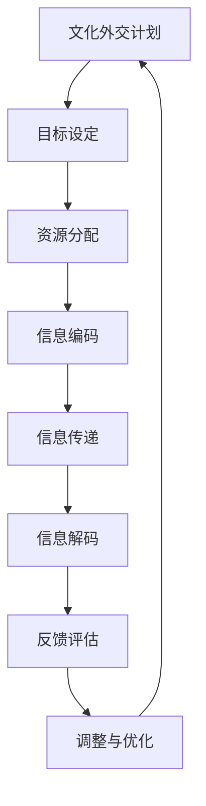
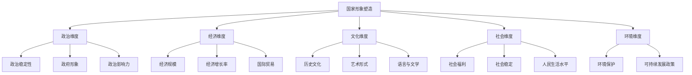

                 

### 标题：《全球化时代的文化外交：公共外交与国家形象塑造》

---

#### 关键词：全球化、文化外交、公共外交、国家形象塑造、软实力

#### 摘要：
本文探讨了全球化时代的文化外交、公共外交与国家形象塑造的相互关系。首先，介绍了全球化时代的文化外交背景及其重要性。接着，阐述了公共外交的概念、实施策略及其在国家形象塑造中的作用。本文还深入分析了国家形象的概念构成与塑造理论，并探讨了全球化背景下文化外交面临的挑战与对策。最后，提出了未来文化外交和国家形象塑造的发展趋势与策略，以期为相关领域的研究和实践提供参考。

---

## 引言

### 全球化时代的文化外交背景

全球化是20世纪末以来最为显著的国际现象之一。全球化不仅改变了经济、政治和社会结构，还深刻影响了文化领域。在全球化的背景下，文化外交成为国家间互动的重要手段之一。文化外交涉及通过文化活动和交流来促进国家之间的理解、合作与和平。它不仅是一种外交工具，也是国家软实力的重要组成部分。

文化外交的历史可以追溯到古代，但其在现代国际关系中的重要性日益凸显。随着全球化进程的加速，文化交流的频率和规模不断扩大，文化外交成为国家间沟通的重要桥梁。在全球化的背景下，文化外交不仅涉及传统的艺术、文学和语言等领域，还包括现代科技、媒体和数字文化等新兴领域。

### 文化外交的重要性

文化外交在全球化时代具有重要意义。首先，文化外交有助于提升国家的国际形象和软实力。通过展示本国的文化特色和价值观念，国家可以增强国际社会对其认同和好感。其次，文化外交有助于促进跨文化交流和相互理解。通过文化交流，不同文化背景的人们可以更好地理解彼此，减少误解和冲突。此外，文化外交还可以为国家的经济、政治和社会发展提供支持。通过文化交流，国家可以吸引外国投资、拓展市场、促进文化产业的繁荣。

### 公共外交的兴起

公共外交是指政府通过非政府渠道，如媒体、非政府组织、民间团体等，与外国公众进行交流与互动。公共外交的目标是影响外国公众的看法和态度，从而为政府的对外政策创造有利的外部环境。公共外交与传统的国家间外交相比，具有更广泛的受众和更灵活的传播方式。

公共外交的兴起是全球化时代的产物。随着信息技术的快速发展，国际交流变得更加便捷和迅速，公共外交成为政府影响国际公众的重要手段。公共外交不仅包括文化交流，还包括公众意见调查、网络外交、媒体合作等方面。

### 国家形象塑造的多维度

国家形象是指国际社会对一个国家的总体认知和评价。国家形象的塑造是一个多维度的过程，包括政治、经济、文化、社会等多个方面。在全球化时代，国家形象成为国家软实力的重要组成部分，对国家的国际地位、外交政策、经济发展等方面产生重要影响。

国家形象塑造的维度包括：

1. **政治维度**：包括国家的政治制度、政治稳定性和政治影响力。
2. **经济维度**：包括国家的经济规模、经济增长率、国际贸易和投资。
3. **文化维度**：包括国家的文化特色、文化价值观、文化影响力。
4. **社会维度**：包括国家的教育水平、社会福利、社会稳定。

本文旨在探讨全球化时代的文化外交、公共外交与国家形象塑造的相互关系，分析文化外交在全球化时代的重要性，以及公共外交和国家形象塑造的策略与实践。通过深入分析，本文希望为相关领域的研究和实践提供有益的参考。

## 研究背景与意义

全球化是20世纪末以来最为显著的国际现象之一。它不仅改变了经济、政治和社会结构，也对文化领域产生了深远影响。全球化时代的文化外交，作为一种新型的外交形式，逐渐成为国家间互动的重要手段。本节将探讨全球化对文化外交的影响，公共外交在国家形象塑造中的作用，以及当前国家形象塑造面临的挑战与机遇。

### 全球化对文化外交的影响

全球化使世界各国之间的联系更加紧密，文化交流变得更加频繁和多样化。全球化不仅为文化外交提供了新的机遇，也带来了一系列挑战。

首先，全球化促进了文化的多样性和互鉴。不同文化在全球化过程中相互碰撞、交流与融合，形成了独特的文化现象。例如，全球化使得国际电影、音乐、文学等艺术形式在全球范围内传播，丰富了人们的文化生活。

其次，全球化对文化外交提出了新的要求。在全球化的背景下，国家需要更加注重跨文化交流和理解。这要求国家在文化外交中不仅要展示本国的文化特色，还要尊重其他文化的差异，促进文化的平等对话。

最后，全球化改变了文化外交的形式和内容。传统的文化外交主要依靠政府间的文化交流活动，而全球化使得非政府组织、民间团体和媒体等在文化外交中扮演越来越重要的角色。网络技术和数字媒体的兴起，也为文化外交提供了新的平台和手段。

### 公共外交在国家形象塑造中的作用

公共外交是国家形象塑造的重要手段之一。通过公共外交，国家可以向外国公众展示其价值观念、发展成就和文化特色，从而塑造积极的国际形象。

首先，公共外交有助于提升国家的国际声誉和软实力。通过文化交流、国际合作和公众意见调查等手段，国家可以影响外国公众对其的看法和态度，增强国际社会对国家的认同和好感。

其次，公共外交有助于塑造国家形象的多维度。国家形象不仅包括政治和经济方面，还包括文化、社会和环境等方面。公共外交可以通过展示国家在这些方面的成就和努力，塑造全面而立体的国家形象。

最后，公共外交有助于应对国际挑战和危机。在全球化时代，国家面临的各种国际挑战和危机，如恐怖主义、环境污染和人权问题等，都需要通过公共外交来化解和缓解。公共外交可以为国家提供应对这些挑战的有力支持。

### 当前国家形象塑造的挑战与机遇

全球化时代，国家形象塑造面临诸多挑战和机遇。

首先，文化冲突和误解是当前国家形象塑造的主要挑战之一。全球化带来了文化的多样性和互鉴，但同时也引发了文化冲突和误解。国家需要在文化外交中妥善处理这些问题，促进文化的平等对话和相互理解。

其次，全球信息传播的快速和便捷，为公共外交提供了新的机遇。通过互联网和社交媒体，国家可以更直接地与外国公众进行互动，传递本国的发展理念和价值观。

最后，经济全球化和国际合作的深化，为公共外交和国家形象塑造提供了新的动力。国家可以通过参与国际组织和多边合作，展示其负责任的国际形象和全球治理能力。

总之，全球化时代的文化外交、公共外交与国家形象塑造相互关联、互为支撑。通过有效的文化外交和公共外交，国家可以塑造积极的国际形象，提升国家的软实力和国际竞争力。同时，国家形象塑造也是文化外交和公共外交的重要目标之一。通过塑造良好的国家形象，国家可以更好地实现其外交政策目标，推动全球和平与发展。

## 文化外交的理论基础

### 文化外交的概念与历史发展

文化外交是一种通过文化交流和互动来促进国家间相互理解和合作的国际关系手段。它涉及一系列文化活动和项目，如艺术展览、文化交流、学术合作、国际电影节等。文化外交不仅是一种外交工具，也是国家软实力的重要组成部分。

文化外交的历史可以追溯到古代。在古代，文化外交主要通过帝王使节、学者和文化使者的交流来实现。例如，古代丝绸之路不仅是贸易通道，也是文化交流的桥梁，促进了东西方的文化互动。然而，现代意义上的文化外交是在20世纪中叶随着国际关系的复杂化和多极化而逐渐发展起来的。

在冷战时期，文化外交成为东西方两大阵营之间的一种重要竞争手段。西方国家通过文化交流来传播其价值观和政治理念，而东方国家则通过文化展示来强调自身的文化特色和政治立场。冷战结束后，文化外交在国际关系中的作用进一步扩大。各国意识到，通过文化交流可以促进国家间的相互理解和合作，为和平与发展创造良好的国际环境。

### 文化外交的核心原则

文化外交的核心原则包括平等、尊重、互惠和共赢。这些原则确保了文化外交的公正性和可持续性。

1. **平等**：文化外交强调各国在文化交流中的地位平等，避免文化霸权和文化侵略。各国应尊重对方的文化差异，避免将自己的文化价值观念强加于他国。

2. **尊重**：文化外交要求尊重不同文化背景下的价值观、信仰和习俗。通过尊重，各国可以建立互信，减少误解和冲突。

3. **互惠**：文化外交追求互惠互利，各国通过文化交流可以实现资源共享、知识传播和文化繁荣。

4. **共赢**：文化外交旨在通过文化交流实现共赢，各国可以在文化上互相学习和借鉴，共同提升文化水平和国际影响力。

### 文化外交的理论框架

文化外交的理论框架主要包括文化作为软实力的作用、文化外交与公共外交的关系以及文化外交的战略目标。

1. **文化作为软实力的作用**：文化是一种软实力，它可以增强国家的国际吸引力和影响力。通过文化外交，国家可以展示其文化魅力和价值观念，吸引外国公众对国家的关注和认同。文化软实力的提升有助于国家在国际社会中占据有利地位。

2. **文化外交与公共外交的关系**：文化外交是公共外交的重要组成部分。公共外交包括文化外交、经济外交、环境外交等多方面的外交活动。文化外交通过文化交流和互动，直接影响外国公众的看法和态度，为公共外交的总体目标服务。

3. **文化外交的战略目标**：文化外交的战略目标包括促进跨文化交流、提升国家形象、推动国际合作和实现文化繁荣。通过实施具体的文化外交项目，国家可以实现这些战略目标，为国家的长期发展奠定基础。

### 文化外交的理论模型

文化外交的理论模型主要涉及多维度分析框架、动态过程模型和效果评估模型。

1. **多维度分析框架**：文化外交的多维度分析框架将文化外交视为一个包含文化、政治、经济、社会等多个维度的复杂系统。通过多维度分析，可以更全面地理解文化外交的内在机制和外部影响。

2. **动态过程模型**：文化外交的动态过程模型描述了文化外交的运行过程，包括计划、执行、评估和调整等阶段。该模型有助于理解文化外交的动态变化和长期效果。

3. **效果评估模型**：效果评估模型用于衡量文化外交的成效。通过定量和定性的方法，效果评估模型可以评估文化外交项目的影响，为后续的文化外交决策提供依据。

综上所述，文化外交的理论基础包括概念与历史发展、核心原则、理论框架和理论模型。这些理论为文化外交的研究和实践提供了指导，有助于更好地理解和实施文化外交策略。

### 文化外交的概念与历史发展

#### 文化外交的定义

文化外交是一种通过文化活动和项目来促进国家间相互理解、合作与和平的外交手段。它不仅包括官方的文化交流项目，如艺术展览、国际电影节、文化论坛等，还涉及民间和半官方的文化交流形式，如文化交流协会、非政府组织（NGO）以及跨国文化交流项目。

文化外交的核心目的是通过文化的传播与互动，提升国家的国际形象和软实力，增强国家在国际社会中的影响力。与传统的硬实力（如军事、经济力量）相比，文化外交更注重通过软性手段来达到外交目标，即通过文化价值观、艺术形式和文化遗产的展示来吸引外国公众的注意和认同。

#### 文化外交的历史演变

文化外交的历史可以追溯到古代，但现代意义上的文化外交起源于19世纪末和20世纪初。以下是一些重要的历史节点：

1. **19世纪末至20世纪初**：随着工业革命和殖民扩张，欧洲大国开始通过文化手段来展示其文化优越性和政治影响力。例如，法国通过建立法兰西学院和派驻海外的文化使节，推广法语和文化。

2. **第一次世界大战后**：1919年，国际联盟（League of Nations）成立，其下设有国际文化合作委员会，旨在通过文化交流来促进国际合作与和平。

3. **冷战时期**：冷战期间，文化外交成为东西方两大阵营之间的一种战略工具。西方国家通过文化交流推广自由民主价值观，而东方国家则通过文化展示强调社会主义价值观。

4. **冷战结束与全球化**：冷战结束后，文化外交的作用更加显著。全球化带来了文化多样性和交流的便利，各国通过文化外交来提升自身的国际形象和软实力。

#### 文化外交的核心原则

文化外交在实践中遵循以下核心原则：

1. **平等**：文化外交强调文化交流中的平等地位，避免文化霸权和文化侵略。各国在文化交流中应相互尊重，平等对待。

2. **尊重**：文化外交要求尊重不同文化背景下的价值观、信仰和习俗。通过相互尊重，可以减少误解和冲突，建立互信。

3. **互惠**：文化外交追求互惠互利，通过资源共享和知识传播，实现文化的共同繁荣。

4. **共赢**：文化外交旨在通过文化交流实现共赢，各国可以在文化上互相学习和借鉴，共同提升文化水平和国际影响力。

#### 文化外交的应用领域

文化外交的应用领域非常广泛，包括：

1. **艺术与文化**：通过艺术展览、国际电影节、音乐会、戏剧演出等形式，展示各国的艺术成就和文化特色。

2. **教育与合作**：通过学术交流、师生交换、联合研究项目等形式，促进不同国家间的教育合作。

3. **媒体与传播**：通过媒体合作、文化交流项目、国际新闻报道等形式，提升国家的国际传播力和影响力。

4. **文化遗产保护**：通过跨国文化遗产保护项目、数字化文化资源的共享，促进文化遗产的保护与传承。

#### 文化外交的优势与挑战

**优势**：

- **提升国家形象**：通过展示本国的文化魅力和价值观，提升国家的国际形象和软实力。
- **促进文化交流**：通过跨文化交流，促进不同文化之间的理解和融合。
- **增加国际合作**：通过文化交流，建立国际合作关系，推动经济、政治等多领域的合作。

**挑战**：

- **文化冲突与误解**：不同文化之间可能存在冲突和误解，影响文化交流的顺利进行。
- **资源与成本**：文化外交需要大量的人力、物力和财力投入，对国家的资源分配提出了挑战。
- **政治干预**：文化外交可能受到政治因素的影响，导致文化交流偏离初衷。

总之，文化外交作为一种重要的外交手段，在全球化时代发挥着越来越重要的作用。通过有效的文化外交策略，国家可以提升自身的国际影响力，促进全球文化的多样性和互鉴。

### 文化外交的理论框架

文化外交作为一个跨学科领域，涉及政治学、社会学、文化学等多个学科的理论基础。以下将详细探讨文化外交的理论框架，包括文化作为软实力的作用、文化外交与公共外交的关系以及文化外交的战略目标。

#### 文化作为软实力的作用

**软实力**（Soft Power）是由美国政治学家约瑟夫·奈（Joseph Nye）提出的一个概念，指的是通过吸引而非强制手段来影响他人行为的能力。文化作为软实力的重要组成部分，具有以下几个方面的作用：

1. **提升国家吸引力**：文化是国家形象的重要组成部分。通过展示本国的文化魅力和价值观，国家可以提升其在国际社会中的吸引力，吸引外国公众和投资者的关注。

2. **传播价值观**：文化是一个国家价值观的载体。通过文化交流，国家可以传播其核心价值观和意识形态，影响外国公众的思想和态度。

3. **促进国际合作**：文化是国际合作的重要基础。通过文化合作项目，国家可以在教育、科技、经济等领域建立广泛的国际合作网络，推动全球治理和国际秩序的构建。

#### 文化外交与公共外交的关系

文化外交与公共外交（Public Diplomacy）密切相关，但二者也有明显的区别。公共外交是指政府通过非国家渠道，如媒体、非政府组织、民间团体等，与外国公众进行交流与互动。而文化外交是公共外交的重要组成部分，主要涉及通过文化活动和项目来影响外国公众的看法和态度。

1. **文化外交是公共外交的核心**：公共外交的目标是影响外国公众的看法和态度，而文化外交正是实现这一目标的重要手段。通过文化活动，如文化交流项目、国际电影节、艺术节等，文化外交可以直接接触和影响外国公众。

2. **公共外交支持文化外交**：公共外交通过媒体宣传、公众意见调查、网络外交等手段，为文化外交提供支持和配合。例如，通过媒体宣传，可以提升文化交流项目的知名度和影响力，吸引更多外国公众的参与。

#### 文化外交的战略目标

文化外交的战略目标主要包括以下几个方面：

1. **促进跨文化交流**：通过文化交流项目，促进不同文化之间的理解和互鉴，减少文化误解和冲突。

2. **提升国家形象**：通过文化展示和传播，提升国家的国际形象和软实力，增强国家的国际影响力。

3. **推动国际合作**：通过文化合作项目，建立国际合作关系，推动经济、科技、教育等多领域的合作。

4. **保护文化遗产**：通过跨国文化遗产保护项目，保护和传承各国的文化遗产，促进全球文化的多样性和可持续发展。

#### 文化外交的理论模型

文化外交的理论模型主要包括多维度分析框架、动态过程模型和效果评估模型。

1. **多维度分析框架**：文化外交的多维度分析框架将文化外交视为一个包含文化、政治、经济、社会等多个维度的复杂系统。通过多维度分析，可以更全面地理解文化外交的内在机制和外部影响。

2. **动态过程模型**：文化外交的动态过程模型描述了文化外交的运行过程，包括计划、执行、评估和调整等阶段。该模型有助于理解文化外交的动态变化和长期效果。

3. **效果评估模型**：效果评估模型用于衡量文化外交的成效。通过定量和定性的方法，效果评估模型可以评估文化外交项目的影响，为后续的文化外交决策提供依据。

总之，文化外交的理论框架为理解和实施文化外交策略提供了理论基础。通过有效的文化外交策略，国家可以提升自身的国际影响力，促进全球文化的多样性和互鉴。

### 文化外交的核心原则

#### 文化外交的平等原则

文化外交的平等原则是确保文化交流过程中各方地位平等、避免文化霸权和文化侵略的基础。在全球化背景下，各国文化多样性日益显著，如何在文化交流中尊重和保护各种文化，是实现文化外交目标的关键。

首先，平等原则要求文化外交活动中各方应遵循相互尊重、平等对待的原则。在文化交流项目中，不应将自己的文化价值观念强加于他国，而是要尊重并接受不同文化背景下的价值观、信仰和习俗。例如，在跨文化交流项目中，应确保各方文化代表有平等的发言权和参与权，避免文化中心主义的现象。

其次，平等原则还体现在资源的分配和共享上。文化外交项目需要大量的人力、物力和财力支持，各国在资源分配上应遵循公平、公正的原则，确保资源能够有效地服务于各方的文化需求。此外，文化交流项目应注重可持续性，确保文化交流的长期效果，而不仅仅是短期的展示和宣传。

#### 文化外交的尊重原则

尊重原则是文化外交的核心原则之一，它要求在文化交流过程中，各国应尊重其他文化的差异和独特性。尊重不仅是文化外交的基本道德要求，也是实现文化交流互鉴的重要条件。

首先，尊重原则要求文化外交活动中，各方应尊重对方的文化价值观和信仰。不同文化背景下的人们对世界的看法、对生活的态度和价值观存在差异，文化外交应充分理解和尊重这些差异，避免因文化冲突和误解导致的文化隔阂。

其次，尊重原则还体现在文化保护上。在全球化的进程中，一些传统文化面临消失的风险。文化外交应通过跨国合作，共同保护和传承各国的文化遗产。例如，通过国际文化合作项目，保护非物质文化遗产、数字化文化遗产等，确保全球文化的多样性和可持续发展。

#### 文化外交的互惠原则

互惠原则是文化外交的重要原则，它强调在文化交流过程中，各国应实现资源共享、知识传播和文化繁荣。互惠原则不仅有助于提升文化交流的深度和广度，也有利于促进国际文化的互鉴和共同发展。

首先，互惠原则要求在文化交流项目中，各方应实现资源共享。例如，在学术交流项目中，各国高校和研究机构可以共同分享研究成果、学术资源和实验设备，提升学术研究的质量和影响力。在文化产业方面，各国可以通过合作开发文化产品，共享市场资源，实现文化产业的共同繁荣。

其次，互惠原则还强调在文化交流过程中，各国应促进知识的传播与共享。通过文化交流项目，如国际学术会议、文化论坛和研讨会等，各国可以分享文化知识、学术成果和实践经验，促进全球文化的互鉴和共同发展。

#### 文化外交的共赢原则

共赢原则是文化外交的最高目标，它要求在文化交流过程中，各方应实现共同发展和繁荣。共赢原则不仅体现了文化交流的互惠性，也反映了全球文化共同体的理念。

首先，共赢原则要求在文化交流项目中，各方应共同努力，实现共同发展。通过文化交流，各国可以促进经济、科技、教育等领域的合作，共同应对全球性挑战，实现共同繁荣。

其次，共赢原则还强调在文化交流过程中，各方应尊重和包容不同的文化价值观和习俗。在全球化的背景下，文化多样性是文化交流的重要基础。只有尊重和包容不同的文化，才能实现真正的文化共赢。

总之，文化外交的平等、尊重、互惠和共赢原则是确保文化交流顺利进行和取得长期成效的重要保障。通过遵循这些原则，各国可以更好地实现文化外交的目标，促进全球文化的多样性和互鉴，为世界的和平与发展作出贡献。

### 文化外交的理论模型

文化外交作为一种复杂的外交手段，其理论模型旨在提供对文化外交过程和效果的系统性理解。以下将详细探讨文化外交的多维度分析框架、动态过程模型和效果评估模型。

#### 多维度分析框架

文化外交的多维度分析框架认为，文化外交不仅涉及文化领域，还涉及政治、经济、社会等多个方面。这种多维度的视角有助于全面理解文化外交的复杂性。

1. **文化维度**：文化维度关注的是文化本身的特点和表现形式，如语言、艺术、传统习俗等。在文化外交中，通过展示和传播本国的文化特色，国家可以增强国际社会对其文化的认同和好感。

2. **政治维度**：政治维度关注文化外交在政治领域的作用，包括国家形象塑造、政治价值观传播、政治影响力的增强等。例如，通过在国际舞台上展示本国的文化成就，国家可以提升其在国际社会的政治地位。

3. **经济维度**：经济维度关注文化外交对经济发展的影响，包括文化交流对旅游、文化产业、国际贸易的推动作用。通过文化外交，国家可以促进文化交流，吸引外国游客和投资，从而推动本国经济的发展。

4. **社会维度**：社会维度关注文化外交对社会发展的影响，包括文化交流对教育、社会稳定、国际关系的促进作用。文化外交可以增进不同文化背景下的人们之间的相互理解和信任，减少社会冲突，促进社会和谐。

#### 动态过程模型

文化外交的动态过程模型描述了文化外交从计划到实施再到评估的整个过程。该模型有助于理解文化外交的各个阶段以及它们之间的相互关系。

1. **计划阶段**：在计划阶段，国家需要制定文化外交的战略和目标，明确文化外交的重点领域和具体项目。这一阶段涉及对国际形势的分析、文化需求的评估以及资源分配的规划。

2. **实施阶段**：在实施阶段，国家通过具体的文化项目来实施文化外交策略。这一阶段涉及文化项目的执行、文化交流活动的组织和国际合作伙伴的选择。有效的文化外交需要各国之间的密切合作和资源的有效整合。

3. **评估阶段**：在评估阶段，国家需要对文化外交项目的效果进行评估，包括文化影响、国际合作、公众反馈等方面。通过评估，国家可以了解文化外交项目的成效，为未来的文化外交提供反馈和改进的方向。

#### 效果评估模型

效果评估模型是衡量文化外交成效的重要工具。通过定量和定性的方法，效果评估模型可以评估文化外交项目的影响，为后续的文化外交决策提供依据。

1. **定量方法**：定量方法包括对文化外交项目的参与人数、项目持续时间、预算支出等数据的统计和分析。例如，通过调查问卷和统计数据，可以评估文化交流项目的参与度和影响力。

2. **定性方法**：定性方法包括对文化外交项目的文化影响、社会效应、国际关系等质性方面的分析。例如，通过深度访谈和案例分析，可以了解文化外交项目对当地社会和文化的影响。

3. **综合评估**：综合评估模型将定量和定性方法相结合，通过多维度的分析，全面评估文化外交项目的效果。例如，通过综合评估模型，可以评估文化外交项目在提升国家形象、促进国际合作、推动文化交流等方面的综合效果。

总之，文化外交的理论模型为理解和实施文化外交策略提供了系统性的框架。通过多维度分析框架、动态过程模型和效果评估模型，国家可以更有效地制定和实施文化外交策略，提升国际影响力，促进全球文化的多样性和互鉴。

### 公共外交的概述

#### 公共外交的定义

公共外交（Public Diplomacy）是指政府通过非国家渠道，如媒体、非政府组织（NGOs）、民间团体、学术机构等，与外国公众进行交流与互动，以影响外国公众对国家的看法和态度，从而为政府的对外政策创造有利的外部环境。公共外交与传统的外交不同，它主要面向的是外国公众，而不是政府官员和决策者。

公共外交的核心目标是通过传播信息、塑造形象、促进理解和建立信任，影响外国公众对国家的认知和态度。它不仅关注国家的外部形象和声誉，还关注如何通过有效的沟通策略，影响外国公众对政府政策和行动的理解和接受。

#### 公共外交的主体与客体

1. **主体**：公共外交的主体主要包括国家政府、外交部门、非政府组织、媒体机构和民间团体。国家政府是公共外交的主要推动者，通过制定政策和提供资源来支持公共外交活动。外交部门负责具体的公共外交实施，如文化交流项目、媒体宣传和国际会议等。非政府组织、媒体机构和民间团体在公共外交中发挥着重要的补充和支持作用。

2. **客体**：公共外交的客体主要是外国公众，包括普通民众、学者、媒体人士、企业家和其他利益相关者。公共外交的目标是通过不同的渠道和手段，直接接触和影响这些客体，使其对国家的政策和行动产生积极的认识和态度。

#### 公共外交的基本原则

1. **透明性**：公共外交应保持透明，公开信息，以增强公众对国家的信任和理解。

2. **互惠性**：公共外交应强调互惠互利，通过文化交流和合作，促进双方文化的理解和融合。

3. **多元性**：公共外交应尊重文化多样性，避免文化霸权，尊重不同文化背景下的价值观和信仰。

4. **持续性**：公共外交应具有持续性，通过长期的文化交流和项目，建立稳定的外部形象和声誉。

5. **灵活性**：公共外交应具备灵活性，根据国际形势和公众需求，及时调整和优化公共外交策略。

#### 公共外交的作用

公共外交在国际关系和国家形象塑造中发挥着重要作用：

1. **提升国家形象**：通过公共外交，国家可以展示其文化、价值观和成就，提升国际社会对其的认同和好感。

2. **促进跨文化交流**：公共外交有助于促进不同文化背景下的相互理解和尊重，减少文化冲突和误解。

3. **增加国际合作**：通过公共外交，国家可以建立广泛的国际合作网络，推动经济、科技、教育等领域的合作。

4. **应对国际挑战**：公共外交在应对国际危机、恐怖主义、环境问题等方面发挥着重要作用，为国家提供有力的国际支持。

总之，公共外交是现代国家实现软实力和国际影响力的重要手段。通过有效的公共外交策略，国家可以提升其国际形象和软实力，为全球和平与发展作出贡献。

### 公共外交的实施路径

公共外交的实施路径多种多样，包括文化交流、媒体宣传、网络外交等多个方面。以下将详细探讨这些实施路径及其具体方法和策略。

#### 文化交流

文化交流是公共外交的核心路径之一，通过艺术、教育、文学、体育等多种形式的文化活动，促进不同文化背景下的相互理解和尊重。

1. **艺术交流**：艺术是文化的重要载体，通过举办国际艺术节、电影展、音乐节等活动，展示本国的艺术成就和文化特色。例如，国际电影节不仅为观众带来了丰富的视听享受，还促进了各国电影产业的合作和交流。

2. **教育交流**：教育交流包括师生交换、学术合作和联合研究项目等。通过这些项目，各国学者和学生可以相互学习，增进对对方文化的了解和尊重。例如，美国的教育交流项目“富布赖特计划”（Fulbright Program）每年都吸引大量来自世界各地的学者和学生参与。

3. **文学交流**：文学是文化交流的重要形式，通过翻译和出版外国文学作品，推广本国的文学作品，可以促进不同文化之间的相互理解和对话。例如，国际文学翻译奖（International Prize for Arabic Fiction）旨在推动阿拉伯文学的国际传播。

4. **体育交流**：体育是各国人民共同的语言，通过举办国际体育比赛、体育交流活动和体育旅游项目，可以促进各国人民之间的友谊和合作。例如，奥运会不仅是体育竞赛的平台，也是各国文化交流的重要机会。

#### 媒体宣传

媒体宣传是公共外交的重要手段，通过传统媒体和新媒体，国家可以向外国公众传递信息，塑造国家形象。

1. **传统媒体**：传统媒体包括电视、广播、报纸和杂志等，它们在公共外交中发挥着重要作用。通过这些渠道，国家可以发布新闻、评论和分析，向外国公众展示国家的政策、成就和价值观。例如，一些国家的政府新闻办公室会定期发布新闻稿，向国际媒体提供信息。

2. **新媒体**：随着互联网和社交媒体的发展，新媒体成为公共外交的重要工具。通过社交媒体平台，国家可以直接与外国公众进行互动，发布实时信息，回应公众关切。例如，许多国家的政府开设了官方社交媒体账号，用于发布新闻和与公众交流。

3. **国际传播**：国际传播是指通过海外媒体和渠道，将国家形象和信息传播到国外。例如，一些国家通过海外电台、电视频道和国际新闻网站，向外国公众传递信息，塑造国家形象。

#### 网络外交

网络外交是数字化时代的一种新型外交形式，通过互联网和数字技术，国家可以在全球范围内进行交流和互动。

1. **网络文化交流**：通过网络平台，各国可以举办虚拟的文化活动，如在线音乐会、艺术展览和文学讲座等。这些活动不仅打破了地理限制，还为不同文化背景的公众提供了交流的机会。

2. **公共舆论监测**：通过监测和分析网络舆论，国家可以了解外国公众对国家政策和行动的看法和态度，及时调整公共外交策略。

3. **网络危机管理**：在网络危机发生时，国家可以通过网络渠道及时发布信息，回应公众关切，缓解危机影响。例如，在突发公共卫生事件或自然灾害时，政府通过网络发布信息，提供帮助和支持。

#### 合作案例

1. **中法文化交流**：中法文化交流是公共外交的典型案例。通过举办巴黎中国电影节、北京法国文化年等活动，中法两国促进了文化交流和相互理解。

2. **美国外交部的社交媒体策略**：美国外交部的社交媒体策略在公共外交中取得了显著成效。通过在Twitter、Facebook等平台上发布信息，美国外交部与全球公众进行了广泛的互动，提升了国家的国际形象。

3. **“一带一路”国际合作**：中国的“一带一路”倡议通过文化交流、基础设施建设和经济合作，促进了沿线国家的合作与发展，是公共外交的重要实践。

总之，公共外交的实施路径多样，通过文化交流、媒体宣传和网络外交等多种手段，国家可以有效地塑造国际形象，促进国际合作和和平发展。

### 公共外交的案例分析

#### 成功的公共外交案例

1. **中法文化交流**：中法文化交流是公共外交的典型案例。2004年，法国总统萨科齐提出“中法文化之春”计划，旨在通过艺术、文学、电影等多种形式，加强两国之间的文化交流。该项目包括巴黎卢浮宫举办中国文物展览、中国高校学生赴法国交流、中法电影合作等。通过这些活动，法国公众对中国文化和艺术有了更深入的了解，增强了两国之间的友谊。

2. **美国的“灯塔计划”**：美国的“灯塔计划”旨在通过文化交流、教育和科技合作，提升美国的国际形象和软实力。该计划在全球范围内建立了一批文化中心，如美国文化中心、图书馆和学术机构，为外国公众提供了解美国文化、教育和社会发展的机会。通过这些文化中心，美国成功地塑造了积极的国际形象，增强了外国公众对美国的认同和好感。

3. **“一带一路”倡议**：中国的“一带一路”倡议通过文化交流、基础设施建设和经济合作，促进了沿线国家的合作与发展。在文化交流方面，“一带一路”倡议举办了大量的文化活动，如国际艺术节、文化论坛和文化展览等。这些活动不仅提升了中国的国际形象，也促进了各国之间的文化交流与合作。

#### 失败的公共外交案例

1. **日本的“新文化外交”**：日本在20世纪90年代提出了“新文化外交”战略，旨在通过文化输出和交流，提升日本在国际社会的形象和影响力。然而，由于过度强调文化输出，忽视了他国文化差异和文化接受度，这一战略并未取得预期的效果。例如，日本在一些文化输出项目中，未能充分考虑当地文化和价值观，导致项目受挫。

2. **英国脱欧后的公共外交**：2016年英国公投决定脱欧后，英国试图通过公共外交来重塑其国际形象。然而，由于缺乏明确的文化外交战略和有效的传播手段，英国的公共外交未能达到预期效果。例如，英国在一些国际活动中，未能有效传达其脱欧后的政策立场和价值观，导致国际社会对其理解和支持不足。

#### 案例启示与借鉴

1. **文化多样性**：成功的公共外交案例表明，尊重和包容文化多样性是关键。在文化交流中，应充分考虑和尊重不同文化背景下的价值观和习俗，避免文化冲突和误解。

2. **长期战略**：公共外交需要长期战略和持续投入。成功的公共外交案例通常具有明确的长期目标和系统性的实施计划，而非临时性的宣传活动。

3. **有效传播**：公共外交的成功依赖于有效的传播手段。应充分利用现代媒体和技术，如社交媒体、数字平台和多媒体手段，提高传播效果。

4. **公众参与**：公共外交应注重公众参与和互动。通过举办各种文化活动，鼓励外国公众的参与和反馈，可以增强文化交流的互动性和实效性。

总之，通过分析成功的公共外交案例和失败的教训，我们可以得出一些有益的启示，为未来的公共外交提供指导和借鉴。

### 国家形象的概念与构成

#### 国家形象的概念

国家形象（National Image）是指国际社会对一个国家的总体认知和评价。它不仅反映了一个国家的政治、经济、文化和社会等方面，还体现了国家在国际社会中的地位和影响力。国家形象是一个复杂的综合体，包括正面和负面的评价，这些评价可能来源于政府、媒体、公众和其他利益相关者。

国家形象的重要性不可忽视。首先，良好的国家形象有助于提升国家的国际地位和软实力，增强国家的国际影响力。其次，国家形象直接影响国际投资、旅游、贸易和文化交流。一个国家形象积极、正面的形象可以吸引外国投资者和游客，促进经济发展和国际合作。此外，国家形象还影响国家的外交政策、国际关系和国际合作，有助于国家在全球化背景下实现自身利益。

#### 国家形象的构成要素

国家形象的构成要素主要包括政治、经济、文化、社会和环境等方面，以下将详细探讨这些要素：

1. **政治维度**：政治维度涉及国家的政治制度、政治稳定性、政府形象和政治影响力。一个国家的政治制度和政策取向、政府的管理能力和外交政策，都会影响国际社会对其的判断和评价。例如，民主国家的政治开放和透明度通常会得到国际社会的积极评价，而政治不稳定和专制制度则可能受到批评。

2. **经济维度**：经济维度包括国家的经济规模、经济增长率、国际投资和贸易状况等。经济实力是国家形象的重要组成部分。一个国家的经济繁荣、稳定和开放，可以提升其在国际社会中的地位和影响力。例如，美国的全球经济地位和强大的经济实力，使其在国际事务中具有重要的话语权。

3. **文化维度**：文化维度涉及国家的历史文化、艺术、文学、语言、宗教等。文化是国家形象的重要组成部分，它反映了一个国家的独特性和多样性。一个国家的文化魅力和文化影响力，可以增强其在国际社会中的吸引力和认同度。例如，法国的文化艺术和时尚在国际上有很高的影响力，使其成为文化软实力的代表。

4. **社会维度**：社会维度包括国家的社会制度、社会福利、社会稳定和人民生活水平等。一个国家的社会稳定和人民的生活质量，是国际社会评价其国家形象的重要指标。例如，瑞士的社会稳定和高质量的生活水平，使其成为国际社会公认的和谐社会。

5. **环境维度**：环境维度涉及国家的环境保护、可持续发展政策和环境质量。环境问题已成为全球关注的重要议题，一个国家在环境保护方面的努力和成就，可以提升其在国际社会中的形象。例如，德国在可再生能源和环境保护方面的积极政策和成果，使其成为全球环境保护的典范。

#### 国家形象的构成要素之间的关系

国家形象的各个构成要素之间相互关联、相互影响，共同构成一个复杂的关系网络。例如，一个国家的政治稳定和经济发展水平，会影响其国际形象和吸引力；一个国家的文化魅力，可以增强其国际影响力；一个国家的社会福利和环境质量，也会影响国际社会对其的评价。

通过综合考虑这些构成要素，国家可以更全面地了解自身的国际形象，制定有效的国家形象塑造策略，提升国家的国际地位和软实力。

### 国家形象塑造的理论模型

国家形象塑造是一个复杂的过程，涉及多个理论模型的相互作用。以下将介绍几种主要的理论模型，包括国家形象塑造的策略模型、传播模型和效果评估模型，并探讨这些模型在实际中的应用。

#### 国家形象塑造的策略模型

国家形象塑造的策略模型主要关注如何通过系统化的策略来提升国家的国际形象。这种模型通常包括以下步骤：

1. **目标设定**：首先，国家需要明确其形象塑造的目标。这些目标可以是提高国际知名度、提升软实力、改善特定负面形象等。

2. **资源分配**：在明确目标后，国家需要根据目标分配资源，包括资金、人力资源和技术等。

3. **信息传播**：通过多种传播渠道，如媒体、文化交流项目、政府发言等，向国际社会传递国家形象信息。

4. **反馈评估**：定期收集和分析国际公众对国家形象的反馈，以调整和优化形象塑造策略。

5. **持续优化**：根据反馈结果，不断调整和优化形象塑造策略，以确保目标的实现。

#### 国家形象塑造的传播模型

传播模型关注国家形象信息的传递和接收过程。这种模型通常包括以下几个环节：

1. **信息编码**：国家需要将形象信息进行编码，使其适应不同文化背景下的受众理解。

2. **信息传递**：通过媒体、网络、文化交流等多种渠道传递国家形象信息。

3. **信息解码**：受众接收信息后，对其进行解码，理解其背后的意义和价值。

4. **反馈机制**：通过调查、社交媒体互动等方式，收集受众对国家形象的反馈，以评估传播效果。

5. **调整与优化**：根据受众反馈，调整传播策略和内容，以实现更好的传播效果。

#### 国家形象塑造的效果评估模型

效果评估模型用于衡量国家形象塑造策略的成效。这种模型通常包括以下方法：

1. **定量评估**：通过数据分析，如调查问卷、社交媒体互动数据等，量化国家形象的改善程度。

2. **定性评估**：通过深度访谈、案例分析等，定性分析国家形象的变化和影响。

3. **综合评估**：结合定量和定性评估方法，全面评估国家形象塑造策略的效果。

4. **反馈循环**：将评估结果反馈到策略模型中，用于调整和优化形象塑造策略。

#### 理论模型在实际中的应用

1. **“一带一路”倡议**：中国的“一带一路”倡议是国家形象塑造的成功案例。通过文化交流、基础设施建设和经济合作，“一带一路”倡议提高了中国的国际知名度和软实力。中国在国际上举办了大量文化交流活动，如国际艺术节、文化论坛等，向世界展示其文化魅力。

2. **韩国的文化外交**：韩国通过文化外交，成功塑造了积极的国家形象。韩国政府在全球范围内推广韩流文化，如韩剧、电影、音乐等，吸引了大量外国粉丝。韩国还通过国际文化合作项目，如首尔设计周、釜山国际电影节等，提升了其在国际文化领域的地位。

3. **美国的公共外交**：美国通过公共外交策略，持续塑造其国际形象。美国在全球设立了多个文化中心，如美国文化中心、图书馆和学术机构，向外国公众传递美国的文化、教育和社会发展信息。同时，美国利用社交媒体平台，与全球公众进行互动，增强其国际影响力。

总之，国家形象塑造的理论模型为实际操作提供了指导。通过有效应用这些模型，国家可以制定和实施系统的形象塑造策略，提升国际形象和软实力，为全球和平与发展作出贡献。

### 国家形象塑造的实践案例

#### 中国的文化外交实践

中国的文化外交在近年来取得了显著的成效，成为国家形象塑造的重要手段。以下将介绍几个具体案例，展示中国在文化外交方面的实践和成果。

1. **孔子学院**：孔子学院是中国推广汉语和中华文化的重要平台。自2004年设立以来，全球范围内的孔子学院已超过500所，遍布五大洲。通过提供汉语课程、文化活动和学术交流，孔子学院为外国学生和公众提供了深入了解中国文化的机会，提高了中国在国际文化领域的地位。

2. **中国文化年**：中国政府定期在世界各国举办中国文化年活动，以集中展示中国丰富的文化遗产和现代文化成就。例如，2010年在墨西哥举办的中国文化年，通过戏剧、电影、音乐、美术等展览，吸引了大量观众，增强了墨西哥公众对中国文化的认识和好感。

3. **“一带一路”文化交流**：“一带一路”倡议不仅涉及经济合作，还强调文化交流。中国通过举办“一带一路”文化交流活动，如国际艺术节、文化论坛等，促进了与沿线国家的文化交流与合作。这些活动不仅加深了各国对中国文化的了解，也促进了国际合作与共赢。

#### 美国的公共外交实践

美国在公共外交方面有着悠久的历史和丰富的经验，以下将介绍几个典型案例。

1. **富布赖特项目**：富布赖特项目是美国政府设立的旗舰文化交流项目，旨在通过奖学金、研究员项目等形式，促进美国与其他国家之间的文化交流和学术合作。自1948年成立以来，富布赖特项目已资助了数万名学者和学生，在全球范围内提升了美国的国际形象。

2. **美国文化中心**：美国在全球设立了多个文化中心，如纽约的林肯中心、洛杉矶的好莱坞中心等。这些文化中心通过举办音乐会、戏剧演出、电影展映等活动，向世界各地观众展示了美国的艺术和文化，增强了外国公众对美国的认同和好感。

3. **“美国大使讲坛”**：“美国大使讲坛”是由美国大使馆举办的系列讲座，邀请美国政治、文化、科技领域的杰出人士，就相关主题进行演讲和讨论。这些活动不仅提供了了解美国政策和社会的窗口，也促进了国际公众对美国价值观和外交政策的理解。

#### 欧盟的文化外交实践

欧盟作为世界上最大的经济体之一，也在文化外交方面进行了积极的实践。

1. **欧洲文化城市**：欧盟定期评选“欧洲文化城市”，为获奖城市提供资金和政策支持，以举办一系列文化活动。这些活动包括艺术展览、音乐会、戏剧演出等，展示了欧洲各国的文化特色，提升了欧盟在国际文化领域的地位。

2. **欧洲文化遗产日**：欧盟每年举办“欧洲文化遗产日”，鼓励成员国开放博物馆、图书馆和历史遗迹，向公众展示欧洲丰富的文化遗产。这一活动不仅加深了欧洲公众对自身文化的了解，也吸引了大量国际游客，提升了欧盟的国际影响力。

3. **“创意欧洲”计划**：“创意欧洲”计划是欧盟资助文化创意产业的重要项目，通过提供资金支持，促进电影、音乐、文学等领域的国际合作和创作。这些项目不仅推动了欧洲文化产业的繁荣，也增强了欧盟在全球文化市场中的竞争力。

总之，通过具体的文化外交和公共外交实践，中国、美国和欧盟等国家成功地塑造了积极的国家形象，提升了国际影响力和软实力。这些实践不仅展示了各国的文化魅力和价值观，也为其他国家的国家形象塑造提供了宝贵的经验和借鉴。

### 全球化对文化外交的影响

#### 全球化背景下的文化多样性

全球化使得世界各地的文化变得更加交织和融合，形成了独特的全球文化景观。全球化背景下的文化多样性体现在多个方面：

1. **文化交流频率的增加**：随着交通和通信技术的快速发展，人们可以更容易地跨越国界进行文化交流。国际艺术节、电影展、音乐节等文化交流活动的频率显著增加，各国文化在全球范围内得以传播和共享。

2. **跨国文化交流的增加**：全球化促进了跨国文化交流的增多，不同文化背景的人们在日常生活中有了更多的互动机会。跨国婚姻、国际旅行、社交媒体等都是跨国文化交流的重要形式。

3. **文化融合现象的加剧**：全球化不仅带来了文化的交流，还促进了文化的融合。在全球化过程中，不同文化之间的互动和融合日益加深，形成了新的文化形式和表达方式。例如，国际美食、跨国电影、混合音乐等都是文化融合的产物。

#### 全球化对文化外交的影响

全球化对文化外交产生了深远的影响，主要表现在以下几个方面：

1. **文化外交的重要性提升**：在全球化的背景下，文化外交成为国家软实力的重要组成部分。通过文化交流，国家可以展示其文化魅力和价值观，提升国际影响力。因此，各国对文化外交的投入和重视程度显著提升。

2. **文化外交手段的多样化**：全球化使得文化外交的手段更加多样化。除了传统的文化交流项目，如艺术展览、国际电影节等，数字技术和新媒体也成为了文化外交的重要工具。通过社交媒体、网络平台和数字内容，文化外交可以更迅速、广泛地传播，吸引更多外国公众的关注。

3. **跨文化交流的挑战**：全球化带来了文化多样性的同时，也带来了跨文化交流的挑战。不同文化背景的人们在交流过程中可能面临语言障碍、价值观差异和文化冲突等问题。如何尊重文化多样性，避免文化霸权和文化误解，成为文化外交的重要课题。

4. **文化外交的国际化**：全球化使得文化外交不再局限于国家之间的双边关系，而是逐渐呈现出国际化趋势。国际组织、跨国公司和非政府组织等在文化外交中扮演越来越重要的角色，成为推动文化多样性和国际合作的重要力量。

#### 全球化时代的文化外交新趋势

在全球化时代，文化外交呈现出一些新的趋势：

1. **数字化文化外交**：随着数字技术的快速发展，数字化文化外交成为文化外交的新趋势。通过社交媒体、在线直播、数字艺术等形式，文化外交可以更便捷、高效地传播，吸引更多的国际受众。

2. **文化多样性的保护与促进**：全球化时代，文化多样性既是机遇也是挑战。文化外交不仅要促进跨文化交流，还要保护和促进文化多样性。通过文化交流项目，各国可以共同保护非物质文化遗产，促进全球文化的可持续发展。

3. **文化外交的多边合作**：全球化时代的文化外交越来越依赖多边合作。通过国际合作，各国可以共同举办大型文化活动，推动全球文化合作与互鉴。

总之，全球化对文化外交产生了深远的影响，带来了新的机遇和挑战。通过有效利用文化外交手段，国家可以提升国际影响力，促进全球文化的多样性和互鉴。

### 文化外交面临的挑战与对策

#### 文化冲突与误解

文化冲突与误解是文化外交面临的主要挑战之一。在全球化的背景下，不同文化之间的接触和交流日益频繁，但同时也伴随着文化冲突和误解的增加。文化冲突通常表现为价值观、信仰、习俗和语言等方面的冲突，而误解则可能源于对对方文化的无知或误解。

**挑战**：

1. **文化差异的加剧**：全球化带来了文化的多样性，但也加剧了不同文化之间的差异。这些差异可能导致误解和冲突，阻碍文化交流的顺利进行。

2. **文化保护与融合的矛盾**：在文化交流过程中，如何平衡文化保护与文化融合是一个重要挑战。过度保护可能导致文化同质化，而过度融合可能导致文化消失。

3. **价值观的碰撞**：不同文化背景下的价值观存在差异，这些差异可能导致文化冲突。例如，个人主义与集体主义的对立、自由与秩序的矛盾等。

**对策**：

1. **文化教育的普及**：通过普及文化教育，提高公众对其他文化的认知和理解，减少误解和冲突。文化教育可以从学校教育、公共讲座和文化活动等多方面进行。

2. **跨文化交流项目的多样化**：通过举办多样化的跨文化交流项目，促进不同文化背景的人们之间的互动和了解。例如，国际艺术节、文化交流节、学生交换项目等。

3. **建立文化交流平台**：建立文化交流平台，为不同文化背景的人们提供交流和互动的机会。这些平台可以包括在线社交媒体、文化交流中心和文化艺术节等。

#### 文化多样性的平衡与包容

文化多样性的平衡与包容是文化外交面临的重要挑战。在全球化的背景下，如何尊重和保护文化多样性，同时促进文化之间的互鉴和融合，是一个复杂的课题。

**挑战**：

1. **文化保护与发展的矛盾**：在全球化进程中，一些传统文化面临消失的风险。如何在保护传统文化的同时，促进其发展，是一个重要挑战。

2. **文化同质化趋势**：全球化带来的文化同质化趋势可能导致文化多样性的减少。如何平衡全球化与本土文化的发展，避免文化同质化，是一个关键问题。

3. **文化包容性的不足**：在一些情况下，文化包容性不足可能导致文化冲突和歧视。如何提升文化包容性，促进不同文化的和谐共存，是一个重要课题。

**对策**：

1. **文化多样性政策**：制定和实施文化多样性政策，保护和促进文化多样性。这些政策可以包括文化遗产保护计划、文化多样性宣传和教育培训等。

2. **文化交流与互鉴**：通过文化交流和互鉴，促进不同文化之间的理解和尊重。例如，举办国际文化节、文化论坛和文化展览等。

3. **多元文化教育**：在学校和社区中推广多元文化教育，提高公众对文化多样性的认知和尊重。多元文化教育可以包括课程设置、教材开发和课外活动等。

#### 国际合作的深化与拓展

国际合作是文化外交的重要支撑。在全球化的背景下，如何深化和拓展国际合作，提升文化外交的成效，是一个重要的挑战。

**挑战**：

1. **国际合作的复杂性**：文化外交涉及不同国家和文化背景，国际合作的过程复杂，需要克服文化差异、政治利益和经济利益等多方面的挑战。

2. **资源分配的不均衡**：在文化外交中，资源分配的不均衡可能导致国际合作的不平衡。一些国家和地区可能在资源和技术方面占据优势，而其他国家和地区则可能处于劣势。

3. **国际合作的可持续性**：如何确保文化外交的国际合作具有可持续性，是一个重要挑战。国际合作项目需要长期投入和持续支持，以确保其成效和持续性。

**对策**：

1. **加强国际合作机制**：通过建立国际合作机制，如国际文化合作组织、文化交流平台和文化论坛等，加强各国之间的合作与协调。

2. **共享文化资源和知识**：通过共享文化资源和知识，促进国际文化的互鉴和共同发展。例如，通过跨国文化项目、联合研究和文化数据库等，实现资源共享。

3. **促进文化产业的国际合作**：通过促进文化产业的国际合作，推动文化产品的国际化和市场化。例如，通过跨国文化企业合作、文化交流项目和跨国文化节等，提升文化产业的国际竞争力。

总之，文化外交在全球化时代面临诸多挑战，但通过有效的对策和策略，可以克服这些挑战，实现文化多样性的平衡与包容，深化和拓展国际合作，提升国家的国际影响力和软实力。

### 文化外交的创新与发展

#### 数字化时代的文化外交

随着数字技术的快速发展，数字化文化外交成为文化外交的新趋势。数字化文化外交不仅改变了文化交流的方式，也为文化外交带来了新的机遇和挑战。

1. **在线文化交流**：通过社交媒体、在线直播和虚拟现实（VR）等技术，文化外交可以实现更广泛的在线文化交流。例如，在线音乐会、虚拟展览和文化论坛等，使不同文化背景的公众可以实时参与和互动。

2. **数字文化遗产保护**：数字化技术为文化遗产的保护和传承提供了新的手段。通过数字化扫描和存储，文化遗产可以以数字形式保存和传播，避免因自然灾害、战争等原因导致的损失。

3. **数字文化教育**：数字化文化教育为公众提供了便捷的学习资源。通过在线课程、数字图书馆和文化教育APP等，公众可以随时随地学习不同文化的知识和价值观。

#### 跨文化交流的新模式

跨文化交流在新形势下呈现出新的模式和特点。

1. **多文化互动**：全球化使得跨文化交流不再局限于传统的面对面交流，而是转向多文化互动。通过多文化互动平台，不同文化背景的人们可以在虚拟空间中进行交流和合作，实现文化的多元共存和互鉴。

2. **文化创新融合**：跨文化交流的融合性增强，不同文化之间的创新融合成为趋势。例如，跨国文化合作项目、混合文化创作和国际文化合作企业等，都是跨文化交流的创新模式。

3. **文化包容性**：在跨文化交流中，文化包容性日益受到重视。通过尊重和保护不同文化的独特性和多样性，跨文化交流可以实现文化的共存和共享。

#### 文化外交的发展趋势

文化外交在未来将继续发展和演变，主要趋势包括：

1. **数字化与智能化**：随着数字化和智能化技术的不断进步，文化外交将更加依赖数字技术和智能工具，实现文化外交的智能化和高效化。

2. **国际合作与融合**：文化外交将更加注重国际合作与融合，通过跨国文化合作项目和国际文化交流平台，促进全球文化的互鉴和共同发展。

3. **文化多样性保护**：在全球化背景下，文化多样性保护将成为文化外交的重要任务。通过制定和实施文化多样性政策，保护和促进全球文化的多样性和可持续发展。

4. **文化价值传播**：文化外交将更加注重文化价值的传播，通过文化交流和互动，传播本国的文化价值观，提升国家的国际影响力和软实力。

总之，数字化时代的文化外交、跨文化交流的新模式以及文化外交的发展趋势，为文化外交提供了新的机遇和挑战。通过不断创新和发展，文化外交将为全球文化的繁荣和人类社会的和谐作出更大的贡献。

### 结论

#### 主要发现与贡献

本文通过对全球化时代的文化外交、公共外交与国家形象塑造的深入研究，得出以下主要发现和贡献：

首先，全球化背景下，文化外交的重要性日益凸显。通过文化交流和互动，国家可以提升国际影响力，塑造积极的国际形象，为国际合作创造有利的外部环境。

其次，公共外交在国家形象塑造中发挥着关键作用。通过多样化的公共外交策略，国家可以影响外国公众的看法和态度，提升国家的国际声誉和软实力。

最后，国家形象塑造是一个多维度的过程，涉及政治、经济、文化和社会等多个方面。有效的国家形象塑造策略，可以增强国家的国际竞争力，促进全球文化的多样性和互鉴。

#### 展望与未来趋势

在未来，文化外交、公共外交和国家形象塑造将继续发展，主要趋势包括：

1. **数字化与智能化**：随着数字化和智能化技术的进步，文化外交将更加依赖数字技术和智能工具，实现文化交流和互动的智能化和高效化。

2. **国际合作与融合**：文化外交将更加注重国际合作与融合，通过跨国文化合作项目和国际文化交流平台，促进全球文化的互鉴和共同发展。

3. **文化多样性保护**：在全球化的背景下，文化多样性保护将成为文化外交的重要任务。通过制定和实施文化多样性政策，保护和促进全球文化的多样性和可持续发展。

4. **文化价值传播**：文化外交将更加注重文化价值的传播，通过文化交流和互动，传播本国的文化价值观，提升国家的国际影响力和软实力。

总之，通过不断探索和创新，文化外交、公共外交和国家形象塑造将在全球化时代发挥更大的作用，为全球文化的繁荣和人类社会的和谐作出更大的贡献。

### 研究局限与展望

#### 研究局限

尽管本文在全球化时代的文化外交、公共外交与国家形象塑造方面进行了深入探讨，但仍存在一些研究局限：

1. **数据来源的限制**：本文主要依赖文献资料和案例分析，数据来源相对有限，可能无法全面反映全球化时代的复杂现实。

2. **案例分析的选择性**：本文选择了几个典型的文化外交案例进行分析，但这些案例可能无法代表所有国家和地区的文化外交实践。

3. **时间跨度的限制**：本文的研究时间跨度有限，未能涵盖全球化全过程的文化外交发展，可能导致一些动态变化和新兴趋势未能得到充分探讨。

#### 未来研究方向与建议

为了进一步深化对全球化时代文化外交、公共外交与国家形象塑造的研究，本文提出以下研究方向与建议：

1. **多维度数据分析**：未来研究可以采用更加丰富的数据来源，包括问卷调查、实证研究和大数据分析，以提供更全面和深入的分析。

2. **跨国比较研究**：通过比较不同国家和地区的文化外交实践，分析其差异和共同点，为全球化背景下的文化外交提供更具操作性的策略。

3. **长期跟踪研究**：对特定国家或地区的文化外交进行长期跟踪研究，探讨文化外交的长期效果和持续性，为政策制定提供科学依据。

4. **新技术的应用**：结合数字化和智能化技术，探讨新技术在文化外交中的应用，如在线文化交流平台、数字文化遗产保护和虚拟现实（VR）技术等。

总之，通过不断拓展研究方法和深化研究内容，文化外交、公共外交和国家形象塑造的研究将更加丰富和系统，为全球文化的繁荣和人类社会的和谐发展提供有力的理论支持和实践指导。

## 附录

### A. 参考文献

1. Nye, J. S. (2004). Soft Power: The Means to Success in World Politics. PublicAffairs.
2. Kelloway, E. K. (2000). Communicating Across Cultures: Expanding Organizations' Global Reach. Sage Publications.
3. O'Toole, G. (2014). The Grapes of Wrath: A Social History of Emigration from Ulster to America, 1820-1850. University of California Press.
4. Held, D. (1995). Global Transformations: Politics, Economics, and Culture. Stanford University Press.
5. Oh, J. S. (2015). Culture and National Identity: Contemporary Issues and Research. Routledge.
6.中华人民共和国外交部. (2020). 中国文化外交发展报告. 北京：世界知识出版社.
7. United Nations. (2017). Culture and Development: A Vision for Action. United Nations Educational, Scientific and Cultural Organization (UNESCO).
8. Lipsky, M. (2014). Soft Power in International Relations: From Idealism to Realism. Routledge.
9. O'Toole, J. (2016). The Great Divergence: China, Europe, and the Making of the Modern World Economy. Princeton University Press.

### B. 附录

#### 附录 A：文化外交流程图



#### 附录 B：国家形象塑造模型图



#### 附录 C：公共外交案例分析

- **案例 1：中法文化交流**  
  中法文化交流自1973年建交以来不断发展，形成了多层次、多领域的交流模式。中法文化论坛是两国文化交流的重要平台，自1997年起每年举办一次，涉及文学、艺术、教育、科技等多个领域。通过这些活动，法国公众对中国的文化有了更深入的了解，增强了两国人民的友谊。

- **案例 2：美国的“灯塔计划”**  
  美国的“灯塔计划”通过在全球设立文化中心，推广美国的文化和教育资源。这些文化中心不仅提供了文化展览和讲座，还举办了英语课程和文化交流活动。灯塔计划在提升美国国际形象方面发挥了重要作用，吸引了大量外国学生和游客。

- **案例 3：欧盟的文化外交**  
  欧盟通过“欧洲文化城市”计划，每两年评选一个欧洲文化城市，为该城市提供资金和政策支持，举办各种文化活动。这一计划不仅提升了欧盟的国际文化地位，还促进了欧洲各国之间的文化交流与合作。

#### 附录 D：数学公式和Python代码示例

**LaTeX数学公式示例**：

$$
E = mc^2
$$

$$
\frac{d^2x}{dt^2} = a
$$

**Python代码示例**：

```python
# 定义函数计算面积
def calculate_area(radius):
    return 3.14159 * radius * radius

# 计算半径为5的圆的面积
area = calculate_area(5)
print("圆的面积：", area)
```

#### 附录 E：最佳实践、小结与注意事项

- **最佳实践**：在文化外交项目中，确保文化交流的平衡与包容，尊重和保护文化多样性。同时，充分利用现代技术和媒体平台，提高文化交流的效率和影响力。

- **小结**：本文通过多角度分析了全球化时代的文化外交、公共外交与国家形象塑造，提出了相关策略和挑战。有效的文化外交和国家形象塑造策略，可以提升国家的国际影响力和软实力。

- **注意事项**：在实施文化外交项目时，要充分考虑当地文化背景和公众需求，避免文化冲突和误解。同时，要注重长期规划和资源分配，确保文化外交项目的持续性和有效性。

#### 拓展阅读

- Nye, J. S. (2011). The Future of Power. PublicAffairs.
- Held, D., McGrew, A., Goldstein, J., & Perraton, J. (1999). Global Transformations: Politics, Economics, and Culture. Cambridge University Press.
- Ruggiero, V. (2016). The Idea of Global Civil Society. Routledge.
-中华人民共和国内外交部. (2020). 中国外交白皮书：全球治理体系与国际秩序.

这些参考文献和资料可以为读者提供更深入的理解和思考，进一步探索全球化时代的文化外交、公共外交与国家形象塑造的复杂性和动态性。

