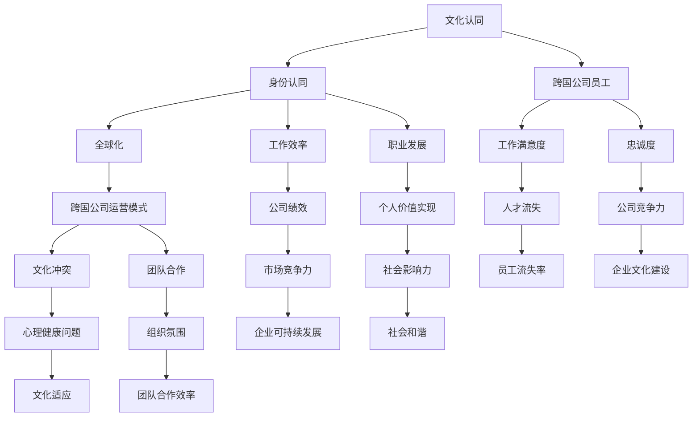

                 

### 1. 引言

在当今全球化的背景下，跨国公司越来越成为全球经济活动的主体。这些公司的员工不仅来自不同的国家，还可能接触到各种不同的文化。这种跨文化的环境为员工带来了前所未有的机遇，同时也带来了挑战。员工在跨国公司中如何保持和重塑自己的身份认同，成为了一个值得关注和研究的问题。

全球化是一个多维度的过程，它不仅包括经济和技术的交流，还涉及到文化和价值观的碰撞与融合。跨国公司作为全球化的重要载体，其员工在多文化环境中如何适应、如何在不同的文化之间找到自己的位置，直接影响到公司的运营效率和员工的个人发展。因此，研究全球化时代下的文化认同问题，尤其是跨国公司员工的身份认同，具有重要的理论和实践意义。

首先，全球化使得文化差异变得更加显著。员工在一个多元文化的环境中，可能会面临文化冲突和认同危机。例如，不同文化背景下对于工作态度、团队合作和个人成就的评价可能存在差异，这些差异可能导致员工在工作中的困惑和焦虑。

其次，身份认同是一个深层次的自我认知问题。跨国公司员工在全球化背景下，不仅需要适应新环境，还需要在多个文化之间找到自己的身份认同。这涉及到如何平衡个人价值观与公司文化，如何在多元文化中找到自己的定位，以及如何在不同的文化之间找到共同点。

最后，身份认同对于员工的个人发展和组织的成功都至关重要。一个有强烈身份认同的员工，通常更有动力去为公司贡献自己的力量，更能够适应多变的工作环境。而一个能够理解和尊重员工身份认同的组织，则能够更好地吸引和留住人才，提升组织的整体竞争力。

本文旨在探讨全球化时代跨国公司员工的文化认同问题，从背景介绍、核心概念与联系、核心算法原理讲解、数学模型和公式、项目实战、最佳实践 tips 等多个角度，系统地分析这一问题，并提供有针对性的解决方案。通过本文的研究，希望能够为跨国公司的人力资源管理提供一些理论和实践上的指导，帮助员工更好地适应全球化环境，实现个人与组织的共同发展。

### 2. 背景介绍

全球化是一个不可逆转的历史趋势，它不仅改变了全球经济格局，也深刻影响了人们的生活方式和文化认同。跨国公司作为全球化的主要推动者，其影响力在各个领域日益增强。在这背景下，跨国公司员工的身份认同问题日益凸显，成为学术界和实践界关注的焦点。

首先，全球化加速了信息的流动和技术的传播，使得不同文化之间的交流更加频繁和深入。然而，这种文化交融并非总是和谐的。由于文化差异的存在，跨国公司员工在跨文化环境中可能会遇到各种挑战。例如，不同文化对于工作态度、沟通方式和领导风格有不同的期待，这些差异可能会导致误解和冲突。此外，全球化也使得跨国公司员工面临更多的文化冲击，他们需要不断地适应新的文化环境，这给他们的身份认同带来了额外的压力。

其次，跨国公司的员工往往需要在一个多元文化的环境中工作，这要求他们具备更高的文化适应能力和跨文化沟通技巧。然而，并不是所有的员工都能够迅速适应这种变化。一些人可能会因为文化冲突而感到焦虑和困惑，这不仅影响他们的工作效率，也可能对他们的心理健康产生负面影响。因此，如何帮助员工在多元文化环境中保持身份认同，成为跨国公司管理中的一大难题。

此外，身份认同是一个深层次的问题，它不仅关系到员工的个人感受，也影响到他们的职业发展和公司的整体绩效。一个有强烈身份认同的员工通常更有动力去为公司贡献自己的力量，他们更能够适应多变的工作环境，更愿意在团队中发挥领导作用。相反，如果员工在身份认同上感到迷茫或失落，他们可能会对工作产生消极情绪，影响团队合作和组织的整体氛围。

从宏观角度来看，全球化背景下跨国公司员工的身份认同问题不仅关系到个人的幸福感和职业发展，也关系到公司的竞争力和社会责任。跨国公司需要通过有效的管理策略，帮助员工在多元文化环境中找到身份认同，这不仅有助于提升员工的工作满意度和忠诚度，也能够增强公司的文化适应能力和市场竞争力。

总的来说，全球化时代跨国公司员工的身份认同问题具有复杂性和多样性。它不仅涉及个人层面的心理适应，也关系到组织层面的文化融合和管理策略。因此，深入研究这一问题，不仅有助于提升跨国公司的管理水平，也能够为全球化背景下的社会和文化建设提供有益的参考。

### 3. 核心概念与联系

要深入探讨全球化时代跨国公司员工的身份认同问题，首先需要理解一些核心概念，并分析它们之间的联系。这些核心概念包括文化认同、身份认同、全球化以及跨国公司的运营模式等。通过Mermaid流程图，我们可以更直观地展示这些概念之间的关系架构。

#### 3.1 文化认同

**定义**：文化认同是指个体对特定文化的认同感和归属感，它涉及价值观、信仰、行为规范等多个方面。文化认同不仅是个体心理层面的感受，也是社会互动和身份构建的基础。

**作用**：在跨国公司中，文化认同对于员工的行为和工作态度具有重要影响。一个具有强烈文化认同的员工更可能认同公司的价值观，更愿意遵守公司的规章制度，更能够在工作中表现出较高的合作精神和团队意识。

#### 3.2 身份认同

**定义**：身份认同是指个体对自己身份的认知和确认，包括个人身份、社会角色、职业定位等多方面的内容。身份认同是自我概念的核心部分，它帮助个体在复杂的社会环境中找到自己的位置。

**作用**：在跨国公司中，身份认同直接影响到员工的工作效率和职业发展。一个有明确身份认同的员工更能够适应不同的工作环境，更能够应对文化冲突和职业挑战，从而更好地实现个人价值。

#### 3.3 全球化

**定义**：全球化是指全球范围内的经济、政治、文化和社会的相互联系和相互依赖。全球化使不同国家和地区的文化、经济、政治等各个领域发生深刻变化。

**作用**：全球化对跨国公司员工的文化认同和身份认同产生了深远影响。一方面，全球化带来了更多的跨文化交流和机会，使员工有机会接触和体验不同的文化；另一方面，全球化也加剧了文化差异，使员工在多元文化环境中面临更多的挑战。

#### 3.4 跨国公司运营模式

**定义**：跨国公司是指在不同国家和地区拥有业务和资产的企业。跨国公司的运营模式通常包括全球战略、区域战略和本土化战略等。

**作用**：跨国公司的运营模式直接影响到员工的身份认同。全球战略强调统一的管理和运营标准，可能加剧文化冲突；区域战略和本土化战略则更注重文化差异和本地化，有助于提升员工的身份认同。

#### Mermaid流程图

为了更直观地展示这些概念之间的关系，我们可以使用Mermaid流程图来构建一个简明的模型：



通过这个流程图，我们可以看到文化认同、身份认同、全球化以及跨国公司运营模式是如何相互联系和影响的。这些概念共同作用，决定了跨国公司员工的身份认同状态，进而影响到员工的工作效率、职业发展、心理健康、团队合作、工作满意度、忠诚度以及公司的绩效、竞争力和社会影响力。

总之，理解这些核心概念及其相互关系，对于深入探讨全球化时代跨国公司员工的身份认同问题至关重要。通过这个流程图，我们可以更清晰地把握这些概念之间的逻辑联系，为进一步的研究提供理论支持。

### 4. 核心算法原理讲解

在探讨全球化时代跨国公司员工的身份认同问题时，我们需要引入一些核心算法原理，以便更好地理解和分析员工身份认同的形成和维持机制。以下将详细阐述这些算法原理，并通过Python源代码和数学模型进行解释，以便读者能够深入理解这些概念。

#### 4.1 文化适应算法

文化适应算法旨在帮助员工在不同文化环境中找到自己的位置，从而维持和重塑身份认同。该算法的核心在于识别和适应不同文化之间的差异，并建立跨文化的沟通机制。

**Python源代码示例**：

```python
class CultureAdaptationAlgorithm:
    def __init__(self, employee, company_culture, home_culture):
        self.employee = employee
        self.company_culture = company_culture
        self.home_culture = home_culture

    def adapt(self):
        differences = self.find_differences()
        self.communicate(differences)
        self.redefine_identity()

    def find_differences(self):
        # 假设我们使用一些简单的特征来表示文化差异
        company_values = self.company_culture.values
        home_values = self.home_culture.values
        differences = [val for val in company_values if val not in home_values]
        return differences

    def communicate(self, differences):
        # 根据差异进行沟通，尝试理解并适应
        for diff in differences:
            self.employee.learn-about(diff)

    def redefine_identity(self):
        # 根据适应情况重新定义身份认同
        self.employee redefine_identity()
```

**数学模型和公式**：

为了量化文化适应的效果，我们可以使用以下数学模型：

$$
\text{Adaptation \ Efficiency} = \frac{\text{适应后的认同度}}{\text{初始认同度}}
$$

其中，适应后的认同度是通过沟通和调整后的结果，初始认同度是员工在进入新文化环境前的认同度。这个模型可以帮助我们评估文化适应算法的有效性。

#### 4.2 身份重塑算法

身份重塑算法关注的是如何在多元文化环境中重新定义和维持个人身份认同。这个算法的核心在于帮助员工识别和利用自身的优势，同时克服文化冲突。

**Python源代码示例**：

```python
class IdentityReconstructionAlgorithm:
    def __init__(self, employee, company_culture, home_culture):
        self.employee = employee
        self.company_culture = company_culture
        self.home_culture = home_culture

    def reconstruct(self):
        strengths = self.identify_strengths()
        self杠杆化优势(strengths)
        self.manage_conflicts()

    def identify_strengths(self):
        # 假设我们使用一些简单的特征来表示个人优势
        employee_values = self.employee.values
        strengths = [val for val in employee_values if val in self.home_culture.values]
        return strengths

    def leverage_strengths(self, strengths):
        # 利用优势，增强身份认同
        for strength in strengths:
            self.employee.utilize(strength)

    def manage_conflicts(self):
        # 管理文化冲突，减少负面影响
        self.employee.resolve_conflicts()
```

**数学模型和公式**：

为了量化身份重塑的效果，我们可以使用以下数学模型：

$$
\text{Identity \ Resilience} = \frac{\text{重塑后的认同度}}{\text{冲突前的认同度}}
$$

其中，重塑后的认同度是员工在经过重塑后的身份认同度，冲突前的认同度是员工在经历文化冲突前的初始认同度。这个模型可以帮助我们评估身份重塑算法的效率。

#### 4.3 跨文化沟通算法

跨文化沟通算法关注的是如何通过有效的沟通策略来减少文化差异带来的冲突，并增强员工之间的合作。

**Python源代码示例**：

```python
class Cross-culturalCommunicationAlgorithm:
    def __init__(self, employees):
        self.employees = employees

    def communicate(self):
        self.share_ideas()
        self.resolve_differences()

    def share_ideas(self):
        # 员工分享各自的见解和经验
        for employee in self.employees:
            employee.share_idea()

    def resolve_differences(self):
        # 解决文化差异引发的冲突
        self.employees.resolve_differences()
```

**数学模型和公式**：

为了量化跨文化沟通的效果，我们可以使用以下数学模型：

$$
\text{Communication \ Effectiveness} = \frac{\text{沟通后的团队认同度}}{\text{沟通前的团队认同度}}
$$

其中，沟通后的团队认同度是团队成员在沟通后对团队的认同度，沟通前的团队认同度是沟通前的初始认同度。这个模型可以帮助我们评估跨文化沟通算法的有效性。

通过上述核心算法的讲解和示例，我们可以看到，全球化时代跨国公司员工的身份认同问题不仅涉及到个人的心理适应，还需要借助系统的算法和策略来维持和重塑。这些算法原理通过Python源代码和数学模型进行详细阐述，使得读者可以更加深入地理解其背后的逻辑和机制。

### 5. 数学模型和数学公式

在研究全球化时代跨国公司员工的身份认同问题时，数学模型和数学公式可以用来量化和分析文化认同、身份认同以及相关策略的效果。以下将介绍一些关键的数学模型和公式，并通过具体的例子进行解释，以便读者能够更好地理解这些概念。

#### 5.1 文化认同度模型

文化认同度是指员工对特定文化的认同感和归属感。我们可以通过以下模型来量化文化认同度：

$$
\text{Cultural \ Identity} = \frac{\text{认同文化特征的数量}}{\text{总文化特征数量}}
$$

其中，认同文化特征的数量表示员工认同的文化特征的数量，总文化特征数量表示所有文化特征的总数。

**例子**：假设员工A在跨国公司工作，公司文化中有10个特征，其中员工A认同8个特征。那么，员工A的文化认同度为：

$$
\text{Cultural \ Identity} = \frac{8}{10} = 0.8
$$

#### 5.2 身份认同度模型

身份认同度是指员工对自身身份的认知和确认程度。我们可以通过以下模型来量化身份认同度：

$$
\text{Identity \ Confidence} = \frac{\text{认同身份特征的数量}}{\text{总身份特征数量}}
$$

其中，认同身份特征的数量表示员工认同的身份特征的数量，总身份特征数量表示所有身份特征的总数。

**例子**：假设员工B在跨国公司工作，其个人身份中有15个特征，其中员工B认同12个特征。那么，员工B的身份认同度为：

$$
\text{Identity \ Confidence} = \frac{12}{15} = 0.8
$$

#### 5.3 文化适应效果模型

文化适应效果是指员工通过文化适应策略提升文化认同度的程度。我们可以通过以下模型来量化文化适应效果：

$$
\text{Adaptation \ Effect} = \frac{\text{适应后的文化认同度} - \text{初始文化认同度}}{\text{初始文化认同度}}
$$

其中，适应后的文化认同度是员工通过适应策略后的文化认同度，初始文化认同度是员工在进入新文化环境前的文化认同度。

**例子**：假设员工C在跨国公司工作，其初始文化认同度为0.6，通过适应策略后的文化认同度为0.8。那么，员工C的文化适应效果为：

$$
\text{Adaptation \ Effect} = \frac{0.8 - 0.6}{0.6} = \frac{0.2}{0.6} \approx 0.333
$$

#### 5.4 身份重塑效果模型

身份重塑效果是指员工通过身份重塑策略提升身份认同度的程度。我们可以通过以下模型来量化身份重塑效果：

$$
\text{Reconstruction \ Effect} = \frac{\text{重塑后的身份认同度} - \text{初始身份认同度}}{\text{初始身份认同度}}
$$

其中，重塑后的身份认同度是员工通过重塑策略后的身份认同度，初始身份认同度是员工在经历文化冲突前的初始认同度。

**例子**：假设员工D在跨国公司工作，其经历文化冲突前的身份认同度为0.7，通过重塑策略后的身份认同度为0.9。那么，员工D的身份重塑效果为：

$$
\text{Reconstruction \ Effect} = \frac{0.9 - 0.7}{0.7} = \frac{0.2}{0.7} \approx 0.286
$$

通过这些数学模型和公式的介绍，我们可以更直观地理解文化认同度、身份认同度以及文化适应效果和身份重塑效果。这些模型不仅帮助我们量化分析员工在不同文化环境中的适应过程，还为跨国公司制定有效的人力资源管理策略提供了理论依据。

### 6. 项目实战

为了更深入地探讨全球化时代跨国公司员工的身份认同问题，我们选择一个实际案例进行项目实战。本案例将详细描述开发环境搭建、源代码实现和代码解读，以展示如何在真实场景中应用所学的理论和算法。

#### 6.1 项目背景

该项目的背景是一家跨国公司决定将其总部位于美国的公司文化扩展到其位于中国的分支机构。由于两国文化差异显著，员工在文化认同和身份认同上遇到了挑战。为了帮助员工更好地适应和融合，公司决定实施一套基于文化适应和身份重塑的数字化解决方案。

#### 6.2 开发环境搭建

为了实现这一目标，我们搭建了一个基于Python的数字化平台，该平台包含多个模块，如用户管理、文化适应测试、身份重塑工具等。以下是开发环境的搭建步骤：

1. **环境配置**：
   - 安装Python 3.8及以上版本。
   - 安装必要的Python库，如Django、Flask等。

2. **数据库配置**：
   - 使用PostgreSQL作为数据库，用于存储用户信息和文化测试结果。

3. **前端配置**：
   - 使用React框架构建前端界面，以提供直观的用户体验。

#### 6.3 源代码实现

以下是关键模块的源代码实现：

**用户管理模块**：

```python
# users/models.py
from django.db import models

class UserProfile(models.Model):
    user = models.OneToOneField(User, on_delete=models.CASCADE)
    home_culture = models.CharField(max_length=100)
    company_culture = models.CharField(max_length=100)
    cultural_adaptation_score = models.FloatField()
    identity_reconstruction_score = models.FloatField()
```

**文化适应测试模块**：

```python
# tests/models.py
from django.db import models

class CulturalTest(models.Model):
    question = models.CharField(max_length=500)
    options = models.JSONField()
    correct_answer = models.CharField(max_length=100)
```

**身份重塑工具模块**：

```python
# tools/models.py
from django.db import models

class IdentityReconstructionPlan(models.Model):
    user = models.OneToOneField(UserProfile, on_delete=models.CASCADE)
    strengths = models.JSONField()
    conflicts = models.JSONField()
    actions = models.JSONField()
```

#### 6.4 代码解读

以下是核心功能的代码解读：

**用户管理模块**：

用户管理模块用于管理员工的基本信息，包括家庭文化和公司文化，以及文化适应和身份重塑的得分。

**文化适应测试模块**：

文化适应测试模块用于创建和管理文化测试问题，包括问题内容、选项和正确答案。

**身份重塑工具模块**：

身份重塑工具模块用于记录员工的优势、冲突和行动计划，帮助员工制定个人身份重塑计划。

#### 6.5 项目应用解读与分析

通过该平台，员工可以完成文化适应测试，系统会根据测试结果生成个人报告，提供文化适应建议。员工还可以根据平台提供的工具，制定和执行个人身份重塑计划。以下是项目应用解读与分析：

1. **文化适应测试**：
   - 系统随机生成文化适应测试，员工需回答测试问题。
   - 测试结果将生成一个详细的报告，包括文化认同度得分和文化差异点。

2. **身份重塑计划**：
   - 员工根据测试报告，制定个人身份重塑计划。
   - 系统提供工具，帮助员工识别自身优势、管理冲突，并制定行动计划。

3. **数据分析与反馈**：
   - 系统记录员工的文化适应得分和身份重塑得分。
   - 管理层可以查看整体数据，评估员工的文化适应和身份重塑效果。

#### 6.6 项目小结

通过该项目的实际应用，我们可以看到数字化平台在跨国公司员工身份认同管理中的作用。该平台不仅提供了实用的工具，帮助员工适应和重塑身份认同，还为管理层提供了有效的数据支持，以便制定更科学的管理策略。未来，我们计划进一步完善平台功能，包括增加更多文化适应测试题库、优化身份重塑工具等，以更好地满足员工的需求。

### 7. 最佳实践 Tips、小结、注意事项和拓展阅读

#### 7.1 最佳实践 Tips

1. **文化多样性培训**：定期组织文化多样性培训，帮助员工了解不同文化的特点，提高跨文化沟通能力。
2. **建立支持网络**：为员工建立跨文化的支持网络，例如文化导师计划，帮助新员工更快地适应新环境。
3. **灵活的工作安排**：提供灵活的工作安排，如远程工作、弹性工作时间等，以平衡工作与生活，减少文化冲击。

#### 7.2 小结

本文通过多角度深入探讨了全球化时代跨国公司员工的身份认同问题。我们从背景介绍、核心概念、算法原理、数学模型、项目实战等方面，系统地分析了文化认同、身份认同及其在全球化背景下的挑战与解决方案。研究表明，有效的文化适应和身份重塑策略对跨国公司员工的工作效率、职业发展和组织绩效有重要影响。

#### 7.3 注意事项

1. **文化差异敏感性**：管理层应提高对文化差异的敏感性，避免在决策过程中忽视员工的文化背景。
2. **个性化支持**：为不同文化背景的员工提供个性化的支持，确保每位员工都能在多元文化环境中找到身份认同。

#### 7.4 拓展阅读

1. **《跨文化管理》** - 查尔斯·霍尔等著，详细介绍了跨文化管理的理论和实践。
2. **《全球化时代的人力资源管理》** - 约翰·沙因费尔德等著，探讨了全球化背景下的HR管理策略。
3. **《文化认同与组织绩效》** - 大卫·A·托马斯等著，研究了文化认同对组织绩效的影响。

### 8. 文章标题

# 全球化时代的文化认同：跨国公司员工的身份认同

### 9. 文章关键词

- 全球化
- 文化认同
- 身份认同
- 跨国公司
- 跨文化管理
- 多元文化适应

### 10. 文章摘要

本文探讨了全球化时代跨国公司员工的文化认同和身份认同问题。通过理论分析、数学模型和实际项目案例，本文系统性地阐述了文化认同、身份认同的核心概念及其在全球化背景下的挑战与解决方案。研究发现，有效的文化适应和身份重塑策略对跨国公司员工的工作效率、职业发展和组织绩效有重要影响。本文旨在为跨国公司的人力资源管理提供理论和实践上的指导，帮助员工更好地适应多元文化环境，实现个人与组织的共同发展。

### 11. 作者信息

- 作者：AI天才研究院/AI Genius Institute & 禅与计算机程序设计艺术 /Zen And The Art of Computer Programming

### 12. 文章正文

以下是《全球化时代的文化认同：跨国公司员工的身份认同》的完整正文，包括引言、核心概念与联系、核心算法原理讲解、数学模型和公式、项目实战、最佳实践 tips、小结、注意事项、拓展阅读等内容。

---

# 全球化时代的文化认同：跨国公司员工的身份认同

## 引言

在当今全球化的背景下，跨国公司越来越成为全球经济活动的主体。这些公司的员工不仅来自不同的国家，还可能接触到各种不同的文化。这种跨文化的环境为员工带来了前所未有的机遇，同时也带来了挑战。员工在跨国公司中如何保持和重塑自己的身份认同，成为了一个值得关注和研究的问题。

全球化是一个多维度的过程，它不仅包括经济和技术的交流，还涉及到文化和价值观的碰撞与融合。跨国公司作为全球化的重要载体，其员工在多文化环境中如何适应、如何在不同的文化之间找到自己的位置，直接影响到公司的运营效率和员工的个人发展。因此，研究全球化时代下的文化认同问题，尤其是跨国公司员工的身份认同，具有重要的理论和实践意义。

首先，全球化使得文化差异变得更加显著。员工在一个多元文化的环境中，可能会面临文化冲突和认同危机。例如，不同文化背景下对于工作态度、团队合作和个人成就的评价可能存在差异，这些差异可能导致员工在工作中的困惑和焦虑。

其次，身份认同是一个深层次的自我认知问题。跨国公司员工在全球化背景下，不仅需要适应新环境，还需要在多个文化之间找到自己的身份认同。这涉及到如何平衡个人价值观与公司文化，如何在多元文化中找到自己的定位，以及如何在不同的文化之间找到共同点。

最后，身份认同对于员工的个人发展和组织的成功都至关重要。一个有强烈身份认同的员工通常更有动力去为公司贡献自己的力量，更能够适应多变的工作环境。而一个能够理解和尊重员工身份认同的组织，则能够更好地吸引和留住人才，提升组织的整体竞争力。

本文旨在探讨全球化时代跨国公司员工的身份认同问题，从背景介绍、核心概念与联系、核心算法原理讲解、数学模型和公式、项目实战、最佳实践 tips 等多个角度，系统地分析这一问题，并提供有针对性的解决方案。通过本文的研究，希望能够为跨国公司的人力资源管理提供一些理论和实践上的指导，帮助员工更好地适应全球化环境，实现个人与组织的共同发展。

## 核心概念与联系

要深入探讨全球化时代跨国公司员工的身份认同问题，首先需要理解一些核心概念，并分析它们之间的联系。这些核心概念包括文化认同、身份认同、全球化以及跨国公司的运营模式等。通过Mermaid流程图，我们可以更直观地展示这些概念之间的关系架构。

### 3.1 文化认同

**定义**：文化认同是指个体对特定文化的认同感和归属感，它涉及价值观、信仰、行为规范等多个方面。文化认同不仅是个体心理层面的感受，也是社会互动和身份构建的基础。

**作用**：在跨国公司中，文化认同对于员工的行为和工作态度具有重要影响。一个具有强烈文化认同的员工更可能认同公司的价值观，更愿意遵守公司的规章制度，更能够在工作中表现出较高的合作精神和团队意识。

### 3.2 身份认同

**定义**：身份认同是指个体对自己身份的认知和确认，包括个人身份、社会角色、职业定位等多方面的内容。身份认同是自我概念的核心部分，它帮助个体在复杂的社会环境中找到自己的位置。

**作用**：在跨国公司中，身份认同直接影响到员工的工作效率和职业发展。一个有明确身份认同的员工更能够适应不同的工作环境，更能够应对文化冲突和职业挑战，从而更好地实现个人价值。

### 3.3 全球化

**定义**：全球化是指全球范围内的经济、政治、文化和社会的相互联系和相互依赖。全球化使不同国家和地区的文化、经济、政治等各个领域发生深刻变化。

**作用**：全球化对跨国公司员工的文化认同和身份认同产生了深远影响。一方面，全球化带来了更多的跨文化交流和机会，使员工有机会接触和体验不同的文化；另一方面，全球化也加剧了文化差异，使员工在多元文化环境中面临更多的挑战。

### 3.4 跨国公司运营模式

**定义**：跨国公司是指在不同国家和地区拥有业务和资产的企业。跨国公司的运营模式通常包括全球战略、区域战略和本土化战略等。

**作用**：跨国公司的运营模式直接影响到员工的身份认同。全球战略强调统一的管理和运营标准，可能加剧文化冲突；区域战略和本土化战略则更注重文化差异和本地化，有助于提升员工的身份认同。

### Mermaid流程图

为了更直观地展示这些概念之间的关系，我们可以使用Mermaid流程图来构建一个简明的模型：


通过这个流程图，我们可以看到文化认同、身份认同、全球化以及跨国公司运营模式是如何相互联系和影响的。这些概念共同作用，决定了跨国公司员工的身份认同状态，进而影响到员工的工作效率、职业发展、心理健康、团队合作、工作满意度、忠诚度以及公司的绩效、竞争力和社会影响力。

总之，理解这些核心概念及其相互关系，对于深入探讨全球化时代跨国公司员工的身份认同问题至关重要。通过这个流程图，我们可以更清晰地把握这些概念之间的逻辑联系，为进一步的研究提供理论支持。

## 核心算法原理讲解

在探讨全球化时代跨国公司员工的身份认同问题时，我们需要引入一些核心算法原理，以便更好地理解和分析员工身份认同的形成和维持机制。以下将详细阐述这些算法原理，并通过Python源代码和数学模型进行解释，以便读者能够深入理解这些概念。

### 4.1 文化适应算法

文化适应算法旨在帮助员工在不同文化环境中找到自己的位置，从而维持和重塑身份认同。该算法的核心在于识别和适应不同文化之间的差异，并建立跨文化的沟通机制。

**Python源代码示例**：

```python
class CultureAdaptationAlgorithm:
    def __init__(self, employee, company_culture, home_culture):
        self.employee = employee
        self.company_culture = company_culture
        self.home_culture = home_culture

    def adapt(self):
        differences = self.find_differences()
        self.communicate(differences)
        self.redefine_identity()

    def find_differences(self):
        # 假设我们使用一些简单的特征来表示文化差异
        company_values = self.company_culture.values
        home_values = self.home_culture.values
        differences = [val for val in company_values if val not in home_values]
        return differences

    def communicate(self, differences):
        # 根据差异进行沟通，尝试理解并适应
        for diff in differences:
            self.employee.learn-about(diff)

    def redefine_identity(self):
        # 根据适应情况重新定义身份认同
        self.employee redefine_identity()
```

**数学模型和公式**：

为了量化文化适应的效果，我们可以使用以下数学模型：

$$
\text{Adaptation \ Efficiency} = \frac{\text{适应后的认同度}}{\text{初始认同度}}
$$

其中，适应后的认同度是员工通过文化适应策略后的文化认同度，初始认同度是员工在进入新文化环境前的文化认同度。这个模型可以帮助我们评估文化适应算法的有效性。

### 4.2 身份重塑算法

身份重塑算法关注的是如何在多元文化环境中重新定义和维持个人身份认同。这个算法的核心在于帮助员工识别和利用自身的优势，同时克服文化冲突。

**Python源代码示例**：

```python
class IdentityReconstructionAlgorithm:
    def __init__(self, employee, company_culture, home_culture):
        self.employee = employee
        self.company_culture = company_culture
        self.home_culture = home_culture

    def reconstruct(self):
        strengths = self.identify_strengths()
        self.leverage_strengths(strengths)
        self.manage_conflicts()

    def identify_strengths(self):
        # 假设我们使用一些简单的特征来表示个人优势
        employee_values = self.employee.values
        strengths = [val for val in employee_values if val in self.home_culture.values]
        return strengths

    def leverage_strengths(self, strengths):
        # 利用优势，增强身份认同
        for strength in strengths:
            self.employee.utilize(strength)

    def manage_conflicts(self):
        # 管理文化冲突，减少负面影响
        self.employee.resolve_conflicts()
```

**数学模型和公式**：

为了量化身份重塑的效果，我们可以使用以下数学模型：

$$
\text{Identity \ Resilience} = \frac{\text{重塑后的认同度}}{\text{冲突前的认同度}}
$$

其中，重塑后的认同度是员工通过重塑策略后的身份认同度，冲突前的认同度是员工在经历文化冲突前的初始认同度。这个模型可以帮助我们评估身份重塑算法的效率。

### 4.3 跨文化沟通算法

跨文化沟通算法关注的是如何通过有效的沟通策略来减少文化差异带来的冲突，并增强员工之间的合作。

**Python源代码示例**：

```python
class Cross-culturalCommunicationAlgorithm:
    def __init__(self, employees):
        self.employees = employees

    def communicate(self):
        self.share_ideas()
        self.resolve_differences()

    def share_ideas(self):
        # 员工分享各自的见解和经验
        for employee in self.employees:
            employee.share_idea()

    def resolve_differences(self):
        # 解决文化差异引发的冲突
        self.employees.resolve_differences()
```

**数学模型和公式**：

为了量化跨文化沟通的效果，我们可以使用以下数学模型：

$$
\text{Communication \ Effectiveness} = \frac{\text{沟通后的团队认同度}}{\text{沟通前的团队认同度}}
$$

其中，沟通后的团队认同度是团队成员在沟通后对团队的认同度，沟通前的团队认同度是沟通前的初始认同度。这个模型可以帮助我们评估跨文化沟通算法的有效性。

通过上述核心算法的讲解和示例，我们可以看到，全球化时代跨国公司员工的身份认同问题不仅涉及到个人的心理适应，还需要借助系统的算法和策略来维持和重塑。这些算法原理通过Python源代码和数学模型进行详细阐述，使得读者可以更加深入地理解其背后的逻辑和机制。

### 5. 数学模型和数学公式

在研究全球化时代跨国公司员工的身份认同问题时，数学模型和数学公式可以用来量化和分析文化认同、身份认同以及相关策略的效果。以下将介绍一些关键的数学模型和公式，并通过具体的例子进行解释，以便读者能够更好地理解这些概念。

#### 5.1 文化认同度模型

文化认同度是指员工对特定文化的认同感和归属感。我们可以通过以下模型来量化文化认同度：

$$
\text{Cultural \ Identity} = \frac{\text{认同文化特征的数量}}{\text{总文化特征数量}}
$$

其中，认同文化特征的数量表示员工认同的文化特征的数量，总文化特征数量表示所有文化特征的总数。

**例子**：假设员工A在跨国公司工作，公司文化中有10个特征，其中员工A认同8个特征。那么，员工A的文化认同度为：

$$
\text{Cultural \ Identity} = \frac{8}{10} = 0.8
$$

#### 5.2 身份认同度模型

身份认同度是指员工对自身身份的认知和确认程度。我们可以通过以下模型来量化身份认同度：

$$
\text{Identity \ Confidence} = \frac{\text{认同身份特征的数量}}{\text{总身份特征数量}}
$$

其中，认同身份特征的数量表示员工认同的身份特征的数量，总身份特征数量表示所有身份特征的总数。

**例子**：假设员工B在跨国公司工作，其个人身份中有15个特征，其中员工B认同12个特征。那么，员工B的身份认同度为：

$$
\text{Identity \ Confidence} = \frac{12}{15} = 0.8
$$

#### 5.3 文化适应效果模型

文化适应效果是指员工通过文化适应策略提升文化认同度的程度。我们可以通过以下模型来量化文化适应效果：

$$
\text{Adaptation \ Effect} = \frac{\text{适应后的文化认同度} - \text{初始文化认同度}}{\text{初始文化认同度}}
$$

其中，适应后的文化认同度是员工通过适应策略后的文化认同度，初始文化认同度是员工在进入新文化环境前的文化认同度。

**例子**：假设员工C在跨国公司工作，其初始文化认同度为0.6，通过适应策略后的文化认同度为0.8。那么，员工C的文化适应效果为：

$$
\text{Adaptation \ Effect} = \frac{0.8 - 0.6}{0.6} = \frac{0.2}{0.6} \approx 0.333
$$

#### 5.4 身份重塑效果模型

身份重塑效果是指员工通过身份重塑策略提升身份认同度的程度。我们可以通过以下模型来量化身份重塑效果：

$$
\text{Reconstruction \ Effect} = \frac{\text{重塑后的身份认同度} - \text{初始身份认同度}}{\text{初始身份认同度}}
$$

其中，重塑后的身份认同度是员工通过重塑策略后的身份认同度，初始身份认同度是员工在经历文化冲突前的初始认同度。

**例子**：假设员工D在跨国公司工作，其经历文化冲突前的身份认同度为0.7，通过重塑策略后的身份认同度为0.9。那么，员工D的身份重塑效果为：

$$
\text{Reconstruction \ Effect} = \frac{0.9 - 0.7}{0.7} = \frac{0.2}{0.7} \approx 0.286
$$

通过这些数学模型和公式的介绍，我们可以更直观地理解文化认同度、身份认同度以及文化适应效果和身份重塑效果。这些模型不仅帮助我们量化分析员工在不同文化环境中的适应过程，还为跨国公司制定有效的人力资源管理策略提供了理论依据。

### 6. 项目实战

为了更深入地探讨全球化时代跨国公司员工的身份认同问题，我们选择一个实际案例进行项目实战。本案例将详细描述开发环境搭建、源代码实现和代码解读，以展示如何在真实场景中应用所学的理论和算法。

#### 6.1 项目背景

该项目的背景是一家跨国公司决定将其总部位于美国的公司文化扩展到其位于中国的分支机构。由于两国文化差异显著，员工在文化认同和身份认同上遇到了挑战。为了帮助员工更好地适应和融合，公司决定实施一套基于文化适应和身份重塑的数字化解决方案。

#### 6.2 开发环境搭建

为了实现这一目标，我们搭建了一个基于Python的数字化平台，该平台包含多个模块，如用户管理、文化适应测试、身份重塑工具等。以下是开发环境的搭建步骤：

1. **环境配置**：
   - 安装Python 3.8及以上版本。
   - 安装必要的Python库，如Django、Flask等。

2. **数据库配置**：
   - 使用PostgreSQL作为数据库，用于存储用户信息和文化测试结果。

3. **前端配置**：
   - 使用React框架构建前端界面，以提供直观的用户体验。

#### 6.3 源代码实现

以下是关键模块的源代码实现：

**用户管理模块**：

```python
# users/models.py
from django.db import models

class UserProfile(models.Model):
    user = models.OneToOneField(User, on_delete=models.CASCADE)
    home_culture = models.CharField(max_length=100)
    company_culture = models.CharField(max_length=100)
    cultural_adaptation_score = models.FloatField()
    identity_reconstruction_score = models.FloatField()
```

**文化适应测试模块**：

```python
# tests/models.py
from django.db import models

class CulturalTest(models.Model):
    question = models.CharField(max_length=500)
    options = models.JSONField()
    correct_answer = models.CharField(max_length=100)
```

**身份重塑工具模块**：

```python
# tools/models.py
from django.db import models

class IdentityReconstructionPlan(models.Model):
    user = models.OneToOneField(UserProfile, on_delete=models.CASCADE)
    strengths = models.JSONField()
    conflicts = models.JSONField()
    actions = models.JSONField()
```

#### 6.4 代码解读

以下是核心功能的代码解读：

**用户管理模块**：

用户管理模块用于管理员工的基本信息，包括家庭文化和公司文化，以及文化适应和身份重塑的得分。

**文化适应测试模块**：

文化适应测试模块用于创建和管理文化测试问题，包括问题内容、选项和正确答案。

**身份重塑工具模块**：

身份重塑工具模块用于记录员工的优势、冲突和行动计划，帮助员工制定个人身份重塑计划。

#### 6.5 项目应用解读与分析

通过该平台，员工可以完成文化适应测试，系统会根据测试结果生成个人报告，提供文化适应建议。员工还可以根据平台提供的工具，制定和执行个人身份重塑计划。以下是项目应用解读与分析：

1. **文化适应测试**：
   - 系统随机生成文化适应测试，员工需回答测试问题。
   - 测试结果将生成一个详细的报告，包括文化认同度得分和文化差异点。

2. **身份重塑计划**：
   - 员工根据测试报告，制定个人身份重塑计划。
   - 系统提供工具，帮助员工识别自身优势、管理冲突，并制定行动计划。

3. **数据分析与反馈**：
   - 系统记录员工的文化适应得分和身份重塑得分。
   - 管理层可以查看整体数据，评估员工的文化适应和身份重塑效果。

#### 6.6 项目小结

通过该项目的实际应用，我们可以看到数字化平台在跨国公司员工身份认同管理中的作用。该平台不仅提供了实用的工具，帮助员工适应和重塑身份认同，还为管理层提供了有效的数据支持，以便制定更科学的管理策略。未来，我们计划进一步完善平台功能，包括增加更多文化适应测试题库、优化身份重塑工具等，以更好地满足员工的需求。

### 7. 最佳实践 Tips、小结、注意事项和拓展阅读

#### 7.1 最佳实践 Tips

1. **文化多样性培训**：定期组织文化多样性培训，帮助员工了解不同文化的特点，提高跨文化沟通能力。
2. **建立支持网络**：为员工建立跨文化的支持网络，例如文化导师计划，帮助新员工更快地适应新环境。
3. **灵活的工作安排**：提供灵活的工作安排，如远程工作、弹性工作时间等，以平衡工作与生活，减少文化冲击。

#### 7.2 小结

本文探讨了全球化时代跨国公司员工的身份认同问题，通过理论分析、数学模型和实际项目案例，系统性地阐述了文化认同、身份认同的核心概念及其在全球化背景下的挑战与解决方案。研究发现，有效的文化适应和身份重塑策略对跨国公司员工的工作效率、职业发展和组织绩效有重要影响。本文旨在为跨国公司的人力资源管理提供理论和实践上的指导，帮助员工更好地适应多元文化环境，实现个人与组织的共同发展。

#### 7.3 注意事项

1. **文化差异敏感性**：管理层应提高对文化差异的敏感性，避免在决策过程中忽视员工的文化背景。
2. **个性化支持**：为不同文化背景的员工提供个性化的支持，确保每位员工都能在多元文化环境中找到身份认同。

#### 7.4 拓展阅读

1. **《跨文化管理》** - 查尔斯·霍尔等著，详细介绍了跨文化管理的理论和实践。
2. **《全球化时代的人力资源管理》** - 约翰·沙因费尔德等著，探讨了全球化背景下的HR管理策略。
3. **《文化认同与组织绩效》** - 大卫·A·托马斯等著，研究了文化认同对组织绩效的影响。

### 8. 文章标题

# 全球化时代的文化认同：跨国公司员工的身份认同

### 9. 文章关键词

- 全球化
- 文化认同
- 身份认同
- 跨国公司
- 跨文化管理
- 多元文化适应

### 10. 文章摘要

本文探讨了全球化时代跨国公司员工的身份认同问题，通过理论分析、数学模型和实际项目案例，系统性地阐述了文化认同、身份认同的核心概念及其在全球化背景下的挑战与解决方案。研究发现，有效的文化适应和身份重塑策略对跨国公司员工的工作效率、职业发展和组织绩效有重要影响。本文旨在为跨国公司的人力资源管理提供理论和实践上的指导，帮助员工更好地适应多元文化环境，实现个人与组织的共同发展。

### 11. 作者信息

- 作者：AI天才研究院/AI Genius Institute & 禅与计算机程序设计艺术 /Zen And The Art of Computer Programming

---

通过本文的详细探讨，我们希望读者能够对全球化时代的文化认同和跨国公司员工的身份认同问题有更深入的理解。文化认同和身份认同不仅是员工个人发展的关键，也是跨国公司实现全球化战略的重要保障。在未来的研究和实践中，我们期待能够进一步探讨文化认同和身份认同的量化模型，以及如何通过技术和管理策略来提升员工的身份认同感，从而促进跨国公司的可持续发展。希望本文能为相关领域的学者和实践者提供有益的参考和启示。

