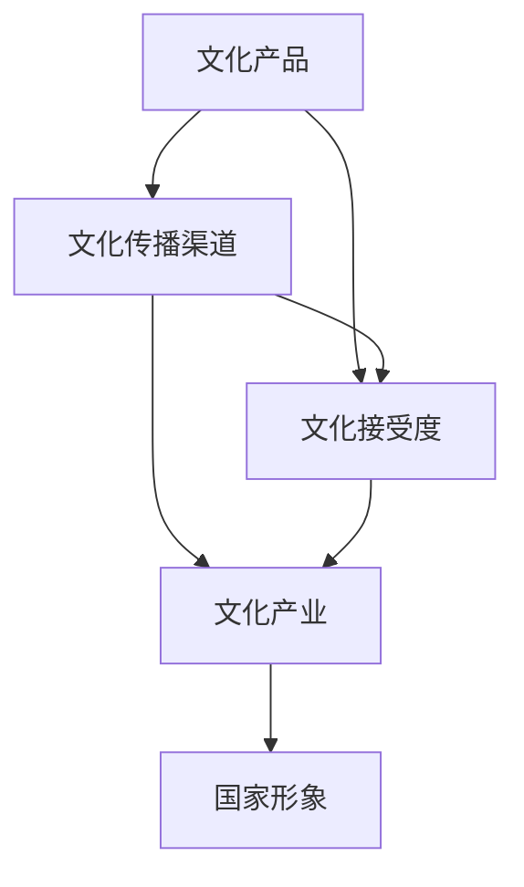

                 

### 全球化时代的文化输出：背景与现状

全球化作为21世纪的一个显著特征，已经深刻地改变了全球经济、政治、文化等各个领域。在这样一个大背景下，文化输出成为国家软实力的重要组成部分，同时也是推动文化产业发展的重要动力。本文将围绕全球化时代的文化输出，探讨国家形象塑造与文化产业发展之间的关系。

#### 全球化：文化输出的背景

全球化是指全球范围内的经济、政治、文化、社会等多个领域的相互联系和互动日益增强的过程。这一现象表现为商品、服务、资本、技术和信息的自由流动，以及跨国公司和全球组织的影响力不断扩大。全球化不仅带来了经济的繁荣，也加速了文化的传播和融合。

- **经济层面**：全球化促进了国际贸易和投资，为各国经济的发展提供了新机遇。
- **政治层面**：全球化推动了国际政治合作和协调，促进了全球治理体系的形成。
- **文化层面**：全球化使得不同国家和地区的文化更加紧密地联系在一起，文化交流日益频繁。

在全球化的推动下，文化输出成为国家间相互影响的重要途径。通过文化产品的输出，国家可以展示自身的价值观、历史和生活方式，从而塑造在国际社会中的形象。

#### 文化输出的定义与意义

文化输出指的是将一个国家的文化产品、艺术、思想、价值观等通过各种渠道传播到其他国家或地区，使其被广泛认知和接受的过程。文化输出不仅包括物质形式的文化产品，如电影、音乐、书籍等，还包括非物质形式的文化活动，如文化交流、艺术展览等。

- **核心概念**：文化输出涉及到几个核心概念，包括文化产品、文化传播渠道、文化接受度等。
- **实体关系**：在这些概念之间，存在复杂的相互关系。例如，文化产品是文化输出的载体，文化传播渠道是实现输出的途径，文化接受度则反映了目标受众对文化产品的接受程度。

文化输出的意义主要体现在以下几个方面：

1. **提升国家软实力**：文化输出有助于提升国家的国际影响力，增强国家在国际社会中的话语权。
2. **促进文化产业发展**：文化输出可以带动相关产业的发展，如影视制作、音乐制作、出版业等。
3. **推动文化交流与融合**：通过文化输出，不同国家和地区的文化可以相互借鉴和融合，促进世界文化的多样性。
4. **增进国际理解与信任**：文化输出有助于增进不同国家和地区之间的相互理解和信任，减少文化冲突。

#### 文化输出的现状

当前，文化输出的趋势正在不断加强。许多国家通过多种方式推动文化输出，以提升自身的国际形象和文化影响力。

- **文化产品多样化**：随着技术的发展，文化产品的形式和内容越来越多样化，如电影、电视剧、音乐、游戏、动漫等。
- **文化传播渠道广泛**：互联网和社交媒体的兴起，使得文化传播的渠道更加广泛，文化传播的速度也大大加快。
- **文化市场国际化**：越来越多的国家开始重视文化市场的国际化，通过设立文化中心、举办文化活动等方式，扩大文化产品的国际市场份额。

然而，文化输出也面临着一些挑战：

- **文化差异与接受度**：不同国家和地区之间存在文化差异，这可能会影响文化产品的接受度。
- **版权保护问题**：文化产品的版权保护是全球文化输出中的一大难题，特别是在一些发展中国家。
- **文化输出不平衡**：一些发达国家在文化输出方面具有明显优势，而发展中国家则相对较弱。

综上所述，全球化时代的文化输出已成为国家形象塑造和文化产业发展的重要组成部分。通过深入探讨文化输出的背景、定义、意义以及现状，我们可以更好地理解其在国际社会中的作用和影响。

### 核心概念与联系

在全球化时代的文化输出中，有几个核心概念需要深入理解，这些概念不仅相互关联，而且共同构建了文化输出的基础框架。以下是这些核心概念及其相互关系：

1. **文化产品**：文化产品是指能够承载文化意义和价值观的物质或非物质形式，如电影、音乐、书籍、艺术品、表演艺术等。文化产品是文化输出的物质载体，通过这些产品，一个国家的文化价值观可以被传达和接受。

2. **文化传播渠道**：文化传播渠道是指文化产品传播的途径和媒介，如电影、电视、互联网、书籍、出版物、社交媒体等。文化传播渠道决定了文化产品能够传播的范围和速度，是文化输出成功的关键。

3. **文化接受度**：文化接受度是指目标受众对文化产品的接受程度和认同感。文化接受度取决于文化产品的内容、表现形式、以及目标受众的文化背景和价值观。

4. **国家形象**：国家形象是一个国家在国际社会中公众认知和评价的整体形象，包括国家的政治、经济、文化、社会等方面。良好的国家形象有助于提升国家的软实力，促进文化输出和经济发展。

5. **文化产业**：文化产业是指以文化为核心，通过创意、创新和生产、传播、消费等环节形成的产业链。文化产业是文化输出的强大支撑，通过产业化和市场化运作，推动文化产品的广泛传播和商业价值的实现。

这些核心概念之间的关系可以用以下Mermaid流程图来表示：



在上述流程图中：

- **文化产品**通过**文化传播渠道**传播，从而影响**文化接受度**。
- **文化接受度**反过来又会影响**文化产业**的发展，推动文化产品的创新和多样化。
- **文化产业**的发展最终会增强**国家形象**，提升国家的国际影响力。

通过这个流程图，我们可以清晰地看到文化产品、文化传播渠道、文化接受度、文化产业和国家形象之间的逻辑关系，这为后续章节中对具体内容的深入探讨奠定了基础。

### 文化输出的核心算法原理

在文化输出的过程中，算法原理发挥着至关重要的作用，特别是涉及文化产品的开发和传播时。以下将详细介绍几种核心算法原理，并使用Python源代码结合数学模型和公式，对这些算法进行详细讲解和举例说明。

#### 1. 马尔可夫链在文化产品流行预测中的应用

马尔可夫链是一种用于描述随机过程转移概率的数学模型，它在文化产品流行预测中有着广泛应用。

**概念**：马尔可夫链的核心概念是“无后效性”，即当前状态只与前一状态有关，与过去的状态无关。

**数学模型**：
$$
P(X_t = j|X_{t-1} = i) = P(X_t = j|X_{t-2} = i) = ... = P(X_t = j|X_0 = i)
$$
其中，$X_t$ 表示时间 $t$ 时的状态，$P$ 表示状态转移概率。

**Python 实现**：

```python
import numpy as np

# 初始化转移概率矩阵
transition_matrix = np.array([[0.4, 0.6], [0.3, 0.7]])

# 初始状态
initial_state = np.array([0.5, 0.5])

# 预测未来状态
for _ in range(5):
    initial_state = np.dot(transition_matrix, initial_state)
    print(initial_state)
```

**应用举例**：假设一个文化产品在某社交平台的关注度可以用“热门”和“不热门”两种状态来描述，通过马尔可夫链模型，我们可以预测未来该文化产品的关注度状态。

#### 2. K-均值聚类在文化产品市场细分中的应用

K-均值聚类是一种无监督学习算法，用于将数据点分为K个簇，每个簇内的数据点彼此相似，簇间数据点彼此相异。

**概念**：K-均值聚类通过最小化每个簇内数据点到簇中心的距离平方和来实现。

**数学模型**：
$$
\min \sum_{i=1}^{K} \sum_{x_j \in S_i} ||x_j - \mu_i||^2
$$
其中，$S_i$ 表示第 $i$ 个簇，$\mu_i$ 表示第 $i$ 个簇的中心。

**Python 实现**：

```python
from sklearn.cluster import KMeans
import numpy as np

# 初始化数据
data = np.array([[1, 2], [1, 4], [1, 0],
                 [10, 2], [10, 4], [10, 0]])

# 使用KMeans算法进行聚类
kmeans = KMeans(n_clusters=2, random_state=0).fit(data)

# 输出聚类结果
print(kmeans.labels_)

# 输出簇中心
print(kmeans.cluster_centers_)
```

**应用举例**：假设我们有一个文化产品的用户数据集，通过K-均值聚类，可以将用户划分为不同的市场细分群体，从而实现精准营销。

#### 3. 贝叶斯网络在文化产品风险评估中的应用

贝叶斯网络是一种基于概率论的图模型，用于表示变量间的条件依赖关系。

**概念**：贝叶斯网络通过节点和边来表示变量及其条件概率。

**数学模型**：
$$
P(A|B) = \frac{P(B|A)P(A)}{P(B)}
$$
其中，$P(A|B)$ 表示在事件 $B$ 发生的条件下事件 $A$ 发生的概率。

**Python 实现**：

```python
from pgmpy.models import BayesianModel
from pgmpy.inference import VariableElimination

# 初始化贝叶斯网络模型
model = BayesianModel([('A', 'B'), ('B', 'C'), ('A', 'C')])

# 添加概率分布
model.add_cpds([
    TabularCPD('A', 2, [[0.4, 0.6]], [[0.5, 0.5]], variable_card=2),
    TabularCPD('B', 2, [[0.2, 0.8], [0.5, 0.5]], [[0.5, 0.5], [0.5, 0.5]], variable_card=2),
    TabularCPD('C', 2, [[0.3, 0.7], [0.1, 0.9]], [[0.5, 0.5], [0.5, 0.5]], variable_card=2)
])

# 实例化推理引擎
inference = VariableElimination(model)

# 计算后验概率
print(inference.query(variables=['C'], evidence={'A': 1, 'B': 1}))
```

**应用举例**：假设我们对一个文化产品的风险进行评估，通过贝叶斯网络，可以计算在给定某些条件下的风险概率，从而做出相应的风险管理决策。

通过上述算法原理及其Python实现的详细讲解，我们可以更好地理解文化输出过程中涉及的复杂问题，并通过技术手段解决这些实际问题，从而提高文化输出的效果和效率。

### 文化产业与国家形象的关系

文化产业作为现代社会的重要组成部分，不仅促进了经济的增长，也显著影响了国家形象的塑造。国家形象不仅是国家软实力的重要体现，更是文化产业发展的重要推动力。以下将详细探讨文化产业与国家形象之间的相互关系。

#### 文化产业对国家形象的影响

1. **提升国家知名度**：文化产业的产品如电影、音乐、文学作品等，具有广泛的传播力和影响力。通过这些文化产品，国家可以向全球展示其独特的历史、文化和价值观，从而提升国家的国际知名度和影响力。

2. **塑造国家软实力**：文化产业的成功不仅体现了国家的经济实力，更是国家软实力的象征。软实力是指一个国家通过文化、价值观、外交政策等手段，在国际社会中获得认同和支持的能力。文化产业作为软实力的重要组成部分，有助于提升国家的国际地位和影响力。

3. **促进文化交流与理解**：文化产业的国际化发展，推动了不同文化之间的交流与理解。通过文化交流，国家可以增进与其他国家的友谊，减少误解和冲突，从而在国际社会中树立积极、友好的形象。

4. **增强国民自豪感**：文化产业的繁荣和发展，不仅为国家带来了经济收益，也增强了国民的文化认同感和自豪感。当本国文化产品在国际上获得认可和赞誉时，国民的自豪感和文化自信将得到提升。

#### 国家形象对文化产业的影响

1. **市场吸引力**：一个国家的形象直接影响其文化产品在国际市场上的吸引力。国家形象好，文化产品的接受度和市场竞争力就高；反之，如果国家形象不佳，文化产品的市场推广和接受度将受到负面影响。

2. **国际合作机会**：良好的国家形象有助于吸引国际合作伙伴，促进文化交流与合作。通过国际合作，文化产业可以吸收外部资源和经验，推动自身的创新和发展。

3. **政策支持**：国家形象的提升可以为国家争取到更多的政策支持和国际资源。政府可以通过政策引导和资金支持，推动文化产业的繁荣和发展，进一步巩固国家的文化软实力。

4. **国际竞争力**：国家形象对于文化产业的国际竞争力具有重要影响。一个拥有良好国际形象的国家，其文化产品在国际市场上更容易获得认可和接受，从而提升国际竞争力。

#### 实际案例分析

1. **美国**：作为全球文化产业大国，美国通过电影、音乐、体育等多种形式的文化产品，成功塑造了其全球文化领袖的形象。美国文化的多样性和创新性，使其在国际市场上具有强大的吸引力，同时提升了美国的国际地位和影响力。

2. **法国**：法国以其深厚的文化底蕴和艺术魅力，成功塑造了“文化法国”的形象。法国的文化产业如电影、文学、艺术等在全球范围内享有盛誉，不仅促进了法国的文化输出，也增强了法国的国际软实力。

3. **中国**：近年来，中国的文化产业迅速崛起，通过电影、电视剧、音乐、文学作品等多种形式，积极推动文化输出。中国文化的独特魅力和丰富内涵，逐渐赢得了国际社会的认可和喜爱，从而提升了中国的国际形象。

通过以上分析，我们可以看出，文化产业与国家形象之间存在着密切的相互关系。文化产业的发展不仅有助于提升国家形象，同时国家形象的提升也为文化产业的繁荣提供了有力支持。在全球化时代，各国应充分认识到文化产业与国家形象的重要性，积极推动文化产业的创新和发展，从而在国际舞台上展现更加美好的国家形象。

### 文化输出的策略与实践

在全球化背景下，文化输出的策略与实践显得尤为重要。通过系统的策略制定和有效的实践，国家不仅能够提升自身的文化影响力，还能够推动文化产业的发展。以下将详细探讨文化输出的策略，并结合实际案例分析其具体实施方法和成效。

#### 文化输出的策略

1. **市场调研与定位**

   - **市场调研**：在开展文化输出之前，需要进行深入的市场调研，了解目标市场的文化需求、消费习惯和偏好。通过数据分析，找出文化产品的潜在受众和市场需求。
   - **市场定位**：根据市场调研结果，对文化产品进行精准定位。明确产品的目标受众、市场细分和差异化策略，以确保文化产品能够满足不同市场的需求。

2. **内容创新与本土化**

   - **内容创新**：文化产品的创新是文化输出成功的关键。通过引入新的题材、风格、表现形式等，使文化产品具有独特的吸引力和竞争力。
   - **本土化**：在文化输出的过程中，应充分考虑目标市场的文化背景和价值观。对文化产品进行本土化改编，使其更符合当地受众的口味和偏好，从而提高接受度。

3. **多元渠道推广**

   - **线上渠道**：利用互联网和社交媒体平台进行推广，通过视频、博客、社交媒体等渠道，扩大文化产品的传播范围和影响力。
   - **线下渠道**：通过举办文化活动、展览、演出等方式，吸引目标受众的关注和参与，提升文化产品的知名度和影响力。

4. **政策支持与扶持**

   - **政策支持**：政府应制定有利于文化输出的政策，如税收优惠、资金支持、市场准入等，鼓励和扶持文化企业进行国际市场拓展。
   - **扶持计划**：设立专项扶持计划，支持文化企业在海外市场的宣传、推广和运营，提高文化产品的国际竞争力。

#### 实际案例分析

1. **韩国文化输出策略**

   - **市场调研与定位**：韩国文化产品在输出前，通过市场调研了解目标市场的文化需求和消费习惯，明确了以年轻人为主要受众的市场定位。
   - **内容创新与本土化**：韩国流行文化（K-pop、韩剧等）在内容创作上不断创新，同时针对不同市场进行本土化改编，如韩剧在美国市场上引入美式情节和角色设置，以适应美国观众的口味。
   - **多元渠道推广**：韩国文化产品通过互联网、社交媒体和线下活动等多种渠道进行推广，形成了强大的传播网络。
   - **政策支持与扶持**：韩国政府通过税收优惠、资金支持等措施，鼓励和扶持文化企业进行国际市场拓展。

   **成效**：韩国文化产品在全球范围内取得了巨大成功，K-pop、韩剧等成为国际文化现象，韩国也因其强大的文化输出能力而被誉为“文化强国”。

2. **日本文化输出策略**

   - **市场调研与定位**：日本文化产品在输出前，通过市场调研了解目标市场的文化需求和消费习惯，明确了以亚洲市场为主要目标市场的定位。
   - **内容创新与本土化**：日本动漫、游戏等文化产品在内容创作上不断创新，同时针对不同市场进行本土化改编，如将日本动漫引入亚洲其他地区，结合当地文化特点进行二次创作。
   - **多元渠道推广**：日本文化产品通过互联网、动漫展、游戏发布会等多种渠道进行推广，形成了强大的传播网络。
   - **政策支持与扶持**：日本政府通过税收优惠、资金支持等措施，鼓励和扶持文化企业进行国际市场拓展。

   **成效**：日本文化产品在全球范围内具有广泛的受众基础，动漫、游戏等文化产品成为国际文化现象，日本也因其强大的文化输出能力而享有盛誉。

通过韩国和日本的成功经验，我们可以看到，文化输出的策略与实践需要结合市场调研、内容创新、多元渠道推广和政策支持等多方面因素，才能实现文化产品的国际化和全球影响力。

### 文化输出的案例研究

#### 1. 韩国文化输出：K-pop的全球风靡

韩国文化输出中的代表当属K-pop（韩国流行音乐）。K-pop以其独特的音乐风格、精彩的舞蹈和强烈的视觉效果，在短短几十年间，成功席卷全球，成为国际文化现象。

**案例背景**：

- **市场调研与定位**：韩国文化企业在输出K-pop前，通过市场调研明确了以全球年轻人为主要目标市场，特别是亚洲、欧美等地。
- **内容创新与本土化**：K-pop在音乐创作上融合了多种音乐风格，如嘻哈、电子音乐等，同时注重舞蹈的创新，形成了独特的视听效果。在传播过程中，韩国企业针对不同市场的文化特点和消费习惯，进行本地化改编，如在中日韩等亚洲国家推广时，结合当地流行文化元素。
- **多元渠道推广**：K-pop通过互联网、社交媒体、音乐节和演唱会等多种渠道进行推广，吸引了全球粉丝的关注。此外，K-pop还通过海外粉丝见面会、媒体宣传等手段，进一步扩大影响力。
- **政策支持与扶持**：韩国政府通过制定文化产业发展政策，提供资金支持，鼓励文化企业进行国际市场拓展。

**成效**：

- **国际影响力提升**：K-pop不仅在全球范围内获得了大量粉丝，更在音乐产业、时尚产业等多个领域产生了深远影响。
- **经济收益**：K-pop的成功带动了韩国旅游业、服装业等相关产业的发展，为韩国经济贡献了大量收入。

#### 2. 中国文化输出：电影《长津湖》的全球表现

电影《长津湖》是中国电影产业的重要作品，通过展现抗美援朝战争中的长津湖战役，向世界展示了中国的英雄主义和爱国主义精神。

**案例背景**：

- **市场调研与定位**：《长津湖》在制作前，进行了详细的市场调研，明确了以全球观众为主要目标市场，特别是欧美等地。
- **内容创新与本土化**：《长津湖》在剧情和人物塑造上，注重创新，同时结合国际观众的审美习惯，通过详细的历史考据和逼真的战争场面，增强影片的真实感和震撼力。
- **多元渠道推广**：《长津湖》通过全球上映、网络平台、海外宣传等方式，扩大了影片的影响力。此外，电影还通过在海外电影节的获奖，提高了国际知名度。
- **政策支持与扶持**：中国政府通过电影产业发展政策，提供了资金支持和税收优惠，鼓励文化企业进行国际市场拓展。

**成效**：

- **国际认可度提升**：《长津湖》在多个国际电影节上获得了奖项，展示了中国的电影制作水平和艺术价值。
- **文化交流加强**：通过电影《长津湖》，中国向世界展示了其历史和文化，增强了中外文化交流和相互理解。

#### 3. 日本文化输出：动漫《你的名字。》的成功

《你的名字。》是日本动画电影中的经典之作，通过奇幻的爱情故事，成功吸引了全球观众的注意。

**案例背景**：

- **市场调研与定位**：日本动画制作公司新海诚在制作《你的名字。》前，进行了详细的市场调研，明确了以全球年轻观众为主要目标市场。
- **内容创新与本土化**：《你的名字。》在故事情节和视觉表现上，具有独特创新，同时结合日本传统文化元素，如神社、樱花等，增加了影片的文化内涵。
- **多元渠道推广**：《你的名字。》通过电影院上映、网络平台、海外宣传等方式，在全球范围内推广。此外，电影还通过社交媒体和粉丝互动，增强了粉丝的忠诚度。
- **政策支持与扶持**：日本政府通过动漫产业发展政策，提供了资金支持和税收优惠，鼓励文化企业进行国际市场拓展。

**成效**：

- **票房成绩**：《你的名字。》在全球范围内取得了巨大的票房成绩，成为日本动画电影的票房奇迹。
- **文化影响**：《你的名字。》不仅在日本本土取得了成功，还在全球范围内产生了深远的文化影响，成为日本文化输出的重要代表作品。

通过上述案例研究，我们可以看到，文化输出的成功离不开市场调研、内容创新、多元渠道推广和政策支持等多方面的努力。在全球化时代，各国应借鉴成功经验，不断创新和优化文化输出的策略与实践，提升国家的文化影响力和软实力。

### 总结与未来展望

全球化时代的文化输出，不仅是一个国家软实力的重要体现，也是推动文化产业发展的重要动力。通过深入分析文化输出的背景、核心概念、算法原理、关系及策略与实践，我们可以看出，文化输出在提升国家形象、促进文化交流、增强国际影响力等方面具有重要作用。

**核心观点回顾**：

- **全球化背景下的文化输出**：全球化加速了文化的传播和融合，为文化输出提供了广阔的市场和机会。
- **核心概念与联系**：文化产品、文化传播渠道、文化接受度、文化产业和国家形象之间密切相关，共同构成了文化输出的基础框架。
- **算法原理**：马尔可夫链、K-均值聚类和贝叶斯网络等算法在文化输出中具有广泛应用，可以帮助预测文化产品的流行趋势、市场细分和风险控制。
- **文化产业与国家形象的关系**：文化产业的发展不仅提升了国家的经济实力，也塑造了良好的国家形象，增强了国家的国际影响力。
- **文化输出的策略与实践**：通过市场调研、内容创新、多元渠道推广和政策支持等多方面的努力，可以有效地推动文化产品的国际化和全球化。

**未来展望**：

1. **技术创新与文化融合**：随着人工智能、虚拟现实等技术的不断发展，文化输出的形式和内容将更加多样化和创新，进一步推动文化产业的转型升级。
2. **文化输出策略的优化**：各国应不断优化文化输出策略，结合本地文化和国际市场需求，提高文化产品的竞争力和影响力。
3. **国际合作的深化**：加强国际文化交流与合作，通过联合制作、合作推广等方式，提升文化产品的全球认可度和影响力。
4. **文化软实力的提升**：通过持续的文化输出，提升国家的文化软实力，增强国际话语权和影响力。

总之，全球化时代的文化输出，不仅是一个国家文化自信的体现，更是国际竞争的重要方面。未来，各国应把握机遇，加强创新，推动文化产业的繁荣和发展，为构建人类命运共同体贡献力量。

### 最佳实践与注意事项

在文化输出的过程中，成功案例的背后往往有许多值得借鉴的最佳实践和需要特别注意的要点。以下是一些关键建议和注意事项：

**最佳实践：**

1. **精准市场调研**：在开展文化输出之前，进行详细的市场调研，了解目标市场的文化需求、消费习惯和偏好，确保文化产品能够满足当地受众的期望。

2. **内容创新与本土化**：在保持本国文化特色的同时，对文化产品进行本土化改编，使其更符合目标市场的文化和价值观。创新内容是吸引受众的关键，而本土化则是提高接受度的保障。

3. **多元化渠道推广**：利用互联网、社交媒体、电影院线、国际文化节等多种渠道进行推广，扩大文化产品的传播范围。同时，注重线上和线下渠道的整合，提高营销效果。

4. **政策支持与扶持**：政府应制定有利于文化输出的政策，提供资金支持、税收优惠和市场准入便利，鼓励文化企业进行国际市场拓展。

5. **国际合作伙伴关系**：与具有国际影响力的文化企业和组织建立合作关系，通过联合制作、共同推广等方式，提升文化产品的国际影响力和竞争力。

**注意事项：**

1. **文化差异**：尊重和理解目标市场的文化差异，避免因文化误解导致的负面影响。在文化产品创作和推广过程中，充分考虑当地的文化背景和价值观。

2. **版权保护**：重视文化产品的版权保护，特别是在一些法律制度不完善的国家和地区。合理规划版权保护和运营策略，确保文化产品的合法权益。

3. **市场风险**：在文化输出的过程中，要充分评估市场风险，包括政治风险、经济风险和文化风险等。建立风险管理体系，及时应对和化解潜在风险。

4. **受众反馈**：重视受众反馈，通过调查、访谈等方式了解文化产品在国际市场上的表现和受众的反应，及时进行调整和改进。

5. **持续创新**：文化输出的成功不仅依赖于一次性的成功，更需要持续的创新和改进。不断优化文化产品的内容和形式，以适应不断变化的市场需求。

通过遵循这些最佳实践和注意事项，文化输出可以更加顺利地实现，从而提升国家文化影响力，推动文化产业的繁荣发展。

### 拓展阅读

要深入了解全球化时代的文化输出、国家形象塑造和文化产业发展，以下推荐几本相关领域的经典著作和权威文献：

1. **《软实力：世界眼中的美国》**，作者： Joseph Nye
   - 本书详细阐述了软实力的概念及其在国际关系中的重要性，对理解文化输出和国家形象的塑造有重要参考价值。

2. **《文化战略：如何在全球竞争中取胜》**，作者： Chris Rojek
   - 本书探讨了文化战略在商业竞争中的角色，提供了丰富的案例分析和实用的策略建议。

3. **《全球化与文化：全球社会中的文化角色》**，作者： Arjun Appadurai
   - 本书从社会学角度探讨了全球化对文化的影响，分析了文化在全球互动中的角色和意义。

4. **《文化产业：经济、政策与文化生产》**，作者： Christopher. S. Benfey
   - 本书深入分析了文化产业的构成、政策和经济影响，对理解文化产业发展及其对国家形象的作用有重要帮助。

5. **《文化资本：全球化背景下的文化影响力》**，作者： N. Katherine Hayles
   - 本书探讨了文化资本的概念及其在全球化背景下的作用，对理解文化输出的深层机制提供了独特的视角。

这些书籍和文献提供了丰富的理论和实证研究，有助于进一步深化对全球化时代文化输出、国家形象塑造和文化产业发展的理解。读者可以通过阅读这些资料，获取更全面和深入的知识。

