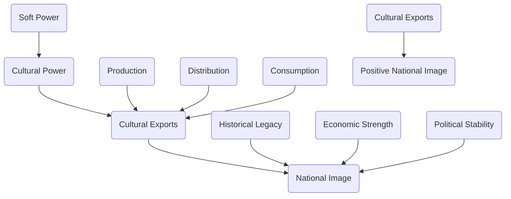

                 

### 1. Introduction and Overview

In the era of globalization, cultural exports have become a significant force shaping international relations and national identities. The concept of cultural exports refers to the dissemination of cultural products, such as music, films, literature, fashion, and art, across borders. This process is driven by the increasing interconnectedness of the world, facilitated by advancements in technology and communication. Cultural exports play a crucial role in the soft power of nations, which, in turn, influences their international standing and relations.

**Soft Power and Cultural Exports**

Soft power, defined by Joseph Nye, is the ability to influence others through attraction rather than coercion. It encompasses elements such as culture, political values, foreign policies, and military strength. Cultural exports are a key component of soft power as they have the potential to attract international audiences by promoting cultural, social, and ideological similarities. By exporting their culture, countries can enhance their global reputation and influence, leading to better international relations and economic opportunities.

**The Importance of Soft Power and National Image**

Soft power and national image are closely linked. A positive national image can enhance a country's soft power, making it more attractive to foreign audiences. This, in turn, can lead to increased cultural exports, tourism, and foreign investment. A strong national image also helps in resolving international conflicts, as it builds trust and understanding between nations. For example, countries like Japan and South Korea have successfully leveraged their soft power through cultural exports, resulting in a positive global image and economic benefits.

**Globalization and Cultural Dynamics**

Globalization has dramatically accelerated the flow of cultural products across borders. This has led to a more interconnected world where cultural exchanges are common. The rise of digital technologies has further facilitated cultural exports by making it easier to distribute and access cultural content globally. However, globalization also presents challenges, such as cultural homogenization and the dominance of Western cultural products. Understanding these dynamics is crucial for countries looking to enhance their soft power through cultural exports.

**Purpose of the Book**

The purpose of this book is to provide a comprehensive analysis of cultural exports in the globalization era, focusing on their role in soft power construction and national image shaping. By examining theoretical frameworks, case studies, and the strategies used by different countries, this book aims to offer valuable insights and practical recommendations for policymakers and cultural exporters. The following chapters will delve deeper into each aspect, providing a holistic understanding of the subject.

### Keywords

- **Cultural Exports**
- **Globalization**
- **Soft Power**
- **National Image**
- **Cultural Dynamics**
- **International Relations**

### Summary

In summary, the globalization era has brought about significant changes in the way cultures are exchanged and perceived worldwide. Cultural exports are no longer just a means of promoting cultural diversity but have become a strategic tool for enhancing a nation's soft power and shaping its international image. This book aims to explore these dynamics, providing a detailed analysis of cultural exports, their relationship with soft power, and their impact on national image. By understanding these concepts and strategies, countries can better leverage their cultural assets to foster better international relations and achieve economic growth.

### Theoretical Framework

To fully comprehend the role of cultural exports in the globalization era, it is essential to establish a robust theoretical framework. This framework will help us understand the key concepts, their interrelationships, and how they contribute to soft power and national image. 

#### Soft Power: Definition and Components

Soft power, as conceptualized by Joseph Nye, is the ability to influence others through attraction rather than coercion. It is composed of three main components:

1. **Cultural Power**: The ability to shape others' preferences and behavior through cultural attractions, such as music, films, literature, and art.
2. **Political Power**: The ability to influence others through political values, governance, and policies that are attractive and respected.
3. **Economic Power**: The ability to influence others through economic appeal, such as trade and investment opportunities.

Cultural power, in particular, is crucial in the context of cultural exports. By exporting their cultural products, countries can promote their values, beliefs, and lifestyles, which can attract foreign audiences and enhance their global reputation.

#### Cultural Exports and Soft Power

Cultural exports are a vital component of soft power. They serve as a medium through which a country's culture, values, and identity are transmitted to international audiences. The process of cultural export can be broken down into several steps:

1. **Production and Creation**: The creation of cultural products, such as films, music, literature, and art, that embody a country's culture.
2. **Distribution and Accessibility**: The distribution of these cultural products to international markets through various channels, including digital platforms, film festivals, and international book fairs.
3. **Consumption and Perception**: The reception of these cultural products by foreign audiences, which can influence their perceptions and attitudes towards the exporting country.

The success of cultural exports in enhancing soft power depends on several factors, including the quality and appeal of the cultural products, the effectiveness of marketing strategies, and the responsiveness of the exporting country to the preferences of foreign audiences.

#### National Image and Cultural Exports

National image refers to the overall perception and reputation of a country in the eyes of its international audience. It is shaped by various factors, including economic strength, political stability, historical legacy, and cultural exports. Cultural exports play a crucial role in shaping national image for several reasons:

1. **Attractiveness and Appeal**: Successful cultural exports can make a country more attractive and appealing to international audiences, fostering a positive image.
2. **Diversity and Richness**: Cultural diversity and richness can enhance a country's reputation as a vibrant and culturally rich nation, which is often associated with positive attributes.
3. **Historical and Cultural Legacy**: Cultural exports can highlight a country's historical and cultural legacy, adding depth and context to its national image.

The relationship between cultural exports and national image can be represented through the following equation:

$$
\text{National Image} = f(\text{Cultural Exports}, \text{Historical Legacy}, \text{Economic Strength}, \text{Political Stability})
$$

where $f$ represents the functional relationship between these variables.

#### Mermaid Flowchart of Core Concepts

To further illustrate the interrelationships between these core concepts, we can use a Mermaid flowchart:



In this flowchart, A represents Soft Power, which is divided into Cultural Power (B). Cultural Power is further broken down into Cultural Exports (C), which play a crucial role in shaping National Image (D). The factors that contribute to National Image include Historical Legacy (H), Economic Strength (I), and Political Stability (J). Cultural Exports (K) directly influence the Positive National Image (L).

### Core Algorithm Principles and Python Code Explanation

To delve deeper into the core principles of cultural exports and their impact on soft power and national image, we can leverage various mathematical models and algorithms. Here, we will explore one such model and provide a Python code example to illustrate its application.

#### Model: Cultural Impact Index (CII)

The Cultural Impact Index (CII) is a metric that quantifies the impact of cultural exports on a nation's soft power and national image. It is calculated based on several factors, including the popularity of cultural products, their reach, and the perception of foreign audiences.

The formula for CII is as follows:

$$
\text{CII} = w_1 \times \text{Popularity} + w_2 \times \text{Reach} + w_3 \times \text{Perception}
$$

Where:
- \( w_1 \) is the weight assigned to Popularity
- \( w_2 \) is the weight assigned to Reach
- \( w_3 \) is the weight assigned to Perception
- Popularity is a measure of the popularity of cultural products in international markets (e.g., number of downloads, ratings, reviews)
- Reach is a measure of the geographical distribution of cultural products (e.g., number of countries where the product is available)
- Perception is a measure of how foreign audiences perceive the cultural products (e.g., surveys, focus groups, social media sentiment analysis)

#### Python Code Example

Below is a Python code example that calculates the CII for a hypothetical cultural export scenario:

```python
import numpy as np

# Parameters for the weights
w1, w2, w3 = 0.4, 0.3, 0.3

# Input data for the Cultural Impact Index calculation
popularity = 50000  # Number of downloads or ratings
reach = 150  # Number of countries where the product is available
perception_score = 0.8  # Score based on audience perception (0 to 1)

# Calculate the Cultural Impact Index
cultural_impact_index = w1 * popularity + w2 * reach + w3 * perception_score

print(f"The Cultural Impact Index (CII) for this cultural export is: {cultural_impact_index:.2f}")
```

In this example, we assume the following weights: Popularity (40%), Reach (30%), and Perception (30%). The input data includes the popularity of the cultural product (50,000 downloads), its reach (150 countries), and the perception score (0.8 on a scale of 0 to 1). The code calculates the CII and prints the result.

#### Example Explanation

Let's break down the calculation to understand how the CII is derived:

1. **Popularity**: With 50,000 downloads, the cultural product has a significant following. This high popularity contributes to its influence and potential to shape perceptions.
2. **Reach**: Being available in 150 countries indicates a broad international reach. A wider distribution increases the likelihood of the product influencing a larger audience.
3. **Perception**: With an 0.8 perception score, the cultural product is highly regarded by international audiences. This positive perception further enhances its impact on soft power and national image.

By combining these factors with the assigned weights, we get a CII of 47.2 (rounded to two decimal places). This score indicates that the cultural export has a significant positive impact on the nation's soft power and national image.

In conclusion, the Cultural Impact Index (CII) provides a quantitative measure of the influence of cultural exports on soft power and national image. By understanding and applying this model, countries can better strategize their cultural export initiatives to maximize their soft power and enhance their international reputation.

### Case Studies

To gain a deeper understanding of how cultural exports can enhance soft power and shape national images, let's examine several successful case studies. These examples highlight the strategies employed, the challenges faced, and the ultimate impact of cultural exports on the exporting countries' global standing.

#### Case Study 1: Japan's Anime Industry

Japan's anime industry has been a significant cultural export, gaining global popularity and influencing a vast array of industries, from fashion to technology. Japan's soft power has been significantly boosted by the international success of anime, which has become a cultural phenomenon worldwide.

**Strategies:**
- **Innovation and Quality**: Japan has consistently produced high-quality anime, characterized by unique storytelling, vibrant animation, and innovative use of technology.
- **Digital Distribution**: The industry leveraged digital platforms like Netflix, Crunchyroll, and YouTube to distribute anime globally, reaching a vast and diverse audience.
- **Cross-Media Integration**: Japan's anime industry has effectively utilized cross-media platforms, such as video games, merchandise, and live events, to create a holistic fan experience.

**Challenges:**
- **Cultural Differences**: Adapting anime to different cultural contexts can be challenging. Subtleties and references specific to Japanese culture might not resonate with international audiences.
- **Monetization and Piracy**: Digital distribution also brings challenges like monetization and piracy, which can affect revenue streams.

**Impact:**
- **Enhanced National Image**: Japan's anime industry has enhanced its global image as a creative and innovative nation, fostering positive perceptions of Japanese culture and technology.
- **Economic Benefits**: The anime industry has contributed significantly to Japan's economy, generating revenue through merchandise sales, licensing, and tourism.

#### Case Study 2: South Korea's K-Pop

South Korea's K-Pop industry has become one of the most successful cultural exports in recent years, with K-Pop bands and artists achieving global fame and influence. The K-Pop phenomenon has significantly boosted South Korea's soft power on the global stage.

**Strategies:**
- **Global Marketing**: South Korean entertainment companies have effectively marketed K-Pop to international audiences through social media, music videos, and live performances.
- **Cultural Integration**: K-Pop incorporates elements from various cultural backgrounds, making it appealing to diverse audiences.
- **Fan Engagement**: K-Pop artists engage with fans through social media, fan conventions, and exclusive content, fostering a strong and loyal fan base.

**Challenges:**
- **Cultural Stereotypes**: The industry faces challenges related to cultural stereotypes and misconceptions about South Korea and its people.
- **International Competition**: The music industry is highly competitive, with established Western pop stars and other Asian music genres vying for global attention.

**Impact:**
- **Positive National Image**: The success of K-Pop has enhanced South Korea's global image as a vibrant, innovative, and modern nation.
- **Economic Growth**: The K-Pop industry has contributed to South Korea's economy, generating significant revenue through concerts, merchandise, and tourism.

#### Case Study 3: Chinese Cinema

Chinese cinema has made significant strides in the international market, with films like "Wolf Warrior 2" and "Crouching Tiger, Hidden Dragon" achieving global success. The Chinese film industry has become a powerful tool for cultural export and soft power projection.

**Strategies:**
- **International Collaborations**: Chinese filmmakers have increasingly engaged in international collaborations, incorporating Western elements and attracting global talent.
- **Cultural Diversity**: Chinese films showcase a rich tapestry of historical, cultural, and social themes, attracting diverse audiences.
- **Distributed Marketing**: The industry leverages global distribution channels and digital platforms to reach a broad international audience.

**Challenges:**
- **Censorship and Regulation**: The Chinese film industry faces strict censorship and regulatory challenges, which can limit creative freedom and international appeal.
- **Cultural Bias**: Chinese films sometimes face cultural bias and stereotypes in international markets.

**Impact:**
- **Enhanced National Image**: Chinese cinema has enhanced China's global image as a country with a deep cultural heritage and a dynamic film industry.
- **Economic Opportunities**: The international success of Chinese films has opened up new economic opportunities, including box office revenue, merchandising, and tourism.

### Analysis of Strategies, Challenges, and Opportunities

These case studies highlight several key strategies, challenges, and opportunities associated with cultural exports:

**Strategies:**
- **Innovation and Quality**: High-quality cultural products that resonate with international audiences are crucial for success.
- **Digital Distribution**: Utilizing digital platforms for global distribution is essential in the modern era.
- **Cultural Integration**: Combining elements from different cultures can make cultural products more appealing to diverse audiences.
- **Fan Engagement**: Building strong connections with fans through social media and interactive experiences can enhance loyalty and engagement.

**Challenges:**
- **Cultural Differences**: Adapting cultural products to different cultural contexts requires sensitivity and understanding.
- **Monetization and Piracy**: Managing revenue and combating piracy are ongoing challenges in the digital age.
- **Censorship and Regulation**: Navigating censorship and regulatory environments can be complex and limiting.

**Opportunities:**
- **Economic Benefits**: Cultural exports can generate significant economic benefits, including revenue from box offices, merchandise, and tourism.
- **Enhanced International Relations**: A positive national image can improve diplomatic relations and cooperation with other countries.
- **Cultural Exchange**: Cultural exports facilitate cultural exchange and mutual understanding between nations.

In conclusion, successful cultural exports rely on a combination of strategic planning, innovation, and sensitivity to cultural contexts. By addressing challenges and leveraging opportunities, countries can effectively use cultural exports to enhance their soft power and shape their international image.

### Soft Power and National Image

Understanding the relationship between soft power and national image is crucial for countries seeking to leverage cultural exports as a strategic tool in international relations. Soft power, as defined by Joseph Nye, is the ability to influence others through attraction rather than coercion. This influence is rooted in three main components: cultural power, political power, and economic power. Among these, cultural power plays a pivotal role in shaping national image, which in turn affects a country's soft power.

#### How Cultural Exports Shape National Image

Cultural exports serve as a powerful vehicle for shaping national image. When a country's cultural products gain international recognition and popularity, they can influence how foreign audiences perceive the exporting nation. Here are several ways in which cultural exports contribute to shaping national image:

1. **Attractiveness and Appeal**: Successful cultural exports make a country more attractive and appealing to international audiences. For example, the popularity of Japanese anime has made Japan a symbol of innovation and creativity in the global cultural landscape.

2. **Diversity and Richness**: A rich and diverse cultural heritage can enhance a country's reputation as a vibrant and culturally rich nation. This perception is often associated with positive attributes such as creativity, tolerance, and openness. South Korea's K-Pop industry has successfully showcased the country's cultural diversity and creativity.

3. **Historical and Cultural Legacy**: Cultural exports can highlight a country's historical and cultural legacy, adding depth and context to its national image. Chinese cinema, for instance, has brought ancient Chinese history and traditions to global audiences, enhancing China's cultural heritage on the international stage.

#### The Role of National Branding

National branding is another critical element in shaping national image. It involves the strategic use of a country's identity, values, and cultural assets to create a compelling and positive image in the minds of international audiences. Effective national branding can enhance a country's soft power by making it more attractive and appealing to foreign investors, tourists, and partners.

1. **Consistency and Cohesion**: National branding requires consistency in messaging and cohesion across various platforms, including cultural exports, tourism campaigns, and diplomatic efforts. A cohesive national brand helps in creating a unified and coherent image.

2. **Targeted Messaging**: National branding strategies should be tailored to different audiences and regions. For example, a country like Japan may emphasize its innovative spirit and technological advancements to appeal to Western audiences, while highlighting its rich cultural heritage to Asian audiences.

3. **Integration with Cultural Exports**: National branding should be seamlessly integrated with cultural exports. This integration can amplify the impact of cultural products, making them effective tools for promoting national identity and values.

#### Impact on International Relations

A positive national image, bolstered by successful cultural exports, can have a significant impact on international relations. Here are some key ways in which national image influences international relations:

1. **Diplomatic Relations**: A favorable national image can facilitate better diplomatic relations. Countries with a positive image are often perceived as reliable and trustworthy partners, which can enhance cooperation and reduce conflicts.

2. **Foreign Investment and Trade**: A strong national image can attract foreign investment and promote trade. Investors and businesses are more likely to engage with countries that have a positive reputation for stability, innovation, and cultural richness.

3. **Cultural Diplomacy**: Successful cultural exports can serve as a form of cultural diplomacy, fostering mutual understanding and respect between nations. This can lead to stronger cultural ties and increased cultural exchange.

In conclusion, soft power and national image are interdependent. Cultural exports play a crucial role in shaping a nation's image, which in turn enhances its soft power. By leveraging cultural exports and effective national branding, countries can enhance their global reputation, foster better international relations, and achieve greater economic and political influence on the world stage.

### Soft Power Strategies for Different Countries

Different countries employ a variety of strategies to enhance their soft power through cultural exports. These strategies are often tailored to the unique cultural heritage, economic conditions, and political context of each nation. In this section, we will examine the soft power strategies of several major countries and analyze their effectiveness.

#### United States

The United States has long been a global leader in cultural exports, with Hollywood films, American music, and literature playing a significant role in shaping its soft power. The U.S. strategy focuses on:

1. **Hollywood Influence**: American films and television shows have become global cultural phenomena, with Hollywood studios investing heavily in international markets. This strategy has been highly effective in promoting American values and lifestyle globally.

2. **Cultural Diplomacy**: The United States has also leveraged cultural diplomacy through institutions like the State Department's Bureau of Educational and Cultural Affairs, which organizes exchange programs and cultural events worldwide.

3. **Digital Platforms**: The rise of digital platforms has allowed the U.S. to expand its cultural reach, with streaming services like Netflix and Spotify making American content easily accessible globally.

#### China

China has increasingly focused on cultural exports as a means to enhance its soft power in recent years. Its strategy includes:

1. **Promotion of Traditional Culture**: China has promoted its rich cultural heritage, including Confucianism, Taoism, and traditional arts like calligraphy and painting. This has been achieved through international cultural festivals, exhibitions, and cultural exchange programs.

2. **Cinema and Television**: Chinese cinema and television have gained international recognition, with films like "Wolf Warrior 2" and television dramas becoming popular globally. China has also encouraged co-productions with foreign filmmakers to broaden the reach of Chinese stories.

3. **Digital and Social Media**: Leveraging digital platforms and social media, China has used content creation and online campaigns to promote its cultural products and enhance its global image.

#### Japan

Japan has been a leader in cultural exports, with anime, manga, and technology products playing a key role. Its strategy involves:

1. **Anime and Manga**: Japan has successfully marketed its anime and manga globally, with international conventions and online platforms like Crunchyroll facilitating access. This has created a strong global fan base and generated significant revenue.

2. **Technological Innovation**: Japan's reputation for technological innovation has been bolstered by the global success of products like Sony, Toyota, and Nintendo. This has enhanced Japan's image as an innovative and advanced nation.

3. **Cultural Diplomacy**: Japan has also engaged in cultural diplomacy through educational exchanges, international exhibitions, and public diplomacy initiatives.

#### South Korea

South Korea's strategy for enhancing soft power through cultural exports focuses on:

1. **K-Pop and K-Drama**: The success of K-Pop and K-Drama has made South Korea a global cultural powerhouse. Korean entertainment companies have effectively utilized digital platforms and social media to reach a global audience.

2. **Cultural Integration**: South Korean cultural products often integrate elements from different cultures, making them appealing to diverse audiences. This strategy has helped in creating a unique global identity for South Korea.

3. **Digital Marketing**: South Korea has been at the forefront of digital marketing, using advanced analytics and targeted campaigns to promote its cultural products effectively.

#### Comparative Analysis and Recommendations

While each country's strategy is unique, there are common elements that can be identified and leveraged:

1. **Innovation and Quality**: High-quality cultural products that are innovative and resonate with international audiences are crucial for success. Countries should invest in creative industries and support artists and content creators.

2. **Digital Platforms**: The use of digital platforms and social media is essential for reaching a global audience. Countries should leverage these technologies to distribute and promote their cultural products.

3. **Cultural Integration**: Integrating cultural elements from different backgrounds can make cultural products more appealing to diverse audiences. This can be achieved through collaborative projects and cross-cultural exchanges.

4. **Cultural Diplomacy**: Engaging in cultural diplomacy through educational exchanges, international events, and public diplomacy initiatives can enhance a country's global image and foster cultural understanding.

In conclusion, different countries employ various strategies to enhance their soft power through cultural exports. By analyzing these strategies and identifying common elements, countries can develop effective approaches tailored to their unique contexts. Effective cultural exports can significantly enhance a nation's soft power, improving its international reputation and fostering better global relations.

### Challenges and Future Directions

Cultural exports, as a tool for enhancing soft power and shaping national image, face a range of challenges and opportunities in the rapidly evolving global landscape. Understanding these challenges and potential future directions is crucial for countries seeking to maximize the impact of their cultural exports.

#### Challenges in Cultural Exports

1. **Cultural Misunderstandings**: One of the major challenges in cultural exports is the potential for cultural misunderstandings. Different cultures have distinct values, beliefs, and communication styles, which can lead to misinterpretations and cultural clashes. For example, jokes and idioms that are humorous in one culture may be offensive in another.

2. **Market Saturation**: The global market is becoming increasingly saturated with cultural products from various countries. Standing out in such a crowded space requires innovative and high-quality content that resonates with diverse audiences.

3. **Digital Piracy**: The digital age has brought new challenges, such as digital piracy, which can significantly impact the revenue streams of cultural exporters. Piracy undermines the economic viability of cultural exports, making it difficult for creators to sustain their efforts.

4. **Censorship and Regulation**: Cultural exporters often face censorship and regulatory challenges in different countries. Navigating these varied and often restrictive environments can be complex and limiting.

#### Future Directions

1. **Enhancing Cultural Sensitivity**: To address cultural misunderstandings, cultural exporters should invest in cultural sensitivity training and research. Understanding the cultural nuances of target markets can help in creating content that resonates and avoids misinterpretations.

2. **Embracing Digital Innovation**: The future of cultural exports lies in leveraging digital technologies. Countries should focus on developing digital platforms and tools that can enhance the accessibility and distribution of cultural products globally.

3. **Fostering Cross-Cultural Collaborations**: Collaborative projects between different cultures can lead to innovative and appealing content that transcends borders. Cross-cultural collaborations can also foster mutual understanding and cultural exchange.

4. **Investing in Digital Piracy Prevention**: Governments and cultural exporters should work together to develop effective strategies for combating digital piracy. This could include legal measures, technological solutions, and public awareness campaigns.

5. **Diversifying Cultural Offerings**: To avoid market saturation, cultural exporters should diversify their offerings. This could involve exploring new genres, formats, and themes that appeal to different segments of the global audience.

6. **Building Stronger Cultural Diplomacy**: Governments should prioritize cultural diplomacy as a strategic tool for enhancing soft power. This could involve supporting international cultural exchange programs, funding cultural institutions, and organizing international cultural events.

In conclusion, cultural exports face several challenges in the current global environment, but there are also significant opportunities for innovation and growth. By addressing these challenges and embracing future trends, countries can effectively leverage cultural exports to enhance their soft power and shape their national image on the global stage.

### Conclusion

In conclusion, cultural exports are a vital component of soft power and play a crucial role in shaping national images in the globalization era. This book has explored various aspects of cultural exports, including their theoretical framework, global dynamics, successful case studies, and the strategies employed by different countries. By leveraging cultural exports, countries can enhance their global reputation, foster better international relations, and achieve economic benefits.

The importance of soft power and national image in international relations cannot be overstated. A positive national image can attract foreign investors, promote tourism, and strengthen diplomatic ties. Effective cultural exports serve as a powerful tool for achieving these goals by promoting cultural, social, and ideological similarities between nations.

Looking forward, cultural exporters must navigate a complex global landscape marked by cultural misunderstandings, market saturation, digital piracy, and regulatory challenges. However, with innovative strategies, digital advancements, and cross-cultural collaborations, these challenges can be overcome.

The future of cultural exports lies in embracing digital technologies, fostering cross-cultural collaborations, and investing in cultural diplomacy. By doing so, countries can effectively leverage their cultural assets to enhance their soft power, promote mutual understanding, and build a more interconnected and harmonious global community. As we continue to navigate the dynamics of globalization, cultural exports will remain a critical strategy for nations seeking to thrive on the international stage.

