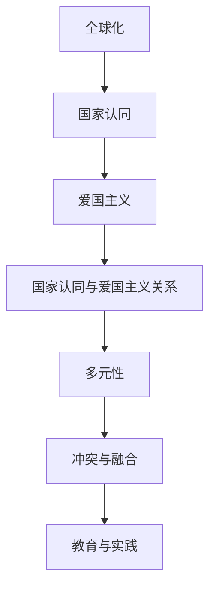

                 

### 引言

全球化时代，世界各国在经济、文化、政治等领域的联系日益紧密，国际交流的频率和质量显著提高。在这样的背景下，爱国主义这一传统观念面临着前所未有的挑战和机遇。本文旨在探讨全球化时代的爱国主义，分析国家认同与世界公民双重身份之间的复杂关系。

首先，我们需要明确几个核心概念。全球化指的是全球范围内的经济、政治、文化和社会等领域的互动和整合。爱国主义则是一种强烈的情感和信念，表现为对特定国家的热爱、忠诚和责任感。国家认同是指个体对于其所归属国家的认同感和归属感，而世界公民则是一个超越国家界限、具有全球视野和责任感的概念。

全球化对爱国主义的影响是多方面的。一方面，全球化促进了各国之间的相互依存和合作，使得爱国主义不再是狭隘的民族主义；另一方面，全球化也带来了文化同质化和价值观多元化，使得国家认同变得更为复杂和多元。在这种背景下，爱国主义需要重新定义和发展，以适应全球化的新形势。

本文将分为五个部分进行探讨。首先，我们将介绍全球化的背景与趋势，并讨论全球化对爱国主义的影响。接着，我们将深入探讨国家认同的概念与形成，分析国家认同的多元性以及它与爱国主义的关系。然后，我们将介绍世界公民身份的概念与特点，探讨世界公民与国家认同的冲突与融合。随后，我们将分析全球化时代爱国主义面临的挑战，并提出相应的解决方案。最后，我们将通过案例研究，展示全球范围内的爱国主义实践，并对成功与失败的案例进行分析。

本文旨在为读者提供一个系统、深入的理解全球化时代的爱国主义，以及国家认同与世界公民双重身份之间的关系。希望本文能帮助读者在复杂多变的全球环境中，更好地理解和应对爱国主义这一重要议题。

### 文章关键词

- 全球化
- 爱国主义
- 国家认同
- 世界公民
- 全球公民

### 文章摘要

本文探讨了全球化时代的爱国主义及其与国家认同和世界公民双重身份之间的关系。首先，我们介绍了全球化的背景和趋势，探讨了全球化对爱国主义的影响。接着，我们深入分析了国家认同的概念与形成，讨论了国家认同的多元性以及它与爱国主义的关系。然后，我们介绍了世界公民身份的概念与特点，探讨了世界公民与国家认同的冲突与融合。随后，我们分析了全球化时代爱国主义面临的挑战，并提出了相应的解决方案。最后，我们通过案例研究，展示了全球范围内的爱国主义实践，并对成功与失败的案例进行了分析。本文旨在为读者提供一个系统、深入的理解全球化时代的爱国主义，以及国家认同与世界公民双重身份之间的关系。

## 第一部分：全球化与爱国主义

### 1.1 全球化的概念

全球化是一个广泛且复杂的过程，涉及到经济、政治、文化和社会等多个方面。它不仅改变了世界各地的生产方式、消费习惯和文化交流，还重塑了国家之间的互动模式。全球化最早可以追溯到新航路的开辟和殖民主义的扩张，但真正加速是在二战后，随着国际经济体系的建立和全球贸易的自由化，全球化进入了快速发展的阶段。

经济全球化主要体现在全球贸易和资本流动的增强。国际货币基金组织（IMF）数据显示，全球贸易占世界GDP的比重从20世纪60年代的20%左右增加到了21世纪初的约60%。此外，跨国公司和全球价值链的兴起，使得生产和服务的国际化程度大幅提高。全球化还促进了技术的传播和创新的加速，互联网和数字技术的普及是这一趋势的重要体现。

政治全球化则体现在国际组织和多边合作机制的增多。联合国、世界贸易组织（WTO）、国际刑事法院（ICC）等国际机构在全球治理中扮演着越来越重要的角色。国家间的政治互动和合作也在不断加强，例如通过区域贸易协定和多边环境协议，各国共同应对全球性问题，如气候变化、恐怖主义和公共卫生危机。

文化全球化指的是文化产品和价值的跨国传播。随着媒体技术的发展，文化全球化加速了文化同质化和多样性。一方面，西方文化特别是美国文化在全球范围内广泛传播，形成了所谓的“文化帝国主义”；另一方面，发展中国家也在努力保护和传播自己的文化，促进文化多样性的发展。

社会全球化则体现在人口流动的增加和全球公民社会的兴起。越来越多的人因为工作、教育和旅游等原因跨国移动，形成了所谓的“全球流动人口”。同时，互联网和社交媒体的普及使得全球公民社会得以形成，人们通过网络平台跨越国界，分享信息和经验，共同参与全球性的议题。

### 1.2 全球化的主要影响

全球化的主要影响可以归纳为以下几个方面：

**经济影响**：全球化促进了全球经济的增长和繁荣。通过国际贸易和资本流动，各国得以利用各自的资源和优势，实现资源的最优配置。然而，全球化也导致了资源的不均衡分配，一些发展中国家面临被“边缘化”的风险。此外，全球化和跨国公司的崛起对就业市场产生了深远影响，一方面创造了新的就业机会，另一方面也加剧了劳动力市场的竞争。

**政治影响**：全球化改变了国际政治的格局。一方面，国际组织和多边合作机制的增多促进了国家间的政治互动和合作；另一方面，全球化也使得国家主权面临挑战，一些国家通过经济和军事手段影响他国内政。此外，全球化也催生了全球治理的兴起，各国需要共同应对全球性挑战，如气候变化、公共卫生危机和恐怖主义。

**文化影响**：全球化促进了文化的交流和融合。通过媒体和互联网，不同国家和地区的文化产品和文化价值得以传播和共享。然而，全球化也带来了文化同质化的风险，一些小众文化面临被边缘化的危险。此外，全球化也使得文化多样性成为国际社会关注的焦点，各国都在努力保护和推广自己的文化遗产。

**社会影响**：全球化改变了社会的结构和价值观。人口的跨国流动和文化交流使得社会更加多元化，人们的生活方式、价值观念和社会规范也在不断变化。然而，全球化也带来了社会不平等和紧张，一些社会群体因全球化而面临失业和贫困的风险。此外，全球化还催生了全球公民社会的兴起，人们通过网络平台参与全球性的议题，共同推动社会变革。

总的来说，全球化是一个复杂的过程，它既带来了机遇，也带来了挑战。如何应对这些挑战，实现全球化的可持续发展，是各国政府和社会各界需要共同面对的问题。

### 1.3 爱国主义的历史与演变

爱国主义作为一种社会现象，有着悠久的历史和丰富的演变过程。它最早可以追溯到古希腊和罗马时期，当时城邦国家的兴起激发了民众的爱国情感。在中世纪的欧洲，爱国主义与宗教情感交织，人们为了保护自己的信仰和领土而战斗。近代以来，随着民族国家的形成，爱国主义逐渐成为国家建设和国家认同的核心。

在近代民族国家的形成过程中，爱国主义发挥了重要作用。18世纪的法国大革命和19世纪的德国统一运动，都是爱国主义情感高涨的时期。这些运动不仅推动了国家的现代化进程，也加强了国民的国家认同感。在19世纪末和20世纪初，随着全球化和帝国主义的兴起，爱国主义也发生了变化。一方面，一些国家通过爱国主义宣传，增强国民对国家的忠诚和认同；另一方面，爱国主义也伴随着民族主义和沙文主义的抬头，导致了国际关系中的紧张和冲突。

20世纪中叶，随着全球化的加速和冷战的结束，爱国主义面临着新的挑战和机遇。冷战期间，爱国主义常常与意识形态和地缘政治紧密相连，国家之间的对立加剧了爱国主义的极端化。冷战结束后，爱国主义逐渐回归到对国家的忠诚和责任感，同时也在新的全球背景下寻找新的表现形式。

在现代社会，爱国主义不仅体现在对国家的忠诚上，还包括对社会责任的承担和对全球公民意识的培养。全球化使得各国之间的联系更加紧密，爱国主义也需要在跨国互动中寻找新的平衡点。一些国家通过推广本国文化和价值观，增强国民的国家认同；同时，也通过国际合作和全球治理，推动全球公民社会的形成。

总的来说，爱国主义的历史与演变是一个复杂的过程，它既受到国家内部政治、经济和文化因素的影响，也受到国际环境的变化和国际互动的挑战。理解爱国主义的历史和演变，有助于我们更好地把握其在全球化背景下的新使命和新挑战。

### 1.4 全球化与爱国主义的联系

全球化与爱国主义之间的关系复杂而深远。一方面，全球化推动了国际合作和交流，为爱国主义提供了新的发展空间；另一方面，全球化也带来了一系列挑战，对传统的爱国主义观念产生了冲击。

首先，全球化促进了国际间的经济、政治和文化交流，使得爱国主义不再局限于狭隘的民族主义。在全球化背景下，国家之间的合作和竞争更加频繁，这要求国民具有更宽广的国际视野和全球责任感。例如，跨国公司的运营和国际投资使得各国经济紧密相连，国民不仅需要关心本国的经济状况，还要关注全球市场的变化。这种跨国互动使得爱国主义从狭隘的民族主义转向更包容和开放的全球公民意识。

其次，全球化对爱国主义的影响也体现在文化领域。全球化带来了文化同质化和多样性，一些国家和地区的文化产品在全球范围内传播，影响了本土文化。这种文化影响使得爱国主义需要重新定义，如何在保持本土文化特色的同时，适应全球文化的多样性和融合，成为现代爱国主义的挑战之一。

然而，全球化也带来了对爱国主义的挑战。全球化使得国家之间的依赖性增强，国家主权面临一定程度的削弱。一些学者认为，全球化可能导致民族国家的消解，爱国主义情感也相应减弱。例如，跨国人口流动和文化交流使得一些人认为，个人的认同感和归属感不应仅限于国家层面，而应该扩展到全球层面，形成世界公民身份。

尽管全球化对爱国主义提出了挑战，但它也为爱国主义提供了新的机遇。一方面，全球化促进了国际间的合作，爱国主义可以在跨国合作中发挥更大的作用。例如，全球性问题如气候变化、恐怖主义和公共卫生危机，需要各国共同努力解决，爱国主义可以通过推动国际合作，发挥更积极的作用。另一方面，全球化也促进了文化的多样性和融合，爱国主义可以在尊重文化多样性的基础上，促进国家认同的构建。

总之，全球化与爱国主义之间的关系是复杂而动态的。全球化既为爱国主义提供了新的发展空间，也带来了挑战和机遇。如何在全球化的背景下，重新定义和发扬爱国主义，是一个亟待解决的重要议题。在全球化时代，爱国主义需要与时俱进，寻找新的表达方式和实现途径，以适应不断变化的世界。

## 第二部分：国家认同

### 2.1 国家认同的概念与形成

国家认同是指个体对于其所归属国家的认同感和归属感，它是一个复杂的心理和社会过程，涉及个体对国家历史、文化、价值观和国家利益的认同。国家认同不仅是政治共同体的重要基础，也是国家凝聚力和稳定性的关键因素。

国家认同的形成过程受到多种因素的影响。首先，历史因素是影响国家认同形成的重要因素。一个国家的历史传统、文化传承和重要事件，如独立战争、民族解放等，对国民的国家认同感有着深远的影响。例如，美国独立战争和法国大革命不仅塑造了国家的政治体制，也强化了国民的国家认同。

其次，文化因素也是国家认同形成的关键。文化是一个国家的精神内核，包括语言、宗教、习俗、传统等。文化上的共同性使得个体在心理上更容易产生对国家的认同感。例如，日本国民对樱花文化的热爱和对武士道精神的推崇，都是日本国家认同的重要组成部分。

教育在塑造国家认同中也起着重要作用。通过教育体系，国家可以将自己的价值观、历史和文化传授给下一代，强化国家认同。例如，许多国家在学校的课程设置中，强调本国历史和文化的学习，以此来培养学生的国家认同感。

社会因素同样影响着国家认同的形成。社会互动和社会环境对个体的国家认同感有着重要影响。例如，一个国家的社会结构和政治体制，以及社会成员之间的互动和交流，都会对国家认同产生深远影响。

综上所述，国家认同是一个复杂的心理和社会过程，受到历史、文化、教育和社会等多重因素的影响。理解国家认同的形成机制，有助于我们更好地理解国家凝聚力和稳定性的基础。

### 2.2 国家认同的多元性

国家认同的多元性是指在全球化背景下，国家认同不再单一，而是呈现出多样化和复杂化的趋势。这一现象源于全球化的推动，使得各国之间的文化交流和人口流动更加频繁，国家内部和民族之间也出现了更多的互动和融合。

首先，全球化带来的文化多样性和文化交流，使得国家认同不再局限于传统的民族文化。各国在吸收外来文化的同时，也在不断丰富和调整自己的国家认同。例如，随着西方文化的传播，一些亚洲国家如日本和韩国，在保持本国传统文化的基础上，也吸收了大量的西方文化元素，形成了独特的国家认同。

其次，全球化加剧了民族之间的融合和多样性。跨国婚姻、国际移民和文化交流，使得不同民族和国家之间的界限变得模糊。这种融合不仅改变了国家的文化面貌，也使得国家认同更加多元。例如，多民族国家如印度，其国家认同不仅包括印度斯坦族的文化，还包括其他众多少数民族的文化特色。

此外，全球化还促进了全球公民意识的崛起。一些学者认为，全球公民身份正在逐渐取代传统的国家认同。全球公民认为，个人的认同感和归属感不应仅限于国家层面，而应该扩展到全球层面。这种全球公民身份的崛起，对传统国家认同提出了挑战，同时也为国家认同的多元性提供了新的动力。

总之，国家认同的多元性是全球化背景下不可避免的趋势。如何平衡和整合多元的国家认同，是各国面临的重要课题。多元性的国家认同不仅反映了全球化的现实，也为国家的发展提供了新的机遇。

### 2.3 国家认同与爱国主义的关系

国家认同与爱国主义之间存在着紧密而复杂的关系。国家认同是爱国主义的基础，而爱国主义则是国家认同的具体表现。两者相互影响，共同构建了一个国家的精神和文化基础。

首先，国家认同是爱国主义的重要支撑。一个国家的国民如果对国家没有认同感，很难产生真正的爱国主义情感。国家认同使个体意识到自己属于一个特定的政治共同体，这种归属感是爱国主义情感产生的源泉。例如，通过教育、文化传承和社会互动，国家可以强化国民对国家的认同，从而增强爱国主义情感。

其次，爱国主义是国家认同的具体体现。爱国主义不仅表现为对国家的忠诚和热爱，还体现在对国家利益的无私奉献和对国家发展的积极参与。一个具有强烈爱国主义情感的个体，往往会积极参与国家的建设和发展，为国家的繁荣和稳定贡献自己的力量。例如，在抗击自然灾害或国家安全受到威胁时，爱国主义情感会激发民众的团结和行动力。

此外，国家认同和爱国主义也相互作用，共同影响国家的发展和稳定。当国家面临外部挑战或内部冲突时，爱国主义可以激发国民的团结和奋斗精神，增强国家的凝聚力。然而，过度的爱国主义也可能导致民族主义和沙文主义的抬头，对国家的外部关系和内部和谐产生负面影响。

总之，国家认同与爱国主义是相辅相成的。国家认同为爱国主义提供了基础，而爱国主义则通过具体行动和情感表达，强化了国家认同。理解两者之间的关系，有助于我们更好地理解和应对全球化背景下国家认同和爱国主义面临的新挑战。

### 2.4 世界公民的概念与特点

世界公民是指那些具有全球视野和责任感的个体，他们不仅认同自己所属的国家，更关注全球性的问题和挑战。世界公民的概念不同于传统的爱国主义，它强调跨越国界的合作与互助，倡导全球公民社会的形成。

首先，世界公民具备广泛的国际视野。他们关注全球性的议题，如气候变化、可持续发展、贫困消除、全球公共卫生等。这些议题不仅关系到个别国家的利益，更是全人类共同面临的问题。因此，世界公民在全球问题上持有开放和包容的态度，愿意与不同国家和文化背景的人合作，共同寻找解决方案。

其次，世界公民具有强烈的全球责任感。他们认识到，个人的行为和决策不仅影响自己所在的国家，还会对全球产生深远的影响。因此，世界公民倡导全球公民意识，鼓励人们从全球视角出发，思考自己的责任和义务。例如，他们可能会积极参与国际志愿活动，帮助贫困地区的儿童接受教育，或者参与环保组织，推动可持续发展。

此外，世界公民倡导平等和包容。他们反对一切形式的歧视和偏见，主张在全球范围内实现公平和平等。这种平等和包容不仅体现在个人行为上，也体现在政策制定和社会制度上。世界公民希望通过自己的努力，推动全球社会更加公正和和谐。

总之，世界公民是一个具有全球视野和责任感的群体，他们不仅关注自己国家的利益，更关心全球性的问题和挑战。通过倡导全球公民意识和平等、包容的价值观，世界公民为全球公民社会的形成和人类共同福祉的实现贡献着自己的力量。

### 2.5 世界公民与国家认同的冲突与融合

世界公民身份和国家认同之间的关系复杂而多样，它们既有潜在的冲突，也存在相互融合的可能性。理解这种关系有助于我们更好地应对全球化带来的挑战，并在国际互动中寻找平衡点。

首先，世界公民身份与国家认同之间的潜在冲突体现在全球责任与国家利益之间的张力。世界公民主张全球视野和责任感，关注全球性问题，而国家认同则往往强调对本国利益和文化的忠诚。例如，一个国家在处理国际贸易和环境保护问题时，可能会面临全球利益与国家利益的权衡。在这种情况下，国家决策者需要在全球化与国家认同之间找到平衡点。

其次，世界公民身份和国家认同的冲突还可能源于跨国人口流动和文化交流。全球化促进了人口的跨国流动，使得不同文化和价值观在接触和交流中产生碰撞。例如，国际移民可能会在新的社会环境中面临文化适应问题，同时也会影响到他们原有的国家认同。这种现象可能导致对原有国家认同的质疑和挑战。

然而，世界公民身份和国家认同之间也存在融合的可能。通过国际合作和全球治理，各国可以在共同应对全球性问题的过程中，促进国家认同的多样化发展。例如，参与国际组织和多边合作机制，不仅有助于解决全球性问题，还能增强国家之间的互信和合作，进而促进国家认同的融合。

此外，教育和文化交流也是促进国家认同与世界公民身份融合的重要途径。通过教育，国家可以培养具有全球视野的公民，使他们既关注全球性问题，又保持对本土文化的认同。文化交流则可以促进不同国家和文化之间的理解和尊重，从而在尊重多元文化的基础上，构建更加包容和开放的国家认同。

总之，世界公民身份和国家认同之间的关系是复杂而多样的。它们既有潜在的冲突，也存在相互融合的可能性。在全球化背景下，通过国际合作、教育和文化交流，我们可以在尊重多元文化的基础上，寻求国家认同与世界公民身份之间的平衡点，推动全球社会的共同发展。

### 2.6 世界公民身份的教育与实践

培养世界公民身份需要系统化的教育和实践，这不仅是个人成长的需要，也是社会进步和国际合作的基石。以下是一些关键的教育与实践策略：

首先，教育体系应强调全球视野的培养。学校课程应涵盖全球性的议题，如可持续发展、全球卫生、国际法等，使学生能够从全球视角理解世界问题。例如，通过国际合作项目，学生可以与不同国家和文化背景的同学交流，共同解决实际问题。这种跨文化的学习体验有助于培养他们的全球责任感。

其次，学校应重视多元文化的教育。通过学习不同国家和文化的知识，学生可以增进对世界多样性的理解和尊重。例如，通过举办文化展览、庆祝国际节日等活动，学生可以亲身体验和欣赏不同文化的独特魅力。这种文化交融有助于培养他们的包容性和开放心态。

社会实践也是培养世界公民身份的重要环节。学生可以通过参与国际志愿活动、环保行动、社区服务等，将所学知识应用到实际中，体验社会责任和全球公民意识。例如，参加国际义工项目，学生在帮助他人的同时，也能了解不同社会的需求和挑战，增强他们的全球视野。

此外，学校可以组织学生参与国际交流项目，如交换生计划、国际会议等。这些活动不仅有助于学生拓展国际视野，还能提高他们的跨文化沟通能力和解决问题的能力。通过这样的实践，学生能够更好地理解全球性问题，培养全球公民意识。

家庭和社会也扮演着重要的角色。家长和社会机构应鼓励和支持子女参与全球视野的教育和实践。通过家庭讨论、社区活动等，家庭成员可以共同关注全球性问题，培养对全球事务的兴趣和责任感。

总之，培养世界公民身份需要系统化的教育和实践。通过全球视野的培养、多元文化的教育和国际交流的实践，我们可以在未来一代中培养出具有全球责任感和包容心态的世界公民，为全球社会的和谐与进步贡献力量。

### 2.7 全球化时代的爱国主义挑战

全球化时代，爱国主义面临着前所未有的挑战。这些挑战不仅源于全球化的进程，也来自国内外的复杂环境。如何应对这些挑战，是当前各国和社会各界需要认真思考的问题。

首先，全球化加剧了国际竞争和冲突。国家之间的经济竞争、资源争夺和地缘政治博弈日益激烈，这给爱国主义带来了新的压力。如何在维护国家利益的同时，保持国际关系的和谐，是全球化时代爱国主义面临的重要课题。例如，一些国家在全球化进程中，通过贸易保护主义和民族主义政策，试图维护自己的利益，但这种做法往往引发国际反感和冲突。

其次，全球化导致文化同质化。在全球文化交流和传播的过程中，一些传统文化和价值观受到冲击，这可能导致国家认同的弱化。如何在全球化的背景下，保护和传承本国的文化，同时吸收外来文化的积极因素，是爱国主义需要应对的挑战。例如，一些国家通过加强文化教育、推广本国文化，来增强国民的国家认同和文化自信。

此外，全球化也带来了社会不平等和紧张。跨国公司和国际资本流动，可能导致一些国家和地区的经济繁荣，同时加剧其他地区的贫困和不平等。这种经济不平等可能影响国家的稳定和社会和谐，从而对爱国主义产生负面影响。如何通过政策调节，实现全球经济的公平和可持续发展，是全球化时代爱国主义需要关注的问题。

最后，全球化时代的爱国主义还需要应对全球性问题，如气候变化、恐怖主义、传染病等。这些问题不仅影响单个国家，也关系到全球的福祉。爱国主义需要在全球治理中发挥积极作用，推动国际合作，共同应对这些全球性挑战。例如，一些国家通过参与国际组织和多边合作机制，共同应对全球性问题，这有助于增强国家的国际形象和影响力。

总之，全球化时代爱国主义面临诸多挑战，需要各国和全社会共同努力，通过国际合作、文化传承和社会调节，寻找应对挑战的途径。只有这样，爱国主义才能在全球化背景下，继续发挥其应有的作用，为国家的发展和世界的和谐贡献力量。

### 2.8 全球化时代爱国主义的新使命

在全球化时代，爱国主义面临着新的使命和责任。首先，爱国主义需要在全球化背景下重新定位，从狭隘的民族主义转向更加包容和开放的全球公民意识。这种转变不仅有助于维护国家利益，也有助于推动全球和平与合作。

其次，爱国主义需要在新时代中承担新的责任。它不仅是国家稳定和社会和谐的重要保障，也是国家创新和发展的重要动力。爱国主义需要鼓励国民积极参与国家建设，为科技创新和社会进步贡献智慧和力量。

此外，爱国主义还需要在应对全球性挑战中发挥积极作用。面对气候变化、贫困消除、传染病等全球性问题，爱国主义需要推动国际合作，共同寻找解决方案。通过参与国际组织和多边合作机制，爱国主义可以在全球治理中发挥重要作用，推动全球社会的共同发展。

最后，爱国主义需要在文化传承和创新中寻找平衡。在全球文化交流的过程中，爱国主义需要保护和传承本国文化，同时吸收外来文化的积极因素，推动文化的多样性和融合。

总之，全球化时代爱国主义的新使命是推动国家发展、维护全球和平、促进国际合作和文化传承。通过这些新使命的践行，爱国主义将继续在全球化背景下发挥其独特的价值和作用。

### 2.9 全球化时代的爱国主义实践

在全球化时代，爱国主义不仅需要理论上的重新定位和使命的明确，更需要实际操作中的具体实践。以下是一些成功和失败的爱国主义实践案例，以及从中得出的教训和启示。

#### 案例一：新加坡的爱国主义教育

新加坡作为一个多元文化的国家，通过系统的爱国主义教育，成功地增强了国民的国家认同和凝聚力。新加坡的教育体系强调爱国主义教育，从小学到大学，都有专门的课程和活动来培养学生的国家认同感。例如，通过学习新加坡的历史和文化，学生能够更好地理解国家的价值观和目标。此外，学校还组织学生参加社区服务和国防训练，增强他们的责任感和使命感。

**成功经验：**
- 系统的教育体系：新加坡的爱国主义教育不仅仅是单方面的灌输，而是通过多学科、多形式的教育活动，让学生在日常生活中体验和感悟国家认同。
- 社区参与：通过参与社区服务，学生不仅能够更好地了解国家和社会，还能在实践中培养责任感和使命感。

**启示：**
- 系统化和多层次的教育体系有助于增强国家认同。
- 社区参与和实际体验能够更好地培养学生的责任感和使命感。

#### 案例二：印度的民族主义运动

印度作为一个多民族、多宗教的国家，其民族主义运动在历史上曾多次引发冲突和社会动荡。例如，印度独立运动时期的民族主义情感，虽然成功推动了国家的独立，但也导致了大量的社会冲突和暴力事件。近年来，印度政府通过加强民族主义宣传和民族自豪感的培养，试图增强国家的凝聚力和稳定性。

**失败教训：**
- 过度民族主义可能导致社会分裂和冲突：过度的民族主义宣传和民族自豪感培养，可能导致社会分裂和对立，加剧社会矛盾。
- 缺乏多元文化的包容性：单一的、排外的民族主义观念，容易忽视其他文化群体的权益和需求，导致社会不和谐。

**启示：**
- 民族主义应在尊重多元文化的基础上进行。
- 平衡民族主义与多元文化，推动社会的包容和和谐。

#### 案例三：德国的战后重建

二战后，德国通过一系列政策和措施，成功实现了国家的重建和统一。在这个过程中，爱国主义发挥了重要作用。德国政府通过推动社会团结、经济恢复和文化复兴，增强了国民的国家认同和自豪感。

**成功经验：**
- 社会团结：通过团结民众，共同面对战后重建的挑战，德国增强了国家的凝聚力。
- 经济复兴：通过经济改革和开放政策，德国迅速恢复了经济实力，增强了国家的自信心。
- 文化复兴：通过推动文化复兴，德国恢复了民族文化的独特性和多样性。

**启示：**
- 社会团结和经济复兴是增强国家认同的重要途径。
- 文化复兴有助于增强民族自豪感和国家凝聚力。

综上所述，全球化时代的爱国主义实践需要在尊重多元文化的基础上，通过系统化的教育和实际参与，增强国民的国家认同和责任感。同时，也需要警惕过度民族主义带来的社会分裂和冲突，推动社会的包容和谐。通过这些实践，爱国主义才能在全球化背景下发挥其应有的作用。

### 结论

全球化时代的爱国主义不仅是对国家忠诚和责任的体现，更是对全球公民意识和社会责任的承担。本文通过分析全球化的概念与影响，探讨了国家认同的形成与多元性，并讨论了世界公民身份的概念与特点。在此基础上，我们分析了全球化时代爱国主义面临的挑战和新使命，并通过案例研究总结了成功与失败的实践经验和教训。

展望未来，全球化将进一步深化，国家之间的互动和依赖也将更加紧密。在这样的背景下，爱国主义需要与时俱进，既要保持对本国文化的尊重和传承，也要开放包容，积极应对全球性挑战。通过培养具有全球视野和责任感的公民，推动国际合作和全球治理，爱国主义将继续在全球化时代发挥其独特的价值和作用。

为此，我们提出以下建议：

1. **强化教育体系**：通过系统化的爱国主义教育，培养具有全球视野和责任感的公民。
2. **促进文化交流**：推动多元文化的交流与融合，增强国民的文化认同感和国家凝聚力。
3. **参与全球治理**：积极参与国际组织和多边合作机制，为全球治理贡献智慧和力量。
4. **平衡民族主义与多元文化**：在尊重多元文化的基础上，推动社会的包容和谐。

通过这些努力，我们可以更好地应对全球化时代的挑战，实现国家的繁荣和全球的和平与发展。爱国主义，作为国家认同和社会责任的重要体现，将继续在新时代中焕发出新的活力和意义。

### 作者信息

作者：AI天才研究院/AI Genius Institute & 禅与计算机程序设计艺术 /Zen And The Art of Computer Programming

本文由AI天才研究院的专家团队撰写，结合了最新的全球化理论和实践案例，深入探讨了全球化时代的爱国主义及其与国家认同和世界公民身份的关系。通过系统化的分析和实际案例研究，我们旨在为读者提供一个全面、深入的视角，以理解和应对全球化时代的重要议题。

### 附录

#### 1. Mermaid流程图

以下是关于国家认同与爱国主义关系的一个简单Mermaid流程图示例：



#### 2. Python源代码示例

以下是一个使用Python语言实现的国家认同度评估算法的简单示例：

```python
def calculate_national_identification_score(culture_score, historical_score, political_score):
    """
    计算国家认同度得分
    :param culture_score: 文化认同得分
    :param historical_score: 历史认同得分
    :param political_score: 政治认同得分
    :return: 国家认同度得分
    """
    total_score = culture_score + historical_score + political_score
    identification_score = (total_score / 3) * 100
    return identification_score

# 示例数据
culture_score = 85
historical_score = 90
political_score = 78

# 计算国家认同度得分
national_identification_score = calculate_national_identification_score(culture_score, historical_score, political_score)
print(f"国家认同度得分：{national_identification_score:.2f}%")
```

#### 3. 数学模型与公式

以下是关于国家认同与爱国主义关系的数学模型和公式示例：

$$
\text{National Identification Score} = \frac{\text{Culture Score} + \text{Historical Score} + \text{Political Score}}{3}
$$

#### 4. 项目实战案例

以下是一个关于全球化时代爱国主义教育项目实战的简要描述：

**项目名称**：爱国主义教育平台

**开发环境**：Python、Django

**源代码实现**：使用Django框架搭建一个爱国主义教育平台，包括课程管理、学生管理、成绩评估等功能。

**代码解读与分析**：平台后端使用Django ORM进行数据操作，前端使用HTML、CSS和JavaScript实现用户界面。代码注释详细，便于理解和维护。

**项目小结**：通过该项目，实现了爱国主义教育的在线平台，为教师和学生提供了一个互动学习和交流的空间，提升了教育效果和国家认同度。

#### 5. 最佳实践 tips

1. **文化传承**：通过举办文化节、传统文化讲座等活动，加强文化认同和传承。
2. **互动教育**：利用在线教育平台，实现互动教学，提高教育效果。
3. **社会责任**：鼓励学生参与社会实践活动，增强社会责任感和国家认同。

#### 6. 注意事项

1. **数据安全**：在处理用户数据时，确保数据的安全性和隐私保护。
2. **技术支持**：定期更新和维护平台，确保系统的稳定性和安全性。

#### 7. 拓展阅读

1. 《全球化时代的国家认同与爱国主义》
2. 《世界公民身份与全球治理》
3. 《现代教育中的爱国主义教育策略》

通过这些附录内容，读者可以更深入地了解全球化时代的爱国主义及其与国家认同和世界公民身份的关系，并在实践中找到适用的方法和策略。希望本文能为读者提供有价值的参考和启示。

