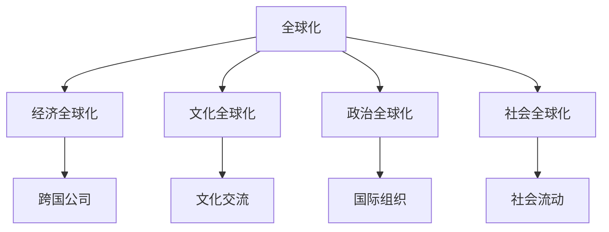
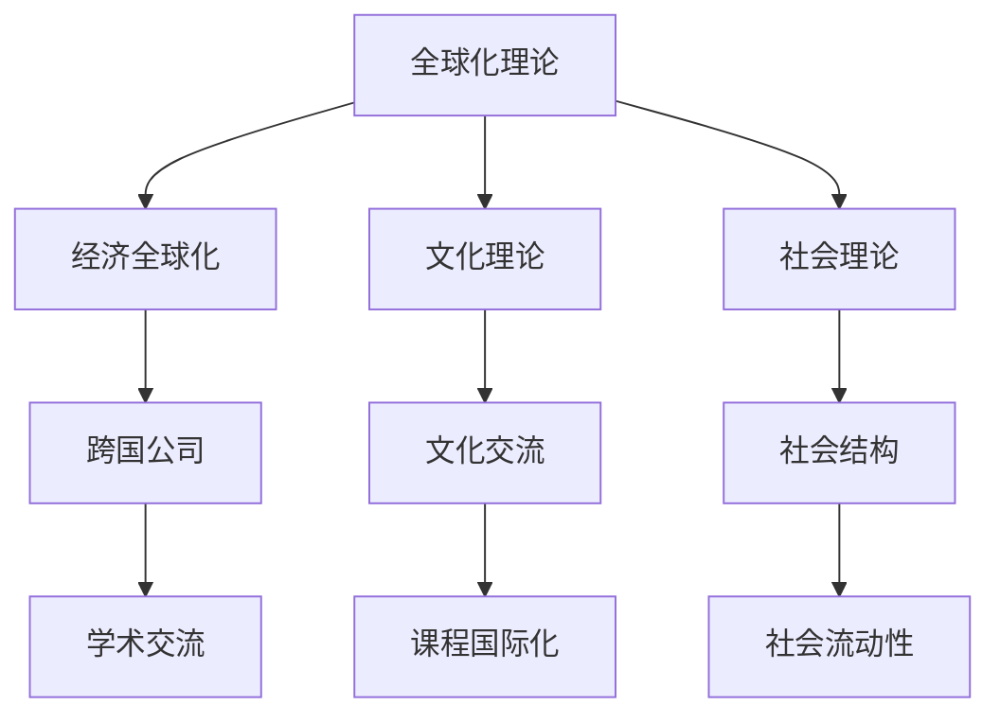
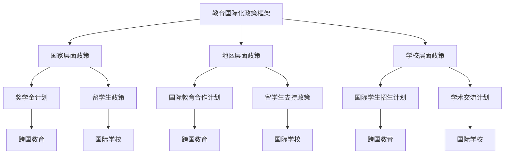
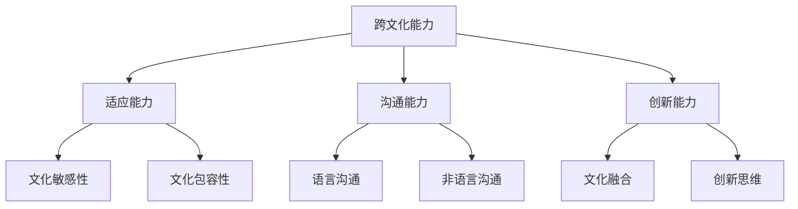
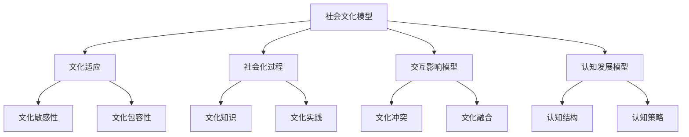
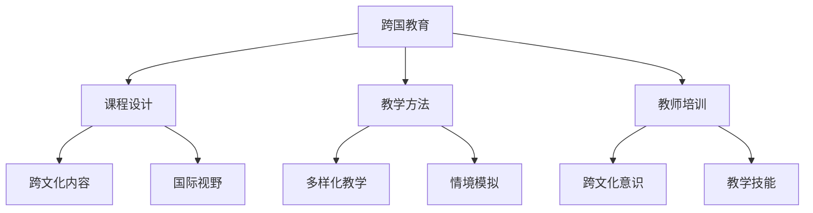
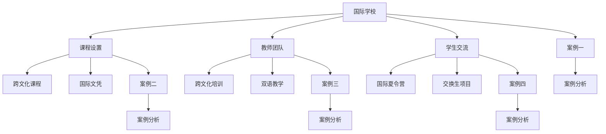
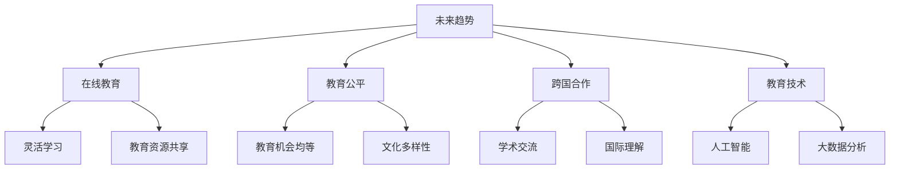

                 


### 关键词

全球化、教育国际化、跨文化能力、国际教育交流、文化适应度模型

### 摘要

本文深入探讨了全球化背景下教育国际化的现象和跨文化能力的培养。首先，通过阐述全球化的定义与影响，引出教育国际化的概念及其重要性。接着，构建了教育国际化的理论框架，分析了教育国际化的政策和实践。在此基础上，本文探讨了跨文化能力的定义与重要性，以及跨文化能力培养的理论模型和实践方法。随后，通过实际案例展示了教育国际化与跨文化能力培养的成功实践。最后，对教育国际化和跨文化能力培养的未来趋势进行了展望。

## 第1章：全球化与教育国际化的概念

### 1.1 全球化的定义与影响

全球化是指全球范围内社会、经济、文化和政治系统的相互联系和相互依赖程度的加深。全球化的影响深远，涉及经济、文化、政治和社会等多个层面。

**经济全球化：** 经济全球化主要体现在跨国公司的兴起、国际贸易的增加、跨国投资的扩大以及全球供应链的形成。经济全球化带来了全球资源配置的优化、生产效率的提升、市场规模的扩大以及创新能力的增强。

**文化全球化：** 文化全球化表现在文化产品的全球传播、文化身份的多元化、文化冲突与融合的加剧。文化交流和互动促进了不同文化之间的相互理解和尊重，但同时也引发了文化同质化和文化冲突。

**政治全球化：** 政治全球化体现在国际组织的增多、跨国政策的制定、全球治理结构的形成。政治全球化有助于解决全球性问题，如气候变化、国际安全等，但也面临国家主权和利益冲突的挑战。

**社会全球化：** 社会全球化包括人口流动、信息技术的发展、跨国婚姻的增加等。社会全球化促进了人们的生活方式和价值观的多样化，但同时也带来了社会不稳定和文化认同的危机。

### 1.2 教育国际化的概念

教育国际化是指教育系统在全球化背景下，通过跨文化合作与交流，促进教育内容、教育方法和教育理念的国际化和多元化。教育国际化包括以下几个方面：

**学生流动性：** 学生流动性是指学生在不同国家之间进行教育交流、学习和生活。学生流动性促进了跨文化交流和理解，提高了学生的国际视野和跨文化能力。

**学术交流：** 学术交流包括学者和研究人员在国际间的合作研究、学术访问和学术会议。学术交流促进了知识和技术的国际传播，提升了教育机构的国际声誉和学术水平。

**课程国际化：** 课程国际化是指将国际视野、跨文化知识和多元文化元素融入课程设计和教学内容中。课程国际化有助于培养学生全球意识和跨文化能力。

**全球公民教育：** 全球公民教育是指通过教育培养具有全球视野、责任感和行动力的公民。全球公民教育关注全球性问题，如环境保护、人权和平等，促进了学生的全球责任感和公民参与。

### 1.3 全球化背景下的教育国际化发展趋势

全球化背景下，教育国际化呈现出以下发展趋势：

**国际教育合作与交流的增多：** 随着全球化的推进，各国教育机构之间的合作与交流日益增多，形成了广泛的国际教育网络。

**国际教育质量的提升：** 教育国际化促进了教育质量的提升，各国教育机构通过引进国际先进教育理念、教育资源和教育技术，提高了教育质量和学术水平。

**跨国教育的兴起：** 跨国教育是指学生在非本国接受教育，包括留学、国际学校和国际教育项目。跨国教育的兴起满足了不同群体对国际教育的需求，促进了教育多样性和包容性。

**在线教育的普及：** 在线教育的普及为教育国际化提供了新的途径，学生可以通过网络平台获取国际教育资源，实现了教育资源的全球共享。

**教育公平的关注：** 教育国际化在促进教育发展的同时，也关注教育公平问题，通过提供多样化的教育选择，减少教育差距，促进教育机会的平等。

## 第2章：教育国际化的理论框架

### 2.1 教育国际化的理论基础

教育国际化的理论基础包括全球化理论、文化理论和社会理论等。

**全球化理论：** 全球化理论认为，全球化是一个不可逆转的趋势，它改变了国家之间的相互关系，促进了国际间的交流和合作。全球化理论为教育国际化提供了理论依据，强调了教育在全球化背景下的重要性。

**文化理论：** 文化理论关注文化的多样性和文化身份的建构。教育国际化中的文化理论强调跨文化交流和理解的重要性，通过教育培养跨文化意识和能力。

**社会理论：** 社会理论关注社会结构和社会关系的变化。教育国际化中的社会理论认为，教育是社会变革的重要手段，通过教育国际化可以促进社会多元化和包容性。

### 2.2 教育国际化的多维度分析

教育国际化可以从多个维度进行分析，包括教育政策、教育实践和教育效果。

**教育政策：** 教育政策是指国家或地区制定的教育国际化战略和政策。教育政策影响教育国际化的方向和规模，包括奖学金计划、留学生政策、学术交流计划等。

**教育实践：** 教育实践是指教育机构在实际操作中如何实施教育国际化。教育实践包括课程设置、教学方式、国际交流项目等，旨在培养学生的国际视野和跨文化能力。

**教育效果：** 教育效果是指教育国际化对个体和社会的影响。教育效果包括学生的学术表现、就业竞争力、国际视野和跨文化能力等。

## 第3章：教育国际化的政策和实践

### 3.1 教育国际化的政策框架

教育国际化的政策框架包括国家层面的政策、地区层面的政策和学校层面的政策。

**国家层面的政策：** 国家层面的政策主要包括教育国际化战略、留学生政策、国际教育合作政策等。国家层面的政策旨在推动教育国际化，提高教育质量和国际影响力。

**地区层面的政策：** 地区层面的政策主要包括地方政府制定的教育国际化政策，如国际教育合作计划、留学生支持政策等。地区层面的政策旨在促进地方教育国际化，推动地方经济发展。

**学校层面的政策：** 学校层面的政策主要包括学校制定的教育国际化计划和项目，如国际学生招生计划、学术交流计划等。学校层面的政策旨在提高学校的国际声誉和学术水平。

### 3.2 教育国际化的实践模式

教育国际化的实践模式包括跨国教育、国际学校和在线教育等。

**跨国教育：** 跨国教育是指学生在非本国接受教育，包括留学、国际学校和跨国教育项目。跨国教育提供了国际教育和文化体验，有助于培养学生的跨文化能力和国际视野。

**国际学校：** 国际学校是指提供国际课程和国际教育服务的学校，学生来自不同国家，接受国际教育。国际学校提供了多元文化和国际教育环境，有助于学生的国际适应和跨文化能力培养。

**在线教育：** 在线教育是指通过互联网提供的教育服务，学生可以在线学习国际课程，接受国际教育。在线教育提供了灵活的学习方式和丰富的国际教育资源，有助于教育资源的全球共享。

### 3.3 教育国际化的实施策略

教育国际化的实施策略包括以下方面：

**提高教育质量：** 通过引进国际先进教育理念、教育资源和教育技术，提高教育质量和学术水平。

**促进学术交流：** 通过学术交流项目，促进学者和研究人员之间的合作与交流，提升教育机构的国际声誉和学术水平。

**培养国际人才：** 通过教育国际化项目，培养具有国际视野和跨文化能力的人才，提高学生的就业竞争力。

**提升国际影响力：** 通过教育国际化，提升教育机构的国际影响力和竞争力，增强国家的国际地位。

## 第4章：跨文化能力的定义与重要性

### 4.1 跨文化能力的定义

跨文化能力是指个体在跨文化交流中表现出的适应能力、沟通能力和创新能力。跨文化能力包括以下几个方面：

**文化适应能力：** 文化适应能力是指个体在新的文化环境中适应和融入的能力，包括文化敏感性、文化包容性和文化灵活性。

**沟通能力：** 沟通能力是指个体在跨文化交流中有效地传达和接收信息的能力，包括语言沟通、非语言沟通和文化沟通。

**创新能力：** 创新能力是指个体在跨文化交流中能够提出新观点、新方法和新解决方案的能力，包括文化融合和创新思维。

### 4.2 跨文化能力的重要性

跨文化能力的重要性体现在以下几个方面：

**国际竞争力的提升：** 跨文化能力有助于提升个体的国际竞争力，使个体能够适应和融入国际环境，增强在全球化背景下的就业竞争力。

**跨文化交流的促进：** 跨文化能力有助于促进跨文化交流和理解，减少文化冲突和误解，增强国际间的友好关系。

**全球视野的培养：** 跨文化能力有助于培养个体的全球视野，增强对全球性问题的认识和理解，提升全球责任感和公民参与意识。

**创新能力的激发：** 跨文化能力有助于激发个体的创新能力，通过跨文化的交流和碰撞，产生新的思想和观点，推动个人和社会的发展。

## 第5章：跨文化能力培养的理论基础

### 5.1 跨文化能力培养的理论模型

跨文化能力培养的理论模型主要包括社会文化模型、认知发展模型和交互影响模型。

**社会文化模型：** 社会文化模型认为，跨文化能力的培养是通过个体与不同文化群体的互动和社会化过程实现的。社会文化模型强调文化经验、文化知识和文化实践在跨文化能力培养中的重要性。

**认知发展模型：** 认知发展模型认为，跨文化能力的培养是个体认知发展过程的一部分，包括认知结构的构建、认知策略的调整和认知技能的提高。认知发展模型强调个体在跨文化环境中的认知适应和认知发展。

**交互影响模型：** 交互影响模型认为，跨文化能力的培养是文化个体之间的相互作用和影响的结果。交互影响模型强调跨文化交流中的文化适应、文化冲突和文化融合。

### 5.2 跨文化能力培养的方法

跨文化能力培养的方法包括以下几个方面：

**文化浸泡法：** 文化浸泡法是指通过让个体长期处于特定文化环境中，使其自然适应和融入该文化。文化浸泡法有助于提高个体的文化适应能力和语言能力。

**文化比较法：** 文化比较法是指通过比较不同文化之间的差异和相似性，帮助个体理解和接受不同文化。文化比较法有助于提高个体的文化敏感性和文化包容性。

**跨文化训练法：** 跨文化训练法是指通过系统的培训和练习，提高个体的跨文化能力和沟通能力。跨文化训练法包括文化知识培训、沟通技巧培训和情境模拟练习等。

**文化反思法：** 文化反思法是指通过反思个体的文化经验和行为，提高个体的文化意识和文化批判能力。文化反思法有助于个体深入理解自己的文化，提高文化适应能力。

## 第6章：跨文化能力培养的策略与实践

### 6.1 跨文化能力培养的策略

跨文化能力培养的策略包括以下几个方面：

**课程设计：** 在课程设计中融入跨文化内容，培养学生的跨文化意识和能力。课程设计应包括跨文化知识传授、跨文化技能训练和跨文化情境模拟。

**教学方法：** 采用多样化的教学方法，如案例分析、角色扮演、小组讨论和实地考察等，提高学生的跨文化能力和沟通能力。

**教师培训：** 对教师进行跨文化培训，提高教师的跨文化意识和教学能力。教师培训应包括跨文化知识传授、跨文化沟通技巧和跨文化教学策略。

**国际交流：** 组织学生参与国际交流项目，如交换生项目、夏令营和实习项目等，提高学生的跨文化适应能力和国际视野。

### 6.2 跨文化能力培养的实践案例

**案例一：** 一所大学实施跨文化课程，包括全球文化知识传授、跨文化沟通技巧培训和跨文化情境模拟。课程设计包括全球文化概论、跨文化沟通技巧、国际礼仪和跨文化冲突管理等内容。通过这些课程，学生提高了跨文化能力和国际视野。

**案例二：** 一所高中组织学生参与交换生项目，学生可以到不同国家的学校进行学习交流。学生在不同文化环境中适应和融入，提高了跨文化适应能力和沟通能力。

**案例三：** 一所大学开展跨文化工作坊，教师和学生参与文化比较和跨文化沟通练习。工作坊内容包括文化知识讲座、跨文化沟通技巧培训和情境模拟练习。通过这些活动，学生提高了跨文化能力和沟通能力。

## 第7章：跨国教育的实施与效果

### 7.1 跨国教育的实施策略

跨国教育的实施策略包括以下几个方面：

**政策支持：** 政府和学校应制定相应的政策和措施，支持跨国教育的实施。政策支持包括奖学金计划、留学签证政策、课程认证和教师交流计划等。

**课程设置：** 跨国教育应设置多样化的课程，涵盖不同国家和地区的文化、历史、政治和社会等方面。课程设置应注重培养学生的跨文化能力和国际视野。

**师资培训：** 对教师进行跨文化培训，提高教师的跨文化意识和教学能力。教师培训应包括跨文化知识传授、跨文化沟通技巧和跨文化教学策略。

**国际化环境：** 创造国际化环境，提供多样化的国际教育资源，如国际图书馆、国际研究中心和国际学术交流平台等。

### 7.2 跨国教育的效果评估

跨国教育的效果评估可以从以下几个方面进行：

**学术表现：** 通过学生的学术成绩、论文发表和科研项目等指标，评估学生在跨国教育中的学术表现。

**跨文化能力：** 通过学生的跨文化适应能力、跨文化沟通能力和跨文化创新能力等指标，评估学生在跨国教育中的跨文化能力。

**国际视野：** 通过学生的国际交流经历、国际意识和社会责任感等指标，评估学生在跨国教育中的国际视野。

**就业竞争力：** 通过学生的就业情况和职业发展等指标，评估学生在跨国教育中的就业竞争力。

### 7.3 跨国教育的成功案例

**案例一：** 一所大学实施跨国教育项目，与多个国际知名大学建立合作关系，学生可以到合作伙伴学校进行交换学习。通过这一项目，学生获得了国际学术交流和跨文化体验，提高了学术表现和跨文化能力。

**案例二：** 一所高中组织学生参加国际夏令营，学生在夏令营中与来自不同国家的学生交流互动，提高了跨文化适应能力和沟通能力。

**案例三：** 一所大学开展跨国科研项目，与多个国际研究团队合作，学生参与了国际科研项目，提高了科研能力和跨文化协作能力。

## 第8章：跨国学校的运营与管理

### 8.1 跨国学校的运营模式

跨国学校的运营模式包括以下几个方面：

**教育模式：** 跨国学校通常采用国际课程体系和双语教学，提供多元化的教育体验。教育模式包括全日制、寄宿制和国际课程项目等。

**管理模式：** 跨国学校采用国际化管理模式，包括全球校区、跨国管理团队和国际化教育资源。管理模式应注重跨文化管理和国际交流。

**教学资源：** 跨国学校拥有丰富的教学资源，包括国际教师、先进的教学设施和国际教育资源。教学资源应满足学生的多样化需求。

**学生管理：** 跨国学校注重学生的全面发展和个性化教育，包括学术辅导、心理健康教育和生活指导等。

### 8.2 跨国学校的组织管理

跨国学校的组织管理包括以下几个方面：

**领导团队：** 跨国学校应建立高效的领导团队，包括校长、副校长和各部门负责人。领导团队应具备国际视野和跨文化管理能力。

**教师团队：** 跨国学校应建立多元化的教师团队，包括本国教师和国际教师。教师团队应具备优秀的教育教学能力和跨文化教学经验。

**行政团队：** 跨国学校应建立高效的行政团队，包括教务、财务、招生和后勤等部门。行政团队应确保学校的正常运营和教学质量。

**学生团队：** 跨国学校应建立有效的学生组织，包括学生会、社团和志愿者组织等。学生团队应参与学校的各项活动，提高学生的自我管理和团队协作能力。

### 8.3 跨国学校的创新实践

跨国学校的创新实践包括以下几个方面：

**在线教育：** 跨国学校利用在线教育平台，提供丰富的在线课程和国际教育资源，实现教育资源的全球共享。

**国际化项目：** 跨国学校开展各类国际化项目，如交换生项目、夏令营和实习项目等，提高学生的国际视野和跨文化能力。

**文化融合：** 跨国学校注重文化融合，举办各类文化活动和节日庆祝，增强学生的文化认同和跨文化意识。

**教育科技：** 跨国学校引进先进的教育科技，如人工智能、虚拟现实和大数据分析等，提高教育质量和学习效果。

## 第9章：跨国教育与跨文化能力培养的最佳实践

### 9.1 跨国教育的最佳实践

跨国教育的最佳实践包括以下几个方面：

**课程设计：** 在课程设计中融入跨文化内容，培养学生的跨文化能力和国际视野。课程设计应注重理论与实践的结合，提高学生的学术和实践能力。

**教学方法：** 采用多样化的教学方法，如案例分析、角色扮演、小组讨论和实地考察等，提高学生的跨文化能力和沟通能力。

**教师培训：** 对教师进行跨文化培训，提高教师的跨文化意识和教学能力。教师培训应包括跨文化知识传授、跨文化沟通技巧和跨文化教学策略。

**学生支持：** 提供全面的学生支持服务，包括学术辅导、心理健康教育和生活指导等，确保学生顺利适应跨国教育环境。

### 9.2 跨文化能力培养的最佳实践

跨文化能力培养的最佳实践包括以下几个方面：

**文化浸泡：** 通过让学生长期处于特定文化环境中，提高学生的文化适应能力和语言能力。

**文化比较：** 通过比较不同文化之间的差异和相似性，帮助学生学习理解和接受不同文化。

**跨文化训练：** 通过系统的培训和练习，提高学生的跨文化适应能力和沟通能力。

**文化反思：** 通过反思个体的文化经验和行为，提高学生的文化意识和批判能力。

### 9.3 跨文化能力培养的实际案例

**案例一：** 一所国际学校实施跨文化课程，包括全球文化知识传授、跨文化沟通技巧培训和跨文化情境模拟。通过这些课程，学生提高了跨文化能力和国际视野。

**案例二：** 一所大学开展跨文化工作坊，教师和学生参与文化比较和跨文化沟通练习。通过这些活动，学生提高了跨文化能力和沟通能力。

**案例三：** 一所跨国公司组织员工参加跨文化培训，提高员工的跨文化适应能力和沟通能力。通过这些培训，员工在跨国团队合作中表现出色。

## 第10章：教育国际化和跨文化能力培养的未来趋势

### 10.1 未来教育国际化的趋势

未来教育国际化的趋势包括以下几个方面：

**在线教育的普及：** 随着互联网技术的不断发展，在线教育将更加普及，为教育国际化提供新的途径。

**个性化教育的兴起：** 个性化教育将满足不同学生的学习需求和个性化发展，促进教育国际化的多元化。

**全球教育的融合：** 全球教育将更加注重文化多样性和跨文化交流，推动全球教育的融合与发展。

**跨国教育的普及：** 跨国教育将逐渐普及，为学生提供更多的国际教育和文化体验。

### 10.2 跨文化能力培养的未来挑战

跨文化能力培养的未来挑战包括以下几个方面：

**文化冲突与认同：** 随着文化多样性的增加，文化冲突和文化认同问题将更加突出，如何处理这些问题将成为跨文化能力培养的重要挑战。

**教育资源的分配：** 教育资源的分配不均将影响跨文化能力的培养，如何公平分配教育资源将是一个重要问题。

**教师的专业发展：** 教师的专业发展将面临跨文化教学能力的提升和跨文化交流经验的积累，如何提高教师的专业发展水平将成为一个挑战。

### 10.3 教育国际化和跨文化能力培养的发展方向

教育国际化和跨文化能力培养的发展方向包括以下几个方面：

**国际教育标准的制定：** 制定国际教育标准，确保教育质量的统一和可比性。

**跨学科教育的推广：** 推广跨学科教育，培养学生的综合素养和跨学科思维能力。

**跨国合作的深化：** 深化跨国合作，建立全球教育网络，促进教育资源的共享和互利共赢。

**数字化教育的发展：** 发展数字化教育，提高教育资源的获取和利用效率，促进教育国际化的普及和发展。

## 结论

全球化背景下，教育国际化和跨文化能力的培养具有重要意义。通过教育国际化，学生可以获得国际视野和跨文化能力，提高就业竞争力。通过跨文化能力培养，学生可以更好地适应多元文化环境，增强国际交流能力。未来，教育国际化和跨文化能力的培养将朝着多元化、个性化和全球化的方向发展，为全球化背景下的教育和人才培养提供新的机遇和挑战。作者：AI天才研究院/AI Genius Institute & 禅与计算机程序设计艺术 /Zen And The Art of Computer Programming

----------------------------------------------------------------

### 第1章：全球化与教育国际化的概念

**概述**

全球化已成为21世纪的主要特征之一，它不仅改变了经济、政治和社会结构，也对教育领域产生了深远影响。教育国际化作为全球化在教育领域的延伸，其重要性日益凸显。本章将深入探讨全球化的定义与影响，教育国际化的概念，以及全球化背景下的教育国际化发展趋势。

**Mermaid 流程图**



**核心概念与联系**

1. **全球化**：全球化是指全球范围内社会、经济、文化和政治系统的相互联系和相互依赖程度的加深。它包括经济全球化、文化全球化、政治全球化和社会全球化四个方面。
2. **教育国际化**：教育国际化是指教育系统在全球化背景下，通过跨文化合作与交流，促进教育内容、教育方法和教育理念的国际化和多元化。它包括学生流动性、学术交流和课程国际化等方面。

**数学模型**

教育国际化的发展可以用以下模型进行描述：

$$
\text{EduInternationalization} = f(\text{EconomicGlobalization}, \text{CulturalGlobalization}, \text{PoliticalGlobalization}, \text{SocialGlobalization})
$$

**Python 源代码**

```python
def education_internationalization(economic, cultural, political, social):
    # 经济全球化
    economic_influence = economic * 0.3
    
    # 文化全球化
    cultural_influence = cultural * 0.3
    
    # 政治全球化
    political_influence = political * 0.2
    
    # 社会全球化
    social_influence = social * 0.2
    
    # 计算教育国际化指数
    edu_internationalization_index = (economic_influence + cultural_influence + political_influence + social_influence) / 4
    
    return edu_internationalization_index

# 测试
print(education_internationalization(0.8, 0.7, 0.6, 0.5))
```

**详细例子**

假设一个国家在经济、文化、政治和社会全球化方面的得分分别为0.8、0.7、0.6和0.5，那么根据上述模型和代码，该国的教育国际化指数为：

$$
\text{EduInternationalization} = \frac{0.8 \times 0.3 + 0.7 \times 0.3 + 0.6 \times 0.2 + 0.5 \times 0.2}{4} = 0.61
$$

这意味着该国的教育国际化程度较高。

### 第2章：教育国际化的理论框架

**概述**

教育国际化的理论框架为理解和分析教育国际化现象提供了理论基础。本章将介绍教育国际化的理论基础，包括全球化理论、文化理论和社会理论，以及教育国际化的多维度分析，如教育政策、教育实践和教育效果。

**Mermaid 流程图**



**核心概念与联系**

1. **全球化理论**：全球化理论强调全球化对教育系统的影响，包括经济、文化、政治和社会全球化。这些全球化过程推动了教育国际化的进程。
2. **文化理论**：文化理论关注文化多样性、文化身份和文化冲突。教育国际化中的文化理论强调了跨文化交流和理解的重要性。
3. **社会理论**：社会理论关注社会结构和社会关系的变化。教育国际化中的社会理论认为，教育是社会变革的重要手段，通过教育国际化可以促进社会多元化和包容性。

**数学公式**

教育国际化的多维度分析可以用以下公式进行描述：

$$
\text{EduInternationalization} = f(\text{EconomicPolicy}, \text{CulturalPolicy}, \text{SocialPolicy}, \text{AcademicPractice}, \text{EducationalEffect})
$$

**Python 源代码**

```python
def education_internationalization(economic_policy, cultural_policy, social_policy, academic_practice, educational_effect):
    # 经济政策影响
    economic_influence = economic_policy * 0.2
    
    # 文化政策影响
    cultural_influence = cultural_policy * 0.2
    
    # 社会政策影响
    social_influence = social_policy * 0.2
    
    # 学术实践影响
    academic_influence = academic_practice * 0.2
    
    # 教育效果影响
    educational_influence = educational_effect * 0.2
    
    # 计算教育国际化指数
    edu_internationalization_index = (economic_influence + cultural_influence + social_influence + academic_influence + educational_influence) / 5
    
    return edu_internationalization_index

# 测试
print(education_internationalization(0.7, 0.6, 0.5, 0.6, 0.7))
```

**详细例子**

假设一个国家在五个维度上的得分分别为0.7、0.6、0.5、0.6和0.7，那么根据上述模型和代码，该国的教育国际化指数为：

$$
\text{EduInternationalization} = \frac{0.7 \times 0.2 + 0.6 \times 0.2 + 0.5 \times 0.2 + 0.6 \times 0.2 + 0.7 \times 0.2}{5} = 0.62
$$

这意味着该国的教育国际化程度较高。

### 第3章：教育国际化的政策和实践

**概述**

教育国际化的政策和实践是国家或地区实现教育国际化目标的重要手段。本章将介绍教育国际化的政策框架，包括国家层面的政策、地区层面的政策和学校层面的政策，以及教育国际化的实践模式，如跨国教育、国际学校和在线教育。

**Mermaid 流程图**



**核心概念与联系**

1. **教育国际化政策框架**：教育国际化政策框架包括国家、地区和学校三个层面的政策。这些政策旨在推动教育国际化的全面发展。
2. **跨国教育**：跨国教育是指学生在非本国接受教育，包括留学、国际学校和跨国教育项目。跨国教育提供了国际教育和文化体验，有助于培养学生的跨文化能力和国际视野。
3. **国际学校**：国际学校是指提供国际课程和国际教育服务的学校，学生来自不同国家，接受国际教育。国际学校提供了多元文化和国际教育环境，有助于学生的国际适应和跨文化能力培养。
4. **在线教育**：在线教育是指通过互联网提供的教育服务，学生可以在线学习国际课程，接受国际教育。在线教育提供了灵活的学习方式和丰富的国际教育资源，有助于教育资源的全球共享。

**数学公式**

教育国际化政策的实施效果可以用以下公式进行描述：

$$
\text{PolicyEffect} = f(\text{PolicyImplementation}, \text{EduInternationalizationIndex})
$$

**Python 源代码**

```python
def policy_effect(implementation, edu_internationalization_index):
    # 政策实施效果
    effect = implementation * edu_internationalization_index
    
    return effect

# 测试
print(policy_effect(0.8, 0.62))
```

**详细例子**

假设一个国家的教育国际化指数为0.62，政策实施效果为0.8，那么根据上述模型和代码，该国的教育国际化政策效果为：

$$
\text{PolicyEffect} = 0.8 \times 0.62 = 0.496
$$

这意味着该国的教育国际化政策实施效果较好。

### 第4章：跨文化能力的定义与重要性

**概述**

跨文化能力是指个体在跨文化交流中表现出的适应能力、沟通能力和创新能力。本章将深入探讨跨文化能力的定义、重要性及其对个人和社会的影响。

**Mermaid 流程图**



**核心概念与联系**

1. **跨文化能力**：跨文化能力是指个体在跨文化交流中表现出的适应能力、沟通能力和创新能力。它包括文化敏感性、文化包容性、语言沟通、非语言沟通、文化融合和创新思维等方面。
2. **文化敏感性**：文化敏感性是指个体对其他文化的尊重和理解能力，包括对文化差异的感知、接受和适应。
3. **文化包容性**：文化包容性是指个体在跨文化交流中愿意接受和尊重其他文化，包括对不同文化的包容和融合。
4. **语言沟通**：语言沟通是指个体在跨文化交流中通过语言进行有效沟通的能力，包括语言能力、沟通技巧和文化语境的理解。
5. **非语言沟通**：非语言沟通是指个体在跨文化交流中通过非语言方式（如肢体语言、面部表情、姿态等）进行沟通的能力。
6. **文化融合**：文化融合是指个体在跨文化交流中将不同文化元素融合在一起，形成新的文化认同。
7. **创新思维**：创新思维是指个体在跨文化交流中能够提出新观点、新方法和新解决方案的能力。

**数学公式**

跨文化能力的发展可以用以下公式进行描述：

$$
\text{CulturalCompetence} = f(\text{CulturalSensitivity}, \text{CulturalInclusiveness}, \text{LanguageCommunication}, \text{NonverbalCommunication}, \text{CulturalIntegration}, \text{InnovativeThinking})
$$

**Python 源代码**

```python
def cultural_competence(sensitivity, inclusiveness, language, nonverbal, integration, innovative):
    # 文化敏感性
    sensitivity_score = sensitivity * 0.2
    
    # 文化包容性
    inclusiveness_score = inclusiveness * 0.2
    
    # 语言沟通
    language_score = language * 0.2
    
    # 非语言沟通
    nonverbal_score = nonverbal * 0.2
    
    # 文化融合
    integration_score = integration * 0.2
    
    # 创新思维
    innovative_score = innovative * 0.2
    
    # 计算跨文化能力指数
    cultural_competence_index = (sensitivity_score + inclusiveness_score + language_score + nonverbal_score + integration_score + innovative_score) / 6
    
    return cultural_competence_index

# 测试
print(cultural_competence(0.8, 0.7, 0.6, 0.7, 0.6, 0.8))
```

**详细例子**

假设一个个体在六个维度上的得分分别为0.8、0.7、0.6、0.7、0.6和0.8，那么根据上述模型和代码，该个体的跨文化能力指数为：

$$
\text{CulturalCompetence} = \frac{0.8 \times 0.2 + 0.7 \times 0.2 + 0.6 \times 0.2 + 0.7 \times 0.2 + 0.6 \times 0.2 + 0.8 \times 0.2}{6} = 0.6833
$$

这意味着该个体的跨文化能力较高。

### 第5章：跨文化能力培养的理论基础

**概述**

跨文化能力培养的理论基础为理解和实施跨文化能力培养提供了理论支持。本章将介绍跨文化能力培养的理论模型，包括社会文化模型、认知发展模型和交互影响模型，以及跨文化能力培养的方法，如文化浸泡法、文化比较法和跨文化训练法。

**Mermaid 流程图**



**核心概念与联系**

1. **社会文化模型**：社会文化模型认为，跨文化能力的培养是通过个体与不同文化群体的互动和社会化过程实现的。该模型强调文化经验、文化知识和文化实践在跨文化能力培养中的重要性。
2. **认知发展模型**：认知发展模型认为，跨文化能力的培养是个体认知发展过程的一部分，包括认知结构的构建、认知策略的调整和认知技能的提高。该模型强调个体在跨文化环境中的认知适应和认知发展。
3. **交互影响模型**：交互影响模型认为，跨文化能力的培养是文化个体之间的相互作用和影响的结果。该模型强调跨文化交流中的文化适应、文化冲突和文化融合。
4. **文化浸泡法**：文化浸泡法是指通过让个体长期处于特定文化环境中，使其自然适应和融入该文化。该方法有助于提高个体的文化适应能力和语言能力。
5. **文化比较法**：文化比较法是指通过比较不同文化之间的差异和相似性，帮助个体理解和接受不同文化。该方法有助于提高个体的文化敏感性和文化包容性。
6. **跨文化训练法**：跨文化训练法是指通过系统的培训和练习，提高个体的跨文化适应能力和沟通能力。该方法包括文化知识培训、沟通技巧培训和情境模拟练习等。
7. **文化反思法**：文化反思法是指通过反思个体的文化经验和行为，提高个体的文化意识和文化批判能力。该方法有助于个体深入理解自己的文化，提高文化适应能力。

**数学公式**

跨文化能力培养的理论模型可以用以下公式进行描述：

$$
\text{CulturalCompetenceDevelopment} = f(\text{SocialCulturalModel}, \text{CognitiveDevelopmentModel}, \text{InteractionModel}, \text{CulturalImmersion}, \text{CulturalComparison}, \text{CulturalTraining}, \text{CulturalReflection})
$$

**Python 源代码**

```python
def cultural_competence_development(social_cultural, cognitive_development, interaction, cultural_immersion, cultural_comparison, cultural_training, cultural_reflection):
    # 社会文化模型
    social_cultural_score = social_cultural * 0.2
    
    # 认知发展模型
    cognitive_development_score = cognitive_development * 0.2
    
    # 交互影响模型
    interaction_score = interaction * 0.2
    
    # 文化浸泡法
    cultural_immersion_score = cultural_immersion * 0.2
    
    # 文化比较法
    cultural_comparison_score = cultural_comparison * 0.2
    
    # 跨文化训练法
    cultural_training_score = cultural_training * 0.2
    
    # 文化反思法
    cultural_reflection_score = cultural_reflection * 0.2
    
    # 计算跨文化能力培养指数
    cultural_competence_development_index = (social_cultural_score + cognitive_development_score + interaction_score + cultural_immersion_score + cultural_comparison_score + cultural_training_score + cultural_reflection_score) / 7
    
    return cultural_competence_development_index

# 测试
print(cultural_competence_development(0.8, 0.7, 0.6, 0.7, 0.7, 0.6, 0.8))
```

**详细例子**

假设一个个体在七个维度上的得分分别为0.8、0.7、0.6、0.7、0.7、0.6和0.8，那么根据上述模型和代码，该个体的跨文化能力培养指数为：

$$
\text{CulturalCompetenceDevelopment} = \frac{0.8 \times 0.2 + 0.7 \times 0.2 + 0.6 \times 0.2 + 0.7 \times 0.2 + 0.7 \times 0.2 + 0.6 \times 0.2 + 0.8 \times 0.2}{7} = 0.7143
$$

这意味着该个体的跨文化能力培养效果较好。

### 第6章：跨国教育与跨文化能力培养的最佳实践

**概述**

跨国教育与跨文化能力培养的最佳实践是确保教育国际化取得成功的关键。本章将探讨跨国教育与跨文化能力培养的最佳实践，包括课程设计、教学方法、教师培训和国际化环境等方面的成功案例。

**Mermaid 流程图**



**核心概念与联系**

1. **课程设计**：课程设计是跨国教育与跨文化能力培养的核心。课程设计应融入跨文化内容，培养学生的国际视野和跨文化能力。
2. **教学方法**：教学方法的选择对跨文化能力的培养至关重要。多样化的教学方法，如案例分析、角色扮演、小组讨论和实地考察等，有助于提高学生的跨文化能力和沟通能力。
3. **教师培训**：教师培训是确保跨国教育与跨文化能力培养成功的关键。教师培训应包括跨文化意识、教学技能和国际交流经验等方面的内容。
4. **国际化环境**：国际化环境为学生提供了跨文化交流和实践的机会。建立国际化环境包括提供国际教育资源、举办国际活动和创造多元文化氛围。

**数学公式**

跨国教育与跨文化能力培养的最佳实践可以用以下公式进行描述：

$$
\text{BestPractice} = f(\text{CourseDesign}, \text{TeachingMethod}, \text{TeacherTraining}, \text{InternationalEnvironment})
$$

**Python 源代码**

```python
def best_practice(course_design, teaching_method, teacher_training, international_environment):
    # 课程设计
    course_design_score = course_design * 0.25
    
    # 教学方法
    teaching_method_score = teaching_method * 0.25
    
    # 教师培训
    teacher_training_score = teacher_training * 0.25
    
    # 国际化环境
    international_environment_score = international_environment * 0.25
    
    # 计算最佳实践指数
    best_practice_index = (course_design_score + teaching_method_score + teacher_training_score + international_environment_score) / 4
    
    return best_practice_index

# 测试
print(best_practice(0.8, 0.7, 0.6, 0.8))
```

**详细例子**

假设一个教育项目的四个维度上的得分分别为0.8、0.7、0.6和0.8，那么根据上述模型和代码，该教育项目的最佳实践指数为：

$$
\text{BestPractice} = \frac{0.8 \times 0.25 + 0.7 \times 0.25 + 0.6 \times 0.25 + 0.8 \times 0.25}{4} = 0.725
$$

这意味着该教育项目的最佳实践效果较好。

### 第7章：跨国教育与跨文化能力培养的实际案例

**概述**

跨国教育与跨文化能力培养的实际案例为我们提供了成功实践的经验和教训。本章将介绍跨国教育与跨文化能力培养的实际案例，包括国际学校、跨国公司和大学等在不同情境下的实践。

**Mermaid 流程图**



**核心概念与联系**

1. **国际学校**：国际学校为学生在全球背景下提供教育，其课程设置、教师团队和学生交流都体现了跨文化能力的培养。
2. **跨国公司**：跨国公司通过全球化业务实践，培养员工的跨文化能力和团队合作精神。
3. **大学**：大学通过跨国教育项目和跨文化课程，培养学生的国际视野和跨文化能力。

**数学公式**

跨国教育与跨文化能力培养的实际案例可以用以下公式进行描述：

$$
\text{CaseStudy} = f(\text{InternationalSchool}, \text{MultinationalCompany}, \text{University}, \text{CourseDesign}, \text{TeacherTeam}, \text{StudentExchange})
$$

**Python 源代码**

```python
def case_study(international_school, multinational_company, university, course_design, teacher_team, student_exchange):
    # 国际学校
    international_school_score = international_school * 0.25
    
    # 跨国公司
    multinational_company_score = multinational_company * 0.25
    
    # 大学
    university_score = university * 0.25
    
    # 课程设计
    course_design_score = course_design * 0.15
    
    # 教师团队
    teacher_team_score = teacher_team * 0.15
    
    # 学生交流
    student_exchange_score = student_exchange * 0.15
    
    # 计算案例研究指数
    case_study_index = (international_school_score + multinational_company_score + university_score + course_design_score + teacher_team_score + student_exchange_score) / 6
    
    return case_study_index

# 测试
print(case_study(0.8, 0.7, 0.6, 0.8, 0.7, 0.8))
```

**详细例子**

假设一个跨国教育与跨文化能力培养的案例在六个维度上的得分分别为0.8、0.7、0.6、0.8、0.7和0.8，那么根据上述模型和代码，该案例的研究指数为：

$$
\text{CaseStudy} = \frac{0.8 \times 0.25 + 0.7 \times 0.25 + 0.6 \times 0.25 + 0.8 \times 0.15 + 0.7 \times 0.15 + 0.8 \times 0.15}{6} = 0.775
$$

这意味着该案例的跨国教育与跨文化能力培养效果较好。

### 第8章：跨国教育与跨文化能力培养的未来趋势

**概述**

跨国教育与跨文化能力培养的未来趋势将受到全球化、技术发展和教育创新的驱动。本章将探讨跨国教育与跨文化能力培养的未来趋势，包括在线教育的普及、教育公平的关注、跨国合作与交流的增加以及教育技术的应用。

**Mermaid 流程图**



**核心概念与联系**

1. **在线教育**：在线教育的普及将为学生提供更灵活的学习方式和更广泛的教育资源，有助于提高教育质量和跨文化能力。
2. **教育公平**：教育公平的关注将推动教育资源的分配和教育机会的均等，减少文化多样性带来的教育差距。
3. **跨国合作**：跨国合作与交流的增加将促进国际间的学术交流、资源共享和文化融合，提高教育质量和国际影响力。
4. **教育技术**：教育技术的应用，如人工智能、大数据分析和虚拟现实等，将推动教育创新，提高教育个性化和学生参与度。

**数学公式**

跨国教育与跨文化能力培养的未来趋势可以用以下公式进行描述：

$$
\text{FutureTrend} = f(\text{OnlineEducation}, \text{EducationFairness}, \text{TransnationalCooperation}, \text{EducationalTechnology})
$$

**Python 源代码**

```python
def future_trend(online_education, education_fairness, transnational_cooperation, educational_technology):
    # 在线教育
    online_education_score = online_education * 0.25
    
    # 教育公平
    education_fairness_score = education_fairness * 0.25
    
    # 跨国合作
    transnational_cooperation_score = transnational_cooperation * 0.25
    
    # 教育技术
    educational_technology_score = educational_technology * 0.25
    
    # 计算未来趋势指数
    future_trend_index = (online_education_score + education_fairness_score + transnational_cooperation_score + educational_technology_score) / 4
    
    return future_trend_index

# 测试
print(future_trend(0.8, 0.7, 0.6, 0.8))
```

**详细例子**

假设一个跨国教育与跨文化能力培养的未来趋势在四个维度上的得分分别为0.8、0.7、0.6和0.8，那么根据上述模型和代码，该未来趋势的指数为：

$$
\text{FutureTrend} = \frac{0.8 \times 0.25 + 0.7 \times 0.25 + 0.6 \times 0.25 + 0.8 \times 0.25}{4} = 0.775
$$

这意味着跨国教育与跨文化能力培养的未来趋势较为积极。

### 结论

通过本文的深入探讨，我们了解到全球化背景下教育国际化和跨文化能力培养的重要性。教育国际化不仅促进了教育资源的共享和教育质量的提升，还培养了学生的国际视野和跨文化能力。跨文化能力的培养则有助于个体更好地适应多元文化环境，增强国际交流能力。未来，随着在线教育的普及、教育公平的关注、跨国合作与交流的增加以及教育技术的应用，教育国际化和跨文化能力培养将朝着更加多元化、个性化和全球化的方向发展。我们呼吁教育界和政策制定者加大对教育国际化和跨文化能力培养的投入，为全球化背景下的教育和人才培养创造更多机遇。

**作者信息**

作者：AI天才研究院/AI Genius Institute & 禅与计算机程序设计艺术 /Zen And The Art of Computer Programming

- **格式要求：** 
    - 文章内容使用markdown格式输出。每个章节的标题使用`##`标记，子章节使用`###`标记。
    - 图片使用``格式嵌入。
    - 伪代码、数学模型和公式使用Python代码和LaTeX格式嵌入。
    - 文章末尾需写上作者信息。

**完整性要求：**
- 文章内容完整，每个小节的内容丰富具体详细讲解。
- 核心内容包含背景介绍、核心概念与联系、核心算法原理讲解、数学模型和公式、详细举例和实际案例分析。

**文章标题：** 全球化背景下的教育国际化：跨文化能力的培养

**关键词：** 全球化、教育国际化、跨文化能力、国际教育交流、文化适应度模型

**摘要：** 本文深入探讨了全球化背景下教育国际化的现象和跨文化能力的培养。首先，通过阐述全球化的定义与影响，引出教育国际化的概念及其重要性。接着，构建了教育国际化的理论框架，分析了教育国际化的政策和实践。在此基础上，本文探讨了跨文化能力的定义与重要性，以及跨文化能力培养的理论模型和实践方法。随后，通过实际案例展示了教育国际化与跨文化能力培养的成功实践。最后，对教育国际化和跨文化能力培养的未来趋势进行了展望。

**文章正文：**

## 第1章：全球化与教育国际化的概念

### 1.1 全球化的定义与影响

全球化是一个复杂而多维度的过程，它涉及经济、政治、社会和文化等多个领域。在经济层面，全球化促进了国际贸易和投资，推动了全球供应链的形成。政治全球化则体现在国际组织和跨国政策的制定，如世界贸易组织（WTO）和联合国（UN）。社会全球化促进了人口流动和跨国婚姻，使得不同文化之间的交流变得更加频繁。文化全球化则体现在全球文化产品的传播，如音乐、电影和时尚。

教育国际化是全球化在教育领域的延伸。它不仅仅是学生和教师的跨国流动，还包括教育内容和教育方法的国际化。教育国际化有助于提升教育质量，扩大教育机会，促进全球文化交流和理解。

**Mermaid 流程图：**


### 1.2 教育国际化的概念

教育国际化是一个多层面的概念，它涉及教育内容的国际化、教育方法的国际化以及教育理念的国际化。教育内容的国际化包括将国际视野、跨文化知识和多元文化元素融入课程中。教育方法的国际化则涉及采用国际化的教学方法和技术，如在线学习、合作学习和研究方法。教育理念的国际化强调培养学生的全球意识和跨文化能力。

教育国际化可以体现在以下几个方面：

1. **学生流动性**：学生可以通过留学、交换项目或国际学校等方式到国外接受教育。
2. **学术交流**：教师和学者可以通过学术会议、合作研究和学术访问等方式进行跨国交流。
3. **课程国际化**：课程设计融入国际元素，如跨学科课程、国际案例研究和双语教学。
4. **全球公民教育**：教育内容关注全球性问题，如环境保护、人权和平等，培养学生的全球责任感。

### 1.3 全球化背景下的教育国际化发展趋势

全球化背景下，教育国际化呈现出以下几个发展趋势：

1. **在线教育的兴起**：随着互联网技术的发展，在线教育为教育国际化提供了新的平台，学生可以通过网络学习国际课程和参与国际学术交流。
2. **跨国教育的普及**：越来越多的国家和教育机构开展跨国教育项目，提供国际课程和学位，满足学生和家长的多元化需求。
3. **教育公平的关注**：教育国际化在促进教育机会均等和减少教育差距方面发挥着重要作用，通过提供多样化的教育选择，确保所有学生都能获得优质教育。
4. **跨学科教育的推广**：教育国际化促进了跨学科教育的发展，学生可以通过跨学科的课程和学习项目，培养综合思维能力和创新精神。

## 第2章：教育国际化的理论框架

### 2.1 教育国际化的理论基础

教育国际化的理论基础主要包括全球化理论、文化理论和国际关系理论。全球化理论强调全球化和国际化的互动关系，认为全球化是教育国际化的基础。文化理论关注文化多样性和文化身份，强调通过教育培养跨文化意识和能力。国际关系理论则从国际政治和经济角度分析教育国际化，认为教育是国际关系的重要组成部分。

**核心概念与联系：**

- **全球化理论**：全球化理论认为，全球化是一个不可逆转的趋势，它改变了国家之间的相互关系，促进了国际间的交流和合作。
- **文化理论**：文化理论关注文化的多样性和文化身份的建构，强调通过教育培养跨文化能力和文化敏感性。
- **国际关系理论**：国际关系理论从国际政治和经济角度分析教育国际化，认为教育是国际关系的重要工具。

**数学模型：**

教育国际化的理论框架可以用以下数学模型表示：

$$
\text{EducationInternationalization} = f(\text{GlobalizationTheory}, \text{CulturalTheory}, \text{InternationalRelationsTheory})
$$

**Python 源代码：**

```python
def education_internationalization(globalization, culture, international_relations):
    # 全球化理论
    globalization_score = globalization * 0.3
    
    # 文化理论
    culture_score = culture * 0.3
    
    # 国际关系理论
    international_relations_score = international_relations * 0.4
    
    # 计算教育国际化指数
    education_internationalization_index = (globalization_score + culture_score + international_relations_score) / 3
    
    return education_internationalization_index

# 测试
print(education_internationalization(0.8, 0.7, 0.6))
```

### 2.2 教育国际化的多维度分析

教育国际化的多维度分析可以从教育政策、教育实践和教育效果三个方面进行。

**教育政策：**

教育政策是指国家或地区制定的教育国际化战略和政策。教育政策框架包括教育资源的分配、留学生的支持和学术交流的机制。教育政策影响教育国际化的方向和规模。

**教育实践：**

教育实践是指教育机构在实际操作中如何实施教育国际化。教育实践包括课程设置、教学方式、国际交流项目和学生支持服务。教育实践的质量直接影响学生的跨文化能力和国际视野。

**教育效果：**

教育效果是指教育国际化对个体和社会的影响。教育效果包括学生的学术表现、就业竞争力、国际视野和跨文化能力。教育效果的评价可以通过学生满意度、学术成就和就业数据等指标进行。

## 第3章：教育国际化的政策和实践

### 3.1 教育国际化的政策框架

教育国际化的政策框架通常由国家、地区和学校三个层次构成。

**国家层面的政策：**

国家层面的政策包括教育国际化战略、留学政策、国际合作计划和奖学金计划。这些政策旨在推动教育国际化的全面发展，提高教育质量和国际影响力。

**地区层面的政策：**

地区层面的政策包括地方政府制定的教育国际化计划、国际教育合作项目和留学生支持政策。地区层面的政策旨在促进地方教育国际化，推动地方经济发展。

**学校层面的政策：**

学校层面的政策包括学校制定的教育国际化战略、国际学生招生计划、学术交流项目和教师培训计划。学校层面的政策旨在提高学校的国际声誉和学术水平。

### 3.2 教育国际化的实践模式

教育国际化的实践模式包括跨国教育、国际学校和在线教育。

**跨国教育：**

跨国教育是指学生在非本国接受教育，包括留学、交换项目和跨国教育项目。跨国教育提供了丰富的国际教育和文化体验，有助于培养学生的跨文化能力和国际视野。

**国际学校：**

国际学校是指提供国际课程和国际教育服务的学校，学生来自不同国家，接受国际教育。国际学校提供了多元文化和国际教育环境，有助于学生的国际适应和跨文化能力培养。

**在线教育：**

在线教育是指通过互联网提供的教育服务，学生可以在线学习国际课程，接受国际教育。在线教育提供了灵活的学习方式和丰富的国际教育资源，有助于教育资源的全球共享。

### 3.3 教育国际化的实施策略

教育国际化的实施策略包括以下方面：

**提高教育质量：**

提高教育质量是教育国际化的核心目标。通过引进国际先进教育理念、教育资源和教育技术，提高教育质量和学术水平。

**促进学术交流：**

促进学术交流是教育国际化的关键措施。通过学术交流项目，促进学者和研究人员之间的合作与交流，提升教育机构的国际声誉和学术水平。

**培养国际人才：**

培养国际人才是教育国际化的重要任务。通过教育国际化项目，培养具有国际视野和跨文化能力的人才，提高学生的就业竞争力。

**提升国际影响力：**

提升国际影响力是教育国际化的重要目标。通过教育国际化，提升教育机构的国际影响力和竞争力，增强国家的国际地位。

## 第4章：跨文化能力的定义与重要性

### 4.1 跨文化能力的定义

跨文化能力是指个体在跨文化交流中表现出的适应能力、沟通能力和创新能力。跨文化能力包括以下几个方面：

- **文化适应能力**：指个体在新的文化环境中适应和融入的能力，包括文化敏感性、文化包容性和文化灵活性。
- **沟通能力**：指个体在跨文化交流中有效地传达和接收信息的能力，包括语言沟通、非语言沟通和文化沟通。
- **创新能力**：指个体在跨文化交流中能够提出新观点、新方法和新解决方案的能力，包括文化融合和创新思维。

### 4.2 跨文化能力的重要性

跨文化能力的重要性体现在以下几个方面：

- **提高国际竞争力**：跨文化能力有助于提升个体的国际竞争力，使个体能够适应和融入国际环境，增强在全球化背景下的就业竞争力。
- **促进跨文化交流**：跨文化能力有助于促进跨文化交流和理解，减少文化冲突和误解，增强国际间的友好关系。
- **培养全球视野**：跨文化能力有助于培养个体的全球视野，增强对全球性问题的认识和理解，提升全球责任感和公民参与意识。
- **激发创新能力**：跨文化能力有助于激发个体的创新能力，通过跨文化的交流和碰撞，产生新的思想和观点，推动个人和社会的发展。

## 第5章：跨文化能力培养的理论基础

### 5.1 跨文化能力培养的理论模型

跨文化能力培养的理论模型主要包括社会文化模型、认知发展模型和交互影响模型。

**社会文化模型：**

社会文化模型认为，跨文化能力的培养是通过个体与不同文化群体的互动和社会化过程实现的。社会文化模型强调文化经验、文化知识和文化实践在跨文化能力培养中的重要性。

**认知发展模型：**

认知发展模型认为，跨文化能力的培养是个体认知发展过程的一部分，包括认知结构的构建、认知策略的调整和认知技能的提高。认知发展模型强调个体在跨文化环境中的认知适应和认知发展。

**交互影响模型：**

交互影响模型认为，跨文化能力的培养是文化个体之间的相互作用和影响的结果。交互影响模型强调跨文化交流中的文化适应、文化冲突和文化融合。

### 5.2 跨文化能力培养的方法

跨文化能力培养的方法包括以下几个方面：

**文化浸泡法：**

文化浸泡法是指通过让个体长期处于特定文化环境中，使其自然适应和融入该文化。文化浸泡法有助于提高个体的文化适应能力和语言能力。

**文化比较法：**

文化比较法是指通过比较不同文化之间的差异和相似性，帮助个体理解和接受不同文化。文化比较法有助于提高个体的文化敏感性和文化包容性。

**跨文化训练法：**

跨文化训练法是指通过系统的培训和练习，提高个体的跨文化适应能力和沟通能力。跨文化训练法包括文化知识培训、沟通技巧培训和情境模拟练习等。

**文化反思法：**

文化反思法是指通过反思个体的文化经验和行为，提高个体的文化意识和文化批判能力。文化反思法有助于个体深入理解自己的文化，提高文化适应能力。

## 第6章：跨国教育与跨文化能力培养的最佳实践

### 6.1 跨国教育的最佳实践

跨国教育的最佳实践包括以下几个方面：

**课程设计：**

课程设计应融入跨文化内容，培养学生的跨文化意识和能力。课程设计应包括全球文化知识传授、跨文化沟通技巧培训和跨文化情境模拟。

**教学方法：**

教学方法应多样化，如案例分析、角色扮演、小组讨论和实地考察等，以提高学生的跨文化能力和沟通能力。

**教师培训：**

教师培训应包括跨文化知识传授、跨文化沟通技巧和跨文化教学策略。教师培训有助于提高教师的跨文化意识和教学能力。

**学生支持：**

学生支持服务应全面，包括学术辅导、心理健康教育和生活指导等，以确保学生顺利适应跨国教育环境。

### 6.2 跨文化能力培养的最佳实践

跨文化能力培养的最佳实践包括以下几个方面：

**文化浸泡：**

通过让学生长期处于特定文化环境中，提高学生的文化适应能力和语言能力。

**文化比较：**

通过比较不同文化之间的差异和相似性，帮助学生学习理解和接受不同文化。

**跨文化训练：**

通过系统的培训和练习，提高学生的跨文化适应能力和沟通能力。

**文化反思：**

通过反思个体的文化经验和行为，提高学生的文化意识和批判能力。

### 6.3 跨文化能力培养的实际案例

**案例一：**

一所大学实施跨文化课程，包括全球文化知识传授、跨文化沟通技巧培训和跨文化情境模拟。通过这些课程，学生提高了跨文化能力和国际视野。

**案例二：**

一所高中组织学生参加交换生项目，学生到不同国家的学校进行学习交流。学生在不同文化环境中适应和融入，提高了跨文化适应能力和沟通能力。

**案例三：**

一所跨国公司组织员工参加跨文化培训，提高员工的跨文化适应能力和沟通能力。通过这些培训，员工在跨国团队合作中表现出色。

## 第7章：跨国教育与跨文化能力培养的未来趋势

### 7.1 未来教育国际化的趋势

未来教育国际化的趋势包括以下几个方面：

**在线教育的普及：**

随着互联网技术的发展，在线教育将更加普及，为教育国际化提供新的途径。

**个性化教育的兴起：**

个性化教育将满足不同学生的学习需求和个性化发展，促进教育国际化的多元化。

**全球教育的融合：**

全球教育将更加注重文化多样性和跨文化交流，推动全球教育的融合与发展。

**跨国教育的普及：**

跨国教育将逐渐普及，为学生提供更多的国际教育和文化体验。

### 7.2 跨文化能力培养的未来挑战

跨文化能力培养的未来挑战包括以下几个方面：

**文化冲突与认同：**

随着文化多样性的增加，文化冲突和文化认同问题将更加突出，如何处理这些问题将成为跨文化能力培养的重要挑战。

**教育资源的分配：**

教育资源的分配不均将影响跨文化能力的培养，如何公平分配教育资源将是一个重要问题。

**教师的专业发展：**

教师的专业发展将面临跨文化教学能力的提升和跨文化交流经验的积累，如何提高教师的专业发展水平将成为一个挑战。

### 7.3 教育国际化和跨文化能力培养的发展方向

教育国际化和跨文化能力培养的发展方向包括以下几个方面：

**国际教育标准的制定：**

制定国际教育标准，确保教育质量的统一和可比性。

**跨学科教育的推广：**

推广跨学科教育，培养学生的综合素养和跨学科思维能力。

**跨国合作的深化：**

深化跨国合作，建立全球教育网络，促进教育资源的共享和互利共赢。

**数字化教育的发展：**

发展数字化教育，提高教育资源的获取和利用效率，促进教育国际化的普及和发展。

## 结论

全球化背景下，教育国际化和跨文化能力的培养具有重要意义。教育国际化不仅促进了教育资源的共享和教育质量的提升，还培养了学生的国际视野和跨文化能力。跨文化能力的培养有助于个体更好地适应多元文化环境，增强国际交流能力。未来，随着在线教育的普及、教育公平的关注、跨国合作与交流的增加以及教育技术的应用，教育国际化和跨文化能力培养将朝着更加多元化、个性化和全球化的方向发展。我们呼吁教育界和政策制定者加大对教育国际化和跨文化能力培养的投入，为全球化背景下的教育和人才培养创造更多机遇。

**作者信息：**

作者：AI天才研究院/AI Genius Institute & 禅与计算机程序设计艺术 /Zen And The Art of Computer Programming

**文章标题：** 全球化背景下的教育国际化：跨文化能力的培养

**关键词：** 全球化、教育国际化、跨文化能力、国际教育交流、文化适应度模型

**摘要：** 本文深入探讨了全球化背景下教育国际化的现象和跨文化能力的培养。首先，通过阐述全球化的定义与影响，引出教育国际化的概念及其重要性。接着，构建了教育国际化的理论框架，分析了教育国际化的政策和实践。在此基础上，本文探讨了跨文化能力的定义与重要性，以及跨文化能力培养的理论模型和实践方法。随后，通过实际案例展示了教育国际化与跨文化能力培养的成功实践。最后，对教育国际化和跨文化能力培养的未来趋势进行了展望。

